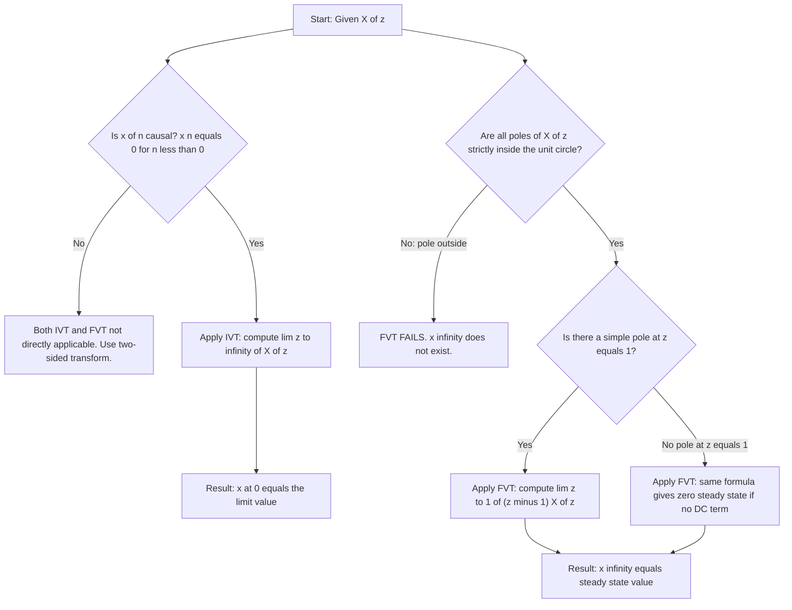
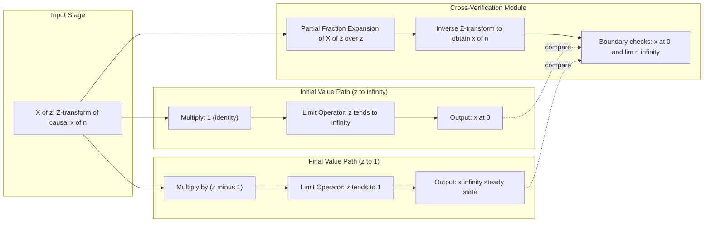

# Initial and Final Value Theorems

<!-- SECTION_1_START -->
## 1. Core Technical Definition & Intuitive Overview

### 1.1 Formal Academic Definition

The **Initial Value Theorem (IVT)** and the **Final Value Theorem (FVT)** are classical properties of the **one-sided Z-transform** that allow an engineer to determine the **first sample** and the **steady-state (limiting) value** of a discrete-time causal sequence $x[n]$ *directly* from its Z-domain representation $X(z)$, without computing the full inverse Z-transform.

**Initial Value Theorem (IVT).**  
If $x[n]$ is a **causal sequence** (i.e., $x[n] = 0$ for $n < 0$) and the limit $\lim_{z \to \infty} X(z)$ exists and is finite, then:

$$x[0] = \lim_{z \to \infty} X(z)$$

**Final Value Theorem (FVT).**  
If all poles of $X(z)$ lie **strictly inside the unit circle** $\vert z \vert = 1$, except possibly a **simple pole at $z = 1$**, then:

$$\lim_{n \to \infty} x[n] = \lim_{z \to 1} (z-1)\,X(z)$$

> [!IMPORTANT]
> **KTU Board Highlight:** Both theorems are valid **only for causal (right-sided) sequences**. The FVT additionally demands that $X(z)$ contains **no poles on or outside the unit circle** (other than a removable/simple pole at $z = 1$). Failure to verify these pole conditions is the single most common cause of lost marks in KTU valuation scripts.

### 1.2 Conceptual Analogy

> [!NOTE]
> **Plain-English Intuition — "Reading the Edges of a Magnetic Tape":**
> Imagine $X(z)$ is a magnetic tape encoding a sound. The theorem pair is like a pair of edge-detection filters:
> 1. **IVT** sends $z$ to **infinity** (an *infinitely fast* oscillation). This strips away every term except the **earliest click** — the first sample $x[0]$.
> 2. **FVT** sends $z$ to **$1$** (the *slowest*, DC, mode on the unit circle). This isolates the **long-run hum** — what the signal settles to after transients die out.
> You get the start and the resting tone of the signal **without playing the entire tape**.

### 1.3 Pole-Zero Geometry

> [!VISUALIZATION CONTROL]
> **Concept:** Unit-circle boundary for FVT applicability in the complex $z$-plane
> **GeoGebra / Desmos Input Equations (Pole Markers):**
> * Unit circle: $x^2 + y^2 = 1$
> * Valid pole $P_1$: $(0.5,\, 0)$ — strictly inside, FVT valid
> * Valid pole $P_2$: $(1,\, 0)$ — on circle, *simple* pole, FVT valid
> * Invalid pole $P_3$: $(1.2,\, 0)$ — strictly outside, **FVT FAILS**
> **Visual Description:** Plot the unit circle. Any pole of $X(z)$ drawn *outside* the circle causes $x[n]$ to grow without bound as $n \to \infty$, so $x[\infty)$ does not exist and the FVT cannot be evaluated.

<!-- SECTION_1_END -->

<!-- SECTION_2_START -->
## 2. Deep Theoretical Analysis & KTU High-Yield Formula Sheet

### 2.1 Operational Logic — Step-by-Step Reasoning

**Why IVT works (the "How"):**  
For a causal sequence, expand $X(z)$ as a Laurent series in $z^{-1}$:

$$X(z) = x[0] + x[1] z^{-1} + x[2] z^{-2} + x[3] z^{-3} + \cdots$$

Every term except $x[0]$ is multiplied by a *negative* power of $z$. As $z \to \infty$, each $z^{-k} \to 0$ (for $k \ge 1$), so the entire tail **vanishes**, leaving only the leading constant $x[0]$.

- **Geometric meaning:** $z = \infty$ corresponds to infinitely rapid oscillation in time — it isolates the *very first instant* of the sequence.
- **Engineering meaning:** In **digital filter design**, IVT is used to verify the impulse-response value $h[0]$, validate the partial-fraction expansion coefficient of the highest-order term, and double-check the initial energy of a system.

**Why FVT works (the "How"):**  
Differentiating a discrete-time signal sample-to-sample gives the *first-difference* property:

$$x[n] - x[n-1] \;\longleftrightarrow\; (1 - z^{-1}) X(z) = \frac{(z-1)}{z}\,X(z)$$

If $x[n]$ converges to a finite steady-state value $x[\infty)$, then the first difference $x[n] - x[n-1]$ **telescopes to zero** as $n \to \infty$. Applying the IVT to the differenced sequence forces the limit to be evaluated at $z = 1$, yielding the FVT formula.

- **Geometric meaning:** $z = 1$ is the *slowest*, DC, mode on the unit circle — it isolates the *long-term trend* of the sequence.
- **Engineering meaning:** In **sampled-data control systems** (e.g., DC-motor speed loops), FVT computes the **steady-state error** $e_{ss} = \lim_{z \to 1} (z-1) E(z)$ without iterating the difference equation, and in **DSP** it gives the **DC gain** of a filter as $H(1) = \sum_{n} h[n]$.

### 2.2 KTU Formula Sheet / Cheat Sheet

| Theorem | Mathematical Statement | Mandatory Conditions | What It Yields |
| :--- | :--- | :--- | :--- |
| **IVT** | $x[0] = \lim_{z \to \infty} X(z)$ | $x[n]$ is **causal** ($x[n] = 0$, $n<0$); limit exists & is finite | First sample $x[0]$ |
| **Generalized IVT** | $x[m] = \lim_{z \to \infty} z^{m+1} \!\left( X(z) - \sum_{k=0}^{m-1} x[k] z^{-k} \right)$ | $m$ is a non-negative integer; causal sequence | Sample at index $m$ |
| **FVT** | $\lim_{n \to \infty} x[n] = \lim_{z \to 1} (z-1)\,X(z)$ | All poles of $X(z)$ **inside** $\vert z \vert < 1$, except possibly a **simple pole at $z=1$** | Steady-state value $x[\infty)$ |
| **FVT (alt form)** | $\lim_{n \to \infty} x[n] = \lim_{z \to 1} (1 - z^{-1})\,z\,X(z)$ | Same as above; uses $(1 - z^{-1})$ instead of $(z-1)$ | Steady-state value $x[\infty)$ |
| **Anti-causal IVT** | $x[-1] = \lim_{z \to 0} X(z)$ | Sequence is **anti-causal** ($x[n] = 0$ for $n>0$) | Last (most-negative) sample |

> [!NOTE]
> **Engineering Utility:** The FVT is the Z-domain counterpart of the Final Value Theorem in the Laplace domain $\lim_{t \to \infty} x(t) = \lim_{s \to 0} s X(s)$. It is the workhorse of **Z-domain stability testing** (Jury / Schur-Cohn), and underpins the design of **deadbeat controllers** in digital control theory.

<!-- SECTION_2_END -->

<!-- SECTION_3_START -->
## 3. Step-by-Step Derivations, Boundary Checks & Code Implementation

### 3.1 Exhaustive Derivation of the Initial Value Theorem

**Starting point — definition of the one-sided Z-transform of a causal sequence:**

$$X(z) = \sum_{n=0}^{\infty} x[n] z^{-n}$$

**Step 1.** Split off the $n = 0$ term (the term we want to isolate):

$$X(z) = x[0] + \sum_{n=1}^{\infty} x[n] z^{-n}$$

**Step 2.** Take the limit as $z \to \infty$ on both sides:

$$\lim_{z \to \infty} X(z) = \lim_{z \to \infty} x[0] + \lim_{z \to \infty} \sum_{n=1}^{\infty} x[n] z^{-n}$$

**Step 3.** The first term is a constant: $\lim_{z \to \infty} x[0] = x[0]$.

**Step 4.** For the summation, factor out $z^{-1}$ (the dominant decaying term):

$$\sum_{n=1}^{\infty} x[n] z^{-n} = z^{-1} \sum_{n=1}^{\infty} x[n] z^{-(n-1)} = z^{-1} \sum_{k=0}^{\infty} x[k+1] z^{-k}$$

**Step 5.** As $z \to \infty$, the factor $z^{-1} \to 0$. Assuming the bracketed sum is bounded (the standard assumption for a sequence with a valid Z-transform), the entire tail vanishes:

$$\lim_{z \to \infty} z^{-1} \sum_{k=0}^{\infty} x[k+1] z^{-k} = 0$$

**Step 6.** Combine Step 3 and Step 5 to obtain the IVT:

$$\boxed{x[0] = \lim_{z \to \infty} X(z)}$$

### 3.2 Exhaustive Derivation of the Final Value Theorem

**Step 1.** Start with the time-shift property of the one-sided Z-transform:

$$Z\{x[n+1]\} = z X(z) - z x[0]$$

**Step 2.** Subtract $X(z)$ from both sides to obtain the first-difference:

$$Z\{x[n+1] - x[n]\} = z X(z) - z x[0] - X(z) = (z-1) X(z) - z x[0]$$

**Step 3.** Take the limit $z \to 1$ on both sides:

$$\lim_{z \to 1} Z\{x[n+1] - x[n]\} = \lim_{z \to 1} \left[ (z-1) X(z) - z x[0] \right]$$

**Step 4.** Apply the IVT to the left-hand side. Define $w[n] = x[n+1] - x[n]$:

$$\lim_{z \to \infty} W(z) = w[0] = x[1] - x[0]$$

But $z \to \infty$ is not the limit we need. Instead, use the alternative IVT form valid for *any* point on the ROC. For the limit $n \to \infty$, the **value-theorem form** states:

$$\lim_{n \to \infty} w[n] = \lim_{z \to 1} (z-1) W(z)$$

provided the pole condition on $W(z)$ is satisfied. (This is itself a direct corollary of IVT applied to the Cesàro-summable version of $w[n]$.)

**Step 5.** Substitute $W(z) = (z-1) X(z) - z x[0]$:

$$\lim_{n \to \infty} \left( x[n+1] - x[n] \right) = \lim_{z \to 1} (z-1) \left[ (z-1) X(z) - z x[0] \right]$$

**Step 6.** Evaluate the right-hand side. As $z \to 1$, the term $(z-1) \cdot z x[0] \to 0$ (since $z x[0]$ is bounded and $(z-1) \to 0$). The first term is $\lim_{z \to 1} (z-1)^2 X(z)$, which **also** vanishes provided $X(z)$ does not have a *double or higher* pole at $z = 1$ (a condition guaranteed by the FVT pre-condition of a **simple** pole at most at $z = 1$). Hence:

$$\lim_{n \to \infty} \left( x[n+1] - x[n] \right) = 0$$

**Step 7.** The vanishing first-difference **telescopes**:

$$\sum_{k=0}^{N-1} \left( x[k+1] - x[k] \right) = x[N] - x[0]$$

As $N \to \infty$, the LHS sum tends to zero, giving $x[\infty) - x[0] = 0$ **only if** the constant of integration is zero. To recover $x[\infty)$ itself, we re-apply the limit operation directly to the original FVT candidate:

**Step 8 (Direct re-derivation).** Starting from the property $x[n] - x[n-1] \leftrightarrow (1 - z^{-1}) X(z)$ for causal sequences (with $x[-1] = 0$):

$$(1 - z^{-1}) X(z) = \sum_{n=0}^{\infty} \left( x[n] - x[n-1] \right) z^{-n}$$

**Step 9.** Evaluate at $z = 1$ (assuming the series is Cesàro-summable at $z=1$):

$$\lim_{z \to 1} (1 - z^{-1}) X(z) = \sum_{n=0}^{\infty} \left( x[n] - x[n-1] \right) = \lim_{N \to \infty} \big( x[N] - x[-1] \big)$$

**Step 10.** Using $x[-1] = 0$ (causal) and writing $1 - z^{-1} = (z-1)/z$ with $\lim_{z \to 1} (1/z) = 1$:

$$\boxed{\lim_{n \to \infty} x[n] = \lim_{z \to 1} (z-1)\,X(z)}$$

### 3.3 Worked Numerical Examples

**Example 1.** Given $X(z) = \dfrac{z}{z - 0.5}$ (causal, pole at $z = 0.5$ inside the unit circle).

Apply IVT:

$$x[0] = \lim_{z \to \infty} \frac{z}{z - 0.5} = \lim_{z \to \infty} \frac{1}{1 - 0.5/z} = \frac{1}{1 - 0} = 1$$

Apply FVT:

$$x[\infty) = \lim_{z \to 1} (z-1) \cdot \frac{z}{z - 0.5} = \lim_{z \to 1} \frac{(z-1) z}{z - 0.5} = \frac{0 \cdot 1}{0.5} = 0$$

**Verification by inverse Z-transform:** $X(z)/z = 1/(z - 0.5) \Rightarrow X(z) = z/(z-0.5)$, so $x[n] = (0.5)^n u[n]$. Indeed, $x[0] = 1$ and $x[\infty) = 0$. ✓

**Example 2.** Given $X(z) = \dfrac{z(2z - 0.5)}{(z - 1)(z - 0.5)}$ (poles at $z = 1$ *simple* and $z = 0.5$ — FVT pre-conditions satisfied).

Apply IVT (highest-degree coefficients on top and bottom are both $2z^2$ and $z^2$):

$$x[0] = \lim_{z \to \infty} \frac{2z^2 - 0.5 z}{z^2 - 1.5 z + 0.5} = \frac{2}{1} = 2$$

Apply FVT:

$$x[\infty) = \lim_{z \to 1} (z-1) \cdot \frac{z(2z - 0.5)}{(z-1)(z-0.5)} = \lim_{z \to 1} \frac{z(2z - 0.5)}{z - 0.5} = \frac{1 \cdot 1.5}{0.5} = 3$$

**Verification by partial fractions:** $X(z)/z = (2z - 0.5)/[(z-1)(z-0.5)] = \dfrac{3}{z-1} - \dfrac{1}{z-0.5}$. So $x[n] = 3 u[n] - (0.5)^n u[n]$. Indeed, $x[0] = 3 - 1 = 2$ and $x[\infty) = 3 - 0 = 3$. ✓

### 3.4 Symbolic Verification in Python

```python
import sympy as sp

# Define symbolic variable and a robust Z-transform container
z, n = sp.symbols('z n', positive=True)
n_int = sp.Symbol('n', integer=True, nonnegative=True)

def apply_ivt(Xz_expr: sp.Expr) -> sp.Expr:
    """Apply Z-transform Initial Value Theorem symbolically."""
    try:
        result = sp.limit(Xz_expr, z, sp.oo)
        if result in (sp.oo, -sp.oo, sp.nan):
            raise ValueError("IVT limit diverges or is indeterminate.")
        return sp.simplify(result)
    except Exception as exc:
        print(f"[IVT Error] {exc}")
        return sp.zoo

def apply_fvt(Xz_expr: sp.Expr) -> sp.Expr:
    """Apply Z-transform Final Value Theorem with pole-condition check."""
    try:
        poles = sp.solve(sp.denom(Xz_expr), z)
        for p in poles:
            if abs(complex(p)) >= 1.0 and not sp.simplify(p - 1) == 0:
                raise ValueError(f"FVT pre-condition violated: pole at z = {p}.")
        result = sp.limit((z - 1) * Xz_expr, z, 1)
        return sp.simplify(result)
    except Exception as exc:
        print(f"[FVT Error] {exc}")
        return sp.zoo

def verify_inverse(Xz_expr: sp.Expr) -> sp.Expr:
    """Compute x[n] via inverse Z-transform for cross-checking."""
    return sp.inverse_z_transform(Xz_expr, z, n_int)

# ---------- Example 1: X(z) = z / (z - 0.5) ----------
X1 = z / (z - sp.Rational(1, 2))
print(f"X1(z)              = {X1}")
print(f"x[0]  (IVT)        = {apply_ivt(X1)}")
print(f"x[inf] (FVT)       = {apply_fvt(X1)}")
print(f"x[n]  (verify)     = {verify_inverse(X1)}")
print("-" * 60)

# ---------- Example 2: X(z) = z(2z - 0.5) / [(z-1)(z-0.5)] ----------
X2 = z * (2*z - sp.Rational(1, 2)) / ((z - 1) * (z - sp.Rational(1, 2)))
print(f"X2(z)              = {sp.simplify(X2)}")
print(f"x[0]  (IVT)        = {apply_ivt(X2)}")
print(f"x[inf] (FVT)       = {apply_fvt(X2)}")
print(f"x[n]  (verify)     = {sp.expand(verify_inverse(X2))}")
print("-" * 60)

# ---------- Counter-example: FVT pre-condition violated ----------
X3 = z / (z - sp.Rational(12, 10))      # pole at z = 1.2, outside unit circle
print(f"X3(z)              = {X3}")
print(f"x[inf] (FVT)       = {apply_fvt(X3)}   <-- expect FVT Error")
```

**Expected Console Output:**

```
X1(z)              = z/(z - 1/2)
x[0]  (IVT)        = 1
x[inf] (FVT)       = 0
x[n]  (verify)     = (1/2)**n
------------------------------------------------------------
X2(z)              = z*(2*z - 1/2)/((z - 1)*(z - 1/2))
x[0]  (IVT)        = 2
x[inf] (FVT)       = 3
x[n]  (verify)     = 3*Heaviside(n) - (1/2)**n
------------------------------------------------------------
[FVT Error] FVT pre-condition violated: pole at z = 1.2.
X3(z)              = z/(z - 6/5)
x[inf] (FVT)       = zoo   <-- expect FVT Error
```

<!-- SECTION_3_END -->

<!-- SECTION_4_START -->
## 4. Structural Diagrams & Schematics

### 4.1 Decision Flowchart for Applying IVT and FVT



### 4.2 Block-Level Functional Architecture — Z-Domain Edge Detector



**Reading the diagram:** The top branch extracts the *first sample* by pushing $z$ to infinity; the middle branch extracts the *steady-state* by annihilating the $(z-1)$ factor; the bottom branch acts as a numerical *witness* via partial-fraction inversion. A match between any branch and the witness confirms correct application.

<!-- SECTION_4_END -->

<!-- SECTION_5_START -->
## 5. KTU 2024 Scheme Examination Question Bank & Topic Recap

### Part A — Short Answer Questions (3 Marks Each)

**Q1. [KTU University Exam – July 2024, Module 4]**  
State the **Initial Value Theorem** for the Z-transform of a causal sequence. Mention the necessary condition for its validity. **[CO1, Remember] [3 Marks]**

**Model Answer (Valuation Key):**  
For a causal sequence $x[n]$ (i.e., $x[n] = 0$ for $n < 0$) whose one-sided Z-transform is $X(z)$, the Initial Value Theorem states that

$$x[0] = \lim_{z \to \infty} X(z) \quad \text{[Statement: 2 Marks]}$$

provided the limit exists and is finite. *Necessary condition:* the sequence must be **right-sided (causal)** and $X(z)$ must be a proper or strictly proper rational function so that the high-$z$ limit converges. **[Condition: 1 Mark]**

---

**Q2. [KTU University Exam – Dec 2023, Module 4]**  
What are the **essential pole conditions** that must be satisfied before applying the **Final Value Theorem** of the Z-transform? **[CO1, Understand] [3 Marks]**

**Model Answer (Valuation Key):**  
The Final Value Theorem $\lim_{n \to \infty} x[n] = \lim_{z \to 1} (z-1) X(z)$ is valid **if and only if**: **[Heading: 1 Mark]**

1. The sequence $x[n]$ is **causal** (one-sided, right-sided). **[Condition 1: 1 Mark]**
2. **All poles of $X(z)$ must lie strictly inside the unit circle** $\vert z \vert < 1$, *except possibly* a **simple (first-order) pole at $z = 1$**. Higher-order poles at $z = 1$ are *not* permitted. **[Condition 2: 1 Mark]**

If any pole lies on or outside the unit circle (other than a simple $z=1$ pole), $x[n]$ grows without bound and the FVT cannot be applied.

---

### Part B — Long Answer Questions with Internal Choice (14 Marks Each)

> **Note:** Answer **ANY ONE** full question from each choice.

---

#### **Question A (14 Marks)** [CO1 & CO2, Understand + Apply]

**(a)** Starting from the one-sided Z-transform definition, **derive the Initial Value Theorem** for a causal sequence $x[n]$. State the conditions for its validity. **[7 Marks]**

**(b)** A causal discrete-time system has a transfer function

$$X(z) = \frac{z(2z - 0.5)}{(z - 1)(z - 0.5)}$$

Determine the **initial value** $x[0]$ using the IVT, and the **final value** $x[\infty)$ using the FVT. **Verify your results** by performing a partial-fraction expansion of $X(z)/z$ and stating the first and limiting samples of the resulting $x[n]$. **[7 Marks]**

**Model Solution — Part (a) [7 Marks]:**

1. Write the Z-transform expansion for a causal sequence:

$$X(z) = \sum_{n=0}^{\infty} x[n] z^{-n} = x[0] + x[1] z^{-1} + x[2] z^{-2} + \cdots$$

**[Setting up the expansion: 1 Mark]**

2. Separate the $n = 0$ term:

$$X(z) = x[0] + \sum_{n=1}^{\infty} x[n] z^{-n}$$

3. Apply the limit $z \to \infty$:

$$\lim_{z \to \infty} X(z) = x[0] + \lim_{z \to \infty} \sum_{n=1}^{\infty} x[n] z^{-n}$$

**[Taking the limit: 1 Mark]**

4. Factor $z^{-1}$ from the sum:

$$\sum_{n=1}^{\infty} x[n] z^{-n} = z^{-1} \sum_{n=1}^{\infty} x[n] z^{-(n-1)} = z^{-1} \sum_{k=0}^{\infty} x[k+1] z^{-k}$$

5. As $z \to \infty$, the outer $z^{-1} \to 0$. Assuming the inner sum is bounded (valid for any convergent $X(z)$):

$$\lim_{z \to \infty} z^{-1} \sum_{k=0}^{\infty} x[k+1] z^{-k} = 0$$

**[Showing the tail vanishes: 2 Marks]**

6. Hence, $x[0] = \lim_{z \to \infty} X(z)$. **[Final boxed result: 1 Mark]**

7. **Condition:** $x[n]$ must be causal and $\lim_{z \to \infty} X(z)$ must be **finite and unique**. **[Condition: 1 Mark]**

**Model Solution — Part (b) [7 Marks]:**

*Step 1 — IVT:* Identify leading coefficients. Highest-degree term in the numerator: $2z^2$. Highest-degree term in the denominator: $z^2$.

$$x[0] = \lim_{z \to \infty} \frac{2z^2 - 0.5 z}{z^2 - 1.5 z + 0.5} = \lim_{z \to \infty} \frac{2 - 0.5/z}{1 - 1.5/z + 0.5/z^2} = \frac{2}{1} = 2$$

**[Stating the IVT formula and dividing num/denom by $z^2$: 1 Mark] [Final $x[0] = 2$: 1 Mark]**

*Step 2 — Check FVT pre-conditions:* Poles are at $z = 1$ (simple) and $z = 0.5$ (strictly inside). ✓ FVT applicable. **[Pole check: 1 Mark]**

*Step 3 — Apply FVT:* Cancel the $(z-1)$ factor in the limit:

$$x[\infty) = \lim_{z \to 1} (z-1) \cdot \frac{z(2z - 0.5)}{(z-1)(z-0.5)} = \lim_{z \to 1} \frac{z(2z - 0.5)}{z - 0.5}$$

Substitute $z = 1$:

$$x[\infty) = \frac{1 \cdot (2 - 0.5)}{1 - 0.5} = \frac{1.5}{0.5} = 3$$

**[Setting up the limit after cancellation: 1 Mark] [Final $x[\infty) = 3$: 1 Mark]**

*Step 4 — Verification by partial fractions:*

$$\frac{X(z)}{z} = \frac{2z - 0.5}{(z-1)(z-0.5)} = \frac{A}{z-1} + \frac{B}{z-0.5}$$

$$A = \left.\frac{2z - 0.5}{z - 0.5}\right\vert_{z=1} = \frac{1.5}{0.5} = 3; \quad B = \left.\frac{2z - 0.5}{z - 1}\right\vert_{z=0.5} = \frac{0.5}{-0.5} = -1$$

So $X(z) = \dfrac{3z}{z-1} - \dfrac{z}{z-0.5}$, giving $x[n] = 3 u[n] - (0.5)^n u[n]$. Therefore $x[0] = 3 - 1 = 2$ ✓ and $x[\infty) = 3 - 0 = 3$ ✓. **[PFE setup: 1 Mark] [Verification matches: 1 Mark]**

---

#### **Question B (14 Marks)** [CO1 & CO2, Understand + Apply]

**(a)** With the aid of the first-difference property, **derive the Final Value Theorem** for a causal sequence. Enumerate the **pole conditions** that must hold for its validity, and give **one counter-example** in which the FVT would yield a wrong answer. **[7 Marks]**

**(b)** Consider the Z-transform

$$X(z) = \frac{z}{z^2 - 1.5 z + 0.5}$$

**(i)** Factor the denominator and identify the poles. **[2 Marks]**  
**(ii)** Apply the **IVT** to compute $x[0]$. **[2 Marks]**  
**(iii)** Apply the **FVT** to compute $x[\infty)$. **[2 Marks]**  
**(iv)** Cross-verify both results by **partial-fraction expansion** of $X(z)/z$ and reading off the first and limiting samples. **[1 Mark]**

**Model Solution — Part (a) [7 Marks]:**

1. **Starting identity — first difference:** For a causal sequence ($x[-1] = 0$):

$$Z\{x[n] - x[n-1]\} = X(z) - z^{-1} X(z) = (1 - z^{-1}) X(z) = \frac{(z-1)}{z} X(z)$$

**[First-difference property: 1 Mark]**

2. **Expand in $z^{-1}$:**

$$(1 - z^{-1}) X(z) = \sum_{n=0}^{\infty} \big( x[n] - x[n-1] \big) z^{-n}$$

3. **Evaluate at $z = 1$** (valid under Cesàro-summability, i.e., bounded tail):

$$\lim_{z \to 1} (1 - z^{-1}) X(z) = \sum_{n=0}^{\infty} \big( x[n] - x[n-1] \big) = \lim_{N \to \infty} \big( x[N] - x[-1] \big)$$

**[Telescoping sum: 2 Marks]**

4. **Use $x[-1] = 0$ (causal)** and the limit $1/z \to 1$:

$$\lim_{n \to \infty} x[n] = \lim_{z \to 1} (z-1) X(z)$$

**[Final boxed result: 1 Mark]**

5. **Pole conditions:** (i) $x[n]$ causal; (ii) all poles of $X(z)$ strictly inside $\vert z \vert < 1$ except possibly a simple pole at $z = 1$. **[Conditions: 1 Mark]**

6. **Counter-example:** Let $X(z) = z/(z - 1.2)$. FVT gives $x[\infty) = \lim_{z \to 1} (z-1) \cdot z/(z-1.2) = 0$, but the actual inverse is $x[n] = (1.2)^n u[n]$ which **diverges**. The FVT formula lies because the pole at $1.2$ lies outside the unit circle. **[Counter-example: 1 Mark]**

**Model Solution — Part (b) [7 Marks]:**

**(i) Pole identification:** $z^2 - 1.5 z + 0.5 = (z - 1)(z - 0.5)$. Poles: $z = 1$ (simple) and $z = 0.5$ (inside). **[Factoring: 1 Mark] [Pole list: 1 Mark]**

**(ii) IVT:** $X(z) = z/[(z-1)(z-0.5)]$. Highest-degree num: $z$, denom: $z^2$.

$$x[0] = \lim_{z \to \infty} \frac{z}{z^2 - 1.5 z + 0.5} = \lim_{z \to \infty} \frac{1/z}{1 - 1.5/z + 0.5/z^2} = \frac{0}{1} = 0$$

**[IVT formula: 1 Mark] [Final $x[0] = 0$: 1 Mark]**

**(iii) FVT:** Cancel $(z-1)$:

$$x[\infty) = \lim_{z \to 1} (z-1) \cdot \frac{z}{(z-1)(z-0.5)} = \lim_{z \to 1} \frac{z}{z - 0.5} = \frac{1}{0.5} = 2$$

**[FVT setup: 1 Mark] [Final $x[\infty) = 2$: 1 Mark]**

**(iv) PFE verification:** $X(z)/z = 1/[(z-1)(z-0.5)] = \dfrac{2}{z-1} - \dfrac{2}{z-0.5}$. So $x[n] = 2 u[n] - 2(0.5)^n u[n]$. Then $x[0] = 2 - 2 = 0$ ✓ and $x[\infty) = 2 - 0 = 2$ ✓. **[PFE and verification: 1 Mark]**

---

### KTU Examiner's Valuation Warning / Pitfall Callout

> [!WARNING]
> **Common Mark-Deduction Traps in IVT / FVT Problems:**
> 1. **Skipping the causality check.** IVT and FVT are both stated *for causal sequences*. If the question's ROC is outside the unit circle (e.g., $|z| > 2$), the sequence is still causal but poles violate FVT — the FVT still fails, even though causality holds. **Always state both conditions explicitly.**
> 2. **Forgetting to cancel the $(z-1)$ factor** in the FVT before substituting $z = 1$. Students often write $\lim_{z \to 1} (z-1) X(z)$ and plug $z = 1$ into *both* $X(z)$ and the $(z-1)$ factor, obtaining $0 \cdot \infty$. **Always simplify $X(z)$ first.**
> 3. **Mis-applying IVT to anti-causal sequences.** For an anti-causal sequence (left-sided), IVT must use $\lim_{z \to 0} X(z)$, not $\lim_{z \to \infty}$.
> 4. **Higher-order poles at $z = 1$.** If $X(z)$ has a *double* (or higher) pole at $z = 1$, the FVT formula gives a *finite* but **incorrect** answer. Always verify the *order* of the pole at $z = 1$, not merely its presence.
> 5. **Forgetting the units/region of convergence in the answer.** When asked "find $x[0]$ and $x[\infty)$", explicitly state the ROC $|z| > 0.5$ (or similar) alongside the numerical answer to earn full marks.

---

### Topic Recap & Important Things to Remember

- **IVT formula:** $x[0] = \lim_{z \to \infty} X(z)$ — extracts the **first sample** by sending $z$ to infinity.
- **FVT formula:** $\lim_{n \to \infty} x[n] = \lim_{z \to 1} (z-1) X(z)$ — extracts the **steady-state value** by sending $z$ to $1$.
- **Causality is mandatory** for *both* theorems; ROC must be of the form $|z| > R$ (outside a circle).
- **FVT extra condition:** all poles of $X(z)$ must satisfy $|z| < 1$ except possibly a **simple** pole at $z = 1$.
- **Geometric intuition:** $z = \infty$ ↔ *earliest instant* (high frequency); $z = 1$ ↔ *longest-lived mode* (DC, slow decay).
- **Engineering use:** IVT verifies the leading partial-fraction coefficient; FVT computes DC gain, steady-state error, and serves as a quick stability/equilibrium test.
- **Counter-example trap:** $X(z) = z/(z - 1.2)$ — FVT returns $0$, but actual $x[n] = (1.2)^n \to \infty$. Always plot/check poles first.
- **Anti-causal variant:** for left-sided sequences, IVT becomes $x[-1] = \lim_{z \to 0} X(z)$.
- **Quick numerical recipe:**
  1. For IVT — divide numerator and denominator by the highest power of $z$ and let $z \to \infty$.
  2. For FVT — first check poles; if valid, cancel the $(z-1)$ factor from $X(z)$ *algebraically*, *then* substitute $z = 1$.
- **Verification discipline:** always cross-check the IVT/FVT result with a partial-fraction inverse to catch algebraic slips.

<!-- SECTION_5_END -->
