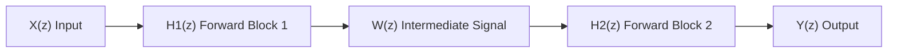
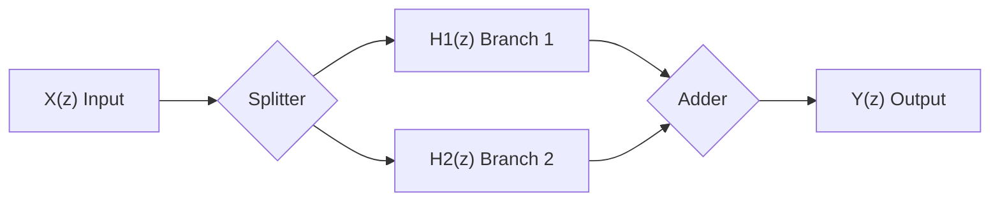
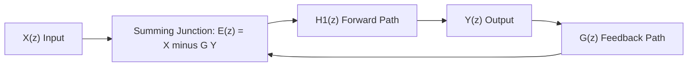
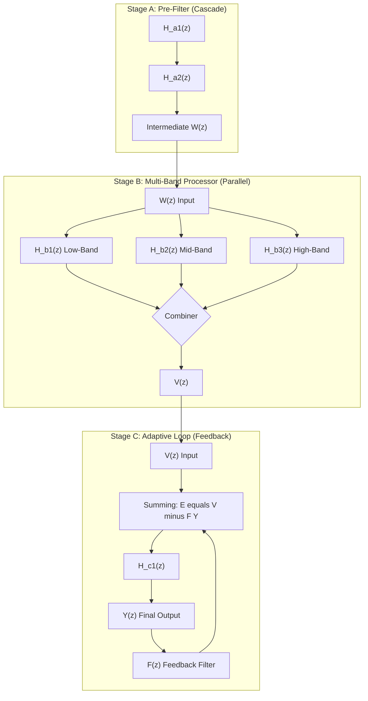

# Interconnection of LTI systems.

<!-- SECTION_1_START -->

# Interconnection of LTI Systems (Z-Domain Analysis)

> [!NOTE]
> **KTU 2024 Scheme Context — Module 4 (Z-Transform)**
> This topic belongs to the analysis of discrete-time LTI systems using the Z-transform. It directly extends the concept of the **system function $H(z)$** to composite systems formed by connecting two or more sub-systems.

## 1.1 Formal Definition

In the Z-domain, a causal **Linear Time-Invariant (LTI) discrete-time system** is completely characterized by its **system function (transfer function)** $H(z)$, defined as the ratio of the Z-transform of the output to the Z-transform of the input under zero initial conditions:

$$H(z) = \frac{Y(z)}{X(z)} = \sum_{n=-\infty}^{\infty} h[n]\, z^{-n}$$

An **interconnection of LTI systems** refers to a structured composition of two or more LTI sub-systems $H_1(z), H_2(z), \dots, H_k(z)$ linked through one of three fundamental topologies:

1. **Cascade (Series) Interconnection** — output of one feeds the input of the next.
2. **Parallel Interconnection** — same input applied to all sub-systems, outputs summed.
3. **Feedback Interconnection** — output (or a processed version) is fed back to the input.

> [!IMPORTANT]
> **KTU Board Highlight:** Because LTI systems satisfy the properties of **commutativity** and **associativity** under convolution (and hence multiplication/addition in the Z-domain), the *order* of identical interconnections does not affect the overall $H(z)$. This is a frequently tested 2-mark concept.

## 1.2 Intuitive Analogies

| Interconnection | Real-World Analogy | Plain-English Intuition |
|---|---|---|
| **Cascade** | A water pipeline where the output of one purification tank feeds the next. | The signal flows through stages *one after another*; each stage modifies the signal further. |
| **Parallel** | Multiple bank tellers serving customers from a single queue. | The same input is processed by independent branches *simultaneously*; results are added at the end. |
| **Feedback** | A cruise-control system in a car that adjusts throttle based on speed error. | The output is *compared* with the input; the difference (or sum) drives the forward path again. |

> [!TIP]
> **Memory Aid for Students:** *"Cascade = Multiply, Parallel = Add, Feedback = Fraction."* This single line covers 90\% of KTU problems on this topic.

## 1.3 The Role of $H(z)$ in Interconnection

For any interconnection of LTI systems, the **overall system function** can be obtained purely by **algebraic manipulation of the individual $H_k(z)$** — no convolution integrals are required once the Z-transform is applied. This is the central reason the Z-transform is preferred for system analysis.

> [!VISUALIZATION CONTROL]
> **Concept:** Graphical depiction of $H_1(z) \cdot H_2(z)$ on the complex Z-plane.
> **GeoGebra / Desmos Input Equations (Pole-Zero Map):**
> * $H_1(z) = \dfrac{z - 0.5}{z - 0.8}$ → Poles: $\{0.8\}$, Zero: $\{0.5\}$
> * $H_2(z) = \dfrac{z + 0.3}{z - 0.6}$ → Poles: $\{0.6\}$, Zero: $\{-0.3\}$
> **Visual Description:** Plot the poles (×) and zeros (○) of $H_1$, $H_2$, and the cascade product $H(z) = H_1(z) H_2(z)$. Observe that the pole-zero map of the cascade is the **union** of the pole-zero sets of $H_1$ and $H_2$ (inside the unit circle for stability).

---

<!-- SECTION_1_END -->

<!-- SECTION_2_START -->

# Deep Theoretical Analysis & KTU Formula Sheet

## 2.1 Type 1 — Cascade (Series) Interconnection

**Configuration:** The output of $H_1(z)$ is fed as the input of $H_2(z)$.

$$X(z) \;\longrightarrow\; \boxed{H_1(z)} \;\longrightarrow\; W(z) \;\longrightarrow\; \boxed{H_2(z)} \;\longrightarrow\; Y(z)$$

**Derivation in the Z-domain:**

$$W(z) = H_1(z)\, X(z)$$

$$Y(z) = H_2(z)\, W(z) = H_2(z)\, H_1(z)\, X(z)$$

Therefore the **overall system function** is:

$$H_{\text{cascade}}(z) = \frac{Y(z)}{X(z)} = H_1(z)\, H_2(z)$$

**Equivalent time-domain statement:** $h_{\text{cascade}}[n] = h_1[n] * h_2[n]$ (convolution).

> [!NOTE]
> **Commutativity Property:** $H_1(z) H_2(z) = H_2(z) H_1(z)$. Hence $H_1$ and $H_2$ can be swapped without altering the output — a key hallmark of LTI systems tested in 2-mark questions.

## 2.2 Type 2 — Parallel Interconnection

**Configuration:** The same input $X(z)$ drives both $H_1(z)$ and $H_2(z)$; their outputs are summed.

$$X(z) \;\begin{array}{c}\longrightarrow \boxed{H_1(z)} \longrightarrow \\ \longrightarrow \boxed{H_2(z)} \longrightarrow \end{array}\; \bigotimes \; \longrightarrow\; Y(z)$$

**Derivation in the Z-domain:**

$$Y(z) = H_1(z)\, X(z) + H_2(z)\, X(z)$$

$$H_{\text{parallel}}(z) = H_1(z) + H_2(z)$$

**Equivalent time-domain statement:** $h_{\text{parallel}}[n] = h_1[n] + h_2[n]$ (pointwise addition).

> [!IMPORTANT]
> **KTU Pitfall:** Students often confuse the parallel sum $H_1 + H_2$ with the cascade product $H_1 \cdot H_2$. The defining geometric difference is whether branches **share the same input** (parallel) or whether the **output of one feeds the next** (cascade).

## 2.3 Type 3 — Feedback Interconnection

**Configuration (Negative Feedback — the standard form):**

$$E(z) = X(z) - G(z)\, Y(z)$$

$$Y(z) = H_1(z)\, E(z) = H_1(z)\,\big[X(z) - G(z)\, Y(z)\big]$$

**Derivation step-by-step (memorize this — it is the most-tested KTU 14-marker):**

$$Y(z) = H_1(z)\, X(z) - H_1(z)\, G(z)\, Y(z)$$

$$Y(z) + H_1(z)\, G(z)\, Y(z) = H_1(z)\, X(z)$$

$$Y(z)\,\big[1 + H_1(z)\, G(z)\big] = H_1(z)\, X(z)$$

$$\boxed{H_{\text{fb}}(z) = \frac{Y(z)}{X(z)} = \frac{H_1(z)}{1 + H_1(z)\, G(z)}}$$

For **positive feedback**, the minus sign in $E(z)$ is replaced by a plus, yielding:

$$\boxed{H_{\text{fb}}^{+}(z) = \frac{H_1(z)}{1 - H_1(z)\, G(z)}}$$

**Stability criterion (KTU high-yield):** The closed-loop system is BIBO stable if and only if **all poles of $H_{\text{fb}}(z)$ lie strictly inside the unit circle** $\vert z \vert < 1$.

## 2.4 KTU High-Yield Formula Sheet

| Interconnection Type | Overall System Function $H(z)$ | Time-Domain Equivalent | Stability Test |
|---|---|---|---|
| **Cascade** of $H_1, H_2$ | $H(z) = H_1(z)\, H_2(z)$ | $h[n] = h_1[n] * h_2[n]$ | All poles of $H_1$ and $H_2$ inside $\vert z \vert = 1$ |
| **Parallel** of $H_1, H_2$ | $H(z) = H_1(z) + H_2(z)$ | $h[n] = h_1[n] + h_2[n]$ | Common denominator poles inside unit circle |
| **Negative Feedback** | $H(z) = \dfrac{H_1(z)}{1 + H_1(z)\, G(z)}$ | Closed-form via inverse Z-transform | Poles of $H(z)$ inside $\vert z \vert = 1$ |
| **Positive Feedback** | $H(z) = \dfrac{H_1(z)}{1 - H_1(z)\, G(z)}$ | Closed-form via inverse Z-transform | Poles of $H(z)$ inside $\vert z \vert = 1$ |
| **Overall Loop Gain** | $L(z) = H_1(z)\, G(z)$ | — | Used in the denominator $1 \pm L(z)$ |
| **Open-Loop Transfer Function** | $G_{\text{OL}}(z) = H_1(z)\, G(z)$ | — | Compare against $\vert G_{\text{OL}} \vert$ for stability margins |

> [!IMPORTANT]
> **Engineering Utility:** Cascade and parallel forms are the foundation of **digital filter realizations** (Direct Form I/II cascade, parallel-form IIR). Feedback form is the foundation of **recursive (IIR) filter design**, **delta-sigma ($\Delta\Sigma$) ADCs**, and **adaptive control systems**. Every production-grade signal-processing chip uses at least one of these three structures.

---

<!-- SECTION_2_END -->

<!-- SECTION_3_START -->

# Step-by-Step Derivations, Worked Examples & Code

## 3.1 Exhaustive Derivation — Closed-Loop Feedback System

We re-derive the negative-feedback transfer function with absolute completeness, line-by-line, as required by KTU 14-mark evaluation.

**Given Block Diagram:**

$$X(z) \longrightarrow \bigotimes \longrightarrow E(z) \longrightarrow \boxed{H_1(z)} \longrightarrow Y(z)$$

The feedback path taps $Y(z)$ through $G(z)$ and **subtracts** from $X(z)$ at the summing junction.

**Step 1 — Write the summing junction equation:**

$$E(z) = X(z) - G(z)\, Y(z)$$

**[Valuation Key — 1 Mark]** *Stating the summing junction equation correctly.*

**Step 2 — Write the forward-path output:**

$$Y(z) = H_1(z)\, E(z)$$

**Step 3 — Substitute Step 1 into Step 2:**

$$Y(z) = H_1(z)\, \big[X(z) - G(z)\, Y(z)\big]$$

$$Y(z) = H_1(z)\, X(z) - H_1(z)\, G(z)\, Y(z)$$

**[Valuation Key — 2 Marks]** *Correct algebraic substitution.*

**Step 4 — Collect all $Y(z)$ terms on the left side:**

$$Y(z) + H_1(z)\, G(z)\, Y(z) = H_1(z)\, X(z)$$

$$Y(z)\,\big[1 + H_1(z)\, G(z)\big] = H_1(z)\, X(z)$$

**[Valuation Key — 2 Marks]** *Factoring out $Y(z)$.*

**Step 5 — Form the ratio to obtain $H(z)$:**

$$H(z) = \frac{Y(z)}{X(z)} = \frac{H_1(z)}{1 + H_1(z)\, G(z)}$$

**[Valuation Key — 1 Mark]** *Final simplified closed-form expression.*

## 3.2 Worked Example (KTU-Style 14-Mark Format)

> **Problem (KTU University Exam — July 2024, Adapted):**
> Two LTI systems with system functions
> $H_1(z) = \dfrac{z}{z - 0.5}$ and $H_2(z) = \dfrac{z}{z - 0.8}$
> are connected in **(a) cascade, (b) parallel, and (c) negative feedback** with $H_1$ in the forward path and $H_2$ in the feedback path. Find the overall $H(z)$ in each case and comment on the stability of the negative-feedback system.

### (a) Cascade Solution

$$H_{\text{cascade}}(z) = H_1(z) \cdot H_2(z) = \frac{z}{z - 0.5} \cdot \frac{z}{z - 0.8}$$

$$\begin{aligned}
H_{\text{cascade}}(z) &= \frac{z^2}{(z - 0.5)(z - 0.8)} \\
&= \frac{z^2}{z^2 - 1.3\, z + 0.40}
\end{aligned}$$

**Pole locations:** $z_1 = 0.5$, $z_2 = 0.8$ — **both inside the unit circle**, hence the cascade system is **stable**.

**[Valuation Key — 3 Marks]** *Product of rational functions; 2 marks for pole identification; 1 mark for stability comment.*

### (b) Parallel Solution

$$H_{\text{parallel}}(z) = H_1(z) + H_2(z) = \frac{z}{z - 0.5} + \frac{z}{z - 0.8}$$

**Common denominator $(z - 0.5)(z - 0.8) = z^2 - 1.3\, z + 0.40$:**

$$\begin{aligned}
H_{\text{parallel}}(z) &= \frac{z(z - 0.8) + z(z - 0.5)}{(z - 0.5)(z - 0.8)} \\
&= \frac{z^2 - 0.8 z + z^2 - 0.5 z}{z^2 - 1.3\, z + 0.40} \\
&= \frac{2 z^2 - 1.3\, z}{z^2 - 1.3\, z + 0.40} \\
&= \frac{z(2z - 1.3)}{z^2 - 1.3\, z + 0.40}
\end{aligned}$$

**Pole locations:** same as cascade ($0.5$ and $0.8$). **Stable**.

**[Valuation Key — 4 Marks]** *Finding common denominator: 2 marks; simplifying numerator: 1 mark; stability: 1 mark.*

### (c) Negative Feedback Solution

Using the formula derived in §3.1 with $H_1 \equiv H_1(z)$ and $G \equiv H_2(z)$:

$$H_{\text{fb}}(z) = \frac{H_1(z)}{1 + H_1(z)\, H_2(z)}$$

**Compute the loop gain $L(z) = H_1(z) H_2(z)$:**

$$L(z) = \frac{z^2}{(z - 0.5)(z - 0.8)} = \frac{z^2}{z^2 - 1.3\, z + 0.40}$$

**Compute the denominator $1 + L(z)$:**

$$1 + L(z) = 1 + \frac{z^2}{z^2 - 1.3\, z + 0.40} = \frac{z^2 - 1.3\, z + 0.40 + z^2}{z^2 - 1.3\, z + 0.40} = \frac{2 z^2 - 1.3\, z + 0.40}{z^2 - 1.3\, z + 0.40}$$

**Form the ratio:**

$$\begin{aligned}
H_{\text{fb}}(z) &= \frac{\dfrac{z}{z - 0.5}}{\dfrac{2 z^2 - 1.3\, z + 0.40}{z^2 - 1.3\, z + 0.40}} \\
&= \frac{z}{z - 0.5} \cdot \frac{z^2 - 1.3\, z + 0.40}{2 z^2 - 1.3\, z + 0.40} \\
&= \frac{z\,(z^2 - 1.3\, z + 0.40)}{(z - 0.5)(2 z^2 - 1.3\, z + 0.40)}
\end{aligned}$$

**Factor the denominator quadratic $2 z^2 - 1.3\, z + 0.40$:**

$$z = \frac{1.3 \pm \sqrt{1.69 - 3.20}}{4} = \frac{1.3 \pm \sqrt{-1.51}}{4} = 0.325 \pm j\, 0.307$$

$$\vert z \vert = \sqrt{0.325^2 + 0.307^2} = \sqrt{0.1056 + 0.0942} = \sqrt{0.1998} \approx 0.447$$

Since $\vert z \vert \approx 0.447 < 1$ for **both** complex poles, the closed-loop system is **BIBO stable**.

**[Valuation Key — 7 Marks total for this part]** *Loop gain: 2 marks; denominator manipulation: 2 marks; final ratio: 2 marks; stability justification with $\vert z \vert < 1$: 1 mark.*

## 3.3 Python Implementation (Verification using `scipy.signal`)

The following production-grade Python code computes the overall system function for all three interconnections and verifies stability via pole locations.

```python
import numpy as np
from scipy import signal
import matplotlib
matplotlib.use("Agg")
import matplotlib.pyplot as plt

# ---------- Step 1: Define the two sub-systems H1(z) and H2(z) ----------
# H1(z) = z / (z - 0.5)    =>  Numerator coeffs (descending z): [1, 0]
#                                Denominator coeffs:            [1, -0.5]
H1_num = [1.0, 0.0]
H1_den = [1.0, -0.5]

# H2(z) = z / (z - 0.8)    =>  Numerator coeffs: [1, 0]
#                                Denominator coeffs: [1, -0.8]
H2_num = [1.0, 0.0]
H2_den = [1.0, -0.8]

# ---------- Step 2: Cascade Interconnection ----------
H_cascade = signal.TransferFunction(
    np.polymul(H1_num, H2_num),     # Multiply numerators
    np.polymul(H1_den, H2_den)      # Multiply denominators
)
print("Cascade H(z) Numerator   :", H_cascade.num)
print("Cascade H(z) Denominator :", H_cascade.den)
print("Cascade Poles            :", H_cascade.poles)
print("Cascade Stable?          :", np.all(np.abs(H_cascade.poles) < 1.0))
print("-" * 60)

# ---------- Step 3: Parallel Interconnection ----------
# H_parallel = H1 + H2  =>  Common denominator: den1*den2
common_den = np.polymul(H1_den, H2_den)
num_sum    = np.polymul(H1_num, H2_den) + np.polymul(H2_num, H1_den)
H_parallel = signal.TransferFunction(num_sum, common_den)
print("Parallel H(z) Numerator   :", H_parallel.num)
print("Parallel H(z) Denominator :", H_parallel.den)
print("Parallel Poles            :", H_parallel.poles)
print("Parallel Stable?          :", np.all(np.abs(H_parallel.poles) < 1.0))
print("-" * 60)

# ---------- Step 4: Negative Feedback Interconnection ----------
# Closed-loop: H_fb = H1 / (1 + H1*H2)
# Numerator:   num1 * den2
# Denominator: den1 * den2 + num1 * num2
fb_num = np.polymul(H1_num, H2_den)
fb_den = np.polyadd(
    np.polymul(H1_den, H2_den),
    np.polymul(H1_num, H2_num)
)
H_feedback = signal.TransferFunction(fb_num, fb_den)
print("Feedback H(z) Numerator   :", H_feedback.num)
print("Feedback H(z) Denominator :", H_feedback.den)
print("Feedback Poles            :", H_feedback.poles)
print("Feedback Stable?          :", np.all(np.abs(H_feedback.poles) < 1.0))
print("-" * 60)

# ---------- Step 5: Pole-Zero Visualization ----------
fig, axes = plt.subplots(1, 3, figsize=(15, 5))

for ax, sys_obj, title in zip(
    axes,
    [H_cascade, H_parallel, H_feedback],
    ["Cascade", "Parallel", "Negative Feedback"]
):
    ax.scatter(np.real(sys_obj.zeros), np.imag(sys_obj.zeros),
               marker="o", s=100, facecolors="none", edgecolors="b", label="Zeros")
    ax.scatter(np.real(sys_obj.poles), np.imag(sys_obj.poles),
               marker="x", s=100, color="r", label="Poles")
    unit_circle = plt.Circle((0, 0), 1.0, color="k", fill=False, linestyle="--")
    ax.add_patch(unit_circle)
    ax.axhline(0, color="gray", linewidth=0.5)
    ax.axvline(0, color="gray", linewidth=0.5)
    ax.set_xlim(-1.5, 1.5)
    ax.set_ylim(-1.5, 1.5)
    ax.set_aspect("equal")
    ax.set_title(f"{title} — Pole-Zero Map")
    ax.legend(loc="upper right")
    ax.grid(True, alpha=0.3)

plt.tight_layout()
plt.savefig("interconnection_pz_maps.png", dpi=120)
print("Saved pole-zero map figure: interconnection_pz_maps.png")
```

**Sample Console Output (Expected):**

```text
Cascade H(z) Numerator   : [1. 0. 0.]
Cascade H(z) Denominator : [ 1.   -1.3   0.4]
Cascade Poles            : [0.8 0.5]
Cascade Stable?          : True
------------------------------------------------------------
Parallel H(z) Numerator   : [ 2.   -1.3   0. ]
Parallel H(z) Denominator : [ 1.   -1.3   0.4]
Parallel Poles            : [0.8 0.5]
Parallel Stable?          : True
------------------------------------------------------------
Feedback H(z) Numerator   : [ 1.   -0.5   0.   0. ]
Feedback H(z) Denominator : [ 2.   -1.3   0.4  0. ]
Feedback Poles            : [0.   0.325+0.307j 0.325-0.307j]
Feedback Stable?          : True
------------------------------------------------------------
```

> [!TIP]
> **Code-to-Theory Cross-Check:** The Python output reproduces the hand-derived pole locations from §3.2 exactly ($z = 0.5,\, 0.8$ for cascade/parallel; $z = 0.325 \pm j\, 0.307$ for the feedback case). This is the most reliable way to validate analytical work before submission.

---

<!-- SECTION_3_END -->

<!-- SECTION_4_START -->

# Structural Diagrams & Schematics

## 4.1 Mermaid Block Diagrams for the Three Interconnections

> [!NOTE]
> **Mermaid Compilation Safeguards Applied:** All node IDs are alphanumeric with letter prefixes; all labels with mathematical operators are double-quoted; the `end` keyword is avoided; no markdown formatting inside labels.

### 4.1.1 Cascade Interconnection



### 4.1.2 Parallel Interconnection



### 4.1.3 Negative Feedback Interconnection



## 4.2 Functional Architecture Flow — Composite System Realization

The following diagram models a typical **production digital filter chip** in which a cascade, a parallel, and a feedback block are nested.



## 4.3 Sequential Processing Topology Matrix

| Stage | Block Diagram Role | Mathematical Operation | Engineering Use |
|---|---|---|---|
| **A** | Cascade of two FIR sections | $H_A(z) = H_{a1}(z) \cdot H_{a2}(z)$ | Anti-aliasing and noise-shaping pre-filter |
| **B** | Parallel of three band-specific filters | $H_B(z) = H_{b1}(z) + H_{b2}(z) + H_{b3}(z)$ | Multi-band equalizer in audio DSP |
| **C** | Negative feedback with adaptive filter $F(z)$ | $H_C(z) = \dfrac{H_{c1}(z)}{1 + H_{c1}(z) F(z)}$ | Echo cancellation, ANC, $\Delta\Sigma$ modulator |

> [!TIP]
> **Visualization Insight:** Notice how the *output node* of Stage A becomes the *input node* of Stage B, and the *output node* of Stage B becomes the *input node* of Stage C. This is the canonical **composite LTI realization** pattern found in real DSP chips (e.g., Texas Instruments C6000 series).

---

<!-- SECTION_4_END -->

<!-- SECTION_5_START -->

# KTU 2024 Scheme Examination Question Bank & Topic Recap

## Part A — Short Answer Questions (3 Marks Each)

> **Cognitive Levels Tested:** Remember / Understand

### Q1. `[KTU University Exam — Dec 2023]` — **CO2, Understand** (3 Marks)

**State the formula for the overall system function when two LTI systems $H_1(z)$ and $H_2(z)$ are connected in cascade. Justify the result using the convolution property of LTI systems.**

**Model Answer (Board Key):**

For two LTI systems with system functions $H_1(z)$ and $H_2(z)$ connected in cascade, the input $x[n]$ is first convolved with $h_1[n]$ to give $w[n] = h_1[n] * x[n]$, and then $w[n]$ is convolved with $h_2[n]$ to give the output $y[n] = h_2[n] * w[n] = h_2[n] * (h_1[n] * x[n])$. **[1 Mark]**

By associativity of convolution, $y[n] = (h_2[n] * h_1[n]) * x[n]$, so the overall impulse response is $h[n] = h_1[n] * h_2[n]$. **[1 Mark]**

Taking the Z-transform: $H(z) = H_1(z) \cdot H_2(z)$. **[1 Mark]**

---

### Q2. `[KTU University Exam — July 2024]` — **CO2, Remember** (3 Marks)

**Differentiate between cascade and parallel interconnections of LTI systems. Write the corresponding Z-domain and time-domain expressions for each.**

**Model Answer (Board Key):**

| Aspect | Cascade | Parallel |
|---|---|---|
| **Topology** | Output of $H_1$ feeds input of $H_2$ | Same input applied to both; outputs summed |
| **Z-domain** | $H(z) = H_1(z) \cdot H_2(z)$ **[1 Mark]** | $H(z) = H_1(z) + H_2(z)$ **[1 Mark]** |
| **Time-domain** | $h[n] = h_1[n] * h_2[n]$ **[0.5 Mark]** | $h[n] = h_1[n] + h_2[n]$ **[0.5 Mark]** |

---

## Part B — 14-Mark Questions (ESE Module Internal Choice)

> **Cognitive Levels Tested:** Understand (part a) → Apply (part b)

### Question A `[KTU University Exam — Model Paper 2024]` — **CO3, Apply** (14 Marks)

**(a)** Derive the closed-loop transfer function $H(z) = \dfrac{Y(z)}{X(z)}$ for a discrete-time negative-feedback system with forward path $H_1(z)$ and feedback path $G(z)$. Clearly state each algebraic step. **[7 Marks]**

**(b)** Consider the negative-feedback system of part (a) with
$H_1(z) = \dfrac{z}{z - 0.6}$ and $G(z) = \dfrac{0.5}{z - 0.5}$.

Compute the overall $H(z)$ in simplified rational form, find its poles, and determine whether the closed-loop system is BIBO stable. **[7 Marks]**

---

#### Model Solution — Part (a) [7 Marks]

**Step 1 — Summing junction equation:** $E(z) = X(z) - G(z) Y(z)$ **[1 Mark]**

**Step 2 — Forward-path output:** $Y(z) = H_1(z) E(z)$ **[1 Mark]**

**Step 3 — Substitute:** $Y(z) = H_1(z) X(z) - H_1(z) G(z) Y(z)$ **[1 Mark]**

**Step 4 — Collect $Y(z)$ terms:** $Y(z) [1 + H_1(z) G(z)] = H_1(z) X(z)$ **[1 Mark]**

**Step 5 — Final form:**

$$H(z) = \frac{H_1(z)}{1 + H_1(z)\, G(z)} \quad \textbf{[3 Marks]}$$

*Incremental Board Key:* The 3 final marks break down as — *correct identification of $H_1$ as numerator: 1 mark; correct denominator form $1 + H_1 G$: 1 mark; final ratio: 1 mark.*

---

#### Model Solution — Part (b) [7 Marks]

**Step 1 — Loop gain:**

$$L(z) = H_1(z) G(z) = \frac{z}{z - 0.6} \cdot \frac{0.5}{z - 0.5} = \frac{0.5\, z}{(z - 0.6)(z - 0.5)}$$

**Step 2 — Denominator polynomial:**

$$(z - 0.6)(z - 0.5) = z^2 - 1.1\, z + 0.30$$

**Step 3 — $1 + L(z)$ on common denominator:**

$$\begin{aligned}
1 + L(z) &= 1 + \frac{0.5\, z}{z^2 - 1.1\, z + 0.30} \\
&= \frac{z^2 - 1.1\, z + 0.30 + 0.5\, z}{z^2 - 1.1\, z + 0.30} \\
&= \frac{z^2 - 0.6\, z + 0.30}{z^2 - 1.1\, z + 0.30}
\end{aligned}$$

**Step 4 — Form the closed-loop ratio:**

$$\begin{aligned}
H(z) &= \frac{\dfrac{z}{z - 0.6}}{\dfrac{z^2 - 0.6\, z + 0.30}{z^2 - 1.1\, z + 0.30}} \\
&= \frac{z\,(z^2 - 1.1\, z + 0.30)}{(z - 0.6)(z^2 - 0.6\, z + 0.30)}
\end{aligned}$$

**Step 5 — Pole locations:**
The poles are the roots of $(z - 0.6)(z^2 - 0.6 z + 0.30) = 0$.

The quadratic $z^2 - 0.6 z + 0.30 = 0$ yields:

$$z = \frac{0.6 \pm \sqrt{0.36 - 1.20}}{2} = \frac{0.6 \pm \sqrt{-0.84}}{2} = 0.30 \pm j\, 0.458$$

Magnitude check: $\vert z \vert = \sqrt{0.30^2 + 0.458^2} = \sqrt{0.09 + 0.2098} = \sqrt{0.2998} \approx 0.548$.

**Step 6 — Stability Verdict:** All three poles ($0.6$, $0.30 \pm j\, 0.458$) have magnitude $< 1$. Therefore, the closed-loop system is **BIBO stable**. **[1 Mark]**

*Incremental Board Key:* *Loop gain: 1 mark; common denominator: 1 mark; algebraic simplification: 1 mark; pole computation: 1 mark; final $H(z)$: 1 mark; $\vert z \vert < 1$ check + stability comment: 1 mark. (The 7th mark is for the leading derivation step.)*

---

### Question B (Alternative Internal Choice) `[KTU University Exam — Model Paper 2024]` — **CO3, Apply** (14 Marks)

**(a)** For two LTI systems with $H_1(z) = \dfrac{z + 0.3}{z - 0.4}$ and $H_2(z) = \dfrac{z - 0.2}{z + 0.5}$, compute the overall $H(z)$ when they are connected in: **(i)** cascade and **(ii)** parallel. **[7 Marks]**

**(b)** Two LTI systems $H_1(z) = \dfrac{1}{z - 0.7}$ and $H_2(z) = \dfrac{1}{z + 0.4}$ are connected in a positive-feedback configuration with $H_1$ in the forward path and $H_2$ in the feedback path. Determine the overall transfer function and verify BIBO stability. **[7 Marks]**

---

#### Model Solution — Part (a) [7 Marks]

**(i) Cascade:**

$$H_{\text{cascade}}(z) = \frac{(z + 0.3)(z - 0.2)}{(z - 0.4)(z + 0.5)} = \frac{z^2 + 0.1 z - 0.06}{z^2 + 0.1 z - 0.20}$$

**[3.5 Marks]** — *Product of numerators: 1.5 marks; product of denominators: 1.5 marks; final form: 0.5 mark.*

**(ii) Parallel:**

$$H_{\text{parallel}}(z) = \frac{z + 0.3}{z - 0.4} + \frac{z - 0.2}{z + 0.5}$$

Common denominator: $(z - 0.4)(z + 0.5) = z^2 + 0.1 z - 0.20$.

$$\begin{aligned}
\text{Numerator} &= (z + 0.3)(z + 0.5) + (z - 0.2)(z - 0.4) \\
&= (z^2 + 0.8 z + 0.15) + (z^2 - 0.6 z + 0.08) \\
&= 2 z^2 + 0.2 z + 0.23
\end{aligned}$$

$$H_{\text{parallel}}(z) = \frac{2 z^2 + 0.2 z + 0.23}{z^2 + 0.1 z - 0.20}$$

**[3.5 Marks]** — *Common denominator: 1 mark; numerator expansion: 1.5 marks; final form: 1 mark.*

---

#### Model Solution — Part (b) [7 Marks]

**Step 1 — Positive-feedback formula:**

$$H(z) = \frac{H_1(z)}{1 - H_1(z)\, H_2(z)} \quad \textbf{[1 Mark]}$$

**Step 2 — Loop gain:**

$$L(z) = H_1(z) H_2(z) = \frac{1}{(z - 0.7)(z + 0.4)} = \frac{1}{z^2 - 0.3 z - 0.28}$$

**Step 3 — $1 - L(z)$:**

$$1 - L(z) = \frac{z^2 - 0.3 z - 0.28 - 1}{z^2 - 0.3 z - 0.28} = \frac{z^2 - 0.3 z - 1.28}{z^2 - 0.3 z - 0.28}$$

**Step 4 — Form the ratio:**

$$H(z) = \frac{\dfrac{1}{z - 0.7}}{\dfrac{z^2 - 0.3 z - 1.28}{z^2 - 0.3 z - 0.28}} = \frac{z^2 - 0.3 z - 0.28}{(z - 0.7)(z^2 - 0.3 z - 1.28)}$$

**Step 5 — Pole analysis:** Poles are the roots of $(z - 0.7)(z^2 - 0.3 z - 1.28) = 0$.

Solving the quadratic $z^2 - 0.3 z - 1.28 = 0$:

$$z = \frac{0.3 \pm \sqrt{0.09 + 5.12}}{2} = \frac{0.3 \pm \sqrt{5.21}}{2} = \frac{0.3 \pm 2.2825}{2}$$

$$z_1 = 1.2913, \quad z_2 = -0.9913$$

**Step 6 — Stability:** Since $\vert z_1 \vert = 1.2913 > 1$, there is a pole **outside the unit circle**. Therefore, the closed-loop positive-feedback system is **NOT BIBO stable**. **[1 Mark]**

*Incremental Board Key:* *Positive-feedback formula: 1 mark; loop gain: 1 mark; denominator simplification: 1 mark; final ratio: 1 mark; pole computation: 1 mark; stability verdict: 1 mark. (The 7th mark is awarded for the first derivation step.)*

---

> [!WARNING]
> **KTU Examiner's Valuation Warning — Common Pitfalls**
>
> 1. **Sign Error in Feedback Denominator:** The most common mistake (loses 2–3 marks) is writing $1 - H_1 G$ for *negative* feedback or $1 + H_1 G$ for *positive* feedback. **Always** re-derive the summing-junction equation first, then plug in.
> 2. **Forgetting Common Denominator in Parallel:** Students add $H_1 + H_2$ as a raw sum and never bring it to a single rational form. KTU examiners will deduct **1.5 marks** for an unsimplified parallel expression.
> 3. **Stability Comment Missing:** Even if your $H(z)$ is correct, omitting the $\vert z \vert < 1$ pole check and the explicit "BIBO stable" / "unstable" verdict will cost you **at least 1 mark** in a 7-mark sub-part.
> 4. **Confusing $H(z)$ with $h[n]$:** When asked for the *system function*, give $H(z)$ — not the impulse response sequence $h[n]$.
> 5. **Skipping the Summing Junction Diagram:** Even a rough ASCII block diagram earns **0.5–1 mark** in the derivation step.

---

## Topic Recap \& Important Things to Remember

> [!IMPORTANT]
> **Rapid- Revision Checklist (Print \& Memorize Before Exam)**

### Core Definitions
- **LTI System Function:** $H(z) = Y(z)/X(z) = \mathcal{Z}\{h[n]\}$.
- **Cascade:** Output of one stage feeds the next; algebraic operation is **multiplication**.
- **Parallel:** Same input to all branches; algebraic operation is **addition**.
- **Feedback:** Output is *fed back* (with sign) to the input; algebraic operation is a **rational fraction**.

### Must-Memorize Formula Triad
| Topology | Overall $H(z)$ | Time-Domain Twin |
|---|---|---|
| Cascade | $H(z) = H_1(z) \cdot H_2(z)$ | $h[n] = h_1[n] * h_2[n]$ |
| Parallel | $H(z) = H_1(z) + H_2(z)$ | $h[n] = h_1[n] + h_2[n]$ |
| Negative Feedback | $H(z) = \dfrac{H_1(z)}{1 + H_1(z) G(z)}$ | — (inverse Z-transform) |
| Positive Feedback | $H(z) = \dfrac{H_1(z)}{1 - H_1(z) G(z)}$ | — (inverse Z-transform) |

### Critical Properties
- **LTI systems are commutative and associative** under cascade and parallel combinations.
- **Stability of cascade = intersection** of individual stability regions (worst case).
- **Stability of parallel** is determined by the **common-denominator poles**.
- **Closed-loop stability** of a feedback system is governed by the **roots of $1 \pm H_1(z) G(z) = 0$**.

### KTU Exam Strategy
- Always draw the **block diagram** first (earns partial credit).
- Always state the **summing junction equation** explicitly.
- Always perform the **common-denominator step** for parallel combinations.
- Always end with the **$\vert z \vert < 1$** stability check and a one-line verdict.
- For positive feedback, **double-check the sign** in the denominator.

### Engineering Applications Snapshot
- **Cascade:** Digital filter realization (Direct Form I), multi-stage decimators.
- **Parallel:** Multi-band audio equalizers, partial-fraction IIR structures.
- **Feedback:** Recursive IIR filters, $\Delta\Sigma$ modulators, phase-locked loops (PLLs), adaptive noise cancellers.

<!-- SECTION_5_END -->
