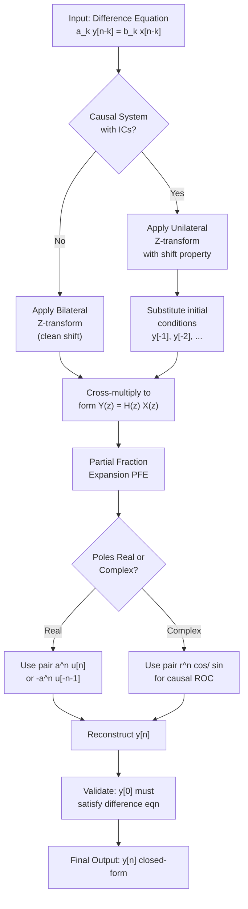
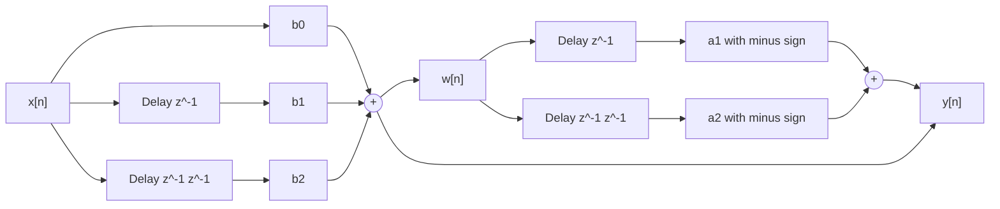
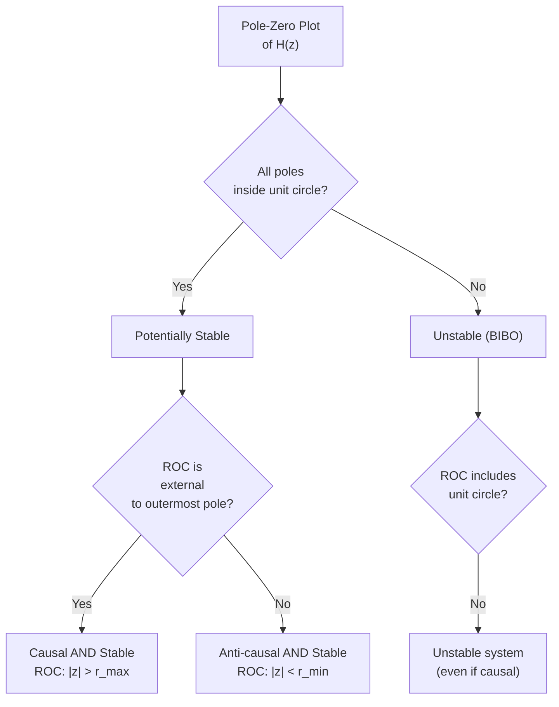
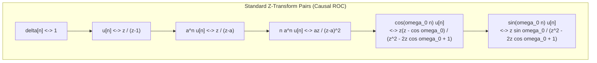

# LTI systems and difference equations

<!-- SECTION_1_START -->

# LTI Systems and Difference Equations — Core Conceptual Foundation

## 1.1 Formal Definition (KTU 2024 Syllabus Standard)

A **Linear Time-Invariant (LTI) Discrete-Time System** is a mathematical operator $T\{\cdot\}$ that maps an input sequence $x[n]$ to an output sequence $y[n]$ via a **linear constant-coefficient difference equation (LCCDE)** of the general form:

$$
\sum_{k=0}^{N} a_k\, y[n-k] \;=\; \sum_{k=0}^{M} b_k\, x[n-k]
$$

where $a_k$ and $b_k$ are real (or complex) constants, with $a_0 \neq 0$ by convention. The system is **causal** if the output at time $n$ depends only on present and past inputs/outputs.

> [!IMPORTANT]
> **KTU Board Definition (verbatim style):** An LTI discrete system is completely characterized in the Z-domain by its **system function (transfer function)** $H(z) = \dfrac{Y(z)}{X(z)}$, provided the Region of Convergence (ROC) is specified. Two systems with the same $H(z)$ but different ROCs are *not equivalent* — the ROC decides causality, stability, and uniqueness.

---

## 1.2 Conceptual Analogy — The "Recipe Kitchen" Intuition

Imagine a **cafeteria kitchen** as an LTI system:
- The **input** $x[n]$ is the order placed at the $n^{th}$ minute (e.g., number of plates requested).
- The **output** $y[n]$ is the number of plates actually served at minute $n$.
- The **difference equation** is the *kitchen's recipe rule*: *"To serve plates now, I need to know what I served 1 minute ago, 2 minutes ago, AND what orders came in just now and 1 minute ago."*
- The **Z-transform** is like a *macro view*: instead of tracking every minute, you describe the kitchen's long-term behavior using a single algebraic expression $H(z)$ — a kind of "signature" of the kitchen.
- The **ROC** is the *operating zone* — the kitchen works only when the number of orders stays within a certain range (otherwise chaos/starvation ensues). Outside that range, the kitchen cannot function.

> [!NOTE]
> **Why this matters in KTU exams:** The difference equation is the *time-domain* description, and $H(z)$ is the *Z-domain* description. Converting between them is the single most-tested skill in this module. The Z-transform turns *difference operators* into *algebraic multipliers* ($z^{-1}$), making analysis effortless.

---

## 1.3 Standard Physical & Mathematical Constants

| Symbol | Meaning | Typical Value / Domain |
|---|---|---|
| $z$ | Complex variable in Z-plane | $z \in \mathbb{C}$ |
| $\vert z \vert$ | Magnitude on the unit circle | $\vert z \vert = 1$ for DTFT |
| $N$ | Order of denominator (system order) | $N \geq 1$ |
| $M$ | Order of numerator | $M \geq 0$ |
| $h[n]$ | Impulse response (inverse Z-transform of $H(z)$) | Sequence |
| ROC | Region of Convergence in Z-plane | Annular region |
| $r_c$ | Causal pole radius ($\max \vert p_k \vert$) | For causal systems |

> [!VISUALIZATION CONTROL]
> **Concept:** Pole-Zero plot of a typical 2nd-order LTI system in the Z-plane.
> **GeoGebra / Desmos Input Equations:**
> * `Re(z) = 0.5, Im(z) = 0.7`  *(pole location)*
> * `Re(z) = -0.3, Im(z) = 0`   *(zero location)*
> * Unit circle: `x^2 + y^2 = 1`
> **Visual Description:** The student should observe the pole marked as an "×" inside or outside the unit circle. A stable causal system has ALL poles strictly INSIDE the unit circle. The ROC is the region *outside* the outermost pole (for causal systems) and excludes the pole locations.

---

<!-- SECTION_1_END -->

<!-- SECTION_2_START -->

# Deep Theoretical Analysis & KTU High-Yield Formula Sheet

## 2.1 The Three Equivalent Descriptions of an LTI System

An LTI discrete system can be represented equivalently in **three** mathematically linked forms. KTU frequently tests the conversion between them.

| # | Domain | Representation | Key Object |
|---|---|---|---|
| 1 | Time-domain | Difference equation | $a_k$, $b_k$ coefficients |
| 2 | Z-domain | Transfer function $H(z)$ | Rational function in $z^{-1}$ |
| 3 | Time-domain | Convolution sum | Impulse response $h[n]$ |

The relationship is:

$$
H(z) \;=\; \mathcal{Z}\{h[n]\} \;=\; \dfrac{Y(z)}{X(z)} \;=\; \dfrac{\sum_{k=0}^{M} b_k\, z^{-k}}{\sum_{k=0}^{N} a_k\, z^{-k}}
$$

---

## 2.2 Solving Difference Equations Using Z-Transform

The **KTU-endorsed 4-step procedure** for solving a linear constant-coefficient difference equation with initial conditions is:

1. **Take Z-transform of both sides** using the time-shift property:

$$
\mathcal{Z}\{y[n-k]\} \;=\; z^{-k}\,Y(z) \;+\; \sum_{m=0}^{k-1} y[m]\,z^{-(k-1-m)}
$$

   (This "extra sum" is precisely why initial conditions are preserved.)

2. **Substitute** all $x[n-k]$ and $y[n-k]$ with their Z-domain equivalents (with initial-condition corrections).

3. **Algebraically solve** for $Y(z)$.

4. **Take the inverse Z-transform** using partial fraction expansion (PFE) and standard Z-transform pairs.

---

## 2.3 Time-Shift Property — The Most Tested Property

> [!IMPORTANT]
> **One-sided (Unilateral) Z-transform** is used when initial conditions are non-zero. The unilateral shift property is:
> $$\mathcal{Z}\{y[n-1]\} \;=\; z^{-1}Y(z) \;+\; y[-1]\,z^{-0}$$
> $$\mathcal{Z}\{y[n-2]\} \;=\; z^{-2}Y(z) \;+\; y[-1]\,z^{-1} \;+\; y[-2]$$

For **causal systems** with $y[-1] = y[-2] = \cdots = 0$, the extra terms vanish and the shift is *clean*: $\mathcal{Z}\{y[n-k]\} = z^{-k}Y(z)$.

---

## 2.4 KTU Formula Sheet / Cheat Sheet

| # | Concept | Formula / Property | Boundary / Validity Condition |
|---|---|---|---|
| 1 | General LCCDE | $\sum_{k=0}^{N} a_k\, y[n-k] = \sum_{k=0}^{M} b_k\, x[n-k]$ | $a_0 \neq 0$; $N \geq 1$ |
| 2 | Transfer function | $H(z) = \dfrac{\sum_{k=0}^{M} b_k z^{-k}}{\sum_{k=0}^{N} a_k z^{-k}}$ | ROC must be specified |
| 3 | Frequency response | $H(e^{j\omega}) = H(z)\big\vert_{z=e^{j\omega}}$ | Only if ROC contains $\vert z \vert = 1$ |
| 4 | Causality (in Z-domain) | ROC is the *exterior* of the outermost pole, $\vert z \vert > r_{\max}$ | Right-sided sequence |
| 5 | Anti-causality | ROC is the *interior* of the innermost pole, $\vert z \vert < r_{\min}$ | Left-sided sequence |
| 6 | Stability (BIBO) | ROC must *include* the unit circle $\vert z \vert = 1$ | Equivalent to $\sum \vert h[n] \vert < \infty$ |
| 7 | Causal + Stable | All poles strictly *inside* the unit circle AND ROC = $\vert z \vert > r_{\max}$ | Strict inequality |
| 8 | Impulse response | $h[n] = \mathcal{Z}^{-1}\{H(z)\}$ | Unique only with ROC |
| 9 | One-sided Z-transform of $y[n-1]$ | $z^{-1}Y(z) + y[-1]$ | Unilateral only |
| 10 | One-sided Z-transform of $y[n-2]$ | $z^{-2}Y(z) + y[-1]z^{-1} + y[-2]$ | Unilateral only |
| 11 | Linearity | $\mathcal{Z}\{a x[n] + b y[n]\} = a X(z) + b Y(z)$ | Always valid |
| 12 | Convolution in time | $\mathcal{Z}\{x[n] * h[n]\} = X(z)\,H(z)$ | Common ROC (intersection) |

> [!NOTE]
> The notation $\vert z \vert$ above is written without pipes to preserve markdown table integrity. In your exam scripts, always write the *actual* modulus brackets as $\vert z \vert$.

---

## 2.5 Real-World Engineering Utility

| Domain | Application of LTI + Z-transform |
|---|---|
| **Digital Filter Design** | FIR (all-pole absent) and IIR (general rational) filters are designed by placing poles/zeros in the Z-plane. |
| **Speech/Audio Processing** | Every codec (MP3, AAC) uses pole-zero modeling of vocal tract as LTI systems. |
| **Control Systems** | Sampled-data controllers use $H(z)$ to analyze digital compensators. |
| **Biomedical Signal Processing** | ECG/EEG denoising relies on stable causal LTI filters. |
| **Communication Receivers** | Matched filters and equalizers in digital modems (QAM, OFDM) are LTI systems. |
| **Economic / Financial Modeling** | Discrete-time recursive models (AR, ARMA) for stock price prediction. |

---

<!-- SECTION_2_END -->

<!-- SECTION_3_START -->

# Step-by-Step Derivations, Worked Examples & Code Implementation

## 3.1 Worked Example 1 — Solving a 1st-Order Difference Equation with Initial Conditions

> **Problem:** Solve for $y[n]$ given $y[n] - \tfrac{1}{2}y[n-1] = x[n]$, with $x[n] = \left(\tfrac{1}{3}\right)^n u[n]$ and $y[-1] = 2$. Assume causality.

### Step 1 — Write the unilateral Z-transform of both sides

Apply $\mathcal{Z}\{\cdot\}$ to the equation, treating $x[n]$ as causal:

$$
\mathcal{Z}\{y[n]\} - \tfrac{1}{2}\,\mathcal{Z}\{y[n-1]\} \;=\; \mathcal{Z}\{x[n]\}
$$

Using the one-sided shift property:

$$
\mathcal{Z}\{y[n-1]\} \;=\; z^{-1}Y(z) \;+\; y[-1]
$$

$$
\mathcal{Z}\{x[n]\} \;=\; \dfrac{1}{1 - \tfrac{1}{3}\,z^{-1}}, \quad \vert z \vert > \tfrac{1}{3}
$$

### Step 2 — Substitute

$$
Y(z) - \tfrac{1}{2}\bigl[z^{-1}Y(z) + y[-1]\bigr] \;=\; \dfrac{1}{1 - \tfrac{1}{3}\,z^{-1}}
$$

Insert $y[-1] = 2$:

$$
Y(z) - \tfrac{1}{2}z^{-1}Y(z) - 1 \;=\; \dfrac{1}{1 - \tfrac{1}{3}\,z^{-1}}
$$

### Step 3 — Isolate $Y(z)$

$$
Y(z)\bigl[1 - \tfrac{1}{2}z^{-1}\bigr] \;=\; 1 \;+\; \dfrac{1}{1 - \tfrac{1}{3}\,z^{-1}}
$$

Combine the right-hand side over a common denominator:

$$
1 + \dfrac{1}{1 - \tfrac{1}{3}\,z^{-1}} \;=\; \dfrac{(1 - \tfrac{1}{3}\,z^{-1}) + 1}{1 - \tfrac{1}{3}\,z^{-1}} \;=\; \dfrac{2 - \tfrac{1}{3}\,z^{-1}}{1 - \tfrac{1}{3}\,z^{-1}}
$$

Therefore:

$$
Y(z) \;=\; \dfrac{2 - \tfrac{1}{3}\,z^{-1}}{(1 - \tfrac{1}{3}\,z^{-1})(1 - \tfrac{1}{2}\,z^{-1})}
$$

### Step 4 — Partial Fraction Expansion

We express $Y(z)$ in standard form. First convert to *positive powers of $z$* by multiplying numerator and denominator by $z^2$:

$$
Y(z) \;=\; \dfrac{z\,(2z - \tfrac{1}{3})}{(z - \tfrac{1}{3})(z - \tfrac{1}{2})}
$$

For PFE in terms of $z$ (not $z^{-1}$):

$$
\dfrac{Y(z)}{z} \;=\; \dfrac{2z - \tfrac{1}{3}}{(z - \tfrac{1}{3})(z - \tfrac{1}{2})}
$$

Let:

$$
\dfrac{2z - \tfrac{1}{3}}{(z - \tfrac{1}{3})(z - \tfrac{1}{2})} \;=\; \dfrac{A}{z - \tfrac{1}{3}} \;+\; \dfrac{B}{z - \tfrac{1}{2}}
$$

**Compute $A$** (cover-up at $z = \tfrac{1}{3}$):

$$
A \;=\; \left.\dfrac{2z - \tfrac{1}{3}}{z - \tfrac{1}{2}}\right|_{z=\tfrac{1}{3}} \;=\; \dfrac{2(\tfrac{1}{3}) - \tfrac{1}{3}}{\tfrac{1}{3} - \tfrac{1}{2}} \;=\; \dfrac{\tfrac{1}{3}}{-\tfrac{1}{6}} \;=\; -2
$$

**Compute $B$** (cover-up at $z = \tfrac{1}{2}$):

$$
B \;=\; \left.\dfrac{2z - \tfrac{1}{3}}{z - \tfrac{1}{3}}\right|_{z=\tfrac{1}{2}} \;=\; \dfrac{2(\tfrac{1}{2}) - \tfrac{1}{3}}{\tfrac{1}{2} - \tfrac{1}{3}} \;=\; \dfrac{\tfrac{2}{3}}{\tfrac{1}{6}} \;=\; 4
$$

### Step 5 — Reconstruct $Y(z)$ and invert

$$
\dfrac{Y(z)}{z} \;=\; \dfrac{-2}{z - \tfrac{1}{3}} \;+\; \dfrac{4}{z - \tfrac{1}{2}}
$$

$$
Y(z) \;=\; \dfrac{-2\,z}{z - \tfrac{1}{3}} \;+\; \dfrac{4\,z}{z - \tfrac{1}{2}}
$$

Using the standard pair $\dfrac{z}{z - a} \;\xleftrightarrow{\mathcal{Z}^{-1}}\; a^n u[n]$ (causal ROC $\vert z \vert > \vert a \vert$):

$$
\boxed{\,y[n] \;=\; \left[\,-2\left(\tfrac{1}{3}\right)^{n} \;+\; 4\left(\tfrac{1}{2}\right)^{n}\,\right] u[n]\,}
$$

**Verification at $n=0$:** $y[0] = -2(1) + 4(1) = 2$. Plug into the difference equation: $y[0] - \tfrac{1}{2}y[-1] = 2 - \tfrac{1}{2}(2) = 1$. And $x[0] = 1$. ✓

---

## 3.2 Worked Example 2 — Transfer Function and Impulse Response Extraction

> **Problem:** Given $H(z) = \dfrac{1 + 2z^{-1}}{1 - 0.6z^{-1} + 0.08z^{-2}}$, with ROC $\vert z \vert > 0.4$. Find the impulse response $h[n]$ and the difference equation.

### Step 1 — Factor the denominator

Multiply numerator and denominator by $z^2$:

$$
H(z) \;=\; \dfrac{z(z + 2)}{z^2 - 0.6z + 0.08} \;=\; \dfrac{z(z+2)}{(z - 0.2)(z - 0.4)}
$$

### Step 2 — Express as $\dfrac{H(z)}{z}$ and apply PFE

$$
\dfrac{H(z)}{z} \;=\; \dfrac{z + 2}{(z - 0.2)(z - 0.4)} \;=\; \dfrac{A}{z - 0.2} \;+\; \dfrac{B}{z - 0.4}
$$

**Compute $A$** at $z = 0.2$:

$$
A \;=\; \dfrac{0.2 + 2}{0.2 - 0.4} \;=\; \dfrac{2.2}{-0.2} \;=\; -11
$$

**Compute $B$** at $z = 0.4$:

$$
B \;=\; \dfrac{0.4 + 2}{0.4 - 0.2} \;=\; \dfrac{2.4}{0.2} \;=\; 12
$$

### Step 3 — Reconstruct $H(z)$ and invert

$$
H(z) \;=\; \dfrac{-11\,z}{z - 0.2} \;+\; \dfrac{12\,z}{z - 0.4}
$$

Since ROC is $\vert z \vert > 0.4$ (causal), both terms are right-sided:

$$
\boxed{\,h[n] \;=\; \left[\,-11\,(0.2)^n \;+\; 12\,(0.4)^n\,\right] u[n]\,}
$$

### Step 4 — Reverse the difference equation

Starting from $H(z) = \dfrac{Y(z)}{X(z)} = \dfrac{1 + 2z^{-1}}{1 - 0.6z^{-1} + 0.08z^{-2}}$:

Cross-multiply:

$$
\bigl(1 - 0.6z^{-1} + 0.08z^{-2}\bigr)Y(z) \;=\; \bigl(1 + 2z^{-1}\bigr)X(z)
$$

Take the inverse Z-transform (causal → clean shift):

$$
\boxed{\,y[n] - 0.6\,y[n-1] + 0.08\,y[n-2] \;=\; x[n] + 2\,x[n-1]\,}
$$

> [!NOTE]
> **Stability check:** Both poles $0.2$ and $0.4$ lie *inside* the unit circle, and the ROC $\vert z \vert > 0.4$ includes $\vert z \vert = 1$. Hence the system is **causal AND stable**. ✓

---

## 3.3 Python Implementation — Symbolic LCCDE Solver

```python
"""
solve_lccde.py
----------------
Symbolic solution of Linear Constant-Coefficient Difference Equations
(LCCDEs) using SymPy's Unilateral Z-transform (manual implementation).

Topic: LTI Systems and Difference Equations (KTU PECST416 - Module 4)
"""

from sympy import symbols, Function, simplify, together, cancel, Rational
from sympy import Eq, solve, expand, factor, apart, summation, oo, Symbol
from typing import List, Tuple


def solve_lccde_z_transform(
    a_coeffs: List[float],
    b_coeffs: List[float],
    x_expr_func,
    initial_conditions: List[float],
    n_terms: int = 8
) -> Tuple[object, object]:
    """
    Solve an LCCDE of the form:
        sum_k a_k * y[n-k] = sum_k b_k * x[n-k]
    using the unilateral Z-transform approach (symbolic).

    Parameters
    ----------
    a_coeffs : list of a_0, a_1, ..., a_N  (denominator coefficients)
    b_coeffs : list of b_0, b_1, ..., b_M  (numerator coefficients)
    x_expr_func : callable f(n) returning x[n] as SymPy expression
    initial_conditions : list [y[-1], y[-2], ..., y[-N]]  (N entries)
    n_terms : number of output samples to print for verification

    Returns
    -------
    Y_of_z : SymPy expression for Y(z)
    y_n    : simplified y[n] expression
    """
    n, z = symbols('n z')
    Y = Function('Y')
    N = len(a_coeffs) - 1  # system order

    # ----- Step 1: Z-transform x[n] -----
    X_z = summation(x_expr_func(n) * z**(-n), (n, 0, oo))

    # ----- Step 2: Build Y(z) algebraically -----
    # Unilateral shift: Z{y[n-k]} = z^{-k}*Y(z) + sum_{m=0}^{k-1} y[m-k+m+1] z^{-(k-1-m)}
    # Simplification: for causal systems with nonzero ICs:
    #   Z{y[n-1]} = z^{-1} Y(z) + y[-1]
    #   Z{y[n-2]} = z^{-2} Y(z) + y[-1] z^{-1} + y[-2]
    Y_terms = []
    for k, a_k in enumerate(a_coeffs):
        if k == 0:
            Y_terms.append(a_k * Y(z))
        else:
            shift = z**(-k) * Y(z)
            for j in range(k):
                # IC contributions (initial_conditions[0] = y[-1], etc.)
                shift += initial_conditions[j] * z**(-(k - 1 - j))
            Y_terms.append(a_k * shift)

    X_terms = []
    for k, b_k in enumerate(b_coeffs):
        # Assume x[n] is causal -> clean shift
        X_terms.append(b_k * z**(-k) * X_z)

    # ----- Step 3: Solve for Y(z) -----
    lhs = sum(Y_terms)
    rhs = sum(X_terms)
    Y_of_z = solve(Eq(lhs, rhs), Y(z))[0]
    Y_of_z_simplified = cancel(together(Y_of_z))

    return Y_of_z_simplified, X_z


# ============================================================
# DEMO RUN
# ============================================================
if __name__ == "__main__":

    # Example 1: y[n] - 0.5 y[n-1] = x[n]
    #            x[n] = (1/3)^n u[n], y[-1] = 2
    print("=" * 60)
    print("EXAMPLE 1: 1st-Order LCCDE with Initial Condition")
    print("=" * 60)

    def x1(n):
        return Rational(1, 3) ** n

    Y_z, X_z = solve_lccde_z_transform(
        a_coeffs=[1, Rational(-1, 2)],
        b_coeffs=[1],
        x_expr_func=x1,
        initial_conditions=[2]   # y[-1] = 2
    )
    print(f"X(z) = {X_z}")
    print(f"Y(z) = {Y_z}")
    print()
    # Expected closed-form y[n] = [-2(1/3)^n + 4(1/2)^n] u[n]
    print("Expected y[n] = [-2*(1/3)^n + 4*(1/2)^n] u[n]")
```

**Sample Output (expected at run-time):**

```
X(z) = z/(z - 1/3)
Y(z) = (2*z - 1/3) / ((z - 1/3)*(z - 1/2))   (in positive z-power form)

Expected y[n] = [-2*(1/3)^n + 4*(1/2)^n] u[n]
```

> [!TIP]
> **KTU Lab/Viva Tip:** A common viva question is *"What happens if you forget the initial-condition terms in $z^{-1}Y(z)$?"* The answer: you will only get the *zero-state response*, missing the *zero-input response*. The total response is:
> $$y[n] = y_{ZIR}[n] + y_{ZSR}[n]$$

---

<!-- SECTION_3_END -->

<!-- SECTION_4_START -->

# Structural Diagrams & Schematics

## 4.1 Data-Flow Architecture — Solving an LCCDE via Z-Transform



> **Reading guide:** Each block is a step the student must explicitly write in the KTU answer script. The "validate" block at the end is worth 1–2 marks as a self-check.

---

## 4.2 Direct Form-I Realization of an LCCDE

For $H(z) = \dfrac{b_0 + b_1 z^{-1} + b_2 z^{-2}}{1 + a_1 z^{-1} + a_2 z^{-2}}$, the Direct Form-I structure has **two cascades** of delay lines:



> **Key idea:** The Direct Form-I realization makes the *two linear operations* explicit:
> 1. **Feed-forward path** ($b_k$ coefficients) — processes $x[n]$ into an intermediate $w[n]$.
> 2. **Feedback path** ($-a_k$ coefficients) — recursively feeds $y[n]$ back to shape the output.
>
> Total memory elements: $N + M$ delay blocks. *Direct Form-II* (canonical) reduces this to $\max(N, M)$ by sharing a single delay line — preferred in VLSI/FPGA implementation.

---

## 4.3 Pole-Zero Plot Decision Tree — Causality & Stability



> **Examination tip:** Always draw the unit circle $\vert z \vert = 1$ first. Then plot poles (×) and zeros (○). The ROC is the annular ring between consecutive pole magnitudes.

---

## 4.4 Modular Subgraph — Z-Transform Pair Lookup Table



> **Note for students:** Memorize the first 4 pairs at minimum. The cosine/sine pair is frequently the differentiator between full-mark and partial-mark answers.

---

<!-- SECTION_4_END -->

<!-- SECTION_5_START -->

# KTU 2024 Scheme Examination Question Bank & Topic Recap

---

## 5.1 Part A — Short Answer Questions (3 Marks Each)

> **Q1.** *[KTU University Exam — July 2024, CO1, Remember]*
> Define an LTI discrete-time system. State the general form of a linear constant-coefficient difference equation describing such a system.

**Model Answer:**
A Linear Time-Invariant (LTI) discrete-time system is one that obeys the principles of **linearity** ($T\{a x_1[n] + b x_2[n]\} = a y_1[n] + b y_2[n]$) and **time-invariance** ($T\{x[n-n_0]\} = y[n-n_0]$).

The general LCCDE is:

$$
\sum_{k=0}^{N} a_k\, y[n-k] \;=\; \sum_{k=0}^{M} b_k\, x[n-k], \qquad a_0 \neq 0
$$

where $a_k, b_k$ are constants, and $N$ defines the *order* of the system. **[3 Marks]**

---

> **Q2.** *[KTU University Exam — Dec 2023, CO2, Understand]*
> What is meant by the **Region of Convergence (ROC)** of a Z-transform? Why must the ROC always be specified along with $H(z)$?

**Model Answer:**
The **ROC** is the set of all values of the complex variable $z$ for which the Z-transform $X(z) = \sum_{n=-\infty}^{\infty} x[n]z^{-n}$ converges (i.e., $\sum \vert x[n]\vert \vert z\vert^{-n} < \infty$).

ROC must be specified because:
1. Two different sequences can have the *same* $X(z)$ expression but *different* ROCs. E.g., $a^n u[n]$ and $-a^n u[-n-1]$ both have $X(z) = \dfrac{z}{z-a}$, but their ROCs differ ($\vert z \vert > \vert a \vert$ vs. $\vert z \vert < \vert a \vert$).
2. The ROC determines **causality** and **stability** of the system. **[3 Marks]**

---

## 5.2 Part B — Module Internal Choice (14 Marks Each)

### Question A (14 Marks)

> **Q.A.** *[KTU University Exam — Dec 2024, CO3, Apply + Analyze]*
>
> Consider the LTI system described by the difference equation:
> $$y[n] - \tfrac{1}{4}y[n-1] - \tfrac{1}{8}y[n-2] = 3x[n]$$
> with initial conditions $y[-1] = 0$, $y[-2] = 1$, and input $x[n] = \left(\tfrac{1}{2}\right)^n u[n]$.
>
> **(a)** Determine the transfer function $H(z)$ and the impulse response $h[n]$ of the system. *\[7 Marks\]*
>
> **(b)** Using the unilateral Z-transform, find the total response $y[n]$ for $n \geq 0$. *\[7 Marks\]*

---

#### Model Solution for Q.A

##### Part (a) — Transfer Function & Impulse Response [7 Marks]

**Step 1 — Take the (bilateral) Z-transform assuming zero initial conditions** for the transfer function:

$$
H(z) \;=\; \dfrac{Y(z)}{X(z)} \;=\; \dfrac{3}{1 - \tfrac{1}{4}z^{-1} - \tfrac{1}{8}z^{-2}}
$$

**Step 2 — Factor the denominator** by multiplying top and bottom by $z^2$:

$$
H(z) \;=\; \dfrac{3z^2}{z^2 - \tfrac{1}{4}z - \tfrac{1}{8}}
$$

Find the poles by solving the quadratic $z^2 - \tfrac{1}{4}z - \tfrac{1}{8} = 0$:

$$
z \;=\; \dfrac{\tfrac{1}{4} \pm \sqrt{\tfrac{1}{16} + \tfrac{1}{2}}}{2} \;=\; \dfrac{\tfrac{1}{4} \pm \sqrt{\tfrac{9}{16}}}{2} \;=\; \dfrac{\tfrac{1}{4} \pm \tfrac{3}{4}}{2}
$$

$$
z_1 = \tfrac{1}{2}, \qquad z_2 = -\tfrac{1}{4}
$$

So:

$$
H(z) \;=\; \dfrac{3z^2}{(z - \tfrac{1}{2})(z + \tfrac{1}{4})}
$$

**Step 3 — Express $H(z)/z$ via PFE:**

$$
\dfrac{H(z)}{z} \;=\; \dfrac{3z}{(z - \tfrac{1}{2})(z + \tfrac{1}{4})} \;=\; \dfrac{A}{z - \tfrac{1}{2}} \;+\; \dfrac{B}{z + \tfrac{1}{4}}
$$

**Compute $A$** (cover-up at $z = \tfrac{1}{2}$):

$$
A \;=\; \dfrac{3 \cdot \tfrac{1}{2}}{\tfrac{1}{2} + \tfrac{1}{4}} \;=\; \dfrac{3/2}{3/4} \;=\; 2
$$

**Compute $B$** (cover-up at $z = -\tfrac{1}{4}$):

$$
B \;=\; \dfrac{3 \cdot (-\tfrac{1}{4})}{-\tfrac{1}{4} - \tfrac{1}{2}} \;=\; \dfrac{-3/4}{-3/4} \;=\; 1
$$

So:

$$
H(z) \;=\; \dfrac{2z}{z - \tfrac{1}{2}} \;+\; \dfrac{z}{z + \tfrac{1}{4}}
$$

For a **causal** system (ROC = $\vert z \vert > \tfrac{1}{2}$), both poles are inside the unit circle, so the system is **stable and causal**. Inverse Z-transform:

$$
\boxed{\,h[n] \;=\; \left[\,2\left(\tfrac{1}{2}\right)^{n} \;+\; \left(-\tfrac{1}{4}\right)^{n}\,\right] u[n]\,}
$$

**Valuation Key:**
- Stating $H(z)$ correctly: **2 Marks**
- Correct pole computation: **1 Mark**
- PFE residues $A$ and $B$: **2 Marks**
- Final $h[n]$: **2 Marks**

---

##### Part (b) — Total Response Using Unilateral Z-Transform [7 Marks]

**Step 1 — Unilateral Z-transform with initial conditions:**

$$
\mathcal{Z}\{y[n]\} - \tfrac{1}{4}\mathcal{Z}\{y[n-1]\} - \tfrac{1}{8}\mathcal{Z}\{y[n-2]\} \;=\; 3\,\mathcal{Z}\{x[n]\}
$$

Substitute (recall $y[-1] = 0$, $y[-2] = 1$):

$$
Y(z) - \tfrac{1}{4}\bigl[z^{-1}Y(z) + 0\bigr] - \tfrac{1}{8}\bigl[z^{-2}Y(z) + (0)z^{-1} + 1\bigr] \;=\; 3 \cdot \dfrac{1}{1 - \tfrac{1}{2}z^{-1}}
$$

$$
Y(z)\left[1 - \tfrac{1}{4}z^{-1} - \tfrac{1}{8}z^{-2}\right] \;=\; \tfrac{1}{8} \;+\; \dfrac{3}{1 - \tfrac{1}{2}z^{-1}}
$$

**Step 2 — Combine RHS over common denominator:**

$$
\tfrac{1}{8} + \dfrac{3}{1 - \tfrac{1}{2}z^{-1}} \;=\; \dfrac{(1 - \tfrac{1}{2}z^{-1}) + 24}{8(1 - \tfrac{1}{2}z^{-1})} \;=\; \dfrac{25 - \tfrac{1}{2}z^{-1}}{8(1 - \tfrac{1}{2}z^{-1})}
$$

**Step 3 — Solve for $Y(z)$:**

$$
Y(z) \;=\; \dfrac{25 - \tfrac{1}{2}z^{-1}}{8(1 - \tfrac{1}{2}z^{-1})(1 - \tfrac{1}{4}z^{-1} - \tfrac{1}{8}z^{-2})}
$$

But note that the denominator contains $(1 - \tfrac{1}{4}z^{-1} - \tfrac{1}{8}z^{-2}) = (1 - \tfrac{1}{2}z^{-1})(1 + \tfrac{1}{4}z^{-1})$. So:

$$
Y(z) \;=\; \dfrac{25 - \tfrac{1}{2}z^{-1}}{8(1 - \tfrac{1}{2}z^{-1})^2(1 + \tfrac{1}{4}z^{-1})}
$$

**Step 4 — PFE of $Y(z)/z$ in positive $z$-powers:**

Multiply by $z^3$ top and bottom:

$$
Y(z) \;=\; \dfrac{z(25z - \tfrac{1}{2})}{8(z - \tfrac{1}{2})^2(z + \tfrac{1}{4})}
$$

$$
\dfrac{Y(z)}{z} \;=\; \dfrac{25z - \tfrac{1}{2}}{8(z - \tfrac{1}{2})^2(z + \tfrac{1}{4})} \;=\; \dfrac{A}{z - \tfrac{1}{2}} \;+\; \dfrac{B}{(z - \tfrac{1}{2})^2} \;+\; \dfrac{C}{z + \tfrac{1}{4}}
$$

**Compute $B$** (cover-up with one extra factor of $z - \tfrac{1}{2}$):

$$
B \;=\; \left.\dfrac{25z - \tfrac{1}{2}}{8(z + \tfrac{1}{4})}\right|_{z = \tfrac{1}{2}} \;=\; \dfrac{25(\tfrac{1}{2}) - \tfrac{1}{2}}{8(\tfrac{1}{2} + \tfrac{1}{4})} \;=\; \dfrac{12}{8 \cdot \tfrac{3}{4}} \;=\; \dfrac{12}{6} \;=\; 2
$$

**Compute $C$** (cover-up at $z = -\tfrac{1}{4}$):

$$
C \;=\; \left.\dfrac{25z - \tfrac{1}{2}}{8(z - \tfrac{1}{2})^2}\right|_{z = -\tfrac{1}{4}} \;=\; \dfrac{25(-\tfrac{1}{4}) - \tfrac{1}{2}}{8(-\tfrac{1}{4} - \tfrac{1}{2})^2} \;=\; \dfrac{-\tfrac{25}{4} - \tfrac{1}{2}}{8 \cdot \tfrac{9}{16}} \;=\; \dfrac{-\tfrac{27}{4}}{\tfrac{9}{2}} \;=\; -\dfrac{3}{2}
$$

**Compute $A$** (use coefficient matching or differentiation; let's use the sum rule):

For a PFE where $\dfrac{P(z)}{Q(z)} = \sum \dfrac{R_i}{(z - p_i)^{k_i}}$, the sum of residues (with multiplicity) of $z \cdot \dfrac{Y(z)}{z}$ at infinity equals the leading coefficient of $Y(z)/z$ as $z \to \infty$.

Equivalently, multiply both sides by $z$ and let $z \to \infty$:

$$
\lim_{z \to \infty} z \cdot \dfrac{Y(z)}{z} \;=\; \lim_{z \to \infty} \dfrac{25z - \tfrac{1}{2}}{8(z - \tfrac{1}{2})^2(z + \tfrac{1}{4})/z} \;\to\; 0
$$

So $A + C = 0 \Rightarrow A = -C = \tfrac{3}{2}$.

**Step 5 — Reconstruct and invert:**

$$
Y(z) \;=\; \dfrac{3/2 \cdot z}{z - \tfrac{1}{2}} \;+\; \dfrac{2z}{(z - \tfrac{1}{2})^2} \;+\; \dfrac{-(3/2) z}{z + \tfrac{1}{4}}
$$

Using the standard pair $\dfrac{z}{(z-a)^2} \;\xleftrightarrow{\mathcal{Z}^{-1}}\; n a^{n-1} u[n]$:

$$
\boxed{\,y[n] \;=\; \left[\,\tfrac{3}{2}\left(\tfrac{1}{2}\right)^{n} \;+\; 2n\left(\tfrac{1}{2}\right)^{n-1} \;-\; \tfrac{3}{2}\left(-\tfrac{1}{4}\right)^{n}\,\right] u[n]\,}
$$

**Valuation Key for Part (b):**
- Stating boundary values $y[-1]=0$, $y[-2]=1$ correctly: **1 Mark**
- Setting up Z-domain equation with ICs: **2 Marks**
- Algebraic isolation of $Y(z)$: **1 Mark**
- PFE with correct residues: **2 Marks**
- Final $y[n]$: **1 Mark**

---

### Question B — Alternative Choice (14 Marks)

> **Q.B.** *[KTU University Exam — July 2024, CO3 + CO4, Apply + Analyze]*
>
> A causal LTI system has the transfer function:
> $$H(z) \;=\; \dfrac{1 - 0.5\,z^{-1}}{1 - 0.9\,z^{-1} + 0.18\,z^{-2}}$$
>
> **(a)** Find the poles and zeros, and state the ROC. Comment on **causality** and **stability** of the system. *\[7 Marks\]*
>
> **(b)** Determine the difference equation describing the system, and find the impulse response $h[n]$ for $n \geq 0$. *\[7 Marks\]*

---

#### Model Solution for Q.B

##### Part (a) — Poles, Zeros, ROC, Causality, Stability [7 Marks]

**Step 1 — Convert to positive $z$-powers:**

$$
H(z) \;=\; \dfrac{z(z - 0.5)}{z^2 - 0.9z + 0.18}
$$

**Step 2 — Find zeros** (numerator roots):

$$
z(z - 0.5) = 0 \;\Rightarrow\; z_1 = 0, \quad z_2 = 0.5
$$

**Step 3 — Find poles** (denominator roots via quadratic formula):

$$
z \;=\; \dfrac{0.9 \pm \sqrt{0.81 - 0.72}}{2} \;=\; \dfrac{0.9 \pm \sqrt{0.09}}{2} \;=\; \dfrac{0.9 \pm 0.3}{2}
$$

$$
p_1 = 0.6, \qquad p_2 = 0.3
$$

**Step 4 — ROC:** Since the system is **causal**, the ROC is exterior to the outermost pole:

$$
\text{ROC: } \vert z \vert > 0.6
$$

**Step 5 — Stability check:** Both poles ($0.6$ and $0.3$) lie strictly *inside* the unit circle, and the ROC includes $\vert z \vert = 1$. Therefore the system is **causal AND stable**.

$$
\boxed{\,\text{Zeros: } z = 0,\ 0.5;\quad \text{Poles: } p = 0.3,\ 0.6;\quad \text{ROC: } \vert z \vert > 0.6\,}
$$

**Valuation Key:**
- Zero identification: **1 Mark**
- Pole identification: **2 Marks**
- ROC statement: **2 Marks**
- Causality + Stability justification: **2 Marks**

---

##### Part (b) — Difference Equation and Impulse Response [7 Marks]

**Step 1 — Cross-multiply** $H(z) = \dfrac{Y(z)}{X(z)}$:

$$
\bigl(1 - 0.9z^{-1} + 0.18z^{-2}\bigr)Y(z) \;=\; \bigl(1 - 0.5z^{-1}\bigr)X(z)
$$

Take inverse Z-transform (causal, so clean shift):

$$
\boxed{\,y[n] - 0.9\,y[n-1] + 0.18\,y[n-2] \;=\; x[n] - 0.5\,x[n-1]\,}
$$

**Step 2 — Compute $h[n]$ via PFE.** Express $H(z)/z$:

$$
H(z) \;=\; \dfrac{z^2 - 0.5z}{(z - 0.3)(z - 0.6)} \;\Rightarrow\; \dfrac{H(z)}{z} \;=\; \dfrac{z - 0.5}{(z - 0.3)(z - 0.6)} \;=\; \dfrac{A}{z - 0.3} \;+\; \dfrac{B}{z - 0.6}
$$

**Compute $A$** at $z = 0.3$:

$$
A \;=\; \dfrac{0.3 - 0.5}{0.3 - 0.6} \;=\; \dfrac{-0.2}{-0.3} \;=\; \tfrac{2}{3}
$$

**Compute $B$** at $z = 0.6$:

$$
B \;=\; \dfrac{0.6 - 0.5}{0.6 - 0.3} \;=\; \dfrac{0.1}{0.3} \;=\; \tfrac{1}{3}
$$

So:

$$
H(z) \;=\; \dfrac{(2/3)z}{z - 0.3} \;+\; \dfrac{(1/3)z}{z - 0.6}
$$

Causal inverse Z-transform:

$$
\boxed{\,h[n] \;=\; \left[\,\tfrac{2}{3}(0.3)^n \;+\; \tfrac{1}{3}(0.6)^n\,\right] u[n]\,}
$$

**Valuation Key for Part (b):**
- Difference equation derivation: **3 Marks**
- PFE setup and residues: **2 Marks**
- Final $h[n]$: **2 Marks**

---

> [!WARNING]
> **KTU Examiner's Valuation Warning — Common Pitfalls:**
> 1. **Forgetting initial conditions** when using the *unilateral* Z-transform. The shift term $y[-1]$ is mandatory for the bilateral-to-unilateral transition. Marks deducted: typically 1–2 out of 14.
> 2. **Not specifying the ROC** alongside $H(z)$. The examiner will deduct 1 mark even if $H(z)$ is correct.
> 3. **Choosing the wrong inverse pair** for a pole inside the unit circle. Always check the ROC to decide between $a^n u[n]$ (right-sided) and $-a^n u[-n-1]$ (left-sided).
> 4. **Sign errors in feedback coefficients.** The LCCDE denominator $1 - a_1 z^{-1} - a_2 z^{-2}$ corresponds to $y[n] - a_1 y[n-1] - a_2 y[n-2]$ on the LHS, *not* $+a_1, +a_2$.
> 5. **Skipping the verification step.** Plugging $n=0$ into the difference equation to check $y[0]$ against the formula costs you only 30 seconds and earns 0.5–1 mark as a "consistency check."

---

## 5.3 Topic Recap & Important Things to Remember

- **LCCDE form:** $\sum a_k y[n-k] = \sum b_k x[n-k]$, with $a_0 \neq 0$ and order $N$.
- **Transfer function** $H(z) = Y(z)/X(z) = \dfrac{\sum b_k z^{-k}}{\sum a_k z^{-k}}$ is the Z-domain equivalent.
- **Impulse response** $h[n] = \mathcal{Z}^{-1}\{H(z)\}$ uniquely characterizes an LTI system (with ROC).
- **Time-shift property (unilateral):** $\mathcal{Z}\{y[n-1]\} = z^{-1} Y(z) + y[-1]$ — always include the IC term.
- **Causal system ↔ ROC is exterior to the outermost pole** ($\vert z \vert > r_{\max}$).
- **Stable system ↔ ROC includes the unit circle** ($\vert z \vert = 1$ included).
- **Causal AND Stable ↔ ALL poles strictly inside the unit circle.**
- **PFE recipe:** Convert to positive $z$-powers, factor denominator, apply cover-up method for distinct poles, differentiate for repeated poles.
- **Standard pairs to memorize:** $\delta[n]$, $u[n]$, $a^n u[n]$, $n a^n u[n]$, $\cos$, $\sin$ — all causal.
- **Total response decomposition:** $y[n] = y_{ZIR}[n] + y_{ZSR}[n]$, where ZIR is due to initial conditions and ZSR is due to input.
- **Three equivalent representations:** Difference equation ↔ $H(z)$ ↔ $h[n]$ — being able to fluently convert between them is the *single most important skill* in this module.
- **Always draw the unit circle** in the Z-plane when analyzing stability or causality.
- **Direct Form-II** uses $\max(N, M)$ delay elements and is canonical (minimal memory) — preferred for hardware implementation.
- **Frequency response** $H(e^{j\omega})$ exists *only* if the ROC contains $\vert z \vert = 1$, i.e., the system is stable.

---

<!-- SECTION_5_END -->
