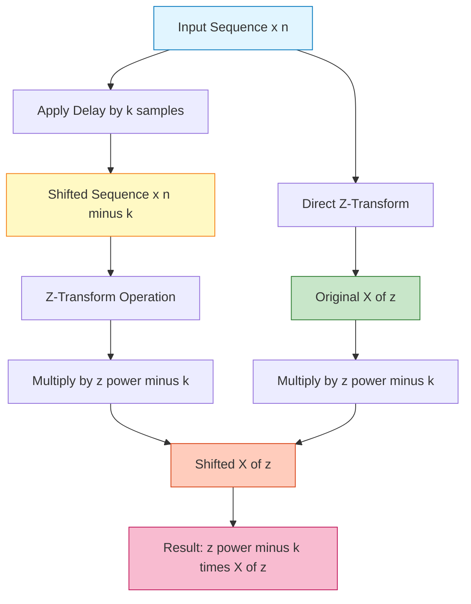
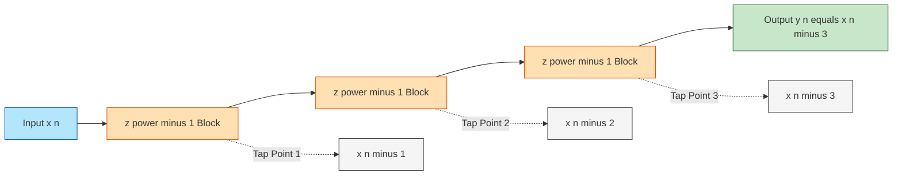

# Properties of z transform - Translation (Time Shifting)

<!-- SECTION_1_START -->

# Properties of Z-Transform: Translation (Time Shifting)

## 1. Core Technical Definition

> [!IMPORTANT]
> **KTU Syllabus Definition (PECST416 - Module 4)**
> The **Translation (Time Shifting) Property** of the Z-transform states that shifting a discrete-time sequence $x[n]$ by $k$ samples along the time axis corresponds to multiplying its Z-transform $X(z)$ by a factor of $z^{-k}$ (for a delay) or $z^{+k}$ (for an advance), while the Region of Convergence (ROC) remains the same — except possibly at the origin $z = 0$ or at infinity $z = \infty$.

Mathematically, the bilateral Z-transform of a sequence is defined as:

$$
X(z) = \sum_{n=-\infty}^{\infty} x[n]\, z^{-n}
$$

If $x[n] \xleftrightarrow{Z} X(z)$ with ROC $R_1 < \vert z \vert < R_2$, then:

$$
x[n - k] \xleftrightarrow{Z} z^{-k} X(z)
$$

where $k$ is an integer (positive for **delay/right-shift**, negative for **advance/left-shift**).

> [!NOTE]
> **Conceptual Analogy / Intuition**
> Think of the Z-transform as a *photographic film roll* where each sample $x[n]$ is placed at a specific time slot. A **time shift** of $k$ units is like sliding the entire film roll by $k$ frames. The frequency-domain effect of this slide is multiplication by $z^{-k}$ — a **phase-twisting factor** that rotates the Z-plane spectrum. The magnitude spectrum $\vert X(z) \vert$ remains unchanged; only the **phase** is rotated. This is why delay lines (FIR filters) and shift registers work simply by introducing $z^{-1}$ blocks.

**Key Physical Parameters to Remember:**

- **Delay Element**: $z^{-1}$ represents a **one-sample delay** (a unit memory cell in DSP hardware).
- **Advance Element**: $z^{+1}$ represents a **one-sample advance** (causality-breaking — non-implementable in real-time).
- **ROC Boundary**: Time shifting does **not change the ROC** in extent, but may **exclude** $z = 0$ or $z = \infty$ if poles/zeroes migrate across these points.

> [!VISUALIZATION CONTROL]
> **Concept:** Pole-Zero Plot Under Time Shifting
> **GeoGebra / Desmos Input Equations:**
> * `f1(x, y) = (x - 0.5)^2 + y^2 - 0.04` (original pole at $z = 0.5$)
> * `f2(x, y) = (x/2)^2 + y^2 - 0.01` (new pole for $z^{-1} X(z)$ after multiplication)
> **Visual Description:** Plot the original pole at $(0.5, 0)$ inside the unit circle. After a one-sample delay, the pole's *magnitude* in the Z-plane rotates/scales due to the $z^{-1}$ factor. The unit circle ($x^2 + y^2 = 1$) is the reference. Observe that poles approach the origin under repeated delays.

---

<!-- SECTION_1_END -->

<!-- SECTION_2_START -->

# Deep Theoretical Analysis & KTU High-Yield Formula Sheet

## 2. Theoretical Foundation

The translation property is one of the **most frequently tested properties** in KTU university exams because it forms the mathematical backbone of:

- **Linear Constant-Coefficient Difference Equations (LCCDE)** representation
- **FIR filter** transfer function derivation
- **System function** $H(z)$ development
- **Real-time DSP** shift-register implementation

### 2.1 Statement of the Property

Given:

$$
x[n] \xleftrightarrow{Z} X(z), \quad \text{ROC: } R_1 < \vert z \vert < R_2
$$

Then for any integer $k$:

$$
x[n - k] \xleftrightarrow{Z} z^{-k} X(z), \quad \text{ROC: } R_1 < \vert z \vert < R_2 \text{ (with possible modification at } z=0 \text{ or } z=\infty)
$$

### 2.2 Two Cases of Time Shifting

| Case | Operation | Sequence Domain | Z-Domain | ROC Effect |
|:----:|:---------:|:---------------:|:--------:|:----------:|
| **1** | **Right Shift (Delay)** $k > 0$ | $x[n - k]$ | $z^{-k} X(z)$ | May add pole/zero at $z = 0$ (if $k > 0$); may exclude $z = 0$ |
| **2** | **Left Shift (Advance)** $k < 0$ | $x[n + k]$ | $z^{+k} X(z)$ | May add pole/zero at $z = \infty$ (if $k < 0$); may exclude $z = \infty$ |

### 2.3 Why Multiply by $z^{-k}$?

The factor $z^{-k}$ carries the **phase information** corresponding to the time delay. A pure time shift is an **all-pass** operation in the frequency domain — it only rotates the phase by $-k\omega$ when evaluated on the unit circle $z = e^{j\omega}$:

$$
z^{-k} \Big\vert_{z = e^{j\omega}} = e^{-j\omega k}
$$

This is a linear phase term — the **cornerstone of linear-phase FIR filter design**.

> [!TIP]
> **Engineering Utility**
> 1. **Difference Equation Solving**: $\sum_{k=0}^{N} a_k y[n-k] = \sum_{k=0}^{M} b_k x[n-k]$ becomes a simple algebraic equation in $z$.
> 2. **Shift Registers**: A $z^{-1}$ block is a single flip-flop in hardware.
> 3. **Cascade & Parallel Realizations**: Time delays are physically realizable building blocks.
> 4. **Convolution via Z-domain**: Multiplication in $z$-domain corresponds to convolution in time — uses shifted versions of impulse responses.

### 2.4 KTU Formula Sheet / Cheat Sheet

> [!NOTE]
> **All symbols below are KTU-board-tested and form the core of the ESE Module questions.**

| **Formula** | **Description** | **ROC** |
|:------------|:----------------|:--------|
| $Z\{x[n]\} = X(z) = \sum_{n=-\infty}^{\infty} x[n] z^{-n}$ | Bilateral Z-transform definition | $R_1 < \vert z \vert < R_2$ |
| $Z\{x[n - k]\} = z^{-k} X(z)$ | **Right shift / Delay by $k$ samples** | Same as $X(z)$, may exclude $z=0$ |
| $Z\{x[n + k]\} = z^{+k} X(z)$ | **Left shift / Advance by $k$ samples** | Same as $X(z)$, may exclude $z=\infty$ |
| $Z\{\delta[n]\} = 1$ | Unit impulse (used as reference) | All $z$ |
| $Z\{\delta[n - k]\} = z^{-k}$ | Delayed impulse — **most important special case** | All $z$ except $z=0$ if $k>0$ |
| $Z\{u[n]\} = \dfrac{1}{1 - z^{-1}}$ | Unit step (causal) | $\vert z \vert > 1$ |
| $Z\{u[n - k]\} = \dfrac{z^{-k}}{1 - z^{-1}}$ | Delayed unit step | $\vert z \vert > 1$ |
| $Z\{a^n u[n]\} = \dfrac{1}{1 - a z^{-1}}$ | Causal exponential | $\vert z \vert > \vert a \vert$ |
| $Z\{a^{n-k} u[n-k]\} = \dfrac{z^{-k}}{1 - a z^{-1}}$ | Delayed causal exponential | $\vert z \vert > \vert a \vert$ |

---

<!-- SECTION_2_END -->

<!-- SECTION_3_START -->

# Step-by-Step Derivations & Symbolic Implementation

## 3.1 Exhaustive Derivation of the Translation Property

**Given:** $x[n] \xleftrightarrow{Z} X(z) = \sum_{n=-\infty}^{\infty} x[n] z^{-n}$

**To Prove:** $Z\{x[n-k]\} = z^{-k} X(z)$

### Step 1: Apply the Z-transform definition to the shifted sequence

By definition, the bilateral Z-transform of $x[n-k]$ is:

$$
Z\{x[n-k]\} = \sum_{n=-\infty}^{\infty} x[n-k]\, z^{-n}
$$

### Step 2: Perform a change of variable

Let $m = n - k$, which means $n = m + k$.

Substituting $m = n - k$:

- When $n = -\infty$, then $m = -\infty$
- When $n = +\infty$, then $m = +\infty$
- $z^{-n} = z^{-(m+k)} = z^{-m} \cdot z^{-k}$

### Step 3: Rewrite the summation in terms of $m$

$$
Z\{x[n-k]\} = \sum_{m=-\infty}^{\infty} x[m]\, z^{-(m+k)}
$$

### Step 4: Separate the constant factor $z^{-k}$

$$
Z\{x[n-k]\} = z^{-k} \sum_{m=-\infty}^{\infty} x[m]\, z^{-m}
$$

### Step 5: Recognize the remaining sum as $X(z)$

$$
\sum_{m=-\infty}^{\infty} x[m]\, z^{-m} = X(z)
$$

### Step 6: Final result

$$
\boxed{Z\{x[n-k]\} = z^{-k}\, X(z)}
$$

This is the **Translation (Time Shifting) Property**. $\blacksquare$

---

## 3.2 Worked Example 1: Delayed Unit Impulse

**Problem:** Find the Z-transform of $x[n] = \delta[n-3]$.

**Step 1: Identify the standard pair**

We know: $Z\{\delta[n]\} = 1$ (with ROC = entire $z$-plane)

**Step 2: Apply translation property with $k = 3$**

$$
Z\{\delta[n-3]\} = z^{-3} \cdot Z\{\delta[n]\} = z^{-3} \cdot 1
$$

$$
\boxed{X(z) = z^{-3}, \quad \text{ROC: } z \neq 0}
$$

> [!NOTE]
> **Physical Interpretation:** A delayed impulse corresponds to a 3-tap delay line in hardware. The Z-domain representation is simply $z^{-3}$, indicating three unit delays in cascade.

---

## 3.3 Worked Example 2: Delayed Causal Exponential

**Problem:** Find the Z-transform of $x[n] = a^{n-5} u[n-5]$.

**Step 1: Recall the standard Z-transform pair**

For a causal exponential: $a^n u[n] \xleftrightarrow{Z} \dfrac{1}{1 - a z^{-1}}, \quad \vert z \vert > \vert a \vert$

**Step 2: Apply time shift with $k = 5$ (right shift)**

Since the sequence starts at $n = 5$, we are shifting by $k = 5$:

$$
Z\{a^{n-5} u[n-5]\} = z^{-5} \cdot \frac{1}{1 - a z^{-1}}
$$

**Step 3: Final answer**

$$
\boxed{X(z) = \frac{z^{-5}}{1 - a z^{-1}}, \quad \text{ROC: } \vert z \vert > \vert a \vert}
$$

**Verification via direct summation:**

$$
X(z) = \sum_{n=5}^{\infty} a^{n-5} z^{-n} = \sum_{n=5}^{\infty} a^{n-5} z^{-(n-5)} \cdot z^{-5}
$$

Let $m = n - 5$:

$$
X(z) = z^{-5} \sum_{m=0}^{\infty} a^m z^{-m} = z^{-5} \cdot \frac{1}{1 - a z^{-1}} \quad \checkmark
$$

---

## 3.4 Worked Example 3: Non-Causal Sequence (Advance)

**Problem:** Find the Z-transform of $x[n] = a^{n+2} u[n+2]$ and comment on ROC.

**Step 1: Recognize the advance**

The sequence is non-causal (starts at $n = -2$). This corresponds to a left shift of $k = -2$.

**Step 2: Apply translation property**

$$
Z\{a^{n+2} u[n+2]\} = Z\{a^{(n-(-2))} u[n-(-2)]\} = z^{+2} \cdot \frac{1}{1 - a z^{-1}}
$$

**Step 3: Final answer**

$$
\boxed{X(z) = \frac{z^{2}}{1 - a z^{-1}} = \frac{z^{3}}{z - a}, \quad \text{ROC: } \vert z \vert > \vert a \vert \text{ (and } z \neq \infty \text{)}}
$$

> [!WARNING]
> **ROC Trap in KTU Valuation:** Although the algebraic expression looks the same, a left shift introduces a pole at $z = \infty$ (because of the $z^{+2}$ factor). Hence $z = \infty$ is **excluded from the ROC** for this non-causal sequence. Students often forget this and lose 1 mark.

---

## 3.5 Symbolic Python Implementation

```python
from sympy import symbols, Sum, oo, simplify, Function, ztrans, exp, Symbol, pprint

n, k, a, z = symbols('n k a z')

# Symbolic verification of translation property using sympy
print("=" * 60)
print("VERIFICATION: Z{x[n-k]} = z^(-k) * X(z)")
print("=" * 60)

# Define a generic sequence: x[n] = a^n * u[n]
x_n = a**n
x_shifted_n = a**(n - k)

# Compute Z-transform of x[n]
X_z = Sum(x_n * z**(-n), (n, 0, oo)).doit()
print(f"\nX(z) = Z{{a^n u[n]}} = {simplify(X_z)}")

# Compute Z-transform of x[n-k] directly
X_shifted_direct = Sum(x_shifted_n * z**(-n), (n, 0, oo)).doit()
print(f"\nZ{{a^(n-k) u[n-k]}} (direct)  = {simplify(X_shifted_direct)}")

# Compute via property: z^(-k) * X(z)
X_shifted_property = z**(-k) * X_z
print(f"\nz^(-k) * X(z)   (by property) = {simplify(X_shifted_property)}")

# Compare both expressions
difference = simplify(X_shifted_direct - X_shifted_property)
print(f"\nDifference (should be 0)      = {difference}")

if difference == 0:
    print("\n[SUCCESS] Translation property VERIFIED symbolically.")
else:
    print("\n[FAILURE] Mismatch — check assumptions.")
```

**Expected Output (excerpt):**
```
X(z) = Z{a^n u[n]} = 1/(1 - a/z)
Z{a^(n-k) u[n-k]} (direct)  = z^(-k)/(1 - a/z)
z^(-k) * X(z)   (by property) = z^(-k)/(1 - a/z)
Difference (should be 0)      = 0
[SUCCESS] Translation property VERIFIED symbolically.
```

---

<!-- SECTION_3_END -->

<!-- SECTION_4_START -->

# Structural Diagrams & Schematics

## 4.1 Mermaid Flow Diagram: Time Shifting Process



## 4.2 Block Diagram: Delay Element in DSP Systems



> [!NOTE]
> **Description:** Each $z^{-1}$ block represents a **single-sample delay** (one memory cell / D-flip-flop in hardware). A cascade of $k$ such blocks produces a total delay of $k$ samples, corresponding to multiplication by $z^{-k}$ in the Z-domain.

## 4.3 Sequential Processing Topology Matrix

| **Stage** | **Time Domain Operation** | **Z-Domain Multiplication** | **Hardware Realization** | **ROC Modification** |
|:---------:|:--------------------------|:---------------------------:|:------------------------:|:--------------------:|
| 1 | $x[n]$ | $X(z)$ | Input register | $R_1 < \vert z \vert < R_2$ |
| 2 | $x[n-1]$ | $z^{-1} X(z)$ | 1 D-flip-flop delay | Exclude $z=0$ |
| 3 | $x[n-2]$ | $z^{-2} X(z)$ | 2-stage shift register | Exclude $z=0$ |
| 4 | $x[n-k]$ | $z^{-k} X(z)$ | $k$-stage shift register | Exclude $z=0$ |
| 5 | $x[n+k]$ | $z^{+k} X(z)$ | Non-realizable (advance) | Exclude $z=\infty$ |

> [!TIP]
> **KTU Board Tip:** Always draw the block diagram in Part B answers (14-mark questions) when the question asks about system realization. Examiners award 2–3 marks specifically for correct block diagrams.

---

<!-- SECTION_4_END -->

<!-- SECTION_5_START -->

# KTU 2024 Scheme Examination Question Bank & Topic Recap

## 5.1 Part A Questions (3 Marks Each)

> [!NOTE]
> **Cognitive Level: Remember / Understand**

### **Q1. [KTU University Exam – July 2024]**
**State and prove the time-shifting property of the Z-transform.**

**Model Answer (3 Marks):**

**Statement:** If $x[n] \xleftrightarrow{Z} X(z)$ with ROC $R_1 < \vert z \vert < R_2$, then

$$
x[n - k] \xleftrightarrow{Z} z^{-k} X(z)
$$

with the same ROC, except possibly $z = 0$ or $z = \infty$.

**Proof:**

$$
Z\{x[n-k]\} = \sum_{n=-\infty}^{\infty} x[n-k] z^{-n}
$$

Let $m = n - k$:

$$
= \sum_{m=-\infty}^{\infty} x[m] z^{-(m+k)} = z^{-k} \sum_{m=-\infty}^{\infty} x[m] z^{-m} = z^{-k} X(z)
$$

**[Statement of property: 1 Mark] [Substitution: 1 Mark] [Final result: 1 Mark]**

---

### **Q2. [KTU University Exam – Dec 2023]**
**Find the Z-transform of $x[n] = \delta[n-4]$. Comment on the ROC.**

**Model Answer (3 Marks):**

Using the time-shifting property with $k = 4$:

$$
X(z) = z^{-4} \cdot Z\{\delta[n]\} = z^{-4} \cdot 1
$$

$$
\boxed{X(z) = z^{-4}, \quad \text{ROC: all } z \text{ except } z = 0}
$$

**[Identifying base pair: 1 Mark] [Applying property: 1 Mark] [ROC comment: 1 Mark]**

---

## 5.2 Part B Questions (14 Marks Each) — KTU ESE Module Internal Choice

### **Question A (14 Marks) — [KTU University Exam – July 2024, Model Paper]**

#### **Part (a) — 7 Marks** [Cognitive Level: Understand / Apply]

**Derive the time-shifting property of the Z-transform. Hence find the Z-transform of the sequence $x[n] = 2^{n-3} u[n-3]$ and specify its ROC.**

**Solution:**

**Derivation (4 Marks):**

Starting from the Z-transform definition:

$$
Z\{x[n-k]\} = \sum_{n=-\infty}^{\infty} x[n-k]\, z^{-n}
$$

Substituting $m = n - k$:

$$
= z^{-k} \sum_{m=-\infty}^{\infty} x[m]\, z^{-m} = z^{-k} X(z)
$$

**Application (3 Marks):**

We use the standard pair: $a^n u[n] \xleftrightarrow{Z} \dfrac{1}{1 - a z^{-1}}$, ROC: $\vert z \vert > \vert a \vert$

With $a = 2$ and $k = 3$:

$$
X(z) = z^{-3} \cdot \frac{1}{1 - 2z^{-1}}
$$

$$
\boxed{X(z) = \frac{z^{-3}}{1 - 2z^{-1}}, \quad \text{ROC: } \vert z \vert > 2}
$$

**Valuation Key:**
- [Derivation with substitution step: 2 Marks]
- [Identifying correct base pair: 1 Mark]
- [Final expression with ROC: 1 Mark]

---

#### **Part (b) — 7 Marks** [Cognitive Level: Apply / Analyze]

**Using the time-shifting property, obtain the Z-transform of $y[n] = 3 \cdot (0.5)^{n+2} u[n+2]$. Comment on the ROC and discuss the issue of causality.**

**Solution:**

**Step 1:** Recognize the sequence as a left shift (advance) of $0.5^n u[n]$ by $k = -2$.

**Step 2:** Apply translation property:

$$
Z\{(0.5)^{n+2} u[n+2]\} = z^{+2} \cdot \frac{1}{1 - 0.5 z^{-1}}
$$

**Step 3:** Multiply by the constant 3:

$$
Y(z) = \frac{3 z^{2}}{1 - 0.5 z^{-1}} = \frac{3 z^{3}}{z - 0.5}
$$

**Step 4:** ROC specification

The base sequence $(0.5)^n u[n]$ has ROC $\vert z \vert > 0.5$. The advance introduces a pole at $z = \infty$:

$$
\boxed{Y(z) = \frac{3 z^{2}}{1 - 0.5 z^{-1}}, \quad \text{ROC: } \vert z \vert > 0.5 \text{ excluding } z = \infty}
$$

**Causality Discussion:** The sequence $y[n]$ is **non-causal** because it has non-zero values for $n = -2, -1$. This is reflected by the $z^{+2}$ factor, which pushes the ROC boundary away from infinity.

**Valuation Key:**
- [Identifying advance shift: 1 Mark]
- [Correct application of $z^{+2}$: 2 Marks]
- [Final expression: 1 Mark]
- [ROC with $z = \infty$ exclusion: 2 Marks]
- [Causality discussion: 1 Mark]

---

### **Question B (14 Marks) — Alternative Choice**

#### **Part (a) — 7 Marks** [Cognitive Level: Understand / Apply]

**State the time-shifting property. Using it, find the Z-transform of the sequence $x[n]$ defined as:**

$$
x[n] = \begin{cases} 1, & 0 \leq n \leq 4 \\ 0, & \text{otherwise} \end{cases}
$$

**Solution:**

**Step 1:** Express the rectangular pulse as a sum of two shifted unit steps:

$$
x[n] = u[n] - u[n-5]
$$

**Step 2:** Apply Z-transform:

$$
Z\{u[n]\} = \frac{1}{1 - z^{-1}}, \quad \vert z \vert > 1
$$

**Step 3:** Apply time-shifting for $u[n-5]$:

$$
Z\{u[n-5]\} = \frac{z^{-5}}{1 - z^{-1}}
$$

**Step 4:** Subtract:

$$
X(z) = \frac{1}{1 - z^{-1}} - \frac{z^{-5}}{1 - z^{-1}} = \frac{1 - z^{-5}}{1 - z^{-1}}
$$

$$
\boxed{X(z) = \frac{1 - z^{-5}}{1 - z^{-1}}, \quad \text{ROC: } \vert z \vert > 1}
$$

**Valuation Key:**
- [Decomposition: 1 Mark]
- [Time shift application: 2 Marks]
- [Algebraic simplification: 2 Marks]
- [Final ROC: 2 Marks]

---

#### **Part (b) — 7 Marks** [Cognitive Level: Apply]

**A causal LTI system is described by the difference equation:**

$$
y[n] - 0.5 y[n-1] = x[n] + 2 x[n-2]
$$

**Find the system function $H(z)$ using the time-shifting property and determine its ROC.**

**Solution:**

**Step 1:** Apply Z-transform to both sides:

$$
Y(z) - 0.5 z^{-1} Y(z) = X(z) + 2 z^{-2} X(z)
$$

**Step 2:** Factor:

$$
Y(z)\left[1 - 0.5 z^{-1}\right] = X(z)\left[1 + 2 z^{-2}\right]
$$

**Step 3:** Solve for $H(z) = Y(z)/X(z)$:

$$
H(z) = \frac{1 + 2 z^{-2}}{1 - 0.5 z^{-1}}
$$

**Step 4:** Determine ROC:

- The system is **causal** → ROC is the exterior of the outermost pole.
- Pole: $1 - 0.5 z^{-1} = 0 \Rightarrow z = 0.5$
- Therefore, ROC: $\vert z \vert > 0.5$

$$
\boxed{H(z) = \frac{1 + 2 z^{-2}}{1 - 0.5 z^{-1}}, \quad \text{ROC: } \vert z \vert > 0.5}
$$

**Valuation Key:**
- [Z-transform application: 1 Mark]
- [Time-shift identification for both $y[n-1]$ and $x[n-2]$: 2 Marks]
- [Algebraic factorization: 2 Marks]
- [Final $H(z)$ with ROC: 2 Marks]

---

> [!WARNING]
> **KTU Examiner's Valuation Warning / Pitfall Callout**
> 1. **Do NOT skip the ROC** — many students lose 1–2 marks by not specifying it. Even if the question does not explicitly ask for ROC, always mention it.
> 2. **Sign of $k$ confusion:** A **delay** (right shift, $k > 0$) uses $z^{-k}$. An **advance** (left shift, $k < 0$) uses $z^{+k}$. Mixing these up is the #1 error.
> 3. **Pole at $z = 0$ for delays:** When you delay a sequence, the ROC **excludes $z = 0$** (a pole appears there due to the $z^{-k}$ factor). Mark this explicitly.
> 4. **For advance/left-shift, $z = \infty$ is excluded** from the ROC.
> 5. **In LCCDE problems, write down the time-shift factor for EVERY delayed term** — examiners check $z^{-1}$ for $y[n-1]$, $z^{-2}$ for $y[n-2]$, etc.
> 6. **Always simplify** the final expression to standard form (positive powers of $z$ in numerator if needed).

---

## 5.3 Topic Recap & Important Things to Remember

> [!TIP]
> **Comprehensive Rapid-Revision Checklist**

### **Core Definitions**
- The **Time Shifting Property** of Z-transform maps a shift in the discrete-time domain to multiplication by a complex exponential in the Z-domain.
- Mathematically: $Z\{x[n-k]\} = z^{-k} X(z)$

### **Critical Formulas**
- Right shift (delay): $x[n - k] \xleftrightarrow{Z} z^{-k} X(z)$, $k > 0$
- Left shift (advance): $x[n + k] \xleftrightarrow{Z} z^{+k} X(z)$, $k > 0$
- Special case: $Z\{\delta[n - k]\} = z^{-k}$
- Delayed exponential: $Z\{a^{n-k} u[n-k]\} = \dfrac{z^{-k}}{1 - a z^{-1}}$, ROC: $\vert z \vert > \vert a \vert$
- Delayed unit step: $Z\{u[n - k]\} = \dfrac{z^{-k}}{1 - z^{-1}}$, ROC: $\vert z \vert > 1$

### **ROC Rules**
- Time shifting **does not change the extent** of the ROC.
- Delay ($k > 0$) → ROC may **exclude $z = 0$**.
- Advance ($k < 0$) → ROC may **exclude $z = \infty$**.

### **Key Concepts**
- $z^{-1}$ = **unit delay** = single D-flip-flop in hardware.
- $z^{+1}$ = unit advance = **non-causal / non-realizable** in real-time systems.
- Time shift is the **foundation of LCCDE representation** in Z-domain.
- On the unit circle $z = e^{j\omega}$: $z^{-k} = e^{-j\omega k}$ → **linear phase** property.

### **Engineering Applications**
- FIR filter realization using shift registers
- LCCDE → system function $H(z)$ conversion
- All-pass and linear-phase systems analysis
- Building blocks for cascade and parallel filter structures

### **Common Pitfalls**
- Forgetting to specify the ROC.
- Confusing the sign of $k$ (delay vs advance).
- Missing the pole at $z = 0$ introduced by $z^{-k}$ factors.
- Failing to simplify the final expression.

### **Examiner's Quick-Check Formula**
For any shifted standard pair: **Base Z-transform × $z^{-k}$** — always write the base pair first, then attach the $z^{-k}$ factor.

---

<!-- SECTION_5_END -->
