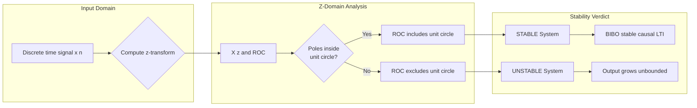

# Region of Convergence for the z Transform.

<!-- SECTION_1_START -->

# Region of Convergence (ROC) for the z-Transform

## 1.1 Formal Academic Definition

The **Region of Convergence (ROC)** of the z-Transform of a discrete-time signal $x[n]$ is defined as the set of all complex values of $z = re^{j\omega}$ (where $r$ is the magnitude and $\omega$ is the angle) in the complex z-plane for which the z-transform summation converges to a finite, bounded value.

Mathematically, the z-transform is:

$$X(z) = \sum_{n=-\infty}^{\infty} x[n] \, z^{-n}$$

The ROC is the set:

$$\text{ROC} = \left\{ z \in \mathbb{C} \, : \, \left\vert \sum_{n=-\infty}^{\infty} x[n] \, z^{-n} \right\vert < \infty \right\}$$

> [!IMPORTANT]
> **KTU 2024 Syllabus Highlight:** The ROC is *equally important* as $X(z)$ itself because two different signals can have identical z-transform expressions but completely different ROCs. Only the pair $(X(z), \text{ROC})$ uniquely identifies a signal.

## 1.2 Conceptual Analogy — The "Safe Operating Zone"

Imagine the z-plane as a vast ocean. The signal $x[n]$ is a "submarine" that needs to travel through this ocean without sinking (diverging). The **ROC is the safe region of the ocean** where the submarine can operate safely.

- **Outside the ROC** → the sum diverges (infinite) → submarine sinks.
- **Inside the ROC** → the sum converges (finite) → submarine floats safely.
- **Boundary of the ROC** → the "shoreline" where the sum just barely converges (e.g., $|z| = r = 1$).

> [!NOTE]
> **Geometric Intuition:** For a finite-duration signal, the ROC is the *entire z-plane* (except possibly $z=0$ or $z=\infty$). For an infinite-duration signal, the ROC is bounded by one or two circles centered at the origin.

## 1.3 Why Two Different Signals Can Share the Same $X(z)$

Consider:

- Signal 1: $x_1[n] = a^n u[n]$ (right-sided)
- Signal 2: $x_2[n] = -a^n u[-n-1]$ (left-sided)

Both yield $X(z) = \frac{1}{1 - a z^{-1}}$, but:

- $x_1[n]$ has ROC $|z| > |a|$
- $x_2[n]$ has ROC $|z| < |a|$

> [!NOTE]
> **Conclusion:** The ROC uniquely distinguishes the time-domain signal, and *vice versa*.

## 1.4 Visual Representation of the z-Plane

> [!VISUALIZATION CONTROL]
> **Concept:** Polar representation of $z = re^{j\omega}$ in the complex plane
> **GeoGebra / Desmos Input Equations:**
> * Polar form: `r = 1` and `r = 0.5` (concentric circles)
> * Angle sweep: `\omega = 0, \pi/2, \pi, 3\pi/2`
> **Visual Description:** Draw the unit circle ($r=1$) and another circle at $r=0.5$ centered at origin. Mark the real axis ($\omega = 0, \pi$) and imaginary axis. The ROC is the **annular region** between two such circles, depending on the signal.

---

<!-- SECTION_1_END -->

<!-- SECTION_2_START -->

# Deep Theoretical Analysis & KTU High-Yield Formula Sheet

## 2.1 Operational Properties of the ROC

The ROC depends on the **duration and boundedness** of $x[n]$. KTU examiners frequently test these as 3-mark short questions.

### Property 1 — Boundedness
The ROC is the region where $X(z)$ is **finite** (does not blow up to infinity).

### Property 2 — Ring / Annular Shape
For bilateral (two-sided) signals, the ROC is a **ring** (annulus) in the z-plane:

$$R_1 < \vert z \vert < R_2$$

where $R_1$ and $R_2$ are non-negative real numbers (possibly $0$ or $\infty$).

### Property 3 — Boundary Behavior at Poles
The ROC is **bounded by poles** of $X(z)$. Poles lie *on* the boundary or *outside* the ROC.

### Property 4 — Causality Check
- For a **causal** (right-sided) signal: ROC is the region **outside the outermost pole** → $|z| > R_{\max}$.
- For an **anti-causal** (left-sided) signal: ROC is the region **inside the innermost pole** → $|z| < R_{\min}$.
- For a **two-sided** signal: ROC is an annulus → $R_1 < |z| < R_2$.

### Property 5 — Finite-Duration Exception
A signal of finite duration has ROC = **entire z-plane**, except possibly $z = 0$ (if it includes $n > 0$ terms) or $z = \infty$ (if it includes $n < 0$ terms).

### Property 6 — Stability Indicator
A **causal LTI system is stable** if and only if its ROC **includes the unit circle** $|z| = 1$.

> [!IMPORTANT]
> **KTU High-Yield Trick:** "Causal + Stable" $\Rightarrow$ All poles lie **strictly inside** the unit circle, and the ROC extends from the outermost pole to $\infty$, thus covering $|z| = 1$.

## 2.2 The Six Canonical Signal Types and Their ROCs

| Signal Type | Form | ROC | $X(z)$ Example |
|---|---|---|---|
| Right-sided (causal) | $x[n] = a^n u[n]$ | $\vert z \vert > \vert a \vert$ | $\frac{1}{1 - a z^{-1}}$ |
| Left-sided (anti-causal) | $x[n] = -a^n u[-n-1]$ | $\vert z \vert < \vert a \vert$ | $\frac{1}{1 - a z^{-1}}$ |
| Two-sided | $x[n] = -a^n u[-n-1] + b^n u[n]$ | $\vert a \vert < \vert z \vert < \vert b \vert$ | Requires $|a|<|b|$ |
| Finite causal | $x[n] = \{1, 2, 5\}$ for $n = 0,1,2$ | $\vert z \vert > 0$ | $1 + 2z^{-1} + 5z^{-2}$ |
| Finite anti-causal | $x[n] = \{1, 2, 5\}$ for $n = -2,-1,0$ | $\vert z \vert < \infty$ | $z^{2} + 2z + 5$ |
| Finite two-sided | Symmetric finite length | all $z$ (entire plane) | Polynomial |

## 2.3 KTU Formula Sheet

| # | Concept | Formula / Condition |
|---|---|---|
| 1 | z-transform definition | $X(z) = \sum_{n=-\infty}^{\infty} x[n] z^{-n}$ |
| 2 | Magnitude substitution | $z = re^{j\omega} \Rightarrow z^{-n} = r^{-n} e^{-j\omega n}$ |
| 3 | Convergence condition | $\sum \vert x[n] \vert \, r^{-n} < \infty$ |
| 4 | Causal signal ROC | $\vert z \vert > R_{\max}$ (outermost pole radius) |
| 5 | Anti-causal signal ROC | $\vert z \vert < R_{\min}$ (innermost pole radius) |
| 6 | Two-sided signal ROC | $R_1 < \vert z \vert < R_2$ |
| 7 | Unit circle condition | Causal Stable $\iff \vert z \vert = 1$ lies in ROC |
| 8 | Pole-ROC exclusion | ROC cannot contain any pole of $X(z)$ |
| 9 | Time-reversal effect | If $x[n] \leftrightarrow X(z)$, ROC: $R_1 < \vert z \vert < R_2$, then $x[-n] \leftrightarrow X(1/z)$, ROC: $1/R_2 < \vert z \vert < 1/R_1$ |
| 10 | Multiplication by $a^n$ | $a^n x[n] \leftrightarrow X(z/a)$, ROC scaled by $\vert a \vert$ |

> [!NOTE]
> **Engineering Utility:** In digital filter design (IIR/FIR), the ROC determines whether the filter is **stable** and **causal**. DSP engineers plot the pole-zero diagram to instantly check stability by seeing if all poles are inside the unit circle.

## 2.4 Real-World Engineering Applications

1. **Digital Filter Design:** ROC analysis determines whether an IIR filter will be stable. Stability = ROC must include unit circle.
2. **Speech Processing:** z-transforms convert convolution in time domain to multiplication in z-domain, used in LPC (Linear Predictive Coding).
3. **Image Compression:** 2D z-transforms are used in JPEG-like codecs.
4. **Control Systems:** Discrete-time controllers are analyzed via ROC for stability and transient response.
5. **Biomedical Signal Processing:** ECG/EEG digital filters rely on z-transform ROC for real-time denoising.

---

<!-- SECTION_2_END -->

<!-- SECTION_3_START -->

# Step-by-Step Derivations & Symbolic Implementation

## 3.1 Derivation 1 — ROC of a Causal Exponential $x[n] = a^n u[n]$

**Step 1: Write the z-transform definition**

$$X(z) = \sum_{n=-\infty}^{\infty} a^n u[n] \, z^{-n}$$

**Step 2: Apply the unit step constraint** $u[n] = 1$ for $n \geq 0$, and $0$ for $n < 0$.

$$X(z) = \sum_{n=0}^{\infty} a^n \, z^{-n}$$

**Step 3: Rewrite as a geometric series**

$$X(z) = \sum_{n=0}^{\infty} (a z^{-1})^n$$

**Step 4: Apply the geometric series convergence condition** $|a z^{-1}| < 1$.

$$\left\vert \frac{a}{z} \right\vert < 1 \quad \Longrightarrow \quad \vert z \vert > \vert a \vert$$

**Step 5: Sum the series using the formula** $\sum_{n=0}^{\infty} r^n = \frac{1}{1-r}$ for $|r| < 1$.

$$X(z) = \frac{1}{1 - a z^{-1}}, \quad \text{ROC: } \vert z \vert > \vert a \vert$$

> **Convergence Logic Explained:** The geometric series converges only when the common ratio magnitude is less than 1. The ratio here is $a/z$, so we need $|a|/|z| < 1$, which rearranges to $|z| > |a|$.

## 3.2 Derivation 2 — ROC of an Anti-Causal Exponential $x[n] = -a^n u[-n-1]$

**Step 1: Write the z-transform definition**

$$X(z) = \sum_{n=-\infty}^{\infty} -a^n u[-n-1] \, z^{-n}$$

**Step 2: Apply the unit step constraint** $u[-n-1] = 1$ for $n \leq -1$, and $0$ for $n \geq 0$.

$$X(z) = \sum_{n=-\infty}^{-1} -a^n \, z^{-n}$$

**Step 3: Change the index** Let $k = -n$, so $n = -k$. When $n = -\infty$, $k = \infty$; when $n = -1$, $k = 1$. Also $a^n = a^{-k}$ and $z^{-n} = z^{k}$.

$$X(z) = \sum_{k=1}^{\infty} -a^{-k} \, z^{k} = -\sum_{k=1}^{\infty} (z/a)^k$$

**Step 4: Apply convergence condition** $|z/a| < 1$, i.e., $|z| < |a|$.

**Step 5: Sum the geometric series from $k=1$**

$$X(z) = -\frac{(z/a)}{1 - (z/a)} = \frac{-z/a}{(a-z)/a} = \frac{-z}{a-z} = \frac{z}{z-a}$$

**Step 6: Multiply numerator and denominator by $z^{-1}$**

$$X(z) = \frac{1}{1 - a z^{-1}}, \quad \text{ROC: } \vert z \vert < \vert a \vert$$

> **Convergence Logic Explained:** This is a left-sided signal, so the ROC is the **inside** of a circle of radius $|a|$ centered at origin.

## 3.3 Derivation 3 — ROC of a Two-Sided Signal $x[n] = -b^n u[-n-1] + a^n u[n]$

**Step 1: Apply linearity**

$$X(z) = \underbrace{\frac{1}{1 - a z^{-1}}}_{\text{causal part, ROC: } \vert z \vert > \vert a \vert} + \underbrace{\frac{1}{1 - b z^{-1}}}_{\text{anti-causal part, ROC: } \vert z \vert < \vert b \vert}$$

**Step 2: Find the common ROC** — intersection of the two regions.

$$\text{ROC} = \{\vert z \vert > \vert a \vert\} \cap \{\vert z \vert < \vert b \vert\}$$

**Step 3: This requires $|a| < |b|$, yielding:**

$$\text{ROC: } \vert a \vert < \vert z \vert < \vert b \vert$$

> **Key Insight:** If $|a| \geq |b|$, the ROC is **empty** (no common region), meaning the z-transform **does not exist** for this signal.

## 3.4 Derivation 4 — Stability Condition (Causal Signal)

A causal LTI system with impulse response $h[n]$ is **BIBO stable** iff:

$$\sum_{n=-\infty}^{\infty} \vert h[n] \vert < \infty$$

**Substituting** $z = e^{j\omega}$ on the unit circle, $|z| = 1$:

$$\left\vert H(z) \right\vert_{\vert z \vert = 1} = \left\vert \sum_{n=0}^{\infty} h[n] e^{-j\omega n} \right\vert \leq \sum_{n=0}^{\infty} \vert h[n] \vert < \infty$$

So the z-transform converges on the unit circle. For a causal signal with ROC $|z| > R_{\max}$, the unit circle lies in ROC if and only if $R_{\max} < 1$, i.e., all poles are inside the unit circle.

## 3.5 Python Implementation — ROC Visualization

```python
import numpy as np
import matplotlib.pyplot as plt

def plot_roc(a_mag, b_mag=None, title="Region of Convergence"):
    """
    Plots the ROC for various signal types in the z-plane.
    
    Parameters
    ----------
    a_mag : float
        Magnitude of the pole for causal / inner boundary.
    b_mag : float, optional
        Magnitude of the pole for two-sided ROC outer boundary.
    title : str
        Plot title.
    """
    fig, ax = plt.subplots(figsize=(7, 7))
    theta = np.linspace(0, 2 * np.pi, 400)
    
    # Unit circle
    ax.plot(np.cos(theta), np.sin(theta), 'k--', linewidth=1, label='Unit Circle')
    
    # Plot pole at radius a_mag on positive real axis
    ax.plot(a_mag, 0, 'rx', markersize=15, markeredgewidth=2, label=f'Pole at |a|={a_mag}')
    
    if b_mag is None:
        # Causal ROC: outside the pole
        circle_out = plt.Circle((0, 0), a_mag, color='blue', fill=False,
                                linestyle='-', linewidth=2, label='ROC Boundary')
        ax.add_patch(circle_out)
        # Shade the ROC region
        r_outer = a_mag * 1.6
        r = np.linspace(a_mag, r_outer, 200)
        R, T = np.meshgrid(r, theta)
        ax.fill(np.cos(T) * R, np.sin(T) * R, color='blue', alpha=0.15,
                label=f'ROC: |z| > {a_mag}')
    elif a_mag == b_mag:
        print("Empty ROC: |a| must be < |b|")
        return
    else:
        # Two-sided ROC: annulus
        r_outer = b_mag * 1.3
        r = np.linspace(a_mag, b_mag, 200)
        R, T = np.meshgrid(r, theta)
        ax.fill(np.cos(T) * R, np.sin(T) * R, color='green', alpha=0.20,
                label=f'ROC: {a_mag} < |z| < {b_mag}')
        # Pole markers
        ax.plot(b_mag, 0, 'rx', markersize=15, markeredgewidth=2,
                label=f'Pole at |b|={b_mag}')
    
    ax.axhline(0, color='gray', linewidth=0.5)
    ax.axvline(0, color='gray', linewidth=0.5)
    ax.set_xlim(-2, 2)
    ax.set_ylim(-2, 2)
    ax.set_aspect('equal')
    ax.grid(True, alpha=0.3)
    ax.set_xlabel('Re(z)')
    ax.set_ylabel('Im(z)')
    ax.set_title(title)
    ax.legend(loc='upper right')
    plt.tight_layout()
    plt.show()

# Test case 1: Causal exponential a = 0.5
plot_roc(a_mag=0.5, title="ROC of Causal Signal: x[n] = 0.5^n u[n]")

# Test case 2: Anti-causal exponential a = 0.5
# ROC: |z| < 0.5 (inside the circle)
def plot_anti_causal(a_mag, title):
    fig, ax = plt.subplots(figsize=(7, 7))
    theta = np.linspace(0, 2 * np.pi, 400)
    ax.plot(np.cos(theta), np.sin(theta), 'k--', linewidth=1, label='Unit Circle')
    ax.plot(a_mag, 0, 'rx', markersize=15, markeredgewidth=2, label=f'Pole at |a|={a_mag}')
    circle = plt.Circle((0, 0), a_mag, color='red', fill=False, linestyle='-', linewidth=2)
    ax.add_patch(circle)
    r = np.linspace(0, a_mag, 200)
    R, T = np.meshgrid(r, theta)
    ax.fill(np.cos(T) * R, np.sin(T) * R, color='red', alpha=0.20,
            label=f'ROC: |z| < {a_mag}')
    ax.axhline(0, color='gray', linewidth=0.5)
    ax.axvline(0, color='gray', linewidth=0.5)
    ax.set_xlim(-2, 2); ax.set_ylim(-2, 2)
    ax.set_aspect('equal'); ax.grid(True, alpha=0.3)
    ax.set_xlabel('Re(z)'); ax.set_ylabel('Im(z)')
    ax.set_title(title); ax.legend(loc='upper right')
    plt.tight_layout(); plt.show()

plot_anti_causal(0.5, "ROC of Anti-Causal Signal: x[n] = -0.5^n u[-n-1]")

# Test case 3: Two-sided signal |a| = 0.5, |b| = 1.2
plot_roc(a_mag=0.5, b_mag=1.2,
          title="ROC of Two-Sided Signal: 0.5 < |z| < 1.2")
```

## 3.6 Numerical Example — Worked Out

**Problem:** Find the ROC of $x[n] = 3^n u[n] - 2^n u[-n-1]$.

**Step 1: Identify both parts**

- Part 1: $3^n u[n]$ is causal, contributes ROC $|z| > 3$.
- Part 2: $-2^n u[-n-1]$ is anti-causal, contributes ROC $|z| < 2$.

**Step 2: Intersect the ROCs**

$\{|z| > 3\} \cap \{|z| < 2\} = \emptyset$ (empty)

**Step 3: Conclusion**

The z-transform **does not exist** because there is no common ROC.

> **Board Exam Tip:** Always check ROC existence before claiming $X(z)$ is valid. Empty ROC = no z-transform.

---

<!-- SECTION_3_END -->

<!-- SECTION_4_START -->

# Structural Diagrams & Schematics

## 4.1 ROC Decision Flowchart for Signal Classification

```mermaid
flowchart TD
    A[Start: Given x n] --> B{Is the signal\nfinite duration?}
    B -- Yes --> C[ROC = Entire z plane\nexcept possibly z=0 or z=infinity]
    B -- No --> D{Does the signal\nextend to n=infinity?}
    D -- Yes --> E{Does the signal\nextend to n=-infinity?}
    D -- No --> F[Left sided Anti-causal]\nROC inside innermost pole
    E -- Yes --> G[Two-sided signal]\nROC: R1 less than z less than R2
    E -- No --> H[Right sided Causal]\nROC outside outermost pole
    H --> I{Is system stable?}
    I -- Yes --> J[All poles inside unit circle]
    I -- No --> K[Poles on or outside unit circle]
```

## 4.2 Block Diagram — ROC & Stability Relationship



## 4.3 Pole-Zero Plot for Three Canonical Cases

```mermaid
flowchart TB
    subgraph Case1[Case 1 Causal a=0.5]
        P1[Pole at z=0.5] -.->|Boundary| R1[ROC: outside z greater than 0.5]
        R1 --> U1[Unit circle z=1 lies in ROC]
        U1 --> S1[STABLE]
    end
    
    subgraph Case2[Case 2 Anti-Causal a=0.5]
        P2[Pole at z=0.5] -.->|Boundary| R2[ROC: inside z less than 0.5]
        R2 --> U2[Unit circle outside ROC]
        U2 --> S2[UNSTABLE for causal interpretation]
    end
    
    subgraph Case3[Case 3 Two-Sided a=0.3 b=1.5]
        P3a[Pole at z=0.3] -.->|Inner boundary| R3
        P3b[Pole at z=1.5] -.->|Outer boundary| R3[ROC: 0.3 less than z less than 1.5]
        R3 --> U3[Unit circle z=1 lies in ROC]
        U3 --> S3[STABLE]
    end
```



## 4.4 Topology Matrix — Signal vs ROC Mapping

| Signal Type | Time Domain Extent | ROC Shape | Pole Position | Stability (Causal View) |
|---|---|---|---|---|
| Finite causal $n \in [0, N-1]$ | Right, finite | All $z$ except $z=0$ | None (polynomial) | Trivially stable |
| Infinite causal $a^n u[n]$ | Right, infinite | Outside circle $\vert z \vert > \vert a \vert$ | $\vert a \vert$ | Stable iff $\vert a \vert < 1$ |
| Anti-causal $-a^n u[-n-1]$ | Left, infinite | Inside circle $\vert z \vert < \vert a \vert$ | $\vert a \vert$ | Unstable if interpreted as causal |
| Two-sided $a^n u[n] - b^n u[-n-1]$ | Both, infinite | Annulus $\vert a \vert < \vert z \vert < \vert b \vert$ | $\vert a \vert, \vert b \vert$ | Stable iff $\vert b \vert > 1$ |
| Single impulse $\delta[n]$ | $n=0$ | All $z$ | None | Stable |

---

<!-- SECTION_4_END -->

<!-- SECTION_5_START -->

# KTU 2024 Scheme Examination Question Bank & Topic Recap

## Part A — 3 Mark Questions

### Question 1
`[KTU University Exam - Dec 2023]` — **CO1, Remember**

**Define the Region of Convergence (ROC) of the z-transform. Why is it necessary to specify the ROC along with $X(z)$?**

**Model Answer (3 Marks):**

The **Region of Convergence (ROC)** of a z-transform $X(z) = \sum_{n=-\infty}^{\infty} x[n] z^{-n}$ is the set of all complex values of $z$ for which this infinite sum converges to a finite value. **[1 Mark]**

ROC is necessary because two entirely different signals can have the same algebraic expression for $X(z)$ but differ in the range of $z$ over which the sum converges. **[1 Mark]**

For example, $x_1[n] = a^n u[n]$ and $x_2[n] = -a^n u[-n-1]$ both give $X(z) = \frac{1}{1 - a z^{-1}}$, but the ROCs are $|z| > |a|$ and $|z| < |a|$ respectively. **[1 Mark]**

### Question 2
`[KTU University Exam - July 2024]` — **CO1, Understand**

**State any four properties of the ROC of the z-transform.**

**Model Answer (3 Marks):**

1. The ROC is a ring or annular region in the z-plane: $R_1 < \vert z \vert < R_2$, possibly extending to $\infty$ or shrinking to $0$. **[1 Mark]**
2. The ROC does not include any pole of $X(z)$. **[0.5 Mark]**
3. If $x[n]$ is finite duration, the ROC is the entire z-plane (except possibly $z=0$ or $z=\infty$). **[0.5 Mark]**
4. A causal LTI system is stable if and only if the ROC includes the unit circle $\vert z \vert = 1$. **[1 Mark]**

---

## Part B — 14 Mark Questions (Module Internal Choice)

### Question A (14 Marks)
`[KTU University Exam - Dec 2023]` — **CO1, Apply**

**(a)** Determine the z-transform and the ROC of the causal signal $x[n] = (0.5)^n u[n] + (0.8)^n u[n]$. **[7 Marks]**

**(b)** A causal LTI system is described by the difference equation $y[n] - 0.9 y[n-1] = x[n]$. Determine whether the system is stable. Justify using ROC. **[7 Marks]**

#### Model Solution

**Part (a) — 7 Marks**

**Step 1: Apply linearity of the z-transform.** *[Linearity: 1 Mark]*

$$X(z) = \frac{1}{1 - 0.5 z^{-1}} + \frac{1}{1 - 0.8 z^{-1}}, \quad \text{ROC: } \vert z \vert > 0.8$$

**Step 2: Combine over a common denominator.** *[Algebraic combination: 2 Marks]*

$$X(z) = \frac{(1 - 0.8 z^{-1}) + (1 - 0.5 z^{-1})}{(1 - 0.5 z^{-1})(1 - 0.8 z^{-1})} = \frac{2 - 1.3 z^{-1}}{1 - 1.3 z^{-1} + 0.4 z^{-2}}$$

**Step 3: Find the poles.** *[Pole calculation: 1 Mark]*

Poles at $z = 0.5$ and $z = 0.8$. The outermost pole is $0.8$, so ROC is $\vert z \vert > 0.8$. *[ROC determination: 1 Mark]*

**Step 4: Express poles factored in $z$ form.** *[Factored form: 1 Mark]*

$$X(z) = \frac{2z^2 - 1.3z}{z^2 - 1.3z + 0.4} = \frac{z(2z - 1.3)}{(z - 0.5)(z - 0.8)}$$

**Step 5: Stability check.** *[Final inference: 1 Mark]*

Since both poles are inside the unit circle ($0.5 < 1$ and $0.8 < 1$), the unit circle lies in the ROC, so the system is stable.

---

**Part (b) — 7 Marks**

**Step 1: Take the z-transform of the difference equation.** *[Transform application: 1 Mark]*

$$Y(z) - 0.9 z^{-1} Y(z) = X(z)$$

**Step 2: Solve for the transfer function.** *[Transfer function derivation: 1 Mark]*

$$H(z) = \frac{Y(z)}{X(z)} = \frac{1}{1 - 0.9 z^{-1}} = \frac{z}{z - 0.9}$$

**Step 3: Identify the pole.** *[Pole identification: 1 Mark]*

The pole is at $z = 0.9$.

**Step 4: Determine ROC.** *[ROC determination: 1 Mark]*

Since the system is causal, ROC is $\vert z \vert > 0.9$.

**Step 5: Check stability.** *[Stability verdict: 1 Mark]*

For stability, the ROC must include the unit circle $\vert z \vert = 1$. Since $1 > 0.9$, the unit circle lies within the ROC. Therefore, the system is **stable**. *[Stating the condition: 1 Mark]*

**Step 6: Verification with impulse response.** *[Alternative method: 1 Mark]*

The impulse response is $h[n] = (0.9)^n u[n]$. The sum $\sum_{n=0}^{\infty} (0.9)^n = \frac{1}{1 - 0.9} = 10 < \infty$, confirming BIBO stability.

---

### Question B (14 Marks) — Alternative Choice
`[KTU University Exam - July 2024]` — **CO1, Apply**

**(a)** Find the z-transform and ROC of $x[n] = - (0.6)^n u[-n-1] + (0.4)^n u[n]$. **[7 Marks]**

**(b)** Explain the stability condition of a causal LTI system in terms of ROC and poles. Show that if $H(z) = \frac{1 - z^{-1}}{1 - 0.25 z^{-2}}$, the system is stable. **[7 Marks]**

#### Model Solution

**Part (a) — 7 Marks**

**Step 1: Apply linearity and identify each part.** *[Signal decomposition: 1 Mark]*

- Causal part: $(0.4)^n u[n]$ has ROC $\vert z \vert > 0.4$ and $X_1(z) = \frac{1}{1 - 0.4 z^{-1}}$.
- Anti-causal part: $-(0.6)^n u[-n-1]$ has ROC $\vert z \vert < 0.6$ and $X_2(z) = \frac{1}{1 - 0.6 z^{-1}}$.

**Step 2: Combine.** *[Summation: 1 Mark]*

$$X(z) = \frac{1}{1 - 0.4 z^{-1}} + \frac{1}{1 - 0.6 z^{-1}}$$

**Step 3: Common denominator.** *[Algebra: 1 Mark]*

$$X(z) = \frac{2 - z^{-1}}{1 - z^{-1} + 0.24 z^{-2}}$$

**Step 4: Poles at $z = 0.4$ and $z = 0.6$.** *[Pole identification: 1 Mark]*

**Step 5: Common ROC.** *[ROC intersection: 2 Marks]*

$$\text{ROC: } 0.4 < \vert z \vert < 0.6$$

**Step 6: Final expression and verification.** *[Final form: 1 Mark]*

$$X(z) = \frac{2z^2 - z}{z^2 - z + 0.24} = \frac{z(2z - 1)}{(z - 0.4)(z - 0.6)}$$

This is a valid two-sided z-transform since the common ROC is non-empty.

---

**Part (b) — 7 Marks**

**Step 1: State the stability theorem.** *[Theorem statement: 1 Mark]*

A causal LTI system is stable if and only if all its poles lie strictly inside the unit circle in the z-plane, i.e., $\vert p_k \vert < 1$ for all poles $p_k$.

**Step 2: Equivalently, the ROC (which is $\vert z \vert > R_{\max}$) must include the unit circle $\vert z \vert = 1$.** *[ROC condition: 1 Mark]*

**Step 3: Analyze $H(z)$.** *[Factor denominator: 1 Mark]*

$$H(z) = \frac{1 - z^{-1}}{1 - 0.25 z^{-2}} = \frac{z(z-1)}{z^2 - 0.25}$$

**Step 4: Find poles by solving $z^2 - 0.25 = 0$.** *[Pole calculation: 1 Mark]*

$$z^2 = 0.25 \Rightarrow z = \pm 0.5$$

So poles are at $z = 0.5$ and $z = -0.5$.

**Step 5: Check pole magnitudes.** *[Magnitude check: 1 Mark]*

$\vert 0.5 \vert = 0.5 < 1$ and $\vert -0.5 \vert = 0.5 < 1$. Both poles are inside the unit circle.

**Step 6: ROC and stability conclusion.** *[ROC stability inference: 1 Mark]*

Since the system is causal (implied by rational form with denominator degree $\geq$ numerator degree in $z$), ROC is $\vert z \vert > 0.5$, which includes $\vert z \vert = 1$. Therefore, the system is **stable**.

**Step 7: BIBO verification.** *[BIBO proof: 1 Mark]*

The impulse response $h[n]$ decays as $(0.5)^n$, so $\sum_{n=0}^{\infty} \vert h[n] \vert < \infty$, confirming stability.

---

> [!WARNING]
> **KTU Examiner's Valuation Warning / Pitfall Callout**
> 1. **Do not confuse ROC with the expression $X(z)$.** Students often write only the algebraic form and forget to mention the ROC. This loses 1 to 2 marks in every problem. Always state ROC explicitly.
> 2. **For two-sided signals, verify the ROC is non-empty.** If $|a| \geq |b|$, the ROC is empty and the z-transform does not exist. Writing $X(z)$ without this check is a common error.
> 3. **Causality must be stated.** If the question says "causal", the ROC is *outside* the outermost pole. Do not write $|z| < R_{\max}$ for a causal signal.
> 4. **Stability requires both:** (a) Causal (or anti-causal with stable interpretation), AND (b) Unit circle lies in ROC. Forgetting the second condition costs full stability marks.
> 5. **Poles vs Zeros:** ROC boundaries are determined by *poles*, not zeros. Zeros can lie inside, outside, or on the boundary — they do not restrict the ROC.

---

## Topic Recap & Important Things to Remember

- **ROC Definition:** Set of all $z$ in the complex plane where the z-transform sum converges to a finite value.
- **Why ROC matters:** Two signals can share the same $X(z)$ but differ in ROC. ROC uniquely identifies the time-domain signal.
- **Three canonical ROCs:**
  - Right-sided (causal) signal → $\vert z \vert > R_{\max}$
  - Left-sided (anti-causal) signal → $\vert z \vert < R_{\min}$
  - Two-sided signal → $R_1 < \vert z \vert < R_2$
- **Finite duration signal** → ROC is the entire z-plane (except possibly $z=0$ or $z=\infty$).
- **Pole-ROC relation:** Poles lie on the boundary of the ROC; ROC never contains a pole.
- **Stability condition:** For a causal LTI system, stability $\iff$ all poles strictly inside the unit circle $\iff$ ROC includes $\vert z \vert = 1$.
- **Time reversal:** If $x[n]$ has ROC $R_1 < \vert z \vert < R_2$, then $x[-n]$ has ROC $1/R_2 < \vert z \vert < 1/R_1$.
- **Multiplication by $a^n$:** If $x[n]$ has ROC $R_1 < \vert z \vert < R_2$, then $a^n x[n]$ has ROC $R_1 \vert a \vert < \vert z \vert < R_2 \vert a \vert$.
- **Empty ROC check:** Always verify that $R_1 < R_2$ for two-sided signals; otherwise the z-transform does not exist.
- **Standard z-transform pairs to memorize:**
  - $\delta[n] \leftrightarrow 1$, all $z$
  - $u[n] \leftrightarrow \frac{1}{1 - z^{-1}}$, $\vert z \vert > 1$
  - $a^n u[n] \leftrightarrow \frac{1}{1 - a z^{-1}}$, $\vert z \vert > \vert a \vert$
  - $-a^n u[-n-1] \leftrightarrow \frac{1}{1 - a z^{-1}}$, $\vert z \vert < \vert a \vert$
  - $n a^n u[n] \leftrightarrow \frac{a z^{-1}}{(1 - a z^{-1})^2}$, $\vert z \vert > \vert a \vert$
- **Board exam mantra:** "Poles at the boundary, ROC ring-shaped, unit circle for stability."

---

<!-- SECTION_5_END -->
