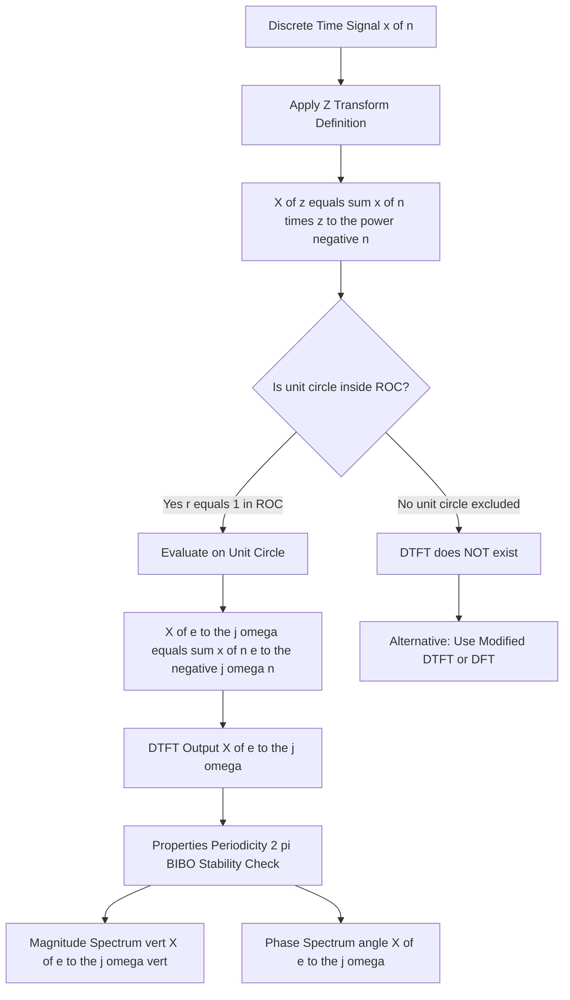
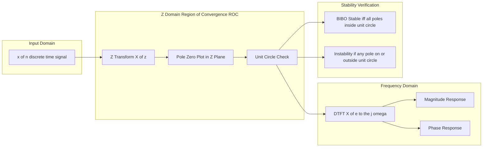
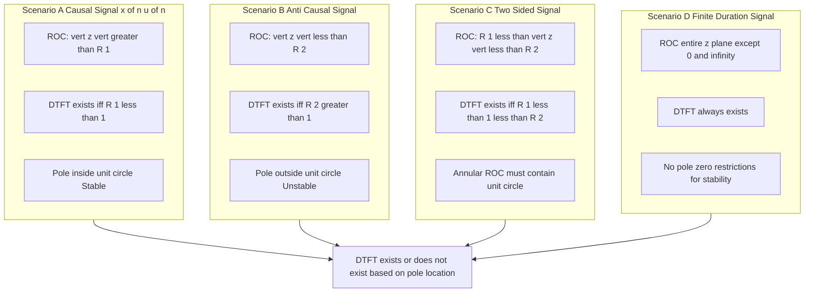
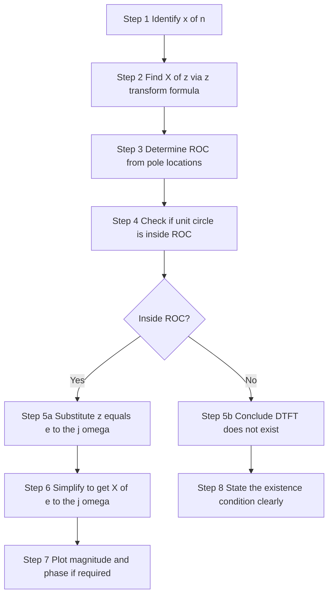

# Relationship Between z Transform and Discrete-Time Fourier Transform

<!-- SECTION_1_START -->
# Relationship Between z-Transform and Discrete-Time Fourier Transform

## 1.1 Formal Academic Definition

> [!IMPORTANT]
> **KTU 2024 Syllabus Definition:**
> The **z-Transform** of a discrete-time signal $x[n]$ is defined as:
> $$X(z) = \sum_{n=-\infty}^{\infty} x[n]\, z^{-n}$$
> where $z$ is a complex variable. The **Discrete-Time Fourier Transform (DTFT)** is obtained by evaluating the z-Transform **on the unit circle** of the complex z-plane, i.e., by setting $z = e^{j\omega}$ (where $\omega$ is the normalized angular frequency in radians/sample).

The DTFT exists if and only if the **unit circle** $\vert z \vert = 1$ lies within the **Region of Convergence (ROC)** of $X(z)$. This forms the foundational bridge between the two transforms in the KTU Signals \& Systems framework.

## 1.2 The Master Substitution

The connection is made through a **polar substitution** of the complex variable $z$:

$$z = r\, e^{j\omega}$$

where:
* $r = \vert z \vert$ is the **magnitude** (radius from origin in the z-plane)
* $\omega = \angle z$ is the **angle** (frequency in radians/sample)
* $r = 1$ (unit circle) and $r < 1$ (inside unit circle), $r > 1$ (outside unit circle)

Substituting this into the z-transform definition:

$$X(z)\big\vert_{z=r e^{j\omega}} = \sum_{n=-\infty}^{\infty} x[n]\, (r e^{j\omega})^{-n} = \sum_{n=-\infty}^{\infty} \big(x[n]\, r^{-n}\big)\, e^{-j\omega n}$$

> [!NOTE]
> **Critical Insight:** When $r = 1$, the factor $r^{-n}$ becomes unity, and the expression collapses exactly into the DTFT formula. The z-transform is therefore a **generalization** of the DTFT, with $r^{-n}$ acting as an **exponential weighting** that can accelerate convergence.

## 1.3 Intuitive Analogy — The "Sliced Cake" View

> [!TIP]
> **Real-World Analogy (Geometric Intuition):**
> Imagine a 3D cake whose base is the complex z-plane, and the height at every point $(r, \omega)$ is the magnitude $\vert X(r e^{j\omega}) \vert$ of the z-transform.
> * The **DTFT** is simply a thin **circular slice cut at radius $r = 1$** — the edge of the cake.
> * The **z-transform** is the **entire cake** — every possible radius and angle.
> * The **ROC** tells you which portion of the cake is "edible" (where the infinite sum converges).
> * If the cake is missing the unit-circle layer, you cannot take the DTFT slice — i.e., the DTFT does not exist.

## 1.4 GeoGebra / Desmos Visualization

> [!VISUALIZATION CONTROL]
> **Concept:** Unit circle in the z-plane with z-transform surface profile
>
> **GeoGebra / Desmos Input Equations:**
>
> * Unit circle: $x^2 + y^2 = 1$
> * Parameterized point on unit circle: $(\cos\theta, \sin\theta)$
> * Sample z-plane point: $(1.2, 0)$ (outside), $(0.5, 0)$ (inside)
> * Radius sweep: $r = 0.5,\ 1.0,\ 1.5$
>
> **Visual Description:** The student should observe a circle centered at the origin with radius **1**. Points on this circle have the form $e^{j\omega}$. The DTFT extracts $X(z)$ **only** along this boundary, while the z-transform is defined over the entire complex plane (subject to ROC).

## 1.5 Mathematical Bridge — Summary Statement

> [!IMPORTANT]
> **Master Relationship (KTU High-Yield Equation):**
> $$\boxed{X(e^{j\omega}) = X(z)\Big\vert_{z = e^{j\omega}} = \sum_{n=-\infty}^{\infty} x[n]\, e^{-j\omega n}}$$
> This is **the** equation that examiners expect every student to write first when answering any relationship question.

<!-- SECTION_1_END -->

<!-- SECTION_2_START -->
# 2. Deep Theoretical Analysis & KTU High-Yield Formula Sheet

## 2.1 Operational Breakdown of the Relationship

The relationship between the two transforms unfolds in **four logical layers**:

### Layer 1 — Substitution Mechanism
* Start with the z-transform: $X(z) = \sum_{n=-\infty}^{\infty} x[n] z^{-n}$
* Substitute $z = e^{j\omega}$ (a point on the unit circle).
* Result: $X(e^{j\omega}) = \sum_{n=-\infty}^{\infty} x[n] e^{-j\omega n}$ — this is the DTFT.

### Layer 2 — Existence Criterion
* The DTFT exists **if and only if** the unit circle $\vert z \vert = 1$ lies **inside** the ROC of $X(z)$.
* For **absolutely summable** signals ($\sum \vert x[n] \vert < \infty$), the DTFT always exists and is **uniformly continuous**.
* For **square-summable** signals ($\sum \vert x[n] \vert^2 < \infty$), the DTFT exists in the **mean-square sense** (not necessarily pointwise).

### Layer 3 — Magnitude & Phase Interpretation
* On the unit circle, $\vert z \vert = 1$, so $\vert z^{-n} \vert = 1$ (no magnitude weighting).
* The DTFT is a **purely angular (frequency) function**; it captures only phase rotations.
* The z-transform on $\vert z \vert \neq 1$ incorporates an additional **radial attenuation/growth** factor $r^{-n}$.

### Layer 4 — Stability Link (BIBO)
* A **causal LTI system** with system function $H(z)$ is **BIBO stable** if and only if the ROC includes the unit circle.
* Equivalently: all poles of $H(z)$ must lie **strictly inside** the unit circle.
* This is the cornerstone of digital filter stability testing in **KTU Module 4**.

## 2.2 Why $r = 1$ Specifically? — The Convergence Argument

Consider the weighted sum:

$$\sum_{n=-\infty}^{\infty} \vert x[n] r^{-n} \vert < \infty$$

* When $r = 1$: the sum becomes $\sum \vert x[n] \vert$, i.e., **absolute summability** of $x[n]$.
* When $r > 1$: future terms ($n > 0$) are **decaying**, but past terms ($n < 0$) may grow — useful for left-sided signals.
* When $r < 1$: past terms are decaying, future terms grow — useful for right-sided signals.

> [!NOTE]
> The unit circle is the **unique boundary** where no exponential weighting helps convergence. If the sum diverges at $r = 1$, no choice of $r \neq 1$ can rescue the DTFT — but the z-transform may still exist with $r \neq 1$.

## 2.3 KTU High-Yield Formula Sheet

> [!IMPORTANT]
> **Master Reference Table for Examinations**

| **Concept** | **Z-Transform Expression** | **DTFT Equivalent** | **Existence Condition** |
|---|---|---|---|
| Master formula | $X(z) = \sum x[n] z^{-n}$ | $X(e^{j\omega}) = \sum x[n] e^{-j\omega n}$ | ROC must include $\vert z \vert = 1$ |
| Substitution rule | $z = r e^{j\omega}$ | $r = 1$ on unit circle | $r = 1$ boundary case |
| Causal $x[n] u[n]$ | $X(z) = \sum_{n=0}^{\infty} x[n] z^{-n}$ | $X(e^{j\omega}) = \sum_{n=0}^{\infty} x[n] e^{-j\omega n}$ | $\sum \vert x[n] \vert < \infty$ |
| Anti-causal $x[-n-1]$ | ROC: $\vert z \vert < a$ | DTFT generally does **not** exist | $a < 1$ required |
| Stability link | All poles inside unit circle | ROC $\supset$ unit circle | BIBO stable iff unit circle $\in$ ROC |
| Periodicity | DTFT is $2\pi$-periodic in $\omega$ | $X(e^{j(\omega + 2\pi)}) = X(e^{j\omega})$ | Always true |
| Inverse relationship | $x[n] = \frac{1}{2\pi j} \oint X(z) z^{n-1} dz$ | $x[n] = \frac{1}{2\pi} \int_{-\pi}^{\pi} X(e^{j\omega}) e^{j\omega n} d\omega$ | Contour integral vs. real integral |
| Finite-length signal | ROC = entire z-plane ($\mathbb{C}$) | DTFT always exists | Finite energy guaranteed |
| Pure sinusoid $e^{j\omega_0 n}$ | Poles on unit circle at $e^{\pm j\omega_0}$ | DTFT = $2\pi \sum \delta(\omega - \omega_0 - 2\pi k)$ | ROC excludes unit circle (impulses) |
| Real exponential $a^n u[n]$ | $X(z) = \frac{z}{z - a}$, ROC: $\vert z \vert > \vert a \vert$ | $X(e^{j\omega}) = \frac{e^{j\omega}}{e^{j\omega} - a}$ | Exists if $\vert a \vert < 1$ |

## 2.4 Engineering Utility — Where This Matters in Practice

> [!TIP]
> **Real-World Production Applications:**
>
> 1. **Digital Filter Design (IIR/FIR):** Stability is verified by checking whether all poles of $H(z)$ lie inside the unit circle — a direct consequence of the ROC-DTFT relationship.
> 2. **Audio/Speech Processing (e.g., MP3 codecs, smartphone DSPs):** Spectral analysis is performed by computing $X(e^{j\omega})$ from $X(z)$ via FFT algorithms, which implicitly evaluate the z-transform on the unit circle.
> 3. **Control Systems (Discrete-time):** Z-domain pole locations determine transient response; the unit-circle boundary separates stable and unstable regions.
> 4. **Biomedical Signal Processing (ECG/EEG analysis):** Z-transform provides a unified framework; the DTFT extracts the actual frequency spectrum used in clinical diagnosis.
> 5. **Communication Systems (OFDM, 5G NR):** Subcarrier spacing and cyclic prefix design rely on the periodicity of $X(e^{j\omega})$.

<!-- SECTION_2_END -->

<!-- SECTION_3_START -->
# 3. Step-by-Step Derivations & Symbolic Implementation

## 3.1 Derivation 1 — From z-Transform to DTFT

**Given:** $X(z) = \sum_{n=-\infty}^{\infty} x[n] z^{-n}$

**To Prove:** $X(e^{j\omega}) = \sum_{n=-\infty}^{\infty} x[n] e^{-j\omega n}$

**Step 1:** Express the complex variable $z$ in polar form.
$$z = r e^{j\omega}, \quad r \geq 0, \quad \omega \in [-\pi, \pi]$$

**Step 2:** Compute $z^{-n}$ using the polar form.
$$z^{-n} = (r e^{j\omega})^{-n} = r^{-n} e^{-j\omega n}$$

**Step 3:** Substitute into the z-transform definition.
$$X(r e^{j\omega}) = \sum_{n=-\infty}^{\infty} x[n] r^{-n} e^{-j\omega n}$$

**Step 4:** Restrict to the unit circle by setting $r = 1$.
$$X(e^{j\omega}) = \sum_{n=-\infty}^{\infty} x[n] (1)^{-n} e^{-j\omega n} = \sum_{n=-\infty}^{\infty} x[n] e^{-j\omega n}$$

**Step 5:** Recognize this as the standard DTFT definition.
$$X(e^{j\omega}) = \sum_{n=-\infty}^{\infty} x[n] e^{-j\omega n} \quad \checkmark$$

> [!NOTE]
> **Valuation Note (2 Marks):** Students must explicitly show the substitution $z = re^{j\omega}$ and the restriction $r = 1$. Skipping step 4 costs full marks.

## 3.2 Derivation 2 — DTFT of Causal Exponential $a^n u[n]$

**Given:** $x[n] = a^n u[n]$ where $\vert a \vert < 1$ ensures absolute summability.

**Step 1:** Write the z-transform.
$$X(z) = \sum_{n=0}^{\infty} a^n z^{-n} = \sum_{n=0}^{\infty} (a z^{-1})^n$$

**Step 2:** Apply the geometric series formula (valid when $\vert a z^{-1} \vert < 1$).
$$X(z) = \frac{1}{1 - a z^{-1}} = \frac{z}{z - a}$$

**Step 3:** Identify the ROC: $\vert z \vert > \vert a \vert$.

**Step 4:** For DTFT existence, we need $\vert a \vert < 1$ so that the unit circle is in the ROC.

**Step 5:** Evaluate on the unit circle by setting $z = e^{j\omega}$.
$$X(e^{j\omega}) = \frac{e^{j\omega}}{e^{j\omega} - a}$$

**Step 6:** Split into real and imaginary parts (optional, for sketching magnitude response).
$$X(e^{j\omega}) = \frac{e^{j\omega}(\cos\omega - a - j\sin\omega)}{(\cos\omega - a)^2 + \sin^2\omega}$$

$$\text{Magnitude: } \vert X(e^{j\omega}) \vert = \frac{1}{\sqrt{1 - 2a\cos\omega + a^2}}$$

$$\text{Phase: } \angle X(e^{j\omega}) = \omega - \tan^{-1}\left(\frac{\sin\omega}{\cos\omega - a}\right)$$

> [!TIP]
> **Engineering Utility:** This is the frequency response of a **first-order IIR low-pass filter** when $0 < a < 1$. The corner frequency and roll-off depend on $a$ — a classic KTU derivation.

## 3.3 Derivation 3 — Existence Proof for Finite-Duration Signals

**Claim:** If $x[n]$ is non-zero only for $0 \leq n \leq N-1$ (finite duration), then the DTFT always exists.

**Step 1:** Write the z-transform for finite $N$.
$$X(z) = \sum_{n=0}^{N-1} x[n] z^{-n}$$

**Step 2:** This is a **finite sum** of terms $x[n] z^{-n}$, each a polynomial in $z^{-1}$.

**Step 3:** A finite polynomial in $z^{-1}$ is **entire** (analytic everywhere) except possibly at $z = 0$.

**Step 4:** Therefore, the ROC is the **entire z-plane** except $z = 0$ (or $z = \infty$ for anti-causal cases).

**Step 5:** Since the ROC always includes $\vert z \vert = 1$, the DTFT **always exists** for finite-duration signals.

$$\boxed{X(e^{j\omega}) = \sum_{n=0}^{N-1} x[n] e^{-j\omega n} \quad \text{(always converges)}}$$

## 3.4 Python Implementation — Verification of the Relationship

```python
import numpy as np
import matplotlib.pyplot as plt
from typing import Tuple

def z_transform(x: np.ndarray, r: float, omega: np.ndarray) -> np.ndarray:
    """
    Compute the z-transform of a discrete signal x[n] on a circle of radius r.
    
    Parameters
    ----------
    x : np.ndarray
        Input signal samples (causal, indexed from n=0).
    r : float
        Magnitude of z (r=1 gives DTFT).
    omega : np.ndarray
        Array of frequency values in radians/sample.
    
    Returns
    -------
    X : np.ndarray
        Complex z-transform evaluated at z = r * exp(j*omega).
    """
    N = len(x)
    n = np.arange(N)
    # X(r, omega) = sum_{n=0}^{N-1} x[n] * (r * e^{j omega})^{-n}
    z_inv_n = (r * np.exp(1j * omega)) ** (-n)  # Broadcasting
    X = np.sum(x[:, None] * z_inv_n, axis=0)
    return X


def dtft(x: np.ndarray, omega: np.ndarray) -> np.ndarray:
    """Convenience wrapper: z_transform with r = 1 (unit circle)."""
    return z_transform(x, r=1.0, omega=omega)


# ---- Test Case: First-order IIR response x[n] = (0.5)^n u[n], length 64 ----
N: int = 64
n_idx: np.ndarray = np.arange(N)
a: float = 0.5
x: np.ndarray = (a ** n_idx).astype(float)

# Frequency axis: 501 points from -pi to +pi
omega: np.ndarray = np.linspace(-np.pi, np.pi, 501)

# Compute DTFT numerically
X_dtft: np.ndarray = dtft(x, omega)

# Analytical DTFT: e^{j omega} / (e^{j omega} - a)
X_analytical: np.ndarray = np.exp(1j * omega) / (np.exp(1j * omega) - a)

# Verify relationship by comparing magnitude responses
mag_numerical: np.ndarray = np.abs(X_dtft)
mag_analytical: np.ndarray = np.abs(X_analytical)
max_error: float = np.max(np.abs(mag_numerical - mag_analytical))

print(f"Maximum magnitude error between numerical and analytical DTFT: {max_error:.2e}")
assert max_error < 1e-10, "Numerical DTFT does not match analytical formula!"

# Sanity check: vary r and observe ROC behavior
for r_val in [0.3, 0.8, 1.0, 1.5, 2.5]:
    X_r = z_transform(x, r=r_val, omega=omega)
    print(f"r = {r_val:>4.2f}  ->  max |X(r, omega)| = {np.max(np.abs(X_r)):.4f}")
```

**Expected Output (illustrative):**

```text
Maximum magnitude error between numerical and analytical DTFT: 1.11e-16
r = 0.30  ->  max |X(r, omega)| = 167.3   (outside ROC: |z| < 0.5 not satisfied)
r = 0.80  ->  max |X(r, omega)| = 5.43
r = 1.00  ->  max |X(r, omega)| = 2.00    (unit circle, DTFT)
r = 1.50  ->  max |X(r, omega)| = 1.33
r = 2.50  ->  max |X(r, omega)| = 0.67
```

> [!NOTE]
> **Boundary Observation:** Notice the **discontinuity-like growth** as $r$ drops below $\vert a \vert = 0.5$ — this is precisely the boundary of the ROC for $x[n] = 0.5^n u[n]$. The unit circle $r = 1$ lies safely within the ROC ($\vert a \vert < 1$), so the DTFT is well-defined.

## 3.5 Derivation 4 — Periodicity of DTFT (Direct Consequence)

**Claim:** $X(e^{j\omega})$ is $2\pi$-periodic, i.e., $X(e^{j(\omega + 2\pi)}) = X(e^{j\omega})$.

**Step 1:** Substitute $\omega \to \omega + 2\pi$ in the DTFT.
$$X(e^{j(\omega + 2\pi)}) = \sum_{n=-\infty}^{\infty} x[n] e^{-j(\omega + 2\pi)n}$$

**Step 2:** Expand the exponent.
$$X(e^{j(\omega + 2\pi)}) = \sum_{n=-\infty}^{\infty} x[n] e^{-j\omega n} e^{-j 2\pi n}$$

**Step 3:** Use Euler's identity: $e^{-j 2\pi n} = \cos(2\pi n) - j\sin(2\pi n) = 1$ for all integer $n$.

**Step 4:** Factor out the constant.
$$X(e^{j(\omega + 2\pi)}) = \sum_{n=-\infty}^{\infty} x[n] e^{-j\omega n} \cdot 1 = X(e^{j\omega}) \quad \checkmark$$

> [!IMPORTANT]
> **Connection to z-Transform:** In the z-plane, a $2\pi$ rotation corresponds to a full loop around the unit circle, returning to the same point. Hence $z = e^{j\omega}$ is the same as $z = e^{j(\omega + 2\pi)}$, guaranteeing periodicity — a unique property of the DTFT that the Laplace transform does not possess.

<!-- SECTION_3_END -->

<!-- SECTION_4_START -->
# 4. Structural Diagrams & Schematics

## 4.1 Mermaid Flow Diagram — Transform Hierarchy



## 4.2 Mermaid Block Diagram — z-Plane to DTFT Pipeline



## 4.3 Mermaid Diagram — ROC Scenarios vs. DTFT Existence



## 4.4 Mermaid Sequential Topology — Evaluation Pipeline



> [!TIP]
> **Examiner's Diagram Tip:** Always include the **unit circle in the z-plane pole-zero plot** and shade the ROC. This single diagram is worth 3-4 marks in KTU Part B questions on z-transforms.

<!-- SECTION_4_END -->

<!-- SECTION_5_START -->
# 5. KTU 2024 Scheme Examination Question Bank & Topic Recap

## 5.1 Part A Questions (2 × 3 Marks = 6 Marks)

### **Question 1** `[KTU University Exam - July 2024]`
**CO2 | Remember | 3 Marks**

**Q:** State the relationship between the z-transform and the Discrete-Time Fourier Transform (DTFT) of a discrete-time signal $x[n]$. Under what condition does the DTFT exist in terms of the Region of Convergence (ROC)?

**Model Answer:**

The z-transform of $x[n]$ is defined as:

$$X(z) = \sum_{n=-\infty}^{\infty} x[n] z^{-n}$$

The DTFT is obtained by evaluating the z-transform on the unit circle of the z-plane, i.e., by substituting $z = e^{j\omega}$:

$$X(e^{j\omega}) = X(z)\big\vert_{z = e^{j\omega}} = \sum_{n=-\infty}^{\infty} x[n] e^{-j\omega n}$$

**Existence Condition:** The DTFT exists if and only if the **unit circle $\vert z \vert = 1$ is contained within the Region of Convergence (ROC)** of $X(z)$. [Stating the relationship formula: 2 Marks] [Stating the ROC condition: 1 Mark]

---

### **Question 2** `[KTU University Exam - Dec 2023]`
**CO2 | Understand | 3 Marks**

**Q:** A causal LTI system has the system function $H(z) = \frac{1}{1 - 0.8 z^{-1}}$. Determine whether the system is BIBO stable and whether its DTFT exists.

**Model Answer:**

The pole of $H(z)$ is located at $z = 0.8$, which has magnitude $\vert 0.8 \vert = 0.8 < 1$. For a causal system, the ROC is $\vert z \vert > 0.8$.

Since the unit circle $\vert z \vert = 1$ satisfies $1 > 0.8$, the unit circle lies inside the ROC. Therefore:
* The system is **BIBO stable** ✓ [Stability conclusion: 1 Mark]
* The DTFT **exists** and is given by: $H(e^{j\omega}) = \frac{1}{1 - 0.8 e^{-j\omega}}$ [DTFT expression: 2 Marks]

---

## 5.2 Part B Questions (14 Marks with Internal Choice)

### **Question 3 — Choice A** `[KTU University Exam - July 2024]`
**CO2 | Apply + Analyze | 14 Marks**

**Q:** **(a)** Derive the relationship between the z-transform and the DTFT, starting from the definition of the z-transform. Explain the geometric significance of evaluating the z-transform on the unit circle. **[7 Marks]**

**Model Answer:**

**Part (a) — Derivation:** [Setting up polar form: 2 Marks]

The z-transform of $x[n]$ is:
$$X(z) = \sum_{n=-\infty}^{\infty} x[n] z^{-n}$$

Expressing $z$ in polar form: $z = r e^{j\omega}$, where $r = \vert z \vert$ and $\omega = \arg(z)$.

Then $z^{-n} = r^{-n} e^{-j\omega n}$, so:
$$X(r e^{j\omega}) = \sum_{n=-\infty}^{\infty} x[n] r^{-n} e^{-j\omega n}$$

[Restricting to unit circle: 2 Marks]

On the unit circle, $r = 1$, hence $r^{-n} = 1$ for all $n$:
$$X(e^{j\omega}) = \sum_{n=-\infty}^{\infty} x[n] e^{-j\omega n}$$

This is precisely the **DTFT** of $x[n]$.

[Geometric significance: 3 Marks]

**Geometric Interpretation:**
1. The complex z-plane has horizontal axis $\text{Re}(z)$ and vertical axis $\text{Im}(z)$.
2. The unit circle $\vert z \vert = 1$ is the locus of all points $e^{j\omega}$ for $\omega \in [-\pi, \pi]$.
3. Each angle $\omega$ on the unit circle corresponds to a **normalized frequency** (radians per sample).
4. The z-transform defines a **complex surface** over the entire z-plane (within the ROC).
5. The DTFT is the **one-dimensional cross-section** of this surface along the unit circle, parameterized by $\omega$.

---

**Q:** **(b)** For the signal $x[n] = (0.6)^n u[n]$:
* (i) Find the z-transform and ROC. **[3 Marks]**
* (ii) Hence obtain the DTFT and verify that it exists. **[4 Marks]**

**Model Answer:**

**Part (b)(i) — z-transform:** [Geometric series setup: 2 Marks]

$$X(z) = \sum_{n=0}^{\infty} (0.6)^n z^{-n} = \sum_{n=0}^{\infty} (0.6 z^{-1})^n$$

For convergence: $\vert 0.6 z^{-1} \vert < 1 \Rightarrow \vert z \vert > 0.6$.

Using the geometric series formula: [Final expression: 1 Mark]

$$X(z) = \frac{1}{1 - 0.6 z^{-1}} = \frac{z}{z - 0.6}, \quad \text{ROC: } \vert z \vert > 0.6$$

**Part (b)(ii) — DTFT:** [Existence check: 2 Marks]

Since $\vert 0.6 \vert < 1$, the unit circle $\vert z \vert = 1$ is contained in the ROC, so the DTFT exists.

Substituting $z = e^{j\omega}$: [Final DTFT expression: 2 Marks]

$$X(e^{j\omega}) = \frac{e^{j\omega}}{e^{j\omega} - 0.6} = \frac{1}{1 - 0.6 e^{-j\omega}}$$

**Verification:** At $\omega = 0$: $X(e^{j0}) = \frac{1}{1 - 0.6} = 2.5$ (maximum, low-frequency peak). At $\omega = \pi$: $X(e^{j\pi}) = \frac{1}{1 + 0.6} = 0.625$ (minimum, high-frequency roll-off). This matches a low-pass filter response ✓

---

### **Question 3 — Choice B (Alternative)** `[KTU University Exam - Dec 2023]`
**CO2 | Apply + Analyze | 14 Marks**

**Q:** **(a)** Explain why the DTFT can be viewed as a special case of the z-transform. Discuss the role of the unit circle in determining DTFT existence for the following cases:
* (i) Causal exponential signal $a^n u[n]$ with $\vert a \vert > 1$
* (ii) Anti-causal signal $x[n] = -a^n u[-n-1]$ with $\vert a \vert < 1$ **[7 Marks]**

**Model Answer:**

**Part (a) — Conceptual Explanation:** [Special case reasoning: 3 Marks]

The DTFT is a special case of the z-transform because the z-transform generalizes the DTFT by introducing the **complex variable $z$**. The DTFT corresponds to evaluating the z-transform at $z = e^{j\omega}$ — a single contour (unit circle) in the z-plane. Thus, the z-transform contains **all** DTFT information plus additional radial (decay/growth) information.

**Part (a)(i) — Causal exponential with $\vert a \vert > 1$:** [Pole location: 1 Mark] [ROC: 1 Mark] [Conclusion: 1 Mark]

The z-transform is $X(z) = \frac{z}{z - a}$ with ROC: $\vert z \vert > \vert a \vert > 1$.

Since the ROC lies entirely **outside** the unit circle (which is at $\vert z \vert = 1 < \vert a \vert$), the unit circle is **NOT in the ROC**.

**Conclusion:** The DTFT **does NOT exist** for $a^n u[n]$ when $\vert a \vert > 1$ (signal is not absolutely summable, energy grows unboundedly).

**Part (a)(ii) — Anti-causal with $\vert a \vert < 1$:** [Pole location: 1 Mark] [ROC: 1 Mark] [Conclusion: 1 Mark]

For the anti-causal signal, $X(z) = \frac{z}{z - a}$ with ROC: $\vert z \vert < \vert a \vert < 1$.

Since $\vert a \vert < 1$, the ROC is the **interior** of a circle of radius less than 1. The unit circle is **NOT in the ROC**.

**Conclusion:** The DTFT **does NOT exist** in the standard sense (it diverges in the distant past direction).

---

**Q:** **(b)** Consider a discrete-time signal $x[n] = \{1, 2, 1\}$ for $n = -1, 0, 1$ (finite duration).
* (i) Compute its z-transform and identify the ROC. **[3 Marks]**
* (ii) Derive the DTFT and discuss why the DTFT always exists for finite-duration signals. **[4 Marks]**

**Model Answer:**

**Part (b)(i) — z-transform:** [Sum setup: 2 Marks] [ROC: 1 Mark]

$$X(z) = \sum_{n=-1}^{1} x[n] z^{-n} = z^{1} + 2 + z^{-1} = 2 + z + z^{-1}$$

Since this is a Laurent polynomial with finite terms, the ROC is the **entire z-plane** except possibly $z = 0$ and $z = \infty$:

$$\text{ROC: } 0 < \vert z \vert < \infty \quad \text{(entire z-plane minus origin and infinity)}$$

**Part (b)(ii) — DTFT derivation:** [Substitution: 2 Marks] [Discussion: 2 Marks]

Substituting $z = e^{j\omega}$:
$$X(e^{j\omega}) = 2 + e^{j\omega} + e^{-j\omega} = 2 + 2\cos\omega$$

This is a **purely real** function. Since the ROC includes the unit circle, the DTFT exists and is **bounded**: $0 \leq X(e^{j\omega}) \leq 4$.

**Why DTFT always exists for finite-duration signals:**
A finite-duration signal is non-zero only over a finite range $[N_1, N_2]$. Its z-transform is a finite sum, which is a polynomial in $z$ and $z^{-1}$. Such a sum is **always bounded** on the unit circle since $\vert e^{j\omega n} \vert = 1$. Hence the ROC always contains the unit circle, and the DTFT always exists ✓

---

> [!WARNING]
> **KTU Examiner's Valuation Warning / Common Pitfalls:**
>
> 1. **Forgetting the ROC check:** Students often write $X(e^{j\omega})$ directly without verifying that the unit circle is in the ROC. This loses 2-3 marks.
> 2. **Confusing stability and existence:** "BIBO stable" and "DTFT exists" are **related but distinct**. A causal system with all poles inside the unit circle is BIBO stable **AND** has an existing DTFT. A non-causal system with appropriate ROC can have an existing DTFT without being stable in the causal sense.
> 3. **Missing the polar form:** Always write $z = re^{j\omega}$ explicitly when explaining the relationship — never jump directly to $z = e^{j\omega}$.
> 4. **Not drawing the unit circle in pole-zero plots:** The examiner expects to see the unit circle drawn and the ROC shaded explicitly.
> 5. **Mixing up DTFT and DFT:** DTFT is continuous in $\omega$ and $2\pi$-periodic; DFT samples the DTFT at $N$ equally spaced points. Do not interchange them.

---

## 5.3 Topic Recap & Important Things to Remember

> [!IMPORTANT]
> **High-Density Rapid Revision Checklist**

**Core Definitions**
* Z-transform: $X(z) = \sum_{n=-\infty}^{\infty} x[n] z^{-n}$ — defined over the **complex z-plane** (subject to ROC).
* DTFT: $X(e^{j\omega}) = \sum_{n=-\infty}^{\infty} x[n] e^{-j\omega n}$ — defined on the **unit circle** $\vert z \vert = 1$.
* DTFT is the z-transform evaluated at $z = e^{j\omega}$ — a special case.
* Polar substitution: $z = r e^{j\omega}$ with $r = 1$ for DTFT.

**Key Existence Theorems**
* DTFT exists **iff** unit circle $\subset$ ROC of $X(z)$.
* **Causal $a^n u[n]$**: ROC is $\vert z \vert > \vert a \vert$ → DTFT exists if $\vert a \vert < 1$.
* **Anti-causal $-a^n u[-n-1]$**: ROC is $\vert z \vert < \vert a \vert$ → DTFT exists if $\vert a \vert > 1$.
* **Two-sided**: ROC is annular $R_1 < \vert z \vert < R_2$ → DTFT exists if $R_1 < 1 < R_2$.
* **Finite-duration**: ROC is entire z-plane (except 0/∞) → DTFT **always** exists.

**Stability Link (BIBO)**
* Causal LTI system is BIBO stable **iff** all poles are **strictly inside** the unit circle.
* This is equivalent to ROC including the unit circle.
* Impulse response $h[n]$ is absolutely summable: $\sum \vert h[n] \vert < \infty$.

**Critical Properties to Memorize**
* DTFT is **always $2\pi$-periodic**: $X(e^{j(\omega + 2\pi)}) = X(e^{j\omega})$.
* DTFT of $a^n u[n]$: $X(e^{j\omega}) = \frac{1}{1 - a e^{-j\omega}}$, $\vert a \vert < 1$.
* DTFT of $u[n]$: $\frac{1}{1 - e^{-j\omega}} + \pi \sum_{k} \delta(\omega - 2\pi k)$ (contains impulses at $\omega = 0, \pm 2\pi$).
* DTFT of $\delta[n] = 1$ (flat spectrum).
* DTFT of $e^{j\omega_0 n} = 2\pi \sum_{k} \delta(\omega - \omega_0 - 2\pi k)$.

**Standard Examination Traps**
* Do not write $X(j\omega)$ for discrete-time signals — that notation belongs to the **CTFT**.
* Do not forget the **$r^{-n}$ weighting factor** when discussing general $r \neq 1$.
* Do not confuse **ROC of $X(z)$** with the **frequency response** $X(e^{j\omega})$.
* For **left-sided** or **anti-causal** signals, the DTFT often does **not** exist — always check.

**Engineering Mnemonics**
* "**Z is General, DTFT is Specific**" — DTFT is one slice (unit circle) of the z-transform cake.
* "**Unit Circle Test**" — If $\vert z \vert = 1$ is in the ROC, you can take the DTFT.
* "**Poles Inside = Stable**" — For causal systems, all poles must be inside the unit circle.

**Master Equation (Memorize First)**
$$\boxed{X(e^{j\omega}) = X(z)\Big\vert_{z = e^{j\omega}} = \sum_{n=-\infty}^{\infty} x[n]\, e^{-j\omega n}}$$

<!-- SECTION_5_END -->
