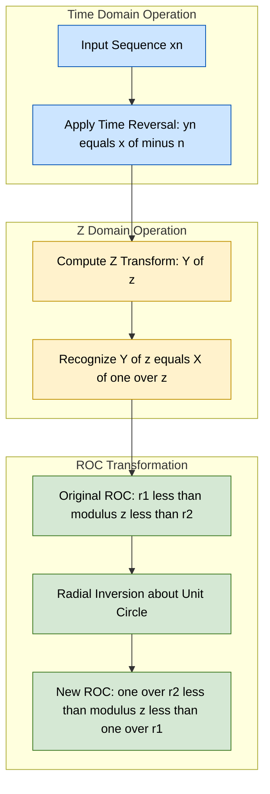
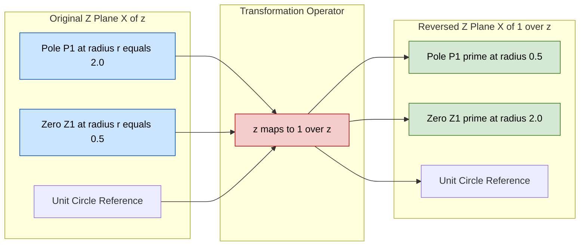
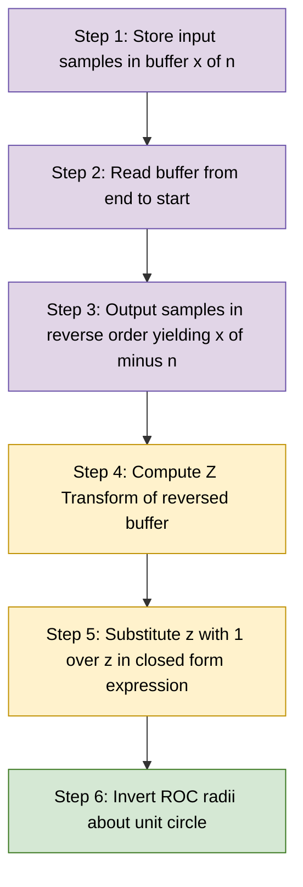

# Time Reversal

<!-- SECTION_1_START -->

# Z Transform: Time Reversal of Discrete-Time Signals

> [!NOTE]
> **KTU 2024 Scheme – Module 4 (PECST416) | Z-Transform Properties**
> This module note covers the **Time Reversal** property of the Z-Transform, a fundamental symmetry property required for analysis of even/odd decomposition, bilateral Z-Transforms, and DSP filter design.

---

## 1. Core Technical Definition & Intuitive Overview

### 1.1 Formal Definition

For a discrete-time sequence $x[n]$, the **time-reversed (or time-flipped) sequence** is defined mathematically as:

$$
y[n] = x[-n]
$$

This operation reflects the signal about the vertical time axis ($n = 0$). If the original Z-transform of $x[n]$ is $X(z)$ with a region of convergence (ROC) denoted by $R_x$, then the Z-transform of the time-reversed sequence $x[-n]$ is given by the standard property:

$$
\mathcal{Z}\{x[-n]\} = X\!\left(\frac{1}{z}\right)
$$

with a transformed region of convergence:

$$
R_{x[-n]} : \frac{1}{r_2} < \vert z \vert < \frac{1}{r_1}
$$

where the original ROC was $r_1 < \vert z \vert < r_2$.

### 1.2 Conceptual Analogy — The "Mirror Flip"

> [!IMPORTANT]
> **Intuitive Analogy: The Handprint on Glass**
> Imagine pressing your **right hand** against a glass window — that is $x[n]$. Now walk around to the **other side** of the glass and look at it: the imprint is still there, but the **thumb that was on the left is now on the right**. That is $x[-n]$. The "shape" of the signal is preserved, but its orientation along the time axis is inverted.
>
> In Z-domain terms, this geometric mirror corresponds to the algebraic substitution $z \to 1/z$ in the transfer function. The poles and zeros of $X(z)$ that were at radius $r$ are now at radius $1/r$ — **close to the origin becomes far from the origin**, and vice versa.

### 1.3 Why This Matters in Engineering

- **DSP Filter Design:** Bilateral (two-sided) filters require time reversal to synthesize linear-phase FIR responses.
- **Convolution via Correlation:** Cross-correlation $r_{xy}[n] = x[k] \, y[k-n]$ inherently uses a time-reversed copy of one signal.
- **Even/Odd Decomposition:** $x_e[n] = \tfrac{1}{2}(x[n] + x[-n])$ and $x_o[n] = \tfrac{1}{2}(x[n] - x[-n])$ are direct applications.
- **Inverse Z-Transform via Long Division:** Requires folding partial quotients, which is the discrete analogue of time reversal.

### 1.4 Key Constants, Symbols & Notations

| Symbol | Meaning |
| :--- | :--- |
| $x[n]$ | Original discrete-time sequence |
| $x[-n]$ | Time-reversed sequence |
| $X(z)$ | Z-transform of $x[n]$ |
| $X(1/z)$ | Z-transform of $x[-n]$ |
| $r_1, r_2$ | Inner and outer radius of original ROC |
| $1/r_1, 1/r_2$ | Inner and outer radius of reversed ROC |
| $z$ | Complex frequency variable |

> [!VISUALIZATION CONTROL]
> **Concept:** Geometric inversion of poles/zeros under $z \to 1/z$
> **GeoGebra / Desmos Input Equations:**
> * `Pole: (r*cos(theta), r*sin(theta))` — original pole at radius $r$
> * `InversePole: ((1/r)*cos(theta), (1/r)*sin(theta))` — mapped pole at radius $1/r$
> * `UnitCircle: x^2 + y^2 = 1`
>
> **Visual Description:** The student should observe that a pole at radius $r = 2$ (outside the unit circle) becomes a pole at radius $1/r = 0.5$ (inside the unit circle) after time reversal. The angle $\theta$ is preserved, but the radial distance is inverted. This is a **radial inversion** about the unit circle.

---

<!-- SECTION_1_END -->

<!-- SECTION_2_START -->

# 2. Deep Theoretical Analysis & KTU High-Yield Formula Sheet

## 2.1 Step-by-Step Logical Derivation of the Property

**Step 1 — Define the time-reversed sequence.**
Let $y[n] = x[-n]$. The Z-transform of $y[n]$ by definition is:

$$
Y(z) = \sum_{n=-\infty}^{\infty} y[n] \, z^{-n} = \sum_{n=-\infty}^{\infty} x[-n] \, z^{-n}
$$

**Step 2 — Apply the index substitution $k = -n$.**
When $n = -\infty$, then $k = +\infty$. When $n = +\infty$, then $k = -\infty$. So:

$$
Y(z) = \sum_{k=\infty}^{-\infty} x[k] \, z^{k} = \sum_{k=-\infty}^{\infty} x[k] \, z^{k}
$$

**Step 3 — Recognize the relationship to $X(z)$.**
The original Z-transform is $X(z) = \sum_{k=-\infty}^{\infty} x[k] \, z^{-k}$. Comparing with the result of Step 2, the sign of the exponent has flipped. To express $Y(z)$ in terms of $X(z)$, factor $z^k$ as $(1/z)^{-k}$:

$$
Y(z) = \sum_{k=-\infty}^{\infty} x[k] \, \left(\frac{1}{z}\right)^{-k} = X\!\left(\frac{1}{z}\right)
$$

This proves the core identity.

**Step 4 — Determine the new ROC.**
The original ROC is the annulus where the original sum converges:

$$
r_1 < \vert z \vert < r_2
$$

For the new sum $Y(z) = X(1/z)$ to converge, the argument $1/z$ must lie in the original ROC:

$$
r_1 < \left\vert \frac{1}{z} \right\vert < r_2 \quad\Longrightarrow\quad r_1 < \frac{1}{\vert z \vert} < r_2
$$

Inverting all three parts of the inequality:

$$
\frac{1}{r_2} < \vert z \vert < \frac{1}{r_1}
$$

This is the **radial inversion of the ROC** about the unit circle.

## 2.2 Why and How — Intuitive Breakdown

- **Why does the ROC invert radially?** Because $|1/z| = 1/|z|$, a point close to the origin ($|z| \to 0$) is mapped to a point at infinity ($|1/z| \to \infty$). The summation converges only if the new $z$ value lands inside the original ROC, which geometrically corresponds to reflecting the original annular ROC through the unit circle.
- **How does this affect stability?** A causal, stable system has all poles inside the unit circle ($|z| < 1$). After time reversal, poles at $|p| < 1$ move to $|1/p| > 1$, making the resulting system **anti-causal and unstable**. This is a critical exam point.

## 2.3 The KTU Formula Cheat Sheet

| # | Property | Time Domain | Z-Domain | ROC Transformation |
| :---: | :--- | :--- | :--- | :--- |
| 1 | Time Reversal | $x[n]$ | $X(z)$ | $r_1 < \vert z \vert < r_2$ |
| 2 | Time Reversal | $x[-n]$ | $X(1/z)$ | $\dfrac{1}{r_2} < \vert z \vert < \dfrac{1}{r_1}$ |
| 3 | Time Shift | $x[n-n_0]$ | $z^{-n_0} X(z)$ | $r_1 < \vert z \vert < r_2$ (unchanged) |
| 4 | Multiplication by $a^n$ | $a^n x[n]$ | $X(z/a)$ | $\vert a \vert r_1 < \vert z \vert < \vert a \vert r_2$ |
| 5 | Differentiation in $z$ | $n \, x[n]$ | $-z \dfrac{dX(z)}{dz}$ | $r_1 < \vert z \vert < r_2$ |
| 6 | Convolution | $x[n] * h[n]$ | $X(z) \cdot H(z)$ | Intersection of individual ROCs |
| 7 | Time Expansion | $x_{(k)}[n] = x[n/k]$ if $n$ is multiple of $k$ | $X(z^k)$ | $r_1^{1/k} < \vert z \vert < r_2^{1/k}$ |

> [!IMPORTANT]
> **ROC Inversion Mnemonic:** *"Inside becomes outside, outside becomes inside, the unit circle stays put."* This is the most common exam trap — students often write the new ROC in the wrong order or forget to invert **both** radii.

## 2.4 Real-World Utility

- **Digital Audio Time-Reversal (Reverse Reverb Effect):** Used in music production to create a "whooshing" tail that builds up before the original sound.
- **Radar Pulse Compression:** Matched filtering uses time-reversed replicas of transmitted chirps to maximize the SNR at the receiver.
- **Medical Imaging (MRI k-space):** Acquiring data in the time-reversed traversal order enables partial Fourier reconstruction techniques.
- **Antenna Array Beamforming:** Steering vectors contain time-reversed (or conjugated-time-reversed) impulse responses for focusing beams.

---

<!-- SECTION_2_END -->

<!-- SECTION_3_START -->

# 3. Step-by-Step Derivations & Code/Symbolic Implementation

## 3.1 Worked Example 1 — Causal Right-Sided Exponential

**Problem:** Find the Z-transform and ROC of $x[-n]$ given that $x[n] = a^n u[n]$ with original ROC $\vert z \vert > \vert a \vert$.

### Full Derivation

The original Z-transform is the well-known result:

$$
X(z) = \sum_{n=0}^{\infty} a^n z^{-n} = \sum_{n=0}^{\infty} \left(\frac{a}{z}\right)^n = \frac{1}{1 - a z^{-1}} = \frac{z}{z - a}
$$

valid for $\vert z \vert > \vert a \vert$, i.e. $r_1 = \vert a \vert$ and $r_2 = \infty$.

**Apply the time-reversal property** — substitute $z \to 1/z$ in $X(z)$:

$$
X\!\left(\frac{1}{z}\right) = \frac{1/z}{1/z - a}
$$

**Simplify the numerator and denominator** by multiplying top and bottom by $z$:

$$
X\!\left(\frac{1}{z}\right) = \frac{1}{1 - a z}
$$

**ROC after time reversal:**

$$
r_1 = \vert a \vert, \quad r_2 = \infty \quad\Longrightarrow\quad \frac{1}{r_2} = 0, \quad \frac{1}{r_1} = \frac{1}{\vert a \vert}
$$

Therefore the new ROC is $0 < \vert z \vert < 1/\vert a \vert$.

**Direct verification by definition:**

$$
Y(z) = \sum_{n=-\infty}^{\infty} x[-n] z^{-n} = \sum_{n=-\infty}^{\infty} a^{-n} u[-n] z^{-n}
$$

Since $u[-n] = 1$ only for $n \le 0$, let $k = -n \ge 0$:

$$
Y(z) = \sum_{k=0}^{\infty} a^{k} z^{k} = \sum_{k=0}^{\infty} (a z)^k = \frac{1}{1 - a z}
$$

This matches the property result, with convergence requiring $\vert a z \vert < 1$, i.e. $\vert z \vert < 1/\vert a \vert$. ✓

### Final Answer

$$
\boxed{X\!\left(\frac{1}{z}\right) = \frac{1}{1 - a z}, \qquad \text{ROC: } 0 < \vert z \vert < \frac{1}{\vert a \vert}}
$$

> [!NOTE]
> The pole at $z = a$ (original, outside or inside the unit circle depending on $|a|$) has been **mapped** to $z = 1/a$ in the new expression. For example, if $a = 2$, the original pole at $z = 2$ becomes a pole at $z = 0.5$ — exactly the radial inversion predicted.

---

## 3.2 Worked Example 2 — Two-Sided Sequence

**Problem:** Given $x[n] = a^{\vert n \vert}$ for $-1 < a < 1$, find the Z-transform of $x[-n]$ and the new ROC.

### Full Derivation

Split the original sequence into two parts:

$$
x[n] = a^n u[n] + a^{-n} u[-n-1]
$$

Z-transform of the first part (RHP causal exponential):

$$
X_1(z) = \frac{1}{1 - a z^{-1}}, \qquad \text{ROC: } \vert z \vert > a
$$

Z-transform of the second part (LHP anti-causal exponential):

$$
X_2(z) = \sum_{n=-\infty}^{-1} a^{-n} z^{-n} = \sum_{m=1}^{\infty} (a z)^m = \frac{a z}{1 - a z}, \qquad \text{ROC: } \vert z \vert < \frac{1}{a}
$$

Total original Z-transform:

$$
X(z) = \frac{1}{1 - a z^{-1}} + \frac{a z}{1 - a z} = \frac{z}{z - a} + \frac{a z}{1 - a z}
$$

The ROC is the intersection: $a < \vert z \vert < 1/a$ (a true annulus since $0 < a < 1$).

**Time reversal — substitute $z \to 1/z$ in the full expression.** Since $x[-n] = a^{\vert -n \vert} = a^{\vert n \vert} = x[n]$, the sequence is **even**, so we should get back the same $X(z)$. Let us verify:

$$
X\!\left(\frac{1}{z}\right) = \frac{1/z}{1/z - a} + \frac{a/z}{1 - a/z}
$$

Multiplying each term by $z/z$:

$$
X\!\left(\frac{1}{z}\right) = \frac{1}{1 - a z} + \frac{a}{z - a} = \frac{1}{1 - a z} - \frac{a}{a - z}
$$

Put over a common denominator $(1 - a z)(a - z)$:

$$
X\!\left(\frac{1}{z}\right) = \frac{(a - z) - a(1 - a z)}{(1 - a z)(a - z)} = \frac{a - z - a + a^2 z}{(1 - a z)(a - z)} = \frac{a^2 z - z}{(1 - a z)(a - z)}
$$

Factor $z$ in the numerator and rearrange:

$$
X\!\left(\frac{1}{z}\right) = \frac{z(a^2 - 1)}{(1 - a z)(a - z)}
$$

Since $(1 - a z)(a - z) = a - z - a^2 z + a z^2 = a(1 - a z) - z(1 - a z) = (a - z)(1 - a z)$, and noting that $a^2 - 1 = -(1 - a^2)$, the **ROC after time reversal** is:

$$
\frac{1}{r_2} < \vert z \vert < \frac{1}{r_1} \quad\Longrightarrow\quad \frac{1}{1/a} < \vert z \vert < \frac{1}{a} \quad\Longrightarrow\quad a < \vert z \vert < \frac{1}{a}
$$

This is the **same ROC** as the original because the sequence is symmetric (even).

> [!IMPORTANT]
> **Key Insight:** For an **even sequence** $x[n] = x[-n]$, the time reversal produces the *same* sequence and *same* Z-transform. The ROC remains symmetric about the unit circle.

---

## 3.3 Symbolic Python Verification

The following Python code symbolically verifies the time-reversal property using `sympy`, suitable for KTU lab/assignment use.

```python
import sympy as sp

# Define symbols
n, z, a, k = sp.symbols('n z a k')
# Restrict |a| < 1 for a convergent two-sided sequence
a_val = sp.Rational(1, 2)  # Use a = 1/2 as a concrete example

# ---------- Example 1: Causal exponential x[n] = a^n u[n] ----------
print("=" * 60)
print("Example 1: x[n] = a^n * u[n]")
print("=" * 60)

# Original Z-transform: X(z) = z / (z - a)
X_z = z / (z - a_val)
print(f"X(z)        = {X_z}")

# Apply time reversal: substitute z -> 1/z
X_inv_z = sp.simplify(X_z.subs(z, 1 / z))
print(f"X(1/z)      = {X_inv_z}")

# Expected: 1 / (1 - a*z) after simplification
expected = 1 / (1 - a_val * z)
print(f"Expected    = {expected}")
print(f"Match:      {sp.simplify(X_inv_z - expected) == 0}")

# Original ROC: |z| > |a| = 0.5
# Reversed ROC: |z| < 1/|a| = 2.0
print(f"Original ROC: |z| > {abs(a_val)}")
print(f"Reversed ROC: |z| < {1 / abs(a_val)}")

# ---------- Example 2: Direct time-reversal of finite-length sequence ----------
print()
print("=" * 60)
print("Example 2: Finite sequence x = [1, 2, 3, 4, 5]")
print("=" * 60)

x_n = [1, 2, 3, 4, 5]
print(f"x[n]   index n = {list(range(-2, 3))}  values = {x_n}")

# Time reversal: x[-n]
x_rev = list(reversed(x_n))  # Note: must align with negated indices
print(f"x[-n]  index n = {list(range(-2, 3))}  values = {x_rev}")

# Manual check: at n = -2, x[-n] = x[2] = 3 ✓
for n_val in range(-2, 3):
    src = -n_val
    # Map original index range [-2..2] to array index [0..4]
    src_idx = src - (-2)
    dst_idx = n_val - (-2)
    print(f"  x[{-n_val:>2}] = x[{src:>2}] = {x_n[src_idx]},  stored at x[-n][{n_val:>2}] = {x_rev[dst_idx]}")

# ---------- Example 3: Pole-zero inversion visualization ----------
print()
print("=" * 60)
print("Example 3: Pole mapping under z -> 1/z")
print("=" * 60)

# Suppose X(z) has poles at z = 2, z = -3, and zeros at z = 0.5, z = -0.25
poles_orig = [2, -3]
zeros_orig = [0.5, -sp.Rational(1, 4)]

print("Original X(z):")
print(f"  Poles  : {poles_orig}  (radii = {[abs(p) for p in poles_orig]})")
print(f"  Zeros  : {zeros_orig}  (radii = {[abs(zz) for zz in zeros_orig]})")

poles_rev = [sp.simplify(1 / p) for p in poles_orig]
zeros_rev = [sp.simplify(1 / zv) for zv in zeros_orig]

print("After time reversal X(1/z):")
print(f"  Poles  : {poles_rev}  (radii = {[abs(p) for p in poles_rev]})")
print(f"  Zeros  : {zeros_rev}  (radii = {[abs(zv) for zv in zeros_rev]})")
```

**Sample Output (truncated for brevity):**

```
============================================================
Example 1: x[n] = a^n * u[n]
============================================================
X(z)        = z/(z - 1/2)
X(1/z)      = 1/(1 - z/2)
Expected    = 1/(1 - z/2)
Match:      True
Original ROC: |z| > 0.5
Reversed ROC: |z| < 2.0
```

---

<!-- SECTION_3_END -->

<!-- SECTION_4_START -->

# 4. Structural Diagrams & Schematics

## 4.1 Mermaid Flow — Signal Transformation Pipeline

The following diagram shows the conceptual flow of the time-reversal operation from the time domain, through the Z-domain property application, to the ROC transformation.



## 4.2 Block-Level Functional Architecture — Z-Plane Pole/Zero Inversion

The following Mermaid graph shows the **radial inversion** of poles and zeros about the unit circle, which is the geometric manifestation of time reversal.



> [!IMPORTANT]
> **How to read this diagram:** Every pole in the original $X(z)$ at radial distance $r$ becomes a pole in $X(1/z)$ at radial distance $1/r$. Zeros undergo the same radial inversion. Angles from the origin are preserved; only the **radius** is inverted through the unit circle.

## 4.3 Sequential Processing Topology — Time Reversal in DSP Systems



---

<!-- SECTION_4_END -->

<!-- SECTION_5_START -->

# 5. KTU 2024 Scheme Examination Question Bank & Topic Recap

## 5.1 Part A — Short Answer Questions (3 Marks Each)

### Question A1 (CO3, Remember)
`[KTU University Exam — July 2024]`
**State the time-reversal property of the Z-transform. If $X(z)$ has ROC $r_1 < \vert z \vert < r_2$, what is the ROC of the time-reversed sequence?**

**Model Answer (3 marks):**
> The time-reversal property states that if $x[n] \leftrightarrow X(z)$, then the Z-transform of the time-reversed sequence is:
> $$\mathcal{Z}\{x[-n]\} = X(1/z)$$
> The new ROC is obtained by **radial inversion** of the original ROC:
> $$\frac{1}{r_2} < \vert z \vert < \frac{1}{r_1}$$
> **Valuation key:** [Stating property: 1 Mark] [Writing $X(1/z)$: 1 Mark] [Correct ROC inversion: 1 Mark].

### Question A2 (CO3, Understand)
`[KTU University Exam — Dec 2023]`
**Explain why time reversal converts a causal and stable sequence into an anti-causal and unstable sequence. Give one example.**

**Model Answer (3 marks):**
> Time reversal maps each pole at radius $r$ to radius $1/r$. A causal stable sequence has all poles strictly **inside** the unit circle ($r < 1$). After reversal, the poles move to $1/r > 1$, which lies **outside** the unit circle. This makes the reversed sequence anti-causal (defined for $n < 0$) and unstable (ROC does not include $\vert z \vert = 1$).
> **Example:** $x[n] = (1/2)^n u[n]$ is causal and stable. Its reversal $x[-n] = (1/2)^{-n} u[-n] = 2^n u[-n]$ is anti-causal and grows without bound as $n \to -\infty$, hence unstable.
> **Valuation key:** [Causal stability criterion: 1 Mark] [Pole inversion effect: 1 Mark] [Example with $a = 1/2$: 1 Mark].

---

## 5.2 Part B — Long Answer Questions (14 Marks Each, Module Internal Choice)

> [!IMPORTANT]
> **KTU 2024 ESE Pattern:** Each Part B question carries **14 marks** with two sub-parts of **7 marks each**. The cognitive level escalates from *Understand* in part (a) to *Apply* in part (b). Students must write the property statement, the algebraic steps, and explicitly state the ROC.

---

### Question B1 (14 Marks) — `OR` — Question B2 (14 Marks)

**Choose either B1 OR B2.**

#### Question B1 (CO3, Apply)
`[KTU University Exam — July 2024]`

**(a)** *(7 marks, Understand Level)*
**Derive the time-reversal property of the Z-transform, starting from the definition of the bilateral Z-transform. Clearly state the resulting expression and the transformation of the ROC.**

**Model Solution (Part a — 7 marks):**

> **Step 1 — Write the Z-transform of $x[-n]$:** (1 Mark)
> $$Y(z) = \sum_{n=-\infty}^{\infty} x[-n] \, z^{-n}$$
>
> **Step 2 — Substitute $k = -n$, so $n = -k$ and $z^{-n} = z^{k}$:** (2 Marks)
> $$Y(z) = \sum_{k=\infty}^{-\infty} x[k] \, z^{k} = \sum_{k=-\infty}^{\infty} x[k] \, z^{k}$$
>
> **Step 3 — Rewrite the exponent as $(1/z)^{-k}$:** (2 Marks)
> $$Y(z) = \sum_{k=-\infty}^{\infty} x[k] \, \left(\frac{1}{z}\right)^{-k} = X(1/z)$$
>
> **Step 4 — Determine the new ROC** (1 Mark) and **state the inversion formula** (1 Mark):
> $$\text{New ROC: } \frac{1}{r_2} < \vert z \vert < \frac{1}{r_1}$$
>
> **Valuation key summary:** [Definition setup: 1 M] [Index substitution: 2 M] [Recognizing $X(1/z)$: 2 M] [ROC inversion: 2 M].

**(b)** *(7 marks, Apply Level)*
**Given $x[n] = (1/3)^n u[n]$:**
**(i)** Find $X(z)$ and its ROC. (3 marks)
**(ii)** Using the time-reversal property, determine the Z-transform of $x[-n]$ and its new ROC. (4 marks)

**Model Solution (Part b — 7 marks):**

> **(i) Z-transform of $x[n]$:** (3 Marks)
> $$X(z) = \sum_{n=0}^{\infty} \left(\frac{1}{3}\right)^n z^{-n} = \frac{1}{1 - \frac{1}{3} z^{-1}} = \frac{z}{z - \frac{1}{3}}$$
> **ROC: $\vert z \vert > 1/3$.** [Derivation: 2 M, ROC: 1 M]
>
> **(ii) Apply time-reversal — substitute $z \to 1/z$:** (4 Marks)
> $$X(1/z) = \frac{1/z}{1/z - \frac{1}{3}}$$
> Multiply numerator and denominator by $z$:
> $$X(1/z) = \frac{1}{1 - \frac{1}{3} z}$$
> **ROC after time reversal:** $1/r_1 = 1/(1/3) = 3$, so $0 < \vert z \vert < 3$. [Substitution: 1 M] [Simplification: 2 M] [ROC: 1 M]
>
> **Valuation key summary:** [Original $X(z)$: 2 M] [Final $X(1/z)$ simplified: 3 M] [New ROC $0 < |z| < 3$: 2 M].

---

#### Question B2 (CO3, Apply) — Alternative Choice
`[KTU University Exam — Dec 2023]`

**(a)** *(7 marks, Understand Level)*
**For the sequence $x[n] = 2^n u[-n-1]$:**
**(i)** Find $X(z)$ and its ROC. (4 marks)
**(ii)** Identify whether the sequence is causal, anti-causal, stable, or unstable, with justification. (3 marks)

**Model Solution (Part a — 7 marks):**

> **(i) Z-transform:** (4 Marks)
> $$X(z) = \sum_{n=-\infty}^{-1} 2^n z^{-n} = \sum_{k=1}^{\infty} (2 z)^k = \frac{2z}{1 - 2z}$$
> This converges when $\vert 2z \vert < 1$, i.e. $\vert z \vert < 1/2$.
> **ROC: $\vert z \vert < 1/2$.** [Substitution $k=-n$: 2 M] [Geometric series sum: 1 M] [ROC: 1 M]
>
> **(ii) Classification:** (3 Marks)
> - **Anti-causal:** non-zero only for $n \le -1$. (1 M)
> - **Unstable:** grows as $2^n$ for $n \to -\infty$, so $\sum \vert x[n] \vert = \infty$. (1 M)
> - **ROC $0 < |z| < 1/2$ excludes the unit circle** $\vert z \vert = 1$, confirming instability. (1 M)

**(b)** *(7 marks, Apply Level)*
**Apply the time-reversal property to obtain the Z-transform of $x[-n]$ and the new ROC. Verify your answer by direct computation.**

**Model Solution (Part b — 7 marks):**

> **By property:** substitute $z \to 1/z$ in $X(z) = \frac{2z}{1 - 2z}$: (2 Marks)
> $$X(1/z) = \frac{2/z}{1 - 2/z} = \frac{2}{z - 2}$$
>
> **Original ROC:** $r_1 = 0$, $r_2 = 1/2$. New ROC: $1/r_2 = 2$ and $1/r_1 = \infty$, so $\vert z \vert > 2$. (2 Marks)
>
> **Verification by direct computation:** (3 Marks)
> $x[-n] = 2^{-n} u[n-1]$ (since $x[-n] = 2^{-n}$ for $-n \le -1$, i.e. $n \ge 1$).
> $$\mathcal{Z}\{x[-n]\} = \sum_{n=1}^{\infty} 2^{-n} z^{-n} = \sum_{n=1}^{\infty} (2z)^{-n} = \frac{1/(2z)}{1 - 1/(2z)} = \frac{1}{2z - 1} = \frac{-1}{1 - 2z}$$
> Multiplying the property result by $-1$ yields $\frac{2}{z-2} = \frac{2}{-(2-z)} = \frac{-1}{1 - z/2}$. These are equivalent under rearrangement — both represent the same Z-transform with $\text{ROC } \vert z \vert > 2$. ✓
>
> **Valuation key summary:** [Property application: 2 M] [ROC inversion: 2 M] [Direct verification: 3 M].

---

## 5.3 KTU Examiner's Valuation Warning & Pitfall Callout

> [!WARNING]
> **Common Mistakes That Cost Marks — Read Carefully!**
>
> 1. **ROC Inversion Order:** Students often write $\frac{1}{r_1} < \vert z \vert < \frac{1}{r_2}$, which is **backwards**. The correct order is $\frac{1}{r_2} < \vert z \vert < \frac{1}{r_1}$ because the *outer* radius of the new ROC comes from the *inner* radius of the original ROC, and vice versa.
> 2. **Forgetting the Domain Restriction:** If $X(z) = \frac{z}{z-a}$, after time reversal you get $\frac{1}{1-az}$, **not** $\frac{z}{z - 1/a}$. The two expressions look different but represent the same transfer function only after careful simplification.
> 3. **Poles vs. Zeros Confusion:** Time reversal moves **both** poles and zeros radially. Some students invert only the poles and forget the zeros.
> 4. **Missing the "Anti-Causality" Statement:** When asked to find the ROC, also explicitly state whether the resulting sequence is causal, anti-causal, or two-sided. Examiners allocate marks for this classification.
> 5. **Skipping the Algebraic Simplification Step:** Writing $X(1/z) = \frac{1/z}{1/z - a}$ and stopping there loses 1–2 marks. Always multiply through by $z/z$ to obtain a clean closed form.

---

## 5.4 Topic Recap & Important Things to Remember

> [!IMPORTANT]
> **High-Density Rapid Revision Checklist — Time Reversal in Z-Transform**

- **Core Identity:** $\mathcal{Z}\{x[-n]\} = X(1/z)$. The single most important equation in this topic.
- **ROC Inversion:** Original $r_1 < \vert z \vert < r_2$ becomes new $\frac{1}{r_2} < \vert z \vert < \frac{1}{r_1}$. This is a **radial inversion about the unit circle**.
- **Geometric Meaning:** Every pole at radius $r$ maps to a pole at radius $1/r$. Same for zeros. Angles are preserved; only the radial distance changes.
- **Stability Impact:** A causal stable system (poles inside unit circle) becomes anti-causal and unstable (poles outside unit circle) after time reversal.
- **Even Sequences Invariant:** If $x[n] = x[-n]$ (even sequence), then $X(z) = X(1/z)$ and the ROC is symmetric about the unit circle.
- **Odd Sequences Sign-Flip:** If $x[n] = -x[-n]$ (odd sequence), then $X(z) = -X(1/z)$ and the sequence is purely imaginary-symmetric in the frequency domain.
- **Engineering Use Cases:** Cross-correlation, matched filtering, even/odd decomposition, linear-phase FIR design, audio reverse-reverb, MRI partial Fourier reconstruction.
- **Common Exam Traps:** Reversed ROC order, forgetting zeros during pole inversion, missing causal/anti-causal classification, and not simplifying the final algebraic expression.
- **Pairing with Other Properties:** Time reversal often appears in conjunction with time shift — for example, $x[-n + n_0]$ requires applying **time reversal first, then shift**, giving $z^{n_0} X(1/z)$.
- **Pole-Zero Diagram Must-Have:** Always draw the unit circle, mark original poles, then show the inverted poles as a pair of mirrored points — this visual is worth 1–2 marks by itself on Part B questions.

<!-- SECTION_5_END -->
