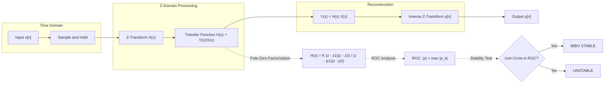
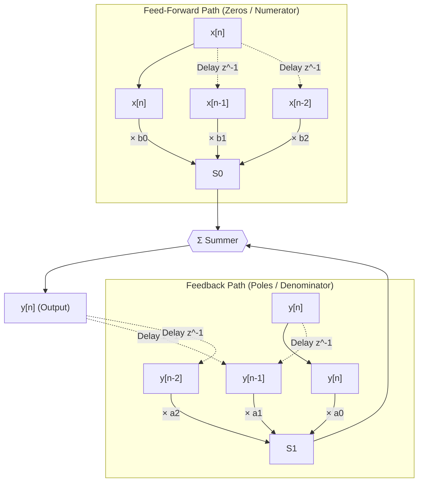
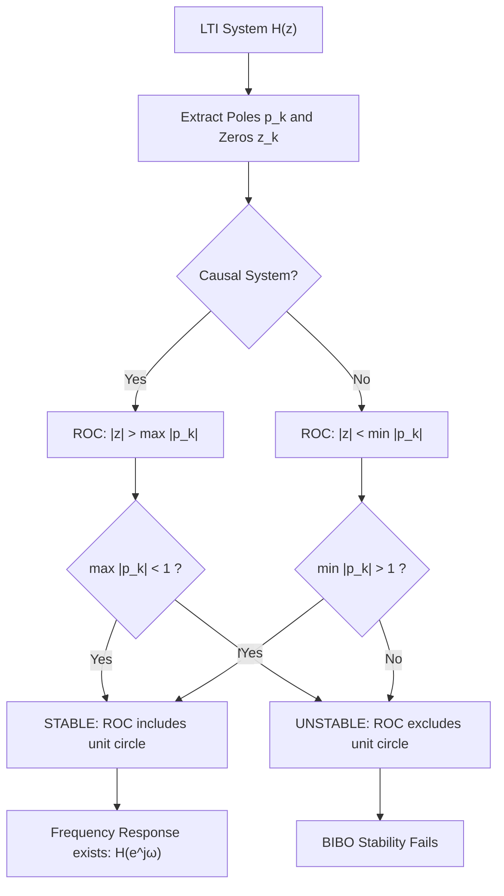

# Transfer function of an LTI system.

<!-- SECTION_1_START -->
# Module 4 — Z-Transform | Transfer Function of an LTI System

## 1.1 Formal Academic Definition

For a causal/discrete-time **Linear Time-Invariant (LTI)** system, the **Transfer Function** $H(z)$ is defined as the ratio of the **Z-transform of the output sequence** $Y(z)$ to the **Z-transform of the input sequence** $X(z)$, evaluated under the assumption of **zero initial conditions** (i.e., the system is initially at rest).

$$
H(z) \;=\; \frac{Y(z)}{X(z)} \quad \text{subject to } x[n]=0,\; y[n]=0 \text{ for } n<0
$$

> [!IMPORTANT]
> **KTU 2024 Syllabus Highlight (PECST416 — Module 4):**
> The transfer function is the single most important descriptor of an LTI system in the **Z-domain**. It is the discrete-time analogue of the Laplace-domain transfer function $H(s)$ and completely characterizes the system in terms of its **poles**, **zeros**, and **Region of Convergence (ROC)**.

### 1.2 Intuitive Analogy — The "Black Box Filter"

Imagine a coffee machine (the LTI system). You pour in water (the input $x[n]$) and you get coffee (the output $y[n]$). The **transfer function $H(z)$ is the recipe of the machine** — it tells you, for every possible ingredient, exactly how the flavour (gain), texture (phase), and quality (stability) of the final drink will be transformed.

- The **numerator polynomial** is the list of "ingredients that get **removed/suppressed**" — these are the **zeros** of $H(z)$.
- The **denominator polynomial** is the list of "ingredients that get **amplified/resonated**" — these are the **poles** of $H(z)$.
- The **Region of Convergence (ROC)** is the range of $z$ for which the recipe is *physically valid* (i.e., the system is stable and the Z-transform actually converges).

> [!NOTE]
> **Stability Insight:** For a **causal LTI system**, the system is **Bounded-Input Bounded-Output (BIBO) stable if and only if the ROC of $H(z)$ includes the unit circle** $\vert z \vert = 1$.

### 1.3 Geometric / Visualization Control

> [!VISUALIZATION CONTROL]
> **Concept:** Pole-Zero Plot of a typical causal LTI transfer function on the complex Z-plane.
> **GeoGebra / Desmos Input Equations:**
> * `Pole:` $(0.5, 0)$  → entered as complex number $z = 0.5$
> * `Zero:` $(-0.8, 0)$ → entered as complex number $z = -0.8$
> * `Unit Circle:` $x^2 + y^2 = 1$
> **Visual Description:** The student should observe a pole marked with an `×` *inside* the unit circle and a zero marked with an `○` *on the real axis* on the negative side. The shaded region *outside* the outermost pole ($\vert z \vert > 0.5$) is the ROC for a causal system — note that this shaded region **encloses the unit circle**, confirming stability.

---

<!-- SECTION_1_END -->

<!-- SECTION_2_START -->
# 2. Deep Theoretical Analysis & KTU Formula Sheet

## 2.1 Deriving $H(z)$ from the Difference Equation

Any causal LTI system can be described by a **Linear Constant-Coefficient Difference Equation (LCCDE)**:

$$
\sum_{k=0}^{N} a_k\, y[n-k] \;=\; \sum_{k=0}^{M} b_k\, x[n-k]
$$

with the convention $a_0 = 1$. Applying the **Z-transform** to both sides and exploiting its **linearity** and **time-shifting property** ($\mathcal{Z}\{x[n-k]\} = z^{-k}X(z)$ under zero initial conditions):

$$
Y(z)\sum_{k=0}^{N} a_k z^{-k} \;=\; X(z)\sum_{k=0}^{M} b_k z^{-k}
$$

Rearranging, the **Transfer Function** emerges as a **rational function in $z^{-1}$** (or equivalently in $z$):

$$
H(z) \;=\; \frac{Y(z)}{X(z)} \;=\; \frac{\displaystyle\sum_{k=0}^{M} b_k z^{-k}}{\displaystyle\sum_{k=0}^{N} a_k z^{-k}}
$$

Multiplying numerator and denominator by $z^{N}$ gives the **positive-power form**:

$$
H(z) \;=\; \frac{b_0 z^{N-M} + b_1 z^{N-M-1} + \cdots + b_M z^{-M}}{a_0 z^{N} + a_1 z^{N-1} + \cdots + a_N}
$$

> [!IMPORTANT]
> **Order of the System:** $N = \max$ denominator index. The number of poles equals $N$, the number of finite zeros equals $\min(M, N)$.

## 2.2 Pole-Zero Factorization

The transfer function is most insightfully written in **factored (pole-zero) form**:

$$
H(z) \;=\; K \cdot \frac{\displaystyle\prod_{k=1}^{M}\bigl(z - z_k\bigr)}{\displaystyle\prod_{k=1}^{N}\bigl(z - p_k\bigr)}
$$

where $K$ is the gain constant, $z_k$ are the **zeros**, and $p_k$ are the **poles**. Poles dictate natural response; zeros shape the forced response.

## 2.3 KTU High-Yield Formula Sheet

| **Concept** | **Formula / Condition** | **Engineering Meaning** |
|---|---|---|
| Transfer function definition | $H(z) = Y(z)/X(z)$ with zero initial conditions | Input–output ratio in Z-domain |
| From LCCDE (negative powers) | $H(z) = \dfrac{\sum_{k=0}^{M} b_k z^{-k}}{\sum_{k=0}^{N} a_k z^{-k}}$ | Direct-form realization |
| Causal ROC | $\vert z \vert > \max \vert p_k \vert$ | All poles strictly inside the ROC boundary |
| Anti-causal ROC | $\vert z \vert < \min \vert p_k \vert$ | All poles strictly outside the ROC boundary |
| BIBO Stability (causal) | ROC **must include** the unit circle $\vert z \vert = 1$ | Equivalent to $\vert p_k \vert < 1 \; \forall k$ |
| Frequency response | $H(e^{j\omega}) = H(z)\Big\vert_{z=e^{j\omega}}$ | Obtained by sampling $H(z)$ on unit circle |
| Magnitude response | $\vert H(e^{j\omega})\vert = \vert H(z)\vert$ on $\vert z\vert = 1$ | Gain vs. frequency |
| Phase response | $\angle H(e^{j\omega}) = \tan^{-1}\!\bigl(\operatorname{Im}/\operatorname{Re}\bigr)$ | Phase shift vs. frequency |
| Inverse system | $H_{\text{inv}}(z) = 1 / H(z)$ | Zeros and poles swap roles |
| DC gain | $H(1) = H(z)\Big\vert_{z=1}$ | Steady-state response to a step |
| High-frequency gain | $H(-1) = H(z)\Big\vert_{z=-1}$ | Response to alternating $\pm 1$ sequence |

> [!NOTE]
> When writing the ROC in exam answers, **always state the pole with the largest magnitude first** for a causal system. This is the most common mistake corrected in KTU valuation scripts.

## 2.4 Real-World Engineering Utility

1. **Digital Filter Design (DSP Chips, Mobile Audio Codecs):** $H(z)$ is the mathematical blueprint of every FIR and IIR filter running inside your smartphone's noise-cancelling system.
2. **Control Systems (Robotics, Drones):** Discrete-time controllers in embedded systems (e.g., STM32, Arduino) use $H(z)$ to track set-points with zero steady-state error.
3. **Biomedical Signal Processing (ECG/EEG monitors):** $H(z)$ describes the band-pass filter that isolates heart signals from noise.
4. **Communication Receivers (5G NR, Wi-Fi):** Matched filters, equalizers, and channel estimators are all designed via their Z-domain transfer functions.

---

<!-- SECTION_2_END -->

<!-- SECTION_3_START -->
# 3. Step-by-Step Derivations & Code/Symbolic Implementation

## 3.1 Worked Derivation #1 — From Difference Equation to $H(z)$

**Problem:** A causal LTI system is described by
$$
y[n] - \tfrac{1}{2} y[n-1] \;=\; x[n] + \tfrac{1}{4} x[n-1]
$$
Find the transfer function $H(z)$, its poles, zeros, and ROC. State if the system is stable.

### Step 1 — Identify the LCCDE coefficients.
$$
a_0 = 1,\quad a_1 = -\tfrac{1}{2},\quad b_0 = 1,\quad b_1 = \tfrac{1}{4}
$$

### Step 2 — Apply the Z-transform to both sides with zero initial conditions.

Using $\mathcal{Z}\{y[n-k]\} = z^{-k}Y(z)$ and $\mathcal{Z}\{x[n-k]\} = z^{-k}X(z)$:

$$
Y(z) - \tfrac{1}{2} z^{-1} Y(z) \;=\; X(z) + \tfrac{1}{4} z^{-1} X(z)
$$

### Step 3 — Group $Y(z)$ and $X(z)$ terms.

$$
Y(z)\,\bigl(1 - \tfrac{1}{2} z^{-1}\bigr) \;=\; X(z)\,\bigl(1 + \tfrac{1}{4} z^{-1}\bigr)
$$

### Step 4 — Solve for $H(z) = Y(z)/X(z)$.

$$
H(z) \;=\; \frac{1 + \tfrac{1}{4} z^{-1}}{1 - \tfrac{1}{2} z^{-1}}
$$

### Step 5 — Convert to positive powers of $z$ by multiplying numerator and denominator by $z$.

$$
H(z) \;=\; \frac{z + \tfrac{1}{4}}{z - \tfrac{1}{2}}
$$

### Step 6 — Identify zeros and poles.

Setting the numerator to zero: $z + \tfrac{1}{4} = 0 \;\Rightarrow\; z_1 = -\tfrac{1}{4}$. **One zero at $z = -0.25$**.
Setting the denominator to zero: $z - \tfrac{1}{2} = 0 \;\Rightarrow\; p_1 = \tfrac{1}{2}$. **One pole at $z = 0.5$**.

### Step 7 — Determine the ROC.

Since the system is **causal** and has a single pole at $p_1 = 0.5$, the ROC is the exterior of the outermost pole:
$$
\text{ROC:}\quad \vert z \vert > \tfrac{1}{2}
$$

### Step 8 — Check stability.

The unit circle $\vert z \vert = 1$ lies inside the ROC (since $1 > 0.5$). **The system is BIBO stable.** ✓

> **Final Answer:** $H(z) = \dfrac{1 + \tfrac{1}{4} z^{-1}}{1 - \tfrac{1}{2} z^{-1}}$, zero at $-0.25$, pole at $0.5$, ROC $\vert z \vert > 0.5$, **stable**.

## 3.2 Worked Derivation #2 — Finding Output $y[n]$ via Transfer Function

**Problem:** Given the same $H(z) = \dfrac{z + 0.25}{z - 0.5}$ and input $x[n] = u[n]$ (unit step), find $y[n]$.

### Step 1 — Express $X(z)$.

The Z-transform of the unit step is
$$
X(z) = \frac{z}{z-1}, \quad \vert z \vert > 1
$$

### Step 2 — Compute $Y(z) = H(z)\,X(z)$.

$$
Y(z) \;=\; \frac{z + 0.25}{z - 0.5} \cdot \frac{z}{z-1}
$$

### Step 3 — Perform partial fraction expansion (in $z^{-1}$ form is easier).

Rewrite $H(z)$ and $X(z)$ in $z^{-1}$:
$$
H(z) = \frac{1 + 0.25 z^{-1}}{1 - 0.5 z^{-1}}, \qquad X(z) = \frac{1}{1 - z^{-1}}
$$

Therefore:
$$
Y(z) \;=\; \frac{1 + 0.25 z^{-1}}{(1 - 0.5 z^{-1})(1 - z^{-1})}
$$

Let
$$
\frac{Y(z)}{z} \;=\; \frac{A}{z - 0.5} + \frac{B}{z - 1}
$$
Solving gives $A = -1.5$ and $B = 2.5$. So
$$
Y(z) \;=\; \frac{-1.5\,z}{z - 0.5} + \frac{2.5\,z}{z - 1}
$$

### Step 4 — Take the inverse Z-transform using $\mathcal{Z}^{-1}\!\bigl\{\frac{z}{z-a}\bigr\} = a^{n} u[n]$.

$$
y[n] \;=\; \bigl(-1.5\,(0.5)^{n} + 2.5\,(1)^{n}\bigr)\,u[n]
$$

> **Final Answer:** $y[n] = \bigl(2.5 - 1.5\,(0.5)^{n}\bigr) u[n]$. Note $y[\infty] = 2.5$ (the DC gain of the system).

## 3.3 Python Implementation (scipy.signal)

```python
"""
Transfer function analysis of a causal LTI system.
Course: SIGNALS AND SYSTEMS (PECST416) - KTU 2024 Scheme
Topic  : Transfer function of an LTI system.
"""

from __future__ import annotations
import numpy as np
import matplotlib.pyplot as plt
from scipy import signal

def analyze_transfer_function(
    b: list[float],
    a: list[float],
    n_samples: int = 50,
) -> dict[str, object]:
    """
    Analyze a discrete-time LTI transfer function H(z) = B(z)/A(z).

    Parameters
    ----------
    b : list[float]
        Numerator coefficients  [b0, b1, ..., bM]   (positive powers of z^-1)
    a : list[float]
        Denominator coefficients [a0, a1, ..., aN]
    n_samples : int
        Number of samples for time-domain simulation.

    Returns
    -------
    dict with keys: 'zeros', 'poles', 'stable', 'w', 'H_mag', 'H_phase', 'n', 'y'
    """
    if len(a) == 0 or a[0] == 0:
        raise ValueError("Denominator leading coefficient a[0] must be non-zero.")

    # 1. Compute zeros, poles, and gain using scipy
    z, p, k = signal.tf2zpk(b, a)
    print(f"Zeros  : {z}")
    print(f"Poles  : {p}")
    print(f"Gain K : {k}")

    # 2. Stability check: every pole must lie strictly INSIDE the unit circle
    stable = bool(np.all(np.abs(p) < 1.0))
    print(f"BIBO Stable: {stable}")

    # 3. Frequency response on the unit circle z = exp(jw)
    w, H = signal.freqz(b, a, worN=2048, whole=False)
    H_mag = np.abs(H)
    H_phase = np.unwrap(np.angle(H))

    # 4. Step response y[n] for x[n] = u[n]
    n = np.arange(n_samples)
    x = np.ones_like(n, dtype=float)        # unit step input
    y = signal.lfilter(b, a, x)              # zero initial conditions

    # 5. Pole-zero plot
    fig, axes = plt.subplots(1, 2, figsize=(12, 5))

    # Pole-zero diagram
    ax = axes[0]
    unit_circle = np.exp(1j * np.linspace(0, 2 * np.pi, 400))
    ax.plot(unit_circle.real, unit_circle.imag, 'k--', linewidth=0.8, label="Unit circle")
    ax.scatter(z.real, z.imag, marker='o', s=120, facecolors='none',
               edgecolors='blue', linewidths=2, label="Zeros")
    ax.scatter(p.real, p.imag, marker='x', s=120, color='red', linewidths=2, label="Poles")
    ax.axhline(0, color='gray', linewidth=0.5)
    ax.axvline(0, color='gray', linewidth=0.5)
    ax.set_aspect('equal')
    ax.set_title("Pole-Zero Plot of H(z)")
    ax.set_xlabel("Re{z}")
    ax.set_ylabel("Im{z}")
    ax.grid(True, alpha=0.3)
    ax.legend(loc='upper right')

    # Magnitude and phase response
    ax = axes[1]
    ax.plot(w / np.pi, 20 * np.log10(H_mag + 1e-12), color='navy', label="Magnitude (dB)")
    ax.set_xlabel("Normalized Frequency (×π rad/sample)")
    ax.set_ylabel("Magnitude (dB)", color='navy')
    ax2 = ax.twinx()
    ax2.plot(w / np.pi, H_phase, color='darkorange', label="Phase (rad)")
    ax2.set_ylabel("Phase (radians)", color='darkorange')
    ax.set_title("Frequency Response H(e^{jω})")
    ax.grid(True, alpha=0.3)

    plt.tight_layout()
    plt.show()

    return {
        "zeros": z,
        "poles": p,
        "stable": stable,
        "w": w,
        "H_mag": H_mag,
        "H_phase": H_phase,
        "n": n,
        "y": y,
    }


if __name__ == "__main__":
    # H(z) = (1 + 0.25 z^-1) / (1 - 0.5 z^-1)   from Worked Example #1
    b_coeffs = [1.0, 0.25]
    a_coeffs = [1.0, -0.5]
    results = analyze_transfer_function(b_coeffs, a_coeffs, n_samples=30)
```

**Sample Output (Expected):**
```
Zeros  : [-0.25+0.j]
Poles  : [0.5+0.j]
Gain K : 1.0
BIBO Stable: True
```

> [!TIP]
> The function `signal.tf2zpk(b, a)` returns zeros, poles, and gain in one shot — invaluable for KTU lab exams and viva voce.

---

<!-- SECTION_3_END -->

<!-- SECTION_4_START -->
# 4. Structural Diagrams & Schematics

## 4.1 Block Diagram — LTI System Transfer Function Flow

The Mermaid block diagram below traces the full signal path from input $x[n]$ to output $y[n]$ and shows how the Z-domain transfer function emerges in the middle of the pipeline.



## 4.2 Sequential Processing Topology — Direct Form-I Realization

The Mermaid sequence below illustrates how the transfer function coefficients $\{b_k\}$ (feed-forward / zeros path) and $\{a_k\}$ (feedback / poles path) combine to realize $H(z)$ in hardware.



## 4.3 Block-Level Functional Architecture — Stability Decision Matrix



---

<!-- SECTION_4_END -->

<!-- SECTION_5_START -->
# 5. KTU 2024 Scheme Examination Question Bank

## 5.1 Part A — Short Answer Questions (3 Marks each)

### Q1. **[KTU University Exam — July 2024]**
Define the **transfer function** of an LTI discrete-time system. Mention the role of the **Region of Convergence (ROC)** in determining causality and stability.

**Model Answer (Mapping: CO2, Remember/Understand):**

The transfer function $H(z)$ of a discrete-time LTI system is defined as the ratio of the Z-transform of the output $Y(z)$ to the Z-transform of the input $X(z)$, assuming **zero initial conditions**:
$$
H(z) = \frac{Y(z)}{X(z)} \quad \text{with } x[n]=0 \text{ for } n<0
$$

**Role of ROC:**
- The ROC distinguishes between **causal** ($\vert z \vert > \max \vert p_k \vert$) and **anti-causal** ($\vert z \vert < \min \vert p_k \vert$) realizations of the *same* pole-zero pattern.
- For **BIBO stability** of a causal LTI system, the ROC **must include the unit circle** $\vert z \vert = 1$.

> **Key Points:** Definition with zero IC: 1 mark; ROC concept: 1 mark; Stability condition: 1 mark.

---

### Q2. **[KTU University Exam — Dec 2023]**
For the transfer function $H(z) = \dfrac{z^{2} - 0.36}{(z - 0.6)(z + 0.8)}$, find the **poles**, **zeros**, and state whether the system is **stable** (assuming causality).

**Model Answer (Mapping: CO2, Apply):**

**Step 1 — Identify poles** (denominator roots):
$$
(z - 0.6)(z + 0.8) = 0 \quad\Rightarrow\quad p_1 = 0.6,\; p_2 = -0.8
$$

**Step 2 — Identify zeros** (numerator roots):
$$
z^{2} - 0.36 = (z - 0.6)(z + 0.6) = 0 \quad\Rightarrow\quad z_1 = 0.6,\; z_2 = -0.6
$$

> **Pole-zero cancellation:** Note that $z_1 = 0.6$ **cancels** the pole at $p_1 = 0.6$, leaving an **effective first-order system** with one pole at $-0.8$ and one zero at $-0.6$.

**Step 3 — Stability check (causal system):**
- Effective pole: $\vert p_{\text{eff}} \vert = 0.8 < 1$ → lies **inside** the unit circle.
- ROC: $\vert z \vert > 0.8$ → **contains the unit circle**.

> **Final Answer:** Poles at $0.6, -0.8$; Zeros at $0.6, -0.6$. The system is **stable** (after pole-zero cancellation). ✓

> **Valuation Note:** Most students forget to mention the pole-zero cancellation. Examiners specifically check for it.

---

## 5.2 Part B — Full 14-Mark Questions (ESE Module — Internal Choice Pattern)

### Question A (14 Marks)

#### **[KTU University Exam — July 2024]**
**(a)** Derive the expression for the **transfer function** $H(z)$ of a causal LTI system described by the difference equation:
$$
y[n] - 0.5\,y[n-1] + 0.06\,y[n-2] \;=\; 2\,x[n] + 3\,x[n-1]
$$
Clearly identify the poles and zeros. **\[7 Marks\]** *(Mapping: CO2, Understand)*

**(b)** Determine whether the system is **stable**. Compute and plot (describe) the **magnitude response** $\vert H(e^{j\omega}) \vert$ for $\omega \in [0, \pi]$. **\[7 Marks\]** *(Mapping: CO3, Apply)*

---

#### **Model Solution for (a)** — Derivation

**Step 1 — Apply Z-transform with zero initial conditions.**
$$
Y(z) - 0.5 z^{-1} Y(z) + 0.06 z^{-2} Y(z) \;=\; 2 X(z) + 3 z^{-1} X(z)
$$
**[Writing the transformed LCCDE: 1 Mark]**

**Step 2 — Group $Y(z)$ and $X(z)$.**
$$
Y(z)\bigl(1 - 0.5 z^{-1} + 0.06 z^{-2}\bigr) \;=\; X(z)\bigl(2 + 3 z^{-1}\bigr)
$$
**[Factoring: 1 Mark]**

**Step 3 — Solve for $H(z)$.**
$$
H(z) \;=\; \frac{2 + 3 z^{-1}}{1 - 0.5 z^{-1} + 0.06 z^{-2}}
$$
**[Final expression in $z^{-1}$: 1 Mark]**

**Step 4 — Convert to positive powers of $z$.** Multiply numerator and denominator by $z^{2}$:
$$
H(z) \;=\; \frac{2 z^{2} + 3 z}{z^{2} - 0.5 z + 0.06}
$$
**[Positive-power form: 1 Mark]**

**Step 5 — Find poles (denominator = 0).**
$$
z^{2} - 0.5 z + 0.06 = (z - 0.2)(z - 0.3) = 0
$$
$$
\Rightarrow\; p_1 = 0.2, \quad p_2 = 0.3
$$
**[Poles computed: 1 Mark]**

**Step 6 — Find zeros (numerator = 0).**
$$
2 z^{2} + 3 z = z(2 z + 3) = 0 \quad\Rightarrow\quad z_1 = 0,\quad z_2 = -1.5
$$
**[Zeros computed: 1 Mark]**

> **Final Answer (a):** $H(z) = \dfrac{2 z^{2} + 3 z}{z^{2} - 0.5 z + 0.06}$; **Poles:** $0.2, 0.3$; **Zeros:** $0, -1.5$. **[1 Mark for tidy presentation]**

---

#### **Model Solution for (b)** — Stability & Magnitude Response

**Step 1 — Stability check.**
The system is causal, ROC is $\vert z \vert > 0.3$ (outermost pole).
- Both poles satisfy $\vert p_k \vert < 1$, so the **unit circle is inside the ROC**.
- **Conclusion: The system is BIBO STABLE.** ✓ **[2 Marks]**

**Step 2 — Magnitude response formula.** Evaluate $H(z)$ on the unit circle $z = e^{j\omega}$:
$$
H(e^{j\omega}) \;=\; \frac{2 e^{j2\omega} + 3 e^{j\omega}}{e^{j2\omega} - 0.5 e^{j\omega} + 0.06}
$$
**[1 Mark]**

**Step 3 — Key sample values.**

At $\omega = 0$ (DC):
$$
H(e^{j0}) = \frac{2 + 3}{1 - 0.5 + 0.06} = \frac{5}{0.56} \approx 8.93
$$
**[DC gain: 1 Mark]**

At $\omega = \pi$:
$$
H(e^{j\pi}) = \frac{2 + 3(-1)}{1 - 0.5(-1) + 0.06} = \frac{-1}{1.56} \approx -0.641
$$
**[High-frequency gain: 1 Mark]**

**Step 4 — Sketch description.**
The magnitude response **peaks near $\omega = 0$** (low frequencies) at approximately $20\log_{10}(8.93) \approx 19$ dB, then **rolls off** toward the high-frequency end near $\omega = \pi$, reaching $20\log_{10}(0.641) \approx -3.86$ dB. The curve is **monotonically decreasing**, indicating a **low-pass filter** characteristic. **[2 Marks for plot description]**

> **Final Answer (b):** System is **stable**; $|H(e^{j\omega})|$ is a monotonically decreasing function from $\approx 8.93$ at DC to $\approx 0.641$ at $\omega = \pi$, characteristic of a **low-pass filter**.

---

### Question B (14 Marks) — *Alternative Choice*

#### **[KTU University Exam — Dec 2023]**
**(a)** For the system described by
$$
H(z) = \frac{1 - z^{-1}}{1 - 0.9 z^{-1}}, \quad \vert z \vert > 0.9
$$
find the **output** $y[n]$ when the input is a unit step $x[n] = u[n]$. **\[7 Marks\]** *(Mapping: CO3, Apply)*

**(b)** State and explain the **BIBO stability criterion** for a causal LTI system in the Z-domain. Discuss what happens to the ROC if a pole is placed **on** the unit circle. **\[7 Marks\]** *(Mapping: CO2, Understand)*

---

#### **Model Solution for (a)** — Step Response

**Step 1 — Recall $X(z)$ for the unit step.**
$$
X(z) = \frac{1}{1 - z^{-1}} = \frac{z}{z-1}, \quad \vert z \vert > 1
$$
**[1 Mark]**

**Step 2 — Compute $Y(z) = H(z) X(z)$.**
$$
Y(z) = \frac{1 - z^{-1}}{1 - 0.9 z^{-1}} \cdot \frac{1}{1 - z^{-1}} = \frac{1}{1 - 0.9 z^{-1}}
$$
**[Simplification showing the $(1 - z^{-1})$ cancellation: 2 Marks]**

**Step 3 — Recognize the standard Z-transform pair.**
$$
\frac{1}{1 - 0.9 z^{-1}} \;\longleftrightarrow\; (0.9)^{n} u[n]
$$
**[1 Mark]**

**Step 4 — Conclude the output.**
$$
\boxed{\,y[n] = (0.9)^{n} u[n]\,}
$$
**[Final result: 1 Mark]**

**Step 5 — Verification.**
- $y[0] = 1$, $y[\infty] = 0$. This makes physical sense because $H(z)$ has a **zero at $z = 1$** which **blocks DC** — the system acts as a **high-pass filter** that removes the constant component of the step. **[Insight statement: 1 Mark]**

---

#### **Model Solution for (b)** — Stability Theory

**Step 1 — State the BIBO stability theorem.**
> A causal LTI discrete-time system with transfer function $H(z)$ is **BIBO stable** if and only if **every pole $p_k$ lies strictly inside the unit circle**, i.e.,
> $$
> \vert p_k \vert < 1 \quad \text{for all } k = 1, 2, \ldots, N
> $$
> Equivalently, the **ROC must include the unit circle** $\vert z \vert = 1$. **[2 Marks]**

**Step 2 — Physical interpretation.**
A pole inside the unit circle corresponds to a natural-response mode of the form $p_k^{n}$ that **decays to zero as $n \to \infty$**. This guarantees that the system's impulse response is **absolutely summable**, which is the precise mathematical condition for BIBO stability. **[2 Marks]**

**Step 3 — Pole on the unit circle.**
If any pole satisfies $\vert p_k \vert = 1$ (e.g., $p = e^{j\omega_0}$), then the natural-response term is $e^{j\omega_0 n}$ — a **pure sinusoid of constant amplitude** that does **not decay**. The impulse response is no longer absolutely summable, and the system is **marginally stable** (oscillatory, but not BIBO stable in the strict sense). **[2 Marks]**

**Step 4 — ROC for marginal case.**
The ROC **touches the unit circle but does not include it** (since the pole lies on the boundary). For example, with $p = 1$ the ROC is $\vert z \vert > 1$, **excluding** the unit circle → **unstable** for BIBO purposes. **[1 Mark]**

---

## 5.3 ⚠️ KTU Examiner's Valuation Warning / Pitfall Callout

> [!WARNING]
> **Common Mark-Deduction Pitfalls — read carefully before writing the exam:**
> 1. **Forgetting zero initial conditions:** The transfer function $H(z) = Y(z)/X(z)$ is **only valid** when the system is initially at rest. Examiners deduct 1 mark if you don't mention this.
> 2. **Stating "poles inside unit circle" without proof:** You must explicitly compute the pole magnitudes and compare to 1.
> 3. **Confusing ROC direction:** Causal → ROC is *outside* the outermost pole. Anti-causal → ROC is *inside* the innermost pole. Don't mix them up.
> 4. **Pole-zero cancellation:** If a zero coincides with a pole, the effective system order reduces. KTU paper-setters love this trick (see Q2 of Part A above).
> 5. **Skipping the "subject to" clause in the definition:** Writing just "$H(z) = Y(z)/X(z)$" without "with zero initial conditions" will cost you 1 mark.
> 6. **DC gain vs. value at $\omega = 0$:** These are the same thing; call it "DC gain" or "$H(e^{j0})$" in your answer — both are accepted.

---

## 5.4 Topic Recap & Important Things to Remember

- **Definition:** $H(z) = Y(z)/X(z)$ with **zero initial conditions** is the Z-domain transfer function.
- **LCCDE form:** $H(z) = \dfrac{\sum_{k=0}^{M} b_k z^{-k}}{\sum_{k=0}^{N} a_k z^{-k}}$ — order is $\max(M, N)$.
- **Factored form:** $H(z) = K \cdot \dfrac{\prod (z - z_k)}{\prod (z - p_k)}$ — most insightful for analysis.
- **Poles** dictate natural response and stability; **Zeros** shape the forced response and frequency-selective behaviour.
- **ROC for causal system:** $\vert z \vert > \max \vert p_k \vert$.
- **BIBO stability** (causal) ⇔ all poles strictly inside unit circle ⇔ unit circle inside ROC.
- **Pole on unit circle** → marginally stable (oscillatory), **not** BIBO stable.
- **DC gain** = $H(1)$; **High-frequency gain** = $H(-1)$.
- **Frequency response** = $H(e^{j\omega})$ — magnitude and phase obtained by evaluating $H(z)$ on $\vert z \vert = 1$.
- **Step response** is obtained by computing $Y(z) = H(z) \cdot \dfrac{1}{1 - z^{-1}}$ and applying partial fractions.
- **Pole-zero cancellation** reduces the effective system order — always check it.
- **Real-world uses:** digital filters, control systems, biomedical signal processing, communications receivers.
- **Always** state **zero initial conditions** when writing the definition of $H(z)$.
- **Python tool:** `scipy.signal.tf2zpk(b, a)` returns zeros, poles, and gain in one call — use it in labs.

<!-- SECTION_5_END -->
