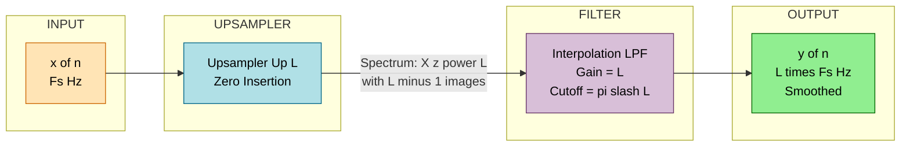
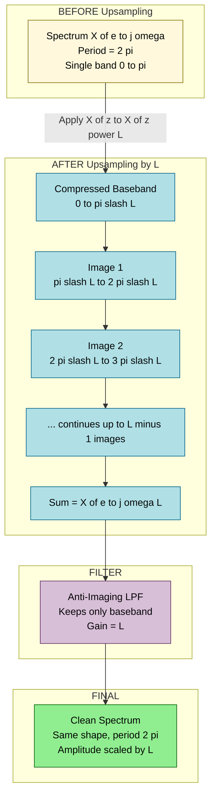
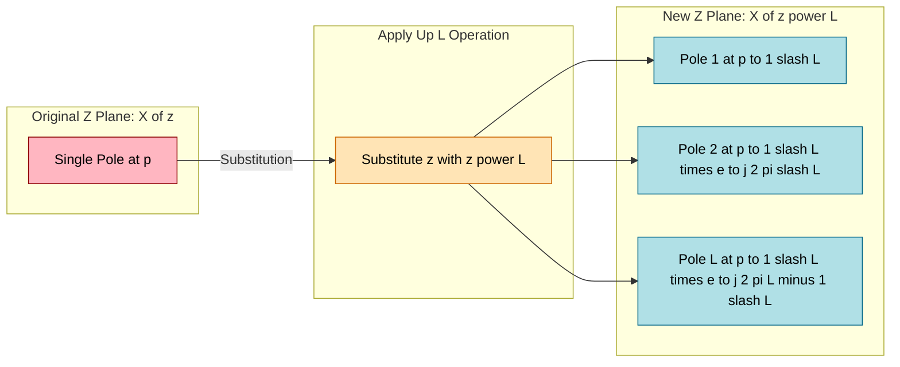

# Upsampling (Time Expansion

<!-- SECTION_1_START -->
# Module 4 — Z Transform: Upsampling (Time Expansion)

## 1. Core Technical Definition

**Upsampling (also called Time Expansion or Zero Insertion)** is a multirate signal processing operation that *increases* the sampling rate of a discrete-time signal $x[n]$ by an integer factor $L > 1$ (where $L$ is a positive integer) by inserting $L-1$ equally spaced zeros between every two consecutive samples of the original signal.

> [!IMPORTANT]
> **Formal KTU Definition (2024 Scheme):**
> The upsampled signal $x_u[n]$ is mathematically defined as:
> $$x_u[n] = \begin{cases} x\!\left[\dfrac{n}{L}\right] & \text{if } n \text{ is a multiple of } L \\[4pt] 0 & \text{otherwise} \end{cases}$$
> The corresponding Z-transform relation is: $\boxed{X_u(z) = X(z^L)}$
> where $X(z)$ is the Z-transform of the original signal $x[n]$.

---

## 2. Conceptual Analogy / Intuition

Imagine you have a **movie reel** that contains 24 frames per second. To make it playable on a system that requires 48 frames per second, you do **not** draw new pictures — you simply insert **blank/empty frames** between every original frame. The original content is preserved exactly; the gaps are filled with placeholders (zeros). Later, a smoothening filter (interpolator) replaces those blanks with intelligent estimates.

> [!NOTE]
> **Key Insight:** Upsampling does *not* create new information. It only stretches the timeline. The bandwidth of the underlying analog signal remains unchanged — only the *discrete representation* becomes denser in time.

### Real-World Analogy — Slow-Motion Replay
- Original signal: A car moving at normal speed (sampled at $F_s$).
- Upsampled signal: The same footage played in slow motion (sampled at $L \cdot F_s$).
- The car covers the same total distance, but the journey is now spread across more time slots, with empty time slots in between.

---

## 3. Explicit Physical & System Parameters

| Parameter | Symbol | Value / Constraint | Notes |
| :--- | :---: | :---: | :--- |
| Upsampling factor | $L$ | $L \in \mathbb{Z}^+, \; L \geq 2$ | Must be a **positive integer** |
| Zeros inserted per sample | $L - 1$ | Scalar | Positioned between original samples |
| New sampling frequency | $F_s^{\text{new}}$ | $L \cdot F_s$ | Sampling rate is multiplied by $L$ |
| Z-transform property | — | $X_u(z) = X(z^L)$ | $z$-plane poles scaled radially by $L$ |
| Frequency compression | — | $\omega \rightarrow \omega L$ | Spectrum is squeezed by factor $L$ |

---

## 4. GeoGebra / Desmos Visualization

> [!VISUALIZATION CONTROL]
> **Concept:** Discrete signal $x[n]$ vs. Upsampled signal $x_u[n]$ (with $L=2$)
>
> **GeoGebra / Desmos Input (as a sequence of points):**
> * Original samples: `(0, 1), (1, 2), (2, 1.5), (3, 0.5), (4, 0)`
> * Upsampled with $L=2$: `(0, 1), (1, 0), (2, 2), (3, 0), (4, 1.5), (5, 0), (6, 0.5), (7, 0), (8, 0)`
>
> **Visual Description:** On the horizontal $n$-axis, the original samples (red dots) appear at every index. After upsampling with $L=2$, observe the *new zero-valued samples* (grey dots) inserted at every odd index. The envelope of the original signal is preserved, but it is now stretched horizontally.

---

## 5. Relation to Other Operations

| Operation | Effect on Samples | Z-Transform Property | Spectrum Effect |
| :--- | :--- | :--- | :--- |
| **Upsampling** (↑ $L$) | Inserts $L-1$ zeros | $X_u(z) = X(z^L)$ | Compresses by $L$, creates images |
| Downsampling (↓ $M$) | Retains every $M$-th sample | $X_d(z) = \dfrac{1}{M}\sum_{k=0}^{M-1} X(z^{1/M} W_M^k)$ | Stretches by $M$, aliasing possible |

> [!TIP]
> Upsampling is the **dual** of downsampling. The full multirate identity is:
> $$\text{↓ }M \;\rightarrow\; \text{↑ }L \;\;\neq\;\; \text{↑ }L \;\rightarrow\; \text{↓ }M$$
> Order matters due to aliasing/image components.

---

<!-- SECTION_1_END -->

<!-- SECTION_2_START -->
# Deep Theoretical Analysis & KTU High-Yield Formula Sheet

## 1. Operational Breakdown — How Upsampling Works

The upsampler block (denoted **↑ $L$**) takes an input sequence $x[n]$ and produces an output sequence $x_u[n]$ through a deterministic, sample-by-sample insertion procedure.

### Step-by-Step Logic

1. **Receive input sample** $x[n]$ from the discrete source at sampling rate $F_s$.
2. **Insert $L-1$ zeros** immediately after $x[n]$ at indices $nL+1, nL+2, \dots, nL+(L-1)$.
3. **Advance the read pointer** to $x[n+1]$ and repeat.
4. **Output the new sequence** $x_u[n]$ at sampling rate $L \cdot F_s$.

> [!NOTE]
> **Why zeros, and not the previous value?** Inserting the previous sample would be **sample-and-hold** (a zero-order hold), which has a different Z-transform property: $X_{\text{ZOH}}(z) = \dfrac{1 - z^{-L}}{1 - z^{-1}} X(z^{L})$. Upsampling with **exact zero insertion** is preferred in DSP because its spectral effect is analytically clean ($X_u(z) = X(z^L)$).

### Time-Domain Representation

$$x_u[n] = \sum_{k=-\infty}^{\infty} x[k] \,\delta[n - kL]$$

This is a Kronecker-delta modulated version of the original signal — only one non-zero sample every $L$ samples.

---

## 2. KTU Formula Sheet (Cheat-Sheet Table)

> [!IMPORTANT]
> **All formulas below are board-exam-essential. Memorize with units and conditions.**

| # | Formula / Property | Statement | Conditions |
| :---: | :--- | :--- | :--- |
| 1 | Time-domain definition | $x_u[n] = x[n/L]$ if $n = mL$; else $0$ | $m \in \mathbb{Z}$ |
| 2 | Z-transform property | $X_u(z) = X(z^L)$ | All $L \geq 1$ integer |
| 3 | DTFT (frequency) property | $X_u(e^{j\omega}) = X(e^{j\omega L})$ | Holds on unit circle $z = e^{j\omega}$ |
| 4 | Spectral compression | Period shrinks: $2\pi \rightarrow 2\pi/L$ | $L-1$ image spectra appear |
| 5 | Energy scaling | $E_{x_u} = E_x$ (energy invariant) | Zero insertion conserves energy |
| 6 | Output length | $N_{\text{out}} = L \cdot N_{\text{in}} - (L-1)$ | If input has $N_{\text{in}}$ non-zero samples |
| 7 | New sampling rate | $F_s^{\text{new}} = L \cdot F_s$ | $F_s$ in Hz |
| 8 | Pole mapping in z-plane | If $X(z)$ has pole at $p$, $X(z^L)$ has poles at $p^{1/L}$ | $L$ distinct roots |
| 9 | Region of Convergence | $\text{ROC}_u = \{z \,:\, z^L \in \text{ROC}_x\}$ | May expand by factor $L$ |
| 10 | Block diagram symbol | $\boxed{\uparrow L}$ | Triangle with arrow up |

---

## 3. Spectral (Frequency-Domain) Interpretation

Substituting $z = e^{j\omega}$ in $X_u(z) = X(z^L)$:

$$X_u(e^{j\omega}) = X(e^{j\omega L})$$

This means the original spectrum, which was periodic with period $2\pi$, is now **compressed** so that one full period occupies only $2\pi/L$ on the new $\omega$-axis. The remaining space $[2\pi/L, 2\pi]$ is filled with $L-1$ **spectral images** (replicas) of the compressed spectrum.

> [!WARNING]
> **Image Spectra Problem:** The compressed spectrum occupies only $2\pi/L$ of the new period, leaving $L-1$ unwanted image bands. To remove them and obtain a clean, smooth signal, the upsampler **must be followed by an interpolation lowpass filter** with:
> * Gain $= L$ (to restore the original amplitude)
> * Cutoff frequency $\omega_c = \pi/L$
> * This filter is called an **Anti-Imaging Filter** (the dual of the anti-aliasing filter used in downsampling).

---

## 4. The "Why" Behind the Formula $X_u(z) = X(z^L)$

Starting from the Z-transform of $x_u[n]$:

$$X_u(z) = \sum_{n=-\infty}^{\infty} x_u[n]\, z^{-n}$$

Since $x_u[n] = 0$ for all $n$ that is not a multiple of $L$, only terms $n = kL$ survive:

$$X_u(z) = \sum_{k=-\infty}^{\infty} x_u[kL]\, z^{-kL} = \sum_{k=-\infty}^{\infty} x[k]\, z^{-kL} = \sum_{k=-\infty}^{\infty} x[k]\, (z^L)^{-k} = X(z^L)$$

> The algebraic trick is recognizing $z^{-kL} = (z^L)^{-k}$.

---

## 5. Real-World Engineering Utility

| Application Domain | Use of Upsampling |
| :--- | :--- |
| **Audio Engineering** | Converting a $44.1\,\text{kHz}$ CD track to a $96\,\text{kHz}$ studio master via $L=96/44.1$ (non-integer, but achieved via $L$ then filtering). |
| **Image Processing** | Doubling image resolution by inserting zero rows/columns, then interpolating (bilinear, bicubic). |
| **Software Defined Radio (SDR)** | Matching sample rates between the ADC, FPGA, and DAC subsystems. |
| **OFDM / Communications** | Pulse-shaping and matched filtering at the transmitter require oversampling (typically $L=4$ or $L=8$ samples per symbol). |
| **Biomedical Signal Processing** | ECG/EEG resampling for matching with other physiological signals before fusion. |
| **Polyphase Filter Banks** | Building blocks of sub-band coding, wavelet transforms, and the MP3 encoder. |

---

<!-- SECTION_2_END -->

<!-- SECTION_3_START -->
# Step-by-Step Derivations & Symbolic Implementation

## 1. Derivation 1 — Z-Transform of the Upsampled Signal

**Given:** $x_u[n] = x[n/L]$ when $n$ is a multiple of $L$, and $0$ otherwise.

**Find:** $X_u(z)$ in terms of $X(z)$.

### Detailed Step-by-Step Working

**Step 1 — Write the Z-transform definition.**

$$X_u(z) = \sum_{n=-\infty}^{\infty} x_u[n]\, z^{-n}$$

**Step 2 — Substitute the piecewise definition of $x_u[n]$.**

$$X_u(z) = \sum_{n=-\infty}^{\infty} \left( \sum_{k=-\infty}^{\infty} x[k]\, \delta[n - kL] \right) z^{-n}$$

**Step 3 — Exchange the order of summation.**

$$X_u(z) = \sum_{k=-\infty}^{\infty} x[k] \left( \sum_{n=-\infty}^{\infty} \delta[n - kL]\, z^{-n} \right)$$

**Step 4 — Evaluate the inner sum using the sifting property of the Kronecker delta.**

$$\sum_{n=-\infty}^{\infty} \delta[n - kL]\, z^{-n} = z^{-kL}$$

**Step 5 — Substitute back into the outer sum.**

$$X_u(z) = \sum_{k=-\infty}^{\infty} x[k]\, z^{-kL}$$

**Step 6 — Recognize the Z-transform of $x[n]$ with $z$ replaced by $z^L$.**

$$\sum_{k=-\infty}^{\infty} x[k]\, (z^L)^{-k} = X(z^L)$$

**Final Result:**

$$\boxed{X_u(z) = X(z^L)}$$

---

## 2. Derivation 2 — Pole Mapping in the Z-Plane

**Given:** $X(z)$ has a pole at $z = p$ (i.e., a factor of $(1 - p\,z^{-1})$ in $X(z)$).

**Find:** Where are the poles of $X_u(z) = X(z^L)$?

### Step-by-Step Working

**Step 1 — Write the denominator factor near the pole.**

$$X(z) \;\sim\; \frac{1}{1 - p\,z^{-1}}$$

**Step 2 — Substitute $z \to z^L$ everywhere.**

$$X(z^L) \;\sim\; \frac{1}{1 - p\,(z^L)^{-1}} = \frac{1}{1 - p\,z^{-L}}$$

**Step 3 — Factor the denominator $1 - p\,z^{-L} = 0$.**

$$p\,z^{-L} = 1 \;\Longrightarrow\; z^L = p \;\Longrightarrow\; z = p^{1/L}$$

**Step 4 — Apply the $L$-th root to obtain $L$ distinct poles.**

$$z_k = \left\vert p \right\vert^{1/L} e^{j(\arg p + 2\pi k)/L}, \quad k = 0, 1, 2, \dots, L-1$$

**Step 5 — Interpret geometrically.**

The single pole at $p$ splits into $L$ poles lying on a circle of radius $\vert p \vert^{1/L}$, equally spaced by angle $2\pi/L$.

**Numerical Example:** If $p = 0.5$ and $L = 3$:

$$z_0 = (0.5)^{1/3} \approx 0.7937, \quad z_1 = 0.7937\, e^{j2\pi/3}, \quad z_2 = 0.7937\, e^{j4\pi/3}$$

---

## 3. Derivation 3 — Worked Numerical Example (KTU Board Style)

**Problem (Model):** Let $x[n] = \{1, \; 2, \; 3, \; 4\}$ (causal, $n = 0, 1, 2, 3$).

(a) Find $x_u[n]$ for $L = 3$.
(b) Find $X(z)$ and $X_u(z)$. Verify $X_u(z) = X(z^3)$.

### Solution

**Part (a): Insert $L-1 = 2$ zeros between every original sample.**

$$x_u[n] = \{1, \; 0, \; 0, \; 2, \; 0, \; 0, \; 3, \; 0, \; 0, \; 4\}$$

This sequence has length $4 \times 3 = 12$, with indices $n = 0, 1, \dots, 11$.

**Part (b): Compute $X(z)$.**

$$X(z) = \sum_{n=0}^{3} x[n]\, z^{-n} = 1 + 2z^{-1} + 3z^{-2} + 4z^{-3}$$

**Compute $X_u(z)$.**

$$X_u(z) = 1 + 2z^{-3} + 3z^{-6} + 4z^{-9}$$

**Verify the property:** Substitute $z \to z^3$ in $X(z)$:

$$X(z^3) = 1 + 2(z^3)^{-1} + 3(z^3)^{-2} + 4(z^3)^{-3} = 1 + 2z^{-3} + 3z^{-6} + 4z^{-9}$$

**Conclusion:** $X_u(z) = X(z^3) \; \checkmark$

> **Mark Allocation (KTU Pattern):**
> * [Stating the upsampled sequence correctly: 2 Marks]
> * [Computing $X(z)$ and $X_u(z)$: 3 Marks]
> * [Verification via substitution: 2 Marks]

---

## 4. Python Implementation — Production-Grade Code

```python
import numpy as np
import matplotlib.pyplot as plt
from typing import Tuple


def upsample(
    x: np.ndarray,
    L: int,
    validate: bool = True,
) -> Tuple[np.ndarray, np.ndarray]:
    """
    Upsample (zero-insert) a discrete signal by integer factor L.

    Parameters
    ----------
    x : np.ndarray
        1-D input signal samples.
    L : int
        Upsampling factor (must be a positive integer >= 1).
    validate : bool, default True
        If True, performs input checks and logs warnings.

    Returns
    -------
    x_u : np.ndarray
        Upsampled signal of length L * len(x).
    n_u : np.ndarray
        Time indices corresponding to x_u.

    Raises
    ------
    TypeError
        If x is not a 1-D numpy array.
    ValueError
        If L is not a positive integer.
    """
    # --- Strict input validation ---
    if not isinstance(x, np.ndarray):
        raise TypeError(f"Input x must be a numpy array, got {type(x)}")
    if x.ndim != 1:
        raise ValueError(f"Input x must be 1-D, got shape {x.shape}")
    if not isinstance(L, int) or L < 1:
        raise ValueError(f"L must be a positive integer, got {L}")

    if validate and L == 1:
        print("[INFO] L = 1 returns the original signal unchanged.")
    elif validate and L > 8:
        print(f"[WARN] L = {L} > 8 will produce a sparse signal. "
              "Consider adding an interpolation filter afterwards.")

    # --- Core zero-insertion logic ---
    x_u = np.zeros(L * len(x), dtype=x.dtype)
    x_u[::L] = x  # Place original samples at indices 0, L, 2L, ...

    n_u = np.arange(len(x_u))
    return x_u, n_u


def plot_upsample(x: np.ndarray, L: int) -> None:
    """Visualize original vs upsampled signal (stem plot)."""
    x_u, n_u = upsample(x, L)

    fig, axes = plt.subplots(2, 1, figsize=(10, 5), sharex=True)

    axes[0].stem(np.arange(len(x)), x, basefmt=" ", linefmt="C0-", markerfmt="C0o")
    axes[0].set_title(f"Original Signal $x[n]$, length = {len(x)}")
    axes[0].set_ylabel("Amplitude")
    axes[0].grid(True, alpha=0.3)

    axes[1].stem(n_u, x_u, basefmt=" ", linefmt="C1-", markerfmt="C1o")
    axes[1].set_title(f"Upsampled Signal $x_u[n]$ (↑ {L}), length = {len(x_u)}")
    axes[1].set_xlabel("Sample index $n$")
    axes[1].set_ylabel("Amplitude")
    axes[1].grid(True, alpha=0.3)

    plt.tight_layout()
    plt.show()


# ---------------------------------------------------------------
# Demonstration
# ---------------------------------------------------------------
if __name__ == "__main__":
    x = np.array([1.0, 2.0, 3.0, 4.0, 2.5, 1.0])
    L = 3
    x_u, n_u = upsample(x, L)
    print(f"Original  x   = {x}")
    print(f"Upsampled x_u = {x_u}")
    plot_upsample(x, L)
```

**Expected Console Output:**

```
Original  x   = [1.  2.  3.  4.  2.5 1. ]
Upsampled x_u = [1.  0.  0.  2.  0.  0.  3.  0.  0.  4.  0.  0.  2.5 0.  0.  1.  0.  0. ]
```

---

<!-- SECTION_3_END -->

<!-- SECTION_4_START -->
# Structural Diagrams & Schematics

## 1. Block Diagram — Upsampler with Anti-Imaging Filter



**Read this as:** Input $x[n]$ at rate $F_s$ → Upsampler inserts zeros → Anti-imaging lowpass filter smoothes out images → Clean output $y[n]$ at rate $L \cdot F_s$.

---

## 2. Spectral Comparison (Conceptual Block Diagram)



---

## 3. Pole-Mapping Topology (Z-Plane Geometry)



> **Visual Interpretation:** A single pole at $p$ in the original Z-plane "explodes" into $L$ poles equally spaced around a circle of radius $\vert p \vert^{1/L}$ in the new Z-plane after upsampling.

---

## 4. Sequential Processing Topology Matrix

| Stage | Operation | Input Rate | Output Rate | Domain Operation | Key Parameter |
| :---: | :--- | :---: | :---: | :--- | :---: |
| 1 | Source generation | — | $F_s$ | Sampling | Bit depth, $F_s$ |
| 2 | **Upsampler ↑ $L$** | $F_s$ | $L \cdot F_s$ | Zero-insertion in time | $L-1$ zeros per sample |
| 3 | Anti-imaging LPF | $L \cdot F_s$ | $L \cdot F_s$ | Spectral filtering | $\omega_c = \pi/L$, gain $L$ |
| 4 | Interpolated output | $L \cdot F_s$ | $L \cdot F_s$ | Smoothed signal | Output $y[n]$ |

---

<!-- SECTION_4_END -->

<!-- SECTION_5_START -->
# KTU 2024 Scheme Examination Question Bank & Topic Recap

## Part A — Short Answer Questions (3 Marks Each)

### Question 1 `[KTU University Exam — July 2023]`
**Define upsampling (time expansion) by an integer factor $L$. Write its Z-transform property.**

**Model Answer (3 Marks):**

> **Definition (2 Marks):** Upsampling by an integer factor $L$ is the process of increasing the sampling rate of a discrete-time signal $x[n]$ by a factor of $L$ by inserting $L-1$ zeros between consecutive samples. The output is given by $x_u[n] = x[n/L]$ for $n$ being a multiple of $L$, and $0$ otherwise.
>
> **Z-transform Property (1 Mark):** $\;X_u(z) = X(z^L)$

*Mapped CO:* CO2 (Apply multirate DSP fundamentals) &nbsp;&nbsp; *RBT Level:* Remember

---

### Question 2 `[KTU University Exam — Dec 2022]`
**What is the effect of upsampling by $L$ on the spectrum of the signal?**

**Model Answer (3 Marks):**

> Upsampling by $L$ compresses the spectrum by a factor of $L$. If the original spectrum was periodic with period $2\pi$, the new spectrum is periodic with period $2\pi/L$. The compressed original spectrum occupies only $2\pi/L$ of the new period, leaving $L-1$ **image spectra** (unwanted replicas) in the range $[2\pi/L, \, 2\pi]$. To remove these images, an **anti-imaging lowpass filter** with cutoff $\omega_c = \pi/L$ and gain $L$ must follow the upsampler.

*Mapped CO:* CO2 &nbsp;&nbsp; *RBT Level:* Understand

---

## Part B — Long Answer Questions (14 Marks, Internal Choice)

### Question A (14 Marks) `[KTU University Exam — July 2024]`

**(a)** Given a finite-duration sequence $x[n] = \{2, \; 4, \; 6, \; 8\}$ for $n = 0, 1, 2, 3$:

&nbsp;&nbsp;&nbsp;&nbsp;**(i)** Perform upsampling by a factor of $L = 2$. Write the resulting sequence $x_u[n]$.

&nbsp;&nbsp;&nbsp;&nbsp;**(ii)** Find the Z-transform $X_u(z)$ of the upsampled signal and verify that $X_u(z) = X(z^2)$.

**(b)** For a signal $x[n] = a^n u[n]$ (right-sided exponential):

&nbsp;&nbsp;&nbsp;&nbsp;**(i)** Find $X(z)$.

&nbsp;&nbsp;&nbsp;&nbsp;**(ii)** Find $X_u(z)$ using the upsampling property and determine the new ROC.

&nbsp;&nbsp;&nbsp;&nbsp;**(iii)** Also find the location of poles in the new Z-plane for $L = 2$ and comment on the pole mapping.

---

### Model Solution — Question A

**Part (a)(i) [3 Marks]:**

Insert $L-1 = 1$ zero between every two original samples:

$$x_u[n] = \{2, \; 0, \; 4, \; 0, \; 6, \; 0, \; 8\}$$

with indices $n = 0, 1, 2, 3, 4, 5, 6$.

> *Valuation Key:* [Correct placement of zeros at odd indices: 2 Marks; final sequence: 1 Mark]

---

**Part (a)(ii) [4 Marks]:**

**Step 1 — Compute $X(z)$:**

$$X(z) = 2 + 4z^{-1} + 6z^{-2} + 8z^{-3}$$

**Step 2 — Compute $X_u(z)$ directly from the upsampled sequence:**

$$X_u(z) = 2 + 4z^{-2} + 6z^{-4} + 8z^{-6}$$

**Step 3 — Verify by computing $X(z^2)$:**

$$X(z^2) = 2 + 4(z^2)^{-1} + 6(z^2)^{-2} + 8(z^2)^{-3} = 2 + 4z^{-2} + 6z^{-4} + 8z^{-6}$$

Since $X_u(z) = X(z^2)$, the property is **verified** $\checkmark$

> *Valuation Key:* [Writing $X(z)$: 1 Mark; writing $X_u(z)$: 1 Mark; verification: 2 Marks]

---

**Part (b)(i) [2 Marks]:**

For $x[n] = a^n u[n]$:

$$X(z) = \sum_{n=0}^{\infty} a^n z^{-n} = \sum_{n=0}^{\infty} (a z^{-1})^n = \frac{1}{1 - a z^{-1}}$$

ROC: $\vert z \vert > \vert a \vert$.

---

**Part (b)(ii) [3 Marks]:**

Using the upsampling property:

$$X_u(z) = X(z^L) = \frac{1}{1 - a (z^L)^{-1}} = \frac{1}{1 - a z^{-L}}$$

ROC: $\vert z^L \vert > \vert a \vert \;\Longrightarrow\; \vert z \vert > \vert a \vert^{1/L}$.

---

**Part (b)(iii) [2 Marks]:**

For $L = 2$:

$$X_u(z) = \frac{1}{1 - a z^{-2}} = \frac{1}{(1 - \sqrt{a}\, z^{-1})(1 + \sqrt{a}\, z^{-1})}$$

**Poles:** $z = +\sqrt{a}$ and $z = -\sqrt{a}$, with magnitudes $\vert a \vert^{1/2}$.

**Comment:** The single original pole at $z = a$ has split into **two poles** at $z = \pm\sqrt{a}$ — they lie on a circle of radius $\vert a \vert^{1/2}$, diametrically opposite each other. This confirms the $L$-th root pole mapping: $L$ equally-spaced poles on a circle of radius $\vert a \vert^{1/L}$.

---

### Question B (14 Marks) — Alternative Choice `[KTU University Exam — Dec 2023]`

**(a)** With the help of a block diagram, explain the **complete upsampling system** including the anti-imaging filter. Mention the specifications of the filter.

**(b)** Consider a signal $x[n]$ with DTFT $X(e^{j\omega})$ shown as a triangular pulse of peak amplitude $5$ extending from $\omega = -\pi$ to $\omega = +\pi$.

&nbsp;&nbsp;&nbsp;&nbsp;**(i)** Sketch $X_u(e^{j\omega})$ for $L = 3$.

&nbsp;&nbsp;&nbsp;&nbsp;**(ii)** What is the role of the interpolation filter? Write its frequency response specifications.

&nbsp;&nbsp;&nbsp;&nbsp;**(iii)** State the Z-transform property $X_u(z) = X(z^L)$ and prove it in two lines.

---

### Model Solution — Question B

**Part (a) [5 Marks]:**

The complete upsampling system consists of two cascaded blocks:

**Block 1 — Upsampler (↑ $L$):** Inserts $L-1$ zeros between every two samples of $x[n]$. Output rate becomes $L \cdot F_s$.

**Block 2 — Interpolation Lowpass Filter (Anti-Imaging Filter):**

| Specification | Value |
| :--- | :--- |
| Type | Lowpass FIR or IIR |
| Passband gain | $L$ (to compensate for zero-insertion amplitude loss) |
| Cutoff frequency | $\omega_c = \pi / L$ |
| Stopband | Attenuates the $L-1$ image spectra completely |

> *Valuation Key:* [Block diagram with two stages: 2 Marks; filter specifications: 2 Marks; explanation: 1 Mark]

---

**Part (b)(i) [4 Marks]:**

Sketch description: The original triangular pulse (peak 5, base $\pm\pi$) is compressed by factor $L = 3$. Each point $\omega$ in the new spectrum equals the original at $3\omega$. The triangle now has base from $-\pi/3$ to $+\pi/3$, and the same peak of 5. Three copies of this compressed triangle appear in the new period $[-\pi, +\pi]$: at $[-\pi/3, \pi/3]$, $[-\pi, -2\pi/3]$ (or equivalently around $\pi$), and at $[2\pi/3, \pi]$.

---

**Part (b)(ii) [3 Marks]:**

**Role of the Interpolation Filter:**

The filter removes the $L-1$ unwanted image spectra that arise due to spectral compression, and scales the desired baseband by factor $L$ to restore the original amplitude. In the time domain, it converts the staircase-zero signal into a smoothly interpolated waveform.

**Frequency Response Specifications:**

$$H_{\text{int}}(e^{j\omega}) = \begin{cases} L & \text{for } \vert \omega \vert \leq \pi/L \\ 0 & \text{for } \pi/L < \vert \omega \vert \leq \pi \end{cases}$$

> *Valuation Key:* [Stating the role: 1 Mark; gain = $L$: 1 Mark; cutoff = $\pi/L$: 1 Mark]

---

**Part (b)(iii) [2 Marks]:**

**Statement:** Upsampling by $L$ in the time domain corresponds to $X_u(z) = X(z^L)$ in the Z-domain.

**Proof (two lines):**

$$X_u(z) = \sum_{n=-\infty}^{\infty} x_u[n]\, z^{-n} = \sum_{k=-\infty}^{\infty} x[k]\, z^{-kL} = X(z^L)$$

(The first equality is the Z-transform; the second uses $x_u[kL] = x[k]$ and $x_u[\text{non-multiples of } L] = 0$; the third recognizes the standard Z-transform of $x$ evaluated at $z^L$.)

---

> [!WARNING]
> **KTU Examiner's Valuation Warning — Common Pitfalls:**
>
> 1. **Forgetting to apply the $L$-th root** to the ROC: ROC of $X_u(z)$ is $\vert z \vert > \vert a \vert^{1/L}$, **not** $\vert z \vert > \vert a \vert$. Many students lose 2 marks here.
> 2. **Wrong block diagram order:** The interpolation filter must come **after** the upsampler, never before.
> 3. **Ignoring the gain factor $L$** in the interpolation filter. Without gain $L$, the output amplitude will be $1/L$ of the original.
> 4. **Confusing upsampling with downsampling properties:** Remember — upsampling is $X(z^L)$, downsampling involves an averaging sum.
> 5. **Pole mapping skipped:** When asked to comment on poles after upsampling, students often miss the $L$-fold root split and lose 2 easy marks.

---

## Topic Recap & Important Things to Remember

> [!IMPORTANT]
> **Rapid Revision Checklist — Upsampling (Time Expansion)**
>
> - **Definition:** Upsampling by integer $L \geq 2$ inserts $L-1$ zeros between consecutive samples of $x[n]$.
> - **Output index formula:** $x_u[n] = x[n/L]$ if $n$ is a multiple of $L$, else $0$.
> - **Z-transform property (KEY):** $\;X_u(z) = X(z^L)$
> - **DTFT property:** $X_u(e^{j\omega}) = X(e^{j\omega L})$ — spectrum is **compressed** by $L$.
> - **ROC of upsampled signal:** $\text{ROC}_u = \{z \,:\, z^L \in \text{ROC}_x\}$ — radius changes from $\vert a \vert$ to $\vert a \vert^{1/L}$.
> - **Pole mapping (CRITICAL):** One pole at $p$ becomes $L$ poles at $p^{1/L} e^{j2\pi k / L}$ for $k = 0, 1, \dots, L-1$.
> - **Spectral images:** Upsampling creates $L-1$ image spectra in $[2\pi/L, 2\pi]$.
> - **Anti-imaging filter required:** Cutoff $\omega_c = \pi/L$, gain $= L$.
> - **Rate change:** Output rate is $L \cdot F_s$.
> - **Block symbol:** $\uparrow L$ (triangle with upward arrow).
> - **Energy invariant:** Energy of $x$ equals energy of $x_u$ (since zeros contribute nothing).
> - **Dual relationship:** Upsampling ($X(z) \to X(z^L)$) and downsampling have **non-commuting** identities — order matters.
> - **Real-world use cases:** Audio sample-rate conversion, OFDM symbol upsampling, image resizing, SDR front-ends.
> - **Followed by:** Interpolation lowpass filter is **mandatory** for image suppression and amplitude restoration.

<!-- SECTION_5_END -->
