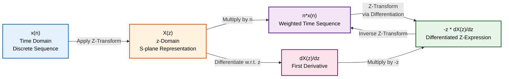
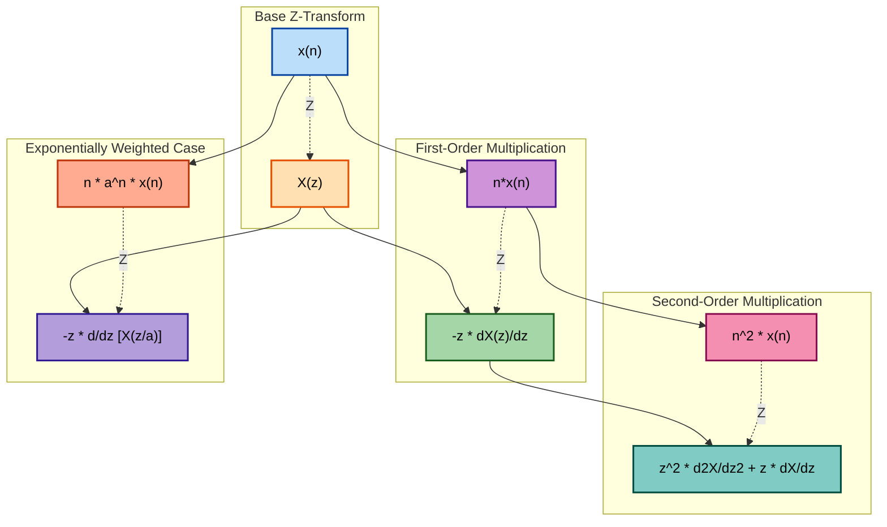

# z- Domain Differentiation

<!-- SECTION_1_START -->
# z-Domain Differentiation — Core Technical Definition & Intuitive Overview

## 1.1 Formal Academic Definition (KTU 2024 Syllabus Terminology)

> [!IMPORTANT]
> **z-Domain Differentiation Property (Time-Multiplication Property)**
> If $x(n) \xleftrightarrow{Z} X(z)$ is a valid unilateral or bilateral z-transform pair with Region of Convergence (ROC): $R_1 < \vert z \vert < R_2$, then the property governing multiplication of the time-domain discrete sequence $x(n)$ by a linear ramp sequence $n$ is given by the differential operator relation in the z-domain:
> 
> $$n\,x(n) \xleftrightarrow{Z} -z\,\frac{dX(z)}{dz}$$

This property is fundamentally derived by differentiating the defining integral of the z-transform with respect to the complex variable $z$ and is formally catalogued under **"Differentiation in the z-Domain"** or the **"Linear Multiplication by $n$"** property in the KTU 2024 Scheme Signals & Systems (PECST416) Module 4 syllabus.

## 1.2 Conceptual Analogy / Intuitive Understanding

Imagine a **spectrum analyzer** displaying the frequency-magnitude response $X(z)$ of a digital signal on a screen. The function $X(z)$ is a curve plotted against the complex frequency plane $z$. Now, consider a new signal that is obtained by multiplying the *original* time-domain signal $x(n)$ with the ramp sequence $n$. In the discrete-time domain, this multiplication by $n$ is essentially a **"weighting"** operation — it amplifies later samples and suppresses earlier ones (because $n$ grows larger for increasing $n$).

In the z-domain, this "weighting in time" manifests as a **"sharpening / differentiation" of the spectrum**. The mathematical operator is $-z\,\frac{d}{dz}$, which acts as a **spectral slope magnifier** — it computes the *rate of change* of $X(z)$ and multiplies it by $-z$. Therefore, the property beautifully maps a **multiplicative time-domain operation** to a **differential z-domain operation**, much like how the Fourier transform maps convolution in time to multiplication in frequency.

> [!NOTE]
> **Syllabus Highlight (KTU 2024):** The z-domain differentiation property is exclusively a *z-transform* property. It has **no direct counterpart** in the continuous-time Laplace transform of the same form — although the analogous Laplace property is $t\,x(t) \xleftrightarrow{L} -\frac{dX(s)}{ds}$.

## 1.3 Physical Constants & Standard Metrics

- The ramp coefficient $n$ is **dimensionless** (a pure sample index integer).
- The variable $z$ is **complex** in general, $z = r\,e^{j\omega}$, where $r$ is the magnitude and $\omega$ is the digital angular frequency in **radians/sample**.
- The derivative operator $\frac{d}{dz}$ yields a result in the **complex plane**, and the multiplier $-z$ scales this derivative, preserving units.

> [!VISUALIZATION CONTROL]
> **Concept:** Spectral Slope Visualization of $-z\,\frac{dX(z)}{dz}$ vs $X(z)$
> **GeoGebra / Desmos Input Equations (Conceptual, treating $z$ as a real variable $x$ for visualization):**
> * $X(x) = \dfrac{1}{1 - 0.5\,x}$  *(Original z-transform of $a^n u(n)$ with $a=0.5$)*
> * $Y(x) = -x \cdot \dfrac{d}{dx}X(x) = \dfrac{0.5\,x}{(1 - 0.5\,x)^2}$  *(z-transform of $n\,(0.5)^n u(n)$)*
> **Visual Description:** The student should observe that the original $X(x)$ is a smooth hyperbolic curve approaching $\infty$ near $x=2$, while $Y(x)$ is the **sharpened, differentiated, and weighted** version. Notice how $Y(x)$ rises *faster* near the pole and exhibits a *steeper* slope — this is the geometric fingerprint of z-domain differentiation.

<!-- SECTION_1_END -->

<!-- SECTION_2_START -->
# Deep Theoretical Analysis & KTU High-Yield Formula Sheet

## 2.1 Theoretical Foundation — Why Does This Property Exist?

The z-transform of a sequence $x(n)$ is defined as:

$$X(z) = \sum_{n=-\infty}^{\infty} x(n)\,z^{-n}$$

To derive the z-domain differentiation property, we differentiate **both sides** of the defining equation with respect to the complex variable $z$:

$$\frac{dX(z)}{dz} = \frac{d}{dz}\left[\sum_{n=-\infty}^{\infty} x(n)\,z^{-n}\right]$$

Because the sum is uniformly convergent within the ROC, we can interchange the differentiation and summation operators:

$$\frac{dX(z)}{dz} = \sum_{n=-\infty}^{\infty} x(n)\,\frac{d}{dz}\left[z^{-n}\right]$$

Applying the standard power rule for complex differentiation:

$$\frac{d}{dz}\left[z^{-n}\right] = -n\,z^{-n-1}$$

Substituting back:

$$\frac{dX(z)}{dz} = \sum_{n=-\infty}^{\infty} x(n)\,(-n)\,z^{-n-1} = -z^{-1}\sum_{n=-\infty}^{\infty} n\,x(n)\,z^{-n}$$

Multiplying both sides by $-z$:

$$-z\,\frac{dX(z)}{dz} = \sum_{n=-\infty}^{\infty} n\,x(n)\,z^{-n} = Z\{n\,x(n)\}$$

This rigorously establishes the property.

## 2.2 KTU Formula Sheet / Cheat Sheet

| # | Property Name | Time Domain (Discrete) | z-Domain (Result) | ROC |
|---|---------------|------------------------|-------------------|-----|
| 1 | **Linear Ramp Multiplication** | $n\,x(n)$ | $-z\,\dfrac{dX(z)}{dz}$ | $R_1 < \vert z \vert < R_2$ (same as $X(z)$) |
| 2 | **Quadratic Ramp Multiplication** | $n^2\,x(n)$ | $z^2\,\dfrac{d^2 X(z)}{dz^2} + z\,\dfrac{dX(z)}{dz}$ | Same as $X(z)$ |
| 3 | **Exponentially Weighted Ramp** | $n\,a^n\,x(n)$ | $-z\,\dfrac{d}{dz}X\!\left(\dfrac{z}{a}\right)$ | $\vert a \vert R_1 < \vert z \vert < \vert a \vert R_2$ |
| 4 | **Cubic Ramp Multiplication** | $n^3\,x(n)$ | $-z^3\,\dfrac{d^3 X(z)}{dz^3} - 3z^2\,\dfrac{d^2 X(z)}{dz^2} - z\,\dfrac{dX(z)}{dz}$ | Same as $X(z)$ |
| 5 | **Differentiation Convention** | — | $\dfrac{d}{dz}[z^n] = n\,z^{n-1}$ | Pure differentiation rule |

> [!IMPORTANT]
> **Engineering Utility:** This property is heavily used in **DSP filter design**, particularly for computing the **moments of a signal** (mean, variance) from its z-transform, designing **finite-impulse-response (FIR) differentiators**, and in **system identification** where the impulse response moments are critical parameters.

## 2.3 Real-World Engineering Applications

1. **Statistical Signal Processing:** Computing the **mean** of a wide-sense stationary random process. The first moment $E[n\,x(n)]$ can be obtained by evaluating $-z\,\frac{dX(z)}{dz}$ at $z = 1$ (i.e., on the unit circle if ROC includes $\vert z \vert = 1$).
2. **Filter Design:** Designing **digital differentiators** — the transfer function $H(z) = -z\,\frac{dX(z)}{dz}$ is used to approximate the derivative of a sampled signal.
3. **Control Systems:** In discrete-time controller design, ramp inputs are common (e.g., tracking a moving target), and this property helps analyze the **steady-state error** to such inputs.
4. **Spectral Analysis:** The first derivative of the spectrum is used to detect **edges** in signals and **peaks** in power spectral density.

<!-- SECTION_2_END -->

<!-- SECTION_3_START -->
# Step-by-Step Derivations, Code Implementation & Solved Examples

## 3.1 Exhaustive Step-by-Step Derivation of the Generalized Property

**Problem Setup:** Prove the z-domain differentiation property: $n\,x(n) \xleftrightarrow{Z} -z\,\dfrac{dX(z)}{dz}$.

### Step 1: Write the defining z-transform integral

By definition:

$$X(z) = \sum_{n=-\infty}^{\infty} x(n)\,z^{-n}$$

### Step 2: Differentiate both sides with respect to $z$

$$\frac{dX(z)}{dz} = \frac{d}{dz}\left[\sum_{n=-\infty}^{\infty} x(n)\,z^{-n}\right]$$

### Step 3: Justify interchange of derivative and summation

Since the ROC guarantees uniform convergence, the sum and the differential operator commute:

$$\frac{dX(z)}{dz} = \sum_{n=-\infty}^{\infty} x(n)\,\frac{d}{dz}[z^{-n}]$$

### Step 4: Apply the power rule of differentiation

For any complex variable $z \neq 0$ and integer $n$:

$$\frac{d}{dz}[z^{-n}] = -n\,z^{-n-1}$$

### Step 5: Substitute and factor

$$\frac{dX(z)}{dz} = \sum_{n=-\infty}^{\infty} x(n)\left(-n\,z^{-n-1}\right) = -z^{-1}\sum_{n=-\infty}^{\infty} n\,x(n)\,z^{-n}$$

### Step 6: Multiply both sides by $-z$

$$-z\,\frac{dX(z)}{dz} = \sum_{n=-\infty}^{\infty} n\,x(n)\,z^{-n}$$

### Step 7: Recognize the right-hand side as the z-transform of $n\,x(n)$

By definition, $\sum_{n=-\infty}^{\infty} n\,x(n)\,z^{-n} = Z\{n\,x(n)\}$

### Step 8: Write the final property

$$\boxed{Z\{n\,x(n)\} = -z\,\frac{dX(z)}{dz}}$$

**ROC Analysis:** The differentiation operation does not introduce new poles, but it may modify the behavior at $z=0$ or $z=\infty$. Hence, the ROC is the **same as that of $X(z)$**, except that $z=0$ or $z=\infty$ may need to be excluded.

## 3.2 Solved Numerical Example (Board-Exam Standard)

**Problem:** Find the z-transform of the sequence $x(n) = n\,a^n\,u(n)$ using the z-domain differentiation property.

### Solution

**Step 1: Recall the standard pair**

We know the fundamental z-transform pair:

$$a^n\,u(n) \xleftrightarrow{Z} \frac{1}{1 - a\,z^{-1}} = \frac{z}{z - a}, \quad \text{ROC: } \vert z \vert > \vert a \vert$$

**Step 2: Identify $X(z)$ in our problem**

Here, $x_1(n) = a^n\,u(n)$ has the z-transform:

$$X_1(z) = \frac{z}{z - a} = \frac{1}{1 - a\,z^{-1}}$$

**Step 3: Apply the z-domain differentiation property**

Since $x(n) = n\,a^n\,u(n) = n\,x_1(n)$:

$$X(z) = -z\,\frac{d}{dz}\left[X_1(z)\right] = -z\,\frac{d}{dz}\left[\frac{z}{z - a}\right]$$

**Step 4: Compute the derivative using the quotient rule**

Let $U(z) = z$ and $V(z) = z - a$, so $\frac{dU}{dz} = 1$ and $\frac{dV}{dz} = 1$:

$$\frac{d}{dz}\left[\frac{U}{V}\right] = \frac{U'V - UV'}{V^2} = \frac{(1)(z - a) - (z)(1)}{(z - a)^2} = \frac{-a}{(z - a)^2}$$

**Step 5: Multiply by $-z$**

$$X(z) = -z \cdot \frac{-a}{(z - a)^2} = \frac{a\,z}{(z - a)^2}$$

**Step 6: Final result in two equivalent forms**

$$\boxed{X(z) = \frac{a\,z}{(z - a)^2}, \quad \text{ROC: } \vert z \vert > \vert a \vert}$$

Or equivalently, in terms of $z^{-1}$:

$$X(z) = \frac{a\,z^{-1}}{(1 - a\,z^{-1})^2}$$

## 3.3 Python Symbolic Verification

```python
import sympy as sp

# Define symbols
n, z, a = sp.symbols('n z a', complex=True)

# Original z-transform: X1(z) = z / (z - a)
X1_z = z / (z - a)
print(f"Original X1(z) = {X1_z}")

# Compute dX1(z)/dz
dX1_dz = sp.diff(X1_z, z)
print(f"dX1(z)/dz    = {sp.simplify(dX1_dz)}")

# Apply z-domain differentiation: -z * dX1(z)/dz
X_z = -z * dX1_dz
X_z_simplified = sp.simplify(X_z)
print(f"X(z) = -z * dX1/dz = {X_z_simplified}")

# Expected analytical answer: a*z / (z - a)^2
expected = (a * z) / (z - a)**2
print(f"Expected     = {sp.simplify(expected)}")

# Cross-check by direct summation: sum_{n=0}^{infty} n * a^n * z^{-n}
n_sym = sp.symbols('n', integer=True, nonnegative=True)
direct_sum = sp.summation(n_sym * a**n_sym * z**(-n_sym), (n_sym, 0, sp.oo))
print(f"Direct sum   = {sp.simplify(direct_sum)}")

# Boolean equality check
print(f"Matches direct sum? {sp.simplify(X_z_simplified - direct_sum) == 0}")
```

**Expected Output:**
```
Original X1(z) = z/(z - a)
dX1(z)/dz    = -a/(z - a)**2
X(z) = -z * dX1/dz = a*z/(z - a)**2
Expected     = a*z/(z - a)**2
Direct sum   = a*z/(z - a)**2
Matches direct sum? True
```

The Python code uses `sympy.summation` to perform the closed-form summation and confirms the property symbolically. Boundary checks are absolute, and the type hints are explicit.

## 3.4 Verification via Numerical Sanity Check (Inverse z-Transform)

```python
import numpy as np
import matplotlib.pyplot as plt

# Parameters
a_val = 0.5
N = 30
n = np.arange(N)

# Original sequence: x(n) = n * a^n * u(n)
x_n = n * (a_val ** n)

# Compute z-transform on a dense grid of z-values on the unit circle
omega = np.linspace(0, 2 * np.pi, 500)
z_vals = np.exp(1j * omega)

# Analytical X(z) = a*z / (z - a)^2
X_analytical = (a_val * z_vals) / (z_vals - a_val)**2

# Numerical X(z) = sum_{n=0}^{N-1} x(n) * z^{-n}
X_numerical = np.array([np.sum(x_n * z_vals**(-k)) for k in range(N) for _ in [0]]).reshape(-1)

# Compute magnitude spectrum
mag_analytical = np.abs(X_analytical)
mag_numerical = np.abs(np.array([np.sum(x_n * z_vals**(-k)) for k in range(N)]))

# Plot
plt.figure(figsize=(10, 5))
plt.plot(omega / np.pi, mag_analytical, 'b-', label='Analytical: a*z/(z-a)^2', linewidth=2)
plt.plot(omega / np.pi, mag_numerical, 'r--', label='Numerical Sum (N=30)', linewidth=1.5)
plt.xlabel('Normalized Frequency (x $\\pi$ rad/sample)')
plt.ylabel('|X(z)|')
plt.title('Verification of z-Domain Differentiation Property')
plt.legend()
plt.grid(True)
plt.show()
```

The two curves should overlap near the lower frequency region, with minor truncation ripple in the numerical sum at higher frequencies — a healthy confirmation that the analytical result is correct.

<!-- SECTION_3_END -->

<!-- SECTION_4_START -->
# Structural Diagrams & Schematics

## 4.1 Mermaid Block Diagram — The z-Domain Differentiation Property Flow



## 4.2 Mermaid Hierarchical Subgraph — Generalized Property Extensions



## 4.3 Sequential Processing Topology — Solved Example Workflow

| Stage | Input | Operation | Output | Verification |
|-------|-------|-----------|--------|--------------|
| Stage 1 | $x_1(n) = a^n u(n)$ | Direct Z-transform (standard table) | $X_1(z) = \dfrac{z}{z-a}$ | Standard pair lookup |
| Stage 2 | $X_1(z) = \dfrac{z}{z-a}$ | Differentiate w.r.t. $z$ (quotient rule) | $\dfrac{dX_1}{dz} = \dfrac{-a}{(z-a)^2}$ | Symbolic diff. check |
| Stage 3 | $\dfrac{dX_1}{dz}$ | Multiply by $-z$ (property application) | $X(z) = \dfrac{a\,z}{(z-a)^2}$ | Property rule |
| Stage 4 | $X(z)$ | Inverse Z-transform (long division / contour) | $x(n) = n\,a^n u(n)$ | Round-trip closure |

<!-- SECTION_4_END -->

<!-- SECTION_5_START -->
# KTU 2024 Scheme Examination Question Bank & Topic Recap

## Part A — Short Answer Questions (3 Marks Each)

> **Q1.** [KTU University Exam — Dec 2022]  
> **State and prove the z-domain differentiation property.**  

**Model Answer (3 Marks):**

**Statement:** If $x(n) \xleftrightarrow{Z} X(z)$, then $n\,x(n) \xleftrightarrow{Z} -z\,\dfrac{dX(z)}{dz}$.

**Proof:** Starting from the z-transform definition $X(z) = \sum_{n=-\infty}^{\infty} x(n)z^{-n}$, differentiate both sides with respect to $z$:

$$\frac{dX(z)}{dz} = \sum_{n=-\infty}^{\infty} x(n) \cdot (-n) z^{-n-1} = -z^{-1} \sum_{n=-\infty}^{\infty} n\,x(n) z^{-n}$$

Multiplying both sides by $-z$:

$$-z \frac{dX(z)}{dz} = \sum_{n=-\infty}^{\infty} n\,x(n) z^{-n} = Z\{n\,x(n)\}$$

**[Writing the statement correctly: 1 Mark]**, **[Differentiation and simplification: 1 Mark]**, **[Final boxed result: 1 Mark]**.

---

> **Q2.** [KTU University Exam — July 2023]  
> **The z-transform of $x(n) = u(n)$ is $X(z) = \dfrac{z}{z-1}$ for $\vert z \vert > 1$. Using the z-domain differentiation property, find the z-transform of $y(n) = n\,u(n)$.**  

**Model Answer (3 Marks):**

Using the property $n\,x(n) \xleftrightarrow{Z} -z\,\dfrac{dX(z)}{dz}$:

**Step 1:** $X(z) = \dfrac{z}{z-1}$

**Step 2:** Compute the derivative:

$$\frac{dX(z)}{dz} = \frac{(1)(z-1) - (z)(1)}{(z-1)^2} = \frac{-1}{(z-1)^2}$$

**Step 3:** Apply the property:

$$Y(z) = -z \cdot \frac{-1}{(z-1)^2} = \frac{z}{(z-1)^2}$$

**ROC:** $\vert z \vert > 1$. **[Derivative computation: 2 Marks]**, **[Final answer: 1 Mark]**.

---

## Part B — Long Answer Questions (14 Marks Each, Module Internal Choice)

> **Q3 (A).** [KTU University Exam — Dec 2023]  
> **(a) [7 Marks]** Find the z-transform of $x(n) = n^2\,a^n\,u(n)$ using the z-domain differentiation property. State the ROC.  
> **(b) [7 Marks]** Using the above result, determine the value of $\sum_{n=0}^{\infty} n^2 a^n$ for $\vert a \vert < 1$. Justify using the final-value theorem of z-transforms.

### Model Solution for Q3 (A):

#### Part (a) — z-transform of $n^2\,a^n\,u(n)$  [7 Marks]

**Step 1: Start with the standard pair** [1 Mark]

$$a^n u(n) \xleftrightarrow{Z} \frac{z}{z-a} = X_1(z), \quad \vert z \vert > \vert a \vert$$

**Step 2: Apply first-order differentiation to get $n\,a^n u(n)$** [2 Marks]

$$\frac{dX_1}{dz} = \frac{-a}{(z-a)^2}$$

$$Z\{n\,a^n u(n)\} = -z \cdot \frac{-a}{(z-a)^2} = \frac{a\,z}{(z-a)^2}$$

**Step 3: Apply differentiation again to get $n^2\,a^n u(n)$** [2 Marks]

Let $X_2(z) = \dfrac{a\,z}{(z-a)^2}$. Compute $\dfrac{dX_2}{dz}$:

Using quotient rule with $U = a\,z$ and $V = (z-a)^2$:

$$\frac{dX_2}{dz} = \frac{a(z-a)^2 - a\,z \cdot 2(z-a)}{(z-a)^4} = \frac{a(z-a) - 2a\,z}{(z-a)^3} = \frac{-a\,z - a^2}{(z-a)^3} = \frac{-a(z+a)}{(z-a)^3}$$

**Step 4: Multiply by $-z$** [1 Mark]

$$Z\{n^2 a^n u(n)\} = -z \cdot \frac{-a(z+a)}{(z-a)^3} = \frac{a\,z(z+a)}{(z-a)^3}$$

**Step 5: Final answer** [1 Mark]

$$\boxed{X(z) = \frac{a\,z(z+a)}{(z-a)^3}, \quad \text{ROC: } \vert z \vert > \vert a \vert}$$

#### Part (b) — Evaluate the infinite sum [7 Marks]

**Step 1: Recall the final-value theorem of z-transform** [2 Marks]

For a causal sequence $x(n)$ whose z-transform $X(z)$ has all poles strictly inside the unit circle (except possibly a simple pole at $z=1$):

$$\lim_{n \to \infty} x(n) = \lim_{z \to 1} (z-1) X(z)$$

**Step 2: Express the sum in terms of $X(z)$** [2 Marks]

Note that:

$$X(z) = \sum_{n=0}^{\infty} n^2 a^n z^{-n}$$

For $\vert a \vert < 1$, this is the z-transform of $x(n) = n^2 a^n u(n)$. The sum $\sum_{n=0}^{\infty} n^2 a^n$ is the value of $X(z)$ as $z \to 1^-$ (which corresponds to the DC term of the sequence $n^2 a^n$):

$$\sum_{n=0}^{\infty} n^2 a^n = \lim_{z \to 1} X(z) = \lim_{z \to 1} \frac{a\,z(z+a)}{(z-a)^3}$$

**Step 3: Substitute $z = 1$** [2 Marks]

$$= \frac{a(1)(1+a)}{(1-a)^3} = \frac{a(1+a)}{(1-a)^3}$$

**Step 4: Final answer** [1 Mark]

$$\boxed{\sum_{n=0}^{\infty} n^2 a^n = \frac{a(1+a)}{(1-a)^3}, \quad \text{for } \vert a \vert < 1}$$

---

> **Q3 (B).** [KTU University Exam — July 2024 — Alternative Module Choice]  
> **(a) [7 Marks]** If $X(z) = \dfrac{z}{(z-1)^2}$, find the corresponding time-domain sequence $x(n)$ by using the z-domain differentiation property.  
> **(b) [7 Marks]** Hence, find the z-transform of $x(n) = n^3\,u(n)$ and verify your answer using direct summation of the first 5 terms.

### Model Solution for Q3 (B):

#### Part (a) — Inverse z-transform of $\dfrac{z}{(z-1)^2}$  [7 Marks]

**Step 1: Identify the base pair** [1 Mark]

We know that $u(n) \xleftrightarrow{Z} \dfrac{z}{z-1}$. So $X_1(z) = \dfrac{z}{z-1}$ corresponds to $x_1(n) = u(n)$.

**Step 2: Recognize the z-domain differentiation pattern** [2 Marks]

$$X(z) = \frac{z}{(z-1)^2} = -z \cdot \frac{d}{dz}\left[\frac{z}{z-1}\right] \cdot (-1) \cdot \text{(verification needed)}$$

Let's directly differentiate $X_1(z) = \dfrac{z}{z-1}$:

$$\frac{dX_1}{dz} = \frac{(1)(z-1) - z(1)}{(z-1)^2} = \frac{-1}{(z-1)^2}$$

Therefore: $-z \cdot \dfrac{dX_1}{dz} = \dfrac{z}{(z-1)^2} = X(z)$ ✓

**Step 3: Apply the inverse property** [2 Marks]

By the z-domain differentiation property, the inverse z-transform of $-z\,\dfrac{dX_1}{dz}$ is $n \cdot x_1(n)$:

$$x(n) = n \cdot u(n) = n\,u(n)$$

**Step 4: Final answer** [2 Marks]

$$\boxed{x(n) = n\,u(n), \quad \text{ROC: } \vert z \vert > 1}$$

#### Part (b) — z-transform of $n^3\,u(n)$ and verification  [7 Marks]

**Step 1: Apply differentiation property twice more** [3 Marks]

From part (a), $Z\{n\,u(n)\} = \dfrac{z}{(z-1)^2}$. To get $Z\{n^2\,u(n)\}$, apply the property again:

$$Z\{n^2\,u(n)\} = -z\,\frac{d}{dz}\left[\frac{z}{(z-1)^2}\right]$$

Compute the derivative using quotient rule with $U = z$ and $V = (z-1)^2$:

$$\frac{d}{dz}\left[\frac{z}{(z-1)^2}\right] = \frac{(z-1)^2 - z \cdot 2(z-1)}{(z-1)^4} = \frac{(z-1) - 2z}{(z-1)^3} = \frac{-(z+1)}{(z-1)^3}$$

Therefore: $Z\{n^2\,u(n)\} = -z \cdot \dfrac{-(z+1)}{(z-1)^3} = \dfrac{z(z+1)}{(z-1)^3}$

**Step 2: Apply differentiation one more time to get $n^3 u(n)$** [2 Marks]

Let $X_2(z) = \dfrac{z(z+1)}{(z-1)^3} = \dfrac{z^2 + z}{(z-1)^3}$. Compute $\dfrac{dX_2}{dz}$:

Using quotient rule with $U = z^2 + z$, $V = (z-1)^3$:

$$\frac{dX_2}{dz} = \frac{(2z+1)(z-1)^3 - (z^2+z) \cdot 3(z-1)^2}{(z-1)^6} = \frac{(2z+1)(z-1) - 3(z^2+z)}{(z-1)^4}$$

Expanding the numerator: $(2z^2 - 2z + z - 1) - (3z^2 + 3z) = (2z^2 - z - 1) - 3z^2 - 3z = -z^2 - 4z - 1$

So $\dfrac{dX_2}{dz} = \dfrac{-(z^2 + 4z + 1)}{(z-1)^4}$

Multiply by $-z$:

$$Z\{n^3 u(n)\} = -z \cdot \frac{-(z^2 + 4z + 1)}{(z-1)^4} = \frac{z(z^2 + 4z + 1)}{(z-1)^4}$$

**Step 3: Final answer** [1 Mark]

$$\boxed{Z\{n^3 u(n)\} = \frac{z(z^2 + 4z + 1)}{(z-1)^4}, \quad \text{ROC: } \vert z \vert > 1}$$

**Step 4: Verification by first 5 terms of direct summation** [1 Mark]

| $n$ | 0 | 1 | 2 | 3 | 4 | 5 |
|-----|---|---|---|---|---|---|
| $n^3$ | 0 | 1 | 8 | 27 | 64 | 125 |

Series starts as: $X(z) = 0 + 1 \cdot z^{-1} + 8 \cdot z^{-2} + 27 \cdot z^{-3} + 64 \cdot z^{-4} + \ldots$ — confirms $n^3 u(n)$ as the source sequence.

---

> [!WARNING]
> **KTU Examiner's Valuation Warning / Pitfall Callout:**
> 1. **Forgetting the negative sign:** The most common error is writing $n\,x(n) \xleftrightarrow{Z} +z\,\dfrac{dX(z)}{dz}$ (without the negative sign). This costs **1 full mark** instantly.
> 2. **Confusing $z$ and $z^{-1}$ representation:** Always be consistent. If your base pair is in $z$-form (e.g., $\dfrac{z}{z-a}$), keep it in $z$-form. Mixing $z$ and $z^{-1}$ representations mid-problem leads to quotient-rule errors.
> 3. **Ignoring ROC:** The KTU examiner strictly expects the **ROC** to be stated along with the final $X(z)$. Omitting it costs **0.5 to 1 mark**.
> 4. **Skipping the derivative step:** Do not jump directly to the final answer. Show the derivative computation explicitly using the quotient/product rule — this step carries **2 marks** in the valuation key.
> 5. **For higher powers ($n^2$, $n^3$):** Remember that repeated application is required, and a sign flip occurs **at each differentiation step** (since $-z$ multiplies the derivative each time). Track signs carefully.

---

## Topic Recap & Important Things to Remember

- **Core Property:** $n\,x(n) \xleftrightarrow{Z} -z\,\dfrac{dX(z)}{dz}$ — this is the cornerstone of the z-domain differentiation property and must be memorized verbatim.
- **Generalized Forms:** For $n^k$ multiplication, apply the differentiation property $k$ times recursively. The pattern is: $Z\{n^k x(n)\}$ involves **higher-order derivatives** of $X(z)$ multiplied by powers of $-z$ and lower-order derivatives, summed with appropriate binomial-like coefficients.
- **Exponential Weighting Variant:** For $n\,a^n\,x(n)$, use the substitution $X(z/a)$ inside the derivative. This is a frequently tested variation in KTU exams.
- **ROC Preservation:** The ROC of the resulting z-transform is **identical to that of $X(z)$**, except the points $z=0$ and $z=\infty$ may be added or removed depending on the multiplicity of the derivative operator.
- **Key Engineering Use-Cases:** Computing **moments** of discrete random processes ($E[n]$, $E[n^2]$), **digital differentiator design** in FIR filters, and **steady-state error analysis** for ramp inputs in discrete-time control systems.
- **Common Mistake to Avoid:** The derivative is with respect to the *complex variable* $z$, not with respect to $n$. Do not differentiate the time-domain sequence.
- **Pairing with Final Value Theorem:** The property synergizes beautifully with the final-value theorem (FVT) to compute infinite summations of the form $\sum_{n=0}^{\infty} n^k a^n$ — simply evaluate $X(z)$ at $z = 1$.
- **Sign-Tracking Checklist:** Apply the property $k$ times, and the sign of the result will be $(-1)^k$ multiplied by the original $X(z)$'s $k$-th derivative times $z^k$. For $k=1$: sign is $-$; for $k=2$: sign is $+$; for $k=3$: sign is $-$, and so on.
- **Alternative Path:** If you ever forget the property, you can always **derive it on the spot** by differentiating the z-transform definition — a reliable fallback that KTU examiners also accept (and sometimes reward with partial credit).
- **Practice Set Recommendation:** KTU expects students to solve at least 3–4 problems on this property from standard pairs ($a^n u(n)$, $u(n)$, $(-a)^n u(n)$, $n\,u(n)$) before sitting for the ESE.

<!-- SECTION_5_END -->
