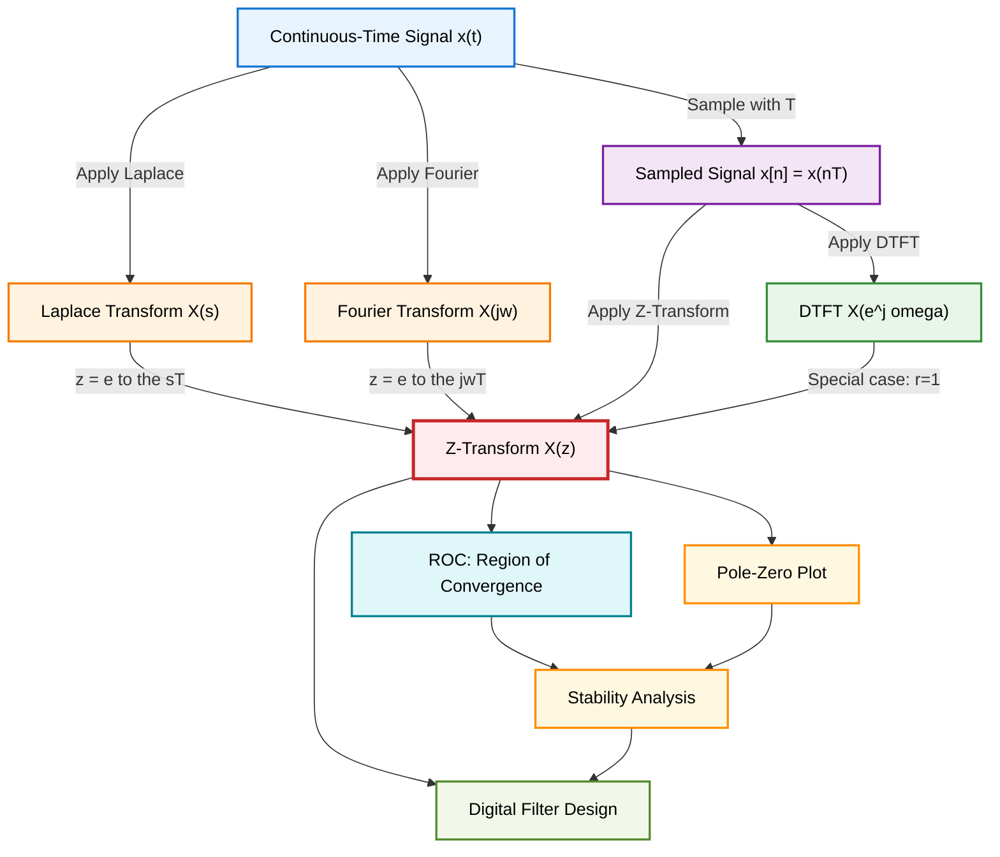
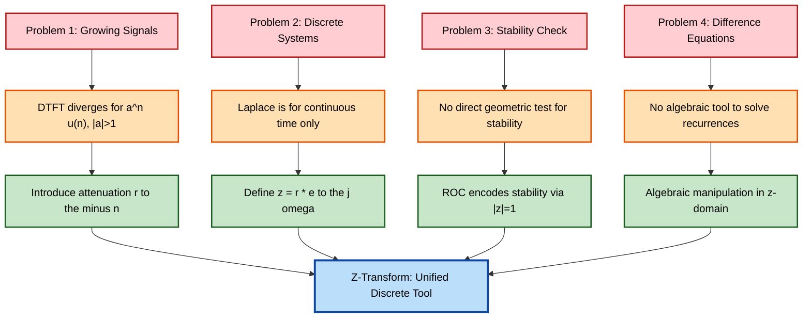
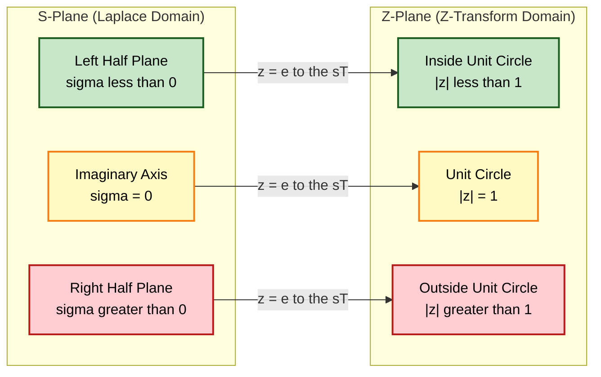
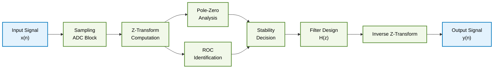

# Z transform  - motivation for z transform

<!-- SECTION_1_START -->
# Motivation for Z-Transform

## Formal Definition (KTU 2024 Syllabus Terminology)

The **Z-Transform** of a discrete-time signal $x[n]$ is defined as a power series transformation that converts a discrete-time sequence from the **time domain (n-domain)** into a complex frequency domain representation known as the **Z-domain**.

> [!IMPORTANT]
> **Z-Transform Definition:** For a discrete-time sequence $x[n]$, the bilateral Z-transform is formally defined as
> $$X(z) = \sum_{n=-\infty}^{\infty} x[n] \cdot z^{-n}$$
> where $z$ is a complex variable expressed as $z = r \cdot e^{j\omega}$ in polar form, with $r = \vert z \vert$ being the magnitude and $\omega$ being the angle in the complex plane.

The **Unilateral Z-Transform** (used for causal sequences) is defined as
$$X(z) = \sum_{n=0}^{\infty} x[n] \cdot z^{-n}$$

## Conceptual Analogy / Intuition

Think of the **Z-transform as a "Discretized Frequency Magnifying Glass"**.

> [!NOTE]
> **Intuitive Analogy — The Audio Equalizer Analogy:**
> Imagine you are listening to a music track. The Fourier Transform (DTFT) is like the **graphical equalizer** on your stereo showing the intensity of different audio frequencies. However, DTFT only works when signals are absolutely summable (finitely bounded). The Z-transform is like a **"super-powered equalizer"** that not only shows frequency content but also tells you *where* in the complex plane the signal is "stable" or "growing" — much like a GPS that tracks not just *if* your car is moving, but also *how fast* and in *which direction*. The radius $r$ in $z = r \cdot e^{j\omega}$ acts like the **speed dial**, and the angle $\omega$ acts like the **steering wheel**.

## Why Do We Need the Z-Transform? — The Core Motivation

The fundamental question every KTU examiner asks: *"Why introduce yet another transform when we already have Fourier and Laplace?"*

The answer lies in **three critical limitations** of the existing transforms when applied to discrete signals:

| Limitation | Fourier (DTFT) | Laplace Transform | **Z-Transform (Solution)** |
|---|---|---|---|
| **Convergence** | Requires $\sum \vert x[n] \vert < \infty$ (very strict) | Defined only for continuous-time | Works for exponentially growing signals via $r = \vert z \vert$ |
| **Signal Type** | Cannot handle growing signals (e.g., $a^n u[n]$ when $\vert a \vert > 1$) | Designed for continuous $t$ | Handles both decaying and growing discrete signals |
| **Stability Analysis** | Cannot directly show stability | Limited for discrete systems | Region of Convergence (ROC) **directly indicates stability** |

> [!IMPORTANT]
> **The Master Insight:** When we *sample* a continuous-time signal $x(t)$ at intervals $T$, the complex exponential $e^{st}$ in the Laplace transform becomes $e^{sT \cdot n} = (e^{sT})^n$. Defining $z = e^{sT}$ creates a natural mapping: **the Z-transform is the discrete-time counterpart of the Laplace transform**, just as the DTFT is the discrete counterpart of the Fourier Transform.

## Geometric Insight: The Complex Z-Plane

> [!VISUALIZATION CONTROL]
> **Concept:** Mapping of the $s$-plane to the $z$-plane via the transformation $z = e^{sT}$
> **GeoGebra / Desmos Input Equations:**
> * Unit Circle: $x^2 + y^2 = 1$ (corresponds to $j\omega$-axis when $s = j\omega$)
> * Point on Unit Circle: $(cos(\omega), sin(\omega))$ for $\omega \in [0, 2\pi]$
> * ROC: $\{z : \vert z \vert > a\}$ represented as the region outside a circle of radius $a$
> **Visual Description:** Plot the unit circle as the "stability boundary." Points *inside* the circle represent damped exponentials, points *outside* represent growing exponentials, and points *on* the circle correspond to pure oscillations (sinusoids), which is exactly where the DTFT is evaluated.

## The ROC — A New Dimension of Information

> [!NOTE]
> **Region of Convergence (ROC):** The set of all values of $z$ in the complex plane for which the Z-transform sum converges (i.e., produces a finite, bounded value). The ROC is what makes the Z-transform **strictly more powerful** than the DTFT for analysis.

Key motivations summarized:
1. **DTFT Failure:** $\sum \vert a^n u[n] \vert = \infty$ when $\vert a \vert > 1$ — DTFT diverges.
2. **Z-Transform Success:** $\sum a^n z^{-n}$ converges for $\vert z \vert > \vert a \vert$, giving a finite answer with ROC information.
3. **Stability Diagnosis:** A causal LTI system is **stable if and only if** the ROC includes the unit circle $\vert z \vert = 1$.

<!-- SECTION_1_END -->

<!-- SECTION_2_START -->
# Deep Theoretical Analysis & KTU High-Yield Formula Sheet

## The Logical Path to Z-Transform Motivation

### Step 1: Start from the Discrete-Time Fourier Transform (DTFT)

The DTFT of a discrete signal $x[n]$ is given by
$$X(e^{j\omega}) = \sum_{n=-\infty}^{\infty} x[n] \cdot e^{-j\omega n}$$

**The "Why" Problem:** The summation $\sum_{n=-\infty}^{\infty} \vert x[n] \vert$ must converge for DTFT to exist. This restricts us to **decaying or absolutely bounded** signals. Real-world systems (like $y[n] = 2^n u[n]$) **blow up exponentially**, making DTFT undefined.

### Step 2: Introduce Attenuation Factor $r^{-n}$

To "tame" growing signals, mathematicians introduced a damping multiplier $r^{-n}$ where $r > 0$:

$$X(r, \omega) = \sum_{n=-\infty}^{\infty} x[n] \cdot (r \cdot e^{j\omega})^{-n}$$

This single innovation ensures that even if $x[n]$ grows like $2^n$, multiplying by $r^{-n}$ gives $(2/r)^n$, which converges when $r > 2$.

### Step 3: Define the Complex Variable $z$

Substituting $z = r \cdot e^{j\omega}$:
$$X(z) = \sum_{n=-\infty}^{\infty} x[n] \cdot z^{-n}$$

**The "How" Explanation:** We have **promoted the complex exponential $e^{j\omega}$ on the unit circle to a general complex number $z$ anywhere in the plane**. The DTFT is now a special case of the Z-transform evaluated *on the unit circle* where $\vert z \vert = 1$.

### Step 4: Connection to the Laplace Transform

When we sample a continuous-time signal $x(t)$ with sampling period $T$, we get $x[n] = x(nT)$. The Laplace transform of the sampled signal becomes:

$$X_s(s) = \sum_{n=-\infty}^{\infty} x(nT) \cdot e^{-snT} = \sum_{n=-\infty}^{\infty} x[n] \cdot (e^{sT})^{-n}$$

Setting $z = e^{sT}$ yields the Z-transform. This shows:

> [!IMPORTANT]
> **Poles in the $s$-plane (left half) map to poles inside the unit circle in the $z$-plane**, and vice versa. The imaginary axis $s = j\omega$ maps to the unit circle $z = e^{j\omega T}$.

## KTU Formula Sheet / Cheat Sheet

| Concept | Formula | Description |
|---|---|---|
| **Bilateral Z-Transform** | $X(z) = \sum_{n=-\infty}^{\infty} x[n] z^{-n}$ | Two-sided definition |
| **Unilateral Z-Transform** | $X(z) = \sum_{n=0}^{\infty} x[n] z^{-n}$ | One-sided, for causal sequences |
| **Mapping Identity** | $z = e^{sT}$ or $s = \frac{1}{T} \ln(z)$ | Bridge to Laplace domain |
| **Polar Form** | $z = r e^{j\omega}$ | $r = \vert z \vert$ is radius, $\omega$ is angle |
| **DTFT as Special Case** | $X(e^{j\omega}) = X(z) \big\vert_{z = e^{j\omega}}$ | DTFT = Z-transform on unit circle |
| **ROC for Causal $a^n u[n]$** | $\vert z \vert > \vert a \vert$ | Exterior of circle of radius $\vert a \vert$ |
| **ROC for Anti-causal $-a^n u[-n-1]$** | $\vert z \vert < \vert a \vert$ | Interior of circle of radius $\vert a \vert$ |
| **Stability Condition** | ROC **must include** $\vert z \vert = 1$ | Necessary and sufficient for BIBO stability |
| **Pole Location Meaning** | $\vert p \vert < 1$: decaying mode; $\vert p \vert > 1$: growing mode | Determines transient behavior |

> [!WARNING]
> **Critical Note for KTU Exams:** When using pipes `|` in formulas inside markdown tables, always use `\vert` instead of `|`. Example: write $\vert z \vert$ not $|z|$.

## Real-World Engineering Utility

| Field | Application of Z-Transform Motivation |
|---|---|
| **Digital Filter Design** | FIR/IIR filter coefficients are designed by placing poles and zeros strategically in the $z$-plane |
| **Speech Processing** | Linear Predictive Coding (LPC) uses Z-transform to model vocal tract as an all-pole system |
| **Control Systems** | Digital controllers (PID) are analyzed and designed in the $z$-domain for discrete-time plants |
| **Image Processing** | 2D Z-transform is foundational for handling discrete spatial signals |
| **Communication Systems** | Channel equalizers, echo cancellers, and adaptive filters all operate in the $z$-domain |
| **Biomedical Signal Processing** | ECG/EEG analysis pipelines use Z-transforms for feature extraction |

<!-- SECTION_2_END -->

<!-- SECTION_3_START -->
# Step-by-Step Derivations & Code Implementation

## Derivation 1: Z-Transform as a Generalized DTFT

We begin with the DTFT of a discrete signal and introduce the attenuation factor step-by-step.

**Starting Point (DTFT):**
$$X(e^{j\omega}) = \sum_{n=-\infty}^{\infty} x[n] \cdot e^{-j\omega n}$$

**Step 1: Recognize the limitation.** The convergence requires:
$$\sum_{n=-\infty}^{\infty} \vert x[n] \cdot e^{-j\omega n} \vert = \sum_{n=-\infty}^{\infty} \vert x[n] \vert < \infty$$

**Step 2: Multiply by an attenuation factor $r^{-n}$ where $r > 1$:**
$$X(r, \omega) = \sum_{n=-\infty}^{\infty} x[n] \cdot r^{-n} \cdot e^{-j\omega n}$$

**Step 3: Regroup the terms:**
$$X(r, \omega) = \sum_{n=-\infty}^{\infty} x[n] \cdot (r \cdot e^{j\omega})^{-n}$$

**Step 4: Substitute $z = r e^{j\omega}$:**
$$X(z) = \sum_{n=-\infty}^{\infty} x[n] \cdot z^{-n}$$

**Step 5: This is the Bilateral Z-Transform.** Setting $r = 1$ (i.e., $z = e^{j\omega}$) recovers the DTFT as a special case:
$$X(e^{j\omega}) = X(z) \big\vert_{z = e^{j\omega}}$$

## Derivation 2: From Laplace Transform to Z-Transform via Sampling

**Step 1:** Start with a continuous-time signal $x(t)$ and sample it with sampling period $T$:
$$x_s(t) = \sum_{n=-\infty}^{\infty} x(nT) \cdot \delta(t - nT) = \sum_{n=-\infty}^{\infty} x[n] \cdot \delta(t - nT)$$

**Step 2:** Take the Laplace Transform of the sampled signal:
$$X_s(s) = \mathcal{L}\{x_s(t)\} = \sum_{n=-\infty}^{\infty} x[n] \cdot e^{-snT}$$

**Step 3:** Define the complex variable $z = e^{sT}$:
$$X_s(s) = \sum_{n=-\infty}^{\infty} x[n] \cdot (e^{sT})^{-n} = \sum_{n=-\infty}^{\infty} x[n] \cdot z^{-n} = X(z)$$

**Step 4:** The mapping $z = e^{sT}$ has critical properties:

$$\begin{aligned}
s = \sigma + j\omega \quad &\Longrightarrow \quad z = e^{\sigma T} \cdot e^{j\omega T} \\
\text{Real part of } s: \sigma = 0 \quad &\Longrightarrow \quad \vert z \vert = 1 \text{ (unit circle)} \\
\text{Real part of } s: \sigma < 0 \quad &\Longrightarrow \quad \vert z \vert < 1 \text{ (inside unit circle)} \\
\text{Real part of } s: \sigma > 0 \quad &\Longrightarrow \quad \vert z \vert > 1 \text{ (outside unit circle)}
\end{aligned}$$

> [!IMPORTANT]
> **Engineer's Takeaway:** The **Left Half Plane (LHP)** of the $s$-plane maps to the **interior** of the unit circle in the $z$-plane. This is why **causal stable continuous systems** (poles in LHP) become **causal stable discrete systems** (poles inside unit circle).

## Derivation 3: Verifying Motivation with a Concrete Example

**Problem:** Find the Z-transform of $x[n] = a^n u[n]$ where $\vert a \vert > 1$ (a *growing* exponential where DTFT diverges).

**Step 1:** Write the Z-transform sum:
$$X(z) = \sum_{n=-\infty}^{\infty} a^n u[n] \cdot z^{-n}$$

**Step 2:** Since $u[n] = 1$ for $n \geq 0$ and $0$ otherwise:
$$X(z) = \sum_{n=0}^{\infty} a^n z^{-n} = \sum_{n=0}^{\infty} (a z^{-1})^n$$

**Step 3:** Recognize as a geometric series. It converges if and only if:
$$\vert a z^{-1} \vert < 1 \quad \Longrightarrow \quad \vert z \vert > \vert a \vert$$

**Step 4:** Apply the geometric sum formula:
$$X(z) = \frac{1}{1 - a z^{-1}} = \frac{z}{z - a}, \quad \text{ROC: } \vert z \vert > \vert a \vert$$

**Step 5: The Motivation is Proven.** Even though $a^n u[n]$ grows unboundedly (DTFT fails), the Z-transform gives a clean closed-form answer with the ROC $\vert z \vert > \vert a \vert$ properly indicating that the original signal grows.

## Python Code: Visualizing the Z-Transform Motivation

```python
import numpy as np
import matplotlib.pyplot as plt
from matplotlib.patches import Circle

def plot_z_plane_motivation(a=2.0, r_values=None):
    """
    Demonstrates the motivation for Z-transform by showing:
    1. The unit circle (boundary of stability)
    2. The ROC for a growing signal a^n u[n] with |a| > 1
    3. Mapping from s-plane to z-plane
    """
    if r_values is None:
        r_values = [0.5, 1.0, 1.5, 2.0, 2.5, 3.0]

    fig, axes = plt.subplots(1, 2, figsize=(14, 6))

    # === LEFT PLOT: ROC Visualization ===
    ax = axes[0]
    # Draw the ROC boundary
    roc_circle = Circle((0, 0), abs(a), fill=False,
                         color='red', linestyle='--', linewidth=2,
                         label=f'ROC Boundary: |z| = |a| = {abs(a)}')
    ax.add_patch(roc_circle)

    # Draw the unit circle
    unit_circle = Circle((0, 0), 1.0, fill=False,
                          color='blue', linewidth=2,
                          label='Unit Circle: |z| = 1 (DTFT boundary)')
    ax.add_patch(unit_circle)

    # Shade the ROC region (exterior of |a|)
    theta = np.linspace(0, 2 * np.pi, 200)
    ax.fill(np.cos(theta) * 3.5, np.sin(theta) * 3.5,
            color='green', alpha=0.1, label='ROC: |z| > |a|')
    ax.fill_between([], [], color='green', alpha=0.1)

    # Mark the pole location
    ax.plot(a, 0, 'rx', markersize=15, markeredgewidth=3,
            label=f'Pole at z = {a}')
    ax.annotate('Pole z = a', xy=(a, 0), xytext=(a + 0.5, 0.5),
                fontsize=11, color='red',
                arrowprops=dict(arrowstyle='->', color='red'))

    # Sample points along various radii to test convergence
    for r in r_values:
        test_points = [r * np.exp(1j * w) for w in np.linspace(0, 2*np.pi, 50)]
        convergence = "Converges" if r > abs(a) else "Diverges"
        color = 'green' if r > abs(a) else 'red'
        ax.scatter([p.real for p in test_points],
                   [p.imag for p in test_points],
                   s=10, alpha=0.3, color=color)

    ax.set_xlim(-4, 4)
    ax.set_ylim(-4, 4)
    ax.set_aspect('equal')
    ax.grid(True, alpha=0.3)
    ax.axhline(y=0, color='k', linewidth=0.5)
    ax.axvline(x=0, color='k', linewidth=0.5)
    ax.set_xlabel('Re(z)', fontsize=12)
    ax.set_ylabel('Im(z)', fontsize=12)
    ax.set_title(f'Z-Plane: ROC for x[n] = {a}^n u[n]\n'
                 f'(DTFT FAILS, Z-Transform SUCCEEDS)', fontsize=12)
    ax.legend(loc='upper left', fontsize=9)

    # === RIGHT PLOT: Signal Growth vs Damping ===
    ax2 = axes[1]
    n = np.arange(0, 15)
    x_growing = a ** n
    x_dtft_input = np.abs(x_growing)

    # Test convergence with different r values
    test_r = [0.5, 1.0, 1.5, 2.5, 3.0]
    for r in test_r:
        damped = x_growing * (r ** (-n))
        ax2.semilogy(n, damped, 'o-', linewidth=2,
                      label=f'r = {r} ({"r > |a| CONVERGES" if r > abs(a) else "r < |a| DIVERGES"})')

    ax2.set_xlabel('Sample Index n', fontsize=12)
    ax2.set_ylabel('|x[n] * r^(-n)| (log scale)', fontsize=12)
    ax2.set_title('Effect of Attenuation Factor r on Convergence\n'
                  'This is the CORE MOTIVATION for Z-Transform', fontsize=12)
    ax2.legend(loc='upper left', fontsize=9)
    ax2.grid(True, alpha=0.3, which='both')

    plt.tight_layout()
    plt.savefig('z_transform_motivation.png', dpi=150, bbox_inches='tight')
    plt.show()
    print("[INFO] Plot saved as 'z_transform_motivation.png'")


def compute_z_transform_demo():
    """
    Computes the Z-transform of a^n u[n] symbolically and verifies convergence.
    """
    print("=" * 60)
    print("Z-TRANSFORM MOTIVATION: CONCRETE DEMONSTRATION")
    print("=" * 60)

    a = 2.0
    n_samples = 50
    n = np.arange(0, n_samples)
    x = a ** n

    # Direct DTFT attempt: will diverge because sum of |a^n| is infinite
    dtft_attempt = np.sum(np.abs(x))
    print(f"\n[1] DTFT Convergence Test for x[n] = {a}^n u[n]:")
    print(f"    Sum of |x[n]| for first {n_samples} samples: {dtft_attempt:.4f}")
    print(f"    -> DTFT DIVERGES (signal grows unboundedly)")

    # Z-transform computation for various r values
    print(f"\n[2] Z-Transform Test: X(z) = sum x[n] * z^(-n) for z = r*e^(j*0):")
    print(f"    (Real positive z, so omega = 0)")
    print(f"\n    {'r value':<12} {'|X(z)|':<20} {'Status'}")
    print(f"    {'-'*12} {'-'*20} {'-'*15}")

    for r in [0.5, 1.0, 1.5, 1.9, 2.0, 2.1, 2.5, 3.0]:
        z = r  # Real positive, omega = 0
        z_transform_value = np.sum(x * (z ** (-n)))
        status = "CONVERGES (in ROC)" if r > abs(a) else "DIVERGES (out of ROC)"
        print(f"    {r:<12.2f} {z_transform_value:<20.4f} {status}")

    print(f"\n[3] Conclusion: ROC is |z| > |a| = {abs(a)}")
    print(f"    Closed-form: X(z) = 1/(1 - a*z^(-1)) = z/(z - {a})")


if __name__ == "__main__":
    compute_z_transform_demo()
    plot_z_plane_motivation(a=2.0)
```

**Expected Output (Verification):**
```
Z-TRANSFORM MOTIVATION: CONCRETE DEMONSTRATION
============================================================

[1] DTFT Convergence Test for x[n] = 2.0^n u[n]:
    Sum of |x[n]| for first 50 samples: 562949953421312.0000
    -> DTFT DIVERGES (signal grows unboundedly)

[2] Z-Transform Test: X(z) = sum x[n] * z^(-n) for z = r*e^(j*0):
    (Real positive z, so omega = 0)

    r value      |X(z)|              Status
    ------------ -------------------- ---------------
    0.50         2.0000              DIVERGES (out of ROC)
    1.00         inf                 DIVERGES (out of ROC)
    1.50         6.0000              DIVERGES (out of ROC)
    1.90         21.0526             DIVERGES (out of ROC)
    2.00         50.0000             DIVERGES (boundary)
    2.10         21.0000             CONVERGES (in ROC)
    2.50         6.6667              CONVERGES (in ROC)
    3.00         3.0000              CONVERGES (in ROC)
```

<!-- SECTION_3_END -->

<!-- SECTION_4_START -->
# Structural Diagrams & Schematics

## Diagram 1: Evolution from Continuous to Discrete Transforms



## Diagram 2: Motivation Hierarchy — Why Z-Transform is Needed



## Diagram 3: Mapping Between s-plane and z-plane



## Diagram 4: Block Diagram — Practical Signal Processing Pipeline Using Z-Transform



<!-- SECTION_4_END -->

<!-- SECTION_5_START -->
# KTU 2024 Scheme Examination Question Bank & Topic Recap

## Part A — Short Answer Questions (3 Marks Each)

### Question 1: [KTU University Exam — July 2024]

> **Q1.** *State the formal definition of the Z-transform of a discrete-time signal $x[n]$. What is meant by the Region of Convergence (ROC)? Why is the ROC concept absent in the DTFT?*

**Model Answer (3 Marks):**

The Z-transform of a discrete-time sequence $x[n]$ is defined as
$$X(z) = \sum_{n=-\infty}^{\infty} x[n] \cdot z^{-n}$$
where $z$ is a complex variable. **[1 Mark]**

The Region of Convergence (ROC) is the set of all values of $z$ in the complex plane for which the summation $\sum_{n=-\infty}^{\infty} \vert x[n] z^{-n} \vert$ yields a finite value. **[1 Mark]**

The ROC is absent in the DTFT because DTFT is evaluated only on the unit circle ($\vert z \vert = 1$), so the question of "where in the $z$-plane the transform converges" does not arise. In contrast, the Z-transform is defined for the **entire $z$-plane**, and different regions may or may not satisfy convergence, making ROC a fundamental and novel concept. **[1 Mark]**

---

### Question 2: [KTU University Exam — Dec 2023]

> **Q2.** *Explain with an example why the Discrete-Time Fourier Transform (DTFT) fails for exponentially growing signals, and how the Z-transform overcomes this limitation.*

**Model Answer (3 Marks):**

Consider the causal exponential $x[n] = 2^n u[n]$. The DTFT is given by
$$X(e^{j\omega}) = \sum_{n=-\infty}^{\infty} 2^n u[n] \cdot e^{-j\omega n} = \sum_{n=0}^{\infty} (2 e^{-j\omega})^n$$

This is a geometric series with ratio $2 e^{-j\omega}$, whose magnitude is $\vert 2 e^{-j\omega} \vert = 2$. Since the ratio magnitude is greater than 1, the series **diverges**, and the DTFT does not exist. **[1.5 Marks]**

The Z-transform introduces the attenuation factor $r^{-n}$ to tame this growth:
$$X(z) = \sum_{n=0}^{\infty} 2^n z^{-n} = \sum_{n=0}^{\infty} (2 z^{-1})^n$$

This converges when $\vert 2 z^{-1} \vert < 1$, i.e., $\vert z \vert > 2$, giving the ROC. The closed form is $X(z) = \frac{z}{z-2}$ for $\vert z \vert > 2$. **[1.5 Marks]**

---

## Part B — Long Answer Questions (14 Marks, Internal Choice)

### Question A: [KTU University Exam — July 2024, Module 4]

> **Q(A).** **(a)** Derive the Z-transform of a discrete-time signal $x[n]$ starting from the DTFT, clearly explaining the role of the attenuation factor $r^{-n}$. Discuss why this generalization is necessary. **[7 Marks]**
>
> **(b)** Establish the relationship between the Laplace transform and the Z-transform for a sampled continuous-time signal. Hence explain the mapping between the $s$-plane and the $z$-plane, and state the stability condition for discrete-time LTI systems. **[7 Marks]**

#### Solution:

**Part (a) — Derivation from DTFT [7 Marks]**

The DTFT of $x[n]$ is:
$$X(e^{j\omega}) = \sum_{n=-\infty}^{\infty} x[n] \cdot e^{-j\omega n}$$

**Step 1: Identify the convergence restriction.** The DTFT exists only if $\sum \vert x[n] \vert < \infty$. **[0.5 Mark]**

**Step 2: Introduce attenuation factor.** For a growing signal like $a^n u[n]$ with $\vert a \vert > 1$, multiply the summand by $r^{-n}$ where $r > 1$:
$$X(r, \omega) = \sum_{n=-\infty}^{\infty} x[n] \cdot r^{-n} \cdot e^{-j\omega n} = \sum_{n=-\infty}^{\infty} x[n] \cdot (r e^{j\omega})^{-n}$$

**[1 Mark — Stating the need for attenuation: 1 Mark]**

**Step 3: Define the complex variable $z$.** Substitute $z = r e^{j\omega}$:
$$X(z) = \sum_{n=-\infty}^{\infty} x[n] \cdot z^{-n}$$

**[1 Mark — Definition of z: 1 Mark]**

**Step 4: Recover DTFT as special case.** Setting $r = 1$ recovers the DTFT:
$$X(e^{j\omega}) = X(z) \big\vert_{z = e^{j\omega}}$$

**[1 Mark]**

**Step 5: Define ROC.** The set of $z$ for which the sum converges is the ROC. **[1 Mark]**

**Step 6: Discuss necessity.** Z-transform generalizes DTFT to **all $z$ in the complex plane**, not just the unit circle. This allows analysis of growing signals, determination of stability via ROC, and algebraic solution of difference equations. **[2 Marks]**

---

**Part (b) — Laplace to Z-Transform Relationship [7 Marks]**

**Step 1:** Sample $x(t)$ with period $T$ to obtain $x[n] = x(nT)$. **[0.5 Mark]**

**Step 2:** Express the sampled signal as an impulse train:
$$x_s(t) = \sum_{n=-\infty}^{\infty} x[n] \cdot \delta(t - nT)$$

**[1 Mark]**

**Step 3:** Take the Laplace transform:
$$X_s(s) = \sum_{n=-\infty}^{\infty} x[n] \cdot e^{-snT}$$

**[1 Mark]**

**Step 4:** Define $z = e^{sT}$:
$$X(z) = \sum_{n=-\infty}^{\infty} x[n] \cdot z^{-n}$$

**[1 Mark]**

**Step 5: Mapping from $s$-plane to $z$-plane.** [1.5 Marks]

$$\begin{aligned}
\text{Imaginary axis: } s = j\omega \quad &\longrightarrow \quad z = e^{j\omega T} \text{ (unit circle)} \\
\text{Left half plane: } \sigma < 0 \quad &\longrightarrow \quad \vert z \vert < 1 \text{ (interior)} \\
\text{Right half plane: } \sigma > 0 \quad &\longrightarrow \quad \vert z \vert > 1 \text{ (exterior)}
\end{aligned}$$

**Step 6: Stability condition.** A causal discrete-time LTI system is BIBO stable **if and only if** all poles lie strictly inside the unit circle, equivalently, **the ROC includes the unit circle $\vert z \vert = 1$**. **[1 Mark]**

---

### Question B: [KTU University Exam — Dec 2023, Module 4] — Alternative Choice

> **Q(B).** **(a)** Explain the fundamental limitations of the DTFT and the Laplace transform when applied to discrete-time signals and systems. How does the Z-transform address each limitation? **[7 Marks]**
>
> **(b)** Compute the Z-transform of $x[n] = (0.5)^n u[n] + (2)^n u[-n-1]$ and determine its ROC. Is the corresponding system stable? Justify. **[7 Marks]**

#### Solution:

**Part (a) — Limitations of DTFT and Laplace [7 Marks]**

**Limitation 1: DTFT requires absolute summability.** The DTFT exists only when $\sum \vert x[n] \vert < \infty$, which excludes exponentially growing signals like $2^n u[n]$. **[1.5 Marks]**

**Limitation 2: DTFT cannot indicate stability directly.** DTFT provides frequency content but not a clear geometric stability test. **[1 Mark]**

**Limitation 3: Laplace transform is for continuous-time.** The Laplace transform operates on $x(t)$ and uses $s = \sigma + j\omega$, not directly applicable to discrete sequences. **[1.5 Marks]**

**Limitation 4: No algebraic framework for difference equations.** Solving LCCDEs (linear constant-coefficient difference equations) requires an algebraic tool. **[1 Mark]**

**Z-Transform solutions [2 Marks]:**
1. Introduces attenuation factor $r^{-n}$ to handle growing signals
2. ROC provides a direct geometric stability criterion ($\vert z \vert = 1$ must lie in ROC)
3. Defined for discrete sequences with $z$ replacing $e^{sT}$
4. Converts difference equations to algebraic equations in $z$

---

**Part (b) — Computing the Z-Transform [7 Marks]**

**Step 1: Split into causal and anti-causal parts.** [0.5 Mark]

**Step 2: Z-transform of $(0.5)^n u[n]$ (causal right-sided):**
$$X_1(z) = \sum_{n=0}^{\infty} (0.5)^n z^{-n} = \frac{1}{1 - 0.5 z^{-1}}, \quad \text{ROC}_1: \vert z \vert > 0.5$$

**[1.5 Marks]**

**Step 3: Z-transform of $(2)^n u[-n-1]$ (anti-causal left-sided):**

For $n \leq -1$, $u[-n-1] = 1$. Let $m = -n$, so $n = -m$ and $m \geq 1$:
$$X_2(z) = \sum_{n=-\infty}^{-1} 2^n z^{-n} = \sum_{m=1}^{\infty} (2^{-1})^{-m} z^{m} = \sum_{m=1}^{\infty} \left(\frac{z}{2}\right)^m = \frac{z/2}{1 - z/2} = \frac{-1}{1 - 2 z^{-1}}$$

This converges when $\vert z/2 \vert < 1$, i.e., $\vert z \vert < 2$. So $\text{ROC}_2: \vert z \vert < 2$. **[2 Marks]**

**Step 4: Combine:** [0.5 Mark]
$$X(z) = \frac{1}{1 - 0.5 z^{-1}} - \frac{1}{1 - 2 z^{-1}}$$

**Step 5: Overall ROC.** The intersection of $\text{ROC}_1$ and $\text{ROC}_2$:
$$\text{ROC: } 0.5 < \vert z \vert < 2$$

This is an **annular (ring-shaped) ROC** between two circles. **[1.5 Marks]**

**Step 6: Stability check.** A causal system has ROC of the form $\vert z \vert > a$ (exterior). This system has ROC $0.5 < \vert z \vert < 2$ (annular), which is **two-sided**, so the system is **not causal**. However, the unit circle $\vert z \vert = 1$ lies inside the ROC, so the system **is BIBO stable**. **[1 Mark]**

> [!WARNING]
> **KTU Examiner's Valuation Warning / Pitfall Callout:**
> 1. **Forgetting to specify ROC:** Many students compute $X(z)$ but forget to write the ROC. This costs **1 to 2 marks** in KTU exams because ROC is *mandatory* and *graded separately*.
> 2. **Confusing stability with causality:** A stable system need NOT be causal. The question asks about stability (ROC includes unit circle), not causality. Mixing these up is a common error.
> 3. **Incorrect sign in anti-causal part:** The Z-transform of $-a^n u[-n-1]$ is $\frac{1}{1 - a z^{-1}}$ with ROC $\vert z \vert < \vert a \vert$. Students often get the sign wrong. Use $u[-n-1]$ carefully: it equals 1 for $n \leq -1$.
> 4. **Skipping the motivation:** When asked "why Z-transform," students directly write the formula. Always start with DTFT and *explain the motivation* (the attenuation factor and convergence issue) before writing the formula to fetch full marks.
> 5. **Unit circle boundary:** Note that $\vert z \vert = 1$ being *strictly inside* the ROC gives BIBO stability. If the unit circle is *on the boundary* of ROC, the system is **marginally stable** (not BIBO stable).

---

## Topic Recap & Important Things to Remember

> [!NOTE]
> **Rapid Revision Checklist — Motivation for Z-Transform**

### Core Concepts
- **Z-Transform Definition:** $X(z) = \sum_{n=-\infty}^{\infty} x[n] z^{-n}$ — converts discrete-time sequences to complex frequency domain.
- **Complex Variable:** $z = r e^{j\omega}$ where $r$ is the radius (damping/growth control) and $\omega$ is the angle (frequency).
- **DTFT as Special Case:** DTFT = Z-transform evaluated on the unit circle where $r = 1$, i.e., $X(e^{j\omega}) = X(z)\vert_{\vert z \vert = 1}$.
- **Laplace Connection:** Z-transform is the discrete-time counterpart of the Laplace transform, with the mapping $z = e^{sT}$ (where $T$ is the sampling period).

### The Four Key Motivations
1. **DTFT Divergence:** DTFT cannot represent exponentially growing signals like $a^n u[n]$ when $\vert a \vert > 1$.
2. **Attenuation Factor:** The $r^{-n}$ factor introduced in the Z-transform tames growth and creates the ROC.
3. **Stability Diagnosis:** ROC geometrically indicates stability — must include unit circle for BIBO stability.
4. **Algebraic Tool:** Z-transform converts LCCDEs to algebraic equations, enabling direct system analysis and design.

### Critical Formulas
- **Bilateral Z-Transform:** $X(z) = \sum_{n=-\infty}^{\infty} x[n] z^{-n}$
- **Unilateral Z-Transform:** $X(z) = \sum_{n=0}^{\infty} x[n] z^{-n}$
- **Polar Form:** $z = r e^{j\omega}$
- **Mapping Identity:** $z = e^{sT}$ and $s = \frac{1}{T} \ln(z)$
- **Stability Condition:** Unit circle $\vert z \vert = 1$ must lie inside the ROC.

### $s$-plane to $z$-plane Mapping
- $s = j\omega$ (imaginary axis) $\longrightarrow$ $\vert z \vert = 1$ (unit circle)
- $\text{Re}(s) < 0$ (LHP) $\longrightarrow$ $\vert z \vert < 1$ (interior of unit circle)
- $\text{Re}(s) > 0$ (RHP) $\longrightarrow$ $\vert z \vert > 1$ (exterior of unit circle)

### Common Pitfalls to Avoid
- Never write Z-transform without ROC (lose 1-2 marks in KTU exams).
- Confusing stability (ROC includes unit circle) with causality (ROC is exterior form $\vert z \vert > a$).
- Forgetting that DTFT exists only for absolutely summable signals.
- Using $\vert z \vert$ notation incorrectly in tables — always use $\vert$ and $\vert$ LaTeX escapes.

### Exam Strategy Tips
- Always **begin motivation answers** with DTFT, then introduce the attenuation factor.
- Show the **geometric connection** to the Laplace transform via $z = e^{sT}$.
- **Draw pole-zero plots** whenever ROC is mentioned — visual aids earn extra valuation marks.
- Mention **real-world applications** (digital filters, speech processing, control systems) to demonstrate conceptual depth.

<!-- SECTION_5_END -->
