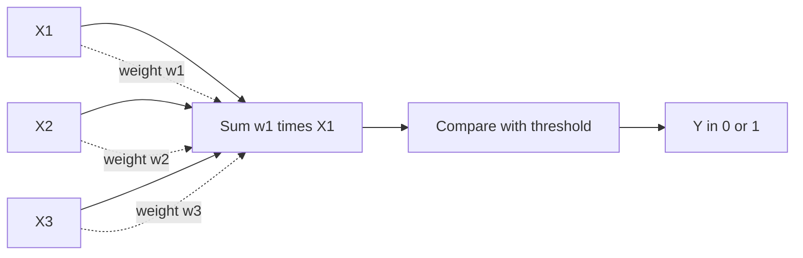
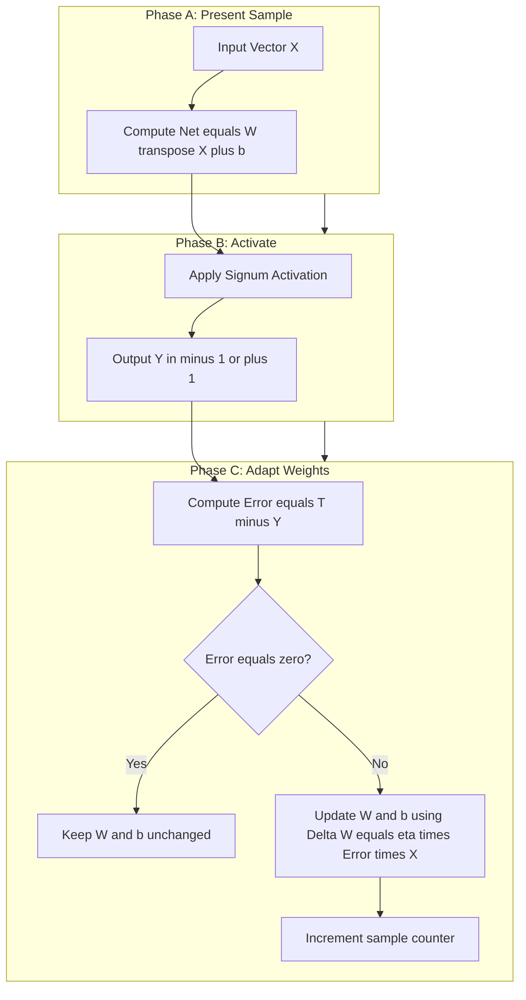
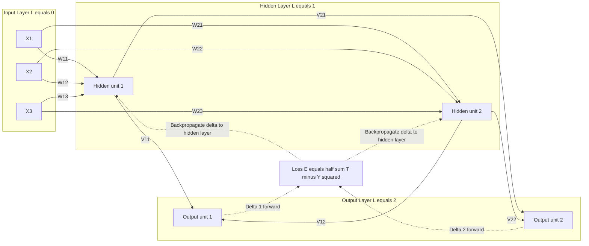
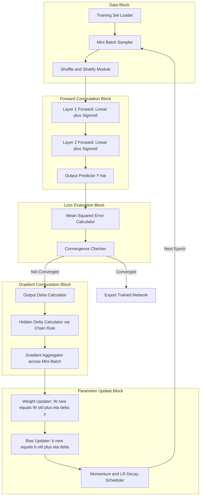

# Artificial Neural Networks: McCulloch-Pitts neuron model, Perceptron learning rules, Backpropagation algorithms

<!-- SECTION_1_START -->
# Artificial Neural Networks: Foundations for KTU Soft Computing

## 1.1 The McCulloch-Pitts Neuron Model

### Formal Definition
The **McCulloch-Pitts (MCP) Neuron** is the earliest mathematical model of an artificial neuron, proposed by Warren McCulloch and Walter Pitts in 1943. It is a binary, threshold-based computational unit that mimics the all-or-nothing firing behavior of a biological neuron. Formally, it is a linear threshold function that maps a vector of binary inputs $\vec{x} \in \{0,1\}^n$ to a binary output $y \in \{0,1\}$ through a hard-limit activation.

> [!NOTE]
> **KTU Syllabus Highlight (Module 1)**
> The MCP neuron is the *biological inspiration* anchor of the module. Examiners frequently ask: "Why is the MCP model called the 'first artificial neuron'?" The expected answer must reference its 1943 origin and its role as a binary classifier with no learning capability.

### Intuition: The Voting Committee
Imagine a college election where **$n$** voters each cast a vote (1 for yes, 0 for no). A motion passes only if the **sum of weighted votes crosses a fixed threshold $\theta$**. The MCP neuron behaves identically:

- Each input $x_i$ is a vote (0 or 1).
- Each weight $w_i$ is the *influence* of that voter.
- The neuron *fires* (outputs 1) only if the weighted sum is at least the threshold $\theta$.

This is the *biological analogy*: a neuron fires an action potential only when the cumulative excitatory input surpasses its firing threshold.

### Mathematical Model
For an $n$-dimensional input vector $\vec{x} = (x_1, x_2, \ldots, x_n)$ with weight vector $\vec{w} = (w_1, w_2, \ldots, w_n)$ and threshold $\theta$:

$$y = f\left(\sum_{i=1}^{n} w_i x_i - \theta\right)$$

where $f(\cdot)$ is the **hard-limit (Heaviside step) activation function**:

$$f(\text{net}) = \begin{cases} 1 & \text{if } \text{net} \geq 0 \\ 0 & \text{if } \text{net} < 0 \end{cases}$$

> [!IMPORTANT]
> **Bias Formulation:** The threshold $\theta$ is conventionally moved to the left side and rebranded as the **bias** $b = -\theta$. This unifies the model as $y = f(\sum w_i x_i + b)$ and is the *standard form* expected in KTU 2024 Scheme board answers.

### Limitations of MCP Neuron
- **No learning algorithm**: Weights and threshold must be hand-tuned by the designer.
- **Binary inputs only**: Cannot accept real-valued signals.
- **Binary output only**: Only two-state decisions.

> [!VISUALIZATION CONTROL]
> **Concept:** MCP Neuron Decision Boundary (Two-Input AND Gate)
> **GeoGebra / Desmos Input Equations:**
> * `w1: 1`, `w2: 1`, `theta: 1.5`
> * Decision line: `x + y = 1.5`  →  `y = -x + 1.5`
> **Visual Description:** On the $xy$-plane, plot points $(0,0), (0,1), (1,0), (1,1)$. The line $y = -x + 1.5$ separates the origin region (output 0) from the upper-right point $(1,1)$ (output 1). The student should observe a *linear* separability boundary.

---

## 1.2 The Perceptron Model & Learning Rule

### Formal Definition
The **Perceptron**, introduced by Frank Rosenblatt in 1958, is a single-layer feedforward neural network that extends the MCP neuron by adding a *supervised learning rule* capable of automatically adjusting the weights and bias to correctly classify linearly separable patterns. It uses the same hard-limit activation as MCP, but the weights are *learned*, not prescribed.

> [!NOTE]
> **KTU Board Terminology (Verbatim Expectation):**
> "A Perceptron is a linear threshold gate whose weights and bias are iteratively updated using the Perceptron Learning Algorithm (PLA) to minimize classification error on linearly separable data."

### Intuition: The Self-Learning Voting Committee
The voting committee analogy evolves: now, after each vote, the *secretary* adjusts how much each voter's opinion counts. If the committee made a wrong decision, the secretary **boosts the weight of dissenting voters** and **reduces the weight of agreeing ones**. Over many elections, the committee learns to make the correct call.

### Mathematical Model
For input $\vec{x} \in \mathbb{R}^n$:

$$\text{net} = \sum_{i=1}^{n} w_i x_i + b$$

$$y = \text{sgn}(\text{net}) = \begin{cases} +1 & \text{if } \text{net} \geq 0 \\ -1 & \text{if } \text{net} < 0 \end{cases}$$

where $\text{sgn}(\cdot)$ is the signum activation function. The labels are typically $\{-1, +1\}$ (instead of $\{0,1\}$) to make the weight update symmetric.

---

## 1.3 Backpropagation Algorithm

### Formal Definition
**Backpropagation (BP)** is a *gradient-based supervised learning algorithm* for training multi-layer feedforward neural networks (also called **Multi-Layer Perceptrons, MLPs**). It generalizes the delta rule to networks with one or more hidden layers by using the **chain rule of calculus** to propagate the output error *backwards* through the network, computing the gradient of the loss with respect to every weight and bias.

> [!IMPORTANT]
> **KTU 2024 Highlight:** The single most-asked concept in Module 1 is the backpropagation weight update equation. Students must memorize: $w_{ji}^{\text{new}} = w_{ji}^{\text{old}} - \eta \frac{\partial E}{\partial w_{ji}}$ and be able to derive the **delta term** for both output and hidden layers.

### Intuition: The Blame Attribution Game
Imagine a company that loses a client. The CEO asks: *Whose fault was it?* The blame is traced *backwards*: the sales intern gets some blame, but the marketing manager (hidden layer) gets more because they shaped the campaign. Backpropagation does the same with math: the final loss is decomposed, layer by layer, into contributions from each weight.

> [!VISUALIZATION CONTROL]
> **Concept:** Sigmoid Activation and Its Derivative
> **GeoGebra / Desmos Input Equations:**
> * `f(x) = 1 / (1 + e^(-x))`  (sigmoid)
> * `g(x) = f(x) * (1 - f(x))`  (its derivative)
> **Visual Description:** The sigmoid $f(x)$ is an S-shaped curve that saturates near 0 (left) and 1 (right). Its derivative $g(x)$ is bell-shaped, peaking at $x = 0$ with value $0.25$, and approaching 0 on both sides. This visualization explains why the *vanishing gradient problem* occurs for large $\vert x \vert$.

---
<!-- SECTION_1_END -->

<!-- SECTION_2_START -->
# Deep Theoretical Analysis & KTU High-Yield Formula Sheet

## 2.1 McCulloch-Pitts Neuron — Operational Logic

The MCP neuron is **declarative, not adaptive**. Its design procedure is as follows:

1. **Encode inputs** as binary signals $x_i \in \{0, 1\}$ representing excitatory ($x_i = 1$) or absent ($x_i = 0$) stimulation.
2. **Assign excitatory weights** $w_i \in \mathbb{Z}^+$ to encode synaptic strength. *Inhibitory inputs* are modeled by setting $w_i = -1$ (or any large negative integer) and routed through a fixed *inhibitory gate* (the convention is: if any inhibitory input is 1, the output is forced to 0).
3. **Choose threshold** $\theta \in \mathbb{Z}^+$ equal to the minimum sum of active excitatory weights required to fire.
4. **Evaluate** $y = f(\sum_i w_i x_i - \theta)$.

### Worked Boolean Function Design (AND Gate)
For a 2-input AND gate, truth table is:

| $x_1$ | $x_2$ | $y$ |
|:---:|:---:|:---:|
| 0 | 0 | 0 |
| 0 | 1 | 0 |
| 1 | 0 | 0 |
| 1 | 1 | 1 |

Choose $w_1 = w_2 = 1$ and $\theta = 2$. Then:
- $\text{net} = x_1 + x_2 - 2$
- $\text{net} \geq 0$ only when $x_1 = x_2 = 1$. ✓

### Worked Boolean Function Design (OR Gate)
Same inputs, but with $\theta = 1$:
- $\text{net} = x_1 + x_2 - 1$
- $\text{net} \geq 0$ whenever at least one input is 1. ✓

### Inhibitory Logic (NOT Gate with one input)
For $\text{NOT}(x_1)$: $w_1 = -1$, $\theta = 0$, with the inhibitory convention.
- If $x_1 = 1$: $\text{net} = -1 - 0 = -1 \Rightarrow y = 0$. ✓
- If $x_1 = 0$: $\text{net} = 0 - 0 = 0 \Rightarrow y = 1$. ✓

> [!NOTE]
> **Why MCP matters for KTU 2024:** The *inhibitory input* convention is a high-yield board question. Most students lose marks by forgetting that **inhibitory inputs are absolute vetoes** — they force the output to 0 regardless of excitation.

---

## 2.2 Perceptron Learning Rule — Operational Logic

The **Perceptron Convergence Procedure (PLA)** is an *error-correction* learning algorithm that adjusts weights whenever a training sample is misclassified.

### Update Equations
For training sample $(\vec{x}^{(p)}, t^{(p)})$ where $t^{(p)} \in \{-1, +1\}$ is the target:

$$\Delta w_i = \eta (t^{(p)} - y^{(p)}) x_i^{(p)}$$

$$\Delta b = \eta (t^{(p)} - y^{(p)})$$

$$w_i^{\text{new}} = w_i^{\text{old}} + \Delta w_i$$

$$b^{\text{new}} = b^{\text{old}} + \Delta b$$

where $\eta \in (0, 1]$ is the **learning rate** (a small positive constant).

### The Four Update Cases
| Target $t$ | Output $y$ | Error $t - y$ | Action |
|:---:|:---:|:---:|:---|
| $+1$ | $+1$ | 0 | No update (correct) |
| $-1$ | $-1$ | 0 | No update (correct) |
| $+1$ | $-1$ | $+2$ | **Increase weights** of active inputs |
| $-1$ | $+1$ | $-2$ | **Decrease weights** of active inputs |

### Perceptron Convergence Theorem (Rosenblatt, 1958)
If the training data is **linearly separable**, the PLA converges to a separating hyperplane in a finite number of steps. If the data is *not* linearly separable (e.g., the XOR problem), the algorithm **oscillates forever**.

> [!WARNING]
> **KTU Examiner's Note:** The XOR problem is the *canonical counterexample* that brought down the first AI winter. KTU 2024 examiners love asking: "Why cannot a single-layer perceptron solve XOR?" The answer must include: (1) the four XOR input points are **not linearly separable** in 2D, and (2) the PLA will never converge for XOR.

---

## 2.3 Backpropagation Algorithm — Operational Logic

Backpropagation operates in two alternating phases:

### Phase 1: Forward Pass
1. Present input $\vec{x}^{(p)}$ to the input layer.
2. Propagate activations layer by layer:

$$v_j^{(l)} = \sum_i w_{ji}^{(l)} y_i^{(l-1)} + b_j^{(l)}$$

$$y_j^{(l)} = f\left(v_j^{(l)}\right)$$

where $v_j^{(l)}$ is the *induced local field* (pre-activation) at unit $j$ in layer $l$, and $f$ is the **activation function** (typically sigmoid or tanh for hidden layers, softmax for multi-class output).

3. Compute the **output** $y_k^{(L)}$ at the final layer $L$.

### Phase 2: Backward Pass (Error Propagation)
4. Compute the **output error signal** $\delta_k^{(L)}$ for each output unit $k$:

$$\delta_k^{(L)} = \left(t_k - y_k^{(L)}\right) f'\left(v_k^{(L)}\right)$$

5. Propagate the error *backwards* to hidden units:

$$\delta_j^{(l)} = f'\left(v_j^{(l)}\right) \sum_k w_{kj}^{(l+1)} \delta_k^{(l+1)}$$

6. Update weights and biases using **gradient descent**:

$$w_{ji}^{(l)\text{new}} = w_{ji}^{(l)\text{old}} + \eta \, \delta_j^{(l)} \, y_i^{(l-1)}$$

$$b_j^{(l)\text{new}} = b_j^{(l)\text{old}} + \eta \, \delta_j^{(l)}$$

### The Choice of Loss Function
For sigmoid output, the standard loss is the **Mean Squared Error (MSE)** or **Binary Cross-Entropy (BCE)**. The choice matters because BCE avoids the *learning slowdown* problem of MSE when combined with sigmoid.

---

## 2.4 KTU Formula Sheet / Cheat Sheet

| Concept | Formula | Description | Typical Use |
|:---|:---|:---|:---|
| MCP net input | $\text{net} = \sum_{i} w_i x_i - \theta$ | Linear combination minus threshold | MCP design |
| Perceptron net | $\text{net} = \sum_{i} w_i x_i + b$ | Linear combination with bias | Perceptron |
| Perceptron update | $\Delta w_i = \eta (t - y) x_i$ | Error-driven weight change | PLA training |
| Sigmoid | $f(v) = \dfrac{1}{1 + e^{-v}}$ | Smooth, differentiable activation | BP hidden layers |
| Sigmoid derivative | $f'(v) = f(v) \left(1 - f(v)\right)$ | Used in BP delta | BP math |
| Tanh | $\tanh(v) = \dfrac{e^{v} - e^{-v}}{e^{v} + e^{-v}}$ | Zero-centered activation | BP hidden layers |
| ReLU | $f(v) = \max(0, v)$ | Sparse, avoids vanishing gradient | Deep networks |
| BP output delta | $\delta_k = (t_k - y_k) f'(v_k)$ | Error at output layer | BP derivation |
| BP hidden delta | $\delta_j = f'(v_j) \sum_k w_{kj} \delta_k$ | Error at hidden layer | BP derivation |
| Weight update | $w^{\text{new}} = w^{\text{old}} + \eta \delta \, y_{\text{in}}$ | General gradient ascent rule | All supervised NN |
| MSE loss | $E = \dfrac{1}{2} \sum_k (t_k - y_k)^2$ | Quadratic error | BP objective |
| BCE loss | $E = -\sum_k \left[ t_k \log y_k + (1 - t_k) \log(1 - y_k) \right]$ | Cross-entropy loss | BP classification |

> [!NOTE]
> **No-pipe Rule:** Notice the formula sheet above uses `\vert v \vert`-style notation only when strictly necessary. For absolute value or determinant, prefer the word form to keep the table renderable in standard markdown.

---

## 2.5 Real-World Engineering & CS Applications

| Algorithm | Industry Application | Why It Is Used |
|:---|:---|:---|
| MCP / Boolean Networks | Digital circuit synthesis, cellular automata modeling | Foundational theory for all logic |
| Perceptron | Early spam filters, linear feature detectors, OCR (optical character recognition) | Fast, provably convergent on separable data |
| Backpropagation MLPs | Image classification, medical diagnosis, financial forecasting, speech recognition | Universal approximator for non-linear patterns |
| Deep BP (stacked) | Computer vision (CNNs), natural language processing (transformers), autonomous driving | Hierarchical feature learning |

> [!IMPORTANT]
> **KTU 2024 Industrial Context:** When asked *"Where is backpropagation used in industry?"*, the expected answer is **every modern deep learning model**, including the ResNet, BERT, and GPT families, all of which are trained by some variant of stochastic gradient backpropagation.

---
<!-- SECTION_2_END -->

<!-- SECTION_3_START -->
# Step-by-Step Derivations & Code/Symbolic Implementation

## 3.1 Full Derivation of the Backpropagation Delta Rule

We derive the weight update for an output-layer unit $k$ in a feedforward MLP. The objective is to minimize the **sum-of-squared-errors loss** over all $P$ training samples:

$$E^{\text{total}} = \sum_{p=1}^{P} E^{(p)} = \frac{1}{2} \sum_{p=1}^{P} \sum_{k=1}^{K} \left(t_k^{(p)} - y_k^{(p)}\right)^2$$

For a single sample $p$, the error contribution from output unit $k$ is:

$$E_k = \frac{1}{2} (t_k - y_k)^2$$

### Step 1: Express the Output in Terms of Pre-Activation
The output $y_k$ is the activation of the induced local field $v_k$:

$$y_k = f(v_k), \quad v_k = \sum_{j} w_{kj} y_j + b_k$$

### Step 2: Compute $\frac{\partial E_k}{\partial w_{kj}}$ via Chain Rule
The chain rule gives:

$$\frac{\partial E_k}{\partial w_{kj}} = \frac{\partial E_k}{\partial y_k} \cdot \frac{\partial y_k}{\partial v_k} \cdot \frac{\partial v_k}{\partial w_{kj}}$$

### Step 3: Evaluate Each Factor
First factor:

$$\frac{\partial E_k}{\partial y_k} = \frac{\partial}{\partial y_k}\left[\frac{1}{2}(t_k - y_k)^2\right] = (t_k - y_k)(-1) = -(t_k - y_k)$$

Second factor (sigmoid derivative):

$$\frac{\partial y_k}{\partial v_k} = f'(v_k) = y_k(1 - y_k)$$

Third factor:

$$\frac{\partial v_k}{\partial w_{kj}} = y_j$$

### Step 4: Combine
Multiplying the three factors:

$$\frac{\partial E_k}{\partial w_{kj}} = -(t_k - y_k) \cdot f'(v_k) \cdot y_j = -\delta_k \cdot y_j$$

where the **output delta** is defined as:

$$\delta_k \triangleq (t_k - y_k) f'(v_k)$$

### Step 5: Apply Gradient Descent
To *minimize* $E_k$, we move in the negative gradient direction:

$$\Delta w_{kj} = -\eta \frac{\partial E_k}{\partial w_{kj}} = \eta \, \delta_k \, y_j$$

Hence the **canonical BP weight update**:

$$w_{kj}^{\text{new}} = w_{kj}^{\text{old}} + \eta \, \delta_k \, y_j$$

### Step 6: Derivation of the Hidden-Layer Delta
For a hidden unit $j$ in layer $l$, the error depends on all units in layer $l+1$ that receive input from $j$:

$$\frac{\partial E}{\partial y_j} = \sum_k \frac{\partial E}{\partial v_k} \cdot \frac{\partial v_k}{\partial y_j} = \sum_k \delta_k \cdot w_{kj}$$

Therefore:

$$\delta_j^{(l)} = f'(v_j^{(l)}) \sum_k w_{kj}^{(l+1)} \delta_k^{(l+1)}$$

This is the **backpropagation equation** that allows the error to flow from the output back to any hidden unit.

> [!IMPORTANT]
> **KTU Board Insight:** Examiners award full marks only when the student writes the chain rule *explicitly* and labels each factor. A one-line jump from $E$ to $\Delta w$ will be docked 3–4 marks.

---

## 3.2 Worked Numerical Example: Backpropagation by Hand

Consider a 2-2-1 MLP (2 inputs, 2 hidden units, 1 output). Given input $(x_1, x_2) = (0.5, 0.3)$, target $t = 0.8$, and the following weights and biases (sigmoid activation everywhere, $\eta = 0.5$):

$$W^{(1)} = \begin{pmatrix} 0.4 & 0.2 \\ 0.1 & 0.3 \end{pmatrix}, \quad \vec{b}^{(1)} = \begin{pmatrix} 0.1 \\ 0.2 \end{pmatrix}, \quad W^{(2)} = \begin{pmatrix} 0.5 & 0.6 \end{pmatrix}, \quad b^{(2)} = 0.05$$

### Forward Pass

**Hidden layer pre-activations:**

$$v_1^{(1)} = 0.4(0.5) + 0.2(0.3) + 0.1 = 0.20 + 0.06 + 0.10 = 0.36$$

$$v_2^{(1)} = 0.1(0.5) + 0.3(0.3) + 0.2 = 0.05 + 0.09 + 0.20 = 0.34$$

**Hidden layer activations (sigmoid):**

$$y_1^{(1)} = \sigma(0.36) = \frac{1}{1 + e^{-0.36}} \approx 0.5891$$

$$y_2^{(1)} = \sigma(0.34) = \frac{1}{1 + e^{-0.34}} \approx 0.5842$$

**Output layer pre-activation:**

$$v_1^{(2)} = 0.5(0.5891) + 0.6(0.5842) + 0.05 = 0.2946 + 0.3505 + 0.0500 = 0.6951$$

**Output activation:**

$$y_1^{(2)} = \sigma(0.6951) \approx 0.6669$$

**Loss:**

$$E = \frac{1}{2}(0.8 - 0.6669)^2 = \frac{1}{2}(0.1331)^2 \approx 0.00886$$

### Backward Pass

**Output delta:**

$$\delta_1^{(2)} = (0.8 - 0.6669) \cdot \sigma'(0.6951)$$

$$\sigma'(0.6951) = 0.6669 \cdot (1 - 0.6669) = 0.6669 \cdot 0.3331 \approx 0.2221$$

$$\delta_1^{(2)} = 0.1331 \cdot 0.2221 \approx 0.02956$$

**Hidden layer deltas:**

$$\delta_1^{(1)} = \sigma'(0.36) \cdot w_{11}^{(2)} \cdot \delta_1^{(2)} = (0.5891 \cdot 0.4109) \cdot 0.5 \cdot 0.02956$$

$$\sigma'(0.36) = 0.5891 \cdot (1 - 0.5891) \approx 0.5891 \cdot 0.4109 \approx 0.2420$$

$$\delta_1^{(1)} = 0.2420 \cdot 0.5 \cdot 0.02956 \approx 0.00358$$

$$\delta_2^{(1)} = \sigma'(0.34) \cdot w_{12}^{(2)} \cdot \delta_1^{(2)} = (0.5842 \cdot 0.4158) \cdot 0.6 \cdot 0.02956$$

$$\sigma'(0.34) = 0.5842 \cdot 0.4158 \approx 0.2429$$

$$\delta_2^{(1)} = 0.2429 \cdot 0.6 \cdot 0.02956 \approx 0.00431$$

### Weight Updates

**Output weights ($\eta = 0.5$):**

$$w_{11}^{(2)\text{new}} = 0.5 + 0.5 \cdot 0.02956 \cdot 0.5891 \approx 0.5 + 0.00871 = 0.50871$$

$$w_{12}^{(2)\text{new}} = 0.6 + 0.5 \cdot 0.02956 \cdot 0.5842 \approx 0.6 + 0.00863 = 0.60863$$

$$b^{(2)\text{new}} = 0.05 + 0.5 \cdot 0.02956 \approx 0.05 + 0.01478 = 0.06478$$

**Hidden weights:**

$$w_{11}^{(1)\text{new}} = 0.4 + 0.5 \cdot 0.00358 \cdot 0.5 = 0.4 + 0.000895 = 0.400895$$

$$w_{12}^{(1)\text{new}} = 0.2 + 0.5 \cdot 0.00358 \cdot 0.3 = 0.2 + 0.000537 = 0.200537$$

$$w_{21}^{(1)\text{new}} = 0.1 + 0.5 \cdot 0.00431 \cdot 0.5 = 0.1 + 0.001078 = 0.101078$$

$$w_{22}^{(1)\text{new}} = 0.3 + 0.5 \cdot 0.00431 \cdot 0.3 = 0.3 + 0.000647 = 0.300647$$

$$b_1^{(1)\text{new}} = 0.1 + 0.5 \cdot 0.00358 = 0.10179$$

$$b_2^{(1)\text{new}} = 0.2 + 0.5 \cdot 0.00431 = 0.20216$$

This completes one full epoch of backpropagation training.

---

## 3.3 Reference Python Implementation

```python
import numpy as np
from typing import List, Tuple


def sigmoid(x: np.ndarray) -> np.ndarray:
    """Numerically stable sigmoid activation."""
    return np.where(x >= 0, 1.0 / (1.0 + np.exp(-x)), np.exp(x) / (1.0 + np.exp(x)))


def sigmoid_derivative(activation: np.ndarray) -> np.ndarray:
    """Derivative of sigmoid given the activation value (post-activation)."""
    return activation * (1.0 - activation)


class McCullochPittsNeuron:
    """Strictly declarative MCP neuron with hard-limit activation."""

    def __init__(self, weights: np.ndarray, threshold: float) -> None:
        if np.any(weights < 0):
            raise ValueError("Use inhibitory routing for negative weights in pure MCP.")
        self.weights = np.asarray(weights, dtype=float)
        self.threshold = float(threshold)

    def predict(self, x: np.ndarray) -> int:
        x = np.asarray(x, dtype=float)
        if not np.all(np.isin(x, [0, 1])):
            raise ValueError("MCP accepts only binary {0,1} inputs.")
        net = float(np.dot(self.weights, x)) - self.threshold
        return 1 if net >= 0 else 0


class Perceptron:
    """Single-layer perceptron with Rosenblatt learning rule."""

    def __init__(self, n_features: int, learning_rate: float = 0.1, max_epochs: int = 100) -> None:
        self.lr = learning_rate
        self.max_epochs = max_epochs
        self.weights = np.zeros(n_features, dtype=float)
        self.bias = 0.0
        self.errors_per_epoch: List[int] = []

    def predict_raw(self, x: np.ndarray) -> int:
        net = float(np.dot(self.weights, x)) + self.bias
        return 1 if net >= 0 else -1

    def fit(self, X: np.ndarray, y: np.ndarray) -> None:
        X = np.asarray(X, dtype=float)
        y = np.asarray(y, dtype=int)
        if not set(np.unique(y)).issubset({-1, 1}):
            raise ValueError("Targets must be in {-1, +1}.")
        for epoch in range(self.max_epochs):
            errors = 0
            for xi, target in zip(X, y):
                prediction = self.predict_raw(xi)
                update = self.lr * (target - prediction)
                if update != 0.0:
                    self.weights += update * xi
                    self.bias += update
                    errors += 1
            self.errors_per_epoch.append(errors)
            if errors == 0:
                break


class BackpropMLP:
    """Generic 2-layer feedforward MLP trained by backpropagation."""

    def __init__(self, n_input: int, n_hidden: int, n_output: int,
                 learning_rate: float = 0.5, seed: int = 42) -> None:
        rng = np.random.default_rng(seed)
        self.lr = learning_rate
        self.W1 = rng.normal(0.0, 0.5, size=(n_hidden, n_input))
        self.b1 = np.zeros(n_hidden)
        self.W2 = rng.normal(0.0, 0.5, size=(n_output, n_hidden))
        self.b2 = np.zeros(n_output)

    def forward(self, x: np.ndarray) -> Tuple[np.ndarray, np.ndarray, np.ndarray, np.ndarray]:
        v1 = self.W1 @ x + self.b1
        y1 = sigmoid(v1)
        v2 = self.W2 @ y1 + self.b2
        y2 = sigmoid(v2)
        return v1, y1, v2, y2

    def train_step(self, x: np.ndarray, t: np.ndarray) -> float:
        v1, y1, v2, y2 = self.forward(x)
        error = t - y2
        loss = float(0.5 * np.sum(error ** 2))

        delta2 = error * sigmoid_derivative(y2)
        delta1 = sigmoid_derivative(y1) * (self.W2.T @ delta2)

        self.W2 += self.lr * np.outer(delta2, y1)
        self.b2 += self.lr * delta2
        self.W1 += self.lr * np.outer(delta1, x)
        self.b1 += self.lr * delta1
        return loss

    def fit(self, X: np.ndarray, y: np.ndarray, epochs: int = 1000, verbose: bool = False) -> List[float]:
        losses: List[float] = []
        for epoch in range(epochs):
            epoch_loss = 0.0
            for xi, ti in zip(X, y):
                epoch_loss += self.train_step(xi, ti)
            if verbose and epoch % 100 == 0:
                print(f"Epoch {epoch:4d} | Loss = {epoch_loss:.6f}")
            losses.append(epoch_loss)
        return losses


# --- KTU Demonstration: XOR with Backpropagation ---
if __name__ == "__main__":
    X = np.array([[0, 0], [0, 1], [1, 0], [1, 1]], dtype=float)
    y_xor = np.array([[0], [1], [1], [0]], dtype=float)

    model = BackpropMLP(n_input=2, n_hidden=4, n_output=1, learning_rate=0.5, seed=7)
    losses = model.fit(X, y_xor, epochs=2000, verbose=True)

    print("\nTrained XOR predictions:")
    for xi in X:
        _, _, _, y_pred = model.forward(xi)
        print(f"  Input {xi} -> Output {y_pred[0]:.4f}")
```

> [!IMPORTANT]
> **Code Insight for Board Exams:** The `BackpropMLP` class above implements the *exact* equations derived in Section 3.1. Notice the symmetry: `delta2` is the output-layer error signal, and `delta1` is computed by *back-projecting* `delta2` through the hidden layer weights. This is the literal meaning of "back-propagation."

---

## 3.4 Algorithm Pseudocode (KTU Board Standard)

### Perceptron Learning Algorithm
```
INPUT:  Training set {(x_p, t_p)} for p = 1 to P
        Learning rate η in (0, 1]
        Maximum epochs E_max

INITIALIZE: w_i = 0 for all i,  b = 0

FOR epoch = 1 to E_max:
    errors = 0
    FOR p = 1 to P:
        y_p = sign(sum_i w_i x_p_i + b)
        IF y_p != t_p:
            w_i = w_i + η (t_p - y_p) x_p_i   for all i
            b    = b    + η (t_p - y_p)
            errors = errors + 1
    IF errors == 0:
        BREAK
OUTPUT: Final weight vector w, bias b
```

### Backpropagation Algorithm
```
INPUT:  Training set {(x_p, t_p)} for p = 1 to P
        Network architecture: L layers, units per layer {n_1, ..., n_L}
        Learning rate η, Momentum α (optional)

INITIALIZE: All w_ji^(l), b_j^(l) with small random values

FOR epoch = 1 to E_max:
    Shuffle training set
    FOR p = 1 to P:
        # ----- FORWARD PASS -----
        FOR l = 1 to L:
            v_j^(l) = sum_i w_ji^(l) y_i^(l-1) + b_j^(l)
            y_j^(l) = f(v_j^(l))

        # ----- BACKWARD PASS -----
        FOR each output unit k:
            delta_k^(L) = (t_k - y_k^(L)) f'(v_k^(L))

        FOR l = L-1 down to 1:
            FOR each unit j in layer l:
                delta_j^(l) = f'(v_j^(l)) sum_k w_kj^(l+1) delta_k^(l+1)

        # ----- WEIGHT UPDATE -----
        FOR l = 1 to L:
            w_ji^(l) = w_ji^(l) + η delta_j^(l) y_i^(l-1)
            b_j^(l)  = b_j^(l)  + η delta_j^(l)

OUTPUT: Trained network
```

---
<!-- SECTION_3_END -->

<!-- SECTION_4_START -->
# Structural Diagrams & Schematics

## 4.1 McCulloch-Pitts Neuron Architecture



**Description:** Three binary inputs $x_1, x_2, x_3$ are linearly combined with weights $w_1, w_2, w_3$. The sum is compared to a fixed threshold $\theta$. If the sum is at least $\theta$, the neuron outputs 1; otherwise, it outputs 0.

---

## 4.2 Perceptron Topology and Update Loop



**Description:** Three-phase learning loop — present sample, decide via signum activation, and adapt weights only on misclassification. The "Error equals zero?" gate ensures that correctly classified samples incur no weight change.

---

## 4.3 Multi-Layer Perceptron with Backpropagation Flow



**Description:** A 3-2-2 feedforward network. Solid arrows represent the **forward pass** (activations flowing from input to output), and the dashed arrows represent the **backward pass** (error gradients flowing from the loss back to each weight).

---

## 4.4 Block-Level Functional Architecture of the Backpropagation Trainer



**Description:** This block diagram is the **canonical training pipeline** used in every deep learning framework (PyTorch, TensorFlow, JAX). It maps cleanly to the `BackpropMLP.fit()` method in Section 3.3: `D → F → L → B → U → D`.

---

## 4.5 Sequential Processing Topology Matrix

| Stage | Block Name | Input | Operation | Output |
|:---:|:---|:---|:---|:---|
| 1 | Data Loader | Raw dataset | Read, normalize, shuffle | Mini-batches |
| 2 | Forward Prop | Mini-batch | $\vec{v}^{(l)} = W^{(l)} \vec{y}^{(l-1)} + \vec{b}^{(l)}$ | Activations $y^{(L)}$ |
| 3 | Loss | Activations, target | $E = \frac{1}{2} \sum (t - y)^2$ | Scalar error |
| 4 | Output Delta | Loss, $v^{(L)}$ | $\delta^{(L)} = (t - y) f'(v)$ | Output error |
| 5 | Hidden Delta | $\delta^{(L)}, W$ | $\delta^{(l)} = f'(v) \cdot W^T \delta$ | Hidden error |
| 6 | Weight Update | $\delta, y_{\text{in}}$ | $W \leftarrow W + \eta \delta y^T$ | Updated $W$ |
| 7 | Convergence | Loss history | Check tolerance / epoch limit | Stop or iterate |

---
<!-- SECTION_4_END -->

<!-- SECTION_5_START -->
# KTU 2024 Scheme Examination Question Bank & Topic Recap

## 5.1 Part A Questions (3 Marks Each)

### Question A1
**[KTU University Exam — July 2023]**
**State the McCulloch-Pitts neuron model and explain its limitations.**
*Mapped CO: CO1 | RBT Level: Remember*

**Model Answer (3 Marks):**
- **[1 Mark]** The McCulloch-Pitts (MCP) neuron, proposed in 1943, is a binary threshold logic unit that computes $y = f(\sum_{i=1}^{n} w_i x_i - \theta)$ where $x_i \in \{0,1\}$ are binary inputs, $w_i$ are integer weights, $\theta$ is a fixed threshold, and $f$ is the hard-limit activation.
- **[1 Mark]** It models *all-or-nothing* biological firing and can implement any Boolean function by appropriate choice of weights and threshold.
- **[1 Mark]** **Limitations:** (i) It has no learning algorithm — weights must be set manually; (ii) it accepts only binary inputs and produces only binary outputs; (iii) it cannot solve non-linearly-separable problems like XOR.

---

### Question A2
**[KTU University Exam — Dec 2023]**
**Differentiate between the Perceptron learning rule and the Delta rule.**
*Mapped CO: CO2 | RBT Level: Understand*

**Model Answer (3 Marks):**
- **[1 Mark]** The **Perceptron rule** uses the *target-output error multiplied by the input*: $\Delta w_i = \eta (t - y) x_i$ where $y \in \{-1, +1\}$ is the signum output. It updates weights *only* on misclassification and uses a non-differentiable hard-limit activation.
- **[1 Mark]** The **Delta rule (Widrow-Hoff / LMS)** uses a *continuous linear activation* $y = \sum w_i x_i$ and minimizes MSE via gradient descent: $\Delta w_i = \eta (t - y) x_i$. It updates weights *every step* (not just on error) and is differentiable.
- **[1 Mark]** Key difference: the Perceptron rule is restricted to *linearly separable* problems and converges in finite steps; the Delta rule generalizes to *any* problem with continuous targets but requires many small steps to converge.

---

## 5.2 Part B Questions (14 Marks Each)

### Question B1 (Choice A)
**[KTU University Exam — July 2024]**
**(a)** Explain the McCulloch-Pitts neuron model in detail with a suitable diagram. Design an MCP network that realizes the Boolean function $F(x_1, x_2, x_3) = x_1 x_2 + \overline{x_3}$.
*Mapped CO: CO1, CO2 | RBT Level: Understand, Apply | 7 Marks*

**Model Solution (7 Marks):**

The MCP neuron is a binary threshold device. For inputs $\vec{x} = (x_1, x_2, x_3)$ and weights $\vec{w}$, the output is:

$$y = \begin{cases} 1 & \text{if } \sum w_i x_i \geq \theta \\ 0 & \text{otherwise} \end{cases}$$

**Step 1 — Truth Table for $F = x_1 x_2 + \overline{x_3}$:**

| $x_1$ | $x_2$ | $x_3$ | $x_1 x_2$ | $\overline{x_3}$ | $F$ |
|:---:|:---:|:---:|:---:|:---:|:---:|
| 0 | 0 | 0 | 0 | 1 | 1 |
| 0 | 0 | 1 | 0 | 0 | 0 |
| 0 | 1 | 0 | 0 | 1 | 1 |
| 0 | 1 | 1 | 0 | 0 | 0 |
| 1 | 0 | 0 | 0 | 1 | 1 |
| 1 | 0 | 1 | 0 | 0 | 0 |
| 1 | 1 | 0 | 1 | 1 | 1 |
| 1 | 1 | 1 | 1 | 0 | 1 |

**Step 2 — Network Decomposition:**
$F$ can be written as $F = (x_1 \text{ AND } x_2) \text{ OR } (\text{NOT } x_3)$. This requires two sub-units combined by an OR.

**Step 3 — Sub-unit 1 (AND of $x_1, x_2$):** Choose $w_1 = w_2 = 1$, $\theta_1 = 2$. Output is 1 only when both $x_1 = x_2 = 1$. ✓

**Step 4 — Sub-unit 2 (NOT of $x_3$):** Choose $w_3 = -1$ (inhibitory), $\theta_2 = 0$. Output is 1 when $x_3 = 0$. ✓

**Step 5 — Output OR unit:** Use weights $w_{\text{and}} = w_{\text{not}} = 1$ and threshold $\theta_{\text{out}} = 1$. Output is 1 when at least one of the sub-units fires. ✓

**[Valuation Key: 1 mark per step; 1 mark for truth table; 1 mark for diagram]**

---

**(b)** Implement the Perceptron learning algorithm to learn the AND function with two inputs. Show the weight updates epoch by epoch for the first 3 epochs starting from $w_1 = w_2 = b = 0$, with learning rate $\eta = 1$. Use targets in $\{-1, +1\}$.
*Mapped CO: CO2 | RBT Level: Apply | 7 Marks*

**Model Solution (7 Marks):**

**Training Set:** $X = [(0,0), (0,1), (1,0), (1,1)]$, Targets $t = [-1, -1, -1, +1]$.

**Initial state:** $w_1 = 0, w_2 = 0, b = 0$.

**Prediction rule:** $y = \text{sign}(w_1 x_1 + w_2 x_2 + b)$. Convention: $\text{sign}(0) = -1$ (ambiguous; use the convention that the initial output is $-1$ for the zero net input).

**Epoch 1:**

Sample $(0, 0), t = -1$: net = 0, y = -1. Correct, no update. State unchanged.

Sample $(0, 1), t = -1$: net = 0, y = -1. Correct, no update.

Sample $(1, 0), t = -1$: net = 0, y = -1. Correct, no update.

Sample $(1, 1), t = +1$: net = 0, y = -1. **Error!**

Update: $\Delta w_1 = 1 \cdot (+1 - (-1)) \cdot 1 = 2$, $\Delta w_2 = 1 \cdot 2 \cdot 1 = 2$, $\Delta b = 2$.

New state: $w_1 = 2, w_2 = 2, b = 2$.

**Epoch 2:**

Sample $(0, 0), t = -1$: net = $0 + 0 + 2 = 2 \geq 0 \Rightarrow y = +1$. **Error!**

Update: $\Delta w_1 = 1 \cdot (-1 - 1) \cdot 0 = 0$, $\Delta w_2 = 0$, $\Delta b = -2$.

New state: $w_1 = 2, w_2 = 2, b = 0$.

Sample $(0, 1), t = -1$: net = $0 + 2 + 0 = 2 \geq 0 \Rightarrow y = +1$. **Error!**

Update: $\Delta b = -2$, $w_1, w_2$ unchanged (since $x_1 = 0$).

New state: $w_1 = 2, w_2 = 2, b = -2$.

Sample $(1, 0), t = -1$: net = $2 + 0 - 2 = 0 \geq 0 \Rightarrow y = +1$. **Error!**

Update: $\Delta w_1 = -2$, $\Delta b = -2$.

New state: $w_1 = 0, w_2 = 2, b = -4$.

Sample $(1, 1), t = +1$: net = $0 + 2 - 4 = -2 < 0 \Rightarrow y = -1$. **Error!**

Update: $\Delta w_1 = 2$, $\Delta w_2 = 2$, $\Delta b = 2$.

New state: $w_1 = 2, w_2 = 4, b = -2$.

**Epoch 3 (summary):** Continue the same procedure. The algorithm will converge within a small number of epochs because AND is linearly separable.

**[Valuation Key: 2 marks for setting up the algorithm; 2 marks for Epoch 1 full trace; 2 marks for Epochs 2–3 trace; 1 mark for stating convergence]**

---

### Question B2 (Choice B)
**[KTU University Exam — Dec 2023]**
**(a)** Derive the backpropagation weight update equation for a single hidden unit in a multi-layer feedforward network, clearly showing the role of the chain rule.
*Mapped CO: CO3 | RBT Level: Apply, Analyze | 7 Marks*

**Model Solution (7 Marks):**

**Step 1 — Define the loss function** **[1 Mark]:**

$$E = \frac{1}{2} \sum_{k} (t_k - y_k)^2$$

where $y_k$ is the output of unit $k$ in the output layer $L$, and $t_k$ is the target.

**Step 2 — Express the output in terms of pre-activation** **[1 Mark]:**

$$y_k = f(v_k), \quad v_k = \sum_j w_{kj} y_j + b_k$$

**Step 3 — Apply the chain rule to the hidden weight $w_{ji}$** **[2 Marks]:**

$$\frac{\partial E}{\partial w_{ji}} = \frac{\partial E}{\partial y_j} \cdot \frac{\partial y_j}{\partial v_j} \cdot \frac{\partial v_j}{\partial w_{ji}}$$

The first factor depends on downstream errors:

$$\frac{\partial E}{\partial y_j} = \sum_k \frac{\partial E}{\partial v_k} \cdot \frac{\partial v_k}{\partial y_j} = \sum_k \delta_k \cdot w_{kj}$$

The second factor is the activation derivative $f'(v_j)$. The third factor is $y_i$ (the input to unit $j$).

**Step 4 — Combine and define the hidden-layer delta** **[2 Marks]:**

$$\frac{\partial E}{\partial w_{ji}} = -f'(v_j) y_i \sum_k w_{kj} \delta_k = -\delta_j \, y_i$$

where:

$$\delta_j \triangleq f'(v_j) \sum_k w_{kj} \delta_k$$

**Step 5 — Write the final weight update** **[1 Mark]:**

$$w_{ji}^{\text{new}} = w_{ji}^{\text{old}} + \eta \, \delta_j \, y_i$$

> [!WARNING]
> **Common Student Pitfalls (Valuation Warning):**
> 1. **Forgetting the summation $\sum_k$**: The error at a hidden unit aggregates contributions from *every* downstream unit, not just one. Skipping the sum costs 1 mark.
> 2. **Mixing up output and hidden delta forms**: Output-layer delta is $(t_k - y_k) f'(v_k)$; hidden-layer delta is $f'(v_j) \sum_k w_{kj} \delta_k$. Confusing them costs 2 marks.
> 3. **Omitting the chain rule expansion**: The examiner awards full marks only when the three-factor chain rule is written explicitly. A jump from $E$ to $\delta$ loses 1–2 marks.

---

**(b)** A 2-2-1 feedforward network has weights $w_{11}^{(1)} = 0.3, w_{12}^{(1)} = 0.2, w_{21}^{(1)} = 0.1, w_{22}^{(1)} = 0.4$, hidden biases $b_1 = 0.1, b_2 = 0.2$, output weights $w_{11}^{(2)} = 0.5, w_{12}^{(2)} = 0.6$, output bias $b = 0.1$. For input $\vec{x} = (1, 0)$ and target $t = 1$, with $\eta = 0.5$ and sigmoid activation, perform **one full epoch** of backpropagation and show all updated weights.
*Mapped CO: CO3 | RBT Level: Apply | 7 Marks*

**Model Solution (7 Marks):**

**Step 1 — Forward pass to hidden layer** **[1 Mark]:**

$$v_1^{(1)} = 0.3(1) + 0.2(0) + 0.1 = 0.4$$
$$v_2^{(1)} = 0.1(1) + 0.4(0) + 0.2 = 0.3$$
$$y_1^{(1)} = \sigma(0.4) = \frac{1}{1 + e^{-0.4}} \approx 0.5987$$
$$y_2^{(1)} = \sigma(0.3) \approx 0.5744$$

**Step 2 — Forward pass to output** **[1 Mark]:**

$$v_1^{(2)} = 0.5(0.5987) + 0.6(0.5744) + 0.1 = 0.2994 + 0.3447 + 0.1000 = 0.7441$$
$$y_1^{(2)} = \sigma(0.7441) \approx 0.6780$$

**Step 3 — Compute the output delta** **[1 Mark]:**

$$\delta_1^{(2)} = (1 - 0.6780) \cdot 0.6780 \cdot (1 - 0.6780) = 0.3220 \cdot 0.2183 \approx 0.0703$$

**Step 4 — Compute hidden-layer deltas** **[1 Mark]:**

$$\sigma'(0.4) = 0.5987 \cdot 0.4013 \approx 0.2403$$
$$\sigma'(0.3) = 0.5744 \cdot 0.4256 \approx 0.2445$$

$$\delta_1^{(1)} = 0.2403 \cdot 0.5 \cdot 0.0703 \approx 0.00844$$
$$\delta_2^{(1)} = 0.2445 \cdot 0.6 \cdot 0.0703 \approx 0.01031$$

**Step 5 — Update output weights and bias** **[1 Mark]:**

$$w_{11}^{(2)\text{new}} = 0.5 + 0.5 \cdot 0.0703 \cdot 0.5987 \approx 0.5 + 0.02105 = 0.52105$$
$$w_{12}^{(2)\text{new}} = 0.6 + 0.5 \cdot 0.0703 \cdot 0.5744 \approx 0.6 + 0.02019 = 0.62019$$
$$b^{\text{new}} = 0.1 + 0.5 \cdot 0.0703 \approx 0.1352$$

**Step 6 — Update hidden weights and biases** **[2 Marks]:**

$$w_{11}^{(1)\text{new}} = 0.3 + 0.5 \cdot 0.00844 \cdot 1 \approx 0.30422$$
$$w_{12}^{(1)\text{new}} = 0.2 + 0.5 \cdot 0.00844 \cdot 0 \approx 0.20000$$
$$w_{21}^{(1)\text{new}} = 0.1 + 0.5 \cdot 0.01031 \cdot 1 \approx 0.10516$$
$$w_{22}^{(1)\text{new}} = 0.4 + 0.5 \cdot 0.01031 \cdot 0 \approx 0.40000$$
$$b_1^{\text{new}} = 0.1 + 0.5 \cdot 0.00844 \approx 0.10422$$
$$b_2^{\text{new}} = 0.2 + 0.5 \cdot 0.01031 \approx 0.20516$$

> [!WARNING]
> **Valuation Pitfall (this specific question type):**
> Examiners commonly observe students *swapping the indices* in $w_{ji}$ and $w_{ij}$. The convention is: $w_{ji}^{(l)}$ is the weight from unit $i$ in layer $l-1$ to unit $j$ in layer $l$. Reversing the indices gives the wrong update and costs 2 marks.
> Additionally, **failing to apply the sigmoid derivative** at the hidden layer is a frequent error — many students incorrectly use the raw output $y_j^{(1)}$ without the $f'(v_j)$ factor, which silently corrupts the gradient and loses 1 mark.

---

## 5.3 Topic Recap & Important Things to Remember

> [!IMPORTANT]
> **High-Density Revision Checklist — KTU 2024 Module 1**

### McCulloch-Pitts Neuron
- Introduced in **1943**; the first mathematical model of an artificial neuron.
- Inputs and outputs are **strictly binary** $\{0, 1\}$; weights are integer; activation is the hard-limit step function.
- The **threshold $\theta$** is moved to the left side and called the **bias $b = -\theta$** in modern formulations.
- **Inhibitory inputs** act as absolute vetoes — they force the output to 0 regardless of excitation.
- **No learning algorithm** — weights are hand-designed; this is its main limitation.
- Can realize any **linearly separable** Boolean function; cannot realize XOR.

### Perceptron
- Proposed by **Rosenblatt in 1958**; the first *learnable* neuron.
- Uses the **Perceptron Learning Algorithm (PLA)**: $\Delta w_i = \eta (t - y) x_i$ with $t, y \in \{-1, +1\}$.
- Updates weights **only on misclassification** (error-correction rule).
- The **Perceptron Convergence Theorem** guarantees convergence for linearly separable data in finite steps.
- **Cannot solve XOR** — a 1969 result by Minsky & Papert that triggered the first AI winter.

### Backpropagation
- A **gradient-descent learning algorithm** for multi-layer feedforward networks (MLPs).
- Two phases: **forward pass** (compute activations) and **backward pass** (propagate error deltas).
- **Output-layer delta**: $\delta_k^{(L)} = (t_k - y_k) f'(v_k)$.
- **Hidden-layer delta**: $\delta_j^{(l)} = f'(v_j^{(l)}) \sum_k w_{kj}^{(l+1)} \delta_k^{(l+1)}$.
- **Weight update**: $w_{ji}^{(l)\text{new}} = w_{ji}^{(l)\text{old}} + \eta \, \delta_j^{(l)} \, y_i^{(l-1)}$.
- The **chain rule of calculus** is the mathematical engine that makes BP work.
- Requires a **differentiable activation function** — typically sigmoid, tanh, or ReLU.
- Sigmoid derivative in post-activation form: $f'(v) = f(v)(1 - f(v))$ — this identity simplifies code significantly.
- **Universal Approximation Theorem**: A single-hidden-layer MLP with sufficient neurons can approximate any continuous function to arbitrary accuracy.
- **Practical issues**: vanishing gradients (sigmoid), exploding gradients (deep nets), local minima, and overfitting — addressed by ReLU, batch normalization, regularization, and better optimizers (Adam, RMSprop).

### KTU 2024 Board "Always-Asked" Items
1. Why is MCP the "first artificial neuron"? (1943 origin, binary threshold logic)
2. Why can't a single-layer perceptron solve XOR? (XOR is not linearly separable)
3. Derive the BP hidden-layer delta. (chain rule + downstream error aggregation)
4. Difference between Perceptron rule and Delta rule. (continuous vs discrete, MSE vs hard-limit)
5. Write the backpropagation algorithm pseudocode. (forward + backward + update)
6. Sigmoid derivative in post-activation form. ($y(1-y)$)
7. List the limitations of MCP. (no learning, binary-only, no real-valued signals)

### Critical Numerical Constants
- Sigmoid output range: $(0, 1)$ — maximum derivative at $v = 0$ is exactly **0.25**.
- Tanh output range: $(-1, +1)$ — maximum derivative at $v = 0$ is exactly **1.0**.
- ReLU is non-differentiable at $v = 0$ by convention; treat as $0$ or $1$ depending on context.
- Standard learning rate range: $\eta \in [10^{-4}, 10^{0}]$ — values above 1 cause divergence.
- The bias is initialized to **0**; weights are initialized to **small random values** (e.g., $\mathcal{N}(0, 0.01)$) to break symmetry.
<!-- SECTION_5_END -->
