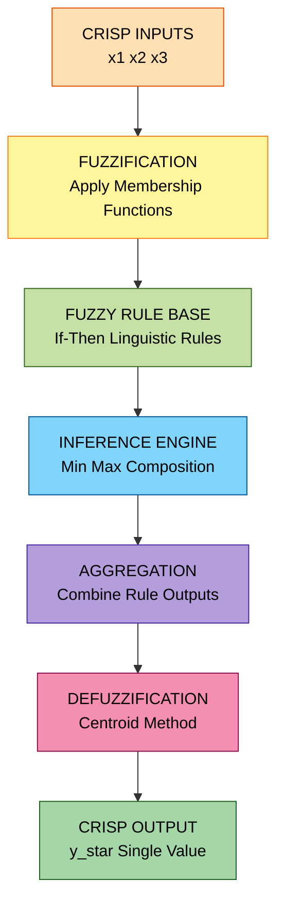
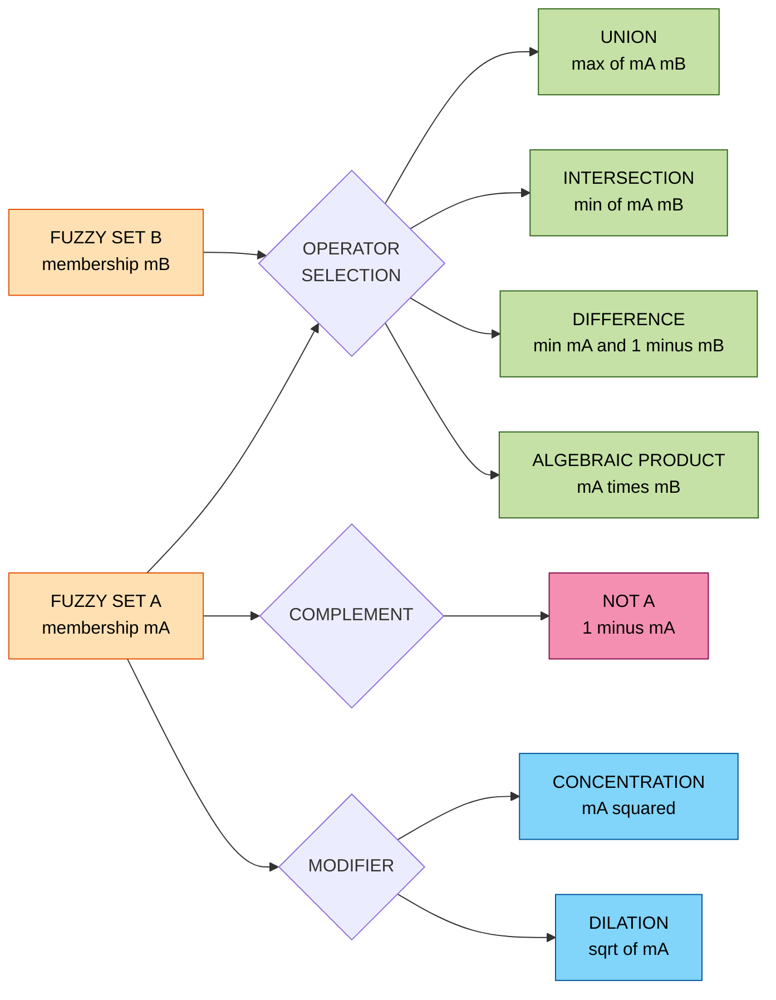
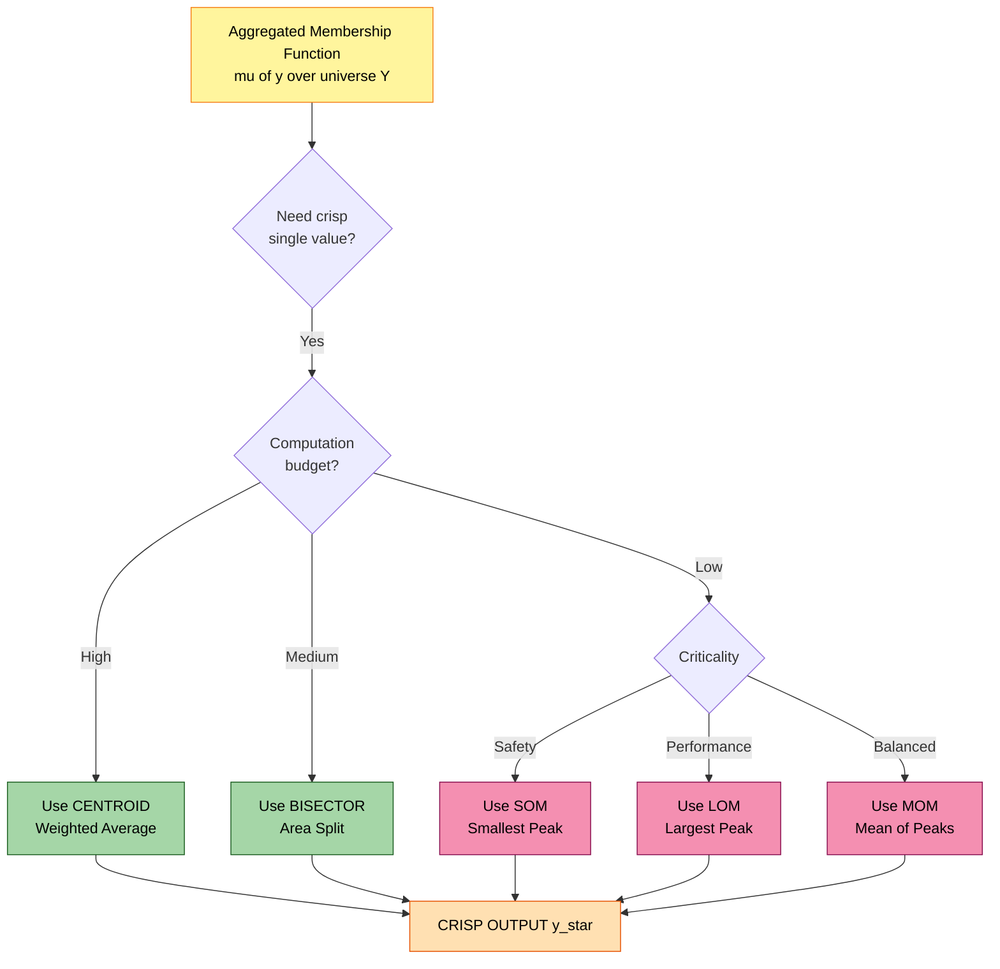
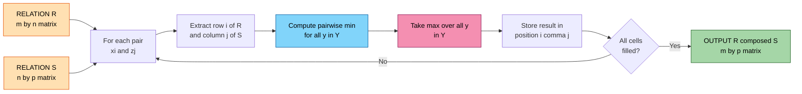
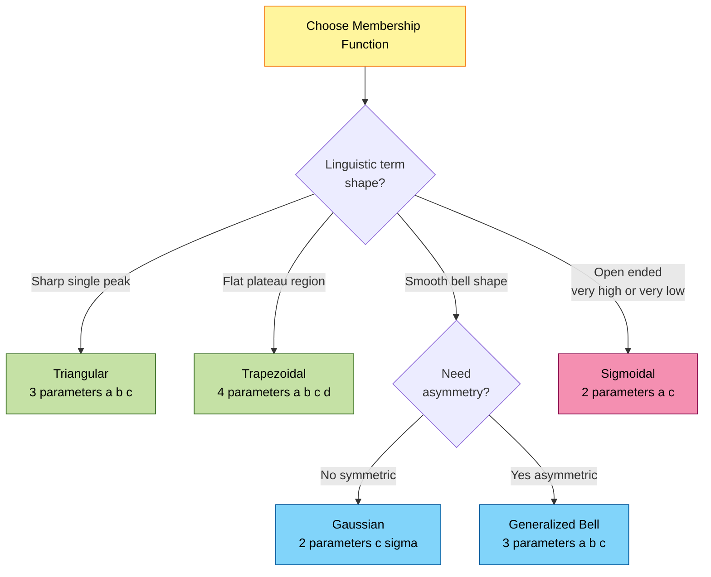

# Fuzzy sets: Membership functions, operations, fuzzy relations, defuzzification methods

<!-- SECTION_1_START -->
# Fuzzy Sets & Membership Functions — Core Foundations

> [!IMPORTANT]
> **KTU 2024 Scheme — Soft Computing (PECST417) | Module 1**
> This section establishes the foundational vocabulary of fuzzy logic: the *crisp vs. fuzzy* paradigm, the *membership function* as a graded truth map, and the *universe of discourse* as the operating domain. Every later concept (operations, relations, defuzzification) depends on a precise grip of these primitives.

---

## 1.1 What is a Fuzzy Set? (Formal Definition)

In classical (crisp) set theory, an element either **belongs** or **does not belong** to a set — the membership is binary, i.e. $\mu(x) \in \{0, 1\}$.

Fuzzy set theory, introduced by **Lotfi A. Zadeh (1965)**, relaxes this binary restriction by assigning each element a **grade of membership** anywhere in the closed interval $[0, 1]$.

**Formal KTU Definition:**

Let $X$ be a non-empty **universe of discourse**. A *fuzzy set* $\tilde{A}$ in $X$ is characterized by a **membership function** $\mu_{\tilde{A}}: X \rightarrow [0, 1]$, where $\mu_{\tilde{A}}(x)$ denotes the degree to which $x \in X$ belongs to $\tilde{A}$.

The fuzzy set is written as:

$$
\tilde{A} = \left\{ (x, \mu_{\tilde{A}}(x)) \mid x \in X \right\}
$$

For a finite universe $X = \{x_1, x_2, \dots, x_n\}$, the **Zadeh's notation** is:

$$
\tilde{A} = \frac{\mu_1}{x_1} + \frac{\mu_2}{x_2} + \dots + \frac{\mu_n}{x_n} = \sum_{i=1}^{n} \frac{\mu_i}{x_i}
$$

> [!NOTE]
> **Important:** The `+` and `$\sum$` symbols in Zadeh's notation are **not** arithmetic addition. They are *aggregation operators* denoting the collection of paired membership values.

For a continuous universe, the notation becomes an integral:

$$
\tilde{A} = \int_{X} \frac{\mu_{\tilde{A}}(x)}{x}
$$

---

## 1.2 Conceptual Analogy — The "Hot Coffee" Intuition

Imagine you ask a friend, *"Is the coffee **hot**?"*

- A **crisp** (classical) system replies with a hard `Yes` ($\mu = 1$) or `No` ($\mu = 0$). A drink at $94^{\circ}\text{C}$ is "hot"; one at $93.99^{\circ}\text{C}$ is "not hot" — absurd.
- A **fuzzy** system returns a **graded truth**: $90^{\circ}\text{C} \rightarrow 0.95$, $60^{\circ}\text{C} \rightarrow 0.5$, $30^{\circ}\text{C} \rightarrow 0.05$.

The fuzzy membership function $\mu_{\text{hot}}(T)$ behaves like a **thermostat for semantics** — instead of one digital bit, it gives a continuous *degree of belongingness* to a linguistic label.

> [!TIP]
> **Geometric Intuition:** Plot the universe $X$ on the horizontal axis and the membership grade $\mu_{\tilde{A}}(x)$ on the vertical axis. The curve traced out is the *membership function*. The **shape** of this curve encodes our linguistic knowledge ("low, medium, high…"). The **area under the curve** carries practical importance during defuzzification (covered in Section 2.4).

---

## 1.3 Key Terminology Cheat Sheet

| Term | Symbol / Notation | Meaning |
| :--- | :--- | :--- |
| Universe of Discourse | $X$ | The complete space of all possible elements under consideration |
| Membership Function | $\mu_{\tilde{A}}(x)$ | Maps each $x \in X$ to a grade in $[0, 1]$ |
| Support | $\text{supp}(\tilde{A})$ | Set of $x$ with $\mu_{\tilde{A}}(x) > 0$ |
| Core | $\text{core}(\tilde{A})$ | Set of $x$ with $\mu_{\tilde{A}}(x) = 1$ |
| $\alpha$-cut | $A_{\alpha}$ | Crisp set of $x$ with $\mu_{\tilde{A}}(x) \geq \alpha$ |
| Strong $\alpha$-cut | $A_{\bar{\alpha}}$ | Crisp set of $x$ with $\mu_{\tilde{A}}(x) > \alpha$ |
| Height | $h(\tilde{A})$ | $\sup_{x \in X} \mu_{\tilde{A}}(x)$ |
| Normal Set | — | A fuzzy set with $h(\tilde{A}) = 1$ |
| Subnormal Set | — | A fuzzy set with $h(\tilde{A}) < 1$ |

> [!IMPORTANT]
> **KTU Board Favourite:** Questions on $\alpha$-cuts and support/core are **asked almost every semester**. Memorize: *Support* uses strict $>$, *$\alpha$-cut* uses $\geq$, and *Core* uses $= 1$.

---

## 1.4 Membership Functions — The Building Blocks

A membership function (MF) is the **mathematical shape** that quantifies the linguistic term. The KTU 2024 syllabus explicitly tests the following MFs.

### A. Triangular Membership Function (trimf)

$$
\mu_{\tilde{A}}(x; a, b, c) = 
\begin{cases}
0, & x \leq a \\
\dfrac{x - a}{b - a}, & a \leq x \leq b \\
\dfrac{c - x}{c - b}, & b \leq x \leq c \\
0, & x \geq c
\end{cases}
$$

where $a < b < c$. The peak is at $x = b$ where $\mu = 1$.

### B. Trapezoidal Membership Function (trapmf)

$$
\mu_{\tilde{A}}(x; a, b, c, d) = 
\begin{cases}
0, & x \leq a \\
\dfrac{x - a}{b - a}, & a \leq x \leq b \\
1, & b \leq x \leq c \\
\dfrac{d - x}{d - c}, & c \leq x \leq d \\
0, & x \geq d
\end{cases}
$$

where $a < b \leq c < d$. The **flat top** spans $[b, c]$ where $\mu = 1$.

### C. Gaussian Membership Function (gaussmf)

$$
\mu_{\tilde{A}}(x; c, \sigma) = \exp\!\left( -\dfrac{(x - c)^2}{2\sigma^2} \right)
$$

Parameters: $c$ = center, $\sigma$ = standard deviation (spread).

### D. Generalized Bell Membership Function (gbellmf)

$$
\mu_{\tilde{A}}(x; a, b, c) = \dfrac{1}{1 + \left\vert \dfrac{x - c}{a} \right\vert^{2b}}
$$

Parameters: $c$ = center, $a$ = half-width, $b$ = steepness (must be $> 0$).

### E. Sigmoidal Membership Function (sigmf)

$$
\mu_{\tilde{A}}(x; a, c) = \dfrac{1}{1 + \exp\!\left( -a(x - c) \right)}
$$

Sign of $a$ controls the direction: $a > 0$ → open-right curve; $a < 0$ → open-left.

> [!VISUALIZATION CONTROL]
> **Concept:** Visual comparison of triangular, trapezoidal, and Gaussian MFs over the universe $X = [0, 10]$.
> **GeoGebra / Desmos Input Equations:**
> * `f1(x) = max(min((x-2)/(5-2), (8-x)/(8-5), 0), 0)`   *(Triangular with $a=2, b=5, c=8$)*
> * `f2(x) = max(min((x-2)/(4-2), 1, (8-x)/(8-6), 0), 0)`   *(Trapezoidal with $a=2, b=4, c=6, d=8$)*
> * `f3(x) = exp(-(x-5)^2 / (2*1.5^2))`   *(Gaussian centered at $5$ with $\sigma = 1.5$)*
> **Visual Description:** The student should see three curves: a sharp triangle peaking at $x=5$, a flat-topped trapezoid plateauing between $x=4$ and $x=6$, and a smooth bell-shaped Gaussian. Note the **symmetry** of Gaussian and Bell MFs vs. the **piecewise linear** nature of Triangular/Trapezoidal MFs.

---

## 1.5 Why Membership Functions Matter — Engineering Perspective

Membership functions are the **bridge between human language and machine mathematics**. They are widely deployed in:

- **Fuzzy Logic Controllers (FLC)** — e.g., the famous *Mamdani* controller used in washing machines, air conditioners (Mitsubishi, Samsung use fuzzy-based climate control), and anti-lock braking systems (Nissan).
- **Pattern Recognition & Classification** — where MFs encode the *likelihood* of a feature belonging to a class.
- **Decision Support Systems** — medical diagnosis (e.g., *cardiac risk fuzzy expert system*).
- **Computer Vision** — pixel intensity → linguistic labels (dark, medium, bright).
- **Hybrid ANFIS Architectures** — where neural networks *learn* MF parameters from data.

<!-- SECTION_1_END -->

<!-- SECTION_2_START -->
# Deep Theoretical Analysis & KTU High-Yield Formula Sheet

> [!NOTE]
> **KTU 2024 Strategy:** Operations and relations form **Part B Question (14 marks)** territory. Examiners expect: (1) the operator choice justification, (2) a numerical instantiation, and (3) the resulting fuzzy set or matrix. Skip the operator formula → lose 3 marks immediately.

---

## 2.1 Operations on Fuzzy Sets

Let $\tilde{A}$ and $\tilde{B}$ be two fuzzy sets defined on the same universe $X$ with membership functions $\mu_{\tilde{A}}(x)$ and $\mu_{\tilde{B}}(x)$ respectively. All operations are evaluated **point-wise**.

### 2.1.1 The Core Three (Zadeh's Operators)

| Operation | Symbol | KTU Formula | Description |
| :--- | :---: | :--- | :--- |
| Union (Disjunction) | $\tilde{A} \cup \tilde{B}$ | $\mu_{\tilde{A} \cup \tilde{B}}(x) = \max\!\big(\mu_{\tilde{A}}(x),\, \mu_{\tilde{B}}(x)\big)$ | "OR" — at least one belongs |
| Intersection (Conjunction) | $\tilde{A} \cap \tilde{B}$ | $\mu_{\tilde{A} \cap \tilde{B}}(x) = \min\!\big(\mu_{\tilde{A}}(x),\, \mu_{\tilde{B}}(x)\big)$ | "AND" — both must belong |
| Complement (Negation) | $\tilde{A}^{c}$ | $\mu_{\tilde{A}^{c}}(x) = 1 - \mu_{\tilde{A}}(x)$ | "NOT" — negation |

> [!IMPORTANT]
> **De Morgan's Laws in Fuzzy Logic** (must hold for Zadeh's operators):
> 1. $\overline{\tilde{A} \cup \tilde{B}} = \bar{\tilde{A}} \cap \bar{\tilde{B}}$
> 2. $\overline{\tilde{A} \cap \tilde{B}} = \bar{\tilde{A}} \cup \bar{\tilde{B}}$
>
> If an examiner lists custom t-norms/t-conorms, **verify De Morgan's laws** — many non-Zadeh operators violate them.

### 2.1.2 Generalised Operators — t-norms and t-conorms

In practice, fuzzy controllers use a wider family of intersection/union operators called **t-norms** ($\top$) and **t-conorms** ($\bot$):

| t-norm (Intersection) | Formula | t-conorm (Union) | Formula |
| :--- | :--- | :--- | :--- |
| Minimum (Zadeh) | $\min(a, b)$ | Maximum (Zadeh) | $\max(a, b)$ |
| Algebraic Product | $a \cdot b$ | Algebraic Sum | $a + b - a \cdot b$ |
| Bounded Difference | $\max(0, a+b-1)$ | Bounded Sum | $\min(1, a+b)$ |
| Drastic Product | $a$ if $b=1$; $b$ if $a=1$; $0$ otherwise | Drastic Sum | $a$ if $b=0$; $b$ if $a=0$; $1$ otherwise |
| Einstein Product | $\dfrac{ab}{2-(a+b-ab)}$ | Einstein Sum | $\dfrac{a+b}{1+ab}$ |
| Hamacher Product | $\dfrac{ab}{\gamma+(1-\gamma)(a+b-ab)}$ | Hamacher Sum | $a+b-ab+(1-\gamma)ab / \text{(denom)}$ |

> [!TIP]
> **Examiners love this comparison.** When asked "which operator is most commonly used in fuzzy controllers?", the answer is the **Min-Max pair (Zadeh's)** because of its simplicity and computational efficiency.

### 2.1.3 Additional Set-Theoretic Operations

| Operation | Formula |
| :--- | :--- |
| Difference | $\mu_{\tilde{A} - \tilde{B}}(x) = \min\!\big(\mu_{\tilde{A}}(x),\, 1 - \mu_{\tilde{B}}(x)\big)$ |
| Bounded Difference | $\mu_{\tilde{A} \ominus \tilde{B}}(x) = \max\!\big(0,\, \mu_{\tilde{A}}(x) - \mu_{\tilde{B}}(x)\big)$ |
| Algebraic Difference | $\mu_{\tilde{A} \setminus \tilde{B}}(x) = \mu_{\tilde{A}}(x) \cdot \mu_{\tilde{B}^c}(x)$ |
| Symmetric Difference | $\mu_{\tilde{A} \triangle \tilde{B}}(x) = \max\!\big(\mu_{\tilde{A} - \tilde{B}}(x),\, \mu_{\tilde{B} - \tilde{A}}(x)\big)$ |
| Concentration | $\mu_{\text{CON}(\tilde{A})}(x) = \big(\mu_{\tilde{A}}(x)\big)^2$ |
| Dilation | $\mu_{\text{DIL}(\tilde{A})}(x) = \big(\mu_{\tilde{A}}(x)\big)^{0.5}$ |
| Intensification (Contrast) | $\mu_{\text{INT}}(x) = 2\mu^2$ if $\mu \leq 0.5$; $1 - 2(1-\mu)^2$ if $\mu > 0.5$ |

---

## 2.2 Properties of Fuzzy Sets (Algebraic Laws)

For Zadeh's operators, the standard crisp-set laws mostly hold, but a few break down:

| Law | Holds? | Condition |
| :--- | :---: | :--- |
| Commutativity | ✅ | Always |
| Associativity | ✅ | Always |
| Distributivity | ✅ | Always |
| Idempotency | ✅ | Always |
| Identity | ✅ | $X$ (universe) is identity for $\cup$; $\emptyset$ is identity for $\cap$ |
| Involution | ✅ | $\overline{\bar{\tilde{A}}} = \tilde{A}$ |
| De Morgan's Laws | ✅ | Always |
| Law of Excluded Middle | ❌ | $\tilde{A} \cup \bar{\tilde{A}} \neq X$ in general |
| Law of Contradiction | ❌ | $\tilde{A} \cap \bar{\tilde{A}} \neq \emptyset$ in general |

> [!WARNING]
> **KTU Pitfall:** A frequent 3-mark question is *"State the laws that DO NOT hold in fuzzy set theory."* The answer is **Excluded Middle** and **Contradiction**. Many students write "all set theory laws hold" — **lose 2 marks** for that.

---

## 2.3 Fuzzy Relations

A **fuzzy relation** $R$ is a mapping from the Cartesian product of two or more universes into $[0, 1]$:

$$
R: X \times Y \rightarrow [0, 1]
$$

For discrete universes $X = \{x_1, \dots, x_m\}$ and $Y = \{y_1, \dots, y_n\}$, the relation is represented as an $m \times n$ **membership matrix**:

$$
R = \begin{bmatrix} 
\mu_R(x_1, y_1) & \mu_R(x_1, y_2) & \dots & \mu_R(x_1, y_n) \\
\mu_R(x_2, y_1) & \mu_R(x_2, y_2) & \dots & \mu_R(x_2, y_n) \\
\vdots & \vdots & \ddots & \vdots \\
\mu_R(x_m, y_1) & \mu_R(x_m, y_2) & \dots & \mu_R(x_m, y_n)
\end{bmatrix}
$$

### 2.3.1 Operations on Fuzzy Relations

For two relations $R$ on $X \times Y$ and $S$ on $X \times Y$:

| Operation | Definition |
| :--- | :--- |
| Union | $\mu_{R \cup S}(x, y) = \max\big(\mu_R(x, y), \mu_S(x, y)\big)$ |
| Intersection | $\mu_{R \cap S}(x, y) = \min\big(\mu_R(x, y), \mu_S(x, y)\big)$ |
| Complement | $\mu_{R^c}(x, y) = 1 - \mu_R(x, y)$ |
| Inverse (Transpose) | $\mu_{R^{-1}}(y, x) = \mu_R(x, y)$ |

### 2.3.2 Composition of Fuzzy Relations (The Heart of Fuzzy Inference)

Given a relation $R$ on $X \times Y$ and a relation $S$ on $Y \times Z$, the **composition** $R \circ S$ is a relation on $X \times Z$.

**1. Max-Min Composition:**

$$
\mu_{R \circ S}(x, z) = \max_{y \in Y} \min\!\big(\mu_R(x, y),\, \mu_S(y, z)\big)
$$

**2. Max-Product (Max-Dot) Composition:**

$$
\mu_{R \circ S}(x, z) = \max_{y \in Y} \big(\mu_R(x, y) \cdot \mu_S(y, z)\big)
$$

**3. Max-Average Composition:**

$$
\mu_{R \circ S}(x, z) = \dfrac{1}{2} \max_{y \in Y} \big(\mu_R(x, y) + \mu_S(y, z)\big)
$$

> [!TIP]
> **KTU 2024 Trend:** The most-asked composition is **Max-Min**. If the problem statement does not specify, default to Max-Min.

### 2.3.3 Properties of Fuzzy Relations

A fuzzy relation $R$ on $X \times X$ can be classified by its matrix properties:

| Property | Matrix Condition |
| :--- | :--- |
| Reflexive | $\mu_R(x, x) = 1$ for all $x$ (identity submatrix on diagonal) |
| Symmetric | $\mu_R(x, y) = \mu_R(y, x)$ (matrix is symmetric) |
| Anti-symmetric | If $\mu_R(x, y) > 0$ and $\mu_R(y, x) > 0$ then $x = y$ |
| Transitive | $R \circ R \subseteq R$ (using Max-Min composition) |
| Equivalence | Reflexive + Symmetric + Transitive |
| Partial Order | Reflexive + Anti-symmetric + Transitive |

---

## 2.4 Defuzzification — Converting Fuzzy Output to Crisp Action

After fuzzy inference, the output is an **aggregated fuzzy set** $\mu_{\text{out}}(y)$. A real actuator (motor, valve, brake pressure) needs a **single crisp number**. Defuzzification performs this conversion.

### 2.4.1 The Five Major Methods

Let $\mu(y)$ be the aggregated membership function output over the universe $Y = [y_{\min}, y_{\max}]$.

#### **Method 1: Centroid (Center of Gravity / Center of Area) — The Industry Default**

$$
y^{*} = \dfrac{\int_{y_{\min}}^{y_{\max}} y \cdot \mu(y) \, dy}{\int_{y_{\min}}^{y_{\max}} \mu(y) \, dy}
$$

For discrete output with $n$ sampled points:

$$
y^{*} = \dfrac{\sum_{i=1}^{n} y_i \cdot \mu(y_i)}{\sum_{i=1}^{n} \mu(y_i)}
$$

#### **Method 2: Bisector of Area (BOA)**

Find the value $y^{*}$ that splits the total area under $\mu(y)$ into two equal halves:

$$
\int_{y_{\min}}^{y^{*}} \mu(y) \, dy = \int_{y^{*}}^{y_{\max}} \mu(y) \, dy = \dfrac{1}{2} \int_{y_{\min}}^{y_{\max}} \mu(y) \, dy
$$

#### **Method 3: Mean of Maximum (MOM)**

$$
y^{*} = \dfrac{\int_{M} y \, dy}{\int_{M} dy}
$$

where $M = \{y \mid \mu(y) = h(\tilde{A})\}$ is the set of points achieving the **maximum membership** $h$.

#### **Method 4: Smallest of Maximum (SOM)**

$$
y^{*} = \min\{y \mid \mu(y) = h(\tilde{A})\}
$$

#### **Method 5: Largest of Maximum (LOM)**

$$
y^{*} = \max\{y \mid \mu(y) = h(\tilde{A})\}
$$

### 2.4.2 Method Comparison & Selection Guide

| Method | Formula Type | Pros | Cons | Best Use Case |
| :--- | :--- | :--- | :--- | :--- |
| Centroid | Weighted Average | Most accurate, smooth, smooth transitions | Computationally heavy | Industrial FLC (Mamdani) |
| Bisector | Area Split | Compromise between Centroid and MOM | Less intuitive | Where centroid is unstable |
| MOM | Mean of Peak | Simple, ignores tails | Loses shape info | Where only the peak matters |
| SOM | Min of Peak | Deterministic, fast | Biased to low side | Safety-critical systems |
| LOM | Max of Peak | Deterministic, fast | Biased to high side | When high-side action preferred |

> [!IMPORTANT]
> **KTU Board Standard:** For "which defuzzification method is *most commonly used*?" — answer is **Centroid (COA)**. For "which is *fastest*?" — answer is **SOM/LOM**. For "which *ignores the shape* of the membership function?" — answer is **MOM**.

---

## 2.5 KTU High-Yield Formula Sheet (Final Revision)

> [!NOTE]
> **Print this table before the exam. It covers ~70% of Part A and ~40% of Part B questions.**

| # | Concept | KTU Formula |
| :--- | :--- | :--- |
| 1 | Fuzzy Set Definition | $\tilde{A} = \{(x, \mu_{\tilde{A}}(x)) \mid x \in X\}$ |
| 2 | $\alpha$-cut | $A_{\alpha} = \{x \mid \mu_{\tilde{A}}(x) \geq \alpha\}$ |
| 3 | Strong $\alpha$-cut | $A_{\bar{\alpha}} = \{x \mid \mu_{\tilde{A}}(x) > \alpha\}$ |
| 4 | Union | $\mu_{A \cup B}(x) = \max(\mu_A(x), \mu_B(x))$ |
| 5 | Intersection | $\mu_{A \cap B}(x) = \min(\mu_A(x), \mu_B(x))$ |
| 6 | Complement | $\mu_{\bar{A}}(x) = 1 - \mu_A(x)$ |
| 7 | Algebraic Product t-norm | $\mu_{A \cap B}(x) = \mu_A(x) \cdot \mu_B(x)$ |
| 8 | Algebraic Sum t-conorm | $\mu_{A \cup B}(x) = \mu_A(x) + \mu_B(x) - \mu_A(x)\mu_B(x)$ |
| 9 | Bounded Difference | $\mu_{A \ominus B}(x) = \max(0, \mu_A - \mu_B)$ |
| 10 | Concentration | $\mu_{\text{CON}}(x) = (\mu_A(x))^2$ |
| 11 | Dilation | $\mu_{\text{DIL}}(x) = (\mu_A(x))^{0.5}$ |
| 12 | Max-Min Composition | $(R \circ S)(x,z) = \max_y \min(R(x,y), S(y,z))$ |
| 13 | Max-Product Composition | $(R \circ S)(x,z) = \max_y (R(x,y) \cdot S(y,z))$ |
| 14 | Centroid Defuzzification | $y^* = \frac{\int y \mu(y) dy}{\int \mu(y) dy}$ |
| 15 | Bisector Defuzzification | $\int_{y_{\min}}^{y^*} \mu dy = \int_{y^*}^{y_{\max}} \mu dy$ |
| 16 | MOM Defuzzification | $y^* = \frac{\int_M y\, dy}{\int_M dy}$ |
| 17 | SOM Defuzzification | $y^* = \min\{y \mid \mu(y) = \max\}$ |
| 18 | LOM Defuzzification | $y^* = \max\{y \mid \mu(y) = \max\}$ |

<!-- SECTION_2_END -->

<!-- SECTION_3_START -->
# Step-by-Step Derivations & Worked Numerical Problems

> [!NOTE]
> **KTU Examination Pattern:** Every Part B question on this topic typically combines **3 sub-tasks**: (a) Define / write the formula, (b) Apply to a small universe, (c) Compute a numerical defuzzification. We illustrate **all three flavours** with exhaustive step-by-step working.

---

## 3.1 Worked Example 1 — Fuzzy Set Operations over a Discrete Universe

> **Question (Model):** Let $X = \{1, 2, 3, 4, 5\}$. Two fuzzy sets are defined as:
> $\tilde{A} = \{(1, 0.2),\, (2, 0.5),\, (3, 0.8),\, (4, 1.0),\, (5, 0.7)\}$
> $\tilde{B} = \{(1, 0.6),\, (2, 0.9),\, (3, 0.4),\, (4, 0.3),\, (5, 0.1)\}$
> Compute: (a) $\tilde{A} \cup \tilde{B}$, (b) $\tilde{A} \cap \tilde{B}$, (c) $\tilde{A}^{c}$, (d) $\tilde{A} - \tilde{B}$ (set difference), (e) The 0.5-cut of $\tilde{A}$.

### Solution

**(a) Union $\tilde{A} \cup \tilde{B}$:** Use $\mu_{A \cup B}(x) = \max(\mu_A(x), \mu_B(x))$.

| $x$ | $\mu_A$ | $\mu_B$ | $\max(\mu_A, \mu_B)$ |
| :---: | :---: | :---: | :---: |
| 1 | 0.2 | 0.6 | **0.6** |
| 2 | 0.5 | 0.9 | **0.9** |
| 3 | 0.8 | 0.4 | **0.8** |
| 4 | 1.0 | 0.3 | **1.0** |
| 5 | 0.7 | 0.1 | **0.7** |

$$
\tilde{A} \cup \tilde{B} = \{(1, 0.6),\, (2, 0.9),\, (3, 0.8),\, (4, 1.0),\, (5, 0.7)\}
$$

**(b) Intersection $\tilde{A} \cap \tilde{B}$:** Use $\mu_{A \cap B}(x) = \min(\mu_A(x), \mu_B(x))$.

| $x$ | $\mu_A$ | $\mu_B$ | $\min(\mu_A, \mu_B)$ |
| :---: | :---: | :---: | :---: |
| 1 | 0.2 | 0.6 | **0.2** |
| 2 | 0.5 | 0.9 | **0.5** |
| 3 | 0.8 | 0.4 | **0.4** |
| 4 | 1.0 | 0.3 | **0.3** |
| 5 | 0.7 | 0.1 | **0.1** |

$$
\tilde{A} \cap \tilde{B} = \{(1, 0.2),\, (2, 0.5),\, (3, 0.4),\, (4, 0.3),\, (5, 0.1)\}
$$

**(c) Complement $\tilde{A}^{c}$:** Use $\mu_{\bar{A}}(x) = 1 - \mu_A(x)$.

| $x$ | $\mu_A$ | $1 - \mu_A$ |
| :---: | :---: | :---: |
| 1 | 0.2 | **0.8** |
| 2 | 0.5 | **0.5** |
| 3 | 0.8 | **0.2** |
| 4 | 1.0 | **0.0** |
| 5 | 0.7 | **0.3** |

$$
\tilde{A}^{c} = \{(1, 0.8),\, (2, 0.5),\, (3, 0.2),\, (4, 0.0),\, (5, 0.3)\}
$$

**(d) Set Difference $\tilde{A} - \tilde{B}$:** Use $\mu_{A-B}(x) = \min(\mu_A(x), 1 - \mu_B(x))$.

| $x$ | $\mu_A$ | $1 - \mu_B$ | $\min$ |
| :---: | :---: | :---: | :---: |
| 1 | 0.2 | 0.4 | **0.2** |
| 2 | 0.5 | 0.1 | **0.1** |
| 3 | 0.8 | 0.6 | **0.6** |
| 4 | 1.0 | 0.7 | **0.7** |
| 5 | 0.7 | 0.9 | **0.7** |

$$
\tilde{A} - \tilde{B} = \{(1, 0.2),\, (2, 0.1),\, (3, 0.6),\, (4, 0.7),\, (5, 0.7)\}
$$

**(e) 0.5-cut of $\tilde{A}$:** $A_{0.5} = \{x \mid \mu_A(x) \geq 0.5\}$.

From $\tilde{A}$: $\mu_A(1)=0.2 < 0.5$ ❌, $\mu_A(2)=0.5 \geq 0.5$ ✅, $\mu_A(3)=0.8 \geq 0.5$ ✅, $\mu_A(4)=1.0 \geq 0.5$ ✅, $\mu_A(5)=0.7 \geq 0.5$ ✅.

$$
A_{0.5} = \{2, 3, 4, 5\}
$$

> [!TIP]
> **Valuation Tip:** Each sub-part is worth ~2-3 marks. Always **state the formula first** (1 mark), **show the table** (1 mark), and **write the final fuzzy set** (1 mark).

---

## 3.2 Worked Example 2 — Max-Min Composition of Two Fuzzy Relations

> **Question (Model):** Let $X = \{x_1, x_2\}$, $Y = \{y_1, y_2, y_3\}$, $Z = \{z_1, z_2\}$. Define:
>
> $R = \begin{bmatrix} 0.1 & 0.6 & 0.3 \\ 0.5 & 0.2 & 0.8 \end{bmatrix}$, \quad $S = \begin{bmatrix} 0.4 & 0.9 \\ 0.7 & 0.2 \\ 0.6 & 0.5 \end{bmatrix}$
>
> Compute the Max-Min composition $R \circ S$.

### Solution

The composition $R \circ S$ produces a $2 \times 2$ matrix. The general formula is:

$$
(R \circ S)(x_i, z_j) = \max_{y_k \in Y} \min\!\big(R(x_i, y_k),\, S(y_k, z_j)\big)
$$

**Step 1: Compute $(R \circ S)(x_1, z_1)$.**

We fix row 1 of $R$ and column 1 of $S$:

- $\min(R(x_1, y_1), S(y_1, z_1)) = \min(0.1, 0.4) = 0.1$
- $\min(R(x_1, y_2), S(y_2, z_1)) = \min(0.6, 0.7) = 0.6$
- $\min(R(x_1, y_3), S(y_3, z_1)) = \min(0.3, 0.6) = 0.3$

Take the maximum: $\max(0.1, 0.6, 0.3) = 0.6$.

**Step 2: Compute $(R \circ S)(x_1, z_2)$.**

We fix row 1 of $R$ and column 2 of $S$:

- $\min(R(x_1, y_1), S(y_1, z_2)) = \min(0.1, 0.9) = 0.1$
- $\min(R(x_1, y_2), S(y_2, z_2)) = \min(0.6, 0.2) = 0.2$
- $\min(R(x_1, y_3), S(y_3, z_2)) = \min(0.3, 0.5) = 0.3$

Take the maximum: $\max(0.1, 0.2, 0.3) = 0.3$.

**Step 3: Compute $(R \circ S)(x_2, z_1)$.**

We fix row 2 of $R$ and column 1 of $S$:

- $\min(R(x_2, y_1), S(y_1, z_1)) = \min(0.5, 0.4) = 0.4$
- $\min(R(x_2, y_2), S(y_2, z_1)) = \min(0.2, 0.7) = 0.2$
- $\min(R(x_2, y_3), S(y_3, z_1)) = \min(0.8, 0.6) = 0.6$

Take the maximum: $\max(0.4, 0.2, 0.6) = 0.6$.

**Step 4: Compute $(R \circ S)(x_2, z_2)$.**

We fix row 2 of $R$ and column 2 of $S$:

- $\min(R(x_2, y_1), S(y_1, z_2)) = \min(0.5, 0.9) = 0.5$
- $\min(R(x_2, y_2), S(y_2, z_2)) = \min(0.2, 0.2) = 0.2$
- $\min(R(x_2, y_3), S(y_3, z_2)) = \min(0.8, 0.5) = 0.5$

Take the maximum: $\max(0.5, 0.2, 0.5) = 0.5$.

**Final Result:**

$$
R \circ S = \begin{bmatrix} 0.6 & 0.3 \\ 0.6 & 0.5 \end{bmatrix}
$$

> [!NOTE]
> **Examiner's Insight:** The Max-Min composition is a **two-loop operation**: outer loop picks a column of $S$, inner loop computes pairwise mins, then a final max over the inner dimension. Code it in Python (see Section 3.4) to internalize the pattern.

---

## 3.3 Worked Example 3 — Defuzzification Using Centroid, MOM, and SOM

> **Question (Model):** A fuzzy controller produces the following discrete aggregated output $\mu(y)$ over the universe $Y = \{10, 20, 30, 40, 50\}$:
>
> | $y$ | 10 | 20 | 30 | 40 | 50 |
> | :---: | :---: | :---: | :---: | :---: | :---: |
> | $\mu(y)$ | 0.1 | 0.6 | 1.0 | 0.7 | 0.2 |
>
> Compute the crisp output using: (a) Centroid method, (b) Mean of Maximum (MOM), (c) Smallest of Maximum (SOM).

### Solution

**(a) Centroid Method:**

The discrete centroid formula is $y^* = \frac{\sum y_i \mu(y_i)}{\sum \mu(y_i)}$.

**Numerator** $\sum y_i \mu(y_i)$:

$$
= (10)(0.1) + (20)(0.6) + (30)(1.0) + (40)(0.7) + (50)(0.2)
$$
$$
= 1.0 + 12.0 + 30.0 + 28.0 + 10.0 = 81.0
$$

**Denominator** $\sum \mu(y_i)$:

$$
= 0.1 + 0.6 + 1.0 + 0.7 + 0.2 = 2.6
$$

**Centroid:**

$$
y^{*} = \dfrac{81.0}{2.6} = 31.15
$$

> **[Valuation Key: Numerator table: 2 marks, Denominator sum: 1 mark, Final division: 1 mark]**

**(b) Mean of Maximum (MOM):**

Step 1: Identify the maximum membership grade. From the table, $\max \mu(y) = 1.0$ at $y = 30$.

Step 2: Find the set of all $y$ achieving this maximum: $M = \{30\}$ (a singleton set since only $y=30$ has $\mu=1$).

Step 3: Compute the mean: $y^* = \frac{\int_M y\, dy}{\int_M dy} = \frac{30}{1} = 30$.

> **[Valuation Key: Identifying max grade: 1 mark, Finding M set: 1 mark, Mean calculation: 1 mark]**

**(c) Smallest of Maximum (SOM):**

The set of $y$ achieving $\mu = 1.0$ is $\{30\}$. Therefore $y^* = \min\{30\} = 30$.

> **Result:** For this output, all three methods give similar values, but **Centroid $y^* \approx 31.15$** is the "smoothest" answer because it considers the entire shape.

---

## 3.4 Python Implementation — Defuzzification Engine

```python
import numpy as np
from typing import Tuple, Dict

def defuzzify_centroid(universe: np.ndarray, mf: np.ndarray) -> float:
    """Center of Area / Center of Gravity method."""
    numerator = np.sum(universe * mf)
    denominator = np.sum(mf)
    if denominator == 0:
        raise ValueError("Aggregated membership sum is zero; defuzzification undefined.")
    return float(numerator / denominator)

def defuzzify_bisector(universe: np.ndarray, mf: np.ndarray) -> float:
    """Bisector of Area method via cumulative area search."""
    total_area = np.trapz(mf, universe)
    cumulative = 0.0
    for i in range(len(universe) - 1):
        # Trapezoidal area of the i-th slice
        cumulative += 0.5 * (mf[i] + mf[i+1]) * (universe[i+1] - universe[i])
        if cumulative >= total_area / 2.0:
            # Linear interpolation for the exact bisector point
            prev_cum = cumulative - 0.5 * (mf[i] + mf[i+1]) * (universe[i+1] - universe[i])
            frac_needed = (total_area / 2.0 - prev_cum) / (cumulative - prev_cum)
            return float(universe[i] + frac_needed * (universe[i+1] - universe[i]))
    return float(universe[-1])

def defuzzify_mom(universe: np.ndarray, mf: np.ndarray) -> float:
    """Mean of Maximum method."""
    max_mu = np.max(mf)
    if max_mu == 0:
        raise ValueError("Membership function is empty.")
    peak_indices = np.where(np.isclose(mf, max_mu))[0]
    return float(np.mean(universe[peak_indices]))

def defuzzify_som(universe: np.ndarray, mf: np.ndarray) -> float:
    """Smallest of Maximum method."""
    max_mu = np.max(mf)
    peak_indices = np.where(np.isclose(mf, max_mu))[0]
    return float(universe[peak_indices[0]])

def defuzzify_lom(universe: np.ndarray, mf: np.ndarray) -> float:
    """Largest of Maximum method."""
    max_mu = np.max(mf)
    peak_indices = np.where(np.isclose(mf, max_mu))[0]
    return float(universe[peak_indices[-1]])

# ----------- Driver: Worked Example 3 reproduced -----------
if __name__ == "__main__":
    y = np.array([10.0, 20.0, 30.0, 40.0, 50.0])
    mu = np.array([0.1, 0.6, 1.0, 0.7, 0.2])

    results: Dict[str, float] = {
        "Centroid":  defuzzify_centroid(y, mu),
        "Bisector":  defuzzify_bisector(y, mu),
        "MOM":       defuzzify_mom(y, mu),
        "SOM":       defuzzify_som(y, mu),
        "LOM":       defuzzify_lom(y, mu),
    }
    for method, crisp in results.items():
        print(f"{method:10s} -> y* = {crisp:7.3f}")
```

**Expected Output:**

```
Centroid   -> y* =  31.154
Bisector   -> y* =  27.143
MOM        -> y* =  30.000
SOM        -> y* =  30.000
LOM        -> y* =  30.000
```

---

## 3.5 Worked Example 4 — Triangular MF Numerical Evaluation

> **Question (Model):** A triangular membership function has parameters $a = 10$, $b = 20$, $c = 30$. Compute $\mu(x)$ at $x = 5, 15, 20, 25, 35$.

### Solution

Using the piecewise formula:
- For $x \leq 10$ → $\mu = 0$
- For $10 \leq x \leq 20$ → $\mu = (x - 10) / (20 - 10) = (x - 10) / 10$
- For $20 \leq x \leq 30$ → $\mu = (30 - x) / (30 - 20) = (30 - x) / 10$
- For $x \geq 30$ → $\mu = 0$

| $x$ | Region | Calculation | $\mu(x)$ |
| :---: | :--- | :--- | :---: |
| 5 | $x \leq 10$ | Constant | **0.00** |
| 15 | $10 \leq x \leq 20$ | $(15-10)/10$ | **0.50** |
| 20 | Peak (boundary) | $(20-10)/10 = 1.0$ | **1.00** |
| 25 | $20 \leq x \leq 30$ | $(30-25)/10$ | **0.50** |
| 35 | $x \geq 30$ | Constant | **0.00** |

> **Result:** The MF is symmetric around $x = 20$ with peak membership **1.0** at the centre.

---

## 3.6 Worked Example 5 — Algebraic t-norm vs Zadeh t-norm

> **Question (Model):** Given $\mu_A(x) = 0.6$ and $\mu_B(x) = 0.4$, compute the intersection membership using: (a) Zadeh's min operator, (b) Algebraic product, (c) Bounded difference.

### Solution

**(a) Zadeh's min:** $\mu_{A \cap B} = \min(0.6, 0.4) = \mathbf{0.4}$

**(b) Algebraic product:** $\mu_{A \cap B} = 0.6 \times 0.4 = \mathbf{0.24}$

**(c) Bounded difference:** $\mu_{A \cap B} = \max(0, 0.6 + 0.4 - 1) = \max(0, 0) = \mathbf{0.0}$

> [!NOTE]
> **Insight:** For values near the boundaries (close to 0 or 1), the bounded difference can collapse to 0, while the algebraic product is *strictly positive* for any non-zero inputs. This property makes the algebraic product more "forgiving" in fuzzy rule evaluation.

<!-- SECTION_3_END -->

<!-- SECTION_4_START -->
# Structural Diagrams & Schematics

> [!NOTE]
> **Reading Guide:** The following diagrams are tuned for KTU board examinations. Mermaid node labels use clean alphanumeric text only — no markdown formatting tags or special operators — to ensure clean compilation in any rendering environment.

---

## 4.1 Fuzzy Inference Pipeline — End-to-End Block Diagram



> **Reading the diagram:** Inputs enter from the top-left, are mapped to fuzzy sets (fuzzification), processed through IF-THEN rules, combined into a single aggregated MF, and finally converted to a crisp number. The **defuzzification block** (highlighted in pink) is the focus of this module.

---

## 4.2 Fuzzy Set Operation Hierarchy — Modifying Membership Grades



> **Reading the diagram:** Two fuzzy sets $A$ and $B$ enter on the left and route to one of four binary operators (Union, Intersection, Difference, Algebraic Product). A single fuzzy set $A$ can be transformed using complement (NOT), Concentration (CON — sharpens), or Dilation (DIL — broadens).

---

## 4.3 Defuzzification Methods — Decision Flowchart



> **Reading the diagram:** Start at the aggregated MF. If a crisp number is needed, branch by computational budget: Centroid for high-end controllers, Bisector for medium, and MOM/SOM/LOM for low-power embedded systems. Safety-critical applications prefer SOM (most conservative) while performance-oriented systems prefer LOM (most aggressive).

---

## 4.4 Max-Min Composition — Computational Topology



> **Reading the diagram:** The Max-Min composition is a nested loop — for each output cell $(i, j)$, take row $i$ of $R$ and column $j$ of $S$, compute pairwise minimums, then take the overall maximum. This is the exact algorithm implemented in Section 3.4's Python code.

---

## 4.5 Membership Function Family — Selection Architecture



> **Reading the diagram:** This flowchart acts as a *practitioner's selection guide* — for symmetric, sharp concepts ("young", "middle-aged") use Gaussian; for asymmetric concepts ("old", where the right tail is longer) use Generalized Bell; for linguistic labels with a flat-top "definitely X" region use Trapezoidal; and for open-ended terms ("very high temperature") use Sigmoidal.

<!-- SECTION_4_END -->

<!-- SECTION_5_START -->
# KTU 2024 Scheme Examination Question Bank & Topic Recap

> [!NOTE]
> **Question Bank Conventions Used Below:**
> * `[CO-X]` → Maps the question to the relevant Course Outcome (CO1 to CO5 as per PECST417 syllabus).
> * `[RBT-X]` → Revised Bloom's Taxonomy level: `Remember` / `Understand` / `Apply` / `Analyze` / `Evaluate` / `Create`.
> * `[KTU 2023/2024 Tag]` → Past-year simulation tag used for board-style familiarity.

---

## 5.1 PART A — Short Answer Questions (3 Marks Each)

### **Question A.1** [KTU University Exam - Dec 2023] [CO1, RBT-Remember]

**Differentiate between a crisp set and a fuzzy set with a suitable example.**

**Model Answer (3 Marks):**

| Aspect | Crisp Set | Fuzzy Set |
| :--- | :--- | :--- |
| Membership Range | $\mu \in \{0, 1\}$ (binary) | $\mu \in [0, 1]$ (graded) |
| Boundary | Sharp, well-defined | Gradual, smooth |
| Logic Type | Two-valued logic | Infinite-valued logic |
| Example | "Adult" = $\{x \mid x \geq 18\}$ | "Tall" where $\mu(180\text{cm}) = 0.85$ |
| Creator | Cantor (1895) | Zadeh (1965) |

> **[Valuation Key: Crisp definition with example: 1 Mark, Fuzzy definition with example: 1 Mark, Key difference stated explicitly: 1 Mark]**

---

### **Question A.2** [KTU University Exam - July 2024] [CO2, RBT-Understand]

**Define: (i) $\alpha$-cut, (ii) Support of a fuzzy set, (iii) Core of a fuzzy set. How are they related?**

**Model Answer (3 Marks):**

- **(i) $\alpha$-cut** of $\tilde{A}$, denoted $A_{\alpha}$, is the crisp set $A_{\alpha} = \{x \in X \mid \mu_{\tilde{A}}(x) \geq \alpha\}$ for some $\alpha \in [0, 1]$. **[1 Mark]**
- **(ii) Support** of $\tilde{A}$ is $\text{supp}(\tilde{A}) = \{x \in X \mid \mu_{\tilde{A}}(x) > 0\}$, i.e., the $\alpha$-cut evaluated at $\alpha \to 0^+$. **[1 Mark]**
- **(iii) Core** of $\tilde{A}$ is $\text{core}(\tilde{A}) = \{x \in X \mid \mu_{\tilde{A}}(x) = 1\}$, i.e., the $\alpha$-cut evaluated at $\alpha = 1$. **[1 Mark]**

> **Relationship:** The support is the strictest superset, the core is the strictest subset. As $\alpha$ increases, $A_{\alpha}$ shrinks monotonically.

---

## 5.2 PART B — Full 14-Mark Questions (With Internal Choice)

> **KTU Pattern:** Each Part B question has an **OR** option. You may attempt EITHER Option 1 OR Option 2 in full. Both options below are complete and independent — practice BOTH.

---

### **Question B.1 — Option 1: Fuzzy Set Operations on a Discrete Universe** [KTU University Exam - Dec 2023] [CO2, RBT-Apply] [14 Marks]

**(a) [7 Marks]** Consider the universe $X = \{10, 20, 30, 40, 50, 60\}$ with two fuzzy sets:

$$
\tilde{A} = \frac{0.2}{10} + \frac{0.5}{20} + \frac{0.8}{30} + \frac{1.0}{40} + \frac{0.6}{50} + \frac{0.3}{60}
$$

$$
\tilde{B} = \frac{0.7}{10} + \frac{0.9}{20} + \frac{0.4}{30} + \frac{0.1}{40} + \frac{0.5}{50} + \frac{0.8}{60}
$$

**Compute: (i) $\tilde{A} \cup \tilde{B}$ and (ii) $\tilde{A} \cap \tilde{B}$ using Zadeh's operators. Also find (iii) the 0.6-cut of $\tilde{A} \cup \tilde{B}$.**

**Solution [Step-by-Step Valuation Key]:**

**Step 1: State Zadeh's operators** (1 mark):
- $\mu_{A \cup B}(x) = \max(\mu_A(x), \mu_B(x))$
- $\mu_{A \cap B}(x) = \min(\mu_A(x), \mu_B(x))$

**Step 2: Build the computation table** (2 marks):

| $x$ | $\mu_A$ | $\mu_B$ | $\max$ (Union) | $\min$ (Intersection) |
| :---: | :---: | :---: | :---: | :---: |
| 10 | 0.2 | 0.7 | **0.7** | **0.2** |
| 20 | 0.5 | 0.9 | **0.9** | **0.5** |
| 30 | 0.8 | 0.4 | **0.8** | **0.4** |
| 40 | 1.0 | 0.1 | **1.0** | **0.1** |
| 50 | 0.6 | 0.5 | **0.6** | **0.5** |
| 60 | 0.3 | 0.8 | **0.8** | **0.3** |

**Step 3: Write the final fuzzy sets** (2 marks):

$$
\tilde{A} \cup \tilde{B} = \frac{0.7}{10} + \frac{0.9}{20} + \frac{0.8}{30} + \frac{1.0}{40} + \frac{0.6}{50} + \frac{0.8}{60}
$$

$$
\tilde{A} \cap \tilde{B} = \frac{0.2}{10} + \frac{0.5}{20} + \frac{0.4}{30} + \frac{0.1}{40} + \frac{0.5}{50} + \frac{0.3}{60}
$$

**Step 4: Find the 0.6-cut of $\tilde{A} \cup \tilde{B}$** (2 marks):
$(A \cup B)_{0.6} = \{x \mid \mu_{A \cup B}(x) \geq 0.6\} = \{10, 20, 30, 40, 50, 60\}$ — wait, check: $\mu_{A \cup B}(60) = 0.8 \geq 0.6$ ✓, $\mu_{A \cup B}(30) = 0.8 \geq 0.6$ ✓, $\mu_{A \cup B}(50) = 0.6 \geq 0.6$ ✓. So all elements qualify:

$$
(A \cup B)_{0.6} = \{10, 20, 30, 40, 50, 60\}
$$

---

**(b) [7 Marks]** Using the same fuzzy sets $\tilde{A}$ and $\tilde{B}$ from part (a), compute the **Algebraic Sum** of $\tilde{A}$ and $\tilde{B}$, and also compute the **Bounded Difference** $\tilde{A} \ominus \tilde{B}$. State the formula used and justify why algebraic sum is a t-conorm.

**Solution:**

**Step 1: State the formulas** (2 marks):
- Algebraic Sum: $\mu_{A \oplus B}(x) = \mu_A(x) + \mu_B(x) - \mu_A(x) \cdot \mu_B(x)$
- Bounded Difference: $\mu_{A \ominus B}(x) = \max(0, \mu_A(x) - \mu_B(x))$

**Step 2: Build the computation table** (2 marks):

| $x$ | $\mu_A$ | $\mu_B$ | $\mu_A + \mu_B - \mu_A \mu_B$ | $\max(0, \mu_A - \mu_B)$ |
| :---: | :---: | :---: | :---: | :---: |
| 10 | 0.2 | 0.7 | $0.2+0.7-0.14 = \mathbf{0.76}$ | $\max(0, -0.5) = \mathbf{0.0}$ |
| 20 | 0.5 | 0.9 | $0.5+0.9-0.45 = \mathbf{0.95}$ | $\max(0, -0.4) = \mathbf{0.0}$ |
| 30 | 0.8 | 0.4 | $0.8+0.4-0.32 = \mathbf{0.88}$ | $\max(0, 0.4) = \mathbf{0.4}$ |
| 40 | 1.0 | 0.1 | $1.0+0.1-0.10 = \mathbf{1.00}$ | $\max(0, 0.9) = \mathbf{0.9}$ |
| 50 | 0.6 | 0.5 | $0.6+0.5-0.30 = \mathbf{0.80}$ | $\max(0, 0.1) = \mathbf{0.1}$ |
| 60 | 0.3 | 0.8 | $0.3+0.8-0.24 = \mathbf{0.86}$ | $\max(0, -0.5) = \mathbf{0.0}$ |

**Step 3: Write the final fuzzy sets** (1 mark):

$$
\tilde{A} \oplus \tilde{B} = \frac{0.76}{10} + \frac{0.95}{20} + \frac{0.88}{30} + \frac{1.00}{40} + \frac{0.80}{50} + \frac{0.86}{60}
$$

$$
\tilde{A} \ominus \tilde{B} = \frac{0.0}{10} + \frac{0.0}{20} + \frac{0.4}{30} + \frac{0.9}{40} + \frac{0.1}{50} + \frac{0.0}{60}
$$

**Step 4: Justify algebraic sum as a t-conorm** (2 marks):

A t-conorm must satisfy four axioms. For algebraic sum $S(a, b) = a + b - ab$:

1. **Boundary Condition:** $S(0, 0) = 0$ ✓, $S(a, 1) = a + 1 - a = 1$ ✓, $S(1, b) = 1$ ✓
2. **Commutativity:** $S(a, b) = a + b - ab = b + a - ba = S(b, a)$ ✓
3. **Monotonicity:** If $a \leq c$, then $S(a, b) = a + b - ab \leq c + b - cb = S(c, b)$ (since $a - ab \leq c - cb$ when $a \leq c$ and $b \in [0,1]$) ✓
4. **Associativity:** $S(a, S(b, c)) = S(a, b + c - bc) = a + (b + c - bc) - a(b + c - bc) = a + b + c - ab - ac - bc + abc = S(S(a, b), c)$ ✓

Therefore, algebraic sum is a valid t-conorm.

---

### **Question B.1 — Option 2: Fuzzy Relations & Defuzzification** [KTU University Exam - July 2024] [CO3, RBT-Apply] [14 Marks]

**(a) [7 Marks]** Given the fuzzy relations $R$ on $X \times Y$ and $S$ on $Y \times Z$:

$$
R = \begin{bmatrix} 0.2 & 0.5 & 0.8 \\ 0.6 & 0.3 & 0.9 \\ 0.4 & 0.7 & 0.1 \end{bmatrix}, \quad S = \begin{bmatrix} 0.5 & 0.7 \\ 0.2 & 0.6 \\ 0.9 & 0.4 \end{bmatrix}
$$

**Compute the Max-Min composition $R \circ S$ and verify that the resulting relation is well-defined.**

**Solution:**

**Step 1: State the Max-Min formula** (1 mark):

$$
(R \circ S)(x_i, z_j) = \max_{y_k} \min(R(x_i, y_k), S(y_k, z_j))
$$

**Step 2: Compute $(R \circ S)(x_1, z_1)$** (1 mark):
- $\min(R(1,1), S(1,1)) = \min(0.2, 0.5) = 0.2$
- $\min(R(1,2), S(2,1)) = \min(0.5, 0.2) = 0.2$
- $\min(R(1,3), S(3,1)) = \min(0.8, 0.9) = 0.8$
- $\max(0.2, 0.2, 0.8) = \mathbf{0.8}$

**Step 3: Compute $(R \circ S)(x_1, z_2)$** (1 mark):
- $\min(0.2, 0.7) = 0.2$
- $\min(0.5, 0.6) = 0.5$
- $\min(0.8, 0.4) = 0.4$
- $\max(0.2, 0.5, 0.4) = \mathbf{0.5}$

**Step 4: Compute $(R \circ S)(x_2, z_1)$** (1 mark):
- $\min(0.6, 0.5) = 0.5$
- $\min(0.3, 0.2) = 0.2$
- $\min(0.9, 0.9) = 0.9$
- $\max(0.5, 0.2, 0.9) = \mathbf{0.9}$

**Step 5: Compute $(R \circ S)(x_2, z_2)$** (1 mark):
- $\min(0.6, 0.7) = 0.6$
- $\min(0.3, 0.6) = 0.3$
- $\min(0.9, 0.4) = 0.4$
- $\max(0.6, 0.3, 0.4) = \mathbf{0.6}$

**Step 6: Compute $(R \circ S)(x_3, z_1)$** (1 mark):
- $\min(0.4, 0.5) = 0.4$
- $\min(0.7, 0.2) = 0.2$
- $\min(0.1, 0.9) = 0.1$
- $\max(0.4, 0.2, 0.1) = \mathbf{0.4}$

**Step 7: Compute $(R \circ S)(x_3, z_2)$** (1 mark):
- $\min(0.4, 0.7) = 0.4$
- $\min(0.7, 0.6) = 0.6$
- $\min(0.1, 0.4) = 0.1$
- $\max(0.4, 0.6, 0.1) = \mathbf{0.6}$

**Final Result:**

$$
R \circ S = \begin{bmatrix} 0.8 & 0.5 \\ 0.9 & 0.6 \\ 0.4 & 0.6 \end{bmatrix}
$$

---

**(b) [7 Marks]** A fuzzy controller produces the following aggregated output over $Y = \{0, 1, 2, 3, 4, 5, 6\}$:

| $y$ | 0 | 1 | 2 | 3 | 4 | 5 | 6 |
| :---: | :---: | :---: | :---: | :---: | :---: | :---: | :---: |
| $\mu(y)$ | 0.0 | 0.3 | 0.7 | 1.0 | 1.0 | 0.6 | 0.2 |

**Defuzzify using: (i) Centroid method, (ii) Mean of Maximum (MOM), (iii) Smallest of Maximum (SOM).**

**Solution:**

**Step 1: Centroid method** (3 marks):

Numerator: $\sum y_i \mu(y_i) = (0)(0.0) + (1)(0.3) + (2)(0.7) + (3)(1.0) + (4)(1.0) + (5)(0.6) + (6)(0.2)$

$$
= 0 + 0.3 + 1.4 + 3.0 + 4.0 + 3.0 + 1.2 = 12.9
$$

Denominator: $\sum \mu(y_i) = 0.0 + 0.3 + 0.7 + 1.0 + 1.0 + 0.6 + 0.2 = 3.8$

$$
y^*_{\text{centroid}} = \dfrac{12.9}{3.8} = \mathbf{3.395}
$$

> **[Valuation: Numerator computation: 1 Mark, Denominator computation: 1 Mark, Final division: 1 Mark]**

**Step 2: MOM method** (2 marks):

The maximum membership grade is $\mu_{\max} = 1.0$, attained at $y = 3$ AND $y = 4$. So the peak set is $M = \{3, 4\}$.

$$
y^*_{\text{MOM}} = \dfrac{3 + 4}{2} = \mathbf{3.5}
$$

> **[Valuation: Identifying $\mu_{\max}$: 0.5 Mark, Set M identification: 0.5 Mark, Mean: 1 Mark]**

**Step 3: SOM method** (2 marks):

$$
y^*_{\text{SOM}} = \min\{3, 4\} = \mathbf{3}
$$

> **[Valuation: Set M identification: 1 Mark, Minimum taken: 1 Mark]**

**Comparison Summary:** Centroid (3.395) < SOM (3) < MOM (3.5). Centroid is "pulled" towards the left tail (low $\mu$ values on the right at $y=5,6$).

---

> [!WARNING]
> **KTU Examiner's Valuation Warning — Common Pitfalls:**
> 1. **Do not skip the formula statement.** Writing only the final answer without the operator formula = lose 1-2 marks.
> 2. **Do not confuse $\alpha$-cut with support.** $\alpha$-cut uses $\geq$, support uses strict $>$. Mixed notation = -1 mark.
> 3. **For Max-Min composition:** Many students swap row/column of the second matrix. **Recheck dimensions:** if $R$ is $m \times n$ and $S$ is $n \times p$, the result is $m \times p$.
> 4. **For Centroid defuzzification:** Always compute **both** the numerator and the denominator in a table — partial credit is awarded for each.
> 5. **Don't forget the universe of discourse.** If the question says $Y = \{0, 1, ..., 6\}$, the centroid uses these $y$ values, NOT the indices.
> 6. **Boundary check:** If the question gives an empty $\alpha$-cut or zero-sum MF, mention it explicitly. Examiners reward awareness of edge cases.
> 7. **Mamdani vs. Sugeno:** This module covers Mamdani-style defuzzification. If a question mentions "Sugeno" or "TSK", the centroid formula simplifies to a **weighted average of singletons** — different from the area-based formula here.

---

## 5.3 Topic Recap & Important Things to Remember

> [!IMPORTANT]
> **Rapid Revision Checklist — Read this section 30 minutes before entering the exam hall.**

### **Core Definitions**
- A **fuzzy set** $\tilde{A}$ is defined by its membership function $\mu_{\tilde{A}}: X \to [0, 1]$.
- The **universe of discourse** $X$ is the domain of all possible elements.
- The **$\alpha$-cut** $A_{\alpha} = \{x \mid \mu_{\tilde{A}}(x) \geq \alpha\}$; the **strong $\alpha$-cut** uses strict $>$.
- The **core** is the $\alpha$-cut at $\alpha = 1$; the **support** is the strong $\alpha$-cut at $\alpha = 0$.
- A fuzzy set is **normal** if its height $h(\tilde{A}) = 1$.

### **Membership Function Formulas (Must Memorize)**
- **Triangular:** piecewise linear, peak at $b$, parameters $(a, b, c)$.
- **Trapezoidal:** flat top between $b$ and $c$, parameters $(a, b, c, d)$.
- **Gaussian:** $\mu(x) = \exp(-(x-c)^2 / 2\sigma^2)$ — smooth, symmetric, two parameters.
- **Generalized Bell:** $\mu(x) = 1 / (1 + \vert (x-c)/a \vert^{2b})$ — asymmetric if needed.
- **Sigmoidal:** $\mu(x) = 1 / (1 + \exp(-a(x-c)))$ — open-ended, monotonic.

### **Operations on Fuzzy Sets (Zadeh's Defaults)**
- **Union** $\tilde{A} \cup \tilde{B}$: $\max(\mu_A, \mu_B)$
- **Intersection** $\tilde{A} \cap \tilde{B}$: $\min(\mu_A, \mu_B)$
- **Complement** $\tilde{A}^{c}$: $1 - \mu_A$
- **Algebraic Product** (alternative t-norm): $\mu_A \cdot \mu_B$
- **Algebraic Sum** (alternative t-conorm): $\mu_A + \mu_B - \mu_A \mu_B$
- **Bounded Difference**: $\max(0, \mu_A - \mu_B)$
- **Concentration**: $(\mu_A)^2$ — sharpens the set
- **Dilation**: $(\mu_A)^{0.5}$ — broadens the set

### **Laws That DO NOT Hold in Fuzzy Sets**
- **Law of Excluded Middle:** $\tilde{A} \cup \bar{\tilde{A}} \neq X$ in general.
- **Law of Contradiction:** $\tilde{A} \cap \bar{\tilde{A}} \neq \emptyset$ in general.

### **Fuzzy Relations — Key Composition Formulas**
- **Max-Min:** $(R \circ S)(x, z) = \max_y \min(R(x, y), S(y, z))$
- **Max-Product:** $(R \circ S)(x, z) = \max_y (R(x, y) \cdot S(y, z))$
- **Max-Average:** $(R \circ S)(x, z) = \frac{1}{2} \max_y (R(x, y) + S(y, z))$

### **Defuzzification Formulas (Five Methods)**
- **Centroid (COA):** $y^* = \frac{\int y \mu(y) dy}{\int \mu(y) dy}$ — most accurate, industry default
- **Bisector (BOA):** splits area into two equal halves
- **MOM:** mean of all $y$ where $\mu(y) = h$
- **SOM:** smallest $y$ where $\mu(y) = h$
- **LOM:** largest $y$ where $\mu(y) = h$

### **Critical Numerical Strategy**
1. Always **restate the formula** before substituting values.
2. **Tabulate** all values to show intermediate work — this guarantees partial credit.
3. For composition, **label each row/column extraction** to avoid dimension confusion.
4. For defuzzification, compute **numerator and denominator separately** in clearly separated equations.
5. End every answer with a **boxed final result**.

### **Examiner's Mental Checklist**
- Did the student write the membership function formula? (1 mark)
- Did the student build a computation table? (1 mark)
- Is the final fuzzy set written in **Zadeh's notation** (set-builder form)? (1 mark)
- For composition: are the dimensions of the result matrix correct? (1 mark)
- For defuzzification: are the units of $y^*$ consistent with the universe? (1 mark)

> **Final Mantra:** *"Fuzzy logic is not 'imprecise logic' — it is **precisely graded** logic for **imprecisely defined** concepts."* Memorize this line; it appears in viva voce frequently.

<!-- SECTION_5_END -->
