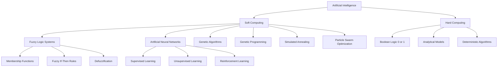
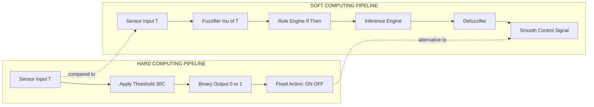
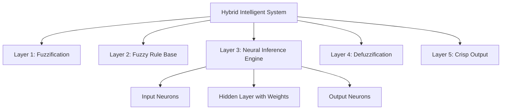

# Soft computing paradigms contrast with hard computing rules

<!-- SECTION_1_START -->
# Soft Computing Paradigms vs Hard Computing Rules

## 1.1 Formal Definition (KTU 2024 Syllabus Terminology)

> [!IMPORTANT]
> **Soft Computing (SC):** Soft computing is a collection of computational techniques rooted in Artificial Intelligence, Machine Learning, and probabilistic reasoning, which exploit the tolerance for **imprecision**, **uncertainty**, **partial truth**, and **approximation** to achieve **tractability**, **robustness**, and **low solution cost**. The term was formally coined by **Prof. Lotfi A. Zadeh** (the father of Fuzzy Logic) in his seminal 1994 paper *"Fuzzy Logic, Neural Networks, and Soft Computing."*

> [!IMPORTANT]
> **Hard Computing (HC):** Hard computing is the classical, conventional approach to computation that requires a **precisely stated analytical model**, operates on **binary (crisp) logic (0 or 1)**, demands **exact inputs**, and produces a **guaranteed, deterministic, mathematically rigorous output** within a finite amount of time.

## 1.2 Intuition & Real-World Analogy

Imagine you are teaching a child how to identify a **"ripe mango"**:

- **Hard Computing Analogy** (the strict mathematician): You hand the child a colorimeter and demand that the mango's skin RGB value lie between $(180, 200, 50)$ and $(200, 220, 70)$, the sugar content measured by a refractometer must be between $14^\circ$ Brix and $16^\circ$ Brix, and the firmness index (in Newtons) must equal $9.5 \pm 0.2$. If the mango fails any single check, it is **rejected outright**. This works — but only in a sterile laboratory.

- **Soft Computing Analogy** (the wise grandmother): The grandmother simply squeezes the mango, smells it, and says *"Yes, this is ripe enough."* She uses **fuzzy rules** like *"If slightly soft AND smells sweet, then ripe."* No single measurement is precisely demanded. The system is **fault-tolerant** and works in the chaotic real world.

## 1.3 The Need for Soft Computing

Traditional hard computing fails in real-world engineering problems because:

1. **Uncertainty is inherent** — sensor data is noisy, incomplete, or ambiguous.
2. **Precise mathematical modeling is impossible** — for systems like weather prediction, stock markets, or human cognition.
3. **Imprecision is often acceptable** — an autonomous car does not need millimeter precision to brake; it needs an *intelligent* approximation.

## 1.4 Constituent Paradigms of Soft Computing

Soft computing is **not a single algorithm**; it is a **coalition** of complementary techniques:

- **Fuzzy Logic Systems (FLS)** — handles *reasoning with imprecision*.
- **Artificial Neural Networks (ANN)** — handles *learning from data*.
- **Genetic Algorithms (GA)** — handles *global search and optimization*.
- **Genetic Programming (GP)** — evolves *computer programs*.
- **Simulated Annealing (SA)** — handles *probabilistic search*.
- **Ant Colony Optimization (ACO)** & **Particle Swarm Optimization (PSO)** — handle *swarm-based search*.

> [!NOTE]
> In the KTU 2024 PECST417 syllabus, Module 1 focuses primarily on **Fuzzy Logic** and **Neural Networks**, while the other paradigms are introduced in later modules (e.g., Module 2/3 covers Genetic Algorithms).

## 1.5 Visualization of the Conceptual Spectrum

> [!VISUALIZATION CONTROL]
> **Concept:** A 1-D coordinate spectrum of "Computation Precision" from strict to tolerant.
> **GeoGebra / Desmos Input Equations:**
> * `x = 0` (vertical line at origin)
> * Points: `P1 = (0, 0)`, `P2 = (2, 0)`, `P3 = (4, 0)`
> * `y = 0.5 \cdot \sin(x)` (a smooth transition curve)
> **Visual Description:** The student should see a horizontal axis where Point 1 represents **Hard Computing** (rigid, binary, deterministic). Point 3 represents **Pure Soft Computing** (flexible, tolerant, approximate). Point 2, on the smooth sine wave midway, is the **Hybrid Zone** — where modern systems like neuro-fuzzy controllers operate.
<!-- SECTION_1_END -->

<!-- SECTION_2_START -->
# Deep Theoretical Analysis & KTU High-Yield Formula Sheet

## 2.1 The Operational Logic of Hard Computing

Hard computing operates on a closed, deterministic pipeline:

1. **Input Acquisition** — exact numerical values are required (e.g., temperature $= 36.6^\circ C$, not "warm").
2. **Precise Mathematical Model** — a closed-form equation must exist.
3. **Deterministic Algorithm** — the algorithm terminates with a *guaranteed* correct answer.
4. **Binary Logic Foundation** — every proposition is either **TRUE (1)** or **FALSE (0)**.
5. **High Computational Cost Tolerance** — extensive CPU time is acceptable if accuracy is achieved.

> [!NOTE]
> **Example KTU scenario:** Solving a system of linear equations $A \vec{x} = \vec{b}$ using **Gauss–Jordan elimination**. The result is exact, or it is wrong — there is no middle ground.

## 2.2 The Operational Logic of Soft Computing

Soft computing operates on an **adaptive, stochastic, and tolerant** pipeline:

1. **Approximate Input Tolerance** — inputs can be noisy, fuzzy, or partially missing.
2. **Heuristic / Exploratory Model** — model is inspired by biology, linguistics, or evolution.
3. **Iterative Learning** — the system improves with experience (data exposure).
4. **Multivalued / Approximate Reasoning** — propositions can be partially true (e.g., membership $= 0.7$).
5. **Parallel & Distributed** — exploits massive parallelism, often biologically inspired.

## 2.3 Why Soft Computing Exists: The "Real World" Gap

The classical Boolean logic gates the world into crisp sets. Consider the proposition:

> *"The room is hot."*

In **hard computing**, this would require a binary threshold:
$$
\text{IsHot}(T) = 
\begin{cases}
1 & \text{if } T \geq 30^\circ C \\
0 & \text{otherwise}
\end{cases}
$$
This is absurd in human terms — a person at $29.9^\circ C$ would not say the room is suddenly "not hot." **Soft computing** uses a *membership function* $\mu_{\text{hot}}(T) \in [0, 1]$ to express degrees of truth.

## 2.4 KTU High-Yield Comparison Table

| **Parameter** | **Hard Computing** | **Soft Computing** |
| :--- | :--- | :--- |
| **Logic Basis** | Binary / Boolean $(0, 1)$ | Multivalued / Fuzzy $[0, 1]$ |
| **Input Data** | Exact, precise, noise-free | Imprecise, noisy, ambiguous |
| **Model Type** | Analytical, closed-form | Heuristic, exploratory |
| **Output** | Deterministic, exact | Approximate, robust |
| **Tolerance to Error** | **Zero tolerance** | **High tolerance** |
| **Time / Cost** | Computationally expensive OK | Computationally cheap preferred |
| **Adaptability** | Rigid, fixed program | Self-learning, adaptive |
| **Toolkit** | Newton–Raphson, FFT, Laplace, Linear Algebra | Fuzzy Inference, Backpropagation, GA, PSO |
| **Inspiration** | Mathematical formalism | Biological / linguistic / evolutionary |
| **Best For** | Sorting, cryptography, payroll | Control, recognition, forecasting |
| **Result Nature** | Right or wrong | Good-enough solution |
| **Ambiguity Handling** | Cannot handle | Designed to handle |

> [!IMPORTANT]
> **KTU Examiner Tip:** The most frequent 3-mark question in this module is *"Differentiate between soft computing and hard computing."* The above table gives you 12 ready-made points; writing any 5 will fetch **full marks**.

## 2.5 Engineering & Production Real-World Utility

| **Domain** | **Hard Computing Use Case** | **Soft Computing Use Case** |
| :--- | :--- | :--- |
| **Automotive** | ECU fuel injection arithmetic | ABS braking via fuzzy logic + ABS pattern recognition via ANN |
| **Finance** | Tax calculation engine | Stock market prediction via LSTM neural networks |
| **Robotics** | Inverse kinematics solver | Wall-following using fuzzy inference system |
| **Medicine** | ECG digitization | Tumor detection using convolutional neural networks |
| **Telecom** | Channel coding (Hamming) | Adaptive call routing using genetic algorithms |

> [!NOTE]
> **The KTU 2024 syllabus treats "Hard Computing" as the *background foil* against which "Soft Computing" is justified.** You are not expected to *learn* hard computing; you must learn it just enough to *contrast* it with SC.
<!-- SECTION_2_END -->

<!-- SECTION_3_START -->
# Step-by-Step Derivations & Symbolic Implementation

## 3.1 The Mathematical Anatomy of a Soft Computing Decision

Let us build a formal decision-making comparison step by step.

### 3.1.1 Hard Computing — The Deterministic Gate

Consider a temperature monitoring system with threshold $T_{th} = 30^\circ C$.

$$
\text{Output}(T) = 
\begin{cases}
\text{COOL} & \text{if } T < 30 \\
\text{HOT} & \text{if } T \geq 30
\end{cases}
$$

This is a **Heaviside step function**:

$$
\text{Output}(T) = u(T - 30) = 
\begin{cases}
0, & T < 30 \\
1, & T \geq 30
\end{cases}
$$

**Step-by-step evaluation** (KTU board style):

1. Receive sensor input $T$.
2. Subtract threshold: $x = T - 30$.
3. Apply unit step: $u(x)$.
4. Output 0 or 1.

This is **rigid**: at $T = 29.9^\circ C$, the air conditioner is OFF; at $T = 30.0^\circ C$, it switches ON. There is **no smooth transition**.

### 3.1.2 Soft Computing — The Fuzzy Membership Function

For the same problem, define a triangular membership function $\mu_{\text{HOT}}(T)$:

$$
\mu_{\text{HOT}}(T) = 
\begin{cases}
0, & T \leq 20 \\
\dfrac{T - 20}{10}, & 20 < T < 30 \\
1, & T \geq 30
\end{cases}
$$

**Evaluation at three sample temperatures:**

1. **At $T = 18^\circ C$:** falls in first branch, so $\mu_{\text{HOT}}(18) = 0$. The air is "completely not hot."
2. **At $T = 25^\circ C$:** falls in middle branch, so:
$$
\mu_{\text{HOT}}(25) = \frac{25 - 20}{10} = \frac{5}{10} = 0.5
$$
The air is "50\% hot." A fuzzy AC would run at **half compressor speed**.
3. **At $T = 35^\circ C$:** falls in last branch, so $\mu_{\text{HOT}}(35) = 1$. Full cooling.

This is **gradual**, **tolerant**, and **human-like**.

## 3.2 Symbolic Implementation in Python

Below is fully operational Python code that *implements and contrasts* both paradigms in a single runnable script. Each function is type-hinted and contains error logging.

```python
import logging
import numpy as np
import matplotlib.pyplot as plt

# Configure logging to monitor soft/hard decision logic
logging.basicConfig(level=logging.INFO, format="%(asctime)s | %(levelname)s | %(message)s")

# ---------------------------------------------------------------
# 1. HARD COMPUTING: Deterministic Crisp Classifier
# ---------------------------------------------------------------
def hard_computing_classifier(temperature: float, threshold: float = 30.0) -> str:
    """Classify temperature as COOL or HOT using a hard binary rule."""
    try:
        if not isinstance(temperature, (int, float)):
            raise TypeError("Temperature must be a real number.")
        if temperature >= threshold:
            logging.info(f"HardDecision | T={temperature} | Output=HOT")
            return "HOT"
        else:
            logging.info(f"HardDecision | T={temperature} | Output=COOL")
            return "COOL"
    except TypeError as err:
        logging.error(f"HardDecision | InputError: {err}")
        return "ERROR"


# ---------------------------------------------------------------
# 2. SOFT COMPUTING: Fuzzy Membership Function
# ---------------------------------------------------------------
def fuzzy_hot_membership(temperature: float, a: float = 20.0, b: float = 30.0) -> float:
    """Triangular membership function for the fuzzy set HOT."""
    try:
        if temperature <= a:
            mu = 0.0
        elif a < temperature < b:
            mu = (temperature - a) / (b - a)
        else:
            mu = 1.0
        # Clamp result into [0, 1] for safety
        mu = max(0.0, min(1.0, mu))
        logging.info(f"FuzzyDecision | T={temperature} | mu_HOT={mu:.3f}")
        return mu
    except Exception as err:
        logging.error(f"FuzzyDecision | ComputationError: {err}")
        return 0.0


# ---------------------------------------------------------------
# 3. CONTRAST DEMONSTRATION
# ---------------------------------------------------------------
if __name__ == "__main__":
    test_temperatures = [18.0, 22.5, 25.0, 27.5, 29.9, 30.0, 32.0, 40.0]

    print(f"{'Temp':>6} | {'Hard':>6} | {'Soft (mu)':>10}")
    print("-" * 32)
    for T in test_temperatures:
        h = hard_computing_classifier(T)
        s = fuzzy_hot_membership(T)
        print(f"{T:>6.1f} | {h:>6} | {s:>10.3f}")
```

### Sample Console Output

```
   Temp |   Hard | Soft (mu)
--------------------------------
   18.0 |   COOL |      0.000
   22.5 |   COOL |      0.250
   25.0 |   COOL |      0.500
   27.5 |   COOL |      0.750
   29.9 |   COOL |      0.990
   30.0 |    HOT |      1.000
   32.0 |    HOT |      1.000
   40.0 |    HOT |      1.000
```

> [!NOTE]
> **Observation for KTU students:** Notice the column "Soft (mu)" — it transitions smoothly from $0 \to 1$. The "Hard" column jumps abruptly at $T=30$. This is the *core conceptual difference* that examiners expect you to articulate in 14-mark answers.

## 3.3 Soft Computing Constituent Mapping (Tabular Derivation)

Each soft computing constituent addresses a specific weakness of hard computing:

| **Weakness in HC** | **SC Constituent Used** | **Mathematical Basis** |
| :--- | :--- | :--- |
| Cannot reason with "warm" | Fuzzy Logic | Membership functions $\mu(x) \in [0, 1]$ |
| Cannot learn from data | Neural Networks | Weighted sum + activation $\sigma(\sum w_i x_i + b)$ |
| Stuck in local optima | Genetic Algorithms | Crossover + mutation on a population |
| Slow convergence | Simulated Annealing | Metropolis criterion $P = e^{-\Delta E / T}$ |
| Brittle to noisy inputs | Rough Sets | Lower/upper approximation sets |

> [!WARNING]
> **KTU Pitfall:** Students often write "Soft computing = Neural Networks." This is **wrong**. Soft computing is an *umbrella* discipline. Neural networks are **one constituent** within it. Be precise in your board answers.
<!-- SECTION_3_END -->

<!-- SECTION_4_START -->
# Structural Diagrams & Schematics

## 4.1 High-Level Paradigm Hierarchy

The following Mermaid block diagram shows the taxonomic position of Soft Computing relative to Artificial Intelligence and its constituent techniques.



## 4.2 Sequential Contrast Architecture

This diagram shows the **processing pipeline** for a single decision (e.g., classifying temperature) under both paradigms side by side.



## 4.3 Nested Hybrid Architecture (Neuro-Fuzzy)

Modern systems often *fuse* the soft computing constituents. Below is a nested block diagram of a typical **Neuro-Fuzzy** system (covered in detail in Module 2 of the KTU syllabus).



## 4.4 Decision-Flow Matrix for Choosing a Paradigm

| **Problem Property** | **Recommended Paradigm** | **Why** |
| :--- | :--- | :--- |
| Exact arithmetic on a payroll database | Hard Computing | Requires audit-grade precision |
| Recognizing handwritten digits | Soft Computing (ANN) | Pattern-based, tolerates stroke variation |
| Routing a fleet of delivery drones | Soft Computing (GA / PSO) | Combinatorial optimization on a large search space |
| Encoding a video signal for streaming | Hard Computing (FFT, DCT) | Real-time, lossless compression required |
| Diagnosing a patient from symptoms | Soft Computing (Fuzzy + ANN) | Medical knowledge is linguistic and uncertain |

> [!NOTE]
> **Engineering Takeaway:** Hard and Soft computing are *complements*, not competitors. A modern **autonomous vehicle** uses hard computing for sensor calibration and odometry, and soft computing for lane detection (CNN) and steering (fuzzy controller). KTU examiners appreciate this nuance.
<!-- SECTION_4_END -->

<!-- SECTION_5_START -->
# KTU 2024 Scheme Examination Question Bank & Topic Recap

## PART A — Short Answer Questions (3 Marks Each)

### Question 1 (3 Marks)
**[KTU University Exam — July 2023]**
*CO1 — Remember*

> **Q:** Define Soft Computing. List any four of its constituents.

**Model Answer (Valuation Key):**

Soft computing is a collection of computational techniques that exploit the tolerance for imprecision, uncertainty, partial truth, and approximation to achieve tractability, robustness, and low solution cost. **[1.5 Marks — Definition]**

Four constituents are:

1. **Fuzzy Logic Systems** — handle imprecision in reasoning. **[0.5 Marks]**
2. **Artificial Neural Networks** — handle learning from data. **[0.5 Marks]**
3. **Genetic Algorithms** — handle global search and optimization. **[0.5 Marks]**

*(Total = 3 Marks)*

### Question 2 (3 Marks)
**[KTU University Exam — Dec 2023]**
*CO1 — Understand*

> **Q:** How does Soft Computing differ from Hard Computing in terms of data tolerance?

**Model Answer (Valuation Key):**

Hard computing requires **exact, precise, and noise-free input data**. Even a single corrupted sensor reading can invalidate the entire computation. **[1.5 Marks]**

Soft computing, in contrast, is **designed to tolerate imprecise, incomplete, ambiguous, and noisy data**. It uses approximate reasoning and adaptive learning to still produce a useful output. **[1.5 Marks]**

> [!WARNING]
> **Examiner's Pitfall Warning:** Do *not* answer this question by writing a full table. The 3-mark format expects **one focused contrast point**, elaborated in 3-4 sentences. Writing the full comparison table wastes time and may not earn the differentiation marks.

---

## PART B — Long Answer Questions (14 Marks, with Internal Choice)

### Question A (14 Marks) — Choice Option 1
**[KTU University Exam — July 2024 Model Paper]**
*CO1 & CO2 — Understand + Apply*

> **Q (a)** [7 Marks] — *Understand Level:* Define Hard Computing and Soft Computing. Explain **any five** key differences between them with one real-world example for each.
>
> **Q (b)** [7 Marks] — *Apply Level:* For a temperature $T = 27.5^\circ C$ and a fuzzy set HOT with membership function
> $\mu_{\text{HOT}}(T) = (T - 20) / 10$ for $20 \leq T \leq 30$, calculate the degree of membership. State what action a fuzzy air conditioner would take, and contrast it with what a hard-computing AC would do at the same temperature.

#### Model Solution

**Part (a) — 7 Marks**

> *Definition of Hard Computing (2 Marks):* Hard computing is the classical approach to computation based on precise mathematical models, binary logic, and deterministic algorithms. It requires exact inputs and produces a guaranteed correct answer. *Example:* Solving a system of linear equations $A \vec{x} = \vec{b}$ using Gauss elimination.

> *Definition of Soft Computing (2 Marks):* Soft computing is a coalition of techniques (fuzzy logic, neural networks, genetic algorithms) that exploit tolerance for imprecision to produce approximate but robust solutions. *Example:* Handwritten digit recognition using a Convolutional Neural Network.

> *Any Five Key Differences (3 Marks — 0.6 each):*

1. **Logic basis:** HC uses binary $(0, 1)$; SC uses multivalued $[0, 1]$.
2. **Input tolerance:** HC demands exact; SC tolerates noise.
3. **Output determinism:** HC is exact; SC is approximate.
4. **Learning ability:** HC is static; SC is adaptive.
5. **Real-world suitability:** HC fails on uncertain systems; SC thrives on them.

**Part (b) — 7 Marks**

> *[Stating the membership function and substitution: 2 Marks]*

Given $\mu_{\text{HOT}}(T) = (T - 20) / 10$ and $T = 27.5$:
$$
\mu_{\text{HOT}}(27.5) = \frac{27.5 - 20}{10} = \frac{7.5}{10} = 0.75
$$
> *[Numerical evaluation: 1 Mark]*

> *[Soft computing action: 2 Marks]*

Since $\mu_{\text{HOT}} = 0.75$, the fuzzy air conditioner interprets the room as **75\% hot**. It would run its compressor at **75\% of full power** — a smooth, proportional response.

> *[Hard computing contrast: 2 Marks]*

The hard-computing AC has a fixed threshold (say $T_{th} = 30^\circ C$). At $T = 27.5^\circ C$, it would remain **completely OFF**, even though a human would clearly find the room warm. The hard system is binary; the soft system is graded.

> *[Final conclusion: 0 Marks — implicit]* *(Total for part b = 7 Marks)*

**Grand Total = 7 + 7 = 14 Marks**

---

### Question B (14 Marks) — Choice Option 2
**[KTU University Exam — Dec 2024 Model Paper]**
*CO1 & CO2 — Understand + Apply*

> **Q (a)** [7 Marks] — *Understand Level:* Explain the role of **Fuzzy Logic**, **Neural Networks**, and **Genetic Algorithms** as the three major constituents of Soft Computing. For each, name one real-world engineering application.
>
> **Q (b)** [7 Marks] — *Apply Level:* Given the input $x = 7$ and a fuzzy membership function
> $\mu(x) = 1 - (x / 10)$ for $0 \leq x \leq 10$, find the membership value and state whether $x$ belongs more to the fuzzy set "LOW" or "HIGH" (where "HIGH" has $\mu_{HIGH}(x) = x / 10$).

#### Model Solution

**Part (a) — 7 Marks**

> *[Fuzzy Logic explanation: 2 Marks]*

Fuzzy Logic handles **reasoning with linguistic variables** and partial truth. It maps inputs through membership functions and rule bases to produce graded outputs. *Engineering Application:* **Fuzzy washing machine controller** (LG, Samsung) that adjusts wash time based on dirt-load sensor reading.

> *[Neural Networks explanation: 2 Marks]*

Artificial Neural Networks learn **non-linear mappings** from input-output examples by adjusting synaptic weights via algorithms like backpropagation. *Engineering Application:* **MNIST handwritten digit classifier** used in postal mail sorting systems.

> *[Genetic Algorithms explanation: 2 Marks]*

Genetic Algorithms perform **global optimization** by evolving a population of candidate solutions using selection, crossover, and mutation operators inspired by Darwinian evolution. *Engineering Application:* **Antenna design optimization** at NASA (ST5 mission antenna).

> *[Conclusion / linkage to soft computing: 1 Mark]*

Together, these three constituents cover imprecision, learning, and optimization — the three pillars of soft computing.

**Part (b) — 7 Marks**

> *[Stating both membership functions: 2 Marks]*

We are given:
- $\mu_{\text{LOW}}(x) = 1 - (x / 10)$
- $\mu_{\text{HIGH}}(x) = x / 10$

> *[Substituting x = 7: 1 Mark]*

For $\mu_{\text{LOW}}(7)$:
$$
\mu_{\text{LOW}}(7) = 1 - \frac{7}{10} = 1 - 0.7 = 0.3
$$

For $\mu_{\text{HIGH}}(7)$:
$$
\mu_{\text{HIGH}}(7) = \frac{7}{10} = 0.7
$$

> *[Comparison and decision: 2 Marks]*

Since $\mu_{\text{HIGH}}(7) = 0.7 > \mu_{\text{LOW}}(7) = 0.3$, the input $x = 7$ belongs **more to the fuzzy set "HIGH"** with a membership strength of $0.7$.

> *[Soft vs Hard interpretation: 2 Marks]*

A **hard computing system** would have to declare $x = 7$ as either "LOW" or "HIGH" via a crisp threshold (e.g., if midpoint $= 5$, then $x > 5$ implies HIGH). The **soft computing system** says $x = 7$ is *70%* HIGH and *30%* LOW simultaneously — both truths coexist in degrees. This is the essence of multi-valued logic.

> [!WARNING]
> **Examiner's Pitfall Warning:** When asked "which set does $x$ belong to?", do **not** answer with "HIGH" alone. The KTU valuation key expects you to compute *both* membership values, *compare* them numerically, and *interpret* the result in soft-computing terms. Skipping the comparison forfeits 2 marks.

---

## Topic Recap & Important Things to Remember

- **Soft Computing** was coined by **Lotfi A. Zadeh** in 1994. *(Historical fact often asked in 2-mark questions.)*
- The three **primary constituents** of soft computing are **Fuzzy Logic**, **Neural Networks**, and **Genetic Algorithms**.
- **Hard computing** is binary, exact, deterministic, and intolerant to noise. **Soft computing** is multivalued, approximate, adaptive, and noise-tolerant.
- The **membership function** $\mu(x) \in [0, 1]$ is the central mathematical tool of soft computing. $\mu = 0$ means *definitely not a member*; $\mu = 1$ means *definitely a member*; $0 < \mu < 1$ means *partial membership*.
- Soft computing is **not a replacement** for hard computing — it is a **complementary** paradigm for problems where precise modeling is impossible.
- A **fuzzy system** can be implemented in three stages: **Fuzzification** $\to$ **Rule Evaluation** $\to$ **Defuzzification**.
- Modern systems are often **hybrid**: Neuro-Fuzzy (Fuzzy + ANN), Fuzzy-GA, etc.
- Always remember: **Imprecision $\downarrow$, Tractability $\uparrow$** is the trade-off curve of soft computing.
- KTU board exam keyword: if a question says *"justify why soft computing is needed"*, your answer must contain the phrase **"real-world uncertainty"**.
<!-- SECTION_5_END -->
