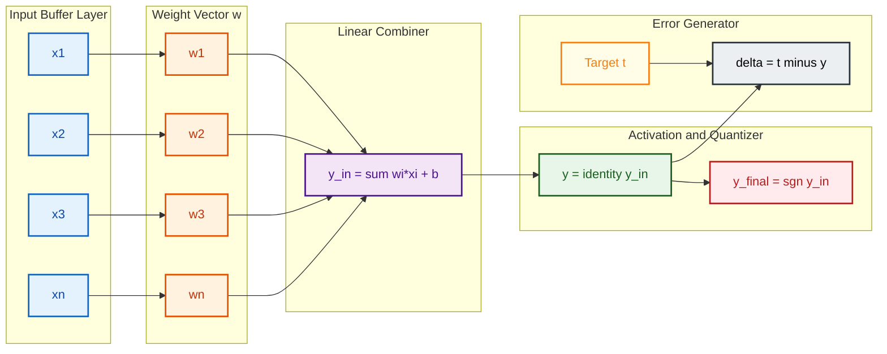
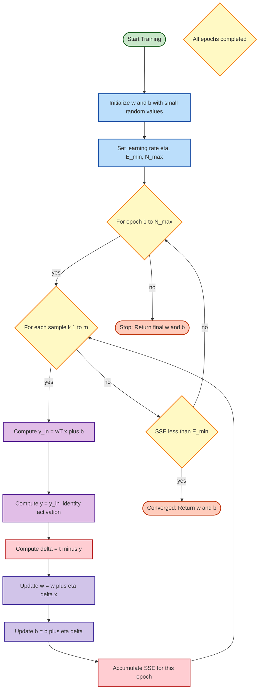

# Adaptive Linear Neuron– Architecture, Training and testing algorithm.

<!-- SECTION_1_START -->

# Adaptive Linear Neuron (Adaline) — Architecture, Training and Testing Algorithm

## 1.1 Core Technical Definition

> [!IMPORTANT]
> **Adaptive Linear Neuron (Adaline)** is a single-layer, continuous-activation artificial neural network architecture developed by **Bernard Widrow** and **Marcian (Ted) Hoff** in **1960** at Stanford University. The name *Adaline* is an acronym derived from **ADAptive LInear NEuron**.

Formally, Adaline is a linear threshold unit in which the **activation function used during the training (learning) phase is the identity (purely linear) function** rather than a hard-limiting signum or bipolar step function. The *quantizer* (hard-limiter) is applied **only at the output stage** to produce the final class label, while the **error correction (weight update) rule operates on the net linear input — not on the quantized output**. This subtle distinction is what separates Adaline from the classical McCulloch–Pitts perceptron.

The Adaline model is governed by the **Widrow–Hoff Delta Rule** (also called the **Least Mean Squares (LMS) Rule** or **Delta Learning Rule**), which minimizes the **Mean Squared Error (MSE)** between the *desired response* and the *actual linear output* of the neuron.

---

## 1.2 Intuitive Overview — A Real-World Analogy

> [!NOTE]
> **Conceptual Analogy — The "Smart Volume Knob"**

Imagine you are sitting in a noisy room and want to hear a particular speaker clearly. You have **three volume knobs**, each controlling a different microphone. Your brain must figure out how to turn the three knobs so that when their contributions are summed, the speaker's voice is amplified and the noise is suppressed.

- The **microphones** are the **inputs** $x_1, x_2, \dots, x_n$.
- The **volume knobs** are the **weights** $w_1, w_2, \dots, w_n$.
- The **combined loudness** reaching your ear is the **net input** $y_{in} = \sum w_i x_i$.
- The **actual perceived loudness** (the linear output $y$) is what your brain objectively measures against the desired loudness (the target $t$).
- Your brain **minimizes the squared difference** between perceived and desired loudness by nudging the knobs — this is the **LMS learning rule**.

The key insight: Adaline *learns from the linear output*, not from the final thresholded decision. This allows **finer error correction** and is the foundation of modern backpropagation.

---

## 1.3 Key Standard Metrics & Constants

| Parameter | Standard Symbol | Value / Description |
|---|---|---|
| Learning rate | $\eta$ (eta) | A small positive constant, typically $0 < \eta < 1$ |
| Bias input | $x_0$ | Fixed at **+1** |
| Bias weight | $b$ or $w_0$ | Adjusted like any other weight |
| Number of epochs | $N$ | Number of complete passes through the training data |
| Convergence threshold | $E_{min}$ | Minimum acceptable MSE (e.g., $0.01$ to $0.001$) |
| Tolerance on error | $\epsilon$ | Per-iteration error goal |
| Convergence factor | $2\eta$ | Critical parameter in LMS stability |

> [!TIP]
> **KTU Syllabus Highlight:** The 2024 PECST417 syllabus explicitly distinguishes Adaline from the **Perceptron** in three ways:
> 1. **Activation function during training** is linear (identity), not bipolar.
> 2. **Error signal** is computed using the linear net input, not the binary output.
> 3. **Convergence** depends on the choice of $\eta$ and is **faster** than the perceptron rule for linearly separable problems.

---

## 1.4 Visualization Control

> [!VISUALIZATION CONTROL]
> **Concept:** Adaline Decision Boundary on 2-D Input Space
> **GeoGebra / Desmos Input Equations:**
> * `f(x, y) = w1*x + w2*y + b`
> * Sample boundary: `0.5*x + 0.3*y - 0.2 = 0`
> * Sample points: `P1=(0.2, 0.5)`, `P2=(0.7, 0.2)`, `P3=(0.3, 0.8)`
> **Visual Description:** Students should observe a **straight line (hyperplane)** separating two classes. During training, this line **rotates and translates** to minimize the sum of squared distances from the misclassified (or low-error) points — unlike the perceptron, where the line jumps abruptly to correct each error.

<!-- SECTION_1_END -->

<!-- SECTION_2_START -->

# 2. Deep Theoretical Analysis & KTU High-Yield Formula Sheet

## 2.1 Architectural Blueprint of Adaline

The Adaline architecture is a **single-layer feed-forward network** with the following structural elements:

1. **Input Layer (Buffer Layer):** Accepts an $n$-dimensional feature vector $\mathbf{x} = (x_1, x_2, \dots, x_n)^T$. A bias term $x_0 = +1$ is appended for affine separability.
2. **Weight Vector:** A column vector $\mathbf{w} = (w_1, w_2, \dots, w_n)^T$, initialized to small random values (often zero in textbook examples).
3. **Bias Weight:** $b = w_0$, multiplies the constant input $x_0 = 1$.
4. **Linear Combiner (Summer):** Computes the scalar net input:
   $$y_{in} = \sum_{i=1}^{n} w_i x_i + b = \mathbf{w}^T \mathbf{x} + b$$
5. **Activation Function (during training):** Identity function $f(y_{in}) = y_{in} = y$. The output is purely linear.
6. **Quantizer (output stage):** A bipolar (or unipolar) hard-limiter used only for **decision-making**, not for learning:
   $$y_{final} = \begin{cases} +1 & \text{if } y \geq 0 \\ -1 & \text{if } y < 0 \end{cases}$$
7. **Comparator / Error Generator:** Computes the difference between the **target** $t$ and the **linear output** $y$ (not $y_{final}$).

---

## 2.2 The LMS (Widrow–Hoff Delta) Learning Rule

The **objective** of Adaline training is to find the weight vector $\mathbf{w}$ that minimizes the **instantaneous squared error** summed over the entire training set:

$$E = \frac{1}{2} \sum_{k=1}^{m} (t_k - y_k)^2$$

where:
- $m$ = number of training samples
- $t_k$ = target (desired) output for sample $k$
- $y_k$ = actual linear output for sample $k$

Taking the gradient of $E$ with respect to each weight $w_i$ and applying gradient descent yields the **delta (error-correction) rule**:

$$\Delta w_i = \eta \cdot (t - y) \cdot x_i$$

$$\boxed{\;w_i(\text{new}) = w_i(\text{old}) + \eta \cdot (t - y) \cdot x_i\;}$$

Similarly, for the bias:
$$b(\text{new}) = b(\text{old}) + \eta \cdot (t - y)$$

The factor $(t - y)$ is called the **delta** (or error signal $\delta$), computed **before quantization**.

> [!NOTE]
> **Why the factor 1/2 in E?**
> The $\frac{1}{2}$ is a mathematical convenience — when the gradient $\frac{\partial E}{\partial w_i}$ is taken, the $2$ from the chain rule cancels it, yielding a clean expression. It has **no effect** on the location of the minimum.

---

## 2.3 KTU Formula Sheet / Cheat Sheet

| # | Formula / Expression | Description | Use Case |
|---|---|---|---|
| 1 | $y_{in} = \sum_{i=1}^{n} w_i x_i + b$ | Net linear input (weighted sum) | Forward pass |
| 2 | $y = f(y_{in}) = y_{in}$ | Identity activation during training | Linear output |
| 3 | $y_{final} = \text{sgn}(y_{in})$ | Bipolar quantization at output | Decision making |
| 4 | $\delta = t - y$ | Error signal (linear, not quantized) | Backward pass |
| 5 | $\Delta w_i = \eta \cdot \delta \cdot x_i$ | Weight correction | LMS update |
| 6 | $w_i^{new} = w_i^{old} + \Delta w_i$ | Weight update rule | Per-iteration |
| 7 | $b^{new} = b^{old} + \eta \cdot \delta$ | Bias update | Per-iteration |
| 8 | $E = \frac{1}{2} \sum_{k=1}^{m} (t_k - y_k)^2$ | Summed squared error (SSE) | Convergence check |
| 9 | $MSE = \frac{1}{m} \sum_{k=1}^{m} (t_k - y_k)^2$ | Mean squared error | Convergence check |
| 10 | $y = \mathbf{w}^T \mathbf{x} + b$ | Vector form of net input | Compact notation |
| 11 | $0 < \eta < 1$ | Stability condition for LMS | Hyperparameter |
| 12 | $w_{opt} = R^{-1} \mathbf{P}$ | Wiener solution (closed-form, off-line) | Reference optimum |

Where $\mathbf{R}$ is the autocorrelation matrix of inputs and $\mathbf{P}$ is the cross-correlation vector between inputs and targets.

---

## 2.4 Real-World Engineering Utility

| Field | Application of Adaline / LMS |
|---|---|
| **Telecommunications** | Adaptive echo cancellers, channel equalization, noise cancellation in modems |
| **Signal Processing** | Adaptive line enhancers, adaptive filters for ECG/EEG denoising |
| **Control Systems** | Adaptive control of unknown plants, model reference adaptive control (MRAC) |
| **Antenna Arrays** | Adaptive beamforming (smart antennas) — Widrow's original motivation |
| **Speech Processing** | Adaptive noise cancellation in hearing aids and headsets |
| **Finance** | Adaptive time-series prediction (early precursors to recurrent networks) |
| **Image Processing** | Adaptive filtering for image restoration, edge enhancement |

> [!TIP]
> The **LMS algorithm** is so foundational that it remains a benchmark in adaptive filter theory — every digital signal processing (DSP) textbook dedicates an entire chapter to it, and KTU's **Digital Signal Processing** course (EC303) references it directly.

<!-- SECTION_2_END -->

<!-- SECTION_3_START -->

# 3. Step-by-Step Derivations, Training & Testing Algorithm

## 3.1 Mathematical Derivation of the LMS Rule (Gradient Descent)

**Step 1 — Define the instantaneous squared error for a single training sample $(x, t)$:**

$$E_k = \frac{1}{2}(t_k - y_k)^2$$

where $y_k = \sum_{i=1}^{n} w_i x_{i,k} + b$.

**Step 2 — Compute the partial derivative of $E_k$ with respect to weight $w_i$:**

Using the chain rule:
$$\frac{\partial E_k}{\partial w_i} = \frac{\partial}{\partial w_i} \left[ \frac{1}{2}(t_k - y_k)^2 \right]$$

$$= (t_k - y_k) \cdot \frac{\partial}{\partial w_i}(t_k - y_k)$$

Since $t_k$ is independent of $w_i$:

$$= (t_k - y_k) \cdot \left(-\frac{\partial y_k}{\partial w_i}\right)$$

**Step 3 — Differentiate the linear output $y_k$ with respect to $w_i$:**

$$y_k = w_1 x_{1,k} + w_2 x_{2,k} + \dots + w_i x_{i,k} + \dots + w_n x_{n,k} + b$$

$$\frac{\partial y_k}{\partial w_i} = x_{i,k}$$

**Step 4 — Substitute back:**

$$\frac{\partial E_k}{\partial w_i} = -(t_k - y_k) \cdot x_{i,k} = -\delta_k \cdot x_{i,k}$$

**Step 5 — Apply the gradient-descent weight update:**

$$w_i^{new} = w_i^{old} - \eta \cdot \frac{\partial E_k}{\partial w_i}$$

$$w_i^{new} = w_i^{old} - \eta \cdot (-\delta_k \cdot x_{i,k})$$

$$\boxed{\;w_i^{new} = w_i^{old} + \eta \cdot \delta_k \cdot x_{i,k} = w_i^{old} + \eta \cdot (t_k - y_k) \cdot x_{i,k}\;}$$

**Step 6 — For the bias**, the same derivation with $x_0 = 1$ yields:

$$b^{new} = b^{old} + \eta \cdot (t_k - y_k)$$

**Step 7 — Convergence criterion:**

The algorithm terminates when **either** the error $E$ falls below a threshold $E_{min}$ **or** the maximum number of epochs $N_{max}$ is reached.

---

## 3.2 The Adaline Training Algorithm (Pseudocode + Python)

### 3.2.1 Pseudocode (Batch-Style, Per-Epoch Update)

```
ALGORITHM: Adaline_Train(X, t, eta, E_min, N_max)
INPUT : X (m x n) feature matrix, t (m x 1) target vector,
        eta (learning rate), E_min (error threshold), N_max (max epochs)
OUTPUT: w (n x 1) final weight vector, b (scalar) final bias

1. INITIALIZE w ← [0, 0, ..., 0]^T  ;  b ← 0
2. FOR epoch = 1 TO N_max DO
3.     E ← 0                                          // total SSE
4.     FOR k = 1 TO m DO
5.         y_in ← (w^T * X[k]) + b                   // net input
6.         y    ← y_in                                // identity activation
7.         err  ← t[k] - y                            // error signal δ
8.         E    ← E + (err^2) / 2                     // accumulate SSE
9.         w    ← w + eta * err * X[k]^T              // weight update
10.        b    ← b + eta * err                       // bias update
11.    END FOR
12.    IF E ≤ E_min THEN
13.        PRINT "Converged at epoch ", epoch
14.        RETURN (w, b)
15.    END IF
16. END FOR
17. PRINT "Reached maximum epochs without full convergence"
18. RETURN (w, b)
```

### 3.2.2 Fully Operational Python Implementation

```python
import numpy as np
from typing import Tuple, List

def adaline_train(
    X: np.ndarray,
    t: np.ndarray,
    eta: float = 0.01,
    E_min: float = 0.01,
    N_max: int = 1000,
    random_state: int = 42
) -> Tuple[np.ndarray, float, List[float]]:
    """
    Trains an Adaptive Linear Neuron (Adaline) using the LMS (Widrow-Hoff) rule.

    Parameters
    ----------
    X : np.ndarray of shape (m, n)
        Training feature matrix (one sample per row).
    t : np.ndarray of shape (m,)
        Target vector (continuous real-valued, not binarized).
    eta : float
        Learning rate (must satisfy 0 < eta < 1 for stability).
    E_min : float
        Convergence threshold on the Sum of Squared Errors (SSE).
    N_max : int
        Maximum number of training epochs.
    random_state : int
        Seed for reproducible weight initialization.

    Returns
    -------
    w : np.ndarray of shape (n,)
        Final learned weight vector.
    b : float
        Final learned bias.
    error_history : List[float]
        SSE recorded at the end of every epoch.
    """
    if not (0.0 < eta < 1.0):
        raise ValueError(f"Learning rate eta must satisfy 0 < eta < 1, got {eta}.")
    if E_min <= 0:
        raise ValueError(f"Convergence threshold E_min must be positive, got {E_min}.")
    if N_max <= 0:
        raise ValueError(f"Maximum epochs N_max must be positive, got {N_max}.")

    rng = np.random.default_rng(random_state)
    m, n = X.shape
    w = rng.uniform(-0.5, 0.5, size=n)   # small random init, not exactly zero
    b = 0.0
    error_history: List[float] = []

    for epoch in range(1, N_max + 1):
        sse = 0.0
        for k in range(m):
            # ----- FORWARD PASS -----
            y_in = np.dot(w, X[k]) + b           # net linear input
            y    = y_in                          # identity activation
            err  = t[k] - y                      # error signal δ = t - y

            # ----- BACKWARD PASS (weight update) -----
            w = w + eta * err * X[k]
            b = b + eta * err

            # ----- ACCUMULATE SQUARED ERROR -----
            sse += 0.5 * (err ** 2)

        error_history.append(sse)

        # ----- CONVERGENCE CHECK -----
        if sse <= E_min:
            print(f"[Converged] Epoch {epoch:4d} | SSE = {sse:.6f} ≤ E_min = {E_min}")
            return w, b, error_history

    print(f"[Stopped]   Epoch {N_max:4d} | SSE = {sse:.6f} > E_min = {E_min}")
    return w, b, error_history


def adaline_predict(
    X: np.ndarray,
    w: np.ndarray,
    b: float,
    threshold: float = 0.0
) -> np.ndarray:
    """
    Predicts bipolar class labels {-1, +1} for a given test matrix X
    using the trained Adaline parameters.
    """
    y_in = np.dot(X, w) + b
    return np.where(y_in >= threshold, 1, -1)
```

### 3.2.3 Worked Numerical Example (Hand-Computable for KTU)

**Problem:** Train Adaline on the following 1-D dataset with $\eta = 0.5$ for **one full epoch** starting from $w = 0$, $b = 0$.

| Sample ($k$) | $x_1$ | Target $t$ |
|---|---|---|
| 1 | 1.0 | 1 |
| 2 | 0.5 | -1 |
| 3 | -1.0 | -1 |

**Solution Trace:**

**Sample 1:** $x_1 = 1.0$, $t = 1$
- $y_{in} = (0)(1.0) + 0 = 0$
- $y = 0$
- $\delta = 1 - 0 = 1$
- $w^{new} = 0 + 0.5 \cdot 1 \cdot 1.0 = 0.5$
- $b^{new} = 0 + 0.5 \cdot 1 = 0.5$

**Sample 2:** $x_1 = 0.5$, $t = -1$
- $y_{in} = (0.5)(0.5) + 0.5 = 0.25 + 0.5 = 0.75$
- $y = 0.75$
- $\delta = -1 - 0.75 = -1.75$
- $w^{new} = 0.5 + 0.5 \cdot (-1.75) \cdot 0.5 = 0.5 - 0.4375 = 0.0625$
- $b^{new} = 0.5 + 0.5 \cdot (-1.75) = 0.5 - 0.875 = -0.375$

**Sample 3:** $x_1 = -1.0$, $t = -1$
- $y_{in} = (0.0625)(-1.0) + (-0.375) = -0.0625 - 0.375 = -0.4375$
- $y = -0.4375$
- $\delta = -1 - (-0.4375) = -0.5625$
- $w^{new} = 0.0625 + 0.5 \cdot (-0.5625) \cdot (-1.0) = 0.0625 + 0.28125 = 0.34375$
- $b^{new} = -0.375 + 0.5 \cdot (-0.5625) = -0.375 - 0.28125 = -0.65625$

**End of Epoch 1:** $w = 0.34375$, $b = -0.65625$

**Summed Squared Error for this epoch:**

$$E = \frac{1}{2}\left[(1-0)^2 + (-1-0.75)^2 + (-1-(-0.4375))^2\right]$$

$$E = \frac{1}{2}\left[1 + 3.0625 + 0.31640625\right] = \frac{1}{2}(4.37890625)$$

$$\boxed{\;E = 2.18945\;}$$

---

## 3.3 The Adaline Testing Algorithm

```
ALGORITHM: Adaline_Test(X_test, w, b, t_test)
INPUT : X_test (m_test x n), w (n x 1), b (scalar), t_test (m_test x 1)
OUTPUT: accuracy, confusion matrix, predicted labels

1. correct ← 0
2. FOR k = 1 TO m_test DO
3.     y_in     ← (w^T * X_test[k]) + b
4.     y_final  ← sgn(y_in)              // bipolar quantizer
5.     IF y_final == t_test[k] THEN
6.         correct ← correct + 1
7.     END IF
8. END FOR
9. accuracy ← (correct / m_test) * 100
10. RETURN accuracy
```

> [!IMPORTANT]
> **Critical Distinction:** During **training**, the linear output $y$ is used for the error signal. During **testing/deployment**, the quantized output $y_{final} = \text{sgn}(y_{in})$ is used to produce the class decision. Forgetting this distinction is the **#1 mistake** in KTU answer sheets.

---

## 3.4 Comparison Table: Adaline vs. Perceptron (High-Yield KTU Comparison)

| Feature | Perceptron | Adaline |
|---|---|---|
| Year / Inventor | 1958, Rosenblatt | 1960, Widrow \& Hoff |
| Activation (training) | Bipolar step | **Identity (linear)** |
| Error signal | $t - y_{final}$ | $t - y_{linear}$ |
| Quantization during training | **Yes** | **No** |
| Convergence guarantee | Only if linearly separable | Yes, for suitable $\eta$ |
| Learning rule | Perceptron rule | **LMS / Delta rule** |
| Speed of convergence | Slow (oscillates near boundary) | Fast (uses error magnitude) |
| Objective | Minimize misclassifications | Minimize **MSE** |
| Extension | Madaline (multiple Adalines) | Foundation of backpropagation |

<!-- SECTION_3_END -->

<!-- SECTION_4_START -->

# 4. Structural Diagrams & Schematics

## 4.1 Mermaid Diagram — Adaline Architecture



## 4.2 Mermaid Diagram — Adaline Training Flow (LMS Algorithm)



## 4.3 Block-Level Functional Architecture

| Block | Function | Inputs | Outputs |
|---|---|---|---|
| Input Buffer | Distribute input features to synaptic connections | Raw $x_i$ | Buffered $x_i$ |
| Synaptic Weights | Scale each input by learned importance $w_i$ | $x_i$ | $w_i x_i$ |
| Bias Injector | Add affine shift $b$ for non-zero threshold | Constant $1$ | $b$ |
| Linear Combiner | Sum all weighted inputs | $w_i x_i, b$ | Net $y_{in}$ |
| Identity Function | Pass through linearly for error computation | $y_{in}$ | $y$ |
| Bipolar Quantizer | Convert to discrete class label | $y_{in}$ | $y_{final} \in \{-1, +1\}$ |
| Error Comparator | Compute difference for LMS update | $t, y$ | $\delta = t - y$ |
| LMS Updater | Adjust weights by gradient descent | $\delta, x_i$ | $\Delta w_i$ |

<!-- SECTION_4_END -->

<!-- SECTION_5_START -->

# 5. KTU 2024 Scheme Examination Question Bank & Topic Recap

## 5.1 Part A Questions (3 Marks Each)

### Question 1 (3 Marks) — `[KTU University Exam - July 2023]`
**Course Outcome:** CO1 | **RBT Level:** Remember

**Q:** Define the Adaptive Linear Neuron (Adaline). List any **two** key differences between Adaline and the classical Perceptron model.

**Model Answer:**

> **Adaline (Adaptive Linear Neuron)** is a single-layer artificial neural network proposed by **Widrow and Hoff (1960)** that uses a **linear (identity) activation function during training** and learns through the **Least Mean Squares (LMS) / Widrow–Hoff Delta Rule** to minimize the **mean squared error** between the actual and desired outputs.

**Key Differences from Perceptron:**

1. **Activation Function:** Adaline uses a **linear (identity) activation** during training, whereas the Perceptron uses a **bipolar (hard-limiting) step function**.
2. **Error Signal:** In Adaline, the error $\delta = t - y$ is computed using the **linear output $y$**; in the Perceptron, it is computed using the **quantized output $y_{final}$**.
3. **Learning Objective:** Adaline minimizes the **Summed Squared Error (SSE)**, while the Perceptron only minimizes the count of **misclassifications**.

> **[Valuation Key: Definition 1 Mark + Two differences at 1 Mark each = 3 Marks]**

---

### Question 2 (3 Marks) — `[KTU University Exam - Dec 2023]`
**Course Outcome:** CO1 | **RBT Level:** Understand

**Q:** State the **Widrow–Hoff Delta (LMS) learning rule** for Adaline. Explain the role of the learning rate $\eta$ in determining convergence.

**Model Answer:**

The **Widrow–Hoff Delta Learning Rule** updates the weights as:

$$w_i(\text{new}) = w_i(\text{old}) + \eta \cdot (t - y) \cdot x_i$$

$$b(\text{new}) = b(\text{old}) + \eta \cdot (t - y)$$

where $\eta$ is the **learning rate**, $t$ is the target, $y$ is the linear output, and $x_i$ is the $i$-th input.

**Role of $\eta$:**
- $\eta$ controls the **step size** of the weight update at each iteration.
- **Small $\eta$:** Stable convergence but **slow** learning.
- **Large $\eta$:** Fast learning but risks **oscillation or divergence**.
- The condition $0 < \eta < 1$ ensures **LMS stability** when input vectors are bounded.

> **[Valuation Key: Stating the formula: 1.5 Marks + Role of $\eta$: 1.5 Marks = 3 Marks]**

---

## 5.2 Part B Questions (14 Marks Each — Internal Choice)

### Question A (14 Marks) — `[KTU University Exam - July 2024]`
**Course Outcome:** CO2 | **RBT Level:** Apply / Analyze

**Q:** With a neat architectural diagram, explain the **Adaline network model**. Derive the **LMS (Widrow–Hoff) weight update rule** using the gradient-descent approach. Show **one complete epoch** of training for the following 2-input dataset with $\eta = 0.2$, starting from $w_1 = w_2 = 0.1$ and $b = 0.05$.

| $x_1$ | $x_2$ | Target $t$ |
|---|---|---|
| 1 | 1 | 1 |
| 1 | 0 | -1 |
| 0 | 1 | -1 |

#### (a) Architecture and LMS Derivation — 7 Marks

**Step 1: Adaline Architecture**

Adaline consists of:
1. An input layer with $n$ input nodes (here $n = 2$) plus a bias input $x_0 = 1$.
2. A weight vector $\mathbf{w} = (w_1, w_2)^T$ and a bias $b$.
3. A linear combiner producing $y_{in} = w_1 x_1 + w_2 x_2 + b$.
4. An **identity activation** during training: $y = y_{in}$.
5. A bipolar quantizer at output: $y_{final} = \text{sgn}(y_{in})$.
6. An error comparator computing $\delta = t - y$.

> **[Stating 5 architectural components: 2 Marks]**
> **[Neat labelled diagram: 2 Marks]**

**Step 2: Derivation of LMS Rule**

The instantaneous squared error is:
$$E = \frac{1}{2}(t - y)^2$$

Gradient w.r.t. $w_i$:
$$\frac{\partial E}{\partial w_i} = \frac{1}{2} \cdot 2(t - y) \cdot \left(-\frac{\partial y}{\partial w_i}\right) = -(t - y) \cdot x_i$$

Gradient-descent update:
$$w_i^{new} = w_i^{old} - \eta \frac{\partial E}{\partial w_i} = w_i^{old} + \eta(t - y)x_i$$

> **[Setting up E and gradient: 2 Marks]**
> **[Final update equation: 1 Mark]**

#### (b) One Full Epoch Computation — 7 Marks

**Initial state:** $w_1 = 0.1$, $w_2 = 0.1$, $b = 0.05$, $\eta = 0.2$

**Sample 1:** $(x_1, x_2) = (1, 1)$, $t = 1$
- $y_{in} = (0.1)(1) + (0.1)(1) + 0.05 = 0.25$
- $y = 0.25$
- $\delta = 1 - 0.25 = 0.75$
- $w_1 = 0.1 + 0.2(0.75)(1) = 0.1 + 0.15 = 0.25$
- $w_2 = 0.1 + 0.2(0.75)(1) = 0.25$
- $b = 0.05 + 0.2(0.75) = 0.05 + 0.15 = 0.20$

> **[Sample 1 forward + updates: 2 Marks]**

**Sample 2:** $(x_1, x_2) = (1, 0)$, $t = -1$
- $y_{in} = (0.25)(1) + (0.25)(0) + 0.20 = 0.45$
- $y = 0.45$
- $\delta = -1 - 0.45 = -1.45$
- $w_1 = 0.25 + 0.2(-1.45)(1) = 0.25 - 0.29 = -0.04$
- $w_2 = 0.25 + 0.2(-1.45)(0) = 0.25$
- $b = 0.20 + 0.2(-1.45) = 0.20 - 0.29 = -0.09$

> **[Sample 2 forward + updates: 2 Marks]**

**Sample 3:** $(x_1, x_2) = (0, 1)$, $t = -1$
- $y_{in} = (-0.04)(0) + (0.25)(1) + (-0.09) = 0.16$
- $y = 0.16$
- $\delta = -1 - 0.16 = -1.16$
- $w_1 = -0.04 + 0.2(-1.16)(0) = -0.04$
- $w_2 = 0.25 + 0.2(-1.16)(1) = 0.25 - 0.232 = 0.018$
- $b = -0.09 + 0.2(-1.16) = -0.09 - 0.232 = -0.322$

> **[Sample 3 forward + updates: 2 Marks]**

**Final Values after Epoch 1:**
$$\boxed{\;w_1 = -0.04, \quad w_2 = 0.018, \quad b = -0.322\;}$$

> **[Final consolidated values: 1 Mark]**

---

### Question B (14 Marks) — `[KTU University Exam - Dec 2024]`
**Course Outcome:** CO2 | **RBT Level:** Apply / Analyze

**Q:** Discuss the **training algorithm** of an Adaline network in detail. State clearly the **convergence criteria**. Compare Adaline with the Perceptron model across **four** parameters. Explain why the **linear output (not the quantized output)** is used in the error computation.

#### (a) Training Algorithm and Convergence Criteria — 7 Marks

**Step 1: Initialization**
- Initialize all weights $w_i = 0$ (or small random values) and bias $b = 0$.
- Set learning rate $\eta$ ($0 < \eta < 1$), error threshold $E_{min}$, and max epochs $N_{max}$.

**Step 2: Activation (Forward Pass)**
- Compute net input: $y_{in} = \sum_{i=1}^{n} w_i x_i + b$
- Linear output: $y = y_{in}$

**Step 3: Error Computation**
- $\delta = t - y$ (linear, pre-quantization)

**Step 4: Weight Update (LMS Rule)**
- $w_i = w_i + \eta \cdot \delta \cdot x_i$
- $b = b + \eta \cdot \delta$

**Step 5: Convergence Check**
- Compute total SSE: $E = \frac{1}{2}\sum_{k=1}^{m}(t_k - y_k)^2$
- If $E \leq E_{min}$, **stop**; else repeat from Step 2.

> **[Stating the 5 steps clearly: 3 Marks]**
> **[Stating convergence conditions: 2 Marks]**
> **[Algorithm flow explanation: 2 Marks]**

#### (b) Adaline vs. Perceptron Comparison & Linear-Output Rationale — 7 Marks

**Comparison Table (4 parameters):**

| Parameter | Adaline | Perceptron |
|---|---|---|
| 1. Activation during training | Linear (identity) | Bipolar step |
| 2. Error signal | $t - y_{linear}$ | $t - y_{quantized}$ |
| 3. Convergence | Guaranteed for suitable $\eta$ | Only if linearly separable |
| 4. Objective function | Minimizes SSE / MSE | Minimizes misclassification count |

> **[Comparison table with 4 parameters: 4 Marks]**

**Why Linear Output in Error?**

The error signal $\delta = t - y$ must be **proportional to the magnitude of deviation** from the target so that the gradient-descent update can be meaningfully scaled. If we used the quantized output $y_{final} = \pm 1$, the error would be:

- $\delta = t - y_{final} \in \{-2, 0, +2\}$ — a **coarse, three-valued discrete signal**.

This discrete signal cannot convey **how far** a point is from the decision boundary. A point slightly on the wrong side gets the *same* error as a point far on the wrong side, leading to:
- No proportional correction,
- Slow, jittery weight updates near the boundary,
- Inability to use gradient-descent optimization.

In contrast, the **linear output** $y = y_{in}$ preserves the **magnitude** of the deviation, enabling **smooth, proportional, gradient-based learning** — which is the foundation of backpropagation in deep networks.

> **[Explanation of linear vs. quantized error: 2 Marks]**
> **[Connecting to gradient descent: 1 Mark]**

---

## 5.3 KTU Examiner's Valuation Warning / Pitfall Callout

> [!WARNING]
> **Top 5 Marks-Loss Pitfalls in Adaline Questions:**
> 1. **Confusing the error signal:** Using $(t - y_{final})$ instead of $(t - y_{linear})$ — this is the *perceptron* rule, not Adaline. **Lose 2 marks** if this appears in a derivation.
> 2. **Forgetting the bias update** in numerical epochs — every weight update must be accompanied by a corresponding bias update with $x_0 = 1$. **Lose 1 mark** per omitted bias.
> 3. **Wrong choice of activation during training** — writing $y = \text{sgn}(y_{in})$ during the forward pass. The identity function $y = y_{in}$ is mandatory in the training phase.
> 4. **Mixing up $\eta$ stability conditions** — stating $\eta > 1$ is acceptable or failing to mention the constraint $0 < \eta < 1$. **Lose 0.5 mark**.
> 5. **Not labelling the architectural diagram** — KTU requires a neat diagram with **at least 5 labelled blocks** (inputs, weights, summer, activation, quantizer, error comparator). A bare diagram without labels earns **partial credit only**.

---

## 5.4 Topic Recap & Important Things to Remember

> [!TIP]
> **Rapid Revision Checklist — Adaline Module 1**

- **Full Form:** ADAptive LInear NEuron (Widrow & Hoff, 1960, Stanford).
- **Architecture:** Single-layer feed-forward; $n$ inputs + 1 bias; one linear combiner; identity activation in training; bipolar quantizer at output.
- **Net Input:** $y_{in} = \sum_{i=1}^{n} w_i x_i + b$.
- **Linear Output:** $y = y_{in}$ (used for error calculation).
- **Quantized Output:** $y_{final} = \text{sgn}(y_{in}) \in \{-1, +1\}$.
- **Error Signal:** $\delta = t - y$ — **linear, pre-quantization**.
- **LMS / Delta Rule:** $w_i^{new} = w_i^{old} + \eta \cdot \delta \cdot x_i$.
- **Bias Update:** $b^{new} = b^{old} + \eta \cdot \delta$.
- **Objective:** Minimize $E = \frac{1}{2}\sum_{k=1}^{m}(t_k - y_k)^2$.
- **Learning Rate Constraint:** $0 < \eta < 1$.
- **Convergence Criteria:** $E \leq E_{min}$ OR epoch count reaches $N_{max}$.
- **Closed-Form Optimal Solution (Wiener Filter):** $\mathbf{w}_{opt} = \mathbf{R}^{-1} \mathbf{P}$ — LMS approximates this iteratively.
- **Three Pillars of Difference from Perceptron:** Linear activation in training, magnitude-based error, MSE-based objective.
- **Real-World Use:** Adaptive filters, noise/echo cancellation, channel equalization, adaptive beamforming, adaptive control.
- **Extension:** **Madaline** (Many Adalines) — a multilayer network built by stacking Adaline units; precursor to the multilayer perceptron.
- **Foundational Link:** The LMS rule is the **mathematical ancestor of backpropagation** — KTU Module 2 and 3 build directly on this concept.
- **Vector Form:** $y = \mathbf{w}^T \mathbf{x} + b$ — compact notation for multi-input nets.
- **Stability Tip:** Reduce $\eta$ if $E$ oscillates or grows; increase it if convergence is too slow (but stay below $1$).

<!-- SECTION_5_END -->
