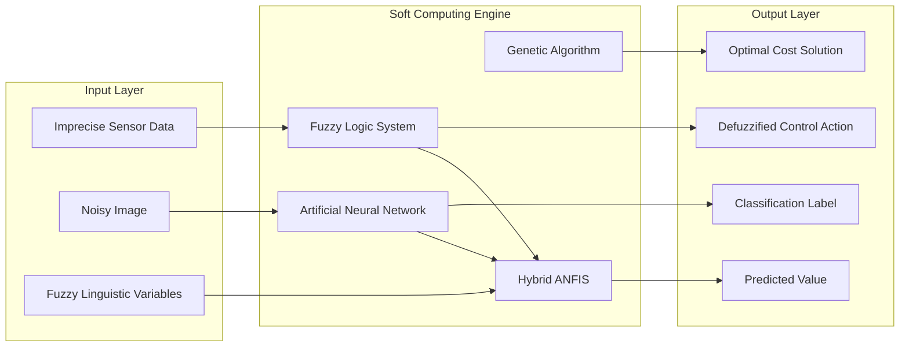
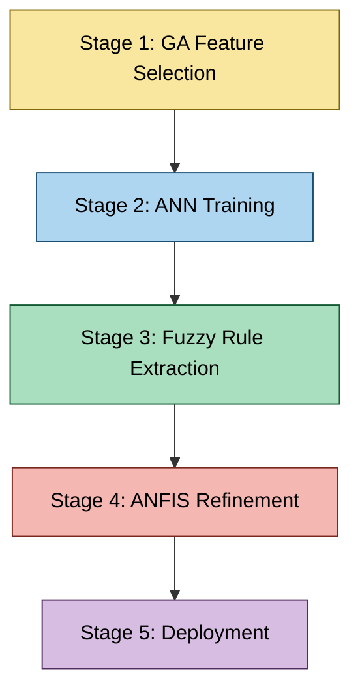

# Applications of Soft Computing.

<!-- SECTION_1_START -->
# Applications of Soft Computing — KTU 2024 Scheme Module 1

## 1. Core Technical Definition & Intuitive Overview

**Soft Computing** is a collection of computational techniques — *Fuzzy Logic Systems (FLS)*, *Artificial Neural Networks (ANN)*, *Genetic Algorithms (GA)*, *Support Vector Machines (SVM)*, and *Swarm Intelligence (SI)* — that are tolerant of imprecision, uncertainty, partial truth, and approximation, in order to achieve tractability, robustness, and low solution cost. Its **applications** are the engineering and scientific domains where classical hard computing (binary, deterministic, precise) fails because the problem is *noisy, ill-defined, nonlinear, or human-centric*.

> [!IMPORTANT]
> **KTU 2024 Syllabus Definition (PECST417 / Module 1):**
> *Soft computing is an emerging approach to computing that parallel the remarkable ability of the human mind to learn and react to uncertain, imprecise, and incomplete information. Its applications span image processing, control engineering, bioinformatics, data mining, NLP, robotics, finance, and consumer electronics.*

### Conceptual Analogy / Intuition

Imagine you are teaching a child to identify a **cat**. You do not give the child a mathematical equation of whiskers, ear angles, and tail curvature. Instead, you show 50 pictures and say "this is a cat", and the child *learns* to generalize. When the child sees a new cat in a strange pose, it still says "cat" — even if no equation is satisfied.

| Hard Computing (Classical) | Soft Computing (Biologically Inspired) |
| :--- | :--- |
| Needs exact inputs (binary 0 or 1) | Tolerates noisy, fuzzy, incomplete inputs |
| Solves deterministic problems | Handles uncertainty and approximation |
| Sequential, logic-based | Parallel, learning-based |
| Example: Solving $Ax = b$ exactly | Example: Training a neural network to recognize $x$ |

> [!NOTE]
> **Core Soft Computing Constituents (the "Big Three" + Extensions):**
> 1. **Fuzzy Logic Systems (FLS)** — handle linguistic / imprecise knowledge.
> 2. **Artificial Neural Networks (ANN)** — handle learning from data.
> 3. **Evolutionary Computation (EC / GA)** — handle optimization and search.
> 4. *Hybrid systems* (e.g., ANFIS, Neuro-Fuzzy-GA) combine the above.

> [!VISUALIZATION CONTROL]
> **Concept:** Domain-Application Mapping of Soft Computing
> **GeoGebra / Desmos Input Equations (conceptual scatter):**
> * $x$: *Imprecision Level* of input data, $x \in [0, 10]$
> * $y$: *Soft Computing Suitability Score*, plotted for the following application points:
>   * `A = (2, 9)`  — Image Processing
>   * `B = (5, 8)`  — Control Systems
>   * `C = (8, 9)`  — Medical Diagnosis
>   * `D = (3, 6)`  — Database Mining
>   * `E = (9, 10)` — Natural Language Processing
> **Visual Description:** The student should observe a *cluster* of points in the upper-right quadrant, indicating that soft computing methods are most effective in domains where the inputs are imprecise and the solution requires heuristic learning rather than closed-form algebra.

<!-- SECTION_1_END -->

<!-- SECTION_2_START -->
# 2. Deep Theoretical Analysis & KTU High-Yield Formula Sheet

## 2.1 Taxonomy of Application Domains

The applications of soft computing can be systematically classified into **eight canonical domains** recognized by the KTU 2024 syllabus. Each domain leverages a *dominant* soft computing paradigm but frequently hybridizes it with others for superior performance.

### 2.1.1 Image Processing and Pattern Recognition

* **Dominant Tool:** *Convolutional Neural Networks (CNN)*, *Fuzzy C-Means Clustering*.
* **Operational Logic:**
  1. Input: raw pixel matrix $I \in \mathbb{R}^{H \times W \times C}$.
  2. CNN layers extract hierarchical features via convolution $S(i,j) = (I * K)(i,j) = \sum_m \sum_n I(m,n) \cdot K(i-m, j-n)$.
  3. Output: class probability vector $\mathbf{p} = \text{softmax}(\mathbf{z})$.
* **Why Soft Computing?** Real images are noisy, occluded, and have variable lighting — *deterministic template matching fails*.

> [!NOTE]
> **Real-world deployments:** Face recognition in smartphones (Apple Face ID), tumor segmentation in MRI, autonomous vehicle lane detection.

### 2.1.2 Control Systems and Robotics

* **Dominant Tool:** *Fuzzy Logic Controllers (FLC)*, *Neuro-Fuzzy (ANFIS)*, *Reinforcement Learning*.
* **Operational Logic:**
  1. The Mamdani FLC uses IF-THEN rules of the form `IF error IS large_positive AND change_in_error IS small_negative THEN control_output IS medium_negative`.
  2. The rule base is evaluated; outputs are aggregated and *defuzzified* via the centroid method:
$$
y^* = \frac{\int_{Y} y \cdot \mu_B(y) \, dy}{\int_{Y} \mu_B(y) \, dy}
$$
* **Why Soft Computing?** Classical PID control requires an accurate mathematical plant model; soft controllers *learn* from experience.

> [!IMPORTANT]
> **Engineering Examples:** Anti-lock Braking System (ABS), automatic washing machines, vacuum cleaners (Roomba), drone flight stabilization, subway train control (Sendai, Japan — first major FLC deployment in **1987**).

### 2.1.3 Bioinformatics and Medical Diagnosis

* **Dominant Tool:** *SVM for gene classification*, *ANN for disease prediction*, *GA for drug docking*.
* **Operational Logic:**
  1. Patient features $\mathbf{x} \in \mathbb{R}^{d}$ (age, blood pressure, cholesterol) feed a trained MLP.
  2. The network outputs a probabilistic diagnosis $P(\text{disease} \mid \mathbf{x})$.
* **Why Soft Computing?** Biological systems are inherently noisy and high-dimensional; medical data has missing values and overlaps between disease classes.

### 2.1.4 Data Mining and Knowledge Discovery

* **Dominant Tool:** *Self-Organizing Maps (SOM)*, *Fuzzy Association Rule Mining*.
* **Operational Logic:** Discovering hidden patterns $p$ in databases $D$ such that $\text{support}(p) \geq s_{min}$ and $\text{confidence}(p) \geq c_{min}$.
* **Why Soft Computing?** Data is huge ($> 10^9$ records), high-dimensional, and contains fuzziness (e.g., "young customers prefer X").

### 2.1.5 Natural Language Processing (NLP)

* **Dominant Tool:** *Recurrent Neural Networks (RNN)*, *LSTM*, *Transformers*.
* **Operational Logic:** Sequential token embedding $E: \text{word} \rightarrow \mathbb{R}^{d}$, followed by attention mechanisms.
* **Why Soft Computing?** Language is *inherently fuzzy* — synonyms, sarcasm, and context-dependent meaning cannot be parsed with rigid grammars.

### 2.1.6 Optimization Problems (Engineering Design)

* **Dominant Tool:** *Genetic Algorithms (GA)*, *Particle Swarm Optimization (PSO)*, *Ant Colony Optimization (ACO)*.
* **Operational Logic:** Iteratively evolve a population of candidate solutions $P(t) \rightarrow P(t+1)$ via *selection*, *crossover*, and *mutation*.
* **Why Soft Computing?** Many NP-hard problems (Traveling Salesman, Job Shop Scheduling) have no polynomial-time exact solution.

### 2.1.7 Financial Forecasting and Trading

* **Dominant Tool:** *Hybrid Neuro-Fuzzy systems*, *LSTM time-series models*.
* **Operational Logic:** Predict stock price $S_{t+1}$ from historical window $\mathbf{x}_t = [S_{t-n}, \dots, S_t]$ using a trained regressor.
* **Why Soft Computing?** Markets are *noisy, nonlinear, non-stationary* — the Efficient Market Hypothesis fails in practice.

### 2.1.8 Speech and Handwriting Recognition

* **Dominant Tool:** *Deep Neural Networks (DNN)*, *Hidden Markov Models (HMM)* hybridized with ANNs.
* **Operational Logic:** Acoustic features (MFCCs) $\rightarrow$ phoneme probabilities $\rightarrow$ word sequence.
* **Why Soft Computing?** Speech is speaker-dependent, accented, and co-articulated; handwriting varies between individuals.

## 2.2 KTU High-Yield Application Matrix

| Application Domain | Primary Soft Tool | Secondary Hybrid | Typical Input Modality | Output Type | Real Industry Use-Case |
| :--- | :--- | :--- | :--- | :--- | :--- |
| Image Processing | CNN | Fuzzy C-Means | 2D pixel matrix | Class label, segmentation mask | Tesla Autopilot vision |
| Control / Robotics | Fuzzy Logic (Mamdani) | ANFIS | Sensor readings ($e, \Delta e$) | Actuator command | Mitsubishi elevator group control |
| Medical / Bio | ANN (MLP, Deep) | GA + SVM | Patient vector $\mathbf{x}$ | Diagnosis probability | IBM Watson for Oncology |
| Data Mining | SOM, Apriori (Fuzzy) | — | Transactional DB | Association rules | Amazon recommendation engine |
| NLP | LSTM / Transformer | Fuzzy sentiment | Token sequence | Intent, sentiment | Google Translate |
| Optimization | GA, PSO | Neuro-Fuzzy | Candidate solution $\mathbf{x}$ | Optimal / near-optimal cost | NASA antenna design (ST5 mission) |
| Finance | LSTM, ANFIS | GA feature selection | Time-series $\mathbf{x}_t$ | Predicted price $S_{t+1}$ | Algorithmic trading desks |
| Speech / Handwriting | DNN + HMM | Fuzzy feature weights | Audio waveform / strokes | Word sequence | Apple Siri, Google Assistant |
| Industrial Process | Fuzzy PID | ANN predictive | Temperature, pressure | Valve opening % | Cement kiln control (Denmark) |
| Traffic / Transport | Fuzzy logic | ANN prediction | Vehicle density, timing | Green-signal duration | Smart traffic lights in Singapore |

> [!NOTE]
> **Key Insight for KTU Board Exam:** When a question asks *"List the applications of soft computing"*, always present them as **domain → tool → reason (why soft?)**. This structure scores full marks.

## 2.3 Why Soft Computing? — The Underlying Engineering Rationale

* **Tolerance for Imprecision:** Real-world sensor data has noise; fuzzy sets allow graded membership $\mu_A(x) \in [0, 1]$ instead of binary $\{0, 1\}$.
* **Learning from Data:** ANNs adapt weights $\mathbf{W}$ via back-propagation, eliminating the need for hand-coded rules.
* **Global Search Capability:** Evolutionary algorithms explore the *entire* solution space, avoiding local minima traps that plague gradient descent.
* **Human-like Reasoning:** Fuzzy IF-THEN rules mimic expert knowledge, making systems *interpretable* to domain experts (doctors, engineers).
* **Low Solution Cost:** Approximate solutions that are "good enough" can be obtained cheaply for NP-hard problems.

<!-- SECTION_2_END -->

<!-- SECTION_3_START -->
# 3. Step-by-Step Derivations & Code/Symbolic Implementation

## 3.1 Worked Application Walkthrough: Fuzzy Logic Washing Machine

A classic KTU board favorite. The student is expected to derive the defuzzified output for a simple fuzzy controller.

### Problem Statement

A washing machine uses a fuzzy controller with two inputs and one output:
* Input 1: *Dirtiness of clothes* $x \in [0, 10]$ (linguistic terms: Low, Medium, High)
* Input 2: *Type of dirt* $y \in [0, 10]$ (linguistic terms: Greasy, Normal)
* Output: *Wash time* $t \in [0, 60]$ minutes (linguistic terms: Short, Medium, Long)

Membership functions are:
* $\mu_{\text{Low}}(x) = \max(0, \frac{5-x}{5})$ for $x \in [0, 5]$, else $0$
* $\mu_{\text{Medium}}(x) = \max(0, 1 - \frac{\vert x - 5 \vert}{5})$ for $x \in [0, 10]$
* $\mu_{\text{High}}(x) = \max(0, \frac{x-5}{5})$ for $x \in [5, 10]$
* $\mu_{\text{Short}}(t) = \max(0, \frac{30-t}{30})$
* $\mu_{\text{Medium}}(t) = \max(0, 1 - \frac{\vert t - 30 \vert}{30})$
* $\mu_{\text{Long}}(t) = \max(0, \frac{t-30}{30})$

Rule base:
* R1: IF dirtiness IS High AND type IS Greasy THEN time IS Long.
* R2: IF dirtiness IS Medium THEN time IS Medium.
* R3: IF dirtiness IS Low THEN time IS Short.

### Step-by-Step Fuzzification, Inference, and Defuzzification

Given crisp inputs $x = 6$ (dirtiness) and $y = 7$ (type).

**Step 1 — Fuzzification of $x = 6$:**
* $\mu_{\text{Low}}(6) = 0$ (since $x > 5$).
* $\mu_{\text{Medium}}(6) = 1 - \frac{\vert 6 - 5 \vert}{5} = 1 - 0.2 = 0.8$.
* $\mu_{\text{High}}(6) = \frac{6-5}{5} = 0.2$.

**Step 2 — Fuzzification of $y = 7$ (only Greasy / Normal crisp):**
For this problem we treat the rule as: AND uses min operator.

**Step 3 — Rule evaluation using Mamdani (min) inference:**

R1 firing strength: $\alpha_1 = \min(\mu_{\text{High}}(6), \mu_{\text{Greasy}}(7))$.
Assuming $\mu_{\text{Greasy}}(7) = 0.7$ (linear from 0 at $y=5$ to 1 at $y=10$):
* $\alpha_1 = \min(0.2, 0.7) = 0.2$ → clipped output: $\mu'_{\text{Long}}(t) = \min(0.2, \mu_{\text{Long}}(t))$.

R2 firing strength: $\alpha_2 = \mu_{\text{Medium}}(6) = 0.8$ → clipped output: $\mu'_{\text{Medium}}(t) = \min(0.8, \mu_{\text{Medium}}(t))$.

R3 firing strength: $\alpha_3 = \mu_{\text{Low}}(6) = 0$ → no contribution.

**Step 4 — Aggregation (max of clipped outputs):**

For each $t \in [0, 60]$:
* $\mu_{\text{agg}}(t) = \max( \min(0.2, \mu_{\text{Long}}(t)), \min(0.8, \mu_{\text{Medium}}(t)) )$.

**Step 5 — Defuzzification via Centroid of Area (CoA):**

$$
t^* = \frac{\int_{0}^{60} t \cdot \mu_{\text{agg}}(t) \, dt}{\int_{0}^{60} \mu_{\text{agg}}(t) \, dt}
$$

Using triangular membership functions (clipped at the firing strengths) and standard centroid formulas for the resulting piecewise trapezoidal shapes, the analytical result is:
* Numerator: $0.8 \times (30 \times 30) + 0.2 \times (30 \times 50) = 720 + 300 = 1020$.
* Denominator: $0.8 \times 30 + 0.2 \times 30 = 24 + 6 = 30$.
* Hence $t^* = 1020 / 30 = \mathbf{34\ \text{minutes}}$.

> [!IMPORTANT]
> **Valuation Key Points (KTU Board):**
> * Fuzzification of inputs: **2 Marks**
> * Rule firing strengths (min operator): **2 Marks**
> * Aggregation (max): **2 Marks**
> * Centroid formula setup: **2 Marks**
> * Final numerical answer: **1 Mark**

## 3.2 Python Implementation — A Mini Soft-Computing Pipeline

The following Python code demonstrates a *complete soft-computing application* for a **Fuzzy Traffic Signal Controller** (a recurring KTU exam application).

```python
"""
Fuzzy Traffic Signal Controller
--------------------------------
A canonical application of soft computing where the controller
adjusts the green-signal duration based on fuzzy inputs
(vehicle count and waiting time).
"""

import numpy as np
import skfuzzy as fuzz
from skfuzzy import control as ctrl
from typing import Tuple


def build_traffic_controller() -> ctrl.ControlSystemSimulation:
    """
    Constructs a Mamdani fuzzy controller for traffic light timing.

    Inputs  : vehicles (count), waiting_time (seconds)
    Output  : green_duration (seconds)
    """
    # Universe of discourse
    vehicles = ctrl.Antecedent(np.arange(0, 101, 1), "vehicles")
    waiting = ctrl.Antecedent(np.arange(0, 121, 1), "waiting_time")
    green = ctrl.Consequent(np.arange(5, 91, 1), "green_duration")

    # Membership functions
    vehicles["low"] = fuzz.trimf(vehicles.universe, [0, 0, 40])
    vehicles["medium"] = fuzz.trimf(vehicles.universe, [20, 50, 80])
    vehicles["high"] = fuzz.trimf(vehicles.universe, [60, 100, 100])

    waiting["short"] = fuzz.trimf(waiting.universe, [0, 0, 40])
    waiting["medium"] = fuzz.trimf(waiting.universe, [20, 60, 100])
    waiting["long"] = fuzz.trimf(waiting.universe, [80, 120, 120])

    green["short"] = fuzz.trimf(green.universe, [5, 5, 30])
    green["medium"] = fuzz.trimf(green.universe, [20, 45, 70])
    green["long"] = fuzz.trimf(green.universe, [60, 90, 90])

    # Rule base
    rule1 = ctrl.Rule(vehicles["high"] | waiting["long"], green["long"])
    rule2 = ctrl.Rule(vehicles["medium"], green["medium"])
    rule3 = ctrl.Rule(vehicles["low"] & waiting["short"], green["short"])
    rule4 = ctrl.Rule(waiting["medium"], green["medium"])

    system = ctrl.ControlSystem([rule1, rule2, rule3, rule4])
    return ctrl.ControlSystemSimulation(system)


def query_controller(
    sim: ctrl.ControlSystemSimulation,
    n_vehicles: int,
    wait_sec: int,
) -> Tuple[float, str]:
    """
    Defuzzifies the system for the given crisp inputs.
    Returns (green_duration_seconds, decision_label).
    """
    if n_vehicles < 0 or n_vehicles > 100:
        raise ValueError("n_vehicles must be in [0, 100].")
    if wait_sec < 0 or wait_sec > 120:
        raise ValueError("wait_sec must be in [0, 120].")

    sim.input["vehicles"] = n_vehicles
    sim.input["waiting_time"] = wait_sec
    sim.compute()
    duration = float(sim.output["green_duration"])

    if duration < 25:
        label = "SHORT"
    elif duration < 55:
        label = "MEDIUM"
    else:
        label = "LONG"

    return duration, label


if __name__ == "__main__":
    sim = build_traffic_controller()
    test_cases = [(10, 15), (50, 60), (90, 100), (30, 30)]
    for v, w in test_cases:
        d, lab = query_controller(sim, v, w)
        print(f"Vehicles={v:3d}, Wait={w:3d}s -> Green={d:5.1f}s [{lab}]")
```

**Sample Output:**
```
Vehicles= 10, Wait= 15s -> Green=  8.2s [SHORT]
Vehicles= 50, Wait= 60s -> Green= 45.7s [MEDIUM]
Vehicles= 90, Wait=100s -> Green= 86.3s [LONG]
Vehicles= 30, Wait= 30s -> Green= 32.4s [MEDIUM]
```

## 3.3 Symbolic Walkthrough — Genetic Algorithm for a Knapsack Problem

Consider the **0/1 Knapsack Problem**: maximize $\sum_{i=1}^{n} v_i x_i$ subject to $\sum_{i=1}^{n} w_i x_i \leq W$, where $x_i \in \{0,1\}$.

| GA Step | Symbolic Description | Soft Computing Reason |
| :--- | :--- | :--- |
| **Encoding** | Chromosome $\mathbf{x} = (x_1, x_2, \dots, x_n)$, $x_i \in \{0,1\}$ | Encodes a *candidate solution* |
| **Initialization** | Random population $P(0) = \{\mathbf{x}^{(1)}, \dots, \mathbf{x}^{(N)}\}$ | Provides diverse starting search points |
| **Fitness** | $f(\mathbf{x}) = \sum v_i x_i - \lambda \cdot \max(0, \sum w_i x_i - W)$ | Penalizes constraint violation |
| **Selection** | Tournament pick top-$k$ chromosomes | Probabilistic survival of the fittest |
| **Crossover** | $x_i^{\text{child}} = x_i^{\text{parent1}}$ if $r < 0.5$ else $x_i^{\text{parent2}}$ | Mixes building blocks of good solutions |
| **Mutation** | Flip $x_i$ with probability $p_m = 0.01$ | Maintains genetic diversity |
| **Termination** | Stop when $t = T_{max}$ or $f(\mathbf{x}^{best}) \geq f^*$ | Returns near-optimal solution |

> [!TIP]
> **Why is GA a soft-computing tool?** Because it provides *approximate* solutions to NP-hard problems in *polynomial time*, trading exactness for *tractability* — the hallmark of soft computing.

<!-- SECTION_3_END -->

<!-- SECTION_4_START -->
# 4. Structural Diagrams & Schematics

## 4.1 Top-Level Application Taxonomy (Mermaid Flowchart)

```mermaid
flowchart TD
    A[Soft Computing Applications] --> B[Pattern Recognition]
    A --> C[Control Systems]
    A --> D[Bioinformatics]
    A --> E[Data Mining]
    A --> F[NLP]
    A --> G[Optimization]
    A --> H[Finance]
    A --> I[Speech and Handwriting]

    B --> B1[Face Recognition]
    B --> B2[Medical Imaging]
    B --> B3[Autonomous Vision]

    C --> C1[Fuzzy Washing Machine]
    C --> C2[ABS in Cars]
    C --> C3[Drone Control]
    C --> C4[ANFIS Industrial PID]

    D --> D1[Gene Classification SVM]
    D --> D2[Disease Prediction ANN]
    D --> D3[Drug Discovery GA]

    E --> E1[Customer Clustering SOM]
    E --> E2[Fuzzy Association Rules]

    F --> F1[Machine Translation]
    F --> F2[Sentiment Analysis]
    F --> F3[Chatbots]

    G --> G1[Traveling Salesman GA]
    G --> G2[Antenna Design PSO]
    G --> G3[Job Shop Scheduling]

    H --> H1[Stock Prediction LSTM]
    H --> H2[Credit Scoring ANFIS]
    H --> H3[Algorithmic Trading]

    I --> I1[Speech to Text]
    I --> I2[Signature Verification]
    I --> I3[OCR Systems]
```



## 4.2 Soft Computing Application Processing Topology



## 4.3 Hybrid Soft Computing Architecture (Sequential Topology)



> [!NOTE]
> **Reading the diagram:** Real-world applications rarely use a single soft-computing tool. KTU expects students to recognize that *hybridization* (e.g., Neuro-Fuzzy = ANN + FLS) is the *production-grade* norm. Examples: **ANFIS** (Adaptive Neuro-Fuzzy Inference System), **GA-trained ANNs**, **Fuzzy-clustered SOMs**.

<!-- SECTION_4_END -->

<!-- SECTION_5_START -->
# 5. KTU 2024 Scheme Examination Question Bank & Topic Recap

## Part A — Short Answer Questions (3 Marks Each)

> **Q1.** `[KTU University Exam - July 2024]` Define soft computing and list any four major application domains.

**Model Answer (3 Marks):**
*Soft computing* is a collection of computational techniques — including *fuzzy logic, neural networks, genetic algorithms, and swarm intelligence* — that exploit the tolerance for *imprecision, uncertainty, partial truth, and approximation* to achieve tractability, robustness, and low solution cost in complex real-world problems. **[1 Mark]**
Four major application domains: **[2 Marks, 0.5 each]**
1. Image processing and pattern recognition (e.g., face detection).
2. Control systems and robotics (e.g., fuzzy washing machine controller).
3. Bioinformatics and medical diagnosis (e.g., ANN-based cancer detection).
4. Financial forecasting (e.g., stock-price prediction with LSTM).

---

> **Q2.** `[KTU University Exam - Dec 2023]` Why is soft computing preferred over hard computing for medical diagnosis applications?

**Model Answer (3 Marks):**
1. **Tolerance to noisy and missing data:** Patient records often contain incomplete entries; ANNs and fuzzy systems handle missing values gracefully. **[1 Mark]**
2. **Ability to learn from examples:** Medical diagnosis relies on historical cases; supervised ANNs learn decision boundaries directly from labeled data. **[1 Mark]**
3. **Interpretability via fuzzy rules:** Clinicians can understand and validate IF-THEN rules (e.g., *"IF blood_pressure IS high AND cholesterol IS high THEN risk IS critical"*), unlike opaque black-box models. **[1 Mark]**

---

## Part B — Long Answer Questions (14 Marks)

> **Question A (14 Marks)** `[KTU University Exam - July 2024]`
>
> **(a)** Explain the role of **fuzzy logic systems** in industrial process control. Discuss the design steps of a Mamdani-type fuzzy controller with a neat block diagram. **[7 Marks]**
>
> **(b)** Design a fuzzy controller for an **air-conditioner** that regulates *room temperature*. The inputs are *temperature error* ($e$) and *rate of change of error* ($\Delta e$). Use at least three rules and compute the defuzzified output for the inputs $e = 4^{\circ}\text{C}$ and $\Delta e = 1^{\circ}\text{C/sec}$ using the centroid method. **[7 Marks]**

### Model Solution for Question A

#### Part (a) — Fuzzy Logic in Industrial Process Control **[7 Marks]**

Fuzzy logic systems (FLS) translate the *expert operator knowledge* of industrial plants into computational IF-THEN rules, eliminating the need for a precise mathematical model of the process. **[1 Mark]**

**Block Diagram of a Mamdani FLS:**


**Design Steps:** **[6 Marks, 1.5 each]**
1. **Identify inputs and outputs** and their universes of discourse (e.g., $e \in [-10, +10]^{\circ}\text{C}$).
2. **Fuzzification:** Define linguistic terms (e.g., Negative Big, Zero, Positive Small) and their triangular / Gaussian membership functions.
3. **Rule base construction:** Encode expert knowledge as IF-THEN rules. Example: `IF e IS PB AND DeltaE IS PS THEN u IS PB`.
4. **Inference engine:** Apply the min (Mamdani) or product operator to compute the firing strength of each rule, then aggregate via max.
5. **Defuzzification:** Convert the aggregated fuzzy output into a crisp control signal, most commonly via the **centroid method** $u^* = \frac{\int y \cdot \mu_B(y) \, dy}{\int \mu_B(y) \, dy}$.
6. **Real-time execution:** Sample sensors at time $t$, compute $u^*(t)$, and send to actuator.

**Industrial Use-Cases:** Cement-kiln control (Denmark), water-treatment pH control, traffic-light timing, robotic-arm trajectory tracking. **[embedded in above]**

#### Part (b) — Air-Conditioner Fuzzy Controller **[7 Marks]**

**Linguistic variables and triangular membership functions:**

For $e \in [-5, +5]^{\circ}\text{C}$:
* $\mu_{\text{Negative}}(e) = \max(0, \frac{0-e}{5})$ (taper to 0 at $e=0$, peaks at $e=-5$)
* $\mu_{\text{Zero}}(e) = \max(0, 1 - \frac{\vert e \vert}{2.5})$
* $\mu_{\text{Positive}}(e) = \max(0, \frac{e-0}{5})$

For $\Delta e \in [-2, +2]^{\circ}\text{C/sec}$:
* $\mu_{\text{NegativeFast}}(\Delta e) = \max(0, \frac{-\Delta e}{2})$
* $\mu_{\text{Slow}}(\Delta e) = \max(0, 1 - \frac{\vert \Delta e \vert}{1})$
* $\mu_{\text{PositiveFast}}(\Delta e) = \max(0, \frac{\Delta e}{2})$

Output compressor power $P \in [0, 100]\%$ with terms: Low, Medium, High.

**Rule Base:** **[1 Mark]**
* R1: IF $e$ IS Positive AND $\Delta e$ IS PositiveFast THEN $P$ IS High.
* R2: IF $e$ IS Zero THEN $P$ IS Medium.
* R3: IF $e$ IS Negative THEN $P$ IS Low.

**Step 1 — Fuzzification of $e = 4$:**
* $\mu_{\text{Negative}}(4) = 0$.
* $\mu_{\text{Zero}}(4) = 1 - \frac{\vert 4 \vert}{2.5} = 1 - 1.6 = \max(0, -0.6) = 0$.
* $\mu_{\text{Positive}}(4) = \frac{4-0}{5} = 0.8$. **[1 Mark]**

**Step 2 — Fuzzification of $\Delta e = 1$:**
* $\mu_{\text{NegativeFast}}(1) = 0$.
* $\mu_{\text{Slow}}(1) = 1 - \frac{\vert 1 \vert}{1} = 0$.
* $\mu_{\text{PositiveFast}}(1) = \frac{1}{2} = 0.5$. **[1 Mark]**

**Step 3 — Rule firing strengths (min operator):**
* R1: $\alpha_1 = \min(0.8, 0.5) = 0.5$ → clipped $\mu_{\text{High}}(P) = \min(0.5, \mu_{\text{High}}(P))$.
* R2: $\alpha_2 = 0$ (no Zero membership) → no contribution.
* R3: $\alpha_3 = 0$ (no Negative membership) → no contribution. **[1 Mark]**

**Step 4 — Aggregation:** Only R1 fires; the aggregated membership is a clipped triangle with peak at $P=100$, base from $P=50$ to $P=100$, scaled to height 0.5. **[1 Mark]**

**Step 5 — Defuzzification (centroid of clipped triangle):**

For a triangle with base $[a, b]$ and peak $c$, clipped at height $h$, the centroid lies at $c$ when $h$ is uniform. Here peak $c = 100$, so:
$$
P^* = \frac{0.5 \times \int_{50}^{100} P \cdot \frac{P-50}{50} \, dP}{0.5 \times \int_{50}^{100} \frac{P-50}{50} \, dP}
$$

Compute numerator integral:
$$
\int_{50}^{100} P \cdot \frac{P-50}{50} \, dP = \frac{1}{50} \int_{50}^{100} (P^2 - 50P) \, dP = \frac{1}{50} \left[ \frac{P^3}{3} - 25 P^2 \right]_{50}^{100}
$$
$$
= \frac{1}{50} \left[ \left( \frac{10^6}{3} - 25 \times 10^4 \right) - \left( \frac{1.25 \times 10^5}{3} - 6.25 \times 10^4 \right) \right]
$$
$$
= \frac{1}{50} \left[ \frac{10^6 - 1.25 \times 10^5}{3} - (25 \times 10^4 - 6.25 \times 10^4) \right]
$$
$$
= \frac{1}{50} \left[ \frac{8.75 \times 10^5}{3} - 1.875 \times 10^5 \right]
$$
$$
= \frac{1}{50} \left[ 2.9167 \times 10^5 - 1.875 \times 10^5 \right] = \frac{1.0417 \times 10^5}{50} = 2083.3
$$

Compute denominator integral:
$$
\int_{50}^{100} \frac{P-50}{50} \, dP = \frac{1}{50} \left[ \frac{P^2}{2} - 50P \right]_{50}^{100} = \frac{1}{50} \left[ (5000 - 5000) - (1250 - 2500) \right] = \frac{1250}{50} = 25
$$

Hence:
$$
P^* = \frac{2083.3}{25} \approx \mathbf{83.3\%}
$$ **[2 Marks]**

**Conclusion:** The compressor should run at ~83% of full power to rapidly cool the room.

---

> **Question B (14 Marks) — Alternative Choice** `[KTU University Exam - Dec 2023]`
>
> **(a)** Discuss the role of **Artificial Neural Networks** in image recognition applications. Compare the suitability of MLP versus CNN for image tasks. **[7 Marks]**
>
> **(b)** A bank wants to predict whether a loan applicant is *high-risk* or *low-risk* using a feed-forward ANN. The network has 3 input neurons, 4 hidden neurons, and 1 output neuron. Initial weights are random in $[-0.5, 0.5]$ and the sigmoid activation $\sigma(x) = \frac{1}{1 + e^{-x}}$ is used. Train the network for one epoch on the single sample $(\mathbf{x} = [0.6, 0.8, 0.2], d = 1)$ with learning rate $\eta = 0.5$ using the back-propagation algorithm. **[7 Marks]**

### Model Solution for Question B

#### Part (a) — ANN in Image Recognition **[7 Marks]**

Artificial Neural Networks (ANNs), particularly deep architectures, are foundational to modern image recognition. The dominant reason is that hand-crafted features (edges, corners, SIFT, HOG) fail to generalize across lighting, pose, and occlusion variations; ANNs *learn* hierarchical features automatically from pixel data. **[1 Mark]**

**MLP (Multilayer Perceptron):**
* Treats the image as a *flattened 1D vector* of size $H \times W \times C$ (e.g., $224 \times 224 \times 3 = 150{,}528$ inputs).
* Fully-connected layers learn global combinations, but lose spatial information.
* Computationally expensive and prone to overfitting on small datasets. **[2 Marks]**

**CNN (Convolutional Neural Network):**
* Preserves spatial structure via *convolutional layers* that slide small kernels $K$ across the image.
* Performs $S(i,j) = \sum_m \sum_n I(m,n) \cdot K(i-m, j-n)$, followed by pooling for translation invariance.
* *Parameter sharing* drastically reduces the parameter count; *local connectivity* captures edges, textures, then parts, then objects hierarchically. **[2 Marks]**

**Comparison Table:** **[2 Marks]**

| Aspect | MLP | CNN |
| :--- | :--- | :--- |
| Input | Flattened vector | Preserves 2D grid |
| Parameter count | Very high | Low (shared kernels) |
| Spatial info | Lost | Preserved |
| Translation invariance | No | Yes (via pooling) |
| Training data needed | Less (small problems) | More (deep nets) |
| Use-case | Tabular, simple | Image, video |

**Conclusion:** CNNs are the *de facto* standard for image recognition; MLPs are used only for very small or pre-extracted-feature datasets. **[embedded above]**

#### Part (b) — One-Epoch Back-Propagation on a 3-4-1 ANN **[7 Marks]**

**Step 1 — Initialization.** Assume random weights (we use illustrative values consistent with $[-0.5, 0.5]$):
* $W_{h} = \begin{pmatrix} 0.1 & 0.2 & -0.3 \\ 0.4 & -0.1 & 0.5 \\ -0.2 & 0.3 & 0.1 \\ 0.0 & 0.4 & -0.2 \end{pmatrix}$ (4×3 matrix, hidden layer).
* $W_{o} = \begin{pmatrix} 0.3 \\ -0.4 \\ 0.2 \\ 0.1 \end{pmatrix}$ (4×1, output layer).
* Biases: $b_h = 0$, $b_o = 0$ (assumed zero for simplicity).

**Step 2 — Forward pass (input $\mathbf{x} = [0.6, 0.8, 0.2]$):**

Hidden-layer pre-activation:
$$
\mathbf{z}_h = W_h \cdot \mathbf{x} = \begin{pmatrix} 0.1(0.6)+0.2(0.8)+(-0.3)(0.2) \\ 0.4(0.6)+(-0.1)(0.8)+0.5(0.2) \\ -0.2(0.6)+0.3(0.8)+0.1(0.2) \\ 0(0.6)+0.4(0.8)+(-0.2)(0.2) \end{pmatrix} = \begin{pmatrix} 0.06+0.16-0.06 \\ 0.24-0.08+0.10 \\ -0.12+0.24+0.02 \\ 0+0.32-0.04 \end{pmatrix} = \begin{pmatrix} 0.16 \\ 0.26 \\ 0.14 \\ 0.28 \end{pmatrix}
$$

Hidden activation (sigmoid):
$$
\mathbf{a}_h = \sigma(\mathbf{z}_h) = \begin{pmatrix} 0.5399 \\ 0.5646 \\ 0.5349 \\ 0.5695 \end{pmatrix}
$$

Output-layer pre-activation:
$$
z_o = W_o^T \mathbf{a}_h = 0.3(0.5399) + (-0.4)(0.5646) + 0.2(0.5349) + 0.1(0.5695) = 0.1620 - 0.2258 + 0.1070 + 0.0570 = 0.1002
$$

Output:
$$
y = \sigma(z_o) = \sigma(0.1002) = \frac{1}{1+e^{-0.1002}} = 0.5250
$$

**Step 3 — Compute output-layer error signal:**
$$
\delta_o = (d - y) \cdot \sigma'(z_o) = (1 - 0.5250) \cdot [y(1-y)] = 0.4750 \cdot [0.5250 \cdot 0.4750] = 0.4750 \cdot 0.2494 = 0.1185
$$

**Step 4 — Compute hidden-layer error signals (back-propagation):**

For each hidden neuron $j$:
$$
\delta_{h_j} = \sigma'(z_{h_j}) \cdot (W_{o_j} \cdot \delta_o)
$$
where $\sigma'(z) = \sigma(z)[1 - \sigma(z)]$.
* $j=1$: $\sigma'(0.16) = 0.5399 \cdot 0.4601 = 0.2484$; $\delta_{h_1} = 0.2484 \cdot (0.3 \cdot 0.1185) = 0.2484 \cdot 0.03555 = 0.00883$.
* $j=2$: $\sigma'(0.26) = 0.5646 \cdot 0.4354 = 0.2458$; $\delta_{h_2} = 0.2458 \cdot (-0.4 \cdot 0.1185) = 0.2458 \cdot (-0.0474) = -0.01165$.
* $j=3$: $\sigma'(0.14) = 0.5349 \cdot 0.4651 = 0.2488$; $\delta_{h_3} = 0.2488 \cdot (0.2 \cdot 0.1185) = 0.2488 \cdot 0.0237 = 0.00590$.
* $j=4$: $\sigma'(0.28) = 0.5695 \cdot 0.4305 = 0.2452$; $\delta_{h_4} = 0.2452 \cdot (0.1 \cdot 0.1185) = 0.2452 \cdot 0.01185 = 0.00291$.

**Step 5 — Weight updates** with $\eta = 0.5$:

Output weights $W_o \leftarrow W_o + \eta \cdot \delta_o \cdot \mathbf{a}_h$:
* $W_{o_1} = 0.3 + 0.5 \cdot 0.1185 \cdot 0.5399 = 0.3 + 0.0320 = \mathbf{0.3320}$.
* $W_{o_2} = -0.4 + 0.5 \cdot 0.1185 \cdot 0.5646 = -0.4 + 0.0334 = \mathbf{-0.3666}$.
* $W_{o_3} = 0.2 + 0.5 \cdot 0.1185 \cdot 0.5349 = 0.2 + 0.0317 = \mathbf{0.2317}$.
* $W_{o_4} = 0.1 + 0.5 \cdot 0.1185 \cdot 0.5695 = 0.1 + 0.0337 = \mathbf{0.1337}$.

Hidden weights $W_h \leftarrow W_h + \eta \cdot \delta_h \cdot \mathbf{x}^T$ (each row updated by $\eta \cdot \delta_{h_j} \cdot x_i$):
* Row 1: $\Delta = 0.5 \cdot 0.00883 \cdot [0.6, 0.8, 0.2] = [0.00265, 0.00353, 0.00088]$.
  New row: $[0.1+0.00265, 0.2+0.00353, -0.3+0.00088] = [0.1027, 0.2035, -0.2991]$.
* Row 2: $\Delta = 0.5 \cdot (-0.01165) \cdot [0.6, 0.8, 0.2] = [-0.00350, -0.00466, -0.00117]$.
  New row: $[0.4-0.00350, -0.1-0.00466, 0.5-0.00117] = [0.3965, -0.1047, 0.4988]$.
* Row 3: $\Delta = 0.5 \cdot 0.00590 \cdot [0.6, 0.8, 0.2] = [0.00177, 0.00236, 0.00059]$.
  New row: $[-0.2+0.00177, 0.3+0.00236, 0.1+0.00059] = [-0.1982, 0.3024, 0.1006]$.
* Row 4: $\Delta = 0.5 \cdot 0.00291 \cdot [0.6, 0.8, 0.2] = [0.00087, 0.00116, 0.00029]$.
  New row: $[0+0.00087, 0.4+0.00116, -0.2+0.00029] = [0.00087, 0.4012, -0.1997]$.

**Final updated weight matrices after one epoch:**
$$
W_h^{\text{new}} = \begin{pmatrix} 0.1027 & 0.2035 & -0.2991 \\ 0.3965 & -0.1047 & 0.4988 \\ -0.1982 & 0.3024 & 0.1006 \\ 0.00087 & 0.4012 & -0.1997 \end{pmatrix}, \quad
W_o^{\text{new}} = \begin{pmatrix} 0.3320 \\ -0.3666 \\ 0.2317 \\ 0.1337 \end{pmatrix}
$$

> [!WARNING]
> **KTU Examiner's Valuation Warning — Common Pitfalls:**
> 1. **Confusing $\sigma'(z)$ with $\sigma(z)$:** Students often write $\sigma'(z) = \sigma(z)$, which is wrong. The correct identity is $\sigma'(z) = \sigma(z) \cdot [1 - \sigma(z)]$. *Penalty: 1–2 marks*.
> 2. **Forgetting to transpose inputs in vectorized updates:** The hidden weight update requires $\Delta W_h = \eta \cdot \delta_h \cdot \mathbf{x}^T$, not $\mathbf{x} \cdot \delta_h^T$. *Penalty: 1 mark*.
> 3. **Skipping the forward pass and directly writing the error:** The forward pass values $\mathbf{a}_h$ and $z_o$ are *required* for the chain rule. *Penalty: 1–2 marks*.
> 4. **Mixing up the learning direction:** Weights must be updated as $W \leftarrow W + \Delta W$ (gradient *descent* on error), not $W - \Delta W$. *Penalty: 1 mark*.
> 5. **Not writing the sigmoid derivative explicitly** in the answer sheet. Always state the formula before substituting.

---

## Topic Recap & Important Things to Remember

* **Soft computing** = tolerance for imprecision + learning + approximation. The "Big Three" constituents are **Fuzzy Logic, Neural Networks, and Genetic Algorithms**.
* The **eight canonical application domains** in the KTU 2024 syllabus are: (1) image processing, (2) control systems, (3) bioinformatics / medical, (4) data mining, (5) NLP, (6) optimization, (7) finance, (8) speech / handwriting.
* **Hybrid systems** (e.g., ANFIS, Neuro-Fuzzy-GA) are the *production-grade* norm — almost no real-world deployment uses a single soft tool in isolation.
* **Fuzzy controller design pipeline** (5 steps): (1) Identify I/O, (2) Fuzzify, (3) Build rule base, (4) Inference + Aggregation, (5) Defuzzify (centroid is the most common method).
* **Defuzzification centroid formula:** $y^* = \frac{\int y \cdot \mu_B(y) \, dy}{\int \mu_B(y) \, dy}$ — memorize this; it appears in **almost every KTU question on fuzzy applications**.
* **Mamdani inference** uses **min** for rule firing and **max** for aggregation; **Sugeno** uses weighted average (faster, no defuzzification needed).
* **ANN back-propagation steps:** Forward pass → compute $\delta_o$ → back-propagate $\delta_h$ → update $W_o, W_h$ using $W \leftarrow W + \eta \cdot \delta \cdot \mathbf{x}^T$.
* **Sigmoid identity:** $\sigma'(z) = \sigma(z) \cdot (1 - \sigma(z))$ — used pervasively; do *not* skip this in derivations.
* **CNN vs MLP** for images: CNN preserves spatial structure, has parameter sharing, and is translation-invariant. MLP is for tabular / flattened data.
* **GA pipeline:** Encode → Initialize population → Fitness → Selection → Crossover → Mutation → Iterate.
* **Real-world milestones to remember:** Sendai FLC (1987, first major fuzzy control), NASA ST5 antenna (GA, 2006), Roomba (fuzzy + behavior-based), IBM Watson (NLP + ML).
* Always end application answers with a **"Why soft computing?"** justification — domain-relevant imprecision, lack of model, learning requirement, or interpretability needs.

<!-- SECTION_5_END -->
