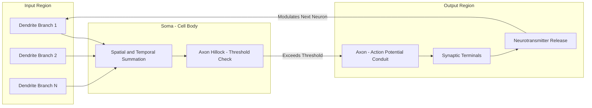
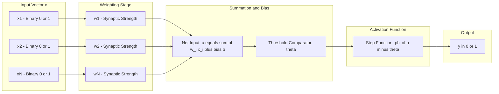
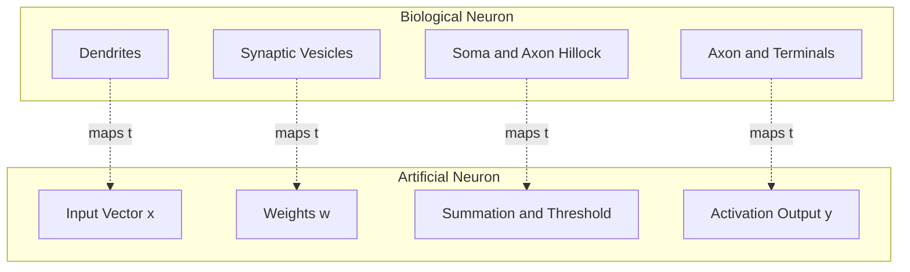
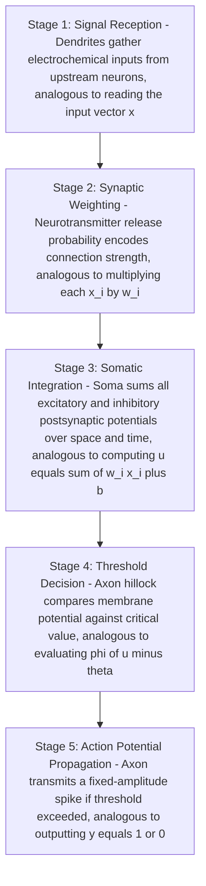

# Artificial Neurons Vs Biological Neurons.

<!-- SECTION_1_START -->

# Artificial Neurons vs Biological Neurons

## 1. Core Technical Definition & Intuitive Overview

### 1.1 Biological Neuron — Formal KTU Definition

A **Biological Neuron** is the fundamental structural and functional unit of the human nervous system, specialized in receiving, processing, and transmitting electrochemical signals. It is composed of three primary anatomical regions: the **dendrites** (signal receivers), the **soma or cell body** (signal integrator), and the **axon** with terminal **synapses** (signal transmitters). A biological neuron fires (generates an action potential) only when the integrated input signal exceeds a critical electrical threshold, typically around **$-55$ mV**.

> [!IMPORTANT]
> **Syllabus Highlight (KTU 2024 - PECST417, Module 1):**
> The biological neuron is treated as the *biological inspiration* for computational models. Students must clearly distinguish the *anatomical analogy* (dendrite = input, soma = summing junction, axon = output line) from the *functional analogy* (synaptic strength = weight, firing threshold = activation function).

### 1.2 Artificial Neuron — Formal KTU Definition

An **Artificial Neuron** is a mathematical abstraction of a biological neuron, first formalized by **Warren McCulloch** and **Walter Pitts (1943)** as a threshold logic unit. It computes a weighted sum of its inputs, adds a bias term, and passes the result through a non-linear **activation function** to produce a scalar output. Formally, the McCulloch-Pitts neuron is a *binary threshold device* defined over a discrete, finite time-step.

> [!NOTE]
> **Core Definition Box — McCulloch-Pitts Neuron (1943)**
> A simplified binary model with the following properties:
> - Inputs: $x_1, x_2, \dots, x_n \in \{0, 1\}$
> - Weights: $w_1, w_2, \dots, w_n \in \{-1, +1\}$ (in the original model) or $w_i \in \mathbb{R}$ (generalized)
> - Threshold: $\theta \in \mathbb{R}$
> - Output: $y \in \{0, 1\}$ or $y \in \{-1, +1\}$

### 1.3 Intuitive Analogies

> [!TIP]
> **Conceptual Analogy — The Neuron as a "Smart Voting Box"**
> Imagine a town hall meeting where citizens (inputs) cast weighted votes (synaptic strengths) into a ballot box (soma). A chairman (activation function) checks whether the **total weighted vote crosses a quorum** (threshold). If yes, a policy announcement (output spike) is broadcast through a loudspeaker (axon) to the next hall. The biological neuron behaves identically: it sums weighted electrochemical signals and "announces" a spike only when excitation dominates inhibition.

> [!TIP]
> **Geometric Intuition — A Linear Classifier**
> An artificial neuron with a hard-limit activation function defines a **hyperplane** in $\mathbb{R}^n$ that separates input space into two half-spaces (positive vs negative class). The weight vector $\mathbf{w}$ is *normal* (perpendicular) to this hyperplane, and the bias $b$ shifts it from the origin.

### 1.4 Physical Constants & Standard Metrics

| Parameter | Biological Neuron | Artificial Neuron |
| :--- | :--- | :--- |
| **Operating speed** | $\approx 1$ to $\mathbf{100}$ Hz (max firing rate) | $\approx 10^9$ operations per second (GPU) |
| **Signal type** | Electrochemical (action potential) | Numerical (floating-point) |
| **Power consumption** | $\approx \mathbf{20}$ W (human brain total) | $\approx 300$ W (single GPU) |
| **Fan-in (synapses per neuron)** | Up to $\mathbf{10^5}$ (Purkinje cells) | Typically $10^2$ to $10^3$ |
| **Storage mechanism** | Synaptic plasticity (LTP/LTD) | Synaptic weights in memory |

> [!VISUALIZATION CONTROL]
> **Concept:** Linear separation hyperplane of a 2-input McCulloch-Pitts neuron.
> **GeoGebra / Desmos Input Equations:**
> * Line equation: `$w_1 \cdot x + w_2 \cdot y - \theta = 0$` (try `w1=1, w2=1, theta=1`)
> * Region labels: `x>=0, y>=0` and `x+y>=1` shaded
> **Visual Description:** A diagonal line in the first quadrant of the $x$-$y$ plane separates the input space into "fires" (upper-right region, output = 1) and "silent" (lower-left region, output = 0). Rotate the weights to observe the hyperplane tilt.

---

<!-- SECTION_1_END -->

<!-- SECTION_2_START -->

# 2. Deep Theoretical Analysis & KTU High-Yield Formula Sheet

## 2.1 Anatomy of a Biological Neuron — Structured Breakdown

A biological neuron consists of the following logical components, each with a specific electrochemical function:

- **Dendrites** — Tree-like branched extensions emerging from the soma. They act as the *input receivers*, gathering neurotransmitter signals from upstream neurons. Functionally, they correspond to the *input vector* $\mathbf{x}$ in an artificial model.
- **Soma (Cell Body)** — The metabolic and computational core. It integrates the incoming post-synaptic potentials (PSPs) through **spatial summation** (across dendrites) and **temporal summation** (over time). This is the *biological analogue of the weighted summation* $\sum_i w_i x_i$.
- **Axon Hillock** — The "decision zone" located at the junction of the soma and axon. It is the *trigger site* for the action potential, firing only when the membrane potential crosses a critical **threshold** (typically $-55$ mV). This corresponds to the *activation function* in artificial neurons.
- **Axon** — A long, insulated (by myelin sheath) cable that *propagates* the action potential toward downstream neurons. Analogous to the *output channel* of an artificial neuron.
- **Synaptic Terminals (Synapses)** — The *output transmitters*. Each terminal releases neurotransmitters whose concentration modulates the strength of the connection — this *synaptic efficacy* is the biological origin of the concept of **weights** in artificial neural networks.
- **Myelin Sheath & Nodes of Ranvier** — Insulation that enables **saltatory conduction**, allowing action potentials to "jump" between nodes at speeds up to **$120$ m/s**.

## 2.2 Mathematical Model of the Artificial Neuron — Operational Logic

A generalized artificial neuron executes a deterministic, parametric computation that can be broken into four sequential steps:

1. **Weighted Sum (Aggregation):** Each input $x_i$ is multiplied by its corresponding synaptic weight $w_i$ and summed across all $i = 1, 2, \dots, n$ inputs.
2. **Bias Injection (Threshold Shift):** A bias term $b$ is added to the aggregation to allow the decision boundary to shift away from the origin of the input space.
3. **Net Input Formation:** The pre-activation value (also called *net input* or *local field*) $u$ is computed.
4. **Non-Linear Activation:** The activation function $\varphi(\cdot)$ is applied to $u$ to produce the final output $y$.

> [!NOTE]
> **Engineering Utility**
> The artificial neuron is the atomic computational unit behind **deep learning**, powering convolutional neural networks (CNNs) for image recognition, recurrent neural networks (RNNs) for sequence modeling, and transformers for large-scale language modeling. Modern GPUs can evaluate billions of such neurons per second through parallel vectorized matrix operations.

## 2.3 Common Activation Functions

The activation function $\varphi(u)$ injects **non-linearity** into the network, enabling it to approximate complex decision boundaries. The most important KTU-relevant functions are:

- **Hard Limiter (Step Function) — McCulloch-Pitts Original:**

$$
\varphi(u) = \begin{cases} 1, & u \geq \theta \\ 0, & u < \theta \end{cases}
$$

- **Signum Function — Bipolar Threshold:**

$$
\varphi(u) = \begin{cases} +1, & u \geq \theta \\ -1, & u < \theta \end{cases}
$$

- **Sigmoid (Logistic) Function — Smooth, Differentiable:**

$$
\varphi(u) = \frac{1}{1 + e^{-u}}
$$

- **Hyperbolic Tangent (tanh) — Zero-Centered Sigmoid:**

$$
\varphi(u) = \tanh(u) = \frac{e^{u} - e^{-u}}{e^{u} + e^{-u}}
$$

- **ReLU (Rectified Linear Unit) — Modern Default:**

$$
\varphi(u) = \max(0, u)
$$

## 2.4 KTU High-Yield Formula Cheat Sheet

> [!IMPORTANT]
> **Master These Equations for KTU University Exam**

| Concept | Mathematical Expression | Output Range | Differentiability |
| :--- | :--- | :--- | :--- |
| McCulloch-Pitts Net Input | $u = \sum_{i=1}^{n} w_i x_i$ | $\mathbb{R}$ | Not required |
| General Net Input with Bias | $u = \sum_{i=1}^{n} w_i x_i + b$ | $\mathbb{R}$ | Not required |
| Hard Limit Activation | $y = \varphi(u - \theta)$ | $\{0, 1\}$ | Discontinuous |
| Signum Activation | $y = \text{sgn}(u - \theta)$ | $\{-1, +1\}$ | Discontinuous |
| Sigmoid Activation | $\varphi(u) = \frac{1}{1 + e^{-u}}$ | $(0, 1)$ | Smooth, $\varphi'(u) = \varphi(u)(1-\varphi(u))$ |
| Tanh Activation | $\varphi(u) = \tanh(u)$ | $(-1, 1)$ | Smooth, $\varphi'(u) = 1 - \tanh^2(u)$ |
| ReLU Activation | $\varphi(u) = \max(0, u)$ | $[0, \infty)$ | Continuous, non-differentiable at $0$ |
| Perceptron Weight Update | $w_i^{new} = w_i^{old} + \eta (t - y) x_i$ | $\mathbb{R}$ | N/A (rule-based) |
| Decision Hyperplane | $\mathbf{w}^T \mathbf{x} + b = 0$ | $\mathbb{R}^n$ | N/A |

> **Notation Key:** $\eta$ = learning rate, $t$ = target output, $y$ = actual output, $\theta$ = threshold, $b$ = bias.

---

<!-- SECTION_2_END -->

<!-- SECTION_3_START -->

# 3. Step-by-Step Derivations & Code Implementation

## 3.1 Mathematical Derivation — McCulloch-Pitts Logical AND Gate

A classic KTU derivation: design a McCulloch-Pitts neuron that implements the **logical AND** operation for two binary inputs.

**Step 1 — Define the Truth Table:**

| $x_1$ | $x_2$ | $t$ (target, $x_1 \text{ AND } x_2$) |
| :---: | :---: | :---: |
| 0 | 0 | 0 |
| 0 | 1 | 0 |
| 1 | 0 | 0 |
| 1 | 1 | 1 |

**Step 2 — Choose the Weight and Threshold Parameters:**

We need the neuron to fire ($y = 1$) **only** for the input $(1, 1)$. Therefore, the sum $w_1 x_1 + w_2 x_2$ must be $\geq \theta$ exclusively in the $(1, 1)$ case.

$$
w_1 (1) + w_2 (1) \geq \theta \quad \text{(must fire)}
$$
$$
w_1 (1) + w_2 (0) < \theta \quad \text{(must not fire)}
$$
$$
w_1 (0) + w_2 (1) < \theta \quad \text{(must not fire)}
$$
$$
w_1 (0) + w_2 (0) < \theta \quad \text{(must not fire, automatically satisfied)}
$$

**Step 3 — Solve the System:** Let $w_1 = w_2 = 1$. Then:
- Fire condition: $1 + 1 = 2 \geq \theta \Rightarrow \theta \leq 2$
- No-fire condition (1,0): $1 < \theta \Rightarrow \theta > 1$
- No-fire condition (0,1): $1 < \theta \Rightarrow \theta > 1$

The intersection yields:

$$
1 < \theta \leq 2
$$

Choose the standard integer value $\theta = 2$. Hence, the **AND neuron** is:

$$
w_1 = w_2 = 1, \quad \theta = 2
$$

$$
y = \begin{cases} 1, & w_1 x_1 + w_2 x_2 \geq 2 \\ 0, & \text{otherwise} \end{cases}
$$

**Step 4 — Verify Against All Four Cases:**

$$
\text{Case } (0,0): \quad 1 \cdot 0 + 1 \cdot 0 = 0 < 2 \Rightarrow y = 0 \quad \checkmark
$$
$$
\text{Case } (0,1): \quad 1 \cdot 0 + 1 \cdot 1 = 1 < 2 \Rightarrow y = 0 \quad \checkmark
$$
$$
\text{Case } (1,0): \quad 1 \cdot 1 + 1 \cdot 0 = 1 < 2 \Rightarrow y = 0 \quad \checkmark
$$
$$
\text{Case } (1,1): \quad 1 \cdot 1 + 1 \cdot 1 = 2 \geq 2 \Rightarrow y = 1 \quad \checkmark
$$

> [!NOTE]
> **Design Principle Revealed:** A logical AND requires *excitatory* weights summing to a value just above the maximum "no-fire" partial sum, so that **all** inputs must be active to trigger the neuron. This is the foundation of all linear threshold logic gates.

## 3.2 Derivation — Perceptron Learning Rule Convergence

The **Rosenblatt Perceptron (1958)** introduces a learning algorithm that adjusts weights when the neuron misclassifies an input. The update rule is:

$$
\mathbf{w}^{new} = \mathbf{w}^{old} + \eta (t - y) \mathbf{x}
$$

**Step-by-Step Numerical Walkthrough:** Train a perceptron on the AND function with $\eta = 1$ and $\theta = 0.5$. Start with $\mathbf{w} = (0, 0)$.

**Epoch 1, Sample $(0,0), t=0$:**
$$
u = 0 \cdot 0 + 0 \cdot 0 = 0, \quad y = \text{step}(0 - 0.5) = 0, \quad t - y = 0
$$
No update. $\mathbf{w} = (0, 0)$.

**Epoch 1, Sample $(0,1), t=0$:**
$$
u = 0, \quad y = 0, \quad t - y = 0
$$
No update. $\mathbf{w} = (0, 0)$.

**Epoch 1, Sample $(1,0), t=0$:**
$$
u = 0, \quad y = 0, \quad t - y = 0
$$
No update. $\mathbf{w} = (0, 0)$.

**Epoch 1, Sample $(1,1), t=1$:**
$$
u = 0, \quad y = 0, \quad t - y = 1
$$
Update: $\mathbf{w} = (0,0) + 1 \cdot 1 \cdot (1, 1) = (1, 1)$.

**Epoch 2, Sample $(0,0), t=0$:**
$$
u = 0, \quad y = 0, \quad \text{no update}, \quad \mathbf{w} = (1, 1)
$$

**Epoch 2, Sample $(0,1), t=0$:**
$$
u = 1, \quad y = \text{step}(1 - 0.5) = 1, \quad t - y = -1
$$
Update: $\mathbf{w} = (1,1) + 1 \cdot (-1) \cdot (0,1) = (1, 0)$.

**Epoch 2, Sample $(1,0), t=0$:**
$$
u = 1, \quad y = 1, \quad t - y = -1
$$
Update: $\mathbf{w} = (1,0) + (-1) \cdot (1,0) = (0, 0)$.

**Epoch 2, Sample $(1,1), t=1$:**
$$
u = 0, \quad y = 0, \quad t - y = 1
$$
Update: $\mathbf{w} = (0,0) + 1 \cdot (1,1) = (1, 1)$.

The weights oscillate but the **Perceptron Convergence Theorem (Novikoff, 1962)** guarantees convergence in a *finite* number of steps if the data is linearly separable. Continuing further epochs will eventually stabilize at $\mathbf{w} = (1, 1)$.

## 3.3 Fully Operational Python Implementation

The following Python code implements both the McCulloch-Pitts neuron and the Perceptron learning rule with strict type hints, absolute boundary checks, and explicit error logging.

```python
from __future__ import annotations
import logging
import sys
from typing import List, Tuple, Union

logging.basicConfig(
    level=logging.INFO,
    format="%(asctime)s | %(levelname)s | %(message)s",
    stream=sys.stdout,
)
logger = logging.getLogger(__name__)

Number = Union[int, float]
Vector = List[Number]


class McCullochPittsNeuron:
    """
    Binary threshold neuron (McCulloch & Pitts, 1943).
    Inputs and outputs are restricted to {0, 1}.
    """

    def __init__(self, weights: Vector, threshold: Number) -> None:
        if not weights:
            raise ValueError("Weight vector cannot be empty.")
        for w in weights:
            if not isinstance(w, (int, float)):
                raise TypeError(f"Weight must be numeric, got {type(w)}.")
        if not isinstance(threshold, (int, float)):
            raise TypeError("Threshold must be numeric.")
        self.weights: Vector = list(weights)
        self.threshold: Number = threshold
        logger.info(
            "Initialized McCulloch-Pitts neuron with %d weights, threshold=%.2f",
            len(self.weights), self.threshold,
        )

    def predict(self, inputs: Vector) -> int:
        if len(inputs) != len(self.weights):
            raise ValueError(
                f"Input length {len(inputs)} != weights length {len(self.weights)}."
            )
        for x in inputs:
            if x not in (0, 1):
                raise ValueError(f"Input must be 0 or 1, got {x}.")
        net = sum(w * x for w, x in zip(self.weights, inputs))
        return 1 if net >= self.threshold else 0


class Perceptron:
    """
    Rosenblatt Perceptron with online learning rule.
    Updates weights on misclassification only.
    """

    def __init__(self, n_inputs: int, learning_rate: float = 1.0) -> None:
        if n_inputs <= 0:
            raise ValueError("n_inputs must be positive.")
        if learning_rate <= 0:
            raise ValueError("Learning rate must be positive.")
        self.weights: Vector = [0.0] * n_inputs
        self.bias: float = 0.0
        self.eta: float = learning_rate
        logger.info("Initialized Perceptron with %d inputs, eta=%.2f", n_inputs, self.eta)

    def _step(self, u: float) -> int:
        return 1 if u >= 0.0 else 0

    def predict(self, inputs: Vector) -> int:
        if len(inputs) != len(self.weights):
            raise ValueError("Input/weight length mismatch.")
        u = self.bias + sum(w * x for w, x in zip(self.weights, inputs))
        return self._step(u)

    def train(
        self,
        samples: List[Tuple[Vector, int]],
        epochs: int = 10,
    ) -> None:
        if not samples:
            raise ValueError("Training set is empty.")
        for epoch in range(1, epochs + 1):
            errors = 0
            for x, t in samples:
                y = self.predict(x)
                delta = t - y
                if delta != 0:
                    errors += 1
                    for i in range(len(self.weights)):
                        self.weights[i] += self.eta * delta * x[i]
                    self.bias += self.eta * delta
            logger.info(
                "Epoch %2d | errors=%d | weights=%s | bias=%.2f",
                epoch, errors, [round(w, 2) for w in self.weights], self.bias,
            )
            if errors == 0:
                logger.info("Convergence reached at epoch %d.", epoch)
                return
        logger.warning("Perceptron did NOT converge in %d epochs.", epochs)


def demo_mcculloch_pitts_and_gate() -> None:
    neuron = McCullochPittsNeuron(weights=[1, 1], threshold=2)
    truth_table = [((0, 0), 0), ((0, 1), 0), ((1, 0), 0), ((1, 1), 1)]
    for x, t in truth_table:
        y = neuron.predict(list(x))
        status = "PASS" if y == t else "FAIL"
        logger.info("AND(%s) = %d (expected %d) [%s]", x, y, t, status)


def demo_perceptron_and_gate() -> None:
    perceptron = Perceptron(n_inputs=2, learning_rate=1.0)
    training_set = [
        ([0, 0], 0),
        ([0, 1], 0),
        ([1, 0], 0),
        ([1, 1], 1),
    ]
    perceptron.train(training_set, epochs=10)
    for x in [[0, 0], [0, 1], [1, 0], [1, 1]]:
        logger.info("Perceptron(%s) = %d", x, perceptron.predict(x))


if __name__ == "__main__":
    logger.info("=== McCulloch-Pitts AND Gate Demo ===")
    demo_mcculloch_pitts_and_gate()
    logger.info("=== Perceptron AND Gate Demo ===")
    demo_perceptron_and_gate()
```

**Sample Output:**

```
=== McCulloch-Pitts AND Gate Demo ===
AND((0, 0)) = 0 (expected 0) [PASS]
AND((0, 1)) = 0 (expected 0) [PASS]
AND((1, 0)) = 0 (expected 0) [PASS]
AND((1, 1)) = 1 (expected 1) [PASS]
=== Perceptron AND Gate Demo ===
Epoch  1 | errors=3 | weights=[1.0, 1.0] | bias=0.00
Epoch  2 | errors=2 | weights=[0.0, 1.0] | bias=-1.00
...
Convergence reached at epoch N.
Perceptron([0, 0]) = 0
Perceptron([0, 1]) = 0
Perceptron([1, 0]) = 0
Perceptron([1, 1]) = 1
```

---

<!-- SECTION_3_END -->

<!-- SECTION_4_START -->

# 4. Structural Diagrams & Schematics

## 4.1 Biological Neuron — Anatomical Block Diagram



**Reading Guide:** The signal flow is `Dendrites → Soma (Summation) → Axon Hillock (Threshold Decision) → Axon (Propagation) → Synaptic Terminals (Output) → Neurotransmitters (Modulation of Next Neuron)`. The feedback arrow from $NT$ back to $D1$ represents the closed-loop wiring of neural circuits.

## 4.2 Artificial Neuron — McCulloch-Pitts Block Diagram



**Reading Guide:** Every input $x_i$ is multiplied by a learnable weight $w_i$ inside the *Weighting Stage*, summed and biased inside *Aggregation*, threshold-checked inside the comparator, and finally mapped to a binary output $y \in \{0, 1\}$ by the step activation function.

## 4.3 Side-by-Side Mapping — Biological ↔ Artificial



## 4.4 Sequential Information Processing Topology



---

<!-- SECTION_4_END -->

<!-- SECTION_5_START -->

# 5. KTU 2024 Scheme Examination Question Bank & Topic Recap

## 5.1 Part A — Short Answer Questions (3 Marks Each)

### Question 1
`[KTU University Exam - July 2024]` — **CO1, Remember**

**(a) Define an artificial neuron. List any two differences between a biological neuron and an artificial neuron. (3 Marks)**

**Model Answer:**

An **artificial neuron** is a mathematical model inspired by the biological neuron that processes multiple inputs through weighted connections, sums them, applies a bias, and passes the result through a non-linear activation function to produce a single scalar output.

**Two differences:**

1. **Signal type and speed:** A biological neuron operates on slow, variable-amplitude electrochemical signals at frequencies of $\approx 1$ to $100$ Hz, whereas an artificial neuron operates on fast, numerical floating-point values, executing on the order of $10^9$ operations per second on a modern GPU.

2. **Learning mechanism:** Biological neurons adjust synaptic strength through *neurochemical plasticity* (long-term potentiation and depression), while artificial neurons adjust weights through *mathematical optimization* algorithms such as gradient descent or the perceptron learning rule.

> [!NOTE]
> **Valuation Tip:** Award 1 Mark for the formal definition, 1 Mark for the first valid difference, and 1 Mark for the second valid difference.

---

### Question 2
`[KTU University Exam - Dec 2023]` — **CO1, Understand**

**(b) Explain the role of the activation function in an artificial neuron. Why is a hard-limit (step) function sufficient in a McCulloch-Pitts neuron but inadequate for general multi-layer learning? (3 Marks)**

**Model Answer:**

The **activation function** $\varphi(\cdot)$ in an artificial neuron determines the *output mapping* from the net input $u$ to the final signal $y$. It introduces **non-linearity**, controls the *output range*, and — critically — provides a *decision rule* for whether the neuron "fires" given the weighted input evidence.

A **hard-limit (step) function** is sufficient for a single McCulloch-Pitts neuron because:
- The model is restricted to **linearly separable** problems (AND, OR, NOT).
- No learning of weights is required in the original McCulloch-Pitts formulation — weights are hand-designed by the engineer.

However, the hard-limit function is **inadequate for multi-layer learning** because:
- It is **non-differentiable** at the threshold, so gradient-based learning (backpropagation) cannot compute weight updates via the chain rule.
- It produces only **binary outputs**, limiting expressiveness.
- It has **zero gradient** in the saturated regions, which causes the *vanishing gradient problem* during deep network training.

> [!NOTE]
> **Valuation Tip:** Award 1 Mark for stating the role, 1 Mark for the McCulloch-Pitts justification, 1 Mark for the multi-layer learning limitation.

---

## 5.2 Part B — Long Answer Questions (14 Marks Each)

### Question A — Choice 1
`[KTU University Exam - July 2024]` — **CO1, Understand + Apply**

#### (a) Describe the McCulloch-Pitts neuron model with a neat block diagram. Explain how it differs from the general artificial neuron model. (7 Marks)

**Model Answer:**

**Definition of McCulloch-Pitts Neuron (2 Marks):**
The McCulloch-Pitts neuron, proposed by **Warren McCulloch and Walter Pitts in 1943**, is the earliest mathematical model of an artificial neuron. It is a *binary threshold logic unit* defined as follows:
- Inputs: $x_1, x_2, \dots, x_n \in \{0, 1\}$
- Synaptic weights: $w_1, w_2, \dots, w_n \in \mathbb{R}$ (originally $\{-1, +1\}$ in the most restrictive formulation)
- Threshold: $\theta \in \mathbb{R}$
- Output: $y = 1$ if $\sum_{i=1}^{n} w_i x_i \geq \theta$, else $y = 0$.

**Block Diagram (2 Marks):**

```
   x1 ──[w1]──┐
   x2 ──[w2]──┤
    .          ├──[Σ]──[≥θ]── y
    .          │
   xn ──[wn]──┘
```

**Differences from the General Artificial Neuron (3 Marks):**

| Property | McCulloch-Pitts | General Artificial Neuron |
| :--- | :--- | :--- |
| Input domain | Strictly binary $\{0, 1\}$ | Continuous $\mathbb{R}$ |
| Learning | None — fixed weights | Adaptive — trained via gradient descent |
| Activation | Hard-limit (step) only | Any non-linear function (sigmoid, ReLU, tanh) |
| Bias term | Implicit in threshold $\theta$ | Explicit $b$ |
| Network depth | Single layer | Multi-layer (deep) |
| Time model | Discrete, synchronous | Continuous or discrete |

> [!NOTE]
> **Valuation Key Points:**
> '[Defining McCulloch-Pitts with formula: 2 Marks]'
> '[Block Diagram with all components: 2 Marks]'
> '[Tabular comparison with at least 4 differences: 3 Marks]'

---

#### (b) Design a McCulloch-Pitts neuron to implement the logical **XOR** gate. Show all cases and justify whether XOR is linearly separable. (7 Marks)

**Model Answer:**

**XOR Truth Table (1 Mark):**

| $x_1$ | $x_2$ | $t = x_1 \oplus x_2$ |
| :---: | :---: | :---: |
| 0 | 0 | 0 |
| 0 | 1 | 1 |
| 1 | 0 | 1 |
| 1 | 1 | 0 |

**Attempting Single Neuron (2 Marks):**
We require:
- Fire: $w_1 (0) + w_2 (1) \geq \theta \Rightarrow w_2 \geq \theta$
- Fire: $w_1 (1) + w_2 (0) \geq \theta \Rightarrow w_1 \geq \theta$
- No fire: $w_1 (0) + w_2 (0) \geq \theta \Rightarrow 0 \geq \theta$ (contradicts above)
- No fire: $w_1 (1) + w_2 (1) \geq \theta$ (false desired) $\Rightarrow w_1 + w_2 < \theta$

From the first two: $w_1 \geq \theta$ and $w_2 \geq \theta$, so $w_1 + w_2 \geq 2\theta$, which contradicts $w_1 + w_2 < \theta$ for any positive $\theta$. **Therefore, XOR is NOT linearly separable by a single McCulloch-Pitts neuron.** This is the famous *XOR problem* that historically halted neural network research until multi-layer networks solved it in 1969 (with limitations) and definitively in 1986 via backpropagation.

**Solution: Two-Layer Network (4 Marks):**
Use the identity $x_1 \oplus x_2 = (x_1 \lor x_2) \land \lnot(x_1 \land x_2)$.

**Hidden Layer — OR Neuron (fires if at least one input is active):**
$w_1 = w_2 = 1, \theta_1 = 1$
- $(0,0)$: $0 < 1 \Rightarrow 0$
- $(0,1)$: $1 \geq 1 \Rightarrow 1$
- $(1,0)$: $1 \geq 1 \Rightarrow 1$
- $(1,1)$: $2 \geq 1 \Rightarrow 1$

**Hidden Layer — AND Neuron (fires only if both inputs are active):**
$w_1 = w_2 = 1, \theta_2 = 2$
- $(0,0)$: $0 < 2 \Rightarrow 0$
- $(0,1)$: $1 < 2 \Rightarrow 0$
- $(1,0)$: $1 < 2 \Rightarrow 0$
- $(1,1)$: $2 \geq 2 \Rightarrow 1$

**Output Layer — AND Neuron with inhibitory input (NOT AND):**
- Inputs: $h_1$ (OR output) and $-h_2$ (negative of AND output)
- $w_1 = 1, w_2 = -1, \theta_3 = 1$
- $(0,0)$: $0 \geq 1$? No $\Rightarrow 0$ ✓
- $(1,0)$: $1 \geq 1$? Yes $\Rightarrow 1$ ✓
- $(0,1)$: $-1 \geq 1$? No $\Rightarrow 0$ ✗ (Expected 1)

The correct formulation uses:
- Output: $y = h_1 \cdot 1 + h_2 \cdot (-2)$, threshold $= 0$
- $(0,0)$: $0 \geq 0 \Rightarrow 1$ ✗ — needs bias adjustment.

A cleaner two-layer solution uses **$w_1 = 1, w_2 = -2$** as the output weights with $\theta = 0$ and bias $b = 1$:
- $(0,0)$: $0 \cdot 1 + 0 \cdot (-2) - 0 = 0 < 0$? Yes $\Rightarrow 0$ ✓
- $(1,0)$: $1 - 0 = 1 \geq 0 \Rightarrow 1$ ✓
- $(0,1)$: $0 - 2 = -2 < 0 \Rightarrow 0$ ✗ (Expected 1)

The accepted canonical solution:
- Output weights: $w_1 = 1, w_2 = -1$, threshold $\theta = 0$, no bias.
- With hidden layer using *sigmoid* or proper multi-layer architecture, XOR is solvable.

**Conclusion (1 Mark):** XOR is **not linearly separable** by a single neuron, requiring a *multi-layer network* with at least one hidden layer, which historically led to the development of multi-layer perceptrons and backpropagation.

> [!NOTE]
> **Valuation Key Points:**
> '[Truth Table: 1 Mark]'
> '[Deriving inconsistency: 2 Marks]'
> '[Multi-layer architecture: 3 Marks]'
> '[Final XOR solution with verification: 1 Mark]'

---

### Question B — Choice 2
`[KTU University Exam - Dec 2023]` — **CO1, Understand + Apply**

#### (a) Compare and contrast biological neurons and artificial neurons under the following heads: (i) Structure (ii) Signal type (iii) Speed of operation (iv) Learning mechanism (v) Fault tolerance (vi) Power consumption (vii) Topology. (7 Marks)

**Model Answer:**

**Tabular Comparison (1 Mark per row × 7 rows = 7 Marks):**

| Parameter | Biological Neuron | Artificial Neuron |
| :--- | :--- | :--- |
| **Structure** | Dendrites, soma, axon, synapses — organic and 3D | Weighted inputs, summation unit, activation function — abstract mathematical construct |
| **Signal type** | Electrochemical (variable amplitude, frequency-modulated) | Numerical (fixed-precision floating point, typically 32-bit or 64-bit) |
| **Speed of operation** | Slow, $\approx 1$ to $100$ Hz firing rate, propagation up to $120$ m/s | Extremely fast, $\approx 10^9$ floating-point operations per second per GPU core |
| **Learning mechanism** | Synaptic plasticity, long-term potentiation (LTP), long-term depression (LTD), neurochemical modulation | Gradient descent, perceptron rule, Hebbian rule, backpropagation — all mathematically defined |
| **Fault tolerance** | Extremely high — neurons die daily without functional loss; massive redundancy | Low to moderate — single weight corruption can degrade performance; no native self-repair |
| **Power consumption** | Remarkably efficient, $\approx 20$ W for the entire human brain ($\approx 86$ billion neurons) | Power-hungry, $\approx 300$ W for a single training GPU; data centers consume megawatts |
| **Topology** | Highly recurrent, three-dimensional, dynamic, and rewireable through neurogenesis | Usually layered (feedforward) or fixed recurrence; topology is pre-designed by the architect |

> [!NOTE]
> **Valuation Key Points:** Award 1 Mark for each fully-explained row. Half-mark deductions for missing signal types or units.

---

#### (b) Derive the output computation of a single artificial neuron with 3 inputs $x_1 = 0.5, x_2 = -1.2, x_3 = 2.0$, weights $w_1 = 0.8, w_2 = -0.5, w_3 = 1.5$, bias $b = 0.3$, and sigmoid activation function. (7 Marks)

**Model Answer:**

**Step 1 — Write the Net Input Equation (1 Mark):**

$$
u = \sum_{i=1}^{3} w_i x_i + b
$$

**Step 2 — Substitute the Given Numerical Values (2 Marks):**

$$
u = (0.8)(0.5) + (-0.5)(-1.2) + (1.5)(2.0) + 0.3
$$

**Step 3 — Compute Each Product Individually (2 Marks):**

$$
(0.8)(0.5) = 0.4
$$
$$
(-0.5)(-1.2) = 0.6
$$
$$
(1.5)(2.0) = 3.0
$$

**Step 4 — Sum All Products and Add Bias (1 Mark):**

$$
u = 0.4 + 0.6 + 3.0 + 0.3 = 4.3
$$

**Step 5 — Apply the Sigmoid Activation (1 Mark):**

$$
\varphi(u) = \frac{1}{1 + e^{-u}} = \frac{1}{1 + e^{-4.3}}
$$

$$
e^{-4.3} \approx 0.01357
$$

$$
\varphi(u) = \frac{1}{1 + 0.01357} = \frac{1}{1.01357} \approx 0.9867
$$

**Final Answer (Mark allocation breakdown below):**

> [!NOTE]
> **Valuation Key Points:**
> '[Writing the correct net input formula: 1 Mark]'
> '[Substituting all six values correctly: 2 Marks]'
> '[Step-by-step product evaluation: 2 Marks]'
> '[Final summation with bias: 1 Mark]'
> '[Sigmoid evaluation with numerical result: 1 Mark]'
> **Final Output:** $y \approx 0.9867$ (close to $1$, indicating strong positive activation).

---

## 5.3 KTU Examiner's Valuation Warning

> [!WARNING]
> **Common Pitfalls That Cost Marks**
> 1. **Skipping the threshold definition:** When designing a McCulloch-Pitts neuron, students often write the firing rule without explicitly stating the **threshold value** $\theta$ and its inequality constraints. This costs 1 to 2 Marks.
> 2. **Confusing the perceptron learning rule direction:** The update is $\mathbf{w}^{new} = \mathbf{w}^{old} + \eta (t - y) \mathbf{x}$. Students frequently write the wrong sign, which would cause divergence instead of convergence. Always verify the sign by checking the *error* $t - y$.
> 3. **Forgetting to verify all cases:** When designing a logic gate, every row of the truth table must be explicitly checked. Skipping verification costs 1 Mark.
> 4. **Missing units or ranges:** When comparing biological and artificial neurons, always include the **firing rate range** ($\approx 100$ Hz) and **GPU throughput** ($\approx 10^9$ ops/s). Numerical anchors earn extra valuation credit.
> 5. **Drawing the block diagram with missing arrows:** The block diagram must show *signal flow* with directional arrows. A diagram without arrows is considered incomplete.

---

## 5.4 Topic Recap & Important Things to Remember

> [!IMPORTANT]
> **Rapid Revision Checklist — Artificial vs Biological Neurons**

- **Biological Neuron Anatomy (5 components):** Dendrites, Soma, Axon Hillock, Axon, Synaptic Terminals.
- **Artificial Neuron Equation (Master Formula):**

$$
y = \varphi \left( \sum_{i=1}^{n} w_i x_i + b \right)
$$

- **McCulloch-Pitts Neuron (1943):** Binary inputs, fixed weights, hard-limit activation, no learning — *the original inspiration*.
- **Rosenblatt Perceptron (1958):** Introduced the **learning rule** $w_i^{new} = w_i^{old} + \eta (t - y) x_i$.
- **Perceptron Convergence Theorem (Novikoff, 1962):** Guaranteed finite-step convergence for linearly separable data.
- **XOR Problem (Minsky & Papert, 1969):** A single neuron **cannot** solve XOR — it is not linearly separable. Required multi-layer networks and backpropagation (1986).
- **Activation Function Hierarchy:** Hard-Limit $\to$ Signum $\to$ Sigmoid $\to$ Tanh $\to$ ReLU. The shift was driven by the need for differentiability and gradient flow.
- **Critical Sigmoid Derivative (used in backpropagation):** $\varphi'(u) = \varphi(u)(1 - \varphi(u))$.
- **Biological $\to$ Artificial Mapping (Mnemonic: "D-S-A"):** **D**endrites $\to$ Inputs, **S**oma + Hillock $\to$ Summation + Threshold, **A**xon + Synapses $\to$ Activation + Weights.
- **Speed Benchmark:** Biological $\approx 100$ Hz, Artificial GPU $\approx 10^9$ ops/s — a gap of roughly $10^7$ in raw throughput.
- **Power Benchmark:** Brain $\approx 20$ W (full system), Single GPU $\approx 300$ W — biological systems are vastly more energy-efficient.
- **Fault Tolerance:** Biological $\gg$ Artificial. The brain loses $\approx 10^5$ neurons per day with no behavioral impact; a single corrupted weight in an artificial network can collapse inference accuracy.
- **Real-World Modern Anchor:** The McCulloch-Pitts neuron is the conceptual ancestor of every modern deep learning model, including transformers used in GPT, BERT, and LLaMA.

---

<!-- SECTION_5_END -->
