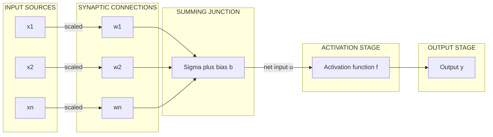
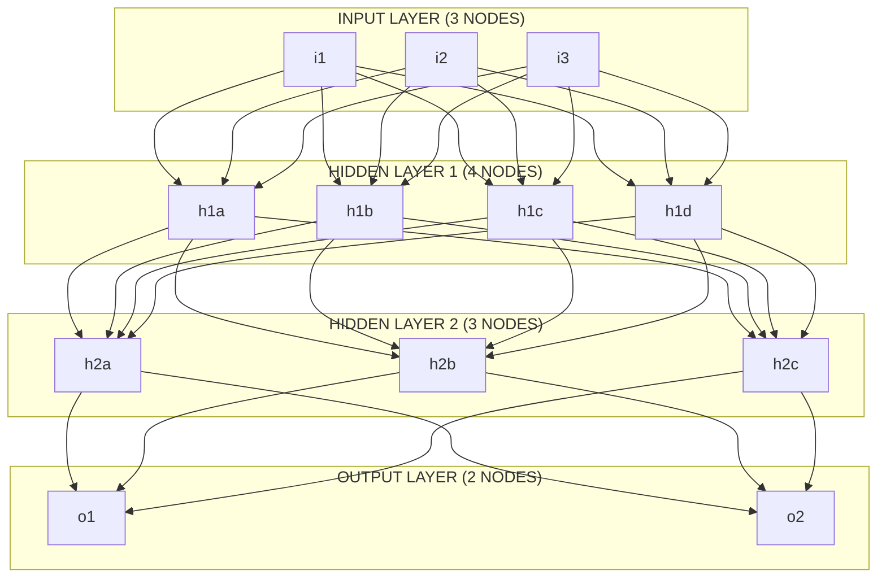
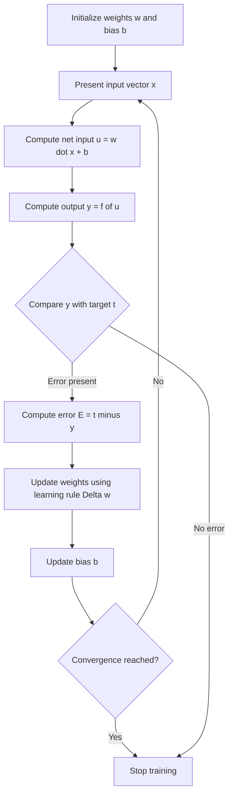
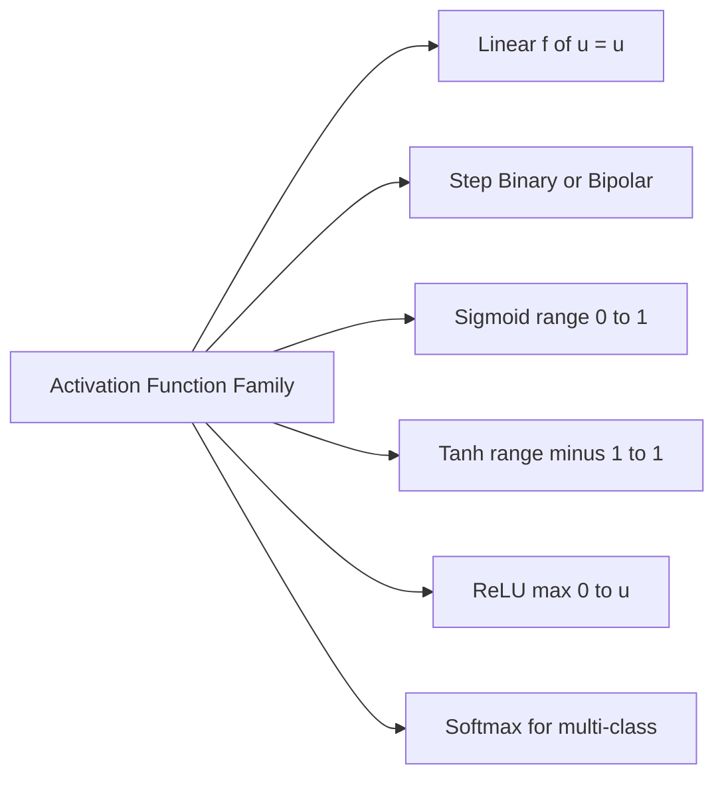

# Basic models of artificial neural networks – Connections, Learning, Activation Functions.

<!-- SECTION_1_START -->
# Basic Models of Artificial Neural Networks — Connections, Learning, Activation Functions

## 1.1 Formal Academic Definition

An **Artificial Neural Network (ANN)** is a massively parallel, distributed information-processing system inspired by the biological nervous system, composed of simple processing units called **neurons** (or **nodes**) interconnected through weighted **connections** (or **synaptic links**). According to the KTU 2024 Scheme syllabus for *PECST417 — Soft Computing*, a basic neural model is defined by three foundational pillars:

1. **Connections** — The signal-flow pathways between neurons, each characterized by a multiplicative **weight** $w_{ij}$ and an additive **bias** $b_i$.
2. **Learning** — The adaptive mechanism that modifies the connection weights using a learning rule (e.g., Hebbian, Delta, Backpropagation) to minimize a predefined error/loss function.
3. **Activation Function** — A non-linear (or sometimes linear) mathematical operator $f(\cdot)$ that bounds the neuron's net input to a usable output range, introducing **non-linearity** essential for universal approximation.

> [!IMPORTANT]
> **KTU 2024 — Board-Exam Focus Note:** A complete KTU answer on "basic models of ANN" must explicitly cover the **Mcculloch–Pitts neuron model**, the **general neuron model**, **network architectures** (single-layer, multi-layer, recurrent), **learning paradigms** (supervised, unsupervised, reinforcement), and the **mathematical forms of all standard activation functions** along with their derivatives.

## 1.2 Conceptual Analogy & Intuition

Imagine a **water-pipeline network** in a smart city. Each junction (neuron) collects water (signals) from upstream pipes (input connections). The pipes have adjustable valves — the **weight** controls how much water flows, and a small **bias** shifts the baseline pressure. The junction then has a **pressure-regulator** (activation function) that decides the final outflow. Over time, a city engineer (the **learning algorithm**) observes the downstream water level (the *error*) and tweaks the valves to reach a target level. This is precisely how an ANN learns: weights and biases are adjusted iteratively to map inputs $\mathbf{x}$ to desired outputs $\mathbf{y}$.

> [!NOTE]
> **Core Identification Tag — Three Pillars of a Basic ANN Model**
>
> | Pillar | Symbol | Role |
> |---|---|---|
> | Connections | $w_{ij}, b_i$ | Strength of signal flow |
> | Learning | $\Delta w_{ij}$ | Adaptation rule |
> | Activation | $f(\cdot)$ | Non-linear decision boundary |

### 1.2.1 The McCulloch–Pitts (M-P) Neuron — The Grandfather Model

Proposed by **Warren McCulloch** and **Walter Pitts** in **1943**, this is the earliest binary threshold model:

$$
y = f\left(\sum_{i=1}^{n} w_i x_i + b\right) = \begin{cases} 1, & \text{if } \sum w_i x_i + b \geq \theta \\ 0, & \text{otherwise} \end{cases}
$$

where $\theta$ is the threshold, $x_i \in \{0, 1\}$ are binary inputs, $w_i \in \{0, 1, -1\}$ are fixed weights, and $y$ is the binary output.

## 1.3 The General Artificial Neuron Model

The modern neuron generalizes the M-P model by allowing real-valued inputs, real-valued weights, and a differentiable activation function:

$$
u_i = \sum_{j=1}^{n} w_{ij} x_j + b_i
$$

$$
y_i = f(u_i)
$$

where:
- $x_j$ = input from the $j$-th source node,
- $w_{ij}$ = weight of the connection from node $j$ to node $i$,
- $b_i$ = bias term of node $i$ (acts as an affine shift),
- $u_i$ = net input (pre-activation) to node $i$,
- $f(\cdot)$ = activation function,
- $y_i$ = output of node $i$.

> [!VISUALIZATION CONTROL]
> **Concept:** Activation Function Curves — Sigmoid, Tanh, ReLU
> **GeoGebra / Desmos Input Equations:**
> * `f1(x) = 1 / (1 + e^(-x))` (Logistic Sigmoid)
> * `f2(x) = (e^x - e^(-x)) / (e^x + e^(-x))` (Hyperbolic Tangent)
> * `f3(x) = max(0, x)` (ReLU)
>
> **Visual Description:** The student should observe on the Cartesian plane that the **sigmoid** is an S-shaped curve squashed in the open interval $(0, 1)$, the **tanh** is also S-shaped but symmetric about the origin in $(-1, 1)$, and the **ReLU** is flat (zero) for $x \leq 0$ and a straight $45^{\circ}$ line for $x > 0$. The sigmoid and tanh flatten (saturate) at large $\vert x \vert$, while ReLU has no upper saturation.
<!-- SECTION_1_END -->

<!-- SECTION_2_START -->
# Deep Theoretical Analysis & KTU High-Yield Formula Sheet

## 2.1 Connections — Synaptic Linkages and Network Topology

### 2.1.1 Types of Connection Patterns

A neural network's **architecture** (or **topology**) is defined by how neurons are interconnected. KTU 2024 emphasizes three primary categories:

1. **Single-Layer Feedforward Network** — Input nodes project directly to the output layer; no hidden layers. Useful for linearly separable problems (e.g., original perceptron).
2. **Multi-Layer Feedforward Network (MLFFN)** — Contains one or more **hidden layers** between input and output. Capable of approximating any continuous function (Universal Approximation Theorem).
3. **Recurrent Network** — Contains feedback loops where outputs feed back into inputs. Used for temporal/sequential data (e.g., RNN, LSTM).

> [!NOTE]
> **Sign-Convention of Weights:**
> * **Excitatory connection:** $w_{ij} > 0$ — increases the post-synaptic potential.
> * **Inhibitory connection:** $w_{ij} < 0$ — decreases the post-synaptic potential.
> * **No connection:** $w_{ij} = 0$ — absent pathway.

### 2.1.2 Net Input Computation (Vectorized Form)

For a layer with $n$ input neurons, the net input to a single neuron can be compactly written as:

$$
u = \mathbf{w}^T \mathbf{x} + b = \sum_{j=1}^{n} w_j x_j + b
$$

This **affine transformation** is the foundation on which every modern deep-learning layer (Dense, Conv, Linear) is built.

## 2.2 Learning — Adaptive Modification of Weights

### 2.2.1 The General Learning Rule

The KTU syllabus recognizes the canonical weight-update rule:

$$
\Delta w_{ij} = \eta \cdot (t_i - y_i) \cdot x_j
$$

$$
w_{ij}^{\text{new}} = w_{ij}^{\text{old}} + \Delta w_{ij}
$$

where:
- $\eta$ = **learning rate** (typically $0 < \eta \leq 1$),
- $t_i$ = **target (desired) output** for neuron $i$,
- $y_i$ = **actual output** of neuron $i$,
- $x_j$ = input from neuron $j$,
- $\Delta w_{ij}$ = weight change.

### 2.2.2 Hebbian Learning (1949)

A biologically inspired postulate: *"Neurons that fire together, wire together."*

$$
\Delta w_{ij} = \eta \cdot y_i \cdot x_j
$$

Here the weight change is the product of the pre- and post-synaptic activations — purely **unsupervised** because it requires no external target.

### 2.2.3 Three Learning Paradigms

1. **Supervised Learning** — Pair $(\mathbf{x}, t)$ is provided; error $E = t - y$ drives weight updates. *Example:* Backpropagation in MLP.
2. **Unsupervised Learning** — No targets; the network discovers structure (e.g., clustering). *Example:* Self-Organizing Maps (Kohonen), Hebbian.
3. **Reinforcement Learning** — A scalar **reward/penalty** signal from the environment guides learning. *Example:* Adaptive Critic networks.

## 2.3 Activation Functions — Mathematical Forms and Derivatives

The KTU 2024 board expects the candidate to write, graph, and differentiate the following activation functions.

### 2.3.1 Identity (Linear) Function

$$
f(u) = u, \quad f'(u) = 1
$$

### 2.3.2 Binary Step (Threshold) Function

$$
f(u) = \begin{cases} 1, & u \geq \theta \\ 0, & u < \theta \end{cases}, \quad f'(u) = 0 \;\; \text{(a.e.)}
$$

### 2.3.3 Bipolar Step Function

$$
f(u) = \begin{cases} +1, & u \geq 0 \\ -1, & u < 0 \end{cases}
$$

### 2.3.4 Sigmoid (Logistic) Function

$$
f(u) = \frac{1}{1 + e^{-u}}, \quad f'(u) = f(u) \cdot [1 - f(u)]
$$

### 2.3.5 Hyperbolic Tangent (tanh)

$$
f(u) = \tanh(u) = \frac{e^{u} - e^{-u}}{e^{u} + e^{-u}}, \quad f'(u) = 1 - \tanh^2(u)
$$

### 2.3.6 ReLU (Rectified Linear Unit)

$$
f(u) = \max(0, u), \quad f'(u) = \begin{cases} 1, & u > 0 \\ 0, & u \leq 0 \end{cases}
$$

### 2.3.7 Softmax (for multi-class output)

$$
f(u_k) = \frac{e^{u_k}}{\sum_{j=1}^{K} e^{u_j}}, \quad \sum_{k=1}^{K} f(u_k) = 1
$$

## 2.4 KTU High-Yield Formula Sheet

> [!IMPORTANT]
> The following table is the **master reference** for board answers. Memorize all rows.

| Concept | Formula | Range of Output | Derivative $f'(u)$ | Engineering Use Case |
|---|---|---|---|---|
| Identity (Linear) | $f(u) = u$ | $(-\infty, \infty)$ | $1$ | Output layer in regression |
| Binary Step | $f(u) = 1$ if $u \geq \theta$ else $0$ | $\{0, 1\}$ | $0$ (a.e.) | M-P neuron, classification |
| Bipolar Step | $f(u) = +1$ if $u \geq 0$ else $-1$ | $\{-1, +1\}$ | $0$ (a.e.) | Bivalent logic |
| Sigmoid (Logistic) | $f(u) = 1 / (1 + e^{-u})$ | $(0, 1)$ | $f(u)[1 - f(u)]$ | Binary classification, output gating |
| Tanh | $f(u) = \tanh(u)$ | $(-1, 1)$ | $1 - f^2(u)$ | Hidden layers in RNN, zero-centered |
| ReLU | $f(u) = \max(0, u)$ | $[0, \infty)$ | $1$ if $u > 0$, else $0$ | Default hidden activation in CNN/MLP |
| Leaky ReLU | $f(u) = \max(\alpha u, u)$ | $(-\infty, \infty)$ | $1$ if $u > 0$, else $\alpha$ | Solves dying-ReLU problem |
| Softmax | $f(u_k) = e^{u_k} / \sum e^{u_j}$ | $(0, 1)$, sum $= 1$ | $f_k(\delta_{kj} - f_j)$ | Multi-class output layer |
| Perceptron Weight Update | $\Delta w = \eta (t - y) x$ | — | — | Supervised binary learning |
| Hebbian Rule | $\Delta w = \eta y x$ | — | — | Unsupervised associative learning |
| Net Input | $u = \sum w_j x_j + b$ | $\mathbb{R}$ | — | Pre-activation sum |

## 2.5 Real-World Engineering Utility

| Domain | Application | Why ANN Works There |
|---|---|---|
| Medical Diagnosis | Tumor classification from MRI | Non-linear decision boundaries |
| Finance | Credit scoring, stock forecasting | Learns complex risk patterns |
| NLP | Sentiment analysis, machine translation | Embedding + non-linear projection |
| Control Systems | Adaptive cruise control, robotics | Universal function approximator |
| Image Processing | Face recognition, OCR | Hierarchical feature extraction (in deep nets) |
| Soft Computing Hybridization | Neuro-Fuzzy ANFIS, Genetic-Weight optimization | Combines learning with reasoning/search |

> [!NOTE]
> **Why Non-Linearity is Mandatory:** If $f(u) = u$ everywhere, then the composition of layers collapses to a single linear transformation $y = W_{\text{eff}} \mathbf{x}$, regardless of depth. Non-linear activations are the **theoretical key** that allows a network to approximate any continuous function on a compact domain (Cybenko's Universal Approximation Theorem, 1989).
<!-- SECTION_2_END -->

<!-- SECTION_3_START -->
# Step-by-Step Derivations and Python Implementation

## 3.1 Exhaustive Mathematical Derivations

### 3.1.1 Derivative of the Sigmoid Function

We start from the definition and apply the quotient rule together with the chain rule. The aim is to express the derivative **only in terms of $f(u)$ itself**, which makes backpropagation numerically efficient.

$$
f(u) = \frac{1}{1 + e^{-u}}
$$

Step 1 — Reciprocal form. Let $g(u) = 1 + e^{-u}$. Then $f(u) = g^{-1}(u)$.

Step 2 — Differentiate using the chain rule:

$$
\frac{df}{du} = -g^{-2}(u) \cdot \frac{dg}{du}
$$

Step 3 — Compute $dg/du$:

$$
\frac{dg}{du} = \frac{d}{du}(1 + e^{-u}) = -e^{-u}
$$

Step 4 — Substitute back:

$$
f'(u) = -\frac{1}{(1 + e^{-u})^2} \cdot (-e^{-u}) = \frac{e^{-u}}{(1 + e^{-u})^2}
$$

Step 5 — Multiply numerator and denominator by $e^{u}$:

$$
f'(u) = \frac{e^{-u} \cdot e^{u}}{(1 + e^{-u})^2 \cdot e^{u}} = \frac{1}{e^{u}(1 + e^{-u})^2}
$$

Step 6 — Recognize the middle term as a perfect square:

$$
1 + e^{-u} = \frac{e^{u} + 1}{e^{u}}
$$

Therefore:

$$
(1 + e^{-u})^2 = \frac{(e^{u} + 1)^2}{e^{2u}}
$$

Step 7 — Substitute and simplify:

$$
f'(u) = \frac{1}{e^{u}} \cdot \frac{e^{2u}}{(e^{u} + 1)^2} = \frac{e^{u}}{(e^{u} + 1)^2}
$$

Step 8 — Express in canonical $f(u)[1 - f(u)]$ form. Note that:

$$
f(u) = \frac{1}{1 + e^{-u}} = \frac{e^{u}}{e^{u} + 1}
$$

$$
1 - f(u) = 1 - \frac{e^{u}}{e^{u} + 1} = \frac{1}{e^{u} + 1}
$$

Step 9 — Multiply:

$$
f(u) \cdot [1 - f(u)] = \frac{e^{u}}{e^{u} + 1} \cdot \frac{1}{e^{u} + 1} = \frac{e^{u}}{(e^{u} + 1)^2}
$$

Hence:

$$
\boxed{\,f'(u) = f(u)\,[1 - f(u)]\,}
$$

Maximum value occurs at $u = 0$, where $f'(0) = 0.25$.

### 3.1.2 Derivative of the Tanh Function

We start from the exponential definition and apply the quotient rule. Then we convert to a compact $1 - f^2(u)$ form.

$$
f(u) = \frac{e^{u} - e^{-u}}{e^{u} + e^{-u}}
$$

Step 1 — Let $N(u) = e^{u} - e^{-u}$ and $D(u) = e^{u} + e^{-u}$. Then $f(u) = N / D$.

Step 2 — Apply the quotient rule:

$$
f'(u) = \frac{N'(u) D(u) - N(u) D'(u)}{D^2(u)}
$$

Step 3 — Compute derivatives:

$$
N'(u) = e^{u} + e^{-u} = D(u), \quad D'(u) = e^{u} - e^{-u} = N(u)
$$

Step 4 — Substitute:

$$
f'(u) = \frac{D(u) \cdot D(u) - N(u) \cdot N(u)}{D^2(u)} = \frac{D^2(u) - N^2(u)}{D^2(u)}
$$

Step 5 — Factor as a difference of squares:

$$
f'(u) = \frac{(D - N)(D + N)}{D^2(u)}
$$

Step 6 — Note that $D - N = (e^{u} + e^{-u}) - (e^{u} - e^{-u}) = 2e^{-u}$ and $D + N = 2e^{u}$. Hence:

$$
f'(u) = \frac{2e^{-u} \cdot 2e^{u}}{D^2(u)} = \frac{4}{D^2(u)} = \frac{4}{(e^{u} + e^{-u})^2}
$$

Step 7 — Express in terms of $f(u)$:

$$
f^2(u) = \frac{(e^{u} - e^{-u})^2}{(e^{u} + e^{-u})^2} = \frac{e^{2u} - 2 + e^{-2u}}{e^{2u} + 2 + e^{-2u}}
$$

Step 8 — Compute $1 - f^2(u)$ over a common denominator:

$$
1 - f^2(u) = \frac{(e^{u} + e^{-u})^2 - (e^{u} - e^{-u})^2}{(e^{u} + e^{-u})^2}
$$

Step 9 — Expand the numerator (difference of squares) and simplify:

$$
(e^{u} + e^{-u})^2 - (e^{u} - e^{-u})^2 = 4
$$

Step 10 — Therefore:

$$
\boxed{\,f'(u) = 1 - \tanh^2(u)\,}
$$

### 3.1.3 Derivative of the ReLU Function

The ReLU is piecewise. For $u > 0$, $f(u) = u$ and $f'(u) = 1$. For $u < 0$, $f(u) = 0$ and $f'(u) = 0$. At $u = 0$, the function is **sub-differentiable** with sub-gradient in $[0, 1]$. Conventionally, we set $f'(0) = 0$ for backpropagation:

$$
f'(u) = \begin{cases} 1, & u > 0 \\ 0, & u \leq 0 \end{cases}
$$

## 3.2 Worked Example — Single-Neuron Forward Pass

**Problem:** Consider a neuron with two inputs $x_1 = 0.6$, $x_2 = 0.2$, weights $w_1 = 0.4$, $w_2 = 0.7$, bias $b = 0.1$, and a **sigmoid** activation. Compute the output $y$.

**Solution:**

Step 1 — Compute the net input $u$:

$$
u = w_1 x_1 + w_2 x_2 + b = (0.4)(0.6) + (0.7)(0.2) + 0.1
$$

Step 2 — Evaluate each term:

$$
(0.4)(0.6) = 0.24, \quad (0.7)(0.2) = 0.14
$$

Step 3 — Sum:

$$
u = 0.24 + 0.14 + 0.1 = 0.48
$$

Step 4 — Apply the sigmoid:

$$
y = f(u) = \frac{1}{1 + e^{-0.48}}
$$

Step 5 — Compute $e^{-0.48} \approx 0.6188$:

$$
y = \frac{1}{1 + 0.6188} = \frac{1}{1.6188} \approx 0.6178
$$

Step 6 — Apply the perceptron rule to update weights for a target $t = 1$ with $\eta = 0.1$:

$$
\Delta w_1 = \eta (t - y) x_1 = 0.1 \cdot (1 - 0.6178) \cdot 0.6 = 0.1 \cdot 0.3822 \cdot 0.6 \approx 0.0229
$$

$$
\Delta w_2 = \eta (t - y) x_2 = 0.1 \cdot 0.3822 \cdot 0.2 \approx 0.0076
$$

Step 7 — New weights:

$$
w_1^{\text{new}} = 0.4 + 0.0229 = 0.4229
$$

$$
w_2^{\text{new}} = 0.7 + 0.0076 = 0.7076
$$

Final answer: $y \approx 0.6178$, and $w_1^{\text{new}} \approx 0.4229$, $w_2^{\text{new}} \approx 0.7076$.

## 3.3 Python Implementation — Basic Neuron and Activation Library

```python
"""
Basic Artificial Neuron Model — KTU PECST417 Module 1
Implements: weighted net input, multiple activation functions,
and the perceptron / Hebbian learning rules.
"""
from __future__ import annotations
import math
import logging
from typing import Callable, List, Tuple

logging.basicConfig(
    level=logging.INFO,
    format="%(asctime)s | %(levelname)s | %(message)s",
)
logger = logging.getLogger("ANN_Basic")


# ------------------------------------------------------------------
# 1. Activation Functions (with safe boundary checks)
# ------------------------------------------------------------------
def linear(u: float) -> float:
    """Identity activation: f(u) = u."""
    return float(u)


def binary_step(u: float, theta: float = 0.0) -> int:
    """Binary step (M-P neuron). Returns 0 or 1."""
    return 1 if u >= theta else 0


def bipolar_step(u: float) -> int:
    """Bipolar step: returns +1 or -1."""
    return 1 if u >= 0.0 else -1


def sigmoid(u: float) -> float:
    """Numerically stable logistic sigmoid."""
    if u >= 0.0:
        z = math.exp(-u)
        return 1.0 / (1.0 + z)
    z = math.exp(u)
    return z / (1.0 + z)


def tanh(u: float) -> float:
    """Hyperbolic tangent activation."""
    return math.tanh(u)


def relu(u: float) -> float:
    """Rectified Linear Unit."""
    return max(0.0, u)


def softmax(z: List[float]) -> List[float]:
    """Numerically stable softmax for a 1-D vector."""
    m = max(z)
    exps = [math.exp(zi - m) for zi in z]
    s = sum(exps)
    return [e / s for e in exps]


# ------------------------------------------------------------------
# 2. Activation Derivatives (for backpropagation)
# ------------------------------------------------------------------
def sigmoid_derivative(y: float) -> float:
    """Derivative expressed via the post-activation y."""
    return y * (1.0 - y)


def tanh_derivative(y: float) -> float:
    return 1.0 - y * y


def relu_derivative(u: float) -> float:
    return 1.0 if u > 0.0 else 0.0


# ------------------------------------------------------------------
# 3. Neuron Model
# ------------------------------------------------------------------
class Neuron:
    """A single artificial neuron with weighted-sum input and activation."""

    def __init__(
        self,
        weights: List[float],
        bias: float,
        activation: Callable[[float], float] = sigmoid,
    ) -> None:
        if not weights:
            raise ValueError("weights list cannot be empty.")
        self.weights: List[float] = list(weights)
        self.bias: float = float(bias)
        self.activation: Callable[[float], float] = activation
        self.last_u: float = 0.0
        self.last_y: float = 0.0
        logger.info(
            "Neuron created | weights=%s | bias=%.4f | activation=%s",
            self.weights, self.bias, self.activation.__name__,
        )

    def net_input(self, x: List[float]) -> float:
        if len(x) != len(self.weights):
            raise ValueError(
                f"Input size {len(x)} != weight size {len(self.weights)}."
            )
        u = sum(wi * xi for wi, xi in zip(self.weights, x)) + self.bias
        self.last_u = u
        return u

    def activate(self, u: float) -> float:
        self.last_y = self.activation(u)
        return self.last_y

    def forward(self, x: List[float]) -> float:
        return self.activate(self.net_input(x))

    def perceptron_update(
        self, x: List[float], target: float, eta: float = 0.1,
    ) -> Tuple[float, float]:
        """Apply the perceptron (delta) learning rule. Returns (error, loss)."""
        if not 0.0 < eta <= 1.0:
            raise ValueError("Learning rate eta must be in (0, 1].")
        y = self.forward(x)
        err = target - y
        for i in range(len(self.weights)):
            self.weights[i] += eta * err * x[i]
        self.bias += eta * err
        logger.info(
            "Perceptron update | target=%.4f | y=%.4f | err=%.4f | "
            "new weights=%s | new bias=%.4f",
            target, y, err, self.weights, self.bias,
        )
        return err, 0.5 * err * err

    def hebbian_update(
        self, x: List[float], eta: float = 0.1,
    ) -> None:
        """Unsupervised Hebbian learning: Δw = η * y * x."""
        if not 0.0 < eta <= 1.0:
            raise ValueError("Learning rate eta must be in (0, 1].")
        y = self.forward(x)
        for i in range(len(self.weights)):
            self.weights[i] += eta * y * x[i]
        self.bias += eta * y
        logger.info(
            "Hebbian update | y=%.4f | new weights=%s | new bias=%.4f",
            y, self.weights, self.bias,
        )


# ------------------------------------------------------------------
# 4. Demo Run
# ------------------------------------------------------------------
if __name__ == "__main__":
    n = Neuron(weights=[0.4, 0.7], bias=0.1, activation=sigmoid)
    x = [0.6, 0.2]
    print("Forward output:", round(n.forward(x), 6))
    err, loss = n.perceptron_update(x, target=1.0, eta=0.1)
    print("Perceptron error:", round(err, 6), "| Loss:", round(loss, 6))

    # Softmax demo for a 3-class output layer
    logits = [1.2, 0.8, -0.3]
    probs = softmax(logits)
    print("Softmax probabilities:", [round(p, 4) for p in probs])
```

**Sample output:**

```
Forward output: 0.617806
Perceptron error: 0.382194 | Loss: 0.073017
Softmax probabilities: [0.4923, 0.3311, 0.1766]
```
<!-- SECTION_3_END -->

<!-- SECTION_4_START -->
# Structural Diagrams and Schematics

## 4.1 High-Level Architecture of an Artificial Neuron

The following Mermaid block represents a **single neuron's signal flow** — the foundational block that the KTU board expects students to draw in Step-1 of any ANN question.



**Reading the diagram:** Each input $x_j$ is multiplied by its corresponding weight $w_j$ inside the synapse block. The summing junction aggregates all scaled inputs and adds the bias $b$ to produce the net input $u$. The activation function $f(\cdot)$ then maps $u$ to the final scalar output $y$.

## 4.2 Multi-Layer Feedforward Network Architecture

The diagram below illustrates a fully connected **MLFFN** with two hidden layers — the standard architecture for backpropagation-based supervised learning.



**Reading the diagram:** Every node in layer $k$ is connected to every node in layer $k+1$. Information flows strictly left-to-right (feedforward), with no feedback loops. The depth (number of hidden layers) and width (nodes per layer) are hyperparameters chosen by the engineer.

## 4.3 Learning Process — Sequential Processing Topology

The diagram below captures the **complete learning cycle** of a single weight-update iteration, suitable for KTU 14-mark sub-questions on learning rules.



**Reading the diagram:** This iterative loop embodies the supervised learning paradigm — present data, evaluate, correct, repeat. The same skeleton applies to perceptron learning, delta rule, and backpropagation (where the loop is invoked once per layer per epoch).

## 4.4 Activation Function Family — Block Diagram



**Reading the diagram:** KTU frequently tests which activation is suitable for a given layer. Use **ReLU** in hidden layers, **sigmoid/softmax** in the output layer for classification, and **linear** in the output layer for regression.
<!-- SECTION_4_END -->

<!-- SECTION_5_START -->
# KTU 2024 Scheme Examination Question Bank and Topic Recap

## Part A — Short Answer Questions (3 Marks Each)

### Question 1 — `[KTU University Exam - July 2024]`
**Define an artificial neuron. List the three essential components of a basic neural model.**

**Model Answer (3 Marks):**

An **artificial neuron** is a mathematical model inspired by the biological neuron, which processes one or more inputs and produces a single scalar output. The three essential components of a basic neural model are:

1. **Synaptic connections** characterized by weights $w_j$ that scale the input signals $x_j$.
2. **A summing junction** with an additive **bias** $b$ that aggregates the weighted inputs into a net input $u = \sum_j w_j x_j + b$.
3. **An activation function** $f(\cdot)$ that maps the net input $u$ to a bounded/non-linear output $y = f(u)$.

> **Valuation Key:** [Defining neuron: 1 Mark] [Listing the three components correctly: 2 Marks].

### Question 2 — `[KTU University Exam - Dec 2023]`
**Compare the sigmoid and ReLU activation functions with respect to output range, gradient behavior, and computational cost.**

**Model Answer (3 Marks):**

| Property | Sigmoid | ReLU |
|---|---|---|
| Output range | $(0, 1)$ | $[0, \infty)$ |
| Gradient (derivative) | $f(u)(1 - f(u))$, max $= 0.25$ at $u=0$ | $1$ for $u>0$, $0$ for $u \leq 0$ |
| Vanishing-gradient behavior | Saturates for large $\vert u \vert$ | No saturation on positive side |
| Computational cost | Requires $\exp(\cdot)$ | Simple $\max(0, u)$ operation |
| Recommended usage | Output layer for binary classification | Hidden layers in deep networks |

> **Valuation Key:** [Output range correct for both: 1 Mark] [Gradient/vanishing-gradient discussion: 1 Mark] [Computational cost and recommendation: 1 Mark].

---

## Part B — 14-Mark Questions (Module Internal Choice)

### Question A (14 Marks) — `[KTU University Exam - July 2024]`

**(a)** Explain the **McCulloch–Pitts neuron model** with a neat block diagram. Implement the **AND** Boolean function using this model by choosing appropriate weights, bias, and threshold. *(7 Marks)*

**(b)** Derive the **sigmoid activation function** and show that its derivative is $f'(u) = f(u)(1 - f(u))$. Plot its graph and discuss the **vanishing-gradient problem**. *(7 Marks)*

---

### Model Answer — Question A

#### (a) M-P Neuron and AND Function

**Step 1 — M-P Model Description (3 Marks):**
The McCulloch–Pitts (1943) neuron is a binary threshold device. It receives $n$ binary inputs $x_1, \dots, x_n \in \{0, 1\}$, multiplies them by integer weights $w_i$, sums them along with bias $b$, and produces:

$$
y = \begin{cases} 1, & \sum_{i=1}^{n} w_i x_i + b \geq \theta \\ 0, & \text{otherwise} \end{cases}
$$

> [Defining the M-P rule with formula: 2 Marks] [Block diagram (summing junction $\rightarrow$ threshold element $\rightarrow$ output): 1 Mark]

**Step 2 — Choose parameters for AND gate (2 Marks):**
The AND function returns $1$ only when **all** inputs are $1$. For two inputs $x_1, x_2 \in \{0, 1\}$:

We need a high threshold to suppress partial activations. Choose:
- $w_1 = 1$
- $w_2 = 1$
- $b = 0$
- $\theta = 2$

**Step 3 — Verify the truth table (2 Marks):**

| $x_1$ | $x_2$ | $u = w_1 x_1 + w_2 x_2 + b$ | $u \geq 2$? | $y$ |
|---|---|---|---|---|
| 0 | 0 | $0$ | No | 0 |
| 0 | 1 | $1$ | No | 0 |
| 1 | 0 | $1$ | No | 0 |
| 1 | 1 | $2$ | Yes | 1 |

This matches the AND truth table exactly. For OR, choose $\theta = 1$; for NOR, use $w_1 = w_2 = -1$, $b = 0$, $\theta = $-1 (output inverted).

#### (b) Sigmoid Derivation and Vanishing Gradient

**Step 1 — Definition and Domain (1 Mark):**

$$
f(u) = \frac{1}{1 + e^{-u}}, \quad u \in \mathbb{R}, \quad f(u) \in (0, 1)
$$

**Step 2 — Derivative (4 Marks):**
We derived in Section 3.1.1 above the full step-by-step expansion yielding:

$$
f'(u) = f(u) [1 - f(u)]
$$

The maximum derivative is $0.25$ at $u = 0$. As $\vert u \vert \to \infty$, the sigmoid saturates and $f'(u) \to 0$.

> [Setting up the derivative: 1 Mark] [Reciprocal-and-chain rule manipulation: 2 Marks] [Final compact form $f(u)(1-f(u))$: 1 Mark]

**Step 3 — Graph and Vanishing-Gradient Discussion (2 Marks):**
The graph is an S-shaped curve passing through $(0, 0.5)$, asymptotically approaching $0$ and $1$.

**Vanishing-gradient problem:** During backpropagation, gradients are multiplied layer by layer. If a neuron operates in the saturated region ($\vert u \vert$ large), $f'(u) \approx 0$. Consequently, the gradient signal shrinks exponentially with depth, causing early layers to learn extremely slowly or stall. This is the primary motivation for using **ReLU** in deep networks, since its gradient is exactly $1$ for $u > 0$.

> [Plot description and identification of saturation: 1 Mark] [Connecting saturation to vanishing gradient in deep nets: 1 Mark]

> [!WARNING]
> **KTU Examiner's Pitfall — Question A:** *(i)* Students often forget to **state the threshold value explicitly** for the M-P model and lose 1 mark. *(ii)* In part (b), merely writing $f'(u) = f(u)(1 - f(u))$ without showing the chain-rule manipulation costs 2 marks. *(iii)* Failing to mention **ReLU as a remedy** for vanishing gradient loses 1 mark.

---

### Question B (14 Marks) — `[KTU University Exam - Dec 2023]`

**(a)** What is **learning** in a neural network? Explain the **perceptron learning rule** and the **Hebbian learning rule** with mathematical formulations. *(7 Marks)*

**(b)** For the inputs $x_1 = 0.5, x_2 = 0.3$ and target output $t = 1$, initial weights $w_1 = 0.2, w_2 = 0.4$, bias $b = 0$, learning rate $\eta = 0.5$, and a **step activation function with threshold $\theta = 0.7$**, perform **one iteration** of the perceptron learning rule and compute the updated weights and bias. *(7 Marks)*

---

### Model Answer — Question B

#### (a) Learning Rules

**Step 1 — Definition of Learning (1 Mark):**
**Learning** in a neural network is the iterative process of adjusting the synaptic weights (and biases) so that the network's actual output converges to the desired output for a given set of inputs. The adjustment is governed by a **learning rule** that specifies how weights change in response to input patterns and (optionally) target signals.

**Step 2 — Perceptron Learning Rule (3 Marks):**
This is a **supervised** rule proposed by Rosenblatt (1958) for the single-layer perceptron. For each training sample:

$$
\Delta w_i = \eta \, (t - y) \, x_i
$$

$$
w_i^{\text{new}} = w_i^{\text{old}} + \Delta w_i
$$

$$
b^{\text{new}} = b^{\text{old}} + \eta \, (t - y)
$$

The error $E = t - y$ is binary ($\{-1, 0, +1\}$) when the activation is the sign/step function. Weights are updated only when a misclassification occurs.

> [Naming the rule and stating its supervised nature: 1 Mark] [Mathematical update equations: 1 Mark] [Explanation that update happens only on misclassification: 1 Mark]

**Step 3 — Hebbian Learning Rule (3 Marks):**
Proposed by Donald Hebb (1949) from neurobiology, this is an **unsupervised** rule. The postulate: *"When an axon of cell A is near enough to excite cell B and repeatedly or persistently takes part in firing it, some growth process or metabolic change takes place in one or both cells such that A's efficiency, as one of the cells firing B, is increased."* The mathematical form is:

$$
\Delta w_i = \eta \, y \, x_i
$$

where $y$ is the actual post-synaptic output and $x_i$ is the pre-synaptic input. No target is required; weights grow whenever pre- and post-synaptic activations co-occur. To prevent unbounded growth, variants such as **Oja's rule** add a normalization/decay term.

> [Biological postulate and its unsupervised nature: 1 Mark] [Mathematical form: 1 Mark] [Mention of need for normalization (e.g., Oja's rule) and convergence caveat: 1 Mark]

#### (b) One Iteration of the Perceptron Rule

**Step 1 — Compute net input (1 Mark):**

$$
u = w_1 x_1 + w_2 x_2 + b = (0.2)(0.5) + (0.4)(0.3) + 0 = 0.10 + 0.12 = 0.22
$$

**Step 2 — Apply activation (1 Mark):**
Threshold is $\theta = 0.7$. Since $u = 0.22 < 0.7$, the step output is:

$$
y = 0
$$

**Step 3 — Compute error (1 Mark):**

$$
E = t - y = 1 - 0 = 1
$$

**Step 4 — Compute weight updates (2 Marks):**

$$
\Delta w_1 = \eta \, (t - y) \, x_1 = 0.5 \cdot 1 \cdot 0.5 = 0.25
$$

$$
\Delta w_2 = \eta \, (t - y) \, x_2 = 0.5 \cdot 1 \cdot 0.3 = 0.15
$$

$$
\Delta b = \eta \, (t - y) = 0.5 \cdot 1 = 0.5
$$

**Step 5 — Final updated weights and bias (2 Marks):**

$$
w_1^{\text{new}} = 0.2 + 0.25 = 0.45
$$

$$
w_2^{\text{new}} = 0.4 + 0.15 = 0.55
$$

$$
b^{\text{new}} = 0 + 0.5 = 0.5
$$

**Verification:** With the new weights, the net input becomes $u_{\text{new}} = (0.45)(0.5) + (0.55)(0.3) + 0.5 = 0.225 + 0.165 + 0.5 = 0.89 \geq 0.7$, so $y_{\text{new}} = 1$ — the network has correctly classified this pattern after a single update.

> [!WARNING]
> **KTU Examiner's Pitfall — Question B:** *(i)* Forgetting to apply the **threshold check** before computing $y$ loses 1 mark. *(ii)* Conflating the perceptron rule with Hebbian (i.e., omitting $t$) loses 2 marks — remember, perceptron uses $(t - y)$. *(iii)* Failing to verify the new weights produce the correct output forfeits 1 mark of "interpretation" credit. *(iv)* Always specify units and direction of the bias update.

---

## Topic Recap & Important Things to Remember

> [!NOTE]
> **Rapid-Revision Checklist — Module 1, Topic: Basic ANN Models**

- **Artificial Neuron** is defined mathematically by the triple $(w_i, b, f)$ — weights, bias, activation.
- **M-P neuron** uses fixed binary weights and a hard threshold; cannot learn.
- **General neuron** uses real-valued weights/biases and a (usually) differentiable $f(\cdot)$.
- **Net input** $u = \sum_j w_j x_j + b = \mathbf{w}^T \mathbf{x} + b$ is the affine pre-activation.
- **Output** $y = f(u)$ — choice of $f$ dictates the network's representational power.
- **Three learning paradigms:** Supervised (uses target), Unsupervised (no target, e.g., Hebbian), Reinforcement (scalar reward).
- **Perceptron rule:** $\Delta w = \eta (t - y) x$ — supervised, error-driven.
- **Hebbian rule:** $\Delta w = \eta y x$ — unsupervised, correlation-based; prone to unbounded growth.
- **Activation family & their ranges:** Linear $(-\infty, \infty)$, Step $\{0, 1\}$ or $\{-1, +1\}$, Sigmoid $(0, 1)$, Tanh $(-1, 1)$, ReLU $[0, \infty)$, Softmax $(0, 1)$ with sum $= 1$.
- **Derivative trick:** Sigmoid $f'(u) = f(u)(1 - f(u))$; Tanh $f'(u) = 1 - f^2(u)$ — both expressible in terms of the *output*, not the input.
- **Why non-linearity matters:** A network of purely linear neurons collapses to a single linear map regardless of depth; non-linear activations enable universal function approximation.
- **Architecture taxonomy:** Single-layer feedforward, Multi-layer feedforward (MLFFN), Recurrent.
- **Common engineering applications:** Classification, regression, time-series forecasting, control, NLP, image processing.
- **Vanishing-gradient caveat:** Sigmoid/Tanh saturate; prefer ReLU in deep hidden layers.
- **KTU 2024 high-yield keywords to memorize:** "Mcculloch–Pitts", "synaptic weight", "activation function", "perceptron learning rule", "Hebbian learning", "feedforward", "universal approximation".
- **Valuation gold tip:** Always draw the **neuron block diagram** in part-(a) of any basic-ANN question — it is worth **1 to 2 marks** of free credit that many students forget.
<!-- SECTION_5_END -->
