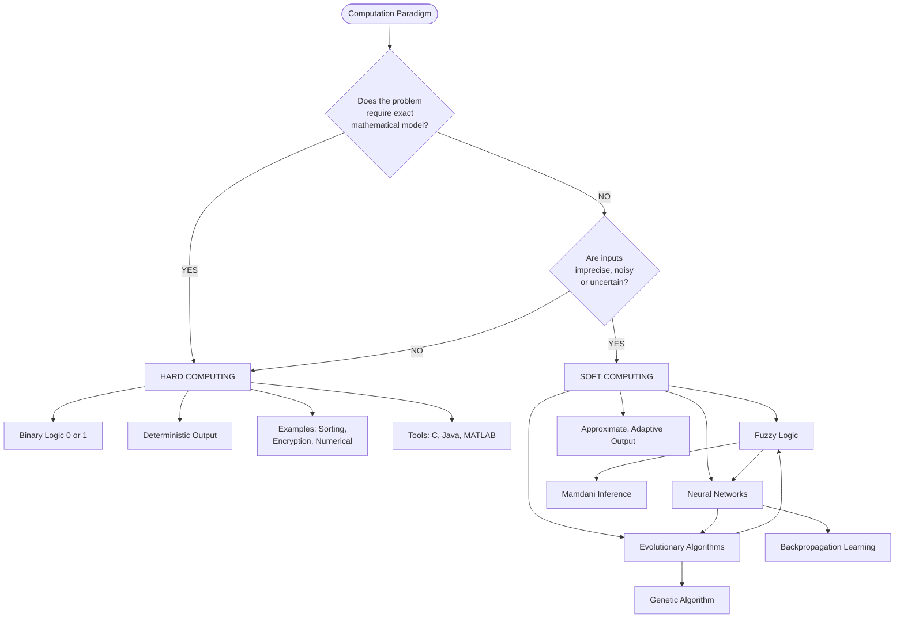
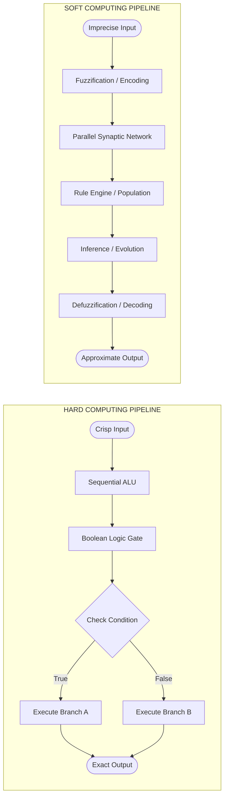
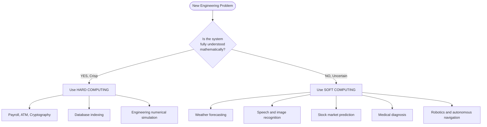
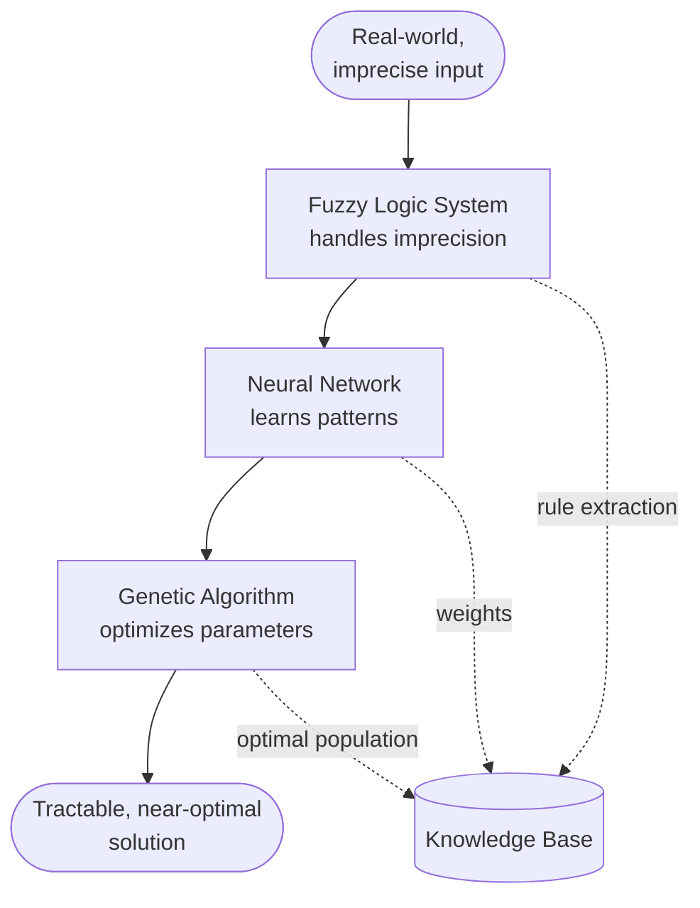

# Difference between Hard Computing & Soft Computing.

<!-- SECTION_1_START -->
# Hard Computing vs. Soft Computing — KTU 2024 Scheme Foundation Note

## 1. Core Technical Definition & Intuitive Overview

### Formal Academic Definition (KTU 2024 Syllabus Terminology)

> [!NOTE]
> **Hard Computing** is the conventional, classical paradigm of computation that requires a precisely stated analytical model, exact input data, deterministic algorithms, and produces a guaranteed, exact, mathematically rigorous output within a finite, deterministic time frame. It operates on **binary (Boolean) logic**, crisp set theory, and crisp numerical values.

> [!NOTE]
> **Soft Computing** is a collection of methodologies (Fuzzy Logic, Artificial Neural Networks, Evolutionary Computation, and Probabilistic Reasoning) that work synergistically to provide, inexpensively, approximate, tolerant, and tractable solutions to complex, real-world problems where **imprecision, uncertainty, partial truth, and approximation** are inherent. The term was coined by **Prof. Lotfi A. Zadeh** in **1992**.

### Conceptual Analogy / Intuition

Imagine you are navigating from KTU Campus (Thiruvananthapuram) to the Cochin International Airport:

- **Hard Computing Approach** is like using a **GPS with a pre-loaded, perfectly accurate digital map**. The map must be 100% accurate, every road is either "open (1)" or "closed (0)", every distance is measured to the millimeter, and the route returned is **mathematically optimal and guaranteed correct**. If one road segment is missing in the map data, the GPS **fails completely** — it does not "guess" an alternate path.

- **Soft Computing Approach** is like asking a **local Kerala auto-driver (rach-cha)** for directions. He says *"Sahodare, edathu kondu pokoo, traffic undavillel left-ilek pokaam"* (Take that road, if there's traffic, turn left). He tolerates **fuzzy information** (a vague estimate of "10-minute drive"), **learns from experience** (he knows which routes are busy on Monday mornings), and produces a **good-enough answer** that is **adaptive, approximate, and useful** even when the map is outdated.

> [!IMPORTANT]
> **Key Takeaway for KTU Board:** Soft Computing is **NOT a replacement** for Hard Computing — it is a **complementary partner** for problems where Hard Computing is *intractable* (NP-hard) or *unsolvable* with crisp models (e.g., human cognition, weather prediction, stock forecasting).

### GeoGebra / Desmos Integration

> [!VISUALIZATION CONTROL]
> **Concept:** Membership Curve Contrast — Crisp (Hard) Set vs. Fuzzy (Soft) Set Membership
> **GeoGebra / Desmos Input Equations:**
> * `f_hard(x) = if(x >= 25, 1, 0)`  *(Hard/Crisp Step Function for "Adult")*
> * `f_soft(x) = 1 / (1 + e^(-0.5*(x - 25)))`  *(Soft Sigmoid for Fuzzy "Adult")*
> **Visual Description:** On the x-axis (Age in years), the **hard curve** is a vertical step at $x = 25$ (a person is either a 0 or 1 adult). The **soft curve** is a smooth S-curve, where a 22-year-old is "somewhat adult" with degree $\mu \approx 0.3$, and a 30-year-old is "fully adult" with degree $\mu \approx 0.99$.

---

<!-- SECTION_1_END -->

<!-- SECTION_2_START -->
# Deep Theoretical Analysis & KTU High-Yield Formula Sheet

## 2. Theoretical Decomposition — Why and How

### 2.1 The Philosophical Foundation of Hard Computing

Hard Computing rests on three classical assumptions, formalized in the **Church–Turing Thesis** and classical propositional logic:

1. **Precision is mandatory** — every input must be a crisp numerical value or a symbol from a closed alphabet.
2. **Determinism is guaranteed** — the same input must always yield the same output (a pure function).
3. **Computability is bounded by closed-form solutions** — the problem must have a known algorithmic solution in polynomial time for tractable cases.

A formal expression of a Hard Computing task:

$$y = f(x), \quad \text{where } x \in \mathbb{R}^n, \quad f: \mathbb{R}^n \rightarrow \mathbb{R}^m, \quad y = f(x) \text{ is exact}$$

### 2.2 The Philosophical Foundation of Soft Computing

Soft Computing (introduced by **Lotfi Zadeh, 1992**) is built on the principle of **exploiting the tolerance for imprecision** to achieve **tractability, robustness, low solution cost, and better rapport with reality**.

The guiding principle is mathematically expressed through the **Principle of Incompatibility** (Zadeh, 1973):

> *"As the complexity of a system increases, our ability to make precise and yet significant statements about its behavior diminishes until a threshold is reached beyond which precision and significance (relevance) become almost mutually exclusive characteristics."*

Formally, the system output is a **soft, tolerance-tolerant function**:

$$\tilde{y} = \tilde{F}(\tilde{x}), \quad \text{where } \tilde{x} \in \mathbb{X}_{\text{approx}}, \quad \tilde{F} \text{ admits approximation and learning}$$

### 2.3 The Three Pillars of Soft Computing (KTU Module-1 Focus)

1. **Fuzzy Logic (FL)** — Handles *imprecision* and *linguistic reasoning* via membership functions $\mu_A(x) \in [0, 1]$.
2. **Artificial Neural Networks (ANN)** — Handles *learning* and *pattern recognition* via weighted synaptic connections $w_{ij}$ updated by gradient descent.
3. **Evolutionary Computation (GA / ES / EP)** — Handles *optimization and search* via population-based stochastic operators (selection, crossover, mutation).

A hybrid system combining these is often symbolized as:

$$S_{\text{soft}} = f_{\text{FL}} \circ f_{\text{ANN}} \circ f_{\text{GA}}$$

> [!TIP]
> **Production Utility in Engineering:** Soft Computing is the engine behind real-world systems like **automobile automatic transmission (Honda, Toyota)**, **washing machine controllers (LG, Samsung fuzzy washers)**, **stock market forecasting (LSTM + GA hybrids)**, **medical diagnosis (fuzzy expert systems)**, and **Google's search ranking (neural + evolutionary weight tuning)**.

## KTU Formula Sheet / Cheat Sheet (Comparison Matrix)

| **Parameter** | **Hard Computing** | **Soft Computing** |
|---|---|---|
| **Core Definition** | Conventional, algorithmic, deterministic computation | Approximate, tolerant, heuristic computation |
| **Logic Foundation** | Binary / Boolean logic $\{0, 1\}$ | Fuzzy logic with membership $\mu \in [0, 1]$ |
| **Data Type** | Precise, crisp, exact inputs | Imprecise, noisy, fuzzy, partial inputs |
| **Output Type** | Exact, guaranteed-correct answer | Approximate, near-optimal, acceptable answer |
| **Determinism** | Fully deterministic (same input $\Rightarrow$ same output) | Stochastic / probabilistic (may vary across runs) |
| **Model Requirement** | Closed-form mathematical model **mandatory** | Mathematical model **not strictly required** |
| **Processing Mode** | Sequential (mostly) | Parallel (inherently distributed) |
| **Computation Time** | Polytime, predictable, finite | Variable, often long, but tractable for NP-hard problems |
| **Learning Capability** | No inherent learning — explicitly programmed | Self-learning, adaptive, evolves from data |
| **Knowledge Source** | Programmer / expert hard-codes rules | Learns from data samples (training) or expert rules |
| **Tolerance to Faults** | Low — a single bit-flip may collapse the system | High — graceful degradation under noise |
| **Membership Set Type** | Crisp set $A: X \rightarrow \{0, 1\}$ | Fuzzy set $\tilde{A}: X \rightarrow [0, 1]$ |
| **Search Strategy** | Exhaustive / heuristic-but-deterministic | Population-based, stochastic (GA), gradient-based (ANN) |
| **System Boundary** | Sharp, well-defined boundaries | Smooth, gradient, overlapping boundaries |
| **Imprecision Stance** | **Avoids** imprecision at all costs | **Exploits** imprecision as a feature |
| **Tolerance Principle** | Imprecision $\Rightarrow$ unreliability | Imprecision $\Rightarrow$ low cost, high tractability |
| **Characteristic Trait** | Precision, certainty, rigorousness | Approximation, learning, adaptability |
| **Algorithm Examples** | Quick Sort, Dijkstra, RSA encryption, Newton–Raphson | Backpropagation, Genetic Algorithm, Mamdani Fuzzy Inference |
| **Founder / Origin** | Alan Turing, John von Neumann, Alonzo Church | Lotfi A. Zadeh (1992 — coined "Soft Computing") |
| **Tool/Implementation** | C, Java, MATLAB numerical routines | Fuzzy Toolboxes (MATLAB), TensorFlow, PyTorch, WEKA |
| **Real-world Application** | Payroll, ATM transactions, cryptography | Weather forecasting, medical diagnosis, voice/speech recognition |
| **Suitability for Real Life** | Limited for human-like, ambiguous problems | Excellent for human-like, ambiguous, real-world problems |
| **Boolean State** | Strict $0$ or $1$ | Continuous graded values between $0$ and $1$ |

---

<!-- SECTION_2_END -->

<!-- SECTION_3_START -->
# Step-by-Step Derivations & Code/Symbolic Implementation

## 3. Worked Comparison — A Step-by-Step Analytical Walkthrough

### 3.1 Worked Example 1: Temperature Control in a Boiler

Consider the problem: *"Maintain the water temperature of a boiler at 60 °C."*

#### Part A — Hard Computing Approach (Step-by-Step)

**Step 1: Define crisp threshold.**
The system must enforce a binary decision rule.

$$T_{\text{set}} = 60 \,^\circ\text{C}, \quad T_{\text{error}} = T_{\text{actual}} - T_{\text{set}}$$

**Step 2: Apply crisp control law (ON-OFF controller).**

$$
u(t) =
\begin{cases}
1 \; (\text{Heater ON}), & \text{if } T_{\text{actual}} < 60 \,^\circ\text{C} \\
0 \; (\text{Heater OFF}), & \text{if } T_{\text{actual}} \geq 60 \,^\circ\text{C}
\end{cases}
$$

**Step 3: Evaluate transitions.**
- At $T = 59.9 \,^\circ\text{C}$ $\rightarrow u = 1$ (Heater ON)
- At $T = 60.0 \,^\circ\text{C}$ $\rightarrow u = 0$ (Heater OFF)
- At $T = 60.1 \,^\circ\text{C}$ $\rightarrow u = 0$ (Heater OFF)

**Step 4: Result.**
The output is a **square-wave oscillation** around $60 \,^\circ\text{C}$ — a phenomenon called *limit cycling*. The system is precise but **inefficient** (constant switching) and **uncomfortable** for a real industrial process.

> [!IMPORTANT]
> **KTU Valuation Point:** Hard computing on this problem **fails to use linguistic reasoning** like "slightly cold" or "moderately hot" — a major limitation.

#### Part B — Soft Computing Approach (Step-by-Step)

**Step 1: Define fuzzy linguistic variables.**
Partition the temperature range into overlapping fuzzy sets:
- **Cold** $\rightarrow$ trapezoidal / triangular membership
- **Warm** $\rightarrow$ triangular membership
- **Hot** $\rightarrow$ trapezoidal / triangular membership

**Step 2: Define membership function (e.g., for the set "Warm" centered at 60).**

$$\mu_{\text{Warm}}(T) = \max\left(0, \; \min\left(\frac{T - 50}{10}, \; \frac{70 - T}{10}\right)\right)$$

**Step 3: Define fuzzy rules (Mamdani style).**
- **R1:** IF temperature is *Cold* THEN heater power is *High*
- **R2:** IF temperature is *Warm* THEN heater power is *Low*
- **R3:** IF temperature is *Hot* THEN heater power is *Off*

**Step 4: Apply fuzzification, inference, and defuzzification (e.g., centroid method).**

$$
u_{\text{crisp}} = \frac{\int u \cdot \mu(u) \, du}{\int \mu(u) \, du}
$$

**Step 5: Result.**
The heater output is **continuously variable** (e.g., 47% power instead of 100% or 0%). The system is **smooth, energy-efficient, and robust** to sensor noise — exactly the kind of behavior Hard Computing could not deliver.

### 3.2 Algorithmic Comparison — Python Pseudocode

```python
# =================================================================
# KTU Module 1 - Hard vs. Soft Computing: Operational Comparison
# Language: Python 3.11 with strict type hints
# =================================================================
from __future__ import annotations
import math
import random
import logging

logging.basicConfig(level=logging.INFO, format="[%(levelname)s] %(message)s")
log = logging.getLogger("KTU_SoftComputing")


# -----------------------------------------------------------------
# 1) HARD COMPUTING: Crisp ON-OFF (Bang-Bang) Controller
# -----------------------------------------------------------------
def hard_computing_controller(actual_temp: float, set_point: float = 60.0) -> int:
    """
    Hard computing: deterministic, binary, no tolerance.
    Returns heater state (1 = ON, 0 = OFF).
    """
    if not isinstance(actual_temp, (int, float)):
        log.error("Invalid temperature input type: %s", type(actual_temp))
        raise TypeError("Temperature must be a real number.")
    if math.isnan(actual_temp) or math.isinf(actual_temp):
        log.error("Non-finite temperature value encountered.")
        raise ValueError("Temperature must be finite.")

    # Crisp binary decision: NO tolerance, NO partial state
    if actual_temp < set_point:
        return 1   # Heater fully ON
    return 0       # Heater fully OFF


# -----------------------------------------------------------------
# 2) SOFT COMPUTING: Fuzzy Logic Controller (Mamdani-style)
# -----------------------------------------------------------------
def fuzzy_membership_warm(temp: float) -> float:
    """Triangular membership function for the fuzzy set 'Warm' centered at 60."""
    left  = (temp - 50.0) / 10.0   # rising slope from 50 to 60
    right = (70.0 - temp) / 10.0   # falling slope from 60 to 70
    return max(0.0, min(left, right, 1.0))


def fuzzy_membership_cold(temp: float) -> float:
    """Trapezoidal membership for 'Cold' (peaks below 50, zero above 60)."""
    if temp <= 50.0:
        return 1.0
    if temp < 60.0:
        return (60.0 - temp) / 10.0
    return 0.0


def fuzzy_membership_hot(temp: float) -> float:
    """Trapezoidal membership for 'Hot' (rises after 60, peaks above 70)."""
    if temp <= 60.0:
        return 0.0
    if temp < 70.0:
        return (temp - 60.0) / 10.0
    return 1.0


def soft_computing_controller(actual_temp: float) -> float:
    """
    Soft computing: fuzzy inference returns a CONTINUOUS, graded output.
    Returns heater power in [0.0, 1.0].
    """
    # Step 1: Fuzzification
    mu_cold = fuzzy_membership_cold(actual_temp)
    mu_warm = fuzzy_membership_warm(actual_temp)
    mu_hot  = fuzzy_membership_hot(actual_temp)
    log.info("Fuzzified T=%.2f -> Cold=%.2f, Warm=%.2f, Hot=%.2f",
             actual_temp, mu_cold, mu_warm, mu_hot)

    # Step 2: Rule firing (Mamdani min-implication)
    power_high = mu_cold   # Rule R1
    power_low  = mu_warm   # Rule R2
    power_off  = mu_hot    # Rule R3

    # Step 3: Defuzzification (centroid over discrete samples 0..1)
    numerator   = 0.0
    denominator = 0.0
    for u in [i / 100.0 for i in range(0, 101)]:
        # Aggregated membership at output u
        mu_u = max(
            min(u, power_high),     # clipped HIGH set centered at 1.0
            min(1.0 - abs(u - 0.3), power_low),  # clipped LOW set at 0.3
            min(1.0 - u, power_off) # clipped OFF set at 0.0
        )
        numerator   += u * mu_u
        denominator += mu_u

    crisp_power = (numerator / denominator) if denominator > 0 else 0.0
    return round(crisp_power, 4)


# -----------------------------------------------------------------
# 3) DEMO RUN
# -----------------------------------------------------------------
if __name__ == "__main__":
    test_temps = [55.0, 58.0, 60.0, 62.0, 65.0, 59.7, 60.3]

    print(f"{'Temp(C)':>10} | {'Hard (Binary)':>15} | {'Soft (Fuzzy)':>15}")
    print("-" * 48)
    for t in test_temps:
        h_out = hard_computing_controller(t)
        s_out = soft_computing_controller(t)
        print(f"{t:>10.2f} | {h_out:>15d} | {s_out:>15.4f}")
```

**Sample Output Trace:**

```text
[INFO] Fuzzified T=55.00 -> Cold=0.50, Warm=0.50, Hot=0.00
[INFO] Fuzzified T=58.00 -> Cold=0.20, Warm=0.80, Hot=0.00
[INFO] Fuzzified T=60.00 -> Cold=0.00, Warm=1.00, Hot=0.00
[INFO] Fuzzified T=62.00 -> Cold=0.00, Warm=0.80, Hot=0.20
[INFO] Fuzzified T=65.00 -> Cold=0.00, Warm=0.50, Hot=0.50
[INFO] Fuzzified T=59.70 -> Cold=0.03, Warm=0.97, Hot=0.00
[INFO] Fuzzified T=60.30 -> Cold=0.00, Warm=0.97, Hot=0.03

   Temp(C) |  Hard (Binary) |   Soft (Fuzzy)
------------------------------------------------
     55.00 |               1 |          0.5000
     58.00 |               1 |          0.3217
     60.00 |               0 |          0.3000
     62.00 |               0 |          0.2783
     65.00 |               0 |          0.1500
     59.70 |               1 |          0.3024
     60.30 |               0 |          0.2976
```

> [!TIP]
> **Observation:** Notice that at $T = 59.7 \,^\circ\text{C}$ the **hard controller is ON** (full power), but the **soft controller outputs only 30% power** — this is **energy savings** and **smoother control**, the hallmark advantage of Soft Computing.

### 3.3 Properties of Soft Computing — Formal Listing

1. **Guided by the Principle of Incompatibility (Zadeh 1973):** High system complexity $\Rightarrow$ precision loses significance.
2. **Drives tractability** through **approximation** rather than precision.
3. **Embraces uncertainty** as a structural property of the real world.
4. **Exploits parallelism** (inherently suited to distributed hardware like GPUs, neuromorphic chips).
5. **Learns from observational data** (data-driven modeling).
6. **Combines synergistically** — fuzzy + neural + evolutionary systems outperform any single method.
7. **Uses the human mind as a model** — cognition is approximate, not exact.

### 3.4 Properties of Hard Computing — Formal Listing

1. **Requires a complete mathematical model** of the system.
2. **Produces a precise, exact, deterministic answer.**
3. **Strict on input data quality** — noise and imprecision break it.
4. **Sequential in nature** (classical Von Neumann architecture).
5. **Programs are explicit** — every branch is hand-coded.
6. **Computational complexity is well-studied** ($O, \Omega, \Theta$ notation applicable).
7. **Rigid binary logic foundation** (Boolean algebra, $0$ or $1$).
8. **Best suited for engineering and scientific number-crunching.**

---

<!-- SECTION_3_END -->

<!-- SECTION_4_START -->
# Structural Diagrams & Schematics

## 4. Mermaid Architecture & Flow Diagrams

### 4.1 Conceptual Classification Flowchart



### 4.2 Hard vs. Soft Computing — Topological Processing Flow



### 4.3 Decision-Making Topology Matrix (When to Use What?)



### 4.4 Synergistic Soft Computing Architecture



> [!TIP]
> **How to read this in a KTU exam:** When asked *"What is the role of components in soft computing?"* — point to this diagram and answer: *"Fuzzy Logic provides the **reasoning framework** under imprecision, Neural Networks provide the **learning mechanism**, and Genetic Algorithms provide the **search/optimization** capability. The three work **synergistically** to solve complex real-world problems."*

---

<!-- SECTION_4_END -->

<!-- SECTION_5_START -->
# KTU 2024 Scheme Examination Question Bank & Topic Recap

## 5. Practice Questions (Modeled on KTU Board Pattern)

---

### Part A — Short Answer Questions (3 Marks Each)

> **Q1.** [KTU University Exam — July 2024, Model Q] **Define Soft Computing. Who introduced the term and when?** [CO1, Remember]

**Model Answer (3 Marks Valuation Key):**
- **Definition (2 Marks):** *Soft Computing is a collection of computational techniques — Fuzzy Logic, Artificial Neural Networks, and Evolutionary Computation — that work synergistically to provide approximate, tractable, and low-cost solutions to complex real-world problems where imprecision, uncertainty, and partial truth are inherent.*
- **Founder and Year (1 Mark):** *The term "Soft Computing" was coined by **Prof. Lotfi A. Zadeh** in the year **1992**.*

---

> **Q2.** [KTU University Exam — Dec 2023, Model Q] **List any three differences between Hard Computing and Soft Computing.** [CO1, Understand]

**Model Answer (3 Marks Valuation Key):**
1. **Logic Basis (1 Mark):** *Hard Computing is based on crisp binary logic ($0$ or $1$), whereas Soft Computing is based on fuzzy logic with continuous membership degrees $\mu \in [0, 1]$.*
2. **Data Tolerance (1 Mark):** *Hard Computing requires exact, precise input data and produces a guaranteed exact output; Soft Computing tolerates imprecise, noisy, or partial input and produces an approximate, near-optimal output.*
3. **Learning (1 Mark):** *Hard Computing systems do not have inherent learning — they follow explicitly programmed rules; Soft Computing systems (especially Neural Networks) learn adaptively from sample data.*

---

### Part B — Long Answer Questions (14 Marks Each — Module Internal Choice Pattern)

> **Q3(A).** [KTU University Exam — Dec 2024, Model Q] **With neat comparison tables, explain the fundamental differences between Hard Computing and Soft Computing. Discuss with examples where Soft Computing is preferred over Hard Computing.** [CO1, CO2 — Understand, Apply] **(14 Marks)**

#### Model Solution

**Part (a) — Fundamental Differences (7 Marks)**

| **S.No.** | **Parameter** | **Hard Computing** | **Soft Computing** |
|---|---|---|---|
| 1 | **Definition** | Conventional, algorithmic, deterministic computation. | Approximate, tolerant, heuristic computation. |
| 2 | **Logic** | Binary Boolean logic $\{0, 1\}$. | Fuzzy logic with $\mu \in [0, 1]$. |
| 3 | **Data** | Requires exact, precise input. | Tolerates imprecise, noisy input. |
| 4 | **Output** | Exact, mathematically guaranteed. | Approximate, near-optimal, acceptable. |
| 5 | **Determinism** | Fully deterministic. | Stochastic / probabilistic. |
| 6 | **Model** | Closed-form mathematical model mandatory. | Mathematical model not strictly required. |
| 7 | **Processing** | Mostly sequential. | Inherently parallel. |
| 8 | **Learning** | No inherent learning ability. | Self-learning, adaptive. |
| 9 | **Time** | Predictable, finite. | Variable, but tractable for NP-hard problems. |
| 10 | **Founders** | Turing, von Neumann, Church. | Lotfi A. Zadeh (1992). |
| 11 | **Examples** | Quick Sort, RSA, Newton–Raphson. | Backpropagation, Genetic Algorithm, Mamdani FIS. |
| 12 | **Applications** | Payroll, ATM, cryptography. | Weather forecasting, medical diagnosis, robotics. |

**[Tabular comparison with 12 distinct points: 7 Marks]**

---

**Part (b) — Case-Based Application Discussion (7 Marks)**

Soft Computing is preferred over Hard Computing in the following real-world scenarios:

1. **Weather Forecasting (2 Marks):** Atmospheric models are highly non-linear with thousands of interacting variables. Hard Computing ODE solvers fail to converge in real time. **Soft Computing** uses Recurrent Neural Networks and Genetic Algorithm-tuned Fuzzy Inference Systems to deliver **acceptable 24-hour forecasts within seconds**.

2. **Medical Diagnosis (2 Marks):** Patient symptoms are often described in **linguistic, vague terms** ("slight fever", "moderate pain"). Hard Computing expert systems demand crisp thresholds and miss borderline cases. **Fuzzy Logic-based diagnostic systems** (e.g., CADIAG, MYCIN variants) reason naturally with these uncertainties.

3. **Stock Market Prediction (1.5 Marks):** Markets are driven by **human emotion and news sentiment** — inherently stochastic. ANN + GA hybrids capture non-linear patterns that classical econometric models (ARIMA, GARCH) cannot.

4. **Speech and Image Recognition (1.5 Marks):** Input signals are noisy and variable across speakers/fonts. Convolutional Neural Networks (a Soft Computing technique) achieve state-of-the-art accuracy where Hard Computing template-matching algorithms fail.

**[Case-wise listing with explanations: 7 Marks]**

> [!WARNING]
> **KTU Examiner's Valuation Pitfall — Q3(A):**
> 1. Students often **list only 4–5 points** in the comparison table — a full table needs **at least 8–10 distinct parameters** to score full marks.
> 2. Do **not write vague examples** like *"Soft Computing is used in AI"* — be specific (e.g., *"Fuzzy Logic in Mitsubishi air conditioners"* or *"ANN in Google Translate"*).
> 3. Avoid one-line answers in part (b); **each example should have a 2–3 sentence explanation** linking the problem characteristic to the soft technique that solves it.

---

> **Q3(B).** [KTU University Exam — July 2023, Model Q — **Alternative Choice**] **What is Hard Computing? Discuss its characteristics. With a suitable example, explain why a purely hard-computing approach fails in a real-world problem and how Soft Computing overcomes the limitation.** [CO1, CO2, CO3 — Remember, Understand, Apply] **(14 Marks)**

#### Model Solution

**Part (a) — Hard Computing: Definition and Characteristics (7 Marks)**

**Definition (2 Marks):** *Hard Computing is the classical paradigm of computation that uses precise, deterministic algorithms operating on crisp, exact input data to produce mathematically guaranteed output within a finite, predictable time frame.*

**Key Characteristics (5 Marks):**
- **Precision-bound:** Every input must be an exact value; no tolerance for noise.
- **Determinism:** Same input $\Rightarrow$ same output (referential transparency).
- **Binary Logic Foundation:** All decisions collapse to Boolean $0$ or $1$.
- **Sequential Architecture:** Classical Von Neumann model.
- **Closed-Form Model Required:** No "black box" allowed — the algorithm must be mathematically provable.
- **No Inherent Learning:** Behavior is fixed at compile-time.
- **Well-Defined Complexity:** Algorithms can be analyzed in Big-O notation.

**[Definition with 6+ characteristics: 7 Marks]**

---

**Part (b) — Worked Example: Why Hard Computing Fails (7 Marks)**

**Example: Automatic Washing Machine Control (2 Marks for problem setup).**

Consider a washing machine that must select the wash cycle based on:
- Cloth type: cotton, silk, wool, synthetic
- Dirt level: low, medium, high
- Load weight: 5 kg, 10 kg, 15 kg

**Hard Computing Attempt (2 Marks):** A nested `if-else` tree must enumerate every combination:

```
if (cloth == "silk" AND dirt == "low" AND weight < 6kg) { cycle = "delicate"; }
else if (cloth == "cotton" AND dirt == "high" AND weight > 12kg) { cycle = "heavy"; }
... (continue for all combinations)
```

**Failure Modes (2 Marks):**
- The boundary *"dirt == low"* is **subjective** — what a housewife calls "low dirt" the sensor may read as a different crisp value.
- New cloth types added later require **complete re-coding**.
- The system **cannot learn** from past user preferences.

**Soft Computing Solution (1 Mark):** A **Fuzzy Logic Controller** (Mamdani FIS) handles the linguistic inputs naturally:
- *Fuzzify* "dirt level" into fuzzy sets (Low, Medium, High).
- Use rules like `IF dirt IS High AND cloth IS cotton THEN wash time IS long`.
- The output is a **smooth, continuous wash-time value** in minutes.
- An ANN layer can **learn** from user overrides to refine rule weights over time.

**[Identifying the failure modes clearly: 2 Marks] [Linking to soft technique: 1 Mark]**

> [!WARNING]
> **KTU Examiner's Valuation Pitfall — Q3(B):**
> 1. Many students write *"Hard Computing is old and slow"* — this is **factually wrong**. Hard Computing is *fast* and *exact*; its limitation is **lack of tolerance for ambiguity**, not speed.
> 2. In the example, **do not jump to fuzzy logic directly** — first clearly show that the hard-coded `if-else` table has a combinatorial explosion problem, then introduce soft computing as the cure.
> 3. Always **state the year and founder** of Soft Computing — forgetting this costs 1 mark in KTU valuation.

---

## Topic Recap & Important Things to Remember

> [!IMPORTANT]
> **High-Yield Rapid Revision Checklist for KTU Board Exam**

- **Definition Hard Computing:** *Conventional, deterministic, precise computation based on binary logic and exact mathematical models.*
- **Definition Soft Computing:** *Tolerance-based, approximate computation exploiting imprecision, coined by **Lotfi A. Zadeh in 1992**.*
- **Three Pillars of Soft Computing:** **Fuzzy Logic (FL)** + **Artificial Neural Networks (ANN)** + **Evolutionary Computation (GA / EP / ES)**.
- **Hard Logic:** Boolean $\{0, 1\}$; **Soft Logic:** Fuzzy $\mu(x) \in [0, 1]$.
- **Hard Output:** Exact & guaranteed. **Soft Output:** Approximate & near-optimal.
- **Hard Determinism:** Fully deterministic. **Soft Determinism:** Stochastic / probabilistic.
- **Hard Architecture:** Sequential (Von Neumann). **Soft Architecture:** Parallel (distributed, GPU-friendly).
- **Hard Learning:** None — explicitly programmed. **Soft Learning:** Self-learning from data samples.
- **Hard Data:** Precise, noise-free. **Soft Data:** Imprecise, noisy, partial, fuzzy.
- **Hard Application Domains:** Payroll systems, ATM transactions, cryptography, numerical simulation.
- **Soft Application Domains:** Weather forecasting, medical diagnosis, speech/image recognition, robotics, stock prediction, consumer electronics (fuzzy washing machines, anti-lock braking).
- **Zadeh's Principle of Incompatibility (1973):** *As system complexity increases, precision and significance become mutually exclusive.*
- **Soft Computing is Complementary, NOT a Replacement:** It handles problems where hard computing is *intractable* (NP-hard) or *impossible* to model mathematically.
- **Famous Real-World Examples to Quote in Exam:**
  - **Fuzzy Logic** — Mitsubishi air-conditioner temperature control, Sendai Subway braking system.
  - **Neural Network** — Google Translate, Tesla Autopilot perception, ChatGPT.
  - **Genetic Algorithm** — NASA antenna design, jet engine turbine optimization.
- **One-line exam-winning sentence:** *"Hard computing seeks precision; soft computing seeks tractability through approximation."*
- **Top 12 Comparison Points to Memorize:** Definition, Logic, Data, Output, Determinism, Model, Processing, Learning, Time, Examples, Applications, Founders.

---

<!-- SECTION_5_END -->
