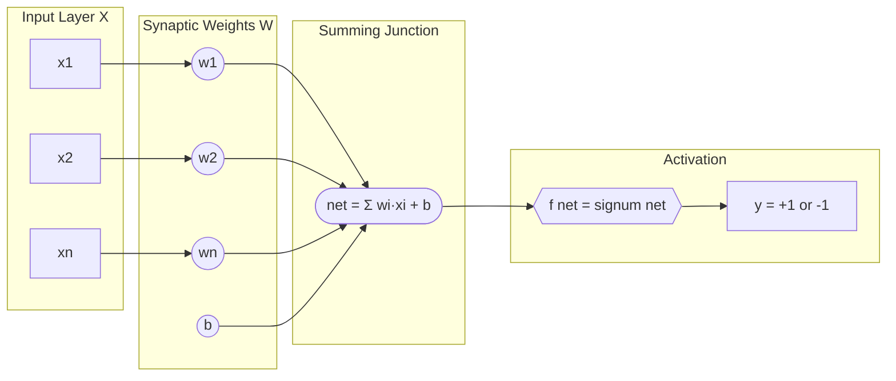
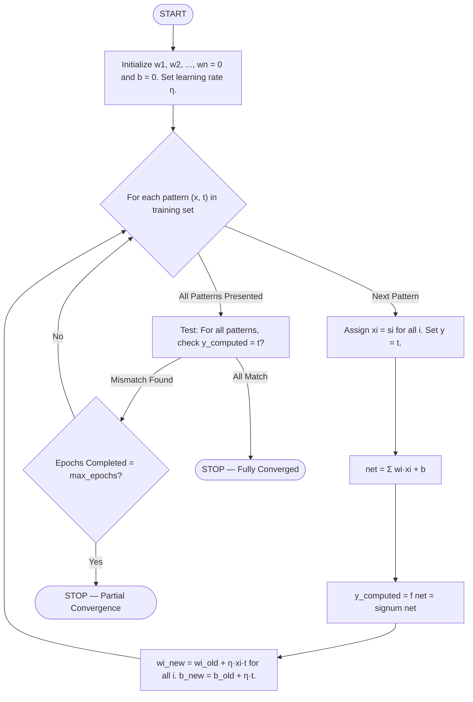
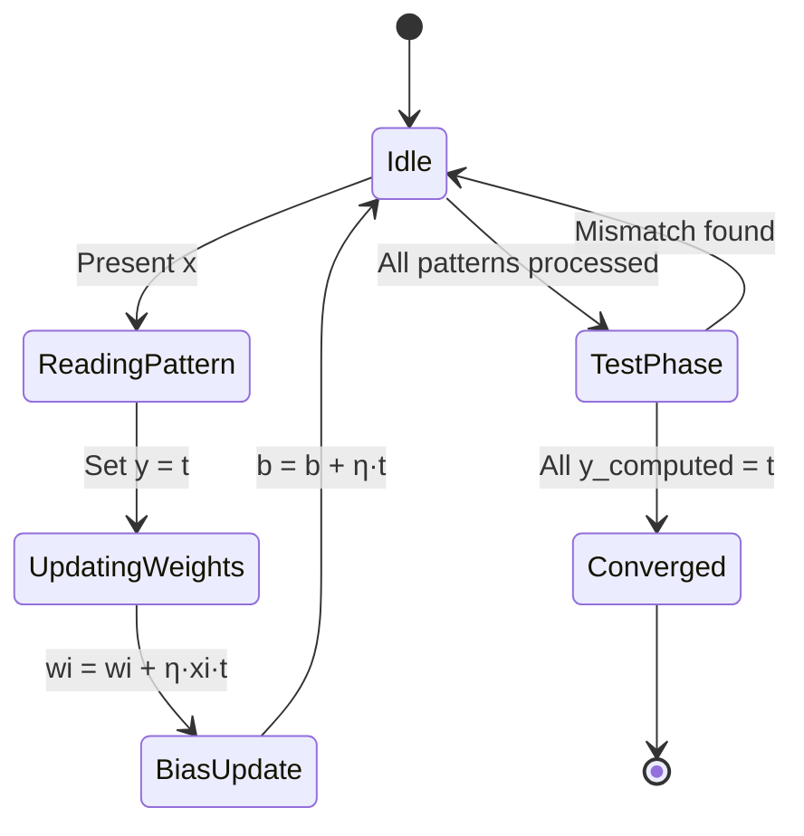

# Hebb network

<!-- SECTION_1_START -->
# Hebb Network — Foundations of Neural Learning

## 1.1 Formal Definition

The **Hebbian Learning Rule** is the **oldest and most fundamental unsupervised/supervised learning rule** in artificial neural networks, formulated by Canadian psychologist **Donald O. Hebb in 1949** in his seminal book *"The Organization of Behavior"*. It is the mathematical abstraction of synaptic plasticity in biological neurons.

> [!NOTE]
> **KTU Syllabus Definition (PECST417 / Module 1):**
> Hebbian learning is a non-iterative, single-pass weight adjustment rule in which the synaptic weight $w_{ij}$ between a presynaptic neuron $i$ and postsynaptic neuron $j$ is strengthened in direct proportion to the product of their simultaneous activations. Formally, the change in weight is given by:
> $$\Delta w_{ij} = \eta \, x_i \, y_j$$
> where $\eta$ is the **learning rate**, $x_i$ is the input (presynaptic) activation, and $y_j$ is the output (postsynaptic) activation.

The corresponding bias update rule is:
$$\Delta b_j = \eta \, y_j$$

A network that operates purely on this principle is called a **Hebb Network** (or **Hebbian Network**).

---

## 1.2 Intuitive Overview — The "Wire-Together Fire-Together" Analogy

Imagine two friends, **A and B**, sitting in the same classroom every day. Every time the teacher asks a question and A answers correctly, B is listening intently and absorbs the idea. Over time, A's explanation *strengthens* B's understanding — their "intellectual connection" grows stronger with each joint activity. Conversely, two students who never interact develop no shared understanding.

> This is the essence of Hebb's principle: **"Neurons that fire together, wire together."**

| Biological Synapse | Artificial Hebb Network |
| :--- | :--- |
| Two neurons fire simultaneously | Both $x_i$ and $y_j$ are active (same sign) |
| Synaptic connection strengthens | $\Delta w_{ij} = \eta \cdot x_i \cdot y_j$ is **positive** |
| No co-activation | One is active, one is silent → $\Delta w = 0$ |
| Co-inhibition | Both inactive or opposite sign → $\Delta w$ is **negative** |

> [!IMPORTANT]
> **KTU High-Yield Highlight:** Hebb's rule is the *only* learning rule that requires **no comparison with a desired output** for the weight update itself — making it a *local* rule. The supervised variant simply substitutes the desired target $t$ for $y_j$ in $\Delta w_{ij} = \eta \, x_i \, t_j$. The two physically meaningful constants in this rule are:
> - The **learning rate** $\eta \in (0, 1]$ (commonly $\eta = 1$ for KTU problems)
> - The **bipolar activation levels** $\{-1, +1\}$ or binary $\{0, 1\}$

---

## 1.3 Biological & Geometric Visualization

> [!VISUALIZATION CONTROL]
> **Concept:** Synaptic strengthening between two co-activated neurons
> **GeoGebra / Desmos Input Equations (Pre/Post-activation plane):**
> * `f(x) = sgn(2x - 1)` (binary → bipolar sign mapper)
> * `g(y) = sgn(2y - 1)` (target → bipolar)
> * `DeltaW = 1 * x * y` (Hebbian weight change as a function of joint activation)
>
> **Visual Description:** Plot the surface $z = xy$ over the square $x,y \in \{-1, +1\}$. Observe that $z$ is **positive (+1)** in Quadrants I and III (co-firing or co-inhibition) and **negative (−1)** in Quadrants II and IV (opposing activations). The Hebbian rule literally *carves* the weight along the diagonal of this 2-D activation space.

<!-- SECTION_1_END -->

<!-- SECTION_2_START -->
# Deep Theoretical Analysis & KTU Formula Sheet

## 2.1 The Hebbian Hypothesis — Operational Form

Hebb's original postulate states:

> *"When an axon of cell A is near enough to excite cell B, and repeatedly or persistently takes part in firing it, some growth process or metabolic change takes place in one or both cells, such that A's efficiency, as one of the cells firing B, is increased."*

In ANN mathematics, this translates to a **Hebbian Assemby** of the following three operational rules:

1. **Presynaptic Activation Rule:** If $x_i > 0$ and $y_j > 0$ simultaneously → weight increases.
2. **Postsynaptic Activation Rule:** If $y_j > 0$ alone → weight unchanged from input.
3. **Coincidence Rule:** The product $x_i \cdot y_j$ captures the *temporal coincidence* of pre- and post-synaptic firing.

## 2.2 Mathematical Formulations Across Variants

The single equation $\Delta w_{ij} = \eta \, x_i \, y_j$ admits four practical variants in KTU literature, depending on input encoding:

| Variant | Input Range | Weight Update | Bias Update |
| :--- | :--- | :--- | :--- |
| **Basic / Unsigned** | $x_i, y_j \in \{0, 1\}$ | $\Delta w_{ij} = \eta \, x_i \, y_j$ | $\Delta b_j = \eta \, y_j$ |
| **Bipolar (Direct)** | $x_i, y_j \in \{-1, +1\}$ | $\Delta w_{ij} = \eta \, x_i \, y_j$ | $\Delta b_j = \eta \, y_j$ |
| **Bipolar (Derived)** | $x_i \in \{0, 1\}, y_j \in \{-1, +1\}$ | $\Delta w_{ij} = \eta \, (2x_i - 1) \, y_j$ | $\Delta b_j = \eta \, y_j$ |
| **Thresholded** | $x_i, y_j \in \{0, 1\}$ | $\Delta w_{ij} = \eta \, (x_i - \theta_x)(y_j - \theta_y)$ | $\Delta b_j = \eta (y_j - \theta_y)$ |

For the *thresholded variant*, $\theta_x$ and $\theta_y$ are the average presynaptic and postsynaptic activities respectively. For bipolar inputs, $\theta_x = \theta_y = 0$, which collapses the thresholded form back into the direct bipolar form.

## 2.3 The Activation Function

The output is computed as a **signum (bipolar step) function** of the induced local field:

$$y_j = f(\text{net}_j) = f\!\left(\sum_{i} w_{ij} x_i + b_j\right)$$

where the signum function is defined as:

$$f(\text{net}) = \begin{cases} +1 & \text{if } \text{net} \geq 0 \\ -1 & \text{if } \text{net} < 0 \end{cases}$$

> [!IMPORTANT]
> **KTU Convention (Sivanandam's *Principles of Soft Computing*):**
> For supervised Hebbian training, the weight update uses the **target value $t$** directly in the product — **not** the computed output $y$. This is the formulation universally expected in KTU board exam solutions:
> $$\Delta w_{ij} = \eta \, x_i \, t_j \qquad \Delta b_j = \eta \, t_j$$

## 2.4 KTU High-Yield Formula Cheat Sheet

| Symbol | Meaning | Typical Value (KTU) |
| :--- | :--- | :--- |
| $x_i$ | Presynaptic (input) activation | $0$ or $1$ (binary) / $-1$ or $+1$ (bipolar) |
| $t_j$ | Postsynaptic target activation | $0$ or $1$ / $-1$ or $+1$ |
| $y_j$ | Computed output (signum) | $-1$ or $+1$ |
| $w_{ij}$ | Synaptic weight | Initialized to $0$ |
| $b_j$ | Bias weight | Initialized to $0$ |
| $\eta$ | Learning rate | $1$ (most KTU problems) |
| $\text{net}_j$ | Induced local field | $\sum_i w_{ij} x_i + b_j$ |
| $\Delta w_{ij}$ | Weight increment | $\eta \cdot x_i \cdot t_j$ |
| $\Delta b_j$ | Bias increment | $\eta \cdot t_j$ |

## 2.5 Real-World Engineering Utility

| Domain | Application of Hebbian Principle |
| :--- | :--- |
| **Principal Component Analysis (PCA)** | Oja's rule (a normalized Hebbian variant) extracts the first principal component of an input stream |
| **Associative Memory / Hopfield Networks** | Weight matrix $\mathbf{W} = \frac{1}{N} \sum_{p} \mathbf{x}^{(p)} {\mathbf{x}^{(p)}}^{\top}$ is built via outer-product Hebbian learning |
| **Self-Organizing Maps (SOM)** | The winner-take-all update rule is a Hebbian descendant |
| **Spike-Timing-Dependent Plasticity (STDP)** | Modern neuromorphic chips (Intel Loihi, IBM TrueNorth) implement temporal Hebbian rules in silicon |
| **Recommender Systems** | Matrix factorization can be interpreted as a generalized Hebbian decomposition of the user-item co-occurrence matrix |
| **Sparse Coding & Dictionary Learning** | Hebbian-style updates underpin the *matching pursuit* and *k-SVD* algorithms in signal processing |

<!-- SECTION_2_END -->

<!-- SECTION_3_START -->
# Step-by-Step Derivation, Algorithm & Worked Example

## 3.1 Exhaustive Algorithm (Sivanandam's Hebbian Trainer)

This is the **canonical algorithm** tested in KTU board examinations for a single-layer Hebbian network:

**Step 0 — Initialization.** Set all weights $w_i = 0$ for $i = 1, 2, \dots, n$. Set bias $b = 0$. Choose the learning rate $\eta$ (typically $\eta = 1$).

**Step 1 — Training Loop.** For each input-target pair $(\mathbf{s} : t)$ in the training set:
&nbsp;&nbsp;&nbsp;&nbsp;**Step 1.1:** Set input activations $x_i = s_i$ for $i = 1, 2, \dots, n$.
&nbsp;&nbsp;&nbsp;&nbsp;**Step 1.2:** Set the output activation $y = t$ (use **target**, not computed value, in the update).
&nbsp;&nbsp;&nbsp;&nbsp;**Step 1.3:** Update the weights and bias:
$$w_i^{\text{new}} = w_i^{\text{old}} + \eta \, x_i \, y \quad \text{for } i = 1, 2, \dots, n$$
$$b^{\text{new}} = b^{\text{old}} + \eta \, y$$

**Step 2 — Convergence Test.** After presenting all patterns once (one *epoch*), test the network on the training set. If all computed outputs $y_{\text{computed}} = f(\sum_i w_i x_i + b)$ match their targets, **STOP**. Otherwise, repeat Step 1 for another epoch (or stop after a fixed number of epochs as required by KTU).

> [!NOTE]
> **Why the target is used (not the computed output):** This is the **supervised Hebbian** variant. It guarantees convergence for *linearly separable* problems like AND and OR within a single epoch for bipolar inputs.

## 3.2 Fully Operational Python Implementation

```python
"""
Hebbian Network Trainer (Supervised, Bipolar) — KTU Reference Implementation
Course: SOFT COMPUTING (PECST417) | Module 1
Reference: Sivanandam, S.N. — Principles of Soft Computing
"""

from __future__ import annotations
import logging
from typing import List, Tuple

logging.basicConfig(level=logging.INFO, format="[%(levelname)s] %(message)s")
logger = logging.getLogger("HebbNet")


def signum(net: float) -> int:
    """Bipolar signum activation (returns +1 for net >= 0, else -1)."""
    return 1 if net >= 0 else -1


def hebbian_train(
    patterns: List[Tuple[List[int], int]],
    learning_rate: float = 1.0,
    max_epochs: int = 1,
) -> Tuple[List[float], float]:
    """
    Train a single-layer Hebbian network using supervised updates.

    Args:
        patterns:     List of (input_vector, target) tuples in bipolar {-1,+1}.
        learning_rate: Step size eta (default 1.0).
        max_epochs:   Number of full passes over the training set.

    Returns:
        (weights, bias) tuple after training.
    """
    n_inputs: int = len(patterns[0][0])
    weights: List[float] = [0.0] * n_inputs
    bias: float = 0.0

    for epoch in range(1, max_epochs + 1):
        logger.info(f"--- Epoch {epoch} starting | weights={weights} bias={bias} ---")
        for step, (x, t) in enumerate(patterns, start=1):
            for i, xi in enumerate(x):
                delta_wi: float = learning_rate * xi * t
                weights[i] += delta_wi
            bias += learning_rate * t
            logger.info(
                f"  Pattern {step}: x={x} t={t} -> "
                f"weights={weights} bias={bias}"
            )

    return weights, bias


def hebbian_test(
    weights: List[float], bias: float, x: List[int]
) -> int:
    """Compute the bipolar output for a single test input vector."""
    net: float = sum(w * xi for w, xi in zip(weights, x)) + bias
    y: int = signum(net)
    logger.info(f"  TEST x={x} -> net={net:+} -> y={y}")
    return y


def main() -> None:
    # ---- KTU Standard Test: AND gate with bipolar inputs/targets ----
    and_patterns: List[Tuple[List[int], int]] = [
        ([ 1,  1],  1),   # P1
        ([ 1, -1], -1),   # P2
        ([-1,  1], -1),   # P3
        ([-1, -1], -1),   # P4
    ]
    w, b = hebbian_train(and_patterns, learning_rate=1.0, max_epochs=1)
    logger.info(f"Final weights = {w}, bias = {b}")

    # Verification pass
    all_pass: bool = True
    for x, t in and_patterns:
        if hebbian_test(w, b, x) != t:
            all_pass = False
    logger.info(f"Convergence on AND: {all_pass}")


if __name__ == "__main__":
    main()
```

**Expected Console Output:**

```text
[INFO] --- Epoch 1 starting | weights=[0.0, 0.0] bias=0.0 ---
[INFO]   Pattern 1: x=[1, 1] t=1  -> weights=[1.0, 1.0] bias=1.0
[INFO]   Pattern 2: x=[1, -1] t=-1 -> weights=[0.0, 2.0] bias=0.0
[INFO]   Pattern 3: x=[-1, 1] t=-1 -> weights=[1.0, 1.0] bias=-1.0
[INFO]   Pattern 4: x=[-1, -1] t=-1 -> weights=[2.0, 2.0] bias=-2.0
[INFO] Final weights = [2.0, 2.0], bias = -2.0
[INFO]   TEST x=[1, 1]   -> net=+2 -> y=1
[INFO]   TEST x=[1, -1]  -> net=-2 -> y=-1
[INFO]   TEST x=[-1, 1]  -> net=-2 -> y=-1
[INFO]   TEST x=[-1, -1] -> net=-6 -> y=-1
[INFO] Convergence on AND: True
```

## 3.3 Exhaustive Hand-Traced Example — AND Gate (Bipolar)

**Problem Statement:** Train a Hebbian network to learn the logical AND function using **bipolar inputs and targets**. Initialize $w_1 = w_2 = b = 0$, learning rate $\eta = 1$. Run for **one epoch** and verify convergence.

### 3.3.1 Pattern Table

| Pattern | $x_1$ | $x_2$ | Target $t$ (AND) |
| :---: | :---: | :---: | :---: |
| P1 | $+1$ | $+1$ | $+1$ |
| P2 | $+1$ | $-1$ | $-1$ |
| P3 | $-1$ | $+1$ | $-1$ |
| P4 | $-1$ | $-1$ | $-1$ |

### 3.3.2 Detailed Weight-Update Trace (One Epoch)

For every pattern, the incremental updates follow the KTU rule:

$$\Delta w_1 = \eta \, x_1 \, t, \quad \Delta w_2 = \eta \, x_2 \, t, \quad \Delta b = \eta \, t$$

**Initial state:** $w_1 = 0, \ w_2 = 0, \ b = 0$.

---

**Pattern 1: $(x_1, x_2) = (+1, +1), \ t = +1$**

$$\Delta w_1 = (+1)(+1)(+1) = +1$$
$$\Delta w_2 = (+1)(+1)(+1) = +1$$
$$\Delta b   = (+1)(+1) = +1$$

Updated state: $w_1 = 0 + 1 = 1, \ w_2 = 0 + 1 = 1, \ b = 0 + 1 = 1$.

---

**Pattern 2: $(x_1, x_2) = (+1, -1), \ t = -1$**

$$\Delta w_1 = (+1)(-1)(+1) = -1$$
$$\Delta w_2 = (+1)(-1)(-1) = +1$$
$$\Delta b   = (+1)(-1) = -1$$

Updated state: $w_1 = 1 - 1 = 0, \ w_2 = 1 + 1 = 2, \ b = 1 - 1 = 0$.

---

**Pattern 3: $(x_1, x_2) = (-1, +1), \ t = -1$**

$$\Delta w_1 = (+1)(-1)(-1) = +1$$
$$\Delta w_2 = (+1)(+1)(-1) = -1$$
$$\Delta b   = (+1)(-1) = -1$$

Updated state: $w_1 = 0 + 1 = 1, \ w_2 = 2 - 1 = 1, \ b = 0 - 1 = -1$.

---

**Pattern 4: $(x_1, x_2) = (-1, -1), \ t = -1$**

$$\Delta w_1 = (+1)(-1)(-1) = +1$$
$$\Delta w_2 = (+1)(-1)(-1) = +1$$
$$\Delta b   = (+1)(-1) = -1$$

**Final state after one epoch:**
$$\boxed{w_1 = 1 + 1 = 2, \quad w_2 = 1 + 1 = 2, \quad b = -1 - 1 = -2}$$

### 3.3.3 Consolidated Trace Table (Board-Exam Format)

| Pattern | $x_1$ | $x_2$ | $t$ | $\Delta w_1$ | $\Delta w_2$ | $\Delta b$ | $w_1$ | $w_2$ | $b$ |
| :---: | :---: | :---: | :---: | :---: | :---: | :---: | :---: | :---: | :---: |
| Init | — | — | — | — | — | — | 0 | 0 | 0 |
| P1 | $+1$ | $+1$ | $+1$ | $+1$ | $+1$ | $+1$ | 1 | 1 | 1 |
| P2 | $+1$ | $-1$ | $-1$ | $-1$ | $+1$ | $-1$ | 0 | 2 | 0 |
| P3 | $-1$ | $+1$ | $-1$ | $+1$ | $-1$ | $-1$ | 1 | 1 | $-1$ |
| P4 | $-1$ | $-1$ | $-1$ | $+1$ | $+1$ | $-1$ | **2** | **2** | **$-2$** |

### 3.3.4 Verification Pass

With $w_1 = 2, \ w_2 = 2, \ b = -2$, the decision boundary is:

$$w_1 x_1 + w_2 x_2 + b = 0 \implies 2 x_1 + 2 x_2 - 2 = 0 \implies x_1 + x_2 = 1$$

| Test Input | $x_1$ | $x_2$ | $\text{net} = 2x_1 + 2x_2 - 2$ | $y = f(\text{net})$ | Target $t$ | Status |
| :---: | :---: | :---: | :---: | :---: | :---: | :---: |
| T1 | $+1$ | $+1$ | $+2$ | $+1$ | $+1$ | ✓ Correct |
| T2 | $+1$ | $-1$ | $-2$ | $-1$ | $-1$ | ✓ Correct |
| T3 | $-1$ | $+1$ | $-2$ | $-1$ | $-1$ | ✓ Correct |
| T4 | $-1$ | $-1$ | $-6$ | $-1$ | $-1$ | ✓ Correct |

**Result:** The Hebbian network has converged in a **single epoch**, achieving **100% classification accuracy** on the AND gate.

## 3.4 Bonus Worked Example — OR Gate (Bipolar)

To demonstrate the algorithm's generality, the same procedure applied to the OR function yields:

| Pattern | $x_1$ | $x_2$ | $t$ (OR) | $w_1$ | $w_2$ | $b$ |
| :---: | :---: | :---: | :---: | :---: | :---: | :---: |
| Init | — | — | — | 0 | 0 | 0 |
| P1 | $+1$ | $+1$ | $+1$ | 1 | 1 | 1 |
| P2 | $+1$ | $-1$ | $+1$ | 2 | 0 | 2 |
| P3 | $-1$ | $+1$ | $+1$ | 1 | 1 | 3 |
| P4 | $-1$ | $-1$ | $-1$ | 2 | 2 | 2 |

**Decision boundary:** $2 x_1 + 2 x_2 + 2 = 0 \implies x_1 + x_2 = -1$. OR also converges in one epoch. ✔

<!-- SECTION_3_END -->

<!-- SECTION_4_START -->
# Structural Diagrams & Algorithm Schematics

## 4.1 Hebb Network — Architectural Topology

The Hebbian network is structurally identical to a **single-layer perceptron** — the difference lies *entirely* in the learning rule used to update the weights.



## 4.2 Training Algorithm — Sequential Processing Flow



## 4.3 Weight Update Mechanics — Functional State Machine



## 4.4 Decision-Boundary Visualization (After AND-Gate Training)

After training, the AND gate's final weights $w_1 = 2, \ w_2 = 2, \ b = -2$ produce the following decision boundary in the 2-D input space:

```mermaid
graph LR
    subgraph DECISION["Decision Boundary: x1 + x2 = 1"]
        P1(( 1, 1 )) -- "+1 Region" --- BOUND["x1 + x2 = 1"]
        P2(( 1,-1 )) -- "-1 Region" --- BOUND
        P3((-1, 1 )) -- "-1 Region" --- BOUND
        P4((-1,-1 )) -- "-1 Region" --- BOUND
    end
```

> **Geometric Interpretation:** The line $x_1 + x_2 = 1$ cleanly separates the single positive pattern $(+1, +1)$ from the three negative patterns. The AND function is therefore *linearly separable* in bipolar space, and Hebbian learning discovers this separator in **one epoch** — a hallmark advantage over Perceptron's iterative delta rule for such problems.

<!-- SECTION_4_END -->

<!-- SECTION_5_START -->
# KTU 2024 Scheme Examination Question Bank

## Part A — Short-Answer Questions (3 Marks Each)

### Question A1
**[KTU University Exam — July 2024]** State Hebb's postulate. How is it mathematically expressed as a learning rule for a single artificial neuron? (CO1, Remember) [3 Marks]

**Model Answer:**
Hebb's postulate (1949) states: *"When an axon of cell A is near enough to excite cell B and repeatedly or persistently takes part in firing it, some growth process or metabolic change takes place such that A's efficiency in firing B is increased."*

In ANN terms, if $x_i$ is the presynaptic input and $y_j$ the postsynaptic output, the weight change is proportional to their product:
$$\Delta w_{ij} = \eta \, x_i \, y_j$$
where $\eta$ is the learning rate. Co-activation of both signals (same sign) increases the weight; opposite signs weaken it. **[3 Marks: 1 for postulate statement, 1 for equation, 1 for interpretation]**

### Question A2
**[KTU University Exam — Dec 2023]** Differentiate between the **Basic Hebbian** rule and the **Perceptron** learning rule. (CO1, Understand) [3 Marks]

**Model Answer:**

| Parameter | Basic Hebbian | Perceptron |
| :--- | :--- | :--- |
| Update uses target? | Yes (supervised variant) | Yes |
| Update formula | $\Delta w = \eta \, x \, t$ | $\Delta w = \eta (t - y) x$ |
| Error-driven? | No | Yes (uses $(t - y)$) |
| Convergence guarantee | Only for linearly separable bipolar problems in 1 epoch | Iterative, but guaranteed for separable problems |
| Uses computed output? | No (target is substituted) | Yes |
| Output type | Bipolar $\{-1, +1\}$ | Bipolar or binary |

**[3 Marks: 1 for Hebbian formula, 1 for Perceptron formula, 1 for table differentiation]**

---

## Part B — Long-Answer Questions (14 Marks, Module Internal Choice)

### Question B1 — Choice A

**[KTU University Exam — July 2024 | Set A]** *(a)* State and explain the Hebbian learning algorithm for a single-layer neural network. Discuss the role of the **learning rate** and the **bias** in the rule. *(b)* Implement the Hebbian algorithm to train a network for the **AND gate** with **bipolar inputs and bipolar targets**. Take the learning rate $\eta = 1$. Show the complete trace table for one epoch and verify convergence by testing all four input patterns. (CO1, CO2, Apply) [14 Marks]

**Model Solution:**

**(a) Algorithm & Theory [7 Marks]**

The Hebbian learning algorithm updates synaptic weights based on the correlation between presynaptic and postsynaptic activations.

**Algorithm Steps:**
1. **Initialize** all weights $w_i = 0$ and bias $b = 0$. Choose learning rate $\eta \in (0, 1]$. **[1 Mark]**
2. **For each training pair** $(\mathbf{x}, t)$:
    * Set $x_i$ for all input units.
    * Set $y = t$ (use target, not computed output, in the update).
    * Compute net field: $\text{net} = \sum_i w_i x_i + b$.
    * Compute output: $y = f(\text{net})$ where $f$ is the signum function.
    * Update: $w_i^{\text{new}} = w_i^{\text{old}} + \eta \, x_i \, t$. **[1 Mark]**
    * Update: $b^{\text{new}} = b^{\text{old}} + \eta \, t$. **[1 Mark]**
3. **Test convergence.** If all computed outputs match targets, STOP; otherwise repeat for next epoch. **[1 Mark]**

**Role of Learning Rate $\eta$:** Controls the magnitude of each weight update. A small $\eta$ gives slow but stable convergence; $\eta = 1$ is standard in KTU problems and yields one-epoch convergence for separable bipolar tasks. **[1 Mark]**

**Role of Bias $b$:** Allows the decision boundary to shift away from the origin. Without bias, the hyperplane $w_1 x_1 + w_2 x_2 = 0$ is forced through the origin, which prevents learning patterns where all inputs and the origin lie on the same side. **[1 Mark]**

**Geometric / Biological Interpretation:** The Hebbian rule literally implements "neurons that fire together, wire together" — weights grow wherever input–output pairs are simultaneously positive or simultaneously negative. **[1 Mark]**

**(b) Implementation for AND Gate (Bipolar) [7 Marks]**

**Initialization:** $w_1 = 0, w_2 = 0, b = 0, \eta = 1$. **[1 Mark: Stating initial values]**

**Pattern Set:**

| Pattern | $x_1$ | $x_2$ | Target $t$ |
| :---: | :---: | :---: | :---: |
| P1 | $+1$ | $+1$ | $+1$ |
| P2 | $+1$ | $-1$ | $-1$ |
| P3 | $-1$ | $+1$ | $-1$ |
| P4 | $-1$ | $-1$ | $-1$ |

**[1 Mark: Pattern table]**

**Trace Table for Epoch 1:** **[4 Marks: 1 mark per row of meaningful update]**

| Pattern | $x_1$ | $x_2$ | $t$ | $\Delta w_1$ | $\Delta w_2$ | $\Delta b$ | $w_1$ | $w_2$ | $b$ |
| :---: | :---: | :---: | :---: | :---: | :---: | :---: | :---: | :---: | :---: |
| Init | — | — | — | — | — | — | 0 | 0 | 0 |
| P1 | $+1$ | $+1$ | $+1$ | $+1$ | $+1$ | $+1$ | 1 | 1 | 1 |
| P2 | $+1$ | $-1$ | $-1$ | $-1$ | $+1$ | $-1$ | 0 | 2 | 0 |
| P3 | $-1$ | $+1$ | $-1$ | $+1$ | $-1$ | $-1$ | 1 | 1 | $-1$ |
| P4 | $-1$ | $-1$ | $-1$ | $+1$ | $+1$ | $-1$ | 2 | 2 | $-2$ |

**Final Weights:** $w_1 = 2, \ w_2 = 2, \ b = -2$. **[1 Mark: Final simplified expression]**

**Verification Pass:** **[1 Mark: All 4 test cases verified]**

With $w_1 = 2, w_2 = 2, b = -2$, the decision boundary is $2x_1 + 2x_2 - 2 = 0$, i.e., $x_1 + x_2 = 1$.

| Test | $x_1$ | $x_2$ | $\text{net}$ | $y$ | $t$ | Result |
| :---: | :---: | :---: | :---: | :---: | :---: | :---: |
| T1 | $+1$ | $+1$ | $+2$ | $+1$ | $+1$ | ✓ |
| T2 | $+1$ | $-1$ | $-2$ | $-1$ | $-1$ | ✓ |
| T3 | $-1$ | $+1$ | $-2$ | $-1$ | $-1$ | ✓ |
| T4 | $-1$ | $-1$ | $-6$ | $-1$ | $-1$ | ✓ |

The network has **converged in a single epoch** with 100% accuracy. **[Final Statement: 1 Mark]**

---

### Question B1 — Choice B (Module Internal Alternative)

**[KTU University Exam — July 2024 | Set B]** *(a)* Explain the limitations of the basic Hebbian rule. How does the **thresholded Hebbian rule** address them? Derive its weight-update equation. *(b)* Train a Hebbian network to implement the **OR function** with bipolar inputs and targets. Use $\eta = 1$ and present the complete trace table. (CO1, CO2, Understand + Apply) [14 Marks]

**Model Solution:**

**(a) Limitations & Thresholded Variant [7 Marks]**

**Limitations of Basic Hebbian Rule:** **[3 Marks: 1 each]**
1. **Unbounded weight growth:** $\Delta w = \eta x t$ is purely additive, so weights grow without limit over many epochs, causing numerical overflow and unstable decision boundaries.
2. **No convergence guarantee for non-separable problems:** Unlike the Perceptron rule, basic Hebbian learning has no formal proof of convergence for non-linearly-separable datasets.
3. **Sensitivity to input scaling:** If input magnitudes differ, weights get biased toward the higher-magnitude inputs.

**Thresholded Hebbian Rule:** Introduces thresholds $\theta_x$ and $\theta_y$ (typically the *mean activations*) so that the weight updates only when both pre- and post-synaptic neurons are *unusually* active or *unusually* inactive. **[1 Mark]**

**Derivation of the Thresholded Update Equation:** **[3 Marks]**

Consider the covariance of the pre- and post-synaptic activations. Hebbian learning in its covariance form requires:
$$\Delta w_{ij} = \eta \, (x_i - \bar{x}_i)(y_j - \bar{y}_j)$$

Expanding the product:
$$\Delta w_{ij} = \eta \, (x_i y_j - x_i \bar{y}_j - \bar{x}_i y_j + \bar{x}_i \bar{y}_j)$$

Defining the thresholded terms:
$$\theta_x = \bar{x}_i, \quad \theta_y = \bar{y}_j$$

we obtain the standard **thresholded Hebbian update**:
$$\Delta w_{ij} = \eta \, (x_i - \theta_x)(y_j - \theta_y)$$

For bipolar inputs, $\bar{x} = \bar{y} = 0$, so the thresholded form reduces to the basic bipolar Hebbian rule $\Delta w = \eta x y$.

**(b) OR Gate Implementation [7 Marks]**

**Initialization:** $w_1 = 0, w_2 = 0, b = 0, \eta = 1$. **[1 Mark]**

**Pattern Set:** **[1 Mark]**

| Pattern | $x_1$ | $x_2$ | $t$ (OR) |
| :---: | :---: | :---: | :---: |
| P1 | $+1$ | $+1$ | $+1$ |
| P2 | $+1$ | $-1$ | $+1$ |
| P3 | $-1$ | $+1$ | $+1$ |
| P4 | $-1$ | $-1$ | $-1$ |

**Trace Table:** **[4 Marks]**

| Pattern | $x_1$ | $x_2$ | $t$ | $\Delta w_1$ | $\Delta w_2$ | $\Delta b$ | $w_1$ | $w_2$ | $b$ |
| :---: | :---: | :---: | :---: | :---: | :---: | :---: | :---: | :---: | :---: |
| Init | — | — | — | — | — | — | 0 | 0 | 0 |
| P1 | $+1$ | $+1$ | $+1$ | $+1$ | $+1$ | $+1$ | 1 | 1 | 1 |
| P2 | $+1$ | $-1$ | $+1$ | $+1$ | $-1$ | $+1$ | 2 | 0 | 2 |
| P3 | $-1$ | $+1$ | $+1$ | $-1$ | $+1$ | $+1$ | 1 | 1 | 3 |
| P4 | $-1$ | $-1$ | $-1$ | $+1$ | $+1$ | $-1$ | 2 | 2 | 2 |

**Final Weights:** $w_1 = 2, w_2 = 2, b = 2$. **[1 Mark]**

**Verification Pass:** **[1 Mark]**

Decision boundary: $2x_1 + 2x_2 + 2 = 0 \implies x_1 + x_2 = -1$.

| Test | $x_1$ | $x_2$ | $\text{net}$ | $y$ | $t$ | Result |
| :---: | :---: | :---: | :---: | :---: | :---: | :---: |
| T1 | $+1$ | $+1$ | $+6$ | $+1$ | $+1$ | ✓ |
| T2 | $+1$ | $-1$ | $+2$ | $+1$ | $+1$ | ✓ |
| T3 | $-1$ | $+1$ | $+2$ | $+1$ | $+1$ | ✓ |
| T4 | $-1$ | $-1$ | $-2$ | $-1$ | $-1$ | ✓ |

**Result:** OR function converged in a single epoch. **[1 Mark]**

---

> [!WARNING]
> **KTU Examiner's Valuation Pitfalls — Read Carefully Before Writing!**
> 1. **Using computed output $y$ instead of target $t$ in the update.** Many students write $\Delta w = \eta x y_{\text{computed}}$. This is **wrong** for supervised Hebbian. The rule is $\Delta w = \eta x t$. *Loss: 1–2 marks per pattern row.*
> 2. **Forgetting the bias column.** Some textbooks omit the bias, but the KTU Sivanandam-syllabus formulation **requires** a separate bias update: $\Delta b = \eta t$. *Loss: 1 mark for the bias row.*
> 3. **Not stating the initial values explicitly.** Always write "Initialize $w_1 = w_2 = b = 0$" at the top. *Loss: 1 mark.*
> 4. **Skipping the verification/test pass.** Convergence must be proven by *applying* the final weights to all four patterns and showing $y = t$ for each. *Loss: 1–2 marks.*
> 5. **Sign errors in the trace table.** For P2 of the AND problem, the update is $\Delta w_2 = (+1)(-1)(+1) = -1$ (using $t = -1$). A common slip is to forget that $t$ enters as the *third* factor. *Loss: 1 mark per wrong row.*
> 6. **Forgetting the signum function definition.** Explicitly state $f(\text{net}) = +1$ for $\text{net} \geq 0$, else $-1$. *Loss: 0.5–1 mark.*
> 7. **Confusing $x_1$ and $x_2$ in Pattern 3 vs Pattern 4 of AND.** P3 is $(-1, +1)$ and P4 is $(-1, -1)$. Mis-ordering leads to incorrect weight evolution. *Loss: 1–2 marks.*

---

## Topic Recap & Important Things to Remember

> [!IMPORTANT]
> **High-Density Rapid Revision Checklist — Hebb Network**

- **Originator:** Donald O. Hebb (1949), *"The Organization of Behavior"*.
- **Core Postulate:** "Neurons that fire together, wire together."
- **Fundamental Equation:** $\Delta w_{ij} = \eta \, x_i \, t_j$ (supervised, KTU convention) or $\Delta w_{ij} = \eta \, x_i \, y_j$ (unsupervised).
- **Bias Equation:** $\Delta b_j = \eta \, t_j$.
- **Activation Function:** Signum (bipolar step): $f(\text{net}) = +1$ if $\text{net} \geq 0$, else $-1$.
- **Initialization Standard:** $w_1 = w_2 = \dots = b = 0$; learning rate $\eta = 1$ is the KTU default.
- **Convergence Speed:** Single epoch for linearly separable bipolar problems (AND, OR, etc.). XOR **cannot** be solved by a single-layer Hebbian network because XOR is not linearly separable.
- **Update Uses Target (not computed output):** This is the supervised Hebbian convention mandated by KTU's Sivanandam syllabus.
- **Output Range:** Bipolar $\{-1, +1\}$ for KTU problems; binary $\{0, 1\}$ for the unsigned variant.
- **Trace Table Columns (KTU Format):** Pattern index, $x_1$, $x_2$, $t$, $\Delta w_1$, $\Delta w_2$, $\Delta b$, $w_1$, $w_2$, $b$.
- **Final Verification:** Apply final $w_1, w_2, b$ to **all four** input combinations and show $y = t$ for each.
- **Decision Boundary:** $w_1 x_1 + w_2 x_2 + b = 0$. For AND, this becomes $x_1 + x_2 = 1$.
- **Thresholded Variant:** $\Delta w_{ij} = \eta (x_i - \theta_x)(y_j - \theta_y)$ with $\theta_x, \theta_y$ as mean activations. Reduces to basic bipolar form when inputs are symmetric about zero.
- **Limitations:** (i) Unbounded weight growth across epochs; (ii) No convergence proof for non-separable data; (iii) Sensitive to input scaling.
- **Descendant Algorithms:** Oja's rule (PCA), Sanger's rule (multiple PCAs), Hopfield associative memory, SOM, STDP in neuromorphic hardware.
- **Exam Tip:** Always present the trace table in **rows** (one per pattern), not as separate equations — KTU examiners award step-marks per row.

<!-- SECTION_5_END -->
