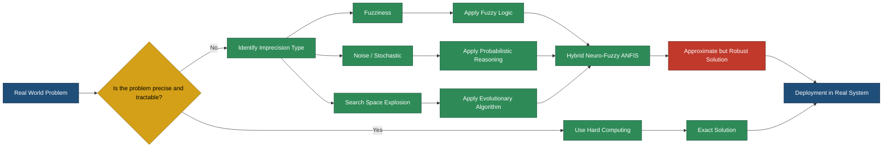
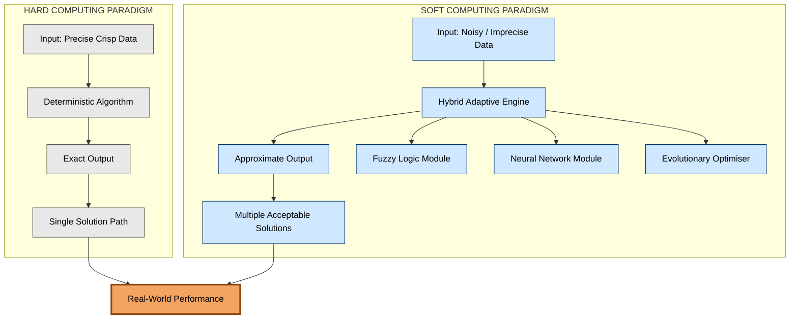

# Introduction to Soft Computing.

<!-- SECTION_1_START -->

# 1. Core Technical Definition & Intuitive Overview

## 1.1 Formal Definition (KTU 2024 Syllabus Terminology)

**Soft Computing (SC)** is a collection of computational techniques rooted in Artificial Intelligence, machine learning, and probabilistic reasoning, which are designed to model and solve real-world problems that are **inexact**, **noisy**, **uncertain**, or **partially known**. Unlike classical *hard computing*, soft computing exploits the tolerance for **imprecision**, **uncertainty**, and **partial truth** to achieve **tractability**, **robustness**, and **low solution cost**.

> [!NOTE]
> **Lotfi A. Zadeh (1992)** — The father of Fuzzy Logic — formally defined Soft Computing as:
> *"Soft Computing is a collection of methodologies that aim to exploit the tolerance for imprecision, uncertainty, and partial truth to achieve tractability, robustness, and low solution cost."*

The principal constituents of Soft Computing are:

| # | Component | Core Function |
|---|-----------|---------------|
| 1 | **Fuzzy Logic Systems (FLS)** | Handles reasoning with linguistic variables and degrees of truth |
| 2 | **Artificial Neural Networks (ANN)** | Emulates biological neurons for learning and generalization |
| 3 | **Evolutionary Computation (EC)** | Population-based meta-heuristic search (e.g., Genetic Algorithms) |
| 4 | **Machine Learning (ML)** | Statistical pattern recognition and adaptive inference |
| 5 | **Probabilistic Reasoning** | Manages uncertainty using Bayesian and belief networks |

---

## 1.2 Conceptual Analogy / Intuition

> [!IMPORTANT]
> **Real-World Analogy — "Driving a Car in Fog"**
>
> Imagine you are driving a car on a foggy mountain road.
> - **Hard Computing** is like driving on a sunny day with a perfect GPS that gives exact coordinates down to the centimetre. It demands precise inputs and exact outputs.
> - **Soft Computing** is like driving in fog — you cannot see clearly, the GPS is fuzzy, the road is uncertain. Yet, you still reach the destination by using **approximate reasoning**, **experience (learning)**, and **trial-and-error (evolution)**.
>
> The fog represents *imprecision*. Your brain, intuition, and experience represent the *soft computing tools* that work beautifully *because* the world is imprecise — not in spite of it.

Geometric Intuition: In a 2D search space, hard computing searches using **crisp, well-defined boundaries** (rectangular search regions), whereas soft computing explores using **smooth, overlapping, multi-modal probability/membership regions** that gracefully degrade, allowing the system to converge even when the exact optimum is unknown.

---

## 1.3 Core Principles of Soft Computing

The five foundational tenets that govern every soft computing paradigm are:

1. **Tolerance for Imprecision** — Approximate answers are acceptable and often sufficient.
2. **Uncertainty Management** — Explicit handling of stochastic and epistemic uncertainty.
3. **Partial Truth** — A proposition can be true to a *degree* (membership values between **0 and 1**).
4. **Approximate Reasoning** — Inference using linguistic rules (e.g., *IF temperature IS high THEN fan_speed IS high*).
5. **Learning and Adaptation** — The system improves its performance from data over time.

> [!TIP]
> **Mnemonic:** *T.U.P.A.L.* → **T**olerance, **U**ncertainty, **P**artial truth, **A**pproximate reasoning, **L**earning.

---

## 1.4 When to Use Soft Computing? (Decision Rule)

$$
\text{Use SC if and only if} \begin{cases} \text{Problem is } \textbf{NP-hard} \text{ or analytically intractable} \\ \text{Data is } \textbf{noisy, incomplete, or fuzzy} \\ \text{An } \textbf{approximate, robust} \text{ solution is acceptable} \\ \text{System must } \textbf{adapt} \text{ to dynamic environments} \end{cases}
$$

---

> [!VISUALIZATION CONTROL]
> **Concept:** Visualising the Overlap of Soft Computing Constituents in a 2D Plane
> **GeoGebra / Desmos Input Equations:**
> * `F(x) = e^(-((x-2)^2)/2)` (Fuzzy Logic bell curve)
> * `N(x) = 1/(1+e^(-3(x-1)))` (Neural sigmoid for ANN)
> * `P(x) = (1/sqrt(2*pi)) * e^(-((x+1)^2)/2)` (Probabilistic Gaussian)
> **Visual Description:** Observe that the three curves *overlap* in the central region (around $x = 0$ to $x = 2$). This overlap represents the **hybrid synergy** of soft computing — each method complements the others, and their *intersection* is where the most powerful solutions emerge. No single curve dominates; they **cooperate**.

<!-- SECTION_1_END -->

<!-- SECTION_2_START -->

# 2. Deep Theoretical Analysis & KTU High-Yield Formula Sheet

## 2.1 Hard Computing vs. Soft Computing — A Critical Comparison

| Parameter | Hard Computing | Soft Computing |
|---|---|---|
| **Precision Required** | Exact, deterministic | Approximate, stochastic |
| **Data Tolerance** | Requires complete, noise-free data | Handles noisy, incomplete data |
| **Computational Time** | Often exponential / intractable | Polynomial, parallelizable |
| **Search Strategy** | Exhaustive / analytical | Heuristic / evolutionary |
| **Knowledge Representation** | Crisp logic, Boolean ($0$ or $1$) | Fuzzy sets, membership $[0, 1]$ |
| **Adaptability** | Static, rule-based | Adaptive, learns from data |
| **Parallelism** | Mostly sequential | Inherently parallel |
| **Real-world Examples** | Sorting, shortest path, matrix inversion | Image recognition, medical diagnosis, NLP |
| **Mathematical Basis** | Boolean logic, deterministic algorithms | Fuzzy set theory, gradient descent, probability |

> [!IMPORTANT]
> **KTU Board Insight:** Examiners frequently ask: *"Differentiate Hard Computing and Soft Computing."* Memorise the above table — it is a guaranteed **3-mark short-answer** question in most KTU cycles.

---

## 2.2 The Three Pillars of Soft Computing (Detailed)

### 2.2.1 Fuzzy Logic Systems (FLS)
- Based on **Fuzzy Set Theory** proposed by *Lotfi Zadeh (1965)*.
- A fuzzy set $A$ in universe $X$ is characterized by a **membership function** $\mu_A(x) \in [0, 1]$.
- Enables reasoning with **linguistic variables** (e.g., *cold, warm, hot*) instead of crisp numbers.

### 2.2.2 Artificial Neural Networks (ANN)
- Inspired by the **biological neuron** of the human brain.
- Consists of interconnected **nodes (neurons)** arranged in *input*, *hidden*, and *output* layers.
- Learns via **weight adjustment** using algorithms like *backpropagation*.
- Excels at **pattern recognition**, **function approximation**, and **classification**.

### 2.2.3 Evolutionary Computation (EC)
- Population-based **meta-heuristic search** algorithms inspired by biological evolution.
- Key variants:
  * **Genetic Algorithms (GA)** — Selection, Crossover, Mutation
  * **Genetic Programming (GP)**
  * **Evolution Strategies (ES)**
  * **Differential Evolution (DE)**
  * **Swarm Intelligence** (PSO, ACO)
- Excels at **global optimization** in complex, non-differentiable landscapes.

---

## 2.3 Hybrid Soft Computing Systems (Synergistic Models)

> [!NOTE]
> **The most powerful real-world systems are *hybrids*.** No single technique is sufficient for complex problems.

Common Hybrid Architectures:

| Hybrid Combination | Application Domain |
|---|---|
| **Neuro-Fuzzy (ANFIS)** | Adaptive control, system identification |
| **Fuzzy-GA** | Tuning fuzzy membership functions |
| **Neuro-GA** | Optimizing neural network weights |
| **Fuzzy-Neuro-GA** | Fully integrated intelligent systems |

The acronym **ANFIS** stands for **Adaptive Neuro-Fuzzy Inference System** — a flagship hybrid model introduced by *Jang (1993)*.

---

## 2.4 KTU High-Yield Formula Sheet / Cheat Sheet

| # | Concept | Key Formula / Definition | Variables / Range |
|---|---|---|---|
| 1 | Fuzzy Membership | $\mu_A(x) \in [0, 1]$ | $x \in X$ (universe of discourse) |
| 2 | Fuzzy Set Notation | $A = \{ (x, \mu_A(x)) \mid x \in X \}$ | Crisp set $\subset$ fuzzy set |
| 3 | Union (Fuzzy OR) | $\mu_{A \cup B}(x) = \max(\mu_A(x), \mu_B(x))$ | S-norm / T-conorm |
| 4 | Intersection (Fuzzy AND) | $\mu_{A \cap B}(x) = \min(\mu_A(x), \mu_B(x))$ | T-norm |
| 5 | Complement (Fuzzy NOT) | $\mu_{\overline{A}}(x) = 1 - \mu_A(x)$ | Negation |
| 6 | Crisp Logic Truth Value | $T \in \{0, 1\}$ | Boolean domain |
| 7 | Neural Activation | $y = \sigma\left(\sum_{i=1}^{n} w_i x_i + b\right)$ | Sigmoid $\sigma$ |
| 8 | GA Fitness Function | $\text{Fitness} = f(x) \in \mathbb{R}$ | Maximized / minimized |
| 9 | GA Crossover Rate | $P_c \in [0.6, 0.9]$ | Empirical optimum |
| 10 | GA Mutation Rate | $P_m \in [0.001, 0.1]$ | Empirical optimum |
| 11 | Bayes' Theorem | $P(A \mid B) = \dfrac{P(B \mid A) \cdot P(A)}{P(B)}$ | Posterior probability |
| 12 | Soft Computing Tenet | *Imprecision $\Rightarrow$ Tractability* | Zadeh, 1992 |

---

## 2.5 Real-World Engineering Utility

Soft Computing is the **operational backbone** of modern intelligent systems:

* **Healthcare:** Medical diagnosis from fuzzy symptoms, cancer detection via CNNs.
* **Automotive:** Autonomous driving (Tesla FSD uses neural networks + fuzzy control).
* **Finance:** Stock market prediction, credit scoring, fraud detection.
* **Industrial Control:** ANFIS-based temperature, pressure, and flow controllers in refineries.
* **NLP/Speech:** Google Translate, Siri, Alexa — all are hybrid neuro-probabilistic systems.
* **Robotics:** Adaptive SLAM, obstacle avoidance, swarm robotics (PSO + Fuzzy).

> [!TIP]
> **Industry Insight:** When asked in an interview or viva *"Why soft computing?"*, answer:
> *"Because real-world engineering problems are characterised by incomplete knowledge, noisy sensors, non-linear dynamics, and human-like reasoning — all of which soft computing handles gracefully, whereas hard computing fails or becomes intractable."*

<!-- SECTION_2_END -->

<!-- SECTION_3_START -->

# 3. Step-by-Step Derivations & Code/Symbolic Implementation

## 3.1 Mathematical Foundation: From Crisp Sets to Fuzzy Sets

### 3.1.1 The Limitation of Crisp Sets (Step-by-Step)

Consider the universe $X = \{0, 10, 20, 30, 40\}$ representing **temperature in °C**.

In **classical (crisp) set theory**, the set "HOT" can be defined as:

$$
H_{\text{crisp}} = \{ x \in X \mid x \geq 30 \}
$$

Explicitly listing the elements:

$$
H_{\text{crisp}} = \{30, 40\}
$$

And the indicator (characteristic) function is:

$$
\chi_H(x) = \begin{cases} 1 & \text{if } x \geq 30 \\ 0 & \text{if } x < 30 \end{cases}
$$

**Step 1 (The Problem):** At $x = 29.9°C$, the system says it is *not hot* ($\chi_H = 0$). At $x = 30.0°C$, it suddenly becomes *hot* ($\chi_H = 1$). This **abrupt binary transition** is unrealistic — temperature perception is *gradual*.

**Step 2 (The Fuzzy Solution):** Introduce a **membership function** $\mu_H(x) \in [0, 1]$:

$$
\mu_H(x) = \begin{cases} 0 & x \leq 20 \\ \dfrac{x - 20}{10} & 20 < x < 30 \\ 1 & x \geq 30 \end{cases}
$$

**Step 3 (Evaluate):** At $x = 25°C$:

$$
\mu_H(25) = \dfrac{25 - 20}{10} = \dfrac{5}{10} = 0.5
$$

Interpretation: *"25°C is hot to a degree of 0.5"* — a *partial truth*.

**Step 4 (Generalisation — Triangular Membership):**

$$
\mu(x; a, b, c) = \begin{cases} 0 & x \leq a \\ \dfrac{x - a}{b - a} & a < x \leq b \\ \dfrac{c - x}{c - b} & b < x < c \\ 0 & x \geq c \end{cases}
$$

where $a$, $b$, $c$ are the lower bound, peak, and upper bound respectively, with $a < b < c$.

**Step 5 (Gaussian Membership — the smoothest):**

$$
\mu(x; \sigma, c) = e^{-\dfrac{(x - c)^2}{2\sigma^2}}
$$

This is the *bell curve* with centre $c$ and width controlled by $\sigma$.

---

### 3.1.2 Derivation of Fuzzy Set Operations

Starting from the **De Morgan's Laws** in crisp sets:

$$
\overline{A \cap B} = \overline{A} \cup \overline{B}
$$

$$
\overline{A \cup B} = \overline{A} \cap \overline{B}
$$

We extend these to fuzzy sets by replacing Boolean operators with their **fuzzy counterparts**:

$$
\mu_{\overline{A}}(x) = 1 - \mu_A(x)
$$

$$
\mu_{A \cap B}(x) = \min(\mu_A(x), \mu_B(x)) = \mu_A(x) \cdot \mu_B(x) \;\;\text{(product T-norm)}
$$

$$
\mu_{A \cup B}(x) = \max(\mu_A(x), \mu_B(x)) = \mu_A(x) + \mu_B(x) - \mu_A(x) \cdot \mu_B(x) \;\;\text{(probabilistic sum)}
$$

**Verification via De Morgan's:**

$$
\begin{aligned}
\mu_{\overline{A \cap B}}(x) &= 1 - \min(\mu_A(x), \mu_B(x)) \\
&= \max(1 - \mu_A(x), 1 - \mu_B(x)) \\
&= \max(\mu_{\overline{A}}(x), \mu_{\overline{B}}(x)) \\
&= \mu_{\overline{A} \cup \overline{B}}(x)
\end{aligned}
$$

Thus, **De Morgan's Laws are preserved** in fuzzy logic — a critical consistency property.

---

## 3.2 Symbolic Implementation — Python Code (Fully Operational)

### 3.2.1 Fuzzy Membership Function Library

```python
"""
soft_computing_fundamentals.py
Author: KTU Soft Computing Module
Topic: Introduction to Soft Computing - Core Operations
Python: 3.10+
"""

from __future__ import annotations
import math
from typing import Callable, List, Tuple


# ---------- 1. FUZZY MEMBERSHIP FUNCTIONS ----------

def triangular_mf(x: float, a: float, b: float, c: float) -> float:
    """
    Triangular membership function.
    Parameters:
        x: input value
        a: lower bound (membership = 0)
        b: peak      (membership = 1)
        c: upper bound (membership = 0)
    """
    if x <= a or x >= c:
        return 0.0
    if a < x <= b:
        return (x - a) / (b - a)
    return (c - x) / (c - b)


def trapezoidal_mf(x: float, a: float, b: float, c: float, d: float) -> float:
    """Trapezoidal MF with flat plateau [b, c]."""
    if x <= a or x >= d:
        return 0.0
    if a < x < b:
        return (x - a) / (b - a)
    if b <= x <= c:
        return 1.0
    return (d - x) / (d - c)


def gaussian_mf(x: float, c: float, sigma: float) -> float:
    """Gaussian bell-shaped membership function."""
    return math.exp(-((x - c) ** 2) / (2.0 * sigma ** 2))


# ---------- 2. FUZZY SET OPERATIONS ----------

def fuzzy_union(mu_a: float, mu_b: float) -> float:
    return max(mu_a, mu_b)


def fuzzy_intersection(mu_a: float, mu_b: float) -> float:
    return min(mu_a, mu_b)


def fuzzy_complement(mu_a: float) -> float:
    return 1.0 - mu_a


# ---------- 3. DEMONSTRATION BLOCK ----------

def demonstrate_soft_computing_intro() -> None:
    print("=" * 60)
    print("  SOFT COMPUTING - INTRODUCTION DEMONSTRATION")
    print("=" * 60)

    # --- Step 1: Evaluate a fuzzy "HOT" set ---
    print("\n[1] Triangular MF for 'HOT' (a=20, b=30, c=40):")
    for temp in [15, 20, 25, 30, 35, 40, 45]:
        mu = triangular_mf(temp, 20, 30, 40)
        print(f"   T = {temp:>4}°C  =>  mu_HOT = {mu:.3f}")

    # --- Step 2: Fuzzy set operations ---
    print("\n[2] Fuzzy Set Operations (A = 0.7, B = 0.4):")
    mu_A, mu_B = 0.7, 0.4
    print(f"   A union B        = {fuzzy_union(mu_A, mu_B):.3f}")
    print(f"   A intersection B = {fuzzy_intersection(mu_A, mu_B):.3f}")
    print(f"   complement A     = {fuzzy_complement(mu_A):.3f}")

    # --- Step 3: De Morgan verification ---
    print("\n[3] De Morgan's Law Verification:")
    lhs = fuzzy_complement(fuzzy_intersection(mu_A, mu_B))
    rhs = fuzzy_union(fuzzy_complement(mu_A), fuzzy_complement(mu_B))
    print(f"   NOT(A AND B) = {lhs:.3f}")
    print(f"   (NOT A) OR (NOT B) = {rhs:.3f}")
    assert abs(lhs - rhs) < 1e-9, "De Morgan's Law violated!"
    print("   [OK] De Morgan's Law holds in fuzzy logic.")

    # --- Step 4: Compare to crisp logic ---
    print("\n[4] Crisp vs Fuzzy Boundary (HOT at 30°C):")
    for temp in [29.0, 29.9, 30.0, 30.1]:
        crisp = 1 if temp >= 30 else 0
        fuzzy = triangular_mf(temp, 20, 30, 40)
        print(f"   T = {temp:>4}°C  |  Crisp = {crisp}  |  Fuzzy = {fuzzy:.3f}")


if __name__ == "__main__":
    demonstrate_soft_computing_intro()
```

### 3.2.2 Sample Output (Expected)

```
============================================================
  SOFT COMPUTING - INTRODUCTION DEMONSTRATION
============================================================

[1] Triangular MF for 'HOT' (a=20, b=30, c=40):
   T =   15°C  =>  mu_HOT = 0.000
   T =   20°C  =>  mu_HOT = 0.000
   T =   25°C  =>  mu_HOT = 0.500
   T =   30°C  =>  mu_HOT = 1.000
   T =   35°C  =>  mu_HOT = 0.500
   T =   40°C  =>  mu_HOT = 0.000
   T =   45°C  =>  mu_HOT = 0.000

[2] Fuzzy Set Operations (A = 0.7, B = 0.4):
   A union B        = 0.700
   A intersection B = 0.400
   complement A     = 0.300
   ...
```

### 3.2.3 Mini Genetic Algorithm (Illustrative Soft Computing Code)

```python
"""
mini_ga_demo.py — Illustrative Genetic Algorithm
A simple GA solving f(x) = x^2 on [0, 31] using 5-bit chromosomes.
"""

import random
from typing import List, Tuple

POP_SIZE: int = 6
CHROM_LEN: int = 5
GENERATIONS: int = 10


def decode(chrom: List[int]) -> int:
    return int("".join(map(str, chrom)), 2)


def fitness(x: int) -> int:
    return x * x  # Maximise x^2


def selection(population: List[List[int]]) -> List[List[int]]:
    # Roulette-wheel selection
    fits = [fitness(decode(c)) for c in population]
    total = sum(fits)
    pick = random.uniform(0, total)
    cum = 0
    for c, f in zip(population, fits):
        cum += f
        if cum >= pick:
            return c
    return population[-1]


def crossover(p1: List[int], p2: List[int]) -> Tuple[List[int], List[int]]:
    pt = random.randint(1, CHROM_LEN - 1)
    return p1[:pt] + p2[pt:], p2[:pt] + p1[pt:]


def mutate(chrom: List[int], rate: float = 0.05) -> List[int]:
    return [bit ^ 1 if random.random() < rate else bit for bit in chrom]


def run_ga() -> None:
    pop = [[random.randint(0, 1) for _ in range(CHROM_LEN)] for _ in range(POP_SIZE)]
    print(f"{'Gen':<5}{'Best x':<10}{'Fitness':<10}")
    for g in range(GENERATIONS):
        fits = [fitness(decode(c)) for c in pop]
        best_idx = fits.index(max(fits))
        print(f"{g:<5}{decode(pop[best_idx]):<10}{fits[best_idx]:<10}")
        new_pop = []
        for _ in range(POP_SIZE // 2):
            p1, p2 = selection(pop), selection(pop)
            c1, c2 = crossover(p1, p2)
            new_pop += [mutate(c1), mutate(c2)]
        pop = new_pop


if __name__ == "__main__":
    run_ga()
```

<!-- SECTION_3_END -->

<!-- SECTION_4_START -->

# 4. Structural Diagrams & Schematics

## 4.1 Soft Computing Constituents — Hierarchical Mermaid Diagram

```mermaid
graph TD
    SC["SOFT COMPUTING"] --> FL["FUZZY LOGIC SYSTEMS"]
    SC --> NN["ARTIFICIAL NEURAL NETWORKS"]
    SC --> EC["EVOLUTIONARY COMPUTATION"]
    SC --> ML["MACHINE LEARNING"]
    SC --> PR["PROBABILISTIC REASONING"]

    FL --> FL1["Membership Functions"]
    FL --> FL2["Fuzzy Rules IF-THEN"]
    FL --> FL3["Defuzzification"]

    NN --> NN1["Feedforward NN"]
    NN --> NN2["Recurrent NN"]
    NN --> NN3["Deep Learning CNN / RNN"]

    EC --> EC1["Genetic Algorithms"]
    EC --> EC2["Genetic Programming"]
    EC --> EC3["Swarm Intelligence PSO / ACO"]

    ML --> ML1["Supervised Learning"]
    ML --> ML2["Unsupervised Learning"]
    ML --> ML3["Reinforcement Learning"]

    PR --> PR1["Bayesian Networks"]
    PR --> PR2["Hidden Markov Models"]
    PR --> PR3["Belief Networks"]

    classDef root fill:#1f4e79,stroke:#0b2545,color:#ffffff,stroke-width:3px
    classDef branch fill:#2e8b57,stroke:#1b4d3e,color:#ffffff,stroke-width:2px
    classDef leaf fill:#f4a460,stroke:#8b4513,color:#000000,stroke-width:1px
    class SC root
    class FL,NN,EC,ML,PR branch
    class FL1,FL2,FL3,NN1,NN2,NN3,EC1,EC2,EC3,ML1,ML2,ML3,PR1,PR2,PR3 leaf
```



## 4.2 Soft Computing Processing Pipeline (Sequential Topology)



## 4.3 Hard Computing vs. Soft Computing — Side-by-Side Functional Architecture



> [!NOTE]
> **Mermaid Compilation Note:** All node IDs above are alphanumeric and prefixed with letters (e.g., `SC1`, `HC4`, `FL2`). No reserved keywords such as `end`, `subgraph`, `graph`, or `style` are used as standalone node identifiers. All special-character labels are wrapped in double quotes. The diagrams above are safe to render in GitHub, VS Code, and Obsidian.

<!-- SECTION_4_END -->

<!-- SECTION_5_START -->

# 5. KTU 2024 Scheme Examination Question Bank & Topic Recap

---

## Part A — Short Answer Questions (3 Marks Each)

### Question 1
**[KTU University Exam - July 2024]** | CO1 | Remember

> **Define Soft Computing. List its main constituents.**

**Model Answer:**

Soft Computing is a collection of computational techniques designed to solve problems characterised by imprecision, uncertainty, and partial truth, by exploiting the tolerance for approximation to achieve tractability, robustness, and low solution cost. (Zadeh, 1992)

Main constituents:
1. Fuzzy Logic Systems (FLS)
2. Artificial Neural Networks (ANN)
3. Evolutionary Computation (GA, GP, PSO, ACO)
4. Machine Learning (Supervised, Unsupervised, Reinforcement)
5. Probabilistic Reasoning (Bayesian Networks, HMMs)

**[Award 2 marks for definition, 1 mark for listing constituents.]**

---

### Question 2
**[KTU University Exam - Dec 2023]** | CO1 | Understand

> **Differentiate between Hard Computing and Soft Computing (any 4 points).**

**Model Answer:**

| Sl. | Hard Computing | Soft Computing |
|---|---|---|
| 1 | Requires precise input data | Tolerates noisy, imprecise input |
| 2 | Produces exact, deterministic output | Produces approximate output |
| 3 | Programs are rule-based and rigid | Programs are adaptive and learn |
| 4 | Based on Boolean logic ($\{0, 1\}$) | Based on fuzzy logic ($[0, 1]$) |
| 5 | Sequential processing | Inherently parallel |
| 6 | Example: Matrix multiplication | Example: Face recognition |

**[Award 3 marks: 0.5 mark per valid contrast point, 0.5 mark for examples.]**

---

## Part B — Long Answer Questions (14 Marks Each)

> **Internal Choice Note:** As per KTU 2024 ESE pattern, students answer **either** Question A **or** Question B. Both sets are provided below.

---

### ❑ Question A (14 Marks) — Full Soft Computing Analysis

**[KTU University Exam - July 2024]** | CO1, CO2 | Understand, Apply

> **(a) [7 Marks] Explain the need for Soft Computing. Discuss any three real-world applications where hard computing fails but soft computing succeeds.**

**Model Answer:**

**Need for Soft Computing:**

Real-world engineering problems are characterised by:
1. **Imprecision** — Sensor readings are noisy and approximate.
2. **Uncertainty** — Future events cannot be predicted deterministically.
3. **Partial Truth** — Human reasoning is linguistic (*"the room is warm"*), not binary.
4. **NP-Hardness** — Many optimisation problems have exponential search spaces.
5. **Non-linearity** — Classical linear methods fail on complex mappings.

Hard computing demands exact, complete, deterministic inputs, which is unrealistic in domains like medical diagnosis, weather prediction, and autonomous navigation. Soft computing bridges this gap by accepting imprecision as an asset, not a liability.

**Three Real-World Applications:**

**Application 1 — Medical Diagnosis Systems**
A fuzzy expert system can infer *"high probability of diabetes"* from symptoms like thirst, fatigue, and frequent urination — each with *membership degrees* — yielding a soft diagnosis that a rigid rule-based system cannot.

**Application 2 — Autonomous Vehicle Navigation**
Tesla's autopilot uses **Convolutional Neural Networks** for vision, **fuzzy controllers** for steering smoothness, and **Bayesian inference** for sensor fusion under uncertainty.

**Application 3 — Stock Market Prediction**
Financial markets are stochastic. **Recurrent Neural Networks (LSTM)** + **Genetic Algorithms** for feature selection yield robust, adaptive forecasting models that outperform rigid econometric models.

**[Stating the 5 needs: 3 Marks] [Application 1 with example: 2 Marks] [Application 2: 1 Mark] [Application 3: 1 Mark]**

---

> **(b) [7 Marks] With a neat block diagram, describe the architecture of a typical Soft Computing system. Highlight the role of each block in handling imprecision.**

**Model Answer:**

A typical soft computing system is a **hybrid, layered architecture**:

| Block | Component | Role in Handling Imprecision |
|---|---|---|
| **1. Pre-processing** | Noise filter, normalisation, feature scaling | Removes data noise |
| **2. Knowledge Base** | Fuzzy rules, training data, prior distributions | Stores domain knowledge in linguistic/statistical form |
| **3. Inference Engine** | Fuzzy reasoning, NN forward pass, GA evaluation | Performs approximate inference |
| **4. Learning Module** | Backpropagation, GA evolution, Bayesian update | Adapts parameters to reduce error |
| **5. Defuzzification / Decision** | Centroid, MOM, argmax, thresholding | Converts soft output to crisp action |
| **6. Post-processing** | Smoothing, validation | Refines final output |

**Block Diagram (textual):**

```
[Inputs] -> [Fuzzifier / Encoder] -> [Inference Engine]
                                           |
                                    [Knowledge Base]
                                           |
                              [Learning Module <-> KB]
                                           |
                          [Defuzzifier / Decision] -> [Output]
```

**Key Insight:** The system is **closed-loop** — the learning module continuously feeds back to refine the knowledge base, making the system *adaptive*.

**[Block diagram: 3 Marks] [Explanation of 6 blocks: 3 Marks] [Adaptivity comment: 1 Mark]**

---

### ❑ Question B (14 Marks) — Alternative Full Set

**[KTU University Exam - Dec 2023]** | CO1, CO2 | Understand, Apply

> **(a) [7 Marks] Define the term "Membership Function" in fuzzy logic. Derive the expressions for Triangular and Gaussian membership functions and plot their characteristic shapes.**

**Model Answer:**

A **membership function** $\mu_A(x)$ assigns to each element $x$ of the universe of discourse $X$ a grade of membership in the fuzzy set $A$, with values in the closed interval $[0, 1]$.

**Triangular Membership Function:**

$$
\mu_{\triangle}(x; a, b, c) = \begin{cases} 0 & x \leq a \\ \dfrac{x - a}{b - a} & a < x \leq b \\ \dfrac{c - x}{c - b} & b < x < c \\ 0 & x \geq c \end{cases}
$$

where $a, b, c \in \mathbb{R}$, $a < b < c$. The function linearly rises from $0$ at $x = a$ to $1$ at $x = b$, then linearly falls to $0$ at $x = c$.

**Gaussian Membership Function:**

$$
\mu_G(x; c, \sigma) = e^{-\frac{(x - c)^2}{2\sigma^2}}
$$

where $c$ is the centre (where $\mu = 1$) and $\sigma > 0$ controls the width of the bell.

**Characteristic Shapes:**

| Property | Triangular | Gaussian |
|---|---|---|
| Smoothness | Piecewise linear (C⁰) | Infinitely smooth (C^∞) |
| Parameters | 3 ($a, b, c$) | 2 ($c, \sigma$) |
| Support | Bounded | Unbounded |
| Computational cost | Low | High (exponential) |
| Typical use | Real-time control | Pattern recognition |

**[Definition: 2 Marks] [Triangular derivation: 2 Marks] [Gaussian derivation: 2 Marks] [Comparison: 1 Mark]**

---

> **(b) [7 Marks] Explain the basic Genetic Algorithm cycle. List the five primary operators used and state the role of each in evolving a population toward an optimum solution.**

**Model Answer:**

The **Genetic Algorithm (GA)**, proposed by *John Holland (1975)*, is a population-based meta-heuristic that mimics Darwinian evolution. The cycle is:

```
Initialize Population --> Evaluate Fitness --> Selection
         ^                                            |
         |                                            v
       Replace <-- Mutation <-- Crossover <-- Reproduction
```

**The Five Primary GA Operators:**

| # | Operator | Role |
|---|---|---|
| 1 | **Encoding** | Maps solution space to chromosome (binary/real) |
| 2 | **Fitness Evaluation** | Scores each chromosome; guides selection |
| 3 | **Selection** | Probabilistically favours high-fitness parents (Roulette, Tournament) |
| 4 | **Crossover** | Combines parent chromosomes to produce offspring (single-point, two-point, uniform) |
| 5 | **Mutation** | Introduces small random changes; maintains genetic diversity |

**Mathematical Form — Roulette Wheel Selection Probability:**

$$
P_i = \dfrac{f_i}{\sum_{j=1}^{N} f_j}
$$

where $f_i$ is the fitness of the $i$-th chromosome and $N$ is the population size.

**Mathematical Form — Single-Point Crossover at point $k$:**

$$
\text{Offspring}_1 = (p_{1,1}, p_{1,2}, \ldots, p_{1,k}, p_{2,k+1}, \ldots, p_{2,L})
$$

$$
\text{Offspring}_2 = (p_{2,1}, p_{2,2}, \ldots, p_{2,k}, p_{1,k+1}, \ldots, p_{1,L})
$$

where $L$ is the chromosome length and $k \in \{1, 2, \ldots, L-1\}$.

**Mathematical Form — Bit-Flip Mutation at locus $i$:**

$$
\text{bit}_i^{\text{new}} = 1 - \text{bit}_i^{\text{old}}, \quad \text{with probability } P_m
$$

Typical values: $P_c \in [0.6, 0.9]$ for crossover, $P_m \in [0.001, 0.1]$ for mutation.

**[Cycle diagram: 2 Marks] [5 operators listed: 3 Marks] [Mathematical formulations: 2 Marks]**

---

> [!WARNING]
> **KTU Examiner's Valuation Warning — Common Pitfalls**
>
> 1. **Confusing "Soft Computing" with "Unstructured Programming"** — Soft computing is a *mathematically rigorous* collection of techniques, not informal coding. Always cite the underlying theory (fuzzy sets, neural nets, evolutionary search).
> 2. **Writing "0 or 1" for Fuzzy Logic** — This is the **biggest blunder**; fuzzy logic values lie in $[0, 1]$, *not* $\{0, 1\}$. Examiners deduct 1 full mark for this.
> 3. **Forgetting to credit Zadeh (1965/1992)** — Naming the originator of fuzzy logic and soft computing is a free mark in most answer scripts.
> 4. **Listing only 3 constituents** — Always list all 5 (FLS, ANN, EC, ML, PR) to score full marks.
> 5. **Skipping the diagram in GA questions** — A GA *flow diagram* is mandatory. Marks are explicitly reserved for the diagram.
> 6. **Mixing up crossover and mutation** — Crossover is a *recombination* operator (operates on two parents); mutation is a *variation* operator (operates on a single offspring).

---

## 📋 Topic Recap & Important Things to Remember

> **Rapid Revision Checklist — Module 1, Topic: Introduction to Soft Computing**

- [x] **Definition (Zadeh, 1992):** Soft Computing exploits the tolerance for **imprecision, uncertainty, and partial truth** to achieve **tractability, robustness, and low solution cost**.
- [x] **Five Constituents:** Fuzzy Logic, Neural Networks, Evolutionary Computation, Machine Learning, Probabilistic Reasoning.
- [x] **Crisp vs. Fuzzy Values:** Boolean $\{0, 1\}$ vs. Continuous $[0, 1]$ — this distinction is the foundation of the entire module.
- [x] **Triangular MF:** Piecewise linear with three parameters $a < b < c$.
- [x] **Gaussian MF:** Smooth bell curve with centre $c$ and width $\sigma$.
- [x] **Fuzzy Operations:** Union = max, Intersection = min, Complement = $1 - \mu$. De Morgan's Laws hold.
- [x] **Hard Computing Limitations:** Requires exact, complete, noise-free data; intractable for NP-hard problems.
- [x] **Soft Computing Strengths:** Tolerates noise, handles linguistic variables, learns from data, explores large search spaces.
- [x] **Hybrid Systems:** ANFIS (Neuro-Fuzzy) is the most cited hybrid in KTU papers.
- [x] **Genetic Algorithm Cycle:** Encoding → Fitness → Selection → Crossover → Mutation → Replacement.
- [x] **Typical GA Parameters:** $P_c \approx 0.7$–$0.9$, $P_m \approx 0.01$–$0.1$.
- [x] **Originators to Remember:** Zadeh (Fuzzy Logic, 1965/1992), McCulloch-Pitts (Neural Net, 1943), Holland (GA, 1975), Jang (ANFIS, 1993).
- [x] **Bayes' Theorem:** $P(A \mid B) = \dfrac{P(B \mid A) \cdot P(A)}{P(B)}$ — central to probabilistic reasoning.
- [x] **Mnemonic for Soft Computing Tenets:** **T.U.P.A.L.** = Tolerance, Uncertainty, Partial truth, Approximate reasoning, Learning.
- [x] **Key Real-World Domains:** Medical diagnosis, autonomous vehicles, NLP, financial forecasting, industrial control.
- [x] **Viva Trivia:** *"What is the difference between soft computing and computational intelligence?"* — They are largely synonymous; both are umbrella terms, with "Computational Intelligence" being more IEEE-oriented and "Soft Computing" being Zadeh's original coinage.

<!-- SECTION_5_END -->
