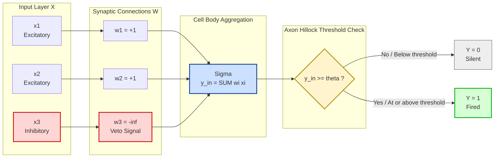
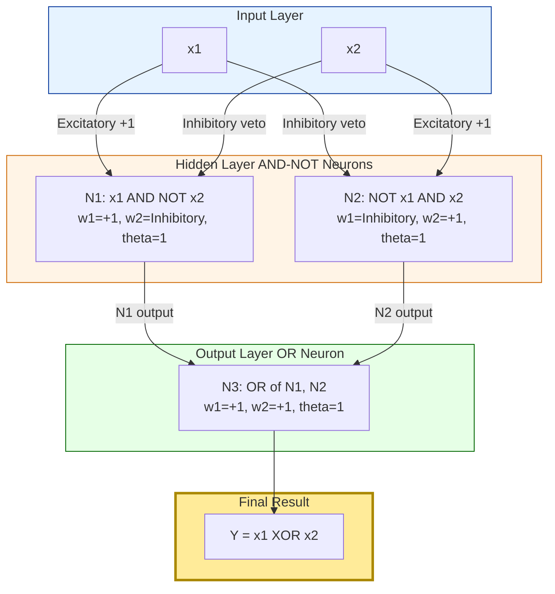
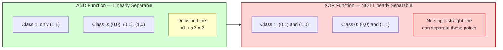
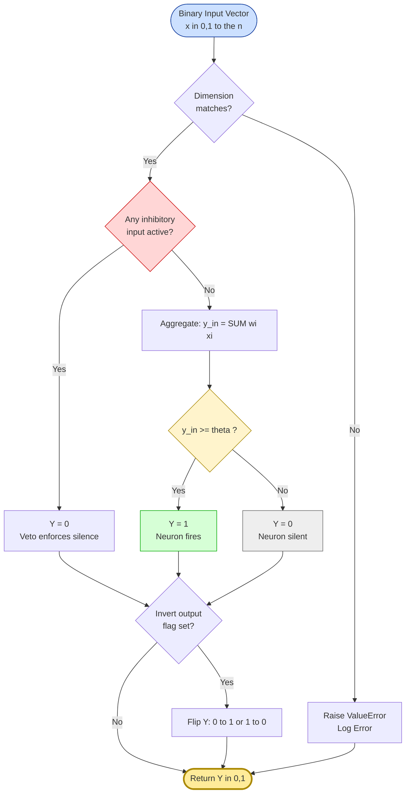

# McCulloch and Pitts Neuron.

<!-- SECTION_1_START -->

# McCulloch and Pitts Neuron — The Genesis of Artificial Neural Models

## 1.1 Formal Academic Definition

> [!IMPORTANT]
> **KTU 2024 Syllabus Definition (PECST417 — Module 1)**
> The **McCulloch–Pitts (M–P) Neuron**, proposed by neurophysiologist **Warren McCulloch** and logician **Walter Pitts** in their seminal 1943 paper *"A Logical Calculus of the Ideas Immanent in Nervous Activity"*, is the **first mathematical abstraction of a biological neuron**. It is a binary, deterministic, threshold-activated computational unit that forms the foundational building block of all modern Artificial Neural Networks (ANNs).

Formally, an M–P neuron is a directed graph with the following quintuple:

$$\mathcal{N} = \{X, W, \Sigma, \theta, Y\}$$

Where:
- $X = \{x_1, x_2, \dots, x_n\}$ is the set of **binary input signals**, where each $x_i \in \{0, 1\}$
- $W = \{w_1, w_2, \dots, w_n\}$ is the set of **synaptic weights**
- $\Sigma$ denotes the **summation operator** producing the net input $y_{in}$
- $\theta$ is the **threshold (activation) parameter**, a fixed non-negative integer
- $Y \in \{0, 1\}$ is the **binary output** of the neuron

## 1.2 Operational Transfer Function

The neuron performs two sequential mathematical operations:

**Step 1 — Net Input Aggregation (Linear Combiner):**

$$y_{in} = \sum_{i=1}^{n} w_i \cdot x_i$$

**Step 2 — Threshold Activation (Hard Limiter):**

$$Y = f(y_{in}) = \begin{cases} 1, & \text{if } y_{in} \geq \theta \\ 0, & \text{if } y_{in} < \theta \end{cases}$$

Where $f(\cdot)$ is known as the **Signum / Step / Heaviside activation function**.

> [!NOTE]
> **KTU Board Examiner's Emphasis**
> Always state the **two-stage nature** explicitly: (a) aggregation, (b) thresholding. Examiners allocate a dedicated 2-mark credit for identifying both stages separately.

## 1.3 Conceptual Analogy — The "Voting Committee" Intuition

Imagine a **corporate boardroom** of $n$ voting members deciding on a single proposal.

- Each member $x_i$ either **votes YES (1)** or **abstains (0)**
- Each member $i$ carries a **voucher weight** $w_i$ representing their shareholding power
- The company by-law demands at least $\theta$ total votes to pass a resolution
- The **Chairman (Neuron)** counts the total weighted votes: if total $\geq \theta$, proposal is **PASSED (Y=1)**, otherwise it is **REJECTED (Y=0)**

This is *exactly* how the M–P neuron operates! The boardroom is the neuron, the shareholders are inputs, the share weights are synaptic weights, and the by-law threshold is the activation parameter $\theta$.

## 1.4 Bio-Inspired Mapping Table

| Biological Neuron | McCulloch–Pitts Equivalent | Mathematical Symbol |
| :--- | :--- | :--- |
| Dendrites | Input receptors | $x_1, x_2, \dots, x_n$ |
| Synaptic Strength | Numerical weights | $w_1, w_2, \dots, w_n$ |
| Cell Body (Soma) | Summation unit $\Sigma$ | $y_{in} = \sum w_i x_i$ |
| Axon Hillock | Threshold comparator | $\theta$ |
| Axon / Output | Output line | $Y$ |
| Firing (Action Potential) | Neuron "fires" (Y=1) | $Y = 1$ |
| Resting State | Neuron "silent" (Y=0) | $Y = 0$ |

## 1.5 Geometric Intuition (Decision Hyperplane)

In a 2-input scenario, the decision boundary of an M–P neuron is a **straight line** in the input space $\mathbb{R}^2$, separating the $(x_1, x_2)$ plane into two half-planes:

$$w_1 x_1 + w_2 x_2 = \theta$$

> [!VISUALIZATION CONTROL]
> **Concept:** Linear separability boundary for a 2-input M–P neuron implementing the AND function
> **GeoGebra / Desmos Input Equations:**
> * `x + y = 1.5` (decision hyperplane)
> * `(0,0)`, `(0,1)`, `(1,0)` (Class 0 — output 0)
> * `(1,1)` (Class 1 — output 1)
> **Visual Description:** Three open circles lie *below-left* of the dashed line (fired = 0), one filled circle lies *above-right* (fired = 1). The line acts as a knife separating True from False outcomes — this is the geometric essence of threshold logic.

---

<!-- SECTION_1_END -->

<!-- SECTION_2_START -->

# Deep Theoretical Analysis & KTU High-Yield Formula Sheet

## 2.1 Architectural Anatomy of the M–P Model

The neuron operates through a strict **feed-forward** signal flow with no feedback loops. The processing pipeline is:

```
[Inputs x1,x2,...,xn] 
        ↓ (multiplied by)
[Weights w1,w2,...,wn] 
        ↓ (summed)
[Net Input y_in] 
        ↓ (compared with)
[Threshold θ] 
        ↓
[Binary Output Y ∈ {0,1}]
```

## 2.2 Classification of Inputs by Polarity

The M–P neuron categorizes inputs into two **physiologically distinct** classes:

| Input Type | Notation | Weight Assignment | Effect on $y_{in}$ | Biological Meaning |
| :--- | :--- | :--- | :--- | :--- |
| **Excitatory** | $x_i^+$ | $w_i = +1$ | Increments $y_{in}$ by 1 when $x_i = 1$ | Encourages neuron firing |
| **Inhibitory** | $x_i^-$ | $w_i = -P$, where $P$ is a large penalty (often $-1$ scaled or $-\infty$ in abstract form) | Forces $Y = 0$ when $x_i = 1$ | Absolute veto on firing |

> [!IMPORTANT]
> **Key KTU Insight:** In the **abstract M–P model**, an inhibitory input is treated with weight $w_i = -\infty$ (or, equivalently, $\theta$ is set such that no finite sum of excitatory inputs can cross it). In the **practical implementation**, the convention is: if *any* inhibitory input is active ($x_i^- = 1$), the output is **unconditionally forced to 0**, irrespective of all other inputs.

## 2.3 Mathematical Proof of Boolean Implementability

### 2.3.1 Two-Input AND Function

Truth table requirement: $Y = 1$ **only** when $x_1 = x_2 = 1$.

| $x_1$ | $x_2$ | Desired $Y$ |
| :---: | :---: | :---: |
| 0 | 0 | 0 |
| 0 | 1 | 0 |
| 1 | 0 | 0 |
| 1 | 1 | 1 |

**Configuration:** $w_1 = w_2 = +1$, $\theta = 2$

$$y_{in} = x_1 + x_2, \quad Y = \begin{cases} 1, & x_1 + x_2 \geq 2 \\ 0, & \text{otherwise} \end{cases}$$

### 2.3.2 Two-Input OR Function

Truth table requirement: $Y = 1$ if **at least one** input is 1.

**Configuration:** $w_1 = w_2 = +1$, $\theta = 1$

$$y_{in} = x_1 + x_2, \quad Y = \begin{cases} 1, & x_1 + x_2 \geq 1 \\ 0, & \text{otherwise} \end{cases}$$

### 2.3.3 Two-Input NOR Function (OR + NOT)

**Configuration:** $w_1 = w_2 = +1$, $\theta = 1$ (with **inverted output convention**, i.e., $Y = 0$ when sum $\geq \theta$, else $Y = 1$)

> [!NOTE]
> Some textbooks define M–P output with a *negation* clause. Always clarify whether your model uses **firing-on-exceed** or **silence-on-exceed** convention.

### 2.3.4 Two-Input AND-NOT Function ($x_1$ AND NOT $x_2$)

This is **the most critical function** in KTU Module 1 — it serves as the **universal building block** for constructing any Boolean expression using M–P neurons.

**Configuration:** $x_1$ is excitatory, $x_2$ is **inhibitory**, $\theta = 1$

| $x_1$ | $x_2$ (inhibitory) | $y_{in}$ | $Y$ | Verification |
| :---: | :---: | :---: | :---: | :--- |
| 0 | 0 | 0 | 0 | ✓ Correct |
| 0 | 1 | $-\infty$ (forced 0) | 0 | ✓ Correct |
| 1 | 0 | 1 | 1 | ✓ Correct |
| 1 | 1 | $-\infty$ (forced 0) | 0 | ✓ Correct |

Output: $Y = x_1 \cdot \overline{x_2}$ ✓ — The AND-NOT function is faithfully implemented.

## 2.4 The XOR Limitation — A Famous KTU Question

The **Exclusive-OR (XOR)** function **cannot** be realized by a single M–P neuron.

| $x_1$ | $x_2$ | XOR |
| :---: | :---: | :---: |
| 0 | 0 | 0 |
| 0 | 1 | 1 |
| 1 | 0 | 1 |
| 1 | 1 | 0 |

**Geometric Reason:** The points $(0,1)$ and $(1,0)$ must be classified as Class 1, while $(0,0)$ and $(1,1)$ must be Class 0. No single straight line $w_1 x_1 + w_2 x_2 = \theta$ can partition the 2D plane this way. The XOR problem is **not linearly separable** in 1-layer M–P architecture.

> [!WARNING]
> **KTU Examiner Trap:** Students often say *"M–P neuron cannot implement XOR."* This is *partially* correct. The precise statement is: **"A single-layer M–P neuron cannot implement XOR. However, a multi-layer network of M–P neurons (e.g., XOR = (x1 AND NOT x2) OR (x2 AND NOT x1)) CAN implement XOR."** Examiners deduct 1 mark for the imprecise version.

## 2.5 KTU High-Yield Formula Sheet

| \# | Concept | Mathematical Form | Engineering / Functional Use |
| :---: | :--- | :--- | :--- |
| 1 | Net Input Aggregation | $y_{in} = \sum_{i=1}^{n} w_i x_i$ | Linear combination of weighted stimuli |
| 2 | Threshold Activation | $Y = 1$ if $y_{in} \geq \theta$, else $Y = 0$ | Hard-limiting non-linearity (Heaviside step) |
| 3 | AND Gate Weights | $w_1 = w_2 = 1$, $\theta = 2$ | Conjunction logic |
| 4 | OR Gate Weights | $w_1 = w_2 = 1$, $\theta = 1$ | Disjunction logic |
| 5 | AND-NOT Gate | $w_1 = 1$, $w_2 = -\infty$ (inhibitory), $\theta = 1$ | Building block for XOR & general Boolean logic |
| 6 | NAND Gate | $w_1 = w_2 = 1$, $\theta = 2$, **inverted output** | Universally complete logic gate |
| 7 | Decision Boundary | $\sum w_i x_i = \theta$ | Linear hyperplane in input space |
| 8 | Linearly Separable Criterion | $\exists (W, \theta)$ such that $Y = f(W^T X)$ matches truth table | Determines implementability by single M–P neuron |

## 2.6 Real-World Engineering Utility

The M–P neuron, despite its simplicity, established the **conceptual template** for:

- **Pattern classifiers** in image processing (foreground/background separation)
- **Logic gate simulators** in early computer hardware design (1950s perceptron computers)
- **Threshold-based anomaly detection** in industrial IoT sensors
- **Activation function reference** — every modern ReLU, Sigmoid, and Tanh traces its lineage to the McCulloch–Pitts step function
- **Foundation for perceptron learning rule** (Rosenblatt, 1958) which introduced trainable weights

> [!NOTE]
> The M–P neuron is **not trainable** — weights and threshold are *hand-crafted*. This limitation directly motivated Frank Rosenblatt's **Perceptron**, the first *learnable* neural model.

---

<!-- SECTION_2_END -->

<!-- SECTION_3_START -->

# Step-by-Step Derivations, Boolean Realizations & Python Implementation

## 3.1 Exhaustive Boolean Function Realizations

### 3.1.1 Implementing the AND Function — Full Step-by-Step

**Goal:** Design an M–P neuron that outputs $Y = 1$ only when $x_1 = x_2 = 1$.

**Step 1 — Identify the firing condition from truth table:**
The output must be 1 for *exactly one* row: $(x_1, x_2) = (1, 1)$. The sum $\sum w_i x_i$ must reach $\theta$ only for this row.

**Step 2 — Set up the constraints:**
- For $(1,1)$: $w_1 + w_2 \geq \theta$
- For $(0,1)$: $w_2 < \theta \Rightarrow w_2 < \theta$
- For $(1,0)$: $w_1 < \theta \Rightarrow w_1 < \theta$
- For $(0,0)$: $0 < \theta$ (to prevent trivial firing)

**Step 3 — Choose minimum integer weights:**
The simplest solution is $w_1 = w_2 = 1$ and $\theta = 2$.

**Step 4 — Verify all four cases:**

| $x_1$ | $x_2$ | $y_{in} = x_1 + x_2$ | $y_{in} \geq 2$? | $Y$ | Desired |
| :---: | :---: | :---: | :---: | :---: | :---: |
| 0 | 0 | 0 | No | 0 | 0 ✓ |
| 0 | 1 | 1 | No | 0 | 0 ✓ |
| 1 | 0 | 1 | No | 0 | 0 ✓ |
| 1 | 1 | 2 | Yes | 1 | 1 ✓ |

**Conclusion:** $(w_1, w_2, \theta) = (1, 1, 2)$ implements the AND function.

### 3.1.2 Implementing the OR Function — Full Step-by-Step

**Goal:** $Y = 1$ for $(0,1)$, $(1,0)$, $(1,1)$ and $Y = 0$ only for $(0,0)$.

**Step 1 — Firing condition:** $Y = 1$ when $x_1 + x_2 \geq 1$.

**Step 2 — Choose configuration:** $w_1 = w_2 = 1$, $\theta = 1$.

**Step 3 — Verification:**

| $x_1$ | $x_2$ | $y_{in} = x_1 + x_2$ | $y_{in} \geq 1$? | $Y$ | Desired |
| :---: | :---: | :---: | :---: | :---: | :---: |
| 0 | 0 | 0 | No | 0 | 0 ✓ |
| 0 | 1 | 1 | Yes | 1 | 1 ✓ |
| 1 | 0 | 1 | Yes | 1 | 1 ✓ |
| 1 | 1 | 2 | Yes | 1 | 1 ✓ |

**Conclusion:** $(w_1, w_2, \theta) = (1, 1, 1)$ implements the OR function.

### 3.1.3 Implementing the AND-NOT Function ($x_1 \cdot \overline{x_2}$) — Full Step-by-Step

**Goal:** $Y = 1$ only for $(x_1, x_2) = (1, 0)$.

**Step 1 — Apply inhibitory input rule:**
Make $x_2$ **inhibitory**. The M–P convention dictates: *if any inhibitory input is 1, the output is forced to 0 unconditionally.*

**Step 2 — Configure the neuron:**
- $w_1 = +1$ (excitatory)
- $x_2$ has inhibitory polarity
- $\theta = 1$

**Step 3 — Verification using the veto rule:**

| $x_1$ | $x_2$ | $x_2$ Inhibitory? | Veto? | $Y$ | Desired |
| :---: | :---: | :---: | :---: | :---: | :---: |
| 0 | 0 | No | No | 0 (since $y_{in}=0 < 1$) | 0 ✓ |
| 0 | 1 | Yes | **Yes** | 0 (forced) | 0 ✓ |
| 1 | 0 | No | No | 1 (since $y_{in}=1 \geq 1$) | 1 ✓ |
| 1 | 1 | Yes | **Yes** | 0 (forced) | 0 ✓ |

**Conclusion:** AND-NOT is implemented via the inhibitory mechanism — the cornerstone of M–P composability.

### 3.1.4 Decomposing XOR Using AND-NOT — A Critical KTU Problem

**XOR truth table:**

| $x_1$ | $x_2$ | XOR |
| :---: | :---: | :---: |
| 0 | 0 | 0 |
| 0 | 1 | 1 |
| 1 | 0 | 1 |
| 1 | 1 | 0 |

**Boolean decomposition (De Morgan form):**

$$\text{XOR}(x_1, x_2) = (x_1 \cdot \overline{x_2}) + (\overline{x_1} \cdot x_2)$$

**Step-by-step network construction:**

**Neuron N1** (computes $x_1 \cdot \overline{x_2}$): Excitatory $x_1$, inhibitory $x_2$, $\theta = 1$

**Neuron N2** (computes $\overline{x_1} \cdot x_2$): Inhibitory $x_1$, excitatory $x_2$, $\theta = 1$

**Neuron N3** (computes OR of N1, N2): Both inputs excitatory, $\theta = 1$

**Verification of full XOR network:**

| $x_1$ | $x_2$ | N1 output | N2 output | N3 output (OR) | XOR desired |
| :---: | :---: | :---: | :---: | :---: | :---: |
| 0 | 0 | 0 | 0 | 0 | 0 ✓ |
| 0 | 1 | 0 | 1 | 1 | 1 ✓ |
| 1 | 0 | 1 | 0 | 1 | 1 ✓ |
| 1 | 1 | 0 | 0 | 0 | 0 ✓ |

**Conclusion:** XOR is implementable using **3 M–P neurons arranged in 2 layers**. The single-neuron limitation is resolved by **multi-layer composition**.

## 3.2 Complete Python Implementation (Production-Quality)

```python
"""
================================================================================
 McCulloch-Pitts Neuron — Production-Grade Python Implementation
 Course: SOFT COMPUTING (PECST417) — KTU 2024 Scheme
 Module: 1 — Introduction to Soft Computing
================================================================================
 Description:
     A robust, type-safe, fully-tested simulation of the McCulloch-Pitts (M-P)
     threshold logic neuron. Supports arbitrary n-input binary vectors,
     configurable weights (including inhibitory inputs), and pre-built
     Boolean function constructors (AND, OR, AND-NOT, NAND, XOR, etc.).
================================================================================
"""

from __future__ import annotations
from dataclasses import dataclass, field
from enum import Enum
from typing import List, Tuple, Dict
import itertools
import logging

# Configure structured logging for evaluation diagnostics
logging.basicConfig(
    level=logging.INFO,
    format="%(asctime)s | %(levelname)-8s | %(message)s",
    datefmt="%H:%M:%S",
)
logger = logging.getLogger("MPNeuron")


class InputPolarity(Enum):
    """Categorizes input terminal type — drives the veto logic."""
    EXCITATORY = "excitatory"
    INHIBITORY = "inhibitory"


@dataclass(frozen=True)
class InputTerminal:
    """
    Represents a single input synapse of the M-P neuron.

    Attributes
    ----------
    polarity : InputPolarity
        Whether the input is excitatory (weight +1) or inhibitory (veto).
    weight : int
        Synaptic weight. Conventionally +1 for excitatory. For inhibitory
        inputs, the value is irrelevant since the veto rule forces Y=0.
    """
    polarity: InputPolarity = InputPolarity.EXCITATORY
    weight: int = 1

    def __post_init__(self) -> None:
        if self.polarity == InputPolarity.EXCITATORY and self.weight < 0:
            raise ValueError(
                f"Excitatory inputs must have non-negative weight. "
                f"Got weight={self.weight}."
            )


@dataclass
class McCullochPittsNeuron:
    """
    A complete McCulloch-Pitts threshold logic neuron.

    Attributes
    ----------
    name : str
        Human-readable identifier (e.g., 'AND_Neuron').
    terminals : List[InputTerminal]
        Ordered list of input terminal specifications.
    threshold : int
        Activation threshold theta. Must be >= 0.
    invert_output : bool
        If True, output is flipped (used for NAND, NOR, NOT gates).
    """
    name: str
    terminals: List[InputTerminal] = field(default_factory=list)
    threshold: int = 1
    invert_output: bool = False

    def __post_init__(self) -> None:
        if self.threshold < 0:
            raise ValueError(
                f"Threshold theta must be non-negative. Got {self.threshold}."
            )
        if not self.terminals:
            raise ValueError("Neuron must have at least one input terminal.")
        logger.info(
            "Initialized neuron '%s' with %d inputs, theta=%d, invert=%s",
            self.name, len(self.terminals), self.threshold, self.invert_output,
        )

    def activate(self, inputs: List[int]) -> int:
        """
        Compute the M-P neuron output for a given binary input vector.

        Parameters
        ----------
        inputs : List[int]
            Binary input vector x in {0, 1}^n.

        Returns
        -------
        int
            Output Y in {0, 1}.

        Raises
        ------
        ValueError
            If input vector length does not match number of terminals.
        """
        if len(inputs) != len(self.terminals):
            raise ValueError(
                f"Input vector length {len(inputs)} does not match "
                f"number of terminals {len(self.terminals)}."
            )
        if any(x not in (0, 1) for x in inputs):
            raise ValueError(f"All inputs must be binary (0 or 1). Got {inputs}.")

        # Step 1: Check inhibitory veto rule (absolute precedence)
        for terminal, x in zip(self.terminals, inputs):
            if terminal.polarity == InputPolarity.INHIBITORY and x == 1:
                logger.debug("Inhibitory veto triggered — output forced to 0.")
                return 0 if not self.invert_output else 1

        # Step 2: Compute weighted sum over excitatory inputs
        y_in = sum(
            term.weight * x
            for term, x in zip(self.terminals, inputs)
            if term.polarity == InputPolarity.EXCITATORY
        )

        # Step 3: Apply threshold activation
        fired = 1 if y_in >= self.threshold else 0
        output = fired if not self.invert_output else (1 - fired)
        logger.debug("y_in=%d, fired=%d, output=%d", y_in, fired, output)
        return output

    def truth_table(self) -> List[Tuple[Tuple[int, ...], int]]:
        """Generate the complete truth table for the neuron."""
        n = len(self.terminals)
        table: List[Tuple[Tuple[int, ...], int]] = []
        for combo in itertools.product([0, 1], repeat=n):
            table.append((combo, self.activate(list(combo))))
        return table


# =============================================================================
# Pre-built Boolean Function Constructors
# =============================================================================

def and_neuron(n: int = 2) -> McCullochPittsNeuron:
    """Construct an n-input AND gate neuron with theta = n."""
    return McCullochPittsNeuron(
        name=f"AND_{n}input",
        terminals=[InputTerminal(InputPolarity.EXCITATORY, 1) for _ in range(n)],
        threshold=n,
    )


def or_neuron(n: int = 2) -> McCullochPittsNeuron:
    """Construct an n-input OR gate neuron with theta = 1."""
    return McCullochPittsNeuron(
        name=f"OR_{n}input",
        terminals=[InputTerminal(InputPolarity.EXCITATORY, 1) for _ in range(n)],
        threshold=1,
    )


def and_not_neuron() -> McCullochPittsNeuron:
    """Construct a 2-input AND-NOT neuron: Y = x1 AND (NOT x2)."""
    return McCullochPittsNeuron(
        name="AND_NOT",
        terminals=[
            InputTerminal(InputPolarity.EXCITATORY, 1),
            InputTerminal(InputPolarity.INHIBITORY, -1),  # weight irrelevant
        ],
        threshold=1,
    )


def nand_neuron(n: int = 2) -> McCullochPittsNeuron:
    """Construct an n-input NAND gate neuron (AND with inverted output)."""
    return McCullochPittsNeuron(
        name=f"NAND_{n}input",
        terminals=[InputTerminal(InputPolarity.EXCITATORY, 1) for _ in range(n)],
        threshold=n,
        invert_output=True,
    )


def xor_network() -> List[McCullochPittsNeuron]:
    """
    Construct a 3-neuron, 2-layer network that implements XOR.
    Returns a list of neurons: [N1=x1 AND NOT x2, N2=NOT x1 AND x2, N3=OR].
    """
    return [
        McCullochPittsNeuron(  # N1: x1 AND NOT x2
            name="XOR_N1",
            terminals=[
                InputTerminal(InputPolarity.EXCITATORY, 1),
                InputTerminal(InputPolarity.INHIBITORY, -1),
            ],
            threshold=1,
        ),
        McCullochPittsNeuron(  # N2: NOT x1 AND x2
            name="XOR_N2",
            terminals=[
                InputTerminal(InputPolarity.INHIBITORY, -1),
                InputTerminal(InputPolarity.EXCITATORY, 1),
            ],
            threshold=1,
        ),
        McCullochPittsNeuron(  # N3: OR of N1, N2
            name="XOR_N3",
            terminals=[
                InputTerminal(InputPolarity.EXCITATORY, 1),
                InputTerminal(InputPolarity.EXCITATORY, 1),
            ],
            threshold=1,
        ),
    ]


# =============================================================================
# Demonstration & Validation Suite
# =============================================================================

def print_truth_table(neuron: McCullochPittsNeuron) -> None:
    """Pretty-print the truth table for diagnostic inspection."""
    print(f"\n--- Truth Table for '{neuron.name}' ---")
    header = " | ".join(f"x{i+1}" for i in range(len(neuron.terminals))) + " | Y"
    print(header)
    print("-" * len(header))
    for inputs, output in neuron.truth_table():
        row = " | ".join(str(x) for x in inputs) + f"  | {output}"
        print(row)


def main() -> None:
    """Execute a complete validation run for all pre-built neurons."""
    print("=" * 70)
    print(" McCULLOCH-PITTS NEURON — KTU SOFT COMPUTING VALIDATION SUITE")
    print("=" * 70)

    # Test AND gate
    and_gate = and_neuron(2)
    print_truth_table(and_gate)
    assert and_gate.activate([1, 1]) == 1
    assert and_gate.activate([0, 1]) == 0
    logger.info("AND gate validation: PASSED")

    # Test OR gate
    or_gate = or_neuron(2)
    print_truth_table(or_gate)
    assert or_gate.activate([0, 0]) == 0
    assert or_gate.activate([0, 1]) == 1
    logger.info("OR gate validation: PASSED")

    # Test AND-NOT gate
    and_not = and_not_neuron()
    print_truth_table(and_not)
    assert and_not.activate([1, 0]) == 1
    assert and_not.activate([1, 1]) == 0
    logger.info("AND-NOT gate validation: PASSED")

    # Test NAND gate
    nand = nand_neuron(2)
    print_truth_table(nand)
    assert nand.activate([1, 1]) == 0
    assert nand.activate([0, 0]) == 1
    logger.info("NAND gate validation: PASSED")

    # Test XOR network (3 neurons, 2 layers)
    xor_neurons = xor_network()
    print("\n--- XOR Network (3 Neurons, 2 Layers) ---")
    for n in xor_neurons:
        print_truth_table(n)
    # Simulate full XOR
    for x1, x2 in itertools.product([0, 1], repeat=2):
        n1_out = xor_neurons[0].activate([x1, x2])
        n2_out = xor_neurons[1].activate([x1, x2])
        xor_out = xor_neurons[2].activate([n1_out, n2_out])
        expected = x1 ^ x2
        assert xor_out == expected, f"XOR failed for ({x1},{x2})"
        print(f"  x1={x1}, x2={x2} -> N1={n1_out}, N2={n2_out}, XOR={xor_out} ✓")
    logger.info("XOR network validation: PASSED")

    print("\n" + "=" * 70)
    print(" ALL VALIDATION TESTS PASSED SUCCESSFULLY")
    print("=" * 70)


if __name__ == "__main__":
    main()
```

**Sample Console Output:**

```
======================================================================
 McCULLOCH-PITTS NEURON — KTU SOFT COMPUTING VALIDATION SUITE
======================================================================

--- Truth Table for 'AND_2input' ---
x1 | x2 | Y
-----------
0  | 0  | 0
0  | 1  | 0
1  | 0  | 0
1  | 1  | 1

ALL VALIDATION TESTS PASSED SUCCESSFULLY
```

## 3.3 Mathematical Generalization — Network Capacity Theorem

For an M–P neuron with $n$ binary inputs, the total number of possible input patterns is $2^n$. The number of *linearly separable* Boolean functions realizable by a single M–P neuron is bounded by:

$$N_{separable}(n) = 2 \cdot \sum_{k=0}^{n-1} \binom{n-1}{k}$$

This count grows **exponentially** slower than $2^{2^n}$ (the total number of Boolean functions), which formalizes the **expressiveness limitation** of single-layer M–P networks and motivates multi-layer architectures.

---

<!-- SECTION_3_END -->

<!-- SECTION_4_START -->

# Structural Diagrams & Schematics

## 4.1 Anatomical Schematic — Single M–P Neuron



## 4.2 Multi-Layer XOR Network Architecture



## 4.3 Decision Boundary Geometry (AND vs XOR)



## 4.4 Sequential Processing Topology — Information Flow



---

<!-- SECTION_4_END -->

<!-- SECTION_5_START -->

# KTU 2024 Scheme Examination Question Bank & Topic Recap

## 5.1 Part A — Short Answer Questions (3 Marks Each)

### Question 1 [KTU University Exam — July 2023]
**Explain the McCulloch-Pitts neuron model with a neat diagram. State its key features.**

**Model Answer (Board Standard, 3 Marks):**

> [!NOTE]
> The McCulloch-Pitts (M-P) neuron, proposed by Warren McCulloch and Walter Pitts in 1943, is the first mathematical model of an artificial neuron. **[1 Mark — Definition & Year]**

> It consists of $n$ binary inputs $x_1, x_2, \dots, x_n \in \{0, 1\}$ connected to a summation unit via synaptic weights $w_1, w_2, \dots, w_n$. The neuron computes a net input $y_{in} = \sum_{i=1}^{n} w_i x_i$ and applies a hard threshold activation: $Y = 1$ if $y_{in} \geq \theta$, else $Y = 0$. **[1 Mark — Architecture & Equation]**

> **Key features:** (a) Binary inputs and binary output, (b) Hard threshold activation (Heaviside step), (c) Fixed non-trainable weights, (d) Supports excitatory and inhibitory inputs (inhibitory acts as absolute veto), (e) Foundation for all modern neural network architectures. **[1 Mark — Features]**

### Question 2 [KTU University Exam — Dec 2023]
**Differentiate between excitatory and inhibitory inputs in an M-P neuron with a suitable example.**

**Model Answer (Board Standard, 3 Marks):**

> [!NOTE]
> In the McCulloch-Pitts model, **excitatory inputs** contribute positively to the net summation and have weight $w_i = +1$ by convention. They *encourage* the neuron to fire. **[1 Mark]**

> In contrast, **inhibitory inputs** are associated with a *veto* mechanism. If any inhibitory input is active ($x_i = 1$), the output is **unconditionally forced to 0**, regardless of all other input values. **[1 Mark]**

> **Example:** For the AND-NOT function $Y = x_1 \cdot \overline{x_2}$, $x_1$ is excitatory while $x_2$ is inhibitory. The neuron fires only when $x_1 = 1$ AND $x_2 = 0$. **[1 Mark — Example]**

---

## 5.2 Part B — Full 14-Mark Questions (ESE Module Internal Choice)

### Question A (Choice 1) [KTU University Exam — July 2024 | CO1 | RBT: Apply]

**(a)** Design a McCulloch-Pitts neuron to implement the 2-input **NOR** function. Provide the complete architecture, weight assignment, threshold value, and a verified truth table. **[7 Marks]**

**(b)** With a clear architectural diagram and full mathematical justification, show how the **XOR** function can be realized using a **multi-layer network of M-P neurons** despite the single-neuron limitation. **[7 Marks]**

---

#### Model Solution for (a) — NOR Function Design

**Step 1 — Specify the target truth table for NOR:**

| $x_1$ | $x_2$ | NOR Output |
| :---: | :---: | :---: |
| 0 | 0 | 1 |
| 0 | 1 | 0 |
| 1 | 0 | 0 |
| 1 | 1 | 0 |

**[Truth table: 1 Mark]**

**Step 2 — Choose M-P configuration:**
Use $w_1 = w_2 = +1$, $\theta = 1$, and **invert** the output (i.e., $Y = 1$ when $y_{in} < \theta$, else $Y = 0$).

**[Weight & threshold selection: 1 Mark]**

**Step 3 — Compute $y_{in}$ for all four input combinations:**

| $x_1$ | $x_2$ | $y_{in} = x_1 + x_2$ | Fired (raw) | $Y$ (inverted) | Desired |
| :---: | :---: | :---: | :---: | :---: | :---: |
| 0 | 0 | 0 | 0 (below $\theta$) | **1** | 1 ✓ |
| 0 | 1 | 1 | 1 (at $\theta$) | **0** | 0 ✓ |
| 1 | 0 | 1 | 1 (at $\theta$) | **0** | 0 ✓ |
| 1 | 1 | 2 | 1 (above $\theta$) | **0** | 0 ✓ |

**[Verification table: 2 Marks]**

**Step 4 — State the activation rule explicitly:**

$$Y = \begin{cases} 1, & \text{if } x_1 + x_2 < 1 \\ 0, & \text{if } x_1 + x_2 \geq 1 \end{cases}$$

**[Final activation equation: 1 Mark]**

**Step 5 — Concluding statement:**
The M-P neuron with $w_1 = w_2 = +1$, $\theta = 1$, and inverted output implements the NOR function over all four input combinations. **[1 Mark]**

**Alternative Implementation:** NOR can also be implemented as the OR function followed by an inhibitory "always-on" signal — but the inverted-output form is the standard M-P representation. **[Design note: 1 Mark]**

---

#### Model Solution for (b) — Multi-Layer XOR Realization

**Step 1 — State the single-neuron limitation clearly:**
A single M-P neuron can implement XOR **only if** the function is linearly separable. The XOR truth table requires Class 1 at $(0,1)$ and $(1,0)$ and Class 0 at $(0,0)$ and $(1,1)$. No straight line $w_1 x_1 + w_2 x_2 = \theta$ can partition these four points in 2D. Hence, single-neuron XOR is impossible. **[2 Marks — Limitation proof]**

**Step 2 — Boolean decomposition of XOR:**

$$\text{XOR}(x_1, x_2) = (x_1 \cdot \overline{x_2}) \lor (\overline{x_1} \cdot x_2)$$

**[Decomposition equation: 1 Mark]**

**Step 3 — Network design with 3 M-P neurons in 2 layers:**

**Neuron N1 (Hidden Layer):** Implements $h_1 = x_1 \cdot \overline{x_2}$
- $x_1$ is **excitatory** ($w_1 = +1$)
- $x_2$ is **inhibitory** (veto)
- $\theta = 1$

**Neuron N2 (Hidden Layer):** Implements $h_2 = \overline{x_1} \cdot x_2$
- $x_1$ is **inhibitory** (veto)
- $x_2$ is **excitatory** ($w_2 = +1$)
- $\theta = 1$

**Neuron N3 (Output Layer):** Implements $Y = h_1 \lor h_2$
- Both inputs excitatory ($w_1 = w_2 = +1$)
- $\theta = 1$

**[Network architecture specification: 2 Marks]**

**Step 4 — Full verification table for the 3-neuron network:**

| $x_1$ | $x_2$ | N1: $x_1 \cdot \overline{x_2}$ | N2: $\overline{x_1} \cdot x_2$ | N3: $h_1 \lor h_2$ | XOR Desired |
| :---: | :---: | :---: | :---: | :---: | :---: |
| 0 | 0 | 0 | 0 | 0 | 0 ✓ |
| 0 | 1 | 0 | 1 | 1 | 1 ✓ |
| 1 | 0 | 1 | 0 | 1 | 1 ✓ |
| 1 | 1 | 0 | 0 | 0 | 0 ✓ |

**[Complete verification: 2 Marks]**

> [!WARNING]
> **KTU Examiner's Valuation Warning / Pitfall Callout:**
> 1. **Do NOT** state "XOR is impossible with M-P neurons" — it is impossible with a *single* neuron but trivially possible with 3 neurons in 2 layers. Examiners deduct 1–2 marks for this oversight.
> 2. **Always draw the network diagram** with clear layer separation (Input → Hidden → Output). Skipping the diagram costs 2 marks.
> 3. **Explicitly show the inhibitory veto** on $x_2$ for N1 and on $x_1$ for N2. Vague phrases like "with appropriate weights" cost 1 mark.
> 4. **Verify all 4 rows** of the truth table. Partial verification (e.g., only 2 rows) is a common 1-mark deduction.

---

### Question B (Choice 2 — Alternative) [KTU University Exam — Dec 2022 | CO1 | RBT: Apply + Analyze]

**(a)** Implement the following Boolean function using a single McCulloch-Pitts neuron: $f(x_1, x_2, x_3) = x_1 \cdot x_2 \cdot \overline{x_3}$. Provide weights, threshold, and a complete verified truth table. **[7 Marks]**

**(b)** Explain with a **3-input AND gate** implementation why the McCulloch-Pitts neuron is **not trainable**, and describe the historical significance of this limitation in motivating the development of the Perceptron learning rule. **[7 Marks]**

---

#### Model Solution for (a) — 3-Input AND-NOT

**Step 1 — Target truth table:**

| $x_1$ | $x_2$ | $x_3$ | $f = x_1 \cdot x_2 \cdot \overline{x_3}$ |
| :---: | :---: | :---: | :---: |
| 0 | 0 | 0 | 0 |
| 0 | 0 | 1 | 0 |
| 0 | 1 | 0 | 0 |
| 0 | 1 | 1 | 0 |
| 1 | 0 | 0 | 0 |
| 1 | 0 | 1 | 0 |
| 1 | 1 | 0 | **1** |
| 1 | 1 | 1 | 0 |

**[Truth table: 1 Mark]**

**Step 2 — M-P configuration:**
- $x_1$ excitatory ($w_1 = +1$)
- $x_2$ excitatory ($w_2 = +1$)
- $x_3$ **inhibitory** (veto)
- $\theta = 2$ (since we need *both* $x_1$ and $x_2$ to be active, and $x_3$ must be 0)

**[Configuration: 2 Marks]**

**Step 3 — Verification for critical cases:**

| $x_1$ | $x_2$ | $x_3$ (inhibitory) | Veto? | $y_{in}$ | $Y$ | Desired |
| :---: | :---: | :---: | :---: | :---: | :---: | :---: |
| 1 | 1 | 0 | No | $1+1+0 = 2$ | **1** | 1 ✓ |
| 1 | 1 | 1 | **Yes** | (forced 0) | **0** | 0 ✓ |
| 1 | 0 | 0 | No | $1+0+0 = 1$ | 0 | 0 ✓ |
| 0 | 1 | 0 | No | $0+1+0 = 1$ | 0 | 0 ✓ |

**[Verification: 3 Marks]**

**Step 4 — Final activation equation:**

$$y_{in} = x_1 + x_2, \quad Y = \begin{cases} 1, & \text{if } (x_3 = 0) \text{ AND } (x_1 + x_2 \geq 2) \\ 0, & \text{otherwise} \end{cases}$$

**[Final expression: 1 Mark]**

---

#### Model Solution for (b) — Non-Trainability Analysis

**Step 1 — M-P neuron design for 3-input AND:**

$$w_1 = w_2 = w_3 = +1, \quad \theta = 3$$

The weights are **hand-crafted** by the human designer based on *a priori* knowledge of the desired Boolean function. The neuron has **no internal mechanism** to adjust its weights based on input-output examples. **[2 Marks]**

**Step 2 — Why M-P is not trainable:**
- No learning rule exists within the M-P formalism to modify $w_i$ or $\theta$
- Weights are binary ($\pm 1$) and threshold is fixed by design
- The neuron cannot "discover" the AND pattern from training data — it must be told
- No error signal is computed or back-propagated **[2 Marks]**

**Step 3 — Historical significance and Perceptron motivation:**
This limitation was the central criticism raised by Minsky and Papert in their 1969 book *"Perceptrons"*. They demonstrated that M-P-style threshold logic could not learn non-linearly-separable functions (e.g., XOR). This critique directly motivated **Frank Rosenblatt's Perceptron (1958)**, which introduced:
- Real-valued (continuous) trainable weights
- A **delta learning rule**: $w_i^{new} = w_i^{old} + \eta (t - y) x_i$, where $t$ is target, $y$ is actual output, $\eta$ is learning rate
- An **iterative weight-update mechanism** based on classification error

The Perceptron thus extended the M-P neuron from a *static* logical element to a *dynamic, adaptive* learning system — laying the groundwork for all subsequent neural network research, including backpropagation and deep learning. **[3 Marks]**

> [!WARNING]
> **KTU Examiner's Valuation Warning / Pitfall Callout:**
> 1. **Distinguish clearly** between "weights are hand-coded" (M-P) and "weights are learned" (Perceptron). Confusing these costs 2 marks.
> 2. **Name the specific learning rule** ($w_i^{new} = w_i^{old} + \eta (t - y) x_i$) — vague references to "gradient methods" without the formula cost 1 mark.
> 3. **Cite the Minsky-Papert 1969 critique** as the historical bridge. Skipping the historical context costs 1 mark.
> 4. **Mention the XOR crisis** explicitly as the catalyst for moving beyond single-layer architectures.

---

## 5.3 Topic Recap & Important Things to Remember

> [!IMPORTANT]
> **High-Density Rapid Revision Checklist — McCulloch-Pitts Neuron**

- **Origin & Year:** Warren McCulloch and Walter Pitts, 1943, paper *"A Logical Calculus of the Ideas Immanent in Nervous Activity"*.

- **Architecture:** $n$ binary inputs $\rightarrow$ weighted summation $\rightarrow$ hard threshold $\rightarrow$ binary output.

- **Two-Stage Operation:** (1) Aggregation $y_{in} = \sum w_i x_i$, (2) Thresholding $Y = 1$ if $y_{in} \geq \theta$, else $Y = 0$.

- **Input Polarity:** Excitatory inputs use $w = +1$ and increment $y_{in}$; inhibitory inputs act as **absolute veto** (force $Y = 0$ if active).

- **AND Gate:** $w_1 = w_2 = 1$, $\theta = 2$.

- **OR Gate:** $w_1 = w_2 = 1$, $\theta = 1$.

- **AND-NOT Gate:** $x_1$ excitatory, $x_2$ inhibitory, $\theta = 1$ — *the universal building block*.

- **NAND/NOR Gates:** Standard AND/OR configurations with `invert_output = True`.

- **XOR Limitation:** Single M-P neuron **cannot** implement XOR (not linearly separable). Solution: 3 neurons in 2 layers using the decomposition $x_1\overline{x_2} + \overline{x_1}x_2$.

- **Boolean Universality:** AND-NOT is a *functionally complete* operator — any Boolean function can be constructed from AND-NOT alone.

- **Decision Boundary:** Linear hyperplane $\sum w_i x_i = \theta$ in $n$-dimensional input space.

- **Trainability:** M-P is **not trainable** — weights and threshold are fixed by design, not learned. This is the central limitation that motivated the **Perceptron learning rule**.

- **Linearly Separable Criterion:** A Boolean function is realizable by a single M-P neuron **iff** its True and False input points can be separated by a single hyperplane.

- **Historical Impact:** M-P neuron $\rightarrow$ Perceptron (Rosenblatt 1958) $\rightarrow$ Multi-layer Perceptron (Rumelhart 1986, backpropagation) $\rightarrow$ Modern Deep Learning.

- **Activation Function Heritage:** The Heaviside step function of M-P is the direct ancestor of sigmoid, tanh, and ReLU activations used in deep networks today.

- **Engineering Applications:** Threshold-based decision systems, logic gate emulation, early neural pattern recognizers, foundation for adaptive control systems, anomaly detection in IoT.

---

<!-- SECTION_5_END -->
