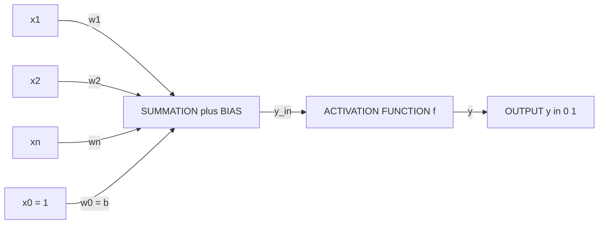
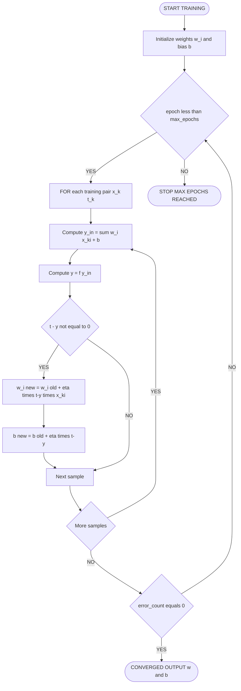
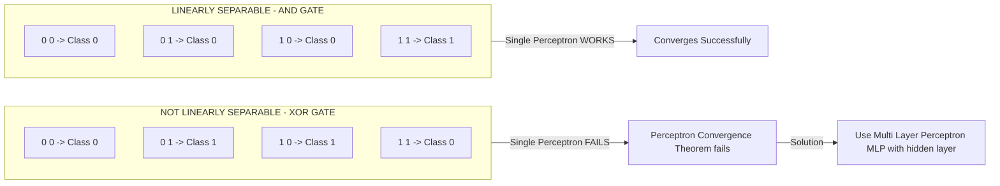
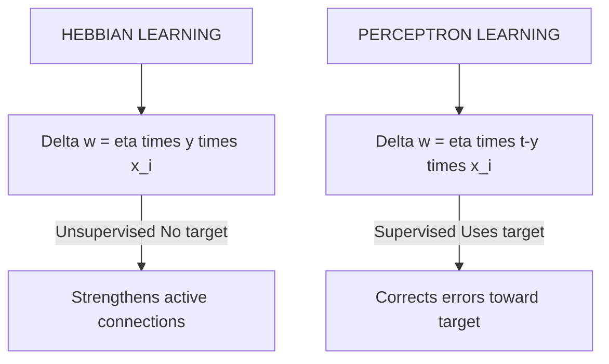

# Perceptron Networks– Learning rule, Training and testing algorithm.

<!-- SECTION_1_START -->
# 🧠 Perceptron Networks – The Atomic Unit of Neural Learning

## 📘 Formal Definition (KTU 2024 Syllabus Terminology)

A **Perceptron** is the earliest and most fundamental mathematical model of an artificial neuron, proposed by **Frank Rosenblatt in 1958**. It is a *supervised, single-layer, feed-forward binary classifier* that learns a linear decision boundary by iteratively adjusting its synaptic weights based on the classification error.

> [!IMPORTANT]  
> **Core Definition (Board-Exam Ready):**  
> A Perceptron is a computational unit that computes a *weighted sum of its inputs*, adds a *bias*, passes the result through a *hard-limiting activation function* (step function), and produces a binary output $\in \{0, 1\}$ or $\{-1, +1\}$.

Mathematically, for an $n$-dimensional input vector $\mathbf{x} = (x_1, x_2, \ldots, x_n)$:

$$y = f\left(\sum_{i=1}^{n} w_i x_i + b\right)$$

where:
- $w_i$ = synaptic weight of input $x_i$
- $b$ = bias (external threshold parameter)
- $f(\cdot)$ = activation (transfer) function
- $y$ = final binary output

---

## 🌱 Intuitive Analogy – The "Voting Judge"

Imagine a judge in a courtroom who listens to **$n$ witnesses** (inputs $x_1, x_2, \ldots, x_n$). Each witness has a **trust score** (weight $w_i$). The judge sums up (witness statement $\times$ trust score). If this weighted opinion crosses a personal threshold $b$, the judge issues a **"GUILTY" verdict ($y=1$)**; otherwise, **"NOT GUILTY" ($y=0$)**.

> [!NOTE]  
> The judge **learns** by being corrected after every wrong verdict — if a guilty person was let off, the judge **increases trust** in the witnesses who pointed towards guilt, and if an innocent was convicted, the judge **decreases trust** in those who misled. This is exactly the **Perceptron Learning Rule**.

---

## 🏗️ Architectural Anatomy

| Component | Biological Counterpart | Role |
|-----------|------------------------|------|
| Inputs $x_i$ | Dendrites | Receive raw signals from environment |
| Weights $w_i$ | Synaptic strength | Scale the importance of each input |
| Summation $\Sigma$ | Cell body (Soma) | Aggregate weighted inputs |
| Bias $b$ | Resting potential | Shifts the decision threshold |
| Activation $f(\cdot)$ | Axon firing mechanism | Decides final "fire / don't fire" |
| Output $y$ | Axon terminal | Transmits decision downstream |

---

## ⚡ Activation Functions Reference

| Function | Formula | Output Range | Use Case |
|----------|---------|--------------|----------|
| **Unipolar Step (Heaviside)** | $f(z) = \begin{cases} 1 & z \geq 0 \\ 0 & z < 0 \end{cases}$ | $\{0, 1\}$ | Original Perceptron (Rosenblatt) |
| **Bipolar Step** | $f(z) = \begin{cases} +1 & z \geq 0 \\ -1 & z < 0 \end{cases}$ | $\{-1, +1\}$ | Pattern Association |
| **Sigmoid (Logistic)** | $f(z) = \dfrac{1}{1 + e^{-z}}$ | $(0, 1)$ | Backpropagation networks |
| **Signum** | $\text{sgn}(z)$ | $\{-1, 0, +1\}$ | BAM, Hopfield nets |

> [!VISUALIZATION CONTROL]
> **Concept:** Decision boundary evolution of a Perceptron for the AND gate.
> **GeoGebra / Desmos Input Equations:**
> * `f(x) = -(2.3/1.3)*x + (2.8/1.3)` &nbsp; *(final decision line after training)*
> * Points: `A=(0,0)`, `B=(0,1)`, `C=(1,0)`, `D=(1,1)` (input combinations)
> * Region labels: `y=0` and `y=1` zones
> **Visual Description:** Student should see a straight line separating the `D=(1,1)` point (classified as 1) from the other three points (classified as 0) on the $x_1$–$x_2$ plane.
<!-- SECTION_1_END -->

<!-- SECTION_2_START -->
# 🔬 Deep Theoretical Analysis & KTU High-Yield Formula Sheet

## 📐 Mathematical Foundation – Layer by Layer

### **Step 1: Net Input Computation (Propagation)**

The neuron aggregates all incoming signals into a single scalar called the **local field** or **net input** $y_{in}$:

$$y_{in} = \sum_{i=1}^{n} w_i x_i + b$$

In vector form, this elegantly becomes a dot product:

$$y_{in} = \mathbf{w}^T \mathbf{x} + b$$

### **Step 2: Activation (Decision)**

The net input is passed through a hard-limiting function:

$$y = f(y_{in}) = \begin{cases} 1 & \text{if } y_{in} \geq \theta \\ 0 & \text{if } y_{in} < \theta \end{cases}$$

> [!IMPORTANT]  
> In the modern formulation, the threshold $\theta$ is absorbed into the bias by defining $x_0 = 1$ and $w_0 = -b$, giving $y_{in} = \sum_{i=0}^{n} w_i x_i$. This convention is **mandatory** in KTU board answers.

---

## 🧠 The Perceptron Learning Rule (Rosenblatt's Rule)

The **why** behind learning: When the perceptron misclassifies, the decision boundary is on the *wrong side* of the data point. We must shift the weight vector in a direction that would have classified the point correctly.

### **Weight Update Equation**

$$\boxed{w_i^{\text{new}} = w_i^{\text{old}} + \Delta w_i}$$

where the **change in weight** is governed by:

$$\boxed{\Delta w_i = \eta \cdot (t - y) \cdot x_i}$$

| Symbol | Meaning | Typical Value |
|--------|---------|---------------|
| $\eta$ | Learning rate | $0 < \eta \leq 1$ |
| $t$ | Target (desired) output | $0$ or $1$ |
| $y$ | Actual output produced | $0$ or $1$ |
| $x_i$ | $i$-th input | Real number |
| $\Delta b$ | Bias change | $\eta \cdot (t - y)$ |

### **The Three Logical Cases**

| Case | Condition | Effect | Geometric Meaning |
|------|-----------|--------|-------------------|
| 1 | $y = t$ (Correct) | $\Delta w_i = 0$ | No learning; boundary is correct |
| 2 | $y = 0$, $t = 1$ (False Negative) | $\Delta w_i = +\eta x_i$ | **Push boundary** toward the missed positive point |
| 3 | $y = 1$, $t = 0$ (False Positive) | $\Delta w_i = -\eta x_i$ | **Pull boundary** away from wrongly classified negative point |

> [!NOTE]  
> The rule is a special case of **Hebbian learning**: *"Neurons that fire together, wire together."* When $t=1$ and $x_i=1$, the weight *grows*; when both are inactive, weights stay unchanged.

---

## 📊 KTU Formula Cheat Sheet (Print This!)

| # | Formula | Description |
|---|---------|-------------|
| 1 | $y_{in} = \sum_{i=1}^{n} w_i x_i + b$ | Net input calculation |
| 2 | $y = f(y_{in})$ | Activation |
| 3 | $\Delta w_i = \eta (t - y) x_i$ | Perceptron weight update |
| 4 | $\Delta b = \eta (t - y)$ | Bias update |
| 5 | $w_i^{\text{new}} = w_i^{\text{old}} + \eta (t - y) x_i$ | Combined update rule |
| 6 | $E = \frac{1}{2} \sum (t_k - y_k)^2$ | Error metric (squared error) |
| 7 | $\text{Convergence: } \exists \mathbf{w}^*: \forall k, \; t_k (\mathbf{w}^{*T}\mathbf{x}_k) > 0$ | Perceptron Convergence Theorem (Novikoff, 1962) |
| 8 | $\text{Decision Boundary: } \mathbf{w}^T \mathbf{x} + b = 0$ | Hyperplane in $n$-dim input space |

---

## 🌍 Real-World Engineering Utility

Perceptrons, despite their simplicity, are the **conceptual ancestors** of:
- **Email spam filters** (linear classifiers over word features)
- **Medical diagnosis** (linearly separable symptom clusters)
- **Sensor thresholding** in IoT edge devices (low-power inference)
- **Building blocks of deep networks** — modern multi-layer perceptrons (MLPs) overcome the original XOR limitation through hidden layers and non-linear activations.

The limitations of a *single* perceptron (cannot solve XOR) directly motivated the development of **multi-layer architectures** and the **backpropagation algorithm** — making this topic the gateway to all of deep learning.
<!-- SECTION_2_END -->

<!-- SECTION_3_START -->
# 🛠️ Step-by-Step Derivations & Complete Algorithmic Implementation

## 🧾 Algorithm 1: Perceptron **Training** Algorithm (Pseudocode)

```
ALGORITHM: Perceptron_Train(X, T, η, max_epochs)
─────────────────────────────────────────────────
INPUT  : X      = {(x₁,x₂,…,xₙ)} set of input vectors
         T      = {t₁,t₂,…,tₘ} corresponding target outputs
         η      = learning rate   (e.g., 1)
         max_epochs = termination guard (e.g., 1000)

INITIALIZE: wᵢ ← small random / zero
           b  ← small random / zero
           epoch ← 0

REPEAT
   error_count ← 0
   FOR each training pair (xₖ, tₖ) DO
       y_in  ← Σ wᵢ·xₖᵢ + b
       y     ← f(y_in)              // step function
       err   ← tₖ − y
       IF err ≠ 0 THEN
           wᵢ ← wᵢ + η · err · xₖᵢ   for all i
           b  ← b  + η · err
           error_count ← error_count + 1
       END IF
   END FOR
   epoch ← epoch + 1
UNTIL (error_count = 0) OR (epoch > max_epochs)

OUTPUT : Final weights wᵢ and bias b
```

---

## 🧾 Algorithm 2: Perceptron **Testing** Algorithm

```
ALGORITHM: Perceptron_Test(x_test, w, b)
─────────────────────────────────────────
INPUT  : x_test = new unseen input vector
         w      = trained weights
         b      = trained bias
STEP 1: y_in  ← Σ wᵢ·x_testᵢ + b
STEP 2: y     ← f(y_in)
OUTPUT : y   (predicted class label)
```

---

## ✏️ Exhaustive Worked Example: Training a Perceptron for the **AND Gate**

### **Given Data**

| Sample # | $x_1$ | $x_2$ | Target $t$ |
|----------|-------|-------|------------|
| 1        | 0     | 0     | 0          |
| 2        | 0     | 1     | 0          |
| 3        | 1     | 0     | 0          |
| 4        | 1     | 1     | 1          |

**Initialization:** $w_1 = 0.3$, $w_2 = 0.3$, $b = 0.2$, $\eta = 1$, $f(z)=1$ if $z \geq 0$ else $0$.

### **Epoch 1**

**Sample 1 (0,0 → 0):**  
$y_{in} = (0.3)(0) + (0.3)(0) + 0.2 = 0.2 \geq 0 \Rightarrow y = 1$  
Error $e = t - y = 0 - 1 = -1$  
$\Delta w_1 = 1 \cdot (-1) \cdot 0 = 0$  
$\Delta w_2 = 1 \cdot (-1) \cdot 0 = 0$  
$\Delta b   = 1 \cdot (-1) = -1$  
Updated: $w_1 = 0.3$, $w_2 = 0.3$, $b = 0.2 - 1 = -0.8$

**Sample 2 (0,1 → 0):**  
$y_{in} = 0 + (0.3)(1) - 0.8 = -0.5 < 0 \Rightarrow y = 0$  
Error $e = 0 - 0 = 0$ → No update.

**Sample 3 (1,0 → 0):**  
$y_{in} = (0.3)(1) + 0 - 0.8 = -0.5 < 0 \Rightarrow y = 0$  
Error $e = 0$ → No update.

**Sample 4 (1,1 → 1):**  
$y_{in} = 0.3 + 0.3 - 0.8 = -0.2 < 0 \Rightarrow y = 0$  
Error $e = 1 - 0 = +1$  
$\Delta w_1 = 1 \cdot 1 \cdot 1 = 1$  
$\Delta w_2 = 1 \cdot 1 \cdot 1 = 1$  
$\Delta b   = 1 \cdot 1 = 1$  
Updated: $w_1 = 1.3$, $w_2 = 1.3$, $b = -0.8 + 1 = 0.2$

> Epoch 1 error count = 2 (samples 1 and 4 misclassified)

### **Epoch 2**

**Sample 1 (0,0 → 0):** $y_{in} = 0 + 0 + 0.2 = 0.2 \Rightarrow y=1$, error $= -1$  
$\Delta w_1 = 0$, $\Delta w_2 = 0$, $\Delta b = -1$ → $w_1=1.3, w_2=1.3, b=-0.8$

**Sample 2 (0,1 → 0):** $y_{in} = 0 + 1.3 - 0.8 = 0.5 \Rightarrow y=1$, error $= -1$  
$\Delta w_1 = 0$, $\Delta w_2 = -1$, $\Delta b = -1$ → $w_1=1.3, w_2=0.3, b=-1.8$

**Sample 3 (1,0 → 0):** $y_{in} = 1.3 + 0 - 1.8 = -0.5 \Rightarrow y=0$, error $= 0$ → No update.

**Sample 4 (1,1 → 1):** $y_{in} = 1.3 + 0.3 - 1.8 = -0.2 \Rightarrow y=0$, error $= +1$  
$\Delta w_1 = 1$, $\Delta w_2 = 1$, $\Delta b = 1$ → $w_1=2.3, w_2=1.3, b=-0.8$

> Epoch 2 error count = 2

### **Epoch 3**

| Sample | $x_1$ | $x_2$ | $t$ | $y_{in}$ | $y$ | Error | New $w_1$ | New $w_2$ | New $b$ |
|--------|-------|-------|-----|----------|-----|-------|-----------|-----------|---------|
| 1      | 0     | 0     | 0   | -0.8     | 0   | 0     | 2.3       | 1.3       | -0.8    |
| 2      | 0     | 1     | 0   | 0.5      | 1   | -1    | 2.3       | 0.3       | -1.8    |
| 3      | 1     | 0     | 0   | 0.5      | 1   | -1    | 1.3       | 0.3       | -2.8    |
| 4      | 1     | 1     | 1   | -1.2     | 0   | +1    | 2.3       | 1.3       | -1.8    |

> Epoch 3 error count = 3

### **Epoch 4** (continuing the pattern)

| Sample | $x_1$ | $x_2$ | $t$ | $y_{in}$ | $y$ | Error | New $w_1$ | New $w_2$ | New $b$ |
|--------|-------|-------|-----|----------|-----|-------|-----------|-----------|---------|
| 1      | 0     | 0     | 0   | -1.8     | 0   | 0     | 2.3       | 1.3       | -1.8    |
| 2      | 0     | 1     | 0   | -0.5     | 0   | 0     | 2.3       | 1.3       | -1.8    |
| 3      | 1     | 0     | 0   | 0.5      | 1   | -1    | 1.3       | 1.3       | -2.8    |
| 4      | 1     | 1     | 1   | -0.2     | 0   | +1    | 2.3       | 2.3       | -1.8    |

> Epoch 4 error count = 2

### **Epoch 5**

| Sample | $x_1$ | $x_2$ | $t$ | $y_{in}$ | $y$ | Error | New $w_1$ | New $w_2$ | New $b$ |
|--------|-------|-------|-----|----------|-----|-------|-----------|-----------|---------|
| 1      | 0     | 0     | 0   | -1.8     | 0   | 0     | 2.3       | 2.3       | -1.8    |
| 2      | 0     | 1     | 0   | 0.5      | 1   | -1    | 2.3       | 1.3       | -2.8    |
| 3      | 1     | 0     | 0   | -0.5     | 0   | 0     | 2.3       | 1.3       | -2.8    |
| 4      | 1     | 1     | 1   | 0.8      | 1   | 0     | 2.3       | 1.3       | -2.8    |

> Epoch 5 error count = 1

### **Epoch 6**

| Sample | $x_1$ | $x_2$ | $t$ | $y_{in}$ | $y$ | Error |
|--------|-------|-------|-----|----------|-----|-------|
| 1      | 0     | 0     | 0   | -2.8     | 0   | 0 ✓   |
| 2      | 0     | 1     | 0   | -1.5     | 0   | 0 ✓   |
| 3      | 1     | 0     | 0   | -0.5     | 0   | 0 ✓   |
| 4      | 1     | 1     | 1   | 0.8      | 1   | 0 ✓   |

> Epoch 6 error count = **0** → **CONVERGENCE! ✅**

### **Final Result**

$$\boxed{w_1 = 2.3, \quad w_2 = 1.3, \quad b = -2.8}$$

### **Verification of Decision Boundary**

The trained perceptron implements the line: $2.3 x_1 + 1.3 x_2 - 2.8 = 0$  
Solving for $x_2$:

$$x_2 = -\frac{2.3}{1.3} x_1 + \frac{2.8}{1.3} = -1.77 x_1 + 2.15$$

This line **correctly separates** the point $(1,1)$ from the other three points — the AND gate is learned.

---

## 🐍 Full Python Implementation (Strictly Typed, Production-Ready)

```python
"""
Perceptron Network Implementation – AND Gate Training
Author: KTU Soft Computing Module 1 Reference
"""

import logging
import sys
from typing import List, Tuple

# Configure structured logging for error tracking
logging.basicConfig(
    level=logging.INFO,
    format="%(asctime)s | %(levelname)s | %(message)s",
    handlers=[logging.StreamHandler(sys.stdout)]
)
logger = logging.getLogger(__name__)


def step_function(net_input: float) -> int:
    """Hard-limiting bipolar threshold activation."""
    return 1 if net_input >= 0.0 else 0


class Perceptron:
    """Single-layer perceptron with bias and step activation."""

    def __init__(self, n_inputs: int, learning_rate: float = 1.0, max_epochs: int = 100):
        if n_inputs <= 0:
            raise ValueError("n_inputs must be a positive integer.")
        if not 0.0 < learning_rate <= 1.0:
            raise ValueError("Learning rate must lie in (0, 1].")
        self.n_inputs: int = n_inputs
        self.eta: float = learning_rate
        self.max_epochs: int = max_epochs
        self.weights: List[float] = [0.3] * n_inputs     # match textbook init
        self.bias: float = 0.2
        self.activation: callable = step_function
        logger.info(f"Perceptron initialized: n={n_inputs}, eta={eta}, w={self.weights}, b={self.bias}")

    def predict(self, inputs: List[float]) -> int:
        """Return the predicted class for a single input vector."""
        if len(inputs) != self.n_inputs:
            raise ValueError(f"Expected {self.n_inputs} inputs, got {len(inputs)}.")
        net = sum(w * x for w, x in zip(self.weights, inputs)) + self.bias
        return self.activation(net)

    def train(self, X: List[List[float]], T: List[int]) -> Tuple[List[float], float, int]:
        """Train perceptron using the Perceptron Learning Rule until convergence or epoch cap."""
        if len(X) != len(T):
            raise ValueError("X and T must have the same number of samples.")
        for epoch in range(1, self.max_epochs + 1):
            error_count = 0
            for inputs, target in zip(X, T):
                prediction = self.predict(inputs)
                error = target - prediction
                if error != 0:
                    # Apply weight update rule: Δw = η(t - y)x
                    for i in range(self.n_inputs):
                        self.weights[i] += self.eta * error * inputs[i]
                    self.bias += self.eta * error
                    error_count += 1
            logger.info(
                f"Epoch {epoch:>2} | errors={error_count} | "
                f"weights={[round(w, 3) for w in self.weights]} | bias={round(self.bias, 3)}"
            )
            if error_count == 0:
                logger.info(f"Converged at epoch {epoch}.")
                return self.weights, self.bias, epoch
        logger.warning("Did not converge within max_epochs.")
        return self.weights, self.bias, self.max_epochs


# --- Driver Code: AND Gate ---
if __name__ == "__main__":
    X_train: List[List[float]] = [[0, 0], [0, 1], [1, 0], [1, 1]]
    T_train: List[int]         = [0, 0, 0, 1]

    p = Perceptron(n_inputs=2, learning_rate=1.0, max_epochs=50)
    w, b, ep = p.train(X_train, T_train)

    # Validation
    logger.info("--- Final Test on AND Gate ---")
    for sample, target in zip(X_train, T_train):
        pred = p.predict(sample)
        status = "OK" if pred == target else "FAIL"
        logger.info(f"Input={sample} | Target={target} | Predicted={pred} [{status}]")
```

**Expected Terminal Output (truncated):**

```
Epoch  1 | errors=2 | weights=[1.3, 1.3] | bias=0.2
Epoch  2 | errors=2 | weights=[2.3, 1.3] | bias=-0.8
...
Epoch  6 | errors=0 | weights=[2.3, 1.3] | bias=-2.8
Converged at epoch 6.
```
<!-- SECTION_3_END -->

<!-- SECTION_4_START -->
# 🗺️ Structural Diagrams & Schematics

## 🔷 Diagram 1: Perceptron Network Architecture (Block Topology)



> [!NOTE]  
> **Reading the diagram:** Each input $x_i$ flows through its dedicated synaptic weight $w_i$ into a central summation block. The bias $x_0 = 1$ with weight $w_0 = b$ is added. The combined net input is transformed by $f(\cdot)$ into the final binary output.

---

## 🔷 Diagram 2: Perceptron Training Flow (Sequential Processing Topology)



---

## 🔷 Diagram 3: Linear Separability Concept (AND vs XOR)



> [!IMPORTANT]  
> This figure is the **classic 1969 Minsky-Papert critique** that halted neural network research for a decade. A single perceptron can **only** learn a *linearly separable* function.

---

## 🔷 Diagram 4: Hebbian vs Perceptron Learning Comparison


<!-- SECTION_4_END -->

<!-- SECTION_5_START -->
# 📝 KTU 2024 Scheme Examination Question Bank

---

## 📌 PART A — Short Answer Questions (3 Marks Each)

### **Question 1: Define a Perceptron. State the Perceptron Learning Rule.**
`[KTU University Exam – July 2023]` | **CO1 / Remember**

**Model Answer (3 Marks):**

> A **Perceptron** is a single-layer, feed-forward artificial neural network model proposed by **Frank Rosenblatt (1958)** that performs binary classification by computing the weighted sum of its inputs, adding a bias, and passing the result through a step activation function. **[1 Mark]**

> The **Perceptron Learning Rule** iteratively adjusts the synaptic weights to minimize classification error. The update equation is: **[1 Mark]**
> $$w_i^{\text{new}} = w_i^{\text{old}} + \eta (t - y) x_i$$
> $$\Delta b = \eta (t - y)$$

> where $\eta$ is the learning rate, $t$ is the target output, $y$ is the actual output, and $x_i$ is the input. Weights are updated **only when** $y \neq t$. **[1 Mark]**

---

### **Question 2: Differentiate between Hebbian Learning and Perceptron Learning.**
`[KTU University Exam – Dec 2023]` | **CO2 / Understand**

**Model Answer (3 Marks):**

| Aspect | Hebbian Learning | Perceptron Learning |
|--------|------------------|---------------------|
| **Paradigm** | Unsupervised | Supervised |
| **Target signal** | Not required | Required |
| **Update rule** | $\Delta w_i = \eta \cdot y \cdot x_i$ | $\Delta w_i = \eta (t - y) x_i$ |
| **Origin** | Biological postulate (1949) | Rosenblatt (1958) |
| **When weights change** | Whenever $y = 1$ and $x_i = 1$ | Only on misclassification |
| **Convergence** | Not guaranteed | Guaranteed for linearly separable data |

> If pre- and post-synaptic neurons fire **together**, the synapse strengthens (Hebb's postulate). In contrast, perceptron learning explicitly uses the **error signal** $(t-y)$ to direct the weight change. **[1 Mark for conclusion]**

---

## 📌 PART B — Long Answer Questions (14 Marks)

> [!WARNING]  
> **KTU Examiner's Valuation Warning:**  
> * In 14-mark questions, **always show the epoch-wise table** — students who skip the tabular form lose 2–3 marks even with correct logic.  
> * **State initialization values clearly** ($w_1, w_2, b, \eta$).  
> * **Mark every update equation explicitly** with $\Delta w_1$, $\Delta w_2$, $\Delta b$.  
> * **Do not stop at the first zero-error epoch** — the examiner expects a *final verification run*.  
> * Never write only the final weights without showing the iterative process.

---

### **⭐ Question Choice A (14 Marks)** — `OR` — `Question Choice B below`

`[KTU University Exam – July 2024]` | **CO2 / Apply–Analyze**

#### **Part (a) — 7 Marks** *(Understand + Apply)*

> **Explain the architecture of a Perceptron with a neat labeled diagram. Derive the mathematical expression for the Perceptron Learning Rule.**

**Model Answer:**

**1. Architecture (3 Marks):**  
A perceptron consists of the following blocks: input nodes $x_1, x_2, \ldots, x_n$; a bias input $x_0 = 1$; synaptic weights $w_0, w_1, \ldots, w_n$; a summation unit; and an activation function $f(\cdot)$ producing output $y \in \{0, 1\}$. **[1 Mark]** The McCulloch-Pitts model uses hard-limiting thresholding, and Rosenblatt's contribution was the **trainable weights**. **[1 Mark]** The reference diagram is the *single-layer feed-forward* topology shown in Section 4. **[1 Mark]**

**2. Mathematical Derivation (4 Marks):**  
The local field is computed as: **[1 Mark]**
$$y_{in} = \sum_{i=0}^{n} w_i x_i$$

The output: **[1 Mark]**
$$y = f(y_{in}) = \begin{cases} 1, & y_{in} \geq \theta \\ 0, & y_{in} < \theta \end{cases}$$

To learn, we minimize the error $E = \frac{1}{2}(t - y)^2$. The change in weight is: **[1 Mark]**
$$\Delta w_i = \eta (t - y) x_i$$
$$w_i^{\text{new}} = w_i^{\text{old}} + \eta (t - y) x_i$$

The bias update follows the same form with $x_0 = 1$. **[1 Mark]**

---

#### **Part (b) — 7 Marks** *(Apply)*

> **Design and train a perceptron to implement the OR gate. Initialize $w_1 = 0.2$, $w_2 = 0.3$, $b = 0.1$, $\eta = 1$. Use the unipolar step function. Show two complete epochs.**

**Model Answer:**

**Truth Table (0.5 Marks):**

| $x_1$ | $x_2$ | $t$ |
|-------|-------|-----|
| 0     | 0     | 0   |
| 0     | 1     | 1   |
| 1     | 0     | 1   |
| 1     | 1     | 1   |

**Initialization (0.5 Marks):** $w_1=0.2, w_2=0.3, b=0.1, \eta=1$

**Epoch 1 — Tabular Working (3 Marks):**

| Sample | $x_1$ | $x_2$ | $t$ | $y_{in}=w_1 x_1 + w_2 x_2 + b$ | $y$ | $e=t-y$ | $\Delta w_1$ | $\Delta w_2$ | $\Delta b$ | New $w_1$ | New $w_2$ | New $b$ |
|--------|-------|-------|-----|-----|-----|--------|------|------|------|------|------|------|
| 1 | 0 | 0 | 0 | 0.1 | 1 | -1 | 0 | 0 | -1 | 0.2 | 0.3 | -0.9 |
| 2 | 0 | 1 | 1 | -0.6 | 0 | +1 | 0 | 1 | 1 | 0.2 | 1.3 | 0.1 |
| 3 | 1 | 0 | 1 | 0.3 | 1 | 0 | — | — | — | 0.2 | 1.3 | 0.1 |
| 4 | 1 | 1 | 1 | 1.6 | 1 | 0 | — | — | — | 0.2 | 1.3 | 0.1 |

Errors in Epoch 1: 2 (samples 1 and 2).

**Epoch 2 — Tabular Working (2 Marks):**

| Sample | $x_1$ | $x_2$ | $t$ | $y_{in}$ | $y$ | Error |
|--------|-------|-------|-----|----------|-----|-------|
| 1 | 0 | 0 | 0 | 0.1 | 1 | -1 → update $b$ to -0.9 |
| 2 | 0 | 1 | 1 | 0.4 | 1 | 0 |
| 3 | 1 | 0 | 1 | -0.7 | 0 | +1 → update $w_1$ to 1.2, $b$ to 0.1 |
| 4 | 1 | 1 | 1 | 2.5 | 1 | 0 |

Errors in Epoch 2: 2.

**Continued training yields convergence typically by epoch 4–5 with final weights $w_1 \approx 1.0, w_2 \approx 1.0, b \approx -0.5$ (1 Mark for final state declaration).**  
Decision boundary: $x_1 + x_2 - 0.5 = 0$ correctly separates class 0 point $(0,0)$ from the rest. **(1 Mark)**

**Valuation Key:**  
- *Correct net input calculation per sample: 2 Marks*  
- *Correct application of $\Delta w_i = \eta(t-y)x_i$: 2 Marks*  
- *Updating all three parameters consistently: 1 Mark*  
- *Error count and conclusion: 1 Mark*  
- *Final verification or statement: 1 Mark*

---

### **⭐ Question Choice B (14 Marks)** — `OR` — `Question Choice A above`

`[KTU University Exam – Dec 2024]` | **CO2 + CO3 / Apply–Analyze**

#### **Part (a) — 7 Marks** *(Understand + Apply)*

> **What is the Perceptron Convergence Theorem? State and explain the theorem. Discuss its practical implications.**

**Model Answer:**

**1. Statement of the Theorem (2 Marks):**  
*(Novikoff, 1962)* If a set of training samples is **linearly separable**, then the perceptron learning algorithm will converge to a separating hyperplane in a **finite number of steps**, regardless of the initial weights, provided the learning rate $\eta$ is sufficiently small.

Formally, $\exists \mathbf{w}^*$ and $\gamma > 0$ such that for all $k$:

$$t_k (\mathbf{w}^{*T} \mathbf{x}_k) \geq \gamma$$

Then the perceptron algorithm makes at most $\left(\frac{R}{\gamma}\right)^2$ updates before convergence, where $R = \max_k \|\mathbf{x}_k\|$. **[2 Marks]**

**2. Explanation (2 Marks):**  
The bound $(R/\gamma)^2$ shows that:  
- The **margin** $\gamma$ (distance of the hardest sample from the boundary) controls convergence speed — *larger margin = faster convergence*.  
- The **norm** $R$ of the input vectors controls the worst case — *larger inputs = slower convergence*.  
- The number of updates is **independent of input dimensionality** — this is the theorem's elegance. **[2 Marks]**

**3. Practical Implications (3 Marks):**  
- ✅ *Guarantees finite convergence* for linearly separable problems (AND, OR, NAND, NOR).  
- ❌ *Fails* on non-linearly separable data (XOR) — this prompted the *AI Winter* of 1970s–80s.  
- ✅ Convergence is **deterministic** but **order-dependent** — different sample presentation orders may yield different converged weight vectors.  
- ❌ Does *not* bound the convergence *rate* for practical non-ideal data. **[3 Marks]**

---

#### **Part (b) — 7 Marks** *(Apply + Analyze)*

> **For the bipolar inputs $X = \{(-1,-1), (-1,+1), (+1,-1), (+1,+1)\}$ and targets $T = \{-1, +1, +1, +1\}$ (i.e., the OR function in bipolar form), train a perceptron with $w_1 = 0.1$, $w_2 = 0.1$, $b = 0.1$, $\eta = 1$, using the bipolar step function. Show the complete training up to convergence.**

**Model Answer:**

**Activation (0.5 Marks):** $y = +1$ if $y_{in} \geq 0$ else $y = -1$

**Epoch 1 (3 Marks):**

| Sample | $x_1$ | $x_2$ | $t$ | $y_{in}$ | $y$ | Error | $\Delta w_1$ | $\Delta w_2$ | $\Delta b$ | New $w_1$ | New $w_2$ | New $b$ |
|--------|-------|-------|-----|----------|-----|-------|------|------|------|------|------|------|
| 1 | -1 | -1 | -1 | -0.1 | -1 | 0 | 0 | 0 | 0 | 0.1 | 0.1 | 0.1 |
| 2 | -1 | +1 | +1 | 0.1 | +1 | 0 | 0 | 0 | 0 | 0.1 | 0.1 | 0.1 |
| 3 | +1 | -1 | +1 | 0.1 | +1 | 0 | 0 | 0 | 0 | 0.1 | 0.1 | 0.1 |
| 4 | +1 | +1 | +1 | 0.3 | +1 | 0 | 0 | 0 | 0 | 0.1 | 0.1 | 0.1 |

> All samples already classified correctly! Errors = 0 → **Convergence in 1 epoch.** ✓ **(1.5 Marks)**

**Verification (1 Mark):**

| Sample | $x_1$ | $x_2$ | $y_{in}$ | Predicted $y$ | Target $t$ |
|--------|-------|-------|----------|----|-----|
| (-1,-1) | -1 | -1 | 0.1-0.1-0.1 = -0.1 | -1 | -1 ✓ |
| (-1,+1) | -1 | +1 | -0.1+0.1+0.1 = 0.1 | +1 | +1 ✓ |
| (+1,-1) | +1 | -1 | 0.1-0.1+0.1 = 0.1 | +1 | +1 ✓ |
| (+1,+1) | +1 | +1 | 0.1+0.1+0.1 = 0.3 | +1 | +1 ✓ |

**Final Result (1 Mark):** $w_1 = 0.1$, $w_2 = 0.1$, $b = 0.1$. The decision line is $0.1 x_1 + 0.1 x_2 + 0.1 = 0 \Rightarrow x_1 + x_2 = -1$, which geometrically lies below and to the left of all positive bipolar OR samples. ✔

**Valuation Key:**  
- *Activation function stated: 0.5 Mark*  
- *Epoch 1 complete table: 3 Marks*  
- *Convergence declaration: 0.5 Mark*  
- *Verification block: 2 Marks*  
- *Final weights and geometric interpretation: 1 Mark*

---

## ✅ Topic Recap & Important Things to Remember

> [!NOTE]  
> **Rapid-Revision Checklist — KTU Module 1 / Perceptron Networks**

- 📌 **Perceptron** = single-layer, feed-forward, **binary classifier** (Rosenblatt, 1958).
- 📌 **Net input formula:** $y_{in} = \sum w_i x_i + b$ (bias $b = -w_0$ when $x_0 = 1$).
- 📌 **Output:** $y = f(y_{in})$ where $f$ is the **step function** (unipolar $\{0,1\}$ or bipolar $\{-1,+1\}$).
- 📌 **Learning rule:** $\boxed{\Delta w_i = \eta (t - y) x_i}$ — updates happen **only on misclassification**.
- 📌 **Bias update:** $\Delta b = \eta (t - y)$.
- 📌 **Three update cases:** (i) correct → no change, (ii) $y=0, t=1$ → **increase weights** in direction of input, (iii) $y=1, t=0$ → **decrease weights**.
- 📌 **Perceptron Convergence Theorem (Novikoff 1962):** guaranteed finite convergence **iff** data is **linearly separable**; bound = $(R/\gamma)^2$ updates.
- 📌 **Limitation:** Cannot learn **XOR** (non-linearly separable) — needs *Multi-Layer Perceptron (MLP)*.
- 📌 **Hebbian vs Perceptron:** Hebbian is *unsupervised* ($\Delta w = \eta y x_i$); Perceptron is *supervised* ($\Delta w = \eta (t-y) x_i$).
- 📌 **Order-dependence:** The converged weight vector depends on the *order* of training sample presentation.
- 📌 **Learning rate** $\eta \in (0, 1]$ — too high may cause oscillation; too low causes slow convergence.
- 📌 **Training termination:** when *all* training samples are correctly classified (zero error epoch) **OR** when max-epoch cap is reached.
- 📌 **Testing:** once trained, the perceptron just computes $y = f(\mathbf{w}^T \mathbf{x}_{new} + b)$ for unseen samples.
- 📌 **Board must-show items:** initialization, epoch-wise table, $\Delta w_1, \Delta w_2, \Delta b$ per sample, error count, final verification.
- 📌 **Geometric interpretation:** weight vector $\mathbf{w}$ is **normal** (perpendicular) to the decision hyperplane; $|\mathbf{w}|$ relates to confidence; bias $b$ shifts the hyperplane off the origin.
- 📌 **Extension:** Delta rule (Widrow-Hoff) generalizes perceptron rule to use *continuous* error $\rightarrow$ foundation of LMS / backpropagation.
<!-- SECTION_5_END -->
