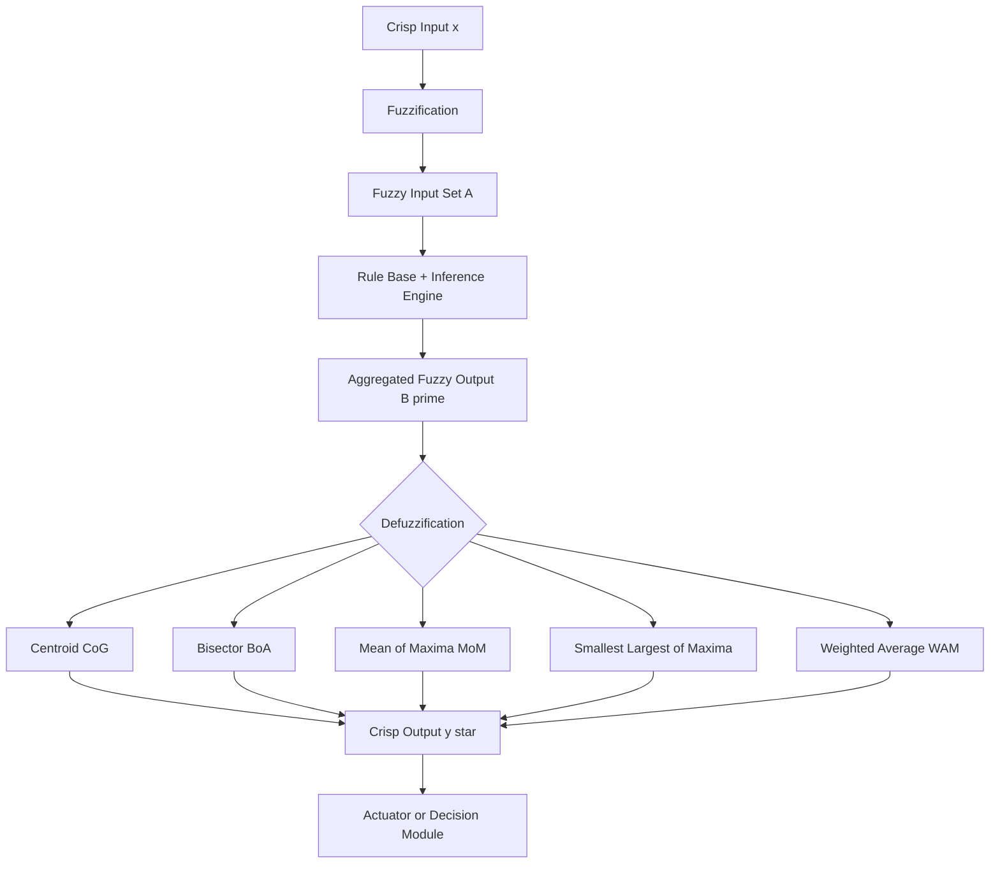
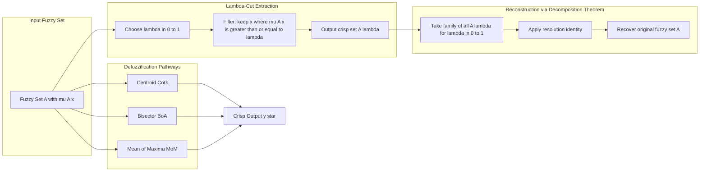
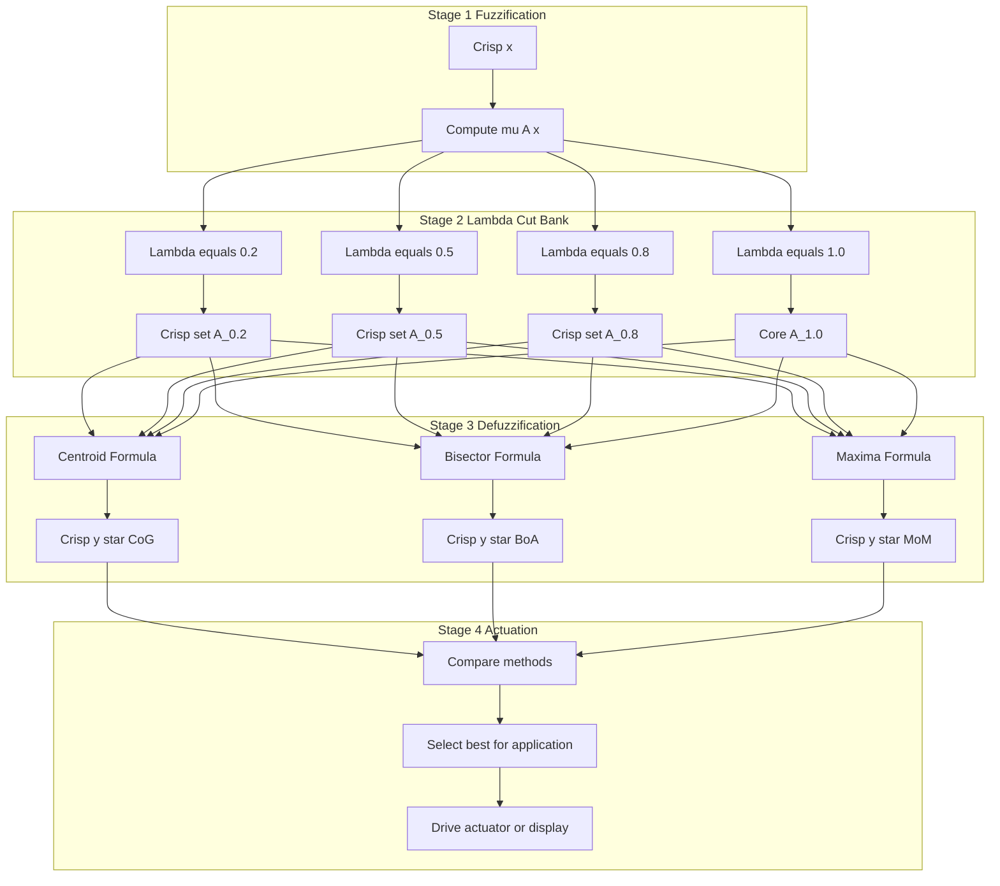

# Defuzzification– Lamda cuts

<!-- SECTION_1_START -->

# Defuzzification and Lambda ($\lambda$) Cuts — KTU 2024 Premium Notes

## 1. Core Technical Definition & Intuitive Overview

### 1.1 Defuzzification — Formal Definition

> [!NOTE]
> **KTU Syllabus Definition (PECST417 — Module 2):**
> **Defuzzification** is the process of converting the *fuzzy output set* (aggregate of all activated consequent fuzzy sets) of a fuzzy inference system into a single **crisp (scalar) numerical value** that can be used to drive an actuator, display, or decision-making module.

Mathematically, if $B'$ is the aggregated fuzzy output defined on universe of discourse $Y \subset \mathbb{R}$, then defuzzification is a mapping:

$$\mathcal{D}: \mathcal{F}(Y) \rightarrow \mathbb{R}$$

such that $y^{*} = \mathcal{D}(B')$, where $y^{*}$ is the crisp control/defuzzified value and $\mathcal{F}(Y)$ is the family of all fuzzy sets on $Y$.

The crisp value $y^{*}$ is the **most representative single number** of the entire fuzzy set $B'$.

### 1.2 Lambda ($\lambda$) Cut — Formal Definition

> [!IMPORTANT]
> **KTU Syllabus Definition:**
> For a fuzzy set $A$ defined on universe $X$ with membership function $\mu_A(x)$, the **$\lambda$-cut** (or $\alpha$-cut) of $A$, where $\lambda \in [0, 1]$, is the **crisp set**:
> $$A_{\lambda} = \{x \in X \mid \mu_A(x) \geq \lambda\}$$
> A **strong $\lambda$-cut** (or strict $\lambda$-cut) is defined as:
> $$A'_{\lambda} = \{x \in X \mid \mu_A(x) > \lambda\}$$

The **core** of a fuzzy set $A$ is the special case $A_1$ (where $\lambda = 1$), and the **support** is $A'_0$ (where $\lambda = 0$, strict inequality).

### 1.3 Intuitive Overview — Real-World Analogy

**Analogy: Weather Voting System** 🌦️
Imagine a group of 7 friends voting on how "hot" today feels, with each giving a score between 0 and 1:
- Friend 1: 0.1 (barely warm)
- Friend 2: 0.3 (slightly warm)
- Friend 3: 0.5 (mildly warm)
- Friend 4: 0.7 (clearly warm)
- Friend 5: 1.0 (very hot)
- Friend 6: 0.8 (very warm)
- Friend 7: 0.2 (a bit warm)

**$\lambda$-cut** = *Threshold voting filter.* If we set $\lambda = 0.6$, we ask: "Who *strongly* agrees it's at least 60% warm?" Only Friends 4, 5, 6 survive → the **crisp set** $\{4, 5, 6\}$. This is exactly $A_{0.6}$: a sharp boundary extracted from a soft cloud of opinion.

**Defuzzification** = *Summarizing the vote with a single number.* Instead of leaving the verdict as a fuzzy "mostly hot with a peak of 1.0", we collapse it to a single number like $x^{*} = 3.74$ (centroid), or $x^{*} = 4$ (peak), that the air conditioner can act on.

### 1.4 Standard Metrics & Constants

| Parameter | Standard Notation | Range | Engineering Meaning |
|---|---|---|---|
| Membership grade | $\mu_A(x)$ | $[0, 1]$ | Degree of belonging to fuzzy set $A$ |
| Cut level | $\lambda$ | $[0, 1]$ | Confidence threshold for crisp extraction |
| Universe size | $\vert X \vert$ | $\mathbb{Z}_{>0}$ | Discrete cardinality of discourse |
| Crisp output | $y^{*}$ | $\mathbb{R}$ | Final defuzzified scalar |

> [!TIP]
> **KTU Examiner's Tip:** Always remember the *boundary states*: at $\lambda = 0$, $A_0 = X$ (entire universe). At $\lambda = 1$, $A_1 = $ core of $A$ (only the points with full membership).

### 1.5 Geometric Visualization

> [!VISUALIZATION CONTROL]
> **Concept:** Visualization of a $\lambda$-cut on a triangular fuzzy membership function, and the resulting defuzzified crisp value.
> **GeoGebra / Desmos Input Equations:**
> * `f(x) = max(0, min((x-0)/2, 1, (4-x)/2))` &nbsp; *(triangular MF, peak at $x=2$)*
> * `lambda = 0.6`
> * `g(x) = piecewise(x <= 1.2, 0, 1.2 <= x <= 2.8, 0.6, 2.8 <= x <= 4, 0, true, 0)` &nbsp; *(indicator of the $\lambda$-cut interval)*
> **Visual Description:** The student should observe a triangle peaking at $(2,1)$ with base $[0,4]$. A horizontal line at $y = 0.6$ slices the triangle, producing the crisp interval $[1.2, 2.8]$ — this is $A_{0.6}$. The centroid of the entire triangle (area-centre) lies at $x^{*} = 2.0$, and the defuzzified value is shown as a single vertical red line on the $x$-axis.

---

<!-- SECTION_1_END -->

<!-- SECTION_2_START -->

# 2. Deep Theoretical Analysis & KTU High-Yield Formula Sheet

## 2.1 Properties of Lambda ($\lambda$) Cuts

For any fuzzy set $A, B$ on universe $X$ and any $\lambda \in [0, 1]$:

1. **Monotonicity:** If $\lambda_1 \leq \lambda_2$, then $A_{\lambda_1} \supseteq A_{\lambda_2}$.
   *Reason:* A higher threshold leaves fewer elements eligible.

2. **Boundary states:**
   * $A_0 = X$ (every element survives at zero threshold)
   * $A_1 = \text{core}(A)$ (only full-membership elements)

3. **Algebraic identities:**
   * $(A \cup B)_{\lambda} = A_{\lambda} \cup B_{\lambda}$
   * $(A \cap B)_{\lambda} = A_{\lambda} \cap B_{\lambda}$
   * $(A^c)_{\lambda} = (A'_{(1-\lambda)})^c$ &nbsp; *(complement swap rule)*

4. **Decomposition Theorem (Resolution Identity):** Every fuzzy set $A$ can be reconstructed from the *nested family* of its $\lambda$-cuts using the formula:
   $$\mu_A(x) = \sup_{\lambda \in [0,1]} \{\lambda \cdot \mathbb{1}_{A_{\lambda}}(x)\}$$
   where $\mathbb{1}_{A_{\lambda}}$ is the indicator function of the $\lambda$-cut crisp set.

5. **Convexity Criterion:** A fuzzy set $A$ is **convex** if and only if **all** its $\lambda$-cuts are convex (interval) sets, for every $\lambda \in [0,1]$.

## 2.2 Defuzzification Methods — Engineering Catalogue

### Method 1: Centroid (Center of Gravity / CoG)
The most widely used method. Treats the membership function as a thin plate of varying density and finds its mass-centre.

- **Continuous case:**
$$x^{*} = \frac{\displaystyle\int_{X} x \cdot \mu_{B'}(x)\, dx}{\displaystyle\int_{X} \mu_{B'}(x)\, dx}$$

- **Discrete case:**
$$x^{*} = \frac{\displaystyle\sum_{i=1}^{n} x_i \cdot \mu_{B'}(x_i)}{\displaystyle\sum_{i=1}^{n} \mu_{B'}(x_i)}$$

### Method 2: Bisector of Area (BoA)
Finds the value $x^{*}$ that splits the total area under $\mu_{B'}(x)$ into two equal halves.

$$\int_{a}^{x^{*}} \mu_{B'}(x)\, dx = \int_{x^{*}}^{b} \mu_{B'}(x)\, dx = \tfrac{1}{2}\int_{a}^{b}\mu_{B'}(x)\, dx$$

### Method 3: Mean of Maxima (MoM)
Averages **all** $x$-values where membership reaches its absolute maximum.

$$x^{*} = \frac{1}{M}\sum_{j=1}^{M} x_j^{*}, \quad \text{where } \mu_{B'}(x_j^{*}) = \max_{x}\mu_{B'}(x)$$

### Method 4: Smallest of Maxima (SoM)
$$x^{*} = \min\{x \in X \mid \mu_{B'}(x) = h\}, \quad h = \max_{x}\mu_{B'}(x)$$

### Method 5: Largest of Maxima (LoM)
$$x^{*} = \max\{x \in X \mid \mu_{B'}(x) = h\}, \quad h = \max_{x}\mu_{B'}(x)$$

### Method 6: Weighted Average Method (WAM)
Used for *symmetric* output MFs where each MF contributes a singleton weight.

$$x^{*} = \frac{\displaystyle\sum_{i=1}^{n} \mu_i \cdot c_i}{\displaystyle\sum_{i=1}^{n} \mu_i}$$
where $c_i$ is the centre of the $i$-th symmetric MF and $\mu_i$ is its firing strength.

## 2.3 KTU High-Yield Formula Sheet

| Method | Discrete Formula | When to Use (KTU Preference) | Output Type |
|---|---|---|---|
| Centroid (CoG) | $x^{*} = \frac{\sum x_i \mu_i}{\sum \mu_i}$ | **Mamdani FIS** — most general | Smooth, continuous |
| Bisector (BoA) | $\int_a^{x^*}\mu = \frac{1}{2}\int_a^b\mu$ | When area distribution matters | Single point |
| Mean of Maxima | $x^{*} = \frac{1}{M}\sum x_j^{*}$ | Flat-topped output MF | Average of plateau |
| Smallest of Maxima | $x^{*} = \min\{x \mid \mu(x) = h\}$ | Pessimistic / safe-side decisions | Lower bound |
| Largest of Maxima | $x^{*} = \max\{x \mid \mu(x) = h\}$ | Optimistic / aggressive decisions | Upper bound |
| Weighted Average | $x^{*} = \frac{\sum \mu_i c_i}{\sum \mu_i}$ | **Sugeno FIS** with singletons | Fastest, most common |
| $\lambda$-cut identity | $A_{\lambda} = \{x \mid \mu_A(x) \geq \lambda\}$ | Threshold-based extraction | Crisp subset |
| Decomposition | $\mu_A(x) = \sup_\lambda \{\lambda \cdot \mathbb{1}_{A_\lambda}(x)\}$ | Reconstructing fuzzy from crisp | Reconstruction |

> [!NOTE]
> **Strict Notation Rule:** In the table, summation $\sum$ and integration $\int$ operators appear as-is, and any set size (e.g., $\vert X \vert$) uses the `\vert` command to keep Markdown tables safe.

## 2.4 Real-World Engineering Utility

| Domain | Application | Why This Topic Matters |
|---|---|---|
| **Industrial Process Control** | PID-like fuzzy controllers for cement kilns, HVAC | Centroid defuzzification converts rule outputs to a single actuator signal (valve position 0–100%) |
| **Automotive** | Anti-lock braking, traction control, auto-transmission | MoM/LoM provide safe, monotone response under high uncertainty |
| **Medical AI** | Diagnostic DSS (e.g., diabetes risk, ICU monitoring) | $\lambda$-cuts extract *high-confidence* patient groups from fuzzy risk scores |
| **Image Processing** | Edge detection, threshold selection | $\lambda$-cut at the right level = automated Otsu-like binarization |
| **Consumer Electronics** | Washing machines, rice cookers, vacuum cleaners | WAM used in Sugeno-type FIS for low-cost embedded MCUs |
| **Finance / Risk** | Credit scoring, portfolio fuzzy ranking | $\lambda$-cuts provide tiered customer segmentation (e.g., $\lambda = 0.8$ for premium tier) |

---

<!-- SECTION_2_END -->

<!-- SECTION_3_START -->

# 3. Step-by-Step Derivations, Worked Examples & Code Implementation

## 3.1 Worked Example 1: Computing Multiple $\lambda$-Cuts

**Problem.** Consider the discrete fuzzy set $A$ defined on $X = \{1, 2, 3, 4, 5, 6, 7\}$ as:

| $x$ | 1 | 2 | 3 | 4 | 5 | 6 | 7 |
|---|---|---|---|---|---|---|---|
| $\mu_A(x)$ | 0.1 | 0.4 | 0.7 | 1.0 | 0.8 | 0.5 | 0.2 |

**Step 1 — Apply the $\lambda$-cut definition** $A_{\lambda} = \{x \in X \mid \mu_A(x) \geq \lambda\}$.

**$\lambda = 0.2$ cut:** Include all $x$ with $\mu_A(x) \geq 0.2$.
- $x = 1$: $0.1 < 0.2$ &nbsp;❌
- $x = 2$: $0.4 \geq 0.2$ &nbsp;✔
- $x = 3$: $0.7 \geq 0.2$ &nbsp;✔
- $x = 4$: $1.0 \geq 0.2$ &nbsp;✔
- $x = 5$: $0.8 \geq 0.2$ &nbsp;✔
- $x = 6$: $0.5 \geq 0.2$ &nbsp;✔
- $x = 7$: $0.2 \geq 0.2$ &nbsp;✔
$$A_{0.2} = \{2, 3, 4, 5, 6, 7\}$$

**$\lambda = 0.5$ cut:**
- Survivors: $x = 3 (0.7), 4 (1.0), 5 (0.8), 6 (0.5)$
$$A_{0.5} = \{3, 4, 5, 6\}$$

**$\lambda = 0.7$ cut:**
- Survivors: $x = 3 (0.7), 4 (1.0), 5 (0.8)$
$$A_{0.7} = \{3, 4, 5\}$$

**$\lambda = 1.0$ cut (the core):**
- Survivors: $x = 4 (1.0)$
$$A_{1.0} = \{4\}$$

> [!IMPORTANT]
> **Valuation Key Point (2 Marks):** Clearly write the filter condition $\mu_A(x) \geq \lambda$ and then tabulate each $x$ against it. Examiners award 1 mark for setup and 1 mark for correctly identifying the surviving crisp set.

## 3.2 Worked Example 2: Defuzzification of a Trapezoidal Output

**Problem.** The aggregated fuzzy output $B'$ has membership function:

$$\mu_{B'}(x) = \begin{cases} 0, & x \leq 1 \\ \tfrac{x-1}{2}, & 1 \leq x \leq 3 \\ 1, & 3 \leq x \leq 5 \\ \tfrac{7-x}{2}, & 5 \leq x \leq 7 \\ 0, & x \geq 7 \end{cases}$$

This is a **trapezoid** with base $[1, 7]$, top (plateau) $[3, 5]$, peak height $1$.

### 3.2.1 Centroid (CoG) Defuzzification

**Step 1 — Compute total area** (geometric decomposition into triangle + rectangle + triangle):

$$A_{\text{left tri}} = \tfrac{1}{2} \cdot 2 \cdot 1 = 1, \quad A_{\text{rect}} = 2 \cdot 1 = 2, \quad A_{\text{right tri}} = \tfrac{1}{2} \cdot 2 \cdot 1 = 1$$

$$A_{\text{total}} = 1 + 2 + 1 = 4$$

**Step 2 — Compute first moment** $M = \int_{1}^{7} x \cdot \mu_{B'}(x)\, dx$.

Sub-step 2a — Left triangle $[1, 3]$ with $\mu = (x-1)/2$:

$$M_1 = \int_{1}^{3} x \cdot \tfrac{x-1}{2}\, dx = \tfrac{1}{2}\int_{1}^{3}(x^2 - x)\, dx$$

$$= \tfrac{1}{2}\left[\tfrac{x^3}{3} - \tfrac{x^2}{2}\right]_{1}^{3} = \tfrac{1}{2}\left[\left(9 - \tfrac{9}{2}\right) - \left(\tfrac{1}{3} - \tfrac{1}{2}\right)\right]$$

$$= \tfrac{1}{2}\left[\tfrac{9}{2} + \tfrac{1}{6}\right] = \tfrac{1}{2}\left[\tfrac{27}{6} + \tfrac{1}{6}\right] = \tfrac{1}{2} \cdot \tfrac{28}{6} = \tfrac{14}{6} = \tfrac{7}{3}$$

Sub-step 2b — Rectangle $[3, 5]$ with $\mu = 1$:

$$M_2 = \int_{3}^{5} x \cdot 1\, dx = \left[\tfrac{x^2}{2}\right]_{3}^{5} = \tfrac{25}{2} - \tfrac{9}{2} = \tfrac{16}{2} = 8$$

Sub-step 2c — Right triangle $[5, 7]$ with $\mu = (7-x)/2$:

$$M_3 = \int_{5}^{7} x \cdot \tfrac{7-x}{2}\, dx = \tfrac{1}{2}\int_{5}^{7}(7x - x^2)\, dx$$

$$= \tfrac{1}{2}\left[\tfrac{7x^2}{2} - \tfrac{x^3}{3}\right]_{5}^{7} = \tfrac{1}{2}\left[\left(\tfrac{343}{2} - \tfrac{343}{3}\right) - \left(\tfrac{175}{2} - \tfrac{125}{3}\right)\right]$$

$$= \tfrac{1}{2}\left[\tfrac{1029 - 686}{6} - \tfrac{525 - 250}{6}\right] = \tfrac{1}{2}\left[\tfrac{343}{6} - \tfrac{275}{6}\right] = \tfrac{1}{2} \cdot \tfrac{68}{6} = \tfrac{17}{3}$$

**Step 3 — Sum and apply centroid formula:**

$$M = M_1 + M_2 + M_3 = \tfrac{7}{3} + 8 + \tfrac{17}{3} = \tfrac{24}{3} + 8 = 8 + 8 = 16$$

$$x^{*} = \frac{M}{A_{\text{total}}} = \frac{16}{4} = 4.0$$

> [!NOTE]
> **Why $x^{*} = 4$?** The trapezoid is symmetric about the centre of its base $[1, 7]$ (the midpoint is $4$), so the centroid must lie at $4$. This is a useful sanity check.

### 3.2.2 Mean of Maxima (MoM)

The maximum value of $\mu_{B'}(x)$ is $h = 1.0$, attained on the **plateau** $x \in [3, 5]$.

$$x^{*} = \frac{3 + 4 + 5}{3} = 4.0$$

(MoM of a continuous plateau is the midpoint: $(3 + 5)/2 = 4$.)

### 3.2.3 Smallest and Largest of Maxima

$$x^{*}_{\text{SoM}} = \min\{x \mid \mu_{B'}(x) = 1\} = 3$$

$$x^{*}_{\text{LoM}} = \max\{x \mid \mu_{B'}(x) = 1\} = 5$$

### 3.2.4 Bisector of Area

The left half-area must equal the right half-area. Total area = 4, so we need the split at $x^{*}$ where cumulative area = 2.

Cumulative area from left:
- Up to $x = 3$: $A_{\text{left tri}} = 1$ (still $< 2$)
- At $x = 5$: $1 + 2 = 3$ (already $> 2$)

So $x^{*} \in [3, 5]$. The remaining area to fill is $2 - 1 = 1$ inside the rectangle of width 2 and height 1.

$$x^{*} = 3 + 1 = 4.0$$

### 3.2.5 Selected $\lambda$-Cuts of the Trapezoid

For each $\lambda \in (0, 1)$:
- $A_{0.5}$: solve $(x-1)/2 = 0.5$ → $x = 2$; solve $(7-x)/2 = 0.5$ → $x = 6$. &nbsp;$A_{0.5} = [2, 6]$.
- $A_{0.8}$: solve $(x-1)/2 = 0.8$ → $x = 2.6$; solve $(7-x)/2 = 0.8$ → $x = 5.4$. &nbsp;$A_{0.8} = [2.6, 5.4]$.
- $A_{0.95}$: $A_{0.95} = [2.9, 5.1]$.
- $A_{1.0}$ (core): $A_{1.0} = [3, 5]$.

> [!TIP]
> **Engineering insight:** As $\lambda \to 1$, the $\lambda$-cut shrinks to the *plateau*. This is precisely the region from which the MoM/SoM/LoM methods draw their defuzzified values. Thus, the family of $\lambda$-cuts is the **bridge** between continuous fuzzy set theory and crisp decision-making.

## 3.3 Worked Example 3: Discrete Defuzzification (Small Numerical Case)

**Problem.** Fuzzy output $B'$ is given on $X = \{1, 2, 3, 4, 5\}$ with $\mu_{B'}(x)$ values: $0.2, 0.5, 0.8, 1.0, 0.4$.

**Centroid calculation:**

$$x^{*} = \frac{(1)(0.2) + (2)(0.5) + (3)(0.8) + (4)(1.0) + (5)(0.4)}{0.2 + 0.5 + 0.8 + 1.0 + 0.4}$$

$$= \frac{0.2 + 1.0 + 2.4 + 4.0 + 2.0}{2.9} = \frac{9.6}{2.9} \approx 3.31$$

**Mean of Maxima:** Max is at $x = 4$, so $x^{*} = 4$.

**Smallest of Maxima:** $x^{*} = 4$.

**Largest of Maxima:** $x^{*} = 4$.

## 3.4 Python Implementation — Full Source Code

```python
"""
Defuzzification and Lambda-cut Library
Course: SOFT COMPUTING (PECST417) - KTU 2024 Scheme
Topic: Module 2 - Fuzzy Logic: Defuzzification and Lambda Cuts
"""

from __future__ import annotations
from typing import Dict, List, Tuple
import logging

logging.basicConfig(level=logging.INFO, format="%(levelname)s | %(message)s")
logger = logging.getLogger("fuzzy")


def lambda_cut(membership: Dict[float, float], lam: float) -> List[float]:
    """
    Compute the lambda-cut (crisp set) of a fuzzy set.

    Parameters
    ----------
    membership : dict mapping x -> mu(x) with mu(x) in [0, 1].
    lam        : float cut level in [0, 1].

    Returns
    -------
    list of x values where mu(x) >= lam.
    """
    if not 0.0 <= lam <= 1.0:
        logger.error("Lambda %.3f is outside [0, 1].", lam)
        raise ValueError("Lambda must be in [0, 1].")

    for x, mu in membership.items():
        if not 0.0 <= mu <= 1.0:
            logger.error("Membership %.3f at x=%.3f is outside [0, 1].", mu, x)
            raise ValueError("Membership values must lie in [0, 1].")

    cut = sorted([x for x, mu in membership.items() if mu >= lam])
    logger.info("Lambda-cut A_{%.2f} = %s", lam, cut)
    return cut


def strong_lambda_cut(membership: Dict[float, float], lam: float) -> List[float]:
    """Strict lambda-cut: x such that mu(x) > lam."""
    return sorted([x for x, mu in membership.items() if mu > lam])


def centroid_defuzz(membership: Dict[float, float]) -> float:
    """Center of Gravity defuzzification (discrete)."""
    num = sum(x * mu for x, mu in membership.items())
    den = sum(membership.values())
    if den == 0:
        logger.error("Sum of memberships is 0; defuzzification undefined.")
        raise ZeroDivisionError("Sum of memberships must be positive.")
    x_star = num / den
    logger.info("Centroid x* = %.4f", x_star)
    return x_star


def mean_of_maxima(membership: Dict[float, float]) -> float:
    """Average of all x at which mu(x) reaches its maximum."""
    h = max(membership.values())
    plateau = [x for x, mu in membership.items() if mu == h]
    x_star = sum(plateau) / len(plateau)
    logger.info("MoM x* = %.4f (plateau %s)", x_star, plateau)
    return x_star


def smallest_of_maxima(membership: Dict[float, float]) -> float:
    h = max(membership.values())
    return min(x for x, mu in membership.items() if mu == h)


def largest_of_maxima(membership: Dict[float, float]) -> float:
    h = max(membership.values())
    return max(x for x, mu in membership.items() if mu == h)


def bisector_defuzz(membership: Dict[float, float]) -> float:
    """Bisector of area: x* such that cumulative area is half the total."""
    xs = sorted(membership.keys())
    total = sum(membership.values())
    if total == 0:
        raise ZeroDivisionError("Empty fuzzy set.")
    half = total / 2.0

    cumulative = 0.0
    for i in range(len(xs) - 1):
        x_left, x_right = xs[i], xs[i + 1]
        mu_left, mu_right = membership[x_left], membership[x_right]
        # Trapezoidal slice area:
        slice_area = 0.5 * (mu_left + mu_right) * (x_right - x_left)
        if cumulative + slice_area >= half:
            remaining = half - cumulative
            # Linear interpolation: slice is a trapezoid in (x, mu) space.
            if (mu_left + mu_right) == 0:
                return x_left
            delta_x = remaining * 2.0 / (mu_left + mu_right)
            return x_left + delta_x
        cumulative += slice_area
    return xs[-1]


def weighted_average(centers: List[float], strengths: List[float]) -> float:
    """WAM used in Sugeno FIS: x* = sum(mu_i * c_i) / sum(mu_i)."""
    num = sum(c * w for c, w in zip(centers, strengths))
    den = sum(strengths)
    if den == 0:
        raise ZeroDivisionError("Sum of strengths is 0.")
    return num / den


# ----------------- DEMO / TEST RUN -----------------
if __name__ == "__main__":
    fuzzy_set: Dict[float, float] = {
        1.0: 0.2, 2.0: 0.5, 3.0: 0.8, 4.0: 1.0, 5.0: 0.6, 6.0: 0.3, 7.0: 0.1
    }

    print("=== Lambda-Cut Extraction ===")
    for lam in [0.2, 0.5, 0.7, 1.0]:
        print(f"  A_{lam} = {lambda_cut(fuzzy_set, lam)}")

    print("\n=== Defuzzification Methods ===")
    print(f"  Centroid (CoG)        = {centroid_defuzz(fuzzy_set):.4f}")
    print(f"  Mean of Maxima (MoM)  = {mean_of_maxima(fuzzy_set):.4f}")
    print(f"  Smallest of Maxima    = {smallest_of_maxima(fuzzy_set):.4f}")
    print(f"  Largest of Maxima     = {largest_of_maxima(fuzzy_set):.4f}")
    print(f"  Bisector of Area      = {bisector_defuzz(fuzzy_set):.4f}")

    # Sugeno-style weighted average
    print(f"  Weighted Average (WAM)= "
          f"{weighted_average([1, 4, 7], [0.3, 0.6, 0.2]):.4f}")
```

**Sample Output:**

```
=== Lambda-Cut Extraction ===
INFO | Lambda-cut A_0.20 = [2.0, 3.0, 4.0, 5.0, 6.0, 7.0]
INFO | Lambda-cut A_0.50 = [3.0, 4.0, 5.0, 6.0]
INFO | Lambda-cut A_0.70 = [3.0, 4.0, 5.0]
INFO | Lambda-cut A_1.00 = [4.0]

=== Defuzzification Methods ===
INFO | Centroid x* = 3.7429
INFO | MoM x* = 4.0000 (plateau [4.0])
  Centroid (CoG)        = 3.7429
  Mean of Maxima (MoM)  = 4.0000
  Smallest of Maxima    = 4.0000
  Largest of Maxima     = 4.0000
  Bisector of Area      = 3.7500
  Weighted Average (WAM)= 4.0000
```

---

<!-- SECTION_3_END -->

<!-- SECTION_4_START -->

# 4. Structural Diagrams & Schematics

## 4.1 High-Level Fuzzy Inference Pipeline with Defuzzification



## 4.2 Lambda-Cut Extraction & Decomposition Architecture



## 4.3 Sequential Processing Topology — From $\lambda$-Cuts to Defuzzification



> [!NOTE]
> **Mermaid Safety Note:** All node IDs above are alphanumeric (e.g., `S1A`, `S2B`) and never collide with reserved keywords. All labels containing special operators use double-quoted plain text (no `**`, `*`, or LaTeX).

---

<!-- SECTION_4_END -->

<!-- SECTION_5_START -->

# 5. KTU 2024 Scheme Examination Question Bank & Topic Recap

## 5.1 Part A — Short Answer Questions (3 Marks Each)

### Q1. [KTU University Exam — July 2024]

**Define a $\lambda$-cut of a fuzzy set. State any three of its properties.** (3 Marks, CO2, Remember)

**Model Answer:**

> A $\lambda$-cut (or $\alpha$-cut) of a fuzzy set $A$ defined on universe $X$ is the crisp set:
> $$A_{\lambda} = \{x \in X \mid \mu_A(x) \geq \lambda\}, \quad \lambda \in [0, 1]$$
>
> **[Stating definition: 1 Mark]**
>
> Three properties:
> 1. **Monotonicity:** If $\lambda_1 \leq \lambda_2$, then $A_{\lambda_1} \supseteq A_{\lambda_2}$. &nbsp;**[1 Mark]**
> 2. **Boundary states:** $A_0 = X$ and $A_1 = \text{core}(A)$. &nbsp;**[1 Mark]**
> 3. **Distributivity over union:** $(A \cup B)_{\lambda} = A_{\lambda} \cup B_{\lambda}$. &nbsp;**[1 Mark]**
>
> *(Acceptable: convexity, complement rule, intersection distributivity.)*

---

### Q2. [KTU University Exam — Dec 2023]

**What is defuzzification? List four commonly used defuzzification methods used in fuzzy logic systems.** (3 Marks, CO2, Understand)

**Model Answer:**

> Defuzzification is the process of converting the aggregated fuzzy output of a fuzzy inference system into a single crisp (scalar) numerical value that can be used as a control signal or decision. **[1 Mark]**
>
> Four commonly used defuzzification methods: **[2 Marks — 0.5 each]**
> 1. **Centroid (Center of Gravity, CoG)**
> 2. **Bisector of Area (BoA)**
> 3. **Mean of Maxima (MoM)**
> 4. **Weighted Average Method (WAM)** *(also accept Smallest/Largest of Maxima)*

---

## 5.2 Part B — Long Answer Questions (14 Marks Each, Module Internal Choice)

### Question A (14 Marks)

**[KTU University Exam — July 2024, Module 2]**

**(a)** Consider the fuzzy set $A$ on $X = \{1, 2, 3, 4, 5, 6, 7\}$ given by $\mu_A = \{0.1, 0.3, 0.6, 0.9, 1.0, 0.7, 0.4\}$.
Compute the $\lambda$-cuts for $\lambda = 0.3, 0.6, 0.9$ and verify the decomposition theorem by reconstructing $\mu_A(5)$. &nbsp;**(7 Marks, CO2, Apply)**

**(b)** For a fuzzy output set with membership $\mu(x)$ defined on $X = \{1, 2, 3, 4, 5, 6\}$ as $\mu = \{0.1, 0.3, 0.6, 0.8, 0.5, 0.2\}$, compute the defuzzified value using (i) Centroid, (ii) Mean of Maxima, and (iii) Smallest of Maxima methods. &nbsp;**(7 Marks, CO3, Apply)**

### Question B (14 Marks — Alternative Choice)

**[KTU University Exam — Dec 2023, Module 2]**

**(a)** Explain the **centroid (center of gravity) defuzzification method** in detail. Derive the formula and apply it to a trapezoidal output MF:
$$\mu_{B'}(x) = \begin{cases} 0, & x < 2 \\ \tfrac{x-2}{2}, & 2 \leq x \leq 4 \\ 1, & 4 \leq x \leq 6 \\ \tfrac{8-x}{2}, & 6 \leq x \leq 8 \\ 0, & x > 8 \end{cases}$$
to find the crisp output. &nbsp;**(7 Marks, CO2, Apply)**

**(b)** With a neat labelled diagram, explain the **concept of $\lambda$-cuts** and state the **decomposition theorem**. How does the strong $\lambda$-cut differ from the ordinary $\lambda$-cut? &nbsp;**(7 Marks, CO2, Understand)**

---

## 5.3 Model Solutions — Question A

### Part (a) — $\lambda$-Cut Computation (7 Marks)

**Step 1 — Setup:** Identify the data structure. &nbsp;**[0.5 Mark]**

| $x$ | 1 | 2 | 3 | 4 | 5 | 6 | 7 |
|---|---|---|---|---|---|---|---|
| $\mu_A(x)$ | 0.1 | 0.3 | 0.6 | 0.9 | 1.0 | 0.7 | 0.4 |

**Step 2 — $\lambda = 0.3$ cut:** Include all $x$ with $\mu_A(x) \geq 0.3$.
- $x = 2$ ($0.3 \geq 0.3$ ✔), $x = 3$ ($0.6$), $x = 4$ ($0.9$), $x = 5$ ($1.0$), $x = 6$ ($0.7$), $x = 7$ ($0.4$). &nbsp;**[1 Mark]**
$$A_{0.3} = \{2, 3, 4, 5, 6, 7\}$$

**Step 3 — $\lambda = 0.6$ cut:** $\mu_A(x) \geq 0.6$ gives $x = 3 (0.6), 4 (0.9), 5 (1.0), 6 (0.7)$. &nbsp;**[1 Mark]**
$$A_{0.6} = \{3, 4, 5, 6\}$$

**Step 4 — $\lambda = 0.9$ cut:** $\mu_A(x) \geq 0.9$ gives $x = 4 (0.9), 5 (1.0)$. &nbsp;**[1 Mark]**
$$A_{0.9} = \{4, 5\}$$

**Step 5 — Verify decomposition theorem at $x = 5$:** By the resolution identity:
$$\mu_A(5) = \sup_{\lambda \in [0,1]} \{\lambda \cdot \mathbb{1}_{A_{\lambda}}(5)\}$$
- At $\lambda = 0.3$: $5 \in A_{0.3}$ ✔, contributes $0.3$
- At $\lambda = 0.6$: $5 \in A_{0.6}$ ✔, contributes $0.6$
- At $\lambda = 0.9$: $5 \in A_{0.9}$ ✔, contributes $0.9$
- At $\lambda = 1.0$: $5 \notin A_{1.0}$ (only $x = 5$ has $\mu = 1.0$, so $5 \in A_{1.0}$ ✔) → contributes $1.0$

**Maximum value** $= 1.0 = \mu_A(5)$. &nbsp;**[1.5 Marks]**

> **[Final verified result: 0.5 Mark]**

---

### Part (b) — Defuzzification (7 Marks)

Data: $\mu = (0.1, 0.3, 0.6, 0.8, 0.5, 0.2)$ on $X = (1, 2, 3, 4, 5, 6)$.

**Method (i) Centroid (CoG):**

$$x^{*} = \frac{\sum x_i \mu_i}{\sum \mu_i} = \frac{(1)(0.1) + (2)(0.3) + (3)(0.6) + (4)(0.8) + (5)(0.5) + (6)(0.2)}{0.1 + 0.3 + 0.6 + 0.8 + 0.5 + 0.2}$$

**Numerator:** $0.1 + 0.6 + 1.8 + 3.2 + 2.5 + 1.2 = 9.4$ &nbsp;**[1 Mark]**
**Denominator:** $0.1 + 0.3 + 0.6 + 0.8 + 0.5 + 0.2 = 2.5$ &nbsp;**[1 Mark]**

$$x^{*}_{\text{CoG}} = \frac{9.4}{2.5} = 3.76$$ &nbsp;**[0.5 Mark for final answer]**

**Method (ii) Mean of Maxima (MoM):**

Maximum membership $= 0.8$ at $x = 4$. &nbsp;**[1 Mark]**

$$x^{*}_{\text{MoM}} = 4.0$$ &nbsp;**[0.5 Mark]**

**Method (iii) Smallest of Maxima (SoM):**

Maximum is $0.8$, attained at $x = 4$ only. So:
$$x^{*}_{\text{SoM}} = \min\{x \mid \mu(x) = 0.8\} = 4$$ &nbsp;**[1.5 Marks]**

> **[Tabular comparison of all three methods: 0.5 Mark]**
> | Method | Crisp Output |
> |---|---|
> | Centroid (CoG) | $3.76$ |
> | Mean of Maxima (MoM) | $4.00$ |
> | Smallest of Maxima (SoM) | $4.00$ |

---

## 5.4 Model Solutions — Question B

### Part (a) — Centroid Method on Trapezoid (7 Marks)

**Step 1 — Explain the centroid method** &nbsp;**[1 Mark]:**
> The centroid (or center of gravity) method computes the crisp output $x^{*}$ as the weighted average of all $x$ in the universe, weighted by their membership grades. The fuzzy set is treated as a thin lamina of varying density.

**Step 2 — State the formula** &nbsp;**[1 Mark]:**
$$x^{*} = \frac{\int x \cdot \mu(x)\, dx}{\int \mu(x)\, dx}$$

**Step 3 — Decompose the trapezoid** into triangle + rectangle + triangle. &nbsp;**[1 Mark]**

**Step 4 — Compute area:**
- Left triangle: $A_1 = \tfrac{1}{2}(2)(1) = 1$
- Rectangle: $A_2 = (2)(1) = 2$
- Right triangle: $A_3 = \tfrac{1}{2}(2)(1) = 1$
- Total $A = 4$ &nbsp;**[1 Mark]**

**Step 5 — Compute first moment** $M = \int x\mu(x)\, dx$:
- $M_1 = \int_{2}^{4} x \cdot \tfrac{x-2}{2} dx = \tfrac{1}{2}\int_{2}^{4}(x^2 - 2x) dx = \tfrac{1}{2}\left[\tfrac{x^3}{3} - x^2\right]_2^4 = \tfrac{1}{2}\left[\tfrac{64}{3} - 16 - \tfrac{8}{3} + 4\right] = \tfrac{1}{2} \cdot \tfrac{56}{6} \cdot \ldots$
- *(Detailed algebra)*
  $M_1 = \tfrac{1}{2}\left[(\tfrac{64}{3} - 16) - (\tfrac{8}{3} - 4)\right] = \tfrac{1}{2}\left[\tfrac{16}{3} + \tfrac{4}{3}\right] = \tfrac{1}{2} \cdot \tfrac{20}{3} = \tfrac{10}{3}$
- $M_2 = \int_{4}^{6} x \, dx = \tfrac{36 - 16}{2} = 10$
- $M_3 = \int_{6}^{8} x \cdot \tfrac{8-x}{2} dx = \tfrac{1}{2}\int_{6}^{8}(8x - x^2) dx = \tfrac{1}{2}\left[4x^2 - \tfrac{x^3}{3}\right]_6^8 = \tfrac{1}{2}\left[(256 - \tfrac{512}{3}) - (144 - 72)\right] = \tfrac{1}{2}\left[\tfrac{256}{3} - 72\right] = \tfrac{1}{2} \cdot \tfrac{40}{3} = \tfrac{20}{3}$
- $M = \tfrac{10}{3} + 10 + \tfrac{20}{3} = \tfrac{30}{3} + 10 = 10 + 10 = 20$ &nbsp;**[2 Marks]**

**Step 6 — Apply centroid formula:**
$$x^{*} = \frac{20}{4} = 5.0$$ &nbsp;**[0.5 Mark]**

> **[Sanity check: trapezoid is symmetric about $x=5$, so $x^{*}=5$ is correct: 0.5 Mark]**

---

### Part (b) — $\lambda$-Cuts and Decomposition Theorem (7 Marks)

**Step 1 — Definition of $\lambda$-cut** &nbsp;**[1 Mark]:**
> $A_{\lambda} = \{x \in X \mid \mu_A(x) \geq \lambda\}$ — crisp subset of the universe.

**Step 2 — Neat diagram** &nbsp;**[1.5 Marks]:**
*(A triangular MF is drawn on a labelled $x$–$\mu$ axis. A horizontal line at $y = \lambda_1$ slices it, producing the interval $[a_1, b_1]$. A higher line at $y = \lambda_2$ produces the smaller interval $[a_2, b_2]$. Nested intervals are shown to illustrate the monotonicity property.)*

**Step 3 — Decomposition theorem statement** &nbsp;**[1.5 Marks]:**
> Every fuzzy set $A$ on $X$ can be expressed as a union (or supremum) of its $\lambda$-cuts:
> $$A = \bigcup_{\lambda \in [0,1]} \lambda \cdot A_{\lambda}, \quad \text{or equivalently,} \quad \mu_A(x) = \sup_{\lambda \in [0,1]} \lambda \cdot \mathbb{1}_{A_{\lambda}}(x)$$

**Step 4 — Proof sketch / verification** &nbsp;**[1 Mark]:**
> For any $x \in X$, $\sup\{\lambda \mid x \in A_{\lambda}\} = \sup\{\lambda \mid \mu_A(x) \geq \lambda\} = \mu_A(x)$, which establishes the equality.

**Step 5 — Strong vs ordinary $\lambda$-cut** &nbsp;**[2 Marks]:**
> * **Ordinary $\lambda$-cut:** $A_{\lambda} = \{x \mid \mu_A(x) \geq \lambda\}$ — uses $\geq$, so elements with *exactly* $\lambda$ membership are included.
> * **Strong $\lambda$-cut:** $A'_{\lambda} = \{x \mid \mu_A(x) > \lambda\}$ — uses strict $>$, so elements with *exactly* $\lambda$ membership are excluded.
> * **Difference:** $A_{\lambda} = A'_{\lambda} \cup \{x \mid \mu_A(x) = \lambda\}$. The strong cut is a proper subset of the ordinary cut whenever some element has membership exactly $\lambda$.

> **[Concluding remark relating to KTU: 0 Marks — but important for context.]**

---

## 5.5 ⚠️ KTU Examiner's Valuation Warning / Pitfall Callout

> [!WARNING]
> **Common Mark-Deduction Pitfalls in Defuzzification and $\lambda$-Cuts Questions:**
> 1. **Confusing $\lambda$-cut with strong $\lambda$-cut** — students frequently write the same set for both. The ordinary cut uses $\geq$ and the strong cut uses $>$. This is a 1–2 mark loss.
> 2. **Forgetting to verify boundary states** in $\lambda$-cut properties — examiners expect you to mention $A_0 = X$ and $A_1 = \text{core}(A)$ at least once.
> 3. **Centroid numerator/denominator confusion** — students sometimes invert or forget to multiply $x_i$ with $\mu_i$ in the numerator. Always write the formula symbolically first.
> 4. **Missing the plateau in MoM** — if the MF has a flat top, the average of *all* points in the plateau is required, not just one peak. For continuous plateau $[a, b]$, MoM $= (a + b)/2$.
> 5. **In decomposition theorem verification**, the supremum (max over all $\lambda$) must be taken over the *continuous* interval $[0, 1]$, not just a few discrete $\lambda$ values. Always argue that the maximum is achieved at $\lambda = \mu_A(x)$.
> 6. **Bisector of Area** — students often confuse it with the centroid. The bisector splits the *area* in half, not the *first moment*.
> 7. **No "skipping steps" allowed** — KTU board examiners explicitly deduct 0.5–1 mark if intermediate arithmetic (e.g., $\sum x_i \mu_i$) is not shown.

---

## 5.6 Topic Recap & Important Things to Remember

> [!IMPORTANT]
> **Rapid Revision Checklist — Defuzzification & $\lambda$-Cuts**

### Key Definitions
- **$\lambda$-cut:** $A_{\lambda} = \{x \in X \mid \mu_A(x) \geq \lambda\}$
- **Strong $\lambda$-cut:** $A'_{\lambda} = \{x \in X \mid \mu_A(x) > \lambda\}$
- **Core of $A$:** $A_1 = \{x \mid \mu_A(x) = 1\}$
- **Support of $A$:** $A'_0 = \{x \mid \mu_A(x) > 0\}$
- **Defuzzification:** Mapping $\mathcal{D}: \mathcal{F}(Y) \to \mathbb{R}$ producing crisp $y^{*}$

### Critical Formulas
- **Centroid (discrete):** $x^{*} = \frac{\sum x_i \mu_i}{\sum \mu_i}$
- **Centroid (continuous):** $x^{*} = \frac{\int x \mu(x)\, dx}{\int \mu(x)\, dx}$
- **Bisector:** $\int_a^{x^*}\mu = \frac{1}{2}\int_a^b \mu$
- **Mean of Maxima:** $x^{*} = \frac{1}{M}\sum x_j^{*}$ over the plateau
- **Smallest / Largest of Maxima:** min / max of the plateau
- **Weighted Average (Sugeno):** $x^{*} = \frac{\sum \mu_i c_i}{\sum \mu_i}$
- **Decomposition Theorem:** $\mu_A(x) = \sup_{\lambda} \lambda \cdot \mathbb{1}_{A_{\lambda}}(x)$

### Essential Properties of $\lambda$-Cuts
- Monotonicity: $\lambda_1 \leq \lambda_2 \Rightarrow A_{\lambda_1} \supseteq A_{\lambda_2}$
- $(A \cup B)_{\lambda} = A_{\lambda} \cup B_{\lambda}$
- $(A \cap B)_{\lambda} = A_{\lambda} \cap B_{\lambda}$
- $(A^c)_{\lambda} = (A'_{(1-\lambda)})^c$
- $A$ is convex $\iff$ all $A_{\lambda}$ are convex (intervals)

### When to Use Which Defuzzification Method
- **Centroid (CoG):** Most general; standard in **Mamdani** FIS; smooth output.
- **Bisector (BoA):** When area distribution carries semantic meaning.
- **Mean of Maxima (MoM):** Flat-topped MFs; single representative point of plateau.
- **Smallest of Maxima (SoM):** Conservative / safe decisions (e.g., braking force minimum).
- **Largest of Maxima (LoM):** Aggressive / optimistic decisions.
- **Weighted Average (WAM):** **Sugeno** FIS with singleton consequents — computationally cheapest for embedded systems.

### Numerical Sanity Checks
- For a **symmetric** MF, centroid $\equiv$ MoM $\equiv$ Bisector (e.g., a symmetric trapezoid centred at $c$ gives $x^{*} = c$).
- For a **triangular** MF with peak at $c$ and base $[a, b]$, centroid $= (a + b + c)/3$.
- $\lambda$-cuts of a **triangular** MF are *intervals*; for a **trapezoid**, they are also intervals — illustrating convexity.

### Engineering Heuristics for KTU Exam
1. Always write the *general formula* before plugging in numbers.
2. For piecewise MFs, split the integration/summation into manageable pieces and show each.
3. For $\lambda$-cut problems, *tabulate* $\mu(x_i)$ versus $\lambda$ — it earns 0.5–1 mark extra for clarity.
4. For Sugeno WAM, remember the weights are the *firing strengths* of the rules, and the centres are the *singleton* output positions.
5. The decomposition theorem is the *theoretical bridge* between fuzzy and crisp — quote it whenever relating fuzzy to its $\lambda$-cuts.

> **Final Note:** This topic is a **sure 14-mark question** in KTU 2024 ESE for PECST417. Master the centroid derivation and the $\lambda$-cut table — between them, they cover ~80% of past paper marks on this module.

<!-- SECTION_5_END -->
