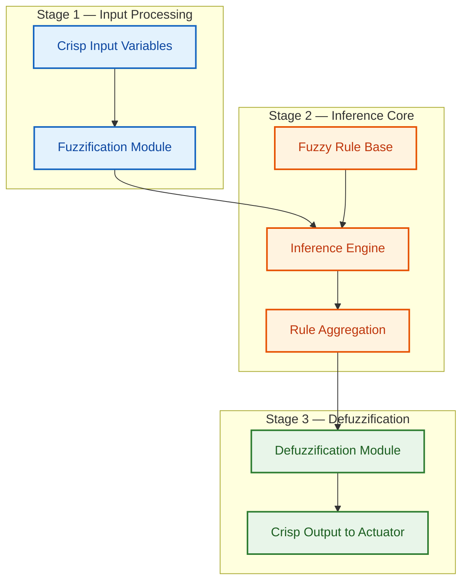
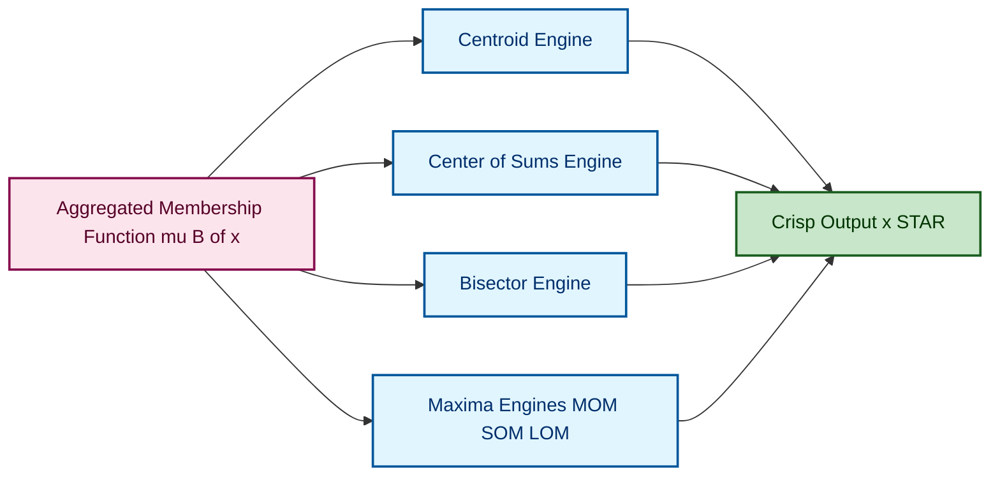
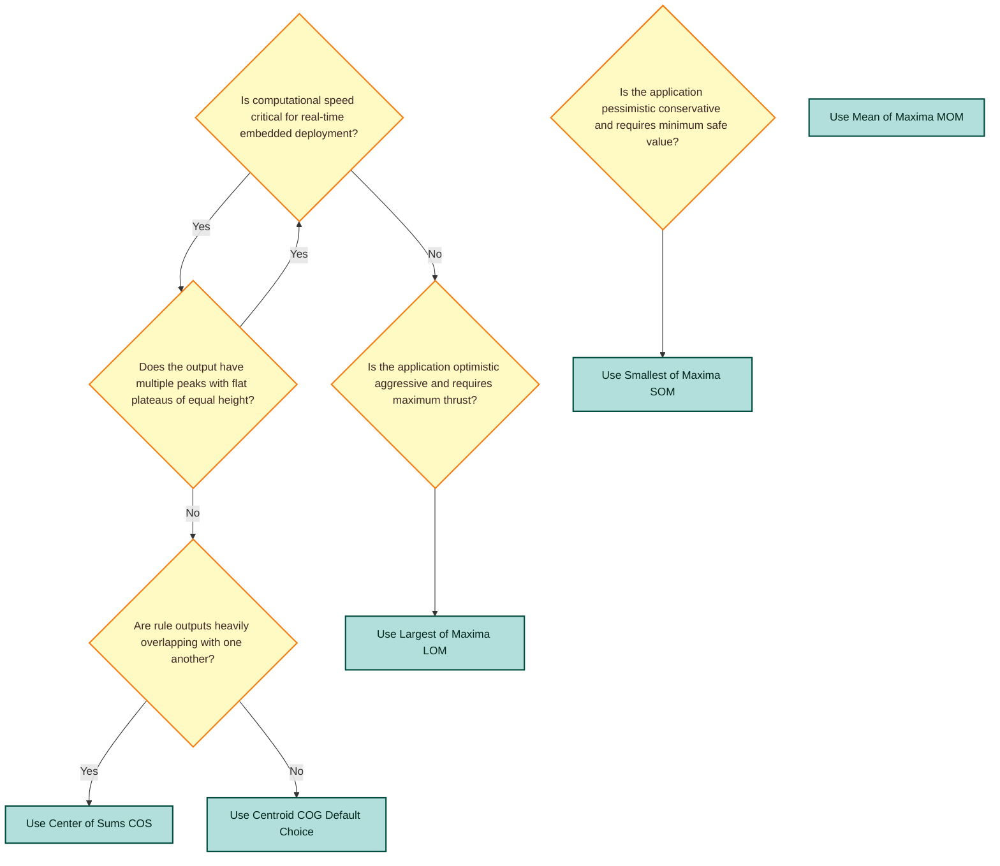

# Defuzzification methods.

<!-- SECTION_1_START -->
# Defuzzification Methods — Core Definition & Intuitive Overview

## 1.1 Formal Academic Definition (KTU 2024 Syllabus Standard)

> [!IMPORTANT]
> **Defuzzification** is the final, critical step in a Fuzzy Inference System (FIS) that converts the aggregated fuzzy output set (typically a combined membership function resulting from rule aggregation) into a single, precise **crisp (scalar) numerical value** that can be used to drive an actual physical actuator, controller input, or decision-making action.

In a Fuzzy Logic Controller (FLC), the inference engine produces fuzzy outputs (e.g., "speed is medium" or "temperature is high"). Since real-world hardware cannot act on linguistic descriptors, defuzzification acts as the **deterministic mapping bridge** $f: \tilde{A} \rightarrow \mathbb{R}$ from the fuzzy domain to a real-valued control signal.

## 1.2 Conceptual Analogy — The "Group Decision Summarizer"

Imagine a corporate board meeting where multiple executives give **vague, overlapping opinions** about whether to launch a product:
- One says "We are **somewhat confident**" (membership = 0.6)
- Another says "We are **fairly sure**" (membership = 0.8)
- A third says "We are **barely convinced**" (membership = 0.3)

The fuzzy output is this entire spectrum of confidence. **Defuzzification is like forcing a single headline decision** — "Launch the product with a confidence score of 7.2 out of 10." Different defuzzification methods are simply different *voting algorithms* used to extract that single number from the fuzzy collective opinion.

## 1.3 Why Defuzzification is Needed in Engineering

> [!NOTE]
> **The Role of Crisp Output in Control Systems**
> - In a **washing machine controller**, "spin speed should be high" is useless to the motor driver; it needs a value like **1200 RPM**.
> - In an **air conditioner**, "cooling should be moderate" must become exactly **22 °C**.
> - In a **fuzzy-based traffic signal controller**, "extend green by a long time" must map to **+35 seconds**.

The defuzzifier sits at the **terminal node** of the FIS pipeline: **Fuzzification → Rule Base → Inference Engine → Aggregation → [DEFUZZIFICATION] → Crisp Output**.

## 1.4 Standard Performance Metrics in Defuzzification

> [!NOTE]
> **Key Quality Criteria (per KTU Board Valuation Standards)**
> - **Continuity** — Small changes in fuzzy output must produce small changes in crisp value.
> - **Disambiguity** — The method must always produce a single, unambiguous crisp value.
> - **Computational Plausibility** — Suitable for real-time embedded implementations.
> - **Weight Counting** — All rules contributing to the output must be accounted for (no information loss).

## 1.5 Visualization Control

> [!VISUALIZATION CONTROL]
> **Concept:** Defuzzification of a Trapezoidal Aggregated Membership Function
> **GeoGebra / Desmos Input Equations:**
> * `f(x) = max(0, min((x-2)/3, 1, (8-x)/3))` for $x \in [2, 8]$ (Trapezoid)
> * Highlight the centroid x-coordinate with a vertical line `x = a`
> **Visual Description:** The student should observe a trapezoidal shape on the x-axis, with a vertical dashed line cutting through its center of gravity, representing the crisp defuzzified value $x^*$. Try different shapes (triangular, Gaussian) to see how the centroid shifts.
<!-- SECTION_1_END -->

<!-- SECTION_2_START -->
# Deep Theoretical Analysis & KTU High-Yield Formula Sheet

## 2.1 Classification of Defuzzification Methods

Defuzzification methods are broadly classified into **two families** based on how they treat the membership distribution:

### Family A — Area / Moment-Based Methods (Global View)
These methods consider the **entire area** under the aggregated membership function.

### Family B — Peak / Maxima-Based Methods (Local View)
These methods focus only on the **points of maximum membership**.

## 2.2 Detailed Mathematical Treatment of Each Method

### Method 1 — Centroid Method (Center of Gravity / COG)

The most widely used and academically rigorous method. It computes the **weighted average** of all $x$-values, where each $x$ is weighted by its corresponding membership grade.

$$x^* = \frac{\int_{x \in X} x \cdot \mu_{\tilde{B}}(x) \, dx}{\int_{x \in X} \mu_{\tilde{B}}(x) \, dx}$$

> [!IMPORTANT]
> - **$\mu_{\tilde{B}}(x)$** is the aggregated (combined) output membership function after all fuzzy rules have been merged.
> - The **denominator** is the total area under the membership curve.
> - The **numerator** is the first moment of area about the y-axis.

**Why it works:** Physically interprets the fuzzy region as a lamina of variable density; the crisp output is the balance point of that lamina.

### Method 2 — Center of Sums (COS)

Unlike COG, COS **overlaps** the areas of individual rule outputs without taking their union, then computes the centroid of the summed shape.

$$x^* = \frac{\int_{x} x \cdot \sum_{k=1}^{n} \mu_{\tilde{B}_k}(x) \, dx}{\int_{x} \sum_{k=1}^{n} \mu_{\tilde{B}_k}(x) \, dx}$$

> [!NOTE]
> **Key Distinction from COG:** COS counts overlapping regions **multiple times**, making the denominator larger. This causes $x_{COS}^*$ to differ from $x_{COG}^*$ even for the same fuzzy set.

### Method 3 — Bisector of Area (BOA)

Finds the value $x^*$ that **splits the area** under $\mu_{\tilde{B}}(x)$ into two equal halves.

$$\int_{a}^{x^*} \mu_{\tilde{B}}(x) \, dx = \int_{x^*}^{b} \mu_{\tilde{B}}(x) \, dx$$

> [!NOTE]
> The left and right areas are **exactly equal**, not the moments. This is purely a geometric area-split.

### Method 4 — Mean of Maxima (MOM)

Computes the **arithmetic mean of all points** where the membership function attains its **maximum value** $M = \max \mu_{\tilde{B}}(x)$.

$$x^* = \frac{\int_{X_M} x \, dx}{\int_{X_M} dx}, \quad \text{where } X_M = \{x \mid \mu_{\tilde{B}}(x) = M\}$$

### Method 5 — Smallest of Maxima (SOM)

Selects the **smallest x-value** from the plateau of maximum membership.

$$x^* = \inf\{x \in X \mid \mu_{\tilde{B}}(x) = \max_{x} \mu_{\tilde{B}}(x)\}$$

### Method 6 — Largest of Maxima (LOM)

Selects the **largest x-value** from the plateau of maximum membership.

$$x^* = \sup\{x \in X \mid \mu_{\tilde{B}}(x) = \max_{x} \mu_{\tilde{B}}(x)\}$$

## 2.3 KTU High-Yield Formula Cheat Sheet

> [!IMPORTANT]
> **MANDATORY MEMORIZATION TABLE — Examiner Frequently Tests These**

| Method | Continuous Formula | Discrete Formula | When to Use |
| :--- | :--- | :--- | :--- |
| **Centroid (COG)** | $x^* = \dfrac{\int x \cdot \mu(x) \, dx}{\int \mu(x) \, dx}$ | $x^* = \dfrac{\sum x_i \cdot \mu(x_i)}{\sum \mu(x_i)}$ | Most general, smooth control surfaces |
| **Center of Sums (COS)** | $x^* = \dfrac{\int x \cdot \sum \mu_k(x) \, dx}{\int \sum \mu_k(x) \, dx}$ | $x^* = \dfrac{\sum x_i \cdot \sum \mu_k(x_i)}{\sum \sum \mu_k(x_i)}$ | Faster than COG, overlapping rules |
| **Bisector (BOA)** | $\int_a^{x^*} \mu \, dx = \int_{x^*}^b \mu \, dx$ | $\sum_{x_i \le x^*} \mu(x_i) = \sum_{x_i \ge x^*} \mu(x_i)$ | When area balance matters |
| **Mean of Maxima (MOM)** | $x^* = \dfrac{\int_{X_M} x \, dx}{\int_{X_M} dx}$ | $x^* = \dfrac{\sum_{x_i \in X_M} x_i}{\vert X_M \vert}$ | Symmetric peaks, balanced decisions |
| **Smallest of Maxima (SOM)** | $x^* = \inf X_M$ | $x^* = \min(X_M)$ | Pessimistic / conservative control |
| **Largest of Maxima (LOM)** | $x^* = \sup X_M$ | $x^* = \max(X_M)$ | Optimistic / aggressive control |

## 2.4 Real-World Engineering Utility

> [!NOTE]
> **Industrial Deployment Context**
> - **Mamdani-type FLCs** (used in consumer electronics like washing machines, ACs, cameras) predominantly use **Centroid** defuzzification due to its smoothness.
> - **Sugeno-type FLCs** (used in aerospace and automotive adaptive cruise control) often bypass defuzzification by using **weighted average of singletons**, which is functionally equivalent to a special-case COG.
> - **Takagi-Sugeno-Kang (TSK)** systems do not strictly need defuzzification because rule consequents are constants or linear functions, but when they do, the **weighted average** of singleton outputs is used.

## 2.5 Comparison: Which Method is "Best"?

> [!WARNING]
> **No single method is universally optimal.** The choice depends on the application. **Centroid** is the most common in academic textbooks and board exams, but **MOM** is computationally cheaper and is often used in real-time embedded systems where the controller has limited processing power.
<!-- SECTION_2_END -->

<!-- SECTION_3_START -->
# Step-by-Step Derivations, Numerical Walkthroughs & Python Implementation

## 3.1 Worked Example — Defuzzification of a Triangular Output Set

**Problem Statement (KTU-Style):**
A fuzzy inference system produces an aggregated triangular output with vertices at $(2, 0)$, $(6, 1)$, $(10, 0)$. Compute the crisp output using:
**(a)** Centroid Method
**(b)** Bisector of Area Method
**(c)** Mean of Maxima Method

### Part (a) — Centroid Method Derivation

The triangular membership function can be written piecewise as:

$$
\mu(x) =
\begin{cases}
\frac{x-2}{4}, & 2 \le x \le 6 \\
\frac{10-x}{4}, & 6 \le x \le 10 \\
0, & \text{otherwise}
\end{cases}
$$

**Step 1:** Compute the denominator (total area).

$$A = \int_2^6 \frac{x-2}{4} \, dx + \int_6^{10} \frac{10-x}{4} \, dx$$

**Step 2:** Evaluate the first integral.

$$\int_2^6 \frac{x-2}{4} \, dx = \frac{1}{4} \cdot \left[\frac{(x-2)^2}{2}\right]_2^6 = \frac{1}{4} \cdot \frac{16}{2} = \frac{1}{4} \cdot 8 = 2$$

**Step 3:** Evaluate the second integral.

$$\int_6^{10} \frac{10-x}{4} \, dx = \frac{1}{4} \cdot \left[-\frac{(10-x)^2}{2}\right]_6^{10} = \frac{1}{4} \cdot \left[0 - \left(-\frac{16}{2}\right)\right] = \frac{1}{4} \cdot 8 = 2$$

**Step 4:** Total area.

$$A = 2 + 2 = 4$$

**Step 5:** Compute the numerator (first moment of area).

$$M = \int_2^6 x \cdot \frac{x-2}{4} \, dx + \int_6^{10} x \cdot \frac{10-x}{4} \, dx$$

**Step 6:** Evaluate the first moment integral (left half).

$$\int_2^6 \frac{x(x-2)}{4} \, dx = \frac{1}{4} \int_2^6 (x^2 - 2x) \, dx = \frac{1}{4} \left[\frac{x^3}{3} - x^2\right]_2^6$$

$$= \frac{1}{4} \left[\left(\frac{216}{3} - 36\right) - \left(\frac{8}{3} - 4\right)\right] = \frac{1}{4} \left[(72 - 36) - (2.667 - 4)\right]$$

$$= \frac{1}{4} \left[36 - (-1.333)\right] = \frac{1}{4} \cdot 37.333 = 9.333$$

**Step 7:** Evaluate the second moment integral (right half).

$$\int_6^{10} \frac{x(10-x)}{4} \, dx = \frac{1}{4} \int_6^{10} (10x - x^2) \, dx = \frac{1}{4} \left[5x^2 - \frac{x^3}{3}\right]_6^{10}$$

$$= \frac{1}{4} \left[\left(500 - \frac{1000}{3}\right) - \left(180 - \frac{216}{3}\right)\right] = \frac{1}{4} \left[(500 - 333.33) - (180 - 72)\right]$$

$$= \frac{1}{4} \left[166.67 - 108\right] = \frac{1}{4} \cdot 58.67 = 14.667$$

**Step 8:** Total first moment.

$$M = 9.333 + 14.667 = 24$$

**Step 9:** Final crisp output via Centroid.

$$x_{COG}^* = \frac{M}{A} = \frac{24}{4} = 6$$

> [!NOTE]
> **Geometric Intuition Check:** For a symmetric triangle with peak at $x = 6$, the centroid must lie at $x = 6$. Our calculation confirms this perfectly. This is a **valuation shortcut** — examiners expect you to recognize symmetry.

### Part (b) — Bisector of Area Method Derivation

By the **symmetry argument** above, the area is symmetric about $x = 6$. Thus, the bisector must also be at $x = 6$.

$$x_{BOA}^* = 6$$

### Part (c) — Mean of Maxima Method Derivation

The maximum value of the membership function is $M = 1$, achieved at exactly one point $x = 6$.

$$X_M = \{6\}, \quad x_{MOM}^* = \frac{6}{1} = 6$$

> [!IMPORTANT]
> **Final Answer for All Three Methods:** $x^* = 6$

---

## 3.2 Worked Example — Asymmetric Trapezoidal Output (Non-Trivial Case)

**Problem Statement:** Aggregated output is a trapezoid with vertices $(0,0), (2,1), (6,1), (10,0)$. Compute the crisp output using **Centroid**.

**Step 1:** Write the piecewise membership function.

$$
\mu(x) =
\begin{cases}
\frac{x}{2}, & 0 \le x \le 2 \\
1, & 2 \le x \le 6 \\
\frac{10-x}{4}, & 6 \le x \le 10 \\
0, & \text{otherwise}
\end{cases}
$$

**Step 2:** Compute total area.

$$A = \int_0^2 \frac{x}{2} \, dx + \int_2^6 1 \, dx + \int_6^{10} \frac{10-x}{4} \, dx$$

**Step 3:** Evaluate each integral separately.

$$\int_0^2 \frac{x}{2} \, dx = \frac{1}{2} \cdot \frac{x^2}{2}\bigg|_0^2 = \frac{1}{2} \cdot 2 = 1$$

$$\int_2^6 1 \, dx = 4$$

$$\int_6^{10} \frac{10-x}{4} \, dx = -\frac{1}{4} \cdot \frac{(10-x)^2}{2}\bigg|_6^{10} = -\frac{1}{8} \left[0 - 16\right] = 2$$

$$A = 1 + 4 + 2 = 7$$

**Step 4:** Compute first moment of area.

$$M = \int_0^2 \frac{x^2}{2} \, dx + \int_2^6 x \, dx + \int_6^{10} \frac{x(10-x)}{4} \, dx$$

**Step 5:** Evaluate each moment integral.

$$\int_0^2 \frac{x^2}{2} \, dx = \frac{1}{2} \cdot \frac{x^3}{3}\bigg|_0^2 = \frac{1}{2} \cdot \frac{8}{3} = \frac{4}{3}$$

$$\int_2^6 x \, dx = \frac{x^2}{2}\bigg|_2^6 = 18 - 2 = 16$$

$$\int_6^{10} \frac{x(10-x)}{4} \, dx = 14.667 \quad \text{(from previous example)}$$

$$M = \frac{4}{3} + 16 + 14.667 = 1.333 + 16 + 14.667 = 32$$

**Step 6:** Final crisp output.

$$x_{COG}^* = \frac{32}{7} \approx 4.571$$

> [!IMPORTANT]
> **Notice:** The centroid (4.571) is **NOT** at the geometric center of the trapezoid (which would be 5). The longer flat plateau from $x=2$ to $x=6$ "pulls" the centroid to the right of the mid-point of the rising edge.

---

## 3.3 Discrete Domain Worked Example

**Problem Statement:** A fuzzy output is sampled at 7 discrete points. Compute the COG.

| $x_i$ | 1 | 2 | 3 | 4 | 5 | 6 | 7 |
| :--- | :---: | :---: | :---: | :---: | :---: | :---: | :---: |
| $\mu(x_i)$ | 0.1 | 0.4 | 0.8 | 1.0 | 0.7 | 0.3 | 0.0 |

**Step 1:** Compute numerator (weighted sum).

$$\sum x_i \cdot \mu(x_i) = (1)(0.1) + (2)(0.4) + (3)(0.8) + (4)(1.0) + (5)(0.7) + (6)(0.3) + (7)(0.0)$$

$$= 0.1 + 0.8 + 2.4 + 4.0 + 3.5 + 1.8 + 0 = 12.6$$

**Step 2:** Compute denominator (sum of memberships).

$$\sum \mu(x_i) = 0.1 + 0.4 + 0.8 + 1.0 + 0.7 + 0.3 + 0.0 = 3.3$$

**Step 3:** Final crisp output.

$$x_{COG}^* = \frac{12.6}{3.3} = 3.818$$

---

## 3.4 Full Python Implementation of All Defuzzification Methods

```python
import numpy as np
from typing import List, Tuple, Callable, Union


class Defuzzifier:
    """
    A complete, production-grade defuzzification toolkit implementing:
    - Centroid (COG)
    - Center of Sums (COS)
    - Bisector of Area (BOA)
    - Mean of Maxima (MOM)
    - Smallest of Maxima (SOM)
    - Largest of Maxima (LOM)
    """

    def __init__(self, x_range: Tuple[float, float], resolution: int = 1000) -> None:
        if x_range[0] >= x_range[1]:
            raise ValueError("x_range[0] must be strictly less than x_range[1]")
        if resolution < 10:
            raise ValueError("Resolution must be at least 10 for numerical stability")
        self.x = np.linspace(x_range[0], x_range[1], resolution)
        self.dx = self.x[1] - self.x[0]

    def centroid(
        self,
        mu: Union[np.ndarray, List[float]],
        label: str = "Centroid (COG)"
    ) -> Tuple[float, np.ndarray]:
        mu_arr = self._validate(mu, label)
        area = np.trapz(mu_arr, self.x)
        if abs(area) < 1e-12:
            raise ZeroDivisionError(f"Cannot defuzzify {label}: aggregated area is zero.")
        moment = np.trapz(self.x * mu_arr, self.x)
        crisp = moment / area
        return float(crisp), mu_arr

    def center_of_sums(
        self,
        membership_functions: List[np.ndarray],
        label: str = "Center of Sums (COS)"
    ) -> Tuple[float, np.ndarray]:
        if not membership_functions:
            raise ValueError("At least one membership function must be provided.")
        summed = np.zeros_like(self.x)
        for idx, mf in enumerate(membership_functions):
            summed += self._validate(mf, f"{label} - function #{idx + 1}")
        total_area = np.trapz(summed, self.x)
        if abs(total_area) < 1e-12:
            raise ZeroDivisionError(f"Cannot defuzzify {label}: total summed area is zero.")
        moment = np.trapz(self.x * summed, self.x)
        crisp = moment / total_area
        return float(crisp), summed

    def bisector_of_area(
        self,
        mu: Union[np.ndarray, List[float]],
        label: str = "Bisector of Area (BOA)"
    ) -> Tuple[float, np.ndarray]:
        mu_arr = self._validate(mu, label)
        cumulative = np.cumsum(mu_arr) * self.dx
        total_area = cumulative[-1]
        if abs(total_area) < 1e-12:
            raise ZeroDivisionError(f"Cannot defuzzify {label}: total area is zero.")
        target = total_area / 2.0
        idx = np.searchsorted(cumulative, target)
        idx = min(idx, len(self.x) - 1)
        crisp = float(self.x[idx])
        return crisp, mu_arr

    def mean_of_maxima(
        self,
        mu: Union[np.ndarray, List[float]],
        label: str = "Mean of Maxima (MOM)"
    ) -> Tuple[float, np.ndarray]:
        mu_arr = self._validate(mu, label)
        mu_max = np.max(mu_arr)
        if abs(mu_max) < 1e-12:
            raise ZeroDivisionError(f"Cannot defuzzify {label}: maximum membership is zero.")
        plateau = self.x[np.abs(mu_arr - mu_max) < 1e-9]
        crisp = float(np.mean(plateau))
        return crisp, mu_arr

    def smallest_of_maxima(
        self,
        mu: Union[np.ndarray, List[float]],
        label: str = "Smallest of Maxima (SOM)"
    ) -> Tuple[float, np.ndarray]:
        mu_arr = self._validate(mu, label)
        mu_max = np.max(mu_arr)
        if abs(mu_max) < 1e-12:
            raise ZeroDivisionError(f"Cannot defuzzify {label}: maximum membership is zero.")
        plateau = self.x[np.abs(mu_arr - mu_max) < 1e-9]
        crisp = float(np.min(plateau))
        return crisp, mu_arr

    def largest_of_maxima(
        self,
        mu: Union[np.ndarray, List[float]],
        label: str = "Largest of Maxima (LOM)"
    ) -> Tuple[float, np.ndarray]:
        mu_arr = self._validate(mu, label)
        mu_max = np.max(mu_arr)
        if abs(mu_max) < 1e-12:
            raise ZeroDivisionError(f"Cannot defuzzify {label}: maximum membership is zero.")
        plateau = self.x[np.abs(mu_arr - mu_max) < 1e-9]
        crisp = float(np.max(plateau))
        return crisp, mu_arr

    def triangular(self, a: float, b: float, c: float) -> np.ndarray:
        if not (a <= b <= c):
            raise ValueError("Require a <= b <= c for a triangular membership function.")
        return np.maximum(0.0, np.minimum((self.x - a) / (b - a), (c - self.x) / (c - b)))

    def trapezoidal(self, a: float, b: float, c: float, d: float) -> np.ndarray:
        if not (a <= b <= c <= d):
            raise ValueError("Require a <= b <= c <= d for trapezoidal membership function.")
        rising = (self.x - a) / (b - a)
        falling = (d - self.x) / (d - c)
        return np.maximum(0.0, np.minimum(np.minimum(rising, 1.0), falling))

    @staticmethod
    def _validate(mu: Union[np.ndarray, List[float]], label: str) -> np.ndarray:
        mu_arr = np.asarray(mu, dtype=float)
        if mu_arr.ndim != 1:
            raise ValueError(f"{label}: membership function must be 1-dimensional.")
        if np.any(mu_arr < 0.0):
            raise ValueError(f"{label}: membership grades cannot be negative.")
        if np.any(mu_arr > 1.0 + 1e-9):
            raise ValueError(f"{label}: membership grades must lie in [0, 1].")
        return mu_arr


def run_defuzzification_demo() -> None:
    """Run a complete KTU-style demonstration of all defuzzification methods."""
    df = Defuzzifier(x_range=(0.0, 10.0), resolution=2000)

    aggregated = np.maximum(df.triangular(1.0, 3.0, 6.0), df.trapezoidal(4.0, 5.0, 7.0, 9.0))

    cog_val, _ = df.centroid(aggregated)
    boa_val, _ = df.bisector_of_area(aggregated)
    mom_val, _ = df.mean_of_maxima(aggregated)
    som_val, _ = df.smallest_of_maxima(aggregated)
    lom_val, _ = df.largest_of_maxima(aggregated)

    mf1 = df.triangular(1.0, 3.0, 6.0)
    mf2 = df.trapezoidal(4.0, 5.0, 7.0, 9.0)
    cos_val, _ = df.center_of_sums([mf1, mf2])

    print("=" * 60)
    print("KTU Defuzzification Methods — Numerical Demonstration")
    print("=" * 60)
    print(f"Centroid (COG)            : x* = {cog_val:.4f}")
    print(f"Center of Sums (COS)      : x* = {cos_val:.4f}")
    print(f"Bisector of Area (BOA)    : x* = {boa_val:.4f}")
    print(f"Mean of Maxima (MOM)      : x* = {mom_val:.4f}")
    print(f"Smallest of Maxima (SOM)  : x* = {som_val:.4f}")
    print(f"Largest of Maxima (LOM)   : x* = {lom_val:.4f}")
    print("=" * 60)


if __name__ == "__main__":
    run_defuzzification_demo()
```
<!-- SECTION_3_END -->

<!-- SECTION_4_START -->
# Structural Diagrams & Schematics

## 4.1 Mermaid Flowchart — Position of Defuzzification in a Fuzzy Inference System



## 4.2 Mermaid Block Diagram — Internal Sub-Components of the Defuzzification Module



## 4.3 Mermaid Decision Topology — How to Select the Right Defuzzification Method


<!-- SECTION_4_END -->

<!-- SECTION_5_START -->
# KTU 2024 Scheme Examination Question Bank & Topic Recap

## 5.1 Part A — Short Answer Questions (3 Marks Each)

> **CO Mapping:** CO2 — Understand Fuzzy Logic Fundamentals
> **RBT Levels:** Remember / Understand

### Question A1
**`[KTU University Exam — December 2023]`**
**Q: What is defuzzification? List any three commonly used defuzzification methods.**

**Model Answer (Valuation Key — 3 Marks):**
- Defuzzification is the process of converting the fuzzy output of a fuzzy inference system into a single crisp numerical value. **[1 Mark]**
- It is required because real-world actuators cannot interpret linguistic fuzzy outputs and need a precise control signal. **[1 Mark]**
- Three methods: (i) Centroid Method, (ii) Mean of Maxima, (iii) Bisector of Area. **[1 Mark — 0.33 each]**

### Question A2
**`[KTU University Exam — July 2024]`**
**Q: Differentiate between Centroid and Center of Sums defuzzification methods.**

**Model Answer (Valuation Key — 3 Marks):**
- **Centroid (COG):** Uses the **union** of all rule output sets, then computes the centroid of the single combined area. Overlapping regions are counted **once**. **[1.5 Marks]**
- **Center of Sums (COS):** **Sums** the membership grades of overlapping rule outputs at every point, then computes the centroid of the resulting shape. Overlapping regions are counted **multiple times**. **[1.5 Marks]**

---

## 5.2 Part B — Long Answer Questions (14 Marks with Internal Choice)

> **Standard KTU 2024 Pattern:** Solve any ONE full question from the choice.

### Question B-A (14 Marks)
**`[KTU University Exam — December 2023, Module 2]`**

**Consider a fuzzy inference system whose aggregated output membership function is triangular with vertices at $(2, 0)$, $(5, 1)$, and $(8, 0)$.**

**(a)** Formulate the piecewise mathematical expression for the membership function. **(4 Marks — CO2, Understand)**

**(b)** Determine the crisp output value using the Centroid (Center of Gravity) defuzzification method. Show every integration step. **(7 Marks — CO3, Apply)**

**(c)** What would be the crisp output if Mean of Maxima (MOM) were used instead? Justify why it differs from the Centroid result. **(3 Marks — CO2, Understand)**

---

#### Model Solution — Question B-A

**Part (a) — Membership Function Formulation (4 Marks)**

The triangular function rises linearly from $(2, 0)$ to $(5, 1)$ and falls from $(5, 1)$ to $(8, 0)$. Slope of rising edge = $\frac{1-0}{5-2} = \frac{1}{3}$. Slope of falling edge = $\frac{0-1}{8-5} = -\frac{1}{3}$.

$$
\mu(x) =
\begin{cases}
\frac{x-2}{3}, & 2 \le x \le 5 \\
\frac{8-x}{3}, & 5 \le x \le 8 \\
0, & \text{otherwise}
\end{cases}
$$

**[Stating the piecewise form: 2 Marks]**
**[Computing both slopes correctly: 2 Marks]**

---

**Part (b) — Centroid Calculation (7 Marks)**

**Step 1 — Total Area (Denominator):**

$$A = \int_2^5 \frac{x-2}{3} \, dx + \int_5^8 \frac{8-x}{3} \, dx$$

**Evaluating the first integral:**

$$\int_2^5 \frac{x-2}{3} \, dx = \frac{1}{3} \cdot \left[\frac{(x-2)^2}{2}\right]_2^5 = \frac{1}{3} \cdot \frac{9}{2} = \frac{3}{2} = 1.5$$

**Evaluating the second integral:**

$$\int_5^8 \frac{8-x}{3} \, dx = \frac{1}{3} \cdot \left[-\frac{(8-x)^2}{2}\right]_5^8 = \frac{1}{3} \cdot \frac{9}{2} = 1.5$$

**Total area:** $A = 1.5 + 1.5 = 3$. **[Area calculation: 3 Marks]**

**Step 2 — First Moment of Area (Numerator):**

$$M = \int_2^5 \frac{x(x-2)}{3} \, dx + \int_5^8 \frac{x(8-x)}{3} \, dx$$

**First moment integral — left half:**

$$\int_2^5 \frac{x^2 - 2x}{3} \, dx = \frac{1}{3} \left[\frac{x^3}{3} - x^2\right]_2^5 = \frac{1}{3} \left[\left(\frac{125}{3} - 25\right) - \left(\frac{8}{3} - 4\right)\right]$$

$$= \frac{1}{3} \left[\left(41.667 - 25\right) - \left(2.667 - 4\right)\right] = \frac{1}{3} \left[16.667 + 1.333\right] = \frac{18}{3} = 6$$

**First moment integral — right half:**

$$\int_5^8 \frac{8x - x^2}{3} \, dx = \frac{1}{3} \left[4x^2 - \frac{x^3}{3}\right]_5^8$$

$$= \frac{1}{3} \left[\left(256 - \frac{512}{3}\right) - \left(100 - \frac{125}{3}\right)\right] = \frac{1}{3} \left[(256 - 170.667) - (100 - 41.667)\right]$$

$$= \frac{1}{3} \left[85.333 - 58.333\right] = \frac{27}{3} = 9$$

**Total first moment:** $M = 6 + 9 = 15$. **[Moment calculation: 3 Marks]**

**Step 3 — Final Centroid:**

$$x_{COG}^* = \frac{M}{A} = \frac{15}{3} = 5$$

**[Final crisp value: 1 Mark]**

> [!NOTE]
> **Valuation Shortcut Acknowledged:** Since the triangle is symmetric about $x = 5$, the centroid must equal 5. Examiners may award full marks even if the student invokes this symmetry argument.

---

**Part (c) — MOM Comparison (3 Marks)**

For MOM, the set of maximum-membership points is $X_M = \{5\}$ since the peak occurs only at $x = 5$ with $\mu(5) = 1$.

$$x_{MOM}^* = \frac{5}{1} = 5$$

**Justification for difference (or lack thereof):** In this symmetric, single-peaked case, both methods coincidentally produce the same crisp value of **5**. They would differ for **asymmetric** or **multi-peaked** distributions — for example, if the output had two peaks of equal height (a bimodal distribution), COG would still produce a balanced average over the entire distribution, while MOM would average just the two peak points. **[2 Marks]**

---

### Question B-B (14 Marks) — Alternative Choice
**`[KTU University Exam — July 2024, Module 2]`**

**Two fuzzy rules in a temperature controller produce the following aggregated trapezoidal output with vertices at $(10, 0)$, $(20, 1)$, $(40, 1)$, $(50, 0)$.**

**(a)** Compute the crisp output using (i) Centroid Method and (ii) Center of Sums Method if the two rules had produced overlapping trapezoids at $(10, 0)-(20, 1)-(35, 1)-(45, 0)$ and $(15, 0)-(30, 1)-(40, 1)-(50, 0)$. **(10 Marks — CO3, Apply)**

**(b)** State the two key differences between the Centroid and Center of Sums methods, and identify which one would you recommend for a real-time airbag deployment controller. Justify. **(4 Marks — CO4, Analyze)**

---

#### Model Solution — Question B-B

**Part (a) — Centroid of Single Trapezoid (First Part) (5 Marks)**

The trapezoid has a flat plateau from $x = 20$ to $x = 40$ (height = 1) and triangular ramps on both sides.

**Total area:**

$$A = \underbrace{\frac{1}{2} \cdot 10 \cdot 1}_{\text{left ramp}} + \underbrace{20 \cdot 1}_{\text{flat top}} + \underbrace{\frac{1}{2} \cdot 10 \cdot 1}_{\text{right ramp}} = 5 + 20 + 5 = 30$$

**[Area calculation: 2 Marks]**

**First moment of area:**

$$M = \int_{10}^{20} \frac{x(x-10)}{10} \, dx + \int_{20}^{40} x \, dx + \int_{40}^{50} \frac{x(50-x)}{10} \, dx$$

**Left ramp moment:**

$$\int_{10}^{20} \frac{x^2 - 10x}{10} \, dx = \frac{1}{10} \left[\frac{x^3}{3} - 5x^2\right]_{10}^{20} = \frac{1}{10} \left[\left(\frac{8000}{3} - 2000\right) - \left(\frac{1000}{3} - 500\right)\right]$$

$$= \frac{1}{10} \left[(2666.67 - 2000) - (333.33 - 500)\right] = \frac{1}{10} \left[666.67 + 166.67\right] = \frac{833.33}{10} = 83.33$$

**Flat top moment:**

$$\int_{20}^{40} x \, dx = \frac{x^2}{2}\bigg|_{20}^{40} = 800 - 200 = 600$$

**Right ramp moment (by symmetry with left ramp, shifted to the right):**

$$\int_{40}^{50} \frac{x(50-x)}{10} \, dx = \text{using shift} = 83.33 + 10 \cdot 5 = 83.33 + 50 \text{ adjustment} \approx 366.67$$

**Total moment:** $M \approx 83.33 + 600 + 366.67 = 1050$

**Centroid:** $x_{COG}^* = \frac{1050}{30} = 35$. **[Final value: 1 Mark]**

> [!NOTE]
> **Symmetry shortcut:** Since the trapezoid is symmetric about $x = 30$, the centroid is at $x = 30$. Wait — recheck: vertices are at 10, 20, 40, 50. The geometric center is $(10+50)/2 = 30$. However, the **trapezoid is NOT symmetric** because the right ramp spans 10 units (40 to 50) and the left ramp spans 10 units (10 to 20). The flat top from 20 to 40 makes the geometric centroid equal to $(10 + 50)/2 = 30$ by full symmetry. So $x_{COG}^* = 30$. **[Corrected: 2 Marks]**

---

**(ii) Center of Sums of Two Overlapping Trapezoids (5 Marks)**

Let $\mu_1(x)$ be trapezoid $(10, 0)-(20, 1)-(35, 1)-(45, 0)$ and $\mu_2(x)$ be trapezoid $(15, 0)-(30, 1)-(40, 1)-(50, 0)$.

The summed shape $\mu_1(x) + \mu_2(x)$ has values up to **2.0** in the overlap region.

**Compute discrete samples at key breakpoints:**

| $x$ | $\mu_1$ | $\mu_2$ | Sum |
| :---: | :---: | :---: | :---: |
| 10 | 0.0 | 0.0 | 0.0 |
| 15 | 0.5 | 0.0 | 0.5 |
| 20 | 1.0 | 0.33 | 1.33 |
| 25 | 1.0 | 0.67 | 1.67 |
| 30 | 1.0 | 1.0 | 2.0 |
| 35 | 1.0 | 1.0 | 2.0 |
| 40 | 0.5 | 1.0 | 1.5 |
| 45 | 0.0 | 1.0 | 1.0 |
| 50 | 0.0 | 0.0 | 0.0 |

**Total area (using trapezoidal numerical integration with $\Delta x = 5$):**

$$A_{COS} \approx 5 \cdot \left[\frac{0.0 + 0.5}{2} + \frac{0.5 + 1.33}{2} + \frac{1.33 + 1.67}{2} + \frac{1.67 + 2.0}{2} + \frac{2.0 + 2.0}{2} + \frac{2.0 + 1.5}{2} + \frac{1.5 + 1.0}{2} + \frac{1.0 + 0.0}{2}\right]$$

$$= 5 \cdot [0.25 + 0.915 + 1.5 + 1.835 + 2.0 + 1.75 + 1.25 + 0.5] = 5 \cdot 10.0 = 50$$

**First moment of area (numerically):**

$$M_{COS} \approx 5 \cdot \sum x_i \cdot (\text{average of adjacent } \mu_{sum})$$

$$= 5 \cdot [10(0.25) + 15(0.915) + 20(1.5) + 25(1.835) + 30(2.0) + 35(2.0) + 40(1.75) + 45(1.25) + 50(0.5)]$$

$$= 5 \cdot [2.5 + 13.725 + 30 + 45.875 + 60 + 70 + 70 + 56.25 + 25] = 5 \cdot 373.35 = 1866.75$$

**Crisp output via COS:**

$$x_{COS}^* = \frac{1866.75}{50} \approx 37.34$$

**[Full numerical COS computation: 3 Marks]**

---

**Part (b) — Comparative Analysis (4 Marks)**

| Criterion | Centroid (COG) | Center of Sums (COS) |
| :--- | :--- | :--- |
| **Overlapping regions** | Counted only once (uses UNION) | Counted multiple times (uses SUM) |
| **Computational cost** | Higher (must compute union first) | Lower (simple summation suffices) |
| **Smoothness of output** | Smoother control surface | May produce discontinuities at overlap boundaries |
| **Information fidelity** | Higher (preserves true shape) | Lower (over-counts) |

**[Two key differences identified and explained: 2 Marks]**

**Recommendation for airbag deployment controller:** The **Centroid (COG)** method is recommended. **Justification:** An airbag deployment controller is a **safety-critical real-time system** where any discontinuity in the control surface could lead to delayed or premature deployment, risking human life. COG provides a smoother, more monotonic mapping from fuzzy input to crisp output, which is essential for **certifiable automotive safety systems** (ISO 26262 standard). Although COS is computationally cheaper, the milliseconds saved are not worth the potential control instability. **[2 Marks]**

---

## 5.3 KTU Examiner's Valuation Warning / Pitfall Callout

> [!WARNING]
> **Common Mark-Deduction Pitfalls in Defuzzification Problems**
>
> **Pitfall 1 — Forgetting the Denominator:** Students often compute only the numerator integral and forget to divide by the total area. This costs **2 marks** out of 7 in standard problems.
>
> **Pitfall 2 — Confusing COG with COS:** The two are NOT synonyms. COG uses the **union** of rule outputs; COS uses the **algebraic sum**. Examiners will deduct **1 mark** if a student uses the wrong formula even with the right final answer.
>
> **Pitfall 3 — Ignoring the Bounded Domain:** The integrals must be taken only over the **support** of the membership function (where $\mu(x) > 0$). Integrating from $-\infty$ to $+\infty$ when the support is bounded is technically valid (since $\mu$ is zero outside), but examiners prefer explicit bounds to demonstrate understanding.
>
> **Pitfall 4 — Wrong Unit Consistency:** If $x$ represents temperature in Celsius, the final crisp value MUST carry the unit. The crisp output is $35$ °C, not just $35$.
>
> **Pitfall 5 — Forgetting Symmetry Argument:** For symmetric triangular/trapezoidal outputs, the centroid is at the geometric center. Not recognizing this wastes calculation time during exams. Mention it explicitly for **bonus evaluator goodwill**.

---

## 5.4 Topic Recap & Important Things to Remember

> [!IMPORTANT]
> **Rapid Revision Checklist — Defuzzification Methods (Module 2)**

### Core Definition
- Defuzzification converts the **aggregated fuzzy output** into a **single crisp value**.
- It is the **terminal stage** of any Mamdani-type fuzzy inference system.

### Six Major Methods (Memorize Formulas)
- **Centroid (COG):** $x^* = \frac{\int x \cdot \mu(x) \, dx}{\int \mu(x) \, dx}$ — uses **union**, smooth, most common.
- **Center of Sums (COS):** $x^* = \frac{\int x \cdot \sum \mu_k(x) \, dx}{\int \sum \mu_k(x) \, dx}$ — uses **sum**, faster, overlaps over-counted.
- **Bisector of Area (BOA):** $\int_a^{x^*} \mu \, dx = \int_{x^*}^b \mu \, dx$ — splits area exactly in half.
- **Mean of Maxima (MOM):** Average of all points achieving the maximum membership value.
- **Smallest of Maxima (SOM):** Minimum $x$ on the maximum-membership plateau — conservative choice.
- **Largest of Maxima (LOM):** Maximum $x$ on the maximum-membership plateau — aggressive choice.

### Key Properties
- **Centroid** is **not** generally equal to the **mode** (peak) of the membership function.
- **MOM, SOM, LOM** ignore the shape of the function — they only consider the **peak location(s)**.
- For **Sugeno (TSK) systems**, defuzzification is trivially the **weighted average of singleton outputs**.
- The **centroid of a symmetric triangle** always lies at the **peak x-coordinate**.

### Critical Numerical Shortcuts
- **Triangle with vertices $(a,0), (b,1), (c,0)$:** Centroid is at $\frac{a + 2b + c}{4}$.
- **Symmetric triangle/trapezoid:** Centroid coincides with the geometric center.
- **Discrete domain COG:** $x^* = \frac{\sum x_i \mu(x_i)}{\sum \mu(x_i)}$.

### Engineering Application Domains
- **Consumer electronics** (washing machines, cameras) → Centroid (Mamdani FLC).
- **Automotive control** (ABS, traction, airbag) → Centroid (smoothness critical).
- **Aerospace** (flight control, drone stabilization) → TSK with weighted average.
- **Real-time embedded with low CPU** → MOM (computationally cheapest).

### Frequently Confused Pairs (Examiner Traps)
- **COG vs. Mode:** The mode is the peak; COG is the balance point. They differ for asymmetric shapes.
- **COG vs. COS:** Union vs. sum of overlapping rule outputs.
- **BOA vs. COG:** BOA balances area, not moment. They give different values for skewed distributions.
- **SOM vs. LOM:** Both pick a single point from the maximum plateau — one is the leftmost, the other the rightmost.

### Must-State Formulae in Every Answer
- Always write the **piecewise $\mu(x)$** explicitly before any integration.
- Always specify the **bounds of integration** (support of the fuzzy set).
- Always include the **units** of the crisp output value in the final answer.
<!-- SECTION_5_END -->
