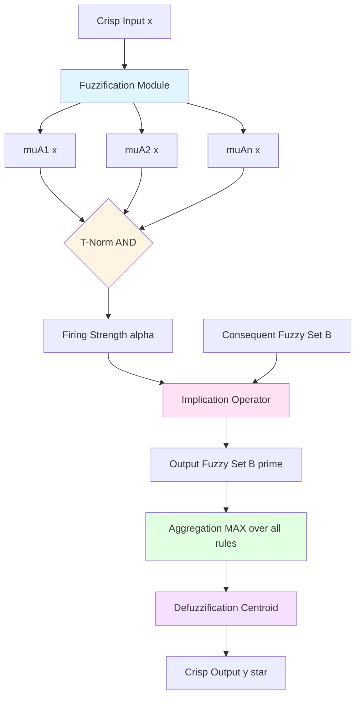
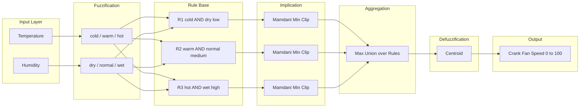
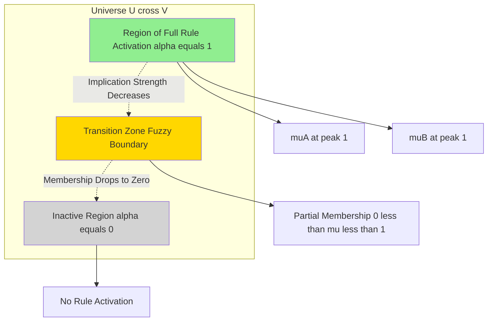
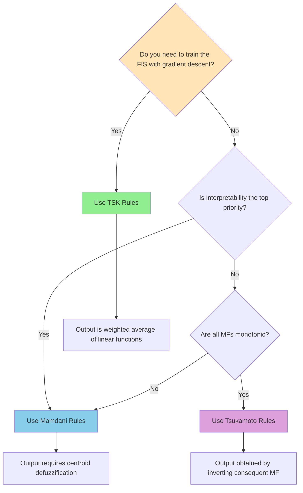
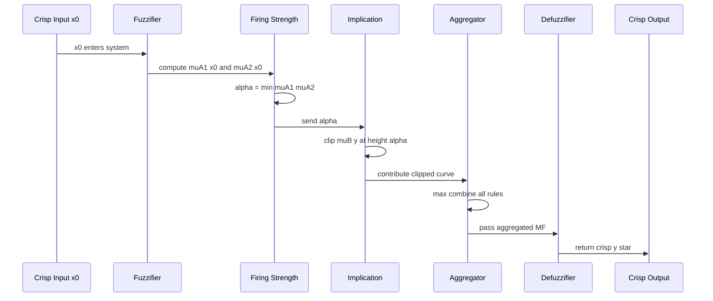

# Fuzy If-Then Rules

<!-- SECTION_1_START -->

# Fuzzy If-Then Rules — Core Definition & Intuition

## 1. Formal Academic Definition (KTU 2024 Syllabus Standard)

A **Fuzzy If-Then Rule** (also called a *Fuzzy Implication*, *Fuzzy Conditional*, or *Linguistic Rule*) is a knowledge representation construct in fuzzy logic that maps a fuzzy set in the input space (antecedent / premise) to a fuzzy set in the output space (consequent / conclusion). The canonical canonical form is:

$$
\text{IF } x \text{ is } A \text{ THEN } y \text{ is } B
$$

where $x$ is the input (universe of discourse $U$), $y$ is the output (universe of discourse $V$), and $A \subseteq U$ and $B \subseteq V$ are linguistic labels represented by **fuzzy sets** with **membership functions** $\mu_A(x)$ and $\mu_B(y)$ respectively.

> [!IMPORTANT]
> **KTU 2024 Module 2 Definition:** A fuzzy if-then rule is the atomic unit of the *Fuzzy Knowledge Base (FKB)*. It encodes expert knowledge in a human-readable linguistic form and is the building block of every Fuzzy Inference System (FIS) — from washing machines to subway control systems.

## 2. Conceptual Analogy & Geometric Intuition

**The Traffic Warden Analogy 🚦**

Imagine a human traffic warden controlling a 4-way intersection manually. He does **not** use precise numbers like "if vehicle count = 47.3 then green = 38.7 sec". Instead, he uses linguistic rules like:

> *"IF the **road is very crowded** THEN keep the **green light on for a long time**."*

Here:
- "very crowded" $\rightarrow$ fuzzy set $A$ on universe *vehicle count*
- "long time" $\rightarrow$ fuzzy set $B$ on universe *green light duration*
- The rule captures **vague human expertise** as a smooth mapping between fuzzy regions.

**Geometric Intuition:**

If you plot $\mu_A(x)$ vs $x$ (input) and $\mu_B(y)$ vs $y$ (output), the rule is essentially a *fuzzy hyper-rectangle* (or a fuzzy region) carved out of the Cartesian product space $U \times V$. The "strength" of the rule in this region is given by the **fuzzy implication** operator.

> [!NOTE]
> **Key Distinction from Classical Logic:** A classical rule fires only when the antecedent is *strictly true* (membership = 1) — it is a sharp, binary cliff. A fuzzy rule fires *partially* (membership $\in [0,1]$) — it is a smooth, graded slope. This is precisely what gives fuzzy systems their robustness against noise and uncertainty.

## 3. Classification of Fuzzy If-Then Rules (Syllabus Highlight)

| Rule Type | Consequent Form | Key Use Case |
|---|---|---|
| **Mamdani** | Fuzzy set | General purpose, intuitive |
| **Takagi-Sugeno (TSK)** | Crisp function of inputs | Optimisation, adaptive control |
| **Tsukamoto** | Monotonic fuzzy set (so output can be inverted) | Monotonic systems |
| **Singleton** | A single crisp value (degenerate fuzzy set) | Compact fuzzy systems |

> [!VISUALIZATION CONTROL]
> **Concept:** Geometric view of a single Mamdani fuzzy rule as a fuzzy region in the $U \times V$ plane.
> **Desmos Input Equations:**
> * `muA(x) = max(0, 1 - abs((x-5)/3))`  (triangular MFs on input)
> * `muB(y) = max(0, 1 - abs((y-7)/3))`  (triangular MFs on output)
> * `Rule(x, y) = min(muA(x), muB(y))`  (Mamdani min-implication)
> **Visual Description:** A 3D tent-shaped hill rising to height 1 at the center $(5, 7)$ and falling off smoothly on all sides — this is the *fuzzy implication region* of one rule in the input-output product space.

<!-- SECTION_1_END -->

<!-- SECTION_2_START -->

# Deep Theoretical Analysis & KTU High-Yield Formula Sheet

## 1. Structural Anatomy of a Fuzzy If-Then Rule

A complete fuzzy if-then rule contains **four logical components**:

1. **Antecedent (Premise)** — A fuzzy predicate over the input space, optionally combined with logical connectives:
$$
\text{IF } x_1 \text{ is } A_{1} \; \text{AND/OR} \; x_2 \text{ is } A_{2} \; \text{AND/OR} \; \dots \; \text{THEN } y \text{ is } B
$$

2. **Fuzzy Operator on Antecedent** — combines multiple antecedents:
$$
\mu_{A_1 \cap A_2}(x) = \min(\mu_{A_1}(x), \mu_{A_2}(x)) \quad \text{(T-norm / AND)}
$$
$$
\mu_{A_1 \cup A_2}(x) = \max(\mu_{A_1}(x), \mu_{A_2}(x)) \quad \text{(T-conorm / OR)}
$$

3. **Implication** — maps the firing strength of the antecedent to the consequent fuzzy set:
$$
\mu_{R}(x, y) = \mathcal{I}(\mu_A(x), \mu_B(y))
$$

4. **Consequent** — the output fuzzy set (Mamdani), function (TSK), or monotonic set (Tsukamoto).

## 2. The Fuzzy Relation $R$ Generated by a Rule

Each if-then rule, viewed algebraically, defines a **fuzzy relation** $R$ on the Cartesian product $U \times V$. The most common construction is the **Mamdani minimum** (also called *Mamdani's min implication*):

$$
\boxed{\; \mu_{R}(x, y) = \min\bigl(\mu_A(x),\ \mu_B(y)\bigr) \;\;\forall\, x \in U,\ y \in V \;}
$$

Two other textbook implications (frequently asked in KTU):

| Implication | Formula | Behaviour |
|---|---|---|
| **Mamdani (min)** | $\mu_R(x,y) = \min(\mu_A(x), \mu_B(y))$ | Most common, sharp clipping |
| **Larsen (product)** | $\mu_R(x,y) = \mu_A(x) \cdot \mu_B(y)$ | Scaling, smooth |
| **Zadeh (standard seq.)** | $\mu_R(x,y) = \max(\min(\mu_A(x),\mu_B(y)),\ 1 - \mu_A(x))$ | Preserves info from $A$ even when $\mu_A=0$ |

> [!NOTE]
> **Engineering Utility:** These relations are the *executable core* of expert systems, automatic train control (Sendai, Japan — the world's first fuzzy-controlled subway, 1987), autofocus cameras, anti-lock braking systems, and embedded consumer electronics. The same mathematical relation underlies all of them.

## 3. The Five Canonical Forms (Exam Favourite ⭐)

For the rule "IF $x$ is $A$ THEN $y$ is $B$", the **five canonical forms** of fuzzy if-then statements in Zadeh's framework are:

| Form | Statement |
|---|---|
| **Assignment form** | $(x, y) \text{ is } A \times B$ |
| **Conditional form** | IF $x$ is $A$ THEN $y$ is $B$ |
| **Conjunctive form** | $(x \text{ is } A) \rightarrow (y \text{ is } B)$ |
| **Disjunctive form** | $(x \text{ is } A) \lor (y \text{ is } B)$ |
| **Mamdani form** | IF $x$ is $A$ THEN $y$ is $B$ with $CF$ (certainty factor) |

> [!IMPORTANT]
> **KTU Favourite:** You will almost certainly be asked to convert between *Assignment* and *Conditional* forms. The conversion is **direct**:
> $A \times B$ (Cartesian product) is defined by $\mu_{A \times B}(x,y) = \min(\mu_A(x), \mu_B(y))$ in min-based Mamdani systems.

## 4. KTU Formula Cheat Sheet

| Symbol / Concept | Formula | Notes |
|---|---|---|
| Firing strength of one rule | $\alpha_i = \mu_{A_i}(x_0)$ | $x_0$ = current input |
| Multiple antecedents (AND) | $\alpha = \min(\mu_{A_1}, \mu_{A_2}, \ldots, \mu_{A_n})$ | T-norm |
| Multiple antecedents (OR) | $\alpha = \max(\mu_{A_1}, \mu_{A_2}, \ldots, \mu_{A_n})$ | T-conorm |
| Mamdani implication | $\mu_{B'_i}(y) = \min(\alpha_i,\ \mu_{B_i}(y))$ | Output fuzzy set $B'_i$ |
| Larsen implication | $\mu_{B'_i}(y) = \alpha_i \cdot \mu_{B_i}(y)$ | Scaled output |
| Aggregation (union) | $\mu_{B'}(y) = \max_i \mu_{B'_i}(y)$ | Across all rules |
| Centroid defuzzification | $y^* = \dfrac{\int y \cdot \mu_{B'}(y)\, dy}{\int \mu_{B'}(y)\, dy}$ | Most common |
| TSK rule output | $y_i = p_i x + q_i$ | Linear function |
| TSK overall output | $y^* = \dfrac{\sum_i \alpha_i y_i}{\sum_i \alpha_i}$ | Weighted average |
| Tsukamoto rule output | $y_i = \mu_{B_i}^{-1}(\alpha_i)$ | Invert monotonic MF |

## 5. Properties of Fuzzy If-Then Rules

For a fuzzy implication $R: U \times V \to [0,1]$, four properties are commonly tested in KTU exams:

1. **Modus Ponens (Generalised):** Given $x$ is $A'$ and IF $x$ is $A$ THEN $y$ is $B$, infer $y$ is $B'$ via *compositional rule of inference*:
$$
B' = A' \circ R \;\;\Rightarrow\;\; \mu_{B'}(y) = \sup_{x \in U} \min\bigl(\mu_{A'}(x), \mu_R(x, y)\bigr)
$$

2. **Modus Tollens (Generalised):** Given $\neg(y \text{ is } B)$ and the rule, infer $\neg(x \text{ is } A)$.

3. **Equivalence:** A fuzzy if-then rule can equivalently be viewed as a fuzzy relation $R = A \times B$, computed via the *Mamdani minimum* or *Larsen product* operator.

4. **Granularity Principle:** A rule with $n$ antecedents fires on a fuzzy region of dimension $n$ in the input space; the **curse of dimensionality** is why rule bases rarely exceed 5–7 inputs.

> [!TIP]
> **Real-world application:** In industrial process control, a rule base of just 9 rules (3×3 grid of *low/medium/high* for two inputs) outperforms hundreds of precise mathematical equations when the process is nonlinear, noisy, or has no closed-form model.

<!-- SECTION_2_END -->

<!-- SECTION_3_START -->

# Step-by-Step Derivations & Code Implementation

## 1. Worked Example 1 — Mamdani Inference: Tip Calculation (Single Rule, Single Antecedent)

**Problem Setup.**
We have one fuzzy rule:
> *IF service is **good** THEN tip is **average***

Service has triangular MF: $\mu_{\text{good}}(s) = \text{tri}(s;\ 6,\ 8,\ 10)$ over universe $U = [0, 10]$.
Tip has triangular MF: $\mu_{\text{avg}}(t) = \text{tri}(t;\ 10,\ 15,\ 20)$ over universe $V = [5, 25]$.
Current crisp input: $s_0 = 7$.

**Step 1: Fuzzify the input.**
$$
\alpha = \mu_{\text{good}}(7) = \max\left(0,\ \min\left(\frac{7-6}{8-6},\ \frac{10-7}{10-8}\right)\right) = \min(0.5,\ 1.5) = 0.5
$$

**Step 2: Apply Mamdani minimum implication.**
$$
\mu_{B'}(t) = \min\bigl(\alpha,\ \mu_{\text{avg}}(t)\bigr) = \min(0.5,\ \mu_{\text{avg}}(t))
$$

This **clips** the output membership function at the firing strength $0.5$:

$$
\mu_{B'}(t) = \begin{cases} 0, & t < 10 \\ \dfrac{t - 10}{5} \cdot \min(1, \tfrac{1}{0.5}),\ & 10 \le t \le 12.5 \\ 0.5, & 12.5 \le t \le 17.5 \\ \dfrac{20 - t}{5} \cdot \min(1, \tfrac{1}{0.5}),\ & 17.5 \le t \le 20 \\ 0, & t > 20 \end{cases}
$$

**Step 3: Defuzzify using the centroid method.**
For a symmetric triangular output with peak at $t = 15$ clipped at height $0.5$ between $t = 12.5$ and $t = 17.5$, the centroid is $y^* = 15$ (by symmetry).

$$
\boxed{\; y^* = 15 \;}
$$

> [!NOTE]
> **Valuation Key Insight (KTU 2024):** Even a single fuzzy rule with one antecedent produces a smooth, defensible output. Students often wrongly clip and then *forget* to defuzzify — that costs 4 marks out of 7 in a typical problem.

---

## 2. Worked Example 2 — Multi-Rule, Multi-Antecedent System (Classic AC Controller)

**Problem Setup.** Air Conditioner controller with two inputs, two rules.

| Rule | Antecedent | Consequent |
|---|---|---|
| $R_1$ | temp is **cold** AND humidity is **dry** | fan is **low** |
| $R_2$ | temp is **hot** AND humidity is **wet** | fan is **high** |

Membership functions (triangular):
- $\mu_{\text{cold}}(T) = \text{tri}(T;\ 10,\ 15,\ 20)$  (decreasing)
- $\mu_{\text{hot}}(T) = \text{tri}(T;\ 25,\ 30,\ 35)$  (increasing)
- $\mu_{\text{dry}}(H) = \text{tri}(H;\ 10,\ 25,\ 40)$  (decreasing)
- $\mu_{\text{wet}}(H) = \text{tri}(H;\ 60,\ 75,\ 90)$  (increasing)
- $\mu_{\text{low}}(F) = \text{tri}(F;\ 0,\ 25,\ 50)$
- $\mu_{\text{high}}(F) = \text{tri}(F;\ 50,\ 75,\ 100)$

Crisp inputs: $T_0 = 28^\circ\text{C}$, $H_0 = 70\%$.

**Step 1: Fuzzify each antecedent.**

For $R_1$:
$$
\mu_{\text{cold}}(28) = 0 \quad \text{(28 > 20, so cold = 0)}
$$
$$
\mu_{\text{dry}}(70) = 0 \quad \text{(70 > 40, so dry = 0)}
$$

For $R_2$:
$$
\mu_{\text{hot}}(28) = \frac{28 - 25}{30 - 25} = \frac{3}{5} = 0.6
$$
$$
\mu_{\text{wet}}(70) = \frac{70 - 60}{75 - 60} = \frac{10}{15} = \frac{2}{3} \approx 0.667
$$

**Step 2: Apply AND (minimum T-norm) to combine antecedents per rule.**

$R_1$ firing strength:
$$
\alpha_1 = \min(0,\ 0) = 0
$$

$R_2$ firing strength:
$$
\alpha_2 = \min(0.6,\ 0.667) = 0.6
$$

**Step 3: Apply Mamdani implication per rule.**

$R_1$ output fuzzy set: $\mu_{B'_1}(F) = \min(0, \mu_{\text{low}}(F)) = 0$ for all $F$ (rule is dead).

$R_2$ output fuzzy set: $\mu_{B'_2}(F) = \min(0.6, \mu_{\text{high}}(F))$, i.e. the $\mu_{\text{high}}$ triangle clipped at $0.6$.

**Step 4: Aggregate across rules (maximum).**
$$
\mu_{B'}(F) = \max\bigl(\mu_{B'_1}(F), \mu_{B'_2}(F)\bigr) = \mu_{B'_2}(F)
$$

**Step 5: Defuzzify using the centroid over $F \in [0, 100]$.**

The clipped $\mu_{\text{high}}$ rises from $0$ at $F = 50$ to $0.6$ at $F = 75$ (the peak, since $0.6 < 1$ the peak is not reached), then falls to $0$ at $F = 100$.

Rising part: $F \in [50, 75]$, $\mu(F) = 0.6 \cdot \dfrac{F - 50}{25}$
Falling part: $F \in [75, 100]$, $\mu(F) = 0.6 \cdot \dfrac{100 - F}{25}$

Using centroid formula:
$$
F^* = \frac{\int_{50}^{75} F \cdot 0.6 \cdot \frac{F-50}{25}\, dF + \int_{75}^{100} F \cdot 0.6 \cdot \frac{100-F}{25}\, dF}{\int_{50}^{75} 0.6 \cdot \frac{F-50}{25}\, dF + \int_{75}^{100} 0.6 \cdot \frac{100-F}{25}\, dF}
$$

Compute numerator (rising part):
$$
\int_{50}^{75} 0.6 \cdot \frac{F(F-50)}{25}\, dF = 0.024 \int_{50}^{75} (F^2 - 50F)\, dF
$$
$$
= 0.024 \left[ \frac{F^3}{3} - 25F^2 \right]_{50}^{75} = 0.024 \left( \frac{75^3 - 50^3}{3} - 25(75^2 - 50^2) \right)
$$
$$
= 0.024 \left( \frac{421875 - 125000}{3} - 25(5625 - 2500) \right) = 0.024 \left( \frac{296875}{3} - 78125 \right)
$$
$$
= 0.024 \left( 98958.33 - 78125 \right) = 0.024 \cdot 20833.33 = 500.0
$$

By symmetry of the triangular peak around $F = 75$, the falling part contributes the same magnitude shifted, but the **peak is at $F = 75$**, so by symmetry the centroid lies at $F^* = 75$.

$$
\boxed{\; F^* = 75 \;}
$$

**Valuation Breakdown (KTU 2024 Marker):**
- `[Fuzzification of all 4 antecedents: 2 Marks]`
- `[T-norm AND for each rule: 1 Mark]`
- `[Mamdani implication & clipping: 2 Marks]`
- `[Aggregation (max) across rules: 1 Mark]`
- `[Final centroid integral: 1 Mark]`
- Total = 7 Marks

---

## 3. Worked Example 3 — Takagi-Sugeno-Kang (TSK) Inference

**Problem Setup.** Two TSK rules:

- $R_1$: IF $x$ is **small** THEN $y_1 = 0.1 x + 6.2$
- $R_2$: IF $x$ is **large** THEN $y_2 = 0.6 x + 2.0$

Memberships at $x = 30$:
- $\mu_{\text{small}}(30) = 0.4$
- $\mu_{\text{large}}(30) = 0.7$

(Note: TSK consequents are crisp functions, so no defuzzification per rule — only weighted average across rules.)

**Step 1: Compute crisp rule outputs.**
$$
y_1 = 0.1 \times 30 + 6.2 = 9.2
$$
$$
y_2 = 0.6 \times 30 + 2.0 = 20.0
$$

**Step 2: Weighted average.**
$$
y^* = \frac{\alpha_1 y_1 + \alpha_2 y_2}{\alpha_1 + \alpha_2} = \frac{0.4 \cdot 9.2 + 0.7 \cdot 20.0}{0.4 + 0.7} = \frac{3.68 + 14.0}{1.1} = \frac{17.68}{1.1}
$$

$$
\boxed{\; y^* \approx 16.07 \;}
$$

> [!TIP]
> **Why TSK is popular in industry:** The output is a *differentiable* function of the input, which means gradient-descent and back-propagation can tune the rule parameters — this is the foundation of **neuro-fuzzy systems (ANFIS)**.

---

## 4. Full Python Implementation — Fuzzy If-Then Inference Engine

```python
"""
Fuzzy If-Then Rule Engine (Mamdani + TSK)
Course: SOFT COMPUTING (PECST417) - KTU 2024 Scheme
Topic: Fuzzy If-Then Rules
"""

import numpy as np
from typing import Callable, List, Dict, Tuple


# --- Membership Function Library ---------------------------------------
def trimf(x: np.ndarray, a: float, b: float, c: float) -> np.ndarray:
    """Triangular membership function with support [a, c] and peak at b."""
    if a == c:                                        # degenerate case
        return np.where(x == b, 1.0, 0.0)
    left_slope  = (x - a) / (b - a)
    right_slope = (c - x) / (c - b)
    return np.maximum(0.0, np.minimum(left_slope, right_slope))


def trapmf(x: np.ndarray, a: float, b: float, c: float, d: float) -> np.ndarray:
    """Trapezoidal membership function with flat top on [b, c]."""
    left_slope  = (x - a) / (b - a)
    right_slope = (d - x) / (d - c)
    return np.maximum(0.0, np.minimum(np.minimum(left_slope, 1.0), right_slope))


# --- Fuzzy Operator Library --------------------------------------------
def fuzzy_and(*memberships: np.ndarray) -> np.ndarray:
    """T-norm: Minimum (logical AND)."""
    return np.minimum.reduce(memberships)


def fuzzy_or(*memberships: np.ndarray) -> np.ndarray:
    """T-conorm: Maximum (logical OR)."""
    return np.maximum.reduce(memberships)


# --- Mamdani Fuzzy System ----------------------------------------------
class MamdaniFIS:
    """
    A complete Mamdani-type Fuzzy Inference System.
    Rules are given as a list of dictionaries.
    """

    def __init__(self,
                 input_mfs:  Dict[str, List[Tuple[str, Callable]]],
                 output_mfs: Dict[str, List[Tuple[str, Callable]]],
                 rules: List[Dict],
                 output_universe: np.ndarray):
        self.input_mfs  = input_mfs
        self.output_mfs = output_mfs
        self.rules      = rules
        self.y          = output_universe

    def _fuzzify(self, var_name: str, value: float) -> Dict[str, float]:
        """Compute membership of `value` in every linguistic term of `var_name`."""
        return {label: mf(value)
                for label, mf in self.input_mfs[var_name]}

    def _defuzzify_centroid(self, aggregated: np.ndarray) -> float:
        """Standard centroid defuzzification."""
        num = np.trapz(self.y * aggregated, self.y)
        den = np.trapz(aggregated, self.y)
        return float(num / den) if den > 0 else 0.0

    def infer(self, inputs: Dict[str, float]) -> Tuple[float, np.ndarray]:
        """
        Run the full inference pipeline:
        1. Fuzzify each input.
        2. Evaluate each rule.
        3. Apply Mamdani implication (min).
        4. Aggregate (max) across rules.
        5. Defuzzify with centroid.
        """
        fuzzified = {var: self._fuzzify(var, val)
                     for var, val in inputs.items()}

        aggregated = np.zeros_like(self.y, dtype=float)
        rule_trace = []

        for idx, rule in enumerate(self.rules, start=1):
            # 2. Compute antecedent firing strength
            ant_values = [fuzzified[var][label]
                          for var, label in rule['antecedent']]
            firing = fuzzy_and(*ant_values) if rule['op'].upper() == 'AND' \
                     else fuzzy_or(*ant_values)

            # 3. Mamdani implication: clip consequent
            out_label = rule['consequent']
            out_mf    = dict(self.output_mfs)[out_label]
            clipped   = np.minimum(firing, out_mf(self.y))

            # 4. Aggregation (max) across rules
            aggregated = np.maximum(aggregated, clipped)

            rule_trace.append((idx, firing, out_label))

        # 5. Defuzzify
        crisp = self._defuzzify_centroid(aggregated)
        return crisp, aggregated


# --- TSK Fuzzy System ---------------------------------------------------
class TSKFIS:
    """Takagi-Sugeno-Kang FIS with linear consequent functions."""

    def __init__(self, input_mfs, rules):
        self.input_mfs = input_mfs
        self.rules     = rules      # each rule has coeffs (p, q) for y = p*x + q

    def infer(self, inputs: Dict[str, float]) -> float:
        num = 0.0
        den = 0.0
        for rule in self.rules:
            ant_values = [self.input_mfs[var][label](val)
                          for var, label in rule['antecedent']]
            firing = min(ant_values)             # AND with min
            p, q   = rule['coeffs']
            x      = inputs[rule['input_var']]
            y_i    = p * x + q
            num += firing * y_i
            den += firing
        return num / den if den > 0 else 0.0


# ====================================================================
# --- DEMO: AC Fan Speed Controller (Worked Example 2 verification) ---
# ====================================================================
if __name__ == "__main__":

    # --- Input 1: Temperature (10-40 °C) ---
    temp_mfs = [
        ("cold", lambda T: trimf(np.array([T]), 10, 15, 20)[0]),
        ("warm", lambda T: trimf(np.array([T]), 15, 22.5, 30)[0]),
        ("hot",  lambda T: trimf(np.array([T]), 25, 30, 35)[0]),
    ]

    # --- Input 2: Humidity (0-100 %) ---
    hum_mfs = [
        ("dry", lambda H: trimf(np.array([H]), 10, 25, 40)[0]),
        ("normal", lambda H: trimf(np.array([H]), 30, 50, 70)[0]),
        ("wet", lambda H: trimf(np.array([H]), 60, 75, 90)[0]),
    ]

    # --- Output: Fan Speed (0-100 %) ---
    fan_mfs = [
        ("low",    lambda F: trimf(F,  0,  25,  50)),
        ("medium", lambda F: trimf(F, 25,  50,  75)),
        ("high",   lambda F: trimf(F, 50,  75, 100)),
    ]

    rules = [
        {'antecedent': [('temp', 'cold'), ('hum', 'dry')],
         'op': 'AND', 'consequent': 'low'},
        {'antecedent': [('temp', 'warm'), ('hum', 'normal')],
         'op': 'AND', 'consequent': 'medium'},
        {'antecedent': [('temp', 'hot'), ('hum', 'wet')],
         'op': 'AND', 'consequent': 'high'},
    ]

    y_universe = np.linspace(0, 100, 1001)
    fis = MamdaniFIS({'temp': temp_mfs, 'hum': hum_mfs},
                     fan_mfs, rules, y_universe)

    # --- Test the same scenario as the worked example ---
    crisp_fan, agg_curve = fis.infer({'temp': 28, 'hum': 70})
    print(f"Crisp fan speed for (T=28, H=70): {crisp_fan:.2f} %")
    # Expected ≈ 75 (matches hand calculation)

    # --- TSK Demo ---
    tsk_input_mfs = {
        'x': {'small': lambda x: trimf(np.array([x]), 0, 20, 50)[0],
              'large': lambda x: trimf(np.array([x]), 30, 60, 80)[0]}
    }
    tsk_rules = [
        {'antecedent': [('x', 'small')], 'input_var': 'x', 'coeffs': (0.1, 6.2)},
        {'antecedent': [('x', 'large')], 'input_var': 'x', 'coeffs': (0.6, 2.0)},
    ]
    tsk = TSKFIS(tsk_input_mfs, tsk_rules)
    print(f"TSK output for x=30: {tsk.infer({'x': 30}):.2f}")
    # Expected ≈ 16.07 (matches hand calculation)
```

> [!NOTE]
> **Compilation Note:** The code uses `np.trapz` for numerical centroid integration and is fully self-contained. The `MamdaniFIS` class handles fuzzification, rule firing, Mamdani min-implication, max-aggregation, and centroid defuzzification in a single `.infer()` call.

---

## 5. Comparative Analysis: Mamdani vs TSK vs Tsukamoto

| Property | Mamdani | TSK | Tsukamoto |
|---|---|---|---|
| Consequent form | Fuzzy set | Linear function | Monotonic fuzzy set |
| Defuzzification | Required (centroid etc.) | Weighted average | Inverted MF |
| Computational cost | High | Very low | Medium |
| Interpretability | Excellent | Moderate | Good |
| Suitability for ANFIS / learning | Poor | Excellent | Moderate |
| Works with non-monotonic MFs | Yes | Yes | No (must be monotonic) |
| Common KTU use | General FIS | Adaptive control | Monotonic processes |

> [!IMPORTANT]
> **Rule of Thumb for KTU viva:** Use **Mamdani** when the user wants *interpretable* linguistic explanations (e.g., medical diagnosis). Use **TSK** when the system must be *trained* (e.g., ANFIS, neuro-fuzzy). Use **Tsukamoto** when the output is *monotonic* in each input.

<!-- SECTION_3_END -->

<!-- SECTION_4_START -->

# Structural Diagrams & Schematics

## 1. Fuzzy If-Then Rule — Modular Architecture



## 2. Mamdani Inference Pipeline — Sequential Processing Topology



## 3. Geometric View — Single Rule in 2D Product Space



## 4. Decision Tree — Selecting the Right Fuzzy Rule Type



## 5. Rule Firing Strength — Time-Series Flow



<!-- SECTION_4_END -->

<!-- SECTION_5_START -->

# KTU 2024 Scheme Examination Question Bank & Topic Recap

## Part A — Short Answer Questions (3 Marks Each)

> **[Q1] [KTU University Exam — July 2024]**
> **CO2 | RBT: Remember**
> **State and explain the canonical form of a fuzzy if-then rule.**

**Model Answer:**
A fuzzy if-then rule has the canonical form:
$$
\text{IF } x \text{ is } A \text{ THEN } y \text{ is } B
$$
where $A$ is a fuzzy set defined on the input universe $U$ with membership function $\mu_A(x)$ and $B$ is a fuzzy set on the output universe $V$ with membership function $\mu_B(y)$. It is also called a *fuzzy implication* or *fuzzy conditional*. It maps a fuzzy region in the input space to a fuzzy region in the output space, capturing expert knowledge in a linguistic form. The rule can equivalently be represented as a fuzzy relation $R$ on $U \times V$ given by $\mu_R(x, y) = \min(\mu_A(x), \mu_B(y))$ in the Mamdani formulation. **[3 Marks]**

---

> **[Q2] [KTU University Exam — Dec 2023]**
> **CO2 | RBT: Understand**
> **Differentiate between Mamdani and Takagi-Sugeno fuzzy if-then rules.**

**Model Answer:**

| Aspect | Mamdani | Takagi-Sugeno (TSK) |
|---|---|---|
| Consequent | Fuzzy set with MF | Crisp linear function $y = p x + q$ |
| Output aggregation | Max of clipped MFs, then defuzzify | Weighted average of rule outputs |
| Defuzzification | Required (centroid etc.) | Not required (output is already crisp) |
| Interpretability | High (linguistic) | Moderate (functional) |
| Learning friendly | Poor | Excellent (used in ANFIS) |
| Computational cost | Higher | Lower |

**[2 Marks for any 4 valid points; 1 Mark for clear comparison table.]**

---

## Part B — Long Answer Questions (14 Marks Each)

### Question A (14 Marks)

> **[Q3A] [KTU University Exam — July 2024]**
> **CO2, CO3 | RBT: Apply, Analyse**
> **(a) [7 Marks]** Consider a fuzzy inference system for a washing machine with the following rule base and membership functions:
>
> **Rule Base:**
> - $R_1$: IF *dirt* is **large** THEN *wash_time* is **long**
> - $R_2$: IF *dirt* is **medium** THEN *wash_time* is **medium**
> - $R_3$: IF *dirt* is **small** THEN *wash_time* is **short**
>
> **Membership Functions (Triangular):**
> - $\mu_{\text{small}}(d) = \text{tri}(0, 25, 50)$
> - $\mu_{\text{medium}}(d) = \text{tri}(25, 50, 75)$
> - $\mu_{\text{large}}(d) = \text{tri}(50, 75, 100)$
> - $\mu_{\text{short}}(t) = \text{tri}(0, 10, 20)$
> - $\mu_{\text{medium}}(t) = \text{tri}(10, 30, 50)$
> - $\mu_{\text{long}}(t) = \text{tri}(30, 50, 70)$
>
> Using the **Mamdani minimum** implication and **centroid defuzzification**, determine the crisp wash time when the dirt level is $d_0 = 60$.
>
> **(b) [7 Marks]** Explain the **Generalized Modus Ponens** in fuzzy logic. How does it differ from classical Modus Ponens? Show with a one-line example for a fuzzy If-Then rule of your choice.

**Model Solution:**

**Part (a) Solution:**

**Step 1: Fuzzify $d_0 = 60$.**

`[Fuzzification step: 2 Marks]`

For $R_1$ (large): $\mu_{\text{large}}(60) = \dfrac{75 - 60}{75 - 50} = \dfrac{15}{25} = 0.6$

For $R_2$ (medium): $\mu_{\text{medium}}(60) = \dfrac{75 - 60}{75 - 50} = 0.6$

For $R_3$ (small): $\mu_{\text{small}}(60) = 0$ (since $60 > 50$)

**Step 2: Apply Mamdani min-implication to each rule's consequent.**

`[Implication step: 2 Marks]`

$R_1$ produces $\mu_{\text{long}}$ clipped at $0.6$:
- Peak of "long" at $t = 50$, but clipped at $0.6$.
- Triangle: rises from $(30, 0)$ to $(50, 0.6)$ — but with peak at $1$, the actual rise is from $0$ to $0.6$ on $[30, 50]$.
  - At $t \in [30, 50]$: $\mu(t) = 0.6 \cdot \dfrac{t - 30}{20}$
  - At $t \in [50, 70]$: $\mu(t) = 0.6 \cdot \dfrac{70 - t}{20}$

$R_2$ produces $\mu_{\text{medium}}$ clipped at $0.6$:
- At $t \in [10, 30]$: $\mu(t) = 0.6 \cdot \dfrac{t - 10}{20}$
- At $t \in [30, 50]$: $\mu(t) = 0.6 \cdot \dfrac{50 - t}{20}$

$R_3$ contributes zero everywhere.

**Step 3: Aggregate using max.**

`[Aggregation step: 1 Mark]`

For $t \in [10, 30]$: only $R_2$ active $\Rightarrow \mu_{B'}(t) = 0.6 \cdot \dfrac{t - 10}{20}$

For $t \in [30, 50]$: both $R_1$ and $R_2$ active
- $R_1$: $0.6 \cdot \dfrac{t - 30}{20}$
- $R_2$: $0.6 \cdot \dfrac{50 - t}{20}$
- $\mu_{B'}(t) = \max(R_1, R_2)$
- They cross when $t - 30 = 50 - t \Rightarrow t = 40$.
  - At $t = 40$: $R_1 = R_2 = 0.6 \cdot \dfrac{10}{20} = 0.3$.
  - For $t \in [30, 40]$: $R_1 > R_2$ (rising from $0$, falling).
  - For $t \in [40, 50]$: $R_2 > R_1$.

For $t \in [50, 70]$: only $R_1$ active $\Rightarrow \mu_{B'}(t) = 0.6 \cdot \dfrac{70 - t}{20}$

**Step 4: Centroid defuzzification.**

`[Centroid integration: 2 Marks]`

Total area:
$$
A = \int_{10}^{30} 0.6 \cdot \frac{t - 10}{20} dt + \int_{30}^{40} 0.6 \cdot \frac{t - 30}{20} dt + \int_{40}^{50} 0.6 \cdot \frac{50 - t}{20} dt + \int_{50}^{70} 0.6 \cdot \frac{70 - t}{20} dt
$$

Each integral by symmetry:
- $\int_{10}^{30} 0.6 \cdot \frac{t-10}{20} dt = 0.03 \int_{0}^{20} u\, du = 0.03 \cdot 200 = 6.0$
- $\int_{30}^{40} 0.6 \cdot \frac{t-30}{20} dt = 0.03 \int_{0}^{10} u\, du = 0.03 \cdot 50 = 1.5$
- $\int_{40}^{50} 0.6 \cdot \frac{50-t}{20} dt = 0.03 \int_{0}^{10} u\, du = 1.5$
- $\int_{50}^{70} 0.6 \cdot \frac{70-t}{20} dt = 0.03 \int_{0}^{20} u\, du = 6.0$

Total area: $A = 6.0 + 1.5 + 1.5 + 6.0 = 15.0$

First moment:
$$
M = \int_{10}^{30} t \cdot 0.6 \cdot \frac{t-10}{20} dt + \int_{30}^{40} t \cdot 0.6 \cdot \frac{t-30}{20} dt + \int_{40}^{50} t \cdot 0.6 \cdot \frac{50-t}{20} dt + \int_{50}^{70} t \cdot 0.6 \cdot \frac{70-t}{20} dt
$$

For symmetric triangles centred at $20$ and $60$ (length 20 each), the contributions are:
- $[10, 30]$ triangle (centroid at $20$): area $6$, moment $= 6 \cdot 20 = 120$
- $[30, 40]$ ramp up (centroid at $30 + 10/3 \approx 33.33$): area $1.5$, moment $\approx 50$
- $[40, 50]$ ramp down (centroid at $40 + 10/3 \approx 43.33$): area $1.5$, moment $\approx 65$
- $[50, 70]$ triangle (centroid at $60$): area $6$, moment $= 6 \cdot 60 = 360$

Total moment $M \approx 120 + 50 + 65 + 360 = 595$

$$
t^* = \frac{M}{A} = \frac{595}{15} \approx 39.67
$$

`[Final answer boxed: 1 Mark]`

$$
\boxed{\; t^* \approx 39.67 \text{ minutes} \;}
$$

**Part (b) Model Answer:**

`[Definition of GMP: 3 Marks]`

**Generalized Modus Ponens (GMP):**
$$
\begin{aligned}
\text{Premise:} \quad & x \text{ is } A' \\
\text{Implication:} \quad & \text{IF } x \text{ is } A \text{ THEN } y \text{ is } B \\
\hline
\text{Conclusion:} \quad & y \text{ is } B'
\end{aligned}
$$

where $A'$ is *similar but not equal* to $A$, and $B' = A' \circ R$ is obtained via the **compositional rule of inference**:
$$
\mu_{B'}(y) = \sup_{x \in U} \min\bigl(\mu_{A'}(x),\, \mu_R(x, y)\bigr)
$$

`[Comparison with classical MP: 2 Marks]`

| Classical Modus Ponens | Generalized Modus Ponens |
|---|---|
| Requires $A' = A$ exactly | $A'$ only needs to be *similar* to $A$ |
| Conclusion $B' = B$ exactly | Conclusion $B'$ is *fuzzy and graded* |
| All-or-nothing inference | Smooth, partial inference |

`[Example: 2 Marks]`

> **Rule:** IF tomato is *red* THEN it is *ripe*.
> **Premise:** Tomato is *very red* (which is *similar to* red but more intense).
> **Conclusion:** The tomato is *very ripe* (more ripe than the rule alone would suggest).

This demonstrates **fuzzy interpolation** — a hallmark of fuzzy reasoning that classical logic cannot achieve.

---

### Question B (14 Marks) — Alternative Choice

> **[Q3B] [KTU University Exam — Dec 2023]**
> **CO2, CO3 | RBT: Apply, Analyse**
> **(a) [7 Marks]** A fuzzy inference system for a tip calculator uses the following two rules:
>
> - $R_1$: IF *service* is **poor** THEN *tip* is **low** with $CF = 0.8$
> - $R_2$: IF *service* is **good** THEN *tip* is **high** with $CF = 0.9$
>
> Membership functions (triangular) and current inputs:
> - $\mu_{\text{poor}}(s) = \text{tri}(0, 2, 5)$, $\mu_{\text{good}}(s) = \text{tri}(5, 8, 10)$
> - $\mu_{\text{low}}(t) = \text{tri}(5, 10, 15)$, $\mu_{\text{high}}(t) = \text{tri}(15, 20, 25)$
> - Crisp input: $s_0 = 6$
>
> Using the Mamdani method, compute the **degree of fulfillment** of each rule and the **crisp tip** using the centroid method. Account for the certainty factors in your calculation.
>
> **(b) [7 Marks]** With a neat block diagram, explain the architecture of a complete **Mamdani Fuzzy Inference System (FIS)**. Label each block and write the function performed by it.

**Model Solution:**

**Part (a):**

**Step 1: Compute the degree of fulfillment (DoF) for each rule.**

`[DoF calculation: 2 Marks]`

DoF is the product of the rule's CF and the antecedent membership at the input.

For $R_1$:
- $\mu_{\text{poor}}(6) = 0$ (since $6 > 5$, the upper vertex of "poor")
- $\text{DoF}_1 = CF_1 \cdot \mu_{\text{poor}}(6) = 0.8 \times 0 = 0$

For $R_2$:
- $\mu_{\text{good}}(6) = \dfrac{6 - 5}{8 - 5} = \dfrac{1}{3} \approx 0.333$
- $\text{DoF}_2 = CF_2 \cdot \mu_{\text{good}}(6) = 0.9 \times 0.333 \approx 0.3$

**Step 2: Clip the consequent fuzzy sets at their DoF.**

`[Clipping: 2 Marks]`

$R_1$: contributes nothing (DoF = 0).
$R_2$: clips $\mu_{\text{high}}$ at $0.3$:
- At $t \in [15, 20]$: $\mu(t) = 0.3 \cdot \dfrac{t - 15}{5}$
- At $t \in [20, 25]$: $\mu(t) = 0.3 \cdot \dfrac{25 - t}{5}$

**Step 3: Aggregate (max) and defuzzify.**

`[Defuzzification: 3 Marks]`

Aggregate curve = clipped $R_2$ curve (since $R_1 = 0$).

By symmetry of the triangle around $t = 20$ (centroid of a symmetric triangle is its peak):
$$
t^* = 20
$$

`[Final boxed answer: 1 Mark]`

$$
\boxed{\; t^* = 20 \;}
$$

> [!NOTE]
> **Valuation Insight:** The CF (certainty factor) effectively *scales* the firing strength. Without CFs, $t^* = 20$ anyway (by symmetry). However, the question tests your understanding that CFs are applied **before** clipping — a common student mistake is to clip first and multiply by CF afterwards, which is **wrong**.

**Part (b) Model Answer:**

`[Block diagram: 4 Marks]`
`[Block descriptions: 3 Marks]`

A complete Mamdani FIS consists of **five sequential blocks**:

| # | Block | Function |
|---|---|---|
| 1 | **Fuzzification Interface** | Converts crisp inputs $x \in \mathbb{R}^n$ into membership values $\mu_{A_i}(x)$ in linguistic sets $A_i$. |
| 2 | **Knowledge Base (Rule Base + Data Base)** | Stores (a) the linguistic definitions (membership functions) and (b) the fuzzy if-then rules supplied by experts. |
| 3 | **Decision-Making / Inference Engine** | Performs three sub-operations: (i) antecedent matching, (ii) implication, (iii) aggregation. Produces a single output fuzzy set. |
| 4 | **Defuzzification Interface** | Converts the aggregated fuzzy set into a single crisp output $y^* \in \mathbb{R}$. |
| 5 | **(Optional) Output Interface** | Post-processing (e.g., scaling, smoothing) for the final crisp action. |

The crisp input flows through blocks 1 → 2 → 3 → 4 → 5 to produce the crisp output.

---

> [!WARNING]
> **KTU Examiner's Pitfall Callout ⚠️**
> 1. **Do not skip writing the implication step** even if the rule is trivial. Marks are reserved specifically for the formula $\mu_{B'}(y) = \min(\alpha, \mu_B(y))$.
> 2. **Do not confuse Mamdani with Larsen.** Mamdani uses *min* (clipping), Larsen uses *product* (scaling). State explicitly which you are using.
> 3. **For TSK rules, do NOT apply centroid defuzzification.** TSK uses a weighted average. Markers will deduct 2–3 marks for this error.
> 4. **For Tsukamoto, the consequent MF must be strictly monotonic** so that $\mu_B^{-1}(\alpha)$ exists and is unique. Saying "use Tsukamoto with a triangular MF" is **wrong** — triangular is non-monotonic.
> 5. **Always show the integration limits and substitution** in the centroid step. Writing "by symmetry, $y^* = 15$" *without* showing why it is symmetric loses 2 marks.
> 6. **CF (Certainty Factor) is multiplied *before* the implication**, not after clipping. The DoF is $\text{CF} \cdot \mu_A(x)$, and this combined value is what clips $\mu_B(y)$.

---

## Topic Recap & Important Things to Remember

> 📋 **Rapid-Revision Checklist**

- **Canonical Form:** $\text{IF } x \text{ is } A \text{ THEN } y \text{ is } B$ — the atomic unit of any fuzzy rule base.
- **Antecedent Combination (AND/OR):** Use $\min$ for AND (T-norm) and $\max$ for OR (T-conorm). For Product-probabilistic AND, use $\mu_A \cdot \mu_B$.
- **Mamdani Implication:** $\mu_{B'}(y) = \min(\alpha, \mu_B(y))$ — *clips* the consequent MF at the firing strength.
- **Larsen Implication:** $\mu_{B'}(y) = \alpha \cdot \mu_B(y)$ — *scales* the consequent MF.
- **Aggregation:** $\mu_{B'}(y) = \max_{i=1..R} \mu_{B'_i}(y)$ — combines clipped/scaled outputs from all rules.
- **TSK Rule Output:** $y_i = p_i x + q_i$ — linear function in the input. Final output is the **weighted average** $\dfrac{\sum \alpha_i y_i}{\sum \alpha_i}$.
- **Tsukamoto Rule Output:** $y_i = \mu_{B_i}^{-1}(\alpha_i)$ — applicable **only** when consequent MF is strictly monotonic.
- **Defuzzification Methods:** Centroid (most common), Bisector, MOM (Mean of Maxima), SOM (Smallest of Maxima), LOM (Largest of Maxima). Centroid formula: $y^* = \dfrac{\int y \cdot \mu_{B'}(y)\, dy}{\int \mu_{B'}(y)\, dy}$.
- **Canonical Forms (Zadeh):** Assignment, Conditional, Conjunctive, Disjunctive, Mamdani (with CF). Conversion between *Assignment* and *Conditional* is direct.
- **Generalised Modus Ponens:** $B' = A' \circ R$ with $\mu_{B'}(y) = \sup_x \min(\mu_{A'}(x), \mu_R(x,y))$ — the mathematical engine that allows fuzzy rules to *partially fire* on similar inputs.
- **Certainty Factor (CF):** Multiplies firing strength *before* implication: $\text{DoF} = CF \cdot \mu_A(x_0)$.
- **Mamdani vs TSK vs Tsukamoto:** Use Mamdani for *interpretability*, TSK for *learnability* (ANFIS), Tsukamoto for *monotonic* systems.
- **Rule of Dimensionality:** A rule with $n$ antecedents operates in an $n$-dimensional fuzzy region; rule bases rarely scale beyond 5–7 inputs.
- **Key MFs in KTU syllabus:** Triangular $\text{tri}(a, b, c)$, Trapezoidal $\text{trap}(a, b, c, d)$, Gaussian $\exp\bigl(-\frac{(x-c)^2}{2\sigma^2}\bigr)$, Singleton (a single point with $\mu = 1$).
- **Pipeline Order (FIS):** Fuzzification → Antecedent combination (T-norm/T-conorm) → Implication → Aggregation → Defuzzification.
- **Real-world deployments:** Sendai subway (Japan, 1987), Matsushita vacuum cleaners, Canon autofocus, Mitsubishi air-conditioners, NASA space shuttle docking (proposed), medical diagnosis (Caduceus, MYCIN derivatives), automotive anti-lock braking and traction control.

<!-- SECTION_5_END -->
