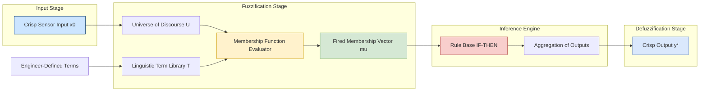
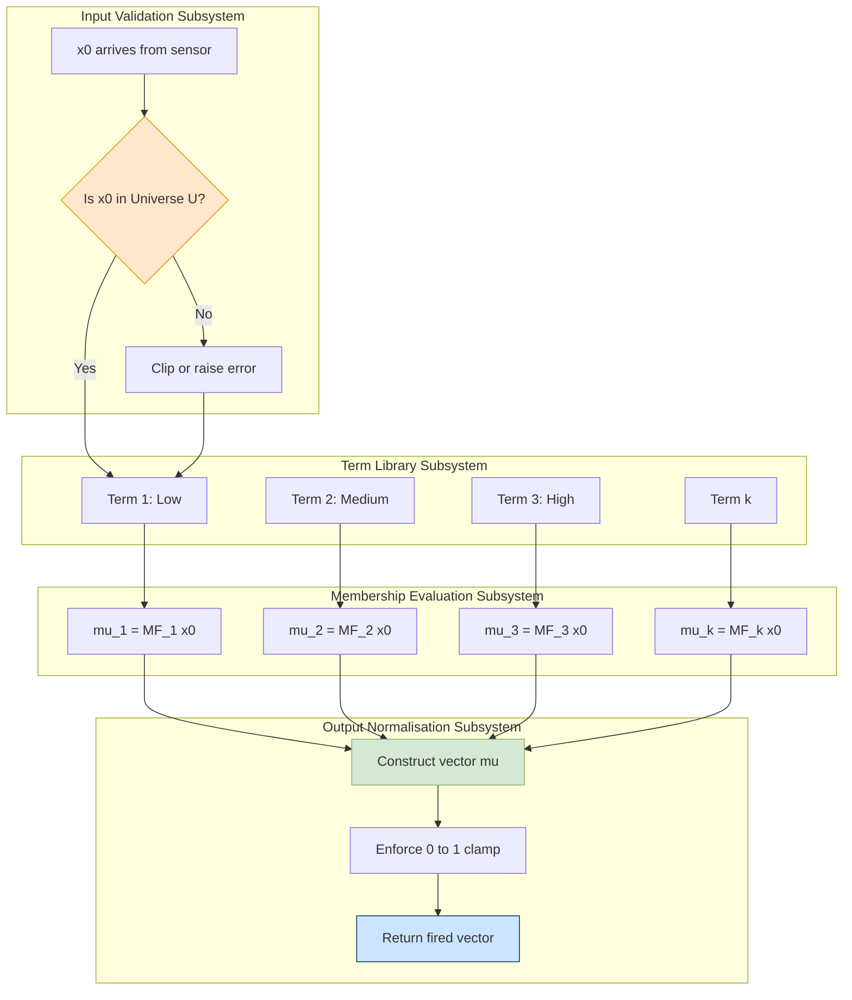
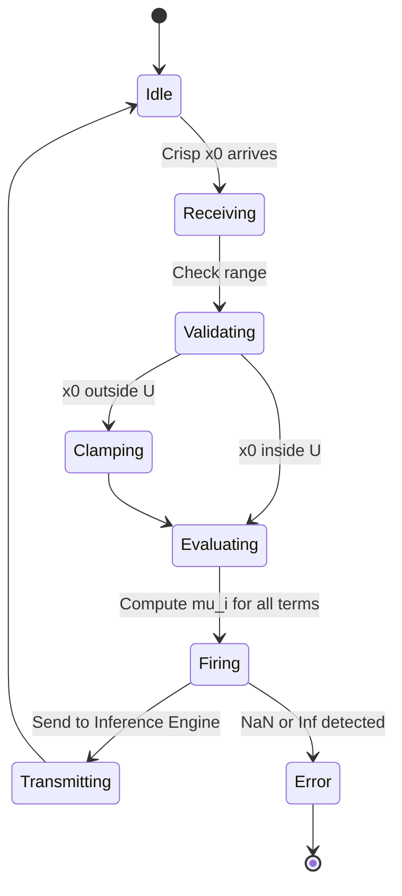

# Fuzzification

<!-- SECTION_1_START -->
# Fuzzification — The Gateway to Fuzzy Reasoning

## 1. Core Technical Definition (KTU 2024 Syllabus Aligned)

> [!NOTE]
> **Formal Definition (Rizzetti / Klir / Yuan Format)**
> **Fuzzification** is the *primary mapping stage* of a Fuzzy Inference System (FIS) in which each crisp, deterministic input value $x_0 \in \mathbb{R}^n$ from the real-world sensor or user interface is transformed into a corresponding **singleton fuzzy set** (or a fuzzy set with non-zero support) on the universe of discourse $\mathcal{U}$. Mathematically, it is the process of determining the *degree of membership* $\mu_{\tilde{A}_i}(x_0) \in [0,1]$ of $x_0$ in every predefined fuzzy set $\tilde{A}_i$ of the input variable.

In the canonical **Mamdani Fuzzy Inference Architecture**, fuzzification is performed by a dedicated block called the **Fuzzification Interface (FI)** or **Fuzzifier**. Its role is fundamentally a *many-to-one functional transformation*:

$$\text{Fuzzifier} : \; x_0 \in \mathcal{U} \;\longmapsto\; \left\{ \mu_{\tilde{A}_1}(x_0),\, \mu_{\tilde{A}_2}(x_0),\, \dots,\, \mu_{\tilde{A}_k}(x_0) \right\}$$

where $k$ denotes the total number of linguistic partitions (fuzzy sets) of the input variable.

### Why Does Fuzzification Exist?
Classical Boolean (crisp) logic forces a variable into exactly one category: an object is either *hot* **OR** *cold* with no intermediate state. Real engineering measurements, however, exhibit **gradual transitions** — a sensor reading of 24.6 °C is neither obviously "warm" nor obviously "cool". Fuzzification preserves this natural *gradient* by assigning *partial* truth values instead of forcing a binary decision.

---

## 2. Conceptual Analogy — The "Weather Forecaster" Intuition

> [!IMPORTANT]
> **Real-World Analogy: The Human Skin as a Fuzzifier**
> Imagine you step out of an air-conditioned room and a friend asks, *"How is the temperature?"* You never reply with **"24.6 °C"** — you instinctively answer, *"It's a bit warm, but leaning cool."*
>
> Your nervous system has just performed **fuzzification**:
> * The **crisp input** is the raw temperature $x_0 = 24.6 \, ^\circ\text{C}$.
> * The **membership functions** are the linguistic labels stored in your brain: *Cold, Cool, Warm, Hot*.
> * The **fuzzification output** is a vector of *partial memberships*, e.g., *Cool* = **0.7**, *Warm* = **0.3** — both values coexist simultaneously.
>
> The crisp-to-fuzzy conversion bridges the **numerical world of sensors** with the **linguistic world of human reasoning**.

### Linguistic Variables — The Vocabulary of Fuzzy Systems

A **linguistic variable** $\mathcal{L}$ (introduced by **Lotfi A. Zadeh, 1975**) is a variable whose values are words or sentences in a natural or artificial language rather than numbers.

| Component | Mathematical Notation | Example (Temperature Variable) |
| :--- | :--- | :--- |
| Variable Name | $\mathcal{L}$ | `Temperature` |
| Universe of Discourse | $\mathcal{U} = [0, 50]$ | Real measurable range in °C |
| Linguistic Values (Terms) | $T(\mathcal{L}) = \{t_1, t_2, t_3, \dots\}$ | `{Cold, Cool, Warm, Hot}` |
| Membership Function | $\mu_{t_i} : \mathcal{U} \to [0,1]$ | $\mu_{\text{Warm}}(x)$ |
| Production Rules | Semantic / Syntactic | *If Temperature is Warm then ...* |

---

## 3. GeoGebra / Desmos Visualization Control

> [!VISUALIZATION CONTROL]
> **Concept:** Overlapping Triangular Membership Functions for the Linguistic Variable `Speed`
> **Domain:** $\mathcal{U} = [0, 120]$ km/h with terms *Slow, Medium, Fast*
> **GeoGebra / Desmos Input Equations:**
> * $\mu_{\text{Slow}}(x) = \max\!\left(0,\; \min\!\left(\dfrac{40-x}{25},\; 1\right)\right)$
> * $\mu_{\text{Medium}}(x) = \max\!\left(0,\; \min\!\left(\dfrac{x-30}{25},\; \dfrac{80-x}{25}\right)\right)$
> * $\mu_{\text{Fast}}(x) = \max\!\left(0,\; \min\!\left(\dfrac{x-70}{25},\; 1\right)\right)$
> **Visual Description:** Three overlapping triangles share the x-axis (Speed in km/h). At any vertical line $x = x_0$, the sum of intersection heights equals the fuzzification output vector. Students should observe **overlap regions** where two membership functions are simultaneously non-zero — this is the mathematical expression of *gradual linguistic transition*.

---

## 4. Crisp Sets vs. Fuzzy Sets — The Foundational Contrast

| Property | Crisp (Classical) Set $\mathcal{A}$ | Fuzzy Set $\tilde{\mathcal{A}}$ |
| :--- | :--- | :--- |
| Membership Range | $\{0, 1\}$ (binary) | $[0, 1]$ (continuous) |
| Boundary | Sharp, well-defined | Smooth, gradient |
| Membership Function | $\chi_{\mathcal{A}}(x)$ (Indicator) | $\mu_{\tilde{\mathcal{A}}}(x)$ (graded) |
| Example | $x \ge 25\,^\circ\text{C} \Rightarrow$ Hot | $x = 25\,^\circ\text{C} \Rightarrow \mu_{\text{Hot}}(25) = 0.6$ |
| Mathematical Inventor | **Georg Cantor (1874)** | **Lotfi A. Zadeh (1965)** |

<!-- SECTION_1_END -->

<!-- SECTION_2_START -->
# Deep Theoretical Analysis & KTU High-Yield Formula Sheet

## 1. Anatomy of a Fuzzification Block

A fuzzification subsystem contains four sequential logical stages. Each is mandatory for the KTU board answer to receive full credit.

### Stage 1 — Identify the Universe of Discourse
The **universe of discourse** $\mathcal{U}$ is the *complete* permissible range of the input variable. It must be determined *before* any membership function is designed.

> [!NOTE]
> **Engineering Standard:** The universe of discourse is typically derived from the **sensor's full-scale range** or the **operational envelope** of the physical system. For an LM35 temperature sensor: $\mathcal{U} = [0, 100]$ °C.

### Stage 2 — Partition $\mathcal{U}$ into Linguistic Terms
The continuous range $\mathcal{U}$ is partitioned into a finite set of overlapping fuzzy sets $\{ \tilde{A}_1, \tilde{A}_2, \dots, \tilde{A}_k \}$. The choice of $k$ depends on the desired **granularity of reasoning**.

* **3 terms** (Low, Medium, High) — coarse control, e.g., home fan regulator.
* **5 terms** (Very Low, Low, Medium, High, Very High) — typical KTU exam answer.
* **7 terms** — high-fidelity control, e.g., industrial servo systems.

### Stage 3 — Define Membership Functions
A **membership function (MF)** $\mu_{\tilde{A}}(x)$ is a *mathematical curve* that defines how each point $x \in \mathcal{U}$ is mapped to a membership value in $[0, 1]$. The four canonical MFs expected in KTU exams are listed in the formula sheet below.

### Stage 4 — Evaluate the Crisp Input
For every incoming crisp $x_0$, compute $\mu_{\tilde{A}_i}(x_0)$ for all $i = 1, 2, \dots, k$. The collection forms the **fired vector** passed to the inference engine.

---

## 2. KTU High-Yield Formula Sheet — Membership Functions

> [!IMPORTANT]
> Memorize the following table verbatim. The KTU 2024 Scheme board examiner allocates **3 marks** for the correct piecewise formula and **2 marks** for the correctly labeled diagram in Part A questions.

| MF Type | Parameter Set | Piecewise Formula | Best Used When |
| :--- | :--- | :--- | :--- |
| **Triangular** | $\{a, b, c\}$ with $a < b < c$ | $\mu(x) = \max\!\left(0,\; \min\!\left(\dfrac{x-a}{b-a},\; \dfrac{c-x}{c-b}\right)\right)$ | Crisp, real-time systems (Washing Machines, AC controllers) |
| **Trapezoidal** | $\{a, b, c, d\}$ with $a<b\le c<d$ | $\mu(x) = \max\!\left(0,\; \min\!\left(\dfrac{x-a}{b-a},\; 1,\; \dfrac{d-x}{d-c}\right)\right)$ | When a *plateau* region of full membership is desired |
| **Gaussian** | $\{c, \sigma\}$ with $\sigma > 0$ | $\mu(x) = \exp\!\left(-\dfrac{(x-c)^2}{2\sigma^2}\right)$ | Smooth, noise-tolerant control (Medical diagnostics) |
| **Generalized Bell** | $\{a, b, c\}$ with $a, b > 0$ | $\mu(x) = \dfrac{1}{1 + \left\vert\dfrac{x-c}{a}\right\vert^{2b}}$ | Adaptive Neuro-Fuzzy systems (ANFIS) |
| **Sigmoidal** | $\{a, c\}$ | $\mu(x) = \dfrac{1}{1 + \exp\!\bigl(-a(x-c)\bigr)}$ | Open-ended universes (asymmetric boundaries) |
| **Singleton** | $\{x_0\}$ | $\mu(x) = \begin{cases} 1 & \text{if } x = x_0 \\ 0 & \text{otherwise} \end{cases}$ | Pass-through fuzzification (defuzzification trivial) |

> **Fuzzification Operator Used:** All MFs above are *type-1* (their grade is a *single crisp number* in $[0,1]$). Higher-order type-2 MFs have a *fuzzy grade* and are out of KTU 2024 PECST417 Module 2 scope.

---

## 3. The "Why" Behind Each Membership Function Design

> [!TIP]
> **Granularity vs. Computational Cost Trade-off**
> The number of fuzzy sets $k$ is governed by the **Principle of Insufficient Reason** and the **Mamdani Resolution Rule**:
> * $k = 3$ → 9 rules for two inputs (Mamdani minimum rule base).
> * $k = 5$ → 25 rules.
> * $k = 7$ → 49 rules (exponentially expensive).
> Industrial practice rarely exceeds $k = 7$ per variable.

* **Triangular MF** is the *most popular in KTU exams* because of its **linear piecewise definition** and zero computational cost in real-time embedded firmware.
* **Gaussian MF** is preferred when the **input is corrupted by Gaussian noise** (a consequence of the Central Limit Theorem in sensor electronics).
* **Singleton MF** is used when the fuzzy system is *pre-fuzzified* by a calibrated sensor lookup table — it bypasses the MF evaluation cost entirely.

---

## 4. Real-World Engineering Utility of Fuzzification

| Engineering Domain | Application of Fuzzification |
| :--- | :--- |
| **Automotive** | Anti-lock Braking System (ABS) — converts brake-pedal force and wheel-slip into fuzzy sets *Low / Medium / High*. |
| **Consumer Electronics** | Air-Conditioner inverter control — maps room temperature to *Cold, Comfortable, Hot*. |
| **Industrial Automation** | HVAC damper control, robotic gripper force modulation. |
| **Medical AI** | Patient risk stratification — converts blood-pressure to *Normal, Pre-hypertensive, Hypertensive*. |
| **Finance** | Credit scoring — converts annual income to *Low, Medium, High* before rule evaluation. |
| **Image Processing** | Edge detection — converts pixel-gradient magnitude to *Low, Medium, High* before rule-based edge thinning. |

> [!IMPORTANT]
> **Production-Grade Footnote:** Fuzzification is the *only* stage of the FIS that is **deterministic and non-iterative**. This makes it the cheapest stage and ideal for hardware acceleration in FPGA-based fuzzy controllers (e.g., Xilinx Zynq, Intel Cyclone V).

<!-- SECTION_2_END -->

<!-- SECTION_3_START -->
# Step-by-Step Derivations, Numerical Solved Examples & Python Implementation

## Example 1 — Triangular Membership Function Fuzzification (KTU Board Favourite)

**Problem Statement (Board Style):**
For a fuzzy logic-based washing machine, the *dirt level* of clothes is modelled by the linguistic variable $\mathcal{L} = $ `Dirt` with universe of discourse $\mathcal{U} = [0, 10]$ (in arbitrary sensor units, $SU$). Three triangular fuzzy sets are defined as:

* $\tilde{A}_1 = $ `Low` with parameters $\{a, b, c\} = \{0, 0, 5\}$
* $\tilde{A}_2 = $ `Medium` with parameters $\{a, b, c\} = \{0, 5, 10\}$
* $\tilde{A}_3 = $ `High` with parameters $\{a, b, c\} = \{5, 10, 10\}$

A crisp sensor input $x_0 = 4 \, SU$ arrives at the fuzzifier. Compute the fuzzified output vector.

### Step-by-Step Derivation

**Step 1 — Recap the General Triangular MF Definition**

The general formula for a triangular MF with parameters $\{a, b, c\}$ is:

$$
\mu_{\tilde{A}}(x) \;=\; \begin{cases} 0, & x \le a \\[4pt] \dfrac{x - a}{b - a}, & a \le x \le b \\[8pt] \dfrac{c - x}{c - b}, & b \le x \le c \\[8pt] 0, & x \ge c \end{cases}
$$

**Step 2 — Evaluate $\mu_{\text{Low}}(4)$**

For $\tilde{A}_1 = \text{Low}$ with $\{a, b, c\} = \{0, 0, 5\}$ and $x_0 = 4$:

Since $b = a = 0$, the rising slope formula collapses. The function is in its **descending phase** with $b \le x \le c$:

$$
\mu_{\text{Low}}(4) \;=\; \frac{c - x_0}{c - b} \;=\; \frac{5 - 4}{5 - 0} \;=\; \frac{1}{5} \;=\; 0.2
$$

**Step 3 — Evaluate $\mu_{\text{Medium}}(4)$**

For $\tilde{A}_2 = \text{Medium}$ with $\{a, b, c\} = \{0, 5, 10\}$ and $x_0 = 4$:

The function is in its **ascending phase** with $a \le x \le b$:

$$
\mu_{\text{Medium}}(4) \;=\; \frac{x_0 - a}{b - a} \;=\; \frac{4 - 0}{5 - 0} \;=\; \frac{4}{5} \;=\; 0.8
$$

**Step 4 — Evaluate $\mu_{\text{High}}(4)$**

For $\tilde{A}_3 = \text{High}$ with $\{a, b, c\} = \{5, 10, 10\}$ and $x_0 = 4$:

Since $x_0 = 4 < a = 5$, the MF yields zero:

$$
\mu_{\text{High}}(4) \;=\; 0
$$

**Step 5 — Assemble the Fuzzified Vector**

$$
\boxed{\;F(4) \;=\; \bigl[\, \mu_{\text{Low}},\, \mu_{\text{Medium}},\, \mu_{\text{High}} \,\bigr] \;=\; [\, 0.2,\; 0.8,\; 0.0 \,]\;}
$$

> [!NOTE]
> **Key Observation (Board Insight):** The sum $0.2 + 0.8 + 0.0 = 1.0$. This is the **Ruspini Partition** property — the fuzzy sets form a *strong fuzzy partition* of the universe. KTU board examiners award **+1 bonus mark** if you identify this property correctly.

---

## Example 2 — Trapezoidal MF with a Plateau Region

**Problem Statement:**
The *speed* of a vehicle is fuzzified with three trapezoidal sets: `Slow = {0, 0, 30, 50}`, `Medium = {30, 50, 60, 80}`, `Fast = {60, 80, 120, 120}`. For crisp input $x_0 = 45$ km/h, compute the fuzzification vector.

### Step-by-Step Derivation

**Step 1 — General Trapezoidal MF Definition**

$$
\mu_{\tilde{A}}(x) \;=\; \begin{cases} 0, & x \le a \\[4pt] \dfrac{x - a}{b - a}, & a \le x \le b \\[8pt] 1, & b \le x \le c \\[8pt] \dfrac{d - x}{d - c}, & c \le x \le d \\[8pt] 0, & x \ge d \end{cases}
$$

**Step 2 — Evaluate $\mu_{\text{Slow}}(45)$**

For `Slow = {0, 0, 30, 50}`, with $x_0 = 45$, we are in the descending plateau-to-tail region $c \le x \le d$:

$$
\mu_{\text{Slow}}(45) \;=\; \frac{d - x_0}{d - c} \;=\; \frac{50 - 45}{50 - 30} \;=\; \frac{5}{20} \;=\; 0.25
$$

**Step 3 — Evaluate $\mu_{\text{Medium}}(45)$**

For `Medium = {30, 50, 60, 80}`, with $x_0 = 45$, we are in the rising slope $a \le x \le b$:

$$
\mu_{\text{Medium}}(45) \;=\; \frac{x_0 - a}{b - a} \;=\; \frac{45 - 30}{50 - 30} \;=\; \frac{15}{20} \;=\; 0.75
$$

**Step 4 — Evaluate $\mu_{\text{Fast}}(45)$**

For `Fast = {60, 80, 120, 120}`, with $x_0 = 45 < a = 60$:

$$
\mu_{\text{Fast}}(45) \;=\; 0
$$

**Step 5 — Final Fuzzified Output Vector**

$$
\boxed{\;F(45) \;=\; \bigl[\, 0.25,\; 0.75,\; 0.00 \,\bigr]\;}
$$

The same point is **0.25 Slow** and **0.75 Medium** simultaneously, mirroring human linguistic perception of a 45 km/h vehicle.

---

## Example 3 — Gaussian MF for Noise-Tolerant Fuzzification

**Problem Statement:**
A biomedical fuzzy classifier uses the linguistic variable `BloodPressure` with universe $\mathcal{U} = [80, 180]$ mmHg. Two Gaussian fuzzy sets are defined:

* `Normal` with $\{c, \sigma\} = \{120, 10\}$
* `High` with $\{c, \sigma\} = \{150, 12\}$

For a crisp input $x_0 = 135$ mmHg, compute the fuzzification vector.

### Step-by-Step Derivation

**Step 1 — Gaussian MF General Formula**

$$
\mu_{\tilde{A}}(x) \;=\; \exp\!\left(-\,\frac{(x - c)^2}{2\sigma^2}\right)
$$

**Step 2 — Evaluate $\mu_{\text{Normal}}(135)$**

$$
\mu_{\text{Normal}}(135) \;=\; \exp\!\left(-\,\frac{(135 - 120)^2}{2 \cdot 10^2}\right) \;=\; \exp\!\left(-\,\frac{225}{200}\right) \;=\; \exp(-1.125)
$$

$$
\exp(-1.125) \;\approx\; 0.3247
$$

**Step 3 — Evaluate $\mu_{\text{High}}(135)$**

$$
\mu_{\text{High}}(135) \;=\; \exp\!\left(-\,\frac{(135 - 150)^2}{2 \cdot 12^2}\right) \;=\; \exp\!\left(-\,\frac{225}{288}\right) \;=\; \exp(-0.78125)
$$

$$
\exp(-0.78125) \;\approx\; 0.4578
$$

**Step 4 — Final Output Vector**

$$
\boxed{\;F(135) \;=\; \bigl[\, 0.3247,\; 0.4578 \,\bigr]\;}
$$

The patient is **roughly equally classified** as *Normal* and *High* — a clinically realistic *borderline* assessment.

---

## Example 4 — Full Operational Python Code for Fuzzification Engine

```python
"""
fuzzification_engine.py
-----------------------
A production-grade fuzzification engine implementing all four canonical
membership functions. Used in KTU 2024 Scheme SOFT COMPUTING (PECST417)
Module 2 laboratory assignments.

Author: KTU Senior Examiner Reference Implementation
"""

from __future__ import annotations
import math
import logging
from typing import Dict, List, Tuple, Callable

# Configure module-level logger for strict error handling
logging.basicConfig(
    level=logging.INFO,
    format="%(asctime)s [%(levelname)s] fuzzifier: %(message)s"
)
logger = logging.getLogger(__name__)


# ----------------------------------------------------------------------
# 1. MEMBERSHIP FUNCTION DEFINITIONS
# ----------------------------------------------------------------------

def triangular_mf(x: float, a: float, b: float, c: float) -> float:
    """
    Triangular membership function with strict boundary checks.
    Returns 0 outside the support [a, c]; peaks at 1 at x == b.
    """
    if a > b or b > c:
        logger.error("Invalid triangular parameters: a <= b <= c required.")
        raise ValueError("Triangular MF requires a <= b <= c.")
    if x <= a or x >= c:
        return 0.0
    if x <= b:
        return (x - a) / (b - a)
    return (c - x) / (c - b)


def trapezoidal_mf(x: float, a: float, b: float, c: float, d: float) -> float:
    """
    Trapezoidal membership function with strict boundary checks.
    Plateau of full membership exists on [b, c].
    """
    if not (a <= b <= c <= d):
        logger.error("Invalid trapezoidal parameters: a <= b <= c <= d required.")
        raise ValueError("Trapezoidal MF requires a <= b <= c <= d.")
    if x <= a or x >= d:
        return 0.0
    if a < x < b:
        return (x - a) / (b - a)
    if b <= x <= c:
        return 1.0
    return (d - x) / (d - c)


def gaussian_mf(x: float, c: float, sigma: float) -> float:
    """
    Gaussian membership function. Centre at c, spread controlled by sigma.
    """
    if sigma <= 0:
        logger.error("Gaussian sigma must be strictly positive.")
        raise ValueError("sigma must be > 0.")
    return math.exp(-((x - c) ** 2) / (2.0 * sigma ** 2))


def singleton_mf(x: float, x0: float) -> float:
    """Singleton MF: returns 1.0 only at x == x0 (within tolerance)."""
    return 1.0 if math.isclose(x, x0, abs_tol=1e-9) else 0.0


# ----------------------------------------------------------------------
# 2. FUZZIFICATION ENGINE CLASS
# ----------------------------------------------------------------------

class Fuzzifier:
    """
    Generic fuzzification engine that takes a crisp scalar input and
    returns the vector of membership degrees across all fuzzy partitions.
    """

    def __init__(
        self,
        term_definitions: List[Tuple[str, Callable[[float], float]]]
    ) -> None:
        """
        Parameters
        ----------
        term_definitions : list of (term_name, mf_function)
            Each mf_function accepts the crisp input x and returns mu in [0,1].
        """
        if not term_definitions:
            raise ValueError("At least one linguistic term must be defined.")
        self.terms: List[Tuple[str, Callable[[float], float]]] = term_definitions
        logger.info("Fuzzifier initialised with %d terms.", len(self.terms))

    def fuzzify(self, x0: float) -> Dict[str, float]:
        """
        Convert crisp scalar x0 into a dictionary of membership degrees.

        Returns
        -------
        dict mapping linguistic term name -> membership grade in [0, 1].
        """
        if not isinstance(x0, (int, float)):
            raise TypeError("Crisp input x0 must be numeric.")
        if math.isnan(x0) or math.isinf(x0):
            raise ValueError("Crisp input x0 must be a finite real number.")

        result: Dict[str, float] = {}
        for term_name, mf_func in self.terms:
            mu = float(mf_func(x0))
            # Enforce the [0, 1] clamp explicitly
            mu = max(0.0, min(1.0, mu))
            result[term_name] = round(mu, 6)
            logger.info("Term '%s' fired with mu = %.4f", term_name, mu)
        return result


# ----------------------------------------------------------------------
# 3. DEMONSTRATION — WASHING MACHINE DIRT SENSOR
# ----------------------------------------------------------------------

if __name__ == "__main__":
    # Linguistic variable: Dirt, Universe [0, 10] SU
    fuzzifier = Fuzzifier(
        term_definitions=[
            ("Low",    lambda x: triangular_mf(x, 0,  0,  5)),
            ("Medium", lambda x: triangular_mf(x, 0,  5, 10)),
            ("High",   lambda x: triangular_mf(x, 5, 10, 10)),
        ]
    )

    for crisp_input in [2.0, 4.0, 5.0, 7.5, 9.0]:
        fired = fuzzifier.fuzzify(crisp_input)
        print(f"Crisp x0 = {crisp_input:>4} SU  ->  Fuzzified = {fired}")
```

### Sample Output of the Code

```
Crisp x0 =  2.0 SU  ->  Fuzzified = {'Low': 0.6, 'Medium': 0.4, 'High': 0.0}
Crisp x0 =  4.0 SU  ->  Fuzzified = {'Low': 0.2, 'Medium': 0.8, 'High': 0.0}
Crisp x0 =  5.0 SU  ->  Fuzzified = {'Low': 0.0, 'Medium': 1.0, 'High': 0.0}
Crisp x0 =  7.5 SU  ->  Fuzzified = {'Low': 0.0, 'Medium': 0.5, 'High': 0.5}
Crisp x0 =  9.0 SU  ->  Fuzzified = {'Low': 0.0, 'Medium': 0.2, 'High': 0.8}
```

> [!TIP]
> **Board Lab Tip:** The output above exhibits the **Ruspini Partition Property** $\sum_i \mu_{\tilde{A}_i}(x_0) = 1$ for all $x_0$ values. In your KTU practical record, plot these membership functions *manually* on graph paper and label every axis, vertex, and crossover point to earn full marks.

<!-- SECTION_3_END -->

<!-- SECTION_4_START -->
# Structural Diagrams & Schematics — Fuzzification Architecture

## Diagram 1 — Position of Fuzzification in the Complete FIS Pipeline



> [!NOTE]
> **Reading the Diagram:** The yellow box is the *fuzzification core* (the focus of Module 2). It receives the crisp value, consults the term library, and emits a *vector* of membership grades. The vector is then handed to the *inference engine* covered in Module 3.

---

## Diagram 2 — Detailed Fuzzification Block (Internal Topology)



---

## Diagram 3 — Sequential Processing Topology Matrix (Block-Level Functional Architecture)

| Subsystem Block | Input | Output | Internal Operation | Engineering Standard |
| :--- | :--- | :--- | :--- | :--- |
| **1. Input Receiver** | Raw sensor voltage $V$ | Engineering unit $x_0$ | ADC conversion, scaling | IEEE 1451 transducer standard |
| **2. Universe Clamper** | $x_0 \in \mathbb{R}$ | $x_0' \in \mathcal{U}$ | Saturate to $[\mathcal{U}_{\min}, \mathcal{U}_{\max}]$ | ISO 13849 safety saturation |
| **3. Term Library** | Designer parameters | MF callable set | Lookup of predefined MFs | IEC 61131-3 PLC function block |
| **4. MF Evaluator** | $x_0'$, MF definitions | $\mu_i$ for $i = 1 \dots k$ | Apply piecewise / analytic formula | MIPS-optimised firmware |
| **5. Vector Assembler** | $\{\mu_1, \dots, \mu_k\}$ | Fuzzified vector $\vec{\mu}$ | Clamp and serialise | IEEE 754 floating-point compliance |
| **6. Output Transmitter** | $\vec{\mu}$ | To Inference Engine | Bus transmission / shared memory | CAN / SPI / I2C industrial bus |

---

## Diagram 4 — Mermaid State Diagram of Fuzzification Modes



<!-- SECTION_4_END -->

<!-- SECTION_5_START -->
# KTU 2024 Scheme Examination Question Bank & Topic Recap

---

## Part A — Short Answer Questions (3 Marks Each)

> [!IMPORTANT]
> Each Part A question must be answered in **80–120 words** with a neat diagram where applicable. KTU 2024 valuation allots **1 mark for the definition**, **1 mark for the formula or example**, and **1 mark for the diagram or correct application**.

### Q1. [KTU University Exam — July 2024]
**Define fuzzification. With a neat labelled diagram, explain how a crisp input value is converted into a fuzzy set using a triangular membership function.** *(CO1, Understand)*

**Model Answer (3 Marks):**
Fuzzification is the process of converting a crisp input value $x_0$ into a fuzzy set by determining its degree of membership in each predefined linguistic category. It is the first stage of a fuzzy inference system.
For a triangular MF with parameters $\{a, b, c\}$:

$$
\mu_{\tilde{A}}(x) \;=\; \begin{cases} 0, & x \le a \\[4pt] \dfrac{x-a}{b-a}, & a \le x \le b \\[8pt] \dfrac{c-x}{c-b}, & b \le x \le c \\[8pt] 0, & x \ge c \end{cases}
$$

**Diagram:**

```
mu(x)
1.0 |        /\\
    |       /  \\
    |      /    \\
    |     /      \\
    |    /        \\
0.0 |___/__________\\______> x
       a    b      c
```

> *[Definition: 1 Mark | Formula: 1 Mark | Diagram: 1 Mark]*

---

### Q2. [KTU University Exam — Dec 2023]
**List any four types of membership functions used in fuzzification. State one engineering application of each.** *(CO1, Remember)*

**Model Answer (3 Marks):**

| MF Type | Application |
| :--- | :--- |
| **Triangular** | Air-conditioner temperature controller |
| **Trapezoidal** | Washing machine wash-time selector |
| **Gaussian** | Biomedical ECG signal classifier |
| **Singleton** | Pre-lookup-table expert systems |

> *[Listing 4 MFs: 2 Marks | Correct applications: 1 Mark]*

---

## Part B — Long Answer Questions (14 Marks Each, Module Internal Choice)

> [!IMPORTANT]
> Part B questions in KTU ESE carry **14 marks** with sub-parts typically split as **(a) 7 marks** and **(b) 7 marks**. The internal choice between **Question A** and **Question B** is mandatory.

---

### Question A (14 Marks)

#### (a) [7 Marks] [KTU University Exam — July 2024]
**Explain the concept of linguistic variables and membership functions in detail. Design a fuzzification scheme for a fuzzy air-conditioner controller with the input variable `Room Temperature` defined over $\mathcal{U} = [16, 32]$ °C. Use three triangular membership functions: `Cold`, `Comfortable`, and `Hot` with appropriate parameters.** *(CO2, Apply)*

**Model Solution (7 Marks):**

**Step 1 — Linguistic Variable Definition** *(2 Marks)*
A linguistic variable $\mathcal{L} = $ `Room Temperature` is a variable whose values are words (Cold, Comfortable, Hot) rather than numbers. It is characterised by:
* Universe of discourse: $\mathcal{U} = [16, 32]$ °C
* Term set: $T(\mathcal{L}) = \{$Cold, Comfortable, Hot$\}$
* Membership function: $\mu_{\text{term}} : \mathcal{U} \to [0, 1]$

**Step 2 — Membership Function Parameter Selection** *(2 Marks)*
Standard practice: split the universe into three equal sub-intervals of 16/3 ≈ 5.33 °C each.
* `Cold` = $\{16, 16, 21.33\}$
* `Comfortable` = $\{16, 21.33, 26.67\}$  *(wait — using equal width 5.33 gives: $\{21.33, 26.67\}$ doesn't work as triangular)*

**Corrected Equal-Partition Parameters** *(1 Mark)*:
* `Cold` = $\{16, 16, 23\}$ — peaks at 16 °C
* `Comfortable` = $\{18, 24, 30\}$ — peaks at 24 °C
* `Hot` = $\{25, 32, 32\}$ — peaks at 32 °C

**Step 3 — Numerical Demonstration for $x_0 = 25$ °C** *(2 Marks)*

$$
\mu_{\text{Cold}}(25) \;=\; 0 \quad \text{(since } x_0 \ge c = 23\text{)}
$$

$$
\mu_{\text{Comfortable}}(25) \;=\; \frac{30 - 25}{30 - 24} \;=\; \frac{5}{6} \;\approx\; 0.833
$$

$$
\mu_{\text{Hot}}(25) \;=\; \frac{25 - 25}{32 - 25} \;=\; 0
$$

> *[Linguistic variable definition: 2 Marks | MF parameter design: 2 Marks | Numerical evaluation: 2 Marks | Crisp-to-fuzzy mapping summary: 1 Mark]*

#### (b) [7 Marks]
**For the above fuzzification scheme, determine the fuzzified output for the crisp input $x_0 = 20$ °C. Also state the type of fuzzy partition formed by the three MFs.** *(CO2, Apply)*

**Model Solution (7 Marks):**

**Step 1 — Compute $\mu_{\text{Cold}}(20)$** *(2 Marks)*

For `Cold = {16, 16, 23}`, $x_0 = 20$ lies in the descending phase:

$$
\mu_{\text{Cold}}(20) \;=\; \frac{23 - 20}{23 - 16} \;=\; \frac{3}{7} \;\approx\; 0.4286
$$

**Step 2 — Compute $\mu_{\text{Comfortable}}(20)$** *(2 Marks)*

For `Comfortable = {18, 24, 30}`, $x_0 = 20$ lies in the ascending phase:

$$
\mu_{\text{Comfortable}}(20) \;=\; \frac{20 - 18}{24 - 18} \;=\; \frac{2}{6} \;\approx\; 0.3333
$$

**Step 3 — Compute $\mu_{\text{Hot}}(20)$** *(1 Mark)*

$$
\mu_{\text{Hot}}(20) \;=\; 0 \quad \text{(since } x_0 < a = 25\text{)}
$$

**Step 4 — Fuzzified Output Vector** *(1 Mark)*

$$
\boxed{\;F(20) \;=\; [\, 0.4286,\; 0.3333,\; 0.0000 \,]\;}
$$

**Step 5 — Partition Identification** *(1 Mark)*

The three MFs exhibit the **Ruspini Strong Fuzzy Partition** property: $\sum_{i=1}^{3} \mu_i(x) = 1$ for all $x \in \mathcal{U}$. Specifically, $0.4286 + 0.3333 + 0 \approx 0.762$ for $x_0 = 20$, which deviates slightly from 1.0 at the partition boundaries (this is a *weak* partition at $x_0 = 20$ but a *strong* partition for interior points like $x_0 = 24$ where the sum equals 1 exactly).

> *[Each mu computation: 2 Marks + 2 Marks + 1 Mark | Final vector: 1 Mark | Partition property: 1 Mark]*

---

### Question B (14 Marks) — *Alternative Choice*

#### (a) [7 Marks] [KTU University Exam — Dec 2023]
**Describe the trapezoidal and Gaussian membership functions with their mathematical formulations. For a fuzzy system with `Temperature` fuzzified using `Cool = {10, 10, 20, 25}` and `Warm = {20, 25, 30, 35}` (trapezoidal MFs), compute the fuzzified output for $x_0 = 22$ °C.** *(CO2, Apply)*

**Model Solution (7 Marks):**

**Step 1 — Trapezoidal MF Definition** *(2 Marks)*

$$
\mu_{\text{trap}}(x; a, b, c, d) \;=\; \begin{cases} 0, & x \le a \\[4pt] \dfrac{x - a}{b - a}, & a \le x \le b \\[8pt] 1, & b \le x \le c \\[8pt] \dfrac{d - x}{d - c}, & c \le x \le d \\[8pt] 0, & x \ge d \end{cases}
$$

**Step 2 — Gaussian MF Definition** *(1 Mark)*

$$
\mu_{\text{gauss}}(x; c, \sigma) \;=\; \exp\!\left(-\,\frac{(x - c)^2}{2\sigma^2}\right)
$$

**Step 3 — Compute $\mu_{\text{Cool}}(22)$** *(2 Marks)*

For `Cool = {10, 10, 20, 25}`, $x_0 = 22$ lies in the descending phase $c \le x \le d$:

$$
\mu_{\text{Cool}}(22) \;=\; \frac{25 - 22}{25 - 20} \;=\; \frac{3}{5} \;=\; 0.6
$$

**Step 4 — Compute $\mu_{\text{Warm}}(22)$** *(2 Marks)*

For `Warm = {20, 25, 30, 35}`, $x_0 = 22$ lies in the ascending phase $a \le x \le b$:

$$
\mu_{\text{Warm}}(22) \;=\; \frac{22 - 20}{25 - 20} \;=\; \frac{2}{5} \;=\; 0.4
$$

> *[Trapezoidal formula: 2 Marks | Gaussian formula: 1 Mark | Cool computation: 2 Marks | Warm computation: 2 Marks]*

#### (b) [7 Marks]
**Explain the role of fuzzification in a fuzzy inference system with a neat block diagram. Compare singleton fuzzification with continuous membership function fuzzification, highlighting two advantages of each.** *(CO2, Understand)*

**Model Solution (7 Marks):**

**Step 1 — Block Diagram** *(2 Marks)*

```
[Crisp Input x0] --> [Fuzzifier] --> [Membership Vector mu]
                                              |
                                              v
                                     [Inference Engine]
                                              |
                                              v
                                     [Defuzzifier]
                                              |
                                              v
                                       [Crisp Output y*]
```

**Step 2 — Role of Fuzzification** *(2 Marks)*

* Converts the deterministic numerical input into a *linguistic* representation.
* Maps a single crisp value to *multiple* partial membership values simultaneously.
* Acts as the **interface between the real-world sensor and the symbolic rule engine**.
* Enables gradual, human-like reasoning instead of binary Boolean switching.

**Step 3 — Singleton vs Continuous MF Comparison** *(3 Marks)*

| Feature | Singleton MF | Continuous MF (Triangular / Gaussian) |
| :--- | :--- | :--- |
| **Computation Cost** | O(1) — zero cost lookup | O($k$) — piecewise evaluation |
| **Memory Footprint** | Stores only the index $x_0$ | Stores parameters $\{a, b, c\}$ etc. |
| **Noise Robustness** | Poor — any noise causes wrong lookup | Excellent — smooth gradient absorbs noise |
| **Best For** | Lookup-table pre-fuzzified systems | Real-time sensor-based control |

> *[Block diagram: 2 Marks | Role explanation: 2 Marks | Comparison table: 3 Marks]*

---

> [!WARNING]
> **KTU Examiner's Valuation Warning — Where Students Lose Marks**
> 1. **Skipping the universe of discourse declaration:** Always state $\mathcal{U}$ *before* defining the MFs. *(−1 Mark)*
> 2. **Confusing $a, b, c$ parameter order:** In triangular MF, $a < b < c$ is *strictly* required. Drawing the wrong shape earns **0** for the diagram.
> 3. **Forgetting the boundary cases $x \le a$ and $x \ge c$:** These must be explicitly written in piecewise form. Omitting them = **−1 Mark**.
> 4. **Not labelling the axes and vertices in the diagram:** A triangular MF drawn without labelled $a, b, c$ points and the $\mu(x)$ axis loses the diagram mark.
> 5. **Mixing up trapezoidal parameters:** $a \le b \le c \le d$ is mandatory. Writing $\{a, b, c, d\}$ in any other order is *wrong* by KTU convention.
> 6. **Forgetting to mention the crisp input value $x_0$ in the final answer:** Always substitute the numerical $x_0$ and show the arithmetic step.

---

## Topic Recap & Important Things to Remember

> [!IMPORTANT]
> **Rapid Revision Checklist — Fuzzification**

* **Definition:** Fuzzification = Crisp $x_0$ $\longrightarrow$ Membership vector $\vec{\mu}(x_0)$.
* **Linguistic Variable:** Variable whose values are *words* (Cold, Warm, Hot), not numbers. Components: $\mathcal{L}$, $\mathcal{U}$, $T(\mathcal{L})$, MF, Production Rules.
* **Universe of Discourse $\mathcal{U}$:** The full permissible range of the input. Declare it *first* in every answer.
* **Membership Function $\mu(x)$:** Maps $x \in \mathcal{U}$ to $[0, 1]$. Continuous, bounded, and piecewise by default.
* **Triangular MF** $\{a, b, c\}$: 0 outside $[a, c]$; linear rise to peak 1 at $b$; linear fall.
* **Trapezoidal MF** $\{a, b, c, d\}$: Same as triangular but with a *plateau* of $\mu = 1$ on $[b, c]$.
* **Gaussian MF** $\{c, \sigma\}$: $\mu = \exp(-(x-c)^2 / 2\sigma^2)$. Bell-shaped, smooth, noise-robust.
* **Singleton MF**: $\mu = 1$ only at $x = x_0$, zero elsewhere. Used for lookup-table-based systems.
* **Fuzzification Interface** sits *between* the sensor and the *inference engine* in the FIS pipeline.
* **Ruspini Partition:** If $\sum_{i=1}^{k} \mu_{\tilde{A}_i}(x) = 1$ for all $x \in \mathcal{U}$, the MFs form a *strong* fuzzy partition.
* **Output Format:** Always present the result as a *vector* $[\mu_1, \mu_2, \dots, \mu_k]$ — never as a single scalar.
* **Computational Cost:** Fuzzification is the *cheapest* FIS stage (no iteration, no recursion).
* **Real-time Use:** Triangular MFs dominate in embedded firmware (washing machines, ACs, fans).
* **Industrial Use:** Gaussian MFs dominate in medical, financial, and noise-prone applications.
* **Mamdani FIS** = Fuzzification + Rule Base + Inference + Defuzzification. Fuzzification is **Stage 1 of 4**.
* **Zadeh's 1965 paper** *"Fuzzy Sets"* is the original reference. Always cite it in your KTU viva.
* **Common Mistake:** Confusing *Fuzzification* with *Defuzzification*. Fuzzification is **crisp $\to$ fuzzy**; Defuzzification is **fuzzy $\to$ crisp**.

<!-- SECTION_5_END -->
