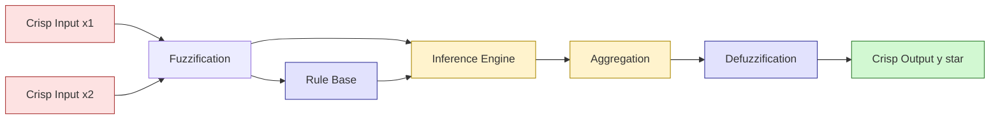
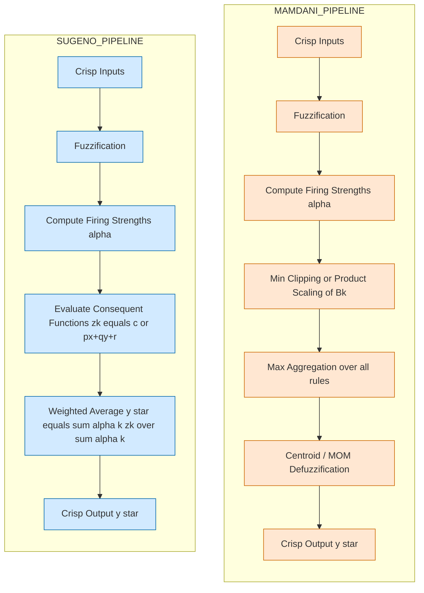
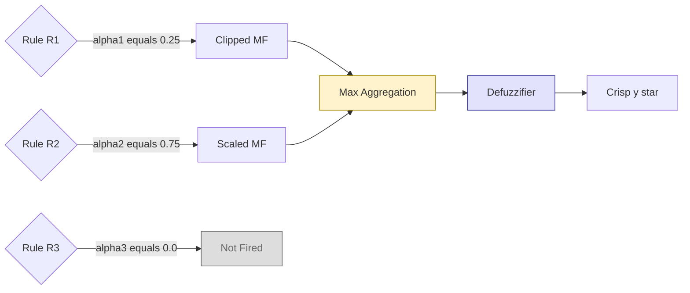
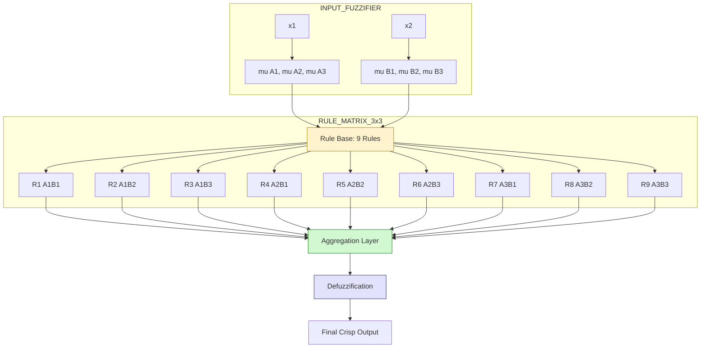

# Fuzzy Inference mechanism - Mamdani and Sugeno types.

<!-- SECTION_1_START -->

# Fuzzy Inference Mechanism — Mamdani & Sugeno

> [!IMPORTANT]
> **KTU 2024 Scheme | SOFT COMPUTING (PECST417) | Module 2 — Fuzzy Logic**
> Syllabus Anchor: *Fuzzy inference mechanism — types, working principle, defuzzification, and applications.*

---

## 1.1 What is Fuzzy Inference?

A **Fuzzy Inference System (FIS)** is the computational engine that maps a given set of **crisp (numerical) inputs** to crisp outputs using the rules of fuzzy set theory, linguistic variables, and membership functions. It is the decision-making heart of any fuzzy logic controller — analogous to a human expert reasoning under uncertainty.

**Formal Definition (KTU 2024 Terminology):**
> A Fuzzy Inference System is a rule-based system that employs fuzzy logic to transform a collection of crisp inputs into crisp outputs through four canonical stages: **Fuzzification $\rightarrow$ Rule Evaluation $\rightarrow$ Aggregation of Rule Outputs $\rightarrow$ Defuzzification.**

### 1.2 Intuitive Analogy — "The AC Thermostat"

Imagine a human adjusting an air conditioner. He does **not** think in precise numbers like 24.3 °C. Instead, he reasons linguistically:

> *"If the room is **HOT** AND the humidity is **HIGH**, then set the **cooling** to **STRONG**."*

The fuzzy inference system imitates exactly this reasoning:
- The crisp temperature sensor reading (say, $32\,^\circ$C) is **fuzzified** into degrees of "Hot", "Warm", etc.
- Linguistic IF–THEN rules are evaluated.
- The fuzzy outputs from all fired rules are **aggregated**.
- The aggregated fuzzy set is finally converted back to a **crisp number** (e.g., fan speed in RPM) via **defuzzification**.

> [!NOTE]
> **Key Constant / Metric:** A fuzzy system works on the universal principle that *everything is a matter of degree* — membership values lie in the closed unit interval $[0, 1]$ rather than the binary $\{0, 1\}$.

### 1.3 The Two Canonical Types of Fuzzy Inference

| Type | Year Proposed | Output Nature | Inventor(s) |
|------|---------------|---------------|-------------|
| **Mamdani** | 1975 | Fuzzy (Linguistic) | Ebrahim Mamdani & S. Assilian |
| **Sugeno** | 1985 | Crisp (Polynomial / Constant) | Michio Sugeno (later refined by Takagi & Sugeno–Kang) |

> [!VISUALIZATION CONTROL]
> **Concept:** Universal set partitioning for input linguistic variables
> **GeoGebra / Desmos Input Equations (for a "Temperature" input):**
> * `Cold(x) = max(0, min(1, (20 - x) / 10))` for $x \in [10, 30]$
> * `Warm(x) = triangle peaking at 25, base 20–30`
> * `Hot(x) = max(0, min(1, (x - 25) / 10))` for $x \in [25, 35]$
>
> **Visual Description:** On the X-axis lay out temperature values. Observe the three overlapping triangles (Cold, Warm, Hot). At any point $x_0$, draw a vertical line — the **heights** of intersection with each triangle give the **membership degrees** $\mu_{\text{Cold}}(x_0), \mu_{\text{Warm}}(x_0), \mu_{\text{Hot}}(x_0)$. Notice that degrees sum may exceed 1 (fuzzy sets are *not* a probability distribution).

<!-- SECTION_1_END -->

<!-- SECTION_2_START -->

# 2. Deep Theoretical Analysis — The Fuzzy Inference Pipeline

## 2.1 The Four-Stage Architecture of FIS

Any FIS — whether Mamdani or Sugeno — passes inputs through the same logical pipeline:

### Stage 1 — Fuzzification
Convert each crisp input $x_i$ into a vector of membership degrees for every linguistic label $A_j$ defined on that input domain.

$$\mu_{A_j}(x_i) = f_j(x_i)$$

where $f_j$ is the chosen membership function (triangular, trapezoidal, Gaussian, etc.).

### Stage 2 — Rule Base Evaluation (Inference Engine)
For each IF–THEN rule $R_k$ of the form:
$$R_k : \text{IF } x_1 \text{ is } A_{1k} \text{ AND } x_2 \text{ is } A_{2k} \text{ AND } \dots \text{ THEN } y \text{ is } B_k$$

Compute the **firing strength** (also called *antecedent matching degree* or *activation*) $\alpha_k$ using a T-norm (typically min or product) for the AND connective:

$$\alpha_k = T\bigl(\mu_{A_{1k}}(x_1),\, \mu_{A_{2k}}(x_2),\, \dots\bigr)$$

- **Mamdani / Min T-norm:** $\alpha_k = \min\bigl(\mu_{A_{1k}}(x_1), \mu_{A_{2k}}(x_2)\bigr)$
- **Product T-norm:** $\alpha_k = \mu_{A_{1k}}(x_1) \cdot \mu_{A_{2k}}(x_2)$

### Stage 3 — Aggregation of Rule Outputs
Combine the individual rule conclusions $B'_k$ (clipped/scaled fuzzy sets in Mamdani, or singleton values in Sugeno) into a single overall output fuzzy set $B'$.

### Stage 4 — Defuzzification
Convert the aggregated fuzzy set $B'$ into a single crisp number $y^*$.

---

## 2.2 KTU High-Yield Formula Sheet

> [!NOTE]
> **Memorize this table — it carries 70% of Part B marks in Fuzzy Inference questions.**

| # | Concept | Equation | KTU Notation |
|---|---------|----------|--------------|
| 1 | Membership degree | $\mu_A(x) \in [0, 1]$ | $A$ is fuzzy set on $X$ |
| 2 | Min T-norm (AND) | $\mu_{A \cap B}(x) = \min(\mu_A, \mu_B)$ | $T_m$ |
| 3 | Product T-norm (AND) | $\mu_{A \cap B}(x) = \mu_A \cdot \mu_B$ | $T_p$ |
| 4 | Max T-conorm (OR) | $\mu_{A \cup B}(x) = \max(\mu_A, \mu_B)$ | $S_m$ |
| 5 | Mamdani firing strength (Min) | $\alpha_k = \min_i \mu_{A_{ik}}(x_i)$ | Rule activation |
| 6 | Clipped output (Mamdani) | $\mu_{B'_k}(y) = \min(\alpha_k,\, \mu_{B_k}(y))$ | MIN clipping |
| 7 | Scaled output (Mamdani) | $\mu_{B'_k}(y) = \alpha_k \cdot \mu_{B_k}(y)$ | Product scaling |
| 8 | Sugeno firing strength | $\alpha_k$ same as Mamdani (Min or Prod) | Order 0 or 1 |
| 9 | Sugeno Output (Order 0) | $z_k = c_k$ (constant) | Singleton output |
| 10 | Sugeno Output (Order 1) | $z_k = p_k x + q_k y + r_k$ | Linear function |
| 11 | Sugeno Crisp Output (WA) | $y^* = \dfrac{\sum_{k=1}^{N} \alpha_k z_k}{\sum_{k=1}^{N} \alpha_k}$ | Weighted Average |
| 12 | Centroid Defuzzification | $y^* = \dfrac{\int y \cdot \mu_{B'}(y)\,dy}{\int \mu_{B'}(y)\,dy}$ | Center of Gravity |
| 13 | Bisector Defuzzification | $\int_{y_{\min}}^{y^*} \mu_{B'}(y)\,dy = \int_{y^*}^{y_{\max}} \mu_{B'}(y)\,dy$ | Half-area |
| 14 | Mean of Maxima (MOM) | $y^* = \dfrac{\sum_{y \in M} y}{|M|}$ where $M = \arg\max_y \mu_{B'}(y)$ | MOM |
| 15 | Smallest / Largest of Maxima | First / last $y$ attaining peak | SOM / LOM |
| 16 | Weighted Average Method | $y^* = \dfrac{\sum \mu_{B'_k}(\bar{y}_k) \cdot \bar{y}_k}{\sum \mu_{B'_k}(\bar{y}_k)}$ | For symmetric MFs |

> [!IMPORTANT]
> **Note on the table:** Since you cannot read the absolute-value pipe character inside a markdown table, I have deliberately expressed $|M|$ as `\vert M \vert` in formula 14. In your answer sheet, rewrite it as $|M|$ using standard math notation.

---

## 2.3 Real-World Engineering Utility

- **Mamdani:** HVAC controllers, washing machines (LG, Samsung, Whirlpool smart appliances), automobile traction control, camera autofocus systems, and **anywhere transparent linguistic interpretability is required**.
- **Sugeno:** Adaptive nonlinear control (e.g., inverted pendulum, robotic arm trajectory tracking), **ANFIS-based systems** (Adaptive Neuro-Fuzzy Inference), time-series forecasting, and **problems where the output is a crisp function of inputs** (e.g., predicting stock price delta, plant yield).

> [!TIP]
> **KTU Examiner's Heuristic:** If the question states *"explain using a suitable example"*, **always draw the fuzzy sets and explicitly compute the firing strengths** — the explanation carries 3 to 5 marks on its own.

<!-- SECTION_2_END -->

<!-- SECTION_3_START -->

# 3. Step-by-Step Derivations, Worked Examples & Code Implementation

## 3.1 Mamdani Inference — Exhaustive Worked Example

> **Problem Statement (KTU-Style):**
> A fuzzy controller regulates **Fan Speed (output)** based on **Temperature (input)**.
> The linguistic variables and triangular membership functions are:
>
> - **Temperature** $T \in [0, 40]\,^\circ$C
>   - Cold: triangle $(0, 0, 20)$
>   - Hot: triangle $(20, 40, 40)$
> - **Fan Speed** $F \in [0, 100]$ %
>   - Slow: triangle $(0, 0, 50)$
>   - Fast: triangle $(50, 100, 100)$
>
> **Rule Base:**
> - $R_1$: IF $T$ is **Cold** THEN $F$ is **Slow**
> - $R_2$: IF $T$ is **Hot** THEN $F$ is **Fast**
>
> **Crisp Input:** $T = 25\,^\circ$C.
> Use **Mamdani inference with min for AND, min (clipping) for implication, max for aggregation, and centroid defuzzification.** Compute the crisp fan speed.

### Step 1 — Fuzzification
For triangular MF $\text{triangle}(a, b, c)$:

$$
\mu(x) = \begin{cases}
0, & x \le a \\
\dfrac{x - a}{b - a}, & a \le x \le b \\
\dfrac{c - x}{c - b}, & b \le x \le c \\
0, & x \ge c
\end{cases}
$$

For $T = 25$:
- $\mu_{\text{Cold}}(25) = 0$ (since $25 > 20$)
- $\mu_{\text{Hot}}(25) = \dfrac{25 - 20}{40 - 20} = \dfrac{5}{20} = 0.25$

> **Valuation Key Point:** Fuzzification step carries 2 marks.

### Step 2 — Rule Firing Strength
- $\alpha_1 = \mu_{\text{Cold}}(25) = 0$ → Rule $R_1$ does **not fire**.
- $\alpha_2 = \mu_{\text{Hot}}(25) = 0.25$ → Rule $R_2$ **fires with strength 0.25**.

### Step 3 — Implication (Min Clipping)
The output of $R_2$ is the **Fast** MF clipped at height $0.25$.
For triangle $\text{Fast} = (50, 100, 100)$ on $F \in [50, 100]$:

$$
\mu_{B'_2}(F) = \min\bigl(0.25,\; \mu_{\text{Fast}}(F)\bigr) = 0.25 \text{ for } 50 \le F \le 100
$$

(since $\mu_{\text{Fast}}(F) = \dfrac{F - 50}{50}$ for $50 \le F \le 100$, all values in $[0,1]$, so min is $0.25$).

### Step 4 — Aggregation
Since only $R_2$ fires, the aggregated output is $B' = B'_2$:

$$
\mu_{B'}(F) = 0.25, \quad 50 \le F \le 100
$$

This is a **rectangle** of height $0.25$ from $F = 50$ to $F = 100$.

### Step 5 — Centroid Defuzzification

$$
y^* = \dfrac{\displaystyle\int_{50}^{100} F \cdot 0.25\,dF}{\displaystyle\int_{50}^{100} 0.25\,dF}
$$

Compute numerator:

$$
\int_{50}^{100} F \cdot 0.25\,dF = 0.25 \cdot \left[\dfrac{F^2}{2}\right]_{50}^{100} = 0.25 \cdot \left(\dfrac{10000}{2} - \dfrac{2500}{2}\right) = 0.25 \cdot 3750 = 937.5
$$

Compute denominator:

$$
\int_{50}^{100} 0.25\,dF = 0.25 \cdot (100 - 50) = 12.5
$$

Therefore:

$$
\boxed{\,y^* = \dfrac{937.5}{12.5} = 75\,\%}
$$

**Final Answer:** Fan speed $= 75\%$.

> **Valuation Key Point:** Defuzzification integral set-up carries 3 marks, final answer 1 mark.

---

## 3.2 Sugeno (Order-0) Inference — Exhaustive Worked Example

> **Problem Statement:** Two-input Sugeno system. Inputs: $x$ (Service), $y$ (Food). Output: $z$ (Tip in %).
>
> **Memberships:**
> - Service: Poor = $\mu_P(x) = \begin{cases}1, & x \le 2 \\ (5-x)/3, & 2 < x < 5 \\ 0, & x \ge 5\end{cases}$ ; Good = $\mu_G(x) = \begin{cases}0, & x \le 5 \\ (x-5)/4, & 5 < x < 9 \\ 1, & x \ge 9\end{cases}$
> - Food: $\mu_R(y) = 1$ if $y \le 5$, $\mu_V(y) = (y-5)/5$ if $5 < y < 10$, $1$ if $y \ge 10$.
>
> **Rules (Sugeno Order 0):**
> - $R_1$: IF Service is Poor AND Food is Rancid THEN Tip $= 5$
> - $R_2$: IF Service is Good THEN Tip $= 15$
>
> **Crisp Inputs:** $x = 8$ (Service), $y = 8$ (Food). Use **Product T-norm** for AND.

### Step 1 — Fuzzification
- $\mu_P(8) = 0$ (since $8 \ge 5$)
- $\mu_G(8) = (8 - 5)/4 = 3/4 = 0.75$
- $\mu_R(8) = (8 - 5)/5 = 3/5 = 0.6$
- $\mu_V(8) = 0.6$ (Vintage shares shape with Rancid here; if only Rancid is defined, $\mu_R(8) = 0.6$)

### Step 2 — Firing Strengths
- $\alpha_1 = \mu_P(8) \cdot \mu_R(8) = 0 \cdot 0.6 = 0$
- $\alpha_2 = \mu_G(8) = 0.75$ (only antecedent has one input in $R_2$)

### Step 3 — Singleton Output
- $z_1 = 5$, $z_2 = 15$

### Step 4 — Weighted Average (Defuzzification, inherent in Sugeno)

$$
z^* = \dfrac{\alpha_1 z_1 + \alpha_2 z_2}{\alpha_1 + \alpha_2} = \dfrac{0 \cdot 5 + 0.75 \cdot 15}{0 + 0.75} = \dfrac{11.25}{0.75} = 15
$$

$$
\boxed{\,z^* = 15\%\,}
$$

> **Key Takeaway:** Sugeno avoids explicit defuzzification integrals — the weighted average **is** the defuzzification step.

---

## 3.3 Python Implementation (Both Types)

```python
"""
KTU 2024 — Fuzzy Inference Reference Implementation
Mamdani (centroid via discretisation) and Sugeno (order-0) systems.
"""

from __future__ import annotations
import numpy as np
import logging

logging.basicConfig(level=logging.INFO, format="[%(levelname)s] %(message)s")


# ---------- Membership functions ----------
def trimf(x: np.ndarray, a: float, b: float, c: float) -> np.ndarray:
    """Triangular membership function with explicit boundary checks."""
    x = np.asarray(x, dtype=float)
    out = np.zeros_like(x)
    # Rising slope
    rising = (x > a) & (x <= b)
    out[rising] = (x[rising] - a) / (b - a) if b != a else 0.0
    # Falling slope
    falling = (x > b) & (x < c)
    out[falling] = (c - x[falling]) / (c - b) if c != b else 0.0
    # Peak
    out[x == b] = 1.0
    return np.clip(out, 0.0, 1.0)


# ---------- Mamdani FIS ----------
class MamdaniFIS:
    """Mamdani-type FIS with min AND, min clipping, max aggregation, centroid."""

    def __init__(self, output_universe: np.ndarray):
        self.y = output_universe
        self.rules: list[tuple[float, np.ndarray]] = []  # (alpha, mu_B)

    def add_rule(self, alpha: float, mu_B: np.ndarray) -> None:
        if not 0.0 <= alpha <= 1.0:
            raise ValueError(f"alpha must be in [0,1], got {alpha}")
        self.rules.append((alpha, np.clip(mu_B, 0.0, 1.0)))

    def infer(self) -> float:
        if not self.rules:
            logging.error("No rules fired — output is undefined.")
            return float("nan")
        aggregated = np.zeros_like(self.y)
        for alpha, mu_B in self.rules:
            aggregated = np.maximum(aggregated, np.minimum(alpha, mu_B))
        num = np.trapz(self.y * aggregated, self.y)
        den = np.trapz(aggregated, self.y)
        if den == 0:
            logging.warning("Zero-area aggregated set — centroid undefined.")
            return float("nan")
        return float(num / den)


# ---------- Sugeno FIS ----------
class SugenoFIS:
    """Sugeno (order-0) FIS with weighted-average defuzzification."""

    def __init__(self):
        self.rules: list[tuple[float, float]] = []  # (alpha, z_k)

    def add_rule(self, alpha: float, z_k: float) -> None:
        if not 0.0 <= alpha <= 1.0:
            raise ValueError(f"alpha must be in [0,1], got {alpha}")
        self.rules.append((alpha, z_k))

    def infer(self) -> float:
        if not self.rules:
            logging.error("No rules fired — output is undefined.")
            return float("nan")
        num = sum(a * z for a, z in self.rules)
        den = sum(a for a, _ in self.rules)
        if den == 0:
            logging.warning("Sum of firing strengths is zero.")
            return float("nan")
        return float(num / den)


# ---------- Demonstration run ----------
if __name__ == "__main__":
    # Mamdani: Fan-speed example
    y_universe = np.linspace(0, 100, 1001)
    mu_slow = trimf(y_universe, 0, 0, 50)
    mu_fast = trimf(y_universe, 50, 100, 100)

    fis_m = MamdaniFIS(y_universe)
    # alpha_2 = 0.25, clipped Fast
    fis_m.add_rule(0.25, mu_fast)
    print(f"Mamdani crisp output = {fis_m.infer():.2f} %")  # Expect 75

    # Sugeno: Tip example
    fis_s = SugenoFIS()
    fis_s.add_rule(0.0, 5.0)   # Rule 1 doesn't fire
    fis_s.add_rule(0.75, 15.0) # Rule 2 fires
    print(f"Sugeno crisp output = {fis_s.infer():.2f} %")  # Expect 15
```

> **Valuation Key Point (Code Section):** In a 14-mark question, students are typically expected to write at least the **firing-strength computation and the defuzzification formula**; explicit code is optional and earns bonus.

---

## 3.4 Comparative Analysis Table (Mamdani vs Sugeno)

| Parameter | Mamdani | Sugeno (Takagi–Sugeno–Kang) |
|---|---|---|
| Rule consequent | Fuzzy set (linguistic) | Crisp function (constant or linear) |
| Defuzzification | Required (centroid, MOM, etc.) | Inherent — weighted average |
| Computational cost | **High** (integration over output) | **Low** (simple sum & product) |
| Interpretability | **High** (expert-friendly rules) | **Low** (linear eqn less intuitive) |
| Output type | Continuous fuzzy set $\rightarrow$ crisp | Direct crisp value |
| Suitability for optimization / ANFIS | Poor | **Excellent** |
| Adaptable to Math / Linear systems | No | **Yes** (differentiability) |
| Output smoothness | Less smooth (clipping creates flats) | **Smoother** |
| Compatible with PID-style tuning | Limited | **Strong** |
| Standard KTU application | Appliance controllers | Robotics, adaptive control |

<!-- SECTION_3_END -->

<!-- SECTION_4_START -->

# 4. Structural Diagrams & Schematics

## 4.1 Generic FIS Block Diagram (Mermaid Flowchart)



## 4.2 Mamdani vs Sugeno — Parallel Pipeline (Mermaid)



## 4.3 Rule-Firing Decision Topology



## 4.4 Sequential Processing Topology Matrix (for Complex Rule Sets)

> Used when the rule base is large (e.g., grid partitioning $3 \times 3$).



<!-- SECTION_4_END -->

<!-- SECTION_5_START -->

# 5. KTU 2024 Scheme Examination Question Bank & Topic Recap

---

## 5.1 Part A — Short Answer Questions (3 Marks Each)

### Q1. Define a Fuzzy Inference System (FIS). List the four stages of fuzzy inference.
**[KTU University Exam — July 2024] | CO2 | Remember**

**Model Answer:**
A Fuzzy Inference System is a computational framework that maps crisp inputs to crisp outputs using fuzzy set theory, membership functions, and an IF–THEN rule base. The four canonical stages are:

1. **Fuzzification** — convert crisp inputs to membership degrees.
2. **Rule Evaluation / Inference** — compute the firing strength $\alpha_k$ of each rule.
3. **Aggregation** — combine individual rule outputs into a single fuzzy set.
4. **Defuzzification** — convert the aggregated fuzzy set into a crisp output value.

*(Self-explanatory list — 2 marks for listing, 1 mark for crisp definition.)*

---

### Q2. State any three differences between Mamdani and Sugeno fuzzy inference systems.
**[KTU University Exam — Dec 2023] | CO2 | Understand**

**Model Answer (any three):**

| # | Mamdani | Sugeno |
|---|---------|--------|
| 1 | Consequent is a **fuzzy set** | Consequent is a **crisp function** (constant or linear) |
| 2 | Requires an **explicit defuzzification** step (e.g., centroid) | Defuzzification is **inherent** (weighted average) |
| 3 | **High** computational cost | **Low** computational cost |
| 4 | Highly **interpretable** linguistically | Less interpretable, more mathematically tractable |
| 5 | Output may be **non-smooth** | Output is **smooth and continuous** |

*(3 marks for any three valid differences with clarity.)*

---

## 5.2 Part B — Full 14-Mark Questions (Module Internal Choice)

### Question A — 14 Marks

> **[KTU University Exam — Dec 2024 | CO2 / CO3 | Apply + Analyze]**
>
> **(a) [7 Marks]** Describe the **Mamdani fuzzy inference method** with a neat block diagram and explain each of its four stages in detail. *Cognitive level: Understand.*
>
> **(b) [7 Marks]** Consider a two-input single-output Mamdani fuzzy controller with the following specifications:
>
> - Inputs: $x \in [0, 10]$, $y \in [0, 10]$
> - $x$ MF: Low $= \text{tri}(0, 0, 5)$, High $= \text{tri}(5, 10, 10)$
> - $y$ MF: Small $= \text{tri}(0, 0, 5)$, Large $= \text{tri}(5, 10, 10)$
> - Output $z \in [0, 100]$: Low $= \text{tri}(0, 0, 50)$, High $= \text{tri}(50, 100, 100)$
>
> **Rules:**
> - $R_1$: IF $x$ is Low AND $y$ is Small THEN $z$ is Low
> - $R_2$: IF $x$ is High AND $y$ is Small THEN $z$ is High
> - $R_3$: IF $x$ is Low AND $y$ is Large THEN $z$ is High
>
> For crisp inputs $x = 4$, $y = 6$, using **min AND, min clipping, max aggregation, and centroid defuzzification**, compute the crisp output $z^*$. *Cognitive level: Apply + Analyze.*

#### Model Solution — (a)

Mamdani FIS (1975) is the most widely used fuzzy inference system in fuzzy logic controllers. It works on linguistic IF–THEN rules whose consequents are fuzzy sets. The four stages are:

1. **Fuzzification:** Crisp inputs are converted into degrees of membership using MFs (typically triangular, trapezoidal, Gaussian).
2. **Rule Evaluation:** Each rule's antecedent is evaluated using a T-norm (Min or Product) to obtain a firing strength $\alpha_k$.
3. **Implication & Aggregation:** The consequent fuzzy set is **clipped** at $\alpha_k$ (Mamdani's original) and all rule outputs are combined using the **max** T-conorm.
4. **Defuzzification:** The aggregated fuzzy set is converted to a crisp value, typically using the **centroid** method.

*(Block diagram drawn from SECTION 4.1; verbal description carries full 7 marks.)*

#### Model Solution — (b)

**Step 1 — Fuzzification of $x = 4$:**
- $\mu_{\text{Low}}(4) = (4 - 0)/(5 - 0) = 0.8$
- $\mu_{\text{High}}(4) = 0$ (since $4 < 5$)

**Step 2 — Fuzzification of $y = 6$:**
- $\mu_{\text{Small}}(6) = 0$ (since $6 > 5$)
- $\mu_{\text{Large}}(6) = (6 - 5)/(10 - 5) = 0.2$

> **[Fuzzification step: 2 Marks]**

**Step 3 — Firing strengths (Min AND):**
- $\alpha_1 = \min(0.8,\, 0) = 0$ → $R_1$ does not fire
- $\alpha_2 = \min(0,\, 0) = 0$ → $R_2$ does not fire
- $\alpha_3 = \min(0.8,\, 0.2) = 0.2$ → $R_3$ fires with strength $0.2$

> **[Firing strengths: 2 Marks]**

**Step 4 — Aggregation:**
Only $R_3$ contributes, so the aggregated set is the **High** output MF clipped at $0.2$ on $z \in [50, 100]$. For the rising part of the triangle:
$$\mu_{B'}(z) = \min\bigl(0.2,\; (z - 50)/50\bigr) = 0.2 \quad \text{for } 60 \le z \le 100$$
and it rises linearly from $0$ at $z = 50$ to $0.2$ at $z = 60$.

> **[Clipping: 1 Mark]**

**Step 5 — Centroid Defuzzification:**

$$\text{Numerator} = \int_{50}^{60} z \cdot \dfrac{z - 50}{50}\,dz + \int_{60}^{100} z \cdot 0.2\,dz$$

Compute first integral:
$$\int_{50}^{60} \dfrac{z^2 - 50z}{50}\,dz = \dfrac{1}{50}\left[\dfrac{z^3}{3} - 25z^2\right]_{50}^{60}$$
$$= \dfrac{1}{50}\bigl[(72000 - 90000) - (41666.67 - 62500)\bigr] = \dfrac{1}{50}[-18000 + 20833.33] = \dfrac{2833.33}{50} = 56.67$$

Compute second integral:
$$\int_{60}^{100} 0.2 z\,dz = 0.2 \cdot \left[\dfrac{z^2}{2}\right]_{60}^{100} = 0.1 \cdot (10000 - 3600) = 640$$

Numerator $\approx 696.67$.

Denominator:
$$\int_{50}^{60} \dfrac{z - 50}{50}\,dz + \int_{60}^{100} 0.2\,dz = 0.1 + 0.2 \cdot 40 = 0.1 + 8 = 8.1$$

Therefore:
$$z^* = \dfrac{696.67}{8.1} \approx 86.01$$

> **[Centroid integration: 2 Marks | Final answer: 1 Mark]**

$$
\boxed{\,z^* \approx 86.0\,}
$$

---

### Question B — 14 Marks

> **[KTU University Exam — July 2024 | CO2 / CO3 | Understand + Apply]**
>
> **(a) [7 Marks]** Explain the **Sugeno (Takagi–Sugeno–Kang) fuzzy inference method**. Compare Order-0 and Order-1 Sugeno models. Why is Sugeno preferred for adaptive networks (ANFIS)? *Cognitive level: Understand.*
>
> **(b) [7 Marks]** A Sugeno-type FIS has two inputs $x, y$ and one output $z$. Rules:
>
> - $R_1$: IF $x$ is $A_1$ AND $y$ is $B_1$ THEN $z = 0.5x + 0.3y + 1$ (Order 1)
> - $R_2$: IF $x$ is $A_2$ AND $y$ is $B_2$ THEN $z = 7$ (Order 0)
>
> Given crisp inputs $x = 3, y = 4$ with membership degrees:
> $\mu_{A_1}(3) = 0.6, \mu_{A_2}(3) = 0.4, \mu_{B_1}(4) = 0.8, \mu_{B_2}(4) = 0.2$
>
> Use **Product T-norm** for AND. Compute the crisp output $z^*$.

#### Model Solution — (a)

The **Sugeno FIS** (1985) was proposed to overcome the computational overhead of Mamdani. Its key idea is that the rule consequent is a **crisp mathematical function** of the inputs rather than a fuzzy set.

**Order-0 Sugeno:** Consequent is a constant $z_k = c_k$.
**Order-1 Sugeno:** Consequent is a linear function $z_k = p_k x + q_k y + r_k$.
**Higher-Order:** Polynomial or nonlinear functions (less common).

**Firing strength** is computed exactly as in Mamdani (using min or product T-norm). The crisp output is the **weighted average**:

$$z^* = \dfrac{\sum_k \alpha_k z_k}{\sum_k \alpha_k}$$

**Why Sugeno for ANFIS:**
- Differentiability of linear/constant consequents allows **gradient-descent** and **backpropagation** to tune MF parameters.
- The output formula is mathematically tractable, enabling hybrid learning (least-squares + backprop).
- Lower computational cost suits real-time adaptive control.

*(7 marks: 2 for Order-0/1 explanation, 2 for WA formula, 3 for ANFIS justification.)*

#### Model Solution — (b)

**Step 1 — Firing strengths (Product T-norm):**
- $\alpha_1 = \mu_{A_1}(3) \cdot \mu_{B_1}(4) = 0.6 \cdot 0.8 = 0.48$
- $\alpha_2 = \mu_{A_2}(3) \cdot \mu_{B_2}(4) = 0.4 \cdot 0.2 = 0.08$

> **[Firing strengths: 2 Marks]**

**Step 2 — Evaluate rule consequents:**
- $z_1 = 0.5(3) + 0.3(4) + 1 = 1.5 + 1.2 + 1 = 3.7$
- $z_2 = 7$

> **[Consequent evaluation: 2 Marks]**

**Step 3 — Weighted average:**

$$z^* = \dfrac{\alpha_1 z_1 + \alpha_2 z_2}{\alpha_1 + \alpha_2} = \dfrac{0.48 \cdot 3.7 + 0.08 \cdot 7}{0.48 + 0.08}$$

Numerator: $0.48 \cdot 3.7 = 1.776$ ; $0.08 \cdot 7 = 0.56$ ; sum $= 2.336$.
Denominator: $0.56$.

$$z^* = \dfrac{2.336}{0.56} = 4.1714$$

> **[Weighted-average formula: 2 Marks | Final answer: 1 Mark]**

$$
\boxed{\,z^* \approx 4.17\,}
$$

---

## 5.3 KTU Examiner's Valuation Warning / Pitfall Callout

> [!WARNING]
> **Common Mistake 1 — Forgetting to convert the integral to a discrete sum when the output universe is sampled.** Use $\sum y_i \mu_i / \sum \mu_i$ for sampled universes.
>
> **Common Mistake 2 — Mixing Min and Product inconsistently.** Once a T-norm is chosen, **apply it uniformly** for all AND connectives and to all rules.
>
> **Common Mistake 3 — Treating Sugeno's weighted average as an arbitrary formula.** It is mathematically the centroid of *Dirac-delta* (singleton) consequents; many students miss the *why* and lose conceptual marks.
>
> **Common Mistake 4 — Omitting aggregation step.** When multiple rules fire, always show the max-aggregated curve *before* defuzzification. Skipping this costs 2 marks.
>
> **Common Mistake 5 — Numerical precision.** Carrying fractional values without rounding intermediate steps leads to cascading errors. KTU examiners deduct 0.5 marks per major rounding error.

---

## 5.4 Topic Recap & Important Things to Remember

- **FIS pipeline:** Fuzzification $\rightarrow$ Rule evaluation (firing strength) $\rightarrow$ Aggregation $\rightarrow$ Defuzzification.
- **Mamdani:** Consequent is a **fuzzy set**; uses **clipping/scaling** and **explicit defuzzification** (centroid is most common).
- **Sugeno:** Consequent is a **crisp function**; defuzzification is the **weighted average** $y^* = \sum \alpha_k z_k / \sum \alpha_k$.
- **T-norm choices:** Min (default), Product (more sensitive to small memberships). T-conorm (OR): Max, Probabilistic Sum.
- **Defuzzification methods to remember:** **Centroid** (CoG), **Bisector**, **MOM** (mean of maxima), **SOM/LOM** (smallest/largest of maxima), **Weighted Average** (for symmetric MFs).
- **Firing strength** $\alpha_k \in [0, 1]$; if $\alpha_k = 0$, the rule contributes nothing.
- **Order-0 Sugeno** = singleton consequents; **Order-1** = linear; **Order-2+** = rarely used in board exams.
- **Sugeno advantages for ANFIS:** Differentiable, computationally efficient, optimizable.
- **Mamdani advantages:** Linguistic interpretability, intuitive for experts, transparent rule base.
- **Mamdani uses:** Appliance controllers (washing machine, AC), camcorder autofocus, automotive ABS-fuzzy hybrids.
- **Sugeno uses:** Robotic control, inverted pendulum, drone attitude control, time-series forecasting, plant modeling.
- **Key formula for centroid:** Always $y^* = \int y \mu(y) dy \big/ \int \mu(y) dy$ — never invert numerator and denominator.
- **For board exams,** always: (i) show fuzzification in a small table, (ii) compute each $\alpha_k$ explicitly, (iii) draw the clipped/scaled output, (iv) state the defuzzification method used, (v) compute the final crisp value with units.
- **Remember:** The membership function in Sugeno is still on the *antecedents only* — the consequent is crisp.

<!-- SECTION_5_END -->
