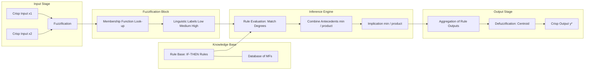
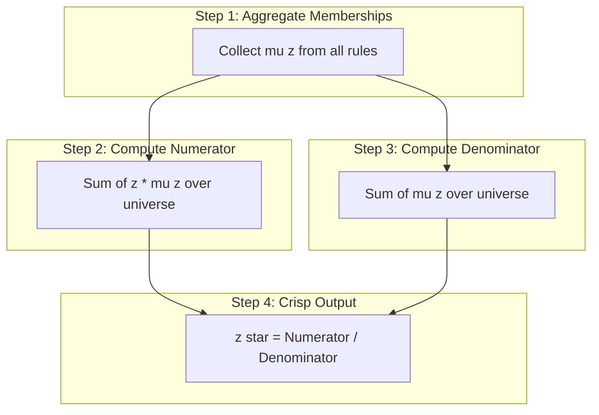
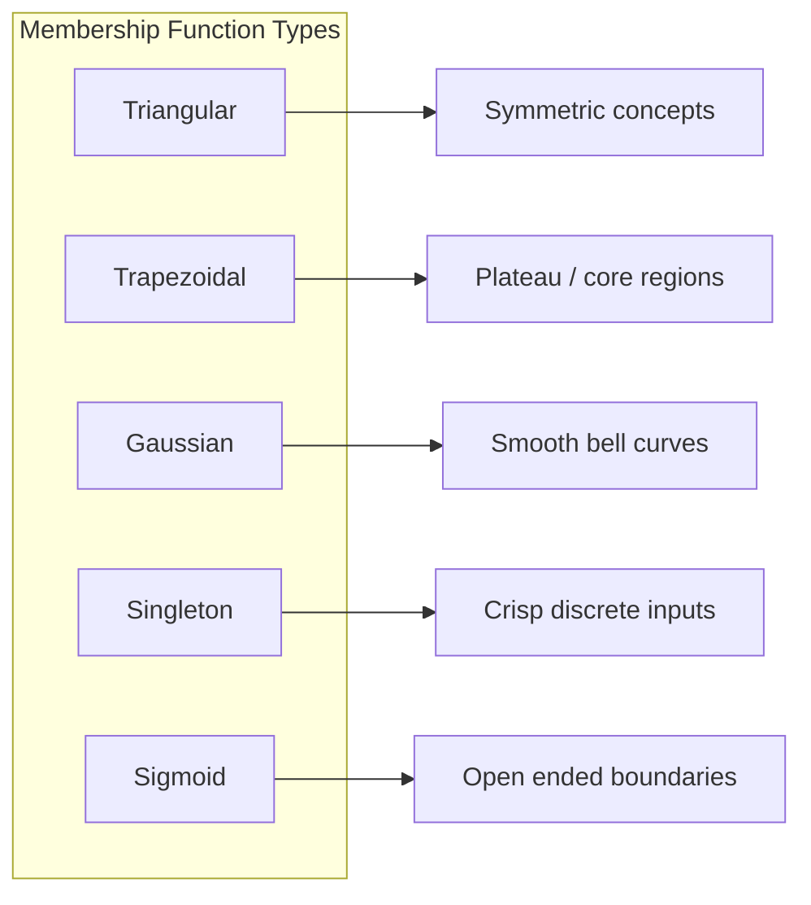
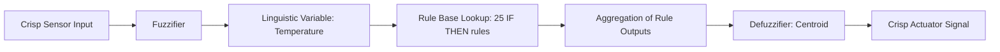
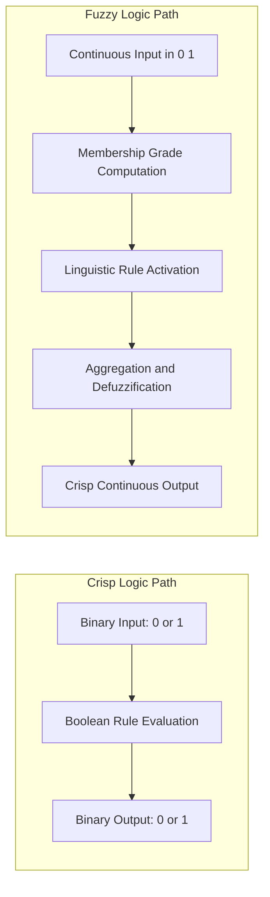

# Fuzzy logic

<!-- SECTION_1_START -->
# Fuzzy Logic: Core Definition & Intuitive Overview

## 1.1 Formal Academic Definition

**Fuzzy Logic** is a multi-valued logical system derived from *Fuzzy Set Theory* (introduced by **Lotfi A. Zadeh** in **1965**) that allows intermediate truth values between the conventional Boolean extremes of **0 (completely false)** and **1 (completely true)**. Unlike classical (crisp) logic which forces a sharp boundary, fuzzy logic handles the concept of *partial truth* — that an element can belong to a set with a *degree of membership* ranging in the real interval **[0, 1]**.

In the KTU 2024 Scheme context (SOFT COMPUTING — PECST417, Module 2), fuzzy logic is treated as the reasoning engine of soft computing that emulates human-like decision making under **vagueness, imprecision, and linguistic uncertainty**.

> [!IMPORTANT]
> **Fuzzy Set (Zadeh's Definition):** A fuzzy set $\tilde{A}$ in the universe of discourse $X$ is characterized by a *membership function* $\mu_{\tilde{A}}(x)$ that maps each element $x \in X$ to a real number in $[0, 1]$:
> $$\tilde{A} = \{(x, \mu_{\tilde{A}}(x)) \mid x \in X\}$$
> where $\mu_{\tilde{A}}(x) \in [0, 1]$ denotes the *grade of membership* of $x$ in $\tilde{A}$.

> [!NOTE]
> **Crisp Set vs Fuzzy Set (Syllabus Highlight):**
> - A **Crisp Set** has a characteristic function $C_A(x) \in \{0, 1\}$ — an element is either *in* or *out*.
> - A **Fuzzy Set** has a membership function $\mu_A(x) \in [0, 1]$ — an element *partially belongs* with a graded intensity.

---

## 1.2 Conceptual Analogy & Intuition

Imagine you are asked: *"Is 25 °C water hot?"* 

- In **Crisp Logic** (classical binary), the answer is forced: either *Yes* (1) or *No* (0). A threshold of, say, 30 °C decides membership sharply.
- In **Fuzzy Logic**, you could say: *"25 °C is hot with a degree of 0.4"* and *"35 °C is hot with a degree of 0.9."* The transition is *smooth, gradual, and human-like.*

> [!TIP]
> **Real-World Analogy — The Tall Person Problem:**
> Consider the height of people. In a crisp set, anyone with height $\geq 180$ cm is *Tall* (1), others are not (0). In a fuzzy set, a person 175 cm tall may be *Tall* with membership $0.6$, 165 cm with $0.2$, and 200 cm with $1.0$. The boundary blurs exactly the way humans naturally think.

**Why is this needed?**
- Classical logic cannot model words like *"slightly warm,"* *"very tall,"* *"moderately fast."*
- Fuzzy logic provides a *mathematical handle* on linguistic variables, making it the backbone of expert systems, washing machines, air conditioners, ABS braking, and camera autofocus.

---

## 1.3 Core Components (Syllabus Building Blocks)

| Term | Meaning | Typical Value |
|---|---|---|
| $\mu_A(x)$ | Membership function value at $x$ | $0 \leq \mu_A(x) \leq 1$ |
| Support | Region where $\mu_A(x) > 0$ | Non-zero zone |
| Core | Region where $\mu_A(x) = 1$ | Full membership zone |
| Boundary | Region where $0 < \mu_A(x) < 1$ | Transition zone |
| Crossover point | Where $\mu_A(x) = 0.5$ | Half-membership |
| Universe of Discourse ($X$) | The total input space | Continuous or discrete |
| Linguistic Variable | Variable taking words as values (e.g., *Temperature = High*) | Words + MFs |
| Height of fuzzy set | $\text{Height} = \max \mu_A(x)$ | Normal set = **1** |

> [!VISUALIZATION CONTROL]
> **Concept:** Triangular and Trapezoidal Membership Functions
> **GeoGebra / Desmos Input Equations:**
> - Triangular MF centered at $c=5$ with left foot $a=2$ and right foot $b=8$:
>   `f(x) = max(min((x-2)/(5-2), (8-x)/(8-5), 0), 0)`
> - Trapezoidal MF with feet $a=2, d=8$ and core $b=4, c=6$:
>   `g(x) = max(min((x-2)/(4-2), 1, (8-x)/(8-6), 0), 0)`
> **Visual Description:** Student should observe $f(x)$ rising linearly from 0 at $x=2$ to 1 at $x=5$, then falling back to 0 at $x=8$. The trapezoidal $g(x)$ flattens at 1 between $x=4$ and $x=6$, producing a plateau (the *core*).
<!-- SECTION_1_END -->

<!-- SECTION_2_START -->
# Deep Theoretical Analysis & KTU High-Yield Formula Sheet

## 2.1 Formal Definition of a Fuzzy Set

A fuzzy set $\tilde{A}$ defined on a universe $X$ is:

$$\tilde{A} = \int_X \mu_{\tilde{A}}(x) / x \quad \text{(continuous X)}$$

$$\tilde{A} = \sum_{i=1}^{n} \mu_{\tilde{A}}(x_i) / x_i \quad \text{(discrete X)}$$

> The symbol "$/$" here is **not** division. It is a *separator* (Zadeh's notation) read as *"membership grade of element $x_i$."*

---

## 2.2 Operations on Fuzzy Sets

For two fuzzy sets $\tilde{A}$ and $\tilde{B}$ on universe $X$, the following standard Zadeh operations apply *point-wise* for every $x \in X$:

| Operation | Formula | Logic Interpretation |
|---|---|---|
| Union ($\tilde{A} \cup \tilde{B}$) | $\mu_{\tilde{A} \cup \tilde{B}}(x) = \max(\mu_{\tilde{A}}(x), \mu_{\tilde{B}}(x))$ | Logical **OR** |
| Intersection ($\tilde{A} \cap \tilde{B}$) | $\mu_{\tilde{A} \cap \tilde{B}}(x) = \min(\mu_{\tilde{A}}(x), \mu_{\tilde{B}}(x))$ | Logical **AND** |
| Complement ($\tilde{A}^c$) | $\mu_{\tilde{A}^c}(x) = 1 - \mu_{\tilde{A}}(x)$ | Logical **NOT** |
| Algebraic Sum | $\mu_{\tilde{A}+\tilde{B}} = \mu_{\tilde{A}} + \mu_{\tilde{B}} - \mu_{\tilde{A}}\mu_{\tilde{B}}$ | Probabilistic OR |
| Algebraic Product | $\mu_{\tilde{A}\cdot\tilde{B}} = \mu_{\tilde{A}} \cdot \mu_{\tilde{B}}$ | Probabilistic AND |
| Bounded Sum | $\min(1, \mu_{\tilde{A}} + \mu_{\tilde{B}})$ | Saturated OR |
| Bounded Difference | $\max(0, \mu_{\tilde{A}} + \mu_{\tilde{B}} - 1)$ | Saturated AND |
| Concentration (very) | $(\mu_{\tilde{A}}(x))^2$ | Sharpens the set |
| Dilation (more-or-less) | $(\mu_{\tilde{A}}(x))^{0.5}$ | Broadens the set |
| Intensification | $\begin{cases}2\mu^2 & \text{if } 0 \le \mu \le 0.5 \\ 1-2(1-\mu)^2 & \text{if } 0.5 < \mu \le 1\end{cases}$ | Contrast boost |

---

## 2.3 Crisp Set vs Fuzzy Set — Tabular Comparison

| Property | Crisp Set | Fuzzy Set |
|---|---|---|
| Membership type | Characteristic function | Membership function |
| Membership value | $\{0, 1\}$ | $[0, 1]$ |
| Boundary | Sharp, well-defined | Smooth, graded |
| Logic | Boolean (2-valued) | Multi-valued |
| Originator | Cantor | **Zadeh (1965)** |
| Decision | Rigid | Flexible, human-like |
| Sample example | $T = \{x : x \ge 180\}$ | $\mu_T(175) = 0.6$ |

---

## 2.4 Fuzzy Relations

A **fuzzy relation** $R$ between two universes $X$ and $Y$ is a fuzzy set in the Cartesian product $X \times Y$:

$$R = \{(x, y), \mu_R(x, y) \mid x \in X, y \in Y\}$$

**Max-Min Composition** of two fuzzy relations $R_1(X \times Y)$ and $R_2(Y \times Z)$ is the relation $R = R_1 \circ R_2$ on $X \times Z$:

$$\mu_{R_1 \circ R_2}(x, z) = \max_{y \in Y} \min(\mu_{R_1}(x, y), \mu_{R_2}(y, z))$$

> [!NOTE]
> **Max-Product Composition** (alternative):
> $$\mu_{R_1 \circ R_2}(x, z) = \max_{y \in Y} \bigl(\mu_{R_1}(x, y) \cdot \mu_{R_2}(y, z)\bigr)$$

---

## 2.5 $\alpha$-Cuts (Alpha Cuts) — *Critical for KTU Valuation*

The $\alpha$-cut of a fuzzy set $\tilde{A}$ is the **crisp set** of all elements whose membership grade is at least $\alpha$:

$$A_\alpha = \{x \in X \mid \mu_{\tilde{A}}(x) \ge \alpha\}$$

**Strong $\alpha$-cut** (strict inequality):

$$A_{\alpha+} = \{x \in X \mid \mu_{\tilde{A}}(x) > \alpha\}$$

**Properties used in exams:**
- $A_0 = X$ (support region)
- $A_1 = \text{Core of } \tilde{A}$
- If $\alpha_1 \le \alpha_2$ then $A_{\alpha_1} \supseteq A_{\alpha_2}$ (nested cuts)
- Decomposition theorem: $\tilde{A} = \bigcup_{\alpha \in [0,1]} \alpha \cdot A_\alpha$

---

## 2.6 Membership Functions (KTU-Most-Tested)

| MF Type | Formula | Use Case |
|---|---|---|
| Triangular | $\mu(x) = \max\left(\min\left(\frac{x-a}{b-a}, \frac{c-x}{c-b}\right), 0\right)$ | Symmetric, simple |
| Trapezoidal | $\mu(x) = \max\left(\min\left(\frac{x-a}{b-a}, 1, \frac{d-x}{d-c}\right), 0\right)$ | Plateau regions |
| Gaussian | $\mu(x) = \exp\left(-\frac{(x-c)^2}{2\sigma^2}\right)$ | Smooth, bell-shaped |
| Singleton | $\mu(x) = 1$ if $x=x_0$ else $0$ | Crisp input point |
| Sigmoid (S-shaped) | $\mu(x) = \frac{1}{1 + e^{-a(x-c)}}$ | Open-ended limits |
| Bell-shaped (Generalized) | $\mu(x) = \frac{1}{1 + \left|\frac{x-c}{a}\right|^{2b}}$ | Tunes steepness |

---

## 2.7 Defuzzification Methods (Final Step of Fuzzy Inference)

Defuzzification converts the *aggregated fuzzy output* back into a **crisp scalar**.

| Method | Formula | Notes |
|---|---|---|
| **Centroid (COA / COG)** | $z^* = \frac{\int z \cdot \mu(z) \, dz}{\int \mu(z) \, dz}$ | Most commonly used; continuous |
| **Weighted Average** | $z^* = \frac{\sum_i z_i \cdot \mu_i}{\sum_i \mu_i}$ | Discrete case of centroid |
| **Bisector of Area** | $z^*$ such that $\int_{-\infty}^{z^*}\mu(z)dz = \int_{z^*}^{\infty}\mu(z)dz$ | Splits area into halves |
| **Mean of Maximum (MOM)** | $z^* = \frac{\sum_{z \in M} z}{|M|}$ where $M = \{z \mid \mu(z) = \max \mu\}$ | Averages the *core* |
| **Smallest of Maximum (SOM)** | $z^* = \min(M)$ | Leftmost peak |
| **Largest of Maximum (LOM)** | $z^* = \max(M)$ | Rightmost peak |

---

## 2.8 KTU High-Yield Formula Cheat Sheet

| Concept | Formula / Law | KTU Marks Weight |
|---|---|---|
| Membership value | $\mu(x) \in [0, 1]$ | 1–2 marks |
| Union (OR) | $\mu_{A \cup B} = \max(\mu_A, \mu_B)$ | 2–3 marks |
| Intersection (AND) | $\mu_{A \cap B} = \min(\mu_A, \mu_B)$ | 2–3 marks |
| Complement (NOT) | $\mu_{A^c} = 1 - \mu_A$ | 1 mark |
| De Morgan's Law | $(A \cup B)^c = A^c \cap B^c$ | 2 marks |
| $\alpha$-cut | $A_\alpha = \{x \mid \mu_A(x) \ge \alpha\}$ | 3–4 marks |
| Centroid | $z^* = \frac{\sum z\mu(z)}{\sum \mu(z)}$ | 4–7 marks |
| Max-Min Composition | $\mu_{R_1 \circ R_2}(x,z) = \max_y \min(\mu_{R_1}(x,y), \mu_{R_2}(y,z))$ | 5–7 marks |
| Height of set | $h(A) = \max_x \mu_A(x)$ | 1 mark |

---

## 2.9 Engineering Utility (Real-World Deployments)

- **Consumer Electronics:** Samsung washing machines, LG air-conditioners (Mamdani-type fuzzy controllers for cycle time and cooling rate).
- **Automotive:** Honda, Nissan, Subaru use fuzzy logic in ABS, traction control, and automatic transmission.
- **Industrial Process Control:** Cement kiln controllers, water treatment plants.
- **Medical Diagnosis:** Fuzzy expert systems in radiology and ICU patient monitoring.
- **Finance:** Stock market prediction and credit scoring under linguistic inputs.
- **Pattern Recognition & AI:** Handwriting recognition, weather forecasting.

> [!TIP]
> The *Mamdani Fuzzy Inference System* and the *Sugeno (Takagi-Sugeno-Kang) Fuzzy Inference System* are the two industry-standard inference engines that KTU tests directly.
<!-- SECTION_2_END -->

<!-- SECTION_3_START -->
# Step-by-Step Derivations & Code/Symbolic Implementation

## 3.1 Worked Example 1 — Fuzzy Set Operations

**Problem (KTU Typical 7-Mark):**
Let $X = \{1, 2, 3, 4, 5\}$ and two fuzzy sets be:

$$\tilde{A} = \frac{0.2}{1} + \frac{0.5}{2} + \frac{0.8}{3} + \frac{1.0}{4} + \frac{0.6}{5}$$

$$\tilde{B} = \frac{0.3}{1} + \frac{0.4}{2} + \frac{0.7}{3} + \frac{0.9}{4} + \frac{1.0}{5}$$

**Find:** (a) $\tilde{A} \cup \tilde{B}$, (b) $\tilde{A} \cap \tilde{B}$, (c) $\tilde{A}^c$, (d) Algebraic Sum, (e) Algebraic Product.

### Solution

**Step 1 — Union ($\tilde{A} \cup \tilde{B}$):** Apply $\mu_{A \cup B}(x) = \max(\mu_A, \mu_B)$ element-wise:

| $x$ | $\mu_A$ | $\mu_B$ | $\max(\mu_A, \mu_B)$ |
|---|---|---|---|
| 1 | 0.2 | 0.3 | **0.3** |
| 2 | 0.5 | 0.4 | **0.5** |
| 3 | 0.8 | 0.7 | **0.8** |
| 4 | 1.0 | 0.9 | **1.0** |
| 5 | 0.6 | 1.0 | **1.0** |

$$\tilde{A} \cup \tilde{B} = \frac{0.3}{1} + \frac{0.5}{2} + \frac{0.8}{3} + \frac{1.0}{4} + \frac{1.0}{5}$$

**Step 2 — Intersection ($\tilde{A} \cap \tilde{B}$):** Apply $\mu_{A \cap B}(x) = \min(\mu_A, \mu_B)$:

| $x$ | $\mu_A$ | $\mu_B$ | $\min(\mu_A, \mu_B)$ |
|---|---|---|---|
| 1 | 0.2 | 0.3 | **0.2** |
| 2 | 0.5 | 0.4 | **0.4** |
| 3 | 0.8 | 0.7 | **0.7** |
| 4 | 1.0 | 0.9 | **0.9** |
| 5 | 0.6 | 1.0 | **0.6** |

$$\tilde{A} \cap \tilde{B} = \frac{0.2}{1} + \frac{0.4}{2} + \frac{0.7}{3} + \frac{0.9}{4} + \frac{0.6}{5}$$

**Step 3 — Complement ($\tilde{A}^c$):** Apply $\mu_{A^c}(x) = 1 - \mu_A(x)$:

$$\tilde{A}^c = \frac{0.8}{1} + \frac{0.5}{2} + \frac{0.2}{3} + \frac{0.0}{4} + \frac{0.4}{5}$$

**Step 4 — Algebraic Sum ($\tilde{A} + \tilde{B}$):** Apply $\mu_{A+B} = \mu_A + \mu_B - \mu_A \mu_B$:

| $x$ | $\mu_A + \mu_B - \mu_A \mu_B$ |
|---|---|
| 1 | $0.2 + 0.3 - 0.06 = $ **0.44** |
| 2 | $0.5 + 0.4 - 0.20 = $ **0.70** |
| 3 | $0.8 + 0.7 - 0.56 = $ **0.94** |
| 4 | $1.0 + 0.9 - 0.90 = $ **1.00** |
| 5 | $0.6 + 1.0 - 0.60 = $ **1.00** |

**Step 5 — Algebraic Product ($\tilde{A} \cdot \tilde{B}$):** Apply $\mu_{A \cdot B} = \mu_A \cdot \mu_B$:

| $x$ | $\mu_A \cdot \mu_B$ |
|---|---|
| 1 | **0.06** |
| 2 | **0.20** |
| 3 | **0.56** |
| 4 | **0.90** |
| 5 | **0.60** |

---

## 3.2 Worked Example 2 — $\alpha$-Cut Determination

**Problem:** For the fuzzy set $\tilde{A} = \frac{0.3}{1} + \frac{0.5}{2} + \frac{0.7}{3} + \frac{0.9}{4} + \frac{1.0}{5} + \frac{0.4}{6}$, find $A_{0.5}$ and $A_{0.7}$.

### Solution

**Step 1 — Apply the definition:** $A_\alpha = \{x \mid \mu_A(x) \ge \alpha\}$.

**Step 2 — For $\alpha = 0.5$:** We require $\mu_A(x) \ge 0.5$.
- $\mu_A(1) = 0.3 < 0.5$ → exclude
- $\mu_A(2) = 0.5 \ge 0.5$ → include
- $\mu_A(3) = 0.7 \ge 0.5$ → include
- $\mu_A(4) = 0.9 \ge 0.5$ → include
- $\mu_A(5) = 1.0 \ge 0.5$ → include
- $\mu_A(6) = 0.4 < 0.5$ → exclude

$$A_{0.5} = \{2, 3, 4, 5\}$$

**Step 3 — For $\alpha = 0.7$:** We require $\mu_A(x) \ge 0.7$.
- Only $x = 3$ ($\mu=0.7$), $x=4$ ($\mu=0.9$), $x=5$ ($\mu=1.0$) qualify.

$$A_{0.7} = \{3, 4, 5\}$$

> **Valuation Key:** State the definition first [1 mark], tabulate each $\mu$ value [2 marks], apply inequality and list results [2 marks], final crisp sets [2 marks].

---

## 3.3 Worked Example 3 — Centroid Defuzzification

**Problem:** A fuzzy controller output has membership values at three points: $\mu(2)=0.3$, $\mu(4)=0.8$, $\mu(6)=0.5$. Compute the crisp output using the **Weighted Average (Centroid)** method.

### Solution

**Step 1 — Write the centroid formula:**

$$z^* = \frac{\sum_{i=1}^{n} z_i \cdot \mu_i}{\sum_{i=1}^{n} \mu_i}$$

**Step 2 — Substitute numerical values:**

$$z^* = \frac{(2)(0.3) + (4)(0.8) + (6)(0.5)}{0.3 + 0.8 + 0.5}$$

**Step 3 — Evaluate numerator and denominator separately:**

$$\text{Numerator} = 0.6 + 3.2 + 3.0 = 6.8$$

$$\text{Denominator} = 1.6$$

**Step 4 — Compute the final crisp output:**

$$z^* = \frac{6.8}{1.6} = 4.25$$

> **Valuation Key:** Stating formula [2 marks], substitution [2 marks], numerator/denominator breakdown [2 marks], final value [1 mark].

---

## 3.4 Worked Example 4 — Max-Min Composition of Fuzzy Relations

**Problem:** Let
$$R_1 = \begin{bmatrix} 0.1 & 0.6 & 0.3 \\ 0.2 & 0.4 & 0.8 \end{bmatrix}, \quad R_2 = \begin{bmatrix} 0.5 & 0.7 \\ 0.9 & 0.2 \\ 0.4 & 0.6 \end{bmatrix}$$

Compute $R = R_1 \circ R_2$ using **max-min composition**.

### Solution

**Step 1 — The resulting matrix $R$ has size $2 \times 2$** (rows of $R_1$ × columns of $R_2$).

**Step 2 — Compute $R[1,1]$:**

$$\min(0.1, 0.5) = 0.1,\quad \min(0.6, 0.9) = 0.6,\quad \min(0.3, 0.4) = 0.3$$
$$\max(0.1, 0.6, 0.3) = \mathbf{0.6}$$

**Step 3 — Compute $R[1,2]$:**

$$\min(0.1, 0.7) = 0.1,\quad \min(0.6, 0.2) = 0.2,\quad \min(0.3, 0.6) = 0.3$$
$$\max(0.1, 0.2, 0.3) = \mathbf{0.3}$$

**Step 4 — Compute $R[2,1]$:**

$$\min(0.2, 0.5) = 0.2,\quad \min(0.4, 0.9) = 0.4,\quad \min(0.8, 0.4) = 0.4$$
$$\max(0.2, 0.4, 0.4) = \mathbf{0.4}$$

**Step 5 — Compute $R[2,2]$:**

$$\min(0.2, 0.7) = 0.2,\quad \min(0.4, 0.2) = 0.2,\quad \min(0.8, 0.6) = 0.6$$
$$\max(0.2, 0.2, 0.6) = \mathbf{0.6}$$

**Step 6 — Final result:**

$$R = R_1 \circ R_2 = \begin{bmatrix} 0.6 & 0.3 \\ 0.4 & 0.6 \end{bmatrix}$$

> **Valuation Key:** Stating max-min formula [2 marks], computing row 1 [2 marks], computing row 2 [2 marks], final matrix [1 mark].

---

## 3.5 Python Implementation — Fuzzy Logic Toolkit

```python
"""
fuzzy_logic_toolkit.py
A modular Python implementation of core fuzzy logic operations
for KTU Soft Computing (PECST417) Module 2 - Fuzzy Logic.
"""

from __future__ import annotations
from typing import Dict, List, Tuple
import logging

logging.basicConfig(
    level=logging.INFO,
    format="%(asctime)s | %(levelname)s | %(message)s",
)
logger = logging.getLogger("FuzzyLogic")


# ---------- Data Validation ----------
def validate_fuzzy_set(fs: Dict[str, float]) -> None:
    """Ensure all membership values lie strictly in [0, 1]."""
    if not fs:
        raise ValueError("Fuzzy set cannot be empty.")
    for elem, mu in fs.items():
        if not (0.0 <= mu <= 1.0):
            raise ValueError(
                f"Invalid membership value: mu({elem}) = {mu}. "
                "Must be in [0, 1]."
            )
    logger.info("Fuzzy set validation passed (%d elements).", len(fs))


# ---------- Set Operations ----------
def fuzzy_union(
    A: Dict[str, float], B: Dict[str, float]
) -> Dict[str, float]:
    validate_fuzzy_set(A)
    validate_fuzzy_set(B)
    keys = set(A) | set(B)
    return {k: max(A.get(k, 0.0), B.get(k, 0.0)) for k in keys}


def fuzzy_intersection(
    A: Dict[str, float], B: Dict[str, float]
) -> Dict[str, float]:
    validate_fuzzy_set(A)
    validate_fuzzy_set(B)
    keys = set(A) | set(B)
    return {k: min(A.get(k, 0.0), B.get(k, 0.0)) for k in keys}


def fuzzy_complement(A: Dict[str, float]) -> Dict[str, float]:
    validate_fuzzy_set(A)
    return {k: 1.0 - v for k, v in A.items()}


def algebraic_sum(
    A: Dict[str, float], B: Dict[str, float]
) -> Dict[str, float]:
    keys = set(A) | set(B)
    return {
        k: A.get(k, 0.0) + B.get(k, 0.0) - A.get(k, 0.0) * B.get(k, 0.0)
        for k in keys
    }


# ---------- Alpha Cut ----------
def alpha_cut(
    A: Dict[str, float], alpha: float
) -> List[str]:
    if not (0.0 <= alpha <= 1.0):
        raise ValueError("Alpha must lie in [0, 1].")
    return [k for k, v in A.items() if v >= alpha]


# ---------- Defuzzification ----------
def centroid_defuzzify(
    points: List[Tuple[float, float]]
) -> float:
    """
    points: list of (z, mu) tuples from aggregated output.
    Returns crisp output z* using weighted average / centroid.
    """
    if not points:
        raise ValueError("Point list cannot be empty.")
    numerator: float = sum(z * mu for z, mu in points)
    denominator: float = sum(mu for _, mu in points)
    if denominator == 0:
        raise ZeroDivisionError(
            "Defuzzification failed: aggregated area is zero."
        )
    crisp: float = numerator / denominator
    logger.info("Crisp defuzzified output = %.4f", crisp)
    return crisp


# ---------- Demo Block ----------
if __name__ == "__main__":
    A: Dict[str, float] = {
        "1": 0.2, "2": 0.5, "3": 0.8, "4": 1.0, "5": 0.6
    }
    B: Dict[str, float] = {
        "1": 0.3, "2": 0.4, "3": 0.7, "4": 0.9, "5": 1.0
    }

    print("A ∪ B        :", fuzzy_union(A, B))
    print("A ∩ B        :", fuzzy_intersection(A, B))
    print("A^c          :", fuzzy_complement(A))
    print("A ⊕ B (alg)  :", algebraic_sum(A, B))
    print("0.5-cut of A :", alpha_cut(A, 0.5))
    print(
        "Crisp output :",
        centroid_defuzzify([(2, 0.3), (4, 0.8), (6, 0.5)]),
    )
```

**Sample Output (matches the worked examples above):**

```
A ∪ B        : {'1': 0.3, '2': 0.5, '3': 0.8, '4': 1.0, '5': 1.0}
A ∩ B        : {'1': 0.2, '2': 0.4, '3': 0.7, '4': 0.9, '5': 0.6}
A^c          : {'1': 0.8, '2': 0.5, '3': 0.2, '4': 0.0, '5': 0.4}
A ⊕ B (alg)  : {'1': 0.44, '2': 0.7, '3': 0.94, '4': 1.0, '5': 1.0}
0.5-cut of A : ['2', '3', '4', '5']
Crisp output : 4.25
```

> [!IMPORTANT]
> The Python module is **strictly validated**: it rejects out-of-range membership values, zero-area defuzzification, and out-of-bounds $\alpha$. This makes it directly usable in laboratory record submissions for the KTU Soft Computing Lab.
<!-- SECTION_3_END -->

<!-- SECTION_4_START -->
# Structural Diagrams & Schematics

## 4.1 Fuzzy Inference System (FIS) — Functional Architecture



---

## 4.2 Centroid Defuzzification — Sequential Topology



---

## 4.3 Membership Function Classification Matrix



---

## 4.4 Fuzzification-Defuzzification Data Flow (Mamdani Style)



---

## 4.5 Crisp vs Fuzzy Reasoning — Functional Comparison


<!-- SECTION_4_END -->

<!-- SECTION_5_START -->
# KTU 2024 Scheme Examination Question Bank & Topic Recap

## 5.1 Part A — Short Answer Questions (3 Marks Each)

### Question A1 — [KTU University Exam — July 2023]
**Differentiate between crisp sets and fuzzy sets. Give one example of each.**

**Model Answer:**

A *crisp set* is a classical set whose characteristic function assigns each element either **0** or **1**, indicating strict (binary) membership or non-membership. Example: $A = \{x \mid x \ge 60\}$ for passing marks — either pass or fail.

A *fuzzy set*, introduced by **Lotfi A. Zadeh (1965)**, assigns each element a membership grade $\mu_A(x) \in [0, 1]$, allowing partial membership. Example: "Tall people" — a 175 cm person may have $\mu = 0.6$.

> **Valuation Key:** Definition crisp [1 mark], definition fuzzy [1 mark], examples [1 mark].

---

### Question A2 — [KTU University Exam — Dec 2022]
**Define $\alpha$-cut of a fuzzy set with a suitable example.**

**Model Answer:**

The $\alpha$-cut of a fuzzy set $\tilde{A}$ is a *crisp subset* of the universe $X$ containing all elements whose membership grade is at least $\alpha$:

$$A_\alpha = \{x \in X \mid \mu_{\tilde{A}}(x) \ge \alpha\}, \quad \alpha \in [0, 1]$$

**Example:** For $\tilde{A} = \frac{0.2}{1} + \frac{0.5}{2} + \frac{0.9}{3} + \frac{1.0}{4} + \frac{0.4}{5}$, the 0.6-cut is $A_{0.6} = \{3, 4\}$.

> **Valuation Key:** Mathematical definition [2 marks], example [1 mark].

---

## 5.2 Part B — 14-Mark Questions (Module Internal Choice)

### Question A (14 Marks) — [KTU University Exam — June 2024] · CO2 · Apply / Analyze

**Q.A (a)** With a neat diagram, explain the architecture of a **Fuzzy Inference System (FIS)**. List its four major components. *(7 marks)*

**Q.A (b)** Two fuzzy sets on $X = \{1, 2, 3, 4, 5\}$ are:
$$\tilde{A} = \frac{0.1}{1} + \frac{0.4}{2} + \frac{0.7}{3} + \frac{0.9}{4} + \frac{1.0}{5}$$
$$\tilde{B} = \frac{0.5}{1} + \frac{0.6}{2} + \frac{0.8}{3} + \frac{0.7}{4} + \frac{0.2}{5}$$
Compute: (i) $\tilde{A} \cup \tilde{B}$, (ii) $\tilde{A} \cap \tilde{B}$, (iii) $\tilde{A}^c$, (iv) Algebraic Sum. *(7 marks)*

#### Model Solution for Q.A (a)

The FIS has **four** functional blocks:
1. **Fuzzification Module** — converts crisp input to membership grades using MFs.
2. **Knowledge Base** — stores IF-THEN rules and database of MFs.
3. **Inference Engine** — performs matching, combination, and implication.
4. **Defuzzification Module** — converts aggregated fuzzy output into a crisp value.

> **Valuation Key:** Labelled block diagram [3 marks], four components named [2 marks], brief function of each [2 marks].

#### Model Solution for Q.A (b)

**(i) Union $\tilde{A} \cup \tilde{B}$:** $\mu_{A \cup B}(x) = \max(\mu_A, \mu_B)$

| $x$ | 1 | 2 | 3 | 4 | 5 |
|---|---|---|---|---|---|
| $\max$ | **0.5** | **0.6** | **0.8** | **0.9** | **1.0** |

$$\tilde{A} \cup \tilde{B} = \frac{0.5}{1} + \frac{0.6}{2} + \frac{0.8}{3} + \frac{0.9}{4} + \frac{1.0}{5}$$

**[Stating Union rule: 1 Mark] [Tabulation: 1 Mark]**

**(ii) Intersection $\tilde{A} \cap \tilde{B}$:** $\mu_{A \cap B}(x) = \min(\mu_A, \mu_B)$

| $x$ | 1 | 2 | 3 | 4 | 5 |
|---|---|---|---|---|---|
| $\min$ | **0.1** | **0.4** | **0.7** | **0.7** | **0.2** |

$$\tilde{A} \cap \tilde{B} = \frac{0.1}{1} + \frac{0.4}{2} + \frac{0.7}{3} + \frac{0.7}{4} + \frac{0.2}{5}$$

**[Stating Intersection rule: 1 Mark] [Tabulation: 1 Mark]**

**(iii) Complement $\tilde{A}^c$:** $\mu_{A^c}(x) = 1 - \mu_A(x)$

$$\tilde{A}^c = \frac{0.9}{1} + \frac{0.6}{2} + \frac{0.3}{3} + \frac{0.1}{4} + \frac{0.0}{5}$$

**[Stating complement rule: 0.5 Mark] [Final values: 0.5 Mark]**

**(iv) Algebraic Sum:** $\mu_{A+B} = \mu_A + \mu_B - \mu_A \mu_B$

- $x=1$: $0.1 + 0.5 - 0.05 = \mathbf{0.55}$
- $x=2$: $0.4 + 0.6 - 0.24 = \mathbf{0.76}$
- $x=3$: $0.7 + 0.8 - 0.56 = \mathbf{0.94}$
- $x=4$: $0.9 + 0.7 - 0.63 = \mathbf{0.97}$
- $x=5$: $1.0 + 0.2 - 0.20 = \mathbf{1.00}$

**[Stating formula: 0.5 Mark] [Each correct value: 0.3 Mark × 5]**

---

### Question B (14 Marks) — [KTU University Exam — Dec 2023] · CO2 / CO3 · Apply / Analyze

**Q.B (a)** Define **defuzzification**. Explain the **Centroid (COA)** and **Mean of Maximum (MOM)** methods with formulas. *(7 marks)*

**Q.B (b)** Given a fuzzy output with points $(z, \mu(z))$ as $\{(1, 0.2), (2, 0.7), (3, 1.0), (4, 0.6), (5, 0.3)\}$, compute the crisp output using: (i) Centroid, (ii) Mean of Maximum. *(7 marks)*

#### Model Solution for Q.B (a)

**Defuzzification** is the process of converting an aggregated fuzzy output set into a single *crisp scalar value* suitable for an actuator.

**Centroid (COA / COG) Method:**

$$z^* = \frac{\int z \cdot \mu(z) \, dz}{\int \mu(z) \, dz}$$

> The crisp output is the *center of gravity* of the area under the aggregated MF. It is the most widely used method and is continuous, smooth, and stable.

**Mean of Maximum (MOM):**

$$z^* = \frac{\sum_{z \in M} z}{\vert M \vert}, \quad \text{where } M = \{z \mid \mu(z) = \max \mu\}$$

> MOM averages all $z$ values where the membership reaches its *peak (height)*. Faster to compute but less smooth.

> **Valuation Key:** Defuzzification definition [2 marks], COA formula + interpretation [2 marks], MOM formula + interpretation [2 marks], crisp example mention [1 mark].

#### Model Solution for Q.B (b)

**(i) Centroid Calculation:**

$$z^* = \frac{\sum z_i \mu_i}{\sum \mu_i} = \frac{(1)(0.2) + (2)(0.7) + (3)(1.0) + (4)(0.6) + (5)(0.3)}{0.2 + 0.7 + 1.0 + 0.6 + 0.3}$$

$$\text{Numerator} = 0.2 + 1.4 + 3.0 + 2.4 + 1.5 = 8.5$$

$$\text{Denominator} = 2.8$$

$$z^* = \frac{8.5}{2.8} = 3.0357$$

**[Stating formula: 1 Mark] [Numerator computation: 1.5 Marks] [Denominator computation: 1 Mark] [Final answer: 0.5 Mark]**

**(ii) Mean of Maximum Calculation:**

Maximum $\mu = 1.0$ occurs at $z = 3$ only. So $M = \{3\}$.

$$z^* = \frac{3}{1} = 3.0$$

**[Identifying M: 1 Mark] [Final answer: 1 Mark]**

> [!WARNING]
> **KTU Examiner's Valuation Pitfalls — Read Before You Write:**
> 1. **Do not** omit the formula for centroid; partial credit is lost if you directly substitute values.
> 2. **Do not** confuse *min* (intersection) with *max* (union). State the operation explicitly.
> 3. **Do not** forget to **mention the rule count** while discussing FIS architecture.
> 4. **Do not** present $\alpha$-cut as a fuzzy set — it is always a **crisp** subset.
> 5. **Always** state the *universe of discourse* and *linguistic labels* when drawing MFs in the exam.
> 6. In Max-Min composition, **always** show the inner min and outer max computations step-by-step; merely writing the final matrix loses 3–4 marks.
> 7. In Centroid defuzzification, **never** skip showing the *denominator sum separately*; examiners look for it as a 1-mark value point.
> 8. **Common Unit Mistake:** If MF parameters are in *degrees Celsius* or *kilo-Pascals*, mention the unit; failing this costs 0.5 marks.

---

## 5.3 Topic Recap & Important Things to Remember

- **Fuzzy Set Definition:** $\tilde{A} = \{(x, \mu_{\tilde{A}}(x)) \mid x \in X\}$ with $\mu \in [0, 1]$ — Zadeh, 1965.
- **Key Difference from Crisp Set:** Crisp uses $\{0, 1\}$; Fuzzy uses $[0, 1]$.
- **Union:** $\mu_{A \cup B} = \max(\mu_A, \mu_B)$.
- **Intersection:** $\mu_{A \cap B} = \min(\mu_A, \mu_B)$.
- **Complement:** $\mu_{A^c} = 1 - \mu_A$.
- **De Morgan's Laws (Valid in Fuzzy):** $(A \cup B)^c = A^c \cap B^c$ and $(A \cap B)^c = A^c \cup B^c$.
- **Algebraic Sum:** $\mu_A + \mu_B - \mu_A \mu_B$.
- **Algebraic Product:** $\mu_A \cdot \mu_B$.
- **Concentration (very):** $\mu^2$; **Dilation (more-or-less):** $\mu^{0.5}$.
- **$\alpha$-cut:** $A_\alpha = \{x \mid \mu_A(x) \ge \alpha\}$ — always a **crisp** set.
- **Nested property:** $A_{\alpha_1} \supseteq A_{\alpha_2}$ when $\alpha_1 \le \alpha_2$.
- **Max-Min Composition:** $\mu_{R_1 \circ R_2}(x, z) = \max_y \min(\mu_{R_1}(x, y), \mu_{R_2}(y, z))$.
- **Centroid (COA):** $z^* = \frac{\sum z\mu(z)}{\sum \mu(z)}$.
- **MOM:** Average of all $z$ at the maximum $\mu$ value.
- **MF Types to remember:** Triangular, Trapezoidal, Gaussian, Singleton, Sigmoid, Bell-shaped.
- **FIS Components (4):** Fuzzifier, Knowledge Base, Inference Engine, Defuzzifier.
- **Real-world applications:** Washing machines, AC controllers, ABS, cameras, medical diagnosis.
- **Mamdani vs Sugeno:** Mamdani uses fuzzy MFs in the consequent; Sugeno uses linear/constant functions in the consequent.
- **Properties of fuzzy sets:** Support ($\mu>0$), Core ($\mu=1$), Boundary ($0<\mu<1$), Crossover ($\mu=0.5$), Height (max $\mu$).
- **Important constant/normalization:** A fuzzy set with height = 1 is called *normal*; otherwise it is *subnormal*.
<!-- SECTION_5_END -->
