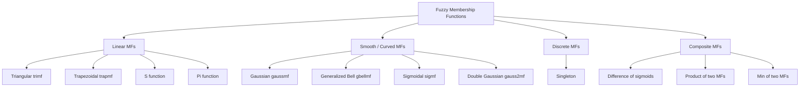
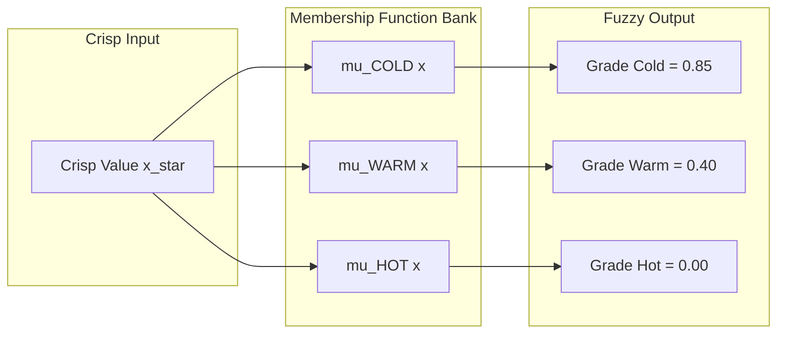
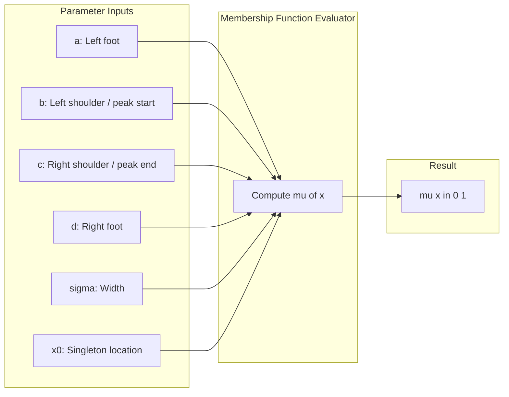

# Fuzzy membership functions

<!-- SECTION_1_START -->
# Fuzzy Membership Functions — Core Technical Foundation

## 1.1 Formal Academic Definition (KTU 2024 Syllabus Terminology)

> [!IMPORTANT]
> **Definition (Membership Function):**
> A *fuzzy set* $\tilde{A}$ in a universe of discourse $X$ is characterized by a **membership function** $\mu_{\tilde{A}}(x)$ which maps every element $x \in X$ to a real number in the closed interval $[0, 1]$, i.e.,
> $$\mu_{\tilde{A}} : X \rightarrow [0, 1]$$
> The value $\mu_{\tilde{A}}(x)$ quantifies the **degree of belongingness** (or grade of membership) of $x$ in $\tilde{A}$. A value of $1$ indicates *full membership*; $0$ indicates *no membership*; and any value strictly between $0$ and $1$ indicates *partial membership*.

Mathematically, a fuzzy set $\tilde{A}$ is expressed as:

$$\tilde{A} = \{ (x, \mu_{\tilde{A}}(x)) \mid x \in X \}$$

For a continuous universe, this is written as:

$$\tilde{A} = \int_X \mu_{\tilde{A}}(x) / x$$

and for a discrete universe as:

$$\tilde{A} = \sum_{i=1}^{n} \mu_{\tilde{A}}(x_i) / x_i$$

> [!NOTE]
> **Notation Convention (per Zadeh, 1965):** The slash `$/$` is a *delimiter* — it does **not** denote division. The expression $\mu(x) / x$ means "*x is a member of the set with degree $\mu(x)$*".

## 1.2 Conceptual Analogy — The "Tall Person" Problem

Imagine you are asked to classify people as "**tall**".

- **Classical (Crisp) Logic:** A person is either tall or not. You must draw a hard threshold — say, 6 feet. Anyone at $5'11''$ is *not* tall; anyone at $6'1''$ is tall. This creates a jarring discontinuity.
- **Fuzzy Logic:** A person who is $5'5''$ might be "tall" with degree $\mu = 0.2$, a person who is $6'0''$ might have $\mu = 0.7$, and a person who is $6'5''$ might have $\mu = 0.98$. The transition is **smooth and gradual**, mirroring the way humans actually reason about ambiguous linguistic categories.

The **membership function** is the mathematical "ruler" that assigns these gradual grades.

## 1.3 Geometric Intuition

If you plot $\mu_{\tilde{A}}(x)$ on the $y$-axis against $x$ on the $x$-axis, the curve literally *visualises* the boundary of a fuzzy set. Unlike a crisp set (which would be a rectangle — fully inside or fully outside), the fuzzy boundary *rises and falls smoothly*, telling you "how much" of $x$ belongs to $\tilde{A}$ at every point.

| Region | Membership Range | Name |
| :--- | :--- | :--- |
| $\mu_{\tilde{A}}(x) = 1$ | Full membership | **Core / Kernel** |
| $0 < \mu_{\tilde{A}}(x) < 1$ | Partial membership | **Boundary** |
| $\mu_{\tilde{A}}(x) = 0$ | No membership | **Outside Support** |
| $\mu_{\tilde{A}}(x) > 0$ | Non-zero region | **Support** |
| $\mu_{\tilde{A}}(x) = 0.5$ | Crossover | **50% Point** |

> [!VISUALIZATION CONTROL]
> **Concept:** A triangular fuzzy membership function $\mu_{\tilde{A}}(x)$ with parameters $a=2$, $b=5$, $c=8$.
>
> **GeoGebra / Desmos Input Equations:**
> * `f(x) = max(0, min((x-2)/(5-2), (8-x)/(8-5)))`
> * `g(x) = 0` (x-axis reference)
> * Points: `(2, 0)`, `(5, 1)`, `(8, 0)`
>
> **Visual Description:** A triangle rises linearly from $(2, 0)$ to a peak at $(5, 1)$, then descends linearly to $(8, 0)$. The *core* is the single point $x=5$; the *support* is the open interval $(2, 8)$; the *crossover points* are where the curve crosses $y=0.5$.
<!-- SECTION_1_END -->

<!-- SECTION_2_START -->
# Deep Theoretical Analysis & KTU High-Yield Formula Sheet

## 2.1 Conceptual Foundation — Why Membership Functions?

In Boolean logic, the only truth values are $\{0, 1\}$ (False, True). But human cognition is not binary. We say "the room is **warm**", "the speed is **high**", "the risk is **medium**" — each of these is a *linguistic variable* whose boundary is fuzzy.

A **membership function** is the bridge that:
1. Converts a *linguistic term* (e.g., "warm") into a *mathematical object*.
2. Performs **fuzzification** — transforming a crisp input into a set of fuzzy membership grades.
3. Enables inference engines to compute with words.

## 2.2 Structural Anatomy of a Membership Function

For any fuzzy set $\tilde{A}$ defined on $X$:

- **Core** (or *Kernel*): $\text{core}(\tilde{A}) = \{x \in X \mid \mu_{\tilde{A}}(x) = 1\}$
- **Support**: $\text{supp}(\tilde{A}) = \{x \in X \mid \mu_{\tilde{A}}(x) > 0\}$
- **Boundary**: $\text{bnd}(\tilde{A}) = \{x \in X \mid 0 < \mu_{\tilde{A}}(x) < 1\}$
- **Crossover Point(s)**: $\{x \in X \mid \mu_{\tilde{A}}(x) = 0.5\}$
- **Height** of $\tilde{A}$: $h(\tilde{A}) = \sup_{x \in X} \mu_{\tilde{A}}(x)$. A fuzzy set is *normal* if $h(\tilde{A}) = 1$.

## 2.3 KTU Formula Sheet — All Membership Function Types

> [!NOTE]
> **Critical Table Parsing Rule:** In the following table, the symbol `\vert` is used in place of the vertical bar to prevent markdown table column collisions.

### Table 1: Standard Membership Functions

| # | MF Type | Mathematical Formula $\mu(x)$ | Parameters | Shape Characteristics | Typical Use |
| :--- | :--- | :--- | :--- | :--- | :--- |
| 1 | **Triangular** | $\begin{cases} 0, & x \leq a \\ \dfrac{x-a}{b-a}, & a \leq x \leq b \\ \dfrac{c-x}{c-b}, & b \leq x \leq c \\ 0, & x \geq c \end{cases}$ | $a, b, c$ (with $a < b < c$) | Linear rise and fall; single peak at $b$ | Most popular in control systems |
| 2 | **Trapezoidal** | $\begin{cases} 0, & x \leq a \\ \dfrac{x-a}{b-a}, & a \leq x \leq b \\ 1, & b \leq x \leq c \\ \dfrac{d-x}{d-c}, & c \leq x \leq d \\ 0, & x \geq d \end{cases}$ | $a, b, c, d$ (with $a < b \leq c < d$) | Flat top (plateau) of full membership | When range of ideal values exists |
| 3 | **Gaussian** | $\exp\!\left(-\dfrac{(x-c)^2}{2\sigma^2}\right)$ | $c$ (center), $\sigma > 0$ (width) | Smooth, bell-shaped, infinite support | When smoothness is critical |
| 4 | **Generalized Bell** | $\dfrac{1}{1 + \left\vert \dfrac{x-c}{a} \right\vert^{2b}}$ | $a > 0$, $b > 0$, $c$ | Asymmetric bell; tunable slope | When asymmetric MFs are required |
| 5 | **Sigmoidal** | $\dfrac{1}{1 + \exp(-a(x-c))}$ | $a$ (slope), $c$ (crossover) | Open on one side; monotonic | Temperature thresholds |
| 6 | **Singleton** | $\begin{cases} 1, & x = x_0 \\ 0, & x \neq x_0 \end{cases}$ | $x_0$ | A single point of full membership | Discrete fuzzy inputs |
| 7 | **S-function** | $\begin{cases} 0, & x \leq a \\ 2\left(\dfrac{x-a}{c-a}\right)^{2}, & a \leq x \leq b \\ 1 - 2\left(\dfrac{x-c}{c-a}\right)^{2}, & b \leq x \leq c \\ 1, & x \geq c \end{cases}$ | $a, b, c$ (with $a < b < c$) | Smooth, monotonic, saturates at 1 | Threshold-type fuzzifiers |
| 8 | **$\pi$-function** | $\begin{cases} 0, & x \leq a \\ S(x; a, b, \tfrac{a+c}{2}), & a \leq x \leq b \\ 1 - S(x; b, c, d), & b \leq x \leq c \\ 0, & x \geq d \end{cases}$ | $a, b, c, d$ | Symmetric S-curve on both sides | Linguistic labels (e.g., "around 25") |

> **Where the crossover is in S-function:** at $x = b$, $\mu(b) = 0.5$. The point $b$ is the *fuzzy midpoint*.

## 2.4 Real-World Engineering Utility

| Domain | Application of MFs |
| :--- | :--- |
| **Automotive Control** | "Speed = HIGH", "Brake = MEDIUM" — fuzzy ABS and traction control |
| **Consumer Electronics** | Washing machines: "Dirt = HEAVY", "Water = LARGE" |
| **Climate Control** | AC: "Temperature = COLD", "Humidity = WET" |
| **Financial Modelling** | Risk classification: "Risk = LOW / MEDIUM / HIGH" |
| **Image Processing** | Edge detection using fuzzy gradient membership |
| **Medical Diagnosis** | "Symptom severity = SEVERE" with graded assessment |
| **AI/NLP** | Sentiment analysis: "Polarity = POSITIVE" with soft scores |

The choice of MF is **domain-driven**: triangular and trapezoidal are computationally efficient and interpretable, whereas Gaussian MFs are smoother but more expensive to update in adaptive systems.
<!-- SECTION_2_END -->

<!-- SECTION_3_START -->
# Step-by-Step Derivations & Symbolic Implementation

## 3.1 Worked Derivations for Each Membership Function

### Derivation 1: Triangular Membership Function

We construct a triangular MF with three parameters $a < b < c$. The intuition: membership must be zero at the boundaries ($a$ and $c$) and reach unity at the center ($b$).

**Line segment from $a$ to $b$ (ascending):**
The line passes through $(a, 0)$ and $(b, 1)$. Slope $= \dfrac{1 - 0}{b - a} = \dfrac{1}{b-a}$.

$$\mu(x) = \dfrac{x - a}{b - a}, \quad a \leq x \leq b$$

**Line segment from $b$ to $c$ (descending):**
The line passes through $(b, 1)$ and $(c, 0)$. Slope $= \dfrac{0 - 1}{c - b} = -\dfrac{1}{c-b}$.

$$\mu(x) = 1 - \dfrac{x - b}{c - b} = \dfrac{c - x}{c - b}, \quad b \leq x \leq c$$

**Combining into a single compact expression:**

$$\mu_{\text{tri}}(x; a, b, c) = \max\!\left(0,\; \min\!\left(\dfrac{x - a}{b - a},\; \dfrac{c - x}{c - b}\right)\right)$$

This is the formulation used by `scikit-fuzzy` and MATLAB's Fuzzy Logic Toolbox.

---

### Derivation 2: Trapezoidal Membership Function

Extending the triangle, we add a *plateau* where $\mu = 1$. Four parameters $a < b \leq c < d$.

- Ascending: $\mu(x) = \dfrac{x-a}{b-a}$, for $a \leq x \leq b$
- Plateau: $\mu(x) = 1$, for $b \leq x \leq c$
- Descending: $\mu(x) = \dfrac{d-x}{d-c}$, for $c \leq x \leq d$

**Compact form:**

$$\mu_{\text{trap}}(x; a, b, c, d) = \max\!\left(0,\; \min\!\left(\dfrac{x-a}{b-a},\; 1,\; \dfrac{d-x}{d-c}\right)\right)$$

---

### Derivation 3: Gaussian Membership Function

Starting from the standard normal distribution:

$$\mu(x) = \exp\!\left(-\dfrac{(x - \mu_0)^2}{2\sigma^2}\right)$$

In fuzzy systems, we rename the mean as $c$ (the *center*). At $x = c$, the exponent is $0$ and $\mu(c) = e^0 = 1$ (full membership). As $x \to \pm\infty$, $\mu(x) \to 0$. The parameter $\sigma$ controls the *spread* — larger $\sigma$ means a wider, gentler bell.

**Crossover points** (where $\mu = 0.5$):

$$0.5 = \exp\!\left(-\dfrac{(x - c)^2}{2\sigma^2}\right) \;\Longrightarrow\; \ln(0.5) = -\dfrac{(x - c)^2}{2\sigma^2}$$

$$(x - c)^2 = 2\sigma^2 \ln 2 \;\Longrightarrow\; x = c \pm \sigma\sqrt{2 \ln 2}$$

Numerically, $\sqrt{2 \ln 2} \approx 1.1774$, so the crossover lies at $x = c \pm 1.1774 \sigma$.

---

### Derivation 4: Generalized Bell Membership Function

Start with the form $\mu(x) = \dfrac{1}{1 + \left\vert \dfrac{x-c}{a} \right\vert^{2b}}$. At $x = c$, the denominator becomes $1 + 0 = 1$, so $\mu(c) = 1$. As $x \to \pm\infty$, the denominator grows without bound, so $\mu(x) \to 0$. The parameter $a$ controls the half-width; $b$ controls the slope at the crossover.

**Crossover:** $\mu(x) = 0.5$ when $\left\vert \dfrac{x-c}{a} \right\vert^{2b} = 1$, i.e., $x = c \pm a$.

---

### Derivation 5: Sigmoid Membership Function

Starting from the logistic function:

$$\mu(x) = \dfrac{1}{1 + e^{-a(x - c)}}$$

- If $a > 0$: $\mu$ is monotonically increasing.
- If $a < 0$: $\mu$ is monotonically decreasing.
- At $x = c$ (the *inflection point*): $\mu(c) = \dfrac{1}{1 + 1} = 0.5$.

**Useful property:** A "fuzzy S-curve" is built by combining a sigmoid (open-right) with $1 -$ sigmoid (open-left).

---

### Derivation 6: S-function and $\pi$-function

**S-function** (smooth threshold from 0 to 1):

$$S(x; a, b, c) = \begin{cases} 0, & x \leq a \\ \dfrac{1}{2} \left( \dfrac{x - a}{c - a} \right)^{2}, & a \leq x \leq b \\ 1 - \dfrac{1}{2} \left( \dfrac{x - c}{c - a} \right)^{2}, & b \leq x \leq c \\ 1, & x \geq c \end{cases}$$

The crossover (where $\mu = 0.5$) occurs at $x = b$.

**$\pi$-function** (symmetric "hump"): built by concatenating an ascending S-function (from $a$ to $b$) with a descending S-function (from $c$ to $d$). It is the smoothest analogue of a triangular MF.

---

## 3.2 Worked Numerical Example — Triangular MF

**Problem:** Given $\mu_{\text{tri}}(x; a, b, c) = \mu_{\text{tri}}(x; 2, 5, 8)$, compute $\mu(0), \mu(3), \mu(5), \mu(7), \mu(10)$.

**Step 1: Parameter values** — $a=2$, $b=5$, $c=8$, so $b-a = 3$, $c-b = 3$.

**Step 2: Evaluate at each $x$.**

- $\mu(0)$: Since $0 < a = 2$, use the first piece. $\mu(0) = 0$.
- $\mu(3)$: Since $a=2 \leq 3 \leq b=5$, use $\dfrac{x-a}{b-a} = \dfrac{3-2}{3} = \dfrac{1}{3} \approx 0.333$.
- $\mu(5)$: Since $x = b = 5$ (peak), $\mu(5) = 1$.
- $\mu(7)$: Since $b=5 \leq 7 \leq c=8$, use $\dfrac{c-x}{c-b} = \dfrac{8-7}{3} = \dfrac{1}{3} \approx 0.333$.
- $\mu(10)$: Since $10 > c = 8$, $\mu(10) = 0$.

**Summary:**

| $x$ | 0 | 3 | 5 | 7 | 10 |
| :--- | :--- | :--- | :--- | :--- | :--- |
| $\mu(x)$ | 0.000 | 0.333 | 1.000 | 0.333 | 0.000 |

---

## 3.3 Worked Numerical Example — Gaussian MF Properties

**Problem:** Let $\mu(x) = \exp\!\left(-\dfrac{(x-5)^2}{2 \cdot 2^2}\right)$. Find (a) the height, (b) core, (c) support, (d) crossover points.

**Step 1 — Height:** Maximum of $\mu$ occurs at $x = c = 5$. So $h = \mu(5) = e^0 = 1$.

**Step 2 — Core:** Single point where $\mu(x) = 1$, i.e., $\text{core} = \{5\}$.

**Step 3 — Support:** All $x$ where $\mu(x) > 0$. Since the Gaussian is positive everywhere, $\text{supp} = (-\infty, \infty)$.

**Step 4 — Crossover:** Set $\mu(x) = 0.5$.

$$0.5 = \exp\!\left(-\dfrac{(x-5)^2}{8}\right) \;\Longrightarrow\; (x-5)^2 = 8 \ln 2 \approx 5.545$$

$$x = 5 \pm \sqrt{5.545} \approx 5 \pm 2.355$$

So crossover points are $x \approx 2.645$ and $x \approx 7.355$.

---

## 3.4 Python Code — Full Implementation

```python
import numpy as np
import matplotlib.pyplot as plt
from typing import Tuple


def triangular_mf(x: np.ndarray, a: float, b: float, c: float) -> np.ndarray:
    """
    Triangular membership function.
    Parameters a, b, c with a < b < c define the base and peak.
    """
    if not (a < b < c):
        raise ValueError("Parameters must satisfy a < b < c.")
    rising = (x - a) / (b - a)
    falling = (c - x) / (c - b)
    return np.maximum(0.0, np.minimum(rising, falling))


def trapezoidal_mf(x: np.ndarray, a: float, b: float, c: float, d: float) -> np.ndarray:
    """
    Trapezoidal membership function.
    Parameters a, b, c, d with a < b <= c < d.
    """
    if not (a < b <= c < d):
        raise ValueError("Parameters must satisfy a < b <= c < d.")
    rising = (x - a) / (b - a)
    falling = (d - x) / (d - c)
    return np.maximum(0.0, np.minimum(np.minimum(rising, 1.0), falling))


def gaussian_mf(x: np.ndarray, c: float, sigma: float) -> np.ndarray:
    """
    Gaussian membership function.
    c: center, sigma: standard deviation (width).
    """
    if sigma <= 0:
        raise ValueError("sigma must be strictly positive.")
    return np.exp(-0.5 * ((x - c) / sigma) ** 2)


def gbell_mf(x: np.ndarray, a: float, b: float, c: float) -> np.ndarray:
    """
    Generalized Bell membership function.
    a > 0 controls width, b > 0 controls slope, c is the center.
    """
    if a <= 0 or b <= 0:
        raise ValueError("a and b must be strictly positive.")
    return 1.0 / (1.0 + np.abs((x - c) / a) ** (2 * b))


def singleton_mf(x: np.ndarray, x0: float, tol: float = 1e-9) -> np.ndarray:
    """
    Singleton membership function (1 at x0, 0 elsewhere).
    """
    return np.where(np.abs(x - x0) <= tol, 1.0, 0.0)


def s_function_mf(x: np.ndarray, a: float, b: float, c: float) -> np.ndarray:
    """
    S-shaped membership function (smooth saturation from 0 to 1).
    """
    if not (a < b < c):
        raise ValueError("Parameters must satisfy a < b < c.")
    result = np.zeros_like(x, dtype=float)
    left = (x > a) & (x <= b)
    right = (x > b) & (x < c)
    full = (x >= c)
    result[left] = 0.5 * ((x[left] - a) / (c - a)) ** 2
    result[right] = 1 - 0.5 * ((x[right] - c) / (c - a)) ** 2
    result[full] = 1.0
    return result


def fuzzify_temperature(temp_value: float) -> Tuple[float, float, float]:
    """
    Fuzzify a crisp temperature reading into (cold, warm, hot) grades.
    Universe: [0, 50] degC.
    """
    x = np.array([temp_value])
    cold = trapezoidal_mf(x, 0.0, 0.0, 10.0, 20.0)[0]
    warm = triangular_mf(x, 15.0, 22.5, 30.0)[0]
    hot = trapezoidal_mf(x, 25.0, 35.0, 50.0, 50.0)[0]
    return cold, warm, hot


if __name__ == "__main__":
    # ---------- Step 1: Generate the universe ----------
    x = np.linspace(0, 50, 1001)

    # ---------- Step 2: Compute each membership function ----------
    cold = trapezoidal_mf(x, 0.0, 0.0, 10.0, 20.0)
    warm = triangular_mf(x, 15.0, 22.5, 30.0)
    hot = trapezoidal_mf(x, 25.0, 35.0, 50.0, 50.0)
    gaussian_demo = gaussian_mf(x, 25.0, 5.0)
    bell_demo = gbell_mf(x, 8.0, 4.0, 25.0)

    # ---------- Step 3: Plot ----------
    plt.figure(figsize=(11, 6.5))
    plt.plot(x, cold, label="Cold (trapezoid)", linewidth=2)
    plt.plot(x, warm, label="Warm (triangle)", linewidth=2)
    plt.plot(x, hot, label="Hot (trapezoid)", linewidth=2)
    plt.plot(x, gaussian_demo, "--", label="Gaussian (c=25, sigma=5)", linewidth=2)
    plt.plot(x, bell_demo, ":", label="Generalized Bell", linewidth=2)
    plt.axhline(0.5, color="grey", linestyle="--", alpha=0.5, label="Crossover y=0.5")
    plt.xlabel("Temperature (deg C)")
    plt.ylabel("Membership Grade")
    plt.title("Fuzzification of Temperature: Multiple MF Types")
    plt.legend(loc="upper right")
    plt.grid(True, alpha=0.3)
    plt.tight_layout()
    plt.show()

    # ---------- Step 4: Demo fuzzification of a single value ----------
    test_temp = 22.0
    c, w, h = fuzzify_temperature(test_temp)
    print(f"Temperature = {test_temp} deg C")
    print(f"  cold = {c:.4f}")
    print(f"  warm = {w:.4f}")
    print(f"  hot  = {h:.4f}")
```
<!-- SECTION_3_END -->

<!-- SECTION_4_START -->
# Structural Diagrams & Schematics

## 4.1 Taxonomy of Membership Functions



## 4.2 Process Flow — Fuzzification Using Membership Functions



## 4.3 Sequential Processing Topology — Selecting an MF in Fuzzy System Design


## 4.4 Block-Level Architecture — Membership Function Parameters


<!-- SECTION_4_END -->

<!-- SECTION_5_START -->
# KTU 2024 Scheme Examination Question Bank & Topic Recap

## 5.1 Part A — Short Answer Questions (3 Marks Each)

> **Q1. Define a fuzzy membership function. State any four features of a fuzzy set.** `[KTU University Exam - Dec 2023]` **(CO1, Remember) — 3 Marks**

**Model Answer (3 Marks):**

A **fuzzy membership function** $\mu_{\tilde{A}}(x)$ is a mapping from the universe of discourse $X$ to the closed interval $[0, 1]$ that assigns to each element $x \in X$ a real number representing its degree of membership in the fuzzy set $\tilde{A}$.

$$\mu_{\tilde{A}} : X \rightarrow [0, 1]$$

Four features of a fuzzy set:

1. **Core (Kernel):** Set of elements with full membership, $\mu(x) = 1$.
2. **Support:** Set of elements with non-zero membership, $\mu(x) > 0$.
3. **Boundary:** Set of elements with partial membership, $0 < \mu(x) < 1$.
4. **Height:** The supremum of $\mu(x)$; a set is *normal* if its height is 1.
5. **Crossover Point:** Elements where $\mu(x) = 0.5$.

> **Valuation Key:** [Definition: 1 Mark] [Any four features listed: 2 Marks = 4 × 0.5 Mark each]

---

> **Q2. Distinguish between a crisp set and a fuzzy set with a suitable example.** `[KTU University Exam - July 2024]` **(CO1, Understand) — 3 Marks**

**Model Answer (3 Marks):**

| Aspect | Crisp Set | Fuzzy Set |
| :--- | :--- | :--- |
| Membership values | Either $0$ or $1$ (binary) | Any value in $[0, 1]$ (continuous) |
| Boundary | Sharp / well-defined | Smooth / graduated |
| Logic | Boolean logic | Fuzzy logic |
| Representation | $\tilde{A} = \{x \in X \mid P(x)\}$ | $\tilde{A} = \{(x, \mu_{\tilde{A}}(x)) \mid x \in X\}$ |

**Example — "Tall" people:**

- **Crisp:** "Tall" = $\{ \text{person} \mid \text{height} \geq 6 \text{ ft} \}$. A person $5'11''$ is *not* tall; a person $6'0''$ is tall.
- **Fuzzy:** "Tall" assigns $\mu = 0.0$ at $5'0''$, $\mu = 0.5$ at $5'8''$, $\mu = 0.95$ at $6'2''$, with smooth interpolation.

> **Valuation Key:** [Distinction table: 2 Marks] [Example: 1 Mark]

---

## 5.2 Part B — 14-Mark Questions (Module Internal Choice)

---

### **Question A (14 Marks)** `[KTU University Exam - Dec 2023]`

**(a) Explain with neat diagrams the Triangular, Trapezoidal, and Gaussian membership functions. State their parameters and write the mathematical expressions.** **(CO1, Understand) — 7 Marks**

**Model Solution:**

**1. Triangular Membership Function** — Defined by three parameters $(a, b, c)$ with $a < b < c$:

$$\mu_{\text{tri}}(x; a, b, c) = \begin{cases} 0, & x \leq a \\ \dfrac{x - a}{b - a}, & a \leq x \leq b \\ \dfrac{c - x}{c - b}, & b \leq x \leq c \\ 0, & x \geq c \end{cases}$$

*Diagram:* Linear rise from $(a, 0)$ to peak $(b, 1)$, linear fall to $(c, 0)$.

**2. Trapezoidal Membership Function** — Defined by four parameters $(a, b, c, d)$ with $a < b \leq c < d$:

$$\mu_{\text{trap}}(x; a, b, c, d) = \begin{cases} 0, & x \leq a \\ \dfrac{x - a}{b - a}, & a \leq x \leq b \\ 1, & b \leq x \leq c \\ \dfrac{d - x}{d - c}, & c \leq x \leq d \\ 0, & x \geq d \end{cases}$$

*Diagram:* Linear rise from $(a, 0)$ to $(b, 1)$, plateau from $b$ to $c$, linear fall to $(d, 0)$.

**3. Gaussian Membership Function** — Defined by two parameters $(c, \sigma)$ with $\sigma > 0$:

$$\mu_{\text{gauss}}(x; c, \sigma) = \exp\!\left(-\dfrac{(x - c)^2}{2\sigma^2}\right)$$

*Diagram:* Smooth bell-shaped curve centered at $c$, with width controlled by $\sigma$.

> **Valuation Key:** [Each MF: 2 Marks = Diagram 1 + Formula 0.5 + Parameters 0.5]

---

**(b) A fuzzy set $\tilde{A}$ is defined on $X = [0, 10]$ by $\mu_{\tilde{A}}(x) = 1 / (1 + 0.5(x - 5)^2)$. Find the core, support, and crossover points.** **(CO2, Apply) — 7 Marks**

**Model Solution:**

**Step 1 — Core:** Core consists of $x$ where $\mu(x) = 1$. Set:

$$1 = \frac{1}{1 + 0.5(x-5)^2} \;\Longrightarrow\; 1 + 0.5(x-5)^2 = 1 \;\Longrightarrow\; 0.5(x-5)^2 = 0$$

So $(x-5)^2 = 0$, giving $x = 5$. Therefore, $\text{core}(\tilde{A}) = \{5\}$.

**Step 2 — Support:** Support consists of $x$ where $\mu(x) > 0$. Since the denominator $1 + 0.5(x-5)^2 \geq 1 > 0$ for all real $x$, the support is all of $\mathbb{R}$. Restricted to $X = [0, 10]$:

$$\text{supp}(\tilde{A}) = [0, 10]$$

**Step 3 — Crossover Points:** Set $\mu(x) = 0.5$:

$$0.5 = \frac{1}{1 + 0.5(x-5)^2} \;\Longrightarrow\; 1 + 0.5(x-5)^2 = 2 \;\Longrightarrow\; (x-5)^2 = 2$$

$$x = 5 \pm \sqrt{2} \approx 5 \pm 1.414$$

So crossover points are $x_1 = 5 - \sqrt{2} \approx 3.586$ and $x_2 = 5 + \sqrt{2} \approx 6.414$.

**Verification at $x = 5 - \sqrt{2}$:**

$$\mu(3.586) = \frac{1}{1 + 0.5(3.586 - 5)^2} = \frac{1}{1 + 0.5 \cdot 2} = \frac{1}{2} = 0.5 \quad \checkmark$$

> **Valuation Key:** [Stating core: 2 Marks] [Support: 2 Marks] [Crossover with derivation: 3 Marks]

---

### **Question B (14 Marks)** `[KTU University Exam - July 2024]`

**(a) Explain the Generalized Bell and Sigmoidal membership functions. Compare their smoothness and computational cost.** **(CO1, Understand) — 7 Marks**

**Model Solution:**

**1. Generalized Bell Membership Function** — Defined by three parameters $(a, b, c)$ with $a > 0$ and $b > 0$:

$$\mu_{\text{gbell}}(x; a, b, c) = \frac{1}{1 + \left\vert \dfrac{x - c}{a} \right\vert^{2b}}$$

- $c$ is the *center* (where $\mu = 1$).
- $a$ controls the *half-width*.
- $b$ controls the *slope* at the crossover.
- The crossover occurs at $x = c \pm a$ (where $\mu = 0.5$).
- It is **asymmetric-capable**: combining different $(a, b)$ on each side yields asymmetric bells.
- It is **infinitely differentiable** — suitable for gradient-based learning (e.g., ANFIS).

**2. Sigmoidal Membership Function** — Defined by two parameters $(a, c)$:

$$\mu_{\text{sig}}(x; a, c) = \frac{1}{1 + \exp(-a(x - c))}$$

- $c$ is the *crossover point* (where $\mu = 0.5$).
- $a$ controls the *slope* — larger $|a|$ = steeper transition.
- If $a > 0$: monotonically increasing.
- If $a < 0$: monotonically decreasing.
- It is *open* on one side — useful for threshold concepts like "HOT".

**Comparison:**

| Aspect | Generalized Bell | Sigmoidal |
| :--- | :--- | :--- |
| Symmetry | Can be symmetric or asymmetric | Inherently open-ended |
| Parameters | 3 | 2 |
| Smoothness | $C^\infty$ (infinitely differentiable) | $C^\infty$ |
| Computational cost | Moderate (power + absolute value) | Low (single exponentiation) |
| Best suited for | Bell-shaped concepts | Threshold / monotonic concepts |
| Use in ANFIS | Common | Less common |

> **Valuation Key:** [Each MF: 2.5 Marks] [Comparison table: 2 Marks]

---

**(b) For a temperature control system, the universe is $X = [0, 50]$ deg C. Define three fuzzy sets — *Cold*, *Warm*, *Hot* — using appropriate membership functions and plot them. Calculate the fuzzified values for a temperature of $28$ deg C.** **(CO2, Apply) — 7 Marks**

**Model Solution:**

**Step 1 — Define MFs:**

- *Cold* (trapezoidal): $\mu_{\text{Cold}}(x) = \mu_{\text{trap}}(x;\, 0, 0, 10, 20)$
- *Warm* (triangular): $\mu_{\text{Warm}}(x) = \mu_{\text{tri}}(x;\, 15, 25, 35)$
- *Hot* (trapezoidal): $\mu_{\text{Hot}}(x) = \mu_{\text{trap}}(x;\, 30, 40, 50, 50)$

**Step 2 — Evaluate at $x = 28$ deg C:**

**Cold:** $x = 28$ falls in the descending range $20 < x < \infty$ where $\mu_{\text{Cold}} = 0$ (since trapezoid is zero beyond $x = 20$).

$$\mu_{\text{Cold}}(28) = 0.000$$

**Warm:** $x = 28$ falls in the descending range $25 \leq x \leq 35$:

$$\mu_{\text{Warm}}(28) = \frac{35 - 28}{35 - 25} = \frac{7}{10} = 0.700$$

**Hot:** $x = 28$ falls in the rising range $30 \leq x \leq 40$ — but $28 < 30$, so $\mu_{\text{Hot}} = 0$.

$$\mu_{\text{Hot}}(28) = 0.000$$

**Step 3 — Fuzzified vector:**

$$\boldsymbol{\mu}(28) = \big( \mu_{\text{Cold}}, \mu_{\text{Warm}}, \mu_{\text{Hot}} \big) = (0.000,\; 0.700,\; 0.000)$$

**Step 4 — Plot (schematic):**

| Temperature range | Cold | Warm | Hot |
| :--- | :--- | :--- | :--- |
| $0$ to $20$ | $1.0$ (plateau) | $0$ | $0$ |
| $20$ to $30$ | $0 \to 0$ (descending) | $0 \to 1$ (rising) | $0$ |
| $30$ to $35$ | $0$ | $1 \to 0$ (descending) | $0 \to 1$ (rising) |
| $35$ to $50$ | $0$ | $0$ | $1$ (plateau) |

> **Valuation Key:** [MF definitions: 2 Marks] [Fuzzified numerical values: 3 Marks] [Plot/schematic: 2 Marks]

---

## 5.3 KTU Examiner's Valuation Warning / Pitfall Callout

> [!WARNING]
> **Common Mistakes That Cost Marks:**
>
> 1. **Forgetting parameter ordering constraints.** Trapezoidal MFs require $a < b \leq c < d$. Writing $a < b < c < d$ is also acceptable, but writing them out of order or repeating values without explanation loses marks.
> 2. **Confusing *core* with *support*.** Core = $\mu = 1$; Support = $\mu > 0$. Examiners will mark this strictly.
> 3. **Skipping the piecewise form.** Always present the *piecewise definition* explicitly for triangular and trapezoidal MFs — do not only state the compact `max/min` form in 14-mark answers.
> 4. **Not writing the crossover derivation.** Just stating the answer (e.g., "$x = 5 \pm \sqrt{2}$") without showing the algebraic step loses the *Apply* marks.
> 5. **Using `|` for absolute value inside tables.** In KTU answer scripts, this isn't an issue, but if you write on tablet/laptop, prefer `\vert` or `\lvert \cdot \rvert` for safety.
> 6. **Forgetting units.** Always state the *universe of discourse* explicitly — e.g., "Universe $X = [0, 50]$ deg C".
> 7. **Plotting only one MF.** When asked to "plot" multiple MFs on the same axis, always use a *legend* and label both axes.

---

## 5.4 Topic Recap & Important Things to Remember

> [!IMPORTANT]
> **Rapid Revision Checklist — Membership Functions**

- [x] **Definition:** $\mu_{\tilde{A}} : X \rightarrow [0, 1]$ — maps each $x \in X$ to a grade in $[0, 1]$.
- [x] **Core:** $\{x \mid \mu(x) = 1\}$
- [x] **Support:** $\{x \mid \mu(x) > 0\}$
- [x] **Boundary:** $\{x \mid 0 < \mu(x) < 1\}$
- [x] **Crossover:** $\{x \mid \mu(x) = 0.5\}$
- [x] **Normal Set:** $\sup_x \mu(x) = 1$ (height equals 1)
- [x] **Triangular MF:** 3 params $(a, b, c)$; compact form uses `max(0, min(...))`.
- [x] **Trapezoidal MF:** 4 params $(a, b, c, d)$; has a flat plateau.
- [x] **Gaussian MF:** 2 params $(c, \sigma)$; $\mu = \exp(-(x-c)^2 / 2\sigma^2)$; smooth, infinite support.
- [x] **Generalized Bell MF:** 3 params $(a, b, c)$; $\mu = 1 / (1 + \vert (x-c)/a \vert^{2b})$; asymmetric-capable.
- [x] **Sigmoidal MF:** 2 params $(a, c)$; $\mu = 1 / (1 + e^{-a(x-c)})$; monotonic, threshold-type.
- [x] **Singleton MF:** $\mu = 1$ at $x_0$, $\mu = 0$ elsewhere — for discrete inputs.
- [x] **S-function:** smooth saturation $0 \to 1$ across $(a, b, c)$; crossover at $b$.
- [x] **$\pi$-function:** symmetric S-curve; smoothest analogue of triangular MF.
- [x] **Gaussian Crossover:** at $x = c \pm \sigma\sqrt{2\ln 2} \approx c \pm 1.1774\sigma$.
- [x] **Bell Crossover:** at $x = c \pm a$ (exact).
- [x] **Fuzzification:** Process of converting a crisp input to fuzzy membership grades.
- [x] **MF Selection Rule of Thumb:** Linear/cheap → triangular & trapezoidal; smooth/learning → Gaussian & Bell; monotonic → sigmoid; discrete → singleton.
- [x] **KTU 2024 Tag (this topic):** Module 2 — Fuzzy Logic, mapped to CO1 (Understand concepts) and CO2 (Apply MFs in fuzzification).
- [x] **Common Pitfall:** Confusing core and support; never state a $\mu$ value outside $[0, 1]$; always validate parameter ordering before writing the MF.
<!-- SECTION_5_END -->
