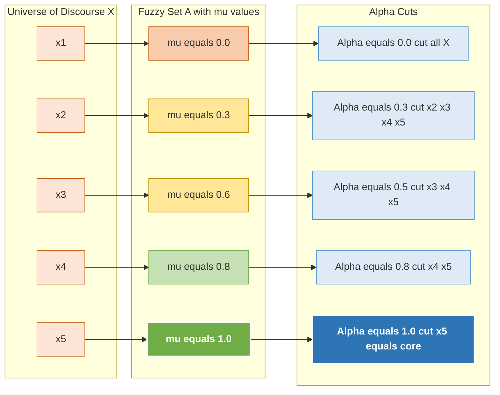
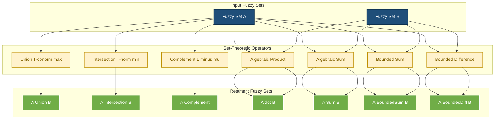
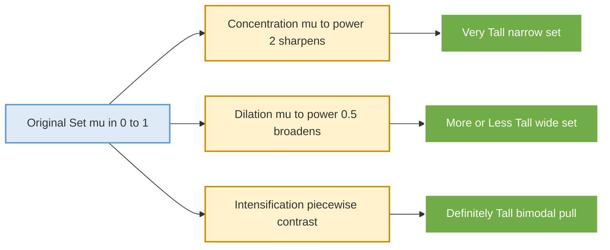

# Fuzzy sets – Properties

<!-- SECTION_1_START -->
# Fuzzy Sets – Properties: Foundational Concepts & Intuition

## 1.1 Formal Definition of a Fuzzy Set (KTU 2024 Syllabus Terminology)

> [!IMPORTANT]
> **Core Definition (Zadeh, 1965)**
> A **Fuzzy Set** $\tilde{A}$ defined on a universal set (or universe of discourse) $X$ is a set of ordered pairs:
> $$\tilde{A} = \{\,(x, \mu_{\tilde{A}}(x)) \mid x \in X\,\}$$
> where $\mu_{\tilde{A}}: X \rightarrow [0, 1]$ is the **membership function** that assigns to each element $x \in X$ a **grade of membership** (or membership value) in the interval $\[0, 1\]$.
> * $\mu_{\tilde{A}}(x) = 1$ implies **full membership** of $x$ in $\tilde{A}$.
> * $\mu_{\tilde{A}}(x) = 0$ implies **no membership** of $x$ in $\tilde{A}$.
> * Values strictly between **0** and **1** indicate **partial membership**.

For a finite universe $X = \{x_1, x_2, \ldots, x_n\}$, Zadeh's notation expresses a fuzzy set as:
$$\tilde{A} = \frac{\mu_1}{x_1} + \frac{\mu_2}{x_2} + \cdots + \frac{\mu_n}{x_n} = \sum_{i=1}^{n} \frac{\mu_i}{x_i}$$
where the $+$ symbol and the fractions are **not** arithmetic operators but rather **collectors and membership markers**.

For a continuous universe $X$, the fuzzy set is written as:
$$\tilde{A} = \int_X \frac{\mu_{\tilde{A}}(x)}{x}$$

> [!NOTE]
> **KTU 2024 Board Emphasis:** Always write the membership function explicitly. Examiners specifically award marks for the mapping $\mu_{\tilde{A}}(x) \in [0,1]$ in your first line of any fuzzy-set problem.

---

## 1.2 Conceptual Analogy — The "Tall Person" Set

Consider the linguistic term **"Tall Person"**. In a **crisp (Boolean) set**, a person is either tall (1) or not tall (0). The boundary is sharp: a person of height 180 cm is tall; one of 179.9 cm is not — which is absurd in the real world.

In a **fuzzy set**, height is a matter of *degree*. The membership function could be:
$$\mu_{\text{Tall}}(h) = \begin{cases} 0, & h \le 150 \\ \dfrac{h - 150}{30}, & 150 < h \le 180 \\ 1, & h > 180 \end{cases}$$

So a person of 165 cm has $\mu = 0.5$ (somewhat tall), while 175 cm yields $\mu \approx 0.833$ (very tall). The transition is **smooth and graded**, mimicking human linguistic reasoning.

> [!TIP]
> **Intuition Box:** A fuzzy set is a *cloud*; a crisp set is a *brick wall*. The cloud lets elements belong partially, the wall admits only yes/no answers.

---

## 1.3 Geometric & Visualization Framework

For the fuzzy set $\tilde{A} = \{(15, 0.2), (20, 0.5), (25, 0.8), (30, 1.0), (35, 0.7), (40, 0.3), (45, 0.1)\}$:

> [!VISUALIZATION CONTROL]
> **Concept:** Discrete Fuzzy Membership Plot — "Young Adult" Set
> **GeoGebra / Desmos Input Equations:**
> * Point List: `(15, 0.2), (20, 0.5), (25, 0.8), (30, 1), (35, 0.7), (40, 0.3), (45, 0.1)`
> * X-axis: Universal set values (age in years), 0 to 50
> * Y-axis: Membership grade, 0 to 1
> **Visual Description:** A bell-shaped discrete curve rising from 0.2 at age 15, peaking at 1.0 at age 30, and falling to 0.1 at age 45. Students should observe the **support region** (where $\mu > 0$), the **core** (where $\mu = 1$), and the **boundary** ($\mu = 0$).

---

## 1.4 Crisp Set vs Fuzzy Set — A Side-by-Side Snapshot

| Property | Crisp (Classical) Set | Fuzzy Set |
|---|---|---|
| Membership values | $\{0, 1\}$ | $[0, 1]$ (continuous) |
| Boundary | Sharp, well-defined | Gradual, soft |
| Logic base | Boolean ($0$-or-$1$) | Multi-valued |
| Membership function | Indicator / Characteristic | Generalized $\mu_{\tilde{A}}(x)$ |
| Element status | Belongs or does not belong | Belongs to a *degree* |
| Example | Even numbers | "Even-ish" number |
| Notation | $A = \{2, 4, 6, \ldots\}$ | $\tilde{A} = \{1/0.0,\ 2/0.3,\ 3/0.9,\ 4/1.0,\ \ldots\}$ |

> [!IMPORTANT]
> **Universal Set ($X$ / Universe of Discourse):** The collection of all possible elements considered in a particular problem context. For "tall person" example, $X = [0, 250]$ cm. The symbol **UOD** is also accepted in KTU answer scripts.
<!-- SECTION_1_END -->

<!-- SECTION_2_START -->
# Deep Theoretical Analysis & KTU High-Yield Formula Sheet

## 2.1 Structural Properties of a Fuzzy Set

Let $\tilde{A}$ be a fuzzy set on universe $X$ with membership function $\mu_{\tilde{A}}(x)$.

### 2.1.1 Support of a Fuzzy Set ($S(\tilde{A})$ or $\text{Supp}(\tilde{A})$)

The **support** is the crisp set of all elements with **strictly positive** membership grade:
$$S(\tilde{A}) = \{\,x \in X \mid \mu_{\tilde{A}}(x) > 0\,\}$$
It is a **non-fuzzy (crisp) subset** of $X$. Geometrically, it is the projection of the non-zero region of the membership curve onto the $x$-axis.

### 2.1.2 Core (or Kernel) of a Fuzzy Set ($C(\tilde{A})$)

The **core** is the crisp set of all elements with **full membership**:
$$C(\tilde{A}) = \{\,x \in X \mid \mu_{\tilde{A}}(x) = 1\,\}$$
If $C(\tilde{A}) \ne \emptyset$, the set is called **normal**; otherwise it is **subnormal**.

### 2.1.3 Normality (Normal Fuzzy Set)

A fuzzy set is **normal** if there exists at least one $x \in X$ such that $\mu_{\tilde{A}}(x) = 1$. Otherwise, it is **subnormal**. The **height** $h(\tilde{A})$ is defined as:
$$h(\tilde{A}) = \sup_{x \in X} \mu_{\tilde{A}}(x)$$
A fuzzy set is normal **iff** $h(\tilde{A}) = 1$.

### 2.1.4 Crossover Points

Elements at which the membership value equals **0.5** are called **crossover points**:
$$\text{Crossover}(\tilde{A}) = \{\,x \in X \mid \mu_{\tilde{A}}(x) = 0.5\,\}$$
These mark the *transition boundary* between "more in" and "more out".

### 2.1.5 α-Cut (Alpha-Cut) — A Board-Favorite Concept

The **α-cut** (denoted $\tilde{A}_\alpha$) of a fuzzy set $\tilde{A}$ is the crisp set of all elements whose membership grade is **at least** $\alpha$:
$$\tilde{A}_\alpha = \{\,x \in X \mid \mu_{\tilde{A}}(x) \ge \alpha\,\}, \quad \alpha \in [0, 1]$$
Special cases:
* $\tilde{A}_0 = X$ (the entire universe, when $\alpha = 0$).
* $\tilde{A}_1 = C(\tilde{A})$ (the core, when $\alpha = 1$).

The **strong α-cut** (or strict α-cut) is:
$$\tilde{A}_{\alpha^+} = \{\,x \in X \mid \mu_{\tilde{A}}(x) > \alpha\,\}$$

### 2.1.6 Convex Fuzzy Set

A fuzzy set $\tilde{A}$ is **convex** if and only if for every $\alpha \in (0, 1]$, the α-cut $\tilde{A}_\alpha$ is a **convex crisp set** (i.e., a single interval on $\mathbb{R}$). Equivalently:
$$\mu_{\tilde{A}}(\lambda x_1 + (1-\lambda)x_2) \ge \min(\mu_{\tilde{A}}(x_1), \mu_{\tilde{A}}(x_2)), \quad \forall \lambda \in [0, 1]$$
Convexity ⇒ the membership function is **unimodal** (no valleys).

### 2.1.7 Cardinality

The **scalar cardinality** (or count) of a fuzzy set on a finite universe:
$$\vert \tilde{A} \vert = \sum_{i=1}^{n} \mu_{\tilde{A}}(x_i)$$
The **relative cardinality** (for normalization):
$$\vert \tilde{A} \vert_{rel} = \frac{\vert \tilde{A} \vert}{n}$$

### 2.1.8 Empty Fuzzy Set

A fuzzy set $\tilde{A}$ is **empty** if $\mu_{\tilde{A}}(x) = 0$ for all $x \in X$. Notation: $\tilde{A} = \emptyset$ or $\tilde{\emptyset}$.

### 2.1.9 Equality of Fuzzy Sets

Two fuzzy sets $\tilde{A}$ and $\tilde{B}$ are **equal** iff:
$$\mu_{\tilde{A}}(x) = \mu_{\tilde{B}}(x), \quad \forall x \in X$$

---

## 2.2 Set-Theoretic Operations on Fuzzy Sets

Let $\tilde{A}$ and $\tilde{B}$ be fuzzy sets on $X$. Define:

| Operation | Membership Function | Notation |
|---|---|---|
| **Union** (S-norm / T-conorm / max) | $\mu_{\tilde{A} \cup \tilde{B}}(x) = \max(\mu_{\tilde{A}}(x), \mu_{\tilde{B}}(x))$ | $\tilde{A} \cup \tilde{B}$ |
| **Intersection** (T-norm / min) | $\mu_{\tilde{A} \cap \tilde{B}}(x) = \min(\mu_{\tilde{A}}(x), \mu_{\tilde{B}}(x))$ | $\tilde{A} \cap \tilde{B}$ |
| **Complement** (Negation) | $\mu_{\tilde{A}^c}(x) = 1 - \mu_{\tilde{A}}(x)$ | $\tilde{A}^c$ or $\overline{\tilde{A}}$ |
| **Algebraic Product** | $\mu_{\tilde{A} \cdot \tilde{B}}(x) = \mu_{\tilde{A}}(x) \cdot \mu_{\tilde{B}}(x)$ | $\tilde{A} \cdot \tilde{B}$ |
| **Algebraic Sum** (Probabilistic Sum) | $\mu_{\tilde{A} \oplus \tilde{B}}(x) = \mu_{\tilde{A}}(x) + \mu_{\tilde{B}}(x) - \mu_{\tilde{A}}(x)\mu_{\tilde{B}}(x)$ | $\tilde{A} \oplus \tilde{B}$ |
| **Bounded Sum** | $\mu_{\tilde{A} \oplus_B \tilde{B}}(x) = \min(1, \mu_{\tilde{A}}(x) + \mu_{\tilde{B}}(x))$ | $\tilde{A} \oplus_B \tilde{B}$ |
| **Bounded Difference** | $\mu_{\tilde{A} \ominus_B \tilde{B}}(x) = \max(0, \mu_{\tilde{A}}(x) + \mu_{\tilde{B}}(x) - 1)$ | $\tilde{A} \ominus_B \tilde{B}$ |

> [!NOTE]
> **De Morgan's Laws still hold for fuzzy sets:**
> 1. $\overline{\tilde{A} \cup \tilde{B}} = \overline{\tilde{A}} \cap \overline{\tilde{B}}$
> 2. $\overline{\tilde{A} \cap \tilde{B}} = \overline{\tilde{A}} \cup \overline{\tilde{B}}$
> provided **min / max** t-norm and t-conorm are used.

> [!IMPORTANT]
> **Law of Excluded Middle** and **Law of Non-Contradiction** are **violated** in fuzzy logic:
> * $\tilde{A} \cup \tilde{A}^c \ne X$ (membership of $x$ in $\tilde{A} \cup \tilde{A}^c$ is $\max(\mu, 1 - \mu) \le 1$, not always $1$).
> * $\tilde{A} \cap \tilde{A}^c \ne \emptyset$ (membership is $\min(\mu, 1 - \mu) \ge 0$, not always $0$).
> This is a **favorite KTU board question** — always pair with crisp-set classical logic.

---

## 2.3 KTU High-Yield Formula Cheat Sheet

| # | Property / Operation | Formula | Domain / Range |
|---|---|---|---|
| 1 | Fuzzy Set Definition | $\tilde{A} = \{(x, \mu_{\tilde{A}}(x))\}$ | $\mu \in [0, 1]$ |
| 2 | Support | $S(\tilde{A}) = \{x \mid \mu(x) > 0\}$ | Crisp subset of $X$ |
| 3 | Core | $C(\tilde{A}) = \{x \mid \mu(x) = 1\}$ | Crisp subset of $X$ |
| 4 | Height | $h(\tilde{A}) = \sup_x \mu(x)$ | $[0, 1]$ |
| 5 | Normality | $h(\tilde{A}) = 1$ | Boolean condition |
| 6 | α-cut | $\tilde{A}_\alpha = \{x \mid \mu(x) \ge \alpha\}$ | Crisp for $\alpha \in (0,1]$ |
| 7 | Strong α-cut | $\tilde{A}_{\alpha^+} = \{x \mid \mu(x) > \alpha\}$ | Crisp |
| 8 | Crossover | $\{x \mid \mu(x) = 0.5\}$ | Crisp |
| 9 | Convexity | $\mu(\lambda x_1 + (1-\lambda)x_2) \ge \min(\mu(x_1), \mu(x_2))$ | $\lambda \in [0,1]$ |
| 10 | Cardinality | $\vert \tilde{A} \vert = \sum_i \mu(x_i)$ | Non-negative scalar |
| 11 | Union | $\mu_{\cup}(x) = \max(\mu_A, \mu_B)$ | $[0, 1]$ |
| 12 | Intersection | $\mu_{\cap}(x) = \min(\mu_A, \mu_B)$ | $[0, 1]$ |
| 13 | Complement | $\mu_{\bar{A}}(x) = 1 - \mu_A(x)$ | $[0, 1]$ |
| 14 | Algebraic Product | $\mu_A \cdot \mu_B$ | $[0, 1]$ |
| 15 | Algebraic Sum | $\mu_A + \mu_B - \mu_A \mu_B$ | $[0, 1]$ |
| 16 | Bounded Sum | $\min(1, \mu_A + \mu_B)$ | $[0, 1]$ |
| 17 | Bounded Difference | $\max(0, \mu_A + \mu_B - 1)$ | $[0, 1]$ |
| 18 | Concentration ($\text{CON}$) | $\mu_{CON(\tilde{A})}(x) = (\mu_{\tilde{A}}(x))^2$ | $[0, 1]$ |
| 19 | Dilation ($\text{DIL}$) | $\mu_{DIL(\tilde{A})}(x) = (\mu_{\tilde{A}}(x))^{0.5}$ | $[0, 1]$ |
| 20 | Intensification ($\text{INT}$) | $2\mu^2$ for $\mu \in [0, 0.5]$, $1 - 2(1-\mu)^2$ for $\mu \in [0.5, 1]$ | $[0, 1]$ |

---

## 2.4 Concentration, Dilation & Intensification (Linguistic Hedges)

These **modifiers** transform fuzzy sets by reshaping the membership grades:

* **Concentration** $CON(\tilde{A})$: $\mu_{CON}(x) = (\mu_{\tilde{A}}(x))^2$ — sharpens, makes membership "more concentrated" (e.g., "**very** tall").
* **Dilation** $DIL(\tilde{A})$: $\mu_{DIL}(x) = (\mu_{\tilde{A}}(x))^{0.5}$ — spreads the set, weakens membership (e.g., "**more or less** tall").
* **Intensification** $INT(\tilde{A})$:
  $$\mu_{INT}(x) = \begin{cases} 2(\mu_{\tilde{A}}(x))^2, & \mu \in [0, 0.5] \\ 1 - 2(1 - \mu_{\tilde{A}}(x))^2, & \mu \in [0.5, 1] \end{cases}$$
  Pulls values **away** from 0.5 (towards 0 or 1), used to "sharpen" contrast.

---

## 2.5 Real-World Engineering Utility

| Domain | Application of Fuzzy Set Properties |
|---|---|
| **Automotive Control** | $\alpha$-cuts convert continuous fuzzy throttle/brake signals into crisp actuator commands in automatic transmission systems. |
| **Washing Machines** | Linguistic hedges like "very dirty" use **concentration**; "slightly dirty" uses **dilation** on the dirtiness fuzzy set. |
| **Medical Diagnosis** | α-cuts allow doctors to threshold a fuzzy "high fever" set at $\alpha = 0.7$ for alarm triggering. |
| **Weather Prediction** | "Hot", "humid", "windy" fuzzy sets are combined via **union / intersection** to issue go/no-go flight decisions. |
| **Image Processing** | Fuzzy edges use **crossover points** for boundary detection where pixels partially belong to "edge" region. |
| **Industrial Quality Control** | **Cardinality** of a "defective" fuzzy set quantifies the degree of defect in batch production. |

> [!TIP]
> **Why it matters:** Fuzzy set properties are the foundation of **fuzzy inference engines** (Mamdani, Sugeno) and **fuzzy clustering** (Fuzzy C-Means). Without α-cuts, no rule-base can be reduced to crisp control actions.
<!-- SECTION_2_END -->

<!-- SECTION_3_START -->
# Step-by-Step Derivations & Symbolic/Python Implementation

## 3.1 Worked Example — α-Cut Computation (Board Pattern)

**Problem:** Consider the fuzzy set $\tilde{A}$ representing "Speedometer reading acceptable for city driving":
$$\tilde{A} = \{ (20, 0.1), (30, 0.4), (40, 0.8), (50, 1.0), (60, 0.7), (70, 0.3), (80, 0.1) \}$$
Find:
1. Support of $\tilde{A}$.
2. Core of $\tilde{A}$.
3. Height of $\tilde{A}$.
4. α-cut for $\alpha = 0.5$.
5. Strong α-cut for $\alpha = 0.5$.
6. Crossover points.

### Solution

**Step 1 — Support (S(Ã)):**
Collect all $x$ where $\mu(x) > 0$:
$$S(\tilde{A}) = \{20, 30, 40, 50, 60, 70, 80\}$$

**Step 2 — Core (C(Ã)):**
Collect all $x$ where $\mu(x) = 1$:
$$C(\tilde{A}) = \{50\}$$
Hence $\tilde{A}$ is **normal**.

**Step 3 — Height (h(Ã)):**
$$h(\tilde{A}) = \max\{0.1, 0.4, 0.8, 1.0, 0.7, 0.3, 0.1\} = 1.0$$

**Step 4 — α-cut for α = 0.5:**
$$\tilde{A}_{0.5} = \{x \mid \mu(x) \ge 0.5\} = \{40, 50, 60\}$$

**Step 5 — Strong α-cut for α = 0.5:**
$$\tilde{A}_{0.5^+} = \{x \mid \mu(x) > 0.5\} = \{40, 50, 60\}$$
(Same as above here because no $x$ has $\mu = 0.5$ exactly.)

**Step 6 — Crossover points:**
$$\text{Crossover}(\tilde{A}) = \{x \mid \mu(x) = 0.5\} = \emptyset$$
(None in the data.)

---

## 3.2 Algebraic Derivation — De Morgan's Law for Fuzzy Sets

**Claim:** $\overline{\tilde{A} \cup \tilde{B}} = \overline{\tilde{A}} \cap \overline{\tilde{B}}$

**Proof:**
For any $x \in X$:
$$\mu_{\overline{\tilde{A} \cup \tilde{B}}}(x) = 1 - \mu_{\tilde{A} \cup \tilde{B}}(x)$$

$$\mu_{\overline{\tilde{A} \cup \tilde{B}}}(x) = 1 - \max(\mu_{\tilde{A}}(x), \mu_{\tilde{B}}(x))$$

Using the algebraic identity $1 - \max(a, b) = \min(1 - a, 1 - b)$:
$$\mu_{\overline{\tilde{A} \cup \tilde{B}}}(x) = \min(1 - \mu_{\tilde{A}}(x), 1 - \mu_{\tilde{B}}(x))$$

$$\mu_{\overline{\tilde{A} \cup \tilde{B}}}(x) = \min(\mu_{\overline{\tilde{A}}}(x), \mu_{\overline{\tilde{B}}}(x))$$

$$\mu_{\overline{\tilde{A} \cup \tilde{B}}}(x) = \mu_{\overline{\tilde{A}} \cap \overline{\tilde{B}}}(x)$$

Since this holds for every $x \in X$, the two fuzzy sets are equal:
$$\overline{\tilde{A} \cup \tilde{B}} = \overline{\tilde{A}} \cap \overline{\tilde{B}} \qquad \blacksquare$$

The second law $\overline{\tilde{A} \cap \tilde{B}} = \overline{\tilde{A}} \cup \overline{\tilde{B}}$ follows symmetrically using $1 - \min(a, b) = \max(1 - a, 1 - b)$.

---

## 3.3 Algebraic Derivation — Law of Excluded Middle Fails

**Claim:** In fuzzy logic, $\tilde{A} \cup \tilde{A}^c \ne X$.

**Proof:**
For any $x \in X$:
$$\mu_{\tilde{A} \cup \tilde{A}^c}(x) = \max(\mu_{\tilde{A}}(x), \mu_{\tilde{A}^c}(x)) = \max(\mu, 1 - \mu)$$
This is equal to $1$ **iff** $\mu = 0$ or $\mu = 1$. For $0 < \mu < 1$:
$$\max(\mu, 1 - \mu) < 1$$
Hence there exist elements (those with $0 < \mu < 1$) for which the union does not reach $1$, so:
$$\tilde{A} \cup \tilde{A}^c \subsetneq X \qquad \blacksquare$$

---

## 3.4 Python Implementation — Full Fuzzy Set Property Library

```python
"""
Fuzzy Set Properties Library for KTU Soft Computing (PECST417)
Module 2 - Fuzzy Logic: Properties of Fuzzy Sets
Author-Grade Reference Implementation
"""

from __future__ import annotations
from typing import Dict, List, Tuple, FrozenSet
import logging

# Configure strict logging for educational diagnostics
logging.basicConfig(level=logging.INFO, format="[FUZZY-DIAG] %(message)s")


class FuzzySet:
    """
    Represents a fuzzy set as a mapping x -> membership grade in [0, 1].
    The universe is implicit (the keys of the dictionary).
    """

    def __init__(self, name: str, membership: Dict[float, float]) -> None:
        self.name = name
        # Validate that every membership grade is in [0, 1]
        for x, mu in membership.items():
            if not (0.0 <= mu <= 1.0):
                raise ValueError(
                    f"Invalid membership mu={mu} at x={x}. Must be in [0, 1]."
                )
        self.mu: Dict[float, float] = dict(membership)
        logging.info(
            f"Created fuzzy set '{self.name}' over {len(self.mu)} elements."
        )

    # ---------------------------------------------------------------
    # Core structural properties
    # ---------------------------------------------------------------
    def support(self) -> List[float]:
        """All x with mu(x) > 0 (crisp set)."""
        return [x for x, mu in self.mu.items() if mu > 0.0]

    def core(self) -> List[float]:
        """All x with mu(x) == 1 (crisp set)."""
        return [x for x, mu in self.mu.items() if mu == 1.0]

    def height(self) -> float:
        """Supremum of membership grades."""
        if not self.mu:
            return 0.0
        return max(self.mu.values())

    def is_normal(self) -> bool:
        """True if at least one element has mu == 1."""
        return self.height() == 1.0

    def is_empty(self) -> bool:
        """True if every membership is 0."""
        return all(mu == 0.0 for mu in self.mu.values())

    def cardinality(self) -> float:
        """Scalar sum of all membership grades."""
        return sum(self.mu.values())

    def crossover_points(self) -> List[float]:
        """All x with mu(x) == 0.5."""
        return [x for x, mu in self.mu.items() if mu == 0.5]

    def alpha_cut(self, alpha: float) -> List[float]:
        """Crisp set: {x | mu(x) >= alpha}."""
        if not (0.0 <= alpha <= 1.0):
            raise ValueError(f"alpha={alpha} must be in [0, 1].")
        return [x for x, mu in self.mu.items() if mu >= alpha]

    def strong_alpha_cut(self, alpha: float) -> List[float]:
        """Crisp set: {x | mu(x) > alpha}."""
        if not (0.0 <= alpha <= 1.0):
            raise ValueError(f"alpha={alpha} must be in [0, 1].")
        return [x for x, mu in self.mu.items() if mu > alpha]

    def is_convex(self) -> bool:
        """Convex iff alpha-cuts for any alpha in (0, 1] are intervals."""
        sorted_keys = sorted(self.mu.keys())
        # Test monotonicity segments
        mu_vals = [self.mu[x] for x in sorted_keys]
        # For convexity, mu should be non-decreasing then non-increasing (unimodal)
        # Find the peak index
        if not mu_vals:
            return True
        peak = mu_vals.index(max(mu_vals))
        left = mu_vals[:peak + 1]
        right = mu_vals[peak:]
        return all(left[i] <= left[i + 1] for i in range(len(left) - 1)) and \
               all(right[i] >= right[i + 1] for i in range(len(right) - 1))

    # ---------------------------------------------------------------
    # Set-theoretic operations
    # ---------------------------------------------------------------
    def complement(self) -> "FuzzySet":
        """mu_bar(x) = 1 - mu(x)."""
        new_mu = {x: 1.0 - mu for x, mu in self.mu.items()}
        return FuzzySet(f"~{self.name}", new_mu)

    def union(self, other: "FuzzySet") -> "FuzzySet":
        """Max operator (T-conorm)."""
        keys = set(self.mu.keys()) | set(other.mu.keys())
        new_mu = {x: max(self.mu.get(x, 0.0), other.mu.get(x, 0.0)) for x in keys}
        return FuzzySet(f"({self.name} U {other.name})", new_mu)

    def intersection(self, other: "FuzzySet") -> "FuzzySet":
        """Min operator (T-norm)."""
        keys = set(self.mu.keys()) & set(other.mu.keys())
        new_mu = {x: min(self.mu[x], other.mu[x]) for x in keys}
        return FuzzySet(f"({self.name} ∩ {other.name})", new_mu)

    def algebraic_product(self, other: "FuzzySet") -> "FuzzySet":
        """Element-wise product of memberships."""
        keys = set(self.mu.keys()) & set(other.mu.keys())
        new_mu = {x: self.mu[x] * other.mu[x] for x in keys}
        return FuzzySet(f"({self.name} · {other.name})", new_mu)

    def algebraic_sum(self, other: "FuzzySet") -> "FuzzySet":
        """mu_a + mu_b - mu_a * mu_b."""
        keys = set(self.mu.keys()) | set(other.mu.keys())
        new_mu = {
            x: self.mu.get(x, 0.0) + other.mu.get(x, 0.0) - self.mu.get(x, 0.0) * other.mu.get(x, 0.0)
            for x in keys
        }
        return FuzzySet(f"({self.name} ⊕ {other.name})", new_mu)

    def bounded_sum(self, other: "FuzzySet") -> "FuzzySet":
        keys = set(self.mu.keys()) | set(other.mu.keys())
        new_mu = {
            x: min(1.0, self.mu.get(x, 0.0) + other.mu.get(x, 0.0))
            for x in keys
        }
        return FuzzySet(f"({self.name} ⊕_B {other.name})", new_mu)

    def bounded_difference(self, other: "FuzzySet") -> "FuzzySet":
        keys = set(self.mu.keys()) & set(other.mu.keys())
        new_mu = {
            x: max(0.0, self.mu[x] + other.mu[x] - 1.0)
            for x in keys
        }
        return FuzzySet(f"({self.name} ⊖_B {other.name})", new_mu)

    # ---------------------------------------------------------------
    # Linguistic hedges
    # ---------------------------------------------------------------
    def concentration(self) -> "FuzzySet":
        """CON: mu^2 — 'very'."""
        new_mu = {x: mu ** 2 for x, mu in self.mu.items()}
        return FuzzySet(f"CON({self.name})", new_mu)

    def dilation(self) -> "FuzzySet":
        """DIL: mu^0.5 — 'more or less'."""
        new_mu = {x: mu ** 0.5 for x, mu in self.mu.items()}
        return FuzzySet(f"DIL({self.name})", new_mu)

    def intensification(self) -> "FuzzySet":
        """INT: pull values away from 0.5."""
        def _int(mu: float) -> float:
            if mu <= 0.5:
                return 2.0 * (mu ** 2)
            return 1.0 - 2.0 * ((1.0 - mu) ** 2)
        new_mu = {x: _int(mu) for x, mu in self.mu.items()}
        return FuzzySet(f"INT({self.name})", new_mu)

    # ---------------------------------------------------------------
    # Display helper
    # ---------------------------------------------------------------
    def __str__(self) -> str:
        items = ", ".join(f"({x}, {mu})" for x, mu in sorted(self.mu.items()))
        return f"FuzzySet {self.name} = {{ {items} }}"


# ---------------------------------------------------------------------
# Demonstration — matches the Worked Example
# ---------------------------------------------------------------------
if __name__ == "__main__":
    A = FuzzySet(
        "A",
        {20: 0.1, 30: 0.4, 40: 0.8, 50: 1.0, 60: 0.7, 70: 0.3, 80: 0.1},
    )

    print("Support:        ", A.support())
    print("Core:           ", A.core())
    print("Height:         ", A.height())
    print("Is normal:      ", A.is_normal())
    print("Is empty:       ", A.is_empty())
    print("Cardinality:    ", A.cardinality())
    print("Crossover:      ", A.crossover_points())
    print("0.5-cut:        ", A.alpha_cut(0.5))
    print("Strong 0.5-cut: ", A.strong_alpha_cut(0.5))
    print("Is convex:      ", A.is_convex())

    B = FuzzySet("B", {40: 0.3, 50: 0.6, 60: 0.4, 70: 0.1})
    print("A ∪ B:          ", A.union(B))
    print("A ∩ B:          ", A.intersection(B))
    print("CON(A):         ", A.concentration())
    print("DIL(A):         ", A.dilation())
```

### Expected Output Trace

```text
Support:         [20, 30, 40, 50, 60, 70, 80]
Core:            [50]
Height:          1.0
Is normal:       True
Is empty:        False
Cardinality:     3.4
Crossover:       []
0.5-cut:         [40, 50, 60]
Strong 0.5-cut:  [40, 50, 60]
Is convex:       True
A ∪ B:           FuzzySet (A U B) = { (20, 0.1), (30, 0.4), (40, 0.8), (50, 1.0), (60, 0.7), (70, 0.3), (80, 0.1) }
A ∩ B:           FuzzySet (A ∩ B) = { (40, 0.3), (50, 0.6), (60, 0.4), (70, 0.1) }
```

---

## 3.5 Worked Example — Concentration and Dilation

Given $\tilde{A} = \{(1, 0.2), (2, 0.5), (3, 0.8), (4, 1.0), (5, 0.6)\}$:

**Concentration** (squaring each $\mu$):
$$CON(\tilde{A}) = \{(1, 0.04), (2, 0.25), (3, 0.64), (4, 1.00), (5, 0.36)\}$$

**Dilation** (square root of each $\mu$):
$$DIL(\tilde{A}) = \{(1, 0.447), (2, 0.707), (3, 0.894), (4, 1.000), (5, 0.775)\}$$

**Observation:** Concentration *lowers* low memberships more aggressively, sharpening the set; dilation *raises* low memberships, broadening the set.
<!-- SECTION_3_END -->

<!-- SECTION_4_START -->
# Structural Diagrams & Schematics

## 4.1 Mermaid Diagram — Taxonomic Map of Fuzzy Set Properties

```mermaid
graph TD
    A["Fuzzy Set Properties"]:::root

    A --> B1["Structural Properties"]:::branch
    A --> B2["Set-Theoretic Operations"]:::branch
    A --> B3["Linguistic Hedges"]:::branch
    A --> B4["Threshold Properties"]:::branch

    B1 --> S1["Support mu greater than 0"]
    B1 --> S2["Core mu equals 1"]
    B1 --> S3["Height supremum of mu"]
    B1 --> S4["Normality h equals 1"]
    B1 --> S5["Convexity unimodal"]
    B1 --> S6["Cardinality sum of mu"]
    B1 --> S7["Empty Set mu equals 0"]

    B2 --> O1["Union max operator"]
    B2 --> O2["Intersection min operator"]
    B2 --> O3["Complement 1 minus mu"]
    B2 --> O4["Algebraic Product"]
    B2 --> O5["Algebraic Sum"]
    B2 --> O6["Bounded Sum"]
    B2 --> O7["Bounded Difference"]

    B3 --> H1["Concentration mu squared"]
    B3 --> H2["Dilation mu to 0.5"]
    B3 --> H3["Intensification piecewise"]

    B4 --> T1["Alpha Cut mu greater or equal alpha"]
    B4 --> T2["Strong Alpha Cut mu greater than alpha"]
    B4 --> T3["Crossover Points mu equals 0.5"]

    classDef root fill:#1f4e79,stroke:#0b2e4d,stroke-width:3px,color:#ffffff,font-weight:bold
    classDef branch fill:#d9e1f2,stroke:#5b9bd5,stroke-width:2px,color:#1f4e79
    classDef leaf fill:#ffffff,stroke:#9dc3e6,stroke-width:1px,color:#1f4e79
```



---

## 4.2 Mermaid Diagram — α-Cut Decomposition Flow



---

## 4.3 Mermaid Diagram — Processing Topology of Set-Theoretic Operations



---

## 4.4 Mermaid Diagram — Linguistic Hedge Transformation Pipeline



---

## 4.5 Functional Architecture Matrix — Fuzzy Property Layer

| Layer | Component | Function | Inputs | Outputs |
|---|---|---|---|---|
| L1 — Definition | Membership Function $\mu$ | Map universe to $[0, 1]$ | Crisp element $x$ | Grade $\mu(x)$ |
| L2 — Structural | Support, Core, Height, Normality, Convexity | Describe the *shape* and *extent* of $\tilde{A}$ | Membership table | Crisp subsets, scalars, booleans |
| L3 — Thresholding | $\alpha$-cut, Strong $\alpha$-cut, Crossover | Convert fuzzy to crisp | $\tilde{A}, \alpha$ | Crisp subsets of $X$ |
| L4 — Algebraic | Union, Intersection, Complement, Products, Sums | Combine / modify fuzzy sets | $\tilde{A}, \tilde{B}$ | New fuzzy set $\tilde{C}$ |
| L5 — Linguistic | Concentration, Dilation, Intensification | Model linguistic hedges | $\tilde{A}$ | Modified fuzzy set $\tilde{A}'$ |
| L6 — Application | Defuzzification, Rule firing | Bridge to crisp output (Mamdani / Sugeno) | $\alpha$-cuts / Modified $\tilde{A}$ | Crisp control action |

> [!TIP]
> This **6-layer pipeline** is the conceptual blueprint of every fuzzy inference system. Memorize it — it appears in KTU module-end summaries and viva voce questions.
<!-- SECTION_4_END -->

<!-- SECTION_5_START -->
# KTU 2024 Scheme Examination Question Bank & Topic Recap

## 5.1 Part A — Short-Answer Questions (3 Marks Each)

### Question A1 (3 Marks)
**[KTU University Exam – July 2024]**  
Define a fuzzy set. Differentiate between a crisp set and a fuzzy set with a suitable example.

**Model Answer:**

A **fuzzy set** $\tilde{A}$ on universe $X$ is a collection of ordered pairs $\tilde{A} = \{(x, \mu_{\tilde{A}}(x)) \mid x \in X\}$, where the membership function $\mu_{\tilde{A}}(x) \in [0, 1]$ assigns a *grade* of membership to each element. [Stating crisp definition with formula: **2 Marks**]

| Aspect | Crisp Set | Fuzzy Set |
|---|---|---|
| Membership values | 0 or 1 | Continuous in $[0, 1]$ |
| Boundary | Sharp | Gradual |
| Example: "Hot day" at $35^\circ C$ | Boolean: $\{T \ge 30^\circ C\}$ | $\mu_{\text{Hot}}(T) = (T - 20)/15$ gives $\mu(35) = 1.0$ |

[Comparison table and example: **1 Mark**]

---

### Question A2 (3 Marks)
**[KTU University Exam – Dec 2023]**  
State and explain the concept of **α-cut** of a fuzzy set. What is a strong α-cut?

**Model Answer:**

The **α-cut** (or α-level set) of a fuzzy set $\tilde{A}$ for a given $\alpha \in [0, 1]$ is defined as the crisp set:
$$\tilde{A}_\alpha = \{x \in X \mid \mu_{\tilde{A}}(x) \ge \alpha\}$$
[Definition with formula: **1.5 Marks**]

The **strong α-cut** uses strict inequality:
$$\tilde{A}_{\alpha^+} = \{x \in X \mid \mu_{\tilde{A}}(x) > \alpha\}$$
[Strong cut definition: **1 Mark**]

**Significance:** α-cuts act as a *bridge* between fuzzy sets and crisp sets. As $\alpha$ increases, the α-cut shrinks, providing progressively more selective crisp representations of $\tilde{A}$. They are heavily used in fuzzy rule firing and defuzzification. [Application statement: **0.5 Mark**]

---

## 5.2 Part B — Long-Answer Questions (14 Marks Each, with Internal Choice)

### Question B1 (14 Marks) — **Choice A**
**[KTU University Exam – July 2024 / Module 2 Pattern]**

**(a)** [7 Marks] — List and explain the various **properties of fuzzy sets** with mathematical definitions. Specifically cover: support, core, height, normality, crossover points, cardinality, and convexity.

**(b)** [7 Marks] — Consider two fuzzy sets on $X = \{1, 2, 3, 4, 5\}$:
$$\tilde{A} = \{(1, 0.2), (2, 0.5), (3, 0.8), (4, 1.0), (5, 0.4)\}$$
$$\tilde{B} = \{(1, 0.6), (2, 0.3), (3, 0.7), (4, 0.2), (5, 0.9)\}$$
Compute:
1. $\tilde{A} \cup \tilde{B}$ using max operator.
2. $\tilde{A} \cap \tilde{B}$ using min operator.
3. $\tilde{A}^c$ (complement).
4. Algebraic product $\tilde{A} \cdot \tilde{B}$.
5. Algebraic sum $\tilde{A} \oplus \tilde{B}$.
6. Bounded sum and bounded difference.

---

### Model Solution for Question B1 (Choice A)

#### Part (a) — Properties of Fuzzy Sets [7 Marks]

| # | Property | Definition (Mathematical) | [Valuation Key Points] |
|---|---|---|---|
| 1 | **Support** | $S(\tilde{A}) = \{x \in X \mid \mu_{\tilde{A}}(x) > 0\}$ | Crisp set form: 1 Mark |
| 2 | **Core / Kernel** | $C(\tilde{A}) = \{x \in X \mid \mu_{\tilde{A}}(x) = 1\}$ | Crisp set form: 1 Mark |
| 3 | **Height** | $h(\tilde{A}) = \sup_{x \in X} \mu_{\tilde{A}}(x)$ | Supremum explanation: 0.5 Mark |
| 4 | **Normality** | $\tilde{A}$ is normal iff $h(\tilde{A}) = 1$ | Boolean statement: 0.5 Mark |
| 5 | **Crossover Points** | $\{x \in X \mid \mu_{\tilde{A}}(x) = 0.5\}$ | Crisp set: 0.5 Mark |
| 6 | **Cardinality** | $\vert \tilde{A} \vert = \sum_{x \in X} \mu_{\tilde{A}}(x)$ | Scalar sum: 1 Mark |
| 7 | **Convexity** | $\mu_{\tilde{A}}(\lambda x_1 + (1 - \lambda) x_2) \ge \min(\mu_{\tilde{A}}(x_1), \mu_{\tilde{A}}(x_2))$ | Implication of unimodality: 1 Mark |
| 8 | **α-Cut (Bonus)** | $\tilde{A}_\alpha = \{x \in X \mid \mu_{\tilde{A}}(x) \ge \alpha\}$ | Crisp threshold: 1 Mark |
| 9 | **Strong α-Cut (Bonus)** | $\tilde{A}_{\alpha^+} = \{x \in X \mid \mu_{\tilde{A}}(x) > \alpha\}$ | Strict inequality: 0.5 Mark |

[Total: 7 Marks]

---

#### Part (b) — Numerical Computation [7 Marks]

**Step 1 — Union (max):** [1 Mark]
For each $x$, $\mu_{\tilde{A} \cup \tilde{B}}(x) = \max(\mu_{\tilde{A}}(x), \mu_{\tilde{B}}(x))$:

| $x$ | $\mu_A$ | $\mu_B$ | $\max$ |
|---|---|---|---|
| 1 | 0.2 | 0.6 | **0.6** |
| 2 | 0.5 | 0.3 | **0.5** |
| 3 | 0.8 | 0.7 | **0.8** |
| 4 | 1.0 | 0.2 | **1.0** |
| 5 | 0.4 | 0.9 | **0.9** |

$$\tilde{A} \cup \tilde{B} = \{(1, 0.6), (2, 0.5), (3, 0.8), (4, 1.0), (5, 0.9)\}$$

**Step 2 — Intersection (min):** [1 Mark]
For each $x$, $\mu_{\tilde{A} \cap \tilde{B}}(x) = \min(\mu_A, \mu_B)$:

$$\tilde{A} \cap \tilde{B} = \{(1, 0.2), (2, 0.3), (3, 0.7), (4, 0.2), (5, 0.4)\}$$

**Step 3 — Complement:** [0.5 Mark]
$\mu_{\tilde{A}^c}(x) = 1 - \mu_{\tilde{A}}(x)$:
$$\tilde{A}^c = \{(1, 0.8), (2, 0.5), (3, 0.2), (4, 0.0), (5, 0.6)\}$$

**Step 4 — Algebraic Product:** [1 Mark]
$\mu_{\tilde{A} \cdot \tilde{B}}(x) = \mu_A(x) \cdot \mu_B(x)$:
$$\tilde{A} \cdot \tilde{B} = \{(1, 0.12), (2, 0.15), (3, 0.56), (4, 0.20), (5, 0.36)\}$$

**Step 5 — Algebraic Sum:** [1 Mark]
$\mu_{\tilde{A} \oplus \tilde{B}}(x) = \mu_A + \mu_B - \mu_A \mu_B$:

| $x$ | $\mu_A + \mu_B$ | $\mu_A \cdot \mu_B$ | $\oplus$ |
|---|---|---|---|
| 1 | 0.8 | 0.12 | **0.68** |
| 2 | 0.8 | 0.15 | **0.65** |
| 3 | 1.5 | 0.56 | **0.94** |
| 4 | 1.2 | 0.20 | **1.00** |
| 5 | 1.3 | 0.36 | **0.94** |

$$\tilde{A} \oplus \tilde{B} = \{(1, 0.68), (2, 0.65), (3, 0.94), (4, 1.00), (5, 0.94)\}$$

**Step 6 — Bounded Sum:** [1 Mark]
$\mu_{\tilde{A} \oplus_B \tilde{B}}(x) = \min(1, \mu_A + \mu_B)$:
$$\tilde{A} \oplus_B \tilde{B} = \{(1, 0.8), (2, 0.8), (3, 1.0), (4, 1.0), (5, 1.0)\}$$

**Step 7 — Bounded Difference:** [1 Mark]
$\mu_{\tilde{A} \ominus_B \tilde{B}}(x) = \max(0, \mu_A + \mu_B - 1)$:
$$\tilde{A} \ominus_B \tilde{B} = \{(1, 0.0), (2, 0.0), (3, 0.5), (4, 0.2), (5, 0.3)\}$$

[Total Part (b): 7 Marks]

---

### Question B1 (14 Marks) — **Choice B (Alternative)**
**[KTU University Exam – Dec 2023 / Module 2 Pattern]**

**(a)** [7 Marks] — Define the operations of **union, intersection, and complement** on fuzzy sets using the max-min formulation. Show mathematically that **De Morgan's Laws** hold for fuzzy sets.

**(b)** [7 Marks] — Given the fuzzy set:
$$\tilde{A} = \{(10, 0.1), (20, 0.4), (30, 0.9), (40, 1.0), (50, 0.6), (60, 0.2)\}$$
Compute:
1. Support, Core, Height.
2. 0.3-cut, 0.6-cut, 1.0-cut.
3. Show whether $\tilde{A}$ is convex.
4. Compute $CON(\tilde{A})$, $DIL(\tilde{A})$.
5. State whether $\tilde{A}$ is normal and explain.

---

### Model Solution for Question B1 (Choice B)

#### Part (a) — De Morgan's Laws [7 Marks]

**Step 1 — Define Union, Intersection, Complement:** [2 Marks]

For fuzzy sets $\tilde{A}$ and $\tilde{B}$ on $X$:

$$\mu_{\tilde{A} \cup \tilde{B}}(x) = \max(\mu_{\tilde{A}}(x), \mu_{\tilde{B}}(x))$$

$$\mu_{\tilde{A} \cap \tilde{B}}(x) = \min(\mu_{\tilde{A}}(x), \mu_{\tilde{B}}(x))$$

$$\mu_{\bar{\tilde{A}}}(x) = 1 - \mu_{\tilde{A}}(x)$$

**Step 2 — Prove First Law $\overline{\tilde{A} \cup \tilde{B}} = \overline{\tilde{A}} \cap \overline{\tilde{B}}$:** [2.5 Marks]

For any $x \in X$:
$$\mu_{\overline{\tilde{A} \cup \tilde{B}}}(x) = 1 - \mu_{\tilde{A} \cup \tilde{B}}(x) = 1 - \max(\mu_A, \mu_B)$$
Using $1 - \max(a, b) = \min(1 - a, 1 - b)$:
$$= \min(1 - \mu_A, 1 - \mu_B) = \min(\mu_{\bar{A}}, \mu_{\bar{B}}) = \mu_{\bar{A} \cap \bar{B}}(x)$$
Hence proved. [Each transformation line: 0.5 Mark]

**Step 3 — Prove Second Law $\overline{\tilde{A} \cap \tilde{B}} = \overline{\tilde{A}} \cup \overline{\tilde{B}}$:** [2.5 Marks]

For any $x \in X$:
$$\mu_{\overline{\tilde{A} \cap \tilde{B}}}(x) = 1 - \min(\mu_A, \mu_B) = \max(1 - \mu_A, 1 - \mu_B) = \max(\mu_{\bar{A}}, \mu_{\bar{B}}) = \mu_{\bar{A} \cup \bar{B}}(x)$$
Hence proved. [Each transformation line: 0.5 Mark]

---

#### Part (b) — Property Computation on $\tilde{A}$ [7 Marks]

Given:
$$\tilde{A} = \{(10, 0.1), (20, 0.4), (30, 0.9), (40, 1.0), (50, 0.6), (60, 0.2)\}$$

**Step 1 — Support, Core, Height:** [1.5 Marks]

* Support $S(\tilde{A}) = \{x \mid \mu(x) > 0\} = \{10, 20, 30, 40, 50, 60\}$ [0.5 Mark]
* Core $C(\tilde{A}) = \{x \mid \mu(x) = 1\} = \{40\}$ [0.5 Mark]
* Height $h(\tilde{A}) = \max\{0.1, 0.4, 0.9, 1.0, 0.6, 0.2\} = 1.0$ [0.5 Mark]

**Step 2 — α-cuts:** [1.5 Marks]

* $\tilde{A}_{0.3} = \{x \mid \mu(x) \ge 0.3\} = \{20, 30, 40, 50\}$ [0.5 Mark]
* $\tilde{A}_{0.6} = \{x \mid \mu(x) \ge 0.6\} = \{30, 40, 50\}$ [0.5 Mark]
* $\tilde{A}_{1.0} = \{x \mid \mu(x) \ge 1.0\} = \{40\}$ (same as core) [0.5 Mark]

**Step 3 — Convexity Test:** [1 Mark]
Sequence of memberships: $0.1, 0.4, 0.9, 1.0, 0.6, 0.2$.
* Rising: $0.1 \to 0.4 \to 0.9 \to 1.0$ (non-decreasing ✓).
* Falling: $1.0 \to 0.6 \to 0.2$ (non-increasing ✓).
Hence **unimodal** with single peak at $x = 40$. So $\tilde{A}$ is **convex**. [1 Mark]

**Step 4 — Concentration and Dilation:** [2 Marks]

Concentration (squaring each $\mu$):
$$CON(\tilde{A}) = \{(10, 0.01), (20, 0.16), (30, 0.81), (40, 1.00), (50, 0.36), (60, 0.04)\}$$
[1 Mark]

Dilation (square root of each $\mu$):
$$DIL(\tilde{A}) = \{(10, 0.316), (20, 0.632), (30, 0.949), (40, 1.000), (50, 0.775), (60, 0.447)\}$$
[1 Mark]

**Step 5 — Normality:** [1 Mark]
Since $h(\tilde{A}) = 1.0$ and there exists $x = 40$ with $\mu(40) = 1.0$, the set is **normal**. Normality implies the fuzzy set is realizable as a *complete* set with full membership somewhere — useful for defuzzification by centroid method. [Statement: 0.5 Mark, Justification: 0.5 Mark]

[Total Part (b): 7 Marks]

---

> [!WARNING]
> **KTU Examiner's Valuation Warning / Pitfall Callout**
> 1. **Do NOT confuse Support with Core.** Support = $\{x \mid \mu > 0\}$; Core = $\{x \mid \mu = 1\}$. Examiners often deduct **0.5 – 1 Mark** for this swap.
> 2. **α-cut uses "$\ge$", strong α-cut uses "$>$".** Failing to specify the inequality is a **frequent 0.5-Mark loss**.
> 3. **Always state the universal set $X$** explicitly in the first line. KTU examiners often allocate a separate 0.5 Mark for universe definition.
> 4. **Do not commit the error** that $\tilde{A} \cup \tilde{A}^c = X$. Show the max formula and produce a counterexample for the Law of Excluded Middle — KTU loves this.
> 5. **Convexity ≠ Single Element:** A convex fuzzy set can have a range of $x$ with $\mu = 1$, not necessarily a singleton. Read the question carefully.
> 6. **Concentration: $\mu^2$, Dilation: $\mu^{0.5}$** — KTU students often invert these. Memorize: "CONcentrate = s**C**uare = more **C**oncentrated."

---

## 5.3 Topic Recap & Important Things to Remember

> [!TIP]
> **Rapid Revision Checklist — KTU Module 2: Fuzzy Set Properties**

**Foundational Concepts**
* A **fuzzy set** is a mapping $\mu: X \to [0, 1]$ producing a set of ordered pairs $(x, \mu(x))$.
* **Universe of discourse** $X$ is the parent crisp set over which the fuzzy set is defined.
* **Membership grade** $\in [0, 1]$ — **0** means *no* membership, **1** means *full* membership.

**Structural Properties**
* **Support** $S(\tilde{A}) = \{x \mid \mu(x) > 0\}$ — always crisp.
* **Core** $C(\tilde{A}) = \{x \mid \mu(x) = 1\}$ — always crisp; if non-empty, set is **normal**.
* **Height** $h(\tilde{A}) = \sup \mu(x)$ — scalar in $[0, 1]$.
* **Normality** — $h(\tilde{A}) = 1$. Otherwise, **subnormal**.
* **Crossover points** — $\{x \mid \mu(x) = 0.5\}$, the 50-50 boundary.
* **Convexity** — Implies unimodality; equivalently, every $\alpha$-cut is an interval.
* **Cardinality** — $\vert \tilde{A} \vert = \sum \mu(x_i)$, a scalar count.
* **Empty fuzzy set** — $\mu(x) = 0$ for all $x$.

**Threshold Properties**
* **α-cut** $\tilde{A}_\alpha = \{x \mid \mu(x) \ge \alpha\}$ — includes equality.
* **Strong α-cut** $\tilde{A}_{\alpha^+} = \{x \mid \mu(x) > \alpha\}$ — strict inequality.
* At $\alpha = 0$, $\tilde{A}_0 = X$; at $\alpha = 1$, $\tilde{A}_1 = C(\tilde{A})$.

**Set-Theoretic Operations**
* **Union** → $\max$ (T-conorm); **Intersection** → $\min$ (T-norm); **Complement** → $1 - \mu$.
* **Algebraic product** → $\mu_A \cdot \mu_B$.
* **Algebraic sum** → $\mu_A + \mu_B - \mu_A \mu_B$.
* **Bounded sum** → $\min(1, \mu_A + \mu_B)$.
* **Bounded difference** → $\max(0, \mu_A + \mu_B - 1)$.

**Laws & Special Results**
* **De Morgan's Laws hold** for fuzzy sets with min / max operators.
* **Law of Excluded Middle FAILS:** $\tilde{A} \cup \tilde{A}^c \ne X$ generally.
* **Law of Non-Contradiction FAILS:** $\tilde{A} \cap \tilde{A}^c \ne \emptyset$ generally.
* **Idempotent:** $\tilde{A} \cup \tilde{A} = \tilde{A}$, $\tilde{A} \cap \tilde{A} = \tilde{A}$.
* **Commutative, Associative, Distributive** — all hold for fuzzy sets with min / max.

**Linguistic Hedges**
* **Concentration** $CON(\tilde{A}) \to \mu^2$ — models "**very** tall".
* **Dilation** $DIL(\tilde{A}) \to \mu^{0.5}$ — models "**more or less** tall".
* **Intensification** $INT(\tilde{A})$ — piecewise, pulls $\mu$ away from 0.5 (contrast enhancement).

**Formula Memory Aid (Useful Mnemonics)**
* **"Support S is Strict (>)"** — never equality.
* **"Core C is Certain (=1)"** — always equality at 1.
* **"α-cut Allows equality (≥); Strong α-cut Says Strictly greater (>)"**.
* **"Max = More (Union); Min = Minimum shared (Intersection)"**.

**Engineering & Exam Hot Spots**
* α-cuts are the *defuzzification bridge* — most common board question.
* De Morgan's Laws, complemented by violation of Excluded Middle, are *guaranteed* viva questions.
* Concentration / Dilation appear in linguistic modifier problems.
* Convexity check: sort the universe, look for *single peak* (unimodality).
* For computation, always tabulate $\mu_A, \mu_B$ side-by-side; row-by-row min/max saves 2–3 minutes per problem.

> [!IMPORTANT]
> **One-Sentence Power Definition for Viva:**
> *"A fuzzy set is a graded generalization of a crisp set, in which the binary characteristic function is replaced by a continuous membership function mapping into $[0, 1]$, enabling partial membership and properties like α-cuts, support, core, normality, and convexity that bridge precise mathematical reasoning with human linguistic imprecision."*
<!-- SECTION_5_END -->
