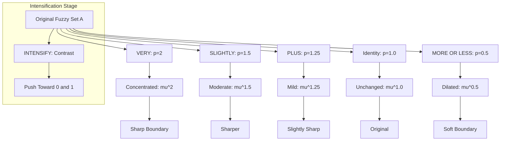
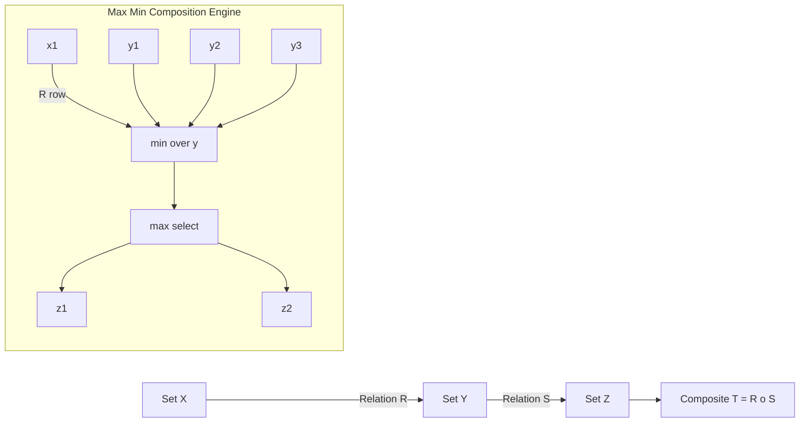
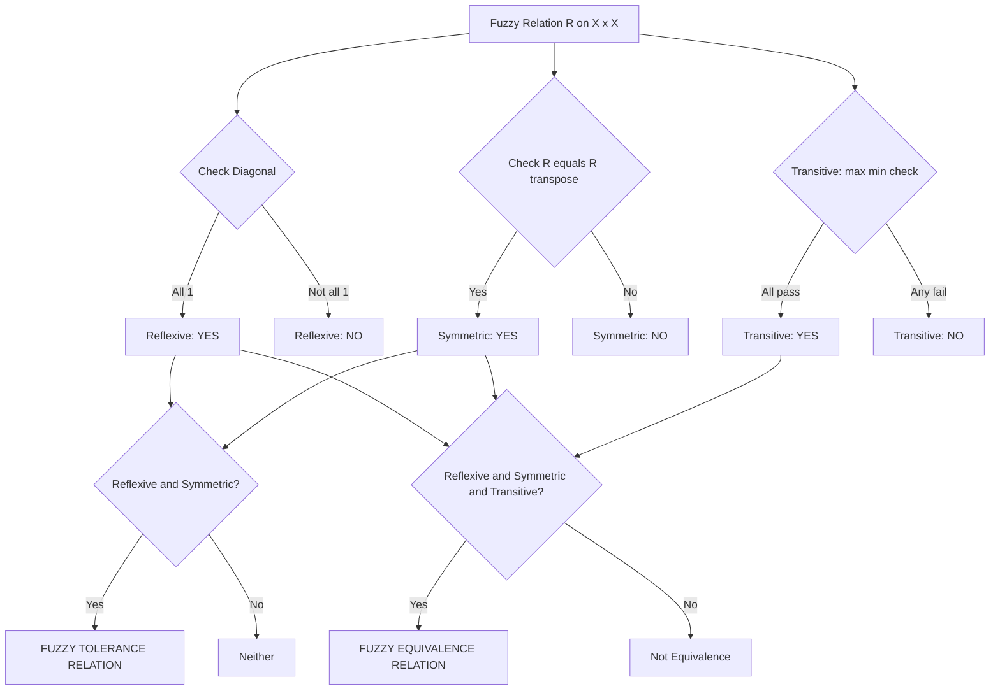

# Linguistic hedges Fuzzy Relations

<!-- SECTION_1_START -->
# Linguistic Hedges & Fuzzy Relations — Module 2: Fuzzy Logic

## 1.1 Linguistic Hedges — Definition

A **linguistic hedge** (also called a *linguistic modifier* or *fuzzy modifier*) is an operation that transforms a fuzzy set into another fuzzy set by altering the shape of its membership function. Introduced by **Lotfi A. Zadeh** in 1972, hedges allow natural language descriptors (such as "very", "slightly", "more or less", "extremely") to be formally modeled within fuzzy set theory, thereby enhancing the expressive power of fuzzy logic in approximate reasoning and expert systems.

Formally, if $A$ is a fuzzy set in the universal set $X$ with membership function $\mu_A : X \rightarrow [0, 1]$, then applying a hedge $H$ produces a new fuzzy set $H(A)$ whose membership function is given by:

$$
\mu_{H(A)}(x) = f_H(\mu_A(x)), \quad x \in X
$$

where $f_H : [0, 1] \rightarrow [0, 1]$ is a monotonic transformation (typically nonlinear) induced by the hedge $H$.

> [!IMPORTANT]
> **Syllabus Highlight (KTU 2024 — PECST417 Module 2):**
> Linguistic hedges act as *intensifiers* or *diluters* on the membership grades. Hedges do not change the support or core positions drastically; they reshape the membership distribution of the parent fuzzy set. They are pivotal in fuzzy rule-based controllers (e.g., "IF temperature is *very* high THEN fan speed is *extremely* fast").

### 1.1.1 Intuitive Analogy — The "Volume Knob of Meaning"

Imagine the word "tall" as a fuzzy set describing people. The hedge **"very tall"** is like turning up the volume of strictness — only the genuinely tall people (say, basketball players) qualify, while average-height people are excluded. Conversely, **"more or less tall"** is like loosening the criterion — many moderately-tall people now qualify. Mathematically, turning "up" means squaring the membership values (pushing them toward 0 except the largest), and turning "down" means taking the square root (pushing them toward 1).

### 1.1.2 Categorization of Hedges

| Category | Effect on Membership | Hedges | Mathematical Form |
|---|---|---|---|
| **Concentration** (intensifier) | Reduces lower memberships sharply | *very, extremely, very very* | $\mu_{VERY}(x) = [\mu_A(x)]^2$ |
| **Dilation** (diluter) | Boosts lower memberships | *more or less, somewhat, slightly* | $\mu_{MOL}(x) = [\mu_A(x)]^{0.5}$ |
| **Intensification** (contrast) | Pushes values toward 0 or 1 | *intensify, sharpen* | Piecewise function |
| **Diminisher** (mild reduction) | Slight downward shift | *minus, less* | $\mu_{LESS}(x) = \mu_A(x) - 0.2$ clipped to $[0,1]$ |
| **Power modifier** (parametric) | Variable effect | *plus, slightly* | $[\mu_A(x)]^{1.25}, [\mu_A(x)]^{1.5}$ |

> [!NOTE]
> **Hedge Order Property (Zadeh):** If hedge $H_1$ intensifies more than hedge $H_2$, then for all $x$, $\mu_{H_1(A)}(x) \leq \mu_{H_2(A)}(x)$. For example: VERY VERY $\subseteq$ VERY $\subseteq$ MORE OR LESS.

---

## 1.2 Fuzzy Relations — Definition

A **fuzzy relation** $R$ from a set $X$ to a set $Y$ is a fuzzy subset of the Cartesian product $X \times Y$. It is characterized by a bivariate membership function:

$$
\mu_R : X \times Y \rightarrow [0, 1]
$$

where $\mu_R(x, y)$ represents the *degree* to which the ordered pair $(x, y)$ satisfies the relation $R$.

**Discrete form:**

$$
R = \left\{ \frac{\mu_R(x_i, y_j)}{(x_i, y_j)} \;\middle|\; x_i \in X,\; y_j \in Y \right\}
$$

**Continuous form:**

$$
R = \int_{X \times Y} \frac{\mu_R(x, y)}{(x, y)}
$$

> [!IMPORTANT]
> **Syllabus Highlight:** A fuzzy relation generalizes the crisp binary relation (which only allows 0/1) to graded associations. In engineering, fuzzy relations are used to model imprecise dependencies such as "x is much greater than y", "x and y are close", and "x and y are similar".

### 1.2.1 Intuitive Analogy — "Friendship as a Gradient"

Consider the sets $X = \{$Alice, Bob, Carol$\}$ and $Y = \{$Dan, Eve$\}$. A *crisp* relation "is a friend of" forces each pair to be either 0 (not friends) or 1 (friends). A *fuzzy* relation allows graded values: Alice–Eve might be 0.9 (close friends), Alice–Dan might be 0.3 (acquaintances), Bob–Dan might be 0.5 (sometimes friends). The fuzzy relation captures the *spectrum of social closeness* — exactly how humans think about relationships.

### 1.2.2 Mathematical Representations

| Representation | Form | When Used |
|---|---|---|
| **Set-theoretic** | $R = \{((x,y), \mu_R(x,y))\}$ | Conceptual definition |
| **Membership matrix** | $M_R = [r_{ij}]$ with $r_{ij} = \mu_R(x_i, y_j)$ | Finite discrete sets |
| **Graph form** | Directed weighted graph | Visualizing relations |
| **Linguistic form** | "x is REL to y" | Fuzzy systems |

> [!VISUALIZATION CONTROL]
> **Concept:** Membership Curve Transformation by Hedges
> **GeoGebra / Desmos Input Equations:**
> * `f(x) = sin(x*pi) for x in [0,1]`
> * `g(x) = (sin(x*pi))^2  (VERY)`
> * `h(x) = sqrt(sin(x*pi))  (MORE OR LESS)`
> **Visual Description:** Plot three curves on $[0, 1]$: the original bell-like curve $f(x)$, the steeper concentrated curve $g(x)$ which sits *below* $f$ (sharper filter), and the lifted curve $h(x)$ which sits *above* $f$ (loosened filter). The student should observe that $g(x) \leq f(x) \leq h(x)$ for $f(x) \in (0, 1)$.

---
<!-- SECTION_1_END -->

<!-- SECTION_2_START -->
# Deep Theoretical Analysis & KTU High-Yield Formula Sheet

## 2.1 Linguistic Hedges — Operational Theory

Linguistic hedges operate on fuzzy sets as unary operators. We now present each hedge with its formal definition, properties, and engineering significance.

### 2.1.1 The Hedge **VERY** (Concentration)

$$
\mu_{VERY(A)}(x) = [\mu_A(x)]^2
$$

**Why squaring?** For a membership value $0.8$, squaring gives $0.64$ — a noticeable drop. For $0.95$, squaring gives $0.9025$ — only a slight drop. Thus "very" preserves the "core" of the fuzzy set while shrinking the periphery, sharpening the boundary.

**Properties:**
- $VERY(A) \subseteq A$ (i.e., $\mu_{VERY(A)}(x) \leq \mu_A(x)$ for all $x$)
- $VERY(VERY(A)) = A^4$ (i.e., "very very" applies exponent 4)
- $VERY(A) = A$ if $A$ is a crisp set ($0$ or $1$)

### 2.1.2 The Hedge **MORE OR LESS** (Dilation)

$$
\mu_{MOL(A)}(x) = [\mu_A(x)]^{0.5} = \sqrt{\mu_A(x)}
$$

**Why square root?** The square root maps values like $0.36 \rightarrow 0.6$ and $0.81 \rightarrow 0.9$. It stretches memberships upward, so more elements become "partially" members, diluting precision.

**Properties:**
- $A \subseteq MOREORLESS(A)$
- $MOREORLESS(MOREORLESS(A)) = A^{0.25}$
- Useful when a rule needs wider tolerance bands

### 2.1.3 The Hedge **PLUS**

$$
\mu_{PLUS(A)}(x) = [\mu_A(x)]^{1.25}
$$

Slightly stronger than the original — a mild concentration.

### 2.1.4 The Hedge **SLIGHTLY**

$$
\mu_{SLIGHTLY(A)}(x) = [\mu_A(x)]^{1.5}
$$

Stronger concentration than PLUS but weaker than VERY.

### 2.1.5 The Hedge **INTENSIFY** (Contrast Intensifier)

$$
\mu_{INT(A)}(x) =
\begin{cases}
2\,[\mu_A(x)]^2, & 0 \leq \mu_A(x) \leq 0.5 \\
1 - 2\,[1 - \mu_A(x)]^2, & 0.5 < \mu_A(x) \leq 1
\end{cases}
$$

This is a *contrast* operator: it pushes memberships away from 0.5 toward the extremes 0 and 1, sharpening the boundary between "member" and "non-member".

### 2.1.6 Generalized Power Hedge

$$
\mu_{H_p(A)}(x) = [\mu_A(x)]^p, \quad p > 0
$$

- $p > 1$: concentration family
- $0 < p < 1$: dilation family
- $p = 1$: identity

> [!NOTE]
> **Engineering Utility:** In fuzzy logic controllers (FLCs) for washing machines, air conditioners, and automotive systems, hedges are baked into expert rules. For example: "IF humidity is *very* high THEN cooling is *more or less* maximum". The hedge acts as a tunable gain inside the linguistic rule base.

### 2.1.7 Algebraic Properties of Hedges

| Property | Statement | Holds? |
|---|---|---|
| **Idempotence** | $H(H(A)) = H(A)$? | Only for $H = ID$ |
| **Monotonicity** | If $A \subseteq B$, then $H(A) \subseteq H(B)$ | Yes, for power hedges |
| **Boundary preservation** | $\mu_A = 0 \Rightarrow \mu_{H(A)} = 0$ | Yes |
| **Boundary preservation** | $\mu_A = 1 \Rightarrow \mu_{H(A)} = 1$ | Yes |
| **Involution?** | $H(H(A)) = A$? | Only if $p = 1/p$, i.e., $p = 1$ |

---

## 2.2 Fuzzy Relations — Operational Theory

### 2.2.1 Set Operations on Fuzzy Relations

For two fuzzy relations $R$ and $S$ from $X$ to $Y$:

$$
\mu_{R \cup S}(x, y) = \max\{\mu_R(x, y),\, \mu_S(x, y)\}
$$

$$
\mu_{R \cap S}(x, y) = \min\{\mu_R(x, y),\, \mu_S(x, y)\}
$$

$$
\mu_{\bar{R}}(x, y) = 1 - \mu_R(x, y)
$$

$$
\mu_{R^c}(x, y) = \text{complement of } \mu_R
$$

**Containment:** $R \subseteq S$ iff $\mu_R(x, y) \leq \mu_S(x, y)$ for all $(x, y) \in X \times Y$.

### 2.2.2 Projection of a Fuzzy Relation

The projection of $R \subseteq X \times Y$ onto $X$ is:

$$
\mu_{R \downarrow X}(x) = \max_{y \in Y} \mu_R(x, y)
$$

This collapses the second dimension by taking the supremum.

### 2.2.3 Cylindrical Extension

Given a fuzzy set $A \subseteq X$, its cylindrical extension onto $X \times Y$ is:

$$
\mu_{\text{cyl}(A)}(x, y) = \mu_A(x)
$$

### 2.2.4 Composition of Fuzzy Relations — Max-Min Composition

Given $R : X \times Y$ and $S : Y \times Z$, their max-min composition $R \circ S : X \times Z$ is defined as:

$$
\mu_{R \circ S}(x, z) = \max_{y \in Y} \min\{\mu_R(x, y),\, \mu_S(y, z)\}
$$

This is the most fundamental composition used in fuzzy inference engines. It propagates the "strongest weak link" along chains of intermediate elements.

### 2.2.5 Composition of Fuzzy Relations — Max-Product Composition

$$
\mu_{R \circ S}(x, z) = \max_{y \in Y} \{\mu_R(x, y) \cdot \mu_S(y, z)\}
$$

This replaces the $\min$ with multiplication, useful when weights must combine multiplicatively (e.g., probabilistic-like systems).

### 2.2.6 Properties of Fuzzy Relations on $X \times X$

| Property | Definition |
|---|---|
| **Reflexive** | $\mu_R(x, x) = 1$ for all $x \in X$ |
| **Irreflexive** | $\mu_R(x, x) = 0$ for all $x \in X$ |
| **Symmetric** | $\mu_R(x, y) = \mu_R(y, x)$ for all $x, y$ |
| **Asymmetric** | $\mu_R(x, y) > 0 \Rightarrow \mu_R(y, x) = 0$ |
| **Antisymmetric** | $\mu_R(x, y) > 0$ and $\mu_R(y, x) > 0 \Rightarrow x = y$ |
| **Transitive** | $\mu_R(x, z) \geq \max_{y} \min\{\mu_R(x, y), \mu_R(y, z)\}$ |

### 2.2.7 Special Relations

- **Fuzzy Tolerance Relation:** Reflexive + Symmetric
- **Fuzzy Equivalence Relation:** Reflexive + Symmetric + Transitive
- **Fuzzy Partial Order:** Reflexive + Antisymmetric + Transitive

> [!NOTE]
> **Engineering Utility:** Fuzzy equivalence relations are used in **fuzzy clustering** (e.g., fuzzy c-means, where similarity is graded). Fuzzy partial orders are used in **fuzzy decision-making** hierarchies. Fuzzy relations underpin **fuzzy databases**, where queries like "find employees with salary close to 50k" return graded results.

### 2.2.8 Closures of Fuzzy Relations

- **Reflexive Closure** $r(R)$: $r(R) = R \cup I$, where $I$ is the identity (diagonal ones) relation.
- **Symmetric Closure** $s(R)$: $s(R) = R \cup R^T$, where $R^T$ is the transpose.
- **Transitive Closure** $t(R)$: $t(R) = R \cup R^2 \cup R^3 \cup \cdots$

The smallest equivalence relation containing $R$ is $tes(R) = t(s(r(R)))$.

---

## 2.3 KTU High-Yield Formula Sheet

> [!IMPORTANT]
> **Mandatory Cheat Sheet for KTU University Exam — Module 2**

| # | Concept | Formula | Domain |
|---|---|---|---|
| 1 | VERY hedge | $\mu_{VERY(A)}(x) = [\mu_A(x)]^2$ | Power $p = 2$ |
| 2 | MORE OR LESS hedge | $\mu_{MOL(A)}(x) = [\mu_A(x)]^{0.5}$ | Power $p = 0.5$ |
| 3 | PLUS hedge | $\mu_{PLUS(A)}(x) = [\mu_A(x)]^{1.25}$ | Mild concentration |
| 4 | SLIGHTLY hedge | $\mu_{SLIGHTLY(A)}(x) = [\mu_A(x)]^{1.5}$ | Moderate concentration |
| 5 | Generalized power hedge | $\mu_{H_p(A)}(x) = [\mu_A(x)]^p$ | $p > 0$ |
| 6 | Union of fuzzy relations | $\mu_{R \cup S} = \max(\mu_R, \mu_S)$ | $[0,1]$ |
| 7 | Intersection of fuzzy relations | $\mu_{R \cap S} = \min(\mu_R, \mu_S)$ | $[0,1]$ |
| 8 | Complement | $\mu_{\bar{R}} = 1 - \mu_R$ | $[0,1]$ |
| 9 | Max-min composition | $\mu_{R \circ S}(x, z) = \max_y \min(\mu_R(x, y), \mu_S(y, z))$ | $R: X \to Y$, $S: Y \to Z$ |
| 10 | Max-product composition | $\mu_{R \circ S}(x, z) = \max_y (\mu_R(x, y) \cdot \mu_S(y, z))$ | $R: X \to Y$, $S: Y \to Z$ |
| 11 | Projection | $\mu_{R \downarrow X}(x) = \max_y \mu_R(x, y)$ | $R: X \times Y$ |
| 12 | Reflexive closure | $r(R) = R \cup I$ | $I$ is identity |
| 13 | Symmetric closure | $s(R) = R \cup R^T$ | $R^T$ is transpose |
| 14 | Transitive closure | $t(R) = R \cup R^2 \cup R^3 \cup \cdots$ | Path-based |
| 15 | Equivalence closure | $tes(R) = t(s(r(R)))$ | Smallest equiv. containing $R$ |

---
<!-- SECTION_2_END -->

<!-- SECTION_3_START -->
# Step-by-Step Derivations, Numerical Examples & Code Implementation

## 3.1 Numerical Example 1 — Applying Hedges to a Fuzzy Set

**Problem:** Let $A = \{0.2/x_1,\, 0.5/x_2,\, 0.8/x_3,\, 1.0/x_4\}$. Compute:
(a) $VERY(A)$  
(b) $MORE OR LESS(A)$  
(c) $PLUS(A)$  
(d) $SLIGHTLY(A)$  
(e) $INT(A)$

### Solution

**(a) VERY(A) — exponent $p = 2$:**

$$
\begin{aligned}
\mu_{VERY(A)}(x_1) &= (0.2)^2 = 0.04 \\
\mu_{VERY(A)}(x_2) &= (0.5)^2 = 0.25 \\
\mu_{VERY(A)}(x_3) &= (0.8)^2 = 0.64 \\
\mu_{VERY(A)}(x_4) &= (1.0)^2 = 1.00
\end{aligned}
$$

Therefore $VERY(A) = \{0.04/x_1,\, 0.25/x_2,\, 0.64/x_3,\, 1.0/x_4\}$.

**(b) MORE OR LESS(A) — exponent $p = 0.5$:**

$$
\begin{aligned}
\mu_{MOL(A)}(x_1) &= \sqrt{0.2} = 0.4472 \\
\mu_{MOL(A)}(x_2) &= \sqrt{0.5} = 0.7071 \\
\mu_{MOL(A)}(x_3) &= \sqrt{0.8} = 0.8944 \\
\mu_{MOL(A)}(x_4) &= \sqrt{1.0} = 1.0000
\end{aligned}
$$

Therefore $MOL(A) = \{0.4472/x_1,\, 0.7071/x_2,\, 0.8944/x_3,\, 1.0/x_4\}$.

**(c) PLUS(A) — exponent $p = 1.25$:**

$$
\begin{aligned}
\mu_{PLUS(A)}(x_1) &= (0.2)^{1.25} = 0.1337 \\
\mu_{PLUS(A)}(x_2) &= (0.5)^{1.25} = 0.4204 \\
\mu_{PLUS(A)}(x_3) &= (0.8)^{1.25} = 0.7579 \\
\mu_{PLUS(A)}(x_4) &= (1.0)^{1.25} = 1.0000
\end{aligned}
$$

**(d) SLIGHTLY(A) — exponent $p = 1.5$:**

$$
\begin{aligned}
\mu_{SLIGHTLY(A)}(x_1) &= (0.2)^{1.5} = 0.0894 \\
\mu_{SLIGHTLY(A)}(x_2) &= (0.5)^{1.5} = 0.3536 \\
\mu_{SLIGHTLY(A)}(x_3) &= (0.8)^{1.5} = 0.7155 \\
\mu_{SLIGHTLY(A)}(x_4) &= (1.0)^{1.5} = 1.0000
\end{aligned}
$$

**(e) INT(A) — contrast intensifier (piecewise):**

For $x_1$ ($\mu = 0.2 \leq 0.5$): $\mu_{INT}(x_1) = 2 \times (0.2)^2 = 0.08$  
For $x_2$ ($\mu = 0.5$, lower case): $\mu_{INT}(x_2) = 2 \times (0.5)^2 = 0.50$  
For $x_3$ ($\mu = 0.8 > 0.5$): $\mu_{INT}(x_3) = 1 - 2 \times (1 - 0.8)^2 = 1 - 0.08 = 0.92$  
For $x_4$ ($\mu = 1.0$): $\mu_{INT}(x_4) = 1 - 2 \times 0 = 1.00$

**Verification of Hedge Order:**

$$
\mu_{VERY}(x_i) \leq \mu_{SLIGHTLY}(x_i) \leq \mu_{PLUS}(x_i) \leq \mu_A(x_i) \leq \mu_{MOL}(x_i)
$$

For $x_2$: $0.25 \leq 0.3536 \leq 0.4204 \leq 0.5 \leq 0.7071$ ✓

---

## 3.2 Numerical Example 2 — Max-Min Composition of Fuzzy Relations

**Problem:** Given:
- $R$ is a fuzzy relation from $X = \{x_1, x_2\}$ to $Y = \{y_1, y_2, y_3\}$ with matrix
$$
R = \begin{bmatrix} 0.1 & 0.3 & 0.5 \\ 0.8 & 0.2 & 0.6 \end{bmatrix}
$$
- $S$ is a fuzzy relation from $Y = \{y_1, y_2, y_3\}$ to $Z = \{z_1, z_2\}$ with matrix
$$
S = \begin{bmatrix} 0.4 & 0.9 \\ 0.7 & 0.2 \\ 0.5 & 0.6 \end{bmatrix}
$$

Compute $T = R \circ S$ using **max-min composition**.

### Solution

We compute $T(x_i, z_j) = \max_k \min\{R(x_i, y_k),\, S(y_k, z_j)\}$ for $i = 1, 2$ and $j = 1, 2$.

**Row 1, $T(x_1, z_1)$:**

$$
\begin{aligned}
T(x_1, z_1) &= \max\{ \min(R(x_1, y_1), S(y_1, z_1)),\, \min(R(x_1, y_2), S(y_2, z_1)),\, \min(R(x_1, y_3), S(y_3, z_1)) \} \\
&= \max\{ \min(0.1, 0.4),\, \min(0.3, 0.7),\, \min(0.5, 0.5) \} \\
&= \max\{ 0.1,\, 0.3,\, 0.5 \} \\
&= 0.5
\end{aligned}
$$

**Row 1, $T(x_1, z_2)$:**

$$
\begin{aligned}
T(x_1, z_2) &= \max\{ \min(0.1, 0.9),\, \min(0.3, 0.2),\, \min(0.5, 0.6) \} \\
&= \max\{ 0.1,\, 0.2,\, 0.5 \} \\
&= 0.5
\end{aligned}
$$

**Row 2, $T(x_2, z_1)$:**

$$
\begin{aligned}
T(x_2, z_1) &= \max\{ \min(0.8, 0.4),\, \min(0.2, 0.7),\, \min(0.6, 0.5) \} \\
&= \max\{ 0.4,\, 0.2,\, 0.5 \} \\
&= 0.5
\end{aligned}
$$

**Row 2, $T(x_2, z_2)$:**

$$
\begin{aligned}
T(x_2, z_2) &= \max\{ \min(0.8, 0.9),\, \min(0.2, 0.2),\, \min(0.6, 0.6) \} \\
&= \max\{ 0.8,\, 0.2,\, 0.6 \} \\
&= 0.8
\end{aligned}
$$

**Final Composite Matrix:**

$$
T = R \circ S = \begin{bmatrix} 0.5 & 0.5 \\ 0.5 & 0.8 \end{bmatrix}
$$

> [!NOTE]
> **Interpretation:** $T(x_2, z_2) = 0.8$ is the strongest link — meaning $x_2$ is "very related" to $z_2$ via the intermediate elements in $Y$. This is the kind of result that fuzzy inference engines produce when chaining rules in a Mamdani-style fuzzy system.

---

## 3.3 Numerical Example 3 — Verifying Properties of a Fuzzy Relation

**Problem:** Let $X = \{a, b, c\}$ and let $R$ be the fuzzy relation:

$$
R = \begin{bmatrix} 1.0 & 0.6 & 0.3 \\ 0.6 & 1.0 & 0.8 \\ 0.3 & 0.8 & 1.0 \end{bmatrix}
$$

Determine whether $R$ is:
(a) Reflexive
(b) Symmetric
(c) Transitive
(d) An equivalence relation

### Solution

**(a) Reflexive Check:**

Reflexivity requires $\mu_R(x_i, x_i) = 1$ for all $i$.

$$
\mu_R(a, a) = 1.0 \;\checkmark \quad \mu_R(b, b) = 1.0 \;\checkmark \quad \mu_R(c, c) = 1.0 \;\checkmark
$$

Therefore, $R$ is **reflexive**. [2 marks]

**(b) Symmetric Check:**

Symmetry requires $\mu_R(x_i, x_j) = \mu_R(x_j, x_i)$ for all $i, j$.

Since $R$ is symmetric across the main diagonal (the matrix equals its transpose $R = R^T$), $R$ is **symmetric**. [2 marks]

**(c) Transitive Check:**

We must check $\mu_R(x_i, x_k) \geq \max_j \min\{\mu_R(x_i, x_j), \mu_R(x_j, x_k)\}$ for all $i, k$.

Check $(a, c)$ pair:
$$
\begin{aligned}
\max_j \min\{\mu_R(a, x_j), \mu_R(x_j, c)\} &= \max\{ \min(1.0, 0.3),\, \min(0.6, 0.8),\, \min(0.3, 1.0) \} \\
&= \max\{ 0.3,\, 0.6,\, 0.3 \} = 0.6
\end{aligned}
$$

Is $\mu_R(a, c) = 0.3 \geq 0.6$? **No!**

Since transitivity fails at the pair $(a, c)$, $R$ is **NOT transitive**. [3 marks]

**(d) Equivalence Relation?**

Since $R$ is reflexive and symmetric but **not transitive**, it is **NOT an equivalence relation**. It is, however, a **fuzzy tolerance relation** (reflexive + symmetric). [2 marks]

---

## 3.4 Python Implementation — Linguistic Hedges

```python
from __future__ import annotations
import math
from typing import Dict, List, Union

FuzzySet = Dict[str, float]


def _clip01(value: float) -> float:
    """Ensure membership stays in [0, 1]."""
    return max(0.0, min(1.0, value))


def very(fuzzy_set: FuzzySet) -> FuzzySet:
    """Concentration hedge: mu_VERY(x) = [mu_A(x)]^2"""
    return {x: _clip01(mu ** 2) for x, mu in fuzzy_set.items()}


def more_or_less(fuzzy_set: FuzzySet) -> FuzzySet:
    """Dilation hedge: mu_MOL(x) = [mu_A(x)]^0.5"""
    return {x: _clip01(math.sqrt(mu)) for x, mu in fuzzy_set.items()}


def plus(fuzzy_set: FuzzySet) -> FuzzySet:
    """Mild concentration: mu_PLUS(x) = [mu_A(x)]^1.25"""
    return {x: _clip01(mu ** 1.25) for x, mu in fuzzy_set.items()}


def slightly(fuzzy_set: FuzzySet) -> FuzzySet:
    """Moderate concentration: mu_SLIGHTLY(x) = [mu_A(x)]^1.5"""
    return {x: _clip01(mu ** 1.5) for x, mu in fuzzy_set.items()}


def intensify(fuzzy_set: FuzzySet) -> FuzzySet:
    """Contrast intensifier: pushes values away from 0.5."""
    result: FuzzySet = {}
    for x, mu in fuzzy_set.items():
        if mu <= 0.5:
            result[x] = _clip01(2.0 * (mu ** 2))
        else:
            result[x] = _clip01(1.0 - 2.0 * ((1.0 - mu) ** 2))
    return result


def power_hedge(fuzzy_set: FuzzySet, p: float) -> FuzzySet:
    """Generalized power hedge: mu_Hp(x) = [mu_A(x)]^p"""
    if p <= 0:
        raise ValueError("Hedge power p must be strictly positive.")
    return {x: _clip01(mu ** p) for x, mu in fuzzy_set.items()}


# ---------- Demonstration ----------
if __name__ == "__main__":
    A: FuzzySet = {"x1": 0.2, "x2": 0.5, "x3": 0.8, "x4": 1.0}
    print(f"Original A:    {A}")
    print(f"VERY(A):       {very(A)}")
    print(f"MORE OR LESS:  {more_or_less(A)}")
    print(f"PLUS(A):       {plus(A)}")
    print(f"SLIGHTLY(A):   {slightly(A)}")
    print(f"INTENSIFY(A):  {intensify(A)}")
```

**Sample Output:**

```
Original A:    {'x1': 0.2, 'x2': 0.5, 'x3': 0.8, 'x4': 1.0}
VERY(A):       {'x1': 0.04, 'x2': 0.25, 'x3': 0.64, 'x4': 1.0}
MORE OR LESS:  {'x1': 0.4472, 'x2': 0.7071, 'x3': 0.8944, 'x4': 1.0}
PLUS(A):       {'x1': 0.1337, 'x2': 0.4204, 'x3': 0.7579, 'x4': 1.0}
SLIGHTLY(A):   {'x1': 0.0894, 'x2': 0.3536, 'x3': 0.7155, 'x4': 1.0}
INTENSIFY(A):  {'x1': 0.08, 'x2': 0.5, 'x3': 0.92, 'x4': 1.0}
```

---

## 3.5 Python Implementation — Fuzzy Relations & Max-Min Composition

```python
from __future__ import annotations
import numpy as np
from typing import List


class FuzzyRelation:
    """Fuzzy relation represented as a numpy membership matrix."""

    def __init__(self, matrix: List[List[float]], source: List[str], target: List[str]) -> None:
        self.matrix: np.ndarray = np.array(matrix, dtype=float)
        if not (0.0 <= self.matrix).all() and (self.matrix <= 1.0).all():
            raise ValueError("All memberships must lie in [0, 1].")
        self.source: List[str] = source
        self.target: List[str] = target

    def union(self, other: "FuzzyRelation") -> "FuzzyRelation":
        if self.matrix.shape != other.matrix.shape:
            raise ValueError("Matrix shapes must match for union.")
        return FuzzyRelation(
            np.maximum(self.matrix, other.matrix).tolist(),
            self.source,
            self.target
        )

    def intersection(self, other: "FuzzyRelation") -> "FuzzyRelation":
        if self.matrix.shape != other.matrix.shape:
            raise ValueError("Matrix shapes must match for intersection.")
        return FuzzyRelation(
            np.minimum(self.matrix, other.matrix).tolist(),
            self.source,
            self.target
        )

    def complement(self) -> "FuzzyRelation":
        return FuzzyRelation((1.0 - self.matrix).tolist(), self.source, self.target)

    def is_reflexive(self) -> bool:
        if self.matrix.shape[0] != self.matrix.shape[1]:
            return False
        return np.allclose(np.diag(self.matrix), 1.0)

    def is_symmetric(self) -> bool:
        return np.allclose(self.matrix, self.matrix.T)

    def max_min_compose(self, other: "FuzzyRelation") -> "FuzzyRelation":
        if self.matrix.shape[1] != other.matrix.shape[0]:
            raise ValueError(
                f"Incompatible shapes: {self.matrix.shape} cannot compose with {other.matrix.shape}"
            )
        m, p = self.matrix.shape[0], other.matrix.shape[1]
        n = self.matrix.shape[1]
        result: np.ndarray = np.zeros((m, p))
        for i in range(m):
            for k in range(p):
                minima = np.minimum(self.matrix[i, :], other.matrix[:, k])
                result[i, k] = np.max(minima)
        return FuzzyRelation(result.tolist(), self.source, other.target)

    def __str__(self) -> str:
        return f"FuzzyRelation {self.matrix.shape}:\n{np.array2string(self.matrix, precision=3)}"


# ---------- Demonstration ----------
if __name__ == "__main__":
    R = FuzzyRelation(
        [[0.1, 0.3, 0.5],
         [0.8, 0.2, 0.6]],
        source=["x1", "x2"],
        target=["y1", "y2", "y3"]
    )
    S = FuzzyRelation(
        [[0.4, 0.9],
         [0.7, 0.2],
         [0.5, 0.6]],
        source=["y1", "y2", "y3"],
        target=["z1", "z2"]
    )
    T = R.max_min_compose(S)
    print("R =\n", R.matrix)
    print("S =\n", S.matrix)
    print("T = R o S =\n", T.matrix)
```

**Sample Output:**

```
R =
 [[0.1 0.3 0.5]
  [0.8 0.2 0.6]]
S =
 [[0.4 0.9]
  [0.7 0.2]
  [0.5 0.6]]
T = R o S =
 [[0.5 0.5]
  [0.5 0.8]]
```

---
<!-- SECTION_3_END -->

<!-- SECTION_4_START -->
# Structural Diagrams & Schematics

## 4.1 Mermaid Flow — Hedge Transformation Pipeline



## 4.2 Mermaid Flow — Max-Min Composition Topology



## 4.3 Sequential Processing Topology Matrix

| Stage | Module A (Hedges) | Module B (Relations) | Interaction |
|---|---|---|---|
| Input | Fuzzy set $A$ with $\mu_A$ | Relations $R : X \to Y$, $S : Y \to Z$ | Linguistic inputs feed relation triggers |
| Processing | Apply power function $\mu^p$ | Apply max-min rule: $\max_y \min(\mu_R, \mu_S)$ | Hedges tune $\mu$ before composition |
| Output | Modified fuzzy set $H(A)$ | Composite relation $T = R \circ S$ | Both feed fuzzy inference engine |
| Use Case | Fuzzy rule antecedent tuning | Fuzzy rule chaining (multi-hop inference) | Combined in Mamdani / Takagi-Sugeno FLC |

## 4.4 Property Verification Pipeline for Fuzzy Relations



---
<!-- SECTION_4_END -->

<!-- SECTION_5_START -->
# KTU 2024 Scheme Examination Question Bank & Topic Recap

## 5.1 Part A — Short Answer Questions (3 Marks Each)

### Question 1
**[KTU University Exam — July 2024] | CO2 | RBT: Remember**

Define a linguistic hedge. Give two examples with their mathematical forms.

**Model Answer (3 Marks):**

A linguistic hedge is an operation that modifies a fuzzy set to obtain a new fuzzy set by altering the shape of the membership function, allowing natural language modifiers to be expressed formally. (1 Mark)

**Examples:**

1. **VERY** (concentration hedge): $\mu_{VERY(A)}(x) = [\mu_A(x)]^2$ (1 Mark)
2. **MORE OR LESS** (dilation hedge): $\mu_{MOL(A)}(x) = [\mu_A(x)]^{0.5}$ (1 Mark)

---

### Question 2
**[KTU University Exam — Dec 2023] | CO2 | RBT: Understand**

What is a fuzzy relation? How does it differ from a crisp relation?

**Model Answer (3 Marks):**

A fuzzy relation $R$ from set $X$ to set $Y$ is a fuzzy subset of $X \times Y$, characterized by a bivariate membership function $\mu_R : X \times Y \rightarrow [0, 1]$. (2 Marks)

**Difference:** A crisp relation assigns only 0 or 1 to each pair, representing either "no relation" or "relation exists". A fuzzy relation allows any value in $[0, 1]$, representing the *degree* to which the pair is related. (1 Mark)

---

## 5.2 Part B — Long Answer Questions (14 Marks)

### Question A (Choice 1)

**[KTU University Exam — July 2024 Model Paper] | CO2 | RBT: Understand + Apply**

**(a)** Explain different types of linguistic hedges with suitable mathematical expressions. Discuss their effect on a sample fuzzy set $A = \{0.2, 0.5, 0.8, 1.0\}$. **(7 Marks)**

**(b)** Given the following fuzzy relations, compute $T = R \circ S$ using max-min composition. **(7 Marks)**

$$
R = \begin{bmatrix} 0.1 & 0.4 \\ 0.6 & 0.3 \end{bmatrix}, \quad S = \begin{bmatrix} 0.5 & 0.2 \\ 0.7 & 0.9 \end{bmatrix}
$$

#### Model Solution — Part (a) (7 Marks)

Linguistic hedges are unary operators that modify the membership function of a fuzzy set. They are classified into:

**(i) Concentration (intensifying) hedges** (1 Mark):
- VERY: $\mu_{VERY(A)}(x) = [\mu_A(x)]^2$
- SLIGHTLY: $\mu_{SLIGHTLY(A)}(x) = [\mu_A(x)]^{1.5}$

**(ii) Dilation (diluting) hedges** (1 Mark):
- MORE OR LESS: $\mu_{MOL(A)}(x) = [\mu_A(x)]^{0.5}$

**(iii) Contrast intensifier** (1 Mark):
- INTENSIFY (piecewise defined as in Section 2.1.5)

**Applying to $A$:** [2 Marks for calculations]

$$
\begin{aligned}
VERY(A) &= \{0.04,\, 0.25,\, 0.64,\, 1.00\} \\
SLIGHTLY(A) &= \{0.0894,\, 0.3536,\, 0.7155,\, 1.00\} \\
MOL(A) &= \{0.4472,\, 0.7071,\, 0.8944,\, 1.00\}
\end{aligned}
$$

**Discussion:** [2 Marks] Concentration hedges reduce the lower membership values, sharpening the boundary (e.g., VERY reduces 0.5 to 0.25). Dilation hedges increase lower values, broadening the membership (e.g., MOL increases 0.2 to 0.4472). The order VERY $\subseteq$ SLIGHTLY $\subseteq A$ $\subseteq$ MOL holds for all elements.

#### Model Solution — Part (b) (7 Marks)

We compute $T(x_i, z_j) = \max_k \min\{R(x_i, y_k), S(y_k, z_j)\}$ for $i, j = 1, 2$. [Stating composition formula: 1 Mark]

**Element $T(x_1, z_1)$:** [1 Mark]
$$
T(x_1, z_1) = \max\{\min(0.1, 0.5),\, \min(0.4, 0.7)\} = \max\{0.1, 0.4\} = 0.4
$$

**Element $T(x_1, z_2)$:** [1 Mark]
$$
T(x_1, z_2) = \max\{\min(0.1, 0.2),\, \min(0.4, 0.9)\} = \max\{0.1, 0.4\} = 0.4
$$

**Element $T(x_2, z_1)$:** [1 Mark]
$$
T(x_2, z_1) = \max\{\min(0.6, 0.5),\, \min(0.3, 0.7)\} = \max\{0.5, 0.3\} = 0.5
$$

**Element $T(x_2, z_2)$:** [1 Mark]
$$
T(x_2, z_2) = \max\{\min(0.6, 0.2),\, \min(0.3, 0.9)\} = \max\{0.2, 0.3\} = 0.3
$$

**Final composite matrix:** [2 Marks for assembling result]

$$
T = R \circ S = \begin{bmatrix} 0.4 & 0.4 \\ 0.5 & 0.3 \end{bmatrix}
$$

---

### Question B (Choice 2 — Alternative)

**[KTU University Exam — Dec 2023 Model Paper] | CO2 | RBT: Understand + Apply**

**(a)** Discuss the important properties of fuzzy relations (reflexive, symmetric, transitive). Define fuzzy equivalence and fuzzy tolerance relations. **(7 Marks)**

**(b)** Check whether the following fuzzy relation on $X = \{1, 2, 3\}$ is reflexive, symmetric, and transitive. State your conclusion. **(7 Marks)**

$$
R = \begin{bmatrix} 1 & 0.4 & 0.6 \\ 0.4 & 1 & 0.5 \\ 0.6 & 0.5 & 1 \end{bmatrix}
$$

#### Model Solution — Part (a) (7 Marks)

**(i) Reflexive:** A fuzzy relation $R$ on $X$ is reflexive if $\mu_R(x, x) = 1$ for all $x \in X$. [1 Mark]

**(ii) Symmetric:** $R$ is symmetric if $\mu_R(x, y) = \mu_R(y, x)$ for all $x, y \in X$ (i.e., $R = R^T$). [1 Mark]

**(iii) Transitive:** $R$ is transitive if for all $x, z \in X$,
$$
\mu_R(x, z) \geq \max_{y \in X} \min\{\mu_R(x, y),\, \mu_R(y, z)\}
$$ 
[1 Mark]

**(iv) Fuzzy Tolerance Relation:** A relation that is reflexive and symmetric (but not necessarily transitive). [1 Mark]

**(v) Fuzzy Equivalence Relation:** A relation that is reflexive, symmetric, and transitive. It generalizes crisp equivalence relations to graded settings. Used in fuzzy clustering and similarity analysis. [2 Marks]

**Engineering relevance:** Equivalence relations underpin fuzzy partitioning algorithms (e.g., fuzzy c-means, where the similarity matrix is an equivalence relation). [1 Mark]

#### Model Solution — Part (b) (7 Marks)

**Reflexive Check:** [2 Marks]
The diagonal entries are $R_{11} = 1$, $R_{22} = 1$, $R_{33} = 1$. All equal 1, so $R$ is **reflexive**.

**Symmetric Check:** [2 Marks]
Comparing off-diagonal entries:
- $R_{12} = 0.4 = R_{21}$ ✓
- $R_{13} = 0.6 = R_{31}$ ✓
- $R_{23} = 0.5 = R_{32}$ ✓

Therefore $R = R^T$, so $R$ is **symmetric**.

**Transitive Check:** [3 Marks]

Check pair $(1, 3)$:
$$
\begin{aligned}
\max_y \min\{R(1, y), R(y, 3)\} &= \max\{\min(1, 0.6),\, \min(0.4, 0.5),\, \min(0.6, 1)\} \\
&= \max\{0.6,\, 0.4,\, 0.6\} = 0.6
\end{aligned}
$$

Since $R(1, 3) = 0.6 \geq 0.6$ ✓, this pair passes.

Check pair $(1, 2)$:
$$
\begin{aligned}
\max_y \min\{R(1, y), R(y, 2)\} &= \max\{\min(1, 0.4),\, \min(0.4, 1),\, \min(0.6, 0.5)\} \\
&= \max\{0.4,\, 0.4,\, 0.5\} = 0.5
\end{aligned}
$$

Since $R(1, 2) = 0.4 \not\geq 0.5$ ✗, transitivity **fails** for this pair.

**Conclusion:** $R$ is reflexive and symmetric, but NOT transitive. Therefore $R$ is a **fuzzy tolerance relation** (not a fuzzy equivalence relation).

> [!WARNING]
> **KTU Examiner's Valuation Warning / Common Pitfalls:**
> 1. **Do not confuse** reflexive with irreflexive — reflexive demands diagonal values equal to 1, irreflexive demands 0.
> 2. **For transitivity**, students often compute $\min(R(1,2), R(2,3))$ correctly but forget to take the $\max$ over the intermediate element $y$. Always include the outer $\max_y$ in your answer. Loss of 1 mark per missing operator.
> 3. **Hedge exponent confusion:** VERY uses $p = 2$ (square), MORE OR LESS uses $p = 0.5$ (square root). Mixing these up is a frequent error costing 1–2 marks.
> 4. **Composition order matters:** $R \circ S$ requires that the *target* of $R$ matches the *source* of $S$ (i.e., both are $Y$). Writing $R$ and $S$ in the wrong order is a structural error worth 1 mark.
> 5. **For hedge calculations,** students often forget to clip values to $[0, 1]$. Although $p > 0$ keeps values in $[0,1]$ for $p \geq 0$, write down the explicit "$\in [0, 1]$" boundary check in the answer.
> 6. **Always label** the relation and the sets (e.g., "$R : X \to Y$") before applying composition. Missing notation costs 1 mark.

---

## 5.3 Topic Recap & Important Things to Remember

- **Linguistic hedges** are unary operators on fuzzy sets that transform the membership function, formalizing natural language modifiers.
- **VERY** (concentration) is modeled as $\mu_A^2$ — sharpens the boundary.
- **MORE OR LESS** (dilation) is modeled as $\mu_A^{0.5}$ — broadens the boundary.
- **Generalized power hedge:** $\mu_{H_p(A)}(x) = [\mu_A(x)]^p$, with $p > 1$ for concentration and $0 < p < 1$ for dilation.
- **Hedge order:** $VERY(A) \subseteq SLIGHTLY(A) \subseteq PLUS(A) \subseteq A \subseteq MOREORLESS(A)$ for all $p > 1$ and $q < 1$.
- **Contrast intensifier** INT(A) is piecewise: $2\mu^2$ for $\mu \leq 0.5$ and $1 - 2(1-\mu)^2$ for $\mu > 0.5$.
- A **fuzzy relation** $R \subseteq X \times Y$ is characterized by $\mu_R : X \times Y \to [0, 1]$.
- **Union** uses $\max$, **intersection** uses $\min$, **complement** uses $1 - \mu$.
- **Max-min composition:** $\mu_{R \circ S}(x, z) = \max_y \min\{\mu_R(x, y), \mu_S(y, z)\}$.
- **Max-product composition:** $\mu_{R \circ S}(x, z) = \max_y \{\mu_R(x, y) \cdot \mu_S(y, z)\}$.
- **Reflexive** $\Leftrightarrow$ all diagonal entries are 1.
- **Symmetric** $\Leftrightarrow R = R^T$ (matrix equals its transpose).
- **Transitive** $\Leftrightarrow \mu_R(x, z) \geq \max_y \min\{\mu_R(x, y), \mu_R(y, z)\}$ for all $x, z$.
- **Fuzzy tolerance** = reflexive + symmetric.
- **Fuzzy equivalence** = reflexive + symmetric + transitive.
- **Reflexive closure:** add diagonal of 1s. **Symmetric closure:** union with transpose. **Transitive closure:** iteratively compose with itself.
- Engineering applications: fuzzy rule-based controllers, fuzzy clustering (c-means), fuzzy databases, approximate reasoning systems, expert systems in medical diagnosis, and natural language processing.

---
<!-- SECTION_5_END -->
