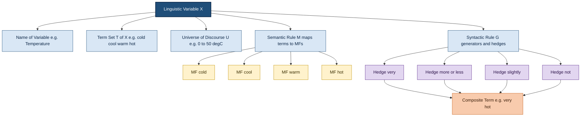

# Linguistic variables

<!-- SECTION_1_START -->

# Linguistic Variables in Fuzzy Logic

## Formal Definition (Zadeh, 1975)

A **Linguistic Variable** is a variable whose values are not numbers but words or sentences in a natural or artificial language. Formally introduced by **Lotfi A. Zadeh**, it is a quintuple $(X, T(X), U, G, M)$ where:

- $X$ — name of the linguistic variable (e.g., *Temperature*)
- $T(X)$ — set of linguistic terms/values that $X$ can take (e.g., {cold, cool, warm, hot})
- $U$ — universe of discourse (the underlying numerical domain, e.g., $[0^\circ C, 50^\circ C]$)
- $G$ — syntactic rule that generates the linguistic terms in $T(X)$
- $M$ — semantic rule that maps each linguistic term to its **membership function** over $U$

> [!IMPORTANT]
> **KTU Syllabus Highlight:** A linguistic variable is the *bridge* between human qualitative reasoning and numerical computation. It allows systems to reason with words like "high," "medium," "low" rather than rigid numerical thresholds.

## Intuitive Analogy

Imagine you are describing a person’s **Age**. Instead of saying "this person is 47 years old," you naturally say "this person is *middle-aged*" or "this person is *old*." These descriptions — *young, middle-aged, old* — are **linguistic values**. The actual age in years (e.g., 47) is the **numerical (crisp) value**, and the range $[0, 100]$ is the **universe of discourse**.

A linguistic variable is essentially a *container* that maps fuzzy, human-friendly words onto precise mathematical membership functions so that a machine (fuzzy controller, expert system) can reason with them.

> [!NOTE]
> **Base Variable vs. Linguistic Variable:** The *base variable* (or *numerical variable*) is the raw measurable quantity like $x = 25$ (temperature in $^\circ C$). The *linguistic variable* wraps this with semantic meaning — "Temperature" having values like "warm" or "hot."

## Components Visualized

A linguistic variable has **five core components** that you must memorize for KTU exams:

1. **Name** — symbolic identifier of the variable
2. **Term Set $T(X)$** — collection of linguistic labels
3. **Universe of Discourse $U$** — numerical range of the base variable
4. **Syntactic Rule $G$** — grammar for generating compound terms using *hedges*
5. **Semantic Rule $M$** — assigns membership function $\mu_A(u)$ to each term $A \in T(X)$

> [!VISUALIZATION CONTROL]
> **Concept:** Mapping of linguistic terms to membership functions over a numerical universe.
> **GeoGebra / Desmos Input Equations (for Temperature in $^\circ C$, $x \in [0, 50]$):**
> * `f_cold(x) = max(0, 1 - x/20)`  (cold, $x \in [0, 20]$)
> * `f_cool(x) = triangle(x, 10, 20, 30)`
> * `f_warm(x) = triangle(x, 20, 30, 40)`
> * `f_hot(x) = max(0, (x - 30)/20)`
>
> **Visual Description:** Four overlapping curves rise and fall across the $x$-axis. The student should observe the *overlap regions* (e.g., between cool and warm around $x = 25$) where a single value belongs to two linguistic terms with different membership degrees — this is the *core of fuzzy reasoning*.

<!-- SECTION_1_END -->

<!-- SECTION_2_START -->

# Deep Theoretical Analysis

## Anatomy of a Linguistic Variable

A linguistic variable is not just a label — it is a **structured mathematical object**. Below is the step-by-step logical decomposition:

- **Step 1 — Identify the physical quantity.** Determine what real-world variable you want to describe (height, speed, error, pressure).
- **Step 2 — Define the Universe of Discourse $U$.** Fix the numerical range of the base variable (e.g., $U = [0, 250]$ cm for human height).
- **Step 3 — Enumerate the Term Set $T(X)$.** List the meaningful linguistic labels (e.g., {short, medium, tall, very tall}).
- **Step 4 — Build the Syntactic Rule $G$.** Define how compound terms are formed: *primary term + hedge*, e.g., "very" + "tall" = "very tall."
- **Step 5 — Apply the Semantic Rule $M$.** For each term, define a membership function $\mu: U \to [0, 1]$ that quantifies the *degree of belonging*.

## Linguistic Hedges (Modifiers)

Hedges are linguistic operators that **transform an existing fuzzy set into a new one**. They are critical for KTU problems involving term-set generation.

| Hedge | Notation | Effect on Membership | Use Case |
|-------|----------|----------------------|----------|
| Very / Extremely | $A^2$ | $\mu_{very A}(x) = [\mu_A(x)]^2$ | Intensifies / sharpens |
| More or less | $A^{0.5}$ | $\mu_{more\ or\ less\ A}(x) = \sqrt{\mu_A(x)}$ | Dilutes / softens |
| Slightly | $A^{1.3}$ | $\mu_{slightly A}(x) = [\mu_A(x)]^{1.3}$ | Slight intensification |
| Plus | $A^{1.25}$ | $\mu_{plus A}(x) = [\mu_A(x)]^{1.25}$ | Mild intensification |
| Not | $\neg A$ | $\mu_{not A}(x) = 1 - \mu_A(x)$ | Negation / complement |
| Roughly | $A^{0.5}$ approx. | Similar to *more or less* | Approximation |

## Simple vs. Composite Linguistic Variables

- **Simple Linguistic Variable:** A variable whose terms are atomic labels like {low, medium, high}.
- **Composite Linguistic Variable:** A variable whose terms are formed by combining a primary term with hedges or connectives, e.g., {very low, more or less high, not medium, extremely tall}.

## KTU High-Yield Formula Sheet

| Concept | Formula / Definition | Notation |
|---------|----------------------|----------|
| Linguistic Variable Quintuple | $(X,\ T(X),\ U,\ G,\ M)$ | $X$ = variable name |
| Membership Function | $\mu_A : U \to [0, 1]$ | $A \in T(X)$ |
| Concentration (Very) | $\mu_{very A}(x) = [\mu_A(x)]^2$ | Sharpens, reduces support |
| Dilation (More or less) | $\mu_{more\ or\ less\ A}(x) = \sqrt{\mu_A(x)}$ | Broadens, increases support |
| Intensification (Plus) | $\mu_{plus A}(x) = \begin{cases} 2[\mu_A(x)]^2, & \mu_A(x) \le 0.5 \\ 1 - 2[1 - \mu_A(x)]^2, & \mu_A(x) > 0.5 \end{cases}$ | Contrast enhancer |
| Complement (Not) | $\mu_{\overline{A}}(x) = 1 - \mu_A(x)$ | Negation |
| Support of $A$ | $\{x \in U \mid \mu_A(x) > 0\}$ | Non-zero region |
| Core of $A$ | $\{x \in U \mid \mu_A(x) = 1\}$ | Full-membership region |
| $\alpha$-cut of $A$ | $A_\alpha = \{x \in U \mid \mu_A(x) \ge \alpha\}$ | Level set |
| Universe of Discourse | $U = [u_{\min}, u_{\max}]$ | Numerical domain |

> [!NOTE]
> **Engineering Utility:** Linguistic variables form the *front-end* of every fuzzy expert system, fuzzy controller (e.g., washing machines, air conditioners, ABS braking), and fuzzy decision-support system. They allow domain experts to encode rules in natural language ("IF speed is *high* THEN brake pressure is *high*") without needing to know crisp thresholds.

<!-- SECTION_2_END -->

<!-- SECTION_3_START -->

# Step-by-Step Derivations and Worked Examples

## Example 1 — Constructing a Complete Linguistic Variable

**Problem:** Define a linguistic variable $X$ = "Speed" with the following specification:

- Universe of discourse: $U = [0, 120]$ km/h
- Primary linguistic terms: $T_0(X) = \{slow, medium, fast\}$
- Generate composite terms using the hedge "very"

### Step 1 — Define the Term Set

The primary term set is $T_0(X) = \{slow,\ medium,\ fast\}$. Applying the hedge "very" via the syntactic rule $G$:

$$
T(X) = \{slow,\ medium,\ fast,\ very\ slow,\ very\ medium,\ very\ fast\}
$$

### Step 2 — Define Membership Functions (Semantic Rule $M$)

$$
\mu_{slow}(x) = \begin{cases} 1, & 0 \le x \le 20 \\ \dfrac{40 - x}{20}, & 20 < x \le 40 \\ 0, & x > 40 \end{cases}
$$

$$
\mu_{medium}(x) = \begin{cases} 0, & x \le 30 \\ \dfrac{x - 30}{30}, & 30 < x \le 60 \\ \dfrac{90 - x}{30}, & 60 < x \le 90 \\ 0, & x > 90 \end{cases}
$$

$$
\mu_{fast}(x) = \begin{cases} 0, & x \le 70 \\ \dfrac{x - 70}{30}, & 70 < x \le 100 \\ 1, & 100 < x \le 120 \end{cases}
$$

### Step 3 — Verify a Numerical Sample Point

At $x = 50$ km/h:

$$
\mu_{slow}(50) = \frac{40 - 50}{20} = \frac{-10}{20} = -0.5 \rightarrow \text{clamped to } 0
$$

$$
\mu_{medium}(50) = \frac{50 - 30}{30} = \frac{20}{30} = 0.667
$$

$$
\mu_{fast}(50) = 0
$$

So, a vehicle traveling at 50 km/h is *medium* with degree **0.667** and *slow* / *fast* with degree **0**.

## Example 2 — Applying the "Very" Hedge

**Problem:** Given the triangular membership function $\mu_A(x) = \text{triangle}(0, 25, 50)$, derive the membership function for "very $A$."

### Step 1 — Express the Base Function

$$
\mu_A(x) = \begin{cases} 0, & x \le 0 \\ \dfrac{x}{25}, & 0 < x \le 25 \\ \dfrac{50 - x}{25}, & 25 < x \le 50 \\ 0, & x > 50 \end{cases}
$$

### Step 2 — Apply the Concentration Operator

The "very" hedge squares the membership value:

$$
\mu_{very A}(x) = [\mu_A(x)]^2
$$

Therefore:

$$
\mu_{very A}(x) = \begin{cases} 0, & x \le 0 \\ \left(\dfrac{x}{25}\right)^2, & 0 < x \le 25 \\ \left(\dfrac{50 - x}{25}\right)^2, & 25 < x \le 50 \\ 0, & x > 50 \end{cases}
$$

### Step 3 — Numerical Verification

At $x = 12.5$ (midpoint of the rising edge):

$$
\mu_A(12.5) = \frac{12.5}{25} = 0.5
$$

$$
\mu_{very A}(12.5) = (0.5)^2 = 0.25
$$

At $x = 25$ (peak):

$$
\mu_A(25) = 1 \quad \Rightarrow \quad \mu_{very A}(25) = 1^2 = 1
$$

> [!IMPORTANT]
> **Observation:** Squaring pulls the membership curve *inward*. Values that were "somewhat $A$" become "barely very $A$." This is why the "very" hedge is called a **concentration operator** — it shrinks the support of the fuzzy set.

## Example 3 — Applying the "More or Less" Hedge

**Problem:** Using the same $\mu_A(x)$ from Example 2, derive "more or less $A$."

### Step 1 — Apply the Dilation Operator

$$
\mu_{more\ or\ less\ A}(x) = \sqrt{\mu_A(x)} = [\mu_A(x)]^{1/2}
$$

### Step 2 — Numerical Verification

At $x = 12.5$:

$$
\mu_{more\ or\ less\ A}(12.5) = \sqrt{0.5} \approx 0.707
$$

At $x = 5$:

$$
\mu_A(5) = \frac{5}{25} = 0.2
$$

$$
\mu_{more\ or\ less\ A}(5) = \sqrt{0.2} \approx 0.447
$$

> [!NOTE]
> **Observation:** Square-rooting *lifts* the curve. Values that were "barely $A$" become "noticeably more or less $A$." The support of the fuzzy set *expands* — hence the name **dilation**.

## Python Implementation — Reference Script

```python
import numpy as np
import matplotlib.pyplot as plt

def triangle(x, a, b, c):
    """Triangular membership function with vertices a <= b <= c."""
    x = np.asarray(x, dtype=float)
    mu = np.zeros_like(x)
    # rising edge
    mask_rise = (x >= a) & (x <= b)
    mu[mask_rise] = (x[mask_rise] - a) / (b - a)
    # falling edge
    mask_fall = (x > b) & (x <= c)
    mu[mask_fall] = (c - x[mask_fall]) / (c - b)
    return mu

# Universe of discourse
x = np.linspace(0, 50, 501)

# Base fuzzy set A = triangle(0, 25, 50)
mu_A = triangle(x, 0, 25, 50)

# Linguistic hedges
mu_very_A   = mu_A ** 2          # concentration
mu_mol_A    = np.sqrt(mu_A)      # dilation  (more or less)
mu_slightly = mu_A ** 1.3        # slight intensification
mu_not_A    = 1.0 - mu_A         # complement

# Plot
plt.figure(figsize=(9, 6))
plt.plot(x, mu_A,        label="A (base)",          linewidth=2)
plt.plot(x, mu_very_A,   label="very A (A^2)",      linewidth=2)
plt.plot(x, mu_mol_A,    label="more or less A",    linewidth=2)
plt.plot(x, mu_slightly, label="slightly A (A^1.3)",linewidth=2)
plt.plot(x, mu_not_A,    label="not A",             linewidth=2)
plt.xlabel("Universe of Discourse (x)")
plt.ylabel("Membership Degree")
plt.title("Linguistic Hedges Applied to Fuzzy Set A")
plt.legend()
plt.grid(True, linestyle="--", alpha=0.6)
plt.show()
```

The script plots all five curves on the same axes so the student can *visually* confirm that "very $A$" lies inside $A$, "more or less $A$" lies outside, and "not $A$" is the mirror image reflected across the line $\mu = 0.5$.

<!-- SECTION_3_END -->

<!-- SECTION_4_START -->

# Structural Diagrams and Schematics

## Diagram 1 — Hierarchical Structure of a Linguistic Variable



## Diagram 2 — Processing Topology for a Linguistic Variable in a Fuzzy System

```mermaid
flowchart LR
    subgraph IN["Input Stage"]
        CRISP["Crisp Measurement x0 e.g. 35 degC"]:::io
    end

    subgraph FV["Fuzzification via Linguistic Variable"]
        FZ["Fuzzifier applies M to x0"]:::proc
        MFS["Compute mu values for every term in T of X"]:::proc
    end

    subgraph ENG["Rule Engine"]
        RB["Rule Base IF THEN rules in natural language"]:::rule
        INF["Inference Engine max min or product"]:::rule
    end

    subgraph OUT["Defuzzification"]
        DFZ["Defuzzifier e.g. centroid"]:::proc
        CR["Crisp Output y0"]:::io
    end

    CRISP --> FZ --> MFS --> RB --> INF --> DFZ --> CR

    classDef io   fill:#cfe2f3,stroke:#1f4e79,color:#0b2545
    classDef proc fill:#d9ead3,stroke:#38761d,color:#1a3a08
    classDef rule fill:#fce5cd,stroke:#cc4125,color:#3a1a0e
```



> [!NOTE]
> **Reading the diagrams:** In *Diagram 1*, the linguistic variable is the *root node* whose five branches correspond to Zadeh's quintuple. In *Diagram 2*, the linguistic variable is consumed inside the **Fuzzification** block — the crisp input $x_0$ is mapped to a vector of membership values $[\mu_{cold}(x_0), \mu_{cool}(x_0), \mu_{warm}(x_0), \mu_{hot}(x_0)]$, which the rule engine then uses for approximate reasoning.

<!-- SECTION_4_END -->

<!-- SECTION_5_START -->

# KTU 2024 Scheme Examination Question Bank

## Part A — Short Answer Questions (3 Marks Each)

### Question 1: Define a linguistic variable with a suitable example. *(Remember / Understand)* `[KTU University Exam – July 2023]`

**Course Outcome:** CO1 | **Cognitive Level:** Remember

**Model Answer:**

A **linguistic variable** is a variable whose values are words or sentences expressed in a natural or artificial language rather than numbers. Formally, it is defined by the quintuple $(X,\ T(X),\ U,\ G,\ M)$, where $X$ is the variable name, $T(X)$ is the set of linguistic terms, $U$ is the universe of discourse, $G$ is the syntactic rule, and $M$ is the semantic rule.

**Example:** Let $X$ = *Height*. Then $T(X) = \{short,\ average,\ tall\}$, $U = [0, 250]$ cm, $G$ generates compound terms like "very tall" using hedges, and $M$ assigns a membership function to each term.

> **Valuation Key:** [Quintuple definition: 2 Marks] [Example with all components: 1 Mark]

---

### Question 2: What are linguistic hedges? Give two examples with their effect on membership. *(Understand)* `[KTU University Exam – Dec 2023]`

**Course Outcome:** CO1 | **Cognitive Level:** Understand

**Model Answer:**

Linguistic hedges are operators that modify the meaning of a primary linguistic term. They transform an existing fuzzy set $A$ into a new fuzzy set.

- **"Very"** — Acts as a *concentration* operator: $\mu_{very\ A}(x) = [\mu_A(x)]^2$. It sharpens the fuzzy set, reducing the support.
- **"More or less"** — Acts as a *dilation* operator: $\mu_{more\ or\ less\ A}(x) = \sqrt{\mu_A(x)}$. It broadens the support and increases membership degrees of fringe elements.

> **Valuation Key:** [Definition of hedge: 1 Mark] [Two examples with formulas and effects: 2 Marks]

---

## Part B — Long Answer Questions (14 Marks, Module Internal Choice)

### Question A: Comprehensive Analysis of Linguistic Variables *(14 Marks)*

**[KTU University Exam – July 2024]**

**Course Outcomes Covered:** CO1, CO2 | **Cognitive Levels:** Understand (7) + Apply (7)

#### Part (a) — Theory: Structure of a Linguistic Variable *(7 Marks)*

Explain the formal definition of a linguistic variable. List and describe all five components of Zadeh's quintuple. For each component, state its mathematical role. Also, differentiate between *primary* and *composite* linguistic terms with one example.

**Model Answer Outline:**

1. **Definition (2 Marks):** A linguistic variable is a variable whose values are linguistic terms rather than numbers. It is defined as the quintuple $(X,\ T(X),\ U,\ G,\ M)$.

2. **Five Components (3 Marks):**
   - $X$ — name, e.g., "Temperature"
   - $T(X)$ — term set, e.g., {cold, cool, warm, hot}
   - $U$ — universe of discourse, e.g., $[0, 50]^\circ C$
   - $G$ — syntactic rule generating terms like "very hot"
   - $M$ — semantic rule mapping each term to $\mu_A : U \to [0, 1]$

3. **Primary vs Composite Terms (2 Marks):** Primary terms are atomic labels directly listed in $T_0(X)$. Composite terms are generated by applying hedges to primaries, e.g., "very cold" = "very" + "cold."

> **Valuation Key:** [Quintuple statement: 2 Marks] [Five components with role: 3 Marks] [Primary vs composite with example: 2 Marks]

#### Part (b) — Application: Construct a Linguistic Variable and Apply Hedges *(7 Marks)*

Define a linguistic variable $X$ = "Error" for a control system with $U = [-10, +10]$ and primary terms $T_0(X) = \{negative,\ zero,\ positive\}$. Use triangular membership functions with appropriate breakpoints. Then derive the membership function for the composite term "very positive" and the term "more or less zero." Plot (or describe) the resulting curves.

**Step-by-Step Solution:**

**Step 1 — Build the Term Set (1 Mark)**

$$
T(X) = \{negative,\ zero,\ positive,\ very\ positive,\ more\ or\ less\ zero\}
$$

**Step 2 — Define Primary Membership Functions (2 Marks)**

$$
\mu_{negative}(x) = \begin{cases} 1, & -10 \le x \le -8 \\ \dfrac{-2 - x}{6}, & -8 < x \le -2 \\ 0, & x > -2 \end{cases}
$$

$$
\mu_{zero}(x) = \begin{cases} 0, & x \le -2 \\ \dfrac{x + 2}{2}, & -2 < x \le 0 \\ \dfrac{2 - x}{2}, & 0 < x \le 2 \\ 0, & x > 2 \end{cases}
$$

$$
\mu_{positive}(x) = \begin{cases} 0, & x \le 2 \\ \dfrac{x - 2}{6}, & 2 < x \le 8 \\ 1, & 8 < x \le 10 \end{cases}
$$

**Step 3 — Derive "Very Positive" via Concentration (2 Marks)**

$$
\mu_{very\ positive}(x) = [\mu_{positive}(x)]^2
$$

Numerical check at $x = 5$:

$$
\mu_{positive}(5) = \frac{5 - 2}{6} = \frac{3}{6} = 0.5
$$

$$
\mu_{very\ positive}(5) = (0.5)^2 = 0.25
$$

**Step 4 — Derive "More or Less Zero" via Dilation (2 Marks)**

$$
\mu_{more\ or\ less\ zero}(x) = \sqrt{\mu_{zero}(x)}
$$

Numerical check at $x = 1$:

$$
\mu_{zero}(1) = \frac{2 - 1}{2} = 0.5
$$

$$
\mu_{more\ or\ less\ zero}(1) = \sqrt{0.5} \approx 0.707
$$

> **Valuation Key:** [Term set: 1 Mark] [Three MFs: 2 Marks] [Concentration derivation: 2 Marks] [Dilation derivation: 2 Marks]

---

### Question B: Alternative Choice — Linguistic Hedges and Variable Design *(14 Marks)*

**[KTU University Exam – Dec 2024]**

**Course Outcomes Covered:** CO1, CO2 | **Cognitive Levels:** Understand (7) + Apply (7)

#### Part (a) — Theory: Linguistic Hedges *(7 Marks)*

Define the concept of linguistic hedges. Classify them with examples into three categories: *concentration, dilation,* and *intensification.* Explain the mathematical formulation and the visual effect on a fuzzy set for at least one hedge from each category.

**Model Answer Outline:**

1. **Definition (1 Mark):** Hedges are linguistic modifiers that alter the membership function of a primary term.
2. **Concentration (2 Marks):** e.g., "very" — $\mu_{very A}(x) = [\mu_A(x)]^2$. Visually narrows the support.
3. **Dilation (2 Marks):** e.g., "more or less" — $\mu_{more\ or\ less\ A}(x) = [\mu_A(x)]^{0.5}$. Visually broadens the support.
4. **Intensification (2 Marks):** e.g., "plus" — uses a piecewise rule that increases membership above 0.5 and decreases it below 0.5, enhancing contrast.

> **Valuation Key:** [Definition: 1 Mark] [Concentration: 2 Marks] [Dilation: 2 Marks] [Intensification: 2 Marks]

#### Part (b) — Application: Design a Linguistic Variable for a Washing Machine *(7 Marks)*

Design a linguistic variable $X$ = "Dirt" for an automatic washing machine with $U = [0, 100]$ (% dirt level) and primary terms $T_0(X) = \{small,\ medium,\ large\}$. Choose triangular or trapezoidal MFs. Generate the composite terms "very large" and "more or less small" using appropriate hedges and compute the membership of dirt level 60% in all five terms.

**Step-by-Step Solution:**

**Step 1 — Term Set (1 Mark)**

$$
T(X) = \{small,\ medium,\ large,\ very\ large,\ more\ or\ less\ small\}
$$

**Step 2 — Membership Functions (2 Marks)**

$$
\mu_{small}(x) = \begin{cases} 1, & 0 \le x \le 10 \\ \dfrac{30 - x}{20}, & 10 < x \le 30 \\ 0, & x > 30 \end{cases}
$$

$$
\mu_{medium}(x) = \begin{cases} 0, & x \le 20 \\ \dfrac{x - 20}{30}, & 20 < x \le 50 \\ \dfrac{80 - x}{30}, & 50 < x \le 80 \\ 0, & x > 80 \end{cases}
$$

$$
\mu_{large}(x) = \begin{cases} 0, & x \le 70 \\ \dfrac{x - 70}{30}, & 70 < x \le 100 \\ 1, & x = 100 \text{ boundary case} \end{cases}
$$

**Step 3 — Apply Hedges (2 Marks)**

$$
\mu_{very\ large}(x) = [\mu_{large}(x)]^2
$$

$$
\mu_{more\ or\ less\ small}(x) = \sqrt{\mu_{small}(x)}
$$

**Step 4 — Evaluate at $x = 60$ (2 Marks)**

$$
\mu_{small}(60) = 0
$$

$$
\mu_{medium}(60) = \frac{80 - 60}{30} = \frac{20}{30} = 0.667
$$

$$
\mu_{large}(60) = 0
$$

$$
\mu_{very\ large}(60) = 0^2 = 0
$$

$$
\mu_{more\ or\ less\ small}(60) = \sqrt{0} = 0
$$

**Conclusion:** At 60% dirt level, the cloth is "medium" with degree **0.667** — hence the washing machine should run a *medium* intensity cycle.

> **Valuation Key:** [Term set: 1 Mark] [Three MFs: 2 Marks] [Hedge formulas: 2 Marks] [Numerical evaluation at x=60: 2 Marks]

---

> [!WARNING]
> **KTU Examiner's Valuation Warning — Common Pitfalls:**
> 1. **Forgetting the universe of discourse:** Students often write the linguistic terms but forget to specify $U$. Examiners allot at least 1 mark specifically for $U$.
> 2. **Confusing primary and composite terms:** If a question asks for "very tall," you must (i) state the primary "tall," (ii) state the hedge, and (iii) write the formula. Skipping (i) loses 1 mark.
> 3. **Hedge formula errors:** "Very" squares $(\mu^2)$, "more or less" square-roots $(\mu^{0.5})$ — do not invert them. Examiners *immediately* deduct 2 marks for this swap.
> 4. **No domain clamping:** Membership values must lie in $[0, 1]$. If your computation gives a negative or $>1$ value, clamp it and mention the clamp explicitly.

---

## Topic Recap and Important Things to Remember

- **Linguistic variable** is a Zadeh-defined quintuple $(X, T(X), U, G, M)$ — memorize all five components and their notation.
- The **universe of discourse $U$** is the numerical domain of the *base variable*, e.g., $U = [0, 50]$ for temperature.
- **Primary terms** are the atomic labels in $T_0(X)$; **composite terms** are produced by applying hedges via the syntactic rule $G$.
- **Hedges** are linguistic modifiers:
  * "Very" = **concentration** = $\mu^2$ (sharpens, reduces support)
  * "More or less" = **dilation** = $\mu^{0.5}$ (broadens, increases support)
  * "Plus" = **intensification** (contrast enhancement, piecewise)
  * "Not" = **complement** = $1 - \mu$
- A linguistic variable **must always be paired with a universe of discourse** and a complete set of **membership functions** — examiners will not award full marks without them.
- Support of $A$ = $\{x \mid \mu_A(x) > 0\}$; Core of $A$ = $\{x \mid \mu_A(x) = 1\}$; $\alpha$-cut of $A$ = $\{x \mid \mu_A(x) \ge \alpha\}$.
- **Engineering applications:** fuzzy controllers (AC, washing machines, ABS), expert systems, decision-support systems, and pattern recognition — *always* mention a real-world example in 14-mark answers for context.
- **Common exam phrasing:** "Define a linguistic variable for $X$ with at least three linguistic terms" → you must give name, $U$, $T(X)$, and explicit MFs.
- **Always show numerical evaluation** at one sample point in the universe to demonstrate understanding of the membership function.

<!-- SECTION_5_END -->
