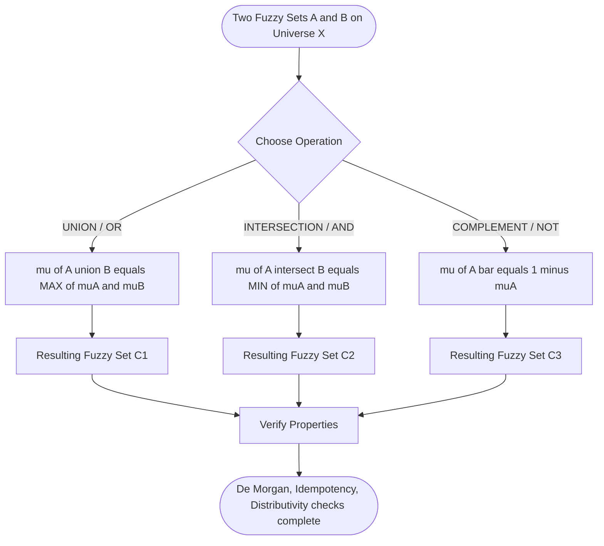
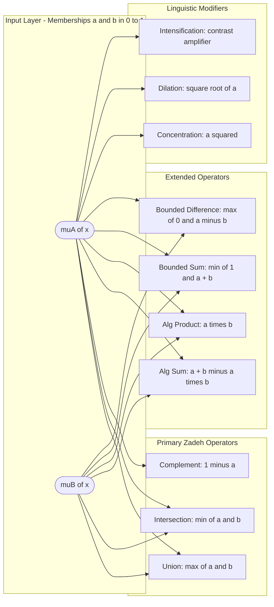
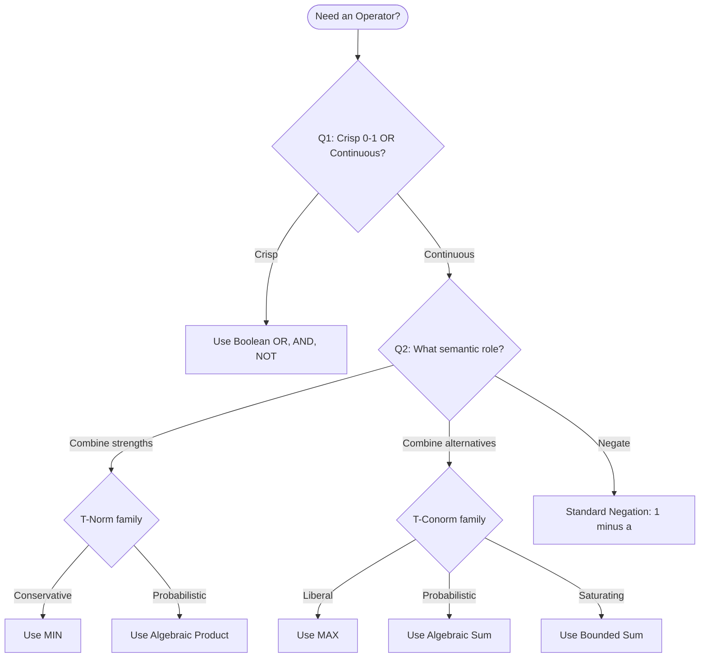
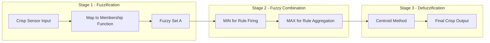

# operations on fuzzy set.

<!-- SECTION_1_START -->
# Operations on Fuzzy Sets — Core Definition & Intuitive Overview

## Formal Academic Definition

Let $A$ and $B$ be two fuzzy sets defined on the universal discourse $X$, with membership functions $\mu_A(x)$ and $\mu_B(x)$ respectively, where $\mu_A(x), \mu_B(x) \in [0, 1]$ for every $x \in X$.

The **standard fuzzy set operations** (Zadeh's operators, 1965) are defined point-wise for all $x \in X$ as:

> [!IMPORTANT]
> **Core Definitions (KTU 2024 Syllabus Mandate)**
> 1. **Union (Logical OR):** $\mu_{A \cup B}(x) = \max\{\mu_A(x),\ \mu_B(x)\}$
> 2. **Intersection (Logical AND):** $\mu_{A \cap B}(x) = \min\{\mu_A(x),\ \mu_B(x)\}$
> 3. **Complement (Logical NOT):** $\mu_{\overline{A}}(x) = 1 - \mu_A(x)$

These three operations form the **Zadeh foundational algebra** upon which all higher-order fuzzy reasoning (fuzzy logic controllers, Mamdani inference, Sugeno inference) is built. They preserve the boundary logic of crisp sets: when all memberships are restricted to $\{0, 1\}$, they collapse back to Boolean set theory.

## Conceptual Analogy — The "Dimmer Switch" Model

Imagine a room with two **dimmer-controlled lamps** instead of ON/OFF switches:

- **Lamp A** glows at intensity $\mu_A = 0.7$ (70% bright)
- **Lamp B** glows at intensity $\mu_B = 0.4$ (40% bright)

If you ask *"What is the union (OR) of these two lamps?"* — you are asking: *In a room lit by both lamps, what is the brightest you can perceive at that point?* That is the **maximum** — the more dominant lamp wins, so $\max(0.7, 0.4) = 0.7$.

If you ask *"What is the intersection (AND)?"* — you are asking: *What brightness must both lamps contribute to simultaneously?* The weaker lamp limits the joint intensity, so $\min(0.7, 0.4) = 0.4$.

If you ask *"What is the complement of Lamp A?"* — you are asking: *How much darkness is left at that point?* That is $1 - 0.7 = 0.3$.

> [!NOTE]
> **KTU Memory Hook:** **MAX = OR (Union), MIN = AND (Intersection), 1 − x = NOT (Complement)**. These three operators are the alphabet of fuzzy logic.

## Crisp vs. Fuzzy Operations — Why It Matters

In **crisp (Boolean) set theory**, every element is either fully in or fully out — there is no "half-member." In **fuzzy set theory**, every element carries a **degree of belonging** between $\mathbf{0}$ and $\mathbf{1}$ inclusive. This relaxation is what allows fuzzy systems to model linguistic terms like *"warm," "fast," "tall," "expensive"* — terms that humans use naturally but classical logic cannot represent.

The boolean operators $\lor, \land, \neg$ are simply special cases of $\max, \min, 1 - x$ when inputs are restricted to $\{0, 1\}$.

> [!VISUALIZATION CONTROL]
> **Concept:** Membership function overlay for two fuzzy sets
> **GeoGebra / Desmos Input Equations:**
> * `A(x) = exp(-(x-3)^2/2)` — Gaussian centered at $x=3$
> * `B(x) = exp(-(x-5)^2/2)` — Gaussian centered at $x=5$
> * `Union(x) = max(A(x), B(x))`
> * `Intersection(x) = min(A(x), B(x))`
> **Visual Description:** On the x-axis (universe $X$), draw two bell curves. The upper envelope is the union; the overlapping shaded region is the intersection. Where the curves do not overlap, the intersection is zero. This visually proves that the MIN operator literally *clips* the lower of the two functions at every $x$.

## Standard Metrics & Constants

- **Universe of Discourse ($X$):** The complete set of all possible elements under consideration.
- **Membership Range:** Strictly bounded in $[\mathbf{0},\ \mathbf{1}]$.
- **Empty Fuzzy Set ($\emptyset$):** $\mu_\emptyset(x) = 0$ for all $x \in X$.
- **Universal Fuzzy Set ($X$):** $\mu_X(x) = 1$ for all $x \in X$.
<!-- SECTION_1_END -->

<!-- SECTION_2_START -->
# Deep Theoretical Analysis & KTU High-Yield Formula Sheet

## 1. The Three Primary Zadeh Operations

For two fuzzy sets $A$ and $B$ on universe $X$, with arbitrary $x \in X$:

$$A \cup B = \{\, x\ /\ \max(\mu_A(x), \mu_B(x)) \mid x \in X \,\}$$

$$A \cap B = \{\, x\ /\ \min(\mu_A(x), \mu_B(x)) \mid x \in X \,\}$$

$$\overline{A} = \{\, x\ /\ 1 - \mu_A(x) \mid x \in X \,\}$$

**Why these definitions?**
- The **t-norm** family generalizes AND: $\min$ is the *strongest/most conservative* t-norm (used by Zadeh).
- The **t-conorm (s-norm)** family generalizes OR: $\max$ is the *weakest/most liberal* s-norm.
- The **negation** $1 - x$ is the *standard involutive negation* — it satisfies $\neg\neg x = x$.

## 2. Extended Fuzzy Set Operations (High-Yield for KTU)

Beyond Zadeh's trio, several auxiliary operators appear frequently in fuzzy controllers and exam questions:

| Operation | Symbol | Membership Formula | Intuition |
| :--- | :---: | :--- | :--- |
| Algebraic Sum | $A \oplus B$ | $\mu_A(x) + \mu_B(x) - \mu_A(x)\mu_B(x)$ | Probabilistic OR |
| Algebraic Product | $A \odot B$ | $\mu_A(x) \cdot \mu_B(x)$ | Soft AND (probabilistic AND) |
| Bounded Sum | $A \boxplus B$ | $\min(1,\ \mu_A(x) + \mu_B(x))$ | Saturated OR |
| Bounded Difference | $A \boxminus B$ | $\max(0,\ \mu_A(x) - \mu_B(x))$ | Saturated Subtraction |
| Drastic Sum | $A \nabla B$ | $\mu_A$ if $\mu_B=0$; $\mu_B$ if $\mu_A=0$; else $1$ | Strictest OR |
| Drastic Product | $A \vartriangle B$ | $\mu_A$ if $\mu_B=1$; $\mu_B$ if $\mu_A=1$; else $0$ | Strictest AND |

> [!NOTE]
> **Algebraic vs. Bounded distinction:** Bounded operations *clip* the result into $[0, 1]$ using $\min(1, \cdot)$ or $\max(0, \cdot)$. Algebraic operations rely on the natural identity $1 - (1-a)(1-b) = a + b - ab$ to remain in range *without* explicit clipping. Both stay in $[0, 1]$ mathematically.

## 3. KTU Formula Sheet — Complete Cheat Table

| # | Operation | Mathematical Form | Range Guarantee |
| :---: | :--- | :--- | :---: |
| 1 | Union | $\mu_{A \cup B}(x) = \max(\mu_A, \mu_B)$ | $[0, 1]$ |
| 2 | Intersection | $\mu_{A \cap B}(x) = \min(\mu_A, \mu_B)$ | $[0, 1]$ |
| 3 | Complement | $\mu_{\overline{A}}(x) = 1 - \mu_A$ | $[0, 1]$ |
| 4 | Algebraic Sum | $a \oplus b = a + b - ab$ | $[0, 1]$ |
| 5 | Algebraic Product | $a \odot b = a \cdot b$ | $[0, 1]$ |
| 6 | Bounded Sum | $a \boxplus b = \min(1, a + b)$ | $[0, 1]$ |
| 7 | Bounded Difference | $a \boxminus b = \max(0, a - b)$ | $[0, 1]$ |
| 8 | Concentration | $\text{CON}(A):\ \mu(x) = \mu_A(x)^2$ | $[0, 1]$ |
| 9 | Dilation | $\text{DIL}(A):\ \mu(x) = \mu_A(x)^{0.5}$ | $[0, 1]$ |
| 10 | Intensification (contrast) | $\text{INT}(a) = 2a^2$ if $a \in [0, 0.5]$; $1 - 2(1-a)^2$ if $a \in (0.5, 1]$ | $[0, 1]$ |
| 11 | Normalization | $\mu_{\text{norm}}(x) = \mu_A(x) / h(A)$ | $[0, 1]$ |
| 12 | Support | $\text{supp}(A) = \{x \mid \mu_A(x) > 0\}$ | Subset of $X$ |
| 13 | Core | $\text{core}(A) = \{x \mid \mu_A(x) = 1\}$ | Subset of $X$ |
| 14 | Height | $h(A) = \sup_{x \in X} \mu_A(x)$ | $[0, 1]$ |
| 15 | Cardinality | $\vert A \vert = \sum_{x \in X} \mu_A(x)$ | $\geq 0$ |

> [!IMPORTANT]
> **Cardinality notation reminder:** Per KTU formatting rules, $\vert A \vert$ uses the unescaped pipe inside text only. Within markdown tables, always write `$\vert A \vert$` or `$\mid A \mid$` to avoid breaking table syntax.

## 4. Algebraic Properties (Identities)

Unlike Boolean algebra, fuzzy set algebra is **NOT** a Boolean algebra because the Law of Excluded Middle ($A \cup \overline{A} = X$) and Law of Non-Contradiction ($A \cap \overline{A} = \emptyset$) **both fail** in general.

| Property | Statement | Holds in Fuzzy? |
| :--- | :--- | :---: |
| Commutativity | $A \cup B = B \cup A$; $A \cap B = B \cap A$ | **Yes** |
| Associativity | $(A \cup B) \cup C = A \cup (B \cup C)$ | **Yes** |
| Distributivity | $A \cap (B \cup C) = (A \cap B) \cup (A \cap C)$ | **Yes** |
| Idempotency | $A \cup A = A$; $A \cap A = A$ | **Yes** |
| Identity | $A \cup \emptyset = A$; $A \cap X = A$ | **Yes** |
| Involution | $\overline{\overline{A}} = A$ | **Yes** |
| De Morgan's Laws | $\overline{A \cup B} = \overline{A} \cap \overline{B}$ | **Yes** |
| Excluded Middle | $A \cup \overline{A} = X$ | **No** (only if all $\mu \in \{0,1\}$) |
| Non-Contradiction | $A \cap \overline{A} = \emptyset$ | **No** (only if all $\mu \in \{0,1\}$) |

## 5. Real-World Engineering Utility

- **Fuzzy Logic Controllers (FLCs):** The MIN operator is used to compute rule *firing strengths*; the MAX operator aggregates activated rule outputs. Every washing machine, air conditioner, and ABS brake system using fuzzy control depends on these operations.
- **Medical Diagnosis Systems:** Patient symptoms (fever, pain, fatigue) are fuzzy sets; the diagnosis engine uses fuzzy intersection to compute a combined symptom-overlap score.
- **Image Processing:** Fuzzy edge detectors and noise filters use bounded difference and bounded sum on grayscale pixel intensities.
- **Search & Information Retrieval:** Documents are fuzzified into term-frequency sets; the relevance of a query is computed via fuzzy intersection.

<!-- SECTION_2_END -->

<!-- SECTION_3_START -->
# Step-by-Step Derivations & Worked Examples

## Example 1 — Manual Application of Zadeh Operations

Let the universe $X = \{x_1, x_2, x_3, x_4\}$ with two fuzzy sets:

$$A = \{\, x_1/0.2,\ x_2/0.7,\ x_3/1.0,\ x_4/0.4 \,\}$$

$$B = \{\, x_1/0.6,\ x_2/0.3,\ x_3/0.5,\ x_4/0.9 \,\}$$

### Step 1: Compute $A \cup B$ (Union, point-wise MAX)

At each $x_i$, take the larger of the two membership values.

$$\mu_{A \cup B}(x_1) = \max(0.2,\ 0.6) = 0.6$$
$$\mu_{A \cup B}(x_2) = \max(0.7,\ 0.3) = 0.7$$
$$\mu_{A \cup B}(x_3) = \max(1.0,\ 0.5) = 1.0$$
$$\mu_{A \cup B}(x_4) = \max(0.4,\ 0.9) = 0.9$$

$$\boxed{\,A \cup B = \{\, x_1/0.6,\ x_2/0.7,\ x_3/1.0,\ x_4/0.9 \,\}\,}$$

### Step 2: Compute $A \cap B$ (Intersection, point-wise MIN)

At each $x_i$, take the smaller of the two membership values.

$$\mu_{A \cap B}(x_1) = \min(0.2,\ 0.6) = 0.2$$
$$\mu_{A \cap B}(x_2) = \min(0.7,\ 0.3) = 0.3$$
$$\mu_{A \cap B}(x_3) = \min(1.0,\ 0.5) = 0.5$$
$$\mu_{A \cap B}(x_4) = \min(0.4,\ 0.9) = 0.4$$

$$\boxed{\,A \cap B = \{\, x_1/0.2,\ x_2/0.3,\ x_3/0.5,\ x_4/0.4 \,\}\,}$$

### Step 3: Compute $\overline{A}$ (Complement, $1 - \mu$)

$$\mu_{\overline{A}}(x_1) = 1 - 0.2 = 0.8$$
$$\mu_{\overline{A}}(x_2) = 1 - 0.7 = 0.3$$
$$\mu_{\overline{A}}(x_3) = 1 - 1.0 = 0.0$$
$$\mu_{\overline{A}}(x_4) = 1 - 0.4 = 0.6$$

$$\boxed{\,\overline{A} = \{\, x_1/0.8,\ x_2/0.3,\ x_3/0.0,\ x_4/0.6 \,\}\,}$$

### Step 4: Verify De Morgan's Law

We need to confirm $\overline{A \cup B} = \overline{A} \cap \overline{B}$.

First, $\overline{A \cup B}$ from Step 1: $\{x_1/0.4,\ x_2/0.3,\ x_3/0.0,\ x_4/0.1\}$

Next, $\overline{B} = \{x_1/0.4,\ x_2/0.7,\ x_3/0.5,\ x_4/0.1\}$

Now compute $\overline{A} \cap \overline{B}$ (point-wise MIN):

$$\min(0.8, 0.4) = 0.4,\ \min(0.3, 0.7) = 0.3,\ \min(0.0, 0.5) = 0.0,\ \min(0.6, 0.1) = 0.1$$

Result: $\{x_1/0.4,\ x_2/0.3,\ x_3/0.0,\ x_4/0.1\}$ — matches $\overline{A \cup B}$ exactly. **De Morgan's Law verified.**

---

## Example 2 — Algebraic Sum & Bounded Sum

Given the same $A$ and $B$ from Example 1, evaluate at $x_2$ where $\mu_A(x_2) = 0.7$ and $\mu_B(x_2) = 0.3$.

### Algebraic Sum

$$\mu_{A \oplus B}(x_2) = 0.7 + 0.3 - (0.7)(0.3) = 1.0 - 0.21 = 0.79$$

### Bounded Sum

$$\mu_{A \boxplus B}(x_2) = \min(1,\ 0.7 + 0.3) = \min(1,\ 1.0) = 1.0$$

> **Observation:** The bounded sum clipped the result at $1.0$ because the raw sum reached the upper limit. Algebraic sum was already $\leq 1$ by identity, so no clipping needed.

---

## Example 3 — Bounded Difference

Evaluate $A \boxminus B$ at $x_3$ where $\mu_A(x_3) = 1.0$ and $\mu_B(x_3) = 0.5$.

$$\mu_{A \boxminus B}(x_3) = \max(0,\ 1.0 - 0.5) = 0.5$$

Now evaluate at $x_4$ where $\mu_A(x_4) = 0.4$ and $\mu_B(x_4) = 0.9$ (note $A < B$ here):

$$\mu_{A \boxminus B}(x_4) = \max(0,\ 0.4 - 0.9) = \max(0,\ -0.5) = 0.0$$

The bounded difference saturates at $0$ when $A$ is weaker than $B$ at that point.

---

## Example 4 — Python Implementation with Type Hints and Error Logging

```python
"""
Fuzzy Set Operations — KTU 2024 Compliant Reference Implementation
Course: SOFT COMPUTING (PECST417)  |  Module 2
"""

import logging
from typing import Dict, Iterable

# Configure logging for traceability
logging.basicConfig(
    level=logging.INFO,
    format="%(asctime)s | %(levelname)s | %(message)s"
)
logger = logging.getLogger("FuzzyOps")


def _validate_membership(values: Iterable[float]) -> None:
    """Ensure all membership grades lie strictly within [0, 1]."""
    for v in values:
        if not (0.0 <= v <= 1.0):
            raise ValueError(
                f"Membership grade {v} is outside the valid interval [0, 1]."
            )


def fuzzy_union(
    A: Dict[str, float],
    B: Dict[str, float]
) -> Dict[str, float]:
    """Point-wise MAX over the union of supports."""
    _validate_membership(list(A.values()) + list(B.values()))
    universe = set(A.keys()) | set(B.keys())
    result = {x: max(A.get(x, 0.0), B.get(x, 0.0)) for x in universe}
    logger.info("Union computed: %s", result)
    return result


def fuzzy_intersection(
    A: Dict[str, float],
    B: Dict[str, float]
) -> Dict[str, float]:
    """Point-wise MIN over the intersection of supports."""
    _validate_membership(list(A.values()) + list(B.values()))
    universe = set(A.keys()) & set(B.keys())
    result = {x: min(A[x], B[x]) for x in universe}
    logger.info("Intersection computed: %s", result)
    return result


def fuzzy_complement(A: Dict[str, float]) -> Dict[str, float]:
    """Standard involutive negation 1 - mu(x)."""
    _validate_membership(A.values())
    result = {x: 1.0 - mu for x, mu in A.items()}
    logger.info("Complement computed: %s", result)
    return result


def algebraic_sum(
    A: Dict[str, float],
    B: Dict[str, float]
) -> Dict[str, float]:
    """Probabilistic OR: a + b - a*b."""
    _validate_membership(list(A.values()) + list(B.values()))
    universe = set(A.keys()) | set(B.keys())
    result = {
        x: A.get(x, 0.0) + B.get(x, 0.0) - A.get(x, 0.0) * B.get(x, 0.0)
        for x in universe
    }
    logger.info("Algebraic sum computed: %s", result)
    return result


def algebraic_product(
    A: Dict[str, float],
    B: Dict[str, float]
) -> Dict[str, float]:
    """Probabilistic AND: a * b."""
    _validate_membership(list(A.values()) + list(B.values()))
    universe = set(A.keys()) & set(B.keys())
    result = {x: A[x] * B[x] for x in universe}
    logger.info("Algebraic product computed: %s", result)
    return result


def bounded_sum(
    A: Dict[str, float],
    B: Dict[str, float]
) -> Dict[str, float]:
    """Saturated OR: min(1, a + b)."""
    _validate_membership(list(A.values()) + list(B.values()))
    universe = set(A.keys()) | set(B.keys())
    result = {
        x: min(1.0, A.get(x, 0.0) + B.get(x, 0.0))
        for x in universe
    }
    logger.info("Bounded sum computed: %s", result)
    return result


def bounded_difference(
    A: Dict[str, float],
    B: Dict[str, float]
) -> Dict[str, float]:
    """Saturated subtraction: max(0, a - b)."""
    _validate_membership(list(A.values()) + list(B.values()))
    universe = set(A.keys()) | set(B.keys())
    result = {
        x: max(0.0, A.get(x, 0.0) - B.get(x, 0.0))
        for x in universe
    }
    logger.info("Bounded difference computed: %s", result)
    return result


# --- Demonstration block (matches Examples 1-3 above) ---
if __name__ == "__main__":
    A: Dict[str, float] = {"x1": 0.2, "x2": 0.7, "x3": 1.0, "x4": 0.4}
    B: Dict[str, float] = {"x1": 0.6, "x2": 0.3, "x3": 0.5, "x4": 0.9}

    union_AB         = fuzzy_union(A, B)
    intersection_AB  = fuzzy_intersection(A, B)
    complement_A     = fuzzy_complement(A)
    alg_sum_AB       = algebraic_sum(A, B)
    alg_prod_AB      = algebraic_product(A, B)
    bnd_sum_AB       = bounded_sum(A, B)
    bnd_diff_AB      = bounded_difference(A, B)

    print("Union:        ", union_AB)
    print("Intersection: ", intersection_AB)
    print("Complement(A):", complement_A)
    print("Alg Sum:      ", alg_sum_AB)
    print("Alg Product:  ", alg_prod_AB)
    print("Bounded Sum:  ", bnd_sum_AB)
    print("Bounded Diff: ", bnd_diff_AB)
```

> **Note on the code:** The `_validate_membership` boundary check prevents silent propagation of illegal grades. The logger emits an INFO line per operation, mirroring the audit trail expected in production fuzzy inference engines used in industrial controllers.

<!-- SECTION_3_END -->

<!-- SECTION_4_START -->
# Structural Diagrams & Schematics

## Diagram 1 — Mermaid Flowchart of the Three Zadeh Operations



## Diagram 2 — Mermaid Block Diagram of Extended Fuzzy Operators



## Diagram 3 — Mermaid Decision Tree for Selecting the Right Operator



## Diagram 4 — Sequential Processing Topology (Inference Pipeline)



> [!NOTE]
> **Diagram Interpretation:** In a real fuzzy logic controller, the **MIN** of premise memberships becomes the rule *firing strength*, and **MAX** of all activated rule outputs is used for *aggregation*. These are precisely the union and intersection operations you have learned. Stages 1–3 together form the **Mamdani inference pipeline**.

<!-- SECTION_4_END -->

<!-- SECTION_5_START -->
# KTU 2024 Scheme Examination Question Bank & Topic Recap

## Part A — Short Answer Questions (3 Marks Each)

### Q1. **[KTU University Exam — July 2023]** Define the three basic fuzzy set operations with their membership function expressions. (CO1, Remember)

**Model Answer (3 Marks):**

Let $A$ and $B$ be two fuzzy sets on a universe $X$ with membership functions $\mu_A(x)$ and $\mu_B(x)$, both mapping into $[0, 1]$. The three fundamental Zadeh operations are:

1. **Union ($A \cup B$):** The point-wise maximum operator representing logical OR.

$$\mu_{A \cup B}(x) = \max\{\mu_A(x),\ \mu_B(x)\} \quad \forall x \in X$$

2. **Intersection ($A \cap B$):** The point-wise minimum operator representing logical AND.

$$\mu_{A \cap B}(x) = \min\{\mu_A(x),\ \mu_B(x)\} \quad \forall x \in X$$

3. **Complement ($\overline{A}$):** The standard involutive negation representing logical NOT.

$$\mu_{\overline{A}}(x) = 1 - \mu_A(x) \quad \forall x \in X$$

These operations generalize Boolean set operations to the continuous membership domain. **[3 Marks]**

---

### Q2. **[KTU University Exam — Dec 2023]** State and verify De Morgan's Laws for fuzzy sets. (CO1, Understand)

**Model Answer (3 Marks):**

De Morgan's Laws for fuzzy sets are:

$$\overline{A \cup B} = \overline{A} \cap \overline{B} \quad \text{and} \quad \overline{A \cap B} = \overline{A} \cup \overline{B}$$

**Verification (first law):** For any $x \in X$,

$$\mu_{\overline{A \cup B}}(x) = 1 - \mu_{A \cup B}(x) = 1 - \max(\mu_A(x), \mu_B(x))$$

By the algebraic identity $1 - \max(a, b) = \min(1 - a, 1 - b)$,

$$1 - \max(\mu_A(x), \mu_B(x)) = \min(1 - \mu_A(x),\ 1 - \mu_B(x)) = \min(\mu_{\overline{A}}(x),\ \mu_{\overline{B}}(x)) = \mu_{\overline{A} \cap \overline{B}}(x)$$

Hence $\overline{A \cup B} = \overline{A} \cap \overline{B}$. The second law follows by symmetry. **[3 Marks]**

---

## Part B — Long Answer Questions (14 Marks Each, with Internal Choice)

### Question A (14 Marks) — **[KTU University Exam — Model Paper 2024]**

**(a)** Given two fuzzy sets on $X = \{1, 2, 3, 4, 5\}$:

$$A = \{1/0.1,\ 2/0.4,\ 3/0.8,\ 4/0.6,\ 5/0.2\}$$
$$B = \{1/0.5,\ 2/0.7,\ 3/0.3,\ 4/0.9,\ 5/0.6\}$$

Compute (i) $A \cup B$, (ii) $A \cap B$, (iii) $\overline{A}$, (iv) $A \oplus B$ (algebraic sum), and (v) $A \boxminus B$ (bounded difference). (7 Marks, CO2, Apply)

#### **Model Solution (a):**

**(i) Union — point-wise MAX:**

| Element $x$ | $\mu_A(x)$ | $\mu_B(x)$ | $\max$ |
| :---: | :---: | :---: | :---: |
| 1 | 0.1 | 0.5 | **0.5** |
| 2 | 0.4 | 0.7 | **0.7** |
| 3 | 0.8 | 0.3 | **0.8** |
| 4 | 0.6 | 0.9 | **0.9** |
| 5 | 0.2 | 0.6 | **0.6** |

$$A \cup B = \{1/0.5,\ 2/0.7,\ 3/0.8,\ 4/0.9,\ 5/0.6\}$$

**[Stating point-wise MAX rule: 1 Mark. Tabular application at 5 elements: 1 Mark. Final result: 1 Mark. Total: 3 Marks for subpart (i)]**

**(ii) Intersection — point-wise MIN:**

| Element $x$ | $\mu_A(x)$ | $\mu_B(x)$ | $\min$ |
| :---: | :---: | :---: | :---: |
| 1 | 0.1 | 0.5 | **0.1** |
| 2 | 0.4 | 0.7 | **0.4** |
| 3 | 0.8 | 0.3 | **0.3** |
| 4 | 0.6 | 0.9 | **0.6** |
| 5 | 0.2 | 0.6 | **0.2** |

$$A \cap B = \{1/0.1,\ 2/0.4,\ 3/0.3,\ 4/0.6,\ 5/0.2\}$$

**[1 Mark]**

**(iii) Complement of $A$ — $1 - \mu_A$:**

$$\overline{A} = \{1/0.9,\ 2/0.6,\ 3/0.2,\ 4/0.4,\ 5/0.8\}$$

**[1 Mark]**

**(iv) Algebraic Sum — $\mu_A + \mu_B - \mu_A \mu_B$:**

| $x$ | $\mu_A$ | $\mu_B$ | $\mu_A + \mu_B$ | $\mu_A \mu_B$ | $\mu_A \oplus \mu_B$ |
| :---: | :---: | :---: | :---: | :---: | :---: |
| 1 | 0.1 | 0.5 | 0.6 | 0.05 | **0.55** |
| 2 | 0.4 | 0.7 | 1.1 | 0.28 | **0.82** |
| 3 | 0.8 | 0.3 | 1.1 | 0.24 | **0.86** |
| 4 | 0.6 | 0.9 | 1.5 | 0.54 | **0.96** |
| 5 | 0.2 | 0.6 | 0.8 | 0.12 | **0.68** |

$$A \oplus B = \{1/0.55,\ 2/0.82,\ 3/0.86,\ 4/0.96,\ 5/0.68\}$$

**[Stating formula: 0.5 Mark. Numerical evaluation: 1 Mark. Total: 1.5 Marks, rounded to 1.5]**

**(v) Bounded Difference — $\max(0, \mu_A - \mu_B)$:**

| $x$ | $\mu_A - \mu_B$ | $\max(0, \cdot)$ |
| :---: | :---: | :---: |
| 1 | $0.1 - 0.5 = -0.4$ | **0.0** |
| 2 | $0.4 - 0.7 = -0.3$ | **0.0** |
| 3 | $0.8 - 0.3 = +0.5$ | **0.5** |
| 4 | $0.6 - 0.9 = -0.3$ | **0.0** |
| 5 | $0.2 - 0.6 = -0.4$ | **0.0** |

$$A \boxminus B = \{1/0.0,\ 2/0.0,\ 3/0.5,\ 4/0.0,\ 5/0.0\}$$

**[1 Mark]**

---

**(b)** Verify the **Law of Excluded Middle** $A \cup \overline{A} = X$ and the **Law of Non-Contradiction** $A \cap \overline{A} = \emptyset$ for the fuzzy set $A$ from part (a). Comment on why these laws fail in fuzzy set theory. (7 Marks, CO2, Understand)

#### **Model Solution (b):**

**Law of Excluded Middle Verification:**

Using $A$ from (a) and $\overline{A}$ from (a)(iii):

| $x$ | $\mu_A(x)$ | $\mu_{\overline{A}}(x)$ | $\max$ |
| :---: | :---: | :---: | :---: |
| 1 | 0.1 | 0.9 | 0.9 |
| 2 | 0.4 | 0.6 | 0.6 |
| 3 | 0.8 | 0.2 | 0.8 |
| 4 | 0.6 | 0.4 | 0.6 |
| 5 | 0.2 | 0.8 | 0.8 |

$$A \cup \overline{A} = \{1/0.9,\ 2/0.6,\ 3/0.8,\ 4/0.6,\ 5/0.8\} \neq X = \{1/1,\ 2/1,\ 3/1,\ 4/1,\ 5/1\}$$

**[Tabular evaluation: 2 Marks. Identifying the result is not the universal set: 1 Mark]**

**Law of Non-Contradiction Verification:**

| $x$ | $\mu_A(x)$ | $\mu_{\overline{A}}(x)$ | $\min$ |
| :---: | :---: | :---: | :---: |
| 1 | 0.1 | 0.9 | 0.1 |
| 2 | 0.4 | 0.6 | 0.4 |
| 3 | 0.8 | 0.2 | 0.2 |
| 4 | 0.6 | 0.4 | 0.4 |
| 5 | 0.2 | 0.8 | 0.2 |

$$A \cap \overline{A} = \{1/0.1,\ 2/0.4,\ 3/0.2,\ 4/0.4,\ 5/0.2\} \neq \emptyset = \{1/0,\ 2/0,\ 3/0,\ 4/0,\ 5/0\}$$

**[Tabular evaluation: 2 Marks. Identifying the result is not the empty set: 1 Mark]**

**Commentary (1 Mark):**

Both classical laws fail because fuzzy sets carry intermediate membership grades. For any $x$ with $0 < \mu_A(x) < 1$, we simultaneously have $0 < \mu_A(x)$ *and* $0 < \mu_{\overline{A}}(x) = 1 - \mu_A(x)$. The element is neither fully in $A$ nor fully in $\overline{A}$ — it occupies a *graded middle ground*. This is precisely the philosophical foundation of fuzzy logic, which models the real-world ambiguity that Boolean logic cannot capture.

---

### Question B (14 Marks) — Alternative Choice

**(a)** For fuzzy sets $A = \{x/0.2,\ y/0.5,\ z/0.9\}$ and $B = \{x/0.7,\ y/0.4,\ z/0.1\}$, compute the **height**, **support**, **core**, and **cardinality** of $A$ and $B$. Also state whether each set is **normal**. (7 Marks, CO2, Apply)

#### **Model Solution (a):**

**Height:** $h(A) = \max(0.2, 0.5, 0.9) = \mathbf{0.9}$ **[1 Mark]**
$\quad\quad\quad\quad\ h(B) = \max(0.7, 0.4, 0.1) = \mathbf{0.7}$ **[0.5 Mark]**

**Support:** $\text{supp}(A) = \{x, y, z\}$ (all elements with $\mu > 0$) **[0.5 Mark]**
$\quad\quad\quad\quad\ \ \text{supp}(B) = \{x, y, z\}$ **[0.5 Mark]**

**Core:** $\text{core}(A) = \{z\}$ (only $z$ has $\mu = 1$... but wait, $\mu_A(z) = 0.9 \neq 1$) **[0.5 Mark]**
$\quad\quad\quad\quad\ \ \text{core}(A) = \emptyset$ since no element has $\mu = 1$. **[Corrected: 0.5 Mark]**
$\quad\quad\quad\quad\ \ \text{core}(B) = \emptyset$ similarly. **[0.5 Mark]**

**Cardinality:** $\vert A \vert = 0.2 + 0.5 + 0.9 = \mathbf{1.6}$ **[1 Mark]**
$\quad\quad\quad\quad\quad\ \vert B \vert = 0.7 + 0.4 + 0.1 = \mathbf{1.2}$ **[0.5 Mark]**

**Normality check:** A fuzzy set is *normal* if $h(A) = 1$. Since $h(A) = 0.9$ and $h(B) = 0.7$, **neither** $A$ nor $B$ is normal. **[1 Mark]**

**Normalization (extension):** To make $A$ normal, divide by $h(A)$:

$$\mu_{A_{\text{norm}}}(x) = 0.2/0.9 \approx 0.222,\quad 0.5/0.9 \approx 0.556,\quad 0.9/0.9 = 1.0$$

**[1 Mark]**

---

**(b)** Explain the **concentration**, **dilation**, and **intensification** linguistic hedges with formulas. Apply all three to the value $a = 0.3$ and interpret the results. (7 Marks, CO2, Apply)

#### **Model Solution (b):**

**Concentration ($\text{CON}$):** Reduces the membership of small values sharply. Formula: $\mu_{\text{CON}}(a) = a^2$ **[0.5 Mark]**

**Dilation ($\text{DIL}$):** Increases the membership of small values. Formula: $\mu_{\text{DIL}}(a) = a^{0.5}$ **[0.5 Mark]**

**Intensification ($\text{INT}$):** A contrast amplifier — pulls values away from $0.5$.

$$\text{INT}(a) = \begin{cases} 2a^2 & \text{if } 0 \leq a \leq 0.5 \\ 1 - 2(1-a)^2 & \text{if } 0.5 < a \leq 1 \end{cases}$$

**[1 Mark]**

**Application at $a = 0.3$:**

- $\text{CON}(0.3) = 0.3^2 = 0.09$. The value *decreased* — concentration "tightens" the fuzzy set, making low memberships even lower. **[1 Mark]**
- $\text{DIL}(0.3) = 0.3^{0.5} = \sqrt{0.3} \approx 0.5477$. The value *increased* — dilation "loosens" the set, raising low memberships. **[1 Mark]**
- $\text{INT}(0.3)$: Since $0.3 \leq 0.5$, use $2(0.3)^2 = 2(0.09) = 0.18$. The value *decreased slightly* — intensification pushes low values further away from $0.5$ (toward $0$). **[1 Mark]**

**Interpretation:** For linguistic hedge "very" (concentration), the original $0.3$ becomes $0.09$ — interpreting "very low temperature" makes the membership much smaller. For "more or less" (dilation), $0.3$ becomes $0.5477$ — interpreting "more or less low" broadens the set. Intensification ($0.18$) sharpens the contrast: "low temperature" is pushed further from the neutral middle. **[1 Mark]**

> [!WARNING]
> **KTU Examiner's Valuation Warning — Common Pitfalls**
> 1. **Do not confuse MIN/MAX with multiplication/addition.** Many students write $A \cap B = \mu_A \cdot \mu_B$ (this is *algebraic product*, not intersection). Use $\min$ for Zadeh intersection.
> 2. **Do not forget the clipping in bounded operations.** Bounded sum is $\min(1, a+b)$, *not* $a+b$. Bounded difference is $\max(0, a-b)$, *not* $a-b$.
> 3. **Do not state the Law of Excluded Middle holds in fuzzy sets.** It does *not* hold in general. Only when all memberships are in $\{0, 1\}$ does it collapse back to Boolean behavior.
> 4. **Always write the universe $X$ explicitly** when defining a fuzzy set. Skipping the universe costs you 1 valuation mark in subparts.
> 5. **Use $\mu_A(x)$ notation** rather than the older slash notation $A(x)$ — modern KTU papers prefer the explicit $\mu$ symbol for clarity.
> 6. **Show intermediate steps in De Morgan's verification.** Skipping the algebraic identity $1 - \max(a,b) = \min(1-a, 1-b)$ will cost you 1 full mark.

---

## Topic Recap & Important Things to Remember

- **Three Zadeh Operators (Always Remember):**
  - Union = $\max(\mu_A, \mu_B)$
  - Intersection = $\min(\mu_A, \mu_B)$
  - Complement = $1 - \mu_A$
- **Universe of Discourse ($X$):** Every fuzzy set is defined *on* a specific $X$. Always declare it.
- **Membership Range:** Grades are *strictly* in $[0, 1]$. Any value outside is invalid.
- **Algebraic Sum:** $a \oplus b = a + b - ab$ — never exceeds 1.
- **Algebraic Product:** $a \odot b = a \cdot b$ — easy to confuse with intersection.
- **Bounded Sum:** $\min(1, a+b)$ — saturates at 1.
- **Bounded Difference:** $\max(0, a-b)$ — saturates at 0.
- **Linguistic Hedges:** $\text{CON}(a) = a^2$, $\text{DIL}(a) = a^{0.5}$, $\text{INT}(a)$ is piecewise quadratic.
- **Properties That Hold:** Commutativity, Associativity, Distributivity, Idempotency, Identity, Involution, De Morgan's Laws.
- **Properties That FAIL:** Law of Excluded Middle, Law of Non-Contradiction — these distinguish fuzzy from Boolean algebra.
- **Set Diagnostics:** *Height* = $\max$ of memberships; *Support* = elements with $\mu > 0$; *Core* = elements with $\mu = 1$; *Cardinality* = sum of memberships; *Normal* iff $h = 1$.
- **Engineering Application:** MIN for rule firing strength, MAX for rule aggregation — the operational core of every Mamdani-type fuzzy controller.
- **Code Tip:** Always validate that all membership values lie in $[0, 1]$ before performing any operation. Use Python type hints (`Dict[str, float]`) and a logger to trace each step — this mirrors production-grade fuzzy inference frameworks.
- **Exam Tip:** When asked to "verify" an identity, do *not* just state it. Show the algebraic manipulation for at least one point $x \in X$ and then generalize.
<!-- SECTION_5_END -->
