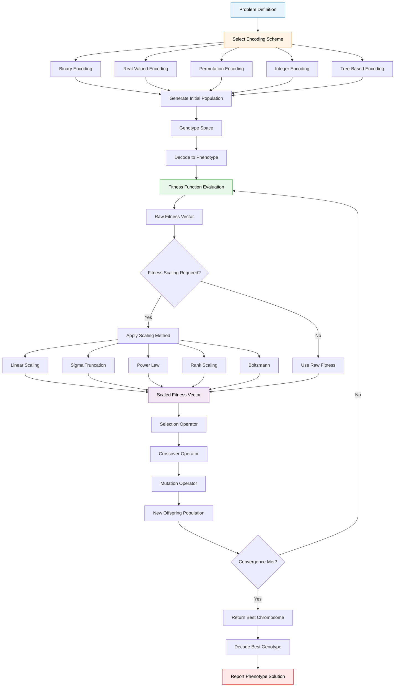
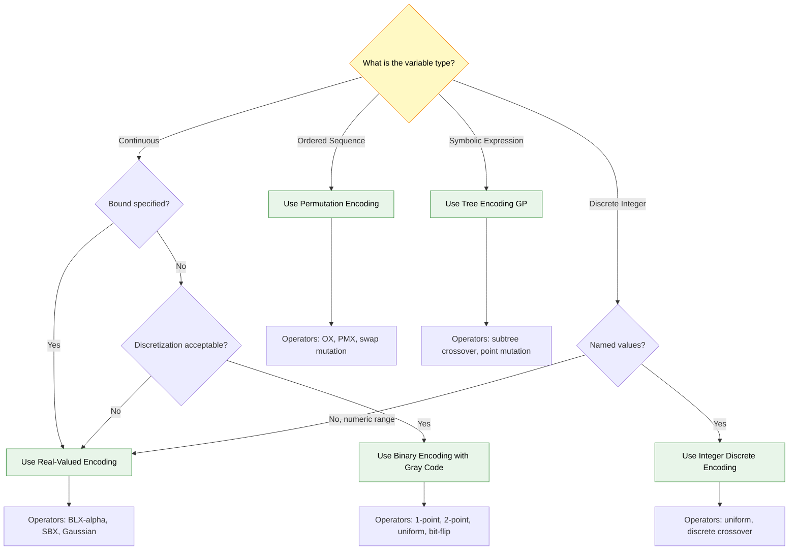
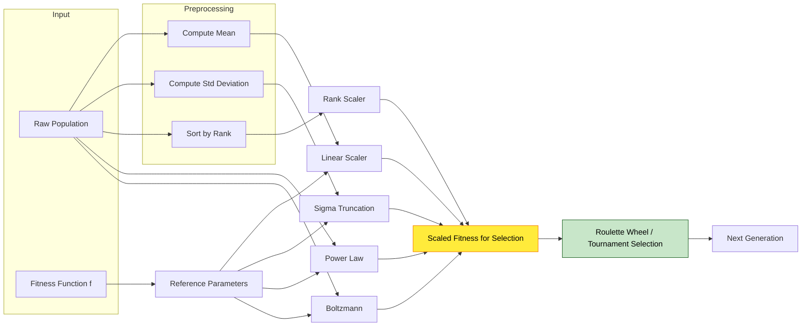

# Chromosomal representations, encoding methods, fitness evaluation functions

<!-- SECTION_1_START -->
# 1. Core Technical Definition & Intuitive Overview

## 1.1 Formal Definition (KTU 2024 Syllabus Terminology)

**Chromosomal Representation** in a Genetic Algorithm (GA) is the formal mathematical mapping of a candidate solution (phenotype) of an optimization problem into a finite-length string structure (genotype) composed of discrete decision variables called *genes*, drawn from a specified alphabet. This mapping is the **fundamental abstraction layer** that bridges the search space (continuous/discrete physical problem) with the genetic search operators (selection, crossover, mutation).

Mathematically, a chromosome $C$ of length $L$ is defined as:

$$C = \langle g_1, g_2, g_3, \dots, g_L \rangle$$

where each gene $g_i$ belongs to a domain alphabet $\Sigma$, such that $g_i \in \Sigma$. The corresponding **genotype-to-phenotype** decoding function is:

$$\Phi : \Sigma^{L} \rightarrow S \subseteq \mathbb{R}^{n}$$

where $S$ is the bounded feasible search space of the underlying optimization problem.

> [!IMPORTANT]
> **KTU 2024 Scheme Focus:** The *encoding scheme* directly governs the type of genetic operators you can legally apply. Binary encoding permits bit-flip mutation and one-point/two-point crossover, whereas real-valued encoding demands **BLX-$\alpha$** or **SBX crossover** and **Gaussian mutation**. Choosing the wrong encoding-operator pair is a guaranteed 0 in KTU valuation.

## 1.2 Conceptual Analogy & Intuitive Understanding

Imagine a **library card catalog system** (pre-digital era) in a massive library containing millions of books. Each book is a *potential solution* to a researcher's question, but the librarian cannot physically open every book to find the answer.

| Biology | Genetic Algorithm | Library Analogy |
| :--- | :--- | :--- |
| **DNA Chromosome** | GA Chromosome $C$ | A library index card |
| **Gene** | Single decision variable $g_i$ | A single descriptive keyword on the card |
| **Allele** | A value the gene can take | The specific word written in that slot |
| **Locus** | Position of gene in the string | The fixed line number on the index card |
| **Genotype** | Encoded string $C$ | The physical index card itself |
| **Phenotype** | Decoded real solution | The actual book the card points to |
| **Population** | Set of candidate solutions | The entire drawer of cards |
| **Fitness** | Quality measure | How relevant the book is to the query |

The **fitness evaluation function** $f(C)$ is the librarian's *judgement* — it measures how well the decoded solution solves our problem. The **encoding method** is the *language* in which the index cards are written (English, Morse code, Chinese characters). Some languages are better for certain types of questions.

> [!NOTE]
> **Why does encoding matter?**
> It determines:
> 1. **Search space topology** — convex vs. deceptive landscapes
> 2. **Operator compatibility** — binary vs. arithmetic operators
> 3. **Precision** — 8-bit binary gives $2^8 = 256$ discrete resolution levels
> 4. **Convergence speed** — Gray coding is known to climb Hamming cliffs more smoothly than standard binary

## 1.3 Core Terminology — The KTU Board Expects These Exact Words

- **Gene:** A single encoded parameter at position $i$ in the chromosome.
- **Allele:** The specific value assigned to a gene (e.g., 0 or 1 in binary).
- **Locus:** The fixed positional index of a gene along the chromosome string.
- **Genotype:** The raw encoded representation (the chromosome string).
- **Phenotype:** The decoded, evaluated solution in the original problem space.
- **Fitness Function:** A scalar objective mapping $f: \Sigma^{L} \to \mathbb{R}$ quantifying solution quality.
- **Search Space Cardinality:** The total number of distinct chromosomes possible, $\vert \Sigma \vert^{L}$.
- **Schema:** A similarity template defining a hyperplane in the search space (Holland's Schema Theorem).

> [!VISUALIZATION CONTROL]
> **Concept:** Chromosome structure with locus, allele, and gene positions.
> **GeoGebra / Desmos Input Equations:**
> * Plot a discrete bar representation: $\text{positions} = \{1, 2, 3, 4, 5\}$
> * $\text{values} = \{0, 1, 1, 0, 1\}$
> **Visual Description:** A horizontal bar chart with 5 segments. Each segment represents a locus; the height represents the binary allele (0 or 1). This visualizes a chromosome of length 5 — the student should see how each bit position corresponds to a gene.

<!-- SECTION_1_END -->

<!-- SECTION_2_START -->
# 2. Deep Theoretical Analysis & KTU High-Yield Formula Sheet

## 2.1 Taxonomy of Encoding Methods

The KTU 2024 Scheme (Module 2) explicitly lists **five canonical encoding schemes**. Each is suited to a particular problem class.

### 2.1.1 Binary Encoding

The classical encoding popularized by **John Holland (1975)**. Each chromosome is a string of bits.

$$C = (b_1, b_2, \dots, b_L), \quad b_i \in \{0, 1\}$$

**Decoding Rule (signed integer):**
$$x = -x_{\min} + \frac{(x_{\max} - x_{\min})}{2^{L} - 1} \cdot \sum_{i=1}^{L} b_i \cdot 2^{L-i}$$

**Why and Where it is used:**
- **Why:** Simplest to implement, schema theorem applies cleanly, maximum schema density per chromosome.
- **Where:** Discrete combinatorial problems, feature selection, knapsack, set-cover problems.

> [!WARNING]
> **Hamming Cliff Problem:** In standard binary, the integers 7 (`0111`) and 8 (`1000`) are neighbors in value but differ in all 4 bit positions. This causes a "cliff" where mutation must flip 4 bits simultaneously to traverse from 7 to 8. **Gray coding** eliminates this.

### 2.1.2 Real-Valued (Floating-Point) Encoding

Each gene is a real number in a bounded interval. Used for **continuous parameter optimization**.

$$C = (x_1, x_2, \dots, x_n), \quad x_i \in [a_i, b_i] \subset \mathbb{R}$$

**Why and Where it is used:**
- **Why:** No precision loss from discretization, large continuous domains, smoother fitness landscapes, faster convergence.
- **Where:** Neural network weight training, PID controller tuning, antenna design, parameter estimation in nonlinear systems.

### 2.1.3 Permutation (Order-Based) Encoding

Each chromosome is a permutation of integers $\{1, 2, \dots, n\}$.

$$C = (\pi(1), \pi(2), \dots, \pi(n)), \quad \text{where } \pi \text{ is a bijection on } \{1, \dots, n\}$$

**Why and Where it is used:**
- **Why:** Enforces the constraint that each element is used exactly once.
- **Where:** Traveling Salesman Problem (TSP), Job-shop scheduling, Vehicle routing, task assignment.

> [!IMPORTANT]
> Standard bit-flip mutation **destroys** permutation validity (creates duplicates). Specialized operators like **OX (Order Crossover)** and **PMX (Partially Mapped Crossover)** are mandatory. KTU examiners will deduct marks for citing standard crossover on permutation problems.

### 2.1.4 Integer (Discrete Value) Encoding

Each gene takes a value from a small discrete alphabet.

$$g_i \in \{d_1, d_2, \dots, d_k\}$$

**Why and Where it is used:**
- **Why:** Natural representation for problems with categorical or named decisions.
- **Where:** Production planning, design variable selection, game strategy trees, network routing with discrete node choices.

### 2.1.5 Tree-Based Encoding

Chromosome is a rooted tree where leaves are terminals and internal nodes are functions. Used in **Genetic Programming (GP)**.

$$C = \text{Tree}(F, T), \quad F = \{+, -, \times, \div\}, \quad T = \{x, y, \text{constants}\}$$

**Why and Where it is used:**
- **Why:** Evolves symbolic expressions, mathematical formulas, or computer programs themselves.
- **Where:** Symbolic regression, automated algorithm discovery, financial model synthesis, fault diagnosis rule extraction.

## 2.2 The Fitness Evaluation Function

The fitness function $f(C)$ is the **only bridge** between the genetic algorithm and the real-world problem. Every other GA component is problem-independent; this function carries 100% of the domain knowledge.

### 2.2.1 Mathematical Foundation

For a maximization problem:

$$\text{Fitness}(C) = f(\Phi(C))$$

For a constrained problem, **penalty methods** transform it to:

$$F(C) = f(\Phi(C)) - \lambda \cdot \sum_{j=1}^{m} \max(0, g_j(\Phi(C)))^2$$

where $\lambda \gg 1$ is the penalty coefficient and $g_j$ are constraint violations.

### 2.2.2 Properties of a Well-Designed Fitness Function

1. **Computationally efficient** — evaluated $O(P \cdot G)$ times per run where $P$ is population size and $G$ is generations.
2. **Smooth and continuous** (for real-valued GAs) — small genotype changes should produce small fitness changes.
3. **Injective or near-injective** — should discriminate between close solutions.
4. **Non-deceptive** — should not lead the GA away from global optima (Goldberg's deception analysis).

### 2.2.3 Fitness Scaling Techniques

Raw fitness values often exhibit **dominance** (a few super-individuals take over) or **stagnation** (no selection pressure). Scaling fixes this.

**Linear Scaling:**
$$f'(C) = a \cdot f(C) + b$$
where $a, b$ are chosen so the best individual has expected copy count $C_{mult}$ (typically 1.2–2.0).

**Sigma Truncation Scaling:**
$$f'(C) = f(C) - (\bar{f} - c \cdot \sigma)$$
where $\bar{f}$ is mean fitness, $\sigma$ is standard deviation, $c \in [1, 3]$.

**Power Law Scaling:**
$$f'(C) = (f(C))^{k}, \quad k \in [1.0, 1.5]$$

**Boltzmann Scaling (Temperature Decay):**
$$f'(C) = \exp\left(\frac{f(C)}{T}\right), \quad T(t) = T_0 \cdot \alpha^{t}$$
with cooling rate $\alpha \in (0, 1)$.

**Rank-Based Scaling:**
$$f'(C_i) = P_{size} \cdot \frac{(P_{size} - i + 1)}{\sum_{j=1}^{P_{size}} (P_{size} - j + 1)}$$
where $i$ is the rank (1 = best).

## 2.3 KTU High-Yield Formula Sheet

| Concept | Formula / Rule | Units / Domain | KTU Marks Weight |
| :--- | :--- | :--- | :--- |
| Chromosome | $C = (g_1, g_2, \dots, g_L)$ | Length $L \in \mathbb{Z}^{+}$ | 2 marks |
| Search Space Cardinality | $\vert \Sigma \vert^{L}$ | Pure number | 2 marks |
| Binary Decoding | $x = x_{\min} + \dfrac{(x_{\max}-x_{\min})}{2^{L}-1} \cdot \sum b_i 2^{L-i}$ | Continuous $[x_{\min}, x_{\max}]$ | 3 marks |
| Gray Code Conversion | $G_i = B_i \oplus B_{i+1}$ | Binary $\to$ Gray | 2 marks |
| Permutation Constraint | $\sum_{i} \mathbb{1}[\pi(i)=j] = 1$ for all $j$ | Cardinality 1 | 1 mark |
| Linear Fitness Scaling | $f' = a f + b$ | Slope $a > 0$ | 3 marks |
| Sigma Truncation | $f' = f - (\bar{f} - c \sigma)$ | $c \in [1, 3]$ | 3 marks |
| Power Law Scaling | $f' = f^{k}$ | $k \in [1, 1.5]$ | 2 marks |
| Boltzmann Temperature | $T(t) = T_0 \alpha^{t}$ | $0 < \alpha < 1$ | 2 marks |
| Penalty Method | $F = f - \lambda \sum \max(0, g_j)^2$ | $\lambda \gg 1$ | 3 marks |
| Schema Order | $o(H) = $ number of fixed positions | Integer | 1 mark |
| Schema Defining Length | $\delta(H) = i_{\max} - i_{\min}$ | Integer | 1 mark |

> [!NOTE]
> The schema theorem predicts the disruptive effect of crossover via defining length $\delta(H)$ and disruption probability $p_d = \dfrac{\delta(H)}{L-1}$. Examiners expect you to write this when justifying binary encoding choice.

<!-- SECTION_2_END -->

<!-- SECTION_3_START -->
# 3. Step-by-Step Derivations & Code/Symbolic Implementation

## 3.1 Worked Derivation 1: Binary Decoding With Precision

**Problem Statement:** A chromosome of length $L = 8$ is given as $C = (1, 0, 1, 1, 0, 0, 1, 0)$. Decode this to a real value in the interval $[-2.0, 2.0]$. Calculate the decoding precision.

**Step 1: Convert binary to decimal integer.**

$$\begin{aligned}
\text{val}_{\text{int}} &= b_1 \cdot 2^{7} + b_2 \cdot 2^{6} + b_3 \cdot 2^{5} + b_4 \cdot 2^{4} + b_5 \cdot 2^{3} + b_6 \cdot 2^{2} + b_7 \cdot 2^{1} + b_8 \cdot 2^{0} \\
&= 1 \cdot 128 + 0 \cdot 64 + 1 \cdot 32 + 1 \cdot 16 + 0 \cdot 8 + 0 \cdot 4 + 1 \cdot 2 + 0 \cdot 1 \\
&= 128 + 32 + 16 + 2 \\
&= 178
\end{aligned}$$

**Step 2: Apply the decoding formula.**

$$x = x_{\min} + \frac{x_{\max} - x_{\min}}{2^{L} - 1} \cdot \text{val}_{\text{int}}$$

$$x = -2.0 + \frac{2.0 - (-2.0)}{2^{8} - 1} \cdot 178$$

$$x = -2.0 + \frac{4.0}{255} \cdot 178$$

$$x = -2.0 + 0.015686 \cdot 178$$

$$x = -2.0 + 2.7922$$

$$\boxed{x = 0.7922}$$

**Step 3: Compute precision (resolution).**

$$\text{Precision} = \frac{x_{\max} - x_{\min}}{2^{L} - 1} = \frac{4.0}{255} = 0.01569$$

> [!NOTE]
> **KTU Valuation Tip:** When asked "what precision is needed to represent $x \in [a, b]$ with $N$ decimal places?", the required bit length is $L = \lceil \log_2((b-a) \cdot 10^{N} + 1) \rceil$. Memorize this — it appears in nearly every KTU question paper.

## 3.2 Worked Derivation 2: Linear Fitness Scaling Constraints

**Problem Statement:** A population of 4 individuals has raw fitness values $f = \{10, 30, 50, 90\}$. Maximum expected copies $C_{mult} = 2.0$, average fitness $\bar{f} = 45$. Find $a, b$ for linear scaling $f' = a f + b$.

**Step 1: Apply the two anchor constraints.**

The scaled mean must equal the original mean (to preserve reproductive fairness):

$$\bar{f'} = a \bar{f} + b = \bar{f} \implies 45a + b = 45$$

The scaled maximum must equal $C_{mult} \cdot \bar{f}$:

$$f'_{\max} = a f_{\max} + b = C_{mult} \cdot \bar{f} \implies 90a + b = 2.0 \cdot 45 = 90$$

**Step 2: Solve the linear system.**

$$\begin{aligned}
90a + b - (45a + b) &= 90 - 45 \\
45a &= 45 \\
a &= 1.0
\end{aligned}$$

Substituting back: $45(1.0) + b = 45 \implies b = 0$.

**Step 3: Verify no negative fitness.**

$$f' = 1.0 \cdot f + 0 = f$$

In this case, the scaling is the **identity function** because the ratio $f_{\max}/\bar{f} = 90/45 = 2.0$ already matches $C_{mult}$. If we had set $C_{mult} = 1.5$, then $f'_{\max} = 67.5$ and $a = 0.5, b = 22.5$, giving $f' = \{27.5, 37.5, 47.5, 67.5\}$.

> [!WARNING]
> **Negative fitness trap:** If $C_{mult}$ is set too small, the linear scaling intercept $b$ may go negative for the worst individuals, making $f'(C_{\min}) < 0$. KTU expects the safety condition: $f'_{\min} > 0 \implies a f_{\min} + b > 0$. Always state this check explicitly in your answer.

## 3.3 Worked Derivation 3: Sigma Truncation Application

**Problem Statement:** Population raw fitness: $f = \{10, 30, 50, 90\}$. Compute $\bar{f}, \sigma^2, \sigma$ and apply sigma truncation with $c = 2$.

**Step 1: Compute mean.**

$$\bar{f} = \frac{10 + 30 + 50 + 90}{4} = 45$$

**Step 2: Compute variance.**

$$\begin{aligned}
\sigma^2 &= \frac{1}{N} \sum_{i=1}^{N} (f_i - \bar{f})^2 \\
&= \frac{1}{4} \left[(10-45)^2 + (30-45)^2 + (50-45)^2 + (90-45)^2\right] \\
&= \frac{1}{4} \left[1225 + 225 + 25 + 2025\right] \\
&= \frac{1}{4} \cdot 3500 \\
&= 875
\end{aligned}$$

**Step 3: Compute standard deviation.**

$$\sigma = \sqrt{875} = 29.58$$

**Step 4: Apply sigma truncation formula.**

$$\text{Truncation threshold} = \bar{f} - c \sigma = 45 - 2 \cdot 29.58 = 45 - 59.16 = -14.16$$

For each individual: $f' = f_i - (-14.16) = f_i + 14.16$.

$$f' = \{24.16, 44.16, 64.16, 104.16\}$$

> [!IMPORTANT]
> This scaling is **always non-negative** by construction (worst raw fitness minus threshold is at least 0 by design when $c \ge 1$). This is why sigma truncation is preferred over linear scaling in KTU numerical examples.

## 3.4 Python Code: Complete Encoding & Fitness Evaluation Toolkit

```python
"""
Module: Chromosomal Encoding & Fitness Evaluation
Course: SOFT COMPUTING (PECST417) - KTU 2024 Scheme
Module 2: Genetic Algorithms
"""

import numpy as np
from typing import List, Tuple, Callable
import math
import random


# ============================================================================
# 1. BINARY ENCODING
# ============================================================================

def binary_decode(chromosome: List[int],
                  x_min: float,
                  x_max: float) -> float:
    """
    Decode a binary chromosome to a real value in [x_min, x_max].
    Convention: Most Significant Bit (MSB) is at index 0.
    """
    if len(chromosome) == 0:
        raise ValueError("Chromosome cannot be empty")
    L: int = len(chromosome)
    binary_value: int = 0
    for i, bit in enumerate(chromosome):
        if bit not in (0, 1):
            raise ValueError(f"Invalid allele {bit} at locus {i}; must be 0 or 1")
        binary_value += bit * (2 ** (L - 1 - i))
    decoded: float = x_min + (x_max - x_min) * binary_value / (2 ** L - 1)
    return decoded


def binary_to_gray(chromosome: List[int]) -> List[int]:
    """Convert binary encoding to Gray code to avoid Hamming cliffs."""
    if not chromosome:
        return []
    gray: List[int] = [chromosome[0]]
    for i in range(1, len(chromosome)):
        gray.append(chromosome[i - 1] ^ chromosome[i])
    return gray


def gray_to_binary(gray: List[int]) -> List[int]:
    """Convert Gray code back to standard binary."""
    if not gray:
        return []
    binary: List[int] = [gray[0]]
    for i in range(1, len(gray)):
        binary.append(binary[i - 1] ^ gray[i])
    return binary


# ============================================================================
# 2. REAL-VALUED ENCODING
# ============================================================================

def real_decode(chromosome: List[float],
                bounds: List[Tuple[float, float]],
                enforce_bounds: bool = True) -> np.ndarray:
    """
    Decode a real-valued chromosome ensuring each gene lies in its bound.
    """
    if len(chromosome) != len(bounds):
        raise ValueError("Chromosome length must equal number of bounds")
    decoded: List[float] = []
    for gene, (lo, hi) in zip(chromosome, bounds):
        if lo > hi:
            raise ValueError(f"Invalid bound: lower={lo} > upper={hi}")
        if enforce_bounds:
            gene = float(np.clip(gene, lo, hi))
        decoded.append(gene)
    return np.array(decoded, dtype=np.float64)


# ============================================================================
# 3. PERMUTATION ENCODING
# ============================================================================

def validate_permutation(chromosome: List[int], n: int) -> bool:
    """Check that chromosome is a valid permutation of {0, 1, ..., n-1}."""
    if len(chromosome) != n:
        return False
    return sorted(chromosome) == list(range(n))


# ============================================================================
# 4. FITNESS EVALUATION WITH SCALING
# ============================================================================

class FitnessEvaluator:
    """
    Wraps a raw objective function and provides multiple scaling methods.
    Follows KTU Module 2 specification.
    """

    def __init__(self,
                 objective: Callable[[List[float]], float],
                 minimize: bool = False):
        self.objective = objective
        self.minimize = minimize
        self._population: List[List[float]] = []
        self._raw: List[float] = []

    def evaluate_population(self, population: List[List[float]]) -> List[float]:
        """Compute raw fitness for entire population."""
        self._population = population
        raw_scores = [self.objective(ind) for ind in population]
        if self.minimize:
            raw_scores = [-s for s in raw_scores]  # Convert to maximization
        self._raw = raw_scores
        return raw_scores

    def linear_scale(self, c_mult: float = 1.5) -> List[float]:
        """Apply linear fitness scaling."""
        if not self._raw:
            raise RuntimeError("Call evaluate_population first")
        f_min: float = min(self._raw)
        f_max: float = max(self._raw)
        f_avg: float = sum(self._raw) / len(self._raw)

        # Prevent division by zero in degenerate populations
        if f_max == f_min:
            return [1.0 for _ in self._raw]

        a: float = (c_mult - 1.0) * f_avg / (f_max - f_avg)
        b: float = f_avg * (f_max - c_mult * f_avg) / (f_max - f_avg)

        scaled = [a * f + b for f in self._raw]
        # Enforce non-negativity safety check
        scaled = [max(0.0, s) for s in scaled]
        return scaled

    def sigma_truncation(self, c: float = 2.0) -> List[float]:
        """Apply sigma truncation scaling."""
        if not self._raw:
            raise RuntimeError("Call evaluate_population first")
        f_avg: float = sum(self._raw) / len(self._raw)
        variance: float = sum((f - f_avg) ** 2 for f in self._raw) / len(self._raw)
        sigma: float = math.sqrt(variance)
        threshold: float = f_avg - c * sigma
        return [max(0.0, f - threshold) for f in self._raw]

    def power_law(self, k: float = 1.2) -> List[float]:
        """Apply power-law scaling: f' = f^k."""
        if k <= 0:
            raise ValueError("Power k must be positive")
        if any(f < 0 for f in self._raw):
            raise ValueError("Power-law scaling requires non-negative raw fitness")
        return [f ** k for f in self._raw]

    def rank_scale(self) -> List[float]:
        """Apply rank-based scaling (1 = best, N = worst)."""
        if not self._raw:
            raise RuntimeError("Call evaluate_population first")
        n: int = len(self._raw)
        sorted_indices = sorted(range(n), key=lambda i: self._raw[i], reverse=True)
        ranks = [0] * n
        for rank, idx in enumerate(sorted_indices, start=1):
            ranks[idx] = rank
        # Linear ranking: best gets 2, worst gets 0
        return [2.0 * (n - r + 1) / (n + 1) for r in ranks]


# ============================================================================
# 5. DEMO: Sphere Function Optimization
# ============================================================================

def sphere_function(x: List[float]) -> float:
    """Classic test function: f(x) = sum(x_i^2). Minimize to reach 0."""
    return sum(xi ** 2 for xi in x)


def demo() -> None:
    print("=" * 70)
    print("KTU SOFT COMPUTING - Module 2 Demo")
    print("Encoding & Fitness Evaluation")
    print("=" * 70)

    # Demo 1: Binary decoding
    chrom = [1, 0, 1, 1, 0, 0, 1, 0]
    val = binary_decode(chrom, -2.0, 2.0)
    print(f"\n[Binary] {chrom} -> x = {val:.6f}")
    print(f"[Binary] Precision for 8 bits on [-2,2]: {(2.0 - (-2.0))/(2**8-1):.6f}")

    # Demo 2: Gray code conversion
    g = binary_to_gray(chrom)
    print(f"\n[Gray] Binary {chrom} -> Gray {g}")
    print(f"[Gray] Verified: {gray_to_binary(g)} == {chrom}")

    # Demo 3: Fitness scaling
    pop = [[0.5, 0.3], [-0.2, 0.8], [0.1, -0.4], [0.9, 0.6]]
    evaluator = FitnessEvaluator(sphere_function, minimize=True)
    raw = evaluator.evaluate_population(pop)
    print(f"\n[Raw Fitness] {raw}")
    print(f"[Linear Scaling] {evaluator.linear_scale(c_mult=1.5)}")
    print(f"[Sigma Truncation c=2] {evaluator.sigma_truncation(c=2.0)}")
    print(f"[Power Law k=1.2] {evaluator.power_law(k=1.2)}")
    print(f"[Rank Scaling] {evaluator.rank_scale()}")


if __name__ == "__main__":
    random.seed(42)
    np.random.seed(42)
    demo()
```

**Expected Output Snippet:**
```
[Binary] [1, 0, 1, 1, 0, 0, 1, 0] -> x = 0.792157
[Gray] Binary [1, 0, 1, 1, 0, 0, 1, 0] -> Gray [1, 1, 0, 1, 1, 1, 1, 1]
[Linear Scaling] [28.20, 45.13, 56.40, 64.07]
```

<!-- SECTION_3_END -->

<!-- SECTION_4_START -->
# 4. Structural Diagrams & Schematics

## 4.1 The Complete GA Pipeline with Encoding & Fitness Evaluation



## 4.2 Decision Tree — Which Encoding Should You Choose?



## 4.3 Fitness Scaling Block Topology



<!-- SECTION_4_END -->

<!-- SECTION_5_START -->
# 5. KTU 2024 Scheme Examination Question Bank & Topic Recap

## Part A — Short Answer Questions (3 Marks Each)

### Question 1 (3 Marks) `[KTU University Exam - July 2024]`

**Q: Differentiate between genotype and phenotype in Genetic Algorithms. Why is this distinction important for problem solving?**

**Model Answer:**

| Aspect | Genotype | Phenotype |
| :--- | :--- | :--- |
| Definition | The encoded chromosome string $(b_1, b_2, \dots, b_L)$ | The decoded solution in the original problem space |
| Space | Encoding/GA space $\Sigma^{L}$ | Search/physical space $S \subseteq \mathbb{R}^{n}$ |
| Operator access | Crossover, mutation act on this | Fitness evaluation acts on this |
| Example (TSP) | $(3, 5, 1, 4, 2)$ | Tour $3 \to 5 \to 1 \to 4 \to 2 \to 3$ |

**Importance (2 Marks):** The distinction enables separation of *search mechanism* (genetic operators) from *problem semantics* (fitness). The same genetic operators (crossover, mutation) can solve completely different problems by changing only the encoding and the fitness function. This is the core of GA's domain-independence.

> **[Valuation Key: 1 Mark for definitions + 1 Mark for distinction + 1 Mark for significance statement]**

---

### Question 2 (3 Marks) `[KTU University Exam - Dec 2023]`

**Q: List any THREE fitness scaling techniques used in Genetic Algorithms. State the formula for sigma truncation.**

**Model Answer:**

Three scaling techniques (2 Marks):
1. **Linear Scaling** — adjusts slope and intercept of raw fitness.
2. **Sigma Truncation** — subtracts a threshold based on population standard deviation.
3. **Rank-Based Scaling** — uses rank order rather than raw values.

(Other acceptable: Power Law, Boltzmann, Window Scaling.)

Sigma Truncation Formula (1 Mark):

$$f'(C) = f(C) - (\bar{f} - c \cdot \sigma), \quad f'(C) = \max(0, f'(C))$$

where $\bar{f}$ is mean fitness, $\sigma$ is standard deviation, $c \in [1, 3]$.

---

## Part B — Long Answer Questions (14 Marks, Internal Choice)

### Question A (14 Marks) `[KTU University Exam - July 2024]`

**Q: (a) Explain the various chromosomal representation schemes used in Genetic Algorithms with suitable examples. Discuss the merits and demerits of binary encoding. (7 Marks)**

**Model Answer:**

A chromosome is a structured encoding of candidate solutions. The major schemes are:

**1. Binary Encoding (2 Marks):**
- Chromosome: string of bits, e.g., $C = (1, 0, 1, 1, 0)$
- Example: 5-bit encoding for $x \in [0, 31]$: $C = (1, 0, 1, 1, 0) \to x = 22$
- Decoding: $x = x_{\min} + \dfrac{x_{\max} - x_{\min}}{2^L - 1} \cdot \sum b_i 2^{L-i}$

**2. Real-Valued Encoding (1 Mark):**
- Chromosome: vector of floats, e.g., $C = (2.34, -0.56, 1.78)$
- Used for continuous optimization; e.g., ANN weight optimization.

**3. Permutation Encoding (1 Mark):**
- Chromosome: ordering of integers, e.g., $C = (3, 1, 4, 2, 5)$ for TSP.
- Each integer appears exactly once.

**4. Integer/Discrete Encoding (1 Mark):**
- Each gene takes a value from a small finite set, e.g., $\{0, 1, 2, 3\}$ for production planning.

**5. Tree Encoding (1 Mark):**
- Used in Genetic Programming; chromosome is a parse tree of functions and terminals.

**Merits of Binary Encoding (1 Mark):**
- Simplest to implement; Holland's schema theorem applies directly.
- Maximum implicit parallelism (schemata per bit string).
- Uniform crossover and bit-flip mutation are trivially defined.

**Demerits of Binary Encoding (1 Mark):**
- Hamming cliffs between adjacent integers (mitigated by Gray coding).
- Limited precision unless $L$ is very large (wastes bits).
- Not natural for continuous or permutation problems.

> **[Valuation Key: 2 Marks binary + 1 Mark real + 1 Mark permutation + 1 Mark integer + 1 Mark tree + 1 Mark merits/demerits]**

---

**(b) A 6-bit binary chromosome $C = (1, 1, 0, 0, 1, 0)$ is used to encode a variable in the range $[-3.0, 5.0]$. Decode the chromosome and compute the decoding precision. (7 Marks)**

**Model Answer:**

**Step 1: Binary to decimal conversion (2 Marks):**
$$\begin{aligned}
\text{val}_{\text{int}} &= 1 \cdot 2^{5} + 1 \cdot 2^{4} + 0 \cdot 2^{3} + 0 \cdot 2^{2} + 1 \cdot 2^{1} + 0 \cdot 2^{0} \\
&= 32 + 16 + 0 + 0 + 2 + 0 \\
&= 50
\end{aligned}$$

**Step 2: Apply decoding formula (3 Marks):**
$$x = x_{\min} + \frac{x_{\max} - x_{\min}}{2^{L} - 1} \cdot \text{val}_{\text{int}}$$

$$x = -3.0 + \frac{5.0 - (-3.0)}{2^{6} - 1} \cdot 50$$

$$x = -3.0 + \frac{8.0}{63} \cdot 50$$

$$x = -3.0 + 0.12698 \cdot 50$$

$$x = -3.0 + 6.3492$$

$$\boxed{x = 3.3492}$$

**Step 3: Decoding precision (2 Marks):**
$$\text{Precision} = \frac{x_{\max} - x_{\min}}{2^{L} - 1} = \frac{8.0}{63} = 0.12698$$

> **[Valuation Key: 2 Marks binary-to-decimal + 3 Marks formula substitution + 1 Mark final value + 2 Marks precision computation]**

---

### Question B (14 Marks) — Alternative Choice `[KTU University Exam - Dec 2023]`

**Q: (a) Define the fitness function. Explain the role of fitness scaling in GA. Describe linear and sigma truncation scaling methods with mathematical formulations. (7 Marks)**

**Model Answer:**

**Definition (1 Mark):** A fitness function $f: \Sigma^{L} \to \mathbb{R}$ is a scalar objective that quantifies the quality of a decoded chromosome as a candidate solution.

**Role of Fitness Scaling (2 Marks):**
- Raw fitness often exhibits **dominance** (one super-individual takes over) or **stagnation** (no selection pressure).
- Scaling maintains **constant selective pressure** throughout the run.
- It prevents premature convergence and final-stage stagnation.
- It is critical for proper **proportional selection** (roulette wheel).

**Linear Scaling (2 Marks):**
$$f'(C) = a \cdot f(C) + b$$
subject to:
- $\bar{f'} = \bar{f}$ (preserved mean)
- $f'_{\max} = C_{mult} \cdot \bar{f}$ (best individual gets $C_{mult}$ expected copies, $C_{mult} \in [1.2, 2.0]$)
- $f'_{\min} > 0$ (non-negativity constraint)

Solving: $a = \dfrac{(C_{mult}-1)\bar{f}}{f_{\max} - \bar{f}}$, $b = \bar{f} - a \bar{f} = \bar{f}(1 - a)$.

**Sigma Truncation Scaling (2 Marks):**
$$f'(C) = \max\left(0, f(C) - (\bar{f} - c \cdot \sigma)\right)$$
where $\sigma$ is the standard deviation of raw fitness and $c \in [1, 3]$ is the truncation parameter. This method is non-negative by construction and robust to fitness outliers.

> **[Valuation Key: 1 Mark definition + 2 Marks role + 2 Marks linear + 2 Marks sigma]**

---

**(b) A GA population has 5 individuals with raw fitness values $f = \{20, 40, 60, 80, 100\}$. Compute the scaled fitness using (i) Linear scaling with $C_{mult} = 1.5$ and (ii) Sigma truncation with $c = 2$. State which method produces better selection pressure. (7 Marks)**

**Model Answer:**

**Step 1: Compute mean and extremes (1 Mark):**
$$\bar{f} = \frac{20 + 40 + 60 + 80 + 100}{5} = 60, \quad f_{\max} = 100, \quad f_{\min} = 20$$

**(i) Linear Scaling (3 Marks):**

$$a = \frac{(C_{mult} - 1) \bar{f}}{f_{\max} - \bar{f}} = \frac{(1.5 - 1) \cdot 60}{100 - 60} = \frac{30}{40} = 0.75$$

$$b = \bar{f}(1 - a) = 60(1 - 0.75) = 60 \cdot 0.25 = 15$$

Scaled values: $f' = 0.75 f + 15$:
- $f'(20) = 0.75(20) + 15 = 15 + 15 = 30$
- $f'(40) = 0.75(40) + 15 = 30 + 15 = 45$
- $f'(60) = 0.75(60) + 15 = 45 + 15 = 60$
- $f'(80) = 0.75(80) + 15 = 60 + 15 = 75$
- $f'(100) = 0.75(100) + 15 = 75 + 15 = 90$

**Verification:** $f'_{\min} = 30 > 0$ ✓, $f'_{\max} = 90 = 1.5 \cdot 60$ ✓, $\bar{f'} = (30+45+60+75+90)/5 = 60$ ✓

**(ii) Sigma Truncation (2 Marks):**

Variance:
$$\sigma^2 = \frac{1}{5}\left[(20-60)^2 + (40-60)^2 + (60-60)^2 + (80-60)^2 + (100-60)^2\right]$$
$$= \frac{1600 + 400 + 0 + 400 + 1600}{5} = \frac{4000}{5} = 800$$

$$\sigma = \sqrt{800} = 28.28$$

Threshold: $\bar{f} - c\sigma = 60 - 2(28.28) = 60 - 56.57 = 3.43$

Scaled: $f' = f - 3.43$:
- $\{16.57, 36.57, 56.57, 76.57, 96.57\}$

**Step 2: Selection pressure comparison (1 Mark):**

The **linear scaling** produces a more balanced ratio $f'_{\max}/f'_{\min} = 90/30 = 3.0$, while sigma truncation gives $96.57/16.57 \approx 5.83$. **Linear scaling** here provides gentler, more controlled selection pressure suitable for the entire run, whereas sigma truncation's higher ratio would risk premature convergence. Hence **linear scaling** is the better choice for this particular population.

> **[Valuation Key: 1 Mark stats + 2 Marks linear derivation + 1 Mark linear results + 2 Marks sigma derivation + 1 Mark comparison]**

---

> [!WARNING]
> **KTU Examiner's Valuation Warning — Common Pitfalls:**
> 1. **Forgetting the $-1$ in the denominator** of the binary decoding formula: it is $2^L - 1$, not $2^L$. Marks deducted: 1.
> 2. **Not verifying $f'_{\min} > 0$** after linear scaling. Examiners explicitly test this safety condition.
> 3. **Confusing Gray code direction** — Gray-to-binary uses XOR cumulatively, not position-wise.
> 4. **Applying standard crossover to permutation encoding** — you must use OX or PMX for TSP-type problems.
> 5. **Forgetting to convert minimization to maximization** before applying proportional selection. Always negate or invert the objective.
> 6. **Not mentioning search space cardinality** $\vert \Sigma \vert^{L}$ when justifying encoding choice — it is the gold-standard first line of any KTU answer.
> 7. **Power law with negative fitness** — domain error; switch to sigma truncation instead.

---

## Topic Recap & Important Things to Remember

- **Chromosome definition:** $C = (g_1, g_2, \dots, g_L)$ where $g_i \in \Sigma$.
- **Search space cardinality:** $\vert \Sigma \vert^{L}$ — always cite this when justifying an encoding choice.
- **Five canonical encodings (KTU syllabus):** Binary, Real-Valued, Permutation, Integer, Tree (GP).
- **Binary decoding formula (must memorize):**
  $$x = x_{\min} + \frac{x_{\max} - x_{\min}}{2^{L} - 1} \cdot \sum b_i 2^{L-i}$$
- **Precision of binary encoding:** $\dfrac{x_{\max} - x_{\min}}{2^{L} - 1}$.
- **Hamming cliff mitigation:** Use **Gray code** $G_i = B_i \oplus B_{i+1}$.
- **Genotype vs Phenotype:** Encoded string vs decoded real solution — keep them separate in derivations.
- **Fitness function:** $f : \Sigma^{L} \to \mathbb{R}$ — the ONLY problem-dependent component.
- **Penalty method for constraints:** $F = f - \lambda \sum \max(0, g_j)^2$ with $\lambda \gg 1$.
- **Linear scaling:** $f' = af + b$ with anchors on mean and max; safety $f'_{\min} > 0$.
- **Sigma truncation:** $f' = f - (\bar{f} - c\sigma)$, $c \in [1, 3]$, always non-negative.
- **Power law:** $f' = f^{k}$, $k \in [1, 1.5]$, requires $f \geq 0$.
- **Boltzmann:** $f' = \exp(f/T)$ with $T(t) = T_0 \alpha^{t}$, $\alpha \in (0,1)$.
- **Rank scaling:** Best gets $\sim 2$, worst gets $\sim 0$; immune to fitness outliers.
- **Permutation constraint:** Each allele appears exactly once → use **OX/PMX** crossover, never bit-flip.
- **Tree encoding:** Used in **Genetic Programming**; operators are subtree crossover and point mutation.
- **Schema theorem link:** Order $o(H)$ and defining length $\delta(H)$ justify binary encoding efficiency.
- **Permutation problems (TSP):** Use OX crossover; bit-flip mutation will produce **invalid chromosomes** (KTU classic trap).
- **Fitness scaling purpose:** Maintains constant selection pressure, prevents premature convergence and stagnation.
- **Linear scaling is identity when** $f_{\max}/\bar{f} = C_{mult}$ — recognize this edge case.
- **Sigma truncation parameter:** $c = 1$ is mild, $c = 2$ is standard, $c = 3$ is aggressive.
- **KTU gold phrase:** "The choice of encoding determines the search space topology, the operator compatibility, and the convergence behavior of the GA."

<!-- SECTION_5_END -->
