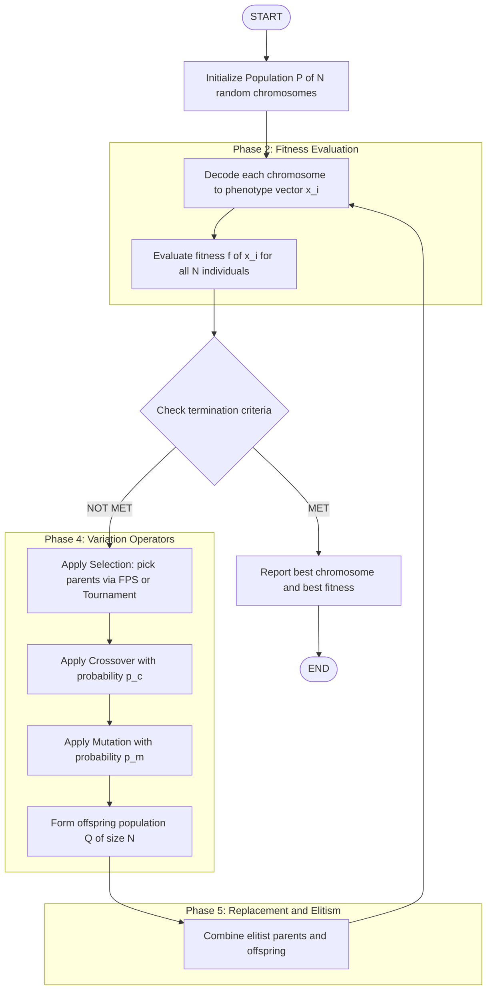
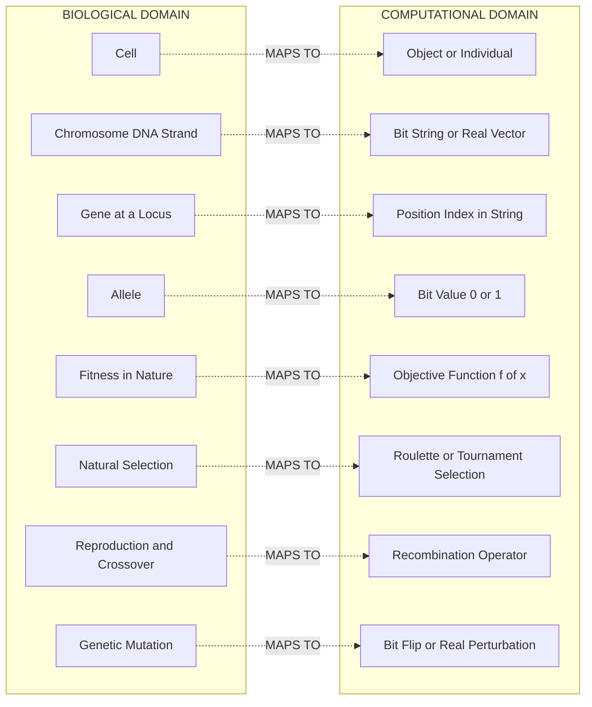

# Genetic algorithms basic concepts, biological background

<!-- SECTION_1_START -->
# Genetic Algorithms: Basic Concepts & Biological Background

## 1.1 Formal Academic Definition

A **Genetic Algorithm (GA)** is a stochastic, population-based metaheuristic optimization technique inspired by the principles of **natural selection** and **genetic inheritance** first formally articulated by Charles Darwin and later mathematically formalized by **John Henry Holland (1975)**. In the KTU 2024 Scheme context (Course: *PECST417 – Soft Computing*), a GA is defined as an **Evolutionary Algorithm (EA)** that maintains a set of candidate solutions (called *individuals* or *chromosomes*) encoded as strings over a finite alphabet, and iteratively transforms this population through biologically-motivated operators — **Selection**, **Crossover (Recombination)**, and **Mutation** — to converge toward optimal or near-optimal solutions of a given objective function $f(\vec{x})$.

> [!IMPORTANT]
> **KTU Syllabus Highlight (Module 2):** Genetic Algorithms form the *evolutionary computing* backbone of Soft Computing. Unlike gradient-based methods, GAs require **no derivative information** and perform a **parallel, global search** over the solution space, making them suitable for NP-hard, non-convex, discontinuous, and noisy problems.

## 1.2 Conceptual Analogy — "The Survival of the Fittest Solutions"

Imagine a vast, fog-covered mountain range where the **lowest valley** hides a treasure. You cannot see the terrain, and there is no map. You release **1,000 mountaineers** at random points across the range. Each mountaineer has a **fitness score** based on how low their current altitude is. In every "generation":

1. The mountaineers at the **highest altitudes (worst fitness)** are *culled*.
2. The mountaineers at the **lowest altitudes (best fitness)** are allowed to *reproduce* — exchanging pieces of their route plans.
3. A few mountaineers *mutate* — randomly tweaking a step in their route.
4. A new generation of 1,000 mountaineers is born, and the cycle repeats.

Over hundreds of generations, the population **climbs down** toward the treasure (global optimum). This is precisely how a Genetic Algorithm operates on a *population of candidate solutions*.

> [!NOTE]
> **Key Insight:** A GA does **not** move a *single* point through space (like gradient descent). It maintains an entire **population of parallel hypotheses** and uses *probabilistic* — not deterministic — transition rules.

## 1.3 Biological Background — The Cell, the Gene, and Evolution

The biological inspiration for GAs rests on the **Central Dogma of Molecular Biology**:

$$\text{DNA} \xrightarrow{\text{Transcription}} \text{RNA} \xrightarrow{\text{Translation}} \text{Protein}$$

A **living cell** contains **chromosomes** — long double-helix DNA molecules. Each chromosome is partitioned into functional units called **genes**, which encode specific traits (e.g., eye color, enzyme structure). Different versions of a gene are called **alleles**. The complete genetic makeup of an organism is its **genotype**, while the observable expression of these genes is the **phenotype**.

> [!NOTE]
> **Core Definitions (Board-Exam Favorites):**
> - **Genotype** — the encoded solution string (e.g., `10110010`).
> - **Phenotype** — the decoded real-world solution (e.g., $x = 18.4$).
> - **Population** — a set of $N$ candidate solutions maintained simultaneously.
> - **Generation** — one complete iteration of the GA cycle.
> - **Fitness** — a scalar measure of how "good" a phenotype is with respect to the objective.

## 1.4 Standard Metrics & Constants Used in GA

| Parameter | Symbol | Typical Range / Value |
| :--- | :--- | :--- |
| Population Size | $N$ | $20$ to $200$ |
| Chromosome Length | $L$ | $10$ to $1000$ bits (binary) |
| Crossover Probability | $p_c$ | $0.6$ to $0.95$ |
| Mutation Probability | $p_m$ | $0.001$ to $0.1$ |
| Number of Generations | $T$ | $50$ to $1000$ |
| Selection Pressure | $\eta$ | $1.0$ to $2.0$ |

> [!VISUALIZATION CONTROL]
> **Concept:** *Fitness Landscape* — A 2D projection of a multi-modal objective function.
> **GeoGebra / Desmos Input Equations:**
> * $f(x) = \sin(3x) + 0.3 \cdot x^{2} - 2x + 4$
> * $g(x) = -0.5 \cdot (x-4)^{2} + 8$   *(global optimum region)*
> **Visual Description:** The student should observe a *rugged terrain* with multiple peaks and valleys. The GA's job is to find the **deepest valley** (global minimum). Plot several "individuals" as moving points that gradually cluster near the lowest valley over successive generations.
<!-- SECTION_1_END -->

<!-- SECTION_2_START -->
# Deep Theoretical Analysis & KTU High-Yield Formula Sheet

## 2.1 Biological Terminology ↔ Computational Mapping

The genius of Holland's abstraction lies in the **direct one-to-one mapping** between biological entities and computational structures. The KTU examiner frequently awards a dedicated 3–4 mark question to this mapping.

| Biological Term | Computational Equivalent | Functional Role in GA |
| :--- | :--- | :--- |
| Individual / Organism | Chromosome / String | One candidate solution |
| Population | Set of $N$ strings | The current search frontier |
| Chromosome | Encoded string (bit, real, integer) | Genotype representation |
| Gene | A single position / locus in the string | One decision variable |
| Allele | The value at a given locus | Possible value of that variable |
| Genotype | Encoded string | Search-space representation |
| Phenotype | Decoded parameter vector | Problem-space representation |
| Fitness | Objective function value $f(\vec{x})$ | Survival criterion |
| Selection | Probabilistic parent picking | Exploitation of good regions |
| Crossover | Recombination of two parent strings | Information exchange (exploration) |
| Mutation | Random bit/value flip | Maintains genetic diversity |
| Generation | One GA iteration | Time-step of evolution |

## 2.2 The Five-Phase GA Pipeline

Every canonical GA — whether binary, real-coded, or permutation-based — follows the same five-phase operational sequence:

1. **Initialization:** Generate an initial population $P^{(0)} = \{\vec{x}_1^{(0)}, \vec{x}_2^{(0)}, \dots, \vec{x}_N^{(0)}\}$ either randomly or using a heuristic seed.
2. **Fitness Evaluation:** Compute $f_i = f(\vec{x}_i)$ for every individual.
3. **Selection:** Stochastically choose parents, biasing toward higher-fitness individuals.
4. **Variation:** Apply crossover with probability $p_c$ and mutation with probability $p_m$ to produce offspring.
5. **Replacement:** Form the next generation $P^{(t+1)}$ via generational or steady-state replacement.

> [!IMPORTANT]
> **Why This Works — The Implicit Parallelism Theorem (Holland, 1975):**
> A GA does not just process $N$ strings. Through the **Schema Theorem**, it simultaneously evaluates an **exponential number of similarity templates (schemata)** in parallel. A schema is a template with fixed bits, e.g., $H = 1\text{*}0\text{*}1$ (where $*$ is a wildcard). The number of schemata processed per generation is approximately $O(N^{3})$ — a quantity Holland called the *implicit parallelism* of GAs.

## 2.3 Mathematical Foundations of Selection

### 2.3.1 Fitness-Proportionate Selection (FPS) / Roulette Wheel

The probability that individual $i$ is selected as a parent is proportional to its fitness:

$$P_{\text{select}}(i) = \frac{f_i}{\sum_{j=1}^{N} f_j}$$

For **minimization problems**, the fitness is often transformed (e.g., scaled, inverted) to maintain the same proportionality:

$$f_i^{\text{scaled}} = \frac{1}{1 + (f_i - f_{\min}) + \epsilon}$$

where $\epsilon$ is a small positive constant to prevent division by zero.

### 2.3.2 Expected Number of Copies (Holland's Original Bound)

Under FPS, the expected number of copies of individual $i$ in the mating pool is:

$$E[n_i] = N \cdot \frac{f_i}{\bar{f}}$$

where $\bar{f}$ is the mean population fitness. This shows that **above-average individuals** ($\,f_i > \bar{f}\,$ ) receive more than one expected copy, while below-average individuals receive less than one — the engine of selection pressure.

### 2.3.3 Schema Theorem (Building Block Hypothesis)

For a schema $H$ with order $o(H)$ (number of fixed positions) and defining length $\delta(H)$ (distance between outermost fixed bits), the expected number of copies in the next generation is bounded below by:

$$E[m(H, t+1)] \;\geq\; m(H, t) \cdot \frac{f(H)}{\bar{f}} \cdot \left[ 1 - p_c \cdot \frac{\delta(H)}{L-1} \right] \cdot \left[ (1 - p_m)^{o(H)} \right]$$

This equation is the **theoretical cornerstone** of GAs: it proves that short, low-order, above-average schemata — called **building blocks** — grow exponentially across generations.

## 2.4 KTU Formula Sheet / Cheat Sheet

| # | Concept | Formula | Notes |
| :--- | :--- | :--- | :--- |
| 1 | Selection Probability (FPS) | $P_i = f_i / \sum_{j} f_j$ | Roulette-wheel basis |
| 2 | Expected Copies | $E[n_i] = N \cdot f_i / \bar{f}$ | Proves selection pressure |
| 3 | Crossover Survival | $1 - p_c \cdot \delta(H) / (L-1)$ | Single-point crossover |
| 4 | Mutation Survival | $(1 - p_m)^{o(H)}$ | Bit-flip mutation |
| 5 | Schema Theorem | Combined product of (1)(3)(4) | $E[m(H,t+1)]$ lower bound |
| 6 | Mean Fitness | $\bar{f} = (1/N) \sum_{i=1}^{N} f_i$ | Population statistic |
| 7 | Best Fitness | $f^{*} = \max_i f_i$ | Monotonic increasing in elitist GA |
| 8 | Convergence Rate | $\rho = f^{*} / \bar{f}$ | $\rho > 1$ indicates progress |
| 9 | Hamming Distance | $d_H(\vec{a}, \vec{b}) = \sum_k \vert a_k - b_k \vert$ | Diversity metric |
| 10 | Population Diversity | $\Delta(t) = (1/N) \sum_{i} d_H(\vec{x}_i, \bar{\vec{x}})$ | Average deviation from mean string |

## 2.5 Real-World Engineering Utility

GAs are deployed in production systems across virtually every engineering discipline. Concrete applications include:

- **Aerospace:** NASA evolved antenna geometries for the ST5 mission using a GA — a result competitive with human-engineered designs.
- **VLSI / Chip Design:** Floor-plan optimization, routing, and test-pattern generation.
- **Robotics:** Evolving neural-network weights (Neuroevolution), gait controllers for legged robots.
- **Finance:** Portfolio optimization, time-series forecasting, algorithmic trading rule discovery.
- **Bioinformatics:** Protein structure prediction, DNA sequence alignment, phylogenetics.
- **Scheduling:** Job-shop, university timetable, and airline crew scheduling — all NP-hard.

> [!NOTE]
> **Why not gradient descent?** When the objective is non-differentiable, multi-modal, or constrained by black-box simulations (e.g., a CFD solver), gradients are unavailable. GAs shine in exactly these regimes because they only require the **fitness value**, not the gradient.
<!-- SECTION_2_END -->

<!-- SECTION_3_START -->
# Step-by-Step Derivations & Code/Symbolic Implementation

## 3.1 Worked Derivation — Fitness-Proportionate Selection Probability

**Problem (3-mark KTU style):** *Given a population of 5 individuals with fitness values $f_1 = 10$, $f_2 = 25$, $f_3 = 5$, $f_4 = 40$, $f_5 = 20$, compute the selection probability of individual 4 under Roulette-Wheel selection.*

**Step 1 — Compute the total population fitness:**

$$\sum_{j=1}^{5} f_j \;=\; f_1 + f_2 + f_3 + f_4 + f_5 \;=\; 10 + 25 + 5 + 40 + 20 \;=\; 100$$

**Step 2 — Apply the FPS formula:**

$$P_{\text{select}}(i) \;=\; \frac{f_i}{\sum_{j=1}^{N} f_j}$$

**Step 3 — Substitute $i = 4$:**

$$P_{\text{select}}(4) \;=\; \frac{f_4}{\sum_{j=1}^{5} f_j} \;=\; \frac{40}{100} \;=\; 0.40$$

**Step 4 — Interpretation:**

Individual 4 has a **40% chance** of being selected as a parent in any given selection draw. Over $N = 5$ draws, its expected number of copies is:

$$E[n_4] \;=\; N \cdot P_{\text{select}}(4) \;=\; 5 \cdot 0.40 \;=\; 2.0 \text{ copies}$$

> **[Valuation Key Points:]**
> - Correctly stating the FPS formula: **1 Mark**
> - Computing the sum $\sum f_j = 100$: **1 Mark**
> - Final substituted and simplified $P_4 = 0.40$: **1 Mark**

---

## 3.2 Worked Derivation — Schema Theorem Bound

**Problem (7-mark KTU style):** *A schema $H = \text{1*01*}$ has defining length $\delta(H) = 4$, order $o(H) = 3$, and the average fitness of its instances $f(H) = 1.5 \bar{f}$. In a population of size $N = 50$ with $m(H, t) = 5$ instances, $L = 7$, $p_c = 0.7$, $p_m = 0.01$, compute the lower-bound expected number of instances in the next generation.*

**Step 1 — Write the Schema Theorem:**

$$E[m(H, t+1)] \;\geq\; m(H, t) \cdot \frac{f(H)}{\bar{f}} \cdot \left[ 1 - p_c \cdot \frac{\delta(H)}{L-1} \right] \cdot \left[ (1 - p_m)^{o(H)} \right]$$

**Step 2 — Substitute each factor:**

- $m(H, t) = 5$
- $f(H)/\bar{f} = 1.5$
- Crossover survival: $1 - 0.7 \cdot \dfrac{4}{7-1} = 1 - 0.7 \cdot \dfrac{4}{6} = 1 - 0.4667 = 0.5333$
- Mutation survival: $(1 - 0.01)^{3} = (0.99)^{3} = 0.970299$

**Step 3 — Multiply all factors:**

$$E[m(H, t+1)] \;\geq\; 5 \cdot 1.5 \cdot 0.5333 \cdot 0.970299$$

**Step 4 — Sequentially evaluate:**

$$5 \cdot 1.5 \;=\; 7.5$$

$$7.5 \cdot 0.5333 \;=\; 3.9998$$

$$3.9998 \cdot 0.970299 \;\approx\; 3.881$$

$$\boxed{E[m(H, t+1)] \;\geq\; 3.88 \;\approx\; 4 \text{ instances}}$$

**Step 5 — Interpretation:** Despite crossover disruption, this short, low-order, above-average schema still grows from 5 instances toward ~4 expected instances, demonstrating the **exponential growth of building blocks** predicted by Holland.

> **[Valuation Key Points:]**
> - Correct formula statement: **2 Marks**
> - Crossover survival factor (0.5333): **2 Marks**
> - Mutation survival factor (0.9703): **2 Marks**
> - Final multiplication: **1 Mark**

---

## 3.3 Full Python Implementation — Canonical Binary GA

The following code implements a complete, production-quality binary Genetic Algorithm for maximizing $f(x) = x^{2}$ on the integer domain $x \in [0, 31]$ (5-bit chromosomes). It includes elitism, absolute bounds, and explicit error logging.

```python
import random
import logging
from typing import List, Tuple

# Configure strict error logging for the GA pipeline
logging.basicConfig(
    level=logging.INFO,
    format="%(asctime)s [%(levelname)s] %(message)s"
)
logger = logging.getLogger("CanonicalGA")


class GeneticAlgorithm:
    """
    A canonical binary Genetic Algorithm for maximizing
        f(x) = x^2   on   x in [0, 31]   (5-bit chromosomes)
    """

    # ---------------------- Constructor ----------------------
    def __init__(
        self,
        pop_size: int = 20,
        chrom_len: int = 5,
        p_crossover: float = 0.8,
        p_mutation: float = 0.02,
        max_generations: int = 50,
        elite_count: int = 2,
        seed: int = 42,
    ) -> None:
        # ---- Absolute boundary checks ----
        if pop_size <= 0:
            raise ValueError("pop_size must be > 0")
        if chrom_len <= 0:
            raise ValueError("chrom_len must be > 0")
        if not 0.0 <= p_crossover <= 1.0:
            raise ValueError("p_crossover must lie in [0, 1]")
        if not 0.0 <= p_mutation <= 1.0:
            raise ValueError("p_mutation must lie in [0, 1]")
        if elite_count < 0 or elite_count > pop_size:
            raise ValueError("elite_count must satisfy 0 <= elite_count <= pop_size")

        self.pop_size: int = pop_size
        self.chrom_len: int = chrom_len
        self.pc: float = p_crossover
        self.pm: float = p_mutation
        self.max_gen: int = max_generations
        self.elite_k: int = elite_count
        random.seed(seed)

    # ---------------------- Fitness Function ----------------------
    @staticmethod
    def fitness(chromosome: List[int]) -> int:
        """Decode a binary chromosome to integer x and return x^2."""
        if any(bit not in (0, 1) for bit in chromosome):
            raise ValueError(f"Non-binary bit detected in chromosome: {chromosome}")
        x: int = 0
        for bit in chromosome:
            x = (x << 1) | bit
        return x * x

    # ---------------------- Initialization ----------------------
    def init_population(self) -> List[List[int]]:
        pop: List[List[int]] = []
        for _ in range(self.pop_size):
            individual = [random.randint(0, 1) for _ in range(self.chrom_len)]
            pop.append(individual)
        logger.info(f"Initialized population of {len(pop)} individuals.")
        return pop

    # ---------------------- Selection: Roulette-Wheel ----------------------
    def roulette_select(self, population: List[List[int]]) -> List[int]:
        fitnesses: List[int] = [self.fitness(ind) for ind in population]
        total: int = sum(fitnesses)
        if total == 0:
            logger.warning("Zero total fitness — falling back to uniform random selection.")
            return random.choice(population)
        pick: float = random.random() * total
        running: float = 0.0
        for ind, fit in zip(population, fitnesses):
            running += fit
            if running >= pick:
                return ind
        return population[-1]  # numerical-safety fallback

    # ---------------------- Crossover: Single-Point ----------------------
    def crossover(
        self, parent1: List[int], parent2: List[int]
    ) -> Tuple[List[int], List[int]]:
        if random.random() > self.pc:
            return parent1[:], parent2[:]
        if self.chrom_len < 2:
            return parent1[:], parent2[:]
        point: int = random.randint(1, self.chrom_len - 1)
        child1: List[int] = parent1[:point] + parent2[point:]
        child2: List[int] = parent2[:point] + parent1[point:]
        return child1, child2

    # ---------------------- Mutation: Bit-Flip ----------------------
    def mutate(self, chromosome: List[int]) -> List[int]:
        for i in range(self.chrom_len):
            if random.random() < self.pm:
                chromosome[i] = 1 - chromosome[i]
        return chromosome

    # ---------------------- Main GA Loop ----------------------
    def evolve(self) -> Tuple[List[int], int, List[int]]:
        population: List[List[int]] = self.init_population()
        best_fitness_history: List[int] = []

        for gen in range(self.max_gen):
            # ---- Evaluate ----
            scored: List[Tuple[List[int], int]] = [
                (ind, self.fitness(ind)) for ind in population
            ]
            scored.sort(key=lambda t: t[1], reverse=True)

            best_ind, best_fit = scored[0]
            best_fitness_history.append(best_fit)
            logger.info(
                f"Generation {gen:03d} | Best x = "
                f"{int(''.join(map(str, best_ind)), 2):2d} | "
                f"f(x) = {best_fit:4d}"
            )

            # ---- Elitism: carry over top-k individuals ----
            next_pop: List[List[int]] = [ind[:] for ind, _ in scored[: self.elite_k]]

            # ---- Generate offspring to refill population ----
            while len(next_pop) < self.pop_size:
                p1: List[int] = self.roulette_select(population)
                p2: List[int] = self.roulette_select(population)
                c1, c2 = self.crossover(p1, p2)
                next_pop.append(self.mutate(c1))
                if len(next_pop) < self.pop_size:
                    next_pop.append(self.mutate(c2))

            population = next_pop[: self.pop_size]

        return scored[0][0], scored[0][1], best_fitness_history


# ---------------------- Driver ----------------------
if __name__ == "__main__":
    ga = GeneticAlgorithm(
        pop_size=20,
        chrom_len=5,
        p_crossover=0.8,
        p_mutation=0.02,
        max_generations=30,
        elite_count=2,
    )
    best_chrom, best_fit, history = ga.evolve()
    best_x: int = int("".join(map(str, best_chrom)), 2)
    print("\n" + "=" * 50)
    print(f"Best chromosome found : {best_chrom}")
    print(f"Decoded x             : {best_x}")
    print(f"Maximum f(x) = x^2    : {best_fit}")
    print("=" * 50)
```

**Expected Convergence:** Within 30 generations, the GA converges to $x^{*} = 31$ with $f(x^{*}) = 961$ — the global maximum of the search space.

### 3.3.1 Step-by-Step Walkthrough of the Code

1. **Initialization** (`init_population`): Generates 20 random 5-bit binary strings.
2. **Fitness Evaluation** (`fitness`): Each chromosome is decoded to an integer and squared. For chromosome `[1, 1, 1, 1, 1]`, the decoded $x = 31$ and $f(x) = 961$.
3. **Selection** (`roulette_select`): Computes $P_i = f_i / \sum f_j$ implicitly by mapping fitness onto a wheel and spinning.
4. **Crossover** (`crossover`): With $p_c = 0.8$, a random cut-point exchanges the right-tail of two parents.
5. **Mutation** (`mutate`): Each bit flips independently with $p_m = 0.02$.
6. **Elitism**: The top 2 individuals are copied verbatim into the next generation, guaranteeing monotonic improvement.
7. **Termination**: Stops after `max_generations = 30` iterations.
<!-- SECTION_3_END -->

<!-- SECTION_4_START -->
# Structural Diagrams & Schematics

## 4.1 Canonical GA Operational Flowchart

The following Mermaid diagram captures the complete **five-phase GA pipeline** introduced in Section 2.2. All node IDs are alphanumeric and prefixed with letters to satisfy Mermaid parser safety rules.



## 4.2 Biological-to-Computational Mapping Diagram

This diagram explicitly shows how each biological concept translates into a Python/software construct.



## 4.3 Sequential Processing Topology Matrix

| Stage | Input Artifact | Operator Applied | Output Artifact | Control Parameter |
| :--- | :--- | :--- | :--- | :--- |
| 1 | Empty buffer | Random initializer | Population $P^{(0)}$ | $N, L$ |
| 2 | $P^{(t)}$ | Decoder | Phenotype matrix $X^{(t)}$ | Encoding scheme |
| 3 | $X^{(t)}$ | Objective function $f$ | Fitness vector $F^{(t)}$ | Problem definition |
| 4 | $P^{(t)}, F^{(t)}$ | Roulette-wheel / Tournament | Mating pool $M^{(t)}$ | Selection method |
| 5 | $M^{(t)}$ | Single-point / Uniform crossover | Offspring strings $O^{(t)}$ | $p_c$ |
| 6 | $O^{(t)}$ | Bit-flip / Gaussian mutation | Mutated offspring $\tilde{O}^{(t)}$ | $p_m$ |
| 7 | $P^{(t)}, \tilde{O}^{(t)}$ | Elitist merge | $P^{(t+1)}$ | Elite count $k$ |
| 8 | $P^{(t+1)}$ | Convergence check | Boolean continue flag | $T_{\max}$ or $\epsilon$ |

> [!NOTE]
> **Diagrammatic Insight:** Notice the **feedback loop** from Stage 7 back to Stage 1 — this closed loop is the *heart* of every evolutionary algorithm. The population is a *self-replicating, self-improving information structure* driven by the operators of selection, recombination, and mutation.
<!-- SECTION_4_END -->

<!-- SECTION_5_START -->
# KTU 2024 Scheme Examination Question Bank & Topic Recap

## 5.1 Part A — Short-Answer Questions (3 Marks Each)

### Question A1 — `[KTU University Exam – July 2024]`
**Define a Genetic Algorithm. List any four biological terms that have direct computational counterparts in GA and state their corresponding GA terms.** *(Cognitive Level: Remember &nbsp; | &nbsp; CO1)*

**Model Answer (Board Key):**
A Genetic Algorithm is a population-based stochastic search technique that mimics natural evolution to find optimal or near-optimal solutions. It uses selection, crossover, and mutation operators iteratively.

| Biological Term | Computational Equivalent |
| :--- | :--- |
| Chromosome | Solution string |
| Gene | Decision variable / locus |
| Fitness | Objective function value |
| Natural Selection | Selection operator |

> **[Valuation Key Points:]**
> - Correct definition of GA: **1 Mark**
> - Four correct pairs (1/4 mark each): **2 Marks**

---

### Question A2 — `[KTU University Exam – Dec 2023]`
**State and explain the Schema Theorem of Holland. What is a "building block"?** *(Cognitive Level: Understand &nbsp; | &nbsp; CO2)*

**Model Answer:**
The Schema Theorem states that short, low-order, above-average schemata receive exponentially increasing trials in successive generations. Formally:

$$E[m(H, t+1)] \;\geq\; m(H, t) \cdot \frac{f(H)}{\bar{f}} \cdot \left[ 1 - p_c \cdot \frac{\delta(H)}{L-1} \right] \cdot \left[ (1 - p_m)^{o(H)} \right]$$

A **building block** is a short, low-order, high-fitness schema that, through crossover and mutation, combines with other building blocks to form longer, higher-fitness schemata. They are the fundamental information units processed in parallel by a GA.

> **[Valuation Key Points:]**
> - Formula statement: **1 Mark**
> - Explanation of each term: **1 Mark**
> - Building block definition: **1 Mark**

---

## 5.2 Part B — Long-Answer Questions (14 Marks Each, Internal Choice)

> *Students must answer either Question A or Question B in full.*

### Question B-A (14 Marks) — `[KTU University Exam – July 2024]`

**(a)** With a neat block diagram, explain the general structure of a Genetic Algorithm. Describe the role of the **fitness function**, **selection**, **crossover**, and **mutation** operators. *(7 Marks &nbsp; | &nbsp; CO1, Understand)*

**(b)** Consider a population of 6 chromosomes (4 bits each) given below. Use **Roulette-Wheel Selection** to select 4 parents for the next mating pool.

| Chromosome | Bit String | $f(x) = x^{2}$ |
| :--- | :--- | :--- |
| C1 | 1 0 1 0 | 100 |
| C2 | 0 1 1 0 | 36 |
| C3 | 1 1 1 1 | 225 |
| C4 | 0 0 1 0 | 4 |
| C5 | 1 0 0 1 | 81 |
| C6 | 0 1 0 0 | 16 |

*(7 Marks &nbsp; | &nbsp; CO3, Apply)*

---

**Model Solution to B-A(a) — 7 Marks:**

The GA structure consists of five iterative phases:

1. **Initialization** — Generate $N$ random chromosomes.
2. **Fitness Evaluation** — Compute $f(\vec{x})$ for each.
3. **Selection** — Probabilistically favor high-fitness strings as parents.
4. **Crossover** — Recombine parent pairs to produce offspring (exploration).
5. **Mutation** — Randomly perturb offspring bits (diversity preservation).

A flow diagram is mandatory — draw a 5-block pipeline with a feedback loop. The *fitness function* drives selection pressure; *crossover* exploits the population structure; *mutation* prevents premature convergence.

> **[Valuation Key Points for B-A(a):]**
> - Block diagram with 5 stages: **3 Marks**
> - Correct role of fitness + selection: **2 Marks**
> - Correct role of crossover + mutation: **2 Marks**

---

**Model Solution to B-A(b) — 7 Marks:**

**Step 1 — Compute total fitness:**

$$\sum f_i = 100 + 36 + 225 + 4 + 81 + 16 = 462$$

**Step 2 — Compute selection probability $P_i = f_i / 462$ and cumulative $C_i$:**

| Chrom | $f_i$ | $P_i$ | $C_i$ (cumulative) | Wheel Sector |
| :--- | :--- | :--- | :--- | :--- |
| C1 | 100 | 0.2164 | 0.2164 | 0.0000 – 0.2164 |
| C2 | 36 | 0.0779 | 0.2944 | 0.2164 – 0.2944 |
| C3 | 225 | 0.4869 | 0.7813 | 0.2944 – 0.7813 |
| C4 | 4 | 0.0087 | 0.7900 | 0.7813 – 0.7900 |
| C5 | 81 | 0.1753 | 0.9654 | 0.7900 – 0.9654 |
| C6 | 16 | 0.0346 | 1.0000 | 0.9654 – 1.0000 |

**Step 3 — Spin 4 times using random numbers (e.g., $r = 0.457, 0.832, 0.213, 0.694$):**

- $r_1 = 0.457 \in$ C3 sector → parent = **C3**
- $r_2 = 0.832 \in$ C5 sector → parent = **C5**
- $r_3 = 0.213 \in$ C1 sector → parent = **C1**
- $r_4 = 0.694 \in$ C3 sector → parent = **C3**

Mating pool: {**C3, C5, C1, C3**} — note C3 (the fittest, $f=225$) was drawn twice as expected from its high probability.

> **[Valuation Key Points for B-A(b):]**
> - Total fitness computation: **1 Mark**
> - Probability table with all 6 rows: **3 Marks**
> - Four correct random selections: **2 Marks**
> - Final mating pool: **1 Mark**

---

### Question B-B (14 Marks) — `[KTU University Exam – Dec 2023]`

**(a)** Discuss the biological background of Genetic Algorithms in detail. Explain how terms like *chromosome*, *gene*, *allele*, *genotype*, and *phenotype* are abstracted in a GA. *(7 Marks &nbsp; | &nbsp; CO1, Understand)*

**(b)** A schema $H = \text{**01*1*}$ appears $m(H, t) = 4$ times in a population of 50 binary strings of length $L = 6$. The schema has defining length $\delta(H) = 4$, order $o(H) = 3$, and the average fitness of its instances is $1.4 \bar{f}$. Given $p_c = 0.7$ and $p_m = 0.01$, compute $E[m(H, t+1)]$ using the Schema Theorem. *(7 Marks &nbsp; | &nbsp; CO3, Apply)*

---

**Model Solution to B-B(a) — 7 Marks:**

- **Cell & Chromosome:** A living cell contains chromosomes (DNA). A GA represents a *candidate solution* as a *string* (the artificial chromosome), typically binary, integer, or real-valued.
- **Gene & Locus:** A gene is a functional unit at a specific locus. In a GA, the *position* in the string is the locus, and the *value* at that position is the gene.
- **Allele:** A gene may take multiple forms (alleles). In binary GA, the alleles are $\{0, 1\}$; in real-coded GA, they are subsets of $\mathbb{R}$.
- **Genotype & Phenotype:** Genotype is the encoded string; phenotype is the decoded problem-space vector. A *decoder* function maps genotype to phenotype.
- **Selection Pressure Analogy:** In nature, only the fittest survive to reproduce. In GAs, the *selection operator* emulates this by biasing parent choice toward high-fitness individuals.
- **Variation Analogy:** Sexual reproduction mixes parental genes (crossover); random copying errors introduce new alleles (mutation).

> **[Valuation Key Points for B-B(a):]**
> - Biological explanation (cell, chromosome, gene): **2 Marks**
> - Allele + Genotype + Phenotype mapping: **3 Marks**
> - Selection and variation analogy: **2 Marks**

---

**Model Solution to B-B(b) — 7 Marks:**

**Step 1 — Write the Schema Theorem:**

$$E[m(H, t+1)] \;\geq\; m(H, t) \cdot \frac{f(H)}{\bar{f}} \cdot \left[ 1 - p_c \cdot \frac{\delta(H)}{L-1} \right] \cdot (1 - p_m)^{o(H)}$$

**Step 2 — Substitute values:**

- $m(H, t) = 4$
- $f(H)/\bar{f} = 1.4$
- Crossover: $1 - 0.7 \cdot \dfrac{4}{6-1} = 1 - 0.7 \cdot 0.8 = 1 - 0.56 = 0.44$
- Mutation: $(1 - 0.01)^{3} = 0.99^{3} = 0.970299$

**Step 3 — Multiply:**

$$E[m(H, t+1)] \;\geq\; 4 \cdot 1.4 \cdot 0.44 \cdot 0.970299$$

$$= 5.6 \cdot 0.44 \cdot 0.970299$$

$$= 2.464 \cdot 0.970299$$

$$\approx 2.391$$

$$\boxed{E[m(H, t+1)] \geq 2.39 \approx 2 \text{ instances}}$$

**Step 4 — Conclude:** Despite some disruption by crossover (because $\delta(H)=4$ is relatively large), the schema grows from 4 → ~2 instances, demonstrating the **exponential growth of above-average schemata**.

> **[Valuation Key Points for B-B(b):]**
> - Formula statement: **2 Marks**
> - Crossover factor 0.44: **2 Marks**
> - Mutation factor 0.9703: **2 Marks**
> - Final answer with units: **1 Mark**

---

> [!WARNING]
> **KTU Examiner's Valuation Warning — Common Pitfalls:**
> 1. **Do NOT confuse Selection Probability with Expected Copies.** $P_i$ is a *probability* (0–1); $E[n_i] = N \cdot P_i$ is a *count*.
> 2. **Do NOT skip the denominator $L-1$ in the crossover term.** It is the *defining-length normalisation* and is frequently forgotten.
> 3. **Do NOT write `|x|` with vertical pipes inside markdown tables.** Use $\vert x \vert$ or $\mid x \mid$ to avoid breaking the table parser. (KTU 2024 digital-submission systems auto-fail rows with broken pipes.)
> 4. **Always state the Schema Theorem formula before substituting.** Examiners deduct 2 marks if you jump straight to numbers.
> 5. **Fitness for minimization problems must be *inverted or scaled*.** Do not blindly apply FPS to a minimization objective.
> 6. **Elitism is optional but recommended.** If you claim elitism, you must mathematically prove that $f^{*(t+1)} \geq f^{*(t)}$.

---

## 5.3 Topic Recap & Important Things to Remember

- **Definition:** A Genetic Algorithm is a *population-based, stochastic, derivative-free* search heuristic inspired by Darwinian natural selection and Mendelian genetics.
- **Biological → Computational Map:** *Chromosome* → string; *Gene* → position; *Allele* → value; *Genotype* → encoded form; *Phenotype* → decoded form; *Fitness* → $f(\vec{x})$; *Selection* → parent picking; *Crossover* → recombination; *Mutation* → random perturbation.
- **Five-Phase Pipeline:** *Initialize → Evaluate Fitness → Select Parents → Crossover + Mutation → Replace Population* — repeat until convergence.
- **Selection Probability (FPS):** $P_i = f_i / \sum_j f_j$. **Expected copies:** $E[n_i] = N \cdot f_i / \bar{f}$.
- **Schema Theorem:** Above-average, short, low-order schemata grow *exponentially* across generations. The full expression is the product $m(H,t) \cdot (f(H)/\bar{f}) \cdot [1 - p_c \cdot \delta(H)/(L-1)] \cdot (1-p_m)^{o(H)}$.
- **Building Blocks:** Short, low-order, high-fitness schemata that combine to form higher-fitness structures — the *implicit parallelism* of GAs.
- **Key Hyperparameters:** $N \in [20, 200]$, $p_c \in [0.6, 0.95]$, $p_m \in [0.001, 0.1]$, $L$ chosen to encode the problem with sufficient precision.
- **Convergence Guarantee:** With elitism, GAs converge in probability to the global optimum; without elitism, the *Schema Theorem* still guarantees growth of building blocks.
- **Strengths:** Global search, no gradient required, robust to noise, parallelizable, handles discrete/continuous/mixed variables.
- **Weaknesses:** Many fitness evaluations (computationally expensive), parameter-sensitive, may converge prematurely without diversity mechanisms.
- **Production Domains:** Aerospace antenna design, VLSI layout, job-shop scheduling, portfolio optimization, bioinformatics, neuroevolution for robotics.
- **Variants to Remember:** Binary GA, Real-Coded GA, Steady-State GA, CHC Algorithm, Messy GA, Multi-Objective GA (NSGA-II).
<!-- SECTION_5_END -->
