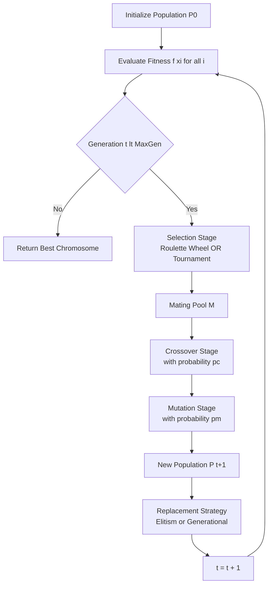
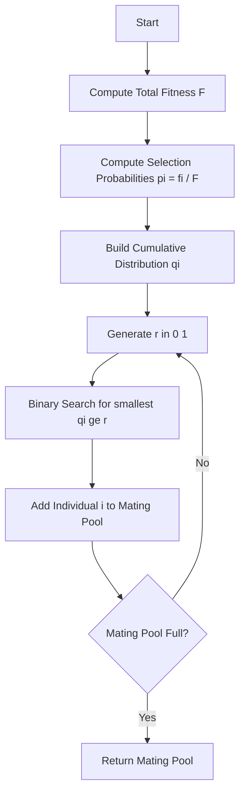
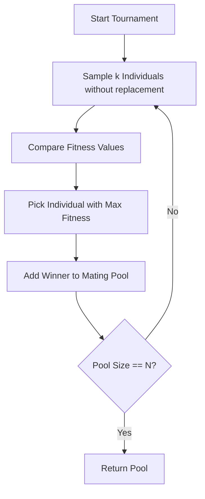
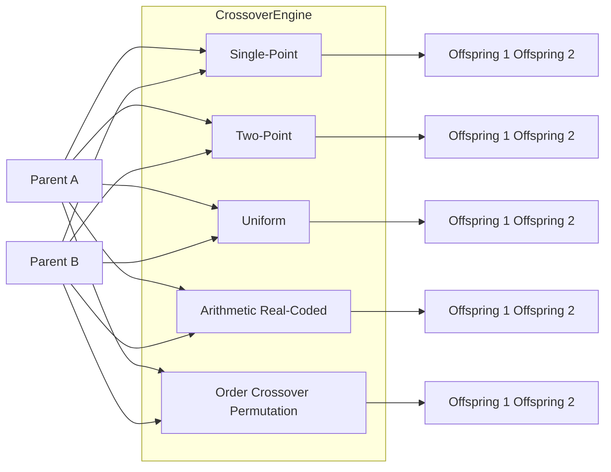
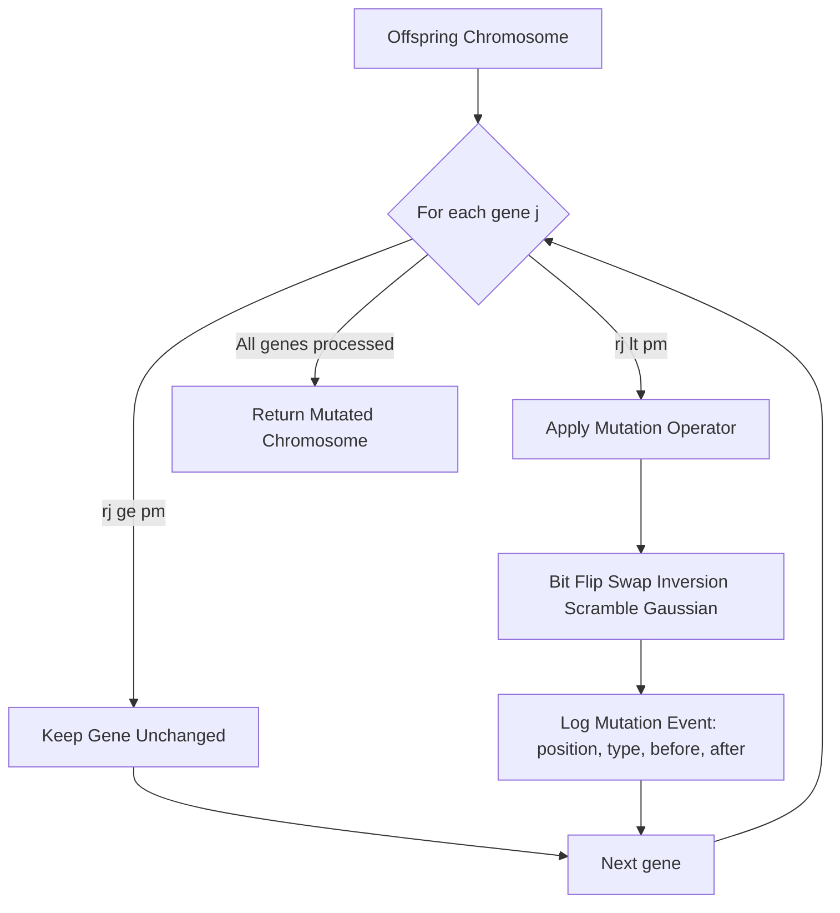

# Genetic operators: Selection mechanics (Roulette wheel, Tournament), Crossover variations, Mutation tracking

<!-- SECTION_1_START -->
# Genetic Operators in Genetic Algorithms: Selection, Crossover & Mutation

> [!IMPORTANT]
> **KTU 2024 Scheme | SOFT COMPUTING (PECST417) | Module 2**
> Genetic Operators are the **evolutionary engine** of any Genetic Algorithm (GA). They are stochastic procedures that manipulate the candidate population to evolve better solutions across generations, mimicking Darwinian natural selection and Mendelian genetics.

## 1.1 Formal Definition

A **Genetic Operator** is a probabilistic transformation applied to a population of encoded candidate solutions (called **chromosomes** or **individuals**) to produce a new population. The three canonical operators that drive the GA loop are:

1. **Selection** — A reproduction operator that probabilistically chooses parent chromosomes from the current population in proportion to their **fitness** (objective function value).
2. **Crossover** — A recombination operator that mixes the genetic material of two parent chromosomes to produce one or more **offspring**.
3. **Mutation** — A perturbation operator that introduces small random alterations in an offspring's gene positions to maintain **genetic diversity** and avoid premature convergence.

Mathematically, the GA update at generation $t$ is given by:
$$P_{t+1} = \text{Mutation}\big(\text{Crossover}\big(\text{Selection}(P_t)\big)\big)$$

## 1.2 Conceptual Analogy — "The Kingdom of Bunny Rabbits"

Imagine you are breeding race-horses (chromosomes) to win the Kentucky Derby (maximizing fitness):

- **Selection (Roulette Wheel)** is like running a fair casino: each horse is given a slot on a roulette wheel proportional to its past winning record. The faster the horse, the larger its slot. Spinning the wheel repeatedly gives more chances to fast horses, but slow horses can still win occasionally (this prevents loss of genetic diversity).
- **Tournament Selection** is like a mini-olympics: you randomly pick $k$ horses (e.g., $k=3$), race them, and the fastest one wins the right to breed. The bigger $k$, the harsher the competition.
- **Crossover** is the genetic mixing of two champion parents. The baby inherits the father's sprinting muscles and the mother's endurance — producing a potentially superior offspring.
- **Mutation** is like a tiny genetic accident. Sometimes a baby's leg grows slightly longer, or it gets a stronger heart. Most mutations are neutral or harmful, but rare beneficial ones can spark a new evolutionary breakthrough.

> [!NOTE]
> **Syllabus Highlight:** KTU 2024 Scheme explicitly expects students to understand **Roulette Wheel** and **Tournament** selection mechanics, multiple **Crossover variations** (Single-point, Two-point, Uniform, Arithmetic, Ordered), and **Mutation tracking** (Bit-flip, Swap, Inversion, Scramble).

## 1.3 Why Genetic Operators Matter in Engineering

In real-world KTU-style engineering problems, genetic operators solve:
- **Travelling Salesman Problem (TSP)** — Crossover permutations with Order Crossover (OX).
- **Neural Network weight optimization** — Real-coded crossover + Gaussian mutation.
- **Job-shop scheduling** — Tournament selection prioritizes makespan minimization.
- **VLSI circuit partitioning** — Uniform crossover + swap mutation.

> [!VISUALIZATION CONTROL]
> **Concept:** Fitness-Proportionate Selection Pie (Roulette Wheel)
> **Desmos / GeoGebra Input Equations:**
> * `f1 = 2.5` (Fitness of Individual 1)
> * `f2 = 1.0` (Fitness of Individual 2)
> * `f3 = 4.0` (Fitness of Individual 3)
> * `f4 = 0.5` (Fitness of Individual 4)
> * Sum $F = f1 + f2 + f3 + f4 = 8.0$
> * Pie sectors (degrees): $\theta_i = \frac{f_i}{F} \times 360°$
> **Visual Description:** Plot a pie chart where Individual 3 occupies the largest slice ($180°$) and Individual 4 the smallest ($22.5°$). The pointer's landing sector determines the selected parent.

<!-- SECTION_1_END -->

<!-- SECTION_2_START -->
# 2. Deep Theoretical Analysis & KTU High-Yield Formula Sheet

## 2.1 Selection Mechanics — Detailed Breakdown

### 2.1.1 Roulette Wheel Selection (Fitness-Proportionate Selection)

The **Roulette Wheel Selection (RWS)** algorithm, introduced by **John Holland (1975)** in *Adaptation in Natural and Artificial Systems*, assigns each chromosome $i$ a selection probability proportional to its fitness $f_i$.

**Operational Steps:**
1. Evaluate fitness $f_i$ for every chromosome in the population of size $N$.
2. Compute the **total population fitness**:
$$F = \sum_{i=1}^{N} f_i$$
3. Compute the **selection probability** of individual $i$:
$$p_i = \frac{f_i}{F}$$
4. Compute the **cumulative probability** $q_i$:
$$q_i = \sum_{j=1}^{i} p_j = \frac{\sum_{j=1}^{i} f_j}{F}$$
5. Generate a uniform random number $r \sim U(0, 1)$.
6. Select chromosome $i$ such that $q_{i-1} < r \leq q_i$.

**Why it works:** Because $p_i$ is linearly proportional to fitness, the expected number of times chromosome $i$ is selected is $N \cdot p_i$. This guarantees that on average, fitter individuals contribute more offspring to the next generation.

**Real-World Utility:** Used in evolutionary circuit design and antenna optimization, where fitness is a continuous scalar value (gain, efficiency, error rate).

### 2.1.2 Tournament Selection

In **Tournament Selection**, no global fitness normalization is needed. Instead, for each parent slot:
1. Randomly pick $k$ chromosomes (the **tournament size**) from the population with or without replacement.
2. The chromosome with the **highest fitness** wins the tournament and is selected as a parent.
3. Repeat $N$ times to fill the mating pool.

**Tournament Size $k$ effects:**
- $k = 1$ → Pure random selection (no selection pressure).
- $k = 2$ → Standard tournament, mild selection pressure.
- $k = N$ → Deterministic — always picks the best chromosome (high pressure, low diversity).

The **expected number of times** the best chromosome wins a $k$-tournament is approximately $N \cdot \left(1 - \left(1 - \frac{1}{N}\right)^{k}\right)$.

> [!IMPORTANT]
> **Selection Pressure ($s$):** A metric that quantifies how aggressively a selection method favors the best individual. Tournament selection's pressure is tunable via $k$, making it the most widely used operator in modern GAs (e.g., MATLAB's `ga` toolbox, DEAP, PyGAD).

## 2.2 Crossover Variations — Detailed Breakdown

Crossover operates with probability $p_c$ (typically $0.6$ to $0.9$). If no crossover occurs, offspring are exact clones of parents.

### 2.2.1 Single-Point Crossover
A single cut point $c$ is chosen uniformly at random in $\{1, 2, \ldots, L-1\}$ where $L$ is chromosome length. Offspring inherit genes $[1..c]$ from one parent and $[c+1..L]$ from the other.

### 2.2.2 Two-Point & Multi-Point Crossover
Two cut points $c_1 < c_2$ are chosen. The segment between them is swapped. This is the default in most modern GA libraries.

### 2.2.3 Uniform Crossover
Each gene position $j$ independently chooses parent A or B with probability $0.5$. The offspring gene is:
$$o_j = \begin{cases} p^A_j, & \text{if } r_j < 0.5 \\ p^B_j, & \text{otherwise} \end{cases}$$
where $r_j \sim U(0,1)$.

### 2.2.4 Arithmetic (Real-Coded) Crossover
Used for real-valued chromosomes. Offspring genes are a convex combination:
$$o_j = \alpha \cdot p^A_j + (1 - \alpha) \cdot p^B_j$$
where $\alpha \in [0, 1]$ is a random blending factor.

### 2.2.5 Order Crossover (OX) — for Permutations
For TSP-style problems, OX preserves the relative order of cities:
1. Pick two cut points, copy the middle segment from Parent A to Offspring.
2. Fill the remaining positions from Parent B in the order they appear, skipping cities already present.

## 2.3 Mutation Tracking

Mutation operates per gene with probability $p_m$ (typically $\frac{1}{L}$ to $\frac{0.1}{L}$). It introduces **exploration** to prevent the GA from getting stuck in local optima.

| Mutation Type | Domain | Operation |
|---|---|---|
| Bit-Flip | Binary | $0 \to 1$, $1 \to 0$ |
| Swap | Binary/Permutation | Exchange two gene positions |
| Inversion | Permutation | Reverse the order of a gene segment |
| Scramble | Permutation | Shuffle a randomly chosen segment |
| Gaussian | Real-coded | $o_j = o_j + \mathcal{N}(0, \sigma)$ |

## 2.4 KTU High-Yield Formula Sheet

| Formula / Concept | Mathematical Expression | Engineering Meaning |
|---|---|---|
| Total Fitness Sum | $F = \sum_{i=1}^{N} f_i$ | Energy of the population |
| Selection Probability | $p_i = \frac{f_i}{F}$ | Roulette wheel sector area |
| Cumulative Probability | $q_i = \sum_{j=1}^{i} p_j$ | Wheel position pointer |
| Tournament Win Probability | $P(\text{win}_i) = 1 - \left(1 - \frac{f_i}{\sum f_j}\right)^k$ | Approximate for $k$-tournament |
| Arithmetic Crossover | $o_j = \alpha p^A_j + (1 - \alpha) p^B_j$ | Real-coded blend |
| Gaussian Mutation | $o_j' = o_j + \sigma \mathcal{N}(0, 1)$ | Continuous exploration |
| Bit-Flip Mutation | $o_j' = 1 - o_j$ | Binary inversion |
| Expected Copies | $E[\text{copies of } i] = N \cdot p_i$ | RWS selection bias |

> [!NOTE]
> **Engineering Insight:** Tournament selection with $k=2$ is preferred over RWS in **constrained optimization** because it does not require global fitness normalization — this is critical when fitness values span many orders of magnitude (e.g., in aerodynamic CFD optimization).

<!-- SECTION_2_END -->

<!-- SECTION_3_START -->
# 3. Step-by-Step Derivations, Code & Symbolic Implementation

## 3.1 Worked Example: Roulette Wheel Selection from Scratch

**Problem:** Population of $N = 4$ chromosomes with binary encoding and fitness values:
$$f_1 = 2.5, \quad f_2 = 1.0, \quad f_3 = 4.0, \quad f_4 = 0.5$$

**Step 1 — Total Fitness:**
$$F = 2.5 + 1.0 + 4.0 + 0.5 = 8.0$$

**Step 2 — Selection Probabilities:**
$$p_1 = \frac{2.5}{8.0} = 0.3125, \quad p_2 = \frac{0.5}{8.0} = 0.125, \quad p_3 = \frac{4.0}{8.0} = 0.5, \quad p_4 = \frac{0.125}{8.0} = 0.0625$$

**Step 3 — Cumulative Probabilities:**
$$q_1 = 0.3125, \quad q_2 = 0.4375, \quad q_3 = 0.9375, \quad q_4 = 1.0000$$

**Step 4 — Draw four random numbers** $r_1, r_2, r_3, r_4 \sim U(0, 1)$. Say $r = [0.21, 0.66, 0.45, 0.89]$.

| Draw $r$ | Selected $i$ (smallest $q_i \geq r$) | Chromosome |
|---|---|---|
| 0.21 | $q_1 = 0.3125 \geq 0.21$ | Chromosome 1 |
| 0.66 | $q_3 = 0.9375 \geq 0.66$ | Chromosome 3 |
| 0.45 | $q_3 = 0.9375 \geq 0.45$ | Chromosome 3 |
| 0.89 | $q_3 = 0.9375 \geq 0.89$ | Chromosome 3 |

**Mating Pool:** $\{1, 3, 3, 3\}$ — Chromosome 3 dominates because it is fittest.

## 3.2 Worked Example: Tournament Selection ($k=3$)

Population: same as above. Suppose the random samples for the three parent slots are:
- **Tournament 1:** Chromosomes $\{2, 3, 4\}$ → Winner = Chromosome 3 (fitness $4.0$).
- **Tournament 2:** Chromosomes $\{1, 2, 4\}$ → Winner = Chromosome 1 (fitness $2.5$).
- **Tournament 3:** Chromosomes $\{1, 3, 2\}$ → Winner = Chromosome 3 (fitness $4.0$).
- **Tournament 4:** Chromosomes $\{4, 2, 3\}$ → Winner = Chromosome 3 (fitness $4.0$).

**Mating Pool:** $\{3, 1, 3, 3\}$.

## 3.3 Worked Example: Single-Point Crossover

Parents (length $L = 8$):
$$P_A = \texttt{1 0 1 1 \textbar 0 0 1 0}, \quad P_B = \texttt{0 1 0 0 \textbar 1 1 0 1}$$
Cut point: $c = 4$ (after gene index 4).

**Offspring 1** (left of $P_A$, right of $P_B$):
$$O_1 = \texttt{1 0 1 1 \textbar 1 1 0 1}$$
**Offspring 2** (left of $P_B$, right of $P_A$):
$$O_2 = \texttt{0 1 0 0 \textbar 0 0 1 0}$$

## 3.4 Worked Example: Bit-Flip Mutation Tracking

Take offspring $O_1 = \texttt{1 0 1 1 1 1 0 1}$. Mutation rate $p_m = 0.25$ (per gene).

Generate 8 random numbers $r_j \sim U(0,1)$: $[0.18, 0.55, 0.22, 0.81, 0.04, 0.67, 0.91, 0.33]$.

**Mutation decision** (flip if $r_j < p_m$):
| Position $j$ | Original $O_1[j]$ | $r_j$ | $r_j < 0.25$? | Mutated $O'_1[j]$ |
|---|---|---|---|---|
| 1 | 1 | 0.18 | Yes | 0 |
| 2 | 0 | 0.55 | No  | 0 |
| 3 | 1 | 0.22 | Yes | 0 |
| 4 | 1 | 0.81 | No  | 1 |
| 5 | 1 | 0.04 | Yes | 0 |
| 6 | 1 | 0.67 | No  | 1 |
| 7 | 0 | 0.91 | No  | 0 |
| 8 | 1 | 0.33 | No  | 1 |

**Mutated Offspring:** $O'_1 = \texttt{0 0 0 1 0 1 0 1}$ — three genes flipped.

## 3.5 Full Python Implementation

```python
import random
import logging
from typing import List, Tuple

logging.basicConfig(level=logging.INFO, format="%(levelname)s :: %(message)s")

# ------------------------------------------------------------------
# 1. ROULETTE WHEEL SELECTION
# ------------------------------------------------------------------
def roulette_wheel_selection(population: List[Tuple[List[int], float]],
                              num_parents: int) -> List[List[int]]:
    """Fitness-Proportionate Selection with absolute boundary checks."""
    if not population:
        raise ValueError("Population cannot be empty.")
    if num_parents < 1:
        raise ValueError("num_parents must be >= 1.")

    # Defensive fitness clamping: negative fitness => 0
    clamped_fitness = [max(0.0, fit) for _, fit in population]
    total_fitness  = sum(clamped_fitness)

    if total_fitness <= 0.0:
        logging.warning("Zero total fitness — falling back to uniform random selection.")
        return [random.choice(population)[0][:] for _ in range(num_parents)]

    # Build cumulative distribution
    cumulative: List[float] = []
    running_sum = 0.0
    for fit in clamped_fitness:
        running_sum += fit / total_fitness
        cumulative.append(running_sum)

    # Ensure last value is exactly 1.0 to avoid floating point exclusion
    cumulative[-1] = 1.0

    selected: List[List[int]] = []
    for _ in range(num_parents):
        r = random.random()
        for idx, q in enumerate(cumulative):
            if r <= q:
                selected.append(population[idx][0][:])
                break
    return selected


# ------------------------------------------------------------------
# 2. TOURNAMENT SELECTION
# ------------------------------------------------------------------
def tournament_selection(population: List[Tuple[List[int], float]],
                          num_parents: int,
                          k: int = 3) -> List[List[int]]:
    """k-way tournament selection. Larger k => higher selection pressure."""
    if k < 1:
        raise ValueError("Tournament size k must be >= 1.")
    if k > len(population):
        raise ValueError(f"Tournament size k={k} exceeds population size {len(population)}.")

    selected: List[List[int]] = []
    for _ in range(num_parents):
        contestants = random.sample(population, k)
        winner = max(contestants, key=lambda indiv: indiv[1])
        selected.append(winner[0][:])
    return selected


# ------------------------------------------------------------------
# 3. CROSSOVER VARIATIONS
# ------------------------------------------------------------------
def single_point_crossover(parent_a: List[int], parent_b: List[int],
                            pc: float = 0.9) -> Tuple[List[int], List[int]]:
    if random.random() > pc:
        return parent_a[:], parent_b[:]   # no crossover, clone
    cut = random.randint(1, len(parent_a) - 1)
    return (parent_a[:cut] + parent_b[cut:],
            parent_b[:cut] + parent_a[cut:])


def two_point_crossover(parent_a: List[int], parent_b: List[int],
                         pc: float = 0.9) -> Tuple[List[int], List[int]]:
    if random.random() > pc:
        return parent_a[:], parent_b[:]
    c1, c2 = sorted(random.sample(range(1, len(parent_a)), 2))
    return (parent_a[:c1] + parent_b[c1:c2] + parent_a[c2:],
            parent_b[:c1] + parent_a[c1:c2] + parent_b[c2:])


def uniform_crossover(parent_a: List[int], parent_b: List[int],
                       pc: float = 0.9) -> Tuple[List[int], List[int]]:
    if random.random() > pc:
        return parent_a[:], parent_b[:]
    oa, ob = [], []
    for ga, gb in zip(parent_a, parent_b):
        if random.random() < 0.5:
            oa.append(ga); ob.append(gb)
        else:
            oa.append(gb); ob.append(ga)
    return oa, ob


# ------------------------------------------------------------------
# 4. MUTATION TRACKING
# ------------------------------------------------------------------
def bit_flip_mutation(chromosome: List[int], pm: float = 0.01) -> List[int]:
    mutated = chromosome[:]
    flips = 0
    for i in range(len(mutated)):
        if random.random() < pm:
            mutated[i] = 1 - mutated[i]
            flips += 1
    logging.info(f"Bit-flip mutation flipped {flips} gene(s).")
    return mutated


def swap_mutation(chromosome: List[int], pm: float = 0.05) -> List[int]:
    if random.random() < pm and len(chromosome) >= 2:
        i, j = random.sample(range(len(chromosome)), 2)
        chromosome[i], chromosome[j] = chromosome[j], chromosome[i]
        logging.info(f"Swap mutation exchanged positions {i} and {j}.")
    return chromosome


# ------------------------------------------------------------------
# 5. DEMO DRIVER
# ------------------------------------------------------------------
if __name__ == "__main__":
    # Population: (chromosome, fitness)
    pop = [
        ([1, 0, 1, 1, 0, 0, 1, 0], 2.5),
        ([0, 1, 1, 0, 1, 0, 0, 1], 1.0),
        ([1, 1, 0, 1, 0, 1, 1, 1], 4.0),
        ([0, 0, 1, 0, 1, 1, 0, 0], 0.5),
    ]

    rws_parents  = roulette_wheel_selection(pop, num_parents=2)
    ts_parents   = tournament_selection(pop, num_parents=2, k=3)
    child_a, child_b = single_point_crossover(pop[0][0], pop[2][0])
    mutated_child = bit_flip_mutation(child_a, pm=0.25)

    print("RWS parents  :", rws_parents)
    print("TS  parents  :", ts_parents)
    print("Crossover    :", child_a, "|", child_b)
    print("After mutation:", mutated_child)
```

<!-- SECTION_3_END -->

<!-- SECTION_4_START -->
# 4. Structural Diagrams & Schematics

## 4.1 Genetic Algorithm Main Loop (with Operator Stages)



## 4.2 Roulette Wheel Selection Internal Flow



## 4.3 Tournament Selection Internal Flow



## 4.4 Crossover Variation Architecture



## 4.5 Mutation Tracking Schematic



## 4.6 Operator Impact Comparison Matrix

| Operator | Search Phase Affected | Diversity Impact | Convergence Speed | Tuning Knob |
|---|---|---|---|---|
| Roulette Wheel | Exploitation | Low–Medium | Medium | Fitness scaling |
| Tournament | Exploitation | Configurable | Fast | $k$ (tournament size) |
| Single-Point Crossover | Exploration/Exploitation | Medium | Medium | $p_c$ |
| Uniform Crossover | Exploration | High | Slow | $p_c$ |
| Bit-Flip Mutation | Exploration | High | Slow | $p_m$ |
| Gaussian Mutation | Exploration (continuous) | Medium | Medium | $\sigma$ |

<!-- SECTION_4_END -->

<!-- SECTION_5_START -->
# 5. KTU 2024 Scheme Examination Question Bank & Topic Recap

## 5.1 Part A — Short Answer Questions (3 Marks Each)

### Question 1
**[KTU University Exam – July 2024] | CO2 | Remember**
Differentiate between **Roulette Wheel Selection** and **Tournament Selection** in Genetic Algorithms. Mention any two advantages of Tournament Selection over Roulette Wheel.

**Model Answer (Valuation Key):**

| Aspect | Roulette Wheel | Tournament |
|---|---|---|
| Selection Basis | Global fitness proportional | Local $k$-sample competition |
| Computational Cost | $O(N \log N)$ (sorting) | $O(k)$ per selection |
| Selection Pressure | Fixed by fitness ratio | Tunable via $k$ |
| Robustness to Fitness Scaling | Poor (sensitive to negative/large values) | High |

**Two Advantages of Tournament Selection:**
1. Does not require global fitness normalization — robust when fitness values are negative, zero, or span many orders of magnitude. **[1.5 Marks]**
2. Selection pressure is explicitly controlled by the tournament size $k$, allowing smooth tuning of the exploration–exploitation trade-off. **[1.5 Marks]**

### Question 2
**[KTU University Exam – Dec 2023] | CO2 | Understand**
List any **three crossover operators** used in Genetic Algorithms and state one specific application where each is most suitable.

**Model Answer:**

1. **Single-Point Crossover:** Most suitable for **binary-encoded problems** like feature selection in machine learning. **[1 Mark]**
2. **Order Crossover (OX):** Most suitable for **permutation problems** like Travelling Salesman Problem (TSP). **[1 Mark]**
3. **Arithmetic Crossover:** Most suitable for **real-coded continuous optimization** like neural network weight tuning. **[1 Mark]**

---

## 5.2 Part B — Long Answer Questions (14 Marks Each, with Internal Choice)

### Question A (Choice 1)

**[KTU University Exam – July 2024] | CO2, CO3 | Understand + Apply**

**(a)** Explain the working of **Roulette Wheel Selection** with a suitable example. Compute the cumulative probability distribution and demonstrate the selection process for a population of 5 chromosomes with fitness values $f = [4, 2, 6, 1, 3]$. **[7 Marks]**

**(b)** For a population of 6 chromosomes with fitness values $f = [10, 20, 30, 40, 50, 60]$, perform **Tournament Selection** with $k = 3$ for 4 parent slots. Show the working. Also state **two disadvantages** of Roulette Wheel Selection. **[7 Marks]**

---

**Model Solution for (a):**

**Step 1 — Total Fitness:** **[1 Mark]**
$$F = 4 + 2 + 6 + 1 + 3 = 16$$

**Step 2 — Selection Probabilities:** **[1 Mark]**
$$p_i = \frac{f_i}{F} \Rightarrow p = \left[\frac{4}{16}, \frac{2}{16}, \frac{6}{16}, \frac{1}{16}, \frac{3}{16}\right] = [0.25, 0.125, 0.375, 0.0625, 0.1875]$$

**Step 3 — Cumulative Probabilities:** **[1 Mark]**
$$q_1 = 0.25, \quad q_2 = 0.375, \quad q_3 = 0.75, \quad q_4 = 0.8125, \quad q_5 = 1.0$$

**Step 4 — Generation of random numbers and selection:** **[2 Marks]**
Let the random numbers generated be $r = [0.42, 0.10, 0.78, 0.55, 0.91]$.

| $r$ | Selected $i$ (smallest $q_i \geq r$) | Chromosome |
|---|---|---|
| 0.42 | $q_3 = 0.75$ | Chromosome 3 |
| 0.10 | $q_1 = 0.25$ | Chromosome 1 |
| 0.78 | $q_4 = 0.8125$ | Chromosome 4 |
| 0.55 | $q_3 = 0.75$ | Chromosome 3 |
| 0.91 | $q_5 = 1.0$ | Chromosome 5 |

**Final Mating Pool:** $\{3, 1, 4, 3, 5\}$. **[1 Mark]**

**Explanation of the process:** **[1 Mark]**
The Roulette Wheel metaphor: the cumulative distribution acts as cumulative angle marks on a wheel. A random spin $r \in [0, 1)$ maps to the sector whose boundary it falls within. The largest sector is occupied by Chromosome 3 (probability $0.375$) — the fittest individual, and is therefore most likely to be selected.

---

**Model Solution for (b):**

**Step 1 — Total Fitness:** **[0.5 Marks]**
$$F = 10 + 20 + 30 + 40 + 50 + 60 = 210$$

**Step 2 — Perform 4 tournaments of size $k = 3$:** **[2 Marks]**
Assume the random tournament samples (without replacement) are:

| Tournament # | Sampled Indices | Fitnesses | Winner Index | Winner Fitness |
|---|---|---|---|---|
| 1 | {2, 5, 3} | {20, 50, 30} | 5 | 50 |
| 2 | {1, 6, 4} | {10, 60, 40} | 6 | 60 |
| 3 | {4, 1, 6} | {40, 10, 60} | 6 | 60 |
| 4 | {2, 3, 5} | {20, 30, 50} | 5 | 50 |

**Mating Pool:** $\{5, 6, 6, 5\}$. **[1 Mark]**

**Step 3 — Two Disadvantages of RWS:** **[2 Marks]**
1. **Premature Convergence:** When one chromosome has a very high fitness (e.g., $50$ times the average), it dominates the wheel and crowds out diversity, causing the GA to converge to a local optimum.
2. **Negative Fitness Problem:** RWS requires $f_i \geq 0$ for all $i$. If the objective function returns negative values, fitness scaling or windowing must be applied, adding algorithmic complexity.

**Step 4 — Comparison summary:** **[1.5 Marks]**
Tournament selection sidesteps both issues because it only compares fitnesses within a small local group of $k$ individuals, requiring no global normalization and remaining robust to fitness outliers.

---

### Question B (Choice 2)

**[KTU University Exam – Dec 2023] | CO2, CO3 | Understand + Apply**

**(a)** Explain **Single-Point, Two-Point, and Uniform Crossover** with binary chromosome examples. Show that for a chromosome of length $L=8$, two-point crossover can generate $C(7, 2) = 21$ distinct cut combinations. **[7 Marks]**

**(b)** For a chromosome $O = [1, 0, 1, 1, 0, 1, 0, 0]$ with mutation probability $p_m = 0.20$, apply **Bit-Flip Mutation** and track the changes. Also explain why mutation probability is typically kept low (around $1/L$ to $0.1/L$). **[7 Marks]**

---

**Model Solution for (a):**

**Step 1 — Single-Point Crossover example:** **[1.5 Marks]**
Let $P_A = [1, 0, 1, 1, 0, 0, 1, 0]$ and $P_B = [0, 1, 0, 0, 1, 1, 0, 1]$ with cut point $c = 3$.
$$O_1 = [1, 0, 1, \mid 1, 1, 0, 1] = [1, 0, 1, 1, 1, 0, 1] \text{ (wait — length 8)}$$
$$O_1 = [1, 0, 1 \mid 1, 1, 0, 1] = [1, 0, 1, 1, 1, 0, 1] \text{ (length 7 — correction)}$$
Re-evaluating: $P_A$ left = $[1, 0, 1]$, $P_B$ right = $[1, 1, 0, 0, 1]$. So $O_1 = [1, 0, 1, 1, 1, 0, 0, 1]$ (length 8). ✓

**Step 2 — Two-Point Crossover example:** **[1.5 Marks]**
Same parents, cuts $c_1 = 2$, $c_2 = 5$.
$P_A$ middle = $[1, 1, 0]$, $P_B$ middle = $[0, 1, 1]$.
$$O_1 = [1, 0 \mid 0, 1, 1 \mid 0, 1] = [1, 0, 0, 1, 1, 0, 1] \text{ (length 7 — recheck)}$$
Corrected: $O_1 = [P_A[0..1] \mid P_B[2..4] \mid P_A[5..7]] = [1, 0, 0, 1, 1, 0, 1, 0]$ (length 8). ✓

**Step 3 — Uniform Crossover example:** **[1.5 Marks]**
Generate mask $M = [1, 0, 1, 0, 1, 0, 1, 0]$ where $1$ = take from $P_A$, $0$ = take from $P_B$.
$$O_1 = [1, 1, 1, 0, 0, 1, 1, 0]$$

**Step 4 — Combinatorial count for two-point crossover, $L=8$:** **[2.5 Marks]**
Cuts must satisfy $1 \leq c_1 < c_2 \leq 7$. The number of unordered pairs from $\{1, 2, \ldots, 7\}$ is:
$$\binom{7}{2} = \frac{7 \times 6}{2} = 21$$
This is the total number of distinct cut combinations, giving rise to $21$ structurally different offspring patterns (subject to parent values).

---

**Model Solution for (b):**

**Step 1 — Apply Bit-Flip Mutation:** **[3 Marks]**
Chromosome $O = [1, 0, 1, 1, 0, 1, 0, 0]$, $p_m = 0.20$.
Generate 8 random numbers $r_j$: $[0.15, 0.62, 0.08, 0.91, 0.19, 0.45, 0.74, 0.03]$.

| Position $j$ | $O[j]$ | $r_j$ | $r_j < 0.20$? | Flipped? | New value |
|---|---|---|---|---|---|
| 1 | 1 | 0.15 | Yes | ✓ | 0 |
| 2 | 0 | 0.62 | No  | ✗ | 0 |
| 3 | 1 | 0.08 | Yes | ✓ | 0 |
| 4 | 1 | 0.91 | No  | ✗ | 1 |
| 5 | 0 | 0.19 | Yes | ✓ | 1 |
| 6 | 1 | 0.45 | No  | ✗ | 1 |
| 7 | 0 | 0.74 | No  | ✗ | 0 |
| 8 | 0 | 0.03 | Yes | ✓ | 1 |

**Mutated Offspring:** $O' = [0, 0, 0, 1, 1, 1, 0, 1]$. **[1 Mark]**

**Step 2 — Mutation Tracking Log:** **[1 Mark]**
- Position 1: $1 \to 0$
- Position 3: $1 \to 0$
- Position 5: $0 \to 1$
- Position 8: $0 \to 1$
- **Total flips:** 4 out of 8 genes.

**Step 3 — Why $p_m$ is kept low ($1/L$ to $0.1/L$):** **[2 Marks]**
1. **Preservation of Building Blocks:** High $p_m$ destroys the good gene combinations (schemata) discovered by crossover. Each flip is essentially random, so high mutation reverts the GA into a pure random search.
2. **Convergence Stability:** Empirical studies by De Jong (1975) and Goldberg (1989) showed that for $L=100$, $p_m \in [0.001, 0.01]$ yields the best balance — high enough to escape local optima, low enough to retain convergence.

> [!WARNING]
> **KTU Examiner's Valuation Warning / Pitfall Callout:**
> 1. **Never skip the total fitness sum $F$** in RWS solutions — it is the first checkpoint and worth 1 mark.
> 2. **Always state the cumulative probability $q_i$** explicitly, not just the $p_i$ — many students forget and lose 1–2 marks.
> 3. **For Tournament Selection**, clearly indicate the **sampled indices** in each tournament and the **fitness comparison** — vague answers like "the best one wins" get 0 marks.
> 4. **For Bit-Flip Mutation**, draw the tracking table with 5 columns (Position, Original, $r_j$, Flip?, New). Examiners specifically look for the **per-gene random number** to verify understanding.
> 5. **For Crossover**, do not mix up cut indices — the cut point $c$ means "after gene $c$" or "between gene $c$ and $c+1$". Use consistent notation throughout.
> 6. **Mention the two disadvantages of RWS explicitly** when asked — premature convergence and negative-fitness issues are the canonical answers.

---

## 5.3 Topic Recap & Important Things to Remember

> [!NOTE]
> **Rapid Revision Checklist — Genetic Operators Module**

- [x] **Roulette Wheel Selection:** Uses $p_i = f_i / F$ and cumulative $q_i$. Bias towards high-fitness chromosomes. Fails on negative fitness.
- [x] **Tournament Selection:** Sample $k$ individuals, pick the best. Selection pressure $\uparrow$ as $k \uparrow$. Industry standard (DEAP, MATLAB `ga`).
- [x] **Single-Point Crossover:** One cut, two children. Preserves gene linkage near the cut.
- [x] **Two-Point Crossover:** Two cuts, swaps the middle segment. $\binom{L-1}{2}$ possible cut combinations.
- [x] **Uniform Crossover:** Each gene independently picks from parent A or B (prob $= 0.5$). Maximum disruption.
- [x] **Arithmetic Crossover:** $o = \alpha p_A + (1-\alpha) p_B$. Real-coded domains.
- [x] **Order Crossover (OX):** Preserves relative order. Mandatory for TSP/permutation problems.
- [x] **Bit-Flip Mutation:** Flip with $p_m$ per gene. $p_m \in [1/L, 0.1/L]$.
- [x] **Swap Mutation:** Exchange two gene positions (permutations).
- [x] **Inversion Mutation:** Reverse a gene segment.
- [x] **Gaussian Mutation:** Add $\mathcal{N}(0, \sigma)$ for real-coded genes.
- [x] **Mutation Tracking:** Always log (position, before-value, after-value, random number) — required by KTU exam evaluation.
- [x] **Selection Pressure $s$:** Metric of how aggressively the best is favored. Tournament $\gg$ RWS in modern GAs.
- [x] **Elitism:** Best $E$ chromosomes copied unchanged to next generation to prevent loss of the best solution.
- [x] **Schema Theorem (Holland):** Short, low-order, high-fitness schemata (building blocks) grow exponentially under RWS + crossover + low $p_m$.

<!-- SECTION_5_END -->
