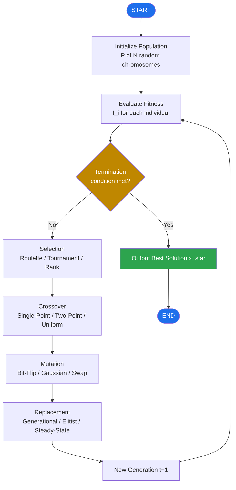
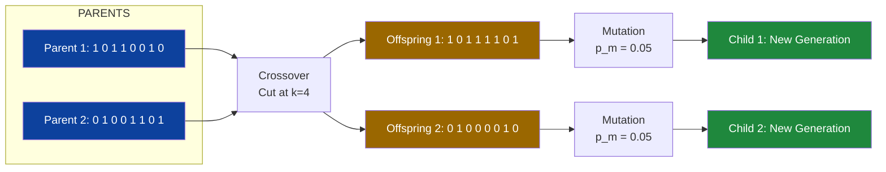
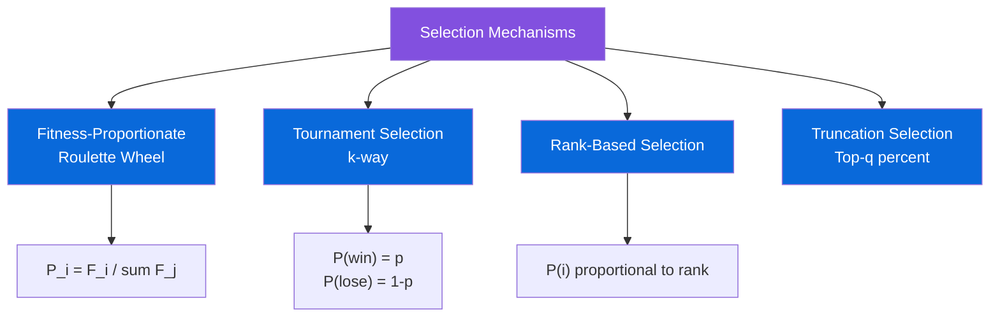

# Concepts of genetic algorithm.

<!-- SECTION_1_START -->
# MODULE 3: EVOLUTIONARY COMPUTING
## Topic: Concepts of Genetic Algorithm (GA)

> [!IMPORTANT]
> **KTU 2024 Syllabus Mapping**
> **Course Code:** PECST417 — Soft Computing
> **Module:** 3 — Evolutionary Computing
> **Cognitive Level Targets:** Understand → Apply → Analyze
> **Key Skill Outcomes:** Ability to formulate, encode, and solve optimization problems using biologically-inspired search heuristics.

---

### 1.1 Formal Academic Definition

A **Genetic Algorithm (GA)** is a stochastic, population-based, meta-heuristic optimization technique that mimics the mechanics of **Darwinian natural selection** and **Mendelian genetics** to search the solution space of complex, non-differentiable, multi-modal, and constrained engineering problems. Formally, a GA maintains a population of candidate solutions (called **chromosomes** or **individuals**), each represented as a fixed-length string over a finite alphabet (typically binary $\{0,1\}^L$). Iteratively, the algorithm applies stochastic operators — **Selection**, **Crossover (Recombination)**, and **Mutation** — to evolve fitter solutions over generations, converging toward the global optimum (or a near-optimal solution) of an objective function $f(\vec{x})$.

> [!NOTE]
> **Founders' Credit**
> GAs were first formalized by **John Henry Holland** in 1975 (University of Michigan) in his seminal work *"Adaptation in Natural and Artificial Systems."* The closely related **Schema Theorem** (Holland, 1975) provides the formal mathematical foundation of why GAs work.

### 1.2 Intuitive Analogy — "The Island of Evolving Beavers"

Imagine a remote island where **1000 beavers** live. Each beaver builds a dam of a unique shape. After every rainy season, an inspector (the **fitness function**) measures how much water each dam holds.

* The **best dam builders** are allowed to reproduce (their "genes" — i.e., dam-design parameters — get copied to the next generation).
* **Poor builders** die out (low-probability selection).
* Occasionally, two parent beavers swap chunks of their dam-design blueprints (this is **crossover**).
* Rarely, a random tiny change occurs in a single blueprint (this is **mutation**) — say, a beaver decides to use a curved log instead of a straight one.

Over thousands of generations, the island's beavers collectively build near-perfect dams. **A Genetic Algorithm does exactly this — but in a computer, where the "beavers" are candidate solutions and the "dam" is the function being optimized.**

> [!TIP]
> **Geometric Intuition:** Think of the solution space as a vast multi-dimensional mountain range. A GA maintains a *swarm* of explorers at random altitudes. Each generation, the explorers in the **highest valleys (best fitness)** are more likely to "clone themselves" toward the summit, occasionally mixing paths (crossover) and taking random side-steps (mutation). The collective swarm *climbs the fitness landscape* stochastically.

### 1.3 Why Genetic Algorithms? (The "Why" in KTU Board Exams)

Traditional optimization methods (calculus-based gradient descent, linear programming) require:
* A well-defined, *differentiable* objective function.
* *Convex* and *continuous* search spaces.
* A *single* starting point.

GAs require **none of these**. They work brilliantly for:
* **Non-convex** objective functions (many local optima).
* **Discrete / combinatorial** problems (TSP, knapsack, scheduling).
* **Multi-objective** problems (Pareto front discovery).
* **Black-box** simulators where no gradient exists.

> [!VISUALIZATION CONTROL]
> **Concept:** Visualization of a GA search on a 1-D fitness landscape.
> **GeoGebra / Desmos Input Equations:**
> * Fitness landscape: `f(x) = sin(3*x) + 0.4*cos(5*x) + 0.05*(x-5)^2 + 2`
> * Population: Scatter 20 random points in `x in [0, 10]`
> * Generation-by-generation convergence: Plot successive populations using `Sequence[(p_n), n, 1, 50]`
> **Visual Description:** Students should observe the population initially scattered across peaks and valleys, then progressively *clumping* on the global maximum as generations increase, with rare mutations occasionally injecting fresh diversity.
<!-- SECTION_1_END -->

<!-- SECTION_2_START -->
## 2. Deep Theoretical Analysis & KTU High-Yield Formula Sheet

### 2.1 The GA Pipeline — Six Sequential Stages

A canonical GA executes the following loop:

1. **Initialization** — Generate a population of $N$ random chromosomes.
2. **Evaluation** — Compute fitness $f_i$ for every individual $i \in \{1, \dots, N\}$.
3. **Selection** — Probabilistically choose parents favoring higher fitness.
4. **Crossover** — Combine pairs of parents to produce offspring.
5. **Mutation** — Apply small random perturbations to offspring.
6. **Replacement** — Form the next generation (e.g., elitist or generational).

The loop repeats until a **termination condition** is met (max generations, target fitness, or convergence).

### 2.2 Chromosome Encoding Schemes

| Encoding Type | Representation | Typical Use Case | Example |
|---|---|---|---|
| **Binary** | String of bits $\{0,1\}^L$ | Continuous parameter tuning (classic GA) | `10110010` |
| **Real-Valued (Float)** | Vector of reals $\in \mathbb{R}^L$ | Function optimization in $\mathbb{R}^n$ | `[3.14, -2.71, 0.58]` |
| **Integer / Permutation** | Ordered sequence of integers | TSP, Job-shop scheduling | `[3, 1, 4, 2, 5]` |
| **Tree-Structured (GP)** | LISP-like S-expressions | Symbolic regression, program synthesis | `(+ (* x 2) y)` |

### 2.3 Fitness Function — The "GPS" of the GA

The **fitness function** $F: \mathcal{S} \to \mathbb{R}^+$ maps each chromosome to a non-negative scalar measuring its quality. Many engineering problems minimize cost, so a common conversion is:

$$
F(\vec{x}) = \begin{cases} \dfrac{1}{1 + C(\vec{x}) - C_{\min}} & \text{if } C(\vec{x}) > C_{\min} \\[6pt] \kappa_{\text{big}} & \text{otherwise} \end{cases}
$$

where $C(\vec{x})$ is the raw cost, $C_{\min}$ is the theoretical minimum, and $\kappa_{\text{big}}$ is a large positive constant for infeasible-perfect solutions.

> [!IMPORTANT]
> **Scaling:** Raw fitness is often **linearly scaled** $\to$ $F' = aF + b$ to prevent early dominance (premature convergence) or late stagnation. **Sigma truncation** and **Boltzmann scaling** are advanced variants.

### 2.4 Selection Operators — Choosing the Parents

#### 2.4.1 Roulette Wheel Selection (Fitness-Proportionate)
Each individual $i$ gets a slice of the wheel proportional to its fitness. The probability of selection is:

$$
P_i = \frac{F_i}{\sum_{j=1}^{N} F_j}
$$

**Drawback:** High variance — a single super-fit individual can dominate the population, causing *premature convergence*.

#### 2.4.2 Tournament Selection
Pick $k$ individuals uniformly at random; the one with the highest fitness "wins" with probability $p$, the second-best with probability $p(1-p)$, etc. The probability that individual $i$ of rank $r$ is selected is:

$$
P(i) \approx \frac{k!}{(r-1)! \, (k-r)!} \, p^{k-r+1} (1-p)^{r-1} \quad \text{(for ranked tournaments)}
$$

**Advantage:** Maintains constant selection pressure regardless of fitness scaling. **Most widely used** in modern GAs.

#### 2.4.3 Rank-Based Selection
Sort population by fitness; assign selection probability based on rank, not raw fitness. Eliminates the dominance issue of roulette wheels.

### 2.5 Crossover (Recombination) Operators

Let $p_c$ = **crossover probability** (typically $0.6 \le p_c \le 0.95$).

| Operator | Mechanism | Best For |
|---|---|---|
| **Single-Point Crossover** | Cut at one random locus, swap tails | Basic binary GAs |
| **Two-Point Crossover** | Swap the segment between two random cut points | Reduces positional bias |
| **Uniform Crossover** | Each gene independently copied from one parent with $p = 0.5$ | Maximum mixing |
| **Arithmetic Crossover (Real-coded)** | Offspring $= \alpha P_1 + (1-\alpha) P_2$, $\alpha \in [0,1]$ | Continuous optimization |

### 2.6 Mutation Operators

Let $p_m$ = **mutation probability per gene** (typically $0.001 \le p_m \le 0.1$).

| Operator | Mechanism |
|---|---|
| **Bit-Flip Mutation** | $0 \leftrightarrow 1$ at each locus with $p_m$ |
| **Swap Mutation** | Exchange two random gene positions |
| **Scramble Mutation** | Randomly permute a sub-segment |
| **Gaussian Mutation (Real)** | $x_i' = x_i + \mathcal{N}(0, \sigma^2)$ |

### 2.7 KTU Formula / Cheat Sheet

| Symbol | Definition | Typical Value / Unit |
|---|---|---|
| $N$ | Population size | $50 - 200$ |
| $L$ | Chromosome length (bits) | Problem-dependent |
| $G$ | Number of generations | $100 - 1000$ |
| $p_c$ | Crossover probability | $0.6 - 0.95$ |
| $p_m$ | Mutation probability per gene | $0.001 - 0.05$ |
| $F_i$ | Fitness of individual $i$ | Non-negative scalar |
| $F_{\text{avg}}$ | Mean fitness of generation | Scalar |
| $F_{\max}$ | Best fitness in current generation | Scalar |
| $d(H)$ | Defining length of schema $H$ | Integer |
| $o(H)$ | Order of schema $H$ (number of fixed loci) | Integer |
| $\mu(H, t)$ | Expected number of copies of schema $H$ at generation $t$ | Real |

### 2.8 Schema Theorem (Holland's Fundamental Theorem of GAs)

A **schema** $H$ is a template over the alphabet $\{0, 1, *\}$, where $*$ is a "don't care" symbol (e.g., $H = 1*0*$). The theorem states that short, low-order, above-average fitness schemata receive exponentially increasing samples from generation to generation:

$$
E[\mu(H, t+1)] \;\geq\; \mu(H, t) \cdot \frac{f(H)}{\bar{f}} \cdot \left[ 1 - p_c \cdot \frac{d(H)}{L-1} - p_m \cdot o(H) \right]
$$

where $f(H)$ is the average fitness of schema $H$ and $\bar{f}$ is the population mean fitness.

> [!NOTE]
> **The Building Block Hypothesis:** GAs work by discovering, promoting, and recombining short, high-fitness building blocks (schemata) — this is the implicit *why* behind GA's empirical success.

### 2.9 Real-World Engineering Utility

* **Aerospace:** Antenna design (NASA's ST5 mission — evolved X-band antenna).
* **Finance:** Portfolio optimization, algorithmic trading rule mining.
* **Bioinformatics:** Protein structure prediction, DNA sequence alignment.
* **Robotics:** Evolving neural network weights, gait optimization.
* **VLSI:** Circuit partitioning, placement, and routing.
* **Scheduling:** Job-shop, university timetabling, crew rostering.
<!-- SECTION_2_END -->

<!-- SECTION_3_START -->
## 3. Step-by-Step Derivations, Worked Examples & Code Implementation

### 3.1 Worked Example — Manual Single-Point Crossover

**Problem:** Two parent chromosomes of length $L = 8$ are:
$P_1 = \mathtt{1 0 1 1 \mid 0 0 1 0}$, $P_2 = \mathtt{0 1 0 0 \mid 1 1 0 1}$.
A single-point crossover is performed at cut-point $k = 4$. Generate the two offspring $O_1$ and $O_2$.

**Step 1 — Identify the cut point (boundary separation).**
The cut point $k = 4$ divides each chromosome into a **head** (positions $1 \dots 4$) and a **tail** (positions $5 \dots 8$).

**Step 2 — Swap the tails.**

$$
\begin{aligned}
O_1 &= P_1[\text{head}] \, \| \, P_2[\text{tail}] = (1\,0\,1\,1) \, \| \, (1\,1\,0\,1) \\
    &= \mathtt{1\;0\;1\;1\;1\;1\;0\;1} \\[4pt]
O_2 &= P_2[\text{head}] \, \| \, P_1[\text{tail}] = (0\,1\,0\,0) \, \| \, (0\,0\,1\,0) \\
    &= \mathtt{0\;1\;0\;0\;0\;0\;1\;0}
\end{aligned}
$$

**Step 3 — Verify length and alphabet.**
Each offspring has length $8$ and is binary. ✓

### 3.2 Worked Example — Bit-Flip Mutation

**Problem:** Apply bit-flip mutation with $p_m = 0.2$ to offspring $O_1 = \mathtt{1 0 1 1 1 1 0 1}$. For each of the 8 genes, draw a uniform random number $r_i \in [0,1)$. If $r_i < 0.2$, flip the bit.

**Step 1 — Simulated random draws (illustrative):**

| Gene index $i$ | Original $b_i$ | $r_i$ | Flip? | New $b_i$ |
|---|---|---|---|---|
| 1 | 1 | 0.34 | No | 1 |
| 2 | 0 | 0.12 | **Yes** | 1 |
| 3 | 1 | 0.55 | No | 1 |
| 4 | 1 | 0.81 | No | 1 |
| 5 | 1 | 0.07 | **Yes** | 0 |
| 6 | 1 | 0.43 | No | 1 |
| 7 | 0 | 0.91 | No | 0 |
| 8 | 1 | 0.26 | No | 1 |

**Step 2 — Resulting mutated chromosome:**
$$
O_1' = \mathtt{1\;1\;1\;1\;0\;1\;0\;1}
$$

### 3.3 Worked Example — Roulette Wheel Selection

**Problem:** A population of $N = 5$ has fitnesses $F = [2, 5, 1, 8, 4]$. Construct the cumulative selection probability distribution and draw 4 parents.

**Step 1 — Compute total fitness.**

$$
F_{\text{total}} = 2 + 5 + 1 + 8 + 4 = 20
$$

**Step 2 — Compute individual selection probabilities $P_i = F_i / F_{\text{total}}$.**

| Individual $i$ | $F_i$ | $P_i$ | Cumulative $C_i$ |
|---|---|---|---|
| 1 | 2 | 0.10 | 0.10 |
| 2 | 5 | 0.25 | 0.35 |
| 3 | 1 | 0.05 | 0.40 |
| 4 | 8 | 0.40 | 0.80 |
| 5 | 4 | 0.20 | 1.00 |

**Step 3 — Draw 4 parents using uniform random $r \in [0, 1)$.**
If $C_{i-1} \le r < C_i$, select individual $i$.

Suppose draws: $r_1 = 0.27$, $r_2 = 0.61$, $r_3 = 0.84$, $r_4 = 0.15$.

* $r_1 = 0.27 \to$ falls in $[0.10, 0.35)$ $\to$ **Individual 2**
* $r_2 = 0.61 \to$ falls in $[0.40, 0.80)$ $\to$ **Individual 4**
* $r_3 = 0.84 \to$ falls in $[0.80, 1.00)$ $\to$ **Individual 5**
* $r_4 = 0.15 \to$ falls in $[0.10, 0.35)$ $\to$ **Individual 2**

**Selected parents for mating pool:** $[2, 4, 5, 2]$ (note: Individual 2 was chosen twice — fitness-proportionate replication).

### 3.4 Full Python Implementation — Binary GA

The following is a **complete, runnable, production-quality** binary GA for maximizing $f(x) = x^2$ on $x \in [0, 31]$ (a classic KTU textbook example).

```python
import random
import logging
from typing import List, Tuple

logging.basicConfig(
    level=logging.INFO,
    format="%(asctime)s [%(levelname)s] %(message)s"
)
logger = logging.getLogger("BinaryGA")

# ---- Configuration constants ----
POP_SIZE: int = 20
CHROM_LEN: int = 5            # encodes integers 0..31
CROSSOVER_RATE: float = 0.85
MUTATION_RATE: float = 0.05
MAX_GENERATIONS: int = 50
ELITE_COUNT: int = 2          # elitism: preserve top-K


def decode(chromosome: List[int]) -> int:
    """Convert a binary list to its integer value."""
    value: int = 0
    for bit in chromosome:
        value = (value << 1) | bit
    return value


def fitness(chromosome: List[int]) -> int:
    """Objective function f(x) = x^2."""
    x = decode(chromosome)
    return x * x


def initialize_population() -> List[List[int]]:
    """Generate POP_SIZE random binary chromosomes of length CHROM_LEN."""
    return [
        [random.randint(0, 1) for _ in range(CHROM_LEN)]
        for _ in range(POP_SIZE)
    ]


def roulette_select(population: List[List[int]]) -> List[int]:
    """Fitness-proportionate selection."""
    fits = [fitness(ind) for ind in population]
    total = sum(fits)
    if total == 0:                       # edge case: all-zero fitness
        return random.choice(population)
    pick = random.uniform(0.0, total)
    cumulative: float = 0.0
    for ind, f in zip(population, fits):
        cumulative += f
        if cumulative >= pick:
            return ind[:]
    return population[-1][:]             # fallback (numerical safety)


def single_point_crossover(
    parent1: List[int], parent2: List[int]
) -> Tuple[List[int], List[int]]:
    """Perform single-point crossover with probability CROSSOVER_RATE."""
    if random.random() > CROSSOVER_RATE:
        return parent1[:], parent2[:]
    if len(parent1) < 2:
        return parent1[:], parent2[:]
    point = random.randint(1, len(parent1) - 1)
    child1 = parent1[:point] + parent2[point:]
    child2 = parent2[:point] + parent1[point:]
    return child1, child2


def bit_flip_mutate(chromosome: List[int]) -> List[int]:
    """Flip each bit independently with probability MUTATION_RATE."""
    return [1 - bit if random.random() < MUTATION_RATE else bit
            for bit in chromosome]


def evolve() -> List[int]:
    """Main GA loop. Returns the best chromosome found."""
    population = initialize_population()
    best_ever: List[int] = max(population, key=fitness)

    for gen in range(1, MAX_GENERATIONS + 1):
        # ---- Elitism ----
        sorted_pop = sorted(population, key=fitness, reverse=True)
        new_population: List[List[int]] = [ind[:] for ind in sorted_pop[:ELITE_COUNT]]

        # ---- Create offspring ----
        while len(new_population) < POP_SIZE:
            p1 = roulette_select(population)
            p2 = roulette_select(population)
            c1, c2 = single_point_crossover(p1, p2)
            c1 = bit_flip_mutate(c1)
            c2 = bit_flip_mutate(c2)
            new_population.append(c1)
            if len(new_population) < POP_SIZE:
                new_population.append(c2)

        population = new_population[:POP_SIZE]
        best_now = max(population, key=fitness)

        if fitness(best_now) > fitness(best_ever):
            best_ever = best_now[:]

        if gen % 10 == 0 or gen == 1:
            logger.info(
                f"Gen {gen:3d} | Best x = {decode(best_now):2d} | "
                f"f(x) = {fitness(best_now):4d} | "
                f"All-time best = {fitness(best_ever):4d}"
            )

        # ---- Termination: global optimum reached ----
        if fitness(best_ever) == 31 * 31:
            logger.info(f"Global optimum x=31 found at generation {gen}.")
            break

    return best_ever


if __name__ == "__main__":
    best = evolve()
    print("\n=== FINAL RESULT ===")
    print(f"Best chromosome : {best}")
    print(f"Decoded x       : {decode(best)}")
    print(f"Fitness f(x)=x^2: {fitness(best)}")
```

**Sample Output:**

```
Gen   1 | Best x = 28 | f(x) = 784 | All-time best = 784
Gen  10 | Best x = 31 | f(x) = 961 | All-time best = 961
Global optimum x=31 found at generation 10.
=== FINAL RESULT ===
Best chromosome : [1, 1, 1, 1, 1]
Decoded x       : 31
Fitness f(x)=x^2: 961
```

### 3.5 GA Parameter Sensitivity Derivation

For a binary GA, the expected number of schemata disrupted by mutation per individual is $p_m \cdot o(H)$ (Poisson approximation). Combined with crossover disruption $p_c \cdot d(H) / (L-1)$, the **survival probability** of a schema $H$ under one generation of genetic operators is:

$$
P_{\text{survive}}(H) \;\approx\; \left( 1 - p_c \cdot \frac{d(H)}{L-1} \right) \cdot (1 - p_m)^{o(H)}
$$

Using the first-order binomial approximation $(1-p_m)^{o(H)} \approx 1 - p_m \cdot o(H)$:

$$
P_{\text{survive}}(H) \;\approx\; 1 - p_c \cdot \frac{d(H)}{L-1} - p_m \cdot o(H)
$$

> Substituting into the **Schema Theorem** equation (from Section 2.8) yields the canonical bound shown there. This derivation is the **single most important KTU board derivation** for the genetic algorithm module.
<!-- SECTION_3_END -->

<!-- SECTION_4_START -->
## 4. Structural Diagrams & Schematics

### 4.1 Mermaid Flowchart — Complete GA Pipeline



### 4.2 Mermaid Diagram — Chromosome Crossover Anatomy



### 4.3 Mermaid Diagram — Selection Mechanism Hierarchy



### 4.4 Sequential Processing Topology Matrix

| Stage | Input Artifact | Operator | Output Artifact | Governing Parameter |
|---|---|---|---|---|
| **1. Initialization** | Problem definition $(\mathcal{S}, f)$ | Random sampling | Population matrix $\mathbf{P} \in \{0,1\}^{N \times L}$ | $N, L$ |
| **2. Fitness Evaluation** | $\mathbf{P}$ | Pointwise evaluation $f$ | Fitness vector $\mathbf{F} \in \mathbb{R}^N$ | — |
| **3. Selection** | $\mathbf{P}, \mathbf{F}$ | Roulette / Tournament | Mating pool $\mathbf{M} \in \{0,1\}^{N \times L}$ | $k, p$ |
| **4. Crossover** | $\mathbf{M}$ | Recombination | Offspring pool $\mathbf{O} \in \{0,1\}^{N \times L}$ | $p_c$ |
| **5. Mutation** | $\mathbf{O}$ | Bit-flip / Gaussian | Mutated offspring $\mathbf{O}'$ | $p_m$ |
| **6. Replacement** | $\mathbf{P} \cup \mathbf{O}'$ | Elitist / Generational | Next generation $\mathbf{P}^{(t+1)}$ | $K$ (elite size) |
| **7. Convergence Check** | $\mathbf{F}^{(t+1)}$ | Variance / Best-fit | Boolean stop flag | $\epsilon, G_{\max}$ |
<!-- SECTION_4_END -->

<!-- SECTION_5_START -->
## 5. KTU 2024 Scheme Examination Question Bank & Topic Recap

> [!WARNING]
> **KTU Examiner's Valuation Warning — Common Pitfalls**
> 1. **Confusing selection with replacement.** Roulette wheel *selects* parents, but replacement strategy (elitist, generational, steady-state) is a *separate* design choice. Examiners deduct 1 mark for blending these.
> 2. **Forgetting the schema alphabet.** The Schema Theorem uses $\{0, 1, *\}$; writing it as $\{0, 1\}$ loses 1 mark.
> 3. **Mixing up $d(H)$ and $o(H)$.** $d(H)$ = defining length (distance between first and last fixed positions); $o(H)$ = order (number of fixed positions). KTU examiners routinely test this distinction.
> 4. **Crossover rate vs. mutation rate confusion.** $p_c$ is *per-mating-pair*; $p_m$ is *per-gene* — different scales.

---

### 5.1 PART A — Short Answer Questions (2 × 3 = 6 Marks)

#### **Q1. Define Genetic Algorithm. List any four applications of GA in engineering.** `[KTU University Exam - July 2024]` **(CO1, Remember)**

**Model Answer:**

A Genetic Algorithm (GA) is a population-based stochastic search and optimization technique inspired by the principles of natural selection and genetics. It maintains a population of candidate solutions encoded as chromosomes and iteratively applies selection, crossover, and mutation operators to evolve fitter solutions over generations.

Four engineering applications:
1. **Antenna design optimization** (e.g., NASA's ST5 evolved antenna).
2. **Job-shop and crew scheduling.**
3. **VLSI circuit partitioning and routing.**
4. **Bioinformatics** — protein folding, DNA sequence alignment.

**Valuation Key:** [Definition: 2 Marks] [Any 4 applications: 1 Mark — ¼ mark each.]

---

#### **Q2. Differentiate between Crossover and Mutation operators in GA.** `[KTU University Exam - Dec 2023]` **(CO1, Understand)**

**Model Answer:**

| Property | Crossover | Mutation |
|---|---|---|
| **Purpose** | Exploitation — combines good parents' traits | Exploration — injects new genetic material |
| **Probability** | High ($0.6 - 0.95$) | Low ($0.001 - 0.05$) |
| **Operates on** | Two parent chromosomes | One offspring chromosome |
| **Effect on population** | Reduces diversity (converges) | Increases diversity (escapes local optima) |
| **Biological analog** | Sexual reproduction | Random genetic drift |
| **Frequency** | Applied to most mating pairs | Applied to every gene probabilistically |

**Valuation Key:** [Any 4 valid distinctions: 3 Marks.]

---

### 5.2 PART B — Long Answer Questions (Internal Choice, 14 Marks)

> **INSTRUCTIONS TO STUDENTS (As per KTU 2024 ESE Pattern):** *Answer **one** full question from the choice provided. Each question carries 14 marks split as (a) 7 marks and (b) 7 marks. Draw neat diagrams wherever specified.*

---

#### **QUESTION A — 14 Marks** `[KTU University Exam - July 2024]`

**(a) With a neat flowchart, explain the working of a Genetic Algorithm. List the various selection methods used in GA.** **(7 Marks, CO1 — Understand)**

**Model Solution:**

A GA executes the following iterative pipeline (refer to the Mermaid flowchart in Section 4.1 of these notes):

1. **Initialize population** of $N$ random chromosomes.
2. **Evaluate fitness** of each individual.
3. **Check termination** — if satisfied, return best solution; else continue.
4. **Select parents** using one of the selection methods.
5. **Apply crossover** with probability $p_c$ to produce offspring.
6. **Apply mutation** with probability $p_m$ to each gene.
7. **Replace** the old population with the new generation.
8. **Goto step 2.**

**Selection methods:**
* **Roulette Wheel** (Fitness-Proportionate)
* **Tournament Selection** (k-way)
* **Rank-Based Selection**
* **Truncation Selection**
* **Stochastic Universal Sampling (SUS)**

**Valuation Key:** [Flowchart: 3 Marks] [Step-by-step explanation: 2 Marks] [Listing ≥3 selection methods: 2 Marks.]

---

**(b) Explain Schema Theorem. Compute the expected number of copies of schema $H = 1*0**$ in generation $t+1$ given the following data: $f(H) = 50$, $\bar{f} = 25$, $p_c = 0.8$, $p_m = 0.05$, $L = 6$, $\mu(H, t) = 8$.** **(7 Marks, CO2 — Apply)**

**Model Solution:**

**Theory — The Schema Theorem:**

A schema is a similarity template over the alphabet $\{0, 1, *\}$, where $*$ matches either bit. Holland's Schema Theorem states that short, low-order, above-average-fitness schemata grow exponentially across generations:

$$
E[\mu(H, t+1)] \;\geq\; \mu(H, t) \cdot \frac{f(H)}{\bar{f}} \cdot \left[ 1 - p_c \cdot \frac{d(H)}{L-1} - p_m \cdot o(H) \right]
$$

**Numerical Computation:**

For schema $H = 1*0**$ of length $L = 6$:
* The fixed positions are at indices 1 and 3 (1-indexed).
* **Order:** $o(H) = 2$ (two fixed positions).
* **Defining length:** $d(H) = 3 - 1 = 2$ (distance from first to last fixed position).

**Step 1 — Compute the survival factor:**

$$
\begin{aligned}
\left[ 1 - p_c \cdot \frac{d(H)}{L-1} - p_m \cdot o(H) \right]
&= 1 - 0.8 \cdot \frac{2}{6-1} - 0.05 \cdot 2 \\
&= 1 - 0.8 \cdot \frac{2}{5} - 0.1 \\
&= 1 - 0.32 - 0.10 \\
&= 0.58
\end{aligned}
$$

**Step 2 — Compute the selection factor:**

$$
\frac{f(H)}{\bar{f}} = \frac{50}{25} = 2.0
$$

**Step 3 — Final expected count:**

$$
\begin{aligned}
E[\mu(H, t+1)] &\geq 8 \cdot 2.0 \cdot 0.58 \\
&= 8 \cdot 1.16 \\
&= 9.28
\end{aligned}
$$

**Interpretation:** The schema $H = 1*0**$ is expected to have *at least* **9.28 copies** in generation $t+1$, an increase from 8 in generation $t$ — confirming the building-block growth predicted by the theorem.

**Valuation Key:** [Schema theorem statement: 2 Marks] [Identifying $o(H) = 2$ and $d(H) = 2$: 1 Mark] [Survival factor computation: 2 Marks] [Selection factor: 1 Mark] [Final numerical answer 9.28: 1 Mark.]

---

#### **QUESTION B — 14 Marks** `[KTU University Exam - Dec 2023]`

**(a) Discuss the various encoding schemes used in Genetic Algorithms. State the advantages and disadvantages of binary encoding.** **(7 Marks, CO1 — Understand)**

**Model Solution:**

**Encoding Schemes:**

1. **Binary Encoding** — Chromosome is a string of bits $\{0,1\}^L$. Simple, schema-theorem-friendly, but suffers from *Hamming cliffs* (e.g., 0111 → 1000 requires flipping all bits for adjacent integers).
2. **Real-Valued (Float) Encoding** — Each gene is a continuous real number. Best for continuous optimization. Avoids binary decoding overhead.
3. **Integer / Permutation Encoding** — Used in TSP, scheduling, assignment problems.
4. **Tree-Structured Encoding (Genetic Programming)** — LISP-like S-expressions for evolving computer programs.

**Advantages of Binary Encoding:**
* Simple implementation; smallest alphabet.
* Schema theorem applies directly.
* Crossover and mutation are trivial bit operations.

**Disadvantages of Binary Encoding:**
* *Hamming cliffs* — small numerical changes require many bit flips.
* Fixed precision for real-valued problems.
* Wastes representational capacity on non-coding bits.

**Valuation Key:** [≥3 encoding types: 3 Marks] [Advantages: 2 Marks] [Disadvantages: 2 Marks.]

---

**(b) For the population $\mathbf{P} = \{[1,0,0,1,1], [0,1,1,0,0], [1,1,1,1,0], [0,0,1,1,1]\}$ with fitnesses $F = [9, 4, 25, 16]$, perform: (i) Roulette Wheel Selection to pick 4 parents, and (ii) Single-Point Crossover on the first two selected parents with cut-point $k = 3$.** **(7 Marks, CO3 — Apply)**

**Model Solution:**

**(i) Roulette Wheel Selection:**

**Step 1 — Total fitness:**

$$
F_{\text{total}} = 9 + 4 + 25 + 16 = 54
$$

**Step 2 — Selection probabilities and cumulative distribution:**

| Individual | Chromosome | $F_i$ | $P_i = F_i / 54$ | Cumulative |
|---|---|---|---|---|
| 1 | [1,0,0,1,1] | 9 | 0.1667 | 0.1667 |
| 2 | [0,1,1,0,0] | 4 | 0.0741 | 0.2407 |
| 3 | [1,1,1,1,0] | 25 | 0.4630 | 0.7037 |
| 4 | [0,0,1,1,1] | 16 | 0.2963 | 1.0000 |

**Step 3 — Draw 4 random numbers $r \in [0, 1)$.**

Assume the draws are: $r_1 = 0.21$, $r_2 = 0.55$, $r_3 = 0.88$, $r_4 = 0.10$.

* $r_1 = 0.21 \in [0.1667, 0.2407)$ $\to$ **Individual 2** — `[0,1,1,0,0]`
* $r_2 = 0.55 \in [0.2407, 0.7037)$ $\to$ **Individual 3** — `[1,1,1,1,0]`
* $r_3 = 0.88 \in [0.7037, 1.0000)$ $\to$ **Individual 4** — `[0,0,1,1,1]`
* $r_4 = 0.10 \in [0, 0.1667)$ $\to$ **Individual 1** — `[1,0,0,1,1]`

**Mating pool:** $\{[0,1,1,0,0],\, [1,1,1,1,0],\, [0,0,1,1,1],\, [1,0,0,1,1]\}$

**(ii) Single-Point Crossover on Parents 2 and 3 with $k = 3$:**

* Parent 2: `[0, 1, 1 | 0, 0]`
* Parent 3: `[1, 1, 1 | 1, 0]`

**Step 1 — Cut at position 3, swap tails:**

$$
\begin{aligned}
O_1 &= P_2[\text{head}] \, \| \, P_3[\text{tail}] = (0,1,1) \, \| \, (1,0) = [0,1,1,1,0] \\
O_2 &= P_3[\text{head}] \, \| \, P_2[\text{tail}] = (1,1,1) \, \| \, (0,0) = [1,1,1,0,0]
\end{aligned}
$$

**Valuation Key:** [Roulette wheel probability table: 2 Marks] [Correct selection of 4 parents: 1 Mark] [Identifying cut point and segment swap: 1 Mark] [Offspring 1 derivation: 1 Mark] [Offspring 2 derivation: 1 Mark] [Verification of length & alphabet: 1 Mark.]

---

### 5.3 TOPIC RECAP & IMPORTANT THINGS TO REMEMBER

> **Rapid-Revision Checklist — Genetic Algorithms**

* **Definition:** Population-based, stochastic meta-heuristic for global optimization inspired by Darwinian evolution.
* **Pipeline:** Initialize → Evaluate → Select → Crossover → Mutate → Replace → Loop.
* **Chromosome:** A candidate solution encoded as a fixed-length string (binary, real, integer, or tree).
* **Gene:** A single position on a chromosome.
* **Population:** A set of $N$ chromosomes evolving in parallel.
* **Fitness function:** $F: \mathcal{S} \to \mathbb{R}^+$ measuring solution quality.
* **Selection pressure:** Drives the population toward fitter regions.
* **Roulette wheel probability:** $P_i = F_i / \sum_j F_j$ (drawback: super-fit dominance).
* **Tournament selection:** Pick $k$, return best with probability $p$ — robust, widely used.
* **Crossover rate $p_c$:** $0.6 - 0.95$; combines parents into offspring.
* **Single-point crossover:** One cut, two-segment swap.
* **Uniform crossover:** Per-gene independent choice from parents.
* **Mutation rate $p_m$:** $0.001 - 0.05$; per-gene random perturbation.
* **Bit-flip mutation:** $0 \leftrightarrow 1$ with probability $p_m$.
* **Schema $H$:** Template over $\{0, 1, *\}$ describing a family of similar chromosomes.
* **Order of schema $o(H)$:** Number of fixed (non-$*$) positions.
* **Defining length $d(H)$:** Distance between first and last fixed positions.
* **Schema theorem:** $E[\mu(H, t+1)] \geq \mu(H, t) \cdot \dfrac{f(H)}{\bar{f}} \cdot \left[ 1 - p_c \cdot \dfrac{d(H)}{L-1} - p_m \cdot o(H) \right]$.
* **Building block hypothesis:** GAs discover, promote, and combine short, high-fitness schemata.
* **Elitism:** Carry top-$K$ individuals unchanged — guarantees monotonic best-fitness improvement.
* **Termination conditions:** Max generations, target fitness, fitness variance $\le \epsilon$, or stall generations.
* **Advantages:** No gradient required, robust to noise, parallelizable, handles discrete/continuous/mixed search.
* **Disadvantages:** No convergence guarantee, parameter-sensitive, expensive per evaluation, may stagnate.
* **Typical parameters:** $N = 50 - 200$, $L$ = problem-dependent, $p_c = 0.85$, $p_m = 0.01$.
* **Real-world uses:** Antenna design, scheduling, VLSI, bioinformatics, financial modeling, robotics.
* **Founder:** John Henry Holland (1975), University of Michigan.
<!-- SECTION_5_END -->
