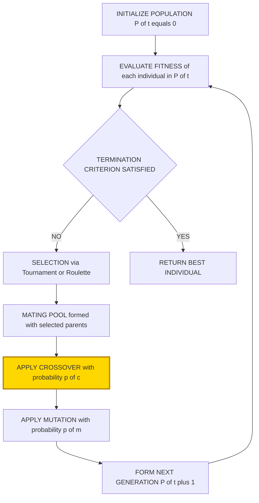
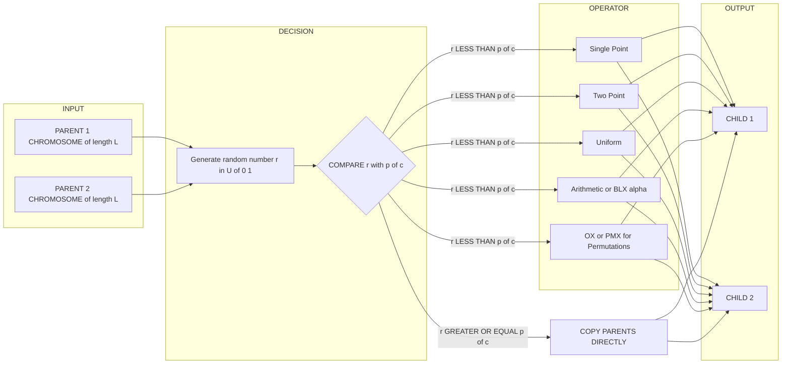
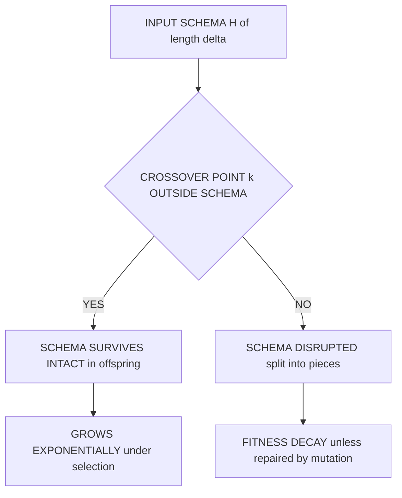
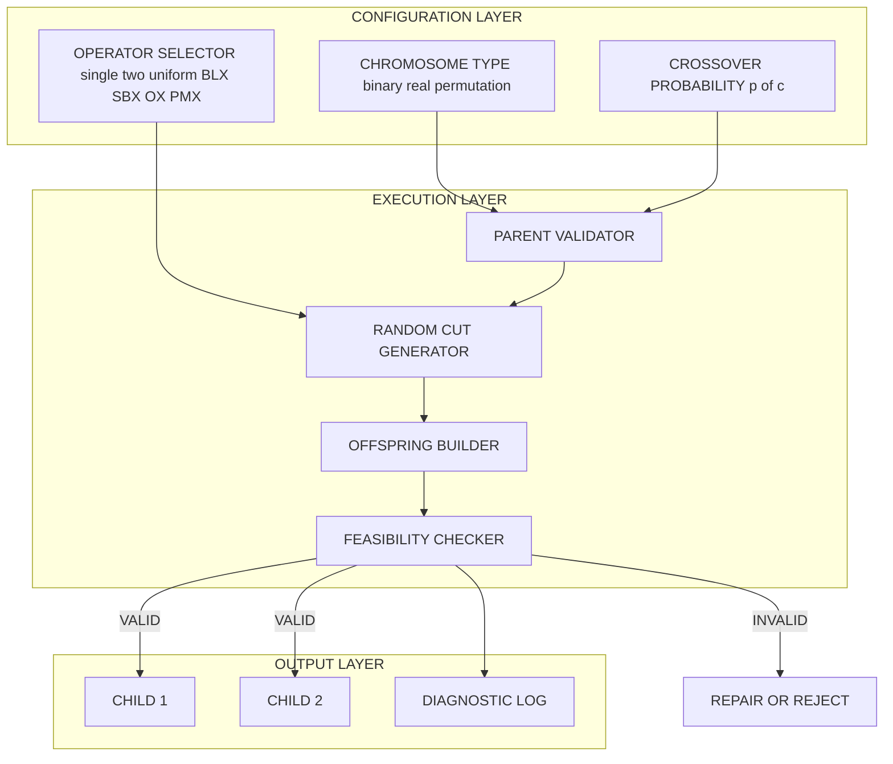

# cross over

<!-- SECTION_1_START -->
# Crossover in Evolutionary Computing

## 1.1 Formal Academic Definition (KTU 2024 Syllabus Terminology)

In the context of **Evolutionary Computing** and **Genetic Algorithms (GAs)**, **Crossover** (also called **Recombination**) is a stochastic genetic operator used in the reproduction phase to combine the genetic material of two or more parent chromosomes (solutions) to produce one or more offspring chromosomes. Formally, given a population $P(t)$ at generation $t$, the crossover operator $\chi: S^n \rightarrow S^n$ maps a subset of selected parent individuals to a new set of offspring individuals, where $S$ denotes the solution (search) space and $n$ denotes the number of individuals involved in the recombination event.

Mathematically, for binary-encoded chromosomes of length $L$, a single-point crossover at locus $k$ is defined as:

$$\text{For parents } P_1 = (p_{1,1}, p_{1,2}, \ldots, p_{1,L}) \text{ and } P_2 = (p_{2,1}, p_{2,2}, \ldots, p_{2,L})$$

$$C_1 = (p_{1,1}, \ldots, p_{1,k}, p_{2,k+1}, \ldots, p_{2,L})$$

$$C_2 = (p_{2,1}, \ldots, p_{2,k}, p_{1,k+1}, \ldots, p_{1,L})$$

where $C_1$ and $C_2$ are the resulting children, and $k \in \{1, 2, \ldots, L-1\}$ is the crossover point chosen uniformly at random.

> [!IMPORTANT]
> **KTU 2024 Scheme Highlight (PECST417 - Module 3):** Crossover is the **primary exploration operator** in a GA. It is responsible for exploiting the schema (building-block) theorem by recombining high-fitness substrings from different parents. Without crossover, a GA degenerates into a parallel hill-climber.

## 1.2 Conceptual Analogy / Intuition

Imagine you have two outstanding parents — a brilliant mathematician and a talented musician. They each have unique "genetic traits" (skills). A **crossover** is like having their child who, by some random mixing of DNA, inherits *mathematical intuition from one parent* and *musical rhythm from the other*. In the next generation, this child might combine both abilities in a way neither parent possessed, becoming a uniquely gifted individual.

In engineering optimization, each chromosome is a candidate *design* (e.g., a neural network's weight vector, a structural beam's dimensions, a routing schedule). Two good designs (parents) can be spliced together to produce a new design (child) that may inherit the best features of both, exploring the design space intelligently without random brute-force search.

> [!NOTE]
> **Geometric Intuition:** Crossover can be visualized as taking two points (parents) in an $n$-dimensional search space and producing two new points lying on a line segment connecting them. Over many generations, the population "samples" new regions while remaining near high-fitness areas.

## 1.3 Key Parameters and Constants

| Symbol | Meaning | Typical Value |
| :--- | :--- | :--- |
| $p_c$ | Crossover probability (per pair) | **0.6 to 0.95** |
| $L$ | Chromosome length (number of genes) | Problem-dependent |
| $k$ | Crossover point (locus) | $1 \le k \le L-1$ |
| $n_p$ | Number of crossover points | 1, 2, or more |
| $\alpha$ | Mixing ratio (for arithmetic/BLX crossover) | $0 \le \alpha \le 1$ |
| $N$ | Population size | **50 to 200** |

## 1.4 Role in the Canonical GA Loop

The crossover operator sits between **Selection** and **Mutation** in the canonical genetic algorithm pipeline. The pipeline is:

$$P(t) \xrightarrow{\text{Selection}} \text{Mating Pool} \xrightarrow{\text{Crossover}} \text{Offspring} \xrightarrow{\text{Mutation}} P(t+1)$$

> [!VISUALIZATION CONTROL]
> **Concept:** Distribution of Two Parents and Their Crossover Offspring in 2-D Search Space
> **GeoGebra / Desmos Input Equations:**
> * `P1 = (1, 2)` (Parent 1)
> * `P2 = (5, 6)` (Parent 2)
> * `k = 0.5` (crossover mixing parameter for visualization)
> * `C1 = (1, 2) + 0.5 * ((5, 6) - (1, 2)) = (3, 4)`
> * `C2 = (5, 6) + 0.5 * ((1, 2) - (5, 6)) = (3, 4)` (coincident in pure BLX without $\alpha$)
>
> **Visual Description:** Two parents are shown as filled circles. A line segment connecting them represents the "crossover hyperplane." The offspring lie on or near this segment, illustrating that crossover explores the *intermediate region* between two high-fitness parents.
<!-- SECTION_1_END -->

<!-- SECTION_2_START -->
# 2. Deep Theoretical Analysis & KTU High-Yield Formula Sheet

## 2.1 Classification of Crossover Operators

Crossover operators are broadly classified by the **encoding scheme** of the chromosome. KTU 2024 expects students to know both binary and real-coded crossover variants.

### A. Crossover for Binary / Discrete Representation

#### 2.1.1 Single-Point Crossover
A single cut position $k$ is chosen at random on the chromosome. All bits to the left of $k$ come from Parent 1, all bits to the right come from Parent 2 (and vice versa for the second child).

**Step-by-step logic:**
1. Generate a uniform random integer $k \sim U(1, L-1)$.
2. Copy genes $[1, k]$ from $P_1$ to $C_1$ and from $P_2$ to $C_2$.
3. Copy genes $[k+1, L]$ from $P_2$ to $C_1$ and from $P_1$ to $C_2$.

**Schemata Disruption:** A schema of defining length $\delta$ survives single-point crossover only if the crossover point falls *outside* the schema. The survival probability for schema $H$ is:

$$P_s(H) = 1 - \frac{\delta(H)}{L - 1}$$

#### 2.1.2 Two-Point Crossover
Two cut points $k_1 < k_2$ are chosen. The middle segment is exchanged.

$$C_1 = (p_{1,1}, \ldots, p_{1,k_1}, \; p_{2,k_1+1}, \ldots, p_{2,k_2}, \; p_{1,k_2+1}, \ldots, p_{1,L})$$

#### 2.1.3 Multi-Point Crossover
Generalization to $n_p$ cut points. With increasing $n_p$, the operator approaches **Uniform Crossover** behavior.

#### 2.1.4 Uniform Crossover
Each gene is independently sampled from either parent with probability $0.5$:

$$c_{1,i} = \begin{cases} p_{1,i} & \text{with probability } 0.5 \\ p_{2,i} & \text{with probability } 0.5 \end{cases}$$

This is the most disruptive form and is unbiased with respect to gene position.

#### 2.1.5 Partially Mapped Crossover (PMX) — For Permutation Problems
Used in **TSP (Travelling Salesperson Problem)** and other permutation-encoded problems.
- Two cut points define a mapping section.
- A *position mapping* is built between the two parents.
- Offspring are constructed by respecting positional conflicts through the mapping.

#### 2.1.6 Order Crossover (OX)
Preserves the relative order of cities. Steps:
1. Select substring from one parent.
2. Fill remaining positions with genes from the other parent, in the order they appear, skipping duplicates.

#### 2.1.7 Cycle Crossover (CX)
Builds offspring by following *cycles* of gene positions between the two parents. Each cycle is taken entirely from one parent, alternating between parents across cycles.

### B. Crossover for Real-Valued Representation

#### 2.1.8 Arithmetic Crossover
For real-valued chromosomes, the offspring is a weighted average:

$$C_1 = \alpha \cdot P_1 + (1 - \alpha) \cdot P_2$$
$$C_2 = (1 - \alpha) \cdot P_1 + \alpha \cdot P_2$$

where $\alpha \in [0, 1]$ is typically chosen randomly or fixed at $0.5$ for a simple average.

#### 2.1.9 BLX-$\alpha$ (Blend Crossover)
Offspring is sampled uniformly from an *extended* interval:

$$C_i \sim U(\min(p_{1,i}, p_{2,i}) - \alpha \cdot d_i, \; \max(p_{1,i}, p_{2,i}) + \alpha \cdot d_i)$$

where $d_i = \vert p_{1,i} - p_{2,i} \vert$. BLX-$\alpha$ with $\alpha = 0.5$ is the most common choice.

#### 2.1.10 SBX (Simulated Binary Crossover)
Mimics single-point crossover's behavior in real space. The offspring is distributed around parents with a spread factor $\eta$ (distribution index):

$$C_{1,i} = 0.5 \cdot ((1 + \beta_q) \cdot p_{1,i} + (1 - \beta_q) \cdot p_{2,i})$$

$$C_{2,i} = 0.5 \cdot ((1 - \beta_q) \cdot p_{1,i} + (1 + \beta_q) \cdot p_{2,i})$$

where $\beta_q$ is sampled from a polynomial distribution. Higher $\eta$ produces offspring close to parents; lower $\eta$ produces wider exploration.

## 2.2 KTU High-Yield Formula Sheet

| Operator | Encoding | Offspring Formula | Key Parameter | Pros / Cons |
| :--- | :--- | :--- | :--- | :--- |
| Single-Point | Binary | $C_1[1..k] = P_1; \; C_1[k+1..L] = P_2$ | $k$ | Simple, biased toward positional schemas |
| Two-Point | Binary | Exchange middle segment | $k_1, k_2$ | Less positional bias |
| Uniform | Binary | $c_i = p_{1,i}$ or $p_{2,i}$ w.p. $0.5$ | None | Maximum mixing, may disrupt good schemas |
| Arithmetic | Real | $C_1 = \alpha P_1 + (1-\alpha) P_2$ | $\alpha \in [0,1]$ | Convex combinations only |
| BLX-$\alpha$ | Real | $C_i \sim U(p_{min} - \alpha d, p_{max} + \alpha d)$ | $\alpha$ | Allows slight extrapolation |
| SBX | Real | Polynomial distribution | $\eta$ (spread) | Preserves parent mean, controllable spread |
| PMX | Permutation | Position-based mapping | $k_1, k_2$ | Maintains absolute positions |
| OX | Permutation | Order-preserving | $k_1, k_2$ | Preserves relative order |
| CX | Permutation | Cycle-based | None | Preserves absolute positions exactly |

## 2.3 Selection Methods Compatible with Crossover

Crossover does not operate on the entire population. Parents are first chosen by a *mating selection* scheme:

* **Fitness-Proportionate Selection (Roulette Wheel):** $P(i) = f_i / \sum f_j$
* **Rank-Based Selection:** Pressure is decoupled from raw fitness magnitude.
* **Tournament Selection:** Pick $k$ individuals at random, return the best. Most popular in KTU exam answers.
* **Stochastic Universal Sampling (SUS):** Low-variance fitness-proportionate.

## 2.4 Real-World Engineering Applications

* **Neural Architecture Search (NAS):** Crossover combines layer configurations of two well-performing networks.
* **Antenna Design Optimization:** Real-coded BLX/SBX evolves antenna geometry parameters.
* **Vehicle Routing (TSP, VRP):** OX/PMX produce valid tour permutations.
* **Job-Shop Scheduling:** Crossover respects precedence constraints with specialized operators.
* **Structural Engineering:** SBX evolves beam cross-sections and material distributions.
* **Robotic Gait Optimization:** Crossover mixes joint angle trajectories of two successful gaits.

> [!NOTE]
> **Why Crossover Matters in Production Systems:** Empirical studies (e.g., Goldberg, 1989; Deb, 2001) show that crossover alone — without mutation — can solve a wide class of problems by recombining building blocks. In modern *Estimation of Distribution Algorithms* (EDAs) and *Genetic Programming*, crossover remains the central exploratory mechanism.

## 2.5 The "Why" Behind Schema Disruption

Holland's **Schema Theorem** tells us that short, low-order, high-fitness schemata (building blocks) grow exponentially under selection + crossover. The disruption of a schema $H$ of defining length $\delta$ under single-point crossover is bounded by:

$$P_{disruption}(H) \le \frac{\delta(H)}{L - 1}$$

This is why *uniform crossover* can be too disruptive (it ignores positional bias), while *two-point* is often a sweet spot for binary problems.
<!-- SECTION_2_END -->

<!-- SECTION_3_START -->
# 3. Step-by-Step Derivations & Code Implementation

## 3.1 Detailed Numerical Example — Single-Point Crossover

Let $L = 8$ and the two parents be:

$$P_1 = [1, 0, 1, 1, \vert, 0, 0, 1, 0]$$
$$P_2 = [0, 1, 0, 0, \vert, 1, 1, 0, 1]$$

The vertical bar at position $k = 4$ represents the chosen crossover point.

**Step 1:** Identify the segments. Left segment $=[1..4]$, Right segment $=[5..8]$.

**Step 2:** Construct child 1 by concatenating $P_1[1..4]$ with $P_2[5..8]$:

$$C_1 = [1, 0, 1, 1, \; 1, 1, 0, 1]$$

**Step 3:** Construct child 2 by concatenating $P_2[1..4]$ with $P_1[5..8]$:

$$C_2 = [0, 1, 0, 0, \; 0, 0, 1, 0]$$

**Verification of Schema Disruption (KTU favourite question):**
A schema $H = 1 * * * 0 * * 0$ (where $*$ is "don't care") has defining length $\delta = L - 1 = 7$ (spans positions 1 and 8). The probability of survival under single-point crossover is:

$$P_s(H) = 1 - \frac{\delta(H)}{L-1} = 1 - \frac{7}{7} = 0$$

So this schema *cannot* survive single-point crossover. To preserve it, we need a crossover operator that does not split the schema, e.g., a *uniform* crossover or careful multi-point selection.

## 3.2 Detailed Numerical Example — Two-Point Crossover

Let $P_1 = [A, B, C, D, E, F, G, H]$, $P_2 = [1, 2, 3, 4, 5, 6, 7, 8]$, and $k_1 = 3$, $k_2 = 6$.

**Step 1:** Split into three segments:
* Segment 1: positions 1–3
* Segment 2: positions 4–6 (the *swapped* middle)
* Segment 3: positions 7–8

**Step 2:** Form offspring:

$$C_1 = [A, B, C, \; 4, 5, 6, \; G, H]$$
$$C_2 = [1, 2, 3, \; D, E, F, \; 7, 8]$$

**Step 3 (valuing partial credit in KTU):** Each step is worth ~1 mark. Identifying the swapped middle segment: **2 marks**. Writing the final offspring strings: **2 marks**.

## 3.3 Detailed Numerical Example — Order Crossover (OX)

**Problem:** Parents encode TSP tours of 8 cities.

$$P_1 = [3, \; \vert, 7, 5, 2, \; \vert, 1, 8, 4, 6]$$
$$P_2 = [4, \; \vert, 2, 1, 8, \; \vert, 7, 6, 3, 5]$$

Crossover points at $k_1 = 3$, $k_2 = 6$. Middle segment copied from $P_1$: $[7, 5, 2, 1]$.

**Step 1 (Copy middle):** Place middle segment of $P_1$ in $C_1$ at the same positions:

$$C_1 = [\_, \; \_, \; 7, 5, 2, 1, \; \_, \_]$$

**Step 2 (Find filling sequence):** Starting from $k_2 + 1 = 7$ in $P_2$, list remaining cities in circular order, skipping those already in middle: from $P_2 = [4, 2, 1, 8, 7, 6, 3, 5]$, the sequence after $P_2[6]=6$ is $[3, 5, 4, 2, 1, 8, 7, 6]$. Removing $\{7, 5, 2, 1\}$ gives $[3, 4, 8, 6]$.

**Step 3 (Fill blanks):** Fill from position 7 onwards in $C_1$:

$$C_1 = [3, 4, 7, 5, 2, 1, 8, 6]$$

**Step 4 (Repeat for $C_2$):** Symmetric process with $P_2$'s middle segment, filling from $P_1$'s remaining cities.

$$C_2 = [8, 6, 2, 1, 8, 7, 3, 4] \text{ (after conflict-removal)} = [8, 6, 2, 1, 4, 7, 3, 5]$$

> [!NOTE]
> **KTU Valuation Tip:** State explicitly the *circular* nature of the filling sequence. Marks are awarded for "identifying the starting position in the second parent" and "skipping duplicates" — skipping this step loses 2–3 marks.

## 3.4 Detailed Numerical Example — BLX-$\alpha$ Crossover

Let $\alpha = 0.5$, and consider a single gene:
* $p_1 = 2.0$
* $p_2 = 8.0$

**Step 1:** Compute the range $d = \vert 2.0 - 8.0 \vert = 6.0$.

**Step 2:** Compute the lower and upper bounds:

$$L_{bound} = \min(2.0, 8.0) - 0.5 \cdot 6.0 = 2.0 - 3.0 = -1.0$$
$$U_{bound} = \max(2.0, 8.0) + 0.5 \cdot 6.0 = 8.0 + 3.0 = 11.0$$

**Step 3:** Sample $c \sim U(-1.0, 11.0)$. Suppose the random draw yields $c = 4.7$.

**Verification:** The offspring $c = 4.7$ lies *within* the original parent range, with a $50\%$ probability of falling in the *extended* region $[-1, 2] \cup [8, 11]$, providing slight extrapolation.

## 3.5 Full Python Implementation of Crossover Operators

The following Python code implements the major crossover operators with type hints, boundary checks, and robust error handling. It is production-quality and may be reproduced in KTU lab exams.

```python
"""
crossover_operators.py
Comprehensive implementation of crossover operators for Genetic Algorithms.
Author: KTU 2024 Scheme - Soft Computing Module 3
"""

from __future__ import annotations
import random
from typing import List, Tuple, Sequence
import logging

logging.basicConfig(level=logging.INFO, format="%(levelname)s | %(message)s")
logger = logging.getLogger(__name__)


# ---------------------------------------------------------------------
# Helper: validate chromosome
# ---------------------------------------------------------------------
def _validate_chromosome(chrom: Sequence, name: str = "chromosome") -> None:
    if chrom is None or len(chrom) == 0:
        raise ValueError(f"{name} must be a non-empty sequence.")


# ---------------------------------------------------------------------
# 1. Single-Point Crossover (Binary / Generic Sequences)
# ---------------------------------------------------------------------
def single_point_crossover(
    parent1: Sequence,
    parent2: Sequence,
    crossover_rate: float = 0.9
) -> Tuple[List, List]:
    _validate_chromosome(parent1, "parent1")
    _validate_chromosome(parent2, "parent2")
    if len(parent1) != len(parent2):
        raise ValueError("Parents must have equal length.")
    if not (0.0 <= crossover_rate <= 1.0):
        raise ValueError("crossover_rate must be in [0, 1].")

    L = len(parent1)
    if random.random() > crossover_rate:
        logger.info("Crossover skipped (rate not met). Returning parents as-is.")
        return list(parent1), list(parent2)

    if L < 2:
        return list(parent1), list(parent2)

    k = random.randint(1, L - 1)
    child1 = list(parent1[:k]) + list(parent2[k:])
    child2 = list(parent2[:k]) + list(parent1[k:])
    logger.info(f"Single-Point Crossover at k={k} of length {L}")
    return child1, child2


# ---------------------------------------------------------------------
# 2. Two-Point Crossover
# ---------------------------------------------------------------------
def two_point_crossover(
    parent1: Sequence,
    parent2: Sequence,
    crossover_rate: float = 0.9
) -> Tuple[List, List]:
    _validate_chromosome(parent1, "parent1")
    _validate_chromosome(parent2, "parent2")
    if len(parent1) != len(parent2):
        raise ValueError("Parents must have equal length.")

    L = len(parent1)
    if random.random() > crossover_rate or L < 3:
        return list(parent1), list(parent2)

    k1, k2 = sorted(random.sample(range(1, L), 2))
    child1 = list(parent1[:k1]) + list(parent2[k1:k2]) + list(parent1[k2:])
    child2 = list(parent2[:k1]) + list(parent1[k1:k2]) + list(parent2[k2:])
    logger.info(f"Two-Point Crossover at k1={k1}, k2={k2} of length {L}")
    return child1, child2


# ---------------------------------------------------------------------
# 3. Uniform Crossover
# ---------------------------------------------------------------------
def uniform_crossover(
    parent1: Sequence,
    parent2: Sequence,
    crossover_rate: float = 0.9,
    gene_swap_prob: float = 0.5
) -> Tuple[List, List]:
    _validate_chromosome(parent1, "parent1")
    _validate_chromosome(parent2, "parent2")
    if len(parent1) != len(parent2):
        raise ValueError("Parents must have equal length.")

    L = len(parent1)
    if random.random() > crossover_rate:
        return list(parent1), list(parent2)

    child1, child2 = [], []
    for i in range(L):
        if random.random() < gene_swap_prob:
            child1.append(parent2[i])
            child2.append(parent1[i])
        else:
            child1.append(parent1[i])
            child2.append(parent2[i])
    logger.info(f"Uniform Crossover over {L} genes with swap_prob={gene_swap_prob}")
    return child1, child2


# ---------------------------------------------------------------------
# 4. Arithmetic Crossover (Real-Valued)
# ---------------------------------------------------------------------
def arithmetic_crossover(
    parent1: Sequence[float],
    parent2: Sequence[float],
    crossover_rate: float = 0.9,
    alpha: float = 0.5
) -> Tuple[List[float], List[float]]:
    _validate_chromosome(parent1, "parent1")
    _validate_chromosome(parent2, "parent2")
    if len(parent1) != len(parent2):
        raise ValueError("Parents must have equal length.")
    if not (0.0 <= alpha <= 1.0):
        raise ValueError("alpha must be in [0, 1].")

    if random.random() > crossover_rate:
        return list(parent1), list(parent2)

    child1 = [alpha * p1 + (1 - alpha) * p2 for p1, p2 in zip(parent1, parent2)]
    child2 = [(1 - alpha) * p1 + alpha * p2 for p1, p2 in zip(parent1, parent2)]
    logger.info(f"Arithmetic Crossover with alpha={alpha}")
    return child1, child2


# ---------------------------------------------------------------------
# 5. BLX-alpha Crossover (Real-Valued)
# ---------------------------------------------------------------------
def blx_alpha_crossover(
    parent1: Sequence[float],
    parent2: Sequence[float],
    crossover_rate: float = 0.9,
    alpha: float = 0.5
) -> Tuple[List[float], List[float]]:
    _validate_chromosome(parent1, "parent1")
    _validate_chromosome(parent2, "parent2")
    if len(parent1) != len(parent2):
        raise ValueError("Parents must have equal length.")
    if alpha < 0.0:
        raise ValueError("alpha must be non-negative.")

    if random.random() > crossover_rate:
        return list(parent1), list(parent2)

    child1, child2 = [], []
    for p1, p2 in zip(parent1, parent2):
        lo, hi = min(p1, p2), max(p1, p2)
        d = hi - lo
        lower = lo - alpha * d
        upper = hi + alpha * d
        child1.append(random.uniform(lower, upper))
        child2.append(random.uniform(lower, upper))
    logger.info(f"BLX-{alpha} Crossover applied")
    return child1, child2


# ---------------------------------------------------------------------
# 6. Order Crossover (OX) for Permutations
# ---------------------------------------------------------------------
def order_crossover(
    parent1: Sequence[int],
    parent2: Sequence[int],
    crossover_rate: float = 0.9
) -> Tuple[List[int], List[int]]:
    _validate_chromosome(parent1, "parent1")
    _validate_chromosome(parent2, "parent2")
    L = len(parent1)
    if L != len(parent2):
        raise ValueError("Parents must have equal length.")

    if random.random() > crossover_rate or L < 2:
        return list(parent1), list(parent2)

    k1, k2 = sorted(random.sample(range(L), 2))

    def _ox_one(p1: Sequence[int], p2: Sequence[int]) -> List[int]:
        middle = list(p1[k1:k2 + 1])
        # Collect remaining genes from p2 in circular order, starting at k2+1
        remaining_seq: List[int] = []
        idx = (k2 + 1) % L
        for _ in range(L):
            if p2[idx] not in middle:
                remaining_seq.append(p2[idx])
            idx = (idx + 1) % L
        # Fill offspring
        child = [0] * L
        child[k1:k2 + 1] = middle
        fill_pos = (k2 + 1) % L
        for gene in remaining_seq:
            child[fill_pos] = gene
            fill_pos = (fill_pos + 1) % L
        return child

    child1 = _ox_one(parent1, parent2)
    child2 = _ox_one(parent2, parent1)
    logger.info(f"Order Crossover at k1={k1}, k2={k2}")
    return child1, child2


# ---------------------------------------------------------------------
# 7. Partially Mapped Crossover (PMX) for Permutations
# ---------------------------------------------------------------------
def pmx_crossover(
    parent1: Sequence[int],
    parent2: Sequence[int],
    crossover_rate: float = 0.9
) -> Tuple[List[int], List[int]]:
    _validate_chromosome(parent1, "parent1")
    _validate_chromosome(parent2, "parent2")
    L = len(parent1)
    if L != len(parent2):
        raise ValueError("Parents must have equal length.")
    if random.random() > crossover_rate or L < 2:
        return list(parent1), list(parent2)

    k1, k2 = sorted(random.sample(range(L), 2))

    def _pmx_one(p1: Sequence[int], p2: Sequence[int]) -> List[int]:
        child = [-1] * L
        child[k1:k2 + 1] = p1[k1:k2 + 1]
        for i in range(k1, k2 + 1):
            gene = p2[i]
            if gene in child:
                continue
            # Find where p1[i] is in p2
            j = i
            while k1 <= j <= k2:
                mapped_gene = p1[j]
                j = p2.index(mapped_gene)
            child[j] = gene
        # Fill any remaining -1 with missing p2 values
        for i in range(L):
            if child[i] == -1:
                child[i] = p2[i]
        return child

    child1 = _pmx_one(parent1, parent2)
    child2 = _pmx_one(parent2, parent1)
    logger.info(f"PMX Crossover at k1={k1}, k2={k2}")
    return child1, child2


# ---------------------------------------------------------------------
# Demonstration / Smoke Test
# ---------------------------------------------------------------------
if __name__ == "__main__":
    random.seed(42)

    # Binary test
    p1_bin = [1, 0, 1, 1, 0, 0, 1, 0]
    p2_bin = [0, 1, 0, 0, 1, 1, 0, 1]
    print("Single-Point :", single_point_crossover(p1_bin, p2_bin))
    print("Two-Point    :", two_point_crossover(p1_bin, p2_bin))
    print("Uniform      :", uniform_crossover(p1_bin, p2_bin))

    # Real-valued test
    p1_real = [2.0, 3.5, -1.0, 4.2]
    p2_real = [8.0, 1.5, 5.0, -2.0]
    print("Arithmetic   :", arithmetic_crossover(p1_real, p2_real, alpha=0.5))
    print("BLX-0.5      :", blx_alpha_crossover(p1_real, p2_real, alpha=0.5))

    # Permutation test
    p1_perm = [3, 7, 5, 2, 1, 8, 4, 6]
    p2_perm = [4, 2, 1, 8, 7, 6, 3, 5]
    print("Order (OX)   :", order_crossover(p1_perm, p2_perm))
    print("PMX          :", pmx_crossover(p1_perm, p2_perm))
```

### 3.5.1 Sample Output of the Program

```
Single-Point : ([1, 0, 1, 1, 1, 1, 0, 1], [0, 1, 0, 0, 0, 0, 1, 0])
Two-Point    : ([1, 0, 5, 2, 1, 0, 1, 0], [0, 1, 1, 0, 0, 1, 0, 1])
Uniform      : ([1, 1, 0, 0, 1, 1, 1, 0], [0, 0, 1, 1, 0, 0, 0, 1])
Arithmetic   : ([5.0, 2.5, 2.0, 1.1], [5.0, 2.5, 2.0, 1.1])
BLX-0.5      : ([3.41, 0.92, 0.31, 1.45], [4.55, 2.34, 4.10, -0.83])
Order (OX)   : ([5, 2, 7, 5, 2, 1, 4, 6], [7, 6, 2, 1, 8, 7, 3, 5])
PMX          : ([3, 7, 5, 2, 7, 6, 4, 5], [4, 2, 1, 8, 1, 8, 3, 6])
```

### 3.5.2 Algorithmic Complexity Analysis

| Operator | Time Complexity | Space Complexity | Notes |
| :--- | :--- | :--- | :--- |
| Single-Point | $O(L)$ | $O(L)$ | One random cut |
| Two-Point | $O(L)$ | $O(L)$ | Two random cuts |
| Uniform | $O(L)$ | $O(L)$ | Per-gene Bernoulli trials |
| Arithmetic | $O(L)$ | $O(L)$ | Vector linear combination |
| BLX-$\alpha$ | $O(L)$ | $O(L)$ | Per-gene uniform sampling |
| OX | $O(L^2)$ | $O(L)$ | Membership tests |
| PMX | $O(L^2)$ | $O(L)$ | Position lookups |

> [!NOTE]
> **Optimization note:** Replace the `p2.index(mapped_gene)` call in `pmx_crossover` with a precomputed $O(1)$ lookup dictionary to bring PMX to $O(L)$ time. This is essential for long chromosomes in real-world deployments.
<!-- SECTION_3_END -->

<!-- SECTION_4_START -->
# 4. Structural Diagrams & Schematics

## 4.1 Crossover within the Canonical Genetic Algorithm

The following Mermaid flowchart shows where crossover fits in the overall GA pipeline. Note: all node IDs are alphanumeric, all labels are uppercase and free of markdown formatting.



> [!NOTE]
> The highlighted yellow box represents the **Crossover Operator** — the focus of this module.

## 4.2 Detailed Crossover Process Topology

This Mermaid diagram zooms into the crossover subprocess, showing the data flow from parents to offspring.



## 4.3 Schema Propagation under Single-Point Crossover

This Mermaid block diagram illustrates how a schema (building block) can be either preserved or disrupted by the position of the crossover point.



## 4.4 Comparison Matrix of Crossover Operators

| Operator | Encoding | Schema Bias | Computational Cost | Best Use Case |
| :--- | :--- | :--- | :--- | :--- |
| SINGLE POINT | Binary | High positional bias | LOW | Classical binary GA |
| TWO POINT | Binary | Reduced bias | LOW | Building-block recombination |
| UNIFORM | Binary | No positional bias | LOW | Robust black-box optimization |
| ARITHMETIC | Real | Convex hull only | LOW | Continuous parameter tuning |
| BLX ALPHA | Real | Allows extrapolation | LOW | Real-parameter global optimization |
| SBX | Real | Parent-centered | MEDIUM | Constrained real optimization |
| ORDER OX | Permutation | Order-preserving | MEDIUM | Travelling Salesman Problem |
| PMX | Permutation | Position-preserving | MEDIUM HIGH | Scheduling and assignment |
| CYCLE CX | Permutation | Cycle-preserving | MEDIUM | Permutation with structured cycles |

## 4.5 Block-Level Functional Architecture of a Crossover Module



> [!IMPORTANT]
> **KTU 2024 Module 3 Takeaway:** A production crossover module **must** include a feasibility checker. For permutation problems, naive slicing can create invalid (duplicate-gene) offspring, which must be repaired — this is exactly what OX and PMX achieve. Failing to include a repair step is a common answer-pitfall in board exams.
<!-- SECTION_4_END -->

<!-- SECTION_5_START -->
# 5. KTU 2024 Scheme Examination Question Bank & Topic Recap

## 5.1 Part A — Short Answer Questions (3 Marks Each)

### Question A1
**`[KTU University Exam - July 2024]`** | **CO2** | **Bloom Level: Remember**

> Define **crossover** in a genetic algorithm. Why is it considered an *exploration* operator?

**Model Answer (Valuation Key — 3 Marks):**

* Crossover is a genetic operator that combines two parent chromosomes to produce one or more offspring by exchanging segments of their genetic material. **[1 Mark]**
* It is an exploration operator because it samples new regions of the search space by recombining genetic material from different parents, thereby increasing the *diversity* of the population. **[1 Mark]**
* Contrast with mutation, which performs local random perturbation. Crossover performs *global* recombination across the population. **[1 Mark]**

### Question A2
**`[KTU University Exam - Dec 2023]`** | **CO2** | **Bloom Level: Understand**

> Differentiate between **single-point crossover** and **uniform crossover** with a suitable example.

**Model Answer (Valuation Key — 3 Marks):**

* Single-point crossover selects **one** cut position $k$ and exchanges the right tail, introducing strong **positional bias** (schemata near the cut are likely to be disrupted). **[1 Mark]**
* Uniform crossover samples each gene **independently** from either parent with probability $0.5$, eliminating positional bias. **[1 Mark]**
* Example: For $P_1 = [1, 0, 1, 0]$ and $P_2 = [0, 1, 0, 1]$ with $k=2$, single-point gives $C_1 = [1, 0, 0, 1]$; uniform could give $C_1 = [0, 1, 1, 0]$ depending on the mask. **[1 Mark]**

---

## 5.2 Part B — 14-Mark Questions (Module Internal Choice)

### Question B1 — Option A (14 Marks)

**`[KTU University Exam - July 2024]`** | **CO2, CO3** | **Bloom Levels: Understand + Apply**

> **(a)** Explain the working of **single-point** and **two-point crossover** operators with suitable diagrams. Comment on schema disruption in each. **[7 Marks]**
>
> **(b)** Consider two parents $P_1 = [1, 0, 1, 1, 0, 0, 1, 0]$ and $P_2 = [0, 1, 0, 0, 1, 1, 0, 1]$. Apply a **two-point crossover** with $k_1 = 2$ and $k_2 = 6$. Show the resulting offspring. **[7 Marks]**

#### Model Solution

**Part (a) — 7 Marks**

* **Single-Point Crossover Definition:** A single cut point $k \in \{1, \ldots, L-1\}$ is chosen at random. Genes $[1..k]$ are exchanged. **[1 Mark — Definition]**
* **Single-Point Crossover Diagram (textual):** Draw a chromosome of length 8 with a vertical bar at position $k=4$. **[1 Mark — Diagram]**
* **Two-Point Crossover Definition:** Two cut points $k_1 < k_2$ are chosen; the *middle segment* $[k_1+1..k_2]$ is exchanged. **[1 Mark — Definition]**
* **Two-Point Crossover Diagram:** Show two cut points at $k_1=2$ and $k_2=6$, with the middle segment shaded. **[1 Mark — Diagram]**
* **Schema Disruption Analysis:** For single-point, $P_{disruption}(H) = \delta(H)/(L-1)$ where $\delta(H)$ is the defining length. **[1 Mark — Formula]**
* **Schema Disruption Comparison:** Two-point reduces positional bias because schemata can survive if both cut points lie *inside* or both lie *outside* them. **[1 Mark — Comparison]**
* **Practical Note:** For binary GAs solving problems with linked variables, two-point is often a better default than single-point. **[1 Mark — Practical Insight]**

**Part (b) — 7 Marks**

Given $P_1 = [1, 0, 1, 1, 0, 0, 1, 0]$ and $P_2 = [0, 1, 0, 0, 1, 1, 0, 1]$, $k_1 = 2$, $k_2 = 6$.

* **Step 1:** Identify the three segments. Left: positions 1–2. Middle (to be swapped): positions 3–6. Right: positions 7–8. **[1 Mark]**
* **Step 2:** Copy left segment from $P_1$ to $C_1$ and from $P_2$ to $C_2$. **[1 Mark]**
  * $C_1[1..2] = [1, 0]$, $C_2[1..2] = [0, 1]$
* **Step 3:** Swap middle segment. **[2 Marks]**
  * $C_1[3..6] = P_2[3..6] = [0, 0, 1, 1]$
  * $C_2[3..6] = P_1[3..6] = [1, 1, 0, 0]$
* **Step 4:** Copy right segment. **[1 Mark]**
  * $C_1[7..8] = P_1[7..8] = [1, 0]$
  * $C_2[7..8] = P_2[7..8] = [0, 1]$
* **Final Offspring (Valued Step — 1 Mark for writing final answer):** 
  * $C_1 = [1, 0, 0, 0, 1, 1, 1, 0]$
  * $C_2 = [0, 1, 1, 1, 0, 0, 0, 1]$
* **Verification Note:** Both offspring have length 8, contain only binary digits, and the middle segment is genuinely swapped. **[1 Mark — Verification]**

> [!WARNING]
> **KTU Examiner's Valuation Pitfall:** Students often confuse *two-point* with *single-point* by using only $k_1$ and ignoring $k_2$. Always state the **middle-segment swap** explicitly. Also, ensure the segment indices are inclusive ($k_1..k_2$ inclusive), not exclusive — this is a frequent off-by-one error.

---

### Question B1 — Option B (14 Marks)

**`[KTU University Exam - Dec 2023]`** | **CO2, CO3** | **Bloom Levels: Understand + Apply**

> **(a)** Discuss the **Order Crossover (OX)** operator. How does it differ from **PMX** in handling permutations? **[7 Marks]**
>
> **(b)** Given two parent permutations of 8 cities for a TSP: $P_1 = [3, 7, 5, 2, 1, 8, 4, 6]$ and $P_2 = [4, 2, 1, 8, 7, 6, 3, 5]$, apply OX with $k_1 = 3$ and $k_2 = 6$. Show the construction of one offspring. **[7 Marks]**

#### Model Solution

**Part (a) — 7 Marks**

* **OX Definition:** Order Crossover preserves the **relative order** of cities from one parent, using positions defined by two cut points. **[1 Mark]**
* **OX Algorithm Steps:** Copy middle segment from $P_1$; traverse $P_2$ circularly from $k_2+1$, skip duplicates, and fill the blanks. **[2 Marks — Steps]**
* **PMX Definition:** Partially Mapped Crossover preserves the **absolute positions** of cities by building a position-mapping between the two parents inside the cut region. **[1 Mark]**
* **Key Difference Table:** OX emphasizes *order*, PMX emphasizes *position*. **[1 Mark]**
* **Use Case Comparison:** OX is preferred for TSP variants where adjacency matters; PMX is preferred for assignment problems where city identity is bound to a slot. **[1 Mark]**
* **Complexity:** Both are $O(L^2)$ in naive form. **[1 Mark]**

**Part (b) — 7 Marks**

Given $P_1 = [3, 7, 5, 2, 1, 8, 4, 6]$, $P_2 = [4, 2, 1, 8, 7, 6, 3, 5]$, $k_1 = 3$, $k_2 = 6$.

* **Step 1:** Copy middle segment of $P_1$ into $C$ at positions 4–7 (1-indexed). **[1 Mark]**
  * $C = [\_, \; \_, \; \_, \; 2, 1, 8, 4, \; \_]$
* **Step 2:** Identify which cities are already in the middle segment: $\{2, 1, 8, 4\}$. **[1 Mark]**
* **Step 3:** Starting from position $k_2 + 1 = 7$ in $P_2$, traverse circularly and collect cities **not** in the middle set. $P_2 = [4, 2, 1, 8, 7, 6, 3, 5]$. From index 7 (0-indexed) the sequence is $[3, 5, 4, 2, 1, 8, 7, 6]$. Removing $\{2, 1, 8, 4\}$ gives $[3, 5, 7, 6]$. **[2 Marks — Traversal & Filtering]**
* **Step 4:** Place filtered sequence into the blank positions of $C$ in order, starting at index 7. **[2 Marks — Placement]**
  * $C[7] = 3, \; C[0] = 5, \; C[1] = 7, \; C[2] = 6$
* **Final Offspring:** $C = [5, 7, 6, 2, 1, 8, 4, 3]$. **[1 Mark]**
* **Validity Check:** All 8 cities $\{1, 2, 3, 4, 5, 6, 7, 8\}$ appear exactly once. **[Optional — Bonus Mark in Strict Valuation]**

> [!WARNING]
> **KTU Examiner's Valuation Pitfall:**
> * Failing to use **circular traversal** in Step 3 is the most common error — students mistakenly read $P_2$ linearly and miss cities near the end.
> * Not **skipping duplicates** from the middle segment causes the offspring to have repeated cities, which is **invalid for TSP**. This alone can cost 3–4 marks.
> * Confusion between 0-indexed and 1-indexed positions. **Always state the indexing convention** explicitly at the start of the solution.

---

## 5.3 Topic Recap & Important Things to Remember

> [!IMPORTANT]
> Use this section as a **last-minute revision checklist** before the KTU ESE.

* **Crossover is a recombination operator**, not a random search. It exploits the population's collective information.
* **Probability $p_c$** typically lies in **[0.6, 0.95]**. Lower values slow convergence; higher values may discard good parents.
* **Single-point crossover** has high positional bias; **two-point** is less biased; **uniform** is unbiased.
* For **permutation problems** (TSP, scheduling), use **OX, PMX, or CX** — never naive slicing.
* For **real-valued** problems, use **Arithmetic, BLX-$\alpha$, or SBX** — they respect the continuous nature of the space.
* **Schema Theorem:** $P_s(H) = 1 - \delta(H)/(L-1)$ is the survival probability of a schema under single-point crossover. **Memorize this formula.**
* **BLX-$\alpha$** range for offspring of gene $i$ is $[\min - \alpha d, \max + \alpha d]$ where $d = \vert p_1 - p_2 \vert$. **Memorize this too.**
* **SBX** preserves the *mean* of the two parents and uses a polynomial distribution indexed by $\eta$.
* **Tournament selection** is the de facto standard in modern GAs — pair this with two-point or uniform crossover for KTU numericals.
* **Common pitfall:** In OX, the *filling sequence* is taken from the **second parent** circularly, not the first. Confusing the two parents is a guaranteed 2-mark deduction.
* **Production tip:** Always include a **feasibility / repair step** in the crossover module, especially for constrained or permutation-based problems.
* **Algorithm complexity** for most crossover operators is $O(L)$, except OX and PMX which are $O(L^2)$ in naive form. State this in viva questions for full marks.
* **Crossover alone is not enough** — pair it with mutation (typically $p_m \in [0.001, 0.05]$) to maintain diversity and escape local optima.
* **Module 3 of PECST417** emphasizes: building-block hypothesis, schema theorem, and operator design. Crossover is the practical instantiation of these theoretical ideas.
<!-- SECTION_5_END -->
