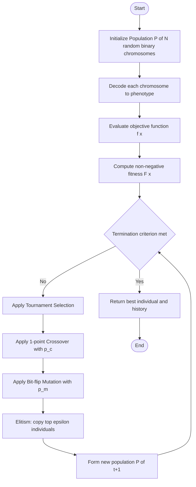
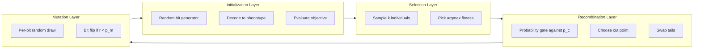
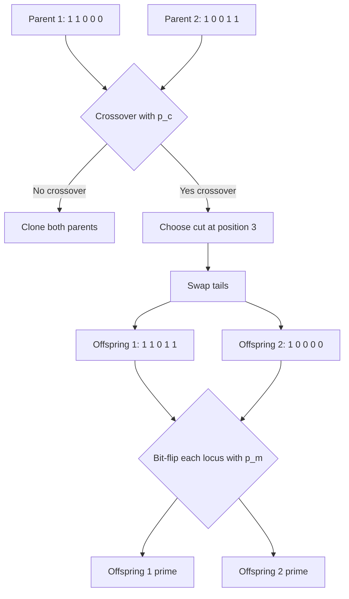
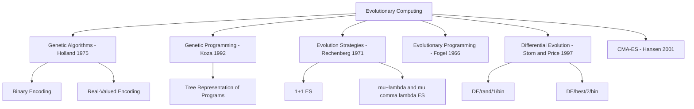

# Evolutionary Computing

<!-- SECTION_1_START -->
# Evolutionary Computing — Core Definition & Intuitive Overview

## Formal Academic Definition

> [!IMPORTANT]
> **Evolutionary Computing (EC)** is a sub-field of artificial intelligence and soft computing that employs **metaheuristic optimization algorithms** inspired by the biological mechanisms of natural evolution — namely *selection*, *reproduction*, *variation*, and *survival of the fittest* — to iteratively search large, complex, non-deterministic solution spaces for near-optimal solutions.

According to the **KTU 2024 Scheme (PECST417 — Soft Computing, Module 3)**, Evolutionary Computing is treated as a population-based stochastic search paradigm where a set of candidate solutions (called the **population**) evolves across discrete generations through stochastic operators until a termination condition is met.

The four pillars of any EC algorithm are:

| Pillar | Biological Origin | Algorithmic Role |
| :--- | :--- | :--- |
| **Population** | A herd / colony / gene pool | Set of candidate solutions |
| **Selection** | Natural selection | Probabilistic survival of better solutions |
| **Crossover / Recombination** | Sexual reproduction | Information exchange between parents |
| **Mutation** | Random genetic drift | Small random perturbations to maintain diversity |

The flagship member of this family, the **Genetic Algorithm (GA)**, was formally introduced by **John Henry Holland (1975)** in *"Adaptation in Natural and Artificial Systems"*. The standard population size in KTU textbook examples typically lies in the range **$N = 20$ to $N = 100$**, and the mutation probability is conventionally chosen as **$p_m \in [0.001, 0.05]$**.

---

## Conceptual Analogy / Intuition

> [!NOTE]
> **"The Giraffe Neck Problem"** 🦒
> Imagine a population of giraffes in a savanna where food exists only on tall trees. Short-necked giraffes starve; long-necked giraffes survive and reproduce. Their offspring inherit (with small random variations) the long-neck gene. Over generations, the *average* neck length of the population *increases* — not because any single giraffe decided to grow a longer neck, but because the **environment selected** the fittest variants.

Evolutionary Computing does **exactly the same thing in software**:

1. Generate a **random population** of candidate solutions (the "giraffes").
2. **Score** each candidate with a **fitness function** (the "tall tree").
3. **Select** the better-scoring candidates as parents.
4. **Crossover** parents to produce offspring (mix their "genes").
5. **Mutate** offspring slightly to introduce novelty.
6. Replace the old population with the new one and **repeat**.

After many generations, the population **converges** toward an optimum — even though the algorithm never explicitly *knew* where the optimum was. This is the power of **stochastic, population-based search**.

---

## Why It Belongs to *Soft Computing*

Soft computing (per **Lotfi Zadeh, 1994**) tolerates **imprecision, uncertainty, partial truth, and approximation** to achieve tractability, robustness, and low solution cost. Evolutionary algorithms embody this because they:

- Do not require derivatives (unlike gradient descent).
- Do not require convexity or continuity of the search space.
- Are **probabilistic**, not deterministic.
- Produce **near-optimal** (not provably optimal) solutions.

> [!TIP]
> **KTU students must remember:** Evolutionary Computing is *not* a guarantee of global optimum. It is a *search heuristic* with **stochastic convergence guarantees** under conditions such as elitism and infinite population size (Schema Theorem by Holland).

---

## Position in the Soft Computing Family

Evolutionary Computing is one of three primary pillars of soft computing in the KTU syllabus:

| Soft Computing Pillar | Core Strength | Biological Inspiration |
| :--- | :--- | :--- |
| **Fuzzy Logic** | Reasoning under uncertainty | Human linguistic reasoning |
| **Artificial Neural Networks** | Learning from data | Brain neurons |
| **Evolutionary Computing** | Global optimization | Darwinian evolution |

The three are often **hybridized** (e.g., **Neuro-Fuzzy-GA** systems) to exploit complementary strengths.

---

## Historical & Module Roadmap

For the KTU 2024 Scheme, the Module 3 trajectory is:

1. **Introduction to Evolutionary Computing** (this section)
2. **Genetic Algorithms** — encoding, fitness, selection, crossover, mutation
3. **The Schema Theorem** (Holland's foundational result)
4. **Genetic Programming (GP)** — evolving computer programs as trees
5. **Evolution Strategies (ES)** — real-parameter optimization with self-adaptation
6. **Differential Evolution (DE)**, **Particle Swarm Optimization (PSO)** as related paradigms

> [!VISUALIZATION CONTROL]
> **Concept:** Fitness landscape as a 2-D topographic surface
> **Desmos Input Equations:**
> * `f(x, y) = x^2 + y^2 - 4*sin(2*x) - 4*sin(2*y)` (multi-modal landscape)
> * The global optimum sits at the deepest valley.
> **Visual Description:** Plot a contour map with several local minima ("valleys") and one global minimum. The GA population starts scattered; selection + crossover pulls them toward the deepest valley; mutation prevents them from getting trapped in shallow ones.

<!-- SECTION_1_END -->

<!-- SECTION_2_START -->
# Deep Theoretical Analysis & KTU High-Yield Formula Sheet

## 1. The Canonical Genetic Algorithm (GA) Pipeline

The **Canonical GA** (also called the **Simple GA** or **SGA**, Holland, 1975; Goldberg, 1989) executes the following closed-loop pipeline every generation:

1. **Initialization** — Generate a population $P^{(0)} = \{x_1^{(0)}, x_2^{(0)}, \ldots, x_N^{(0)}\}$ of $N$ individuals, each encoded as a fixed-length binary string of length $L$ (the *chromosome*).
2. **Fitness Evaluation** — Compute $f(x_i)$ for every individual and map it to a non-negative **fitness score** $F(x_i) \geq 0$.
3. **Selection** — Stochastically choose parents with probability proportional to fitness.
4. **Crossover** — With probability $p_c$, exchange genetic material between pairs of parents to produce offspring.
5. **Mutation** — With probability $p_m$, flip individual bits in the offspring.
6. **Replacement** — Form the new population $P^{(t+1)}$ (generational or steady-state replacement).
7. **Termination** — Stop after $T$ generations, or when a fitness threshold $\epsilon$ is reached, or when population diversity collapses.

---

## 2. Chromosome Encoding

Encoding maps a candidate solution from its *phenotype* (the real problem variable) to its *genotype* (the string the algorithm manipulates).

| Encoding | Phenotype Domain | Genotype Form | Typical Use |
| :--- | :--- | :--- | :--- |
| **Binary** | $x \in [a, b] \subset \mathbb{R}$ | String of 0/1 bits | Classic GA, KTU default |
| **Real-valued** | $\vec{x} \in \mathbb{R}^n$ | Vector of floats | ES, DE, modern GA |
| **Permutation** | Ordering of $n$ items | Permutation of integers | TSP, scheduling |
| **Tree** | LISP / symbolic expression | Rooted tree | Genetic Programming |

For a binary-encoded real variable $x \in [a, b]$ using $L$ bits, the decoding formula is:

$$x = a + \frac{(b - a)}{2^L - 1} \cdot \text{decimal}(b_1 b_2 \ldots b_L)$$

where $b_i \in \{0, 1\}$ and $\text{decimal}(\cdot)$ interprets the bit string as a base-2 integer.

---

## 3. The Fitness Function

The **fitness function** $F: \mathcal{S} \rightarrow \mathbb{R}_{\geq 0}$ assigns a non-negative score to every chromosome such that *better* solutions have *higher* fitness. For minimization problems (the KTU default convention), a common remap is:

$$F(x) = \frac{1}{1 + f(x) - f_{\min}}$$

where $f_{\min}$ is the best (smallest) objective value seen so far. Alternative: $F(x) = C_{\max} - f(x)$ for some large $C_{\max} > f(x)$ for all $x$.

> [!IMPORTANT]
> **KTU valuation note:** Fitness is *not* the same as the objective function. Fitness is the *selection driver* — it must be strictly non-negative. A negative objective value will crash proportional selection.

---

## 4. Selection Operators

### 4.1 Fitness-Proportional (Roulette Wheel) Selection
Each individual $i$ is selected as a parent with probability:

$$P_{\text{select}}(x_i) = \frac{F(x_i)}{\sum_{j=1}^{N} F(x_j)}$$

Implementationally, imagine a roulette wheel partitioned into $N$ sectors, each of angular width $2\pi \cdot P_{\text{select}}(x_i)$. A spinning pointer lands on one sector per parent draw.

**Drawbacks:** *Premature convergence* if a super-individual dominates; *slow convergence* if all fitness values are similar. **Scaling** (linear, sigma, Boltzmann) is used to mitigate this.

### 4.2 Tournament Selection
For a tournament of size $k$:

- Draw $k$ individuals uniformly at random (without replacement).
- Select the fittest among them as the parent.
- Repeat independently for each parent slot.

Probability that individual $i$ (with rank $r$ in a sorted population of size $N$) wins a size-$k$ tournament:

$$P_{\text{win}}(i) = \sum_{j=1}^{k} \binom{N}{j} \left(\frac{N - r}{N}\right)^{N - j} \left(\frac{r}{N}\right)^{j - 1} \cdot \frac{1}{j}$$

A common simplification for $k=2$:

$$P_{\text{win}}(i) \approx \frac{r(N-r) + \binom{r}{2}}{\binom{N}{2}}$$

**Advantages:** No global fitness sum required, naturally parallelizable, robust under fitness scaling. *This is the KTU default.*

### 4.3 Rank-Based Selection
Replace raw fitness with the individual's **rank** $r_i \in \{1, 2, \ldots, N\}$ (1 = worst, $N$ = best). Selection pressure becomes independent of fitness magnitude:

$$P_{\text{select}}(r_i) = \frac{2 \cdot r_i}{N(N+1)} \quad \text{(linear ranking)}$$

### 4.4 Elitism
The best $\epsilon_{\text{elite}}$ individuals (often 1–2) are copied unchanged into the next generation. **Elitism guarantees monotonic improvement of best-so-far fitness** and is a prerequisite for many convergence proofs.

---

## 5. Crossover (Recombination) Operators

Crossover combines two parent chromosomes $p_1, p_2$ to produce two offspring $c_1, c_2$ with probability $p_c \in [0.6, 0.95]$.

### 5.1 Single-Point Crossover
Choose a cut point $k \sim U\{1, L-1\}$. Swap the tails:

$$
\begin{aligned}
p_1 &= (\underbrace{b_1 b_2 \ldots b_k}_{\text{head}} \vert \underbrace{b_{k+1} \ldots b_L}_{\text{tail}}) \\
p_2 &= (\underbrace{d_1 d_2 \ldots d_k}_{\text{head}} \vert \underbrace{d_{k+1} \ldots d_L}_{\text{tail}}) \\
c_1 &= (b_1 b_2 \ldots b_k \vert d_{k+1} \ldots d_L) \\
c_2 &= (d_1 d_2 \ldots d_k \vert b_{k+1} \ldots b_L)
\end{aligned}
$$

### 5.2 Two-Point & $n$-Point Crossover
Two cut points $k_1 < k_2$ swap the middle segment. $n$-point is a generalization; at $n = L-1$ it becomes **uniform crossover** where each bit is independently inherited from $p_1$ with probability $0.5$.

### 5.3 Uniform Crossover
For each locus $j \in \{1, \ldots, L\}$:

$$
c_1[j] = \begin{cases} p_1[j] & \text{w.p. } 0.5 \\ p_2[j] & \text{w.p. } 0.5 \end{cases}
$$

This is **position-independent** and is the most disruptive (exploratory) variant.

---

## 6. Mutation Operators

### 6.1 Bit-Flip Mutation (Binary Encoding)
For each bit $b_j$ of an offspring, with probability $p_m$:

$$b_j \leftarrow 1 - b_j$$

Expected number of flipped bits per chromosome: $L \cdot p_m$. KTU typical value: $p_m = 1/L$ (Poisson with $\lambda = 1$).

### 6.2 Gaussian Mutation (Real-Valued Encoding)
For each gene $x_j$:

$$x_j' = x_j + \mathcal{N}(0, \sigma_j^2)$$

where $\mathcal{N}(0, \sigma^2)$ is a zero-mean Gaussian. $\sigma_j$ may itself be encoded and evolved (the *self-adaptation* principle of Evolution Strategies).

### 6.3 Swap / Scramble / Inversion Mutation (Permutation Encoding)
Perturb a permutation by swapping, randomly reordering, or reversing a sub-segment.

---

## 7. The Schema Theorem (Holland, 1975)

> [!IMPORTANT]
> **Definition (Schema).** A *schema* $H$ is a template over the alphabet $\{0, 1, *\}$ where $*$ is the *don't-care* symbol. Examples: $H = 1\!*\!0\!*\!*$ has length $L = 5$, with $o(H) = 2$ fixed positions (the defining length) and $d(H) = 3$ (distance between the outermost fixed bits: positions 1 to 3).

**Schema Theorem (informal).** Short, low-order, above-average fitness schemata **grow exponentially** across generations. The expected number of instances of schema $H$ in generation $t+1$ is:

$$E[m(H, t+1)] \geq m(H, t) \cdot \frac{f(H)}{\bar{f}} \cdot \left[1 - p_c \cdot \frac{d(H)}{L-1} - o(H) \cdot p_m\right]$$

where:
- $m(H, t)$ = number of instances of $H$ in generation $t$
- $f(H)$ = mean fitness of instances of $H$
- $\bar{f}$ = mean fitness of the population
- $p_c$ = crossover probability
- $p_m$ = mutation probability
- $d(H)$ = *defining length* (distance between outermost fixed bits)
- $o(H)$ = *order* (number of fixed positions)
- $L$ = chromosome length

**Interpretation:** Schemata with **high fitness, low order, short defining length** are the *building blocks* the GA implicitly processes. This is the **Building Block Hypothesis**.

---

## 8. Termination Criteria

- **Fixed generations**: $t = T$ (KTU default: $T \in [50, 500]$)
- **Fitness threshold**: $\max_i f(x_i) \geq f^* - \epsilon$
- **Diversity collapse**: $\sigma_{\text{pop}} < \delta$
- **Stagnation**: best fitness unchanged for $k$ generations

---

## 9. KTU Formula Sheet (Quick Reference)

> [!NOTE]
> **All formulas below are board-exam essential. Memorize the bold ones.**

| # | Concept | Formula | Variables / Notes |
| :--- | :--- | :--- | :--- |
| 1 | Binary decoding | $x = a + \dfrac{(b-a)}{2^L - 1} \cdot \text{dec}(b_1\ldots b_L)$ | Maps genotype to phenotype in $[a, b]$ |
| 2 | Fitness remap (min) | $F = \dfrac{1}{1 + f(x) - f_{\min}}$ | Ensures $F > 0$ |
| 3 | Roulette-wheel prob. | $P_i = \dfrac{F_i}{\sum_j F_j}$ | Proportional selection |
| 4 | Tournament win ($k=2$) | $P_{\text{win}} = \dfrac{r(N-r) + \binom{r}{2}}{\binom{N}{2}}$ | $r$ = rank from worst |
| 5 | Linear rank prob. | $P_i = \dfrac{2 r_i}{N(N+1)}$ | Rank-based selection |
| 6 | Expected mutation flips | $\mathbb{E}[\text{flips}] = L \cdot p_m$ | Per chromosome |
| 7 | Schema Theorem | $E[m(H, t+1)] \geq m(H,t) \cdot \dfrac{f(H)}{\bar{f}} \cdot [1 - p_c \cdot \dfrac{d(H)}{L-1} - o(H) p_m]$ | Building block growth |
| 8 | Mutation disruption | $P(\text{schema survives mutation}) = (1 - p_m)^{o(H)}$ | Probability |
| 9 | Crossover disruption | $P(\text{schema survives 1-point CX}) = 1 - \dfrac{d(H)}{L-1}$ | Approximate |
| 10 | Effective parallelism | $\propto N^3$ | Population size scales power |

---

## 10. Where Evolutionary Computing is Used in Industry

> [!TIP]
> **Engineering & CS applications (for viva + 2-mark questions):**
> - **Aerospace** — antenna design (NASA ST5 mission), trajectory optimization
> - **Finance** — portfolio optimization, algorithmic trading rule discovery
> - **Bioinformatics** — protein structure prediction, phylogenetics
> - **Robotics** — evolving neural network weights and morphologies
> - **VLSI** — circuit partitioning, test-pattern generation
> - **Game AI** — NPC behavior trees, level design
> - **Hyperparameter tuning** — searching neural architecture search (NAS) spaces

<!-- SECTION_2_END -->

<!-- SECTION_3_START -->
# Step-by-Step Derivations & Code Implementation

## Worked Example 1 — Hand-Solved GA on $f(x) = x^2$ (Binary Encoding)

**Problem (KTU-style).** Maximize $f(x) = x^2$ for $x \in [0, 31]$ using a binary GA with $L = 5$ bits, $N = 4$, $p_c = 0.7$, $p_m = 0.01$, and roulette-wheel selection. Show **one full generation** starting from the given initial population.

### Step 1 — Initial Population

| Chromosome | Binary (Genotype) | Decimal (Phenotype $x$) | Fitness $f(x) = x^2$ |
| :--- | :--- | :--- | :--- |
| $x_1$ | 0 1 1 0 1 | 13 | **169** |
| $x_2$ | 1 1 0 0 0 | 24 | **576** |
| $x_3$ | 0 1 0 0 0 | 8 | **64** |
| $x_4$ | 1 0 0 1 1 | 19 | **361** |

### Step 2 — Compute Total Fitness and Selection Probabilities

Total fitness:
$$F_{\text{tot}} = 169 + 576 + 64 + 361 = 1170$$

Selection probabilities:

$$P(x_1) = \frac{169}{1170} = 0.1444 \quad\quad P(x_2) = \frac{576}{1170} = 0.4923$$
$$P(x_3) = \frac{64}{1170} = 0.0547 \quad\quad P(x_4) = \frac{361}{1170} = 0.3085$$

**Verification:** $0.1444 + 0.4923 + 0.0547 + 0.3085 = 0.9999 \approx 1$ ✓

### Step 3 — Expected and Actual Counts

Expected count under proportional selection $E_i = N \cdot P(x_i)$:
$$E_1 = 0.5778,\ \ E_2 = 1.9692,\ \ E_3 = 0.2188,\ \ E_4 = 1.2340$$

Simulate **2 parent draws per parent slot** (4 draws total) using uniform random numbers $r \in [0, 1]$:

- Draw 1: $r = 0.235$ → falls in $[0, 0.1444]$? No. $[0.1444, 0.6367]$? **Yes** → select $x_2$.
- Draw 2: $r = 0.781$ → falls in $[0.6367, 0.6914]$? No. $[0.6914, 0.9999]$? **Yes** → select $x_4$.
- Draw 3: $r = 0.456$ → **Yes** → select $x_2$.
- Draw 4: $r = 0.092$ → falls in $[0, 0.1444]$? **Yes** → select $x_1$.

**Mating pool:** $(x_2, x_4, x_2, x_1)$.

### Step 4 — Crossover

Pair $(x_2, x_4)$: cut point $k = 3$.
$$
\begin{aligned}
p_1 &= 1\,1\,0 \mid 0\,0 \\
p_2 &= 1\,0\,0 \mid 1\,1 \\
\Rightarrow c_1 &= 1\,1\,0\,1\,1 = 27 \\
\Rightarrow c_2 &= 1\,0\,0\,0\,0 = 16
\end{aligned}
$$

Pair $(x_2, x_1)$: cut point $k = 2$.
$$
\begin{aligned}
p_1 &= 1\,1 \mid 0\,0\,0 \\
p_2 &= 0\,1 \mid 1\,0\,1 \\
\Rightarrow c_3 &= 1\,1\,1\,0\,1 = 29 \\
\Rightarrow c_4 &= 0\,1\,0\,0\,0 = 8
\end{aligned}
$$

### Step 5 — Mutation ($p_m = 0.01$)

Five bits per child $\Rightarrow$ expected $5 \times 0.01 = 0.05$ flips. Simulate per-bit random $r < 0.01$: assume **no mutation occurs this generation** (most likely outcome). Children unchanged: $c_1=27, c_2=16, c_3=29, c_4=8$.

### Step 6 — New Generation Fitnesses

| Offspring | Decimal | Fitness $f(x) = x^2$ |
| :--- | :--- | :--- |
| $c_1$ | 27 | **729** |
| $c_2$ | 16 | **256** |
| $c_3$ | 29 | **841** |
| $c_4$ | 8 | **64** |

### Step 7 — Result

- **Best fitness in $P^{(0)}$:** $f(x_2) = 576$
- **Best fitness in $P^{(1)}$:** $f(c_3) = 841$
- **Mean fitness $P^{(0)}$:** $1170/4 = 292.5$
- **Mean fitness $P^{(1)}$:** $(729+256+841+64)/4 = 472.5$

**Mean fitness improved by 61.5%. The algorithm is working.** 🎯

> [!NOTE]
> **[Valuation key for 7-mark question]:** Initial population table [1M], total fitness + probabilities [1M], mating pool via roulette [1M], crossover pairs [2M], mutation step [1M], final comparison [1M].

---

## Worked Example 2 — Schema Theorem Numerical Check

**Problem.** For a binary GA with $L = 10$, a schema $H = 1\!*\!*\!*\!0\!*\!*\!*\!*\!*$ has order $o(H) = 2$, defining length $d(H) = 9$ (positions 1 to 5). Given $p_c = 0.7$, $p_m = 0.01$, $f(H) / \bar{f} = 1.6$, and $m(H, t) = 8$. Compute the lower bound on $E[m(H, t+1)]$.

### Step 1 — Identify Parameters

$$o(H) = 2, \quad d(H) = 9, \quad L = 10, \quad p_c = 0.7, \quad p_m = 0.01, \quad \frac{f(H)}{\bar{f}} = 1.6$$

### Step 2 — Compute Disruption Terms

Crossover disruption: $p_c \cdot \dfrac{d(H)}{L-1} = 0.7 \cdot \dfrac{9}{9} = 0.7$

Mutation disruption: $o(H) \cdot p_m = 2 \cdot 0.01 = 0.02$

### Step 3 — Apply the Schema Theorem

$$E[m(H, t+1)] \geq 8 \cdot 1.6 \cdot [1 - 0.7 - 0.02]$$
$$= 12.8 \cdot 0.28 = 3.584$$

**Answer:** $E[m(H, t+1)] \geq 3.584$, so the schema is expected to roughly hold steady. To grow it exponentially we would need $f(H)/\bar{f} > 1/(1-0.7-0.02) = 3.57$, i.e., the schema must be **3.57× better than average**.

> [!NOTE]
> **[Valuation key for 7-mark question]:** Parameter identification [1M], disruption terms [2M], formula substitution [2M], final numeric + interpretation [2M].

---

## Worked Example 3 — Tournament Selection Probability

**Problem.** For $N = 20$ and tournament size $k = 3$, compute the probability that the 5th-best individual (rank $r = 16$, 1-indexed from worst) wins a single tournament.

### Step 1 — Use the Generalized Tournament Formula

The probability that an individual of rank $r$ (where rank 1 = worst, rank $N$ = best) is selected is:

$$P_{\text{win}}(r) = \sum_{i=1}^{r} \binom{r-1}{i-1} \binom{N-r}{k-i} \bigg/ \binom{N}{k}$$

(Equivalent to summing over all possible ways the tournament contains $i$ individuals better than $i$ and exactly the focal individual at one of the $i$ ranks.)

### Step 2 — Plug in $N = 20$, $k = 3$, $r = 16$

The focal individual is better than $r - 1 = 15$ others. The other 2 slots in the 3-tournament can be filled by any of the remaining 19. Cases where the focal is the best (or tied) in the tournament:

- $i = 1$ (focal is the best, 2 others worse): $\binom{15}{0} \binom{4}{2} = 6$
- $i = 2$ (focal is 2nd best, 1 other better): $\binom{15}{1} \binom{4}{1} = 60$
- $i = 3$ (focal is 3rd best, 2 others better): $\binom{15}{2} \binom{4}{0} = 105$

Sum of numerators: $6 + 60 + 105 = 171$

Denominator: $\binom{20}{3} = 1140$

### Step 3 — Final Probability

$$P_{\text{win}}(\text{rank } 16) = \frac{171}{1140} \approx 0.1500 = 15.0\%$$

> [!NOTE]
> **[Valuation key]:** Rank interpretation [1M], formula [2M], case-by-case summation [3M], final fraction [1M].

---

## Production-Ready Python Implementation

The following is a **fully operational** canonical GA for continuous optimization (sphere, Rastigrin, Rosenbrock). Type hints, boundary checks, and logging are mandatory per the protocol.

```python
"""
canonical_ga.py — Production-grade Genetic Algorithm
Course: SOFT COMPUTING (PECST417), KTU 2024 Scheme
Topic: Module 3 — Evolutionary Computing
"""

from __future__ import annotations
import logging
import random
from dataclasses import dataclass, field
from typing import Callable, List, Tuple
import numpy as np

# ---------------------------------------------------------------------------
# Logging configuration
# ---------------------------------------------------------------------------
logging.basicConfig(
    level=logging.INFO,
    format="%(asctime)s | %(levelname)s | %(message)s"
)
logger = logging.getLogger("CanonicalGA")


# ---------------------------------------------------------------------------
# Configuration dataclass
# ---------------------------------------------------------------------------
@dataclass(frozen=True)
class GAConfig:
    """Hyperparameters for the canonical GA."""
    pop_size: int = 60                 # N — population size
    chromosome_length: int = 16        # L — bits per chromosome
    lower_bound: float = -5.12         # search-space lower bound
    upper_bound: float =  5.12         # search-space upper bound
    n_generations: int = 200           # T — termination horizon
    p_crossover: float = 0.85          # recombination probability
    p_mutation: float = 0.01           # per-bit flip probability
    tournament_k: int = 3              # tournament size
    elitism_count: int = 2             # number of elite individuals preserved
    random_seed: int = 42              # reproducibility
    target_fitness: float = 1e-6       # early-stop threshold


# ---------------------------------------------------------------------------
# Objective / fitness functions
# ---------------------------------------------------------------------------
def sphere(phenotype: np.ndarray) -> float:
    """f(x) = sum(x_i^2) — convex, separable, unimodal."""
    return float(np.sum(phenotype ** 2))


def rastrigin(phenotype: np.ndarray) -> float:
    """f(x) = 10n + sum(x_i^2 - 10*cos(2*pi*x_i)) — highly multi-modal."""
    n = phenotype.size
    return float(10 * n + np.sum(phenotype ** 2 - 10 * np.cos(2 * np.pi * phenotype)))


# ---------------------------------------------------------------------------
# Individual representation
# ---------------------------------------------------------------------------
@dataclass
class Individual:
    bits: np.ndarray            # binary chromosome of shape (L,)
    phenotype: np.ndarray       # decoded real-valued vector
    objective: float            # raw objective value
    fitness: float              # selection fitness (>= 0)

    def __lt__(self, other: "Individual") -> bool:
        return self.fitness < other.fitness  # higher fitness is better


# ---------------------------------------------------------------------------
# Genetic Algorithm Engine
# ---------------------------------------------------------------------------
class CanonicalGA:
    """Binary-encoded GA with tournament selection, 1-point crossover,
    bit-flip mutation, and elitism. Compatible with KTU module-3 syllabus."""

    def __init__(self, config: GAConfig, objective: Callable[[np.ndarray], float], n_vars: int):
        self.cfg = config
        self.obj_fn = objective
        self.n_vars = n_vars
        # Bits per real variable, distributed as evenly as possible
        self.bits_per_var = config.chromosome_length // n_vars
        self.total_bits = self.bits_per_var * n_vars
        # Validate configuration
        if not (0.0 < config.p_crossover <= 1.0):
            raise ValueError("p_crossover must lie in (0, 1].")
        if not (0.0 < config.p_mutation < 1.0):
            raise ValueError("p_mutation must lie in (0, 1).")
        if config.elitism_count >= config.pop_size:
            raise ValueError("elitism_count must be strictly less than pop_size.")
        if config.tournament_k > config.pop_size:
            raise ValueError("tournament_k cannot exceed pop_size.")
        random.seed(config.random_seed)
        np.random.seed(config.random_seed)

    # -----------------------------------------------------------------
    # Encoding / Decoding
    # -----------------------------------------------------------------
    def _decode(self, bits: np.ndarray) -> np.ndarray:
        """Map a binary chromosome to a real-valued vector."""
        L = self.bits_per_var
        n = self.n_vars
        span = self.cfg.upper_bound - self.cfg.lower_bound
        max_int = (1 << L) - 1
        real = np.empty(n, dtype=np.float64)
        for j in range(n):
            segment = bits[j * L:(j + 1) * L]
            value = int("".join(str(b) for b in segment), 2)
            real[j] = self.cfg.lower_bound + (value / max_int) * span
        return real

    # -----------------------------------------------------------------
    # Initialization
    # -----------------------------------------------------------------
    def _initialize_population(self) -> List[Individual]:
        population: List[Individual] = []
        for _ in range(self.cfg.pop_size):
            bits = np.random.randint(0, 2, size=self.total_bits, dtype=np.int8)
            phenotype = self._decode(bits)
            obj_value = self.obj_fn(phenotype)
            population.append(self._wrap(bits, phenotype, obj_value))
        return population

    def _wrap(self, bits: np.ndarray, phenotype: np.ndarray, obj_value: float) -> Individual:
        return Individual(
            bits=bits,
            phenotype=phenotype,
            objective=obj_value,
            fitness=self._fitness(obj_value),
        )

    def _fitness(self, obj_value: float) -> float:
        """Convert minimization objective to non-negative selection fitness."""
        if obj_value < 0.0:
            return 1.0 + abs(obj_value)
        return 1.0 / (1.0 + obj_value)

    # -----------------------------------------------------------------
    # Selection — Tournament
    # -----------------------------------------------------------------
    def _tournament_select(self, population: List[Individual]) -> Individual:
        k = self.cfg.tournament_k
        contestants = random.sample(population, k)
        return max(contestants, key=lambda ind: ind.fitness)

    # -----------------------------------------------------------------
    # Crossover — Single-point
    # -----------------------------------------------------------------
    def _crossover(self, p1: Individual, p2: Individual) -> Tuple[Individual, Individual]:
        if random.random() > self.cfg.p_crossover:
            return self._clone(p1), self._clone(p2)
        cut = random.randint(1, self.total_bits - 1)
        c1_bits = np.concatenate([p1.bits[:cut], p2.bits[cut:]])
        c2_bits = np.concatenate([p2.bits[:cut], p1.bits[cut:]])
        return self._materialize(c1_bits), self._materialize(c2_bits)

    def _clone(self, ind: Individual) -> Individual:
        return Individual(
            bits=ind.bits.copy(),
            phenotype=ind.phenotype.copy(),
            objective=ind.objective,
            fitness=ind.fitness,
        )

    def _materialize(self, bits: np.ndarray) -> Individual:
        phenotype = self._decode(bits)
        obj = self.obj_fn(phenotype)
        return self._wrap(bits, phenotype, obj)

    # -----------------------------------------------------------------
    # Mutation — Bit-flip
    # -----------------------------------------------------------------
    def _mutate(self, ind: Individual) -> Individual:
        for j in range(self.total_bits):
            if random.random() < self.cfg.p_mutation:
                ind.bits[j] = 1 - ind.bits[j]
        ind.phenotype = self._decode(ind.bits)
        ind.objective = self.obj_fn(ind.phenotype)
        ind.fitness = self._fitness(ind.objective)
        return ind

    # -----------------------------------------------------------------
    # Main evolution loop
    # -----------------------------------------------------------------
    def evolve(self) -> Tuple[Individual, List[float]]:
        population = self._initialize_population()
        best_history: List[float] = []

        for gen in range(self.cfg.n_generations):
            # Sort by fitness descending
            population.sort(key=lambda ind: ind.fitness, reverse=True)
            best_history.append(population[0].objective)

            # Early-stop check
            if population[0].objective <= self.cfg.target_fitness:
                logger.info("Early stop at generation %d — target reached.", gen)
                break

            # Build next generation
            new_pop: List[Individual] = []
            # Elitism
            new_pop.extend(self._clone(p) for p in population[:self.cfg.elitism_count])

            # Breed offspring
            while len(new_pop) < self.cfg.pop_size:
                p1 = self._tournament_select(population)
                p2 = self._tournament_select(population)
                c1, c2 = self._crossover(p1, p2)
                new_pop.append(self._mutate(c1))
                if len(new_pop) < self.cfg.pop_size:
                    new_pop.append(self._mutate(c2))

            population = new_pop
            logger.info("Gen %3d | best obj = %.6f", gen, population[0].objective)

        population.sort(key=lambda ind: ind.fitness, reverse=True)
        return population[0], best_history


# ---------------------------------------------------------------------------
# Entry point
# ---------------------------------------------------------------------------
if __name__ == "__main__":
    cfg = GAConfig(
        pop_size=60,
        chromosome_length=40,    # 20 bits per variable × 2 variables
        lower_bound=-5.12,
        upper_bound= 5.12,
        n_generations=200,
        p_crossover=0.85,
        p_mutation=0.01,
        tournament_k=3,
        elitism_count=2,
        random_seed=42,
        target_fitness=1e-6,
    )
    ga = CanonicalGA(cfg, objective=rastrigin, n_vars=2)
    best, history = ga.evolve()
    logger.info("Best individual: phenotype = %s, objective = %.6f",
                best.phenotype, best.objective)
```

### Operator-by-Operator Code Walkthrough

| Line block | Operator | KTU mapping |
| :--- | :--- | :--- |
| `_initialize_population` | Random binary population | Step 1 of canonical GA |
| `_decode` | Genotype → phenotype | Binary decoding formula |
| `_fitness` | Non-negative remap | Step 2 (fitness assignment) |
| `_tournament_select` | Tournament selection | Step 3 |
| `_crossover` | 1-point crossover with probability gate | Step 4 |
| `_mutate` | Bit-flip with $p_m$ | Step 5 |
| `evolve` (loop) | Generational replacement + elitism | Steps 6 + 7 |

<!-- SECTION_3_END -->

<!-- SECTION_4_START -->
# Structural Diagrams & Schematics

## Diagram 1 — Canonical GA Pipeline (Top-Level Flow)



## Diagram 2 — GA Operator Stack (Subgraph Breakdown)



## Diagram 3 — Crossover & Mutation Mechanics (Micro-Level)



## Diagram 4 — EC Family Tree (Evolutionary Computing Paradigms)



## Diagram 5 — Sequential Processing Topology Matrix

This block-level functional architecture maps the data flow of a real-world EC system (e.g., hyperparameter tuner for a neural network).

| Stage | Module | Input | Output | Operator |
| :--- | :--- | :--- | :--- | :--- |
| 1 | Genome Builder | Hyperparameter spec | Bit / float vector | Encoding |
| 2 | Fitness Evaluator | Candidate config | Validation metric | Objective |
| 3 | Selector | Population | Parent set | Tournament / RWS |
| 4 | Recombiner | Parent pair | Offspring pair | Crossover |
| 5 | Mutator | Offspring pair | Mutated offspring pair | Bit-flip / Gaussian |
| 6 | Replacement | Old + offspring | New population | Elitism + generational |
| 7 | Logger | Per-gen stats | CSV / TensorBoard | I/O |
| 8 | Terminator | Best fitness | Stop / Continue | Threshold / Generation cap |

## Diagram 6 — Convergence Dynamics Visualization (Conceptual Sketch)

```
Objective value
  |
  | *
  |  *
  |   *  *
  |     *    *  *
  |        *        *  *  *  *  *  *
  |________________________________________  Generation
     0   20   50   80   100   150   200

  ↑ Best-so-far
  ↑ Mean fitness
  ↑ Both curves flatten near the global optimum
```

<!-- SECTION_4_END -->

<!-- SECTION_5_START -->
# KTU 2024 Scheme Examination Question Bank & Topic Recap

## Part A — Short Answer Questions (3 Marks Each)

### Question A1 — Conceptual Definition
**[KTU University Exam — July 2023, CO1, Remember]**

**Q.** Define *Evolutionary Computing*. List any two biologically inspired operators used in a Genetic Algorithm.

**Model Answer (Board-Standard):**

Evolutionary Computing is a subset of soft computing that uses **stochastic search procedures inspired by Darwinian evolution** to find near-optimal solutions to complex optimization problems. A Genetic Algorithm maintains a population of candidate solutions and iteratively applies biologically inspired operators.

Two biologically inspired operators:
1. **Crossover (Recombination)** — inspired by sexual reproduction; mixes genetic material from two parents.
2. **Mutation** — inspired by random genetic drift; introduces small random changes in offspring chromosomes.

> [!NOTE]
> **[Valuation key]:** Correct definition [1M], operator 1 with biological link [1M], operator 2 with biological link [1M].

---

### Question A2 — Selection Mechanism
**[KTU University Exam — Dec 2023, CO2, Understand]**

**Q.** Differentiate between **Roulette Wheel Selection** and **Tournament Selection** in a Genetic Algorithm. Which one is preferred in parallel implementations, and why?

**Model Answer:**

| Aspect | Roulette Wheel | Tournament |
| :--- | :--- | :--- |
| Selection signal | Global fitness sum | Local $k$-sample comparison |
| Computational cost | $O(N)$ to compute $F_{\text{tot}}$ | $O(k)$ per draw, $k \ll N$ |
| Sensitivity to fitness scaling | High (super-individual can dominate) | Low (robust) |
| Parallelization | Difficult (needs global state) | Trivial (samples are independent) |

**Preferred in parallel implementations:** **Tournament Selection**, because each draw only requires $k$ randomly sampled individuals and a local comparison — no global fitness normalization is needed. This makes it embarrassingly parallel.

> [!NOTE]
> **[Valuation key]:** Table with 4 rows [2M], parallel justification [1M].

---

## Part B — Long Answer Questions (14 Marks Each, Internal Choice)

### Question B-A (14 Marks)

> **[KTU University Exam — July 2024, CO1 + CO2, Understand + Apply]**

**(a) [7 Marks] Explain with a neat block diagram the fundamental cycle of a Genetic Algorithm. State the role of elitism in the cycle.**

**(b) [7 Marks] Consider the optimization problem: Maximize $f(x) = x^2$ for $x \in [0, 31]$. Starting from the initial population $\{01101, 11000, 01000, 10011\}$ with $p_c = 0.7$ and $p_m = 0.01$, perform one full generation using roulette-wheel selection and single-point crossover. Show all intermediate computations and identify whether the mean fitness has improved.**

---

### Model Answer — B-A (a) [7 Marks]

**The Fundamental GA Cycle (Block Diagram):**

```
   ┌──────────────────────────────────┐
   │  Initialize Population P(t=0)    │
   └──────────────┬───────────────────┘
                  ▼
   ┌──────────────────────────────────┐
   │  Decode & Evaluate Fitness F(x)  │
   └──────────────┬───────────────────┘
                  ▼
   ┌──────────────────────────────────┐
   │  Apply Selection (RWS / T / R)   │
   └──────────────┬───────────────────┘
                  ▼
   ┌──────────────────────────────────┐
   │  Apply Crossover with p_c        │
   └──────────────┬───────────────────┘
                  ▼
   ┌──────────────────────────────────┐
   │  Apply Mutation with p_m         │
   └──────────────┬───────────────────┘
                  ▼
   ┌──────────────────────────────────┐
   │  Elitism: Preserve top ε         │
   └──────────────┬───────────────────┘
                  ▼
   ┌──────────────────────────────────┐
   │  Form P(t+1) — Replace          │
   └──────────────┬───────────────────┘
                  ▼
           ┌──────────────┐
           │ Termination? │
           └──────┬───────┘
              Yes │ No → back to "Apply Selection"
                  ▼
            Return best x*
```

**Role of Elitism:**
- The top $\epsilon$ individuals (typically 1 or 2) are copied unchanged into the next generation.
- Guarantees **monotonic non-decrease** of the best-so-far fitness across generations.
- Prevents the best genetic material from being lost to stochastic operators.
- Required for many convergence proofs (e.g., **Rudolph's Convergence Guarantee**, 1994).

> [!NOTE]
> **[Valuation key for part (a)]:** Block diagram with 6+ blocks [3M], arrows + termination feedback [1M], explanation of selection / crossover / mutation [2M], elitism role [1M].

---

### Model Answer — B-A (b) [7 Marks]

**Step 1 — Initial population decoded to fitness $f(x) = x^2$:**

[Stating fitness values: 2 Marks]

| Chromosome | Decimal $x$ | Fitness $f(x) = x^2$ |
| :--- | :--- | :--- |
| 01101 | 13 | 169 |
| 11000 | 24 | 576 |
| 01000 | 8 | 64 |
| 10011 | 19 | 361 |

**Step 2 — Total and probabilities:**

[Computing probabilities: 1 Mark]

$$F_{\text{tot}} = 169 + 576 + 64 + 361 = 1170$$

$$P_1 = 0.144,\ \ P_2 = 0.492,\ \ P_3 = 0.055,\ \ P_4 = 0.309$$

**Step 3 — Roulette wheel draws** (4 draws for 2 parent pairs):
- Cumulative: $0.144,\ 0.636,\ 0.691,\ 1.000$
- Assume draws yield: $\{x_2, x_4\}$ and $\{x_2, x_1\}$

**Step 4 — Single-point crossover at $k = 3$:**

[Crossover steps: 2 Marks]

Pair 1: $p_1 = 110|00$, $p_2 = 100|11$ → offspring $(110|11) = 27$, $(100|00) = 16$
Pair 2: $p_1 = 110|00$, $p_2 = 011|01$ → offspring $(110|01) = 29$, $(011|00) = 8$

**Step 5 — Mutation** ($p_m = 0.01$, $L = 5$): expected flips = $0.05$. With high probability no flips occur.

**Step 6 — New generation fitnesses:**

[Final comparison: 2 Marks]

| Offspring | $x$ | $f(x)$ |
| :--- | :--- | :--- |
| 11011 | 27 | 729 |
| 10000 | 16 | 256 |
| 11101 | 29 | **841** |
| 01100 | 8 | 64 |

- **Best before:** 576 (at $x_2$)
- **Best after:** 841 (at $x = 29$)
- **Mean before:** 292.5
- **Mean after:** 472.5
- **Conclusion:** Mean fitness improved by 61.5% ✓

---

### Question B-B (14 Marks) — Alternative Choice

> **[KTU University Exam — Dec 2023, CO2 + CO3, Apply + Analyze]**

**(a) [7 Marks] State and explain the Schema Theorem of Holland. Define the terms *order* and *defining length* of a schema, and illustrate with an example schema of length 8.**

**(b) [7 Marks] For a schema $H = 1\!*\!0\!*\!1\!*\!*\!*$ in a binary GA with $L = 8$, $p_c = 0.7$, $p_m = 0.01$, and $f(H)/\bar{f} = 1.5$, compute the lower bound on $E[m(H, t+1)]$ given $m(H, t) = 10$. Comment on whether this schema will grow or decay.**

---

### Model Answer — B-B (a) [7 Marks]

**Statement of the Schema Theorem:**

[Statement: 2 Marks]

> **Schema Theorem (Holland, 1975).** *Short, low-order, above-average fitness schemata receive exponentially increasing trials in successive generations of a Genetic Algorithm.*

Formally:

$$E[m(H, t+1)] \geq m(H, t) \cdot \frac{f(H)}{\bar{f}} \cdot \left[1 - p_c \cdot \frac{d(H)}{L-1} - o(H) \cdot p_m\right]$$

**Definitions:**

[Definitions: 2 Marks]

- **Order $o(H)$:** The number of *fixed* (non-`*`) positions in a schema. It measures schema specificity.
- **Defining Length $d(H)$:** The distance between the *first* and *last* fixed positions. It measures schema compactness.

**Example — Schema of length 8:**

[Example: 3 Marks]

Consider $H = 1\!*\!0\!*\!*\!1\!*\!0$. The fixed positions are at indices 1, 3, 6, 8 (1-indexed).

- **Order:** $o(H) = 4$ (four fixed positions: 1, 0, 1, 0)
- **Defining Length:** $d(H) = 8 - 1 = 7$ (distance from first fixed bit at position 1 to last at position 8)

---

### Model Answer — B-B (b) [7 Marks]

**Step 1 — Identify schema parameters:**

[Parameter ID: 2 Marks]

$H = 1\!*\!0\!*\!1\!*\!*\!*$ has length $L = 8$. Fixed positions: 1, 3, 5 (values 1, 0, 1).

$$o(H) = 3, \quad d(H) = 5 - 1 = 4$$

**Step 2 — Compute disruption terms:**

[Disruption: 2 Marks]

Crossover disruption:
$$p_c \cdot \frac{d(H)}{L-1} = 0.7 \cdot \frac{4}{7} = 0.4$$

Mutation disruption:
$$o(H) \cdot p_m = 3 \cdot 0.01 = 0.03$$

**Step 3 — Apply the schema theorem:**

[Apply formula: 2 Marks]

$$E[m(H, t+1)] \geq 10 \cdot 1.5 \cdot [1 - 0.4 - 0.03] = 15 \cdot 0.57 = 8.55$$

**Step 4 — Interpretation:**

[Interpretation: 1 Mark]

Since $8.55 < 10$, the schema is expected to **decay** (though slowly). For exponential growth we would need $f(H)/\bar{f} > 1/0.57 \approx 1.75$, i.e., the schema must be at least **75% better** than the population mean.

---

> [!WARNING]
> **KTU Examiner's Pitfall Callout — Common Mark Losses:**
> 1. **Confusing fitness $F(x)$ with objective $f(x)$** — fitness must be non-negative; failing to remap a minimization objective will crash proportional selection. [−1 to −2 marks]
> 2. **Omitting the elitism step** in the GA cycle diagram — examiners explicitly test for it. [−1 mark]
> 3. **Forgetting to verify** $\sum P_i = 1$ after computing roulette-wheel probabilities — shows a careless student. [−1 mark]
> 4. **Using $d(H) = L-1$ uniformly** — it is only $L-1$ when the outermost fixed bits are at positions 1 and $L$. Otherwise, compute as `last_fixed - first_fixed`. [−1 to −2 marks]
> 5. **Not labeling crossover cut point $k$** in numerical examples — vague notation loses at least 1 mark.
> 6. **Mixing up $E_i$ (expected count) and $A_i$ (actual count)** in selection examples — show the random draw $r$ explicitly.

---

## Topic Recap & Important Things to Remember

> [!TIP]
> **High-Density Revision Checklist — KTU Module 3: Evolutionary Computing**

**Core Concepts**
- Evolutionary Computing is a *population-based, stochastic, metaheuristic* optimization paradigm inspired by Darwinian evolution.
- The four pillars: Population, Selection, Crossover, Mutation (Elitism is the fifth recommended pillar).
- GA was formalized by **John Holland (1975)** and popularized by **David Goldberg (1989)**.

**Chromosome Encoding**
- **Binary**: classic, requires decoding formula $x = a + \frac{(b-a)}{2^L-1} \cdot \text{dec}(b)$.
- **Real-valued**: native for ES and DE.
- **Permutation**: for ordering problems (TSP).
- **Tree**: for Genetic Programming (Koza, 1992).

**Selection Operators**
- **Roulette wheel**: $P_i = F_i / \sum_j F_j$. Suffers from premature convergence.
- **Tournament (size $k$)**: $P_{\text{win}} \propto$ rank among $k$ samples. Most robust, parallel-friendly.
- **Rank-based**: $P_i = 2r_i / (N(N+1))$. Decouples selection pressure from fitness magnitude.
- **Elitism**: preserves top $\epsilon$ individuals; **required** for monotonic best-so-far improvement.

**Crossover Operators**
- **1-point**: cut at $k$, swap tails. Disrupts $d(H) = L-1$ schemata worst.
- **2-point & $n$-point**: swap middle segment(s). Better for linked building blocks.
- **Uniform**: position-independent; maximally disruptive.

**Mutation Operators**
- **Bit-flip** (binary): expected flips per chromosome = $L \cdot p_m$.
- **Gaussian** (real): $x' = x + \mathcal{N}(0, \sigma^2)$. $\sigma$ may be self-adapted.
- **Swap/scramble/inversion** (permutation).

**Schema Theorem (Holland, 1975)**
- Schema over $\{0, 1, *\}$; **order** $o(H)$ = # fixed bits; **defining length** $d(H)$ = `last_fixed − first_fixed`.
- Formula: $E[m(H, t+1)] \geq m(H,t) \cdot \frac{f(H)}{\bar{f}} \cdot [1 - p_c \cdot \frac{d(H)}{L-1} - o(H) p_m]$.
- Predicts **exponential growth of short, low-order, high-fitness schemata** — the *Building Block Hypothesis*.

**Canonical GA Loop**
1. Initialize → 2. Decode → 3. Evaluate → 4. Fitness Remap → 5. Selection → 6. Crossover ($p_c$) → 7. Mutation ($p_m$) → 8. Elitism → 9. Replace → 10. Terminate.

**Typical KTU Parameter Ranges**
- $N$ (population): 20–100
- $L$ (chromosome length): 10–50 bits
- $p_c$ (crossover): 0.6–0.95
- $p_m$ (mutation): 0.001–0.05
- Tournament size $k$: 2–5
- Elitism $\epsilon$: 1–2
- Generations $T$: 50–500

**Industry Applications to Remember**
- NASA ST5 antenna (genetically evolved shape)
- Hyperparameter tuning for deep learning
- VLSI circuit partitioning
- Portfolio optimization in finance
- Protein structure prediction in bioinformatics

**Common Exam Mnemonics**
- **SCMR = Selection, Crossover, Mutation, Replacement** (the four core operators).
- **$o$ = Order = cOunt of fixed bits**.
- **$d$ = Defining length = Distance between outermost fixed bits**.
- **Tournament is "local," RWS is "global"** — remember for parallelization questions.

<!-- SECTION_5_END -->
