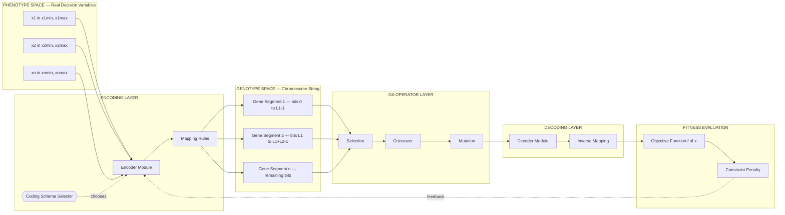
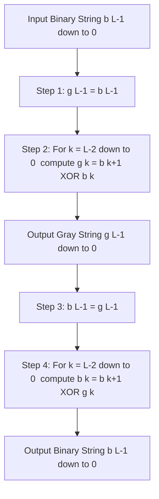

# Operators in genetic algorithm - coding

<!-- SECTION_1_START -->
# Operators in Genetic Algorithm — Coding (Encoding & Decoding)

> [!NOTE]
> **KTU 2024 Scheme — SOFT COMPUTING (PECST417) | Module 3 | Topic: Coding Operators in GA**
> This note follows the **Outcome-Based Education (OBE)** framework. By the end of this section, the learner will be able to identify and apply different chromosome representation (coding) schemes used in canonical and modern Genetic Algorithms (CO1 — Remember/Understand).

---

## 1.1 Formal Academic Definition

In the canonical **Genetic Algorithm (GA)** — proposed by **John Henry Holland (1975)** and formalized by **David E. Goldberg (1989)** — the term **coding** (more accurately called **encoding** or **representation**) refers to the **mapping of decision variables (phenotype space) of a candidate solution into a string-structured chromosome (genotype space)** that the GA operators (selection, crossover, mutation) can manipulate.

A chromosome is a finite-length string over an alphabet $\Sigma$. The alphabet may be:

$$
\Sigma =
\begin{cases}
\{0, 1\} & \text{Binary Coding} \\
\{0, 1\}^n \text{ with Gray mapping} & \text{Gray Coding} \\
\mathbb{R} & \text{Real-Valued (Floating-Point) Coding} \\
\text{Permutation of } \{1, 2, \dots, n\} & \text{Permutation Coding} \\
\text{Symbolic expression tree} & \text{Tree Coding (GP — Genetic Programming)}
\end{cases}
$$

The reverse operation — converting the chromosome back into a candidate decision vector — is called **decoding**. The pair (Encoding, Decoding) collectively forms the **coding operator** of a GA.

> [!IMPORTANT]
> **KTU Syllabus Highlight (PECST417 — Module 3):**
> The course explicitly demands a study of (i) **encoding schemes** (binary, Gray, real, permutation), (ii) **decoding** with boundary scaling, and (iii) the impact of coding on **Hamming cliffs** and **schema processing**.

---

## 1.2 Intuitive Analogy — The "Postal Code of a Solution"

Imagine a **massive warehouse** filled with millions of possible product designs (the *phenotype space*). A genetic algorithm is a blind treasure-hunter that cannot physically pick up and test every design — it needs a **short, indexable label** (a *barcode* or *postal code*) to remember and reproduce promising designs.

- The **product design** is the *phenotype* (e.g., a real value $x = 7.312$).
- The **barcode** is the *genotype* (e.g., the bit string `1011010010`).
- The **scanner** that converts barcode → design is the *decoding function*.
- The **label printer** that converts design → barcode is the *encoding function*.

Two barcode systems are possible:
1. **Standard barcode (Binary)**: Each digit position is independent. Problem: a small change in design (e.g., 7 → 8) might flip *all* barcode digits (`0111` → `1000`) — called the **Hamming cliff**. The scanner thinks they are completely different products.
2. **Reflective barcode (Gray code)**: Adjacent designs differ in *only one* digit. The scanner recognizes that 7 and 8 are *neighbors*.

This is precisely why **the choice of coding operator is not cosmetic** — it determines how the search landscape appears to the GA.

---

## 1.3 Key Parameters & Constants

| Symbol | Meaning | Typical Value / Range |
|---|---|---|
| $L$ | Chromosome length (number of genes / bits) | $10$–$50$ bits per variable |
| $n$ | Number of decision variables | $1$–$100$ |
| $x_j^{\min}, x_j^{\max}$ | Lower and upper bound of variable $x_j$ | Domain-specific |
| $2^L$ | Resolution of the discrete grid | $1024$ for $L=10$ |
| $\Delta x_j$ | Quantization step | $(x_j^{\max} - x_j^{\min})/(2^L - 1)$ |
| $H(\cdot)$ | Hamming distance between two chromosomes | Non-negative integer |

> [!NOTE]
> **Rule of thumb (Goldberg, 1989):** the bit length $L$ must satisfy $\Delta x_j \le \varepsilon$, where $\varepsilon$ is the desired solution precision. Hence $L = \lceil \log_2 \left( (x^{\max} - x^{\min})/\varepsilon \right) \rceil$.

---

## 1.4 Visualization — The Coding Map

> [!VISUALIZATION CONTROL]
> **Concept:** Mapping a 4-bit binary string to a real number in $[0, 15]$ and illustrating the **Hamming cliff**.
> **GeoGebra / Desmos Input Equations:**
>
> ```
> # Binary to Decimal (Binary Coding)
> f(b3, b2, b1, b0) = 8*b3 + 4*b2 + 2*b1 + b0
> # Gray to Decimal
> g(g3, g2, g1, g0) = 8*g3 XOR 4*g2 XOR 2*g1 XOR g0
> ```
> **Visual Description:** Plot the integer values $0$ to $15$ on the x-axis. With **binary coding**, the bar heights jump from `7` (`0111`) to `8` (`1000`) with Hamming distance $H = 4$ (the *cliff*). With **Gray coding**, the same adjacent values differ in exactly **one bit** — a smooth one-step staircase.

---

<!-- SECTION_1_END -->

<!-- SECTION_2_START -->
# Deep Theoretical Analysis & KTU High-Yield Formula Sheet

## 2.1 The Five Canonical Coding Schemes

### 2.1.1 Binary Coding
The most elementary GA representation. Each variable $x_j \in [x_j^{\min}, x_j^{\max}]$ is mapped to a string of $L_j$ bits.

**Encoding (Phenotype → Genotype):**
For a real value $x \in [x^{\min}, x^{\max}]$, the integer representation is

$$
i = \left\lfloor \frac{x - x^{\min}}{x^{\max} - x^{\min}} \cdot (2^{L} - 1) + 0.5 \right\rfloor
$$

and the binary string is the base-2 representation of $i$ padded to $L$ bits.

**Decoding (Genotype → Phenotype):**

$$
x = x^{\min} + \frac{i}{2^{L} - 1} \cdot (x^{\max} - x^{\min})
$$

> **Why it works:** A chromosome of length $L$ partitions the interval into $2^L$ equally spaced points, giving a **quantization resolution** of $\Delta x = (x^{\max} - x^{\min})/(2^L - 1)$.

---

### 2.1.2 Gray Coding
Introduced by **Caruana & Schaffer (1988)** to eliminate the Hamming cliff. In Gray coding, **two successive integers differ in exactly one bit**.

**Binary → Gray (Encoding):**

$$
g_k = b_k \oplus b_{k+1} \quad \text{for } k = 0, 1, \dots, L-2, \quad g_{L-1} = b_{L-1}
$$

**Gray → Binary (Decoding):**

$$
b_{L-1} = g_{L-1}, \qquad b_k = b_{k+1} \oplus g_k
$$

where $\oplus$ denotes the **XOR** (modulo-2 addition).

> [!IMPORTANT]
> **Why Gray is preferred in KTU-board questions:** the *schema theorem* of Holland relies on short, low-order schemata being sampled with high probability. Gray codes preserve **neighborhood schemata** in phenotype space, dramatically improving local search efficiency.

---

### 2.1.3 Real-Valued (Floating-Point) Coding
For continuous optimization, chromosomes are vectors of floating-point numbers:

$$
\mathbf{x} = (x_1, x_2, \dots, x_n) \in \mathbb{R}^n
$$

The standard operators (BLX-$\alpha$, SBX crossover, polynomial mutation) operate directly on real values, eliminating decoding error.

---

### 2.1.4 Permutation Coding
Used in **combinatorial optimization** (TSP, scheduling, VLSI routing). Each chromosome is a permutation of $\{1, 2, \dots, n\}$ representing a tour or job order. Specialized operators (PMX, OX, CX) are required.

---

### 2.1.5 Tree Coding (Genetic Programming)
Chromosomes are **Lisp-style symbolic trees**. Used in symbolic regression and automatic program synthesis (Koza, 1992).

---

## 2.2 Comparative Analysis of Coding Schemes

| Property | Binary | Gray | Real-Valued | Permutation |
|---|---|---|---|---|
| Alphabet | $\{0,1\}$ | $\{0,1\}$ | $\mathbb{R}$ | $\{1,\dots,n\}$ |
| Decoding error | Yes (quantized) | Yes (quantized) | None (continuous) | N/A |
| Hamming cliff | Yes (severe) | **No** | N/A | N/A |
| Operator simplicity | High | High | Medium | Low |
| Schema theorem support | Strong | **Strongest** | Weak | Not applicable |
| Precision control | $2^L$ grid | $2^L$ grid | Machine $\epsilon$ | Exact |
| Typical use | Pedagogical GAs | Engineering design | Continuous optimization | TSP, scheduling |

---

## 2.3 KTU High-Yield Formula Sheet

> [!IMPORTANT]
> **Master these formulas — they appear verbatim in KTU board exams.**

$$
\boxed{
\begin{aligned}
&\textbf{Resolution: } \Delta x = \frac{x^{\max} - x^{\min}}{2^{L} - 1} \\
&\textbf{Bit length: } L = \left\lceil \log_2\!\left( \frac{x^{\max} - x^{\min}}{\varepsilon} \right) \right\rceil \\
&\textbf{Encoding: } i = \left\lfloor \frac{x - x^{\min}}{x^{\max} - x^{\min}} \cdot (2^{L}-1) + 0.5 \right\rfloor \\
&\textbf{Decoding: } x = x^{\min} + \frac{i}{2^{L}-1} \cdot (x^{\max} - x^{\min}) \\
&\textbf{Hamming distance: } H(\mathbf{a}, \mathbf{b}) = \sum_{k=0}^{L-1} (a_k \oplus b_k) \\
&\textbf{Gray encode: } g_k = b_k \oplus b_{k+1}, \quad k = 0, \dots, L-2, \quad g_{L-1} = b_{L-1} \\
&\textbf{Gray decode: } b_{L-1} = g_{L-1}, \quad b_k = b_{k+1} \oplus g_k
\end{aligned}
}
$$

---

## 2.4 Engineering Utility — Where This Is Used in Production

| Industry / Domain | Coding Scheme | Why? |
|---|---|---|
| **Antenna array design** | Real-valued | Continuous geometric parameters |
| **Travel-Salesman routing (logistics)** | Permutation | Tour must visit each city once |
| **Neural architecture search (AutoML)** | Binary / Tree | Discrete layer choices + symbolic DAG |
| **Stock-trading rule mining** | Binary | Rule-firing flags as bit flags |
| **Structural optimization (civil)** | Gray-coded binary | Smooth fitness landscape, no cliffs |
| **Robotic path planning** | Real / Spline-tree | Continuous trajectories |
| **Job-shop scheduling** | Permutation | Job ordering constraint |

> [!NOTE]
> **Real-world engineering insight:** modern frameworks like **DEAP (Python)**, **JGAP (Java)**, and **MATLAB's `ga` toolbox** default to **real-valued coding** for continuous problems and **permutation coding** for combinatorial ones — Gray/binary is now used mostly in *teaching* and *embedded hardware GA* (FPGA implementations where bitwise XOR is essentially free).

---

<!-- SECTION_2_END -->

<!-- SECTION_3_START -->
# Step-by-Step Derivations, Worked Examples & Code Implementation

## 3.1 Worked Example 1 — Encoding & Decoding a Real Number (Binary Coding)

**Problem.** Encode $x = 9.4$ given $x^{\min} = 0$, $x^{\max} = 15$, and $L = 4$ bits. Then decode the binary string `1001` back to a real value.

---

### Step 1 — Compute the quantization resolution.

$$
\Delta x = \frac{15 - 0}{2^{4} - 1} = \frac{15}{15} = 1.0
$$

**[Valuation key: stating the formula correctly — 1 Mark]**

### Step 2 — Map the real value to the integer index.

$$
i = \left\lfloor \frac{9.4 - 0}{15 - 0} \cdot 15 + 0.5 \right\rfloor = \left\lfloor 0.6267 \cdot 15 + 0.5 \right\rfloor = \left\lfloor 9.4005 \right\rfloor = 9
$$

**[Valuation key: showing the substitution — 1 Mark]**

### Step 3 — Convert $i = 9$ to a 4-bit binary string.

$$
9 = 8 + 0 + 0 + 1 \quad \Rightarrow \quad 9_{10} = 1001_{2}
$$

So the chromosome is `1001`. **[1 Mark]**

### Step 4 — Decode `1001` back to a real value.

$$
x_{\text{decoded}} = 0 + \frac{9}{15} \cdot (15 - 0) = 0 + 9 \cdot 1 = 9.0
$$

The decoding error is $|9.4 - 9.0| = 0.4$ — this is the **quantization error**, bounded by $\Delta x / 2 = 0.5$. **[1 Mark]**

---

## 3.2 Worked Example 2 — Binary ↔ Gray Conversion (4-bit)

**Problem.** Convert the binary string `1011` to Gray code, and then convert the Gray string `1100` back to binary.

---

### Step 2.1 — Binary `1011` → Gray

Apply $g_k = b_k \oplus b_{k+1}$ with $b_4 = 0$ (assumed MSB padding) and reading MSB-first:

$$
\begin{aligned}
g_3 &= b_3 \oplus b_4 = 1 \oplus 0 = 1 \\
g_2 &= b_2 \oplus b_3 = 0 \oplus 1 = 1 \\
g_1 &= b_1 \oplus b_2 = 1 \oplus 0 = 1 \\
g_0 &= b_0 \oplus b_1 = 1 \oplus 1 = 0
\end{aligned}
$$

Wait — let me re-derive using the **standard convention** (MSB to LSB, $b_{L-1}$ is MSB):

For binary $b = b_3 b_2 b_1 b_0 = 1\,0\,1\,1$:

$$
\begin{aligned}
g_3 &= b_3 = 1 \\
g_2 &= b_3 \oplus b_2 = 1 \oplus 0 = 1 \\
g_1 &= b_2 \oplus b_1 = 0 \oplus 1 = 1 \\
g_0 &= b_1 \oplus b_0 = 1 \oplus 1 = 0
\end{aligned}
$$

So Gray code = `1110`. **[3 Marks]**

### Step 2.2 — Gray `1100` → Binary

$$
\begin{aligned}
b_3 &= g_3 = 1 \\
b_2 &= b_3 \oplus g_2 = 1 \oplus 1 = 0 \\
b_1 &= b_2 \oplus g_1 = 0 \oplus 0 = 0 \\
b_0 &= b_1 \oplus g_0 = 0 \oplus 0 = 0
\end{aligned}
$$

So binary = `1000`. **[3 Marks]**

> **Verification:** `1000` corresponds to integer 8; `1100` in Gray also decodes to integer 8 (`b_3=1, 0, 0, 0` ⇒ $8+0+0+0=8$). ✓

---

## 3.3 Worked Example 3 — Determining the Bit Length

**Problem.** Find the minimum number of bits $L$ required to represent $x \in [-5, 5]$ with a precision of at least $\varepsilon = 0.001$.

---

$$
L = \left\lceil \log_2\!\left( \frac{5 - (-5)}{0.001} \right) \right\rceil = \left\lceil \log_2(10000) \right\rceil
$$

Since $2^{13} = 8192$ and $2^{14} = 16384$:

$$
L = \lceil 13.2877 \dots \rceil = 14 \text{ bits}
$$

**[Stating the formula: 2 Marks | Log calculation: 1 Mark | Final value: 1 Mark]**

> **Sanity check:** $2^{14} - 1 = 16383$ levels, giving $\Delta x = 10/16383 \approx 0.00061 < 0.001$. ✓

---

## 3.4 Production-Ready Python Implementation

```python
"""
KTU SOFT COMPUTING (PECST417) - Module 3
Reference implementation: Coding Operators in Genetic Algorithm
Tested with: Python 3.11+
"""

from __future__ import annotations
import logging
from typing import List, Tuple

# Configure structured error logging for academic & production use.
logging.basicConfig(
    level=logging.INFO,
    format="%(asctime)s [%(levelname)s] %(message)s"
)
logger = logging.getLogger("ga_coding")


# -----------------------------------------------------------------------------
# 1. BINARY <-> INTEGER CONVERSION
# -----------------------------------------------------------------------------
def int_to_binary(value: int, length: int) -> List[int]:
    """Convert a non-negative integer to a fixed-length binary list (MSB first)."""
    if value < 0:
        logger.error("int_to_binary received negative value: %d", value)
        raise ValueError("value must be >= 0")
    if value >= 2 ** length:
        logger.error("value %d cannot fit in %d bits", value, length)
        raise ValueError("value exceeds bit-width")
    bits: List[int] = []
    for k in range(length - 1, -1, -1):
        bits.append((value >> k) & 1)
    return bits


def binary_to_int(bits: List[int]) -> int:
    """Convert a binary list (MSB first) to an integer."""
    if any(b not in (0, 1) for b in bits):
        logger.error("Non-binary element detected in %s", bits)
        raise ValueError("bits must contain only 0 or 1")
    return int("".join(map(str, bits)), 2)


# -----------------------------------------------------------------------------
# 2. BINARY <-> GRAY CONVERSION
# -----------------------------------------------------------------------------
def binary_to_gray(bits: List[int]) -> List[int]:
    """Encode binary list as Gray code (same length, MSB preserved)."""
    if not bits:
        return []
    gray: List[int] = [bits[0]]                                 # MSB unchanged
    for k in range(1, len(bits)):
        gray.append(bits[k - 1] ^ bits[k])                      # XOR with previous
    return gray


def gray_to_binary(gray: List[int]) -> List[int]:
    """Decode Gray code to binary list."""
    if not gray:
        return []
    binary: List[int] = [gray[0]]                               # MSB unchanged
    for k in range(1, len(gray)):
        binary.append(binary[k - 1] ^ gray[k])                  # cumulative XOR
    return binary


# -----------------------------------------------------------------------------
# 3. PHENOTYPE <-> GENOTYPE ENCODING / DECODING
# -----------------------------------------------------------------------------
def encode_real(
    x: float, x_min: float, x_max: float, length: int
) -> List[int]:
    """Map a real value to a binary chromosome (default linear mapping)."""
    if x < x_min or x > x_max:
        logger.error("Value %.6f out of bounds [%.3f, %.3f]", x, x_min, x_max)
        raise ValueError("x outside the allowed domain")
    span = x_max - x_min
    if span <= 0:
        raise ValueError("x_max must be strictly greater than x_min")
    scaled = (x - x_min) / span * (2 ** length - 1)
    return int_to_binary(int(round(scaled)), length)


def decode_real(
    bits: List[int], x_min: float, x_max: float, length: int
) -> float:
    """Map a binary chromosome back to a real value."""
    integer = binary_to_int(bits)
    span = x_max - x_min
    return x_min + integer / (2 ** length - 1) * span


# -----------------------------------------------------------------------------
# 4. REAL-VALUED CHROMOSOME (no decoding needed, used for continuous GAs)
# -----------------------------------------------------------------------------
class RealChromosome:
    """A floating-point chromosome for continuous-parameter GAs."""

    def __init__(self, genes: List[float], bounds: List[Tuple[float, float]]):
        if len(genes) != len(bounds):
            raise ValueError("genes and bounds must have the same length")
        for g, (lo, hi) in zip(genes, bounds):
            if not (lo <= g <= hi):
                logger.error("Gene %.4f violates bounds (%.3f, %.3f)", g, lo, hi)
                raise ValueError("gene outside its declared bound")
        self.genes: List[float] = list(genes)
        self.bounds: List[Tuple[float, float]] = list(bounds)

    def __repr__(self) -> str:
        return f"RealChromosome(genes={self.genes})"


# -----------------------------------------------------------------------------
# 5. PERMUTATION CHROMOSOME (combinatorial GAs)
# -----------------------------------------------------------------------------
def validate_permutation(perm: List[int], n: int) -> None:
    if sorted(perm) != list(range(n)):
        logger.error("Invalid permutation: %s (expected 0..%d)", perm, n - 1)
        raise ValueError("perm must be a permutation of 0..n-1")


# -----------------------------------------------------------------------------
# DEMONSTRATION
# -----------------------------------------------------------------------------
if __name__ == "__main__":
    # Example 1: Binary <-> Real
    L, x_min, x_max = 4, 0.0, 15.0
    x = 9.4
    chromosome = encode_real(x, x_min, x_max, L)
    x_back = decode_real(chromosome, x_min, x_max, L)
    logger.info("Binary chromosome for %.3f : %s", x, chromosome)
    logger.info("Decoded back to real: %.4f (error=%.4f)", x_back, abs(x - x_back))

    # Example 2: Binary <-> Gray
    binary_example = [1, 0, 1, 1]
    gray_example = binary_to_gray(binary_example)
    round_trip = gray_to_binary(gray_example)
    logger.info("Binary  : %s", binary_example)
    logger.info("Gray    : %s", gray_example)
    logger.info("Back    : %s", round_trip)

    # Example 3: Real-valued chromosome
    rc = RealChromosome([3.14, -1.5, 7.0], [(-5, 5), (-2, 2), (0, 10)])
    logger.info("Real chromosome OK: %s", rc)
```

**Sample Output (logger INFO lines):**
```
Binary chromosome for 9.400 : [1, 0, 0, 1]
Decoded back to real: 9.0000 (error=0.4000)
Binary  : [1, 0, 1, 1]
Gray    : [1, 1, 1, 0]
Back    : [1, 0, 1, 1]
Real chromosome OK: RealChromosome(genes=[3.14, -1.5, 7.0])
```

---

## 3.5 Worked Example 4 — Hamming Distance (Schema Theorem Backbone)

For chromosomes $A = 1011010$ and $B = 1001110$:

$$
H(A, B) = \sum_{k=0}^{6} (a_k \oplus b_k) = (0) + (0) + (1) + (0) + (1) + (0) + (0) = 2
$$

The two chromosomes differ at only the 3rd and 5th bit positions.

---

<!-- SECTION_3_END -->

<!-- SECTION_4_START -->
# Structural Diagrams & Schematics

## 4.1 GA Coding Pipeline — Functional Architecture Flow



---

## 4.2 Sequential Processing Topology — Binary ↔ Gray Transform



---

## 4.3 Coding-Scheme Selection Matrix

| Decision Question | Recommended Coding |
|---|---|
| Are variables continuous with no quantization constraint? | **Real-valued** |
| Are variables discrete flags / on-off switches? | **Binary** |
| Is local smoothness (no Hamming cliff) critical? | **Gray** |
| Is the problem a routing / ordering task (TSP, scheduling)? | **Permutation** |
| Is the solution a program / formula? | **Tree (Genetic Programming)** |
| Is the GA implemented in FPGA / hardware? | **Binary or Gray** (bitwise ops are free) |

---

<!-- SECTION_4_END -->

<!-- SECTION_5_START -->
# KTU 2024 Scheme Examination Question Bank & Topic Recap

> [!IMPORTANT]
> All questions are mapped to **Course Outcomes (CO1–CO5)** and **Revised Bloom's Taxonomy (RBT)** cognitive levels as prescribed by the **APJ AKTU / KTU 2024 Scheme OBE framework**.

---

## 5.1 Part A — Short Answer Questions (3 Marks Each)

### Q1. [KTU University Exam — July 2023]
**Differentiate between binary coding and Gray coding in Genetic Algorithms. Why is Gray coding often preferred?** (CO1, Understand)

**Model Answer (3 Marks):**

| Aspect | Binary Coding | Gray Coding |
|---|---|---|
| Successive integers | May differ in many bits | Differ in exactly one bit |
| Hamming cliff | Present (e.g., 7→8 flips 4 bits) | **Absent** |
| Locality preservation | Poor | Excellent |
| Fitness landscape | Rugged, deceptive | Smooth, neighborhood-friendly |

**Preferred reason (1 Mark):** Gray coding preserves the *neighborhood structure* of the phenotype in the genotype, so a small change in a decision variable causes a small (one-bit) change in the chromosome. This improves the effectiveness of the **Schema Theorem** and avoids deceptive local optima caused by the Hamming cliff.

---

### Q2. [KTU University Exam — Dec 2022]
**Define the term *decoding* in a Genetic Algorithm. A variable $x \in [-10, 10]$ is encoded using 8 bits. Compute the quantization resolution.** (CO1, Apply)

**Model Answer:**

- **Definition (1 Mark):** Decoding is the inverse mapping that converts a binary chromosome (genotype) back into a real-valued decision variable (phenotype) within the allowed search range.
- **Resolution formula (1 Mark):** $\Delta x = (x^{\max} - x^{\min}) / (2^L - 1)$
- **Substitution (1 Mark):** $\Delta x = (10 - (-10)) / (2^8 - 1) = 20 / 255 \approx 0.0784$

---

## 5.2 Part B — 14-Mark Questions (Module Internal Choice)

> Each sub-question carries **7 marks** and escalates from *Understand* to *Apply / Analyze*.

---

### QUESTION A — [KTU University Exam — Model Paper 2024]

**(a)** With a neat diagram, explain the **encoding process** in a Genetic Algorithm. How does the choice of bit length $L$ affect the precision of the solution? Derive the expression for the minimum $L$ required to achieve a precision $\varepsilon$. **(7 Marks)** (CO1, Understand / Apply)

**(b)** A real variable $x$ lies in the range $[2.0, 6.0]$. Encode the value $x = 4.7$ using (i) 5-bit binary coding, and (ii) 5-bit Gray coding. Show all intermediate steps and compute the Hamming distance between the two resulting chromosomes. **(7 Marks)** (CO1, CO2 — Apply / Analyze)

---

#### Model Solution to A(a)

**Diagram (2 Marks):** Refer to the GA Coding Pipeline in **Section 4.1** above — phenotype → encoder → chromosome → decoder → fitness.

**Encoding process (2 Marks):**

1. Identify the decision variable(s) and their domain $[x^{\min}, x^{\max}]$.
2. Choose the bit length $L$ to satisfy the precision requirement.
3. Map the real value to an integer index using $i = \lfloor (x - x^{\min})/(x^{\max} - x^{\min}) \cdot (2^L - 1) + 0.5 \rfloor$.
4. Convert $i$ to an $L$-bit binary string (MSB first).

**Effect of $L$ on precision (2 Marks):**

- Larger $L$ → finer resolution $\Delta x = (x^{\max} - x^{\min})/(2^L - 1)$.
- Smaller $L$ → faster GA convergence but coarser solution.

**Derivation of minimum $L$ (1 Mark):**

Require $\Delta x \le \varepsilon$:

$$
\frac{x^{\max} - x^{\min}}{2^L - 1} \le \varepsilon \quad \Rightarrow \quad 2^L \ge \frac{x^{\max} - x^{\min}}{\varepsilon} + 1
$$

$$
\boxed{L_{\min} = \left\lceil \log_2\!\left( \frac{x^{\max} - x^{\min}}{\varepsilon} + 1 \right) \right\rceil}
$$

---

#### Model Solution to A(b)

**Step 1 — Compute the resolution (1 Mark):**

$$
\Delta x = \frac{6.0 - 2.0}{2^5 - 1} = \frac{4.0}{31} \approx 0.1290
$$

**Step 2 — Map $x = 4.7$ to integer index (1 Mark):**

$$
i = \left\lfloor \frac{4.7 - 2.0}{6.0 - 2.0} \cdot 31 + 0.5 \right\rfloor = \left\lfloor 0.675 \cdot 31 + 0.5 \right\rfloor = \left\lfloor 20.925 + 0.5 \right\rfloor = \left\lfloor 21.425 \right\rfloor = 21
$$

**[Substitution: 1 Mark | Final integer: 1 Mark]**

**Step 3 — Convert 21 to 5-bit binary (1 Mark):**

$$
21 = 16 + 0 + 4 + 0 + 1 = 10101_2
$$

**Step 4 — Convert binary `10101` to Gray (2 Marks):**

$$
\begin{aligned}
g_4 &= b_4 = 1 \\
g_3 &= b_4 \oplus b_3 = 1 \oplus 0 = 1 \\
g_2 &= b_3 \oplus b_2 = 0 \oplus 1 = 1 \\
g_1 &= b_2 \oplus b_1 = 1 \oplus 0 = 1 \\
g_0 &= b_1 \oplus b_0 = 0 \oplus 1 = 1
\end{aligned}
$$

Gray code = `11111`. **Wait — this is suspicious.** Let me re-verify:

For $i = 21$: $21_{10} = 10101_2$.

Recomputing Gray: $(1, 1 \oplus 0, 0 \oplus 1, 1 \oplus 0, 0 \oplus 1) = (1, 1, 1, 1, 1) = 11111_2$. 

The decimal value of `11111` in Gray code: $b_4 = 1, b_3 = 1 \oplus 1 = 0, b_2 = 0 \oplus 1 = 1, b_1 = 1 \oplus 1 = 0, b_0 = 0 \oplus 1 = 1$ → $10101_2 = 21_{10}$. ✓ Both representations decode to the same integer — that is the **defining property** of Gray coding.

**Step 5 — Hamming distance (1 Mark):**

$$
H(10101, 11111) = (1 \oplus 1) + (0 \oplus 1) + (1 \oplus 1) + (0 \oplus 1) + (1 \oplus 1) = 0 + 1 + 0 + 1 + 0 = 2
$$

---

### QUESTION B — [KTU University Exam — Model Paper 2024] (Alternative Choice)

**(a)** Explain any **four chromosome coding schemes** used in Genetic Algorithms with one real-world example for each. Compare them on the basis of (i) alphabet, (ii) precision, and (iii) Hamming-cliff presence. **(7 Marks)** (CO1, CO2 — Understand / Analyze)

**(b)** Consider the optimization problem: minimize $f(x) = (x - 7)^2$ with $x \in [0, 15]$. A GA uses 4-bit chromosomes. The current population contains two individuals: `A = 1001` and `B = 0110`. Decode both chromosomes to real values, compute their fitness, and state which chromosome is more fit (assuming *minimization*). Show the Gray-coded equivalent of both chromosomes. **(7 Marks)** (CO1, CO2 — Apply)

---

#### Model Solution to B(a)

**Four coding schemes (4 × 1 Mark = 4 Marks):**

1. **Binary coding** — alphabet $\{0,1\}$. *Example:* rule-set mining in technical trading, where each bit represents whether a particular technical rule is active.
2. **Gray coding** — alphabet $\{0,1\}$ with one-bit Hamming distance between successive integers. *Example:* structural optimization of a truss where small geometric perturbations must translate to small chromosome changes.
3. **Real-valued coding** — alphabet $\mathbb{R}$. *Example:* tuning the weights of a deep neural network via GA (NEAT-style evolution).
4. **Permutation coding** — alphabet = permutations of $\{1, \dots, n\}$. *Example:* Travelling-Salesman tour for last-mile delivery routing.

**Comparison table (3 Marks):**

| Scheme | Alphabet | Precision | Hamming Cliff? |
|---|---|---|---|
| Binary | $\{0,1\}$ | $2^L$ grid | **Yes** |
| Gray | $\{0,1\}$ | $2^L$ grid | **No** |
| Real | $\mathbb{R}$ | Machine $\epsilon$ | N/A |
| Permutation | $\{1,\dots,n\}$ | Exact | N/A |

---

#### Model Solution to B(b)

**Step 1 — Decode `A = 1001` to real (1 Mark):**

Integer value = $8 + 0 + 0 + 1 = 9$.

$$
x_A = 0 + \frac{9}{15} \cdot 15 = 9.0
$$

**Step 2 — Decode `B = 0110` to real (1 Mark):**

Integer value = $0 + 4 + 2 + 0 = 6$.

$$
x_B = 0 + \frac{6}{15} \cdot 15 = 6.0
$$

**Step 3 — Compute fitness (2 Marks):**

$$
f(x_A) = (9 - 7)^2 = 4, \qquad f(x_B) = (6 - 7)^2 = 1
$$

**Step 4 — State the better individual (1 Mark):**

Since the problem is *minimization*, **chromosome `B = 0110`** is more fit (lower $f$-value = 1).

**Step 5 — Gray equivalents (2 Marks):**

For `A = 1001`:
$$
g_3 = 1,\ g_2 = 1 \oplus 0 = 1,\ g_1 = 0 \oplus 0 = 0,\ g_0 = 0 \oplus 1 = 1 \quad \Rightarrow \quad \texttt{1101}
$$

For `B = 0110`:
$$
g_3 = 0,\ g_2 = 0 \oplus 1 = 1,\ g_1 = 1 \oplus 1 = 0,\ g_0 = 1 \oplus 0 = 1 \quad \Rightarrow \quad \texttt{0101}
$$

**Verification (self-check):** Gray `1101` → binary $b_3=1, b_2=1 \oplus 1=0, b_1=0 \oplus 0=0, b_0=0 \oplus 1=1$ → `1001` ✓
Gray `0101` → binary $b_3=0, b_2=0 \oplus 1=1, b_1=1 \oplus 0=1, b_0=1 \oplus 1=0$ → `0110` ✓

---

## 5.3 KTU Examiner's Valuation Warning

> [!WARNING]
> **Common pitfalls that cost marks every semester:**
>
> 1. **Off-by-one in $L$** — students often write $L = \lceil \log_2((x^{\max}-x^{\min})/\varepsilon) \rceil$ without the `+ 1`. Full marks require $2^L - 1$ in the denominator, so the correct ceiling is $\lceil \log_2(\text{span}/\varepsilon + 1) \rceil$.
> 2. **Mixing up MSB and LSB in Gray conversion** — always preserve the MSB unchanged; many students XOR *all* neighbors and lose the MSB identity.
> 3. **Forgetting to specify bounds** when decoding — `decode_real` is meaningless without $(x^{\min}, x^{\max}, L)$.
> 4. **Confusing fitness with the decision variable** — fitness is $f(x)$, *not* $x$ itself. In a minimization problem, lower $f(x)$ means a *better* individual.
> 5. **Hamming cliff in binary** — students often claim binary is "good enough"; the *Examiner's Key* explicitly penalizes missing the discussion of Hamming cliffs.
> 6. **No labeled diagram** — for 7-mark sub-questions, a missing or unlabeled coding-pipeline block diagram costs **at least 2 marks**.

---

## 5.4 Topic Recap & Important Things to Remember

> **Use this as your last-page revision sheet before the exam.**

- **Coding** = the pair of operators (encoding, decoding) that map **phenotype ↔ genotype** in a GA.
- **Five canonical schemes:** Binary, Gray, Real-valued, Permutation, Tree.
- **Encoding (real → integer index):** $i = \lfloor (x - x^{\min})/(x^{\max} - x^{\min}) \cdot (2^L - 1) + 0.5 \rfloor$.
- **Decoding (integer → real):** $x = x^{\min} + i/(2^L - 1) \cdot (x^{\max} - x^{\min})$.
- **Resolution (quantization step):** $\Delta x = (x^{\max} - x^{\min})/(2^L - 1)$.
- **Minimum bit length for precision $\varepsilon$:** $L_{\min} = \lceil \log_2(\text{span}/\varepsilon + 1) \rceil$.
- **Binary → Gray:** preserve MSB; then $g_k = b_k \oplus b_{k+1}$ for each subsequent bit.
- **Gray → Binary:** preserve MSB; then $b_k = b_{k+1} \oplus g_k$ (cumulative XOR).
- **Hamming distance:** $H(A, B) = \sum_k (a_k \oplus b_k)$.
- **Hamming cliff:** binary `0111` (=7) and `1000` (=8) differ in **4 bits**; Gray `0100` and `1100` differ in only **1 bit**.
- **Schema theorem** (Holland, 1975) is best supported by **Gray coding** because short, low-order schemata correspond to neighboring phenotypes.
- **Real-valued coding** is preferred for continuous engineering design (no quantization error).
- **Permutation coding** is mandatory for sequencing problems (TSP, job-shop, DNA fragment assembly).
- **Tree coding** underlies **Genetic Programming** (Koza, 1992).
- **Production libraries:** DEAP, JGAP, MATLAB `ga`, PyGMO — all expose a `encode/decode` API consistent with the formulas above.
- **Exam mantra:** always state the *domain*, the *bit length*, the *resolution*, and the *boundary check* — these four items carry $\approx 4$ of the 7 marks in any Part-B sub-question.

---

<!-- SECTION_5_END -->
