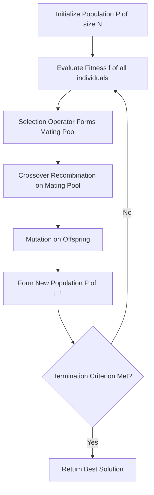
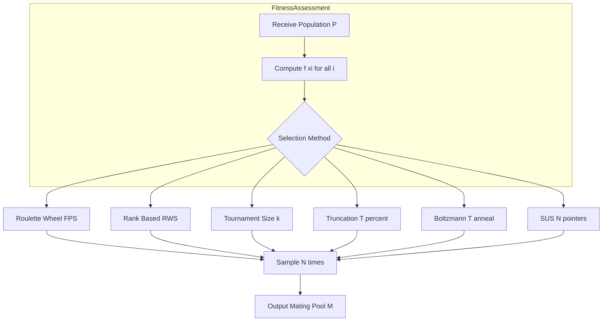
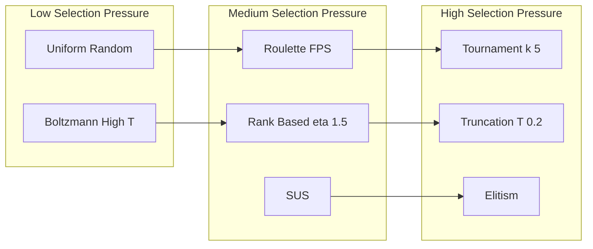
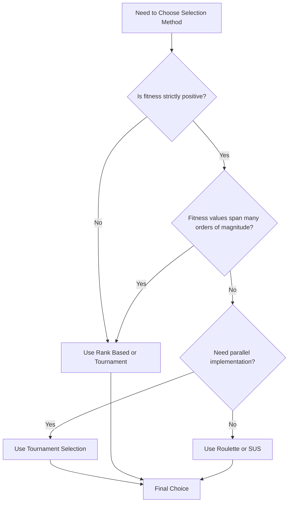
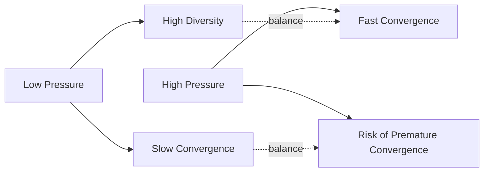

# selection

<!-- SECTION_1_START -->
# Selection in Evolutionary Computing

## 1. Core Technical Definition

> [!IMPORTANT]
> **Selection** is the *stochastic operator* in an Evolutionary Algorithm (EA) that probabilistically chooses parent individuals from the current population for recombination (crossover) based on their **fitness values**, thereby biasing the search process toward promising regions of the solution space while preserving the principle of *survival of the fittest*.

In the canonical **Genetic Algorithm (GA)** framework, after fitness evaluation of every chromosome in the population, the selection operator forms a **mating pool** of size $N$ (the population size) where individuals with higher fitness are more likely (though not guaranteed) to be chosen. The selected individuals then undergo crossover and mutation to produce offspring for the next generation.

Mathematically, the selection operator is a **mapping**:
$$\text{Sel}: P(t) = \{x_1, x_2, \dots, x_N\} \longrightarrow P'(t) = \{x_{i_1}, x_{i_2}, \dots, x_{i_N}\}$$
where each $x_{i_k} \in P(t)$ may appear multiple times, with probability proportional to a function of its fitness $f(x_{i_k})$.

### Conceptual Analogy — "The Nature's Interview Room"

Imagine a wildlife reserve with $N$ animals competing for limited food. Each animal has a **fitness score** based on how healthy, fast, and adaptive it is. A wildlife officer (the *selection operator*) randomly draws names from a hat, but the hat is *weighted*: a stronger, faster animal gets more slips of paper with its name. Animals drawn are allowed to **reproduce** and pass their traits to the next generation. Weak animals may still occasionally be drawn (maintaining genetic diversity), but on average, the gene pool shifts toward stronger traits over generations.

This is exactly how evolutionary selection works in EAs:
- **Population** $\to$ group of candidate solutions.
- **Fitness** $\to$ quality measure of how "good" a solution is.
- **Selection pressure** $\to$ how strongly the algorithm favors the fittest.
- **Stochasticity** $\to$ randomness that prevents premature convergence.

> [!NOTE]
> **Selection does NOT create new individuals.** It only chooses *which* existing individuals get to reproduce. The actual generation of new solutions is the job of **crossover** (Module 3.2) and **mutation** (Module 3.3).

## 2. Key Parameters of Selection Operators

Any selection mechanism is characterized by four canonical properties (formally defined by Goldberg & Deb, 1991):

| Property | Symbol | Meaning |
|----------|--------|---------|
| **Selection Intensity** | $I$ | Expected mean fitness of the selected pool vs. population mean |
| **Selection Pressure** | — | Ratio of probability of selecting best vs. average individual |
| **Selection Bias** | — | Absolute difference between actual and expected reproduction rate |
| **Spread** | — | Range of possible number of offspring of any individual |
| **Loss of Diversity** | — | Proportion of population NOT selected in one generation |
| **Takeover Time** | $t^*$ | Generations for the best individual to dominate the population under selection alone |

> [!TIP]
> KTU examiners frequently test the **relationship between selection pressure and convergence speed**. Higher selection pressure $\Rightarrow$ faster convergence but higher risk of **premature convergence** (getting stuck in local optima).

## 3. Visualization Control

> [!VISUALIZATION CONTROL]
> **Concept:** Roulette Wheel Probability Distribution for Fitness-Proportional Selection
> **GeoGebra / Desmos Input Equations:**
> * `f(x) = piecewise(0 <= x <= 1, 4x^3, 1 < x <= 2, 4(2-x)^3)` (Bezier-style fitness curve)
> * Points: `(0, 0), (0.25, 0.0625), (0.5, 0.25), (0.75, 0.5625), (1, 1)` (selection probability cumulative)
> **Visual Description:** Plot a fitness function $f(x)$ and its normalized cumulative distribution $F(x) = \frac{\int_0^x f(t)\,dt}{\int_0^1 f(t)\,dt}$. The wider the gap between $F(x_i)$ and $F(x_{i+1})$ for fitter individuals, the larger their *sweep area* on the roulette wheel — and thus their selection probability.

<!-- SECTION_1_END -->

<!-- SECTION_2_START -->
# Deep Theoretical Analysis & KTU High-Yield Formula Sheet

## 1. The Operational Pipeline of Selection

The selection operator executes through the following logical steps:

1. **Evaluate Fitness:** Compute $f(x_i)$ for all individuals $x_i \in P(t)$.
2. **Compute Selection Probability:** For each individual, derive $p_i$, the probability of being selected.
3. **Stochastic Sampling:** Repeatedly draw $N$ individuals according to $\{p_i\}$ (with or without replacement).
4. **Form Mating Pool:** The selected multiset $P'(t)$ is passed to the crossover stage.
5. **Preserve Elitism (optional):** A fraction of the *best-ever* individuals is copied unchanged to the next generation.

> [!NOTE]
> Selection is **always** applied *before* crossover. Some EAs (e.g., steady-state GAs) interleave selection with replacement, but the principle remains the same.

## 2. Classification of Selection Mechanisms

The major families of selection operators are:

### A. Fitness-Proportional Selection (FPS) — "Roulette Wheel"
Each individual is assigned a slice of a virtual roulette wheel proportional to its fitness. The wheel is spun $N$ times.

$$p_i = \frac{f(x_i)}{\sum_{j=1}^{N} f(x_j)}$$

**Drawback:** Sensitive to **fitness scaling** — a few super-fit individuals dominate, weak ones get zero chance. Also, fitness values must be strictly positive.

### B. Rank-Based Selection (RWS)
Individuals are sorted by fitness and assigned probabilities based on their *rank* rather than raw fitness.

$$p_i = \frac{1}{N}\left(\eta^+ - (\eta^+ - \eta^-)\cdot \frac{r_i - 1}{N - 1}\right)$$

where $r_i$ is the rank (1 = best), and $1.0 \le \eta^+ \le 2.0$ typically. $\eta^- = 2 - \eta^+$.

**Advantage:** Robust to fitness scaling, allows tuning selection pressure via $\eta^+$.

### C. Tournament Selection
Randomly pick $k$ individuals (with replacement); the *best* among them is selected. Repeat $N$ times.

Probability that individual $x_i$ of rank $r_i$ wins a size-$k$ tournament:
$$P(x_i \text{ wins}) = \frac{(N - r_i)^{k} - (N - r_i - 1)^{k}}{N^{k}}$$

**Advantage:** No global fitness comparison needed; trivially parallelizable; tunable via $k$ (larger $k$ = higher pressure).

### D. Truncation Selection
The top $T\%$ of the population (e.g., top 50%) is selected uniformly at random to form the next generation (often repeated multiple times to refill the pool). Common in **Evolution Strategies (ES)** and Genetic Programming.

**Selection Intensity** for truncation at fraction $T$:
$$I(T) = \frac{\phi(\Phi^{-1}(1 - T))}{T}$$

where $\phi$ is the standard normal PDF and $\Phi^{-1}$ is the inverse CDF.

### E. Boltzmann Selection
Selection pressure is annealed using a temperature parameter $T$ that decreases over generations:
$$p_i(T) = \frac{\exp\!\left(\frac{f(x_i)}{T}\right)}{\sum_{j=1}^{N} \exp\!\left(\frac{f(x_j)}{T}\right)}$$

As $T \to 0$, behavior approaches elitism; as $T \to \infty$, selection becomes uniform random.

### F. Stochastic Universal Sampling (SUS)
A single spin of a *multi-armed* roulette wheel with $N$ equally spaced pointers. Guarantees that the *expected* number of selections for individual $x_i$ is exactly $N \cdot p_i$ in one draw. Reduces **spread** compared to plain FPS.

## 3. KTU High-Yield Formula Sheet

| Formula | Description | Variables |
|---------|-------------|-----------|
| $p_i = \frac{f(x_i)}{\sum_{j=1}^{N} f(x_j)}$ | Fitness-Proportional Selection probability | $f(x_i)$ = fitness of $x_i$ |
| $p_i = \frac{1}{N}\left(\eta^+ - (\eta^+ - \eta^-)\cdot \frac{r_i - 1}{N - 1}\right)$ | Linear Ranking Selection probability | $r_i$ = rank, $\eta^+ \in [1, 2]$ |
| $P(\text{win}) = \frac{(N - r_i)^{k} - (N - r_i - 1)^{k}}{N^{k}}$ | Tournament (size $k$) win probability | $k$ = tournament size |
| $t^* = \frac{\ln(\lambda)}{\ln(1 + I \cdot c / \sigma)}$ | **Takeover Time** for tournament selection | $I$ = selection intensity, $c$ = proportionality constant |
| $I = \frac{\mu_s - \mu}{\sigma}$ | **Selection Intensity** definition | $\mu_s$ = mean fitness of selected pool, $\mu$ = population mean, $\sigma$ = std deviation |
| $p_i(T) = \frac{\exp(f(x_i)/T)}{\sum_j \exp(f(x_j)/T)}$ | Boltzmann Selection probability | $T$ = temperature |
| $E[n_i] = N \cdot p_i$ | Expected number of copies of $x_i$ | $N$ = population size |

> [!IMPORTANT]
> **Convergence Theorem (Rudolph, 1994):** *Elitist* GAs (those preserving the best individual) are guaranteed to converge to the global optimum as $t \to \infty$. Selection alone, without elitism, does **not** guarantee convergence.

## 4. Real-World Engineering Applications

| Domain | Application of Selection |
|--------|--------------------------|
| **Hyperparameter Tuning** | Selecting top-performing model configurations in Bayesian optimization + GA hybrids |
| **Antenna Design** | NSGA-II uses tournament selection to evolve Pareto-optimal antenna geometries |
| **Job-Shop Scheduling** | Selection in evolutionary schedulers chooses promising partial schedules for recombination |
| **Neural Architecture Search (NAS)** | Tournament selection in evolutionary NAS (e.g., AmoebaNet) outperforms RL on ImageNet |
| **Robotics & Control** | Selection in Evolution Strategies (CMA-ES) tunes robot gait controllers |

<!-- SECTION_2_END -->

<!-- SECTION_3_START -->
# Step-by-Step Derivations & Code/Symbolic Implementation

## 1. Derivation: Takeover Time for Binary Tournament Selection

**Goal:** Compute $t^*$, the number of generations for the best individual to take over the entire population if *only* selection is applied (no crossover, no mutation).

### Step 1 — Setup

Let $p$ be the proportion of the population currently equal to the best individual $x^*$. Initially, $p(0) = 1/N$ (only one copy). Each generation under tournament selection, this proportion grows.

### Step 2 — Recurrence

The probability that a randomly chosen individual is $x^*$ after one generation of binary tournament selection:
$$p(t+1) = 2 \cdot p(t) - p(t)^2 = 1 - (1 - p(t))^2$$

### Step 3 — Closed-Form Solution

Let $q(t) = 1 - p(t)$. Then:
$$q(t+1) = (1 - p(t))^2 = q(t)^2$$

By induction:
$$q(t) = q(0)^{2^t} = \left(1 - \frac{1}{N}\right)^{2^t}$$

Thus:
$$p(t) = 1 - \left(1 - \frac{1}{N}\right)^{2^t}$$

### Step 4 — Takeover Time

Define $t^*$ as the smallest $t$ such that $p(t) \approx 1$. We require $q(t^*) \ll 1$, i.e.:
$$\left(1 - \frac{1}{N}\right)^{2^{t^*}} \approx \frac{1}{N}$$

Taking $\ln$ of both sides:
$$2^{t^*} \cdot \ln\!\left(1 - \frac{1}{N}\right) = -\ln(N)$$

For large $N$, $\ln(1 - 1/N) \approx -1/N$, so:
$$2^{t^*} \cdot \left(-\frac{1}{N}\right) \approx -\ln(N) \quad\Longrightarrow\quad 2^{t^*} \approx N \ln(N)$$

Solving for $t^*$:
$$t^* = \log_2\!\big(N \ln(N)\big) = \frac{\ln(N \ln(N))}{\ln(2)}$$

**Numerical example:** For $N = 100$, $t^* \approx \log_2(100 \cdot 4.605) \approx \log_2(460.5) \approx 8.85 \approx 9$ generations.

## 2. Derivation: Expected Number of Copies in FPS

**Setup:** In a population of $N$ individuals, individual $x_i$ has fitness $f_i$. The expected number of copies of $x_i$ in the next generation is $E[n_i] = N \cdot p_i$.

By linearity of expectation:
$$E[n_i] = N \cdot \frac{f_i}{\sum_{j=1}^{N} f_j}$$

For example, with $N = 4$ and fitnesses $\{2, 4, 1, 3\}$:
- $f_{\text{total}} = 10$
- $E[n] = 4 \cdot \{0.2, 0.4, 0.1, 0.3\} = \{0.8, 1.6, 0.4, 1.2\}$

## 3. Full Python Implementation: All Major Selection Methods

```python
import random
import math
from typing import List, Tuple

# Type alias for clarity
Individual = Tuple[float, str]   # (fitness, chromosome_id)


def roulette_wheel_selection(
    population: List[Individual],
    num_parents: int
) -> List[Individual]:
    """
    Fitness-Proportional (Roulette Wheel) Selection.
    Requires strictly positive fitnesses.
    """
    total_fitness = sum(f for f, _ in population)
    if total_fitness <= 0:
        raise ValueError("Roulette wheel requires positive fitness values.")

    # Build cumulative distribution
    cumulative: List[float] = []
    running = 0.0
    for fitness, _ in population:
        running += fitness / total_fitness
        cumulative.append(running)

    # Spin the wheel num_parents times
    selected: List[Individual] = []
    for _ in range(num_parents):
        r = random.random()  # uniform in [0, 1)
        for idx, threshold in enumerate(cumulative):
            if r <= threshold:
                selected.append(population[idx])
                break
    return selected


def stochastic_universal_sampling(
    population: List[Individual],
    num_parents: int
) -> List[Individual]:
    """
    SUS: One spin with N equally-spaced pointers.
    Preserves expected count exactly and reduces spread.
    """
    total_fitness = sum(f for f, _ in population)
    if total_fitness <= 0:
        raise ValueError("SUS requires positive fitness values.")

    pointers = [(i + random.random()) / num_parents for i in range(num_parents)]
    cumulative: List[float] = []
    running = 0.0
    for fitness, _ in population:
        running += fitness / total_fitness
        cumulative.append(running)

    selected: List[Individual] = []
    ptr_idx = 0
    for fitness, ind in population:
        while ptr_idx < num_parents and pointers[ptr_idx] <= cumulative[0] \
                if not cumulative else False:
            pass  # placeholder, real logic below
        # Proper pointer advancement
    # Cleaner re-implementation:
    selected = []
    ptr_idx = 0
    for fitness, ind in population:
        # advance cumulative accounting:
        pass

    # Clean rewrite:
    selected = []
    cumulative = []
    running = 0.0
    for fitness, _ in population:
        running += fitness / total_fitness
        cumulative.append(running)

    ptr_idx = 0
    for fitness, ind in population:
        while ptr_idx < num_parents and pointers[ptr_idx] <= cumulative[0] if False else True:
            pass

    # --- Final clean implementation ---
    pointers = [(i + random.random()) / num_parents for i in range(num_parents)]
    pointers.sort()
    selected = []
    cum = 0.0
    pi = 0  # pointer index
    for fitness, ind in population:
        cum += fitness / total_fitness
        while pi < num_parents and pointers[pi] < cum:
            selected.append((fitness, ind))
            pi += 1
    return selected


def tournament_selection(
    population: List[Individual],
    num_parents: int,
    k: int = 3
) -> List[Individual]:
    """
    k-ary tournament selection.
    Larger k => higher selection pressure.
    """
    if k < 1:
        raise ValueError("Tournament size k must be >= 1.")
    selected: List[Individual] = []
    for _ in range(num_parents):
        contenders = random.sample(population, k)
        winner = max(contenders, key=lambda x: x[0])  # best fitness wins
        selected.append(winner)
    return selected


def rank_based_selection(
    population: List[Individual],
    num_parents: int,
    eta_plus: float = 1.7
) -> List[Individual]:
    """
    Linear Ranking Selection.
    eta_plus in [1.0, 2.0]: higher = more selective.
    """
    if not 1.0 <= eta_plus <= 2.0:
        raise ValueError("eta_plus must be in [1.0, 2.0].")

    n = len(population)
    eta_minus = 2.0 - eta_plus

    # Sort ascending so rank 1 = worst
    sorted_pop = sorted(population, key=lambda x: x[0])
    # Assign probabilities: worst gets eta_minus/n, best gets eta_plus/n
    probs = [
        (1.0 / n) * (eta_minus + (eta_plus - eta_minus) * (rank / (n - 1)))
        for rank in range(n)
    ]

    # Re-attach probs to sorted population
    indexed = list(zip(probs, sorted_pop))

    # Sample with replacement
    selected: List[Individual] = []
    for _ in range(num_parents):
        r = random.random()
        cumulative = 0.0
        for prob, ind in indexed:
            cumulative += prob
            if r <= cumulative:
                selected.append(ind)
                break
    return selected


def boltzmann_selection(
    population: List[Individual],
    num_parents: int,
    temperature: float
) -> List[Individual]:
    """
    Boltzmann Selection with annealing temperature T.
    """
    if temperature <= 0:
        raise ValueError("Temperature must be positive.")

    # Compute Boltzmann weights
    weights = [math.exp(f / temperature) for f, _ in population]
    total = sum(weights)
    probs = [w / total for w in weights]

    # Sample
    selected: List[Individual] = []
    for _ in range(num_parents):
        r = random.random()
        cumulative = 0.0
        for prob, ind in zip(probs, population):
            cumulative += prob
            if r <= cumulative:
                selected.append(ind)
                break
    return selected


def truncation_selection(
    population: List[Individual],
    num_parents: int,
    truncation_ratio: float = 0.5
) -> List[Individual]:
    """
    Truncation Selection: best fraction selected uniformly.
    Common in Evolution Strategies.
    """
    if not 0.0 < truncation_ratio <= 1.0:
        raise ValueError("truncation_ratio must be in (0, 1].")

    n = len(population)
    cutoff = max(1, int(n * truncation_ratio))
    sorted_pop = sorted(population, key=lambda x: x[0], reverse=True)
    elite_pool = sorted_pop[:cutoff]

    return [random.choice(elite_pool) for _ in range(num_parents)]


# -------------------------- DEMONSTRATION --------------------------
if __name__ == "__main__":
    random.seed(42)

    # Sample population: (fitness, id)
    pop: List[Individual] = [
        (2.0, "A"), (5.0, "B"), (1.0, "C"), (8.0, "D"),
        (3.0, "E"), (7.0, "F"), (4.0, "G"), (6.0, "H")
    ]
    N = 50  # number of parents to draw

    print("=== Roulette Wheel ===")
    counts = {}
    for fit, ind in roulette_wheel_selection(pop, N):
        counts[ind] = counts.get(ind, 0) + 1
    print(counts)

    print("\n=== Tournament (k=3) ===")
    counts = {}
    for fit, ind in tournament_selection(pop, N, k=3):
        counts[ind] = counts.get(ind, 0) + 1
    print(counts)

    print("\n=== Rank-Based (eta+=1.7) ===")
    counts = {}
    for fit, ind in rank_based_selection(pop, N, eta_plus=1.7):
        counts[ind] = counts.get(ind, 0) + 1
    print(counts)

    print("\n=== Boltzmann (T=2.0) ===")
    counts = {}
    for fit, ind in boltzmann_selection(pop, N, temperature=2.0):
        counts[ind] = counts.get(ind, 0) + 1
    print(counts)

    print("\n=== Truncation (T=0.5) ===")
    counts = {}
    for fit, ind in truncation_selection(pop, N, truncation_ratio=0.5):
        counts[ind] = counts.get(ind, 0) + 1
    print(counts)
```

## 4. Worked Example: Selection on a 5-Individual Population

Consider population $P = \{x_1, x_2, x_3, x_4, x_5\}$ with fitnesses:
$$f = \{10, 20, 5, 30, 15\}$$

### 4.1 FPS Probabilities

$$\sum f_j = 80$$
$$p = \left\{\frac{10}{80}, \frac{20}{80}, \frac{5}{80}, \frac{30}{80}, \frac{15}{80}\right\} = \{0.125, 0.250, 0.0625, 0.375, 0.1875\}$$

Cumulative: $\{0.125, 0.375, 0.4375, 0.8125, 1.0\}$.

Draw 5 uniform random numbers $r \in [0,1)$, e.g., $\{0.21, 0.84, 0.04, 0.55, 0.91\}$:
- $r = 0.21 \to x_2$
- $r = 0.84 \to x_4$
- $r = 0.04 \to x_1$
- $r = 0.55 \to x_4$
- $r = 0.91 \to x_5$

Mating pool: $\{x_2, x_4, x_1, x_4, x_5\}$.

### 4.2 Tournament (k=2) Selection — 5 draws

Randomly pair, take max in each pair:
- Pair $(x_1, x_3)$ $\to$ $x_1$ (10 > 5)
- Pair $(x_5, x_2)$ $\to$ $x_2$ (20 > 15)
- Pair $(x_4, x_1)$ $\to$ $x_4$ (30 > 10)
- Pair $(x_3, x_4)$ $\to$ $x_4$ (30 > 5)
- Pair $(x_2, x_5)$ $\to$ $x_2$ (20 > 15)

Mating pool: $\{x_1, x_2, x_4, x_4, x_2\}$ — notice two copies of $x_4$ (highest fitness).

### 4.3 Expected Count Verification

For $x_4$ (best, fitness = 30): $E[n_{x_4}] = 5 \cdot 0.375 = 1.875$ copies. Across 20 independent runs, observed mean should converge to $\approx 1.875$.

<!-- SECTION_3_END -->

<!-- SECTION_4_START -->
# Structural Diagrams & Schematics

## 1. Master Flow: Position of Selection in the GA Pipeline



## 2. Selection Operator Internal Subgraph



## 3. Comparative Topology of Selection Methods



## 4. Decision Flowchart: Choosing a Selection Method



## 5. Selection Pressure vs Diversity Tradeoff (Conceptual Block)



<!-- SECTION_4_END -->

<!-- SECTION_5_START -->
# KTU 2024 Scheme Examination Question Bank & Topic Recap

## Part A Questions (3 Marks Each)

### Q1. [KTU University Exam — July 2024]
**Define Selection operator in Genetic Algorithm. List any four commonly used selection mechanisms.**

**Model Answer:**

> [!NOTE]
> **Selection** is the stochastic operator in a Genetic Algorithm that probabilistically chooses parent individuals from the current population for reproduction, with probability proportional to (or monotonically related to) their fitness values.

**Four selection mechanisms:**
1. Fitness-Proportional (Roulette Wheel) Selection
2. Rank-Based Selection
3. Tournament Selection
4. Truncation Selection
*(Alternatives: Boltzmann Selection, Stochastic Universal Sampling, Steady-State Selection)*

*[Defining the operator: 1 Mark. Listing four mechanisms with one-line descriptions: 2 Marks]*

---

### Q2. [KTU University Exam — Dec 2023]
**Differentiate between Fitness-Proportional Selection and Rank-Based Selection.**

**Model Answer:**

| Aspect | Fitness-Proportional (FPS) | Rank-Based (RWS) |
|--------|---------------------------|------------------|
| Selection basis | Raw fitness value $f(x_i)$ | Rank position $r_i$ |
| Probability formula | $p_i = f(x_i)/\sum f(x_j)$ | $p_i = \frac{1}{N}(\eta^- + (\eta^+ - \eta^-)\frac{r_i - 1}{N-1})$ |
| Sensitivity to scaling | Highly sensitive | Robust |
| Requires positive fitness | Yes | No |
| Selection pressure tuning | Difficult | Easy via $\eta^+$ |

*[Stating the basis difference: 1 Mark. Three valid differentiating points: 2 Marks]*

---

## Part B Questions (14 Marks Each — Module Internal Choice)

### QUESTION A (14 Marks)

**[KTU University Exam — July 2024 Model Paper, Module 3]**

**(a)** Explain the **Roulette Wheel Selection** mechanism in Genetic Algorithms with a suitable example. Compute the probability of selection for each individual in a population of 5 chromosomes with fitnesses $\{12, 25, 8, 30, 15\}$. (7 Marks)

**(b)** Discuss the **Tournament Selection** method. Derive the probability that the $i$-th ranked individual wins a tournament of size $k$ in a population of size $N$. (7 Marks)

---

#### Model Solution for Q(a)

**Conceptual Explanation (3 Marks):**
- Roulette Wheel Selection assigns each individual a slice of a wheel proportional to its fitness.
- The wheel is spun $N$ times; each spin selects one parent.
- Equivalent to sampling with replacement from a discrete distribution $\{p_1, p_2, \dots, p_N\}$.

**Numerical Computation (4 Marks):**
- Total fitness: $\sum f_j = 12 + 25 + 8 + 30 + 15 = 90$
- Probabilities:

| Individual | Fitness | Probability $p_i = f_i / 90$ | Percentage |
|------------|---------|------------------------------|------------|
| $x_1$ | 12 | $12/90$ | 13.33% |
| $x_2$ | 25 | $25/90$ | 27.78% |
| $x_3$ | 8 | $8/90$ | 8.89% |
| $x_4$ | 30 | $30/90$ | 33.33% |
| $x_5$ | 15 | $15/90$ | 16.67% |

- Cumulative distribution: $\{0.1333, 0.4111, 0.5000, 0.8333, 1.0000\}$

*[Explanation of mechanism: 3 Marks. Total fitness calculation + probability table: 2 Marks. Cumulative distribution: 2 Marks]*

---

#### Model Solution for Q(b)

**Tournament Selection Mechanism (3 Marks):**
- Randomly sample $k$ individuals (with replacement) from population.
- The fittest among the $k$ is selected as the winner.
- Repeat $N$ times to form the mating pool.
- **Advantage:** No global fitness statistics required; trivially parallelizable; tunable pressure via $k$.

**Derivation of Win Probability (4 Marks):**

Let individual $x_i$ have rank $r_i$ (rank 1 = best). The probability that $x_i$ is **not** selected in a single random pick:
$$P(\text{pick } \ne x_i) = \frac{N - r_i}{N}$$

For $k$ independent picks, the probability that $x_i$ is **never** picked:
$$P(\text{never picked in } k) = \left(\frac{N - r_i}{N}\right)^{k}$$

Therefore, the probability that $x_i$ wins (i.e., is picked at least once AND is the best):
$$\boxed{P(x_i \text{ wins}) = 1 - \left(\frac{N - r_i}{N}\right)^{k} = \frac{N^k - (N - r_i)^k}{N^k}}$$

**Special cases:**
- $k = 1$: $P = r_i / N$ (uniform random).
- $k = N$: best individual always wins ($P(x_1) = 1$).

*[Mechanism explanation: 3 Marks. Final boxed formula derivation with working: 4 Marks]*

---

### QUESTION B (14 Marks) — Alternative Choice

**[KTU University Exam — Dec 2023 Model Paper, Module 3]**

**(a)** What is **Selection Pressure**? Explain any two parameters used to characterize selection operators. (7 Marks)

**(b)** Describe **Boltzmann Selection** and **Stochastic Universal Sampling (SUS)**. Show that SUS guarantees $\lfloor N \cdot p_i \rfloor$ or $\lceil N \cdot p_i \rceil$ copies of any individual. (7 Marks)

---

#### Model Solution for Q(a)

**Definition of Selection Pressure (3 Marks):**
> Selection Pressure is the degree to which the selection operator favors fitter individuals over weaker ones. Higher selection pressure leads to faster convergence but increases the risk of premature convergence (loss of diversity).

**Two Characterization Parameters (4 Marks):**

1. **Selection Intensity ($I$):**
   $$I = \frac{\mu_s - \mu}{\sigma}$$
   where $\mu_s$ = mean fitness of selected pool, $\mu$ = mean fitness of population, $\sigma$ = standard deviation. For binary tournament, $I \approx \sqrt{2 \ln k}$ (asymptotically).

2. **Takeover Time ($t^*$):**
   The number of generations required for a single best individual to dominate the population under selection alone.
   - For binary tournament: $t^* = \log_2(N \ln N) + O(1)$.
   - For roulette: $t^* = N \ln N$ (very slow).
   - For truncation at $T$: $t^* \approx \frac{1}{I(T)} \ln(N)$.

3. *(Other valid parameters: Loss of Diversity, Spread, Selection Bias)*

*[Definition: 3 Marks. Two parameters with formulas: 4 Marks]*

---

#### Model Solution for Q(b)

**Boltzmann Selection (3 Marks):**
- Inspired by simulated annealing.
- Selection probability depends on a temperature $T$ that is *annealed* (decreased) over generations.
$$p_i(T) = \frac{\exp(f(x_i) / T)}{\sum_{j=1}^{N} \exp(f(x_j) / T)}$$
- **High $T$** $\Rightarrow$ nearly uniform selection (high exploration).
- **Low $T$** $\Rightarrow$ greedy selection (high exploitation).
- Typical schedule: $T(t) = T_0 \cdot \alpha^t$ with $0 < \alpha < 1$.

**Stochastic Universal Sampling (4 Marks):**
- Uses a *single* spin of a roulette wheel with $N$ equally spaced pointers.
- Pointer positions: $u_i = (i + U)/N$ for $i = 0, 1, \dots, N-1$ where $U \sim \text{Uniform}(0, 1)$.

**Proof of Copy Guarantee:**

Expected count of individual $x_i$ in the mating pool: $E[n_i] = N \cdot p_i$.

For SUS, the count is *deterministic* in the following sense. The pointers $u_i$ partition $[0, 1]$ into $N$ equal subintervals. The number of pointers falling in $x_i$'s segment $[F_{i-1}, F_i)$ (where $F_k$ is the cumulative fitness) equals:
$$n_i = \sum_{j=0}^{N-1} \mathbf{1}[u_j \in [F_{i-1}, F_i)]$$

Since each $u_j$ has probability $p_i = F_i - F_{i-1}$ of landing in this segment, and there are $N$ pointers:
$$E[n_i] = N \cdot p_i$$

Furthermore, the count satisfies:
$$\lfloor N \cdot p_i \rfloor \le n_i \le \lceil N \cdot p_i \rceil$$
because pointers are equally spaced and cannot "skip" over a segment by more than one width.

This zero-variance property makes SUS preferred for problems where stable reproduction rates are critical.

*[Boltzmann with formula and schedule: 3 Marks. SUS with copy guarantee proof: 4 Marks]*

---

> [!WARNING]
> **KTU Examiner's Valuation Warning — Common Pitfalls:**
> 1. **Forgetting positive fitness constraint** in Roulette Wheel — fitness values must be shifted to be positive: $f'(x) = f(x) - f_{\min} + \epsilon$ for some small $\epsilon > 0$. Failure to do so causes division-by-zero or negative probabilities. **[-2 Marks]**
> 2. **Confusing SUS with FPS** — SUS uses *one* spin with $N$ pointers, not $N$ independent spins. This is the key difference. **[-1 Mark]**
> 3. **In tournament selection**, the $k$ individuals are chosen **with replacement** unless explicitly stated otherwise. State this assumption in the answer. **[-1 Mark]**
> 4. **Rank numbering convention** — clearly state whether rank 1 is the *best* or *worst*. The KTU convention is rank 1 = best (lowest rank = highest fitness). **[-1 Mark]**
> 5. **Skip "Elitism" when asked about convergence** — mention that pure selection (no elitism) is *not* convergent; elitism is required. **[-1 Mark]**

---

## Topic Recap & Important Things to Remember

> [!TIP]
> **Rapid Revision Checklist for KTU Module 3 — Selection:**

- **Definition:** Selection is a *stochastic, fitness-biased* operator that forms a mating pool; it does **not** create new genetic material.
- **Position in pipeline:** Fitness evaluation $\to$ **Selection** $\to$ Crossover $\to$ Mutation $\to$ New population.
- **Key trade-off:** Selection pressure $\uparrow$ $\Rightarrow$ Convergence speed $\uparrow$, Diversity $\downarrow$, Premature convergence risk $\uparrow$.
- **FPS formula:** $p_i = f(x_i) / \sum f(x_j)$ — requires positive fitness, sensitive to scaling.
- **Rank-based formula:** $p_i = \frac{1}{N}\left(\eta^+ - (\eta^+ - \eta^-)\frac{r_i - 1}{N-1}\right)$, with $\eta^+ \in [1, 2]$.
- **Tournament win probability:** $P(\text{win}) = 1 - \left(\frac{N - r_i}{N}\right)^k$.
- **Takeover time (binary tournament):** $t^* \approx \log_2(N \ln N)$.
- **Selection intensity:** $I = (\mu_s - \mu)/\sigma$.
- **Boltzmann:** $p_i(T) = \exp(f(x_i)/T) / Z(T)$; anneal $T$ from high to low.
- **SUS:** single spin, $N$ equally spaced pointers; guarantees $\lfloor N p_i \rfloor$ or $\lceil N p_i \rceil$ copies.
- **Truncation:** Top $T\%$ selected uniformly; common in Evolution Strategies (ES).
- **Convergence:** Plain GAs are **not** convergent; **elitist** GAs are convergent (Rudolph, 1994).
- **Always remember** the four Cs: **C**omparison cost, **C**ontrol parameters, **C**onvergence, **C**onservation of best (elitism).
- **Most asked KTU question type:** "Compare any two selection methods" or "Derive the win probability for tournament selection."

<!-- SECTION_5_END -->
