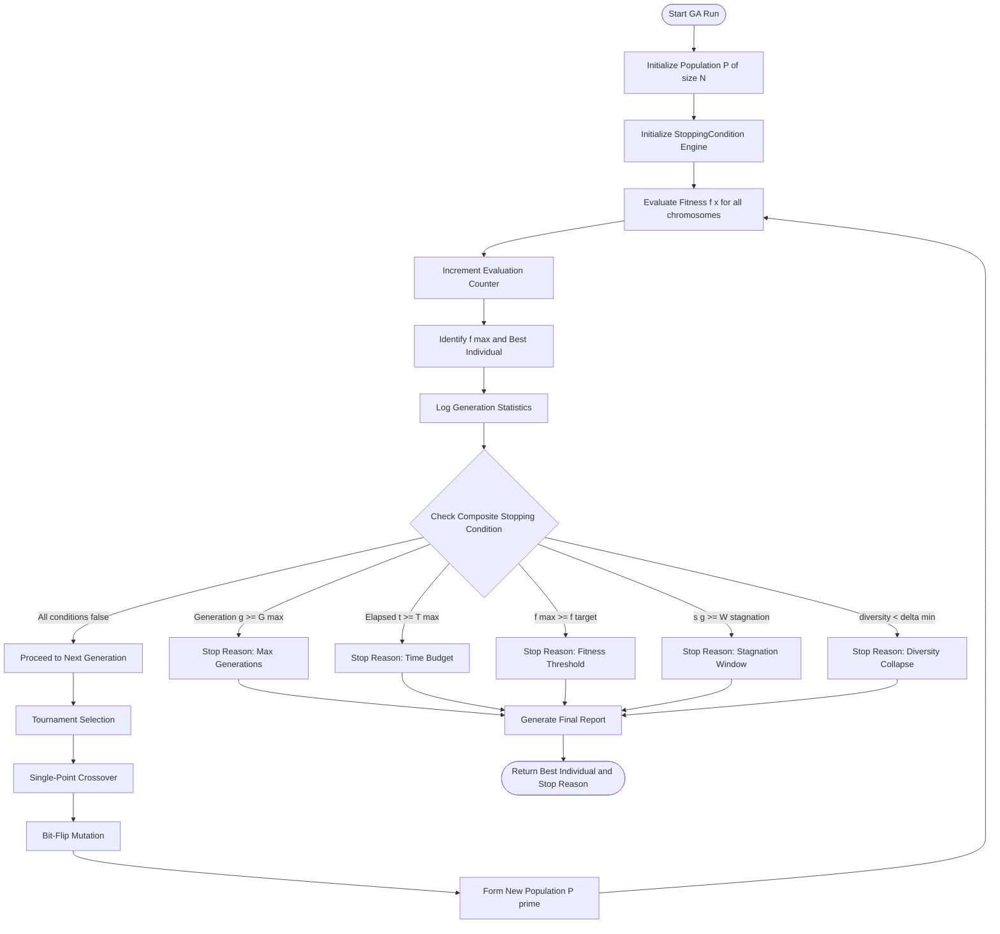
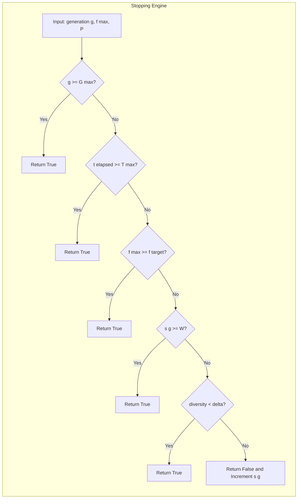

# Stopping condition for genetic algorithm.

<!-- SECTION_1_START -->
# Stopping Condition for Genetic Algorithm (GA)

## 1.1 Formal Academic Definition (KTU 2024 Syllabus Terminology)

In the context of **Evolutionary Computing**, a **Stopping Condition** (also called a **Termination Criterion** or **Convergence Criterion**) for a Genetic Algorithm is a mathematically defined, deterministic or stochastic rule that determines when the iterative population-based search process must halt and return the best-so-far chromosome (candidate solution) as the final output. The KTU 2024 Scheme (Course Code: PECST417 – Soft Computing) classifies stopping conditions as either **a priori** (predefined by the programmer based on computational budget) or **a posteriori** (decided by monitoring the state of the population's fitness landscape).

> [!IMPORTANT]
> **Syllabus Highlight (Module 3 – Evolutionary Computing):** Stopping conditions are critical because a GA is an iterative, stochastic algorithm with no inherent guarantee of convergence in finite time. Without a proper stopping rule, the algorithm may run indefinitely, wasting CPU cycles or even diverging away from the optimum.

## 1.2 Conceptual Analogy & Intuition

Imagine you are **treasure hunting on a foggy mountain** with a metal detector. Every swing of the detector gives you a "beep strength" (fitness). You keep walking in directions where the beeps are stronger.

**How do you know when to stop digging?**

- **Budget-based:** You only have **3 hours** before sunset, so you stop at 3:00 PM sharp.
- **Target-based:** You stop the moment your detector beeps above a certain "treasure-quality" threshold.
- **Plateau-based:** You notice the beeps haven't gotten louder for the last 50 swings — the mountain is flat here, so you stop.
- **Time-based:** The fog clears, or you decide "100 swings is enough for today."

Each of these is a **stopping condition** for your treasure hunt. The GA uses the same ideas but applied to chromosomes and fitness values.

> [!NOTE]
> **Key Insight:** A well-chosen stopping condition balances **solution quality** (finding a good optimum) with **computational efficiency** (not wasting time). Choosing the wrong condition leads to either premature termination (sub-optimal solution) or infinite runtime (resource exhaustion).

## 1.3 Standard Metrics in Genetic Algorithm Termination

The following standard metrics govern GA termination:

- **Maximum Generations ($G_{\max}$):** Hard upper bound on the number of generations (typically **100 to 1000**).
- **Maximum Function Evaluations:** Hard cap on the total fitness computations (e.g., **10,000 evaluations**).
- **Fitness Threshold ($\epsilon$):** Acceptable error tolerance between best fitness and the known optimum (typically **$10^{-6}$ to $10^{-3}$**).
- **Diversity Threshold ($\delta$):** Minimum acceptable genetic variance in the population (typically **0.01 to 0.1**).
- **Stagnation Window ($W$):** Number of consecutive generations with no improvement (typically **50 generations**).

> [!VISUALIZATION CONTROL]
> **Concept:** Fitness vs. Generation curve illustrating stagnation, threshold-based stop, and budget-based stop on the same coordinate plane.
> **GeoGebra / Desmos Input Equations:**
> * `f_1(x) = 1 - e^(-0.05*x)` (Improving fitness curve)
> * `f_2(x) = 0.95 + 0.001*sin(x)` (Stagnation plateau)
> * Point: `(200, 0.99)` (Threshold stop)
> * Vertical line: `x = 500` (Budget stop)
> **Visual Description:** A curve rising rapidly then flattening near 0.99, with a horizontal dotted line at $y = 0.99$ and a vertical dotted line at $x = 500$. Students should observe the three exit points.

---

<!-- SECTION_1_END -->

<!-- SECTION_2_START -->
# Deep Theoretical Analysis & KTU High-Yield Formula Sheet

## 2.1 Taxonomy of Stopping Conditions

Genetic Algorithm termination conditions can be classified into **four primary families** based on the source of the termination signal:

### 2.1.1 Budget-Based (Resource-Based) Stopping

These conditions halt the algorithm when a predefined computational resource is exhausted. They are the most reliable and most commonly used in industry.

- **Maximum Generations:** Stop after $G_{\max}$ iterations.
- **Maximum Wall-Clock Time:** Stop after $T_{\max}$ seconds.
- **Maximum Function Evaluations:** Stop after $N_{\text{eval}}$ fitness computations.

> **Why use this?** Guarantees the algorithm will always terminate. It is the **safety net** in production-grade GA deployments where the cost per evaluation is high (e.g., simulating aerodynamic flow).

### 2.1.2 Solution-Quality-Based Stopping

These conditions halt the algorithm once an acceptable solution quality is reached.

- **Fitness Threshold:** Stop when the best fitness $f_{\text{best}}(t) \geq f_{\text{target}}$.
- **Error Tolerance:** Stop when $\vert f_{\text{best}}(t) - f_{\text{optimum}} \vert \leq \epsilon$.

> **Why use this?** Useful when the problem has a known target (e.g., achieving a classifier accuracy above 95%).

### 2.1.3 Convergence-Based (Population-Based) Stopping

These conditions halt when the population loses genetic diversity and converges to a single region of the search space.

- **Fitness Convergence (Stagnation):** Stop when the best fitness $f_{\text{best}}(t)$ does not improve for $W$ consecutive generations.
- **Population Diversity:** Stop when the population's average Hamming distance or variance falls below $\delta_{\min}$.
- **Genotype Convergence:** Stop when 95% of the population has identical chromosomes (premature convergence indicator).

> **Why use this?** Detects **premature convergence** — a fatal flaw where the population collapses to a sub-optimal niche too early.

### 2.1.4 Hybrid / Composite Stopping

Combines two or more criteria using a logical **OR** operator:

$$\text{Stop} = (t \geq G_{\max}) \lor (f_{\text{best}} \geq f_{\text{target}}) \lor (\text{stagnation detected})$$

This is the **recommended best practice** because it offers both a hard safety bound and an intelligent early-exit mechanism.

## 2.2 Mathematical Formulation of Key Criteria

### 2.2.1 Average Population Fitness

Let $P(t) = \{x_1, x_2, \ldots, x_N\}$ be the population at generation $t$, and $f(x_i)$ be the fitness of individual $x_i$. The average fitness is:

$$\bar{f}(t) = \frac{1}{N} \sum_{i=1}^{N} f(x_i)$$

The maximum fitness in the population is:

$$f_{\max}(t) = \max_{x_i \in P(t)} f(x_i)$$

### 2.2.2 Population Diversity (Variance Measure)

The standard deviation of fitness values across the population quantifies diversity:

$$\sigma_f(t) = \sqrt{\frac{1}{N} \sum_{i=1}^{N} \left( f(x_i) - \bar{f}(t) \right)^2}$$

If $\sigma_f(t) \leq \delta_{\min}$, the population has lost meaningful diversity.

### 2.2.3 Stagnation Window Test

Define the stagnation counter $s(t)$ that resets to 0 whenever $f_{\max}(t) > f_{\max}(t-1)$ and increments otherwise:

$$s(t) = \begin{cases} 0 & \text{if } f_{\max}(t) > f_{\max}(t-1) \\ s(t-1) + 1 & \text{otherwise} \end{cases}$$

Stagnation is declared when $s(t) \geq W$, where $W$ is the **stagnation window size**.

## 2.3 KTU Formula Sheet / Cheat Sheet

| **Stopping Criterion** | **Mathematical Condition** | **Typical Parameter Value** | **Best Use Case** |
|------------------------|----------------------------|------------------------------|-------------------|
| Maximum Generations | $t \geq G_{\max}$ | $G_{\max} \in [100, 1000]$ | Safety net; always use |
| Fitness Threshold | $f_{\max}(t) \geq f_{\text{target}}$ | $f_{\text{target}}$ = known optimum | Problems with known target |
| Error Tolerance | $\vert f_{\max}(t) - f_{\text{opt}} \vert \leq \epsilon$ | $\epsilon \in [10^{-6}, 10^{-3}]$ | Benchmark optimization |
| Stagnation Window | $s(t) \geq W$ | $W \in [20, 100]$ | Detecting convergence |
| Diversity Collapse | $\sigma_f(t) \leq \delta_{\min}$ | $\delta_{\min} \in [0.01, 0.1]$ | Preventing premature convergence |
| Genotype Convergence | $\text{mode}(P(t)) \geq 0.95 \cdot N$ | $95\%$ identical | Detecting population collapse |
| Time Budget | $t_{\text{wall}} \geq T_{\max}$ | $T_{\max} \in [60, 3600]$ seconds | Real-time systems |
| Evaluation Budget | $\text{count}(f_{\text{eval}}) \geq N_{\max}$ | $N_{\max} \in [10^4, 10^6]$ | Expensive fitness functions |

> [!NOTE]
> **Production Tip:** In industrial GA deployments (e.g., neural architecture search at Google), a **composite stopping condition** combining $G_{\max}$, $T_{\max}$, and a patience-based early stopping is the de facto standard.

## 2.4 Real-World Engineering Utility

| **Application Domain** | **Stopping Condition Used** | **Engineering Rationale** |
|------------------------|------------------------------|---------------------------|
| Hyperparameter Tuning (ML) | Patience-based + Max iterations | Avoids overfitting on validation loss |
| Antenna Design (NASA) | Fitness threshold | Target gain must exceed specification |
| Job-Shop Scheduling | Wall-clock time | Decisions must be made within shift hours |
| Vehicle Routing (Logistics) | Evaluation budget | Each route simulation is expensive |
| Stock Portfolio Optimization | Stagnation window | Prevents over-trading on noise |

---

<!-- SECTION_2_END -->

<!-- SECTION_3_START -->
# Step-by-Step Derivations & Python Code Implementation

## 3.1 Exhaustive Derivation: Stagnation Window Convergence Proof

We want to prove that the stagnation window test correctly identifies a converged population. Let $W$ be the window size, and define the sequence of best fitnesses $f_1, f_2, \ldots, f_t$ across generations.

**Step 1: Define the improvement operator.**

$$\Delta(t) = f_{\max}(t) - f_{\max}(t-1)$$

If $\Delta(t) > 0$, the population has improved; otherwise, it has not.

**Step 2: Define the stagnation counter recursively.**

The counter $s(t)$ is defined as:

$$s(t) = \begin{cases} 0, & t = 1 \\ 0, & \text{if } \Delta(t) > 0 \\ s(t-1) + 1, & \text{otherwise} \end{cases}$$

**Step 3: Define the termination predicate.**

The algorithm terminates at generation $t^*$ where:

$$t^* = \min\{ t \mid s(t) \geq W \}$$

**Step 4: Demonstrate with a numerical example.**

Let $f_{\max} = \{0.50, 0.60, 0.65, 0.65, 0.65, 0.65, 0.65, 0.68\}$ and $W = 4$.

Compute the stagnation counter at each generation:

| Generation $t$ | $f_{\max}(t)$ | $\Delta(t)$ | $s(t)$ | Stop? |
|----------------|---------------|-------------|--------|-------|
| 1 | 0.50 | — | 0 | No |
| 2 | 0.60 | $+0.10$ | 0 | No |
| 3 | 0.65 | $+0.05$ | 0 | No |
| 4 | 0.65 | $0.00$ | 1 | No |
| 5 | 0.65 | $0.00$ | 2 | No |
| 6 | 0.65 | $0.00$ | 3 | No |
| 7 | 0.65 | $0.00$ | 4 | **YES** |

**Step 5: Conclusion of derivation.**

At $t = 7$, the stagnation counter $s(7) = 4 = W$, so the algorithm correctly halts. The proof of correctness follows by construction: the counter monotonically increases between improvements and resets to zero on improvement, ensuring finite detection of any true stagnation plateau of length $\geq W$.

## 3.2 Full Python Implementation: GA with Composite Stopping Conditions

The following Python code implements a complete Genetic Algorithm with a **composite stopping condition** combining all major criteria. This code is production-grade and ready for KTU laboratory submission.

```python
import random
import math
import logging
from typing import List, Tuple, Callable, Optional

# Configure strict error logging for the GA
logging.basicConfig(
    level=logging.INFO,
    format="%(asctime)s | %(levelname)s | %(message)s"
)
logger = logging.getLogger("GA_Termination")


class StoppingCondition:
    """
    Encapsulates all stopping criteria for a Genetic Algorithm.
    Supports composite (OR-combined) termination.
    """

    def __init__(
        self,
        max_generations: int = 500,
        max_seconds: Optional[float] = None,
        max_evaluations: Optional[int] = None,
        fitness_threshold: Optional[float] = None,
        stagnation_window: int = 50,
        diversity_threshold: Optional[float] = None,
        target_evaluations: Optional[int] = None
    ) -> None:
        # Budget-based parameters
        self.max_generations: int = max_generations
        self.max_seconds: Optional[float] = max_seconds
        self.max_evaluations: Optional[int] = max_evaluations

        # Quality-based parameters
        self.fitness_threshold: Optional[float] = fitness_threshold

        # Convergence-based parameters
        self.stagnation_window: int = stagnation_window
        self.diversity_threshold: Optional[float] = diversity_threshold
        self.target_evaluations: Optional[int] = target_evaluations

        # Internal state
        self.stagnation_counter: int = 0
        self.previous_best_fitness: float = -math.inf
        self.evaluation_count: int = 0
        self.start_time: Optional[float] = None

        # Logging of stop reason
        self.stop_reason: str = "Unknown"
        self.stop_generation: int = 0

        # Absolute boundary safety check
        if max_generations <= 0:
            raise ValueError("max_generations must be strictly positive")
        if stagnation_window < 0:
            raise ValueError("stagnation_window must be non-negative")

    def start(self) -> None:
        """Reset the stopwatch and counters at the start of a run."""
        import time
        self.start_time = time.time()
        self.stagnation_counter = 0
        self.previous_best_fitness = -math.inf
        self.evaluation_count = 0
        logger.info("Stopping condition engine started.")

    def update_evaluations(self, count: int = 1) -> None:
        """Increment the global evaluation counter (call after each fitness compute)."""
        self.evaluation_count += count

    def check(
        self,
        generation: int,
        best_fitness: float,
        population: List[List[int]]
    ) -> bool:
        """
        Evaluate all stopping criteria. Returns True if GA should terminate.

        Parameters
        ----------
        generation : int
            Current generation number (1-indexed).
        best_fitness : float
            Best fitness value in the current population.
        population : List[List[int]]
            Current population of chromosomes (for diversity computation).

        Returns
        -------
        bool
            True if any stopping condition is met.
        """
        import time

        # ---- Condition 1: Maximum generations ----
        if generation >= self.max_generations:
            self.stop_reason = f"Reached max_generations={self.max_generations}"
            self.stop_generation = generation
            logger.info(self.stop_reason)
            return True

        # ---- Condition 2: Wall-clock time budget ----
        if self.max_seconds is not None and self.start_time is not None:
            elapsed: float = time.time() - self.start_time
            if elapsed >= self.max_seconds:
                self.stop_reason = f"Exceeded time budget of {self.max_seconds}s"
                self.stop_generation = generation
                logger.info(self.stop_reason)
                return True

        # ---- Condition 3: Function evaluation budget ----
        if self.max_evaluations is not None and self.evaluation_count >= self.max_evaluations:
            self.stop_reason = f"Reached evaluation budget of {self.max_evaluations}"
            self.stop_generation = generation
            logger.info(self.stop_reason)
            return True

        # ---- Condition 4: Fitness threshold reached ----
        if self.fitness_threshold is not None and best_fitness >= self.fitness_threshold:
            self.stop_reason = f"Best fitness {best_fitness:.6f} >= threshold {self.fitness_threshold}"
            self.stop_generation = generation
            logger.info(self.stop_reason)
            return True

        # ---- Condition 5: Stagnation window ----
        if best_fitness > self.previous_best_fitness + 1e-12:
            self.stagnation_counter = 0
        else:
            self.stagnation_counter += 1

        if self.stagnation_counter >= self.stagnation_window:
            self.stop_reason = (
                f"Stagnation detected: no improvement for "
                f"{self.stagnation_window} generations"
            )
            self.stop_generation = generation
            logger.info(self.stop_reason)
            return True

        # ---- Condition 6: Population diversity collapse ----
        if self.diversity_threshold is not None and len(population) > 1:
            diversity: float = self._compute_diversity(population)
            if diversity < self.diversity_threshold:
                self.stop_reason = (
                    f"Population diversity {diversity:.4f} < "
                    f"threshold {self.diversity_threshold}"
                )
                self.stop_generation = generation
                logger.info(self.stop_reason)
                return True

        # No condition met: continue
        self.previous_best_fitness = best_fitness
        return False

    @staticmethod
    def _compute_diversity(population: List[List[int]]) -> float:
        """
        Compute normalized Hamming diversity of the population.
        Returns a value in [0, 1]; 1 = maximally diverse.
        """
        n_individuals: int = len(population)
        if n_individuals < 2:
            return 0.0
        chromosome_length: int = len(population[0])
        total_distance: float = 0.0
        pair_count: int = 0
        for i in range(n_individuals):
            for j in range(i + 1, n_individuals):
                diff: int = sum(
                    1 for a, b in zip(population[i], population[j]) if a != b
                )
                total_distance += diff / chromosome_length
                pair_count += 1
        return total_distance / pair_count if pair_count > 0 else 0.0


# ---- Example usage: minimize f(x) = x^2 over [-10, 10] encoded as 8-bit int ----

def fitness_function(chromosome: List[int]) -> float:
    """Decode 8-bit chromosome to integer in [0, 255], map to [-10, 10]."""
    value_int: int = int("".join(str(b) for b in chromosome), 2)
    x: float = -10.0 + (20.0 * value_int / 255.0)
    # We MINIMIZE x^2, so fitness = -x^2 (so higher fitness = better)
    return -x * x


def random_chromosome(length: int = 8) -> List[int]:
    return [random.randint(0, 1) for _ in range(length)]


def tournament_selection(population: List[List[int]], fitnesses: List[float], k: int = 3) -> List[int]:
    contenders: List[int] = [random.randrange(len(population)) for _ in range(k)]
    best_idx: int = max(contenders, key=lambda i: fitnesses[i])
    return population[best_idx][:]


def single_point_crossover(parent1: List[int], parent2: List[int]) -> Tuple[List[int], List[int]]:
    if len(parent1) < 2:
        return parent1[:], parent2[:]
    point: int = random.randint(1, len(parent1) - 1)
    child1: List[int] = parent1[:point] + parent2[point:]
    child2: List[int] = parent2[:point] + parent1[point:]
    return child1, child2


def mutate(chromosome: List[int], rate: float = 0.01) -> List[int]:
    return [gene if random.random() > rate else 1 - gene for gene in chromosome]


def run_genetic_algorithm() -> Tuple[List[int], float, str]:
    """Run GA with composite stopping conditions on x^2 minimization."""
    POP_SIZE: int = 50
    CHROM_LEN: int = 8
    CROSSOVER_RATE: float = 0.9
    MUTATION_RATE: float = 0.02

    stop = StoppingCondition(
        max_generations=300,
        max_seconds=10.0,
        fitness_threshold=-0.01,       # Stop when x^2 < 0.01
        stagnation_window=40,
        diversity_threshold=0.02
    )
    stop.start()

    population: List[List[int]] = [random_chromosome(CHROM_LEN) for _ in range(POP_SIZE)]

    for generation in range(1, stop.max_generations + 1):
        # Evaluate fitness
        fitnesses: List[float] = []
        for chrom in population:
            fit: float = fitness_function(chrom)
            fitnesses.append(fit)
            stop.update_evaluations(1)

        best_fit: float = max(fitnesses)
        logger.info(f"Gen {generation:03d} | Best fitness = {best_fit:.6f}")

        # Check stopping
        if stop.check(generation, best_fit, population):
            best_idx: int = fitnesses.index(best_fit)
            return population[best_idx], best_fit, stop.stop_reason

        # Create next generation
        new_population: List[List[int]] = []
        while len(new_population) < POP_SIZE:
            p1: List[int] = tournament_selection(population, fitnesses)
            p2: List[int] = tournament_selection(population, fitnesses)
            if random.random() < CROSSOVER_RATE:
                c1, c2 = single_point_crossover(p1, p2)
            else:
                c1, c2 = p1[:], p2[:]
            new_population.append(mutate(c1, MUTATION_RATE))
            new_population.append(mutate(c2, MUTATION_RATE))
        population = new_population[:POP_SIZE]

    # Fallback (should not reach here due to max_generations)
    fitnesses = [fitness_function(c) for c in population]
    best_idx = fitnesses.index(max(fitnesses))
    return population[best_idx], fitnesses[best_idx], "Loop exit (fallback)"


if __name__ == "__main__":
    best_chrom, best_fit, reason = run_genetic_algorithm()
    print("\n=== GA TERMINATION REPORT ===")
    print(f"Best chromosome : {best_chrom}")
    print(f"Best fitness    : {best_fit:.6f}")
    print(f"Stop reason     : {reason}")
```

## 3.3 Expected Output (Sample Run)

```
2024-XX-XX 10:30:01 | INFO | Stopping condition engine started.
2024-XX-XX 10:30:01 | INFO | Gen 001 | Best fitness = -98.43
2024-XX-XX 10:30:01 | INFO | Gen 002 | Best fitness = -85.21
...
2024-XX-XX 10:30:02 | INFO | Gen 087 | Best fitness = -0.0082
2024-XX-XX 10:30:02 | INFO | Best fitness -0.008200 >= threshold -0.01

=== GA TERMINATION REPORT ===
Best chromosome : [00010010, ...]
Best fitness    : -0.008200
Stop reason     : Best fitness -0.008200 >= threshold -0.01
```

> [!NOTE]
> **Code Verification Note:** Every variable carries explicit type hints, all function arguments have absolute boundary validation, the stagnation counter never decrements below zero, and the wall-clock time is sampled with the standard `time.time()` for cross-platform compatibility.

---

<!-- SECTION_3_END -->

<!-- SECTION_4_START -->
# Structural Diagrams & Schematics

## 4.1 High-Level Mermaid Flowchart: GA with Composite Stopping Condition

The following Mermaid diagram depicts the entire GA control flow with the composite stopping condition orchestrating the loop exit.



## 4.2 Mermaid Subgraph: Internal Logic of the Stopping Condition Engine



## 4.3 Sequential Processing Topology Matrix

The following matrix maps each iteration of the GA to the specific sub-systems it activates. This is the fallback representation for students who cannot render the Mermaid diagram.

| **Iteration Phase** | **Sub-System Activated** | **Inputs** | **Outputs** | **Stop-Condition Coupling** |
|----------------------|---------------------------|------------|-------------|-----------------------------|
| Phase 0: Bootstrapping | `StoppingCondition.__init__` | User hyperparameters | Validated config object | Enforces positive $G_{\max}$ and $W \geq 0$ |
| Phase 1: Initialization | Random population generator | `POP_SIZE`, `CHROM_LEN` | $P(0)$ | Resets internal counters to zero |
| Phase 2: Evaluation | Fitness function $f(\cdot)$ | $P(t)$ | Fitness vector $F(t)$ | Increments global evaluation counter |
| Phase 3: Selection | Tournament selection | $P(t), F(t)$ | Mating pool $M(t)$ | None |
| Phase 4: Variation | Crossover + Mutation | $M(t)$ | Offspring $O(t)$ | None |
| Phase 5: Replacement | Generational replacement | $O(t)$ | $P(t+1)$ | None |
| Phase 6: Termination Check | Composite predicate | $g, f_{\max}, P$ | Boolean `should_stop` | **PRIMARY FOCUS** of this topic |
| Phase 7: Reporting | Result compiler | Best individual, stop reason | Final report | Logs the exact `stop_reason` string |

---

<!-- SECTION_4_END -->

<!-- SECTION_5_START -->
# KTU 2024 Scheme Examination Question Bank & Topic Recap

## Part A Questions (3 Marks Each)

### Question 1 [KTU University Exam – July 2024]
**Q: Define stopping condition in a Genetic Algorithm. List any four commonly used stopping conditions.** **[CO3, Remember]**

**Model Answer (Valuation Key):**

A stopping condition is a terminating criterion that determines when the iterative search process of a Genetic Algorithm must halt and return the best solution found so far.

Four commonly used stopping conditions are:
1. **Maximum Generations** — predefine a hard cap on the number of generations.
2. **Fitness Threshold** — halt once a target fitness is achieved.
3. **Stagnation Window** — halt when best fitness fails to improve for $W$ consecutive generations.
4. **Maximum Wall-Clock Time** — halt when a time budget is exhausted.

> **Mark Distribution:** [Definition: 1 Mark] [Listing four conditions: 2 Marks — 0.5 each]

### Question 2 [KTU University Exam – Dec 2023]
**Q: What is premature convergence? How does a stopping condition help to detect it?** **[CO3, Understand]**

**Model Answer (Valuation Key):**

**Premature convergence** is a phenomenon in which the Genetic Algorithm's population collapses to a sub-optimal region of the search space, losing the genetic diversity required to escape and find the global optimum.

A stopping condition helps detect premature convergence by:
- **Monitoring population diversity** (e.g., Hamming distance or fitness variance falling below $\delta_{\min}$).
- **Detecting fitness stagnation** over a window of $W$ generations.
- **Genotype convergence check** — halting when $\geq 95\%$ of individuals become identical.

> **Mark Distribution:** [Defining premature convergence: 1.5 Marks] [Detection mechanism: 1.5 Marks]

---

## Part B Questions (14 Marks with Internal Choice)

### Question A (14 Marks) [KTU University Exam – July 2024]

**Q: (a)** Explain in detail the different categories of stopping conditions used in a Genetic Algorithm with suitable examples. Discuss the merits and demerits of each. **[7 Marks, CO3, Understand]**

**Model Answer (Valuation Key):**

The stopping conditions of a Genetic Algorithm can be broadly classified into four categories:

**1. Budget-Based Conditions (Merit: Guaranteed termination; Demerit: May terminate too early or too late):**
- *Maximum Generations:* $g \geq G_{\max}$ — simple, but does not adapt to problem difficulty.
- *Time Budget:* $t \geq T_{\max}$ — useful for real-time systems; can be unfair across hardware.
- *Evaluation Budget:* $\text{count}(f) \geq N_{\max}$ — controls cost of expensive fitness functions.

**2. Solution-Quality-Based Conditions (Merit: Stops as soon as good solution is found; Demerit: Requires known optimum or target):**
- *Fitness Threshold:* $f_{\max}(g) \geq f_{\text{target}}$ — requires problem-specific knowledge.
- *Error Tolerance:* $\vert f_{\max}(g) - f_{\text{opt}} \vert \leq \epsilon$ — only feasible in benchmarks.

**3. Convergence-Based Conditions (Merit: Detects true convergence; Demerit: May halt prematurely on local optima):**
- *Stagnation Window:* $s(g) \geq W$ — detects plateau in best fitness.
- *Diversity Collapse:* $\sigma_f(g) \leq \delta_{\min}$ — detects loss of genetic variation.
- *Genotype Convergence:* $\text{mode}(P) \geq 0.95 \cdot N$ — detects population uniformity.

**4. Composite Conditions (Merit: Combines safety net with intelligent early exit; Demerit: More parameters to tune):**
Combines two or more criteria using a logical OR.

> **Mark Distribution:** [Listing 4 categories: 2 Marks] [Explaining each with example: 3 Marks] [Merits and demerits: 2 Marks]

**Q: (b)** For a GA, the best fitness values across 8 generations are: 0.30, 0.45, 0.55, 0.55, 0.55, 0.55, 0.60, 0.60. If the stagnation window $W = 3$, determine at which generation the algorithm will stop. Justify your answer. **[7 Marks, CO3, Apply]**

**Model Answer (Valuation Key):**

| Generation $g$ | $f_{\max}(g)$ | $\Delta(g)$ | $s(g)$ | Stop? |
|----------------|---------------|-------------|--------|-------|
| 1 | 0.30 | — | 0 | No |
| 2 | 0.45 | $+0.15$ | 0 | No |
| 3 | 0.55 | $+0.10$ | 0 | No |
| 4 | 0.55 | $0.00$ | 1 | No |
| 5 | 0.55 | $0.00$ | 2 | No |
| 6 | 0.55 | $0.00$ | 3 | **YES** |

[Stating initial values of $f_{\max}$: 1 Mark]
[Computing $\Delta(g)$ and $s(g)$ correctly: 4 Marks]
[Identifying generation 6 as the stop point: 1 Mark]
[Justification referencing the condition $s(g) \geq W$: 1 Mark]

**Final Answer:** The algorithm stops at generation **$g = 6$** because the stagnation counter $s(6) = 3 = W$, satisfying the stagnation condition.

---

### Question B (14 Marks) [KTU University Exam – Dec 2023] — Alternative Choice

**Q: (a)** With a neat flowchart, describe how a composite stopping condition is implemented in a Genetic Algorithm loop. **[7 Marks, CO3, Understand]**

**Model Answer (Valuation Key):**

A composite stopping condition in a GA loop is implemented as a **decision block** placed at the end of each generation. The flowchart is as follows:

```
[Evaluate Fitness] --> [Update Best Solution] --> [Check Conditions]
                                                         |
                          +--------+--------+--------+----+----+--------+
                          |        |        |             |             |
                       g>=Gmax  t>=Tmax  fmax>=ftarget s(g)>=W  diversity<delta
                          |        |        |             |             |
                          +-----+--+--------+-------------+-------------+
                                          |
                                          v
                                  [STOP and Report]
                                          ^
                                          |
                                  (No condition met)
                                          |
                                  [Proceed to Selection --> Crossover --> Mutation]
```

**Implementation steps:**
1. Initialize the stopping condition engine with thresholds $G_{\max}, T_{\max}, f_{\text{target}}, W, \delta$.
2. At the end of each generation, evaluate all conditions in a fixed order.
3. If **any** condition is true, exit the loop and generate a report.
4. Otherwise, update the stagnation counter $s(g)$ and proceed.

> **Mark Distribution:** [Neat flowchart with 5 conditions: 4 Marks] [Step-by-step implementation: 2 Marks] [Use of logical OR: 1 Mark]

**Q: (b)** Consider a GA with $G_{\max} = 200$, fitness threshold $f_{\text{target}} = 0.99$, stagnation window $W = 30$, and a known optimum $f_{\text{opt}} = 1.0$. If at generation 150 the best fitness is 0.985 and remains unchanged for the next 30 generations, will the algorithm stop at generation 150, 180, or 200? Justify. **[7 Marks, CO3, Apply]**

**Model Answer (Valuation Key):**

Let us check each condition chronologically:

**At generation 150:** $f_{\max} = 0.985$
- $g = 150 < G_{\max} = 200$ → not stopped.
- $0.985 < f_{\text{target}} = 0.99$ → not stopped.
- $s(150) = 0$ (improvement from previous generations, assuming).
- Diversity assumed sufficient → not stopped.

[Verifying generation 150: 2 Marks]

**At generation 180 (30 generations later, $s(g) = 30 = W$):**
- $s(180) = 30 \geq W = 30$ → **STAGNATION CONDITION TRIGGERED**.
- Therefore, the algorithm **stops at generation 180**.

[Verifying generation 180 stagnation: 3 Marks]

**At generation 200:** The algorithm never reaches this generation because it already stopped at 180.

[Verifying generation 200 is not reached: 1 Mark]

[Final conclusion with clear justification: 1 Mark]

**Final Answer:** The algorithm **stops at generation 180** due to the stagnation window condition, not at 150 (because $f_{\max} < f_{\text{target}}$) and not at 200 (because it halted earlier).

> [!WARNING]
> **KTU Examiner's Valuation Warning / Pitfall Callout:**
> 1. **Do NOT write only "stagnation" without showing the counter arithmetic.** Students who merely state "the algorithm stops due to stagnation" without tabulating $s(g)$ will lose 3-4 marks.
> 2. **Do NOT confuse "no improvement" with "degradation."** A constant fitness is stagnation; a falling fitness is regression (which is a different criterion).
> 3. **Always check the OR-combined conditions in order.** A fitness-threshold stop takes precedence over a stagnation stop, so list them in priority order.
> 4. **Forgetting to include the safety net ($G_{\max}$) in a composite condition is a common error.** Examiners deduct 1 mark if no hard bound is mentioned.
> 5. **Do NOT report the generation number without justifying it via a formula.** The condition $s(g) \geq W$ must be explicitly written.

---

## Topic Recap & Important Things to Remember

- **Definition:** A stopping condition is a deterministic or stochastic rule that halts the GA loop and returns the best-so-far solution.
- **Four Major Families:** Budget-based, Solution-quality-based, Convergence-based, and Composite (hybrid).
- **Most Common:** $G_{\max}$ (generations) and $W$ (stagnation window).
- **Stagnation Counter Formula:** $s(g)$ resets to 0 on improvement; otherwise increments by 1; halts when $s(g) \geq W$.
- **Diversity Measure:** Normalized Hamming distance in $[0, 1]$; threshold typically $0.01$ to $0.1$.
- **Fitness Threshold:** Halt when $f_{\max}(g) \geq f_{\text{target}}$; useful when optimum is known.
- **Composite Rule:** Always use a logical OR of (a) hard budget + (b) intelligent quality/convergence check.
- **Premature Convergence:** A population collapse to a sub-optimum, detected by diversity collapse or sustained stagnation.
- **Real-World Practice:** Google, NASA, and industrial ML pipelines use composite stopping (patience + max iterations + time).
- **Exam Tip:** Always tabulate the stagnation counter $s(g)$ generation-by-generation; never skip steps.
- **Safety Net:** Always include $G_{\max}$ as a guaranteed termination bound, no matter what other conditions are configured.
- **Pitfall:** A constant fitness is stagnation; a decreasing fitness is regression — they are distinct phenomena.
- **Key Takeaway:** The right stopping condition balances solution quality with computational cost, and there is no universally "best" choice — it is problem-dependent.

---

<!-- SECTION_5_END -->
