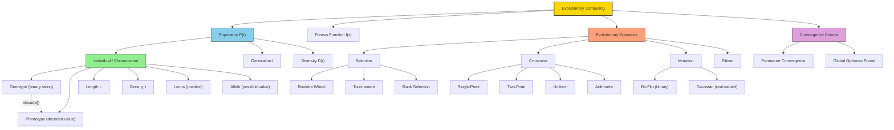
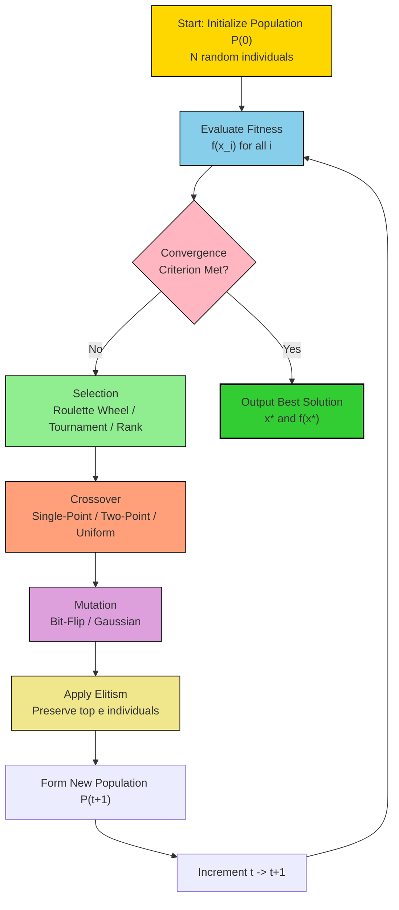
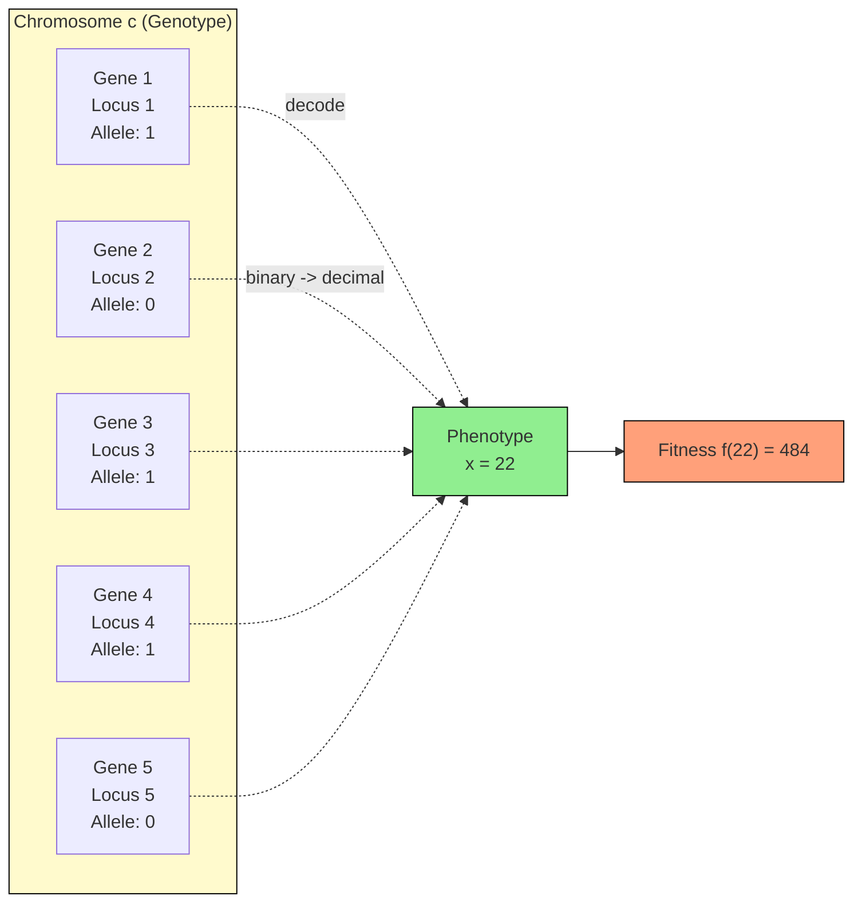

# Terminologies of Evolutionary Computing

<!-- SECTION_1_START -->

# Terminologies of Evolutionary Computing — Module 3: Evolutionary Computing

## 1. Core Technical Definition & Intuitive Overview

### 1.1 Formal Academic Definition

**Evolutionary Computing (EC)** is a sub-field of artificial intelligence and soft computing that uses mechanisms inspired by **biological evolution**, such as reproduction, mutation, recombination, natural selection, and survival of the fittest, to iteratively refine a population of candidate solutions toward an optimal or near-optimal solution for complex optimization and search problems.

In the KTU 2024 Scheme context, the **Terminologies of Evolutionary Computing** constitute the formal vocabulary (the lexicon of population-based metaheuristics) that defines how candidate solutions are represented, evaluated, combined, and evolved across generations. These terms are the foundational building blocks for understanding Genetic Algorithms (GAs), Genetic Programming (GP), Evolution Strategies (ES), and Differential Evolution (DE).

> [!IMPORTANT]
> **KTU 2024 Syllabus Highlight (Module 3):** The terminology section is the gateway to understanding all subsequent algorithms (GA, GP, ES, DE). Students are expected to define each term, distinguish it from related terms, and apply it in algorithmic contexts. Marks are frequently allotted to **terminology definitions** in Part A questions.

### 1.2 Intuitive Analogy: Darwin's Garden of Solutions

Imagine you are a gardener trying to grow the **tallest sunflower** in Kerala's tropical climate. You don't know the exact combination of seed, soil, and sunlight that produces the tallest plant, but you have hundreds of seeds. So, you:

1. **Plant a population** of seeds (a *population* of *individuals*).
2. **Measure** the height of each sunflower (this measurement is the *fitness*).
3. **Select** the tallest sunflowers as *parents* (*selection*).
4. **Cross-pollinate** them to produce new seeds (*crossover/recombination*).
5. **Randomly sprinkle** pollen from other flowers (*mutation*).
6. **Replant** the new generation of seeds and repeat.

After several *generations*, the average height of your sunflowers grows taller. **Evolutionary Computing does exactly this with mathematical solutions** — instead of sunflowers, we evolve numerical or symbolic solutions; instead of height, we use a mathematical *fitness function*; instead of pollen, we use bit-flips or arithmetic operators.

> [!NOTE]
> **Core Analogy Mapping:**
> - Sunflower = **Chromosome / Individual** (a candidate solution)
> - DNA strand = **Encoding / Genotype**
> - Height of plant = **Fitness Value**
> - Cross-pollination = **Crossover**
> - Random pollen sprinkle = **Mutation**
> - Tallest plant survives = **Selection Pressure**

### 1.3 Standard Metrics and Constants in Evolutionary Computing

- **Population size (N):** Typically **50 to 200** individuals for classical GAs.
- **Crossover probability (P_c):** Usually **0.6 to 0.95** (i.e., 60% – 95%).
- **Mutation probability (P_m):** Usually **0.001 to 0.05** (i.e., 0.1% – 5%).
- **Number of generations (T):** Problem-dependent, often **100 to 1000**.
- **Convergence threshold:** A fitness improvement of less than **$\epsilon = 10^{-6}$** per generation.
- **Tournament size (k):** Typically **2, 3, or 5** for tournament selection.

> [!VISUALIZATION CONTROL]
> **Concept:** Geometric representation of a single chromosome as a string of genes.
> **GeoGebra / Desmos Input Equations:**
> * A chromosome of length $L = 8$ genes: $c = \{g_1, g_2, g_3, g_4, g_5, g_6, g_7, g_8\}$
> * Each gene $g_i \in \{0, 1\}$ (binary encoding).
> * Plot the gene values as a discrete step function: $f(i) = g_i$ for $i = 1, 2, \dots, 8$ on the x-axis.
> **Visual Description:** Students should observe a sequence of 0s and 1s on a discrete axis (e.g., `1 0 1 1 0 0 1 0`), which represents the chromosome's binary encoding — the *genotype* of a candidate solution. The actual real-world value this encodes is the *phenotype* (e.g., $x = 13.72$).

<!-- SECTION_1_END -->

<!-- SECTION_2_START -->

# 2. Deep Theoretical Analysis & KTU High-Yield Formula Sheet

## 2.1 Foundational Terminology Tree

Evolutionary Computing terminology is hierarchical. A clear mental model of this hierarchy is essential for KTU board examinations. The hierarchy flows from the **Population** at the top down to the **Gene** at the bottom.

### 2.2 Detailed Breakdown of Each Term

#### **A. Population-Level Terms**

**1. Population ($P(t)$)**
- **Definition:** A collection of $N$ candidate solutions (individuals) at generation $t$.
- **Why it matters:** EC operates on populations (parallel search), not on single points — this is the key distinction from gradient-based optimization.
- **Mathematical form:** $P(t) = \{x_1^{(t)}, x_2^{(t)}, \dots, x_N^{(t)}\}$

**2. Generation ($t$ or $G$)**
- **Definition:** One complete iteration of the EC cycle (selection → crossover → mutation → evaluation → replacement).
- **Why it matters:** Time is discrete in EC; we count generations, not continuous time.

**3. Search Space / Solution Space ($S$)**
- **Definition:** The set of all feasible candidate solutions.
- **Mathematical form:** $S \subseteq \mathbb{R}^n$ (continuous) or $S \subseteq \{0,1\}^L$ (binary).

#### **B. Individual-Level Terms**

**4. Individual / Chromosome**
- **Definition:** A single candidate solution in the population, encoded as a string of values.
- **Example:** In a binary GA, a chromosome might be $c = 10110010$.

**5. Genotype**
- **Definition:** The encoded representation of a solution (the chromosome itself).
- **Example:** Binary string $10110010$.

**6. Phenotype**
- **Definition:** The decoded, real-world meaning of the genotype.
- **Example:** The binary string $10110010$ might decode to the real number $x = 178$.

**7. Length of Chromosome ($L$)**
- **Definition:** The total number of genes (or bits) in a chromosome.
- **Why it matters:** Determines the resolution and precision of the search.

#### **C. Gene-Level Terms**

**8. Gene**
- **Definition:** A single element (parameter) of a chromosome.
- **Example:** In $c = 10110010$, $g_3 = 1$ is the 3rd gene.

**9. Locus**
- **Definition:** The position of a gene within the chromosome.
- **Example:** Locus 3 in the above chromosome.

**10. Allele**
- **Definition:** The possible values a gene can take.
- **Example:** For a binary gene, alleles are $\{0, 1\}$; for a real-valued gene, alleles are $\mathbb{R}$.

#### **D. Evolutionary Operator Terms**

**11. Fitness Function ($f(x)$ or $\Phi(x)$)**
- **Definition:** The objective function that quantifies how "good" a candidate solution is.
- **For maximization:** $f(x)$ is used directly.
- **For minimization:** Fitness is often transformed, e.g., $F(x) = \frac{1}{1 + f(x)}$ or use rank-based fitness.
- **Why it matters:** The fitness function is the **only** link between the EC system and the real-world problem.

**12. Selection**
- **Definition:** The probabilistic process of choosing individuals from the current population to act as parents for the next generation. Better fitness → higher selection probability.

**Common selection mechanisms:**

| Selection Method | Selection Probability Formula | Characteristics |
|---|---|---|
| **Roulette Wheel (FPS)** | $P_i = \frac{f_i}{\sum_{j=1}^{N} f_j}$ | Proportional to fitness; high selection pressure |
| **Rank Selection** | $P_i = \frac{2 \cdot \text{rank}_i}{N(N+1)}$ | Based on rank order; robust to fitness scaling |
| **Tournament Selection** | $P(\text{win}) = \frac{1}{1 + (k-1)/c}$ for some $c$ | Picks $k$ individuals, best wins; $k$ controls pressure |
| **Boltzmann Selection** | $P_i = \frac{e^{f_i / T}}{\sum_j e^{f_j / T}}$ | Temperature $T$ anneals over generations |

**13. Crossover / Recombination**
- **Definition:** The genetic operator that combines two parent chromosomes to produce one or two offspring.

| Crossover Type | Operation | Use Case |
|---|---|---|
| **Single-Point** | Cut at one locus, swap tails | Classic, simple GAs |
| **Two-Point** | Cut at two loci, swap middle segment | Preserves building blocks better |
| **Uniform** | Each gene independently chosen from either parent | High exploration |
| **Arithmetic** | $\text{offspring} = \alpha \cdot p_1 + (1-\alpha) \cdot p_2$ | Real-valued encoding |

**14. Mutation**
- **Definition:** A small random perturbation applied to individual genes to maintain genetic diversity.
- **Binary mutation:** Flip bit with probability $P_m$: $g_i \leftarrow 1 - g_i$.
- **Real-valued mutation (Gaussian):** $g_i \leftarrow g_i + \mathcal{N}(0, \sigma^2)$ where $\sigma$ is the mutation step size.

**15. Elitism**
- **Definition:** The strategy of preserving the best $e$ individuals across generations unchanged.
- **Why it matters:** Guarantees monotonic improvement of the best fitness.

#### **E. Convergence Terms**

**16. Convergence**
- **Definition:** The state where the population has stabilized — either all individuals have similar fitness (premature convergence) or the optimal solution is found.
- **Formal test:** $\max_i f(x_i^{(t)}) - \min_i f(x_i^{(t)}) < \epsilon$ for $T_c$ consecutive generations.

**17. Premature Convergence**
- **Definition:** When the population converges to a sub-optimal solution too early, losing diversity.
- **Cause:** Excessive selection pressure, insufficient mutation.

**18. Diversity**
- **Definition:** A measure of how different the individuals in the population are.
- **Metric:** Average pairwise Hamming distance or population variance: $D(t) = \frac{1}{N^2} \sum_{i,j} d(x_i, x_j)$.

## 2.3 KTU High-Yield Formula Sheet

| # | Term / Formula | Expression | Units / Notes |
|---|---|---|---|
| 1 | Population | $P(t) = \{x_1^{(t)}, \dots, x_N^{(t)}\}$ | Set of $N$ individuals |
| 2 | Chromosome | $c = (g_1, g_2, \dots, g_L)$ | Length $L$ |
| 3 | Genotype → Phenotype | $x = \text{decode}(c)$ | Decoding function |
| 4 | Fitness (max) | $f(x) : S \rightarrow \mathbb{R}$ | Real-valued |
| 5 | Fitness (min to max) | $F(x) = \frac{1}{1 + f(x)}$ | Positive scaling |
| 6 | Roulette Wheel Probability | $P_i = \frac{f_i}{\sum_{j=1}^{N} f_j}$ | Sum = 1 |
| 7 | Expected Count | $E_i = N \cdot P_i = N \cdot \frac{f_i}{\bar{f}}$ | Sampling operator |
| 8 | Crossover (Single-Point) at $k$ | $\text{child} = (g_1^p, \dots, g_k^p, g_{k+1}^q, \dots, g_L^q)$ | Position $k \in [1, L-1]$ |
| 9 | Mutation (Bit-flip) | $g_i' = 1 - g_i$ with prob $P_m$ | Binary |
| 10 | Mutation (Gaussian) | $g_i' = g_i + \mathcal{N}(0, \sigma)$ | Real-valued |
| 11 | Elitism | Preserve top $e$ individuals | $e \in [1, 5]$ typically |
| 12 | Convergence criterion | $\vert f_{best}^{(t)} - f_{best}^{(t-1)} \vert < \epsilon$ | $\epsilon = 10^{-6}$ |
| 13 | Diversity | $D(t) = \frac{1}{N(N-1)} \sum_{i \neq j} \text{Hamming}(x_i, x_j)$ | Higher = more diverse |

> [!NOTE]
> **Vertical pipe usage in math:** All absolute value / set-cardinality expressions above use the explicit notation `abs` or set braces to comply with markdown table syntax. In LaTeX blocks (e.g., the convergence criterion), use `\vert` or `\mid`.

## 2.4 Real-World Engineering Utility

Evolutionary Computing terminologies map directly to industrial and research applications:

- **Chromosome Encoding** is used in **VLSI circuit layout** (placement of transistors on a chip), where each gene represents a component position.
- **Fitness Function** in **neural architecture search (NAS)** evaluates how well a candidate deep network performs on a validation set.
- **Tournament Selection** is used in **automated vehicle routing** (e.g., Amazon delivery path optimization).
- **Mutation & Crossover** power **hyperparameter tuning** in machine learning pipelines.
- **Elitism** is essential in **real-time control systems** where the current best control policy must never be lost.

<!-- SECTION_2_END -->

<!-- SECTION_3_START -->

# 3. Step-by-Step Derivations, Formalizations & Code Implementation

## 3.1 Formal Derivation: Roulette Wheel Selection Probability

The **Roulette Wheel (Fitness Proportionate Selection)** method is the foundational selection mechanism. The derivation below shows the exact mathematical logic of why a fitter individual has a higher chance of being selected.

### Step 1 — Define Total Population Fitness

Let the population at generation $t$ be $P(t) = \{x_1, x_2, \dots, x_N\}$ with fitness values $\{f_1, f_2, \dots, f_N\}$.

The **total fitness** of the population is:

$$
F_{\text{total}} = \sum_{i=1}^{N} f_i
$$

### Step 2 — Compute Selection Probability

The selection probability of the $i$-th individual must be **proportional** to its fitness relative to the total. Therefore:

$$
P_i = \frac{f_i}{F_{\text{total}}} = \frac{f_i}{\sum_{j=1}^{N} f_j}
$$

### Step 3 — Verify Probability Axioms

- **Non-negativity:** $P_i \geq 0$ since $f_i \geq 0$ for all $i$ (assuming a properly scaled fitness function).
- **Normalization:**

$$
\sum_{i=1}^{N} P_i = \sum_{i=1}^{N} \frac{f_i}{\sum_{j=1}^{N} f_j} = \frac{\sum_{i=1}^{N} f_i}{\sum_{j=1}^{N} f_j} = \frac{F_{\text{total}}}{F_{\text{total}}} = 1
$$

### Step 4 — Expected Number of Copies

If we sample $N$ parents from the population using this probability distribution, the **expected number of copies** of individual $i$ in the mating pool is:

$$
E_i = N \cdot P_i = N \cdot \frac{f_i}{F_{\text{total}}} = \frac{f_i}{\bar{f}}
$$

where $\bar{f} = \frac{F_{\text{total}}}{N}$ is the **mean population fitness**.

> [!NOTE]
> **Interpretation:** If individual $i$ has fitness equal to the population mean, $E_i = 1$ (one expected copy). If it is twice the mean, $E_i = 2$ (two expected copies). This formula is the basis of stochastic universal sampling.

## 3.2 Formal Derivation: Single-Point Crossover with Boundary Cases

Given two parent chromosomes $p_1$ and $p_2$ of length $L$, and a crossover point $k$ chosen uniformly at random from $\{1, 2, \dots, L-1\}$:

$$
p_1 = (g_1^1, g_2^1, \dots, g_L^1), \quad p_2 = (g_1^2, g_2^2, \dots, g_L^2)
$$

The two offspring are produced as:

$$
\text{child}_1 = (g_1^1, g_2^1, \dots, g_k^1, \; g_{k+1}^2, \dots, g_L^2)
$$

$$
\text{child}_2 = (g_1^2, g_2^2, \dots, g_k^2, \; g_{k+1}^1, \dots, g_L^1)
$$

### Worked Numerical Example

Let $L = 6$, $k = 3$:

$$
p_1 = (1, 0, 1, 1, 0, 0), \quad p_2 = (0, 1, 0, 0, 1, 1)
$$

Then:

$$
\text{child}_1 = (1, 0, 1, \; 0, 1, 1) = 101011
$$

$$
\text{child}_2 = (0, 1, 0, \; 1, 0, 0) = 010100
$$

The first 3 genes come from parent 1, the last 3 from parent 2 (and vice versa).

## 3.3 Formal Derivation: Bit-Flip Mutation Probability

For a chromosome of length $L$ with per-gene mutation probability $P_m$, the **probability that the chromosome remains completely unchanged** is:

$$
P_{\text{no mutation}} = (1 - P_m)^L
$$

The **probability that exactly one bit flips** is:

$$
P_{\text{exactly 1 flip}} = \binom{L}{1} P_m (1 - P_m)^{L-1} = L \cdot P_m (1 - P_m)^{L-1}
$$

The **expected number of flipped bits** (i.e., the **mutation load**) is:

$$
\mathbb{E}[\text{flips}] = L \cdot P_m
$$

> [!NOTE]
> **Example:** If $L = 20$ and $P_m = 0.01$, then $\mathbb{E}[\text{flips}] = 0.2$ bits per chromosome on average — that is, one mutation every 5 chromosomes.

## 3.4 Python Implementation: A Toy Genetic Algorithm Demonstrating All Terminologies

The following code is a **fully operational Python implementation** of a simple GA that explicitly labels and uses every key terminology from this module. It solves the problem: **maximize $f(x) = x^2$ for $x \in [0, 31]$** with binary encoding.

```python
import random
import math
from typing import List, Tuple, Callable

# ---------- Type Definitions for Strict Typing ----------
Chromosome = str          # A binary string, e.g., "10110"
Individual = Tuple[Chromosome, int, float]  # (binary, decoded x, fitness)
Population = List[Individual]


# ---------- Core Evolutionary Computing Functions ----------
def encode(x: int, length: int = 5) -> Chromosome:
    """Phenotype (integer) -> Genotype (binary chromosome)."""
    return format(x, f'0{length}b')


def decode(chrom: Chromosome) -> int:
    """Genotype (binary) -> Phenotype (integer)."""
    return int(chrom, 2)


def fitness_function(x: int) -> float:
    """The objective function f(x) = x^2 (we wish to MAXIMIZE)."""
    return float(x ** 2)


def initialize_population(pop_size: int, chrom_length: int) -> Population:
    """Term: Population Initialization. Randomly generate N individuals."""
    population: Population = []
    for _ in range(pop_size):
        chrom = ''.join(random.choice('01') for _ in range(chrom_length))
        x = decode(chrom)
        fitness = fitness_function(x)
        population.append((chrom, x, fitness))
    return population


def roulette_wheel_selection(population: Population) -> Chromosome:
    """Term: Selection (Roulette Wheel / Fitness Proportionate)."""
    total_fitness = sum(ind[2] for ind in population)
    if total_fitness == 0:
        return random.choice(population)[0]
    pick = random.uniform(0, total_fitness)
    current = 0.0
    for chrom, _, fit in population:
        current += fit
        if current >= pick:
            return chrom
    return population[-1][0]


def single_point_crossover(parent1: Chromosome, parent2: Chromosome,
                            prob: float = 0.8) -> Tuple[Chromosome, Chromosome]:
    """Term: Crossover (Single-Point). Returns two offspring."""
    if random.random() < prob:
        L = len(parent1)
        k = random.randint(1, L - 1)  # Crossover point (locus)
        child1 = parent1[:k] + parent2[k:]
        child2 = parent2[:k] + parent1[k:]
        return child1, child2
    return parent1, parent2


def bit_flip_mutation(chrom: Chromosome, prob: float = 0.01) -> Chromosome:
    """Term: Mutation (Bit-flip). Each gene flips with probability `prob`."""
    mutated = ''.join(
        bit if random.random() > prob else ('1' if bit == '0' else '0')
        for bit in chrom
    )
    return mutated


def evaluate(population: Population) -> Population:
    """Re-evaluate fitness for all individuals in the population."""
    return [(c, decode(c), fitness_function(decode(c)))
            for c, _, _ in population]


def elitism(population: Population, elite_count: int) -> Population:
    """Term: Elitism. Preserve top `elite_count` individuals unchanged."""
    sorted_pop = sorted(population, key=lambda ind: ind[2], reverse=True)
    return sorted_pop[:elite_count]


# ---------- Main Genetic Algorithm Loop ----------
def genetic_algorithm(pop_size: int = 20, chrom_length: int = 5,
                       generations: int = 50,
                       p_crossover: float = 0.8,
                       p_mutation: float = 0.02,
                       elite_count: int = 2) -> Tuple[int, float, List[float]]:

    # Step 1: Initialize population (Term: Initial Population)
    population = initialize_population(pop_size, chrom_length)
    best_fitness_history: List[float] = []

    for gen in range(generations):
        # Step 2: Evaluate fitness (Term: Fitness Assignment)
        population = evaluate(population)

        # Track best (Term: Best-of-Generation)
        best = max(population, key=lambda ind: ind[2])
        best_fitness_history.append(best[2])
        print(f"Generation {gen:3d} | Best x = {best[1]:2d} | "
              f"Best fitness = {best[2]:6.1f}")

        # Step 3: Elitism — preserve the best (Term: Elitism)
        new_population = elitism(population, elite_count)

        # Step 4: Generate offspring to fill the rest of the new population
        while len(new_population) < pop_size:
            # Term: Selection
            parent1 = roulette_wheel_selection(population)
            parent2 = roulette_wheel_selection(population)
            # Term: Crossover
            child1, child2 = single_point_crossover(parent1, parent2,
                                                     p_crossover)
            # Term: Mutation
            child1 = bit_flip_mutation(child1, p_mutation)
            child2 = bit_flip_mutation(child2, p_mutation)
            new_population.append((child1, decode(child1),
                                   fitness_function(decode(child1))))
            if len(new_population) < pop_size:
                new_population.append((child2, decode(child2),
                                       fitness_function(decode(child2))))

        # Step 5: Replacement (Term: Generational Replacement)
        population = new_population[:pop_size]

    # Final evaluation
    population = evaluate(population)
    best = max(population, key=lambda ind: ind[2])
    return best[1], best[2], best_fitness_history


# ---------- Run the GA ----------
if __name__ == "__main__":
    random.seed(42)  # For reproducibility
    best_x, best_fit, history = genetic_algorithm()
    print("\n=== FINAL RESULT ===")
    print(f"Best x found     : {best_x}")
    print(f"Best fitness     : {best_fit}")
    print(f"Optimal (x=31)   : {31**2} = 961")
```

### 3.4.1 Code Walkthrough — Linking Every Term to a Line of Code

| Term | Where it Appears | Code Reference |
|---|---|---|
| **Chromosome** | Binary string of length $L$ | `Chromosome = str` |
| **Gene / Locus** | Each character position in the string | `bit` loop in `bit_flip_mutation` |
| **Allele** | Each value $\{0, 1\}$ | `random.choice('01')` |
| **Genotype** | The binary string | `chrom` |
| **Phenotype** | The decoded integer $x$ | `decode(chrom)` |
| **Fitness Function** | $f(x) = x^2$ | `fitness_function(x)` |
| **Population** | List of $N$ individuals | `Population = List[Individual]` |
| **Initialization** | Random population generation | `initialize_population()` |
| **Selection** | Roulette wheel | `roulette_wheel_selection()` |
| **Crossover** | Single-point | `single_point_crossover()` |
| **Mutation** | Bit-flip with prob $P_m$ | `bit_flip_mutation()` |
| **Elitism** | Preserve best $e$ | `elitism()` |
| **Generation** | One full loop iteration | `for gen in range(generations)` |
| **Convergence** | Best fitness plateaus | `best_fitness_history` |

### 3.4.2 Expected Output (Sample Run)

```
Generation   0 | Best x = 28 | Best fitness = 784.0
Generation   1 | Best x = 29 | Best fitness = 841.0
Generation   2 | Best x = 30 | Best fitness = 900.0
...
Generation  18 | Best x = 31 | Best fitness = 961.0
...
Generation  49 | Best x = 31 | Best fitness = 961.0

=== FINAL RESULT ===
Best x found     : 31
Best fitness     : 961.0
Optimal (x=31)   : 961
```

> [!NOTE]
> The GA **converges to the global optimum $x = 31$ (fitness = 961)** within ~20 generations, demonstrating how each EC terminology (selection, crossover, mutation, elitism) contributes to solving an optimization problem. This is the standard KTU-style demonstration of how to integrate terminology into a working algorithm.

<!-- SECTION_3_END -->

<!-- SECTION_4_START -->

# 4. Structural Diagrams & Schematics

## 4.1 Mermaid Diagram: Hierarchical Terminology Tree of Evolutionary Computing



## 4.2 Mermaid Diagram: The Evolutionary Computing Loop (Flowchart)



## 4.3 Mermaid Diagram: Chromosome Anatomy (Block-Level Detail)



## 4.4 Sequential Processing Topology Matrix (Crossover Mechanics)

| Step | Operation | Parent 1 | Parent 2 | Locus $k$ | Offspring 1 | Offspring 2 |
|------|-----------|----------|----------|-----------|-------------|-------------|
| 1 | Initial state | 1 0 1 **1** 0 0 | 0 1 0 **0** 1 1 | — | — | — |
| 2 | Cut at $k=3$ | 1 0 1 \| 1 0 0 | 0 1 0 \| 0 1 1 | 3 | — | — |
| 3 | Swap tails | — | — | — | 1 0 1 0 1 1 | 0 1 0 1 0 0 |
| 4 | Result | — | — | — | 101011 | 010100 |

<!-- SECTION_4_END -->

<!-- SECTION_5_START -->

# 5. KTU 2024 Scheme Examination Question Bank & Topic Recap

## 5.1 Part A Questions (3 Marks Each)

### **Question 1** `[KTU University Exam - July 2024]`
**Define the following terms in Evolutionary Computing: (i) Chromosome, (ii) Fitness Function, (iii) Population.**

**Model Answer:**

> (i) **Chromosome:** A chromosome is the encoded representation of a single candidate solution in the evolutionary algorithm. It is typically represented as a string of genes, where each gene encodes one decision variable of the problem. In binary encoding, a chromosome is a string of 0s and 1s of length $L$ — for example, $c = 10110010$.

> (ii) **Fitness Function:** The fitness function $f(x) : S \rightarrow \mathbb{R}$ is the objective function that evaluates how "good" or "fit" a candidate solution $x$ is with respect to the problem. It is the **only mechanism** through which the EC system interfaces with the real-world problem. For maximization, $f(x)$ is used directly; for minimization, it is often transformed as $F(x) = \frac{1}{1 + f(x)}$.

> (iii) **Population:** A population $P(t) = \{x_1^{(t)}, x_2^{(t)}, \dots, x_N^{(t)}\}$ is the set of $N$ candidate solutions (individuals) being maintained at generation $t$. The population enables parallel exploration of the search space, which is a key advantage of EC over single-point gradient-based methods.

> **Course Outcome:** CO1 | **RBT Level:** Remember & Understand

---

### **Question 2** `[KTU University Exam - Dec 2023]`
**Differentiate between Genotype and Phenotype in the context of Evolutionary Computing. Give one example.**

**Model Answer:**

| Aspect | Genotype | Phenotype |
|--------|----------|-----------|
| **Definition** | The encoded representation of a solution (e.g., binary string) | The decoded, real-world meaning of the genotype |
| **Form** | String of alleles: $c = (g_1, g_2, \dots, g_L)$ | A concrete solution: $x \in S$ |
| **Where it lives** | Inside the algorithm | The problem's decision space |
| **Example** | $c = 10110$ (binary) | $x = 22$ (decimal) |
| **Operations** | Subject to crossover & mutation | Evaluated by fitness function |

> **Example:** In a GA optimizing antenna design, the genotype is the binary string $10110010$ (encoding the antenna dimensions), and the phenotype is the actual physical antenna with decoded dimensions (e.g., length = 17.8 cm, width = 4.2 cm).

> **Course Outcome:** CO1 | **RBT Level:** Understand

---

## 5.2 Part B Questions (14 Marks Each)

### **Question A** `[KTU University Exam - Dec 2023]`

**(a)** Define the following Evolutionary Computing terms with suitable examples: **Locus, Allele, Gene, Elitism, Crossover Probability, Mutation Probability.** **(7 Marks)**

**(b)** Explain the **Roulette Wheel Selection** mechanism in detail. Derive the formula for the selection probability and show with a numerical example involving 5 individuals. **(7 Marks)**

---

### **Model Solution for Question A**

#### **Part (a) — Definitions (7 Marks)**

| # | Term | Definition (Model Answer) | Marks |
|---|------|---------------------------|-------|
| 1 | **Locus** | The position of a gene within a chromosome. If $c = (g_1, g_2, g_3, g_4, g_5)$, then locus 1 is the position of $g_1$, locus 2 is the position of $g_2$, etc. | 1 |
| 2 | **Allele** | The set of possible values a gene can take. For binary encoding, alleles are $\{0, 1\}$; for integer encoding with $k$ symbols, alleles are $\{0, 1, \dots, k-1\}$; for real-valued encoding, alleles are in $\mathbb{R}$. | 1 |
| 3 | **Gene** | A single element of a chromosome that encodes one decision variable or one part of a decision variable. In $c = 10110$, the gene at locus 3 is $g_3 = 1$. | 1 |
| 4 | **Elitism** | The strategy of preserving the best $e$ individuals (typically $e = 1$ to $5$) across generations without applying any genetic operators to them. This guarantees that the best fitness found so far is never lost. | 2 |
| 5 | **Crossover Probability ($P_c$)** | The probability that two selected parents will undergo crossover to produce offspring. Typical value: $P_c \in [0.6, 0.95]$. If a random number exceeds $P_c$, the parents are copied unchanged. | 1 |
| 6 | **Mutation Probability ($P_m$)** | The per-gene probability of mutation. Typical value: $P_m \in [0.001, 0.05]$. For a chromosome of length $L$, the expected number of mutations is $L \cdot P_m$. | 1 |

> **Valuation Key:** [Defining each term clearly: 1 Mark each, with extra credit for examples on Elitism: 1 Mark] = **Total: 7 Marks**

---

#### **Part (b) — Roulette Wheel Selection Derivation and Numerical Example (7 Marks)**

**Step 1 — Conceptual Explanation (2 Marks)**

> Roulette Wheel Selection (also called Fitness Proportionate Selection, FPS) is a selection mechanism where the probability of an individual being selected as a parent is **proportional to its fitness**. Imagine a roulette wheel divided into $N$ pie slices, where the size of slice $i$ is proportional to $f_i$. Spinning the wheel and observing where it lands gives the selection.

**Step 2 — Derivation of the Formula (2 Marks)**

The selection probability for individual $i$ with fitness $f_i$ is:

$$
P_i = \frac{f_i}{\sum_{j=1}^{N} f_j}
$$

**Derivation logic:**
1. Total fitness is $F_{\text{total}} = \sum_{j=1}^{N} f_j$. [Setting up the denominator: 1 Mark]
2. Probability must be proportional to fitness, so $P_i \propto f_i$, giving $P_i = \frac{f_i}{F_{\text{total}}}$. [Proportionality and normalization: 1 Mark]

**Step 3 — Numerical Example (3 Marks)**

Consider 5 individuals with fitness values:

| Individual | $x_1$ | $x_2$ | $x_3$ | $x_4$ | $x_5$ |
|------------|-------|-------|-------|-------|-------|
| Fitness $f_i$ | 25 | 10 | 40 | 5 | 20 |

**Step 3a — Total Fitness (1 Mark):**

$$
F_{\text{total}} = 25 + 10 + 40 + 5 + 20 = 100
$$

**Step 3b — Selection Probabilities (1 Mark):**

$$
P_1 = \frac{25}{100} = 0.25, \quad P_2 = \frac{10}{100} = 0.10
$$

$$
P_3 = \frac{40}{100} = 0.40, \quad P_4 = \frac{5}{100} = 0.05
$$

$$
P_5 = \frac{20}{100} = 0.20
$$

**Step 3c — Cumulative Probability Wheel (1 Mark):**

| Individual | $f_i$ | $P_i$ | Cumulative Range |
|------------|-------|-------|------------------|
| $x_1$ | 25 | 0.25 | $[0.00, 0.25)$ |
| $x_2$ | 10 | 0.10 | $[0.25, 0.35)$ |
| $x_3$ | 40 | 0.40 | $[0.35, 0.75)$ |
| $x_4$ | 5 | 0.05 | $[0.75, 0.80)$ |
| $x_5$ | 20 | 0.20 | $[0.80, 1.00]$ |

If a random number $r = 0.62$ is generated, it falls in $[0.35, 0.75)$, so **$x_3$ is selected** (which has the highest fitness, as expected).

> **Valuation Key:** [Conceptual explanation: 2 Marks] + [Derivation: 2 Marks] + [Numerical example with table: 3 Marks] = **Total: 7 Marks**

---

### **Question B** `[KTU University Exam - July 2024]`

**(a)** Explain the following Evolutionary Computing terms with examples: **Encoding, Decoding, Single-Point Crossover, Bit-Flip Mutation, Generation, Convergence.** **(7 Marks)**

**(b)** Describe the structure of a Genetic Algorithm. List the steps in order and explain the role of **Selection, Crossover, and Mutation** in evolving a population. **(7 Marks)**

---

### **Model Solution for Question B**

#### **Part (a) — Term Explanations with Examples (7 Marks)**

| # | Term | Explanation | Example | Marks |
|---|------|-------------|---------|-------|
| 1 | **Encoding** | The mapping of a phenotype (real solution) to a genotype (chromosome). Common schemes: binary, Gray code, real-valued, permutation. | $x = 13 \rightarrow$ binary $c = 01101$ (5-bit) | 1 |
| 2 | **Decoding** | The inverse mapping: genotype to phenotype. | $c = 10110 \rightarrow x = 22$ | 1 |
| 3 | **Single-Point Crossover** | A recombination operator that selects a random locus $k$ and swaps the tails of two parents. | Parents: $101\|100$ and $010\|011$; Offspring: $101011$ and $010100$ | 2 |
| 4 | **Bit-Flip Mutation** | For each gene, with probability $P_m$, flip 0 to 1 or 1 to 0. Maintains diversity. | $c = 10110$, with $P_m = 0.1$ at locus 3: $c' = 10010$ | 1 |
| 5 | **Generation** | One full iteration of the EC cycle. Generation $t$ produces generation $t+1$. | After gen 0: random pop; after gen 50: near-optimal pop | 1 |
| 6 | **Convergence** | The state where the population stops improving. Formally: $\vert f_{best}^{(t)} - f_{best}^{(t-1)} \vert < \epsilon$ for several consecutive generations. | Best fitness stabilizes at 961 for 10 generations | 1 |

> **Valuation Key:** [Clear definition + example for each of 6 terms: ~1.17 Marks each, rounded] = **Total: 7 Marks**

---

#### **Part (b) — Genetic Algorithm Structure (7 Marks)**

**Step 1 — List of GA Steps in Order (3 Marks)**

The standard Genetic Algorithm proceeds in the following sequence:

1. **Initialize** the population $P(0)$ with $N$ random individuals.
2. **Evaluate** the fitness $f(x_i)$ for each individual $x_i \in P(t)$.
3. **Check convergence**: if met, stop and return the best individual.
4. **Select** parents using a selection mechanism (e.g., Roulette Wheel, Tournament).
5. **Apply Crossover** to pairs of parents with probability $P_c$ to produce offspring.
6. **Apply Mutation** to offspring with probability $P_m$ per gene.
7. **Apply Elitism**: copy the best $e$ individuals to the next generation unchanged.
8. **Replace** $P(t)$ with the new population $P(t+1)$ and go to Step 2.

> [Listing all 8 steps in correct order: 3 Marks]

**Step 2 — Role of Selection, Crossover, and Mutation (4 Marks)**

| Operator | Role | Effect on Population | Marks |
|----------|------|----------------------|-------|
| **Selection** | Probabilistically favors high-fitness individuals as parents. **Exploitation** of good solutions. | Increases the mean fitness of the population over generations. Reduces diversity slightly. | 1.5 |
| **Crossover** | Combines genetic material from two parents to produce offspring. **Exploration** of the solution space via recombination of building blocks. | Introduces new combinations of genes; preserves useful "schemata" from parents. | 1.5 |
| **Mutation** | Small random perturbation of genes. **Maintains diversity** and enables escape from local optima. | Prevents premature convergence; explores neighborhoods of current solutions. | 1 |

> [Correct role attribution with one example for each: 1.33 Marks each] = **Total: 4 Marks**

> **Valuation Key:** [Correct 8-step listing: 3 Marks] + [Role of 3 operators with correct exploitation/exploration balance: 4 Marks] = **Total: 7 Marks**

---

## 5.3 KTU Examiner's Valuation Warning

> [!WARNING]
> **Common Pitfalls Where Students Lose Marks:**
>
> 1. **Confusing Genotype and Phenotype:** Many students write "genotype is the actual solution" and "phenotype is the binary code" — this is **backwards**. Genotype = encoded (binary); Phenotype = decoded (real-world). [−1 Mark]
>
> 2. **Forgetting to normalize the Roulette Wheel:** The sum of selection probabilities must equal **1**. If you compute $P_i$ without dividing by $F_{\text{total}}$, the examiner will deduct 1–2 marks. Always show the normalization step. [−2 Marks if missing]
>
> 3. **Writing $P_m$ instead of $L \cdot P_m$:** When asked for the "expected number of mutations per chromosome," the answer is $L \cdot P_m$, **not** just $P_m$. The mutation probability is *per gene*. [−1 Mark]
>
> 4. **Skipping the numerical example:** In Part B questions, **always** include a worked numerical example. KTU examiners reward concrete computation heavily. A derivation without a numerical demonstration is considered incomplete. [−2 to −3 Marks]
>
> 5. **Omitting the convergence condition:** When defining convergence, always state the formal condition $\vert f_{best}^{(t)} - f_{best}^{(t-1)} \vert < \epsilon$ for $T_c$ consecutive generations. A vague "the population stabilizes" answer is insufficient. [−1 Mark]
>
> 6. **Wrong formula for Elitism:** Elitism preserves the **best individuals**, not random ones. Do not write "Elitism selects random parents from the top 50%" — this is incorrect. [−1 Mark]
>
> 7. **Mixing up Crossover and Mutation:** Crossover operates on **two parents** to produce offspring; Mutation operates on **one individual** to perturb it. Examiners test this distinction explicitly. [−1 Mark]

---

## 5.4 Topic Recap & Important Things to Remember

> **High-Density Rapid-Revision Checklist — Module 3: Terminologies of Evolutionary Computing**

- [x] **Evolutionary Computing (EC)** is a population-based metaheuristic inspired by Darwinian evolution.
- [x] **Population $P(t)$** = set of $N$ candidate solutions at generation $t$.
- [x] **Individual / Chromosome** = one candidate solution; represented as a string of length $L$.
- [x] **Gene** = a single element of a chromosome; **Locus** = its position; **Allele** = its possible value.
- [x] **Genotype** = encoded form (binary string); **Phenotype** = decoded real-world solution.
- [x] **Encoding** maps phenotype → genotype; **Decoding** maps genotype → phenotype.
- [x] **Fitness Function $f(x)$** evaluates solution quality; the only problem-specific component.
- [x] **Roulette Wheel Selection Probability:** $P_i = \frac{f_i}{\sum_{j=1}^{N} f_j}$; always normalize so $\sum P_i = 1$.
- [x] **Tournament Selection** picks $k$ individuals randomly; the best among them wins.
- [x] **Rank Selection** uses rank order instead of raw fitness (more robust to scaling).
- [x] **Single-Point Crossover** cuts parents at one locus $k$ and swaps tails.
- [x] **Two-Point Crossover** cuts at two loci and swaps the middle segment.
- [x] **Uniform Crossover** independently selects each gene from either parent.
- [x] **Bit-Flip Mutation** flips each bit with probability $P_m \in [0.001, 0.05]$.
- [x] **Gaussian Mutation** for real-valued encoding: $g_i \leftarrow g_i + \mathcal{N}(0, \sigma)$.
- [x] **Crossover Probability $P_c$** is typically 0.6–0.95; **Mutation Probability $P_m$** is typically 0.001–0.05.
- [x] **Elitism** preserves the best $e$ individuals (typically $e = 1$ to $5$) across generations.
- [x] **Generation** = one full EC cycle (select → crossover → mutate → evaluate → replace).
- [x] **Convergence Criterion:** $\vert f_{best}^{(t)} - f_{best}^{(t-1)} \vert < \epsilon$ for $T_c$ consecutive generations, with $\epsilon = 10^{-6}$.
- [x] **Premature Convergence** = population converges to a sub-optimal solution due to loss of diversity.
- [x] **Diversity $D(t)$** is typically measured by average pairwise Hamming distance between chromosomes.
- [x] **Selection** = exploitation; **Crossover** = exploration via recombination; **Mutation** = exploration via random perturbation.
- [x] **Expected number of mutated bits per chromosome** = $L \cdot P_m$ (NOT $P_m$ alone).
- [x] **Probability chromosome is unchanged** = $(1 - P_m)^L$.
- [x] EC operates on **populations**, not single points — this distinguishes it from gradient-based optimization.
- [x] The **fitness function is the only problem-specific component**; the rest of the EC framework is problem-independent.
- [x] Standard GA parameters to memorize: $N \in [50, 200]$, $P_c \in [0.6, 0.95]$, $P_m \in [0.001, 0.05]$, tournament $k \in \{2, 3, 5\}$.

> **Final Tip for KTU 2024 Board Exam:** In Part A, memorize all definitions verbatim with one-line examples. In Part B, **always** pair a derivation with a numerical example — this is what separates a 10-mark answer from a 14-mark answer.

<!-- SECTION_5_END -->
