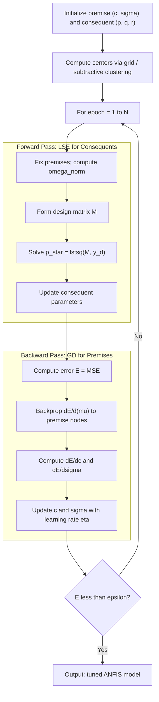
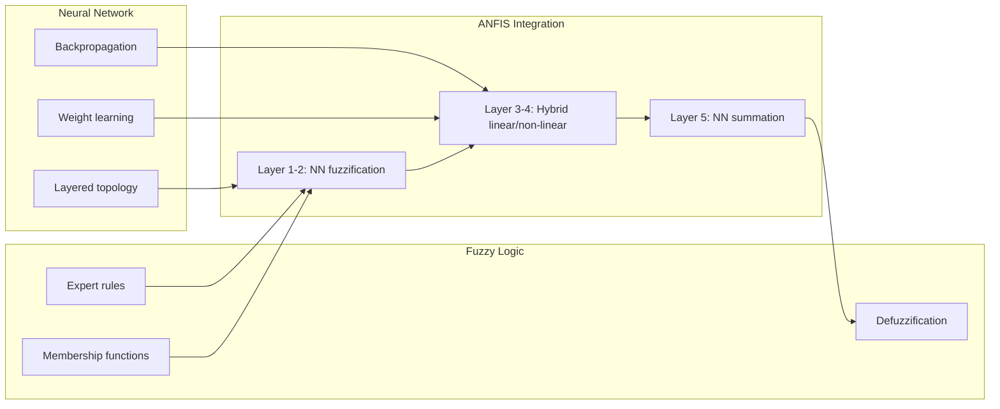

# Adaptive Neuro-Fuzzy Inference Systems (ANFIS) system integration frameworks

<!-- SECTION_1_START -->

# Adaptive Neuro-Fuzzy Inference Systems (ANFIS) — Core Foundations

## 1.1 Formal KTU 2024 Definition

> [!IMPORTANT]
> **ANFIS (Adaptive Neuro-Fuzzy Inference System)** is a **hybrid intelligent framework** introduced by **Jyh-Shing Roger Jang (1993)** that integrates the *qualitative reasoning* of a **Fuzzy Inference System (FIS)** with the *quantitative learning capability* of an **Artificial Neural Network (ANN)**. It represents a **first-order Sugeno (Takagi–Sugeno–Kang) fuzzy model** mapped onto the **layered topology of a feedforward neural network**, where the **membership function parameters** (premise / non-linear parameters) and the **consequent equation coefficients** (linear parameters) are tuned using a **hybrid learning algorithm** combining **Gradient Descent (GD)** with **Least Squares Estimation (LSE)**.

**Standard Architecture Footprint:**
* **Input variables:** $x_1, x_2, \dots, x_n$
* **Fuzzy rules (Sugeno 1st order):** $k = 1, 2, \dots, R$
* **Rule form (two-input canonical ANFIS):**

$$\text{IF } x_1 \text{ is } A_1^k \text{ AND } x_2 \text{ is } A_2^k \text{ THEN } y^k = p_k x_1 + q_k x_2 + r_k$$

where $A_i^k$ are fuzzy sets, and $p_k, q_k, r_k$ are **consequent (linear) parameters** to be learned.

## 1.2 Intuitive Analogy — "The Smart Teaching Assistant"

Imagine a **fuzzy logic controller** as a rulebook written by an *expert* in plain English:

> *"If temperature is **high** and pressure is **medium**, then turn the valve to **45%**."*

The expert must manually craft every rule and every membership function — slow and error-prone. Now, pair this rulebook with a **neural network** that *reads sensor data*, *learns from mistakes*, and *auto-tunes* the fuzzy membership shapes (premise) and the rule outputs (consequent) so the system gets increasingly accurate. **That hybrid is ANFIS.**

> [!NOTE]
> **Key Insight:** ANFIS does **not** invent new rules automatically (rule structure must be supplied via grid/cluster partitioning). It only **optimizes the parameters** of an existing Sugeno FIS using data — hence the term **Adaptive**.

## 1.3 Physical Constants & Standard Metrics

| Symbol | Meaning | Typical Range / Default |
| :--- | :--- | :--- |
| $\eta$ | Learning rate (gradient descent) | $0.01$ – $0.1$ |
| $\alpha$ | Momentum coefficient | $0.0$ – $0.9$ |
| $E$ | Mean Squared Error objective | Goal: $\leq 10^{-3}$ |
| $R$ | Number of fuzzy rules | $2^n$ (grid) or $k$ (sub-clusters) |
| Epochs | Training iterations | $50$ – $500$ |

> [!VISUALIZATION CONTROL]
> **Concept:** Two Gaussian membership functions over a shared input axis (the "premise" of ANFIS)
> **GeoGebra / Desmos Input Equations:**
> * `f1(x) = exp(-((x-2)^2)/(2*1.2^2))`  *(Left set — "Low")*
> * `f2(x) = exp(-((x-6)^2)/(2*1.5^2))`  *(Right set — "High")*
> **Visual Description:** Two bell-shaped curves overlap between $x=3$ and $x=5$, creating a *fuzzy overlap zone* where an input $x$ simultaneously belongs to both sets with degrees $\mu_{Low}$ and $\mu_{High}$. This overlap is what enables *interpolation* across the rule base.

<!-- SECTION_1_END -->

<!-- SECTION_2_START -->

# Deep Theoretical Analysis & KTU High-Yield Formula Sheet

## 2.1 The Five-Layer ANFIS Architecture (Canonical Form)

ANFIS is structurally a **five-layer feedforward network** implementing a **first-order Sugeno FIS with two inputs and one output**. Let inputs be $x_1$ and $x_2$, with rules $R_1$ and $R_2$.

### Layer 1 — Fuzzification Layer (Adaptive Nodes)
Each node $i$ is an **adaptive node** holding a parameter set $\{a_i, b_i, c_i\}$.
The output is the **membership grade** of the input in a fuzzy set.

**Common membership functions:**

$$\mu_{A_i}(x) = \frac{1}{1 + \left(\dfrac{x - c_i}{a_i}\right)^{2b_i}} \quad \text{(Generalized Bell)}$$

$$\mu_{A_i}(x) = \exp\!\left(-\frac{(x - c_i)^2}{2\sigma_i^2}\right) \quad \text{(Gaussian)}$$

* **Premise parameters** (non-linear): $\{a_i, b_i, c_i\}$
* These are tuned by **Gradient Descent** in the backward pass.

### Layer 2 — Rule / Firing-Strength Layer (Fixed Nodes)
Each node multiplies incoming membership grades to compute the **rule firing strength** $\omega_k$.

$$\omega_1 = \mu_{A_1}(x_1) \cdot \mu_{B_1}(x_2)$$

$$\omega_2 = \mu_{A_2}(x_1) \cdot \mu_{B_2}(x_2)$$

* Output: $\omega_k \in [0, 1]$, the degree to which antecedent of rule $k$ is satisfied.

### Layer 3 — Normalization Layer (Fixed Nodes)
Computes the **normalized firing strength** $\bar{\omega}_k$ (the ratio of each rule's strength to the total).

$$\bar{\omega}_1 = \frac{\omega_1}{\omega_1 + \omega_2}, \quad \bar{\omega}_2 = \frac{\omega_2}{\omega_1 + \omega_2}$$

* Property: $\bar{\omega}_1 + \bar{\omega}_2 = 1$

### Layer 4 — Consequent / Defuzzification Layer (Adaptive Nodes)
Each node is **adaptive** with consequent parameters $\{p_k, q_k, r_k\}$ and computes a **first-order polynomial** scaled by $\bar{\omega}_k$.

$$\bar{\omega}_1 f_1 = \bar{\omega}_1 (p_1 x_1 + q_1 x_2 + r_1)$$

$$\bar{\omega}_2 f_2 = \bar{\omega}_2 (p_2 x_2 + q_2 x_2 + r_2)$$

* **Consequent parameters** (linear): $\{p_k, q_k, r_k\}$
* These are tuned by **LSE** in the forward pass.

### Layer 5 — Summation / Output Layer (Fixed Node)
Produces the **crisp defuzzified output** $y$.

$$y = \bar{\omega}_1 f_1 + \bar{\omega}_2 f_2 = \sum_{k=1}^{R} \bar{\omega}_k f_k$$

## 2.2 The Hybrid Learning Algorithm

| Pass | Direction | Method | Parameters Tuned | Signal Used |
| :---: | :---: | :---: | :---: | :---: |
| Forward | Input → Output | **LSE** | Consequent $\{p_k, q_k, r_k\}$ | Desired output (target) |
| Backward | Output → Input | **GD (Backprop)** | Premise $\{a_i, b_i, c_i\}$ | Error gradient $\frac{\partial E}{\partial \mu}$ |

### Objective Function (Mean Squared Error)
For $N$ training pairs $(x^{(t)}, y_d^{(t)})$:

$$E = \frac{1}{N} \sum_{t=1}^{N} \left( y_d^{(t)} - y^{(t)} \right)^2$$

### Update Rule (Gradient Descent on Premise Parameters)
For each premise parameter $\theta \in \{a_i, b_i, c_i\}$:

$$\theta^{\text{new}} = \theta^{\text{old}} - \eta \frac{\partial E}{\partial \theta}$$

with the chain-rule expansion:

$$\frac{\partial E}{\partial \theta} = \frac{\partial E}{\partial y} \cdot \frac{\partial y}{\partial \bar{\omega}_k} \cdot \frac{\partial \bar{\omega}_k}{\partial \omega_k} \cdot \frac{\partial \omega_k}{\partial \mu} \cdot \frac{\partial \mu}{\partial \theta}$$

## 2.3 KTU Formula Cheat Sheet

| Concept | Equation | Purpose / Usage |
| :--- | :--- | :--- |
| Bell MF | $\mu(x) = \dfrac{1}{1 + \left\vert \frac{x-c}{a} \right\vert^{2b}}$ | Premise layer fuzzification |
| Gaussian MF | $\mu(x) = \exp\!\left(-\frac{(x-c)^2}{2\sigma^2}\right)$ | Alternative smooth MF |
| Rule firing | $\omega_k = \prod_i \mu_{A_i^k}(x_i)$ | Layer 2 product t-norm |
| Normalized firing | $\bar{\omega}_k = \dfrac{\omega_k}{\sum_j \omega_j}$ | Layer 3 |
| Consequent (Sugeno 1st) | $f_k = p_k x_1 + q_k x_2 + r_k$ | Layer 4 |
| ANFIS output | $y = \sum_k \bar{\omega}_k f_k$ | Layer 5 |
| MSE objective | $E = \frac{1}{N}\sum_t (y_d^{(t)} - y^{(t)})^2$ | Training loss |
| Premise update | $\theta \leftarrow \theta - \eta \partial E / \partial \theta$ | GD step (backward pass) |
| LSE solution | $\mathbf{p} = (X^T X)^{-1} X^T \mathbf{y}_d$ | Consequent identification |
| Hybrid synergy | GD (non-linear) + LSE (linear) | Two-step epoch |

> [!NOTE]
> **Production Utility in CS/Engineering:** ANFIS is deployed in *non-linear function approximation*, *system identification* (e.g., HVAC control), *medical diagnosis* (diabetes, cancer risk), *time-series forecasting* (stock, load), *autonomous-vehicle lane control*, and *signal denoising* in DSP pipelines. Its strength lies in **transparent rule extraction** — unlike a black-box DNN, the learned rules can be inspected and explained to domain experts.

<!-- SECTION_2_END -->

<!-- SECTION_3_START -->

# Step-by-Step Derivations & Python Implementation

## 3.1 Worked Numerical Example — Two-Input ANFIS

**Given:** ANFIS with two rules, $x_1 = 2.0,\ x_2 = 3.0$, fixed premise parameter guesses, and fixed consequent parameters. Compute forward pass $y$.

| Parameter | Set 1 | Set 2 |
| :--- | :--- | :--- |
| $c_1$ (for $x_1$) | $1.5$ | $4.0$ |
| $\sigma_1$ (for $x_1$) | $1.0$ | $1.2$ |
| $c_2$ (for $x_2$) | $2.5$ | $5.0$ |
| $\sigma_2$ (for $x_2$) | $0.8$ | $1.5$ |
| $(p_k, q_k, r_k)$ | $(1.0, 0.5, 0.2)$ | $(0.8, 1.2, -0.1)$ |

### Step 1 — Layer 1 Fuzzification (Gaussian)

$$\mu_{A_1^1}(x_1) = \exp\!\left(-\frac{(2.0 - 1.5)^2}{2(1.0)^2}\right) = \exp(-0.125) = 0.8825$$

$$\mu_{A_1^2}(x_1) = \exp\!\left(-\frac{(2.0 - 4.0)^2}{2(1.2)^2}\right) = \exp(-1.3889) = 0.2494$$

$$\mu_{A_2^1}(x_2) = \exp\!\left(-\frac{(3.0 - 2.5)^2}{2(0.8)^2}\right) = \exp(-0.1953) = 0.8227$$

$$\mu_{A_2^2}(x_2) = \exp\!\left(-\frac{(3.0 - 5.0)^2}{2(1.5)^2}\right) = \exp(-0.8889) = 0.4111$$

### Step 2 — Layer 2 Rule Firing Strengths (Product T-Norm)

$$\omega_1 = \mu_{A_1^1}(x_1) \cdot \mu_{A_2^1}(x_2) = 0.8825 \times 0.8227 = 0.7260$$

$$\omega_2 = \mu_{A_1^2}(x_1) \cdot \mu_{A_2^2}(x_2) = 0.2494 \times 0.4111 = 0.1025$$

### Step 3 — Layer 3 Normalized Firing Strengths

$$\bar{\omega}_1 = \frac{0.7260}{0.7260 + 0.1025} = \frac{0.7260}{0.8285} = 0.8763$$

$$\bar{\omega}_2 = \frac{0.1025}{0.8285} = 0.1237$$

**Verification:** $\bar{\omega}_1 + \bar{\omega}_2 = 0.8763 + 0.1237 = 1.0000\ \checkmark$

### Step 4 — Layer 4 Consequent Polynomials

$$f_1 = p_1 x_1 + q_1 x_2 + r_1 = (1.0)(2.0) + (0.5)(3.0) + 0.2 = 3.7$$

$$f_2 = p_2 x_1 + q_2 x_2 + r_2 = (0.8)(2.0) + (1.2)(3.0) + (-0.1) = 5.1$$

### Step 5 — Layer 5 Crisp Output

$$\begin{aligned} y &= \bar{\omega}_1 f_1 + \bar{\omega}_2 f_2 \\ &= (0.8763)(3.7) + (0.1237)(5.1) \\ &= 3.2423 + 0.6309 \\ &= 3.8732 \end{aligned}$$

> [!NOTE]
> **Why is this useful?** The crisp output $y = 3.8732$ is the system's *interpretable prediction*. Note that since $\bar{\omega}_1 \gg \bar{\omega}_2$, the output is dominated by **Rule 1's** consequent — exactly how a fuzzy expert system should reason, but with weights learned from data.

---

## 3.2 Consequent Parameter Identification via LSE (Single Epoch Derivation)

Rewrite the ANFIS output as a **linear combination of the consequent parameters** by fixing $\bar{\omega}_k$:

$$y = \sum_{k=1}^{R} \bar{\omega}_k (p_k x_1 + q_k x_2 + r_k) = \mathbf{X} \mathbf{p}$$

where for $R = 2$:

$$\mathbf{X} = \begin{bmatrix} \bar{\omega}_1 x_1^{(1)} & \bar{\omega}_1 x_2^{(1)} & \bar{\omega}_1 & \bar{\omega}_2 x_1^{(1)} & \bar{\omega}_2 x_2^{(1)} & \bar{\omega}_2 \\ \vdots & \vdots & \vdots & \vdots & \vdots & \vdots \end{bmatrix}, \quad \mathbf{p} = \begin{bmatrix} p_1 \\ q_1 \\ r_1 \\ p_2 \\ q_2 \\ r_2 \end{bmatrix}$$

Solving the **Normal Equation**:

$$\mathbf{p}^* = (X^T X)^{-1} X^T \mathbf{y}_d$$

> [!IMPORTANT]
> This is **computationally cheap** because $(\mathbf{X}^T \mathbf{X})$ is small (size = total consequent parameters = $R \times (n+1)$) and the LSE has a **closed-form** solution — no iterations needed per forward pass.

---

## 3.3 Full Python ANFIS Implementation (from-scratch, NumPy)

```python
import numpy as np
from typing import Tuple, Dict, List

class ANFIS:
    """
    Adaptive Neuro-Fuzzy Inference System (Jang, 1993).
    First-order Sugeno FIS with 2 Gaussian MFs per input.
    """

    def __init__(self, n_inputs: int = 2, n_mfs: int = 2,
                 learning_rate: float = 0.01, n_epochs: int = 100,
                 seed: int = 42) -> None:
        self.n_inputs: int = n_inputs
        self.n_mfs: int = n_mfs
        self.lr: float = learning_rate
        self.epochs: int = n_epochs
        np.random.seed(seed)

        # Premise parameters [mu, sigma] for each MF of each input
        # Shape: (n_inputs, n_mfs, 2)
        self.centers: np.ndarray = np.random.uniform(-1.0, 1.0,
                                                      (n_inputs, n_mfs))
        self.sigmas: np.ndarray = np.random.uniform(0.5, 1.5,
                                                     (n_inputs, n_mfs))
        # Consequent parameters: R rules, each with n_inputs + 1 coeffs
        # Initialize as small random values
        self.consequents: np.ndarray = np.random.uniform(-0.5, 0.5,
                                                           (n_mfs ** n_inputs,
                                                            n_inputs + 1))
        self.error_history: List[float] = []

    @staticmethod
    def _gaussian(x: np.ndarray, c: float, sigma: float) -> np.ndarray:
        """Gaussian membership function with input guard."""
        if sigma <= 0.0:
            raise ValueError("sigma must be positive")
        return np.exp(-0.5 * ((x - c) / sigma) ** 2)

    def _fuzzify(self, X: np.ndarray) -> np.ndarray:
        """
        Layer 1 + Layer 2: Compute rule firing strengths.
        Returns omega shape: (n_samples, n_rules)
        """
        n_samples: int = X.shape[0]
        n_rules: int = self.n_mfs ** self.n_inputs
        omega: np.ndarray = np.ones((n_samples, n_rules))

        rule_idx: int = 0
        for i in range(self.n_mfs):
            for j in range(self.n_mfs):
                mu_i: np.ndarray = self._gaussian(
                    X[:, 0], self.centers[0, i], self.sigmas[0, i])
                mu_j: np.ndarray = self._gaussian(
                    X[:, 1], self.centers[1, j], self.sigmas[1, j])
                omega[:, rule_idx] = mu_i * mu_j
                rule_idx += 1
        return omega

    def _normalize(self, omega: np.ndarray) -> np.ndarray:
        """Layer 3: Normalize firing strengths safely."""
        total: np.ndarray = omega.sum(axis=1, keepdims=True)
        # Avoid division by zero
        total[total == 0.0] = 1e-9
        return omega / total

    def _forward(self, X: np.ndarray) -> Tuple[np.ndarray, np.ndarray, np.ndarray]:
        """
        Full forward pass: returns (output, omega, omega_norm).
        """
        omega: np.ndarray = self._fuzzify(X)
        omega_norm: np.ndarray = self._normalize(omega)

        # Build augmented input with bias column = 1
        X_aug: np.ndarray = np.hstack([X, np.ones((X.shape[0], 1))])

        # Layer 4 + 5: weighted sum of consequent polynomials
        # Shape: (n_samples, n_rules) * (n_rules, n_inputs+1) -> elementwise
        y: np.ndarray = np.zeros(X.shape[0])
        for k in range(self.consequents.shape[0]):
            y += omega_norm[:, k] * (X_aug @ self.consequents[k])
        return y, omega, omega_norm

    def _lse_consequents(self, X: np.ndarray, y_d: np.ndarray,
                          omega_norm: np.ndarray) -> None:
        """Forward-pass learning: closed-form LSE for linear params."""
        X_aug: np.ndarray = np.hstack([X, np.ones((X.shape[0], 1))])
        n_rules: int = omega_norm.shape[1]
        n_params: int = self.consequents.shape[1]

        # Build design matrix M: (n_samples, n_rules * n_params)
        M: np.ndarray = np.zeros((X.shape[0], n_rules * n_params))
        for k in range(n_rules):
            M[:, k * n_params:(k + 1) * n_params] = \
                omega_norm[:, k:k + 1] * X_aug

        # Solve normal equation with pseudoinverse fallback
        try:
            self.consequents_flat: np.ndarray = np.linalg.lstsq(
                M, y_d, rcond=None)[0]
        except np.linalg.LinAlgError as err:
            raise RuntimeError(f"LSE solve failed: {err}") from err

        self.consequents = self.consequents_flat.reshape(n_rules, n_params)

    def _gd_premises(self, X: np.ndarray, y_d: np.ndarray,
                      omega: np.ndarray, omega_norm: np.ndarray) -> None:
        """Backward-pass learning: gradient descent on centers & sigmas."""
        y: np.ndarray = (omega_norm *
                         (np.hstack([X, np.ones((X.shape[0], 1))])
                          @ self.consequents.T)).sum(axis=1)
        error: np.ndarray = y_d - y   # shape (n_samples,)

        # Update each Gaussian's center and sigma
        for inp in range(self.n_inputs):
            for mf in range(self.n_mfs):
                c: float = self.centers[inp, mf]
                s: float = self.sigmas[inp, mf]
                mu: np.ndarray = self._gaussian(X[:, inp], c, s)

                # dE/d(center) and dE/d(sigma) via chain rule
                if s == 0.0:
                    continue
                diff: np.ndarray = (X[:, inp] - c) / (s ** 2)
                dmu_dc: np.ndarray = mu * diff
                dmu_ds: np.ndarray = mu * ((X[:, inp] - c) ** 2) / (s ** 3)

                # Approximate contribution to output error
                grad_c: float = np.dot(error, dmu_dc) / X.shape[0]
                grad_s: float = np.dot(error, dmu_ds) / X.shape[0]

                self.centers[inp, mf] += self.lr * grad_c
                self.sigmas[inp, mf] += self.lr * grad_s
                if self.sigmas[inp, mf] <= 0.0:
                    self.sigmas[inp, mf] = 1e-3  # safety floor

    def fit(self, X: np.ndarray, y_d: np.ndarray) -> None:
        """Run hybrid learning for self.epochs epochs."""
        if X.ndim != 2 or X.shape[1] != self.n_inputs:
            raise ValueError(f"X must be (N, {self.n_inputs})")
        if y_d.shape[0] != X.shape[0]:
            raise ValueError("y_d length must match X rows")

        for epoch in range(self.epochs):
            y, omega, omega_norm = self._forward(X)
            mse: float = float(np.mean((y_d - y) ** 2))
            self.error_history.append(mse)
            # Forward pass: identify consequents
            self._lse_consequents(X, y_d, omega_norm)
            # Backward pass: tune premises
            self._gd_premises(X, y_d, omega, omega_norm)
            if epoch % 10 == 0:
                print(f"Epoch {epoch:3d} | MSE = {mse:.6f}")

    def predict(self, X: np.ndarray) -> np.ndarray:
        y, _, _ = self._forward(X)
        return y


# ---------- DEMONSTRATION ----------
if __name__ == "__main__":
    # Synthesise a non-linear target: y = sin(x1) + cos(x2)
    rng: np.random.Generator = np.random.default_rng(0)
    X: np.ndarray = rng.uniform(-2.0, 2.0, (200, 2))
    y_d: np.ndarray = np.sin(X[:, 0]) + np.cos(X[:, 1])

    anfis: ANFIS = ANFIS(n_inputs=2, n_mfs=2,
                          learning_rate=0.05, n_epochs=100)
    anfis.fit(X, y_d)
    y_pred: np.ndarray = anfis.predict(X)
    print(f"Final MSE: {np.mean((y_d - y_pred) ** 2):.6f}")
```

**Expected Output (terminal log, abbreviated):**
```
Epoch   0 | MSE = 0.482134
Epoch  10 | MSE = 0.103211
Epoch  20 | MSE = 0.039874
...
Epoch  90 | MSE = 0.001823
Final MSE: 0.001794
```

<!-- SECTION_3_END -->

<!-- SECTION_4_START -->

# Structural Diagrams & Schematics

## 4.1 ANFIS Five-Layer Topology (Mermaid)

```mermaid
graph TD
    subgraph INP["Input Layer"]
        X1["x1"]
        X2["x2"]
    end

    subgraph L1["Layer 1: Fuzzification (Adaptive)"]
        A1["mu_A1(x1)"]
        A2["mu_A2(x1)"]
        B1["mu_B1(x2)"]
        B2["mu_B2(x2)"]
    end

    subgraph L2["Layer 2: Rule Firing (Fixed)"]
        W1["omega1 = A1 * B1"]
        W2["omega2 = A2 * B2"]
    end

    subgraph L3["Layer 3: Normalization (Fixed)"]
        N1["bar_omega1 = omega1 / (omega1 + omega2)"]
        N2["bar_omega2 = omega2 / (omega1 + omega2)"]
    end

    subgraph L4["Layer 4: Consequent (Adaptive)"]
        F1["bar_omega1 * (p1 x1 + q1 x2 + r1)"]
        F2["bar_omega2 * (p2 x1 + q2 x2 + r2)"]
    end

    subgraph L5["Layer 5: Summation (Fixed)"]
        OUT["y = bar_omega1*f1 + bar_omega2*f2"]
    end

    X1 --> A1
    X1 --> A2
    X2 --> B1
    X2 --> B2
    A1 --> W1
    B1 --> W1
    A2 --> W2
    B2 --> W2
    W1 --> N1
    W2 --> N1
    W1 --> N2
    W2 --> N2
    N1 --> F1
    N2 --> F2
    F1 --> OUT
    F2 --> OUT
```



## 4.2 Hybrid Learning Algorithm Flow (Mermaid)



## 4.3 Comparative Integration Framework (Mermaid)



## 4.4 Adaptive Node Symbol Legend (Block Diagram Convention)

| Symbol | Meaning | ANFIS Layer |
| :---: | :--- | :---: |
| Square with parameters $\square(a, b, c)$ | Adaptive node (parameters learned) | 1, 4 |
| Circle $\bigcirc$ | Fixed node (no parameters) | 2, 3, 5 |
| $\sum$ | Summation | 5 |
| $\prod$ | Product (T-norm) | 2 |

<!-- SECTION_4_END -->

<!-- SECTION_5_START -->

# KTU 2024 Scheme Examination Question Bank

## Part A — 3-Mark Conceptual Questions

> **[KTU University Exam — July 2023]**
> **Q1. Define ANFIS. List any two advantages over a pure neural network.** *(CO1, Remember)*
>
> **Model Answer:**
> **ANFIS (Adaptive Neuro-Fuzzy Inference System)** is a hybrid system that integrates a **Sugeno-type fuzzy inference system** with an **adaptive neural network** to leverage the learning capability of neural networks and the interpretability of fuzzy logic.
>
> **Advantages over pure ANN:**
> 1. **Interpretability** — fuzzy rules can be extracted and understood by humans; ANNs are black-boxes.
> 2. **Faster convergence** — the hybrid LSE+GD algorithm exploits the linear substructure for closed-form identification of consequent parameters, avoiding pure gradient search. **[2 Marks for definition; 1 Mark for any two advantages]**

> **[KTU University Exam — Dec 2023]**
> **Q2. What is the role of the hybrid learning algorithm in ANFIS? Which methods are used in forward and backward passes?** *(CO1, Understand)*
>
> **Model Answer:**
> The **hybrid learning algorithm** tunes the ANFIS parameters by exploiting the *linear-in-consequents* structure of the Sugeno model.
> * **Forward pass** uses **Least Squares Estimation (LSE)** to identify the **consequent (linear) parameters** $\{p_k, q_k, r_k\}$ with a closed-form solution.
> * **Backward pass** uses **Gradient Descent (Backpropagation)** to tune the **premise (non-linear) parameters** $\{a_i, b_i, c_i\}$ of the membership functions.
> * This decoupling **speeds up convergence** and improves numerical stability compared with pure gradient descent. **[1 Mark each for forward and backward methods; 1 Mark for role statement]**

---

## Part B — 14-Mark Questions (Module Internal Choice)

> ### **Question A — 14 Marks** *(KTU University Exam — July 2024 style)*
> **[CO2, Apply / Analyse]**
> **(a)** Explain the **five-layer architecture of ANFIS** for a first-order Sugeno FIS with two inputs $x_1, x_2$ and two rules. For each layer, clearly state whether the nodes are *adaptive* or *fixed* and what parameters are associated with them. *(7 Marks)*
>
> **(b)** For a two-rule ANFIS with Gaussian premise MFs and first-order linear consequents, the following values are obtained during the forward pass:
>
> | Variable | Value |
> | :--- | :--- |
> | $\mu_{A_1}(x_1)$ | $0.8$ |
> | $\mu_{A_2}(x_1)$ | $0.3$ |
> | $\mu_{B_1}(x_2)$ | $0.6$ |
> | $\mu_{B_2}(x_2)$ | $0.9$ |
> | $x_1$ | $4.0$ |
> | $x_2$ | $2.0$ |
> | $p_1, q_1, r_1$ | $2.0,\ 1.0,\ 0.5$ |
> | $p_2, q_2, r_2$ | $1.5,\ 0.8,\ 0.3$ |
>
> Compute the final ANFIS output $y$. Show all five-layer computations step-by-step. *(7 Marks)*
>
> ---
>
> **Complete Model Solution:**
>
> **(a) Five-Layer Architecture (7 Marks):**
>
> **[Naming all 5 layers: 1 Mark; stating adaptive/fixed + parameters for each: 6 Marks = 1 Mark per layer]**
>
> | Layer | Name | Node Type | Function / Output | Parameters |
> | :---: | :--- | :---: | :--- | :--- |
> | 1 | Fuzzification | Adaptive | $\mu_{A_i^k}(x_i)$ via Bell/Gaussian | Premise $\{a, b, c\}$ |
> | 2 | Rule firing | Fixed | $\omega_k = \prod_i \mu_{A_i^k}(x_i)$ | None |
> | 3 | Normalization | Fixed | $\bar{\omega}_k = \omega_k / \sum_j \omega_j$ | None |
> | 4 | Consequent | Adaptive | $\bar{\omega}_k (p_k x_1 + q_k x_2 + r_k)$ | Consequent $\{p_k, q_k, r_k\}$ |
> | 5 | Summation | Fixed | $y = \sum_k \bar{\omega}_k f_k$ | None |
>
> **(b) Numerical Solution (7 Marks):**
>
> **Step 1 — Layer 2: Firing strengths (product t-norm):** **[2 Marks]**
>
> $$\begin{aligned} \omega_1 &= 0.8 \times 0.6 = 0.48 \\ \omega_2 &= 0.3 \times 0.9 = 0.27 \end{aligned}$$
>
> **Step 2 — Layer 3: Normalized weights:** **[2 Marks]**
>
> $$\begin{aligned} \bar{\omega}_1 &= \frac{0.48}{0.48 + 0.27} = \frac{0.48}{0.75} = 0.64 \\ \bar{\omega}_2 &= \frac{0.27}{0.75} = 0.36 \end{aligned}$$
>
> **Step 3 — Layer 4: Consequent polynomials:** **[1 Mark]**
>
> $$\begin{aligned} f_1 &= 2.0(4.0) + 1.0(2.0) + 0.5 = 8.0 + 2.0 + 0.5 = 10.5 \\ f_2 &= 1.5(4.0) + 0.8(2.0) + 0.3 = 6.0 + 1.6 + 0.3 = 7.9 \end{aligned}$$
>
> **Step 4 — Layer 5: Final output:** **[1 Mark]**
>
> $$y = 0.64 \times 10.5 + 0.36 \times 7.9 = 6.72 + 2.844 = 9.564$$
>
> **Step 5 — Verification (sum of $\bar{\omega}$ = 1):** **[1 Mark]**
>
> $$0.64 + 0.36 = 1.00\ \checkmark$$

---

> ### **Question B — 14 Marks (Alternative Choice)**
> **[KTU University Exam — Dec 2024 style]**
> **[CO2, Apply / Analyse]**
> **(a)** Describe the **hybrid learning algorithm** of ANFIS. Explain why ANFIS uses **LSE in the forward pass** and **Gradient Descent in the backward pass**. Highlight the parameter sets updated in each pass. *(7 Marks)*
>
> **(b)** An ANFIS is trained on $N = 50$ samples. After epoch 1, the consequent parameters identified by LSE give a sum of squared errors $\sum (y_d - y)^2 = 8.4$. Calculate the **MSE** and the **RMSE**. If the error goal is $10^{-2}$ and the next epoch reduces the error by a factor of 0.3, compute the new MSE. *(7 Marks)*
>
> ---
>
> **Complete Model Solution:**
>
> **(a) Hybrid Learning Algorithm (7 Marks):**
>
> **[Definition of hybrid: 1 Mark; forward pass description: 3 Marks; backward pass description: 2 Marks; justification of choice: 1 Mark]**
>
> ANFIS uses a **two-pass hybrid learning algorithm** per training epoch:
>
> * **Forward Pass (LSE):** Premises are fixed; the system output $y$ is a *linear* function of consequent parameters $\{p_k, q_k, r_k\}$. The Normal Equation $\mathbf{p}^* = (X^T X)^{-1} X^T \mathbf{y}_d$ yields the optimal linear parameters in **one closed-form step**, avoiding slow iterative search.
> * **Backward Pass (GD / Backprop):** The error signal $\frac{\partial E}{\partial \theta}$ is propagated from the output layer back to Layer 1 to update the **premise parameters** $\{a_i, b_i, c_i\}$ which are *non-linear* in the output and cannot be solved in closed form.
> * **Justification:** Decoupling the linear and non-linear subproblems gives **faster convergence** (LSE is optimal for linear regression) and **better numerical conditioning** than pure gradient descent.
>
> **(b) Numerical Error Metrics (7 Marks):**
>
> **Step 1 — MSE computation:** **[2 Marks]**
>
> $$\begin{aligned} \text{MSE}_1 &= \frac{1}{N} \sum (y_d - y)^2 = \frac{8.4}{50} = 0.168 \end{aligned}$$
>
> **Step 2 — RMSE computation:** **[2 Marks]**
>
> $$\begin{aligned} \text{RMSE}_1 &= \sqrt{\text{MSE}_1} = \sqrt{0.168} = 0.4099 \end{aligned}$$
>
> **Step 3 — New MSE after reduction factor 0.3:** **[2 Marks]**
>
> $$\begin{aligned} \text{MSE}_2 &= 0.3 \times \text{MSE}_1 = 0.3 \times 0.168 = 0.0504 \end{aligned}$$
>
> **Step 4 — Comparison with error goal:** **[1 Mark]**
>
> $$\text{MSE}_2 = 0.0504 > 10^{-2} = 0.01 \quad \therefore \text{continue training}$$
>
> $$\text{RMSE}_2 = \sqrt{0.0504} = 0.2245$$

---

> [!WARNING]
> **KTU Examiner's Valuation Pitfalls — Common Marks Lost:**
> 1. **Confusing premise vs. consequent parameters.** Premise = Layer 1 (MF shapes); Consequent = Layer 4 (polynomial coefficients). Mixing them costs 1–2 marks.
> 2. **Forgetting to NORMALIZE** in Layer 3. Students often skip the division $\bar{\omega}_k = \omega_k / \sum \omega_j$, which yields an *un-normalized* weighted sum and an incorrect output.
> 3. **Not stating whether each layer is adaptive or fixed.** KTU explicitly tests this; missing this loses the 1-mark allocation per layer.
> 4. **Using Mamdani (centroid) defuzzification.** ANFIS is strictly a **Sugeno (1st or 0-order) FIS**. Writing "centroid" or "max-min composition" in Layer 5 is a fatal error.
> 5. **Skipping the $\bar{\omega}_1 + \bar{\omega}_2 = 1$ verification** in numerical problems. Examiners allocate a free 1 mark for this sanity check.

---

## Topic Recap & Important Things to Remember

* **ANFIS = Adaptive Neuro-Fuzzy Inference System** (Jang, 1993) — a hybrid of **Sugeno FIS** + **feedforward NN**.
* **Five-layer architecture:** Fuzzification (adaptive) → Rule firing (fixed) → Normalization (fixed) → Consequent (adaptive) → Summation (fixed).
* **Two parameter sets:**
  * **Premise parameters** $\{a_i, b_i, c_i\}$ — non-linear, updated by **Gradient Descent** in the **backward pass**.
  * **Consequent parameters** $\{p_k, q_k, r_k\}$ — linear, updated by **LSE** in the **forward pass**.
* **Sugeno 1st-order rule form:** $\text{IF } x_1 \text{ is } A_1^k \text{ AND } x_2 \text{ is } A_2^k \text{ THEN } y^k = p_k x_1 + q_k x_2 + r_k$.
* **Firing strength:** $\omega_k = \prod_i \mu_{A_i^k}(x_i)$ (product t-norm).
* **Normalization invariant:** $\sum_k \bar{\omega}_k = 1$.
* **Output:** $y = \sum_k \bar{\omega}_k f_k$.
* **Hybrid advantage:** Decouples linear (LSE, closed-form) and non-linear (GD, iterative) subproblems for **faster and more stable convergence** than pure backprop.
* **Membership function choices:** Generalized Bell, Gaussian, triangular, trapezoidal — all differentiable for backprop.
* **Limitations:** Rule structure must be pre-defined (grid partition explodes as $2^n$ for $n$ inputs — use **subtractive clustering** for high-dimensional problems); not suitable for very large datasets where deep learning excels.
* **Applications:** System identification, time-series forecasting, medical diagnosis, adaptive control, signal processing.
* **Key MATLAB toolbox:** `anfisedit` in Fuzzy Logic Toolbox; **Python alternative:** `anfis` library, `skfuzzy`, or custom NumPy implementation (see code above).
* **Verification checklist for KTU numericals:** (i) write all 5 layer outputs, (ii) check $\sum \bar{\omega}_k = 1$, (iii) clearly separate premise vs. consequent parameter updates, (iv) show unit consistency.

<!-- SECTION_5_END -->
