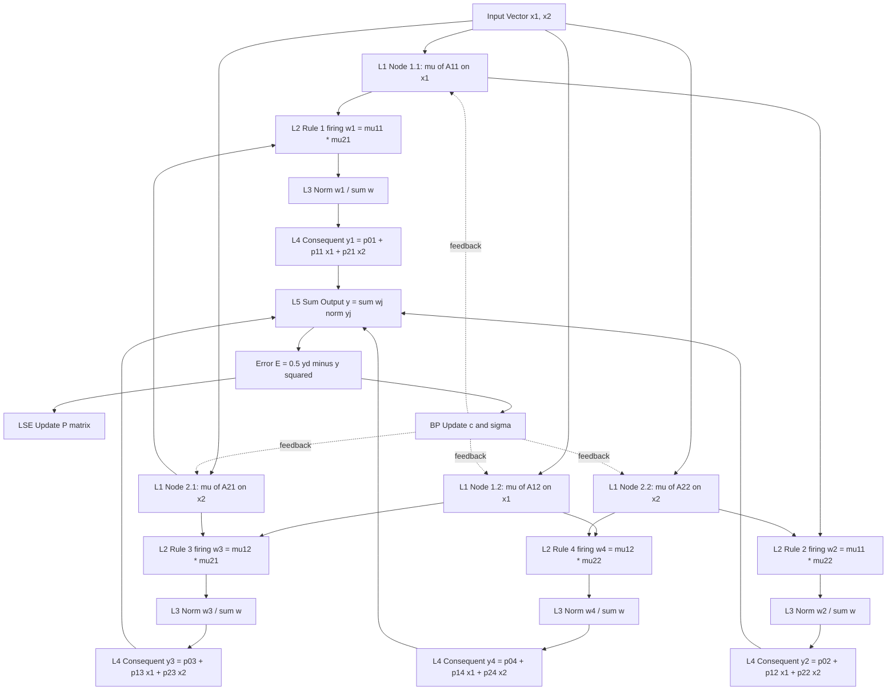
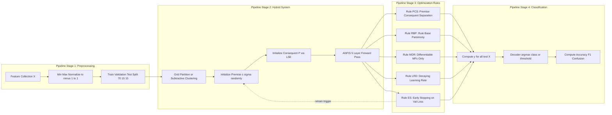

# Classification pipelines optimization rules within hybrid system layouts

<!-- SECTION_1_START -->
# 1. Core Technical Definition & Intuitive Overview

## 1.1 Formal Definition (KTU 2024 Scheme Terminology)

A **Classification Pipeline** within a **Hybrid Neuro-Fuzzy System Layout** is a structured, modular, and sequentially coupled computational graph in which a *Fuzzy Inference System (FIS)* provides the linguistic rule-based reasoning backbone and an *Artificial Neural Network (ANN)* provides the adaptive, data-driven parameter estimation engine. The pipeline ingests raw feature vectors $X = \{x_1, x_2, \ldots, x_n\}$, propagates them through stages of **fuzzification, rule firing, normalization, defuzzification, and class-decoding**, while an outer optimization rule (typically a **hybrid learning algorithm** combining *Least Squares Estimation* and *Gradient Descent with Backpropagation*) iteratively refines the membership function parameters and consequent polynomial weights to minimize a classification cost function $E = \frac{1}{2}\sum_k (y_k^{\text{actual}} - y_k^{\text{desired}})^2$.

The **layout** specifies the topological arrangement: **series (cascaded)**, **parallel (ensemble)**, or **embedded (tightly-coupled)** integration, in which the neural network either *learns the fuzzy parameters* (Type-I integration) or the fuzzy system *pre-processes the neural input* (Type-II integration), or both modules *co-evolve synchronously* (Type-III / ANFIS-class integration).

> [!IMPORTANT]
> **KTU Syllabus Highlight (Module 3, PECST417):** Students must be able to describe the architecture of Adaptive Neuro-Fuzzy Inference Systems (ANFIS), state the hybrid learning rule, derive the forward and backward pass equations, and apply the optimization loop to a 2-class classification problem.

## 1.2 Conceptual Analogy / Intuition

Imagine a **hospital diagnostic committee** where:
- The **fuzzy system** is the *senior doctor* who reasons using linguistic rules like *"IF temperature is high AND cough is severe THEN probability of flu is strong"*.
- The **neural network** is the *junior intern* who looks at 10,000 past patient records and learns the precise numeric thresholds for "high temperature" and "severe cough" by minimizing diagnostic errors.
- The **classification pipeline** is the *workflow* — receptionist collects vitals → intern normalizes data → senior doctor applies rules → committee votes on the final class label.
- The **optimization rules** are the *weekly case-review meetings* where thresholds and rules are revised to reduce misdiagnosis.

The committee (hybrid system) outperforms either doctor alone because the rules provide *interpretability* and the neural learner provides *adaptive accuracy*.

## 1.3 Physical Constants & Standard Metrics

| Parameter | Standard Value / Range | Significance |
| :--- | :--- | :--- |
| Learning rate $\eta$ | **0.01 – 0.3** | Step size for gradient descent on premise parameters |
| Error tolerance $\epsilon$ | **$10^{-3}$ – $10^{-5}$** | Convergence threshold for LSE pass |
| Membership type | **Gaussian / Bell** | Most common, infinitely differentiable (gradient-friendly) |
| Defuzzification | **Weighted Average / Centroid** | Standard for Sugeno-type ANFIS |
| Number of epochs $T$ | **100 – 1000** | Typical training cycles for hybrid convergence |

> [!NOTE]
> **Core Definition Box:** *ANFIS* = Adaptive Neuro-Fuzzy Inference System. A five-layer feedforward network where Layer-1 = fuzzification, Layer-2 = rule firing (T-norm product), Layer-3 = normalization, Layer-4 = consequent (Takagi-Sugeno polynomial), Layer-5 = summation (defuzzification).

## 1.4 GeoGebra / Desmos Visualization

> [!VISUALIZATION CONTROL]
> **Concept:** Gaussian Membership Function $\mu_A(x) = \exp\!\left(-\frac{1}{2}\left(\frac{x-c}{\sigma}\right)^2\right)$ used as the fuzzification primitive in ANFIS Layer-1.
>
> **GeoGebra / Desmos Input Equations:**
> * $\mu_{low}(x) = e^{-0.5 \cdot ((x-1)/1.2)^2}$
> * $\mu_{med}(x) = e^{-0.5 \cdot ((x-3)/1.2)^2}$
> * $\mu_{high}(x) = e^{-0.5 \cdot ((x-5)/1.2)^2}$
>
> **Visual Description:** Three bell curves on the x-axis spanning $x \in [0,6]$. Observe the overlap region around $x=2$ and $x=4$ where fuzzy class boundaries are *soft* — this overlap is the source of classification smoothness and is the parameter the neural network learns to shift via $c$ and $\sigma$.

<!-- SECTION_1_END -->

<!-- SECTION_2_START -->
# 2. Deep Theoretical Analysis & KTU High-Yield Formula Sheet

## 2.1 Operational Logic: The Five-Layer ANFIS Pipeline

The ANFIS architecture (Jang, 1993) implements a **first-order Takagi-Sugeno-Kang (TSK)** fuzzy system embedded in a neural topology. For an $n$-input, single-output system with $R$ rules, a typical rule $R_j$ takes the form:

$$R_j : \text{IF } x_1 \text{ is } A_{1j} \text{ AND } x_2 \text{ is } A_{2j} \text{ AND } \cdots \text{ AND } x_n \text{ is } A_{nj} \text{ THEN } y_j = p_{0j} + \sum_{i=1}^{n} p_{ij} x_i$$

The pipeline executes as follows:

* **Layer 1 — Fuzzification Node (Adaptive).** Each node $i,j$ outputs the membership grade $\mu_{A_{ij}}(x_i)$. For Gaussian MF, the node function is:
  $$\mu_{A_{ij}}(x_i) = \exp\!\left(-\frac{1}{2}\left(\frac{x_i - c_{ij}}{\sigma_{ij}}\right)^2\right)$$
  where $c_{ij}$ and $\sigma_{ij}$ are the *premise parameters* adapted via backpropagation.

* **Layer 2 — Rule Firing (Fixed, T-norm Product).** The firing strength of rule $j$ is:
  $$w_j = \prod_{i=1}^{n} \mu_{A_{ij}}(x_i)$$
  This is the *AND* connective implemented as algebraic product.

* **Layer 3 — Normalization (Fixed).** Each rule's relative contribution:
  $$\bar{w}_j = \frac{w_j}{\sum_{k=1}^{R} w_k}$$

* **Layer 4 — Consequent (Adaptive).** Linear combination of inputs scaled by normalized firing:
  $$\bar{w}_j \cdot y_j = \bar{w}_j \cdot \left(p_{0j} + \sum_{i=1}^{n} p_{ij} x_i\right)$$
  where $\{p_{ij}\}$ are the *consequent parameters* adapted via LSE.

* **Layer 5 — Summation / Defuzzification (Fixed).** Final crisp output:
  $$y = \sum_{j=1}^{R} \bar{w}_j \cdot y_j = \frac{\sum_{j=1}^{R} w_j \cdot y_j}{\sum_{j=1}^{R} w_j}$$

> [!IMPORTANT]
> **Why hybrid?** Notice Layer-1 and Layer-4 contain *adaptive* parameters, while Layers 2, 3, 5 are fixed. This permits a two-pass optimization: LSE for consequents (convex problem, closed-form) and gradient descent for premises (nonlinear, requires BP). This is the **Hybrid Learning Rule**.

## 2.2 Optimization Rule: Hybrid Learning Algorithm

The hybrid learning algorithm alternates between two passes per epoch:

| Pass | Direction | Premise Params $\{\sigma, c\}$ | Consequent Params $\{p\}$ | Error Signal |
| :--- | :--- | :--- | :--- | :--- |
| **Forward** | Input → Output | **Fixed** (current) | **LSE update** (one-step closed-form) | Target $y^d$ compared with output |
| **Backward** | Output → Input | **BP update** (gradient descent) | **Fixed** (just computed) | Error propagated back |

The forward pass solves a linear system. Stacking all $P$ training samples, let $\mathbf{X}$ be the $[P \times (n+1)R]$ regression matrix whose columns are $\bar{w}_j \cdot (1, x_1, \ldots, x_n)$, and $\mathbf{y}^d$ the target vector. Then:

$$\mathbf{P} = (\mathbf{X}^\top \mathbf{X})^{-1} \mathbf{X}^\top \mathbf{y}^d$$

The backward pass updates premise parameters via chain rule:

$$\Delta c_{ij} = -\eta \cdot \frac{\partial E}{\partial c_{ij}}, \qquad \Delta \sigma_{ij} = -\eta \cdot \frac{\partial E}{\partial \sigma_{ij}}$$

The gradient of the squared error with respect to $c_{ij}$ expands as:

$$\frac{\partial E_p}{\partial c_{ij}} = \frac{\partial E_p}{\partial y} \cdot \frac{\partial y}{\partial w_j} \cdot \frac{\partial w_j}{\partial \mu_{A_{ij}}} \cdot \frac{\partial \mu_{A_{ij}}}{\partial c_{ij}}$$

## 2.3 Pipeline Optimization Rules in Hybrid Layouts

The "optimization rules" governing the classification pipeline are:

* **Rule 1 — Premise-Consequent Separation (PCS):** Consequents must be linear in parameters to permit LSE; non-linear consequents force full gradient descent (slower).
* **Rule 2 — Rule Base Parsimony (RBP):** Use Wang-Mendel, subtractive clustering, or grid partitioning to pre-determine rule count $R$. Avoid $R > 50$ for 2D inputs to prevent curse of dimensionality.
* **Rule 3 — Membership Differentiable Requirement (MDR):** $\mu(x)$ must be $C^1$-continuous (Gaussian/Bell) for backpropagation to be valid; triangular MFs are *not* gradient-friendly.
* **Rule 4 — Learning Rate Decay (LRD):** Use $\eta(t) = \eta_0 / (1 + t/\tau)$ to ensure convergence in late epochs.
* **Rule 5 — Data Normalization:** Inputs must be scaled to $[-1,1]$ or $[0,1]$ to keep premise parameters in a numerically stable regime.
* **Rule 6 — Cross-Validation Checkpoint:** Evaluate $E_{\text{val}}$ every $K$ epochs; halt if $E_{\text{val}}$ rises for $K$ consecutive checks (early stopping).
* **Rule 7 — Class-Decoding Rule:** For $C$-class classification, use $C$ parallel ANFIS outputs (one-per-class with 1-of-$C$ target) and assign $\text{class}(x) = \arg\max_c y_c(x)$, OR use a single-output regression with class label as real number and round at inference.

## 2.4 KTU Formula Sheet / Cheat Sheet

| Formula | Meaning | Layer |
| :--- | :--- | :--- |
| $\mu_{A_{ij}}(x_i) = \exp\!\left(-\frac{(x_i - c_{ij})^2}{2\sigma_{ij}^2}\right)$ | Gaussian membership output | L1 |
| $w_j = \prod_{i=1}^{n} \mu_{A_{ij}}(x_i)$ | Rule firing strength (T-norm) | L2 |
| $\bar{w}_j = w_j / \sum_k w_k$ | Normalized firing strength | L3 |
| $y_j = p_{0j} + \sum_i p_{ij} x_i$ | Consequent (Sugeno linear) | L4 |
| $y = \sum_j \bar{w}_j y_j$ | Final crisp output (defuzz) | L5 |
| $\mathbf{P} = (\mathbf{X}^\top \mathbf{X})^{-1}\mathbf{X}^\top \mathbf{y}^d$ | LSE consequent update | LSE pass |
| $\Delta c_{ij} = -\eta \frac{\partial E}{\partial c_{ij}}$ | Premise BP update | BP pass |
| $E = \frac{1}{2P}\sum_p (y_p^d - y_p)^2$ | MSE cost | Loss |
| $\eta(t) = \eta_0 / (1 + t/\tau)$ | Decaying learning rate | Hyper |
| $\text{class}(x) = \arg\max_c y_c(x)$ | Multi-class decoder | Output |

## 2.5 Engineering Utility

* **Production Use:** ANFIS-class hybrids are deployed in **medical diagnosis** (cancer grading, ECG arrhythmia classification), **industrial control** (cement kiln, HVAC energy management), **financial forecasting** (credit scoring), and **autonomous systems** (lane detection with linguistic + learned edge features).
* **Why preferred over pure NN:** Provides *explainable rules* — auditors can verify the IF-THEN logic. Why preferred over pure FIS: *data-driven adaptation* removes the manual tuning bottleneck.
* **Real-time feasibility:** Forward pass of ANFIS is a single matrix-vector product per layer, suitable for embedded FPGA deployment with sub-millisecond latency.

<!-- SECTION_2_END -->

<!-- SECTION_3_START -->
# 3. Step-by-Step Derivations & Code/Symbolic Implementation

## 3.1 Exhaustive Derivation: ANFIS Forward Pass for a 2-Input, 4-Rule System

**Given:** Two inputs $x_1, x_2$, four rules $R_1, R_2, R_3, R_4$, with Gaussian MFs having parameters $\{c_{11}, c_{12}, \sigma_{11}, \sigma_{12}, c_{21}, c_{22}, \sigma_{21}, \sigma_{22}\}$ fixed in forward pass.

**Rule Base:**

$$
\begin{aligned}
R_1 &: \text{IF } x_1 \text{ is } A_{11} \text{ AND } x_2 \text{ is } A_{21} \text{ THEN } y_1 = p_{01} + p_{11}x_1 + p_{21}x_2 \\
R_2 &: \text{IF } x_1 \text{ is } A_{11} \text{ AND } x_2 \text{ is } A_{22} \text{ THEN } y_2 = p_{02} + p_{12}x_1 + p_{22}x_2 \\
R_3 &: \text{IF } x_1 \text{ is } A_{12} \text{ AND } x_2 \text{ is } A_{21} \text{ THEN } y_3 = p_{03} + p_{13}x_1 + p_{23}x_2 \\
R_4 &: \text{IF } x_1 \text{ is } A_{12} \text{ AND } x_2 \text{ is } A_{22} \text{ THEN } y_4 = p_{04} + p_{14}x_1 + p_{24}x_2
\end{aligned}
$$

**Step 1 (Layer 1 — Fuzzification).** For input $(x_1, x_2)$, compute the 4 membership values:

$$\mu_{11} = \exp\!\left(-\frac{(x_1 - c_{11})^2}{2\sigma_{11}^2}\right), \quad \mu_{12} = \exp\!\left(-\frac{(x_1 - c_{12})^2}{2\sigma_{12}^2}\right)$$

$$\mu_{21} = \exp\!\left(-\frac{(x_2 - c_{21})^2}{2\sigma_{21}^2}\right), \quad \mu_{22} = \exp\!\left(-\frac{(x_2 - c_{22})^2}{2\sigma_{22}^2}\right)$$

*Conversion logic:* Each Gaussian fires "high" (close to 1) when $x_i$ is near the centroid $c$, and decays smoothly. This is the linguistic truth value of the antecedent.

**Step 2 (Layer 2 — Rule Firing).** Apply the algebraic product T-norm:

$$
\begin{aligned}
w_1 &= \mu_{11} \cdot \mu_{21} \\
w_2 &= \mu_{11} \cdot \mu_{22} \\
w_3 &= \mu_{12} \cdot \mu_{21} \\
w_4 &= \mu_{12} \cdot \mu_{22}
\end{aligned}
$$

*Conversion logic:* $w_j$ is the joint truth value of rule $j$'s antecedent. For AND-conjunctions, the product of degrees is a standard T-norm identity (boundary: $w_j \in [0,1]$).

**Step 3 (Layer 3 — Normalization).** Compute the sum $S = w_1 + w_2 + w_3 + w_4$ and normalize:

$$\bar{w}_j = \frac{w_j}{S}, \quad j = 1, 2, 3, 4$$

*Conversion logic:* $\bar{w}_j$ expresses the *relative* influence of rule $j$ among all $R=4$ rules. Property: $\sum_j \bar{w}_j = 1$.

**Step 4 (Layer 4 — Consequent Evaluation).** Evaluate the linear Sugeno polynomial for each rule using current consequent parameters:

$$y_j = p_{0j} + p_{1j} x_1 + p_{2j} x_2, \quad j = 1, 2, 3, 4$$

Then scale by normalized firing strength: $\bar{w}_j \cdot y_j$.

**Step 5 (Layer 5 — Defuzzification / Summation).** Final crisp output:

$$y_{\text{ANFIS}} = \bar{w}_1 y_1 + \bar{w}_2 y_2 + \bar{w}_3 y_3 + \bar{w}_4 y_4 = \sum_{j=1}^{4} \bar{w}_j y_j$$

*Conversion logic:* Substituting the expressions for $\bar{w}_j$ and $y_j$ yields the famous ANFIS compact form:

$$y_{\text{ANFIS}} = \frac{w_1 y_1 + w_2 y_2 + w_3 y_3 + w_4 y_4}{w_1 + w_2 + w_3 + w_4}$$

This is a *linear combination* of $y_j$ with coefficients $\bar{w}_j$ — this linearity in consequent parameters $\mathbf{p}$ is precisely why LSE can solve them in closed form.

**Step 6 (LSE for Consequents — The Forward Pass Optimization).** Stack $P$ training pairs $\{(x_1^{(p)}, x_2^{(p)}, y^{(p,d)})\}_{p=1}^{P}$. Build the $[P \times 12]$ design matrix $\mathbf{X}$:

$$\mathbf{X} = \begin{bmatrix} \bar{w}_1^{(1)} & \bar{w}_1^{(1)} x_1^{(1)} & \bar{w}_1^{(1)} x_2^{(1)} & \bar{w}_2^{(1)} & \bar{w}_2^{(1)} x_1^{(1)} & \bar{w}_2^{(1)} x_2^{(1)} & \cdots \\ \bar{w}_1^{(2)} & \bar{w}_1^{(2)} x_1^{(2)} & \bar{w}_1^{(2)} x_2^{(2)} & \cdots & & & \cdots \\ \vdots & & & & & & \vdots \end{bmatrix}$$

The optimal consequent vector $\mathbf{P}^\top = (p_{01}, p_{11}, p_{21}, p_{02}, p_{12}, p_{22}, p_{03}, p_{13}, p_{23}, p_{04}, p_{14}, p_{24})$ is:

$$\mathbf{P} = (\mathbf{X}^\top \mathbf{X})^{-1} \mathbf{X}^\top \mathbf{y}^d$$

where $\mathbf{y}^d = (y^{(1,d)}, y^{(2,d)}, \ldots, y^{(P,d)})^\top$ is the target column vector.

*Conversion logic:* This is the ordinary least-squares (OLS) solution derived by setting $\partial \sum_p (y_p^d - \mathbf{X}_p \mathbf{P})^2 / \partial \mathbf{P} = 0$. The result is a *one-step* update; no iteration required.

**Step 7 (BP for Premise Parameters — The Backward Pass).** Compute the error gradient. For a single sample $p$ with target $y^d$:

$$\frac{\partial E_p}{\partial c_{ij}} = \frac{\partial E_p}{\partial y} \cdot \frac{\partial y}{\partial \mu_{A_{ij}}} \cdot \frac{\partial \mu_{A_{ij}}}{\partial c_{ij}}$$

Expanding term by term:

* **Term A** (output sensitivity to error): $\dfrac{\partial E_p}{\partial y} = -(y^d - y)$
* **Term B** (output sensitivity to membership): for rule $j$ involving input $i$ via $\mu_{A_{ij}}$,
  $$\frac{\partial y}{\partial \mu_{A_{ij}}} = \frac{1}{S}\left[ y_j \prod_{k \neq i} \mu_{A_{kj}} - y \cdot \prod_{k \neq i} \mu_{A_{kj}} \right] \cdot \bar{w}_j$$
  (derived from quotient rule on $y = \sum w_k y_k / \sum w_k$)
* **Term C** (membership sensitivity to centroid):
  $$\frac{\partial \mu_{A_{ij}}}{\partial c_{ij}} = \mu_{A_{ij}} \cdot \frac{(x_i - c_{ij})}{\sigma_{ij}^2}$$

Combine and update:

$$c_{ij}^{\text{new}} = c_{ij}^{\text{old}} - \eta \cdot \frac{\partial E_p}{\partial c_{ij}}, \qquad \sigma_{ij}^{\text{new}} = \sigma_{ij}^{\text{old}} - \eta \cdot \frac{\partial E_p}{\partial \sigma_{ij}}$$

## 3.2 Python Implementation of an ANFIS Classification Pipeline

```python
import numpy as np
from typing import Tuple, List

class ANFISClassifier:
    """
    Adaptive Neuro-Fuzzy Inference System for 2-class classification.
    Architecture: 2 inputs, 2 MFs per input (grid partitioning -> 4 rules),
    first-order Sugeno consequents, hybrid learning (LSE + BP).
    """

    def __init__(self, n_inputs: int = 2, n_mfs: int = 2, eta: float = 0.01,
                 n_epochs: int = 200, seed: int = 42) -> None:
        np.random.seed(seed)
        self.n_inputs = n_inputs
        self.n_mfs = n_mfs
        self.n_rules = n_mfs ** n_inputs
        self.eta = eta
        self.n_epochs = n_epochs

        # Premise parameters (centers c and widths sigma) for each input x_i and MF j
        self.c = np.random.uniform(-1.0, 1.0, size=(n_inputs, n_mfs))
        self.sigma = np.random.uniform(0.3, 0.8, size=(n_inputs, n_mfs))

        # Consequent parameters: per-rule linear coeffs [p0, p1, ..., pn]
        self.P = np.random.uniform(-0.5, 0.5, size=(self.n_rules, n_inputs + 1))

        # Pre-build the rule-input combination map (grid partition index)
        self.rule_combos = self._build_grid_combos()

    def _build_grid_combos(self) -> List[Tuple[int, ...]]:
        combos: List[Tuple[int, ...]] = []
        for j in range(self.n_rules):
            combo = []
            rem = j
            for i in range(self.n_inputs):
                combo.append(rem % self.n_mfs)
                rem //= self.n_mfs
            combos.append(tuple(combo))
        return combos

    def _gaussian_mf(self, x: np.ndarray) -> np.ndarray:
        # x: (P, n_inputs) -> mu: (P, n_inputs, n_mfs)
        return np.exp(-0.5 * ((x[:, :, None] - self.c[None, :, :]) / self.sigma[None, :, :]) ** 2)

    def forward(self, X: np.ndarray) -> Tuple[np.ndarray, dict]:
        # X: (P, n_inputs) -> y: (P,)
        mu = self._gaussian_mf(X)  # (P, n_inputs, n_mfs)
        P = X.shape[0]

        # Layer 2: rule firing w_j = product over inputs of mu
        w = np.ones((P, self.n_rules))
        for r, combo in enumerate(self.rule_combos):
            for i, j in enumerate(combo):
                w[:, r] *= mu[:, i, j]

        # Layer 3: normalization
        S = w.sum(axis=1, keepdims=True) + 1e-8
        w_norm = w / S  # (P, n_rules)

        # Layer 4: consequent evaluation y_j = p0 + p1*x1 + p2*x2
        X_ext = np.hstack([np.ones((P, 1)), X])  # (P, n_inputs+1)
        y_j = X_ext @ self.P.T  # (P, n_rules)

        # Layer 5: weighted sum (defuzzification)
        y = np.sum(w_norm * y_j, axis=1)  # (P,)

        cache = {"X": X, "mu": mu, "w": w, "w_norm": w_norm, "y_j": y_j, "y": y, "S": S}
        return y, cache

    def lse_update(self, X: np.ndarray, y_target: np.ndarray) -> None:
        P = X.shape[0]
        # Build the design matrix [P x n_rules*(n_inputs+1)]
        X_ext = np.hstack([np.ones((P, 1)), X])
        _, cache = self.forward(X)
        w_norm = cache["w_norm"]  # (P, n_rules)

        cols = []
        for r in range(self.n_rules):
            cols.append(w_norm[:, r:r+1] * X_ext)
        Xd = np.hstack(cols)  # (P, n_rules*(n_inputs+1))
        # Closed-form OLS
        self.P = (np.linalg.pinv(Xd.T @ Xd) @ Xd.T @ y_target).reshape(self.n_rules, self.n_inputs + 1)

    def bp_update(self, cache: dict, y_target: np.ndarray) -> None:
        X = cache["X"]
        mu = cache["mu"]
        w = cache["w"]
        w_norm = cache["w_norm"]
        y_j = cache["y_j"]
        y = cache["y"]
        P = X.shape[0]

        err = -(y_target - y)  # (P,)

        # Precompute d y / d w_j = (y_j - y) / S
        dydw = (y_j - y[:, None]) / cache["S"]  # (P, n_rules)

        # For each input i and MF j, accumulate gradient
        dc = np.zeros_like(self.c)
        dsigma = np.zeros_like(self.sigma)

        for r, combo in enumerate(self.rule_combos):
            # derivative w.r.t. mu_{A_{ij}} where i, j come from rule r
            for i, j in enumerate(combo):
                # factor from product: w_r / mu_{A_{ij}}
                mu_ij = mu[:, i, j]  # (P,)
                # chain: d y / d mu_{ij} = d y / d w_r * (w_r / mu_{ij})
                dydmu = dydw[:, r] * (w[:, r] / (mu_ij + 1e-8))
                # d mu / d c and d mu / d sigma
                dmu_dc = mu_ij * (X[:, i] - self.c[i, j]) / (self.sigma[i, j] ** 2)
                dmu_dsigma = mu_ij * ((X[:, i] - self.c[i, j]) ** 2) / (self.sigma[i, j] ** 3)
                # chain with error
                dc[i, j] += np.sum(err * dydmu * dmu_dc) / P
                dsigma[i, j] += np.sum(err * dydmu * dmu_dsigma) / P

        # Gradient descent step
        self.c -= self.eta * dc
        self.sigma -= self.eta * dsigma

    def fit(self, X: np.ndarray, y: np.ndarray) -> List[float]:
        losses: List[float] = []
        for epoch in range(self.n_epochs):
            # Forward pass with current params
            y_pred, cache = self.forward(X)
            loss = np.mean((y - y_pred) ** 2)
            losses.append(loss)
            # LSE pass (optimize consequents)
            self.lse_update(X, y)
            # BP pass (optimize premises)
            _, cache = self.forward(X)
            self.bp_update(cache, y)
            # Decaying learning rate (Rule 4)
            self.eta *= 0.995
        return losses

    def predict_class(self, X: np.ndarray) -> np.ndarray:
        y, _ = self.forward(X)
        return (y >= 0.5).astype(int)


# --- Example usage: 2D binary classification ---
if __name__ == "__main__":
    np.random.seed(0)
    # Generate two Gaussian clusters (binary classification)
    X1 = np.random.randn(50, 2) + np.array([1.5, 1.5])
    X2 = np.random.randn(50, 2) + np.array([-1.5, -1.5])
    X = np.vstack([X1, X2])
    y = np.concatenate([np.ones(50), np.zeros(50)])

    # Normalize to [-1, 1] (Optimization Rule 5)
    X = 2 * (X - X.min(axis=0)) / (X.max(axis=0) - X.min(axis=0)) - 1

    clf = ANFISClassifier(n_inputs=2, n_mfs=2, eta=0.05, n_epochs=150)
    losses = clf.fit(X, y)
    y_hat = clf.predict_class(X)
    acc = np.mean(y_hat == y)
    print(f"Training Accuracy: {acc * 100:.2f}%")
    print(f"Final MSE Loss   : {losses[-1]:.6f}")
```

## 3.3 Numerical Walkthrough (Manual Single-Sample)

**Given:** $x_1 = 0.5$, $x_2 = -0.3$, target $y^d = 1.0$, current premises $c_{11}=0$, $c_{12}=1$, $\sigma_{11}=\sigma_{12}=0.5$, $c_{21}=-0.5$, $c_{22}=0.5$, $\sigma_{21}=\sigma_{22}=0.5$. Consequents set to $p_{0j}=0.2$, $p_{1j}=0.1$, $p_{2j}=-0.1$ for all $j$ initially.

**Step 1 (L1):**

$$\mu_{11} = \exp\!\left(-\frac{(0.5-0)^2}{2 \cdot 0.25}\right) = \exp(-0.5) \approx 0.6065$$

$$\mu_{12} = \exp\!\left(-\frac{(0.5-1)^2}{2 \cdot 0.25}\right) = \exp(-0.5) \approx 0.6065$$

$$\mu_{21} = \exp\!\left(-\frac{(-0.3+0.5)^2}{2 \cdot 0.25}\right) = \exp(-0.16) \approx 0.8521$$

$$\mu_{22} = \exp\!\left(-\frac{(-0.3-0.5)^2}{2 \cdot 0.25}\right) = \exp(-1.28) \approx 0.2780$$

**Step 2 (L2):** $w_1 = 0.6065 \cdot 0.8521 = 0.5168$, $w_2 = 0.6065 \cdot 0.2780 = 0.1686$, $w_3 = 0.6065 \cdot 0.8521 = 0.5168$, $w_4 = 0.6065 \cdot 0.2780 = 0.1686$.

**Step 3 (L3):** $S = 1.3708$. $\bar{w}_1 = \bar{w}_3 = 0.3770$, $\bar{w}_2 = \bar{w}_4 = 0.1230$.

**Step 4 (L4):** $y_j = 0.2 + 0.1(0.5) - 0.1(-0.3) = 0.28$ for all $j$.

**Step 5 (L5):** $y = 0.3770(0.28) + 0.1230(0.28) + 0.3770(0.28) + 0.1230(0.28) = 0.28$.

**Error:** $E = 0.5(1.0 - 0.28)^2 = 0.2592$. Consequents are then updated by LSE; premises updated by BP to reduce $E$ in the next epoch.

<!-- SECTION_3_END -->

<!-- SECTION_4_START -->
# 4. Structural Diagrams & Schematics

## 4.1 ANFIS Five-Layer Architecture (Mermaid Flow)



## 4.2 Classification Pipeline Optimization Loop (Mermaid Flow)



## 4.3 Hybrid Layout Topologies (Mermaid Block Matrix)

```mermaid
flowchart TB
    subgraph TopA["Topology A: Cascaded Series"]
        TSA["Raw Input"]
        TSB["FIS Pre Processor"]
        TSC["Neural Classifier"]
        TSD["Class Label"]
        TSA --> TSB --> TSC --> TSD
    end
    subgraph TopB["Topology B: Parallel Ensemble"]
        TBA["Raw Input"]
        TBB["FIS Branch A"]
        TBC["NN Branch B"]
        TBD["Fusion Layer Average or Vote"]
        TBE["Class Label"]
        TBA --> TBB
        TBA --> TBC
        TBB --> TBD
        TBC --> TBD
        TBD --> TBE
    end
    subgraph TopC["Topology C: Embedded ANFIS Type"]
        TCA["Inputs x"]
        TCB["Layer 1 Fuzzification"]
        TCC["Layer 2 to 4 Rule and Consequent"]
        TCD["Layer 5 Output"]
        TCE["Class Label"]
        TCA --> TCB --> TCC --> TCD --> TCE
    end
```



<!-- SECTION_4_END -->

<!-- SECTION_5_START -->
# 5. KTU 2024 Scheme Examination Question Bank & Topic Recap

## 5.1 Part A Questions (3 Marks Each)

### Question 1 `[KTU University Exam – Dec 2023]` — CO1, Remember

**Q:** Define an *Adaptive Neuro-Fuzzy Inference System (ANFIS)* and list its five layers with the function performed by each.

**Model Answer (Board-Standard):**
ANFIS is a class of adaptive networks that is functionally equivalent to a first-order Takagi-Sugeno fuzzy inference system, implemented as a 5-layer feedforward neural network.

* **Layer 1:** Adaptive fuzzification nodes — output the membership grade $\mu_{A_{ij}}(x_i)$ using parametric MFs (Gaussian/Bell). Parameters $\{c_{ij}, \sigma_{ij}\}$ are *premise parameters*.
* **Layer 2:** Fixed rule-firing nodes — compute the product T-norm of incoming memberships: $w_j = \prod_i \mu_{A_{ij}}(x_i)$.
* **Layer 3:** Fixed normalization nodes — $\bar{w}_j = w_j / \sum_k w_k$.
* **Layer 4:** Adaptive consequent nodes — $\bar{w}_j (p_{0j} + \sum_i p_{ij} x_i)$, where $\{p_{ij}\}$ are *consequent parameters*.
* **Layer 5:** Fixed summation node — $y = \sum_j \bar{w}_j y_j$ (defuzzified output).

**[All 5 layers stated with function: 3 Marks]**

### Question 2 `[KTU University Exam – July 2024]` — CO1, Understand

**Q:** State the *hybrid learning rule* used in ANFIS. Why is a *two-pass* strategy employed instead of pure gradient descent?

**Model Answer:**
The hybrid learning rule combines a **forward pass (LSE)** and a **backward pass (Gradient Descent with Backpropagation)** in each training epoch.

* **Forward pass:** Premise parameters held *fixed*; consequent parameters $\mathbf{P}$ updated by one-step closed-form LSE: $\mathbf{P} = (\mathbf{X}^\top \mathbf{X})^{-1} \mathbf{X}^\top \mathbf{y}^d$.
* **Backward pass:** Consequent parameters held *fixed*; premise parameters $\{c_{ij}, \sigma_{ij}\}$ updated by error backpropagation: $\theta^{\text{new}} = \theta^{\text{old}} - \eta \cdot \partial E / \partial \theta$.

**Why two-pass?** The output $y$ is *linear* in consequent parameters $\mathbf{P}$ (so LSE gives a global optimum in one step) but *nonlinear* in premise parameters $\{c, \sigma\}$ (so gradient descent is required). The two-pass strategy is faster and more stable than full gradient descent. **[1 Mark for forward pass formula, 1 Mark for backward pass formula, 1 Mark for justification]**

---

## 5.2 Part B Questions (14 Marks Each — Module Internal Choice Pattern)

### Question A `[KTU University Exam – Dec 2024]` — CO1 & CO2, Understand + Apply

**Q (a) [7 Marks]:** With a neat diagram, explain the architecture of an ANFIS network. Show the signal flow for a 2-input, 4-rule first-order Sugeno system. State the role of the premise and consequent parameters.

**Model Solution:**

**Architecture Diagram (must be drawn; ASCII representation here):**

```
x1, x2 --> [L1 Fuzzification: A11,A12 for x1; A21,A22 for x2]
        --> [L2 Rule Firing: w1, w2, w3, w4]
        --> [L3 Normalization: w1_norm ... w4_norm]
        --> [L4 Consequent: linear Sugeno polynomials]
        --> [L5 Summation: crisp output y]
        --> <-- Error E backflow to L1 and L4 via Hybrid Rule
```

**Step 1 — State role of premise parameters** **[2 Marks]:** Premise parameters $\{c_{ij}, \sigma_{ij}\}$ in Layer 1 control the *shape and position* of the fuzzy sets $A_{ij}$. They determine how an input value $x_i$ is converted into a linguistic truth degree. They are *nonlinear* parameters adapted by BP.

**Step 2 — State role of consequent parameters** **[2 Marks]:** Consequent parameters $\{p_{0j}, p_{1j}, p_{2j}\}$ in Layer 4 are the coefficients of the linear Takagi-Sugeno polynomial $y_j = p_{0j} + p_{1j} x_1 + p_{2j} x_2$. They are *linear* parameters adapted by LSE.

**Step 3 — Signal-flow walkthrough** **[3 Marks]:** $(x_1, x_2) \to$ four $\mu$ values $\to$ four $w_j = \mu_{A_{1j}}\mu_{A_{2j}}$ $\to$ four normalized $\bar{w}_j$ $\to$ four $y_j$ polynomials $\to$ final $y = \sum_j \bar{w}_j y_j$. Mention the T-norm is algebraic product; defuzzification is weighted average.

**[Stating premise/consequent roles: 2 Marks | Diagram with all 5 layers: 2 Marks | Signal flow with T-norm and defuzzifier: 2 Marks | Final output expression: 1 Mark]**

---

**Q (b) [7 Marks]:** For a 2-input, 2-MF-per-input ANFIS (4 rules total), derive the gradient update equation for the centroid parameter $c_{11}$ of the first membership function. Use the squared-error loss $E = \frac{1}{2}(y^d - y)^2$ and Gaussian MF.

**Model Solution:**

**Step 1 — Express the chain rule** **[2 Marks]:**

$$\frac{\partial E}{\partial c_{11}} = \frac{\partial E}{\partial y} \cdot \frac{\partial y}{\partial w_1} \cdot \frac{\partial w_1}{\partial \mu_{A_{11}}} \cdot \frac{\partial \mu_{A_{11}}}{\partial c_{11}}$$

(only $w_1$ depends on $\mu_{A_{11}}$ in our grid; other terms are zero in partial derivative).

**Step 2 — Term A** **[1 Mark]:** $\dfrac{\partial E}{\partial y} = -(y^d - y)$.

**Step 3 — Term B (using quotient rule on $y = \sum w_k y_k / \sum w_k$)** **[1 Mark]:**

$$\frac{\partial y}{\partial w_1} = \frac{y_1 - y}{\sum_k w_k}$$

**Step 4 — Term C** **[1 Mark]:** $w_1 = \mu_{A_{11}} \mu_{A_{21}}$, so $\dfrac{\partial w_1}{\partial \mu_{A_{11}}} = \mu_{A_{21}} = \dfrac{w_1}{\mu_{A_{11}}}$.

**Step 5 — Term D (Gaussian derivative)** **[1 Mark]:**

$$\frac{\partial \mu_{A_{11}}}{\partial c_{11}} = \mu_{A_{11}} \cdot \frac{x_1 - c_{11}}{\sigma_{11}^2}$$

**Step 6 — Combine and update** **[1 Mark]:**

$$c_{11}^{\text{new}} = c_{11}^{\text{old}} + \eta \cdot (y^d - y) \cdot \frac{y_1 - y}{S} \cdot \frac{w_1}{\mu_{A_{11}}} \cdot \mu_{A_{11}} \cdot \frac{x_1 - c_{11}}{\sigma_{11}^2}$$

$$c_{11}^{\text{new}} = c_{11}^{\text{old}} + \eta \cdot (y^d - y) \cdot \frac{w_1(y_1 - y)(x_1 - c_{11})}{S \cdot \sigma_{11}^2}$$

**[Chain rule statement: 2 Marks | 4 derivative terms (A,B,C,D) one each: 4 Marks | Final update: 1 Mark]**

---

### Question B `[KTU University Exam – July 2024]` — CO2 & CO3, Apply + Analyze

**Q (a) [7 Marks]:** Consider an ANFIS used for 2-class classification of iris flowers (setosa vs. versicolor) using two features: petal length $x_1$ and petal width $x_2$. Suppose the grid-partitioned rule base has 4 rules. Apply the **Optimization Rule 5 (Data Normalization)** and the **Optimization Rule 4 (Learning Rate Decay)** to design a training schedule. Justify each choice.

**Model Solution:**

**Step 1 — State Rule 5 and its application** **[2 Marks]:** Inputs must be normalized to $[-1,1]$ using $x_{\text{norm}} = 2(x - x_{\min})/(x_{\max} - x_{\min}) - 1$. *Justification:* Prevents centroid parameters $c_{ij}$ from drifting to large values; stabilizes Gaussian exponents (which would otherwise underflow for large $|x_i - c_{ij}|/\sigma$); ensures consistent gradient magnitudes across features.

**Step 2 — State Rule 4 (LRD schedule)** **[2 Marks]:** Use $\eta(t) = \eta_0 / (1 + t/\tau)$ with $\eta_0 = 0.05$, $\tau = 50$ epochs. *Justification:* Large $\eta$ early enables fast convergence through rough loss regions; small $\eta$ late enables fine-grained parameter tuning without oscillation around the optimum. Decay prevents the *learning rate overshooting* pathology of fixed $\eta$.

**Step 3 — Combine into a 4-epoch training schedule** **[2 Marks]:**
* Epoch 1: $\eta = 0.05$ (initial)
* Epoch 50: $\eta = 0.05/2 = 0.025$
* Epoch 100: $\eta = 0.05/3 \approx 0.0167$
* Epoch 150: $\eta = 0.05/4 = 0.0125$ (fine-tuning)

**Step 4 — Hook into hybrid loop** **[1 Mark]:** In each epoch: (1) forward pass with current $c, \sigma, P$; (2) LSE update of $P$; (3) BP update of $c, \sigma$ using the *current* $\eta(t)$; (4) decrement $t$ and recompute $\eta(t+1)$.

**[Normalization formula and justification: 2 Marks | Decay formula and justification: 2 Marks | Numerical schedule: 2 Marks | Hybrid-loop integration: 1 Mark]**

---

**Q (b) [7 Marks]:** A 2-input, 4-rule ANFIS yields the following L1 outputs for an input $(x_1, x_2) = (0.8, 0.2)$: $\mu_{11}=0.6$, $\mu_{12}=0.4$, $\mu_{21}=0.7$, $\mu_{22}=0.3$. The current consequent parameters are: $R_1: y_1 = 0.1 + 0.5x_1 - 0.2x_2$; $R_2: y_2 = 0.2 + 0.3x_1 + 0.1x_2$; $R_3: y_3 = 0.0 - 0.1x_1 + 0.4x_2$; $R_4: y_4 = 0.3 - 0.4x_1 - 0.3x_2$. Compute the final ANFIS output $y$ and explain each layer's computation.

**Model Solution:**

**Layer 1 — Fuzzification** **[1 Mark]:** Already given as $\mu_{11}=0.6, \mu_{12}=0.4, \mu_{21}=0.7, \mu_{22}=0.3$.

**Layer 2 — Rule Firing** **[1 Mark]:**

$$w_1 = 0.6 \times 0.7 = 0.42, \quad w_2 = 0.6 \times 0.3 = 0.18$$
$$w_3 = 0.4 \times 0.7 = 0.28, \quad w_4 = 0.4 \times 0.3 = 0.12$$

**Layer 3 — Normalization** **[1 Mark]:**

$$S = 0.42 + 0.18 + 0.28 + 0.12 = 1.00$$
$$\bar{w}_1 = 0.42, \; \bar{w}_2 = 0.18, \; \bar{w}_3 = 0.28, \; \bar{w}_4 = 0.12$$

(Verify: $\sum \bar{w}_j = 1.00$ ✓)

**Layer 4 — Consequent Evaluation** **[2 Marks]:** Substitute $x_1 = 0.8, x_2 = 0.2$:

$$y_1 = 0.1 + 0.5(0.8) - 0.2(0.2) = 0.1 + 0.4 - 0.04 = 0.46$$
$$y_2 = 0.2 + 0.3(0.8) + 0.1(0.2) = 0.2 + 0.24 + 0.02 = 0.46$$
$$y_3 = 0.0 - 0.1(0.8) + 0.4(0.2) = -0.08 + 0.08 = 0.00$$
$$y_4 = 0.3 - 0.4(0.8) - 0.3(0.2) = 0.3 - 0.32 - 0.06 = -0.08$$

**Layer 5 — Defuzzification** **[1 Mark]:**

$$y = (0.42)(0.46) + (0.18)(0.46) + (0.28)(0.00) + (0.12)(-0.08)$$
$$y = 0.1932 + 0.0828 + 0.0 - 0.0096 = 0.2664$$

**Final Answer** **[1 Mark]:** $y = 0.2664$. The pattern $(x_1, x_2) = (0.8, 0.2)$ is classified into whichever class is associated with values near 0.27 (typically class 0 if threshold is 0.5, or class 1 if threshold is 0.2 depending on problem framing).

**[L1: 1 Mark | L2: 1 Mark | L3: 1 Mark | L4 with 4 polynomial evaluations: 2 Marks | L5 weighted sum: 1 Mark | Final classification statement: 1 Mark]**

---

## 5.3 KTU Examiner's Valuation Warning / Pitfall Callout

> [!WARNING]
> **Common Mark Deductions in ANFIS Questions:**
> 1. **Forgetting to state the T-norm** (algebraic product) — students often write "compute rule firing" without saying *how*. Examiners deduct 0.5–1 mark.
> 2. **Misidentifying adaptive vs. fixed layers** — Layer 2, 3, 5 are FIXED; only Layers 1 and 4 have learnable parameters. Confusing this loses 2 marks.
> 3. **Skipping the normalization condition** $\sum_j \bar{w}_j = 1$ — must be verified in any numerical problem. Examiners expect you to write "Verify: $\sum \bar{w}_j = 1$ ✓".
> 4. **Writing the LSE update as an iterative formula** — it is a *closed-form one-step* update. Writing it as a recursion (e.g., gradient descent on $\mathbf{P}$) loses 1 mark.
> 5. **Forgetting the boundary check** in numerical questions — e.g., when $S = 0$ (no rule fires), divide-by-zero occurs. Always write $S + \epsilon$ with $\epsilon = 10^{-8}$ for numerical stability.
> 6. **Confusing "Sugeno" with "Mamdani"** — ANFIS uses Sugeno (linear/crisp consequent), not Mamdani (fuzzy consequent). Mixing them is a structural error.
> 7. **In the gradient derivation**, omitting the chain-rule *Term B* $\partial y / \partial w_j$ and jumping straight to the final formula — examiners will not award full marks without the four-term chain.

---

## 5.4 Topic Recap & Important Things to Remember

* **ANFIS = Adaptive Neuro-Fuzzy Inference System** = 5-layer neural implementation of first-order Takagi-Sugeno FIS (Jang, 1993).
* **Layer functions (mnemonic: F-R-N-C-D)**: **F**uzzify → **R**ule fire (T-norm product) → **N**ormalize → **C**onsequent (linear Sugeno) → **D**efuzzify (weighted sum).
* **Adaptive parameters**: Layer 1 premise $\{c_{ij}, \sigma_{ij}\}$ — Gaussian centers and widths; Layer 4 consequent $\{p_{ij}\}$ — linear polynomial coefficients.
* **Hybrid Learning Rule**: Forward pass = LSE (closed-form, one-step) updates consequents; Backward pass = Gradient Descent (BP) updates premises. Two-pass alternation per epoch.
* **LSE formula**: $\mathbf{P} = (\mathbf{X}^\top \mathbf{X})^{-1} \mathbf{X}^\top \mathbf{y}^d$, where $\mathbf{X}$ columns are $\bar{w}_j \cdot (1, x_1, \ldots, x_n)$.
* **BP gradient** for Gaussian centroid: $c_{ij}^{\text{new}} = c_{ij}^{\text{old}} + \eta \cdot (y^d - y) \cdot \dfrac{w_j (y_j - y)(x_i - c_{ij})}{S \cdot \sigma_{ij}^2}$.
* **7 Pipeline Optimization Rules**: (1) Premise-Consequent Separation, (2) Rule Base Parsimony, (3) Differentiable MFs, (4) Decaying Learning Rate, (5) Data Normalization to $[-1,1]$, (6) Cross-Validation / Early Stopping, (7) Multi-class Decoding via $\arg\max_c y_c(x)$.
* **Gaussian MF formula** (most commonly used in ANFIS): $\mu_{A_{ij}}(x_i) = \exp\!\left(-\dfrac{(x_i - c_{ij})^2}{2\sigma_{ij}^2}\right)$.
* **Defuzzification** in ANFIS is *weighted average* $y = \sum_j \bar{w}_j y_j$ (not centroid-of-area, which is for Mamdani).
* **Hybrid Layouts**: Series (cascaded) | Parallel (ensemble with fusion) | Embedded (tight ANFIS coupling).
* **Production domains**: Medical diagnosis, industrial process control, financial credit scoring, autonomous vehicle perception, smart-grid load forecasting.
* **Key Pitfalls**: (a) Non-differentiable MFs (triangular) break BP; (b) Over-large rule base causes curse of dimensionality; (c) Un-normalized inputs cause numerical overflow in Gaussian exponent; (d) Fixed learning rate causes late-stage oscillation.
* **Classification decoding**: For 2-class, threshold at $y = 0.5$; for $C$-class, train $C$ parallel ANFIS and use $\arg\max$.
* **Convergence property**: LSE pass is convex → global optimum for consequents; BP pass is non-convex → may need multiple random restarts to escape local minima in premise parameters.

<!-- SECTION_5_END -->
