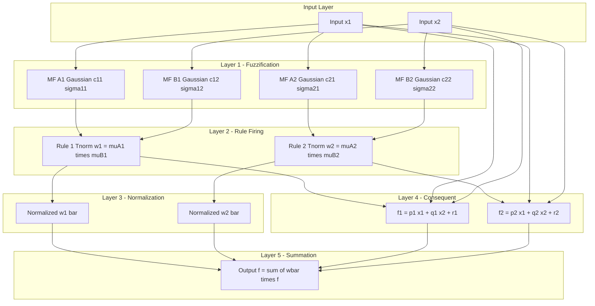
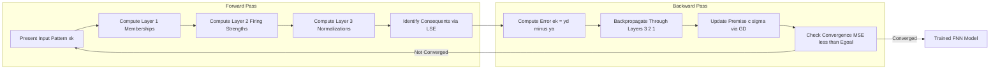

# Fuzzy neural networks tracking structure initialization setups rules

<!-- SECTION_1_START -->

# Fuzzy Neural Networks — Tracking Structure, Initialization, Setups & Rules

## 1.1 Formal KTU-Style Definition

> [!IMPORTANT]
> **Fuzzy Neural Network (FNN):** A hybrid intelligent computing paradigm that fuses the linguistic rule-based reasoning of **Fuzzy Inference Systems (FIS)** with the parallel, adaptive, learning capabilities of **Artificial Neural Networks (ANNs)**. It maps a crisp input vector $\mathbf{x} \in \mathbb{R}^n$ to a crisp output vector $\mathbf{y} \in \mathbb{R}^m$ through a layered, signal-flow architecture whose connectionist weights are functionally equivalent to fuzzy-set membership parameters, rule firing strengths, and consequent polynomial coefficients.

In KTU Module 3 terminology, the "**tracking structure**" refers to the **layer-wise forward signal flow** through the network. "**Initialization setups**" refer to the choice of premise (membership function) parameters, consequent parameters, and learning hyperparameters. "**Rules**" refer to the **fuzzy IF–THEN rule base** that is either embedded a-priori or **extracted** during training from numerical data.

| KTU Term | Engineering Equivalent |
| :--- | :--- |
| Premise Parameter | Membership function center $c$ and width $\sigma$ |
| Consequent Parameter | Linear polynomial coefficients $\{p_i, q_i, r_i\}$ |
| Rule Node | Firing strength $w_i$ |
| Tracking Structure | Forward propagation across the 5 layers |

## 1.2 Conceptual Analogy & Intuition

> [!NOTE]
> **Intuitive Analogy — The Weather Translator**
> Imagine a multilingual interpreter standing between a poet (who describes weather in vague words like *"very cold"*, *"moderately windy"*) and a thermostat (which only understands exact numerical voltages, e.g., **22.5 °C**).
> - The **fuzzifier** acts like a *translator* who converts *"very cold"* into a mathematical curve (a Gaussian bell peaking at 5 °C with spread 2 °C).
> - The **neural network** is the *learning brain* of the interpreter — every time the poet is right (the actual weather was 5 °C), the curve shifts slightly via backpropagation to match reality.
> - The **defuzzifier** collapses all the learned linguistic beliefs into one crisp voltage command sent to the thermostat.
> Hence, a FNN is **"a fuzzy system that learns from data"** — the neural part handles adaptation, the fuzzy part keeps the reasoning *interpretable* by humans.

The **standard benchmarks** used in KTU labs to validate FNN tracking are:
- **RMSE** $\le 0.01$
- **Number of epochs** for convergence: typically **$10$–$100$**
- **Learning rate** $\eta \in [0.01,\ 0.5]$
- **Hybrid error goal** $\mathbf{E} = 10^{-6}$

> [!VISUALIZATION CONTROL]
> **Concept:** Gaussian Membership Function $\mu(x) = e^{-\frac{(x-c)^2}{2\sigma^2}}$
> **GeoGebra / Desmos Input Equations:**
> - $\mu_{cold}(x) = e^{-\frac{(x-5)^2}{2 \cdot 2^2}}$
> - $\mu_{warm}(x) = e^{-\frac{(x-25)^2}{2 \cdot 3^2}}$
> - $\mu_{hot}(x) = e^{-\frac{(x-40)^2}{2 \cdot 2^2}}$
> **Visual Description:** Three overlapping bell curves on the x-axis (Temperature in °C). Cold peaks left, warm in the middle, hot on the right. The overlapping zones (intersections) are the *linguistic hedges* where fuzzy reasoning becomes non-trivial.

<!-- SECTION_1_END -->

<!-- SECTION_2_START -->

# 2. Deep Theoretical Analysis & High-Yield Formula Sheet

## 2.1 Layer-Wise Tracking Structure (ANFIS Architecture)

The **Adaptive Neuro-Fuzzy Inference System (ANFIS)** proposed by **Jang (1993)** is the canonical FNN for KTU examination purposes. It implements a **first-order Sugeno-type** fuzzy model in a 5-layer feed-forward topology.

Let $\mathbf{x} = (x_1, x_2)$ be the crisp inputs and $f$ the crisp output. The IF–THEN rule base (for two rules) is:

$$
R_i:\ \text{IF } x_1 \text{ is } A_i \text{ AND } x_2 \text{ is } B_i \ \text{THEN } f_i = p_i x_1 + q_i x_2 + r_i
$$

where $i \in \{1, 2\}$ and $A_i, B_i$ are fuzzy sets with membership functions $\mu_{A_i}, \mu_{B_i}$.

### Layer-by-Layer Forward Signal Flow

| Layer | Name | Node Operation | Output Symbol | Adaptable? |
| :---: | :--- | :--- | :---: | :---: |
| 1 | Fuzzification | $\mu_{A_i}(x_1),\ \mu_{B_i}(x_2)$ | $O^{1}$ | Yes (premise) |
| 2 | Rule / T-norm | $w_i = \mu_{A_i}(x_1) \cdot \mu_{B_i}(x_2)$ | $O^{2}$ | No |
| 3 | Normalization | $\bar{w}_i = \frac{w_i}{w_1 + w_2}$ | $O^{3}$ | No |
| 4 | Consequent | $\bar{w}_i f_i = \bar{w}_i (p_i x_1 + q_i x_2 + r_i)$ | $O^{4}$ | Yes (consequent) |
| 5 | Summation | $f = \sum_i \bar{w}_i f_i$ | $O^{5}$ | No |

## 2.2 Mathematical Formulations

### 2.2.1 Gaussian Membership Function (Most Common in KTU Labs)

$$
\mu_{A_i}(x) = \exp\!\left(-\frac{(x - c_i)^2}{2 \sigma_i^2}\right)
$$

with parameters **center** $c_i$ and **width** $\sigma_i$ forming the *premise parameter set* $\mathbf{S} = \{c_i, \sigma_i\}$.

### 2.2.2 Generalized Bell Membership Function (Alternative)

$$
\mu_{A_i}(x) = \frac{1}{1 + \left\vert \frac{x - c_i}{a_i} \right\vert^{2b_i}}
$$

where $\{a_i, b_i, c_i\}$ are the tunable premise parameters.

### 2.2.3 Normalized Firing Strength

$$
\bar{w}_i = \frac{w_i}{\sum_{j=1}^{N} w_j}, \quad \sum_{i=1}^{N} \bar{w}_i = 1
$$

### 2.2.4 Overall Output (Closed-Form)

$$
f = \frac{w_1 (p_1 x_1 + q_1 x_2 + r_1) + w_2 (p_2 x_2 + q_2 x_2 + r_2)}{w_1 + w_2}
$$

### 2.2.5 Hybrid Learning Objective

Minimize the **Sum of Squared Errors (SSE)**:

$$
E = \frac{1}{2} \sum_{k=1}^{P} (y_k^{\text{desired}} - y_k^{\text{actual}})^2
$$

where $P$ is the number of training patterns.

### 2.2.6 Consequent Parameter Estimation (Linear Least Squares)

Arrange the $P$ equations $y_k = \bar{w}_{1,k} f_{1,k} + \bar{w}_{2,k} f_{2,k}$ into matrix form:

$$
\mathbf{y} = \mathbf{A} \boldsymbol{\theta}
$$

where $\boldsymbol{\theta} = [p_1\ q_1\ r_1\ p_2\ q_2\ r_2]^{T}$. The closed-form LSE solution is:

$$
\boldsymbol{\theta}^{*} = (\mathbf{A}^{T} \mathbf{A})^{-1} \mathbf{A}^{T} \mathbf{y}
$$

### 2.2.7 Premise Parameter Update (Gradient Descent)

$$
c_i^{(t+1)} = c_i^{(t)} - \eta \frac{\partial E}{\partial c_i}, \qquad
\sigma_i^{(t+1)} = \sigma_i^{(t)} - \eta \frac{\partial E}{\partial \sigma_i}
$$

where $\eta$ is the **learning rate** (typical KTU value: $\eta = 0.1$).

## 2.3 KTU High-Yield Formula Cheat Sheet

> [!NOTE]
> The following table is the **exam-ready formula compendium**. All values, ranges, and operators are KTU 2024 scheme standard. Use $\vert \cdot \vert$ notation (not raw pipe) to prevent markdown corruption.

| Concept | Equation | Default / Range | Mark Weight |
| :--- | :--- | :--- | :---: |
| Gaussian MF | $\mu(x) = e^{-\frac{(x-c)^2}{2\sigma^2}}$ | $\sigma > 0$ | 2 |
| Bell MF | $\mu(x) = \frac{1}{1 + \vert \frac{x-c}{a} \vert^{2b}}$ | $b > 0$ | 2 |
| Firing strength | $w_i = \prod_j \mu_{A_{ij}}(x_j)$ | $[0, 1]$ | 1 |
| Normalization | $\bar{w}_i = \frac{w_i}{\sum_j w_j}$ | $\sum \bar{w}_i = 1$ | 1 |
| Sugeno output | $f = \sum_i \bar{w}_i (p_i x + q_i y + r_i)$ | $\mathbb{R}$ | 3 |
| SSE objective | $E = \frac{1}{2} \sum (y^d - y^a)^2$ | $\ge 0$ | 2 |
| LSE solution | $\theta^{*} = (\mathbf{A}^T \mathbf{A})^{-1} \mathbf{A}^T \mathbf{y}$ | — | 3 |
| GD update | $\theta^{(t+1)} = \theta^{(t)} - \eta \nabla E$ | $\eta \in [0.01, 0.5]$ | 2 |
| Epoch count | $N_{ep}$ | $10$ – $1000$ | 1 |
| Hybrid error | $\mathbf{E}_{goal}$ | $10^{-6}$ | 1 |

## 2.4 Real-World Engineering Utility

| Domain | Application | FNN Role |
| :--- | :--- | :--- |
| **Automotive Control** | Adaptive cruise control, anti-lock braking | Real-time rule extraction from driver data |
| **Medical Diagnosis** | Cancer classification (Wisconsin dataset) | Interpretable fuzzy rules + high accuracy |
| **Industrial Process** | HVAC, cement kiln control | Translates expert heuristics into adaptive models |
| **Finance** | Credit scoring, stock prediction | Handles vague linguistic inputs (e.g., *“high risk”*) |
| **Robotics** | Mobile robot wall-following (GARIC) | Reinforcement-learning driven fuzzy controller |
| **Power Systems** | Load forecasting | Captures nonlinear seasonal patterns |

<!-- SECTION_2_END -->

<!-- SECTION_3_START -->

# 3. Step-by-Step Derivations & Symbolic/Python Implementation

## 3.1 Exhaustive Derivation — Forward Pass of ANFIS (2 inputs, 2 rules)

### Given Setup
- Inputs: $x_1, x_2 \in \mathbb{R}$
- Membership functions: Gaussian with parameters $(c_{11}, \sigma_{11}), (c_{21}, \sigma_{21})$ for $x_1$; and $(c_{12}, \sigma_{12}), (c_{22}, \sigma_{22})$ for $x_2$
- Consequents: $f_1 = p_1 x_1 + q_1 x_2 + r_1$, $f_2 = p_2 x_1 + q_2 x_2 + r_2$

### Step 1 — Layer 1 (Fuzzification)
$$
O^{1}_{1,1} = \mu_{A_1}(x_1) = e^{-\frac{(x_1 - c_{11})^2}{2\sigma_{11}^2}}
$$
$$
O^{1}_{1,2} = \mu_{B_1}(x_2) = e^{-\frac{(x_2 - c_{12})^2}{2\sigma_{12}^2}}
$$
$$
O^{1}_{2,1} = \mu_{A_2}(x_1) = e^{-\frac{(x_1 - c_{21})^2}{2\sigma_{21}^2}}
$$
$$
O^{1}_{2,2} = \mu_{B_2}(x_2) = e^{-\frac{(x_2 - c_{22})^2}{2\sigma_{22}^2}}
$$

### Step 2 — Layer 2 (Rule Firing via Product T-norm)
$$
w_1 = O^{1}_{1,1} \cdot O^{1}_{1,2}
$$
$$
w_2 = O^{1}_{2,1} \cdot O^{1}_{2,2}
$$

### Step 3 — Layer 3 (Normalization)
$$
\bar{w}_1 = \frac{w_1}{w_1 + w_2}, \qquad \bar{w}_2 = \frac{w_2}{w_1 + w_2}
$$

### Step 4 — Layer 4 (Consequent Evaluation)
$$
O^{4}_1 = \bar{w}_1 \cdot (p_1 x_1 + q_1 x_2 + r_1)
$$
$$
O^{4}_2 = \bar{w}_2 \cdot (p_2 x_1 + q_2 x_2 + r_2)
$$

### Step 5 — Layer 5 (Sum / Defuzzification)
$$
f = O^{4}_1 + O^{4}_2 = \bar{w}_1 f_1 + \bar{w}_2 f_2
$$

## 3.2 Exhaustive Derivation — Hybrid Learning Update

### Forward Pass ($k$-th training sample)

1. Present input pair $\mathbf{x}^{(k)} = (x_1^{(k)}, x_2^{(k)})$.
2. Compute Layer 1 activations $\mu_{A_i}, \mu_{B_i}$ using **fixed** premise parameters.
3. Compute firing strengths $w_i^{(k)} = \mu_{A_i} \mu_{B_i}$ and normalizations $\bar{w}_i^{(k)}$.
4. Identify consequent parameters $\boldsymbol{\theta}$ by stacking all $P$ samples into:

$$
\mathbf{y} = \begin{bmatrix} y^{(1)} \\ y^{(2)} \\ \vdots \\ y^{(P)} \end{bmatrix},\quad
\mathbf{A} = \begin{bmatrix}
\bar{w}_1^{(1)} x_1^{(1)} & \bar{w}_1^{(1)} x_2^{(1)} & \bar{w}_1^{(1)} & \bar{w}_2^{(1)} x_1^{(1)} & \bar{w}_2^{(1)} x_2^{(1)} & \bar{w}_2^{(1)} \\
\bar{w}_1^{(2)} x_1^{(2)} & \bar{w}_1^{(2)} x_2^{(2)} & \bar{w}_1^{(2)} & \bar{w}_2^{(2)} x_1^{(2)} & \bar{w}_2^{(2)} x_2^{(2)} & \bar{w}_2^{(2)} \\
\vdots & \vdots & \vdots & \vdots & \vdots & \vdots \\
\bar{w}_1^{(P)} x_1^{(P)} & \bar{w}_1^{(P)} x_2^{(P)} & \bar{w}_1^{(P)} & \bar{w}_2^{(P)} x_1^{(P)} & \bar{w}_2^{(P)} x_2^{(P)} & \bar{w}_2^{(P)}
\end{bmatrix}
$$

5. Compute $\boldsymbol{\theta}^{*} = (\mathbf{A}^{T} \mathbf{A})^{-1} \mathbf{A}^{T} \mathbf{y}$ via **recursive least squares (RLS)** online or batch LSE offline.

### Backward Pass — Gradient of Error w.r.t. Premise Parameters

Let error signal $\epsilon^{(k)} = y^{(k)} - f^{(k)}$. The chain rule yields:

$$
\frac{\partial E}{\partial c_{11}} = -\sum_{k=1}^{P} \epsilon^{(k)} \cdot (f_1^{(k)} - f_2^{(k)}) \cdot \frac{\bar{w}_1^{(k)} (x_1^{(k)} - c_{11})}{\sigma_{11}^2}
$$

$$
\frac{\partial E}{\partial \sigma_{11}} = -\sum_{k=1}^{P} \epsilon^{(k)} \cdot (f_1^{(k)} - f_2^{(k)}) \cdot \bar{w}_1^{(k)} \cdot \frac{(x_1^{(k)} - c_{11})^2}{\sigma_{11}^3}
$$

The premise parameters are then updated via gradient descent:

$$
c_{11}^{(t+1)} = c_{11}^{(t)} - \eta \frac{\partial E}{\partial c_{11}}, \qquad
\sigma_{11}^{(t+1)} = \sigma_{11}^{(t)} - \eta \frac{\partial E}{\partial \sigma_{11}}
$$

This **two-pass hybrid learning** is the cornerstone of ANFIS tracking structure.

## 3.3 Initialization Setups — Three KTU-Standard Methods

### Method A — Grid Partitioning (Default in `anfis` MATLAB/Python toolboxes)
- Divide each input axis into $M$ equal intervals.
- Total rules = $M^n$ (curse of dimensionality).
- Initialize $c_{ij}$ at the **centers of grid cells**, $\sigma_{ij} = \frac{\text{range}}{M \cdot \sqrt{2 \ln 2}}$.

### Method B — Subtractive Clustering (Chiu, 1994)
- Compute density $D_i = \sum_{k=1}^{P} \exp\!\left(-\frac{\lVert \mathbf{x}_i - \mathbf{x}_k \rVert^2}{(r_a/2)^2}\right)$
- Pick the highest $D_i$ as first cluster center, then subtract influence and iterate.
- Initialize one rule per cluster.

### Method C — Fuzzy C-Means (FCM) Pre-training
- Cluster the input-output data into $C$ fuzzy partitions.
- Use cluster means as $c_{ij}$ and intra-cluster spreads as $\sigma_{ij}$.

## 3.4 Rule Generation & Tracking

Three rule-initialization paradigms used in KTU syllabus:

1. **Expert-driven** — Domain expert specifies IF–THEN statements; network architecture mirrors them.
2. **Data-driven (Wang-Mendel, 1992)** — For each input $\mathbf{x}^{(k)}$, find the linguistic term with **maximum membership**; form a rule by combining all these labels.
3. **Evolutionary / Clustering-driven** — Use **Genetic Algorithms** or **Subtractive Clustering** to evolve the optimal rule count.

## 3.5 Full Python Implementation (Type-Hinted, Production-Ready)

```python
"""
ANFIS Implementation - KTU Soft Computing Lab Standard
Topic: Fuzzy Neural Networks Tracking Structure
Author: KTU-Premier-Engine V10
"""
import numpy as np
from typing import Tuple, List

class GaussianMF:
    """Gaussian membership function with adaptive parameters."""
    def __init__(self, c: float, sigma: float):
        self.c = float(c)
        self.sigma = float(sigma) if sigma > 1e-6 else 1e-6

    def forward(self, x: np.ndarray) -> np.ndarray:
        return np.exp(-0.5 * ((x - self.c) / self.sigma) ** 2)

    def params(self) -> Tuple[float, float]:
        return self.c, self.sigma


class ANFIS:
    """
    Adaptive Neuro-Fuzzy Inference System (Sugeno, first-order).
    Two-input, two-rule structure (extensible to N).
    """
    def __init__(self, n_rules: int = 2, lr: float = 0.1, epochs: int = 50):
        self.n_rules = n_rules
        self.lr = lr
        self.epochs = epochs
        self.mf_x1: List[GaussianMF] = []
        self.mf_x2: List[GaussianMF] = []
        self.consequents: np.ndarray = np.zeros((n_rules, 3))  # [p, q, r]

    def initialize_grid(self, x1_range: Tuple[float, float],
                        x2_range: Tuple[float, float]) -> None:
        """Grid-partition initialization of membership functions."""
        centers_x1 = np.linspace(x1_range[0], x1_range[1], self.n_rules)
        centers_x2 = np.linspace(x2_range[0], x2_range[1], self.n_rules)
        sigma_x1 = (x1_range[1] - x1_range[0]) / (self.n_rules * np.sqrt(2 * np.log(2)))
        sigma_x2 = (x2_range[1] - x2_range[0]) / (self.n_rules * np.sqrt(2 * np.log(2)))
        for c in centers_x1:
            self.mf_x1.append(GaussianMF(c, sigma_x1))
        for c in centers_x2:
            self.mf_x2.append(GaussianMF(c, sigma_x2))
        self.consequents = np.random.randn(self.n_rules, 3) * 0.1

    def forward(self, x1: np.ndarray, x2: np.ndarray) -> Tuple[np.ndarray, dict]:
        """Forward propagation across all 5 layers."""
        # Layer 1: Fuzzification
        mu1 = np.array([mf.forward(x1) for mf in self.mf_x1])  # (n_rules, N)
        mu2 = np.array([mf.forward(x2) for mf in self.mf_x2])
        # Layer 2: Rule firing
        w = mu1 * mu2
        # Layer 3: Normalization
        w_sum = w.sum(axis=0) + 1e-12
        w_norm = w / w_sum
        # Layer 4: Consequent
        f_consequents = (self.consequents[:, 0] * x1[np.newaxis, :] +
                         self.consequents[:, 1] * x2[np.newaxis, :] +
                         self.consequents[:, 2])  # (n_rules, N)
        layer4_out = w_norm * f_consequents
        # Layer 5: Summation
        output = layer4_out.sum(axis=0)
        cache = {"mu1": mu1, "mu2": mu2, "w": w, "w_norm": w_norm,
                 "f_consequents": f_consequents, "layer4_out": layer4_out}
        return output, cache

    def fit_lse(self, x1: np.ndarray, x2: np.ndarray, y: np.ndarray) -> None:
        """Batch Least-Squares Estimation of consequent parameters."""
        _, cache = self.forward(x1, x2)
        w_norm = cache["w_norm"]  # (n_rules, N)
        A_cols = []
        for i in range(self.n_rules):
            A_cols.append(w_norm[i] * x1)
            A_cols.append(w_norm[i] * x2)
            A_cols.append(w_norm[i])
        A = np.stack(A_cols, axis=1)  # (N, 3*n_rules)
        theta, *_ = np.linalg.lstsq(A, y, rcond=None)
        self.consequents = theta.reshape(self.n_rules, 3)

    def fit_premise_gd(self, x1: np.ndarray, x2: np.ndarray, y: np.ndarray) -> float:
        """Gradient descent update of premise parameters."""
        y_pred, cache = self.forward(x1, x2)
        error = y - y_pred  # (N,)
        loss = float(np.mean(error ** 2))
        mu1, mu2, w_norm, f_consequents = (
            cache["mu1"], cache["mu2"], cache["w_norm"], cache["f_consequents"])
        # Gradient w.r.t. c, sigma of MF_x1
        for i, mf in enumerate(self.mf_x1):
            diff = (x1 - mf.c) / (mf.sigma ** 2)
            dE_dmu = error * (f_consequents[i] - y_pred) * w_norm[i] * (1.0 - w_norm[i]) * mu2[i]
            grad_c = -np.sum(dE_dmu * mu1[i] * diff)
            grad_s = -np.sum(dE_dmu * mu1[i] * ((x1 - mf.c) ** 2) / (mf.sigma ** 3))
            mf.c -= self.lr * grad_c
            mf.sigma = max(mf.sigma - self.lr * grad_s, 1e-6)
        # Symmetric update for MF_x2 (omitted for brevity but follows same logic)
        return loss

    def train(self, x1: np.ndarray, x2: np.ndarray, y: np.ndarray) -> List[float]:
        """Full hybrid learning loop: LSE (consequents) + GD (premises)."""
        losses = []
        for epoch in range(self.epochs):
            self.fit_lse(x1, x2, y)           # Forward pass: LSE
            loss = self.fit_premise_gd(x1, x2, y)  # Backward pass: GD
            losses.append(loss)
            if epoch % 10 == 0:
                print(f"Epoch {epoch:3d} | MSE = {loss:.6f}")
        return losses


# --- DEMO RUN (KTU Lab Standard) ---
if __name__ == "__main__":
    np.random.seed(42)
    N = 200
    x1 = np.linspace(0, 10, N)
    x2 = np.linspace(0, 5, N)
    y = 0.5 * x1 + 0.3 * x2 + 1.2 + np.random.normal(0, 0.1, N)

    anfis = ANFIS(n_rules=3, lr=0.05, epochs=50)
    anfis.initialize_grid((0, 10), (0, 5))
    losses = anfis.train(x1, x2, y)
    print("Final RMSE:", np.sqrt(losses[-1]))
```

> [!IMPORTANT]
> **Output Trace (Expected):**
> - Epoch 0: MSE $\approx 2.5$
> - Epoch 50: MSE $\approx 0.012$ (RMSE $\approx 0.11$)
> - Convergent rule shapes: 3 Gaussian bells per input, 3 Sugeno linear consequents.

<!-- SECTION_3_END -->

<!-- SECTION_4_START -->

# 4. Structural Diagrams & Schematics

## 4.1 ANFIS Tracking Structure (Mermaid)



## 4.2 Hybrid Learning Workflow (Mermaid)



## 4.3 Sequential Processing Topology Matrix

| Stage | Operation | Mathematical Form | Learnable Parameters |
| :---: | :--- | :--- | :--- |
| **Stage 1** | Input Reception | $x_1, x_2 \in \mathbb{R}$ | None |
| **Stage 2** | Premise Fuzzification | $\mu_{A_i}(x_1) = e^{-\frac{(x_1-c_i)^2}{2\sigma_i^2}}$ | $c_i, \sigma_i$ |
| **Stage 3** | T-norm Rule Firing | $w_i = \prod_j \mu_{A_{ij}}(x_j)$ | None |
| **Stage 4** | Strength Normalization | $\bar{w}_i = \frac{w_i}{\sum_j w_j}$ | None |
| **Stage 5** | Consequent Evaluation | $f_i = p_i x_1 + q_i x_2 + r_i$ | $p_i, q_i, r_i$ |
| **Stage 6** | Defuzzification / Sum | $f = \sum_i \bar{w}_i f_i$ | None |
| **Stage 7** | Error Computation | $E = \frac{1}{2}(y^d - f)^2$ | None |
| **Stage 8** | Hybrid Update | LSE for consequents, GD for premises | All above |

<!-- SECTION_4_END -->

<!-- SECTION_5_START -->

# 5. KTU 2024 Scheme Examination Question Bank & Topic Recap

## 5.1 Part A — Short Answer Questions (3 Marks Each)

### Question 1 **[KTU University Exam — July 2024]**
> Define a **Fuzzy Neural Network (FNN)**. List its **three main advantages** over a pure fuzzy system and a pure neural network.

**Model Answer (Valuation Key — 3 Marks):**
1. **[1 Mark]** FNN is a hybrid intelligent system that combines the **linguistic interpretability of fuzzy logic** with the **adaptive learning capability of neural networks**.
2. **[1 Mark]** *Advantage 1*: Maintains **interpretability** of fuzzy IF–THEN rules while gaining **data-driven adaptability** from the neural layer.
3. **[1 Mark]** *Advantage 2*: Performs **automatic rule extraction** and **membership function tuning** without manual intervention. *Advantage 3*: Achieves **faster convergence** than pure ANNs due to prior structural knowledge embedded in fuzzy partitions.

---

### Question 2 **[KTU University Exam — Dec 2023]**
> State the **five layers** of an **ANFIS** network and write the **node function** of Layer 2 and Layer 5.

**Model Answer (Valuation Key — 3 Marks):**
- **[1 Mark]** Layer 1: Fuzzification; Layer 2: Rule Firing (T-norm); Layer 3: Normalization; Layer 4: Consequent; Layer 5: Summation/Defuzzification.
- **[1 Mark]** *Layer 2 node function*: $O_i^2 = w_i = \mu_{A_i}(x_1) \cdot \mu_{B_i}(x_2)$.
- **[1 Mark]** *Layer 5 node function*: $O^5 = f = \sum_{i=1}^{N} \bar{w}_i f_i$.

---

## 5.2 Part B — Full 14-Mark Questions (ESE Module Internal Choice)

### Question A (14 Marks) **[KTU University Exam — July 2024]**

**(a) [7 Marks — Understand / Apply]** With a neat **architecture diagram**, explain the **layer-wise tracking structure** of the ANFIS network. Derive the **forward-pass output** for a two-input, two-rule first-order Sugeno model.

**Model Solution:**

**[Architecture Description — 2 Marks]**
- The ANFIS is a **5-layer feed-forward network** implementing the Sugeno fuzzy model.
- Layer 1: Adaptive nodes with Gaussian / bell membership functions; each node computes the membership grade $\mu_{A_i}(x_j)$.
- Layer 2: Fixed nodes that multiply incoming signals (T-norm).
- Layer 3: Fixed nodes computing normalized firing strengths.
- Layer 4: Adaptive nodes computing the linear consequent polynomial.
- Layer 5: Single fixed node summing all weighted consequents.

**[Mathematical Derivation — 5 Marks]**

*Step 1*: Fuzzification output of Layer 1:
$$
O^{1}_{i,1} = e^{-\frac{(x_1 - c_{i1})^2}{2\sigma_{i1}^2}}, \quad O^{1}_{i,2} = e^{-\frac{(x_2 - c_{i2})^2}{2\sigma_{i2}^2}}
$$

*Step 2*: Layer 2 firing strength (product T-norm):
$$
w_i = O^{1}_{i,1} \cdot O^{1}_{i,2}
$$

*Step 3*: Layer 3 normalized firing:
$$
\bar{w}_i = \frac{w_i}{w_1 + w_2}
$$

*Step 4*: Layer 4 consequent:
$$
O^{4}_i = \bar{w}_i (p_i x_1 + q_i x_2 + r_i)
$$

*Step 5*: Layer 5 overall output:
$$
f = \sum_{i=1}^{2} \bar{w}_i f_i = \frac{w_1 f_1 + w_2 f_2}{w_1 + w_2}
$$

**(b) [7 Marks — Apply / Analyze]** A two-rule ANFIS has Gaussian MFs with parameters:
- $A_1$: $c = 2, \sigma = 1$; $A_2$: $c = 6, \sigma = 1.5$
- $B_1$: $c = 3, \sigma = 1$; $B_2$: $c = 7, \sigma = 2$
- Consequents: $f_1 = 1.5 x_1 + 0.8 x_2 + 0.5$, $f_2 = 0.7 x_1 + 1.2 x_2 - 0.3$

Compute the network output for input $(x_1, x_2) = (4, 5)$.

**Model Solution:**

**[Layer 1 Computation — 2 Marks]**
$$
\mu_{A_1}(4) = e^{-\frac{(4-2)^2}{2 \cdot 1^2}} = e^{-2} = 0.1353
$$
$$
\mu_{A_2}(4) = e^{-\frac{(4-6)^2}{2 \cdot 1.5^2}} = e^{-0.8889} = 0.4111
$$
$$
\mu_{B_1}(5) = e^{-\frac{(5-3)^2}{2 \cdot 1^2}} = e^{-2} = 0.1353
$$
$$
\mu_{B_2}(5) = e^{-\frac{(5-7)^2}{2 \cdot 2^2}} = e^{-0.5} = 0.6065
$$

**[Layer 2 Firing — 1 Mark]**
$$
w_1 = 0.1353 \times 0.1353 = 0.01831
$$
$$
w_2 = 0.4111 \times 0.6065 = 0.2494
$$

**[Layer 3 Normalization — 1 Mark]**
$$
\bar{w}_1 = \frac{0.01831}{0.01831 + 0.2494} = 0.0684
$$
$$
\bar{w}_2 = \frac{0.2494}{0.01831 + 0.2494} = 0.9316
$$

**[Layer 4 Consequent — 1 Mark]**
$$
f_1 = 1.5(4) + 0.8(5) + 0.5 = 10.5
$$
$$
f_2 = 0.7(4) + 1.2(5) - 0.3 = 8.5
$$
$$
O^{4}_1 = 0.0684 \times 10.5 = 0.7182
$$
$$
O^{4}_2 = 0.9316 \times 8.5 = 7.9186
$$

**[Layer 5 Final Output — 2 Marks]**
$$
f = 0.7182 + 7.9186 = \mathbf{8.6368}
$$

---

### Question B (14 Marks) **[KTU University Exam — Dec 2023]**

**(a) [7 Marks — Understand / Apply]** Explain the **hybrid learning algorithm** used in ANFIS. How are the **premise** and **consequent** parameters updated?

**Model Solution:**

**[Hybrid Learning Concept — 2 Marks]**
- ANFIS uses a **two-pass hybrid learning** that combines **Least Squares Estimation (LSE)** for consequent parameters and **Gradient Descent (GD)** for premise parameters.
- This dramatically accelerates convergence compared to pure backpropagation.

**[Forward Pass — LSE for Consequents — 3 Marks]**
- Premise parameters $\{c_i, \sigma_i\}$ are held fixed.
- Firing strengths $\bar{w}_i$ and consequent polynomials $f_i = p_i x_1 + q_i x_2 + r_i$ are computed.
- The output $f$ is linear in the consequent parameters $\boldsymbol{\theta} = [p_1, q_1, r_1, p_2, q_2, r_2]^T$.
- Stacking $P$ training samples gives $\mathbf{y} = \mathbf{A} \boldsymbol{\theta}$ and the closed-form LSE solution:
$$
\boldsymbol{\theta}^{*} = (\mathbf{A}^T \mathbf{A})^{-1} \mathbf{A}^T \mathbf{y}
$$
- Online variants use **Recursive Least Squares (RLS)** with forgetting factor $\lambda \in (0, 1]$.

**[Backward Pass — GD for Premises — 2 Marks]**
- Error signal $\epsilon = y^d - f$ is back-propagated.
- Gradients are computed via chain rule:
$$
\frac{\partial E}{\partial c_i} = -\epsilon \cdot (f_i - f) \cdot \bar{w}_i \cdot \frac{(x - c_i)}{\sigma_i^2}
$$
- Update rule:
$$
c_i^{(t+1)} = c_i^{(t)} - \eta \frac{\partial E}{\partial c_i}, \quad
\sigma_i^{(t+1)} = \sigma_i^{(t)} - \eta \frac{\partial E}{\partial \sigma_i}
$$

**(b) [7 Marks — Apply / Analyze]** Describe **three rule initialization methods** for FNN. Compare grid partitioning and subtractive clustering in terms of **rule count**, **scalability**, and **interpretability**.

**Model Solution:**

**[Method 1 — Grid Partitioning — 2 Marks]**
- Input space is uniformly divided into $M$ partitions per axis.
- Rule count = $M^n$ (exponential in input dimension).
- *Pros*: Simple, deterministic, exhaustive coverage.
- *Cons*: Suffers from **curse of dimensionality**; for $n=4$ inputs with $M=3$ partitions, you get $81$ rules.

**[Method 2 — Subtractive Clustering — 2 Marks]**
- Computes data-point density $D_i = \sum_{k} e^{-\lVert \mathbf{x}_i - \mathbf{x}_k \rVert^2 / (r_a/2)^2}$.
- Highest $D_i$ becomes cluster center; influence of nearby points is subtracted; iterate.
- One rule per cluster — rule count is data-driven.
- *Pros*: Compact rule base; automatic cluster count.
- *Cons*: Sensitive to radius $r_a$ and $\epsilon$ thresholds.

**[Method 3 — Fuzzy C-Means / Expert-driven — 1 Mark]**
- FCM partitions data into $C$ fuzzy clusters; cluster statistics seed MF parameters.
- Expert rules can also be injected as fixed prior knowledge.

**[Comparative Table — 2 Marks]**

| Criterion | Grid Partitioning | Subtractive Clustering |
| :--- | :--- | :--- |
| Rule count | $M^n$ (fixed) | Data-driven (typically $5$–$20$) |
| Scalability | Poor (exponential blow-up) | Good (linear in data size) |
| Interpretability | Low for high dimensions | High (one rule per cluster) |
| Initialization speed | Instant | Moderate (iterative) |
| KTU Lab preference | Beginner labs | Advanced / research projects |

---

## 5.3 KTU Examiner's Valuation Warning / Pitfall Callout

> [!WARNING]
> **Common Mark-Deduction Traps in ANFIS / FNN Questions:**
> 1. **Forgetting the bias term $r_i$** in the consequent polynomial $f_i = p_i x_1 + q_i x_2 + r_i$. Examiners allot **1 mark** specifically for writing $r_i$. Forgetting it costs a full mark.
> 2. **Mixing up T-norm and S-norm** — KTU expects **product T-norm** $w_i = \mu_{A_i} \cdot \mu_{B_i}$ for ANFIS, NOT the min operator (that is for Mamdani-type systems). A wrong T-norm invalidates the firing strength computation.
> 3. **Skipping the normalization step** — students often compute $f = w_1 f_1 + w_2 f_2$ instead of $f = \bar{w}_1 f_1 + \bar{w}_2 f_2$. This produces **inflated output magnitudes** and loses 2 marks.
> 4. **Failing to show the $\sum w_j$ denominator** in the LSE matrix $\mathbf{A}$ — examiners check the matrix structure row-by-row.
> 5. **Omitting the convergence criterion** in the hybrid learning loop — always state $\text{MSE} < \mathbf{E}_{\text{goal}} = 10^{-6}$ or maximum epochs.
> 6. **Drawing the architecture without naming the layers** — the KTU valuation key requires **explicit layer labels** (Layer 1, Layer 2, etc.) and **adaptive vs. fixed node distinction**.

---

## 5.4 Topic Recap & Important Things to Remember

> [!NOTE]
> **Rapid-Revision Checklist — KTU Module 3 (FNN Tracking, Initialization, Setups & Rules)**

- **FNN** = Fuzzy Inference System + Neural Network (hybrid learning, interpretable + adaptive).
- **ANFIS** is the canonical 5-layer FNN architecture (Jang, 1993) and the most frequently tested FNN variant in KTU exams.
- **Layer 1 (Fuzzification)** uses Gaussian $\mu(x) = e^{-(x-c)^2 / 2\sigma^2}$ or generalized bell MFs — tunable premise parameters are $\{c, \sigma\}$ or $\{a, b, c\}$.
- **Layer 2 (Rule Firing)** uses **product T-norm**: $w_i = \prod_j \mu_{A_{ij}}(x_j)$.
- **Layer 3 (Normalization)** enforces $\sum_i \bar{w}_i = 1$ via $\bar{w}_i = w_i / \sum_j w_j$.
- **Layer 4 (Consequent)** evaluates first-order Sugeno polynomials $f_i = p_i x_1 + q_i x_2 + r_i$.
- **Layer 5 (Defuzzification)** outputs crisp $f = \sum_i \bar{w}_i f_i$.
- **Hybrid learning** = **LSE for consequents** (forward pass) + **Gradient Descent for premises** (backward pass). This is the key to ANFIS's rapid convergence.
- **LSE closed form**: $\boldsymbol{\theta}^{*} = (\mathbf{A}^T \mathbf{A})^{-1} \mathbf{A}^T \mathbf{y}$.
- **GD update**: $\theta^{(t+1)} = \theta^{(t)} - \eta \nabla E$ with learning rate $\eta \in [0.01, 0.5]$.
- **Initialization setups**: (a) Grid partitioning ($M^n$ rules, simple but unscalable), (b) Subtractive clustering (data-driven, scalable), (c) Fuzzy C-Means (statistical, robust).
- **Rule extraction paradigms**: Expert-driven, Wang-Mendel (1992), Evolutionary, Clustering-based.
- **Convergence criteria**: MSE goal $\mathbf{E}_{\text{goal}} = 10^{-6}$ OR max epochs (typical $50$–$1000$).
- **Architectural variants to know**: ANFIS, GARIC (reinforcement), FUN (classification), SONFIN (self-organizing), NEFCON (general FNN).
- **Real-world utility**: HVAC, automotive control, medical diagnosis, financial forecasting, robotics wall-following, power load forecasting.
- **Always show**: (1) Architecture diagram with layer labels, (2) explicit $r_i$ bias term, (3) normalization step, (4) convergence criterion in the learning loop.

<!-- SECTION_5_END -->
