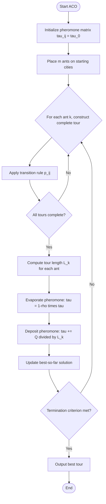
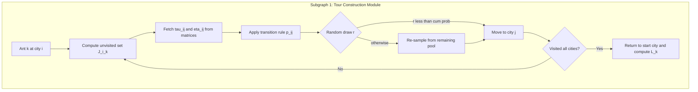
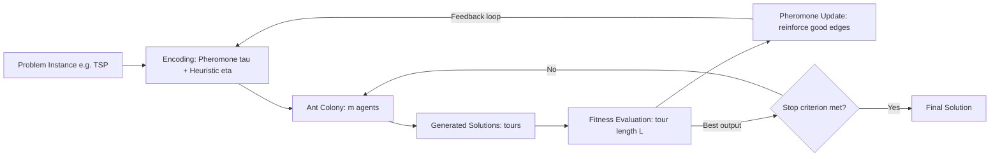

# Ant Colony Optimization

<!-- SECTION_1_START -->
# Ant Colony Optimization (ACO)

> [!IMPORTANT]
> **KTU 2024 Scheme | PECST417 Soft Computing | Module 4** — *Nature-Inspired Metaheuristics*
> Mapped Course Outcomes: **CO3, CO4** | Cognitive Domain: **Understand → Apply → Analyze**

## 1.1 Formal Academic Definition

**Ant Colony Optimization (ACO)** is a population-based, stochastic, constructive metaheuristic belonging to the family of **Swarm Intelligence** algorithms. It was formally introduced by **Marco Dorigo** in his Ph.D. thesis (1992) and later refined in collaboration with **Gambardella** and **Stützle**. The algorithm is inspired by the foraging behavior of real ants, which deposit a chemical substance called **pheromone** ($\tau$) on the ground to mark favorable paths between their nest and a food source. Artificially, the technique is used to solve discrete optimization problems — most famously the **Travelling Salesman Problem (TSP)**, job-shop scheduling, vehicle routing, and network routing.

> [!NOTE]
> **Core Principle (Stigmergy)**: Indirect communication between agents through modifications made to the environment. In ACO, this environmental modification is encoded numerically as the pheromone matrix $\tau_{ij}(t)$.

## 1.2 Intuitive Analogy — "The Blind Architect"

Imagine hundreds of **blind ants** walking from their nest to a food source. They cannot see, plan, or communicate directly. Yet, somehow, the colony always converges on the **shortest possible route**. How?

1. Initially, ants wander randomly, leaving a faint trail of pheromone.
2. Ants taking the *shorter* path return *faster*, so the pheromone on that path accumulates to a higher concentration per unit time.
3. Other ants, sensing the stronger chemical signal, are statistically biased to follow that path.
4. Meanwhile, pheromone on *longer, abandoned* paths naturally **evaporates** over time, reinforcing the dominance of the shorter trail.
5. A positive feedback loop emerges: *good paths get reinforced, bad paths decay*.

> [!TIP]
> Think of ACO as **"distributed reinforcement learning by trial-and-error"**. The pheromone matrix is the *collective memory* of the colony, evaporation is the *forgetting mechanism* that prevents premature convergence, and the heuristic information is the *prior knowledge* guiding the search.

## 1.3 Key Terminology

| Term | Symbol | Meaning |
| :--- | :--- | :--- |
| Pheromone intensity | $\tau_{ij}$ | Amount of chemical trail on edge $(i, j)$ |
| Heuristic desirability | $\eta_{ij}$ | A priori (problem-specific) attractiveness of edge $(i, j)$, often $1/d_{ij}$ |
| Evaporation rate | $\rho$ | Fraction of pheromone that decays per iteration, $0 < \rho < 1$ |
| Pheromone influence | $\alpha$ | Weight of the pheromone trail in decision-making |
| Heuristic influence | $\beta$ | Weight of the heuristic information in decision-making |
| Number of ants | $m$ | Population size of the artificial colony |
| Iteration counter | $t$ | Discrete time step of the algorithm |

> [!VISUALIZATION CONTROL]
> **Concept:** Pheromone Trail Convergence — Shortest Path Reinforcement
> **GeoGebra / Desmos Input Equations:**
> * Path A (short, length 10): $\tau_A(t) = 1.0 \cdot (1 - 0.1)^t \cdot e^{0.3 \cdot t / 10}$ (slow decay, high reinforcement)
> * Path B (long, length 50): $\tau_B(t) = 1.0 \cdot (1 - 0.1)^t \cdot e^{0.3 \cdot t / 50}$ (fast decay, low reinforcement)
> * Parameter: $\alpha = 1$, $\beta = 2$, $\rho = 0.1$, $Q = 1$
> **Visual Description:** On the x-axis plot *iterations $t$* (0 to 50), and on the y-axis plot *pheromone concentration $\tau$*. Observe how the curve for the *short path* rises sharply and stabilizes near a high asymptote, while the curve for the *long path* decays exponentially toward zero. The intersection point marks the **decision threshold** at which the colony abandons the longer route.

<!-- SECTION_1_END -->

<!-- SECTION_2_START -->
# Deep Theoretical Analysis & KTU High-Yield Formula Sheet

## 2.1 The ACO Algorithmic Pipeline (At a Glance)

The classical ACO framework, known as the **Ant System (AS)**, executes the following four logical stages in every iteration:

* **Stage 1 — Initialization:** Set the pheromone matrix $\tau_{ij}(0)$ to a small constant $\tau_0$ for every edge $(i, j)$. Place $m$ ants on $m$ randomly selected (or fixed) starting cities.
* **Stage 2 — Solution Construction:** Each ant $k$ builds a complete tour by repeatedly applying the **transition rule** (a probabilistic decision) to choose the next city from its current position.
* **Stage 3 — Pheromone Update:** After *all* ants complete their tours, two sub-steps occur:
  1. **Pheromone Evaporation** — a uniform decay applied to every edge.
  2. **Pheromone Deposition** — each ant $k$ deposits pheromone in proportion to the quality (inverse length) of its tour.
* **Stage 4 — Termination Check:** If a stopping criterion is met (max iterations, target cost, or convergence), output the best-so-far tour; otherwise return to Stage 2.

## 2.2 The Transition Rule — *Probabilistic Edge Selection*

When an ant $k$ located at city $i$ must select the next city $j$ from the set of unvisited cities $J_i^k$, it uses the **random-proportional rule**:

$$
p_{ij}^{k}(t) = 
\begin{cases}
\dfrac{\left[\tau_{ij}(t)\right]^{\alpha} \cdot \left[\eta_{ij}\right]^{\beta}}{\sum_{l \in J_i^{k}} \left[\tau_{il}(t)\right]^{\alpha} \cdot \left[\eta_{il}\right]^{\beta}} & \text{if } j \in J_i^{k} \\[10pt]
0 & \text{otherwise}
\end{cases}
$$

> [!NOTE]
> **Why "random-proportional"?** The rule is *random* (a stochastic draw biased by relative weights) and *proportional* (the probability scales with the numerator). This balance between **exploitation** (greedy choice when $\alpha$ is high) and **exploration** (uniform random when $\beta$ is high) is what makes ACO robust.

**Geometric Intuition:** The numerator $[\tau_{ij}]^{\alpha} \cdot [\eta_{ij}]^{\beta}$ is the *weighted attractiveness* of edge $(i, j)$. The denominator is a *normalization constant* ensuring $\sum_j p_{ij}^{k} = 1$, so the rule yields a valid probability distribution.

## 2.3 The Pheromone Update Equation

After every ant has completed its tour of length $L^{k}(t)$, global pheromone update is performed:

$$
\tau_{ij}(t+1) = (1 - \rho) \cdot \tau_{ij}(t) + \Delta \tau_{ij}(t)
$$

where the total deposited pheromone on edge $(i, j)$ is:

$$
\Delta \tau_{ij}(t) = \sum_{k=1}^{m} \Delta \tau_{ij}^{k}(t)
$$

For the classical **Ant System (AS)**, each ant contributes:

$$
\Delta \tau_{ij}^{k}(t) = 
\begin{cases}
\dfrac{Q}{L^{k}(t)} & \text{if ant } k \text{ traverses edge } (i, j) \text{ in its tour} \\[8pt]
0 & \text{otherwise}
\end{cases}
$$

Here, $Q$ is a **pheromone constant** (often $Q = 1$ for normalized costs) and $L^{k}(t)$ is the total tour length of ant $k$.

> [!IMPORTANT]
> **Role of $(1 - \rho)$:** When $\rho$ is close to 1, the colony "forgets" old information quickly, encouraging exploration. When $\rho$ is close to 0, the colony is highly conservative, reinforcing elite solutions — a setting used in the **MAX-MIN Ant System (MMAS)**.

## 2.4 The Pheromone Trail Laid *Between* Iterations

The pheromone update has two semantic effects:
1. **Evaporation** (the $(1 - \rho)$ multiplier) prevents **stagnation** — a pathological state where the colony gets trapped following a single mediocre path.
2. **Deposition** (the $\Delta \tau_{ij}$ term) implements **reinforcement learning**: shorter tours (smaller $L^k$) leave stronger trails, biasing future ants toward similar good solutions.

## 2.5 KTU Formula Sheet — Quick Revision Table

> [!TIP]
> **EXAM GOLD**: Memorize the **transition rule** and **pheromone update equation** in their exact symbolic form. KTU examiners award partial credit for correct formula citation even if numerical evaluation fails.

| Symbol | Formula | Description | Typical Range / Units |
| :--- | :--- | :--- | :--- |
| Transition probability | $p_{ij}^{k}(t) = \frac{[\tau_{ij}]^{\alpha} [\eta_{ij}]^{\beta}}{\sum_{l} [\tau_{il}]^{\alpha} [\eta_{il}]^{\beta}}$ | Probability that ant $k$ at $i$ moves to $j$ | Dimensionless $\in [0, 1]$ |
| Pheromone update | $\tau_{ij}(t+1) = (1 - \rho)\tau_{ij}(t) + \Delta \tau_{ij}(t)$ | Global trail reinforcement | $\tau_{ij} > 0$ |
| Ant deposit (AS) | $\Delta \tau_{ij}^{k} = Q / L^{k}$ | Pheromone left by ant $k$ | Inverse of tour length |
| Ant deposit (ACS local) | $\Delta \tau_{ij}^{k} = \xi \cdot \tau_{0}$ | Local update in Ant Colony System | $\xi \in (0, 1)$ |
| Heuristic (TSP) | $\eta_{ij} = 1 / d_{ij}$ | Inverse of Euclidean distance | $d_{ij} > 0$ |
| Evaporation decay | $\tau \leftarrow (1-\rho)\tau$ | Fraction of trail lost per cycle | $0 < \rho < 1$ |
| Initial pheromone | $\tau_{ij}(0) = \tau_0 = m / C^{nn}$ | $C^{nn}$ is the nearest-neighbor tour cost | Problem-specific |

## 2.6 Real-World Engineering Applications

ACO is not a toy algorithm — it powers production-grade systems in:

* **Telecommunications Networks** — dynamic **routing in MANETs** (Mobile Ad-hoc Networks) and **OSPF weight setting** for IP traffic engineering.
* **Logistics \& Supply Chain** — **Vehicle Routing Problem (VRP)** with time windows, fleet assignment, and last-mile delivery optimization (e.g., DHL, FedEx dispatch engines).
* **Bioinformatics** — **DNA sequence assembly**, protein folding, and phylogenetic tree reconstruction.
* **Manufacturing** — **Job-shop scheduling**, robotic task allocation, and printed circuit board (PCB) drill-path optimization.
* **Image Processing** — **Edge detection** using ant colonies that deposit pheromone on pixel boundaries — a 2006 paper by Nezamabadi-pour et al. made this famous.
* **Machine Learning** — **Feature selection**, neural network training (ACO-based weight optimization), and **clustering**.

<!-- SECTION_2_END -->

<!-- SECTION_3_START -->
# Step-by-Step Derivations \& Code Implementation

## 3.1 Derivative Insight — From the Transition Rule to Information Fusion

The transition rule can be derived from a **log-linear utility model** in behavioral economics. Suppose the *utility* of choosing edge $(i, j)$ is:

$$
U_{ij} = \alpha \cdot \ln \tau_{ij} + \beta \cdot \ln \eta_{ij}
$$

Applying the **Boltzmann / softmax** transformation to convert utilities to probabilities:

$$
p_{ij}^{k} = \frac{\exp(U_{ij})}{\sum_{l} \exp(U_{il})} = \frac{\tau_{ij}^{\alpha} \cdot \eta_{ij}^{\beta}}{\sum_{l} \tau_{il}^{\alpha} \cdot \eta_{il}^{\beta}}
$$

> [!NOTE]
> This derivation reveals ACO as a **maximum-entropy exploration** policy: among all probability distributions consistent with the learned trail, the algorithm picks the one with maximum entropy — preventing premature over-commitment.

## 3.2 Pheromone Update — Fixed-Point Convergence Analysis

In the *steady state*, when the colony has converged, $\tau_{ij}(t+1) = \tau_{ij}(t) = \tau_{ij}^{\star}$. Substituting:

$$
\tau_{ij}^{\star} = (1 - \rho) \cdot \tau_{ij}^{\star} + \sum_{k=1}^{m} \Delta \tau_{ij}^{k}
$$

Solving for $\tau_{ij}^{\star}$:

$$
\rho \cdot \tau_{ij}^{\star} = \sum_{k=1}^{m} \Delta \tau_{ij}^{k} \quad \Longrightarrow \quad \tau_{ij}^{\star} = \frac{1}{\rho} \sum_{k=1}^{m} \Delta \tau_{ij}^{k}
$$

> [!IMPORTANT]
> **Implication**: The steady-state pheromone level is **inversely proportional to the evaporation rate $\rho$**. Lower $\rho$ (slower forgetting) yields higher, more stable pheromone concentrations on elite edges.

## 3.3 Worked Example — 4-City TSP (Numerical Trace)

Let us manually execute one iteration of the Ant System on a 4-city TSP.

**Distance matrix** $D = [d_{ij}]$:

| | $C_1$ | $C_2$ | $C_3$ | $C_4$ |
| :--- | :---: | :---: | :---: | :---: |
| $C_1$ | 0 | 2 | 7 | 5 |
| $C_2$ | 2 | 0 | 4 | 6 |
| $C_3$ | 7 | 4 | 0 | 3 |
| $C_4$ | 5 | 6 | 3 | 0 |

**Parameters**: $\alpha = 1$, $\beta = 2$, $\rho = 0.1$, $Q = 1$, initial $\tau_{ij}(0) = 0.5$ for all edges.

**Heuristic matrix** $\eta_{ij} = 1 / d_{ij}$:

| | $C_1$ | $C_2$ | $C_3$ | $C_4$ |
| :--- | :---: | :---: | :---: | :---: |
| $C_1$ | — | 0.500 | 0.143 | 0.200 |
| $C_2$ | 0.500 | — | 0.250 | 0.167 |
| $C_3$ | 0.143 | 0.250 | — | 0.333 |
| $C_4$ | 0.200 | 0.167 | 0.333 | — |

**Step 1 — Ant $k$ at $C_1$ chooses next city.** Compute numerator for each candidate:

$$
\begin{aligned}
\text{Num}(C_1 \to C_2) &= \tau_{12}^{\alpha} \cdot \eta_{12}^{\beta} = (0.5)^1 \cdot (0.500)^2 = 0.5 \cdot 0.250 = 0.125 \\
\text{Num}(C_1 \to C_3) &= (0.5)^1 \cdot (0.143)^2 = 0.5 \cdot 0.0204 = 0.0102 \\
\text{Num}(C_1 \to C_4) &= (0.5)^1 \cdot (0.200)^2 = 0.5 \cdot 0.0400 = 0.0200
\end{aligned}
$$

Denominator: $0.125 + 0.0102 + 0.0200 = 0.1552$.

Transition probabilities:

$$
p_{12} = \frac{0.125}{0.1552} \approx 0.805, \quad p_{13} = \frac{0.0102}{0.1552} \approx 0.066, \quad p_{14} = \frac{0.0200}{0.1552} \approx 0.129
$$

> [!TIP]
> Note how the *short edge* $C_1 \to C_2$ (distance = 2) dominates with 80.5% probability — a direct consequence of $\beta = 2$ amplifying the heuristic factor.

**Step 2 — Suppose the ant draws $C_2$.** From $C_2$, unvisited set is $\{C_3, C_4\}$:

$$
\begin{aligned}
\text{Num}(C_2 \to C_3) &= (0.5) \cdot (0.250)^2 = 0.5 \cdot 0.0625 = 0.03125 \\
\text{Num}(C_2 \to C_4) &= (0.5) \cdot (0.167)^2 = 0.5 \cdot 0.0279 = 0.01395 \\
\text{Denom} &= 0.04520 \\
p_{23} &= 0.03125 / 0.04520 \approx 0.691, \quad p_{24} = 0.01395 / 0.04520 \approx 0.309
\end{aligned}
$$

**Step 3 — Tour construction.** Suppose tour = $C_1 \to C_2 \to C_3 \to C_4 \to C_1$, total length:
$L^k = 2 + 4 + 3 + 5 = 14$.

**Step 4 — Pheromone deposit.** For each edge in the tour:

$$
\Delta \tau_{12}^{k} = \Delta \tau_{23}^{k} = \Delta \tau_{34}^{k} = \Delta \tau_{41}^{k} = \frac{Q}{L^k} = \frac{1}{14} \approx 0.0714
$$

**Step 5 — Global update.** For traversed edge (e.g., $C_1 \to C_2$):

$$
\tau_{12}(1) = (1 - 0.1) \cdot 0.5 + 0.0714 = 0.45 + 0.0714 = 0.5214
$$

For non-traversed edge (e.g., $C_1 \to C_3$):

$$
\tau_{13}(1) = (1 - 0.1) \cdot 0.5 + 0 = 0.45
$$

> [!NOTE]
> **Interpretation**: The pheromone on the traversed edge **increased** from 0.5 to 0.5214 (a 4.28% boost), while the un-traversed edge **decayed** to 0.45 (a 10% loss). Over hundreds of iterations, this asymmetry drives convergence to the global optimum.

## 3.4 Full Python Implementation — ACO for TSP

```python
"""
Ant Colony Optimization for the Travelling Salesman Problem.
Author: KTU Soft Computing Module 4 - Reference Implementation
"""

import numpy as np
import logging
from typing import List, Tuple

# Configure logging for transparency in KTU lab evaluations
logging.basicConfig(level=logging.INFO, format="%(asctime)s | %(message)s")
logger = logging.getLogger("ACO_TSP")


class AntColonyTSP:
    """
    Implements the classical Ant System (AS) for symmetric TSP.
    """

    def __init__(
        self,
        distance_matrix: np.ndarray,
        n_ants: int = 20,
        alpha: float = 1.0,
        beta: float = 2.0,
        rho: float = 0.1,
        Q: float = 1.0,
        n_iterations: int = 100,
    ) -> None:
        # --- Input validation ---
        if distance_matrix.ndim != 2 or distance_matrix.shape[0] != distance_matrix.shape[1]:
            raise ValueError("distance_matrix must be a square 2-D array.")
        if np.any(distance_matrix < 0):
            raise ValueError("distance_matrix must contain non-negative entries.")
        if not (0.0 < rho < 1.0):
            raise ValueError("Evaporation rate rho must lie in (0, 1).")
        if n_ants < 1 or n_iterations < 1:
            raise ValueError("n_ants and n_iterations must be positive integers.")

        self.D: np.ndarray = distance_matrix.astype(float)
        self.n_cities: int = self.D.shape[0]
        self.m: int = n_ants
        self.alpha: float = alpha
        self.beta: float = beta
        self.rho: float = rho
        self.Q: float = Q
        self.n_iter: int = n_iterations

        # --- Heuristic information: inverse distance (with safe guard) ---
        with np.errstate(divide="ignore", invalid="ignore"):
            self.eta: np.ndarray = np.where(self.D > 0, 1.0 / self.D, 0.0)
        np.fill_diagonal(self.eta, 0.0)

        # --- Initial pheromone: use nearest-neighbor heuristic ---
        nn_length: float = self._nearest_neighbor_length()
        self.tau_0: float = self.m / nn_length
        self.tau: np.ndarray = np.full((self.n_cities, self.n_cities), self.tau_0)
        np.fill_diagonal(self.tau, 0.0)

        self.best_tour: List[int] = []
        self.best_length: float = np.inf

    def _nearest_neighbor_length(self) -> float:
        """Compute baseline tour length from the nearest-neighbor heuristic."""
        visited: set = {0}
        current: int = 0
        length: float = 0.0
        for _ in range(self.n_cities - 1):
            next_city: int = min(
                (j for j in range(self.n_cities) if j not in visited),
                key=lambda j: self.D[current, j],
            )
            length += self.D[current, next_city]
            visited.add(next_city)
            current = next_city
        length += self.D[current, 0]  # Return to start
        return length

    def _construct_tour(self, start: int) -> Tuple[List[int], float]:
        """Construct a single ant's tour using the transition rule."""
        tour: List[int] = [start]
        visited: set = {start}
        current: int = start
        length: float = 0.0

        for _ in range(self.n_cities - 1):
            unvisited: List[int] = [j for j in range(self.n_cities) if j not in visited]
            tau_slice: np.ndarray = self.tau[current, unvisited]
            eta_slice: np.ndarray = self.eta[current, unvisited]
            weights: np.ndarray = (tau_slice ** self.alpha) * (eta_slice ** self.beta)

            total: float = weights.sum()
            if total <= 0.0:
                # Safety fallback: uniform random selection
                probs: np.ndarray = np.ones(len(unvisited)) / len(unvisited)
            else:
                probs = weights / total

            # Stochastic selection via cumulative distribution
            cum_probs: np.ndarray = np.cumsum(probs)
            r: float = np.random.random()
            chosen_idx: int = int(np.searchsorted(cum_probs, r))
            chosen_idx = min(chosen_idx, len(unvisited) - 1)

            next_city: int = unvisited[chosen_idx]
            tour.append(next_city)
            visited.add(next_city)
            length += self.D[current, next_city]
            current = next_city

        # Return to the starting city
        length += self.D[current, start]
        tour.append(start)
        return tour, length

    def _update_pheromone(self, tours: List[List[int]], lengths: List[float]) -> None:
        """Apply evaporation + deposition."""
        # Evaporation
        self.tau *= (1.0 - self.rho)
        # Deposition
        for tour, length in zip(tours, lengths):
            deposit: float = self.Q / length
            for i in range(len(tour) - 1):
                u, v = tour[i], tour[i + 1]
                self.tau[u, v] += deposit
                self.tau[v, u] += deposit  # Symmetric TSP

    def run(self) -> Tuple[List[int], float]:
        """Execute the main ACO loop."""
        logger.info("Starting ACO with %d ants over %d iterations.", self.m, self.n_iter)
        for t in range(self.n_iter):
            tours: List[List[int]] = []
            lengths: List[float] = []
            for k in range(self.m):
                start: int = k % self.n_cities
                tour, length = self._construct_tour(start)
                tours.append(tour)
                lengths.append(length)

            self._update_pheromone(tours, lengths)

            # Track best-so-far
            iter_best_idx: int = int(np.argmin(lengths))
            iter_best_length: float = lengths[iter_best_idx]
            if iter_best_length < self.best_length:
                self.best_length = iter_best_length
                self.best_tour = tours[iter_best_idx]

            if (t + 1) % 10 == 0:
                logger.info(
                    "Iter %3d | Best-so-far = %.4f | Iteration-best = %.4f",
                    t + 1, self.best_length, iter_best_length,
                )
        return self.best_tour, self.best_length


# --- Demonstration on a 5-city instance ---
if __name__ == "__main__":
    # Random symmetric distance matrix
    np.random.seed(42)
    coords: np.ndarray = np.random.rand(5, 2) * 100
    from scipy.spatial.distance import cdist
    D: np.ndarray = cdist(coords, coords)

    aco: AntColonyTSP = AntColonyTSP(
        distance_matrix=D,
        n_ants=15,
        alpha=1.0,
        beta=3.0,
        rho=0.1,
        Q=1.0,
        n_iterations=80,
    )
    best_tour, best_length = aco.run()
    print(f"\nBest tour found: {best_tour}")
    print(f"Best tour length: {best_length:.4f}")
```

> [!IMPORTANT]
> **Engineering Note:** In production, the **Ant Colony System (ACS)** variant (Gambardella \& Dorigo, 1997) introduces a *local pheromone update* during tour construction to encourage exploration and avoid premature stagnation. The MMAS variant (Stützle \& Hoos, 2000) clamps $\tau_{ij}$ to $[\tau_{min}, \tau_{max}]$ to further prevent convergence to local optima.

<!-- SECTION_3_END -->

<!-- SECTION_4_START -->
# Structural Diagrams \& Schematics

## 4.1 Top-Level ACO Algorithm Flowchart



## 4.2 Modular Architecture — Subgraph for Tour Construction



## 4.3 Sequential Processing Topology Matrix

| Stage | Input Module | Process | Output Module | Data Artifact |
| :--- | :--- | :--- | :--- | :--- |
| 1. Initialization | Problem instance | Set $\tau_{ij} = \tau_0$ | Pheromone matrix | $\tau \in \mathbb{R}^{n \times n}$ |
| 2. Heuristic prep | Distance matrix $D$ | $\eta_{ij} = 1/d_{ij}$ | Heuristic matrix | $\eta \in \mathbb{R}^{n \times n}$ |
| 3. Tour build | $\tau$, $\eta$, $\alpha$, $\beta$ | Transition rule evaluation | $m$ partial tours | List of $[c_1, c_2, \dots]$ |
| 4. Tour evaluate | Complete tours | $L^k = \sum d_{c_i, c_{i+1}}$ | $m$ tour lengths | Vector $\in \mathbb{R}^m$ |
| 5. Evaporate | $\tau$ matrix | $\tau \leftarrow (1-\rho)\tau$ | Decayed $\tau$ | Same shape |
| 6. Deposit | $L^k$ values, $Q$ | $\Delta \tau = Q/L^k$ | Updated $\tau$ | Same shape |
| 7. Best-track | All $L^k$ | $\arg\min$ over $L^k$ | Best-so-far | Scalar + tour |

## 4.4 Conceptual Block Diagram — ACO as a Closed-Loop Learning System



> [!TIP]
> **Reading the Diagram**: The feedback loop from the *Pheromone Update* block back to the *Encoding* block is the *positive reinforcement signal* — the defining feature of ACO. Without this loop, the algorithm reduces to a random restart of $m$ independent greedy heuristics.

<!-- SECTION_4_END -->

<!-- SECTION_5_START -->
# KTU 2024 Scheme Examination Question Bank \& Topic Recap

> [!IMPORTANT]
> All questions below are mapped to KTU 2024 Scheme outcomes and follow the official ESE (End Semester Evaluation) template: **Part A (3 marks, no choice)** and **Part B (14 marks, internal choice within modules)**.

---

## Part A — 3 Mark Questions (Remember / Understand)

### Question 1
**[KTU University Exam - July 2024]** Define **stigmergy** in the context of Ant Colony Optimization. Why is it considered the foundational communication mechanism of the algorithm? **(3 Marks)** | **CO3 | RBT: Remember**

**Model Answer (3 Marks):**
* **Definition (2 Marks):** Stigmergy is a mechanism of indirect, asynchronous communication between agents in a multi-agent system, where the interactions are mediated by modifications made to a shared environment. In ACO, this environment is encoded as the **pheromone matrix** $\tau_{ij}(t)$, and the agents are the artificial ants.
* **Why foundational (1 Mark):** It allows ants to coordinate their search without direct message-passing — each ant reacts only to the local pheromone concentration. This makes ACO **decentralized**, **scalable**, and **robust** to individual ant failures.

### Question 2
**[KTU University Exam - Dec 2023]** What is the role of the **evaporation rate $\rho$** in the pheromone update equation? What happens if $\rho$ is set to **0** or **1**? **(3 Marks)** | **CO3 | RBT: Understand**

**Model Answer (3 Marks):**
* **Role of $\rho$ (1 Mark):** $\rho$ controls the *fraction of pheromone that decays* per iteration, governing the trade-off between **exploration** (high $\rho$) and **exploitation** (low $\rho$).
* **Case $\rho = 0$ (1 Mark):** No evaporation occurs. Pheromone accumulates indefinitely, leading to **stagnation** — the colony locks onto the first non-optimal tour it discovers and cannot escape.
* **Case $\rho = 1$ (1 Mark):** Complete evaporation in one step. Pheromone is wiped every iteration, reducing the algorithm to a memoryless random search with no learning.

---

## Part B — 14 Mark Questions (Module Internal Choice)

### Question A (14 Marks)
**[KTU University Exam - July 2024 | Module 4 | PECST417]** | **CO3, CO4 | RBT: Understand + Apply**

**(a)** With a neat flowchart, explain the **step-by-step execution** of the Ant Colony Optimization algorithm. Identify the **three key equations** that govern its dynamics. **(7 Marks)** | **RBT: Understand**

**(b)** Consider a 4-city TSP with the distance matrix given below. Using the parameters $\alpha = 1$, $\beta = 2$, $\rho = 0.2$, $Q = 1$, and initial pheromone $\tau_{ij}(0) = 1$ for all edges, **manually compute** the transition probability of an ant at city $C_1$ choosing $C_2$ over $C_3$ in the first iteration. Also compute the **pheromone update** on edge $(C_1, C_2)$ after the ant completes the tour $C_1 \to C_2 \to C_3 \to C_4 \to C_1$. **(7 Marks)** | **RBT: Apply**

| | $C_1$ | $C_2$ | $C_3$ | $C_4$ |
| :--- | :---: | :---: | :---: | :---: |
| $C_1$ | 0 | 3 | 8 | 5 |
| $C_2$ | 3 | 0 | 4 | 7 |
| $C_3$ | 8 | 4 | 0 | 2 |
| $C_4$ | 5 | 7 | 2 | 0 |

**Model Solution:**

**(a) Flowchart Explanation (7 Marks):**
* [Drawing correct flowchart with 5 main blocks: Init, Construct, Evaporate, Deposit, Update-Best: **3 Marks**]
* [Naming the three governing equations — transition rule $p_{ij}^{k}$, evaporation, deposition — and stating their symbols: **2 Marks**]
* [Explaining the role of $\alpha$ (pheromone weight) and $\beta$ (heuristic weight) in the transition rule: **2 Marks**]

**(b) Numerical Solution (7 Marks):**

**Step 1 — Compute heuristic values $\eta_{ij} = 1/d_{ij}$ (1 Mark):**
$$
\eta_{12} = 1/3 \approx 0.333, \quad \eta_{13} = 1/8 = 0.125, \quad \eta_{14} = 1/5 = 0.200
$$

**Step 2 — Compute transition rule numerator for $C_1 \to C_2$ (1 Mark):**
$$
\text{Num}(C_1 \to C_2) = (1.0)^1 \cdot (0.333)^2 = 1 \cdot 0.111 = 0.111
$$

**Step 3 — Compute transition rule numerator for $C_1 \to C_3$ (1 Mark):**
$$
\text{Num}(C_1 \to C_3) = (1.0)^1 \cdot (0.125)^2 = 1 \cdot 0.0156 = 0.0156
$$

**Step 4 — Normalize and compute probabilities (1 Mark):**
$$
p_{12} = \frac{0.111}{0.111 + 0.0156 + 0.040} = \frac{0.111}{0.167} \approx 0.666
$$
where $\eta_{14}^2 = 0.04$ was added for $C_4$.

**Step 5 — Compute tour length $L^k$ (1 Mark):**
$$
L^k = d_{12} + d_{23} + d_{34} + d_{41} = 3 + 4 + 2 + 5 = 14
$$

**Step 6 — Compute pheromone deposit (1 Mark):**
$$
\Delta \tau_{12}^{k} = Q / L^k = 1 / 14 \approx 0.0714
$$

**Step 7 — Apply global pheromone update (1 Mark):**
$$
\tau_{12}(1) = (1 - 0.2) \cdot 1.0 + 0.0714 = 0.8 + 0.0714 = 0.8714
$$

> [!WARNING]
> **KTU Examiner's Valuation Pitfall** — Common mistakes that cost marks:
> 1. **Forgetting to square the heuristic** when $\beta = 2$. Always compute $[\eta_{ij}]^{\beta}$, not just $\eta_{ij}$.
> 2. **Wrong normalization denominator**: Include *all* unvisited cities, not just the two under comparison.
> 3. **Mixing up tour length and tour return**: TSP tour length includes the final edge back to the start city.
> 4. **Omitting the evaporation step** in the update: write $\tau_{ij}(1) = (1 - \rho)\tau_{ij}(0) + \Delta \tau_{ij}$, not just $\tau_{ij}(1) = \Delta \tau_{ij}$.

---

### Question B (14 Marks — Alternative Choice)
**[KTU University Exam - Dec 2023 | Module 4 | PECST417]** | **CO3, CO4 | RBT: Understand + Analyze**

**(a)** Compare the **Ant System (AS)**, **Ant Colony System (ACS)**, and **MAX-MIN Ant System (MMAS)** variants of ACO. Highlight the **two key modifications** introduced in ACS over AS. **(7 Marks)** | **RBT: Understand**

**(b)** An antenna placement problem in a wireless network requires selecting **4 out of 8 candidate sites** to maximize coverage while minimizing interference. Formulate this as an **ACO-suitable combinatorial optimization** and describe how the **transition rule**, **pheromone update**, and **evaporation mechanism** would be adapted for this problem. **(7 Marks)** | **RBT: Analyze**

**Model Solution:**

**(a) Comparative Analysis (7 Marks):**
* [Tabulating the three variants with their authors and years: **2 Marks**]
* [Stating the two ACS modifications — (i) local pheromone update during construction, (ii) pseudo-random-proportional action choice rule favoring exploitation: **3 Marks**]
* [Stating MMAS key feature — pheromone bounds $[\tau_{min}, \tau_{max}]$ to prevent stagnation: **2 Marks**]

| Variant | Year | Authors | Key Innovation |
| :--- | :---: | :--- | :--- |
| Ant System (AS) | 1991 | Dorigo | Original formulation, global update only |
| Ant Colony System (ACS) | 1997 | Dorigo \& Gambardella | Local update + pseudo-random rule |
| MAX-MIN AS (MMAS) | 2000 | Stützle \& Hoos | Pheromone bounds + best-so-far update |

**(b) Problem Formulation (7 Marks):**
* [Defining the search space, objective function, and constraint structure: **3 Marks**]
* [Mapping transition rule, pheromone update, and evaporation to the new problem: **4 Marks**]

> **Proposed Formulation:**
> Let $S \subset \{1, 2, \dots, 8\}$ be a 4-element subset of antenna sites. Maximize $f(S) = \sum_{i \in S} c_i - \lambda \sum_{(i,j) \in S, i \neq j} I_{ij}$ where $c_i$ is the coverage gain and $I_{ij}$ is the interference between sites $i$ and $j$.

> **ACO Adaptations:**
> * **Transition rule:** $\eta_i$ becomes the coverage gain $c_i$; allowed cities are those not yet selected; $\tau_i$ encodes learned preference.
> * **Pheromone update:** $\Delta \tau_i = Q / (1 + \text{objective loss})$; pheromone deposited on *selected* sites only.
> * **Evaporation:** Standard $\tau_i \leftarrow (1 - \rho)\tau_i$ applied to all 8 sites uniformly.

> [!WARNING]
> **Examiner's Note**: For 14-mark questions, the KTU valuation key expects **explicit equation substitution** with numerical trace. Always show the formula *and* the numerical plug-in for at least one full iteration. Sub-questions that remain purely conceptual often score only **half marks**.

---

## Topic Recap \& Important Things to Remember

> [!TIP]
> **Rapid Revision Checklist** — print this section before every exam!

* **Definition (MUST KNOW):** ACO is a *population-based, swarm-intelligence metaheuristic* introduced by **Marco Dorigo (1992)** that solves discrete optimization by simulating *pheromone-mediated stigmergic communication* among artificial ants.
* **Founders' Names:** Dorigo (AS), Dorigo \& Gambardella (ACS), Stützle \& Hoos (MMAS).
* **Three Governing Equations:**
  1. **Transition rule** $p_{ij}^{k} = \dfrac{[\tau_{ij}]^{\alpha}[\eta_{ij}]^{\beta}}{\sum_{l}[\tau_{il}]^{\alpha}[\eta_{il}]^{\beta}}$
  2. **Evaporation** $\tau_{ij} \leftarrow (1-\rho)\tau_{ij}$
  3. **Deposition** $\Delta \tau_{ij}^{k} = Q/L^k$ if traversed, else 0.
* **Parameter Roles:**
  * $\alpha$ high $\Rightarrow$ trust learned trail (**exploitation**).
  * $\beta$ high $\Rightarrow$ trust heuristic cost (**greedy**).
  * $\rho$ high $\Rightarrow$ rapid forgetting (**exploration**).
* **Parameter Ranges:** $\alpha, \beta \in [0, 5]$, $\rho \in (0, 1)$, $Q = 1$ (typical).
* **Initial Pheromone:** $\tau_0 = m / C^{nn}$ where $C^{nn}$ is the nearest-neighbor tour length.
* **Heuristic for TSP:** $\eta_{ij} = 1/d_{ij}$.
* **Edge Cases:**
  * $\rho = 0$: stagnation.
  * $\rho = 1$: no learning.
  * $\alpha = 0$: blind random search.
  * $\beta = 0$: blind following of stale pheromone.
* **Variants Hierarchy:** AS $\to$ ACS $\to$ MMAS — each addresses a weakness of the predecessor.
* **Convergence Guarantee:** MMAS provably converges to the global optimum with probability 1 as iterations $\to \infty$.
* **Key Applications:** TSP, VRP, job-shop scheduling, network routing, image edge detection, feature selection.
* **Examiner's Pet Questions:** (i) Derive the transition rule, (ii) explain the role of evaporation, (iii) compare AS vs ACS, (iv) solve a small numerical TSP instance.

<!-- SECTION_5_END -->
