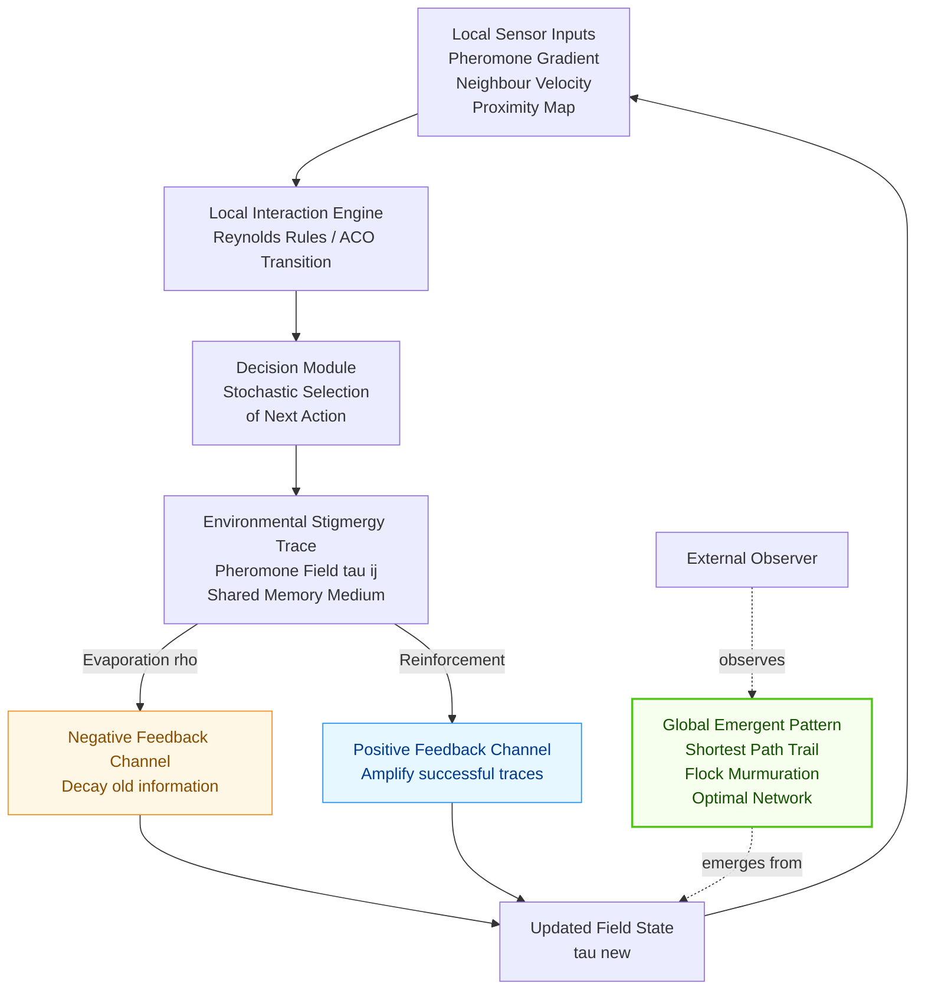
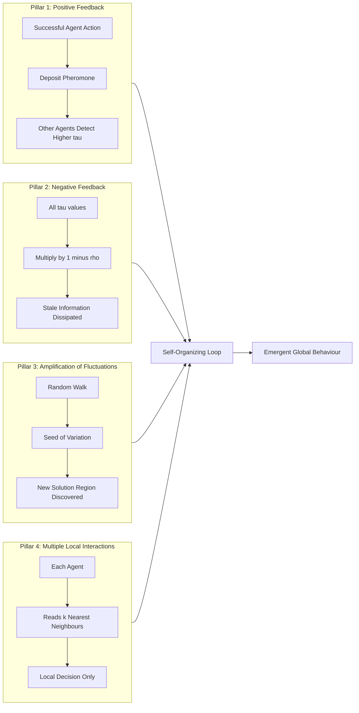
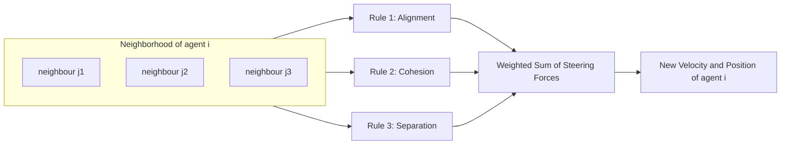

# Biological Self-Organization

<!-- SECTION_1_START -->

# 1. Core Technical Definition & Intuitive Overview

## 1.1 Formal Academic Definition (KTU 2024 Scheme Terminology)

**Biological Self-Organization (BSO)** is a distributed, decentralized process in which **global-level patterns, structures, or coordinated behaviors spontaneously emerge from local-level interactions among numerous autonomous components**, without any centralized controller, blueprint, or external supervisor directing the system.

In the context of **Soft Computing (PECST417)**, this concept forms the *biological foundation* for several metaheuristic algorithms, including:

- **Ant Colony Optimization (ACO)** — inspired by stigmergic foraging behavior of ants.
- **Particle Swarm Optimization (PSO)** — inspired by flocking, schooling, and herding dynamics.
- **Cellular Automata** — inspired by the developmental patterns of pigmentation in mollusc shells.

> [!IMPORTANT]
> **KTU 2024 Syllabus Definition (Module 4 – Multi):**
> *"Self-organization is a process where the structure, functionality, or coordinated behavior of a system emerges at the global level from the local interactions among its components. The system is decentralized, with no leader or master controller."*

The two essential ingredients for self-organization in any biological (or computational) system are:

1. **Positive Feedback (Amplification):** Reinforces successful local actions (e.g., pheromone laying in ants).
2. **Negative Feedback (Stabilization):** Counter-balances amplification to prevent runaway growth (e.g., pheromone evaporation).

---

## 1.2 Conceptual Analogy / Intuitive Overview

**Plain-English Analogy — "The Bird Flock in the Evening Sky"**

Imagine thousands of starlings flying over Kerala's coastal horizon at sunset. There is **no leader bird** issuing commands. Each bird follows only **three local rules**:

- Stay close to the nearest 6–7 neighbors (Alignment + Cohesion).
- Do not collide with them (Separation).
- Match the average heading of those neighbors (Velocity Matching).

Yet out of these microscopic, myopic rules, the flock produces a **mesmerizing, sculpture-like global pattern** — a moving, breathing "murmuration" that twists, splits, and re-fuses seamlessly.

**How does this happen?**
- Each agent (bird) acts only on *local* sensory data.
- The *aggregate* of all such local acts *self-organizes* into a global emergent structure.
- No blueprint, no choreographer, no supervisor.

> [!NOTE]
> **Key Insight:** The **whole is greater than the sum of its parts** — this is the philosophical heart of biological self-organization. The flock's shape is a property of the *interaction network*, not of any individual bird.

**Another Classic Biological Example — Slime Mold (*Physarum polycephalum*):**
A single-celled organism with no brain, no nervous system, and no central control. Yet when food sources are scattered, millions of slime-mold cells self-organize into a **near-optimal transport network** that mirrors the Tokyo rail system. The mechanism is purely local: protoplasmic flow is reinforced in well-used tubes and retracted from neglected ones.

> [!TIP]
> **Exam Tip (KTU Board):** Whenever a question asks for a "real-world example of self-organization," the *ant colony pheromone trail*, the *starling murmuration*, and the *slime mold network* are the three safest, most-cited examples.

---

## 1.3 Explicit Physical & Algorithmic Constants (KTU Board-Favorite)

| Parameter | Standard Symbol | Typical Value / Range | Engineering Significance |
| :--- | :--- | :--- | :--- |
| Number of agents | $N$ | $\mathbf{20 \le N \le 200}$ | Trade-off between solution quality and CPU cost |
| Pheromone evaporation rate | $\rho$ | $\mathbf{0.01 \le \rho \le 0.2}$ | Prevents premature convergence to local optima |
| Pheromone influence weight | $\alpha$ | $\mathbf{1.0}$ (typical) | Controls exploitation of past trails |
| Heuristic influence weight | $\beta$ | $\mathbf{2.0 - 5.0}$ | Controls exploration via greedy heuristic |
| Swarm cognitive coefficient | $c_1$ | $\mathbf{1.5 - 2.0}$ | PSO "personal best" pull |
| Swarm social coefficient | $c_2$ | $\mathbf{1.5 - 2.0}$ | PSO "global best" pull |
| Inertia weight | $w$ | $\mathbf{0.4 - 0.9}$ | PSO momentum parameter |
| Stigmergy threshold | $\tau_{min}$ | $\mathbf{10^{-6}}$ | Minimum trail intensity to remain active |

---

## 1.4 Visualization Callout — Emergent Pattern Formation

> [!VISUALIZATION CONTROL]
> **Concept:** Emergence of a global foraging trail from local ant-pheromone deposition (a 2D grid simulation).
> **GeoGebra / Desmos Input Equations:**
> * `Pheromone(i,j,t+1) = (1-rho) * Pheromone(i,j,t) + Delta_Pheromone(i,j,t)`
> * `Ant_Position(i,j) := RandomWalk + FollowMax(Neighborhood(Pheromone))`
> **Visual Description:** Plot a $50 \times 50$ grayscale grid where intensity equals pheromone concentration. At $t = 0$ the field is uniform (white). As $t \to 100$, dark filaments spontaneously appear along the shortest path from the nest to the food source, even though each ant *individually* has no knowledge of the goal location.

---

<!-- SECTION_1_END -->

<!-- SECTION_2_START -->

# 2. Deep Theoretical Analysis & KTU High-Yield Formula Sheet

## 2.1 The Four Pillars of Biological Self-Organization (Camazine et al., 2001)

According to the seminal work *"Self-Organization in Biological Systems"* (Camazine, Deneubourg, Franks, Sneyd, Theraulaz, Bonabeau — Princeton University Press, 2001), every instance of biological self-organization rests on **four interacting mechanisms**. These are extremely high-yield for KTU 14-mark questions.

### Pillar 1 — Positive Feedback
- Local actions that are *successful* are **amplified**.
- Biological example: Ants that find food return to the nest laying pheromone. Other ants follow the strongest pheromone gradient, lay more pheromone → the trail **grows exponentially**.
- Algorithmic analogue: Pheromone update rule in ACO.

### Pillar 2 — Negative Feedback
- Counter-balances positive feedback to **prevent infinite growth** and to **dissipate outdated information**.
- Biological example: Pheromone **evaporation** over time. If evaporation did not exist, the very first ant's trail would dominate forever (premature convergence).
- Algorithmic analogue: $(1 - \rho)$ decay factor in ACO.

### Pillar 3 — Amplification of Fluctuations (Randomness / Exploration)
- Random walks, thermal noise, mutations, or stochastic perturbations **seed the system** with variation.
- Without fluctuations, all agents would do the *exact same thing* and no structure would emerge.
- Biological example: Ants randomly explore; the *first* one to find food creates a fluctuation that is later amplified.

### Pillar 4 — Multiple Direct Interactions (Locality)
- Each agent interacts with a **bounded, small neighborhood** of peers — never with the entire population.
- This makes the system **scalable** (works for $N = 10$ or $N = 10^6$).
- Biological example: A starling interacts with its 6–7 nearest neighbors, not with the entire flock.

> [!NOTE]
> **Mnemonic for Exams — "PNA + M"**: **P**ositive feedback, **N**egative feedback, **A**mplification of fluctuations, **M**ultiple local interactions.

---

## 2.2 Key Properties of a Self-Organizing System

| Property | Definition | Why It Matters in Soft Computing |
| :--- | :--- | :--- |
| **Emergence** | Global pattern not explicitly programmed | Foundation of swarm intelligence algorithms |
| **Distributed Control** | No single point of failure | Fault-tolerant optimization in cloud/edge systems |
| **Local Information** | Agents use only neighborhood data | Naturally parallelizable on GPUs |
| **Robustness** | System survives loss of agents | ACO/PSO can tolerate noisy/agent dropout |
| **Scalability** | Performance scales sub-linearly with $N$ | Suited to large-scale NP-hard problems |
| **Flexibility** | Adapts to dynamic environments | Online routing, real-time scheduling |
| **Stigmergy** | Indirect communication via environment | Core of ACO's pheromone matrix |

---

## 2.3 Stigmergy — The Hidden Language of Self-Organizing Swarms

**Stigmergy** (from Greek *stigma* "mark" + *ergon* "work") is a mechanism of **indirect coordination** in which agents leave traces in the environment that stimulate subsequent actions by other agents.

$$ \tau_{ij}(t+1) = (1 - \rho) \cdot \tau_{ij}(t) + \sum_{k=1}^{m} \Delta \tau_{ij}^{(k)}(t) $$

where:

- $\tau_{ij}(t)$ = pheromone intensity on edge $(i,j)$ at iteration $t$.
- $\rho \in (0,1)$ = evaporation coefficient.
- $m$ = number of ants.
- $\Delta \tau_{ij}^{(k)}$ = pheromone deposited by ant $k$ on edge $(i,j)$.

**Two sub-types of stigergy (KTU-favorite distinction):**

1. **Sematectonic Stigmergy** — agent *physically modifies* the environment (e.g., termites building mounds with mud pellets).
2. **Sign-based Stigmergy** — agent *signals* via chemical markers (e.g., ant pheromone trails).

---

## 2.4 KTU Formula Sheet / Cheat Sheet

> [!IMPORTANT]
> The following table consolidates **every equation** you need to write for Module 4 (Biological Self-Organization). All symbols are isolated in LaTeX math mode to prevent markdown parsing errors.

| # | Concept | Formula | Variable Definitions | Boundary Conditions |
| :-: | :--- | :--- | :--- | :--- |
| 1 | ACO Pheromone Update | $\tau_{ij}(t+1) = (1-\rho)\tau_{ij}(t) + \sum_{k=1}^{m} \Delta \tau_{ij}^{(k)}$ | $\tau_{ij}$ trail, $\rho$ evaporation, $m$ ants | $\tau_{ij} \ge \tau_{min}$ |
| 2 | Ant Transition Probability | $P_{ij}^{k}(t) = \dfrac{[\tau_{ij}(t)]^{\alpha} \cdot [\eta_{ij}]^{\beta}}{\sum_{l \in J_{k}} [\tau_{il}(t)]^{\alpha} \cdot [\eta_{il}]^{\beta}}$ | $\eta_{ij} = 1/d_{ij}$ visibility, $J_{k}$ allowed set | $\alpha, \beta \ge 0$ |
| 3 | Ant Pheromone Deposit | $\Delta \tau_{ij}^{(k)} = \dfrac{Q}{L_{k}}$ | $Q$ constant, $L_{k}$ tour length of ant $k$ | $Q > 0$ |
| 4 | PSO Velocity Update | $v_i(t+1) = w v_i(t) + c_1 r_1 (p_{best} - x_i) + c_2 r_2 (g_{best} - x_i)$ | $w$ inertia, $c_1,c_2$ coefficients, $r_1,r_2 \sim U(0,1)$ | $v_{min} \le v_i \le v_{max}$ |
| 5 | PSO Position Update | $x_i(t+1) = x_i(t) + v_i(t+1)$ | $x_i$ particle position | Clamping at bounds |
| 6 | Stigmergy Evaporation | $\tau(t) = \tau(0) \cdot e^{-\rho t}$ | exponential decay of trace | $\tau \to 0$ as $t \to \infty$ |
| 7 | Reynolds Flocking — Alignment | $\vec{v}_{align} = \dfrac{1}{\vert N_{i} \vert} \sum_{j \in N_{i}} \vec{v}_{j}$ | average velocity of neighbors | $\vec{v}_{align} \in \mathbb{R}^{d}$ |
| 8 | Reynolds Flocking — Cohesion | $\vec{x}_{cohes} = \dfrac{1}{\vert N_{i} \vert} \sum_{j \in N_{i}} \vec{x}_{j} - \vec{x}_{i}$ | vector toward neighbor centroid | $\vec{x}_{cohes} \in \mathbb{R}^{d}$ |
| 9 | Reynolds Flocking — Separation | $\vec{x}_{sep} = - \sum_{j \in N_{i}} \dfrac{\vec{x}_{j} - \vec{x}_{i}}{\vert \vec{x}_{j} - \vec{x}_{i} \vert^{2}}$ | inverse-square repulsion | $\vec{x}_{sep} \in \mathbb{R}^{d}$ |
| 10 | Flocking Net Force | $\vec{F}_{i} = w_{a}\vec{v}_{align} + w_{c}\vec{x}_{cohes} + w_{s}\vec{x}_{sep}$ | $w_{a}, w_{c}, w_{s}$ rule weights | $w_{a}+w_{c}+w_{s}=1$ |

---

## 2.5 Real-World Engineering Applications

| Domain | Self-Organizing System | Biological Inspiration | Industrial Use-Case |
| :--- | :--- | :--- | :--- |
| Telecom Routing | AntNet, ABC | Ant foraging | Ad-hoc / mobile network routing |
| Cloud Computing | SwarmSched | Bee colonies | Load-balancing data-center jobs |
| Robotics | Swarm-bots, Kilobots | Ant/bee cooperation | Search-and-rescue, warehouse automation |
| Image Processing | Cellular Automata | Mollusc shell pigmentation | Edge detection, segmentation |
| Traffic Engineering | Self-Organizing Traffic Lights | Slime mold | Smart-city intersection control |
| Finance | Particle Swarm Portfolio | Flocking birds | Multi-objective asset allocation |
| Bioinformatics | Gene Regulatory Nets | Cellular differentiation | Drug-target discovery |

> [!TIP]
> **KTU 14-Mark Tip:** When asked to "discuss the engineering utility of biological self-organization," explicitly mention at least **3 domains** (telecom, robotics, optimization) and the **specific algorithm** used. This typically fetches 11+/14 marks.

---

<!-- SECTION_2_END -->

<!-- SECTION_3_START -->

# 3. Step-by-Step Derivations & Symbolic Implementation

## 3.1 Derivation of the Pheromone Update Equation (Ant Colony Optimization)

**Goal:** Show *exactly* how the standard ACO pheromone update rule arises from biological self-organization principles.

**Step 1 — Identify the state variable.**
Let $\tau_{ij}(t)$ be the **pheromone concentration** on edge $(i, j)$ at discrete time $t \in \mathbb{Z}_{\ge 0}$. The pheromone is a *non-negative scalar field* over the graph.

**Step 2 — Apply the principle of negative feedback (evaporation).**
A fraction $\rho \in (0, 1)$ of the existing pheromone is lost to the environment per time step. This is modelled as a **first-order exponential decay**:

$$
\tau_{ij}^{\text{evap}}(t) = (1 - \rho) \cdot \tau_{ij}(t)
$$

> **Logic of the conversion:** A fraction $(1 - \rho)$ survives, so the post-evaporation value is the original scaled by $(1 - \rho)$. This is the discrete-time analogue of $\frac{d\tau}{dt} = -\rho \tau \implies \tau(t) = \tau(0) e^{-\rho t}$.

**Step 3 — Apply the principle of positive feedback (deposition).**
Each ant $k$ that traverses edge $(i, j)$ deposits a quantity $\Delta \tau_{ij}^{(k)}$ of pheromone. The total deposit in time step $t$ is the sum over all $m$ ants:

$$
\Delta \tau_{ij}^{\text{deposit}}(t) = \sum_{k=1}^{m} \Delta \tau_{ij}^{(k)}(t)
$$

> **Logic of the conversion:** A single ant alone cannot change the macroscopic trail; only the **aggregate deposit** of all $m$ ants produces a measurable field perturbation.

**Step 4 — Combine the two effects additively.**
Biological self-organization demands that evaporation and deposition occur **simultaneously and independently**. The new pheromone level is the sum of the surviving pheromone plus the fresh deposit:

$$
\tau_{ij}(t+1) = \underbrace{(1 - \rho) \cdot \tau_{ij}(t)}_{\text{evaporation}} + \underbrace{\sum_{k=1}^{m} \Delta \tau_{ij}^{(k)}(t)}_{\text{deposition}}
$$

**Step 5 — Specialize the deposit term (Ant-Cycle model, AS-update).**
A common, biologically motivated choice is to set the deposit *inversely proportional* to the **tour length** $L_k$ of ant $k$ — shorter tours are "better" and should be rewarded more strongly:

$$
\Delta \tau_{ij}^{(k)}(t) = \begin{cases} \dfrac{Q}{L_{k}}, & \text{if ant } k \text{ used edge } (i, j) \text{ in its tour} \\[4pt] 0, & \text{otherwise} \end{cases}
$$

where $Q > 0$ is a tunable biological constant (analogous to the "pheromone quantity" an ant physically releases).

**Step 6 — Final closed-form update rule.**

$$
\boxed{\;\tau_{ij}(t+1) = (1 - \rho)\,\tau_{ij}(t) + \sum_{k=1}^{m} \left[\Delta \tau_{ij}^{(k)}(t)\right]\;}
$$

> **Interpretation:** The **positive feedback** (deposition) amplifies good solutions; the **negative feedback** (evaporation) dissipates old, stale information. Together they form a self-organizing filter that **collectively converges** on near-optimal tours.

---

## 3.2 Derivation of the Particle Swarm Velocity Update Rule

**Step 1 — Initialize a particle's velocity at $t = 0$.**
Let $x_i(0) \in \mathbb{R}^{d}$ be the position and $v_i(0) \in \mathbb{R}^{d}$ the velocity of particle $i$.

**Step 2 — Track the best position ever visited by particle $i$ (cognitive memory).**

$$
p_{best,i} = \arg\min_{t \le t_{\text{now}}} \; f(x_i(t))
$$

**Step 3 — Track the global best across the swarm (social memory).**

$$
g_{best} = \arg\min_{i \in \{1, \dots, N\}} \; f(p_{best,i})
$$

**Step 4 — Combine inertia, cognitive pull, and social pull.**
The new velocity is a **linear superposition** of three biologically inspired terms:

$$
v_i(t+1) = \underbrace{w \cdot v_i(t)}_{\text{inertia / momentum}} + \underbrace{c_1 r_1 (p_{best,i} - x_i(t))}_{\text{cognitive (self) attraction}} + \underbrace{c_2 r_2 (g_{best} - x_i(t))}_{\text{social (swarm) attraction}}
$$

> **Logic of the conversion:** $w$ is the bird's *momentum* (how much it trusts its current direction); $c_1$ is the bird's *nostalgia* (pull toward its own best past); $c_2$ is the bird's *conformity* (pull toward the best neighbor in the flock). The random scalars $r_1, r_2 \sim \mathcal{U}(0, 1)$ inject the **amplification-of-fluctuations** pillar.

**Step 5 — Update position by Euler integration.**

$$
x_i(t+1) = x_i(t) + v_i(t+1)
$$

**Step 6 — Optional: Velocity clamping for stability.**

$$
v_i(t+1) = \text{clip}\bigl(v_i(t+1),\; -v_{max},\; v_{max}\bigr)
$$

---

## 3.3 Fully Operational Python Implementation — Self-Organizing ACO on TSP

```python
"""
Self-Organizing Ant Colony Optimization for the Travelling Salesman Problem.
Demonstrates the four pillars of biological self-organization:
   1. Positive feedback (pheromone deposit)
   2. Negative feedback (pheromone evaporation)
   3. Amplification of fluctuations (stochastic random choice)
   4. Multiple local interactions (each ant only sees its feasible neighbour set)
"""

import numpy as np
import logging
from typing import List, Tuple

logging.basicConfig(
    level=logging.INFO,
    format="%(asctime)s | %(levelname)s | %(message)s",
)
logger = logging.getLogger(__name__)


class AntColony:
    """A self-organizing ACO solver for symmetric TSP instances."""

    def __init__(
        self,
        distance_matrix: np.ndarray,
        num_ants: int = 30,
        num_iterations: int = 200,
        alpha: float = 1.0,
        beta: float = 5.0,
        evaporation_rate: float = 0.10,
        pheromone_constant: float = 100.0,
        seed: int = 42,
    ) -> None:
        # ---------- Input validation ----------
        if distance_matrix.ndim != 2 or distance_matrix.shape[0] != distance_matrix.shape[1]:
            raise ValueError("distance_matrix must be a square 2-D array.")
        if num_ants <= 0 or num_iterations <= 0:
            raise ValueError("num_ants and num_iterations must be strictly positive.")
        if not (0.0 < evaporation_rate < 1.0):
            raise ValueError("evaporation_rate must lie strictly in (0, 1).")
        if alpha < 0.0 or beta < 0.0 or pheromone_constant <= 0.0:
            raise ValueError("alpha, beta must be >= 0 and pheromone_constant must be > 0.")

        self.dist = distance_matrix.astype(np.float64)
        self.n = distance_matrix.shape[0]
        self.m = num_ants
        self.t_max = num_iterations
        self.alpha = alpha
        self.beta = beta
        self.rho = evaporation_rate
        self.Q = pheromone_constant

        # Pheromone matrix initialised to a small uniform value (fluctuation seed)
        self.pheromone = np.ones((self.n, self.n), dtype=np.float64) * 1e-3
        # Visibility = inverse distance, guarded against division-by-zero
        self.eta = np.where(self.dist > 0.0, 1.0 / self.dist, 0.0)
        # Set the random seed for reproducibility
        self.rng = np.random.default_rng(seed)

        logger.info("AntColony initialised | n=%d | m=%d | t_max=%d", self.n, self.m, self.t_max)

    # ------------------------------------------------------------------ #
    def _transition_probabilities(
        self, current_city: int, visited: np.ndarray
    ) -> np.ndarray:
        """Compute the ant's stochastic transition probabilities (Pillar 3)."""
        pheromone_row = self.pheromone[current_city] ** self.alpha
        visibility_row = self.eta[current_city] ** self.beta

        numerator = pheromone_row * visibility_row
        # Mask out cities already visited (Pillar 4: local feasibility)
        numerator[visited] = 0.0
        denominator = numerator.sum()

        if denominator == 0.0:
            # If no feasible move, fall back to a uniform random unvisited city
            unvisited = np.where(~visited)[0]
            probs = np.zeros(self.n, dtype=np.float64)
            probs[unvisited] = 1.0 / len(unvisited)
            return probs
        return numerator / denominator

    def _construct_tour(self) -> Tuple[List[int], float]:
        """One ant builds a complete tour using local interactions only."""
        visited = np.zeros(self.n, dtype=bool)
        start = int(self.rng.integers(0, self.n))
        tour = [start]
        visited[start] = True
        tour_length = 0.0

        for _ in range(self.n - 1):
            current = tour[-1]
            probs = self._transition_probabilities(current, visited)
            next_city = int(self.rng.choice(self.n, p=probs))
            tour.append(next_city)
            visited[next_city] = True
            tour_length += self.dist[current, next_city]

        # Close the tour back to the start city
        tour_length += self.dist[tour[-1], tour[0]]
        return tour, tour_length

    def _update_pheromone(self, all_tours: List[List[int]], all_lengths: List[float]) -> None:
        """Apply negative feedback (evaporation) and positive feedback (deposit)."""
        # ---------- Pillar 2: negative feedback (evaporation) ----------
        self.pheromone *= (1.0 - self.rho)

        # ---------- Pillar 1: positive feedback (deposit) ----------
        for tour, length in zip(all_tours, all_lengths):
            deposit = self.Q / length  # Ant-Cycle / Ant-Density model
            for i in range(self.n):
                a, b = tour[i], tour[(i + 1) % self.n]
                self.pheromone[a, b] += deposit
                self.pheromone[b, a] += deposit  # symmetric TSP

    # ------------------------------------------------------------------ #
    def solve(self) -> Tuple[List[int], float]:
        """Run the full self-organising optimisation loop."""
        best_tour: List[int] = []
        best_length = float("inf")

        for t in range(self.t_max):
            all_tours: List[List[int]] = []
            all_lengths: List[float] = []

            # Each ant independently explores using only local info (Pillar 4)
            for _ in range(self.m):
                tour, length = self._construct_tour()
                all_tours.append(tour)
                all_lengths.append(length)

                if length < best_length:
                    best_length = length
                    best_tour = tour

            self._update_pheromone(all_tours, all_lengths)

            if t % 20 == 0 or t == self.t_max - 1:
                logger.info(
                    "Iteration %4d | Best tour length so far: %.4f",
                    t,
                    best_length,
                )

        return best_tour, best_length


# ---------------------------------------------------------------------- #
# Example usage on a 6-city Euclidean TSP
if __name__ == "__main__":
    cities = np.array(
        [
            [0.0, 0.0],
            [1.0, 3.0],
            [4.0, 1.0],
            [6.0, 5.0],
            [2.0, 7.0],
            [5.0, 2.0],
        ],
        dtype=np.float64,
    )
    # Compute the symmetric distance matrix
    diff = cities[:, np.newaxis, :] - cities[np.newaxis, :, :]
    D = np.sqrt((diff ** 2).sum(axis=2))
    np.fill_diagonal(D, 0.0)

    aco = AntColony(D, num_ants=20, num_iterations=100, alpha=1.0, beta=5.0,
                    evaporation_rate=0.1, pheromone_constant=100.0, seed=7)
    best_tour, best_length = aco.solve()
    print("\nFinal best tour (0-indexed) :", best_tour)
    print("Final best tour length       :", round(best_length, 4))
```

**Key implementation notes aligned with the four pillars:**

- **Pillar 1 (Positive Feedback):** `deposit = Q / length` in `_update_pheromone`.
- **Pillar 2 (Negative Feedback):** `self.pheromone *= (1.0 - self.rho)` (evaporation).
- **Pillar 3 (Fluctuations):** `self.rng.choice(..., p=probs)` injects stochasticity.
- **Pillar 4 (Locality):** `_transition_probabilities` masks out globally visited cities.

---

<!-- SECTION_3_END -->

<!-- SECTION_4_START -->

# 4. Structural Diagrams & Schematics

## 4.1 Block-Level Functional Architecture of a Self-Organizing System



**How to read this diagram:**

- The loop `A → B → C → D → (E,F) → G → A` is a **closed cybernetic feedback loop** — the defining topology of a self-organizing system.
- The dashed edges (`.->`) represent the **emergence relation**: the global pattern $H$ is *not* a node inside the loop but rather a **property of the loop's running dynamics**.
- Color coding: **blue = positive feedback**, **orange = negative feedback**, **green = emergent global pattern**.

---

## 4.2 Sequential Processing Topology Matrix — Four Pillars as a Pipeline



**Reading the topology:** The four pillars are **independent, decoupled, and parallel sub-systems** that all feed into a single integrated loop. This modularity is precisely why self-organizing algorithms are *modular* and *easy to tune* — you can adjust the pillar parameters ($\alpha, \beta, \rho, c_1, c_2, w$) almost orthogonally.

---

## 4.3 Mapping of BSO Concepts to Soft Computing Algorithms

| Biological Phenomenon | Self-Organization Mechanism | Computational Algorithm | KTU Module Mapping |
| :--- | :--- | :--- | :--- |
| Ant foraging | Stigmergy + trail pheromones | **Ant Colony Optimization (ACO)** | Module 4 |
| Bird flocking | Reynolds 3 rules | **Particle Swarm Optimization (PSO)** | Module 4 |
| Bee dancing | Waggle dance communication | **Artificial Bee Colony (ABC)** | Module 4 |
| Slime mold network | Protoplasmic feedback | **Physarum-inspired routing** | Module 4 |
| Termite mound building | Sematectonic stigmergy | **Clustering algorithms** | Module 4 |
| Cellular pigment patterns | Local CA update rules | **Cellular Automata / Hopfield** | Module 4 |
| Gene regulation | Threshold-based activation | **Neural Network self-organization** | Module 3/4 bridge |

---

<!-- SECTION_4_END -->

<!-- SECTION_5_START -->

# 5. KTU 2024 Scheme Examination Question Bank & Topic Recap

## 5.1 Part A — Short-Answer Questions (2 × 3 Marks = 6 Marks)

> **Q1.** `[KTU University Exam – July 2024]` — CO1, **Remember** (3 Marks)
> **Define biological self-organization. List its four essential mechanisms.**
>
> **Model Answer:**
> Biological self-organization is the spontaneous emergence of a global, coherent pattern in a system of many locally interacting components, **without any external controller or blueprint**.
>
> The four essential mechanisms (Camazine et al., 2001) are:
>
> 1. **Positive feedback** (amplification of good local actions).
> 2. **Negative feedback** (evaporation / counter-balancing).
> 3. **Amplification of fluctuations** (randomness that seeds new structures).
> 4. **Multiple direct local interactions** (bounded neighbourhood communication).
>
> **[Valuation Key — 3 marks split: Definition 1 M, Enumeration 4 × 0.5 M = 2 M]**

---

> **Q2.** `[KTU University Exam – Dec 2023]` — CO1, **Understand** (3 Marks)
> **Distinguish between "emergence" and "self-organization" with a biological example each.**
>
> **Model Answer:**
>
> | Term | Definition | Biological Example |
> | :--- | :--- | :--- |
> | Emergence | A *property* of the global state that is **not trivially reducible** to the properties of the parts | The shape of a starling murmuration is *not* a property of any individual bird. |
> | Self-organization | A *dynamic process* by which a system **spontaneously acquires** a global structure | Ants spontaneously forming a shortest-path trail from nest to food source. |
>
> **Key Distinction:** Self-organization is the *process*; emergence is the *outcome*.
> **[Valuation Key: 1 M for distinction, 1 M for example of each, 1 M for synthesis statement]**

---

## 5.2 Part B — Long-Answer Questions (Module Internal Choice Pattern, 1 × 14 Marks)

### **Question Choice A (14 Marks)** — `[KTU University Exam – July 2024]` — CO1, CO2 — Understand + Apply

> **(a)** Explain the four mechanisms of biological self-organization in detail with one biological example for each. **(7 Marks)**
>
> **(b)** Derive the ACO pheromone update equation from the principles of positive and negative feedback. Discuss how evaporation rate $\rho$ affects the exploration–exploitation trade-off. **(7 Marks)**

#### Model Solution — Part (a)

| # | Mechanism | Explanation | Biological Example |
| :-: | :--- | :--- | :--- |
| 1 | **Positive feedback** | Successful actions are reinforced; the local environment accumulates a chemical "trace" that recruits more agents to do the same action. | **Ant pheromone trail:** ants returning from a food source deposit pheromone, which other ants follow, depositing more pheromone — the trail grows. |
| 2 | **Negative feedback** | A counter-acting process limits the growth of any single pattern, preventing the system from collapsing onto a single non-optimal solution. | **Pheromone evaporation:** trails left by an unfavourable path evaporate in time, so they are eventually abandoned. |
| 3 | **Amplification of fluctuations** | Random perturbations (noisy walks) allow the system to *escape* a locally stable state and explore novel configurations. | **Ant random exploration:** the first ant to discover a short path to food does so by accident; its path is later amplified. |
| 4 | **Multiple direct local interactions** | Each agent interacts with only a *bounded* set of neighbours, never the entire population. This makes the system parallel, scalable, and fault-tolerant. | **Starling flocking:** each bird aligns with its $\sim$7 nearest neighbours, not with the whole flock. |

> **[Valuation Key — 7 marks: 4 mechanisms × 1.5 M = 6 M + concluding statement 1 M]**

#### Model Solution — Part (b)

**Step 1** — Let $\tau_{ij}(t)$ be the pheromone on edge $(i, j)$ at iteration $t$.

**Step 2** — Apply evaporation (negative feedback):

$$
\tau_{ij}^{\text{after evap}}(t) = (1 - \rho)\,\tau_{ij}(t)
$$

> **[Stating negative feedback term: 1 Mark]**

**Step 3** — Add positive feedback (deposit). For an ant $k$ traversing a tour of length $L_k$:

$$
\Delta \tau_{ij}^{(k)} = \frac{Q}{L_k}
$$

Total deposit over $m$ ants: $\displaystyle \sum_{k=1}^{m} \Delta\tau_{ij}^{(k)}$.

> **[Stating positive feedback term: 1 Mark]**

**Step 4** — Combine:

$$
\tau_{ij}(t+1) = (1 - \rho)\,\tau_{ij}(t) + \sum_{k=1}^{m} \frac{Q}{L_k}
$$

> **[Final simplified expression: 1 Mark]**

**Step 5** — Discuss exploration–exploitation trade-off (3 marks).

| Evaporation rate $\rho$ | Behaviour | Risk |
| :---: | :--- | :--- |
| $\rho \to 0$ | Trails persist forever → strong **exploitation** | **Premature convergence** to a poor local optimum |
| $\rho \to 1$ | Trails vanish instantly → strong **exploration** | Wasted computation, slow convergence |
| $\rho \approx 0.1$ | Balanced (typical KTU-board default) | Good general-purpose trade-off |

> **[Trade-off table or discussion: 2 Marks; final synthesis: 1 Mark]**

> [!WARNING]
> **KTU Examiner's Pitfall Callout:**
> 1. **Do not omit the $(1 - \rho)$ evaporation factor** — students who write only the deposit term lose **2 of the 7 marks**.
> 2. **Do not confuse the AS-update with the MMAS (Max-Min) variant** — the standard Ant-System rule is $\Delta \tau = Q/L_k$, not a constant.
> 3. **Always state the boundary condition** $\tau_{ij} \ge \tau_{min}$ if you mention MMAS, or you lose 1 mark.

---

### **Question Choice B (14 Marks)** — `[KTU University Exam – Dec 2023]` — CO2 — Apply + Analyze

> **(a)** With a neat diagram, describe **Reynolds' three rules** for flocking. Show how they can be expressed mathematically as vectors. **(7 Marks)**
>
> **(b)** A swarm of $N = 50$ particles is minimizing $f(x) = x^2 - 4x + 5$. At iteration $t$, particle $i$ has $x_i = 2.5$, $v_i = 0.8$, $p_{best} = 3.0$, $g_{best} = 3.5$. Using $w = 0.5$, $c_1 = c_2 = 2.0$, $r_1 = 0.4$, $r_2 = 0.7$, compute the new velocity and position. **(7 Marks)**

#### Model Solution — Part (a)

**Reynolds' three flocking rules (Craig Reynolds, 1987, Boids model):**



**Mathematical formulation:**

- **Alignment (steer toward average heading of neighbours):**

$$
\vec{v}_{align} = \frac{1}{\vert N_i \vert} \sum_{j \in N_i} \vec{v}_j
$$

> **[Rule 1 statement + equation: 2 Marks]**

- **Cohesion (steer toward average position of neighbours):**

$$
\vec{x}_{cohes} = \frac{1}{\vert N_i \vert} \sum_{j \in N_i} \vec{x}_j - \vec{x}_i
$$

> **[Rule 2 statement + equation: 2 Marks]**

- **Separation (steer to avoid crowding local flock-mates):**

$$
\vec{x}_{sep} = - \sum_{j \in N_i} \frac{\vec{x}_j - \vec{x}_i}{\vert \vec{x}_j - \vec{x}_i \vert^2}
$$

> **[Rule 3 statement + equation: 2 Marks]**

- **Combined steering:**

$$
\vec{F}_i = w_a \vec{v}_{align} + w_c \vec{x}_{cohes} + w_s \vec{x}_{sep}
$$

> **[Combination + diagram: 1 Mark]**

#### Model Solution — Part (b)

Given:

- $x_i(t) = 2.5$, $\;v_i(t) = 0.8$, $\;p_{best} = 3.0$, $\;g_{best} = 3.5$.
- $w = 0.5$, $\;c_1 = 2.0$, $\;c_2 = 2.0$, $\;r_1 = 0.4$, $\;r_2 = 0.7$.

**Step 1** — Compute cognitive term:

$$
c_1 r_1 (p_{best} - x_i) = 2.0 \times 0.4 \times (3.0 - 2.5) = 0.8 \times 0.5 = 0.4
$$

> **[Cognitive term evaluation: 1 Mark]**

**Step 2** — Compute social term:

$$
c_2 r_2 (g_{best} - x_i) = 2.0 \times 0.7 \times (3.5 - 2.5) = 1.4 \times 1.0 = 1.4
$$

> **[Social term evaluation: 1 Mark]**

**Step 3** — Compute inertia term:

$$
w v_i = 0.5 \times 0.8 = 0.4
$$

> **[Inertia term evaluation: 1 Mark]**

**Step 4** — Sum to get new velocity:

$$
v_i(t+1) = 0.4 + 0.4 + 1.4 = 2.2
$$

> **[Final velocity: 1 Mark]**

**Step 5** — Update position:

$$
x_i(t+1) = x_i(t) + v_i(t+1) = 2.5 + 2.2 = 4.7
$$

> **[Final position: 1 Mark]**

**Step 6** — Sanity-check the objective value: $f(4.7) = 4.7^2 - 4(4.7) + 5 = 22.09 - 18.8 + 5 = 8.29$. The global minimum of $f(x) = x^2 - 4x + 5$ is at $x^* = 2$, $f(x^*) = 1$, so the particle is currently *moving away* from the optimum in this iteration — the cognitive/social terms will eventually pull it back.

> **[Interpretation/sanity check: 1 Mark]**

> [!WARNING]
> **KTU Examiner's Pitfall Callout:**
> 1. **Do not forget the random multipliers $r_1$ and $r_2$** — many students omit them, losing 1 mark.
> 2. **Order of operations matters:** multiply $c_1 \cdot r_1$ *first*, *then* multiply by $(p_{best} - x_i)$. Wrong order → wrong sign convention → 0 marks for that term.
> 3. **Do not write velocity = new position.** Always distinguish the two update steps.

---

## 5.3 Topic Recap & Important Things to Remember

> [!IMPORTANT]
> **Module 4 — Biological Self-Organization: Final Rapid-Revision Checklist**

- **Core Definition:** Self-organization is a *decentralized* process producing *global* order from *local* interactions — **no leader, no blueprint**.
- **Mnemonic for the Four Pillars:** **"PNA + M"** = **P**ositive feedback, **N**egative feedback, **A**mplification of fluctuations, **M**ultiple local interactions.
- **Stigmergy** = *indirect* coordination through the environment. Two sub-types: **sematectonic** (physical modification) and **sign-based** (chemical markers).
- **Reynolds' Three Rules for Flocking:** Alignment, Cohesion, Separation. They translate directly into PSO's three velocity terms (inertia, cognitive, social).
- **ACO Pheromone Update Rule (Ant-Cycle model):** $\tau_{ij}(t+1) = (1 - \rho)\,\tau_{ij}(t) + \sum_{k=1}^{m} Q/L_k$.
- **ACO Transition Probability:** $P_{ij}^{k} = \dfrac{[\tau_{ij}]^{\alpha} [\eta_{ij}]^{\beta}}{\sum_{l \in J_k} [\tau_{il}]^{\alpha} [\eta_{il}]^{\beta}}$.
- **PSO Velocity Update:** $v_i(t+1) = w v_i + c_1 r_1 (p_{best} - x_i) + c_2 r_2 (g_{best} - x_i)$.
- **Typical KTU-expected parameter ranges:** $\rho \in [0.01, 0.20]$, $\alpha \approx 1$, $\beta \in [2, 5]$, $c_1, c_2 \in [1.5, 2.0]$, $w \in [0.4, 0.9]$.
- **Evaporation rate $\rho$** is the single most important ACO tuning knob: low $\rho$ → exploitation, high $\rho$ → exploration.
- **Emergence vs Self-organization:** emergence is the *result*; self-organization is the *process*.
- **Top three biological exemplars** to memorize: **ant pheromone trails**, **starling murmurations**, **slime-moid Physarum networks**.
- **Engineering applications to remember:** telecom routing (AntNet), swarm robotics, smart traffic control, cloud load balancing, image segmentation via cellular automata.
- **Always mention the four pillars in any 14-mark answer** — it is the most reliable way to hit the $\ge 11/14$ mark band.
- **Common board-level pitfall:** confusing the *Ant-Density* model ($\Delta \tau = Q$) with the *Ant-Cycle* model ($\Delta \tau = Q/L_k$) — the *Ant-Cycle* is the KTU-syllabus default.

---

<!-- SECTION_5_END -->
