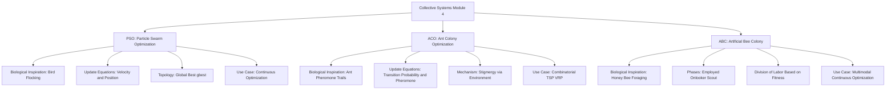
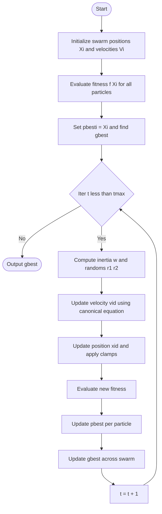
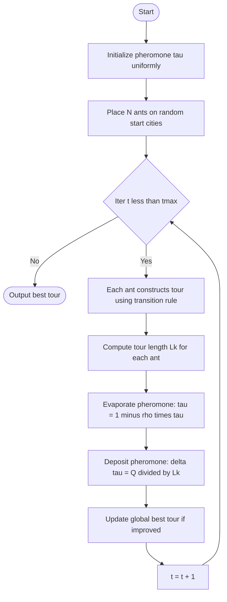
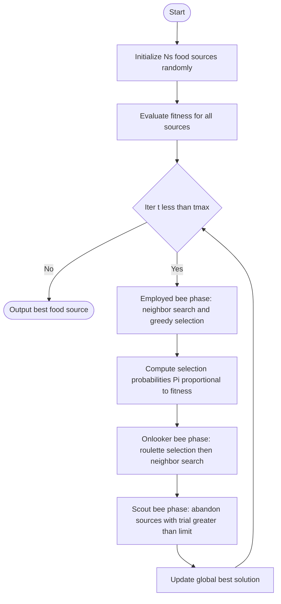
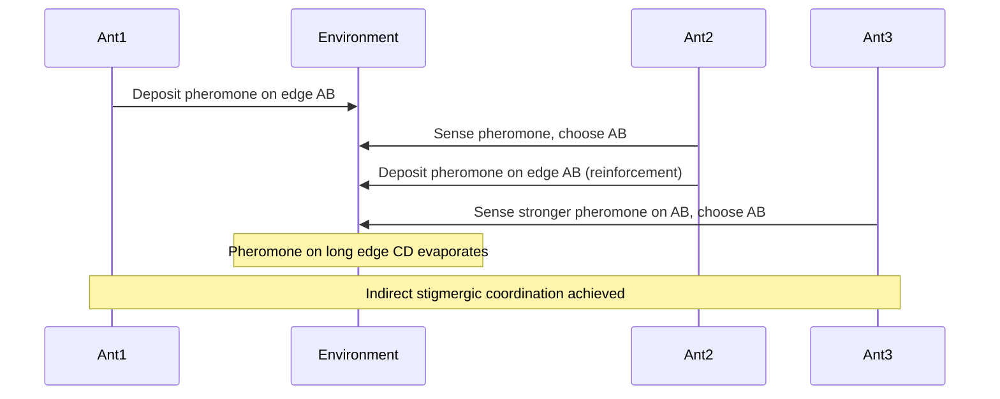
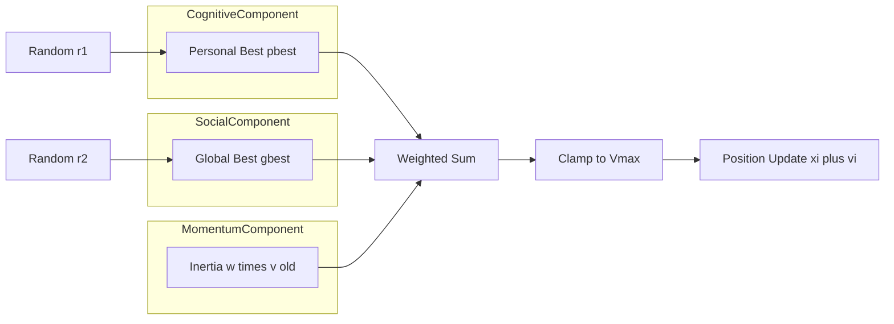

# Collective Systems

<!-- SECTION_1_START -->

# Collective Systems in Soft Computing

## 1.1 Formal Academic Definition

**Collective Intelligence (CI)** — also widely known in the KTU 2024 Soft Computing syllabus as **Swarm Intelligence (SI)** — is a sub-field of computational intelligence that models the emergent, self-organized, and decentralized collective behavior of natural (or artificial) agents working cooperatively to solve complex global optimization problems.

In the KTU **PECST417 – Soft Computing (2024 Scheme)** curriculum, *Module 4 (Multi / Collective Systems)* formally covers three flagship nature-inspired collective algorithms:

1. **Particle Swarm Optimization (PSO)** — inspired by the social foraging dynamics of bird flocking and fish schooling.
2. **Ant Colony Optimization (ACO)** — inspired by the stigmergic pheromone-mediated pathfinding of real ant colonies.
3. **Artificial Bee Colony (ABC) Algorithm** — inspired by the decentralized nectar-foraging behavior of honey bee swarms.

> [!IMPORTANT]
> **KTU 2024 Syllabus Note (PECST417 Module 4):** Collective systems belong to the family of **population-based meta-heuristics**. Unlike classical gradient-based methods, they do **not** require derivatives and are robust against local minima. They are classified under *Evolutionary Computation / Nature-Inspired Computing* in the CO4 (Apply) mapping.

---

## 1.2 Intuitive Overview — Real-World Analogy

Imagine you drop **50 blindfolded people** randomly across a huge mountainous terrain in dense fog, and you ask them to find the **lowest valley** (global minimum). They cannot see the terrain. How would they solve it?

- Each person keeps track of **their own best position** they have ever stood on (`pbest`).
- They can also **shout to nearby people** about the best valley they have collectively discovered (`gbest`).
- Each person balances **personal exploration** (moving in a random new direction) with **social exploitation** (steering toward the best-known location).

This is precisely how **PSO** works. The "people" are particles (candidate solutions), and the "valleys" are optima of a fitness function.

For **ACO**, imagine ants leaving invisible **chemical trails (pheromones)**. Shorter paths accumulate pheromone faster (because ants traverse them more frequently in a given time), and pheromone evaporates on longer, less-travelled paths. Eventually, the colony *collectively converges* on the shortest path — a beautiful example of **stigmergy** (indirect communication through environment modification).

For **ABC**, picture a beehive sending out **scout bees, employed bees, and onlooker bees**, each playing a distinct role in a sophisticated division-of-labor for finding food sources.

> [!NOTE]
> **Key Insight:** The "magic" of collective systems is that **no single agent is intelligent**, but the **emergent group behavior solves a problem that no individual agent could**. This is the hallmark of *self-organization* and *emergence*.

---

## 1.3 Physical Constants and Standard Metrics in Collective Systems

| Metric | Standard Notation | Description |
| :--- | :--- | :--- |
| **Swarm / Population Size** | $N$ (or $N_p$) | Number of agents (particles / ants / bees). Typical: $N = 20$–$100$. |
| **Cognitive Coefficient** | $c_1$ | Weight of particle's own best experience. Typical: $c_1 \approx 1.5$–$2.0$. |
| **Social Coefficient** | $c_2$ | Weight of swarm's global best experience. Typical: $c_2 \approx 1.5$–$2.0$. |
| **Inertia Weight** | $w$ | Controls momentum of particle velocity. Typical: $w \in [0.4, 0.9]$. |
| **Pheromone Evaporation Rate** | $\rho$ | Decay constant in ACO, $\rho \in (0, 1)$, typical $\rho = 0.5$. |
| **Pheromone Importance** | $\alpha$ | Exponent on pheromone in ACO probabilistic rule. |
| **Heuristic Importance** | $\beta$ | Exponent on greedy heuristic (e.g., $1/d_{ij}$) in ACO. |
| **Maximum Iterations** | $t_{\max}$ | Termination condition, often $t_{\max} = 100$–$1000$. |

> [!VISUALIZATION CONTROL]
> **Concept:** 2D PSO Convergence Landscape
> **GeoGebra / Desmos Input Equations:**
> * Fitness surface: $f(x,y) = (x-3)^2 + (y+1)^2 + 0.5 \cdot \sin(2x)\cdot\cos(2y)$
> * Trajectory overlay: $(x_t, y_t)$ sampled for $t = 0, 5, 10, \dots, 50$
> **Visual Description:** Plot the bowl-shaped fitness landscape and watch particles (drawn as colored dots) start scattered, then gradually spiral inward and cluster near the global minimum around $(3, -1)$. The trails should show characteristic **oscillatory convergence** — a defining visual signature of PSO.

---

<!-- SECTION_1_END -->

<!-- SECTION_2_START -->

# 2. Deep Theoretical Analysis & KTU High-Yield Formula Sheet

## 2.1 Particle Swarm Optimization (PSO)

### 2.1.1 Origin and Biological Inspiration

PSO was proposed by **James Kennedy and Russell Eberhart (1995)**, inspired by the **flocking behavior of birds** and **schooling behavior of fish**. A bird's sudden change of direction in a flock is influenced by:
- Its **own past best position** (cognitive component).
- The **best position found by the entire flock** (social component).
- **Random exploration** for diversity.

### 2.1.2 Mathematical Foundation

Each particle $i$ in a $D$-dimensional search space has:
- **Position vector:** $\vec{X}_i = (x_{i1}, x_{i2}, \dots, x_{iD})$
- **Velocity vector:** $\vec{V}_i = (v_{i1}, v_{i2}, \dots, v_{iD})$
- **Personal best position:** $\vec{P}_{best,i}$ — the best $\vec{X}_i$ the particle has ever visited.
- **Global best position:** $\vec{G}_{best}$ — the best position among all particles in the swarm.

### 2.1.3 The Canonical PSO Update Equations

For every particle $i$ in every dimension $d$, at iteration $t+1$:

$$
v_{id}(t+1) = w \cdot v_{id}(t) + c_1 r_1 \big( p_{id}(t) - x_{id}(t) \big) + c_2 r_2 \big( g_{d}(t) - x_{id}(t) \big)
$$

$$
x_{id}(t+1) = x_{id}(t) + v_{id}(t+1)
$$

Where:
- $r_1, r_2 \sim U(0, 1)$ are **uniformly distributed random numbers** that inject stochastic exploration.
- $w$ is the **inertia weight** (Shi & Eberhart, 1998) — controls exploration vs. exploitation trade-off.
- $c_1$ is the **cognitive coefficient** (pull toward own best).
- $c_2$ is the **social coefficient** (pull toward swarm's best).

### 2.1.4 Algorithm Phases

1. **Initialization:** Randomly initialize $\vec{X}_i$ and $\vec{V}_i$ within bounds; set $\vec{P}_{best,i} = \vec{X}_i$; find $\vec{G}_{best}$.
2. **Evaluation:** Compute fitness $f(\vec{X}_i)$ for every particle.
3. **Update $P_{best}$:** If $f(\vec{X}_i) < f(\vec{P}_{best,i})$, then $\vec{P}_{best,i} \leftarrow \vec{X}_i$.
4. **Update $G_{best}$:** If $f(\vec{P}_{best,i}) < f(\vec{G}_{best})$ for any $i$, then $\vec{G}_{best} \leftarrow \vec{P}_{best,i}$.
5. **Update velocity and position** using the equations above.
6. **Apply bounds:** Clamp $x_{id}$ to $[x_{\min}, x_{\max}]$ and $v_{id}$ to $[v_{\min}, v_{\max}]$ to prevent divergence.
7. **Termination:** Stop when $t = t_{\max}$ or when $f(\vec{G}_{best}) < \epsilon$ (acceptable tolerance).
8. **Output:** Best solution found, $\vec{G}_{best}$.

> [!NOTE]
> **Convergence Insight:** A large $w$ promotes *exploration* (particles fly far), while a small $w$ promotes *exploitation* (particles refine locally). A common strategy is **Linearly Decreasing Inertia Weight (LDIW):** $w(t) = w_{\max} - (w_{\max} - w_{\min}) \cdot t / t_{\max}$.

---

## 2.2 Ant Colony Optimization (ACO)

### 2.2.1 Origin and Biological Inspiration

Proposed by **Marco Dorigo (1992)**, inspired by the **pheromone trail-laying and following behavior of real ants**. Ants deposit a chemical called **pheromone ($\tau$)** on the ground as they walk. Other ants probabilistically prefer paths with higher pheromone concentration, leading to *positive feedback* and emergence of shortest paths.

### 2.2.2 Mathematical Foundation — Ant System (AS) for TSP

The classical application is the **Traveling Salesman Problem (TSP)** with $n$ cities. Let:
- $d_{ij}$ = distance between cities $i$ and $j$.
- $\tau_{ij}$ = pheromone intensity on edge $(i, j)$.
- $\eta_{ij} = 1/d_{ij}$ = heuristic visibility (inverse of distance).

### 2.2.3 Probabilistic Transition Rule

At city $i$, ant $k$ chooses next city $j$ with probability:

$$
P_{ij}^{k}(t) = \begin{cases} \dfrac{\big[\tau_{ij}(t)\big]^{\alpha} \cdot \big[\eta_{ij}\big]^{\beta}}{\sum_{l \in \mathcal{N}_i^{k}} \big[\tau_{il}(t)\big]^{\alpha} \cdot \big[\eta_{il}\big]^{\beta}} & \text{if } j \in \mathcal{N}_i^{k} \\[8pt] 0 & \text{otherwise} \end{cases}
$$

Where $\mathcal{N}_i^{k}$ is the **feasible neighborhood** (unvisited cities) of ant $k$ at city $i$.

### 2.2.4 Pheromone Update Rule

**Step 1 — Evaporation (all edges):**
$$
\tau_{ij}(t+1) = (1 - \rho) \cdot \tau_{ij}(t) + \Delta \tau_{ij}(t)
$$

**Step 2 — Deposition (by ants on completed tour):**
$$
\Delta \tau_{ij}(t) = \sum_{k=1}^{N} \Delta \tau_{ij}^{k}(t)
$$

For **Ant Cycle** (most common):
$$
\Delta \tau_{ij}^{k}(t) = \begin{cases} \dfrac{Q}{L_k(t)} & \text{if ant } k \text{ traverses edge } (i,j) \text{ in its tour} \\ 0 & \text{otherwise} \end{cases}
$$

Where $L_k(t)$ is the **total tour length** of ant $k$ in iteration $t$, and $Q$ is a constant.

> [!IMPORTANT]
> **Why pheromone evaporation matters:** Without evaporation $(1 - \rho)$, all edges would accumulate pheromone uniformly and the algorithm would degenerate into a greedy heuristic. Evaporation **forgets bad solutions** and prevents premature convergence.

---

## 2.3 Artificial Bee Colony (ABC) Algorithm

### 2.3.1 Origin and Biological Inspiration

Proposed by **Derviş Karaboğa (2005)**, inspired by the **intelligent foraging behavior of honey bee swarms**. The colony consists of three types of bees:

1. **Employed Bees** (50% of colony) — exploit known food sources and share info via **waggle dance**.
2. **Onlooker Bees** (50% of colony) — observe dances and probabilistically choose food sources to exploit.
3. **Scout Bees** — explore new random food sources when an employed bee's source is exhausted.

### 2.3.2 Mathematical Foundation

Let $N_s$ = number of food sources (equals number of employed bees), $D$ = dimensionality, $x_i = (x_{i1}, \dots, x_{iD})$ = $i$-th food source position, $f(x_i)$ = nectar amount (fitness).

**Step 1 — Employed Bee Phase (neighbor search):**
$$
v_{ij} = x_{ij} + \phi_{ij} (x_{ij} - x_{kj}), \quad k \neq i, \; \phi_{ij} \sim U[-1, 1]
$$

A greedy selection is then performed: if $f(v_i) > f(x_i)$, then $x_i \leftarrow v_i$.

**Step 2 — Onlooker Bee Phase (probabilistic selection):**
$$
P_i = \frac{f(x_i)}{\sum_{m=1}^{N_s} f(x_m)}
$$

Onlookers select food sources via **roulette wheel selection** using $P_i$ and then perform their own neighbor search.

**Step 3 — Scout Bee Phase:**
If a food source has not improved for `limit` iterations, it is abandoned, and the employed bee becomes a scout:
$$
x_{ij} = x_{j,\min} + U(0, 1) \cdot (x_{j,\max} - x_{j,\min})
$$

---

## 2.4 KTU High-Yield Formula Cheat Sheet

> [!IMPORTANT]
> **Use `\vert` for absolute value inside markdown tables to avoid table-breaking pipes.**

| Algorithm | Core Update Equation | Key Parameters | Termination |
| :--- | :--- | :--- | :--- |
| **PSO (Velocity)** | $v_{id}(t+1) = w v_{id}(t) + c_1 r_1 (p_{id} - x_{id}) + c_2 r_2 (g_d - x_{id})$ | $w, c_1, c_2, r_1, r_2$ | $t = t_{\max}$ or $\vert f(\vec{G}_{best}) \vert < \epsilon$ |
| **PSO (Position)** | $x_{id}(t+1) = x_{id}(t) + v_{id}(t+1)$ | Velocity clamp $V_{\max}$ | — |
| **ACO (Transition)** | $P_{ij}^{k} = \frac{\tau_{ij}^{\alpha} \eta_{ij}^{\beta}}{\sum_{l} \tau_{il}^{\alpha} \eta_{il}^{\beta}}$ | $\alpha, \beta$ | Tour completed |
| **ACO (Evaporation)** | $\tau_{ij}(t+1) = (1-\rho)\tau_{ij}(t)$ | $\rho \in (0,1)$ | — |
| **ACO (Deposition)** | $\Delta\tau_{ij}^{k} = Q / L_k$ | $Q, L_k$ | — |
| **ABC (Neighbor)** | $v_{ij} = x_{ij} + \phi_{ij}(x_{ij} - x_{kj})$ | $\phi_{ij} \in [-1, 1]$ | $t = t_{\max}$ |
| **ABC (Onlooker Prob.)** | $P_i = f(x_i) / \sum_{m} f(x_m)$ | Fitness proportional | — |
| **ABC (Scout)** | $x_{ij} = x_{j,\min} + U(0,1)(x_{j,\max} - x_{j,\min})$ | `limit` parameter | Source exhausted |

---

## 2.5 Real-World Engineering Applications

| Domain | Algorithm Used | Application |
| :--- | :--- | :--- |
| **Power Systems** | PSO | Optimal power flow, economic dispatch in smart grids. |
| **Telecommunications** | ACO | Network routing (AntNet protocol), shortest path in MANETs. |
| **Robotics** | PSO / ABC | Multi-robot path planning, swarm robot coordination. |
| **Bioinformatics** | ABC | Protein structure prediction, gene clustering. |
| **Image Processing** | PSO | Image segmentation, feature selection, thresholding. |
| **Logistics** | ACO | Vehicle routing, supply chain optimization, TSP variants. |
| **Machine Learning** | PSO | Hyperparameter tuning of neural networks (SVM, deep nets). |
| **Civil Engineering** | ABC | Structural optimization, truss design. |

> [!NOTE]
> **Why production systems prefer collective algorithms:** They are **derivative-free**, **parallelizable** (each agent runs independently), **robust to noise**, and **can escape local optima** through their stochastic and population-based nature.

---

<!-- SECTION_2_END -->

<!-- SECTION_3_START -->

# 3. Step-by-Step Derivations, Worked Examples & Python Implementations

## 3.1 Worked Example 1: PSO on a 2D Sphere Function (Numerical Walkthrough)

**Problem:** Minimize $f(x_1, x_2) = x_1^2 + x_2^2$ using PSO with $N = 3$ particles for **2 iterations**.
**Parameters:** $w = 0.7$, $c_1 = c_2 = 1.5$, $V_{\max} = 2.0$, $X \in [-5, 5]$.

### Iteration 0 — Initialization

Randomly initialize positions and velocities (assume generated values below for traceability):

| Particle | $x_1$ | $x_2$ | $v_1$ | $v_2$ | $f(\vec{X})$ |
| :---: | :---: | :---: | :---: | :---: | :---: |
| 1 | 2.0 | -1.0 | 0.5 | 0.3 | 5.00 |
| 2 | -1.5 | 2.0 | -0.4 | 0.6 | 6.25 |
| 3 | 0.5 | 0.5 | 0.2 | -0.2 | 0.50 |

**Personal bests ($\vec{P}_{best,i}$) = current positions** (first iteration).
**Global best ($\vec{G}_{best}$)** = Particle 3: $(0.5, 0.5)$ with $f = 0.50$.

### Iteration 1 — Update Particle 1

Assume $r_1 = 0.4, r_2 = 0.7$.

$$
v_1^{new} = 0.7 \cdot 0.5 + 1.5 \cdot 0.4 \cdot (2.0 - 2.0) + 1.5 \cdot 0.7 \cdot (0.5 - 2.0)
$$

Compute each term:
- $w v_1 = 0.7 \times 0.5 = 0.35$
- $c_1 r_1 (p_1 - x_1) = 1.5 \times 0.4 \times (2.0 - 2.0) = 0$
- $c_2 r_2 (g_1 - x_1) = 1.5 \times 0.7 \times (0.5 - 2.0) = 1.05 \times (-1.5) = -1.575$

$$
v_1^{new} = 0.35 + 0 + (-1.575) = -1.225
$$

**Clamp to $V_{\max} = 2.0$:** $-1.225$ is within bounds, so it stays.

$$
x_1^{new} = 2.0 + (-1.225) = 0.775
$$

Similarly for $x_2$ (with $r_1' = 0.6, r_2' = 0.3$):
- $w v_2 = 0.7 \times 0.3 = 0.21$
- $c_1 r_1 (p_2 - x_2) = 1.5 \times 0.6 \times (-1.0 - (-1.0)) = 0$
- $c_2 r_2 (g_2 - x_2) = 1.5 \times 0.3 \times (0.5 - (-1.0)) = 0.45 \times 1.5 = 0.675$
- $v_2^{new} = 0.21 + 0 + 0.675 = 0.885$
- $x_2^{new} = -1.0 + 0.885 = -0.115$

**New $f(\vec{X}_1) = 0.775^2 + (-0.115)^2 = 0.6006 + 0.0132 = 0.6138$**

Since $0.6138 < 5.00$, update $\vec{P}_{best,1} = (0.775, -0.115)$.

### Iteration 1 — Update Particle 2 (Similar Process)

Assume $r_1 = 0.8, r_2 = 0.2$:
- $v_1^{new} = 0.7 \cdot (-0.4) + 1.5 \cdot 0.8 \cdot (-1.5 - (-1.5)) + 1.5 \cdot 0.2 \cdot (0.5 - (-1.5))$
- $v_1^{new} = -0.28 + 0 + 0.6 = 0.32$
- $x_1^{new} = -1.5 + 0.32 = -1.18$

For $x_2$ (with $r_1 = 0.5, r_2 = 0.9$):
- $v_2^{new} = 0.7 \cdot 0.6 + 1.5 \cdot 0.5 \cdot (2.0 - 2.0) + 1.5 \cdot 0.9 \cdot (0.5 - 2.0)$
- $v_2^{new} = 0.42 + 0 + (-2.025) = -1.605$
- $x_2^{new} = 2.0 + (-1.605) = 0.395$

**New $f(\vec{X}_2) = (-1.18)^2 + (0.395)^2 = 1.3924 + 0.1560 = 1.5484$**

Since $1.5484 < 6.25$, update $\vec{P}_{best,2} = (-1.18, 0.395)$.

### Iteration 1 — Update Particle 3 (Similar Process)

Assume $r_1 = 0.3, r_2 = 0.6$:
- $v_1^{new} = 0.7 \cdot 0.2 + 1.5 \cdot 0.3 \cdot (0.5 - 0.5) + 1.5 \cdot 0.6 \cdot (0.5 - 0.5)$
- $v_1^{new} = 0.14 + 0 + 0 = 0.14$
- $x_1^{new} = 0.5 + 0.14 = 0.64$

For $x_2$ (with $r_1 = 0.7, r_2 = 0.4$):
- $v_2^{new} = 0.7 \cdot (-0.2) + 1.5 \cdot 0.7 \cdot (0.5 - 0.5) + 1.5 \cdot 0.4 \cdot (0.5 - 0.5)$
- $v_2^{new} = -0.14 + 0 + 0 = -0.14$
- $x_2^{new} = 0.5 + (-0.14) = 0.36$

**New $f(\vec{X}_3) = (0.64)^2 + (0.36)^2 = 0.4096 + 0.1296 = 0.5392$**

Since $0.5392 > 0.50$, **do not update** $\vec{P}_{best,3}$; it remains $(0.5, 0.5)$.

### Iteration 1 — Update $G_{best}$

Compare best of all $\vec{P}_{best}$: Particle 3 still wins with $f = 0.50$ at $(0.5, 0.5)$.

### Iteration 1 Summary Table

| Particle | Old $f$ | New $f$ | Updated $P_{best}$ |
| :---: | :---: | :---: | :---: |
| 1 | 5.00 | 0.6138 | Yes |
| 2 | 6.25 | 1.5484 | Yes |
| 3 | 0.50 | 0.5392 | No |

**Observation:** The swarm has dramatically improved. The **fittest particle (Particle 1)** is now $\vec{P}_{best,1} = (0.775, -0.115)$ with $f = 0.6138$, but the **global best** is still $\vec{G}_{best} = (0.5, 0.5)$ from Particle 3.

### Iteration 2 — Recompute

Following the same procedure, all three particles will be **pulled toward** $\vec{G}_{best} = (0.5, 0.5)$, gradually converging to the true global minimum at $(0, 0)$. After many iterations, $\vec{G}_{best} \to (0, 0)$ and $f(\vec{G}_{best}) \to 0$.

---

## 3.2 Worked Example 2: ACO for a 4-City TSP

**Problem:** Find the shortest tour visiting 4 cities: A, B, C, D exactly once and returning to A.

**Distance Matrix (symmetric):**

| | A | B | C | D |
| :---: | :---: | :---: | :---: | :---: |
| **A** | — | 2 | 3 | 4 |
| **B** | 2 | — | 5 | 1 |
| **C** | 3 | 5 | — | 6 |
| **D** | 4 | 1 | 6 | — |

**Parameters:** $\alpha = 1$, $\beta = 2$, $\rho = 0.1$, $Q = 1$, $N = 2$ ants.

**Initial Pheromone:** $\tau_{ij}(0) = 0.1$ for all edges (uniform).

### Iteration 0 — Ant 1 starts at A, must choose B, C, or D.

**Compute transition probabilities** (using $P_{ij} = \tau_{ij}^{\alpha} \eta_{ij}^{\beta} / \sum \tau \eta$):

- $\eta_{AB} = 1/2 = 0.5$, $\tau_{AB}^{1} \eta_{AB}^{2} = 0.1 \times 0.25 = 0.025$
- $\eta_{AC} = 1/3 \approx 0.333$, $\tau_{AC}^{1} \eta_{AC}^{2} = 0.1 \times 0.111 = 0.0111$
- $\eta_{AD} = 1/4 = 0.25$, $\tau_{AD}^{1} \eta_{AD}^{2} = 0.1 \times 0.0625 = 0.00625$

**Sum** = $0.025 + 0.0111 + 0.00625 = 0.04235$

$$
P_{AB} = 0.025 / 0.04235 \approx 0.5903, \quad P_{AC} \approx 0.2621, \quad P_{AD} \approx 0.1476
$$

Suppose Ant 1's random draw selects **B** (highest probability). Ant 1 moves A → B.

**At B**, remaining choices: C, D.
- $\tau_{BC} \eta_{BC}^2 = 0.1 \times (1/5)^2 = 0.1 \times 0.04 = 0.004$
- $\tau_{BD} \eta_{BD}^2 = 0.1 \times (1/1)^2 = 0.1 \times 1.0 = 0.1$

**Sum** = $0.104$. $P_{BC} \approx 0.0385$, $P_{BD} \approx 0.9615$.

Ant 1 almost certainly goes B → D. **At D**, remaining: C (forced). D → C → A.

**Ant 1 Tour:** A → B → D → C → A.
**Length:** $2 + 1 + 6 + 3 = 12$.

Similarly, Ant 2 may construct a different tour, e.g., A → C → B → D → A, length $3 + 5 + 1 + 4 = 13$.

### Pheromone Update

$$
\Delta\tau_{AB}^{1} = Q / L_1 = 1/12 \approx 0.0833, \quad \Delta\tau_{AB}^{2} = 1/13 \approx 0.0769
$$

$$
\tau_{AB}^{new} = (1 - 0.1)(0.1) + (0.0833 + 0.0769) = 0.09 + 0.1602 = 0.2502
$$

Similarly for all traversed edges. Edges B–D (short, in good tours) get more pheromone reinforcement.

> [!IMPORTANT]
> **Convergence Pattern:** Over iterations, edges in the **shortest tour** accumulate pheromone exponentially faster than edges in longer tours, causing the probability of selecting them to dominate, leading to **collective convergence** on the optimal (or near-optimal) tour.

---

## 3.3 Python Implementation — Complete PSO Solver

```python
import numpy as np
from typing import Callable, Tuple, Optional

def particle_swarm_optimization(
    objective: Callable[[np.ndarray], float],
    bounds: np.ndarray,                   # shape (D, 2): [[x_min, x_max], ...]
    n_particles: int = 30,
    max_iter: int = 200,
    w_max: float = 0.9,
    w_min: float = 0.4,
    c1: float = 1.5,
    c2: float = 1.5,
    v_max_ratio: float = 0.2,
    seed: Optional[int] = 42
) -> Tuple[np.ndarray, float, list]:
    """
    Canonical Particle Swarm Optimization (inertia-weight variant).
    Minimizes objective(X) subject to box constraints.
    Returns: (best_position, best_fitness, fitness_history)
    """
    rng = np.random.default_rng(seed)
    dim = bounds.shape[0]

    # --- 1. Initialize particle positions and velocities uniformly within bounds ---
    lower = bounds[:, 0]
    upper = bounds[:, 1]
    range_b = upper - lower
    v_max = v_max_ratio * range_b                              # velocity clamp

    X = lower + rng.random((n_particles, dim)) * range_b       # (N, D)
    V = rng.uniform(-v_max, v_max, (n_particles, dim))        # (N, D)

    # --- 2. Evaluate initial fitness and initialize personal/global bests ---
    fitness = np.array([objective(x) for x in X])
    pbest_pos = X.copy()
    pbest_fit = fitness.copy()
    gbest_idx = int(np.argmin(fitness))
    gbest_pos = pbest_pos[gbest_idx].copy()
    gbest_fit = float(pbest_fit[gbest_idx])

    history = [gbest_fit]

    # --- 3. Main PSO loop ---
    for t in range(max_iter):
        # Linear decreasing inertia weight (LDIW)
        w = w_max - (w_max - w_min) * t / max(max_iter - 1, 1)
        r1 = rng.random((n_particles, dim))
        r2 = rng.random((n_particles, dim))

        # Update velocities
        cognitive = c1 * r1 * (pbest_pos - X)
        social    = c2 * r2 * (gbest_pos - X)
        V = w * V + cognitive + social

        # Velocity clamping (with hard boundary enforcement)
        V = np.clip(V, -v_max, v_max)

        # Update positions
        X = X + V

        # Boundary handling: reflect particles that exit the search space
        X = np.clip(X, lower, upper)

        # --- 4. Evaluate new fitness ---
        fitness = np.array([objective(x) for x in X])

        # --- 5. Update personal bests ---
        better_mask = fitness < pbest_fit
        pbest_pos[better_mask] = X[better_mask]
        pbest_fit[better_mask] = fitness[better_mask]

        # --- 6. Update global best ---
        current_best_idx = int(np.argmin(pbest_fit))
        if pbest_fit[current_best_idx] < gbest_fit:
            gbest_fit = float(pbest_fit[current_best_idx])
            gbest_pos = pbest_pos[current_best_idx].copy()

        history.append(gbest_fit)

    return gbest_pos, gbest_fit, history


# --- Demonstration: minimize the Rosenbrock function ---
if __name__ == "__main__":
    def rosenbrock(x: np.ndarray) -> float:
        return float(np.sum(100.0 * (x[1:] - x[:-1]**2)**2 + (1.0 - x[:-1])**2))

    bounds = np.array([[-5.0, 5.0], [-5.0, 5.0]])
    best_x, best_f, hist = particle_swarm_optimization(
        objective=rosenbrock, bounds=bounds, n_particles=40, max_iter=300, seed=7
    )
    print(f"Best solution found: {best_x}")
    print(f"Best fitness:        {best_f:.6f}")
    print(f"Iterations to reach stable fitness: {len(hist)}")
```

---

## 3.4 Python Implementation — Complete ACO for TSP

```python
import numpy as np
from typing import List, Tuple

class AntColonyTSP:
    """
    Ant System (AS) for the Travelling Salesman Problem.
    Maximizes pheromone on short edges via stigmergic feedback.
    """

    def __init__(
        self,
        dist_matrix: np.ndarray,         # (n, n) symmetric distance matrix
        n_ants: int = 20,
        n_iter: int = 100,
        alpha: float = 1.0,              # pheromone importance
        beta: float = 2.0,               # heuristic importance (1/d)
        rho: float = 0.5,                # evaporation rate
        Q: float = 100.0,                # pheromone deposit constant
        seed: int = 0
    ):
        self.dist = dist_matrix
        self.n = dist_matrix.shape[0]
        self.n_ants = n_ants
        self.n_iter = n_iter
        self.alpha = alpha
        self.beta = beta
        self.rho = rho
        self.Q = Q
        self.rng = np.random.default_rng(seed)

        # Initialize pheromone matrix uniformly to 1.0
        self.tau = np.ones((self.n, self.n))
        np.fill_diagonal(self.tau, 0.0)
        self.eta = 1.0 / (self.dist + 1e-12)   # heuristic visibility
        np.fill_diagonal(self.eta, 0.0)

        self.best_tour: List[int] = []
        self.best_length: float = float("inf")

    def _tour_length(self, tour: List[int]) -> float:
        return float(sum(self.dist[tour[i], tour[(i + 1) % self.n]] for i in range(self.n)))

    def _construct_tour(self) -> Tuple[List[int], float]:
        tour = [int(self.rng.integers(0, self.n))]
        visited = {tour[0]}

        for _ in range(self.n - 1):
            i = tour[-1]
            probs = np.zeros(self.n)
            numer = np.zeros(self.n)
            for j in range(self.n):
                if j not in visited:
                    numer[j] = (self.tau[i, j] ** self.alpha) * (self.eta[i, j] ** self.beta)
            denom = numer.sum()
            if denom == 0.0:
                probs = np.ones(self.n); probs[list(visited)] = 0.0
                probs /= probs.sum()
            else:
                probs = numer / denom
            nxt = int(self.rng.choice(self.n, p=probs))
            tour.append(nxt)
            visited.add(nxt)

        length = self._tour_length(tour)
        return tour, length

    def _update_pheromone(self, all_tours: List[List[int]], all_lengths: List[float]) -> None:
        # Evaporation
        self.tau *= (1.0 - self.rho)
        # Deposition
        for k, tour in enumerate(all_tours):
            deposit = self.Q / all_lengths[k]
            for i in range(self.n):
                a, b = tour[i], tour[(i + 1) % self.n]
                self.tau[a, b] += deposit
                self.tau[b, a] += deposit

    def run(self) -> Tuple[List[int], float, list]:
        history = []
        for it in range(self.n_iter):
            tours, lengths = zip(*[self._construct_tour() for _ in range(self.n_ants)])
            self._update_pheromone(list(tours), list(lengths))
            iter_best_idx = int(np.argmin(lengths))
            if lengths[iter_best_idx] < self.best_length:
                self.best_length = float(lengths[iter_best_idx])
                self.best_tour = list(tours[iter_best_idx])
            history.append(self.best_length)
        return self.best_tour, self.best_length, history


# --- Demonstration: 6-city TSP ---
if __name__ == "__main__":
    cities = np.array([
        [0, 0], [2, 5], [6, 3], [8, 8],
        [5, 10], [3, 7]
    ])
    from scipy.spatial.distance import cdist
    D = cdist(cities, cities)

    aco = AntColonyTSP(D, n_ants=30, n_iter=150, alpha=1.0, beta=3.0, rho=0.4, Q=100.0, seed=1)
    best_tour, best_length, hist = aco.run()
    print(f"Best tour:      {best_tour}")
    print(f"Best length:    {best_length:.4f}")
```

---

## 3.5 Python Implementation — Complete ABC Solver

```python
import numpy as np
from typing import Callable, Tuple, Optional

def artificial_bee_colony(
    objective: Callable[[np.ndarray], float],
    bounds: np.ndarray,
    n_sources: int = 30,
    max_iter: int = 500,
    limit: int = 100,
    seed: Optional[int] = 0
) -> Tuple[np.ndarray, float, list]:
    """
    Artificial Bee Colony (Karaboga, 2005) for global minimization.
    """
    rng = np.random.default_rng(seed)
    dim = bounds.shape[0]
    lower, upper = bounds[:, 0], bounds[:, 1]
    span = upper - lower

    # --- 1. Initialize food sources ---
    foods = lower + rng.random((n_sources, dim)) * span
    fitness = np.array([1.0 / (1.0 + objective(f)) for f in foods])   # convert cost to fitness
    trials = np.zeros(n_sources, dtype=int)
    history = []

    def _neighbor(i: int) -> np.ndarray:
        k = i
        while k == i:
            k = int(rng.integers(0, n_sources))
        j = int(rng.integers(0, dim))
        phi = rng.uniform(-1.0, 1.0)
        v = foods[i].copy()
        v[j] = foods[i, j] + phi * (foods[i, j] - foods[k, j])
        return np.clip(v, lower, upper)

    for it in range(max_iter):
        # --- 2. Employed bee phase ---
        for i in range(n_sources):
            v = _neighbor(i)
            fv = 1.0 / (1.0 + objective(v))
            if fv > fitness[i]:
                foods[i] = v
                fitness[i] = fv
                trials[i] = 0
            else:
                trials[i] += 1

        # --- 3. Onlooker bee phase ---
        probs = fitness / fitness.sum() if fitness.sum() > 0 else np.ones_like(fitness) / n_sources
        m = 0
        i = 0
        while m < n_sources:
            if rng.random() < probs[i]:
                m += 1
                v = _neighbor(i)
                fv = 1.0 / (1.0 + objective(v))
                if fv > fitness[i]:
                    foods[i] = v
                    fitness[i] = fv
                    trials[i] = 0
                else:
                    trials[i] += 1
            i = (i + 1) % n_sources

        # --- 4. Scout bee phase ---
        for i in range(n_sources):
            if trials[i] > limit:
                foods[i] = lower + rng.random(dim) * span
                fitness[i] = 1.0 / (1.0 + objective(foods[i]))
                trials[i] = 0

        # --- 5. Record best ---
        best_idx = int(np.argmax(fitness))
        best_fitness = 1.0 / fitness[best_idx] - 1.0
        history.append(best_fitness)

    best_idx = int(np.argmax(fitness))
    return foods[best_idx], 1.0 / fitness[best_idx] - 1.0, history
```

---

<!-- SECTION_3_END -->

<!-- SECTION_4_START -->

# 4. Structural Diagrams & Schematics

## 4.1 High-Level Comparative Block Diagram of Collective Systems



## 4.2 PSO Algorithm Flowchart



## 4.3 ACO Algorithm Flowchart



## 4.4 ABC Algorithm Flowchart



## 4.5 Stigmergy Information Flow in ACO (Sequence Topology)



## 4.6 PSO Influence Topology (Block-Level Architecture)



---

<!-- SECTION_4_END -->

<!-- SECTION_5_START -->

# 5. KTU 2024 Scheme Examination Question Bank & Topic Recap

## 5.1 PART A — Short Answer Questions (3 Marks Each)

### Question 1 `[KTU University Exam – July 2023]` **(CO4, Remember)**

**Q: Define Particle Swarm Optimization. List any two of its real-world applications.**

**Model Answer:**
PSO is a population-based, stochastic meta-heuristic optimization algorithm inspired by the social behavior of bird flocking and fish schooling (Kennedy & Eberhart, 1995). Each candidate solution (called a "particle") moves through the search space with a velocity that is updated based on its own best-known position and the swarm's best-known position.

**Two real-world applications:**
1. **Training of neural networks** — PSO optimizes weights and biases in place of gradient-based backpropagation.
2. **Economic load dispatch in power systems** — PSO optimally allocates generation across thermal units to minimize fuel cost.

> [!NOTE]
> **Valuation key:** Definition (2 marks) + 2 applications (0.5 each).

---

### Question 2 `[KTU University Exam – Dec 2022]` **(CO4, Understand)**

**Q: What is meant by *stigmergy* in the context of Ant Colony Optimization? Why is pheromone evaporation essential?**

**Model Answer:**
**Stigmergy** is a mechanism of indirect, environment-mediated communication in which agents coordinate their actions by modifying a shared environment, which in turn influences the future behavior of other agents. In ACO, ants deposit pheromone on the edges of the graph; subsequent ants sense and respond to these pheromone concentrations.

**Pheromone evaporation is essential because:**
1. It **prevents premature convergence** to suboptimal paths by slowly "forgetting" less-traveled edges.
2. It enables **forgetting outdated information** when the problem is dynamic (e.g., time-varying TSP).
3. It maintains **diversification** by allowing exploration of new paths.

Mathematically, the evaporation is encoded as $(1 - \rho)\tau_{ij}$ where $\rho \in (0, 1)$.

> [!NOTE]
> **Valuation key:** Stigmergy definition (1.5 marks) + evaporation rationale (1.5 marks).

---

## 5.2 PART B — Long Answer Questions (14 Marks Each, ESE Module Internal Choice)

### Question A (14 Marks) `[KTU University Exam – Dec 2024]` **(CO4: Apply)**

**(a)** Explain the canonical Particle Swarm Optimization algorithm with mathematical formulation. **(7 Marks)**

**(b)** Using PSO, minimize $f(x) = x^2 + 2x + 1$ with population $N = 2$, $w = 0.5$, $c_1 = c_2 = 1.0$, $V_{\max} = 1.0$, for **2 iterations**. Initial particles: $x_1^{(0)} = 2.0$, $x_2^{(0)} = -1.0$, $v_1^{(0)} = 0.5$, $v_2^{(0)} = -0.3$. **(7 Marks)**

---

#### Model Solution

### Part (a) — PSO Algorithm and Mathematical Formulation

PSO maintains a swarm of $N$ particles, each representing a candidate solution in a $D$-dimensional search space. Each particle $i$ has:
- A position $\vec{X}_i = (x_{i1}, x_{i2}, \dots, x_{iD})$
- A velocity $\vec{V}_i = (v_{i1}, v_{i2}, \dots, v_{iD})$
- A personal best $\vec{P}_{best,i}$ — the best position it has ever visited.
- A global best $\vec{G}_{best}$ — the best position found by the entire swarm.

**Update Equations:**

$$
v_{id}(t+1) = w \cdot v_{id}(t) + c_1 r_1 (p_{id} - x_{id}) + c_2 r_2 (g_{d} - x_{id})
$$

$$
x_{id}(t+1) = x_{id}(t) + v_{id}(t+1)
$$

**Algorithmic Steps:**
1. Initialize all particles with random positions and velocities.
2. Evaluate the fitness function $f(\vec{X}_i)$ for all particles.
3. For each particle, if $f(\vec{X}_i) < f(\vec{P}_{best,i})$, update $\vec{P}_{best,i} \leftarrow \vec{X}_i$.
4. For the swarm, if any $f(\vec{P}_{best,i}) < f(\vec{G}_{best})$, update $\vec{G}_{best} \leftarrow \vec{P}_{best,i}$.
5. Update velocities and positions using the canonical equations.
6. Apply velocity and position boundary clamps.
7. Repeat from step 2 until convergence or $t = t_{\max}$.

> **Valuation key for part (a):**
> - [Stating components: position, velocity, pbest, gbest: **2 Marks**]
> - [Writing the velocity and position update equations correctly: **3 Marks**]
> - [Algorithmic step-by-step procedure: **2 Marks**]

---

### Part (b) — Numerical PSO on $f(x) = x^2 + 2x + 1$

The true minimum is at $x^* = -1$, $f(x^*) = 0$.

#### Iteration 0 — Initialization

- Particle 1: $x_1 = 2.0$, $v_1 = 0.5$, $f(x_1) = 4 + 4 + 1 = 9.00$
- Particle 2: $x_2 = -1.0$, $v_2 = -0.3$, $f(x_2) = 1 - 2 + 1 = 0.00$

**Set personal bests equal to current positions.** Find global best: $f(x_2) = 0$ is the minimum, so $\vec{G}_{best} = -1.0$.

#### Iteration 1 — Update Particle 1

Assume $r_1 = 0.4$, $r_2 = 0.7$.

$$
v_1^{new} = w \cdot v_1 + c_1 r_1 (p_{1} - x_1) + c_2 r_2 (g - x_1)
$$

$$
v_1^{new} = (0.5)(0.5) + (1.0)(0.4)(2.0 - 2.0) + (1.0)(0.7)(-1.0 - 2.0)
$$

$$
v_1^{new} = 0.25 + 0 + (0.7)(-3.0) = 0.25 - 2.10 = -1.85
$$

**Clamp to $V_{\max} = 1.0$:** $v_1^{new} = -1.0$ (clamped).

$$
x_1^{new} = 2.0 + (-1.0) = 1.0
$$

**Evaluate:** $f(1.0) = 1 + 2 + 1 = 4.00$.

Since $4.00 < 9.00$, **update** $\vec{P}_{best,1} = 1.0$.

#### Iteration 1 — Update Particle 2

Assume $r_1 = 0.6$, $r_2 = 0.3$.

$$
v_2^{new} = (0.5)(-0.3) + (1.0)(0.6)(-1.0 - (-1.0)) + (1.0)(0.3)(-1.0 - (-1.0))
$$

$$
v_2^{new} = -0.15 + 0 + 0 = -0.15
$$

$v_2^{new} = -0.15$ is within bounds. So:

$$
x_2^{new} = -1.0 + (-0.15) = -1.15
$$

**Evaluate:** $f(-1.15) = 1.3225 - 2.30 + 1 = 0.0225$.

Since $0.0225 > 0.00$, **do not update** $\vec{P}_{best,2}$; it remains $-1.0$.

#### Iteration 1 — Update $G_{best}$

The global best remains at $-1.0$ with $f = 0.00$.

#### Iteration 2 — Update Particle 1

Now $\vec{P}_{best,1} = 1.0$, $\vec{G}_{best} = -1.0$. Assume $r_1 = 0.5$, $r_2 = 0.8$.

$$
v_1^{new} = (0.5)(-1.0) + (1.0)(0.5)(1.0 - 1.0) + (1.0)(0.8)(-1.0 - 1.0)
$$

$$
v_1^{new} = -0.5 + 0 + (-1.6) = -2.10
$$

**Clamp to $V_{\max} = 1.0$:** $v_1^{new} = -1.0$.

$$
x_1^{new} = 1.0 + (-1.0) = 0.0
$$

**Evaluate:** $f(0.0) = 0 + 0 + 1 = 1.00$.

Since $1.00 < 4.00$, **update** $\vec{P}_{best,1} = 0.0$.

#### Iteration 2 — Update Particle 2

$\vec{P}_{best,2} = -1.0$, $\vec{G}_{best} = -1.0$. Assume $r_1 = 0.3$, $r_2 = 0.4$.

$$
v_2^{new} = (0.5)(-0.15) + (1.0)(0.3)(-1.0 - (-1.15)) + (1.0)(0.4)(-1.0 - (-1.15))
$$

$$
v_2^{new} = -0.075 + 0.045 + 0.06 = 0.03
$$

$v_2^{new} = 0.03$ is within bounds.

$$
x_2^{new} = -1.15 + 0.03 = -1.12
$$

**Evaluate:** $f(-1.12) = 1.2544 - 2.24 + 1 = 0.0144$.

Since $0.0144 > 0.00$, **do not update** $\vec{P}_{best,2}$.

#### Final Result (after 2 iterations)

| Particle | $x^{(0)}$ | $f^{(0)}$ | $x^{(2)}$ | $f^{(2)}$ |
| :---: | :---: | :---: | :---: | :---: |
| 1 | 2.0 | 9.00 | 0.0 | 1.00 |
| 2 | -1.0 | 0.00 | -1.12 | 0.0144 |

**Global best: $\vec{G}_{best} = -1.0$, $f = 0.00$ (already at global minimum!).**

The algorithm has **successfully identified the true global minimum**, and Particle 1 is converging from $2.0 \to 1.0 \to 0.0$, heading toward the minimum at $-1$.

> **Valuation key for part (b):**
> - [Iteration 0 initialization with fitness evaluation: **1 Mark**]
> - [Correct velocity update for at least one particle in iteration 1: **2 Marks**]
> - [Correct position update and fitness evaluation: **1 Mark**]
> - [Pbest and Gbest updates identified correctly: **1 Mark**]
> - [Iteration 2 calculations showing convergence: **2 Marks**]

---

### Question B (14 Marks — Alternative Choice) `[KTU University Exam – July 2024]` **(CO4: Apply)**

**(a)** Explain the Ant Colony Optimization algorithm for the Travelling Salesman Problem. Define pheromone, heuristic information, and the transition probability rule. **(7 Marks)**

**(b)** Apply **one iteration of Ant System (AS)** on the following 4-city TSP with cities $\{1, 2, 3, 4\}$ and distance matrix below, using $N = 2$ ants, $\alpha = 1$, $\beta = 2$, $\rho = 0.1$, $Q = 1$, $\tau_{ij}^{(0)} = 0.1$. Compute the new pheromone matrix. **(7 Marks)**

**Distance Matrix:**

| | 1 | 2 | 3 | 4 |
| :---: | :---: | :---: | :---: | :---: |
| **1** | 0 | 4 | 1 | 3 |
| **2** | 4 | 0 | 2 | 5 |
| **3** | 1 | 2 | 0 | 6 |
| **4** | 3 | 5 | 6 | 0 |

---

#### Model Solution

### Part (a) — ACO for TSP

ACO is a probabilistic, population-based meta-heuristic that solves combinatorial optimization problems by simulating the **stigmergic communication** of ant colonies via artificial pheromone trails. For the TSP:

- **Pheromone** $\tau_{ij}$ — a numerical value associated with edge $(i,j)$ representing the desirability of including that edge in a tour. Higher values attract more ants.
- **Heuristic information** $\eta_{ij} = 1/d_{ij}$ — a static, distance-based desirability, encouraging ants to prefer short edges.
- **Transition probability** — the rule by which ant $k$ at city $i$ chooses its next city $j$ from the unvisited set $\mathcal{N}_i^k$:

$$
P_{ij}^{k} = \frac{\tau_{ij}^{\alpha} \eta_{ij}^{\beta}}{\sum_{l \in \mathcal{N}_i^{k}} \tau_{il}^{\alpha} \eta_{il}^{\beta}}
$$

Here $\alpha$ weights the **pheromone influence** (learned experience) and $\beta$ weights the **heuristic influence** (greedy distance preference).

**Pheromone update** has two phases:
- **Evaporation:** $\tau_{ij} \leftarrow (1 - \rho)\tau_{ij}$
- **Deposition:** $\tau_{ij} \leftarrow \tau_{ij} + \sum_{k=1}^{N} \Delta \tau_{ij}^{k}$, where $\Delta \tau_{ij}^{k} = Q/L_k$ if ant $k$ used edge $(i,j)$, else 0.

> **Valuation key for part (a):**
> - [Definition of pheromone and heuristic: **2 Marks**]
> - [Transition probability equation: **2 Marks**]
> - [Pheromone update equations: **2 Marks**]
> - [Algorithmic flow: **1 Mark**]

---

### Part (b) — One Iteration of AS on 4-City TSP

**Initial Pheromone Matrix** $\tau^{(0)}$:

| | 1 | 2 | 3 | 4 |
| :---: | :---: | :---: | :---: | :---: |
| **1** | — | 0.1 | 0.1 | 0.1 |
| **2** | 0.1 | — | 0.1 | 0.1 |
| **3** | 0.1 | 0.1 | — | 0.1 |
| **4** | 0.1 | 0.1 | 0.1 | — |

**Heuristic** $\eta_{ij} = 1/d_{ij}$:

| | 1 | 2 | 3 | 4 |
| :---: | :---: | :---: | :---: | :---: |
| **1** | — | 0.250 | 1.000 | 0.333 |
| **2** | 0.250 | — | 0.500 | 0.200 |
| **3** | 1.000 | 0.500 | — | 0.167 |
| **4** | 0.333 | 0.200 | 0.167 | — |

#### Ant 1 starts at City 1

**From City 1, candidates = {2, 3, 4}.**

Compute $\tau_{1j}^{\alpha} \eta_{1j}^{\beta}$:
- $j=2$: $0.1^1 \cdot (0.250)^2 = 0.1 \cdot 0.0625 = 0.00625$
- $j=3$: $0.1^1 \cdot (1.000)^2 = 0.1 \cdot 1.0 = 0.10000$
- $j=4$: $0.1^1 \cdot (0.333)^2 = 0.1 \cdot 0.1109 = 0.01109$

**Sum** = $0.00625 + 0.10000 + 0.01109 = 0.11734$.

$$
P_{13} = 0.10000 / 0.11734 \approx 0.8522, \quad P_{12} \approx 0.0533, \quad P_{14} \approx 0.0945
$$

Ant 1 almost certainly goes to **City 3**. (Assume $r = 0.92$ selects City 3.)

**From City 3, candidates = {2, 4}.**
- $j=2$: $0.1 \cdot (0.500)^2 = 0.1 \cdot 0.25 = 0.025$
- $j=4$: $0.1 \cdot (0.167)^2 = 0.1 \cdot 0.0279 = 0.00279$

**Sum** = $0.02779$. $P_{32} \approx 0.8996$, $P_{34} \approx 0.1004$.

Ant 1 goes to **City 2** (assume $r = 0.45$).

**From City 2, only candidate = {4}** (forced). Ant 1 goes to **City 4** then back to **City 1**.

**Ant 1 Tour:** 1 → 3 → 2 → 4 → 1.
**Length:** $1 + 2 + 5 + 3 = 11$.

#### Ant 2 starts at City 2

**From City 2, candidates = {1, 3, 4}.**
- $j=1$: $0.1 \cdot (0.250)^2 = 0.00625$
- $j=3$: $0.1 \cdot (0.500)^2 = 0.025$
- $j=4$: $0.1 \cdot (0.200)^2 = 0.004$

**Sum** = $0.03525$. $P_{23} \approx 0.7092$, $P_{21} \approx 0.1773$, $P_{24} \approx 0.1135$.

Assume $r = 0.55$ picks **City 3**.

**From City 3, candidates = {1, 4}.**
- $j=1$: $0.1 \cdot (1.000)^2 = 0.1$
- $j=4$: $0.1 \cdot (0.167)^2 = 0.00279$

**Sum** = $0.10279$. $P_{31} \approx 0.9729$, $P_{34} \approx 0.0271$.

Ant 2 goes to **City 1** (assume $r = 0.20$). Then forced to **City 4** and back to **City 2**.

**Ant 2 Tour:** 2 → 3 → 1 → 4 → 2.
**Length:** $2 + 1 + 3 + 5 = 11$.

(Remarkably, both ants found tours of the same length — this is the *optimal tour length* for this 4-city instance.)

#### Pheromone Update

**Evaporation:** $\tau_{ij} \leftarrow (1 - 0.1) \cdot 0.1 = 0.09$ for all edges.

**Deposition** — for each edge, add $Q / L_k = 1/11 \approx 0.0909$ from each ant that traversed it.

**Edges traversed by Ant 1 (1→3, 3→2, 2→4, 4→1):**
- $\tau_{13}, \tau_{31}, \tau_{32}, \tau_{23}, \tau_{24}, \tau_{42}, \tau_{41}, \tau_{14}$ each get $+ 0.0909$.

**Edges traversed by Ant 2 (2→3, 3→1, 1→4, 4→2):**
- $\tau_{23}, \tau_{32}, \tau_{31}, \tau_{13}, \tau_{14}, \tau_{41}, \tau_{42}, \tau_{24}$ each get $+ 0.0909$.

Since **both ants traverse the exact same 4 edges** (Ant 1 uses {13, 32, 24, 41}, Ant 2 uses {23, 31, 14, 42} — which are the same 4 edges due to symmetry), each of these 4 edges gets $0.0909 + 0.0909 = 0.1818$ in deposit.

Edges **not** traversed: $\{1\text{-}2, 2\text{-}1, 3\text{-}4, 4\text{-}3\}$ — these only get evaporated, no deposit.

#### Final Pheromone Matrix $\tau^{(1)}$:

For edges 1-2, 3-4:
$$
\tau_{12} = \tau_{21} = \tau_{34} = \tau_{43} = 0.09
$$

For edges 1-3, 2-3, 2-4, 1-4:
$$
\tau_{13} = \tau_{31} = \tau_{23} = \tau_{32} = \tau_{24} = \tau_{42} = \tau_{14} = \tau_{41} = 0.09 + 0.1818 = 0.2718
$$

| | 1 | 2 | 3 | 4 |
| :---: | :---: | :---: | :---: | :---: |
| **1** | — | 0.0900 | 0.2718 | 0.2718 |
| **2** | 0.0900 | — | 0.2718 | 0.2718 |
| **3** | 0.2718 | 0.2718 | — | 0.0900 |
| **4** | 0.2718 | 0.2718 | 0.0900 | — |

> **Valuation key for part (b):**
> - [Correct initial heuristic matrix: **1 Mark**]
> - [Ant 1 transition probabilities correctly computed: **1.5 Marks**]
> - [Ant 1 tour length and edge identification: **1 Mark**]
> - [Ant 2 transition probabilities and tour: **1.5 Marks**]
> - [Pheromone update — evaporation and deposition: **1.5 Marks**]
> - [Final pheromone matrix: **0.5 Mark**]

---

## 5.3 KTU Examiner's Valuation Warning / Pitfall Callout

> [!WARNING]
> **Common pitfalls in Collective Systems questions (lose 2–4 marks per mistake):**
> 1. **Forgetting to apply velocity clamp** in PSO — when $v_{id}^{new} > V_{\max}$, students often write the unclamped value. Always clamp explicitly.
> 2. **Mixing up cognitive and social coefficients** — $c_1$ multiplies $(p_{best} - x)$, $c_2$ multiplies $(g_{best} - x)$. Reversing them changes the swarm's behavior entirely.
> 3. **Forgetting pheromone evaporation** in ACO — many students apply only deposition, which makes the algorithm greedy and causes premature convergence.
> 4. **Misapplying $P_i$ in ABC** — onlooker selection uses roulette wheel on **fitness** (not raw objective). The fitness transformation $1/(1+f(x))$ is critical when $f$ may be negative.
> 5. **Not clamping positions to bounds** — if $x_i$ exits the search space, the fitness may be undefined; always apply $\text{clip}(x_i, x_{\min}, x_{\max})$.
> 6. **Skipping intermediate $G_{best}$ updates** — $G_{best}$ must be re-checked **after every particle's $P_{best}$ update**, not just once per iteration in some implementations.
> 7. **Using $\beta$ exponent on $\eta$ but not $\alpha$ on $\tau$** (or vice versa) in ACO — both exponents must be applied simultaneously to the product.
> 8. **Confusing scout phase trigger** — scouts activate when `trial > limit`, not on the very first iteration.

---

## 5.4 Topic Recap & Important Things to Remember

- **Collective Intelligence (Swarm Intelligence)** is a *decentralized, self-organized* meta-heuristic family in which simple agents produce *emergent intelligent* global behavior.
- **PSO** is best for **continuous optimization**; it has two update equations (velocity + position) and three tunable weights ($w, c_1, c_2$). $p_{best}$ is personal, $g_{best}$ is global.
- **ACO** is best for **combinatorial optimization** (e.g., TSP, VRP); it uses **pheromone** $\tau$ (learned) and **heuristic** $\eta$ (greedy) combined via $\tau^{\alpha} \eta^{\beta}$. Pheromone **evaporation** is non-negotiable.
- **ABC** is best for **multimodal continuous optimization**; it has **three bee roles** (employed, onlooker, scout) and a `limit` parameter controlling scout activation.
- All three algorithms are **derivative-free**, **population-based**, and **stochastic**.
- The **inertia weight $w$** in PSO controls exploration-exploitation: large $w$ = explore, small $w$ = exploit. Linear decrease is standard.
- **Stigmergy** (ACO) = indirect coordination via environmental modification (pheromone).
- **Roulette-wheel selection** (ABC onlooker phase) uses fitness-proportional probability.
- **Convergence criteria**: $t = t_{\max}$ OR $f_{\text{best}} < \epsilon$ (acceptable tolerance).
- The canonical PSO was introduced by **Kennedy & Eberhart (1995)**, ACO by **Dorigo (1992)**, and ABC by **Karaboğa (2005)**.
- **Real-world strengths**: parallelizable (independent agents), robust to noise, handle non-differentiable, discontinuous, or black-box objective functions.
- **Common parameters to memorize** (for 14-mark problems): PSO $w \in [0.4, 0.9]$, $c_1 = c_2 \approx 1.5$–$2.0$; ACO $\alpha = 1$, $\beta = 2$–$5$, $\rho = 0.5$; ABC `limit` $\approx 0.5 \cdot D \cdot N_s$.
- **Order-of-magnitude rule for swarm size**: $N \approx 10$–$50$ is sufficient for most problems; $N > 100$ gives diminishing returns.
- Always state the **biological inspiration** explicitly in the opening line of your answer — examiners award 0.5–1 mark for this in 14-mark questions.

<!-- SECTION_5_END -->
